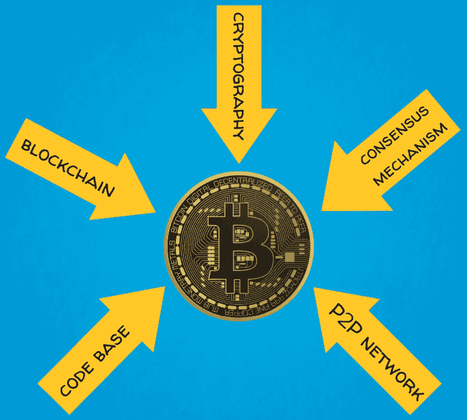
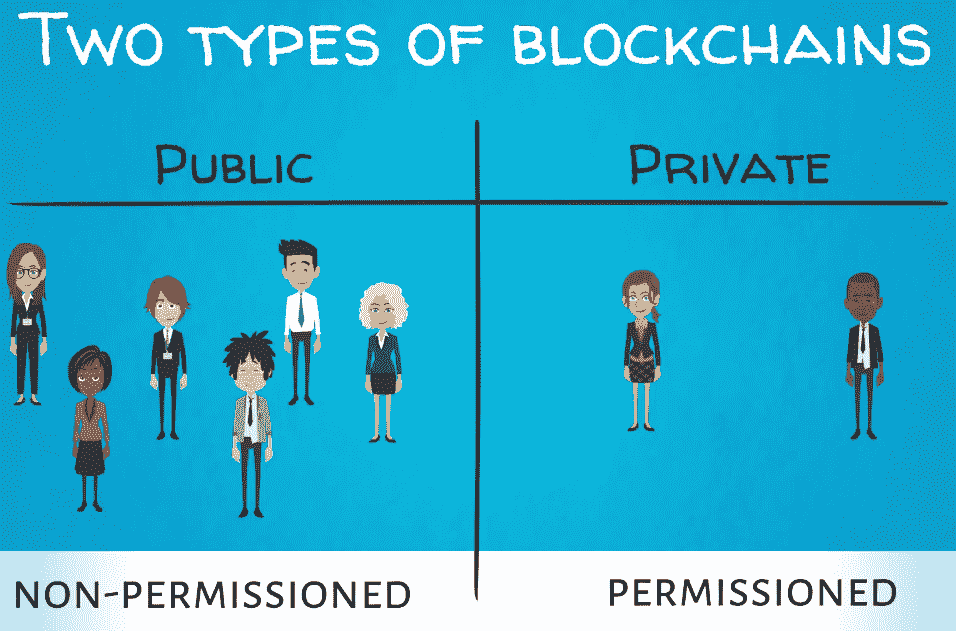
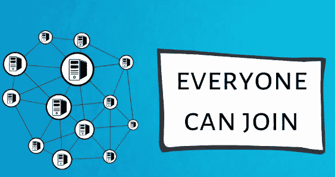
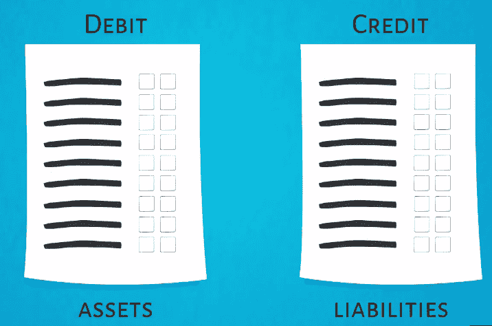

# 比特币的五大力量- #1 区块链

在前面的章节中，我们了解了货币的历史，比特币的兴起，以及围绕比特币的方式和原因。在这一章中，我们将开始我们对比特币的深入回顾之旅。本章将涵盖以下主题:

*   比特币五力介绍
*   第一股力量——区块链
*   不同类型的区块链

# 比特币五力介绍

现在我们知道了什么是重复消费，以及比特币如何解决这个问题，我们准备继续深入，并提供比特币架构和生态系统的整体视图。

比特币的主要支柱是以下基本技术和概念:

*   区块链或**分布式账本技术** ( **DLT** )
*   密码系统
*   共识机制植根于博弈论，在这种情况下，是工作的证明
*   对等网络
*   软件代码库

我们把这个框架称为比特币的五种力量。

这个框架可以在下图中看到:

在接下来的五章中，我们将深入研究每个领域的细节，并解释它们是如何结合起来使比特币的机制运转的。请继续关注，因为事情变得越来越有趣了！

# 第一股力量——区块链

最后，我们到了可以直接回答这个问题的时候了，这个问题是每个人都在问的，也是这本书的核心——区块链是什么？

区块链是一个分散的数据库，它分布在计算机网络上，网络中的每台计算机都存储着同一数据库文件系统的相同副本。在金融交易的背景下，这也被称为 DLT，因为分类账是一个会计账簿或财务记录的集合。

在财务方面，我们使用分类账来记录与特定实体相关的所有会计事项。一个公司的银行账户会有一个包含很多很多交易的分类账。每次钱进来或出去，都要在分类账中登记一个新的条目。同样，区块链分布式分类账在多台计算机上保存与一系列交易相关的相同信息，形成一个点对点网络。

# 为什么区块链更好

数百或数千台计算机存储同一个文件的想法起初听起来确实有点奇怪，不是吗？如果你首先想到的是冗余，这并不奇怪。但是这种冗余提供了安全性，并确保在整个系统中没有中心故障点。它防止坏人企图操纵系统。

这反过来又提供了消除任何集权的机会，或者换句话说，减少中间商。这种分散的区块链通过共识机制或算法工作。有不同类型的共识算法，我们将在本书的后面讨论主要的算法。

目前，重要的是要理解这些共识算法使不同的节点(基本上是网络中的参与者)能够验证新的交易，并保持分类账最新状态的统一视图。

# 区块链是如何运作的

在新的交易被验证之后，它们被排序并分组到块中，然后这些块被链接到先前的块。每个新块都是在按时间顺序排列的最后一块的基础上构建的。

每个块都是一种包含信息的数据结构，更准确地说，是包含交易记录的数据结构。一般来说，分布式数据库可以包含任何类型的数据，不仅仅是金融或经济数据，但区块链的安全性和设计使其特别适合用于价值交换。因此，区块链是价值互联网或货币互联网的说法。

交易一旦放在区块链上，通常是不可逆的，它们的记录是永久不变的。

新数据块以固定的时间间隔创建，并带有时间戳。每一个新的区块都与之前的区块链相连，因此有了术语**区块链**。

我们应该注意到，在最初的白皮书中，Satoshi 从未提到过区块链。他主要将这项技术称为工作证明链。他最接近说区块链的话，是用了一连串或一连串街区中的下一个街区之类的短语。区块链这个词是由早期的比特币公司推广的，比如 [blockchain.info](https://blockchain.info/) 。

接下来，我们将更深入地探讨为什么区块链有潜力彻底改变金融和工业世界，以及它如何改善贸易伙伴之间的沟通和信息不对称。

# 不同类型的区块链

区块链技术的有用性来自它的安全性、不变性和透明性。所有节点都可以随时同时访问存储在数据库中的更新和验证的信息。这些特性支持巨大的潜在金融和工业应用。私营和公共部门都可以从区块链技术中受益。以下章节将广泛关注这些应用，以及区块链如何改变世界各地的工业和商业。

在我们继续之前，我们应该提到，区块链可以大致分为两大类:

*   公共或无需许可的区块链
*   私人或特许区块链

这可以从下图中看出:

这种区别归结为谁拥有网络基础设施。这类似于互联网和企业内部网之间的区别。

# 公共块链

第一种是公共网络，每个拥有合适硬件和软件的人都可以加入、支持和使用。比特币区块链就是这种情况，其他大多数公共加密资产也是如此。在这里，权力下放的好处最为突出:

# 二等兵区块链

第二种类型由一个组织或财团拥有，只对其成员或任何有权限访问它的人开放，这是由看门人授予的。这更接近于集中式数据库，尽管它仍然是一个分布式计算机系统。

许多大型金融机构和其他公司正在积极开发这种专用区块链，以简化他们的操作，并从区块链体系结构带来的效率中受益，同时仍然保持他们内部操作所需的隐私。

# 区块链的价值

我们已经看到，在分类账中记录信息和组织信息类似于会计系统。从技术角度来看，区块链是一个非常复杂的会计系统，但仍然是一个会计系统。

区块链分布式分类帐是由整个计算机网络存储和维护的，而不是在一台计算机、服务器或一张纸上。这是创新的真正要素。如果你仍然不相信区块链提出的价值主张，考虑一下我们今天所知道的会计系统自 15 世纪就已经存在的事实。

对，没错！复式记账法是由卢卡·帕乔利在 15 世纪引入的。它基于这样一个想法，即我们对交易的每一方都有两种影响:借方和贷方。这形成了公司资产负债表的基础，资产负债表是资产和负债的分类账(换句话说，公司拥有什么，欠什么)。通过编纂这些规则，Pacioli 提供了急需的秩序和工具，使企业能够有效地扩大规模，并跟踪和交流其所有的财务信息。下图对此进行了说明:

随着时间的推移，经济交易的复杂性增加了，商业企业和政府机构会发现拥有一些新工具很方便。在帕乔利的时代，商业审计是每天定期进行的。现在情况不再是这样了。在当今企业运营的规模下进行实时报告是不切实际的，至少不是以传统的方式。这种问责制的缺乏导致了许多引人注目的企业灾难和破产。我们都听说过安然、世通和伯尼·麦道夫的庞氏骗局，仅举几例。

区块链可以改变这一切！凭借其透明性、安全性和不变性，它可以向利益相关方和监管机构提供几乎实时的审计报告。试想这样的技术能给世界带来多大的效率和更进一步的进步！

# 区块链可以派上用场的领域

想想银行系统的现状。目前，所有银行都必须对每一个客户进行仔细的尽职调查，以防止金融犯罪，如洗钱和资助恐怖主义。这项要求被称为**了解你的客户** ( **KYC** )，需要每家银行的大型团队花费大量时间和纸张处理。每家银行都单独进行 KYC，因此，如果同一客户与不同的金融机构有业务往来，这个过程可以重复多次。想象一下，如果一群银行共享一个私人区块链，每个客户只登上一次，所有各方都可以信任其中的信息，这一过程会得到怎样的优化。监管机构和其他政府机构也可以随时访问和审计这些信息。

我想到的另一个简单的例子是证券交易和结算。目前，这一过程涉及多个步骤和中间环节，因此既昂贵又耗时。当买方和卖方想要交易证券，例如股票时，他们需要证券交易所、票据交换所以及通常的经纪自营商的参与来执行这样的交易。所有交易信息也必须严格记录，并可供监管审计使用。所有涉及的步骤至少需要两到三天，直到交易完成，这意味着买方收到了股票，卖方收到了钱，一切都记录妥当。所有这些过程都可以在区块链上简化，从而可以在几分钟内同时进行交易执行、清算和结算。此外，监管机构可以随时检查交易记录。

这些只是展示区块链技术可以简化金融部门的一些使用案例的几个例子。区块链技术的各种实现可以适应不同的目的、目标和行业。

# 摘要

在这一章中，我们了解了区块链，它是如何工作的，为什么它很重要，以及它在哪里可以用来改善我们的日常生活。在下一章，我们将了解比特币五大力量中的另一个——密码学。