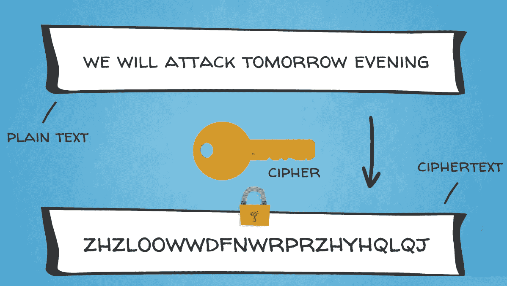
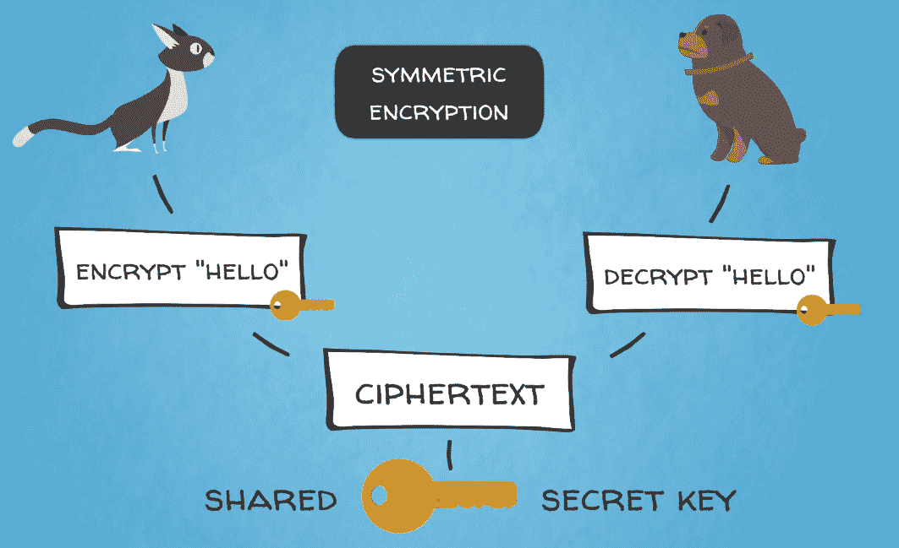
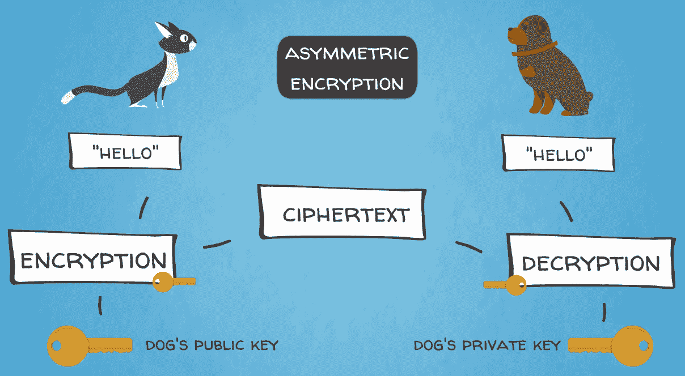
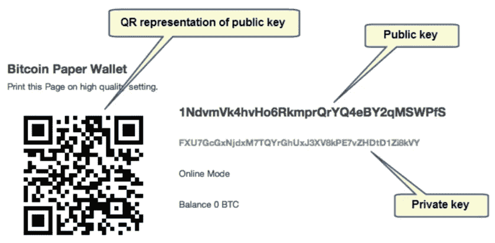
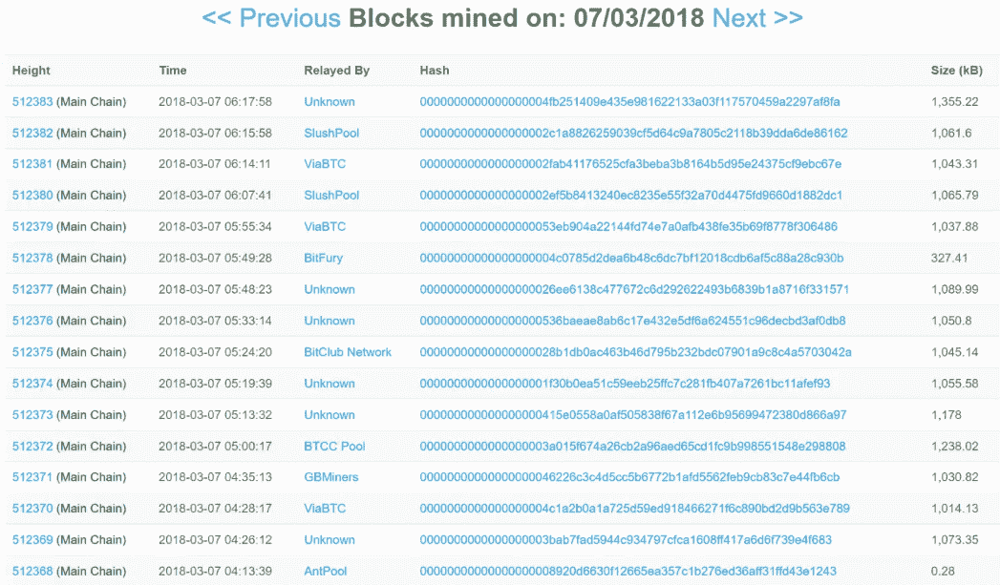
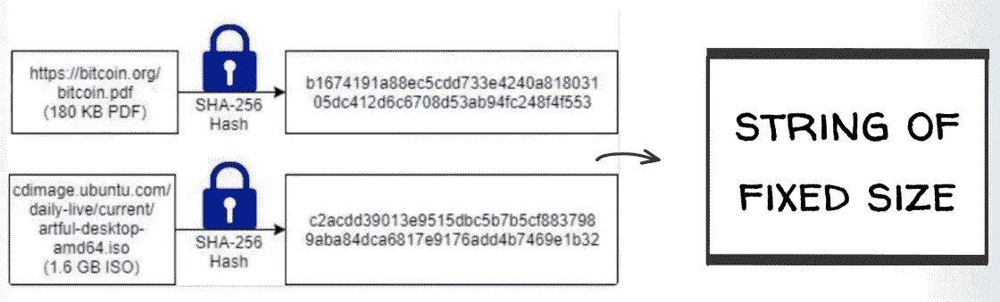

# 比特币的五种力量- #2 加密技术

在这一章中，我们将学习所有关于加密技术的知识，以及它是如何随着时间的推移而发展的。我们将了解加密技术如何影响互联网的各个方面。我们将在本章中讨论以下主题:

*   密码学简介
*   密码术的类型
*   哈希函数
*   数字签名

# 密码学简介

在这一节中，我们将学习什么是密码学，以及它是如何历史发展的。

现在，我们到了加密货币的加密部分，这是一个广为人知的术语，你可能在去年左右听过很多次。这听起来有点神秘，或者，有点…神秘…不是吗？你们中的许多人可能听说过**密码学**这个词，但是有多少人真正知道它包含什么呢？

简而言之，密码学是安全通信的科学。这对于保护私人信息不被未授权的第三方访问是有用的，这些第三方可能会恶意地采取行动。该过程包括两个主要步骤:

1.  第一步是**加密**，它包括对信息进行加密，这样只有预定的接收者才能访问它
2.  下一步是**解密**，解密加密的信息，以便访问和使用它

加密和解密过程通常涉及各种复杂的数学技术。很久以前就已经认识到加密技术的附加值，并且这种技术已经使用了数千年。

# 密码学在早期的应用

众所周知，朱利叶斯·凯撒曾用加密信息与他的将军们交流。以今天的标准来看，他的技术很简单；他使用的字母在字母表中位于指定字母之后的三个位置。例如，字母 ABC 将由 DEF 表示。事实上，这种加密方法被广泛称为**凯撒密码**。

另一个使用密码学的著名例子，具有很高的历史意义，是德国工程师 Arthur Scherbius 在第一次世界大战结束时发明的 Enigma 机器。它在 20 世纪 20 年代早期商业化，德国军队不久后采用它，以保护其军事通信。恩尼格玛机有将近 159 种不同的字符和数字组合(更准确地说是 158，962，555，217，826，360，000)。恩尼格玛密码在当时被认为是无法破解的，并在二战期间给了德国军队优势。然而，由杰出的英国数学家和早期计算机科学先驱艾伦·图灵领导的团队成功破解了英格玛密码，这帮助盟军赢得了战争。这些事件在 2014 年的电影*模仿游戏*中重现。我们将在[第 9 章](09.html)、*以太坊如何将区块链的想法提升到下一个水平*中进一步提到艾伦·图灵的天才以及他对现代计算机科学的影响，在那里我们将讨论下一代区块链技术——区块链 2.0。

接下来，我们将继续学习密码学，并提供一些重要的定义。

# 密码术的类型

现在，我们将介绍一些重要的概念，帮助您理解加密在区块链世界中的作用。

密码是用密钥加密和解密的。这些密钥基本上是信息或参数的秘密片段，通常看起来像字符串。请考虑使用密码或通行短语来锁定和解锁对加密消息的访问。这些实际上是加密算法的关键，有助于将普通信息(称为**明文**)转换成难以理解的文本(称为**密文**)，反之亦然。如下图所示:

有两种主要类型的加密技术:

*   **对称**(也称为**密钥加密**):这是一种加密技术，加密和解密都使用同一个密钥。这可以从下图中看出:

*   **非对称**(也称为**公钥加密**):这是一种加密技术，用于加密的密钥不同于用于解密的密钥。这可以从下图中看出:

第二种类型的加密技术是公钥和私钥对，用于提供比特币和其他加密货币的安全性和隐私性。实际上，比特币区块链是世界上最大的公钥加密技术的民用部署。只有美国国防部更多地使用这种技术，这说明了它的优点。

# 比特币中使用的加密技术

几种加密技术用于保护比特币区块链，包括:

*   公钥和私钥
*   哈希函数
*   数字签名

任何曾经使用加密货币进行交易的人都应该熟悉密钥的工作原理。每个用户都有一对密钥(一个公钥和一个私钥)，这样就可以在网络上进行交易。你可以在下面的截图中看到比特币中公钥和私钥对的一些例子:

发送者使用**公钥**来加密关于交易的信息，然后只有接收者使用他或她相应的**私钥**才能解密该信息。公共地址的作用类似于一个帐户，只能接收资金，并且是从公钥派生出来的，可以公开共享。私钥必须被安全地存储，决不能被泄露，因为只有它才能在区块链上访问用户的资金。

如果私钥丢失，对资金的访问将永久丢失。区块链上没有密码重置功能。用户需要负责正确地存储和备份他们的私钥，因为在网络上没有一个中央机构可以撤销放错地方的事务或恢复私钥。您需要确保理解私钥丢失的含义，并采取所有可能的措施来避免它。你应该像对待任何实物现金、黄金或钻石一样对待你的比特币或其他加密资产的私钥。这里的区别在于您可以备份您的私钥，因为它是一个可以复制的字符串。因此，您可以将其打印在纸上，保存在 USB 记忆棒上，或者使用称为硬件钱包的特殊设备，如 Ledger 或 Trezor，它们可以安全地存储您的私钥。

接下来，我们将探索加密技术在比特币中的另一个主要应用——加密哈希函数。

# 哈希函数

在前面几节中，我们说过所有节点都存储区块链数据库的相同副本，不是吗？

这无疑会导致大量的数据存储和冗余。但是，为了获得一个真正去中心化的、没有任何中间人的点对点系统，这是我们必须付出的代价。

此外，数据集的大小可以不同，一些块可能有 200 个事务，其他块可能有 500 个事务，而其他块可能有 1，000 个事务。所有这些事务通常还在它们包含的信息的大小上有所不同，以千字节为单位。比特币区块链协议中唯一的容量限制是每个区块的大小，自 2010 年以来一直是 1 兆字节。随着比特币软件的最新升级，它最近被有效地修改为 1.4 MB。但是同样，块大小可以在该限制范围内变化。你可以在 [blockchain.info](http://blockchain.info) 或其他在线区块浏览器上亲自查看区块的样子。在下面的屏幕截图中，您可以看到一些示例块:

因此，区块链可以从其存储的数据的标准化和合理化中受益。

一种允许我们寻址加密哈希函数的机制，这是保护数据完整性和减小文件大小的有效方法。哈希函数用于将任意长度的输入数据转换为压缩的唯一固定长度字符串(也称为位串)。该输出数据用作唯一的参考代码或数字指纹，以验证某些底层数据集的真实性，而无需实际检查整个数据集。

实际上，这个散列函数是一种数学算法，它将任意大小的数据映射到固定大小的位串(也称为散列)。它被设计成一个单向函数，这意味着该函数不能反向计算和重新计算以得到输入数据。这可以从下图中看出:

如果只有输出，重建输入数据的唯一方法是尝试对所有可能的输入进行强力搜索，看它们是否匹配。蛮力搜索基本上是系统地尝试所有可能的组合来找到解决方案。

哈希函数在工作证明区块链共识算法中被大量使用，我们很快就会看到。

# 数字签名

比特币使用的另一项重要加密技术是数字签名。它们用于验证区块链上交易的来源。它们使接收者能够验证所接收的交易最初是由发送者使用他或她的私钥发送的。这个过程也包括数学计算。惊喜惊喜！

基本上，数字签名是通过数字签名算法处理发送方的私钥而生成的。然后，生成的代码输出被附加到已签名的消息中，其作用类似于签名。它指定消息的发送者。每笔交易都会有一个不同的数字签名，它是通过数字签名算法生成的，以增加安全性。如果不知道一方的私钥，就不可能为该方生成有效的签名。

请注意，我们交替使用交易和消息这两个词，因为区块链上的交易基本上是通过网络广播的消息。当你向另一个人发送加密货币时，你基本上是在向他们发送一条信息。

此外，数字签名的交易消息是不可伪造的，这意味着它们在传输过程中不能被截取、修改或复制。

数字签名也是不可重复使用的，如果算法为每项交易创建一个新的签名，它们就不能从交易消息中分离出来并用于不同的消息。

让我们用伟大的 Satoshi 自己的话来总结这个主题:

“我们将电子硬币定义为一系列数字签名。每个所有者通过对前一次交易的散列和下一个所有者的公钥进行数字签名，并将这些添加到硬币的末尾，来将硬币转移给下一个所有者。收款人可以验证签名以验证所有权链。”

# 摘要

好吧！我们讨论了一些涉及大量多学科科学的重要主题。好消息是，这种科学的大部分已经被 Satoshi 以优雅而有效的方式构建到比特币架构中，因此系统运行顺畅。作为用户，您个人唯一需要注意的是保护您的私钥。请务必确保您完全理解这对您自身财务健康的重要性！

现在，我们准备进入下一个为比特币提供动力的卓越工程解决方案——工作证明共识算法。