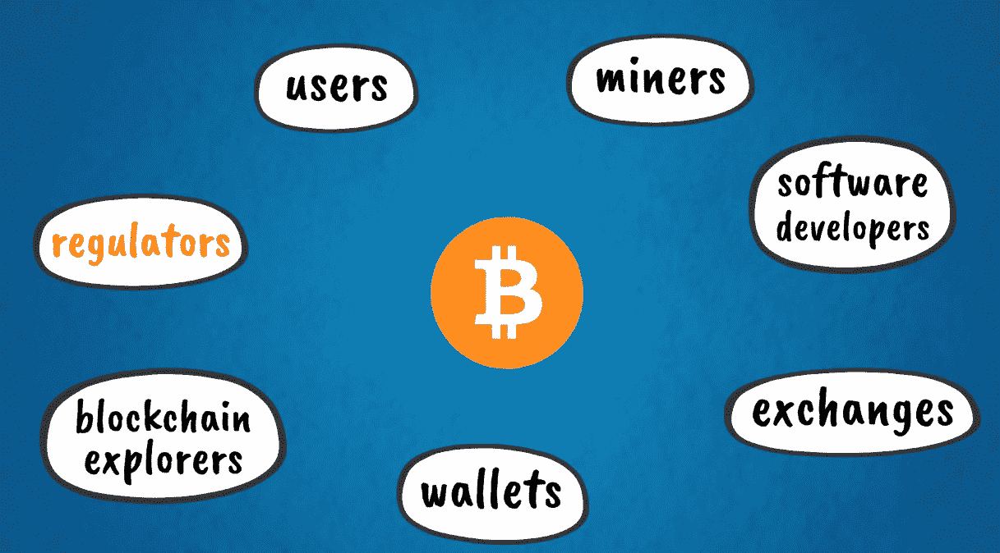
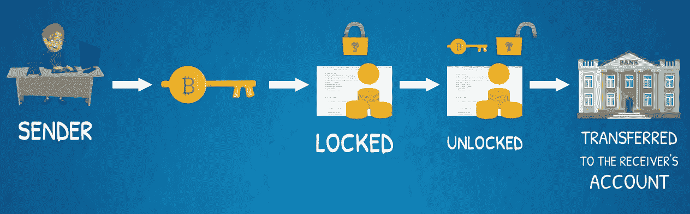

# 比特币的五种力量- #5 软件代码库

在这一章中，我们将了解比特币的最后，也可能是最核心的部分——它的软件代码库。在这一章中，我们将把重点放在软件方面。我们将了解帮助比特币无缝运行的协议和功能。本章将涵盖以下主题:

*   比特币软件代码案例介绍
*   比特币的脚本语言
*   作为应用平台的比特币

# 比特币软件代码案例介绍

我们现在都知道，比特币生态系统由用户、矿工、软件开发商和应用程序组成，如交易所、钱包和区块链探险者。预计其他利益相关者也会越来越多地参与进来。监管机构和政府机构很可能会在未来更加关注生态系统。下图代表了比特币生态系统:

比特币网络的所有参与者都运行软件，软件由软件工程师开发和维护。

比特币最初是作为一种软件协议由中本聪开发的，他制作了最初的代码库。发布后不久，Satoshi 将代码的持续开发和维护交给了一群接受这一想法的软件开发爱好者。这个最初的小组已经演变成了比特币的核心开发团队。也就是说，比特币是一个开源项目，每个人都可以审查代码并提出开发建议。

比特币核心是为比特币提供动力的开源软件代码库。它被称为比特币的参考实现，这意味着它是比特币系统如何运行的主要参考点。它决定了系统的所有方面，如钱包、交易、块验证、节点设置和对等网络中的网络协议。

现在，我们将继续讨论生态系统中使用的关键软件应用。

# 钱包

包含用户私钥的钱包是在区块链上存储资金和进行交易的必要工具。它们是比特币系统最常见的用户界面。在某种程度上，这类似于作为万维网最常见用户界面的网络浏览器及其**超文本传输协议** ( **HTTP** )协议。

所有的钱包都有密钥，可以使用区块链上的硬币。我们在[第 5 章](05.html)、*比特币的五种力量——2 号密码术*中详细介绍了密码密钥。根据存储和管理钥匙的方式，钱包可以分为几种类型:

*   我们可以有桌面钱包，代表在个人电脑和笔记本电脑上安装和运行的软件应用程序
*   我们也可以有手机钱包，这是安装在智能手机上的移动应用程序
*   此外，还有网络钱包，可以通过网络浏览器访问。这些钱包存储在第三方服务器上，类似于一些电子邮件帐户服务，如 Gmail

除了这些软件钱包应用程序之外，我们还可以拥有一些不是基于软件的钱包。这些是硬件钱包和纸质钱包:

*   硬件钱包是专门为安全存储私钥而设计的硬件设备。从外观上看，它们类似于 u 盘
*   另一方面，纸钱包是一种令人惊讶的低技术但非常有效的解决方案，可以抵御潜在的黑客攻击，因为它们只是将密钥存储在纸上。当然，这种纸钱包必须被安全地物理存储，以降低被盗的风险

离线存储密钥的钱包也被称为冷存储。

我们将在这里再次重复这一点，因为记住这一点非常重要:谁控制了私钥，谁就控制了区块链上的资金，因此任何钱包都必须以最大的努力来管理、保护和备份。

钱包可以是存储整个区块链的完整节点的一部分，也可以是只存储自己的交易的轻量级节点的一部分。轻量级节点依赖于它们所连接的完整节点，以便访问完整的比特币区块链。

# 区块链浏览器

除了钱包，另一个常用的软件应用程序是区块链浏览器。区块链探索者是一种工具，用作区块链的搜索引擎。它允许我们跟踪交易、冻结和处理余额。在某种程度上，这类似于谷歌搜索在网络上做的事情。

有几个地方可以充当区块链探险者。最常用的探险家网站之一是 [blockchain.info](http://blockchain.info) 。下面的截图包含了区块链浏览器的快速预览:

# 比特币的脚本语言

现在，让我们来看看比特币的可编程性。一些区块链加密货币被称为可编程货币。

比特币确实是一种可编程的数字货币。它使用一种叫做脚本的编程语言来构建和处理事务。顾名思义，这是一种脚本类型的语言，支持叫做脚本的小程序。它们自动执行一系列任务或命令，否则这些任务或命令将由操作员逐个手动执行。

脚本是一种功能有限的高级编程语言，它也是特定于领域的，这意味着它专门针对其应用领域。比特币的交易脚本被特别设计为限制范围，以便要求最少的处理，并且即使在非常简单的设备上也可以执行。它的有限范围也增强了安全性，因为这为编码错误留下了更少的空间。正如你所想象的，在处理资金转移的系统中的任何错误都是非常昂贵的。

脚本不是图灵完全语言，这意味着它不是通用的，不能用于解决任何问题的程序。当我们在接下来的章节中讨论以太坊时，我们会更多地讨论图灵完备性。

比特币的交易脚本包括驱动交易执行的功能。每个事务脚本都有以下步骤:

1.  当发送者用密钥签署交易时，脚本锁定正在发送的硬币，这些硬币基本上是交易输入。
2.  这些硬币或交易输入只能通过接收者的私人钥匙解锁。
3.  之后，交易输出形式的硬币被转移到接收者的账户，并由接收者的私钥控制。鉴于每个比特币交易的这两个步骤，用于验证交易的最常见脚本是锁定脚本和解锁脚本。

下图更好地说明了这一点:

比特币交易脚本也可能稍微复杂一点，涉及解锁硬币或交易输出的几个条件。以这种方式，有可能构建需要不止一个私钥来解锁硬币的多签名交易。这可用于在一次交易中向多个收款人汇款，或者向拥有多个共同控制资金的利益相关方的实体汇款。例如，一家有多个合作伙伴的公司接收比特币，可能会发现多重签名交易是管理此类转账的一种有用方式。

事务结构化的另一个有用特性是时间锁。脚本中可以包含有时间限制的条件，以便在特定时间或事件发生后的特定时间段解锁资金。

比特币交易脚本中还可以包含其他有用的逻辑条件。其中包括条件从句，比如`IF…THEN…ELSE`。如果您使用过电子表格软件，比如 Excel，或者学习过任何类型的编程，您可能对`IF`和其他条件函数很熟悉。比特币脚本中此类条款的目的和效果是相似的。只有在满足某些条件的情况下，资金才会被解锁。

比特币脚本语言的各种编程功能可以结合在一起，产生比简单支付更复杂的条件交易。例如，可以使用比特币脚本对托管账户类型的交易结构进行编程和自动化。

传统的托管账户通常是在双方同意支付时创建的，但前提是满足某些条件。付款人在受尊敬的第三方(传统上是银行)创建一个托管账户，并将资金转移到该托管账户。一旦满足了必要的条件，并且第三方能够验证这一点，它就将资金转移给预期的接收者。

在比特币中，支付条件可以被编程为自动执行交易，而不需要任何第三方代理。

这种逻辑和功能是智能合约的基础，您可能已经听说过。当我们研究以太坊时，我们将更详细地讨论智能合约，以太坊将智能合约带到了下一个级别。

# 作为应用平台的比特币

我们可以从另一个角度看待比特币——作为一个应用平台。

比特币区块链的主要特征，如可编程性、透明性、不变性、完整性、可问责性、可审计性、分散共识、时间戳、安全性、直接点对点互动及其开源性质等，可以实现支付之外的广泛应用。

比特币最初被设计为一种支付系统，但支持它及其架构的基线技术开辟了更广泛的使用案例。它的组成部分不是账户、余额、支付和钱包。这是一个相当用户友好的应用程序界面。以类似的方式，可以在比特币区块链上构建其他用例及应用。

让我们来看几个例子。

# 资产注册

比特币的区块链属性——数字公证和资产登记——使其成为证明所有权的完美系统。区块链技术可以成为房地产产权登记册、股东登记册和其他投资证券登记册的合适和高效的解决方案。它可用于登记任何种类的资产或产权的所有权和转让，包括无形财产，如商标和知识产权。这种实现可以通过单独的专用区块链来实现，但也可以使用比特币区块链。

比特币区块链比其他任何区块链都有一些明显的优势——它是最安全、最不可变、最分散的。这是因为它是第一个也是最重要的成功运行的公共区块链，并且拥有最大的计算资源池来保护其分散的共识系统。通过这种方式，除了比特币等内在资产之外，区块链以外的资产也可以数字化并在其上交易。

贸易融资和众筹活动是比特币的另一个可能用途。这种应用通过区块链的托管、可编程性和智能合约功能来实现。交易脚本可以结构化，因此资金在特定条件下释放，这些条件可以是有时间限制的或者取决于实现特定的里程碑。

假设欧洲的一家零售商想要从中国进口和销售商品(例如，消费电子产品，如电视、冰箱、微波炉等等)。零售商从制造商处订购商品，然后需要将商品装上货船，送往欧洲。这项交易的双方都需要安全和保证，他们会得到他们所期望的。船舶从中国运送货物到欧洲的旅行时间约为 1 个月。这增加了交易对手的风险，其中一方可能无法获得其在价值交换中的公平份额。从供应商的角度来看(在这种情况下，是中国制造商)，在他们将商品装船之前，他们需要确信他们会得到付款，因为在这一点上，运输成本开始产生。在运输过程中，商品也有被盗或以其他方式受损的风险。从买方(欧洲零售商)的角度来看，他们需要确信在向供应商付款之前，他们会收到安全完好的商品。

这种类型的国际贸易交易目前由可信任的第三方管理，例如银行。国际银行提供贸易融资服务，如托管账户和信用证。该系统目前的工作方式是，买方将支付给卖方的资金存入银行的托管账户。然后，银行向供应商签发信用证，保证资金到位，并在成功交付和收到货物后发放。下图对此进行了总结:

您可能会看到这个过程是如何通过区块链上的一个智能合同实现自动化的。这种新的技术范式将使这种交易更加便宜和高效。单一的技术接口将促进买卖双方之间的直接互动，从而消除中介机构作为看门人的任何潜在寻租行为。此外，该接口可以是公共的开源技术，如比特币区块链，它不受任何单一第三方控制或拥有。

# 众筹

众筹用例可以通过智能合同实现，在达到某些里程碑或目标时向被资助的项目释放资金。这可能是 Kickstarter 或其他现有初创企业融资平台的一个可行的分散式替代方案。同样，比特币区块链可以提供交易协议基础设施，以实现第二层技术和用户界面等解决方案。

这些不仅仅是假设的用例及应用。有些项目已经开发这种解决方案好几年了。一个这样的应用叫做**彩色硬币**。该术语来自于对名义数量的比特币进行标记或着色，以表示比数字货币本身更多的东西。正如我们所讨论的，彩色硬币可以作为任何一种资产、商品或财产的所有权凭证。他们使用比特币交易脚本来编码和存储与此类其他资产或财产相关的额外数据。这些附加数据被称为**元数据**。当通过在比特币交易中插入相关代码来创建或发行彩色硬币时，这将在比特币区块链上注册外部资产，并创建带有时间戳的资产 ID。当这种彩色硬币在比特币区块链上交易时，这有效地转移了与彩色硬币相关联的外部资产的价值和所有权。

另一个类似的项目是交易对手协议。它是建立在比特币之上的二级协议层。与彩色硬币类似，它可以实现所有权的数字化和任何类型的外部资产的转移。它还具有分散的资产交换和智能合约的特点。反过来，交易对手协议可以作为其他应用程序的平台，利用其额外的功能和底层比特币区块链的安全性。

# 摘要

我们已经到了这一章的结尾！现在，你应该能体会到比特币是一个多么独特的系统。这是第一个也是最重要的一个去中心化数字货币和点对点支付系统的实现。概括来说，推动比特币的五种力量如下:

*   区块链
*   密码系统
*   工作证明一致性算法
*   P2P 网络
*   软件代码库

所有这些创造了强大的网络效应，并随着比特币社区和生态系统的增长而进一步加强。随着越来越多的用户采用、更多的应用和使用案例，网络的价值不断增长，这反过来又刺激了进一步的开发和创新，从而带来更高的未来增长潜力。

我们从技术的根源开始了我们的比特币之旅，并回顾了它的成功推出和演变。我们继续研究更复杂的概念和相关应用，比如智能合同和数字产权。我们可以将比特币称为区块链 1.0，因为它是这项技术的第一代，它开启了这场新的工业革命。

现在，是时候继续前进，看看以太坊是怎么回事了。