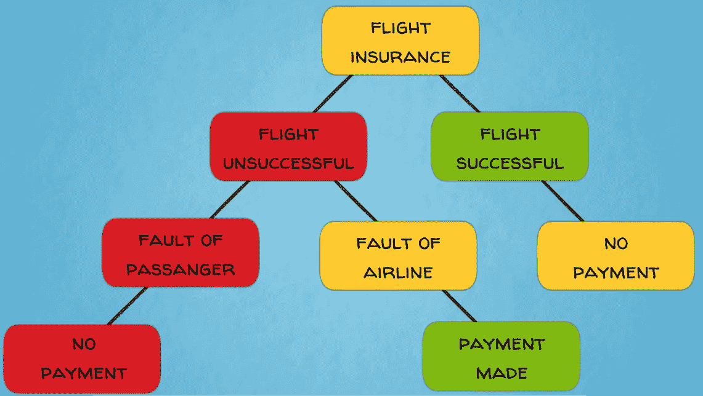
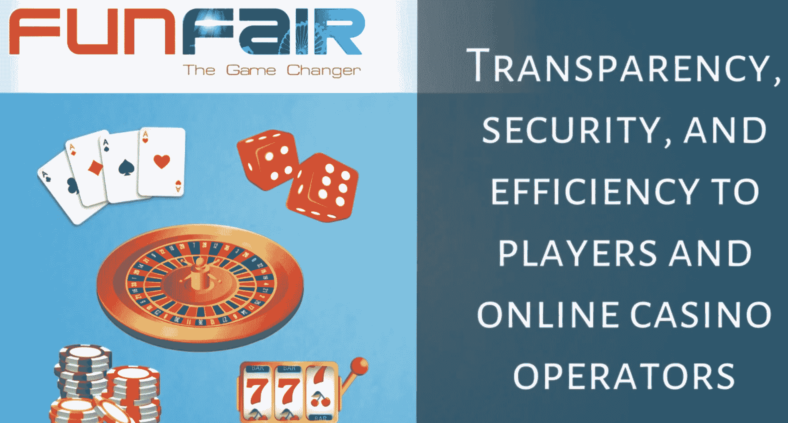
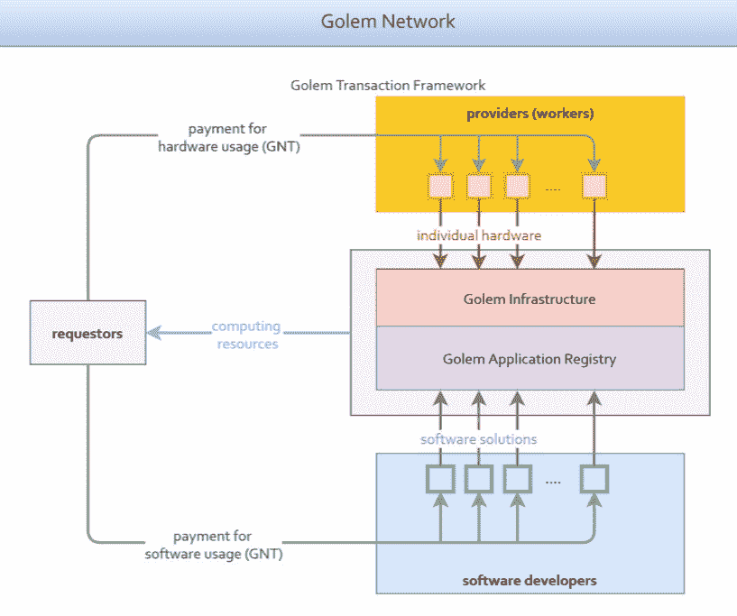
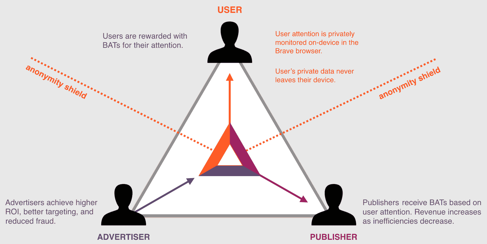
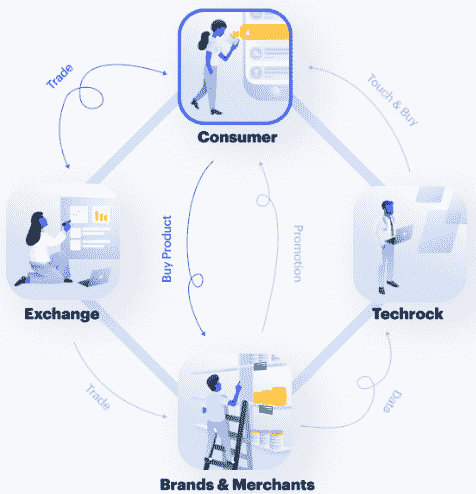
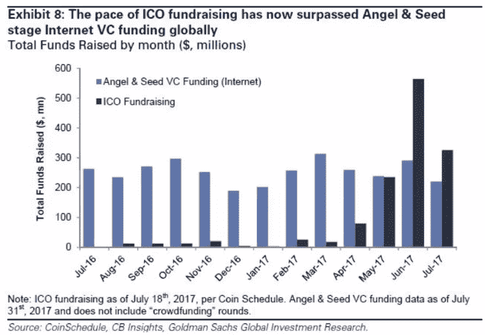
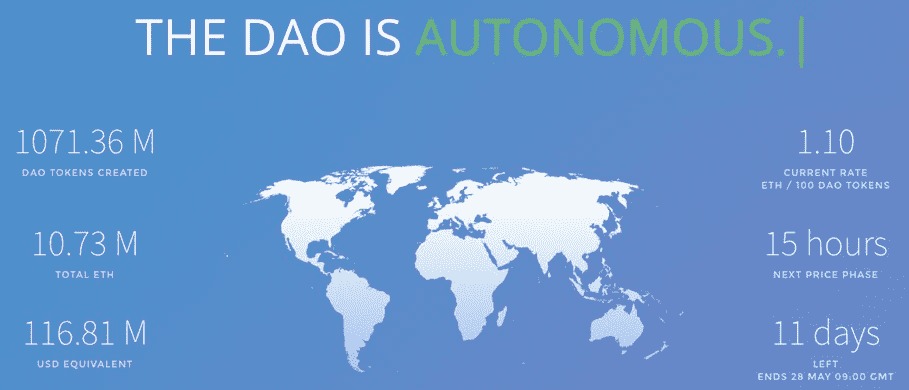

# 以太坊——分布式应用的全球平台

在这一章中，我们将讨论以太坊，我们称之为区块链 2.0。您很快就会发现，以太坊凭借其完整灵活的编程语言，将智能合约和智能资产提升到了一个全新的水平。这开启了更广泛的机会和未来概念，如分散的自治组织，这些组织可能在没有太多人类参与的情况下自动管理。尽管如此，区块链的基础架构仍然与比特币相似。这凸显了比特币区块链已被证实的技术突破和基础性重要性。

尽管如此，区块链空间正在经历大量的开发和持续的创新，所以我们应该期待更多有趣的项目出现。本章将涵盖以下主题:

*   基于以太坊的分散式应用
*   以太坊如何工作
*   分散的自治组织

# 基于以太坊的分散式应用

我们已经了解到，比特币是第一个为点对点支付设计的公共区块链系统。这是卓越的加密资产。

以太坊使区块链科技更进一步，目标是成为一个全球分散计算平台。它开创了第二代公共区块链技术。以太坊的目标是雄心勃勃和进取的:它的目标是在区块链上实现一个分散应用程序的大型生态系统，从而创建一个更加分散的万维网版本——一个被称为 **Web 3.0** 的项目。

好吧！那么，这些分散的应用程序会是什么样子呢？

# 分散式应用的类型

我们可以大致区分以太坊白皮书中概述的三种主要应用类型。

第一种是纯粹的金融应用，通过智能合约提供复杂的金融产品和解决方案。其中包括保险、金融衍生品、贸易结算托管账户、金融信托和众筹。这类应用程序的一个很好的例子来自一家名为 Etherisc 的公司，该公司正在开发基于以太坊智能合同的保险单。他们有一个飞行保险的工作产品，在航班延误或取消的情况下，自动向乘客支付保费。该解决方案为客户带来了明显的优势，因为一旦发生覆盖范围触发事件，他们就可以自动支付保险费，没有任何延迟。通常情况下，为延误或取消的航班获得退款是一个繁琐而漫长的过程，受到官僚主义的困扰，可能会拖上几个月甚至几年。我们都知道航班经常会出现准点问题。因此，Etherisc 为客户带来了清晰而有说服力的价值主张，而航空公司和传统保险公司通常不会公平对待这些客户。这个新的解决方案由以太坊提供支持。

您可以在下图中看到 Etherisc 的保险智能合约的业务逻辑:

另一个主要类别的应用程序是具有某种金融角度的应用程序，可能涉及在平台上使用货币，但也有大量的非货币成分。它们可以用于游戏、赌博、预测市场，以及任何产品或服务的分散式点对点市场。其中一个基于以太坊的应用是 Fun Fair。它提供交钥匙的网上赌场技术，可以被任何人、任何地方用来创建一个网上赌场的白标解决方案。在区块链和智能合约的帮助下，Fun Fair 为玩家和在线赌场运营商带来了透明度、安全性和效率:

关于点对点市场，一些主要的用例包括分散的数据存储、计算、网络托管、电力交易以及媒体和内容分发平台。你能想到的几乎任何类型的资源和市场都可以从点对点的共享经济中受益。

例如，假人和 SONM 等项目正在建设基于以太坊的备用计算能力的分散市场。他们的愿景是让分布式平台上的参与者能够共享和交易未使用的计算机处理能力。

这个概念类似于 Airbnb 通过出租未充分利用的房地产平台创造的共享经济。通过这种方式，**假人**和 **SONM** 旨在创建一个世界范围的超级计算机网络，利用遍布全球的闲置个人电脑。多余的计算能力可以被需要运行大量计算的科学家、企业或消费者使用，而这些资源的提供者可以得到回报。所有交易都通过智能合约实现自动化，并受益于直接和分散的点对点交互，从而为用户实现最大价值。所有这些经济活动都受益于以太坊区块链的安全性和可编程性。下图显示了假人的流程:

按照类似的逻辑，Power Ledger 和 WePower 正在为电力交易和可再生能源项目融资建立分散的点对点平台。两个平台都运行在以太坊上。

另一个有趣的项目， **Substratum** 正在构建一个基于以太坊的抗分散审查的对等网络托管平台。这个平台处理网络安全和网络中立的重要全球问题。网络中立是指互联网上的所有数据都应该被**互联网服务提供商** ( **ISP** )公平平等对待的原则。这里，虚拟主机的备用计算机资源提供商通过区块链的交易获得回报。

另一个有趣的例子来自于**基本注意力令牌** ( **蝙蝠**)。这个项目为广告业引入了一个创新的概念，即分散的广告市场。它为所有相关方——广告商、出版商、*和*消费者——提出了一个卓越的经济模型。该项目由 Brendan Eich 领导，他是 JavaScript 编程语言的创始人，也是流行的网络浏览器 Mozilla Firefox 的联合创始人。这个解决方案使用以太坊区块链上的智能合约来标记和交易消费者对在线广告的注意力，就像任何其他商品一样。BAT 平台使用其本地令牌和智能合同在广告生态系统中分配价值。Brave browser 是这个系统不可或缺的一部分——它可以阻止第三方广告和追踪器，并使用嵌入式和透明的机器学习算法来衡量用户对在线内容的关注度。用户资料受到匿名协议和功能的保护，但仍然为平台上的定向广告提供有用的数据。用户因关注而获得本地令牌奖励；换句话说，他们通过观看广告获得报酬。这是一个完全颠覆性的概念，因为到目前为止，还没有一个奖励机制让消费者将他们对广告的关注货币化。平台上没有中间人，如数据经纪人，他们通常收集个人信息，汇总信息，建立消费者档案，并将其出售给广告商，从而将人们的个人数据货币化。省去这样的中间商为消费者、出版商和广告商创造了效率和价值。BAT 的智能合同自动分配生态系统中的价值流，如下所示:广告商将原生令牌中的付款与广告一起发送给用户，当用户查看广告时，智能合同解锁资金，并将付款发送给用户、Brave 平台和出版商。因此，这些是由智能合同促成的多方交易。该市场受益于以太坊区块链的去中心化、安全性和可编程特性。

下图显示了 BAT 的工作原理:

然后，我们有应用程序，它远离金融服务领域，但仍然受益于区块链架构和智能合约。尽管这些应用程序是非金融类的，但它们平台上的服务仍然需要支付成本，通常是在它们的本地令牌中。这一类别包括供应链管理的应用程序，如跟踪整个行业供应链的组件、信誉系统、数字身份证、投票和分散治理。

你可能还记得 WaBi。这是一个供应链管理的分散应用程序，旨在解决假冒消费品的问题。产品真实性验证由消费者自己完成，他们用智能手机扫描产品上的特殊 RFID 标签。 **RFID** 代表**射频识别**。这些标签贴在供应链中指定原产地的产品上，并与每个产品的唯一数字标识相关联。每次扫描 RFID 标签时，都会检查和验证产品 ID。每次扫描，用户都会获得 WaBi 代币，目前在以太坊区块链上运行。对于奖励交易，产品 ID 验证会在区块链上加盖时间和地理标记。WaBi 代币既作为奖励积分形式的激励机制，又作为购买系统保护的产品的货币。WaBi 已更名为 Tael。下图显示了 WaBi 的工作原理:

关于投票和分散治理应用，一个有趣的例子是 **Horizon State** 。他们用以太坊区块链建造投票系统。投票是通过他们的本地决策令牌完成的，这些令牌可用于各种政治选举、民意调查和股东投票。区块链给投票过程带来的安全和不变性的好处都很重要。

我们已经在 Web 3 的分散化应用程序的广阔宇宙中进行了一次相当长的旅程，您应该对它们有一个很好的了解。现在让我们来看看以太坊平台的另一个重要方面。除了构建分散应用程序的环境，以太坊还为这些项目提供了一个众筹平台。接下来让我们看看这是如何工作的。

# 以太坊和最初的硬币产品

以太坊使得任何人都可以很容易地在其区块链上创建和发行虚拟代币。这是在标准化以太坊智能合约(如 ERC20)的帮助下完成的。通过这种方式，个人、企业或政府可以使用以太坊区块链发行自己的虚拟货币、资产或应用令牌，而无需构建自己的区块链。

基于以太坊发行新的数字代币或硬币的设施刺激了一大批新的初创企业，这些企业在以太坊区块链进行创新并资助他们的项目。资金来源于最初的硬币发行，也被称为代币生成活动。通过这种方式，初创企业可以发行数字代币，这些代币可以在他们未来的平台上换取服务。他们也可以发行代表金融工具的代币，比如股票。这两大类令牌通常被称为实用令牌和安全令牌。这一机制被证明是区块链众筹的巨大推动力。它甚至数倍于传统的早期风险投资，这是初创企业筹集资金的典型方式之一。这可以从下面的截图中看出:

基于以太坊令牌运行 ico 的项目可以快速、轻松地发行令牌，之后可以灵活地将以太坊区块链用于未来的服务产品，或者构建自己的区块链。这是一个商业决定，需要根据具体情况来决定。

出于行业特定的原因或由于可伸缩性问题，一些业务应用程序可以受益于它们自己的专用区块链。以太坊区块链目前没有无限的能力来处理大规模应用所需的所有应用及其交易。以太坊仍然是一项早期和实验性的技术。因此，需要进一步的发展来升级它，使它的网络足够健壮，能够处理一个大型的、分散的应用程序生态系统的所有流量。

应该注意的是，以太坊不是第一个，也不是唯一一个，用于分散应用和 ico 的区块链平台。例如，NEO，被许多人称为中国的以太坊，是另一个这样的平台。甚至比特币也有智能合约功能可以用于此，正如我们之前在讨论彩色硬币和**交易对手**项目时看到的那样。

另一个用于分散应用的平台是 **Mastercoin** ，后来更名为 Omni。Mastercoin 在 2013 年做了自己的 ICO，筹集了价值 500 万美元的比特币，在比特币区块链之上建立了自己的协议层。

使用 Mastercoin 协议进行 ICO 的项目中最著名的例子之一是 MadeSafe，这是一个分布式计算资源(如文件存储和处理能力)的平台。这个应用程序在某种程度上类似于流行的云存储服务，如 Dropbox，Google Drive 或 Amazon Cloud，但它是分散在区块链上的，它出租其网络节点的备用磁盘空间，而不是集中式服务器。

Storj 是另一个分布式数据存储项目。它最初开始基于交易对手协议构建平台，因此依赖于比特币区块链基础设施。后来，Storj 团队决定将应用程序转移到以太坊区块链，并发行了标准以太坊 ERC20 令牌。

另一个名为 **Civic** 的项目正朝着相反的方向前进。Civic 是一个分散的个人身份验证应用程序。他们通过在以太坊上发行代币推出了自己的 ICO，但在 roothnum 的帮助下，他们正在将平台转移到比特币区块链。**根茎** ( **RSK** )是一个运行在比特币区块链之上的去中心化应用的新平台。它旨在将以太坊类型的智能合约与首屈一指的比特币区块链的安全性结合起来。

为了进一步说明这一点，我们可以将分散式应用程序与移动应用程序进行比较。项目可以为他们的分散式应用程序选择平台，就像他们可以为 Android 或 Apple 手机开发移动应用程序一样。Android 和 iOS 是两个独立的平台，有各自的协议和应用商店。任何移动应用程序都可以在两种平台上构建，用户界面可能看起来一样，但每种情况下的应用程序代码会有所不同。

当然，项目总是可以选择构建自己的区块链。Sia 和 **Filecoin** 是另外两个分布式数据存储应用，它们正在构建自己的区块链，而不是使用以太坊或比特币。在接下来的章节中，我们将更多地关注特定应用和特定行业的区块链。

这里要指出的重要一点是，存在各种用于分散式应用程序的区块链平台。他们提供通用技术来开发和启动这样的应用程序。以太坊目前是去中心化应用和 ico 的首要平台。

现在，您应该很清楚什么是分散式应用程序。让我们进一步讨论以太坊创始人所设想的一个更加雄心勃勃的想法:去中心化的自治组织。

# 分散的自治组织

分散自治组织被设想为在区块链以完全自动化、透明和公共管理的方式运作的自治实体。

这些实体也可以称为 DAC。投资者、所有者、员工和其他利益相关者之间的关系，以及这些企业的资产和资源，都是由区块链的智能合同管理的，而不是由法律合同和组织章程管理的。

想象一组智能契约，它们根据组织的使命陈述和一组逻辑规则来合作管理组织。他们可以根据计划自主执行商业策略。他们可以购买资源或服务，雇用人员或机器工作，支付供应商，合作伙伴和员工，开展营销活动，物流，分销，销售，等等，以便为他们的所有者创造价值。嗯，我们还没到那一步呢！但是我们已经有了许多基础材料。因此，我们可以设想设计一个没有经理，只有股东、资金和软件的未来公司，股东将提供资本并直接控制运行日常运营的软件。

“道”目前更多的是一个哲学概念，而不是一种严格定义的商业或社会实体。这是对组织理论和设计的下一步发展的展望，朝着更加分散和自治的方向发展。

可以认为，从比特币开始的所有公共区块链，实际上都在一定程度上代表了道。然而，没有图灵完全编程语言的区块链具有有限的智能合约能力。Dao 需要能够代表复杂的利益相关者关系和业务逻辑的智能契约。

比特币、以太坊和其他区块链协议和系统可以被视为支持 Dao 的创建和操作的通用技术。在这个意义上，Dao 可以被描述为分散的应用程序，其治理和操作在区块链上运行。

这里重要的一点是，对于所有实际的目的，Dao 可以在很少或者没有任何人类参与的情况下运行。至少在理论上，所有行政和业务流程都可以在智能合同中编程。可能只需要人工干预来维护和升级智能算法。

你知道在最近的历史中，许多制造过程已经用机器实现了自动化(例如在高科技工厂中装配汽车的机器人手臂)。Dao 代表了组织管理中的一种等效的自动化。

为了让 Dao 更加自主，未来他们可能会在智能合同中以机器学习算法的形式加入人工智能。这种基于人工智能的智能合同被称为**自主代理**。然而，实现这种高科技的解决方案仍然是科幻小说的领域。

如果人工智能真的找到了融入其中的方法，事情会变得非常非常有趣。例如，机器学习可能使 Dao 能够在没有人类任何帮助的情况下维护和升级自己的软件和硬件。DAOs 的未来将会如何还有待观察。希望我们能避免调用电影《终结者》中的天网或者《黑客帝国》中的史密斯特工...

# 刀

关于 DAOs，还有一件事我们需要澄清。2016 年，一个名为 **The DAO** 的项目推出了 1.5 亿美元的 ICO，这在当时是最大的。资金来自以太坊的本地加密货币:以太。道团队收集了 11，500，000 个以太，占当时所有现存以太的 15%。目的是使 DAO 成为一个分散的、自我管理的风险资本基金，没有任何管理层或董事会，代币持有人直接就投资机会和项目的未来发展进行投票:

不幸的是，其智能合同的代码有一些严重的缺陷，最初没有被其开发团队注意到。然而，他们引起了社区的注意，一些专家表达了他们的担忧。尽管有警告，该项目继续进行，在发布后不久，它就被黑客攻击了。大约三分之一筹集的乙醚被转移到黑客控制的账户。为了解决这种情况，核心以太坊开发团队不得不在以太坊软件中进行升级，称为硬分叉，这导致了以太坊和以太坊经典版之间的网络分裂。这就是为什么目前有两个以太坊网络，每个都有自己的本地加密资产和生态系统。它们共享相同的技术基础，至少在硬分叉时代是这样。然后以太坊社区的一部分支持逆转道攻击，而另一部分则不支持，坚持最重要的是保持区块链的不可改变性。考虑到黑客的重要性和后果，社区的大多数人支持硬分叉，因此以太坊最终成为了主链。

少数铁杆区块链主义者坚持维持区块链的 DAO hack 交易，因此他们支持以太坊经典，这是最初的以太坊区块链，拥有整个交易历史，但目前的社区、市值和生态系统较小。从硬分叉开始，以太坊和以太坊经典就走上了各自独立的发展道路。

区分一般的 DAO 概念和称为 DAO 的特定项目非常重要。以后我们会看到更多的道。没有实验就没有创新，实验是一个试错的过程。社区，最重要的是，这些新项目的开发人员，应该吸取教训，尽量避免将来出现这样的错误。

# 摘要

让我们回顾一下关于以太坊的所有内容。

我们首先介绍了 Vitalik Buterin，这位博学多才、富有远见的神童，他在 2013 年 19 岁时提出了以太坊的想法。我们了解到以太坊的关键区别因素是它的图灵完备性。以太坊虚拟机和 Solidity 编程语言实现了一整套智能合约，可以通过编程来完成几乎任何计算机任务或功能。这一强大的创新释放了前所未有的机会，创造了一个在区块链上运行的分散应用程序的整个宇宙。但这也造成了一些软件漏洞和黑客攻击的额外风险，正如我们在 DAO、平价钱包和其他许多事故中看到的那样。希望随着时间的推移和经验的积累，区块链地区的这种网络安全威胁将得到缓解和大大减少。

我们展示了一些分散应用程序的潜在用例的概述，以及一些开发这种应用程序的实际项目的例子。我们还谈到了更加雄心勃勃和超前的 DAOs 概念。

到目前为止，在本书中，我们已经介绍了比特币和以太坊区块链协议，以及在这些协议上运行的各种分散式应用程序。在下一章，我们将讨论一些拥有自己的区块链的特定行业应用。敬请关注我们对区块链技术世界的深入探索！