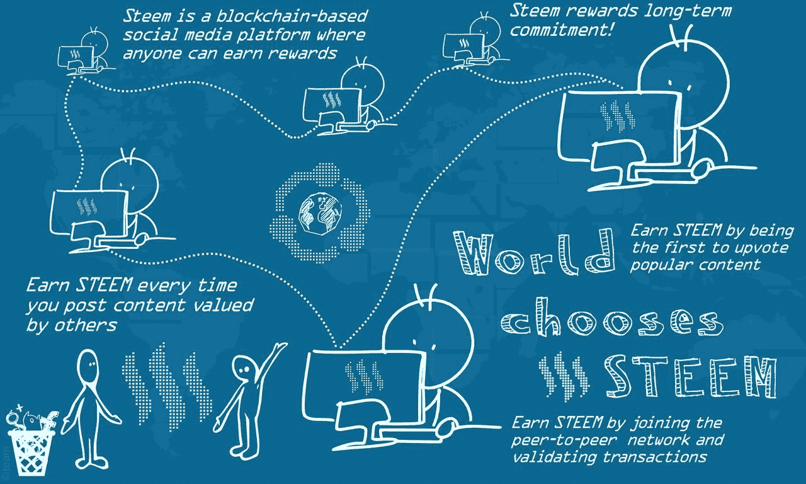
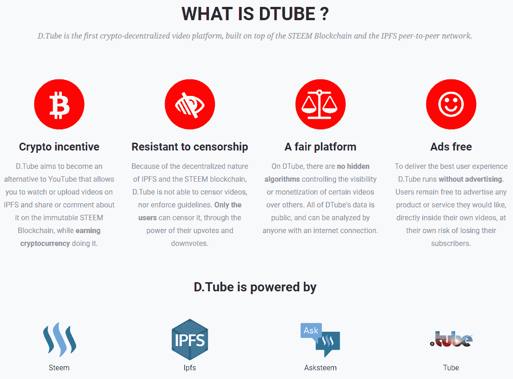
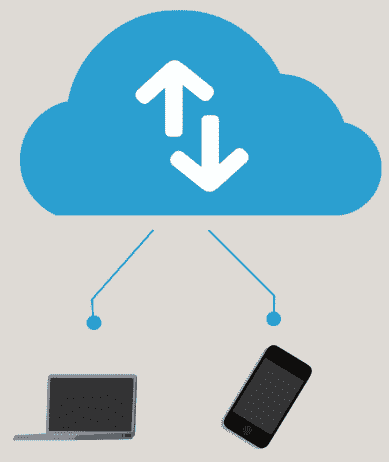
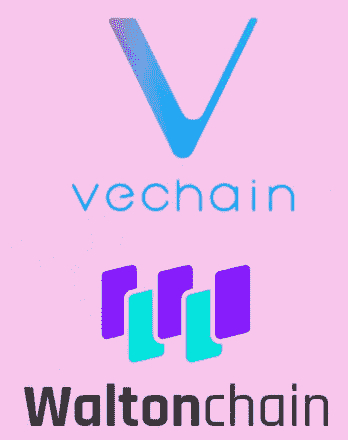
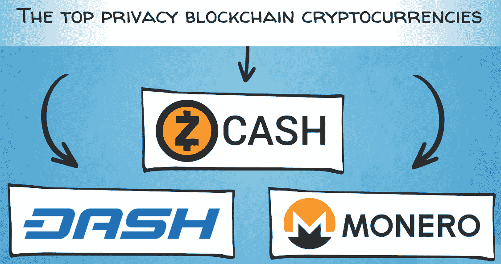

# 区块链侧重于具体的部门和使用案例

欢迎回到我们的区块链之旅！到目前为止，我们已经涉及了很多领域，从货币的历史和为什么区块链加密资产有意义到比特币和以太坊的基础技术。现在你已经对比特币和以太坊有了很好的了解，它们开创了这项技术的第一代和第二代，我们可以继续前进，介绍一些与这些技术相关的其他有趣的项目。

本章将涵盖以下主题:

*   区块链的不同类别
*   特定部门的区块链
*   二等兵区块链

# 区块链的不同类别

正如我们在前几章中提到的，我们可以将区块链分为两大类，这取决于谁拥有它们以及它们的可访问性。

首先，我们有公共区块链，这是开源项目，任何人都可以免费加入这个网络，使用它，支持它，为它做贡献，或者在它的基础上建立业务。

然后，我们有私有的区块链，它不是开源的，只有经过拥有和管理网络的组织批准的用户和实体才能访问。

在这些类别中的每一个中，都有具有通用区块链的项目，例如以太坊；但是，也存在一些特定于应用程序的区块链。通用技术用于提供基础架构和构建块，以便在基础上创建应用程序。例如，你可以引用任何基于以太坊的分散式应用程序。也就是说，它本质上是一个通用的工具箱。

另一方面，定制的区块链或特定于应用的区块链是具有特定于行业的用例的区块链。他们只专注于一个部门或市场，在那里他们建立创新的商业模式，并提供利用区块链技术优势的解决方案。这些区块链只专注于一个领域。也就是说，它们仍然可以是开源的，每个人都可以访问。

# 特定部门的公共区块链

让我们继续，看看几个特定部门的公共区块链项目。

社交媒体领域一个有趣的公共区块链平台是 Steem。它有一个创新的商业模式，激励用户贡献高质量的内容并参与到平台中来。这些激励来自 Steem 的本地加密资产，这些资产在交易所交易，具有真实的货币价值。这有一个简单的理由:优质的内容增加了平台的流量，从而带来更多的用户。一个社交媒体平台的用户越多，它就越有价值。这叫做**正向网络效应**。因此，贡献高质量内容或帮助管理平台内容的成员可以公平分享所创造的价值。

该平台本身是 Reddit 和 Medium 的交叉，后者在特定主题的博客帖子和社会评论方面很受欢迎。像 Medium 一样，人们可以撰写和发布长篇博客，像 Reddit 一样，他们可以在互联网上的任何地方分享内容和链接。帖子被其他用户投票赞成、投票反对和评论。下图详细显示了 Steem 的工作原理:

DTube 将去中心化的社交媒体向前推进了一步。这是一个视频分享和流媒体平台，类似于 YouTube，是作为 Steem 区块链上的一个应用程序而构建的。它的运作原理与 Steem 相同:内容贡献者在 Steem 的原生加密资产中获得奖励，但重点是视频而不是博客帖子。去中心化 YouTube 的主要好处是内容创作者和用户之间的价值分配更加公平，没有恼人的广告，以及抵制审查。下图进一步解释了 DTube:

现在，让我们看看另一个工业应用:供应链管理和**物联网** ( **物联网**)。

# 区块链和物联网

我们已经提到区块链在供应链管理方面有一个用例，我们展示了几个基于以太坊、WaBi 和 Modum 的应用程序。我们可以将这个想法扩展到更广泛的用例:物联网。物联网可以定义为能够自主连接到互联网并相互通信的智能设备网络。下图显示了物联网的流程:

实际上，您应该对这类设备相当熟悉；事实上，其中一个可能就在你的口袋里，你的智能手机。就像我们今天大规模采用智能手机一样(请记住，手机并不总是智能的)，物联网的愿景是拥有智能电表、智能电网、智能汽车、智能家居，甚至智能城市。下一代物联网设备包括智能电表，它可以自动将房屋的用电量发送给公用事业公司进行计费。这是智能家居、智能电网和智能城市理念的一部分，其中各种家用电器和基础设施可以通过互联网相互通信，并自主执行任务。其他例子包括可穿戴设备、心脏监测植入物、用于标记和监测动物的芯片、智能联网汽车等等。几乎任何你能想到的物理物体或设备都可以被设计成具有计算智能和互联网连接。物联网设备可以使用各种传感器和技术来收集、测量和传输数据，如 WaBi 使用的 RFID 芯片或 Modum 使用的温度传感器和蓝牙。

其他一些将物联网与区块链和智能合同自动化的安全和不可变记录保持相结合的著名项目包括 VeChain 和 Waltonchain，它们正在推出自己的专用区块链:

所有这些项目都针对不同的垂直行业，如消费品、奢侈品、制药、汽车行业、物流、航运等。他们还以略微不同的方式定制他们的解决方案，使用不同类型的传感器，通用区块链，如以太坊，或他们自己的专用区块链。但是，整体思路和业务应用是一样的；他们都试图通过物联网、区块链和智能合同技术的融合来提供有效和高效的供应链管理解决方案。这是一个有效的**独特的销售主张** ( **USP** )。

我们的区块链应用前景正在逐渐扩大，目前还看不到前景。接下来，我们将讨论关注隐私的区块链技术这一重要话题。

# 二等兵区块链

在这个时代，隐私变得越来越稀有和珍贵。互联网和智能手机等技术为信息发现带来了前所未有的便利和速度。就像所有事情一样，这些发展有其利弊。从积极的一面来看，有用的信息、教育和知识可以迅速传播，并赋予全球人民权力。世界各地传统上因信息不对称而处于不利地位的人们现在拥有了工具，可以为他们提供追求个人发展目标和梦想的平等机会。然而，从负面来看，同样的技术可以授权那些有可疑议程的实体来监视人们，就像乔治·奥威尔在 1949 年出版的经典反乌托邦小说《1984 年的老大哥》。

有恶意黑客闯入中央服务器窃取有价值的私人信息，没有人能完全防范这种情况。几乎所有大型跨国银行、处理个人数据的数十亿美元公司(如益百利)、科技巨头，甚至顶级安全政府机构(如**国家安全局** ( **NSA** )都发生过这种情况。当有一个明确的有价值的目标或失败的中心点时，黑客总是有办法的。

此外，有许多数据经纪人利用人们的个人信息做生意。他们合法与否地收集信息，分析信息，然后卖给任何愿意付费的人——通常是广告商，但也包括政治活动，正如最近脸书和剑桥分析公司的案例所示。

# 区块链如何影响隐私

个人隐私保护和出于更高目的的入侵之间的界限在哪里，是目前公众辩论的热门话题。这是正常的，考虑到我们社会到目前为止所讨论的技术进步。

隐私是一个令人向往的功能，不仅对罪犯来说如此，普通人和企业也是如此，他们不希望自己的个人和机密信息被第三方泄露和利用。鉴于区块链的透明度，许多企业可能不愿意使用它们来开展业务。有许多敏感的业务信息，如与供应商的交易、数量和其他私人供应链细节，以及员工工资，这些信息可能不适合存储在透明、公开的区块链上。这种信息通常作为商业秘密保存，因为它毕竟是重要竞争优势的来源。

因此，在技术推动信息时代发展的同时，保护隐私和降低个人数据泄露风险的解决方案也在不断开发中。这些解决方案主要围绕着密码学。你可能还记得我们从[第 5 章](05.html)、*比特币的五种力量——# 2 密码学*的密码学概述。在这里，我们将看看几个区块链的加密资产，它们在隐私功能方面取得了超越比特币的进步。他们首先关注的是向市场提供优秀的隐私解决方案。

比特币是一种匿名货币，这是一种常见的误解。实际上，它是伪匿名的，因为任何人都可以使用我们前面描述的块浏览器看到所有的事务。比特币交易不会显示用户名，但会显示他们的公共地址，这些地址可以与所有者联系起来。这可以在用户被要求进行 KYC 或者以其他方式披露他们的身份以便进行交易的任何时候进行。这种网络节点可以包括交易所、其他受监管的金融机构、航空公司、电子商务网站或其他商家，它们可以接受比特币支付。

# 处理隐私的区块链加密资产

因此，需要其他解决方案来满足私人交易的市场需求。数字货币很难达到与实物现金相似的隐私水平。但是，当出现问题和市场需求时，解决方案很快就会出现。因此，隐私硬币来了！就采用、资本化和先进的技术创新而言，Monero、ZCash 和 DASH 是最注重隐私的区块链加密资产:

Monero 被广泛认为是具有最强隐私功能的数字货币，这要归功于它使用环签名的加密技术。Monero 的密码术比比特币和大多数其他加密资产更复杂，所以我们不会深入所有的技术细节。但是给你一个想法，比特币的交易是用个人密钥数字签名的，所以任何人都可以看到发送者和接收者的地址，以及交易金额。这证明发送者拥有被转移的钱。它在目的和效果上类似于从你的银行签署一张支票。

另一方面，Monero 的戒指签名描述如下:

指定一组可能的签名者的数字签名，这样验证者就不能知道哪个成员实际上生成了签名。

因此，Monero 中的交易似乎是由大量用户而不是特定用户签署的。环签名仅证明交易是由该池中的某个人发送的，但并未透露具体是谁。Monero 协议在交易的金额、来源和目的地方面允许完全的用户隐私，并且它具有防止重复消费的机制。在这些特性中，它类似于 ZCash 的零知识证明或 zk-SNARKs，我们将在接下来讨论。

ZCash 于 2016 年推出，通过其 zk-SNARKs 协议为区块链市场带来了一种新的隐私技术，称为零知识证明。ZCash 为用户提供了发送常规交易(如比特币)或发送私人交易(除交易有效外，不透露任何信息)的选项。该项目由佐科·威尔科克斯(Zooko Wilcox)领导，他在 20 世纪 90 年代曾是大卫·肖姆斯的 DigiCash 的成员。

DASH 是另一个支持私人交易的区块链加密资产。为此，它使用了一种不同的协议，这种协议基本上将许多事务混合在一起，形成一种大型的多方池事务。通过这种方式，它打乱了每笔交易的不同组成部分，使外部观察者几乎不可能将这些碎片放在一起，并弄清楚谁向谁发送了什么。

# 摘要

你现在了解了隐私的概念及其在商业和日常生活中的重要意义。在这一章中，我们学习了公共区块链以及它们如何影响我们的日常生活。我们还了解了如何将区块链与物联网结合使用来增强各个行业。此外，我们还了解了区块链如何影响隐私并帮助确保交易安全。最后，我们了解了一些加密资产以及它们如何处理安全性。

在下一章，我们将了解区块链企业！敬请期待！