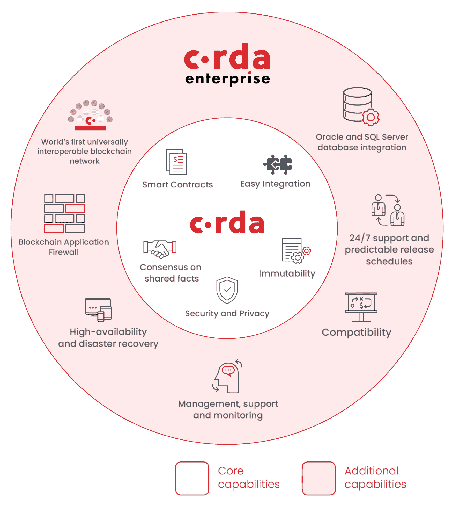
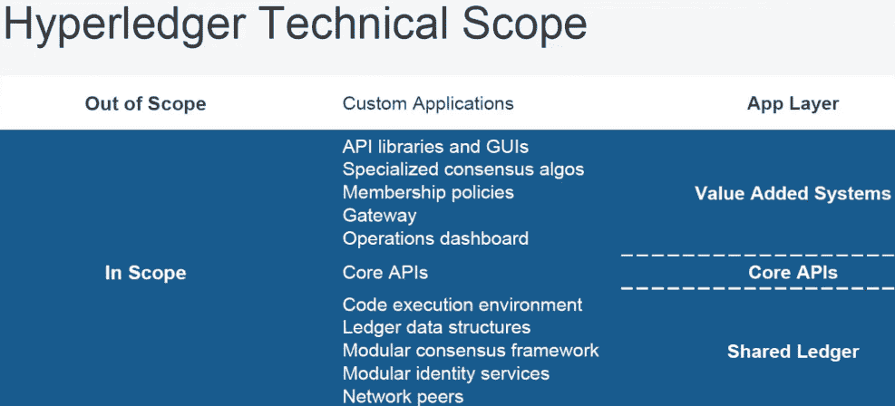
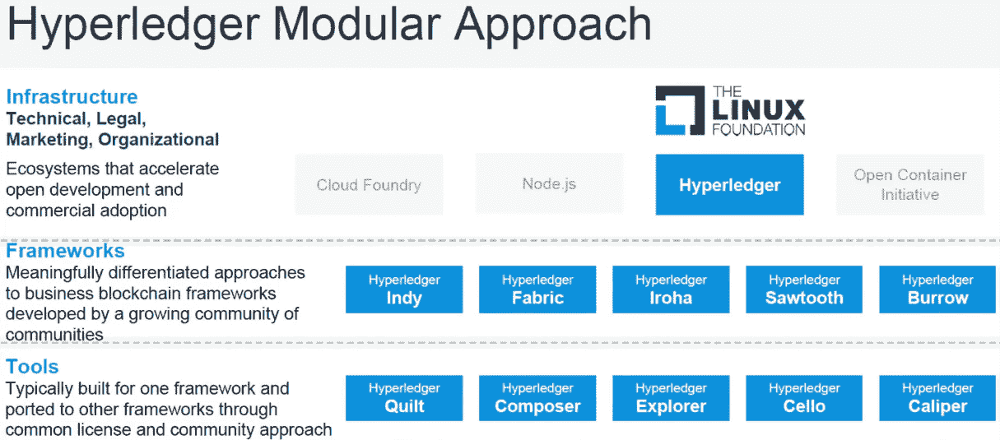
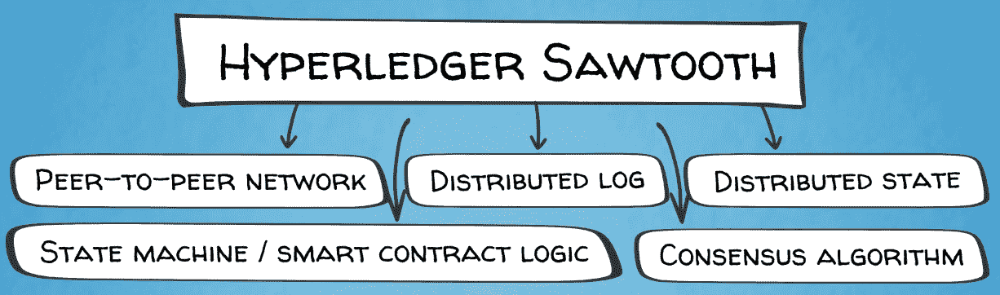
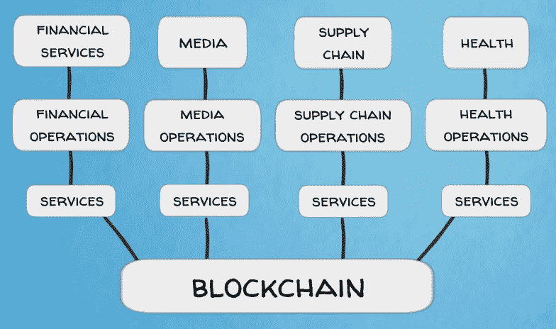
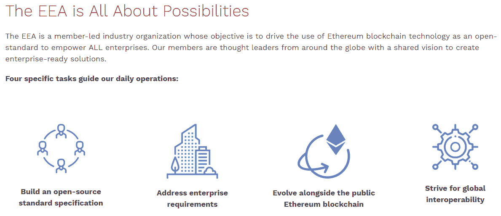
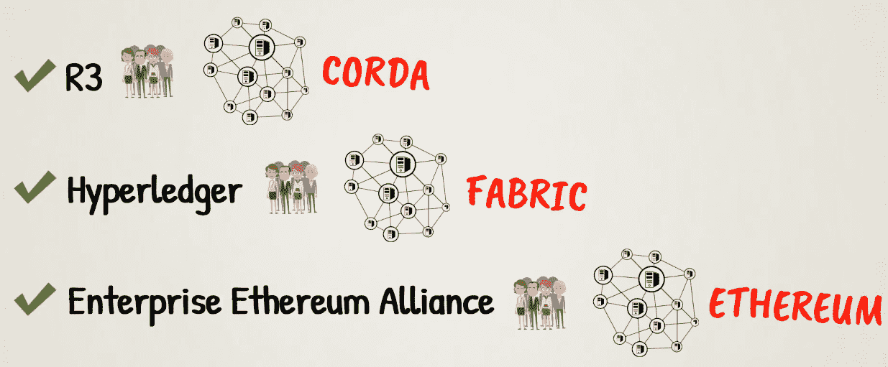
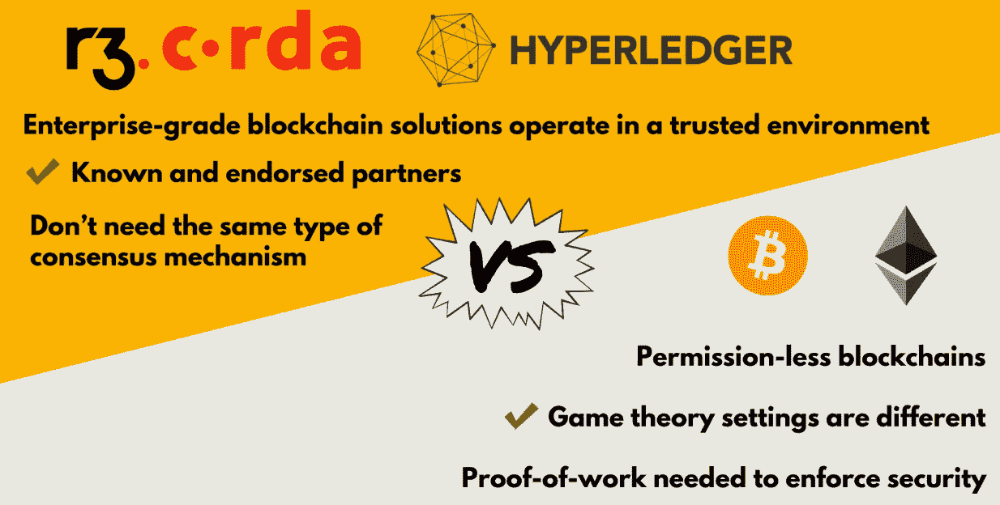

# 区块链企业界

在上一章中，我们了解了不同类型的区块链，如特定行业的区块链和私人区块链。现在是时候描述另一个重要的，但对大多数人来说很陌生的，区块链世界的一部分:私人许可的区块链，或者换句话说，企业区块链。在本章中，我们将讨论以下主题:

*   区块链企业介绍
*   R3 绳子
*   超总帐会计管理系统
*   企业以太坊联盟
*   商务专用区块链

# 区块链企业介绍

企业区块链不同于公共区块链，如比特币、以太坊和迄今为止讨论的其他项目，主要在一个关键方面:接入网络。在公共的区块链，任何人都可以下载一些开源软件，加入网络，并使用它，而在私人的区块链，访问网络是受限制的。公司、政府实体或其他组织可以构建自己的私有区块链来服务于其业务或管理目的。这种专用区块链通常更加集中，在体系结构和功能上更接近于分布式数据库或分类帐。这是因为他们不需要像比特币和其他公共区块链那样的去中心化信任模式。

如果所有的区块链参与者都是已知的，并且已经过预先批准和审查，那么就不需要基于博弈论的复杂的共识算法。网络节点可以很容易地就区块链数据库的最新版本达成一致，因为它们都是同一个组织的一部分，所以它们都相互了解和信任。

正如我们在[第 11 章](11.html)、*中提到的，区块链专注于特定的部门和用例*，公共区块链可能并不适合所有人和所有事。对于许多内部业务流程，私有区块链可能是更好的选择。

如今，区块链技术对于商业、政府和个人用途的价值已被全世界广泛接受。几年来，大多数大型国际银行和其他金融机构一直在开发其内部区块链项目。IBM 等老牌科技公司也加入了这股潮流。同样的情况也发生在航运业的领导者身上，比如马士基，他们对区块链如何优化他们的供应链管理很感兴趣。这些大公司已经发现，发展其区块链项目的最佳方式是通过产业联盟、财团或相互合作。这可能涉及到工业孵化器，初创团队与企业合作开发工业应用的解决方案。接下来，我们将了解一些最著名的跨行业区块链发展财团。

# R3 绳子

R3 于 2015 年由九家银行组成的联盟成立，旨在为金融业开发区块链基础设施。2018 年，它已发展到包括 200 多家金融机构。银行相信，区块链技术可以让他们的运营更快、更高效、更透明，从而为他们节省资金。他们正竞相利用将产生新收入的技术开发产品，全球各银行已为区块链的产品提交了数十份专利申请。

R3 的主要项目是 Corda，一个区块链，或者他们称之为**分布式账本技术** ( **DLT** )平台，专门为受监管金融机构之间的金融协议而设计。Corda 与我们已经熟悉的公共区块链(如比特币和以太坊)的主要区别在于，Corda 仅基于单个交易各方之间的共识，而非整个网络的共识。Corda 交易由交易各方进行验证，而不是由更广泛的不相关验证者进行验证。因此，Corda 中的整个事务数据库不会复制给所有网络参与者。这种设计也不需要本地加密资产来激励和奖励矿工验证交易，因为 PoW 共识算法对于私有部署是不必要的。Corda 的架构直接支持监管和监督观察节点。分布式应用可以使用 **Java 虚拟机** ( **JVM** )在 Corda 上构建，这有利于用户采用和与遗留系统的互操作性。

尽管 Corda 的设计与众不同，但 R3 的首席技术官(或**首席技术官**)理查德·G·布朗简洁地描述了导致 Corda 创建的进化步骤，从比特币开始，并赞扬了它给世界带来的辉煌创新:

“正如我经常写的那样，比特币的架构是一个奇迹。它的联锁组件是罕见的如此优雅的例子之一，事后看来似乎显而易见，但需要罕见的天才来创造。区块链是为解决现实问题而发明的工具。我们的结论是，像比特币、以太坊或任何私人变体背后的区块链实际上提供了至少五种连锁但不同的服务:**共识**、**有效性**、**唯一性**、**不变性**和**认证**。

# 区块链提供的核心服务

以下显示了区块链提供的各种服务以及这些服务的用途:

*   共识:这是区块链的第一个，也是最重要的一个特征，从规模和范围来看，这可能是真正的新事物。它允许我们创造一个世界，在这个世界中，共享事实的各方知道他们看到的事实与其他利益相关者看到的事实是相同的。当然，共识系统和复制的国家机器已经存在多年，但互联网规模的共识系统，在不信任的行为者之间，在强大的对手面前工作？这是一个进步！在比特币中，共享的事实是这样的事情:尚未花费的所有比特币(产出)在哪里，需要发生什么才能有效地花费它们？事实在所有全节点用户之间共享。在以太坊中，共享的事实是抽象虚拟计算机的状态。

*   **有效性**:这个特性是关于游戏规则的，它定义了一套清晰的交易验证规则。
*   **唯一性**:该特性是指除了遵循一套有效交易的规则外，该交易还需要唯一性。换句话说，同样的钱同时花两次是不能被允许的。这是比特币最先用去中心化的方式解决的双重花费问题。
*   **不变性**:该特征由系统强制实施，不是由于过去的交易是不可变的，而是由于其他网络参与者不会接受与他们个人存储的交易历史不同的过去交易历史的区块链。
*   **认证**:该功能是指所有交易都使用用户控制的私钥进行认证的设计功能。这消除了对中央机构或系统管理员的需要，中央机构或系统管理员可能是故障的中心点。

R3 首席技术官的结论是，真正的新事物是平台的出现，这些平台在互不信任的参与者之间通过互联网共享，允许他们就他们之间共享的事实的存在和演变达成共识。

那么，如果这就是问题所在，那么在金融领域有哪些重要的共享事实呢？我们需要有什么样的业务问题才能让这些工作有用呢？

这是灯泡的时刻，也是驱动整个 Corda 项目的基本洞察力！

金融机构之间共享的重要事实是金融协议，例如:

*   A 银行和 B 银行同意，A 银行欠 B 银行 1，000，000 美元，应根据要求偿还。这是现金活期存款。
*   A 银行和 B 银行同意它们是具有某些特征的信用违约互换的一方。这是一份衍生合同。
*   A 银行和 B 银行同意，A 银行有义务在 3 天内向 B 银行交付 1，000 股普通股，以换取 150，000 美元的现金支付。这是一份货银两讫协议。

金融业在很大程度上由其公司之间存在的协议来定义，这些公司有一个共同的问题:协议通常由双方在不同的系统中记录，当这些不同的系统最终相信不同的东西时，需要解决问题，这导致了非常大的成本。多家研究公司假设每年在这个问题上花费数百亿美元。

特别是，这些系统通常通过交换消息进行通信，例如，“我向您发送一个更新，并希望您对协议的新状态得出与我相同的结论。”

金融机构花费大量资金核对账目，以检查各方是否确实在同一页上；如果没有，他们不得不花更多的钱来修复他们发现的任何不一致或其他问题。

为了解决这个问题，Corda 系统诞生了。用 CTO 的话来说，想象一下我们有一个记录和管理金融协议的系统，该系统在公司之间共享，以一致和相同的方式记录协议，对适当的监管机构可见，并且建立在行业标准工具上，侧重于互操作性和增量部署，不会向第三方泄露机密信息。在这个系统中，一家公司可以查看其与另一家公司的一系列协议，并肯定地知道，“我看到的就是你看到的，我们都知道我们看到的是同样的事情，我们都知道这是向监管机构报告的。”那是科达:

已经有计划将 Corda 贡献给 Hyperledger 项目，R3 是其中的一员。Hyperledger 是另一个企业区块链开发联盟，其规模和范围更大，参与者来自不同行业。我们接下来会研究它。

# 超总帐会计管理系统

Hyperledger 项目是由 Linux 基金会于 2015 年 12 月发起的跨行业区块链合作项目。它专注于金融、银行、物联网、供应链、医疗保健、制造、技术和其他行业的区块链工业解决方案。目前，它拥有 190 多个成员组织，包括行业领导者，如 IBM、英特尔、美国运通、戴姆勒、空客、富士通、日立、思科、埃森哲、摩根大通、SAP、NEC 和百度。

Hyperledger 是一个伞式项目，它孵化了专注于不同行业用例及解决方案的独立区块链项目。Hyperledger 项目是为解决特定的业务模型及其问题而从头开始构建的。它们旨在作为一种即插即用的解决方案来提高联盟成员的业务绩效。为此，所有 Hyperledger 项目的基本原则是**模块化方法**。Hyperledger 生态系统的所有组件都被设计为可互操作和可互换的，这意味着它们可以与该框架内的任何其他组件连接。他们还必须能够连接到遗留的企业 IT 系统进行企业资源规划等等。理想情况下，它们还能够连接到开放的区块链公共网络，如比特币和以太坊。

用他们自己的话来说，Hyperledger 正在孵化和推广企业级的开源商业区块链技术，包括分布式分类帐、智能合同引擎、客户端库、图形界面、实用程序库和示例应用程序。Hyperledger 提供底层开源软件，任何人都可以在其上设置应用程序来满足业务需求。

因此，Hyperledger 旨在为分布式应用提供一个区块链平台，有点像比特币和以太坊。但是不要搞错，尽管是开源合作，Hyperledger 的目标是工业应用，主要是作为私人许可的区块链部署。正如他们自己所说，Hyperledger 的最佳关注点是推进分布式分类账和智能合同的行业目标。许可区块链网络的总体 Hyperledger 设计理念遵循模块化方法，支持可扩展性和灵活性。

他们所说的模块化方法类似于下图:

Hyperledger 的参考架构确定了几个关键层或组件:共识、智能合同、通信协议、数据存储、加密、ID 管理、治理、API 和互连性。这是与现有公共区块链(如比特币和以太坊)设计的一个主要区别，在现有公共中，所有东西都被打包到同一个区块链协议中。因此，你可以想象 Hyperledger 提供了更多的灵活性。

这意味着企业可以选择最适合其业务需求的共识算法、智能合约编程语言、加密级别等等。

正如 Hyperledger 白皮书之一所言:

*“Business blockchain requirements vary. Some uses require rapid network consensus systems and short block confirmation times before being added to the chain. For others, a slower processing time may be acceptable in exchange for lower levels of required trust. Scalability, confidentiality, compliance, workflow complexity, and even security requirements differ drastically across industries and uses. Each of these requirements, and many others, represent a potentially unique optimization point for the technology.”*

模块化方法的主要好处是灵活性。牢记这一基本原则，Hyperledger 为业务应用开发了一系列技术解决方案，包括分布式分类帐、智能合同、代码库和图形用户界面。它还提供了完整的示例应用程序。这些常见的构建块可以在许多不同的项目中重用。任何组件都可以独立修改，而不会影响系统的其余部分。Hyperledger 组件可以混合和匹配，以创建量身定制的企业增值系统。这个框架为区块链企业界的创新创造了一个完美的环境。

让我们更详细地看看它。

# 超级分类帐框架

目前，有 10 个 Hyperledger 项目正在酝酿中，包括 5 个框架和 5 个工具，如下图所示:

框架代表了构建企业区块链的不同方法。下面是主要的几个的简要概述。

# 超分类帐结构

Hyperledger Fabric 最初由 IBM 提出，旨在为工业区块链应用程序提供模块化、可伸缩且安全的基础。Fabric 是 Hyperledger 项目的基础层核心基础结构。它举例说明了我们前面描述的模块化体系结构，以允许组件(如共识和智能合同)即插即用。

织物框架将在下面的视频中进一步解释:[https://www.youtube.com/watch?v=js3Zjxbo8TM](https://www.youtube.com/watch?v=js3Zjxbo8TM)。

# 超分类帐锯齿

锯齿，一个由英特尔发起的项目，为分布式企业应用提供了另一个模块化平台。它包括一个名为**耗时证明** ( **诗人**)的新颖共识算法，该算法针对可信企业环境中比特币**工作证明** ( **PoW** )共识的高效模拟进行了优化。

锯齿白皮书沿着熟悉的路线发展:

“今天的信息共享业务流程充斥着中介、低效和安全问题。通过使用分布式分类帐技术(或区块链),可以简化公司之间的业务流程，并且可以保持记录同步，而无需中央机构或手动对账流程。这有助于企业降低成本，创造全新的经营方式。Sawtooth 是一个为企业构建分布式分类帐的框架，侧重于模块化和可扩展性。锯齿建立在几十年的状态机复制研究基础上，旨在支持任何共识机制或智能契约语言。”

作者还认为比特币和以太坊是超级账本锯齿的灵感来源。

从领先的公共区块链衍生新的企业区块链解决方案的演进过程描述如下:

自从以太坊发布以来，已经创建了各种其他分布式分类帐实现来满足企业的需求。这些分布式分类帐实现包括扩展现有协议(如比特币和以太坊)并创建全新实现(Corda 和光纤)的软件。

Hyperledger 锯齿从其公共区块链前辈那里借用了许多设计元素，如数据结构、对等网络协议和加密技术，并将它们插入到模块化 Hyperledger 框架中。

# 锯齿建筑

锯齿架构有五个核心组件:

*   **对等网络**:用于在节点间传递消息和事务的网络
*   **分布式日志**:包含事务有序列表的日志
*   **状态机/智能合约逻辑**层，用于处理那些交易的内容
*   **分布式状态**:存储处理事务后的结果状态的存储器
*   **共识算法**:用于在整个网络上就事务排序和结果状态达成共识的算法

这五个核心组成部分类似于推动比特币的五种力量，我们在前面的章节中讨论过:

锯齿有一个许可的网络，以控制谁可以连接，发送交易，并参与共识。

此外，还提供了一些默认的智能合同模板。它们按功能划分，并分组到事务系列中。这是一个创新的想法。有用于管理网络设置的智能合同模板，以及现成的市场和供应链解决方案。还有一个集成以太坊智能合约和锯齿的工具。

用户可以进一步开发自己的智能合约和交易系列。

这种方法与我们在通用智能合约平台中发现的略有不同。例如，在以太坊中，所有类型的应用程序都使用相同的通用指令集，也称为操作码。因此，金融服务、媒体、供应链、医疗保健等领域的智能合约将使用相同的编程命令工具箱。

在 Hyperledger Sawtooth 中，每个交易系列都有自己的智能合约逻辑，由特定于该领域的操作组成。这使得锯齿编程同时具有限制性和安全性，如下图所示:

使用较小的代码库，您所能做的事情的灵活性会受到限制，但是代价高昂的错误的概率会更小。这种设计选择遵循的逻辑与比特币的编程能力从一开始就受到限制的原因类似。

此外，锯齿使开发人员能够用各种语言编写智能合同，如 Python、JavaScript、C++、Rust 和 Go。它在虚拟机方面也很灵活，以太坊和 JVM 都可以使用。

锯齿并没有对哪种共识机制是最好的采取基本立场。相反，它提供了一个允许使用各种一致协议的接口。

我们可以大致区分达成共识协议的两种主要方法:

*   彩票共识
*   投票共识

第一种，也被称为**中本聪共识**，通过某种形式的抽签选举领导人。然后，领导提议将一个新区块添加到区块链。例如，在比特币中，第一个解决 PoW 密码难题的矿工赢得了领导人选举彩票。

第二种方法，也被称为**拜占庭容错**使用共识参与者之间的投票来选举领导人。

新的一致性算法锯齿提出并添加到它的堆栈是诗人。这是一种 Nakamoto 式的共识算法，专为可信企业环境而设计。它允许根据节点在提出阻塞前等待的时间随机选举一个领导节点。

PoET 提供了与其他彩票算法类似的结果分布，如比特币中的 PoW。选择的概率与贡献的资源成比例(在这种情况下，资源是通用处理器，或 CPU，具有**可信执行环境**)。在可信执行环境内加载的代码和数据在机密性和完整性方面受到保护。

总之，锯齿推出的关键创新是特定领域的智能契约层和 PoET 共识算法。它们本质上是对**以太坊虚拟机** ( **EVM** )和比特币 PoW 共识协议的修改。

锯齿团队对该项目进行了如下总结:

锯齿是一个为企业使用而设计的区块链平台。锯齿建立在之前的平台(如比特币和以太坊)的基础上，并专注于模块化和可扩展性。锯齿与现有区块链平台的独特之处在于，它允许开发人员用各种传统编程语言编写智能合约。未来的锯齿发展将集中于增加交易的吞吐量和隐私。

现在，让我们继续关注其他著名的 Hyperledger 项目。

# 超级分类帐 iro

Hyperledger Iroha 构建了一个专注于移动开发的可重用组件库。这些组件包括用于数字签名、哈希算法、交易协议、点对点通信协议、API、Apple、Android 和 JavaScript 开发工具的库。

# 超级分类帐 Burrow

**Hyperledger Burrow** 是一个许可的智能合约平台，它可以与 EVM 集成，以便运行以太坊智能合约和分布式应用。它提供了 Hyperledger 和以太坊之间的互操作性。

# 印度超级分类帐

Hyperledger Indy 是一个身份管理系统。它开发工具、库和可重复使用的组件，用于提供植根于区块链的数字身份，可以跨不同的管理域和应用程序使用。

在下一节中，我们将展示一些 Hyperledger 在不同行业中的实现示例。接下来，我们将看看另一个值得关注的项目:企业以太坊联盟。

# 企业以太坊联盟

2017 年 3 月，各种区块链创业公司、研究小组和财富 500 强公司宣布成立有 30 名创始成员的**企业以太坊联盟** ( **EEA** )。它旨在为行业参与者定制以太坊，从而推动使用开源公共以太坊技术的工业企业区块链解决方案。

2018 年，该联盟已发展到 200 多个成员，成为全球最大的开源区块链倡议。知名成员包括全球经济许多领域的老牌行业领导者，如微软、英特尔、三星、思科、惠普、万事达、摩根大通、瑞银、瑞士瑞信银行、桑坦德银行、BNY 梅隆、英国石油、壳牌、辉瑞、默克、德勤、埃森哲、汤森路透和丰田，以及新区块链行业的新兴领导者，如 ConsenSys 和 Oraclize。

致力于企业以太坊联盟的公司希望创建一个私人许可版本的以太坊，该版本可以出于特定目的推出，并且只对认证的参与者开放。该联盟的目的是创建一个标准的开源版本的以太坊，可以为任何特定的行业用例提供基础。例如，银行可以为自己创建一个区块链平台，航运公司可以为自己的目的创建另一个平台。

合作伙伴将帮助彼此开发不同用例的基础，如交易后结算、银行间支付和供应链跟踪，同时在基于网络构建的应用和服务上展开竞争:

这些私人系统不太可能需要以太虚拟货币，尽管这些公司希望创建一些模块，允许用户根据自己的选择放入和取出以太坊的单个元素。

许多公司已经在为特定目的开发他们自己的以太坊版本。例如，摩根大通开发了一个名为 Quorum 的以太坊版本，该银行一直在测试用它在不同国家的摩根大通分支机构之间转移资金。Quorum 将成为联盟正在开发的新的私人版以太坊的一部分。

联盟成员选择以太坊作为基础技术证实了它在世界上的可信度。正如微软首席区块链架构师所言:

在我们遇到的每个行业中，以太坊通常是人们首先去的平台。以太坊有一个巨大的优势，那就是拥有已经测试了好几年的公共网络。

在其使命声明中，该联盟侧重于几个关键的发展点。这些要点围绕着这项新技术的成熟度、安全性和治理，以及已建立的公司基础设施的业务连续性。需要对以太坊的公共区块链进行一些修改，以使其适用于企业。

首先，**与现有业务流程和 IT 基础设施的集成**是必要的。这一点很重要，因为任何构建智能合约平台的企业计划都必须从现有数据库中导入规则和交易历史数据。大多数商业信息目前都存在于大型和小型公司的现有私有数据库中。为了业务连续性和可持续性，这需要与新兴的区块链技术相结合。例如，在开始记录交易并在以太坊区块链上部署智能合同之前，银行需要传输相关的规则和贷款接受者的历史记录。

虽然以太坊联盟专注于私有区块链的开发，但是也考虑了与公共以太坊区块链的互操作性的重要性。他们的愿景是以太坊的公共和私有网络像互联网和企业内部网一样运行。它们将共享标准协议，例如用于数据存储和传输的协议，但将根据每个组织的需求，在隐私和安全方面采用不同的配置。

正如 BNY·梅隆大学的一位代表所说，即使你创建了专用网络，如果你能把它们固定在公共网络上，你会得到一组极其强大的链接。

**治理**以及遵守现有和新兴的监管框架也是区块链群体需要应对的挑战。这对于金融等高度监管的行业尤为重要。企业以太坊联盟旨在成为以太坊企业应用的治理和标准制定机构。自定义智能合约以在已建立的组织中工作需要来自不同实体的权限和访问级别。该联盟将根据其成员的意见，为全行业治理和智能合同的实施设计一个框架。

以太坊商业技术的持续和加速创新也是联盟关注的焦点。它旨在保持与公共以太网的兼容性并增强其功能。如果以太坊的智能合约要实现其承诺的商业潜力并改变我们进行交易的方式，其公共区块链必须包括来自各种利益相关者的贡献。熟悉的框架和技术需求的标准化将为那些对以太坊生态系统中的创新感兴趣的开发者扫清障碍。该联盟旨在基于内部开发的用例插入新功能，并为以太坊的路线图做出贡献。

总之，EEA 旨在促进和加速企业采用基于以太坊的区块链技术。联盟现在的首要任务包括确保可扩展性和安全性。

# 商务专用区块链

这将结束我们对区块链工业私人项目的概述。概括地说，在前面的章节中，我们介绍了开发和推广工业用企业级区块链技术的三个领先计划:R3、Hyperledger 和 EEA。每个都有自己的成员、开发人员和其他贡献者社区，他们都有自己版本的基础区块链技术，作为进一步生态系统开发的基础，如下图所示:

Hyperledger Fabric、R3 Corda 和其他私人许可的区块链项目所基于的前提是，企业级区块链解决方案将在可信环境中运行。这是由于企业在现实世界中与已知和认可的合作伙伴合作的性质。这个前提对私人许可的区块链的架构有影响，这不同于公共许可的区块链，如比特币和以太坊。这两种场景中的博弈论设定是不同的。

向所有人开放的公共区块链需要一个复杂的共识机制和本地加密资产(如 PoW)来加强网络安全——换句话说，确保所有参与者都有动力遵守规则。

所有参与者都经过预先批准的私人区块链不需要同样类型的共识机制，也不需要加密货币。相反，其他因素，如可信的业务关系，会在系统中建立信任，这是一种更传统的方法。

因此，在检查了公共和私有区块链后，我们可以得出结论，它们之间存在显著的概念差异，主要是在它们如何在系统中建立信任的方法上，如下图所示:

公共区块链为一个现存的全球问题引入了一个真正的突破性解决方案——如何在未知各方之间转移价值，而不需要各方相互信任，也不需要中央权威的存在。相比之下，私人区块链采取了公共区块链的一些创新，如分散的点对点交易结算和智能联系人，并将这些带到了信任的业务伙伴的熟悉的企业环境中。

可以说，先驱公共区块链引入了卓越的颠覆性技术解决方案，这些解决方案在可伸缩性、互操作性、隐私和治理方面面临着实现大规模采用的挑战。然而，它们是世界上已知的最分散的经济体系。

私有区块链项目引入了他们自己的解决方案来解决可伸缩性、互操作性、隐私和治理等问题，这是他们的公共同行所拥有的，但这是以较少的分散化为代价的。它们将公共区块链的一些好处带到了公司围墙花园和限制访问网络的传统环境中。但是这会产生单点故障。如果负责授权访问公司网络的系统管理员遭到黑客攻击或其他方式的破坏，该怎么办？在过去，有多少大型企业和政府组织的内部 IT 系统遭到了破坏？这个名单非常非常长。

在这个意义上，我们可以把公共区块链比作互联网，把私有区块链比作公司内部网。虽然私营区块链技术最有可能为金融和工业领域的老牌企业带来巨大的效率和成本节约，比如优化他们的内部流程和供应链，但与公共区块链可能改变世界的方式相比，这仍将产生温和的影响。这两条道路代表了渐进演变和颠覆性革命之间的区别。

那么，未来会怎样呢？一如既往，现实大概是中间。在当前的商业环境中，私有区块链有其自身的优点，并且以其当前的形状和形式被设计为用户友好的组织所采用，而没有太多昂贵和不必要的公司重组。另一方面，正如我们所知，公共区块链有潜力彻底改变商业运作方式，并重新设计经济格局。然而，为了达到这一点，他们将需要解决一些限制其开发和大规模用户采用的紧迫问题。这些是我们已经提到的问题，但是值得重复一遍，因为它们非常关键:**可伸缩性**、**互操作性**、**隐私**和**治理**。目前有许多项目正在开发中，试图解决这些问题。比特币和以太坊(Ethereum)等领先的成熟区块链的开发团队，以及一系列旨在引领下一代区块链技术的雄心勃勃的新项目，正在推动这些技术的发展。

比赛是公开的，竞争是激烈的。谁会先成功？私人许可的区块链握有企业成功的钥匙吗？开放公共区块链会彻底改变我们做生意的方式，重塑我们所知的商业企业的概念吗？如果是这样的话，哪一个公众区块链会是赢家？比特币和以太坊会保持领先地位还是会被新的竞争对手取代？这将是一场赢家通吃的游戏，还是我们将拥有一个更加分散的格局，以符合这项新技术的基本原则？毕竟，我们已经有了巨大的技术垄断，拥有令人难以置信的市场力量，比如谷歌、亚马逊和脸书。为什么这个世界需要发明一种伟大的新的去中心化的做事方式，仅仅是为了用新的公司巨兽取代旧的公司巨兽？未来的商业格局会是怎样的？

也许我们会混合实现公共和私有区块链。一些项目已经设想了这个解决方案，并试图在他们的商业模型中构建它。也许我们可以看看汽车行业的一个有用的例子——电动汽车被广泛称为未来，但目前我们有一个市场，其中包括传统的汽油汽车、电动汽车和混合动力汽车。这表明，完全取代现有解决方案的创新不会在一夜之间发生。

# 摘要

以太坊技术仍处于萌芽阶段，在它变得功能齐全并有资格被大规模商业采用之前，必须克服几个障碍——技术和监管。在这一章中，我们了解到，EEA 等计划是成熟行业领导者的重要论坛，颠覆性初创企业必须共同努力和创新，让世界变得更美好。我们了解了各种企业区块链以及它们如何影响日常业务。

正如老话所说:时间会证明一切。现在让我们来看一些区块链业务采用进展的实际例子。然后，我们将讨论该技术目前面临的问题，以及如何解决这些问题，以便公共区块链可以进入下一个级别，解决可伸缩性、互操作性、隐私和治理难题。我们将在接下来的章节中讨论这些重要的话题。敬请期待！