# 区块链技术的颠覆性潜力

世界见证了几项创新，这些创新从根本上改变了个人和公司创造和获取经济价值的方式。轮子、指南针、洲际旅行、蒸汽机、铁路、汽车、飞机、计算机和互联网等发明在塑造全球经济方面发挥了重要作用。

在这一章中，我们想让你知道区块链的影响将会有多深远，从现在开始的一二十年。我们将在本章中讨论以下主题:

*   区块链和金融服务
*   区块链的贸易融资
*   区块链和保险
*   投资银行和区块链
*   区块链和金融监管
*   区块链和零售领域
*   区块链和知识产权
*   区块链和食品行业
*   区块链和交通部门
*   区块链和全球科技巨头

# 区块链和金融服务

30 年前，互联网登上了舞台，不到十年的时间，它就作为一种通用技术被大规模采用。人们很快接受了它，将其作为另一种缩短他们之间距离并允许他们实时交流的工具。

现在，有史以来第一次，一个住在美国的人可以给住在日本的人发电子邮件，信息会被立即收到，而不需要使用快递服务或贴邮票。就像点击一个按钮一样简单，信息就会到达收件人的收件箱。

当然，随着互联网的诞生，还有许多其他令人惊叹的用例。

人们开始创建信息网站，在线观看视频，在互联网上寻找定位服务，与朋友和同事交流，交换文件，在线订购食品和购物，以及无数其他应用程序，这些应用程序直到今天还在不断涌现。

有多少行业在这个过程中被彻底重塑？现在就让我们来了解一下。

传统图书馆和百科全书不再是信息的首选来源。每个人都使用谷歌、维基百科、Reddit、Quora 和其他在线服务来寻找问题的答案。

当我们说地图时，我们不会想到实际的纸质地图，而是指谷歌地图——下图中常见的 GPS 定位服务:

全球最大的视频租赁公司百视达(Blockbuster)破产了，因为它未能适应不断变化的环境，在线流媒体和数字分销成为了普遍的业务形式。另一方面，网飞成功建立了一个卓越的商业模式，为数字化世界提供的机遇做好了充分的准备。

人们不再购买音乐磁带，但他们订阅了 Spotify 和 Pandora 等服务，这些服务与网飞类似，都想出了成功的公式。

被互联网彻底重塑的行业例子数不胜数。那些成功获得巨大成功的公司是那些拥抱新技术并围绕新技术建立商业模式的公司。

# 区块链是如何出现的

这是一个跟上技术创新的真正迷人的时代。我们创作了这本书，希望它能激发你的灵感，培养你对区块链技术的兴趣，而不仅仅是对数以千计的新加密资产的投机方面。如果你想真正被它赋予力量，你应该试着去理解它实际上是做什么的，以及如何在现实世界中应用它。

把这个时刻想象成 20 世纪 90 年代中期，那时互联网刚刚出现，但是很少有人知道它是如何运作的，以及它可能有什么应用。

我们已经向您介绍了区块链的基本原理，以及为什么它是如此令人兴奋的新技术。现在，是时候考虑如何将它应用并融入我们的世界了。

我们不打算谈论加密货币和市场投机。希望我们没有因为这个声明而失去一半的观众！

相反，我们将谈论想法和技术应用。从长远来看，这是更有价值的东西。

因此，现在我们将研究区块链在未来可能对几个行业产生的潜在影响，以及当这种影响实现时会产生哪些商机。

我们从金融部门开始并非巧合。正如我们已经说过的，金融服务业已经停滞了相当一段时间，被称为货币互联网的技术有可能打破现有的现状。

这不是一个“如果”的问题，而是一个“如何”和“何时”的问题。

# 为什么银行不应该忽视区块链

鉴于我们想要描述银行服务在未来会如何被破坏，最好从区分两种主要的银行业务开始，商业银行和投资银行。

商业银行是我们身边常见的银行，向人们提供贷款并储存他们的储蓄。这些是所谓的传统银行，主要从事存款和信贷活动。这些银行从有存款的个人和公司那里收集存款，然后把钱借给借款人。他们支付给存款人的利息和向借款人收取的利息之间的差额被称为利差，是商业银行的主要收入来源。此外，多年来，商业银行开始提供一些其他服务，如国际汇款、托管、信用证、外汇交易和托管账户:

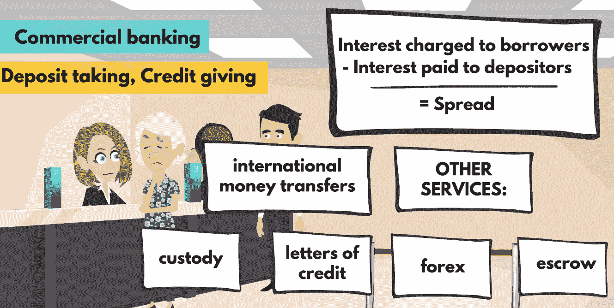

另一方面，投资银行处理更复杂的业务。他们在重大企业事件中为企业提供帮助，例如当企业即将进行首次公开募股并在证券交易所上市时，或者当企业参与合并和收购时。

由于这两种商业模式差异很大，所以分开分析是有意义的。

让我们关注商业银行，因为它们影响着大多数人的日常生活。

随着区块链技术的出现，商业银行业务模式需要进行重大更新。

在 2015 年致股东的信中，杰米·戴蒙(世界上最大的银行之一摩根大通的首席执行官兼董事长)表示，有数百家拥有大量人才和资金的创业公司正在努力寻找传统银行的替代方案。

经过 2017 年的繁荣，以及大量资本、研究和开发涌入区块链科技，可以毫不夸张地说，硅谷和科技创业公司不会简单地到来。他们正全速前进以颠覆世界，而银行业是首当其冲的领域。

# 但是银行为什么要费心呢？

他们的商业模式已经存在了数百年，到目前为止，互联网还没有造成任何重大的破坏。

嗯，这次我们讨论的是货币互联网，这里的情况有所不同。

传统银行的核心业务是吸收存款和信贷。如果人们停止存款，银行存款减少，商业银行将无法以低廉的利率向借款人提供贷款，因此传统银行的整个业务模式将变得过时和过时。这就像他们试图在在线视频流、数码相机和智能手机的世界里销售录像带和老式胶片相机一样。或者，像在即时通讯时代使用鸽子贴。是的，人们过去常常这样做…这是标准…但是你猜怎么着？世界在变化…很快！

我们可以整天不停地列举验证技术中断点的例子。但是让我们继续主要的故事。面对无数年轻、雄心勃勃、充满活力的金融科技初创公司，我们只想提醒我们亲爱的银行业朋友们一句老话:不要带刀去枪战！

那么，为什么我们会认为将来会有越来越少的人将钱存入传统银行呢？

直到现在，人们能存放钱的地方还很少。一种选择是把它放在家里，在罐子里装满钞票，把成堆的现金埋在花园里，或者干脆把钱存到银行，在那里存钱可能比放在家里更安全，当然前提是银行不破产。另一个好处是，银行转账使得向其他人或公司汇款变得容易。

但全球数十亿被传统银行永远忽视，基本被切割出金融体系的人呢？如果老派银行不想为他们服务，别人会做的！金融科技来了，区块链是领路人！

比特币和其他加密资产的出现给了人们一个可行的选择。您已经知道，区块链可以在没有第三方干预的情况下实现安全支付和储值。无论你在区块链上拥有什么样的数字货币，只要你妥善保管好你的私人密钥，它们都会存在，没有人能拿走。因此，银行不再是你储存资金的唯一选择。人们将加密资产视为可行替代品的最明显证据来自遭受恶性通胀的国家，比如最近的津巴布韦和委内瑞拉。比特币的价格在那里飙升，相对于世界其他地方有很大的溢价。这是因为这些国家对比特币的需求异常高。

此外，与传统的银行转账相比，特别是国际转账，在区块链进行的交易往往更快、更便宜。未来，新的解决方案将会出现，当前的解决方案将会得到显著改进。因此，任何形式的资金转移都可能比现有的支付系统更高效、更便宜、更快捷。

所有这些都可能有利于消费者，并扰乱传统银行，因为它们开始将业务输给更有成效和效率的金融科技初创公司。

当然，传统银行可以选择如何应对即将到来的技术颠覆。我们认为，明智的应对措施是努力适应不断变化的模式，拥抱新技术及其带来的所有好处。你不能阻止进步！忽视它或试图抵制它是愚蠢的。无论谁选择僵化或不适应新环境，都有可能再次证实进化原则，并遵循恐龙或百视达的命运，百视达是 15 年前的电影租赁巨头，被网飞等服务取代。

接下来，我们将研究区块链解决方案如何影响传统银行提供的一些现有服务。

# 可能被中断的银行业务

除了存款外流的明显风险之外，区块链方面还可以通过其它几种方式来改变银行业的不同领域。

在本节中，我们将讨论区块链对各种银行职能的影响，如下图所示:

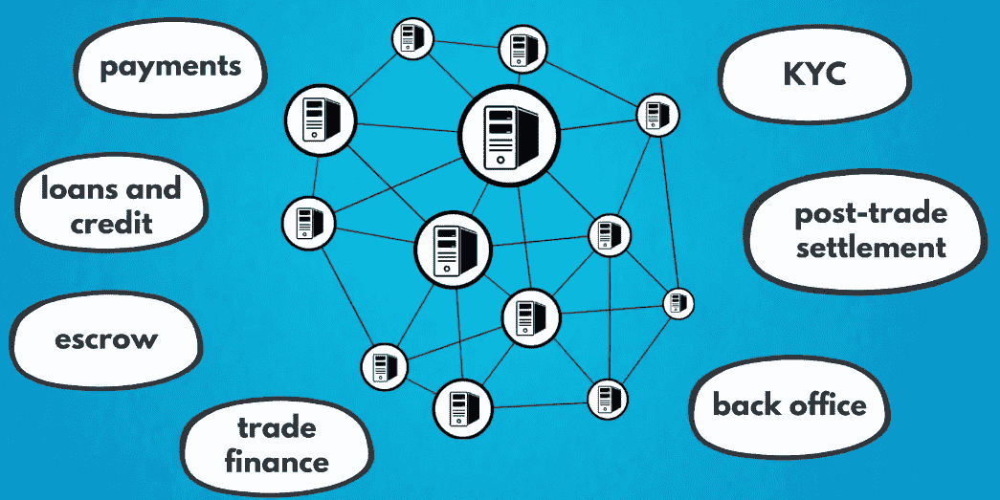

这不是一个简短的列表，但所有的主题都非常有趣。那么，我们开始吧。

每天要支付数十亿美元的银行费用。这些费用中有一部分是清楚地向客户展示的，是为所提供的服务收取的，而另一部分则不那么明显，是在银行开展与外汇相关的业务时产生的。

据报道，像桑坦德银行这样的全球性银行非常依赖国际汇款的费用。2017 年泄露的аn 份内部文件显示，此类费用占桑坦德银行 2016 年收入的比例不低于 10%。

另一方面，一旦一些基于区块链的解决方案成为主流，它们可以为此类交易提供更好的选择。基于区块链的资金转账耗时更短，成本也不像传统银行转账那么高。目前(在该技术的早期阶段)，比特币需要几分钟到几个小时来处理一笔支付，而国际银行转账通常需要至少三个工作日才能结算。其他区块链，如以太坊、莱特币、Ripple 和 Stellar，可以实现更快、更便宜的交易，与银行做同样的事情所需的时间和费用相比，可以节省大量时间和费用。对这些协议的一些改进，如闪电网络，可以提供更高的效率。因此，国内尤其是国际资金转移服务很可能会被中断。

在[第三章](03.html)、*比特币的诞生和分散支付系统的优势*中，我们讨论了银行转账仍然如此复杂、耗时且昂贵的原因。它们涉及多个中间步骤，如与代理银行合作，并可能遭遇排长队、汇率损失、交易对手风险、官僚主义和大量文书工作。区块链解决方案规避了所有这些困难，并且是在点对点的基础上进行的，没有第三方的参与。自然，这使得该过程更加便宜和快速:

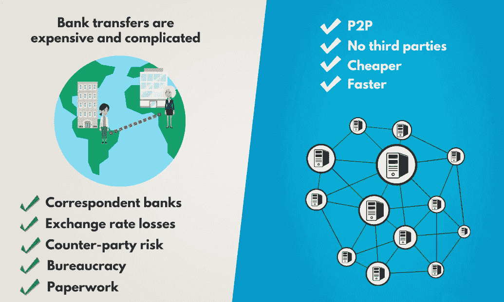

一些银行从业者表示，他们已经意识到潜在的干扰，并正在采取措施实施国际汇款的区块链解决方案。

由 ANZ 银行、法国巴黎银行、BNY 梅隆银行、富国银行和 Hyperledger 开发商组成的财团已经完成了使用 Hyperledger Fabric 区块链平台构建的跨境支付的**概念验证** ( **POC** )。它旨在测试将成员银行账户转移到分布式分类账是否有助于银行间支付平台 SWIFT 实时对账。Hyperledger Fabric 支持实时了解往来账户的流动性，简化对账并节省流动性，同时满足监管、数据隐私、标准化和身份管理等关键行业要求。

另外，2017 年 9 月，**加拿大皇家银行** ( **RBC** )开始使用 Hyperledger 进行美加银行间结算。

现在，让我们继续下一项业务。存款和信贷发放模型由两部分组成。我们已经讨论过存款方面了。现在，让我们来谈谈贷款以及它在未来可能经历的转变。

# 区块链如何影响贷款

今天，银行仍然是个人和公司的主要信贷来源。P2P 贷款是一个受欢迎的利基市场，但信息不对称阻碍了它的大规模实施。P2P 借贷靠的是扎实的理念。如果人们把他们的资金存入银行，然后银行用他们客户的钱借给其他人，储户直接把钱借给借款人并获得更高的回报率不是更有意义吗？银行似乎是这个等式中多余的中间人，不是吗？它们的主要附加值来自于这样一个事实，即它们可以说拥有从不良借款者中挑选出好的借款者的专业知识，而且一旦不良债务人停止偿还债务，它们还会专门处理不良债务人。

未来，包含智能合约的平台很可能会让事情变得更简单、更透明。由于区块链的明确性，借款人和贷款人之间的信息不对称可以减少。预先商定的条款将得到遵守，将会有某种公共数据库，人们可以在其中看到谁在过去是一个好的借款人，并借给他们钱:

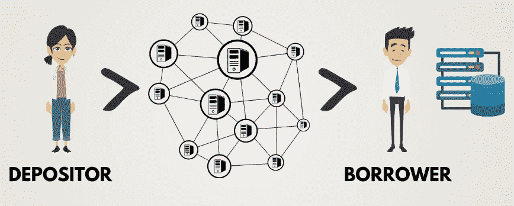

想象一个网上市场。这类市场中的卖家和买家都有评级。从长远来看，声誉是成功的基础。

好吧，想象一下这样一个世界，借款人将拥有自己的声誉，他们之前所有的相关行为都将被记录在区块链上。这肯定会减少信息不对称。贷方会有更多关于他们将要借钱给的借款人类型的信息。此外，这种信息将是不可变的和容易访问的。这将创造一个竞争性市场，人们可以很容易地获得贷款服务，因为它们更便宜、更快捷。银行背负着巨大的管理成本，这抬高了它们向借款人收取的最终利率。在一个由区块链和智能合约技术推动的 P2P 贷款市场中，贷款人将不必支付几乎同样多的管理成本，并且很乐意接受银行收取的一小部分利率。

区块链可能会扰乱的另一个领域是贸易融资和托管服务。在今天的世界上，有许多团体在相互交易，但却不信任彼此。银行通过提供信用证和托管服务来帮助减少这种不对称。

想想欧洲的一家零售商，他想从中国进口服装。他设法找到了一家生产服装的工厂，他们为第一批货提供了一个不错的价格。它的总价值是 50 万欧元，这不是一个可以忽略不计的数目。问题是，到目前为止，零售商还没有与供应商合作，也不能确定一旦钱发出后，中国制造商是否会交付衣服。与此同时，中国制造商无法保证一旦货物装运后，欧洲零售商会寄钱给他们。听起来像是僵局，不是吗？

到目前为止，已经确定的解决方案是使用托管账户。欧洲零售商会将资金存入一家受信任的银行，该银行只有在生产商发货后才会发放资金。在这种情况下，银行的声誉消除了双方的信息不对称，促进了交易。银行以其名称和监管许可证保证这一过程尽可能合法。然而，银行对这项服务收取交易总额的一定百分比的费用。

基于智能合约的平台可能会改变这一行业。

商业交易的双方将能够设计一种自动转移商品和货币所有权的机制。交易发生的条件将被编入智能合同，双方可以确定这些条件是不可改变的，并将自动执行。

正如你所看到的，大量激动人心的变化正在向我们走来。但是还有更多！

在当前环境下，银行必须参与 KYC 进程。世界各地的监管机构都希望银行能够收集客户信息并核实他们的身份。这些条例的目的是防止洗钱和阻止资助犯罪和恐怖组织。你大概可以想象，这是一个漫长的过程。一些银行与数百万客户打交道，他们必须填写大量表格，调查任何可疑案件。这是他们的一项重大投资。每家银行在开始与一定规模的新客户合作时，都必须经历这一过程。

更有效的方法是组织一个独特的分布式数据库，供银行和监管机构共享。这样，他们就可以省去他们的同事已经完成的所有研究工作。分布式区块链解决方案最适合这些目的，因为记录的不变性意味着共享该区块链平台的所有银行都以安全、公正的方式存储客户交易历史。这也将增加透明度，但只对有许可访问的实体，因为我们认为这样的解决方案是最可行的实施作为一个私人许可区块链。

实际上，这样的解决方案已经在开发和测试中；这里有几个例子。

2017 年，只有 44%的菲律宾人在使用银行账户，由于菲律宾经济的快速增长，这一指标正在迅速增加，但仍受到检查新账户申请人身份和历史的低效机制的阻碍。KYC 法律要求一遍又一遍地询问相同的数据，其中许多数据都无法以数字或可验证的形式获得。

为了解决这一问题，菲律宾银行家协会与 Hyperledger 和一个主要银行联盟合作，开展了一项概念验证工作，以构建一个使用 Hyperledger Indy 实现身份验证的原型。

该平台允许客户以保护隐私的方式只输入一次信息，并在新开户时重复使用该数据，从而简化了新账户的注册。银行可以相信这些数据的历史是可靠的。如果成功的话，这可以作为一个全国性身份识别系统的测试。

2017 年 10 月，由新加坡监管机构和包括汇丰银行和三菱 UFJ 在内的几家银行组成的财团发起的另一项类似倡议宣布，他们已经完成了 KYC 区块链的概念验证。原型的功能性、可扩展性和安全性在 2017 年 2 月至 5 月期间进行了测试。结果表明，即使在大量信息流动的情况下，区块链也能很好地运行。事实证明，它可以抵抗第三方的干预，同时通过只允许那些经过合法身份验证的人访问来确保机密性。

同样，当区块链在交易后结算的背景下实施时，银行的后台部门将会轻松得多。双方都信任的改进流程将减少结算时间，因为双方共享并控制同一个分布式分类账系统，并且可以确定保留预先安排的条件。此外，由系统故障引起的机械误差会更少。所有市场参与者都可以共享区块链的同一个自动结算系统。当然，所有这些也会提高审计和对账的效率。参与每项交易的各方将不必进行不必要的记录复制和审计，以确保整体一致性。最终，银行将能够拥有更精简、更廉价的后台结构，工作速度将会快得多。

好的，太好了！这些是区块链技术预计将对传统银行业务产生的一些影响。接下来，我们将介绍一个关于贸易融资和区块链的案例研究。

# 区块链的贸易融资

现在，我们来看一下 IBM 和几家全球性银行的一项具体计划，它进一步强调了我们在前面几节中讨论的内容。传统金融的创新已经开始。

我们将研究的具体计划称为 **Batavia** ，它涉及 IBM 和 UBS 之间的合作伙伴关系，其他几家主要银行也加入了进来，如蒙特利尔银行、CaixaBank、德国商业银行和 Erste Group。其主要目标是解决贸易融资领域的低效流程。

贸易融资是一个受官僚主义拖累的缓慢过程，就像现在这样:一个漫长的过程，涉及不同参与者进行的多重验证。在大多数情况下，一笔交易涉及买方、卖方、买方银行、卖方银行、运输公司和地方当局。整个过程需要大量的文书工作，并且不是自动化的，因为所有参与者都有自己单独的 IT 系统，这需要人工干预进行核对和验证:

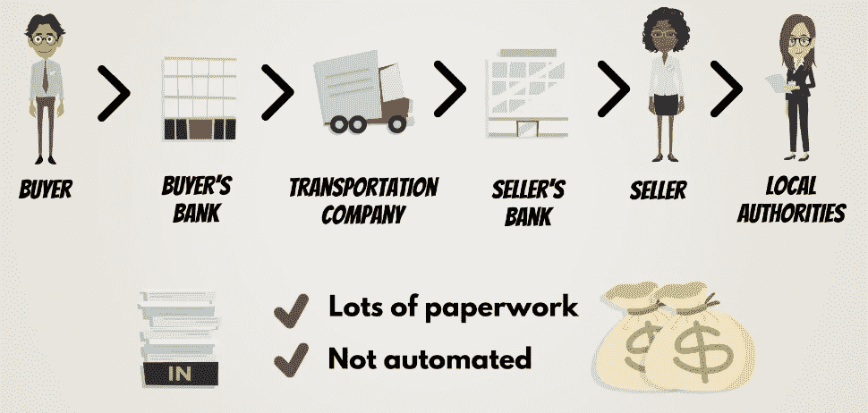

对公司来说，这一过程漫长(在某些情况下需要数周时间)且昂贵(考虑到他们必须支付工时，并且在此期间不能使用交易的收益)。

所以像巴达维亚这样的贸易融资平台肯定是有意义的，感觉像是一股清新的空气。各公司将能够利用该平台，以标准格式相互达成协议。更重要的是，由于其安全和不可变的分布式分类帐，系统中的透明度和信任度将增加。

该平台的设计非常新颖。所有参与方将能够跟踪所交换货物的状态和去向。另一个关键特征是，随着商品在供应链中的移动，货币可以在不同阶段支付给不同的交易参与者:

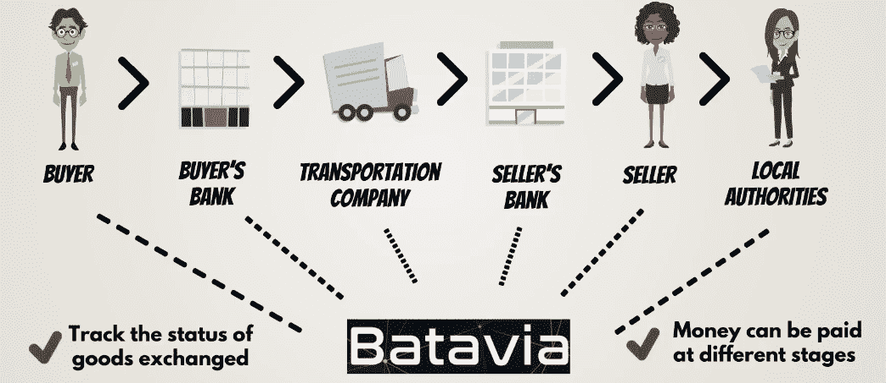

例如，一旦货物到达物流公司手中，公司就可以向供应商付款。然后，一旦货物到达目的地，物流公司将得到付款。

巴达维亚是一个开放的平台，鼓励公司、银行和当局联手合作，为所有人带来更高效的结果。此类举措促进贸易并提高贸易效率，从而创造价值并刺激经济增长。

这是一个使用区块链技术构建的平台的很好的例子，通过提高所有相关方的效率和有效性，有可能打破贸易融资的现状。

# 区块链和保险

保险业似乎不像传统银行业那样容易受到技术破坏。保险是一个高度专业化的行业，风险评估和汇集大量具有相似风险特征的保险合同的能力是一个关键的成功因素，在分散的 P2P 市场中很难自动复制，但并非不可能。因此，P2P 和分散式保险承保比传统银行业务实现起来要复杂得多。

另一方面，区块链技术的出现代表了保险公司效率和创新的潜在巨大源泉。而这一次，在职人员聚会还不算太晚！

一些保险公司已经在利用区块链技术来定位他们的业务，以取得成功并提高盈利能力。

例如，安联展示了一个促进巨灾掉期和债券结算的测试版平台。在触发事件的情况下，这种平台使得这种金融工具的持有者更容易接收或发送回报。这意味着双方的等待时间更短，人们出于保险目的购买这些工具的不确定性更小，验证错误更少，客户体验整体改善。

英国的劳合社没有等太久，已经开始试验区块链的产品。它与共享工作空间提供商 Vrumi 和区块链数字专家 SafeShare 合作，为 Vrumi 的主机提供保险产品。Vrumi 是一家 AirBnB 式的办公空间住宿公司，其想法是让 Vrumi 的主人能够承保保护他们租赁财产的保险合同。该产品使用区块链技术来确认和执行各方的义务。

你还记得 Everledger 吗，那家利用区块链追踪钻石产地的公司？它还通过降低欺诈和血钻进入供应链的风险，帮助保险公司对相关保险产品进行定价。购买的钻石通常带有证明其质量和原产地的证书，但由于缺少文件，有欺诈的历史。当保险公司需要通过防止任何欺诈企图来验证钻石、艺术品、珠宝和奢侈品的历史时，区块链可以极大地帮助他们。

有许多区块链应用程序将影响未来保险业的发展。目前，我们知道区块链可以通过以下方式提供帮助:

*   减少不确定性
*   降低后台成本并减少官僚作风
*   自动化支付执行流程，节省时间和人力
*   改善客户关系和满意度，因为基于区块链的智能合同是客观的，并且预编程为自动执行

此外，由于更好的风险管理、更快的执行时间和对保单持有人应得赔付的更好的可见性，区块链上的保险合同可以帮助保险公司提高其资本充足率。

总的来说，行业的主要感觉是，许可的区块链可能是保险业未来的一个很好的解决方案。这种被允许的区块链可以适应当前的商业模式。如果区块链解决方案与现有框架相集成，保险公司、监管机构和客户都可以从这里讨论的优势中受益。

# 投资银行和区块链

在本章前面，我们说过有两种类型的银行，商业银行和投资银行。我们讨论了区块链技术对传统商业银行服务的潜在影响，但对投资银行没说多少。

我们将在本节中简要介绍这一点。

投资银行通常有以下核心业务:

*   **资本市场**:在一级市场发行股票和债券，为其公司客户筹集资金，向投资者出售，并在二级市场为客户或银行自己的账户进行交易
*   **咨询服务**:并购、企业重组等专业化过程中的咨询公司
*   **资产管理**:专业管理客户投资组合中的资金

好了，让我们逐一检查这些区域。

资本市场就是以股权或债务的形式为公司筹集资本。不难想象，股票和债券可以在区块链用代币来代表，并在那里发行和交易。事实上，这可能是一种更有效的方式，因为清算和结算可以直接完成，几乎是瞬间完成，而不是等待几天并向一群中介机构支付费用。

这里有一个由 Hyperledger 锯齿开发的债券交易平台试点项目的真实例子。他们发现遗留系统的问题如下:

*   机构之间的记录保存实践不同，并且调节分类账通常是困难的、昂贵的和耗时的
*   历史债券所有权数据可能是支离破碎和不完整的
*   集中式数据管理解决方案垄断了他们的产品
*   数据可能被篡改，导致金融欺诈
*   集中式系统存在单点故障的风险

为了简化债券转让流程，Hyperledger Sawtooth 创建了一个用户界面和智能合约平台，允许投资者实时跟踪和转让债券。在这里，用户可以创建、购买、出售和结算他们的债券投资组合。虽然智能合约是专门为债券及其唯一标识符定制的，但它们也可以根据各种金融工具进行定制。

将金融市场迁移到区块链有很多好处。它促进了不同市场参与者之间的数据一致性。它有助于维护历史所有权的全面、有序、准确和不可变的记录。此外，权力下放、透明度和信任是该系统固有的。

自然，这可以扩展到用于资本筹集或风险对冲的任何类型的金融工具。智能合约对于构建在全球资本市场上交易的任何种类的衍生品或其他奇异的金融产品都非常有用。

将来，所有已建立的金融市场平台都可以迁移到区块链，因为它们提供了更有效的金融基础设施。事实上，这个未来可能比大多数人预期的来得更快…

2017 年 7 月，伦敦证券交易所集团与 IBM 合作，宣布将创建一个区块链平台，旨在以数字方式发行意大利公司的股票。Hyperledger Fabric 将构成平台的基础。

纳斯达克在开发区块链交易平台方面也非常积极。

**澳大利亚证券交易所** ( **ASX** )已经宣布将会用区块链技术取代其目前的清算系统。

这样的例子不胜枚举……全球资本市场正在向区块链转移。

除了提高现有金融市场的效率，区块链还提供了进入新兴加密资产类别的途径。

有趣的是，一些主要金融机构，如高盛、巴克莱和富达等，一直在探索开设加密资产交易柜台。这种新的资产类别似乎很快就会在银行交易大厅中找到与传统资产类别比肩的位置。

在咨询服务领域，区块链的影响稍微有点牵强，因为这个领域太新了，公司都处于非常早期的阶段，大多不在老牌投行的关注范围之内。

区块链和资产管理怎么样？这个领域也在蓬勃发展。以比特币为首的新加密资产类别正在兴起，并获得全球资产管理公司的认可。机构投资者和散户投资者的兴趣越来越浓厚，相关投资产品的发行也紧跟市场需求。比特币期货于 2017 年底在芝加哥商业交易所和 CBOE 这两家全球最大的商品交易所推出。纳斯达克也计划推出类似的产品。比特币和以太坊交易所交易票据在瑞典上市。由 gray 赞助的比特币投资信托基金也面向合格投资者开放。纽约证券交易所的比特币交易所交易基金(ETF)也在筹备中，但这种产品似乎需要更多时间才能开花结果。这仅仅是开始，前面的路漫长而不确定，但也令人兴奋。加密资产极难估值，因此我们将看到该领域如何演变，但有一点是明确的:资产管理行业正朝着加密资产将发挥越来越重要作用的方向发展。因此，我们可以期待新的令人兴奋的发展正在形成！

# 区块链和金融监管

2017 年区块链和加密资产的崛起让世界各地的监管机构感到非常头疼。价格波动、散户和机构投资者的浓厚兴趣、比特币期货在主要监管交易所的推出，以及主流媒体的日常报道，意味着加密资产正在成为一种新的资产类别。

在传统金融领域，监管者监管金融市场，以确保有足够的规则来平衡所有相关方的利益。一方面，他们需要保护散户投资者(私人投资者)，因为他们在评估市场风险和做出投资决策方面缺乏经验和专业知识，被认为是潜在的弱势群体。另一方面，监管者也应该帮助维持高效有序的资本市场，让公司能够筹集足够的资金支持运营、推动创新并最终刺激经济。这使得金融监管者的工作变得非常重要，要求也很高。他们需要不断跟上新类型的金融工程，有时是奇异的结构和工具，如各种金融衍生产品及其风险状况。他们需要时刻关注上市公司和机构投资者的管理层的潜在危害，这可能涉及虚假会计、内幕交易或其他欺诈交易、庞氏骗局或金字塔计划，或者其他违反监管的行为。历史上的例子实在太多了，当金钱垂手可得时，人们的创造力是无限的。我们之前已经提到过一些涉及安然、世通、伯尼·麦道夫和几乎所有大银行的巨额丑闻。此外，监管者需要特别小心可能代表系统性风险的大型金融企业，这意味着如果它们陷入困境，可能会危及整个金融和经济体系。

因此，你可以看到，金融监管机构肩负着巨大的责任和重要的社会使命。自然地，随着加密资产市场变得越来越大，它开始吸引他们的注意力。现在悬而未决的问题是如何再次保持维护投资者保护和保持技术创新不受阻碍之间的平衡。在这里，这是一项非常具有挑战性的任务，因为区块链加密资产同时处于技术、金融、经济和法律科学的前沿。

当然，缺乏经验的公众投资者需要得到保护。就像在任何其他市场一样，欺诈和骗局层出不穷。不幸的是，这些事情一直是社会的一部分。市场参与者也有不负责任的行为，他们很难理解所涉及的风险。

好消息是，加密资产市场不被认为会带来系统性风险。这是目前世界各国央行的普遍观点。这是因为与全球股票和债券市场相比，它的规模非常小。

鉴于加密资产似乎兼具货币、商品和股权特征，在现有监管框架下如何对待加密资产是一个完全不同的复杂问题。一方面，每个人都听说过加密货币，并使用这个术语来指代整个加密资产领域。但是它们并不能解释所有的货币。事实上，在所有既定的资产类别中，商品在本质上可能更接近于加密资产。这是因为它们的市场价值是由它们所支持的实用程序或用例的供求关系决定的。许多加密资产也应该如此。例如，以太坊令牌允许访问以太坊网络的计算能力和安全、不可变的以太坊区块链上的数据存储。这看起来像一个真实的用例，类似于我们现代经济中的许多商品。想想石油、电力和货物或货运；这些都是在现代经济中具有实质性效用的可交易商品。或许，以太坊和它的一些区块链同行将会效仿。而比特币呢？它正在获得被广泛认可的数字黄金的地位。它作为价值储存手段的效用在一定程度上类似于黄金。全球最大的受监管金融和商品衍生品交易所之一的芝加哥商业交易所(Chicago Mercantile Exchange)似乎也持有这种观点，其 2017 年 12 月上市的比特币期货合约就证明了这一点。

相比之下，股票的价值基本上是由基础业务预期实现的未来现金流支撑的。目前大多数加密资产不一定如此。当然，正如我们已经提到的，传统的股票可以用区块链的代币来代表。几乎任何资产都可以做到这一点。

加密资产的风险资本方面又如何呢？目前，加密资产主要代表初创项目中的利益相关者的利益。这里的利益相关者，我们指的是对一个企业或生态系统有兴趣的任何人。例如，典型公司的主要利益相关者是投资者、员工、客户和供应商。

加密资产在当前市场和监管环境中的地位是一个开放而复杂的话题，我们无法在此完全涵盖。

我们只想提到，当谈到加密资产时，全球监管环境非常多样化，并且在动态发展。一些国家更保守，而另一些国家更开放和自由，就像任何其他经济和政治发展一样。合理的方法可能是在监管者和市场参与者之间进行持续对话，这样每个人都在同一页上，并为社会的有效结果做出贡献。似乎许多监管机构和政府当局认识到了区块链技术的价值，并希望在采取进一步措施之前对其有一个很好的了解。这种方法是有意义的，我们可以看到一些积极的举措已经开始实施。

2018 年 4 月，欧盟 22 个国家签署了建立欧洲区块链伙伴关系宣言。

数字经济和社会专员玛利亚·加布里埃尔是推动这一伙伴关系的人，她表示相信这项技术有潜力改变数字世界:

*"In the future, all public services will use blockchain technology. Blockchain is a great opportunity for Europe and Member States to rethink their information systems, to promote user trust and the protection of personal data, to help create new business opportunities and to establish new areas of leadership, benefiting citizens, public services and companies. The Partnership enables Member States to work together with the European Commission to turn the enormous potential of blockchain technology into better services for citizens."*

这一伙伴关系将成为欧盟成员国之间合作的载体，以交流技术和监管领域的经验和专业知识，并为在整个数字单一市场推出 EU-范围的区块链应用程序做准备，以惠及公共和私营部门。这将有助于欧洲继续在区块链技术的开发和推广中发挥主导作用。

也就是说，我们将开放监管难题，并鼓励每个人都是合理的，并在采取任何行动之前尝试了解区块链技术。事实上，这正是这本书的目的，如果我们能为正在进行的讨论做出贡献，并提高区块链技术的社会意识，我们将非常高兴。

# 区块链和零售领域

现在，让我们继续讨论区块链技术对零售业的潜在影响。但首先，我们将讨论本书之前提到过的一个术语。

# 物联网

物联网是一个概念，描述了我们日常生活中使用的不同设备通过互联网的互联性，物联网是人们经常提到的 T2 物联网。

我们不再简单地通过电脑访问互联网。我们周围有不同的智能设备，它们具有基于互联网的内置功能，并与其他设备或云相连:

我们都知道什么是智能电视，什么是智能手机。如今，许多电器都具有智能功能，例如空调，它与智能手机相连，可以跟踪人们的位置，在你下班回家时打开。与互联网连接的安全系统会通知您家中是否发生了可疑事件。这样的例子不胜枚举:

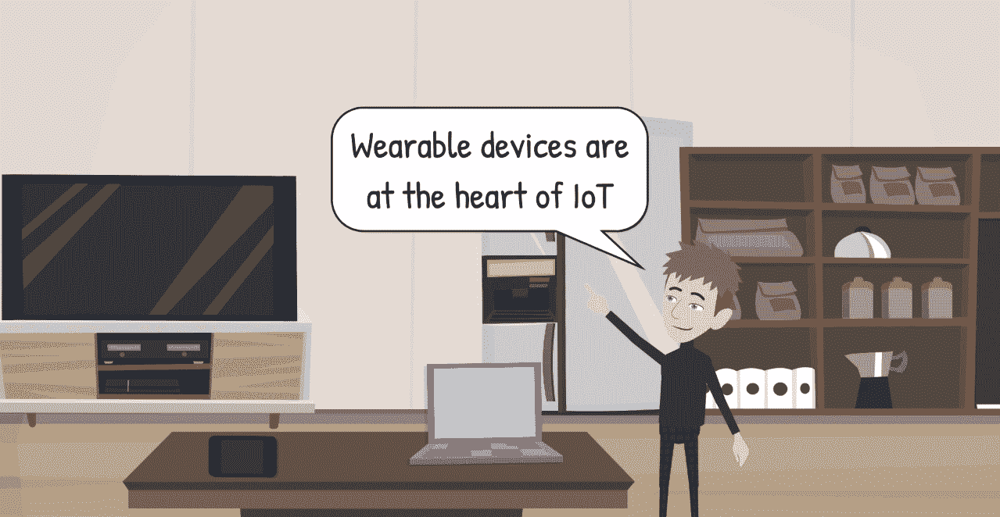

可穿戴设备是最近物联网和零售业讨论的核心。这种可穿戴设备的第一个实现是安全和识别。毫无疑问，这意味着区块链技术可以在这一领域发挥重要作用:

许多人在工作中佩戴徽章，这些徽章提供了安全性、身份识别，并且在某些情况下提供了与位置相关的宝贵见解(这对于安全性非常有帮助)。这不是一个直观的想法，但徽章本身是某种智能设备，在物联网中发挥作用。它所包含的芯片提供了关于其持有者的信息，关于其位置的信息，以及已经存储在系统中的任何类型的相关数据。现代徽章更加安全，它们要求持有者使用指纹或眼睛扫描等生物识别技术:

# 这和零售业有什么关系？

嗯，这继续向你展示了一个简单的芯片可以包含大量的信息。如果包含在这个芯片中的信息被记录在区块链上，它将变得不可改变和不可伪造:

同样的，这种芯片可以添加到大多数零售产品中。

很可能许多衣服、鞋、包、香水、太阳镜、化妆品、奢侈品、药品等将受益于透明的真实性验证平台，该平台将具有规模并且将被大规模采用。这将允许顾客扫描鞋类(通过插入其中的条形码或芯片)并接收关于产品的有价值的信息。他们可能有兴趣了解产品的真正生产商、原产国、所用材料和劳动力的来源、产品的生产时间，以及生产商的建议价格。这有助于纠正一些发展中国家的不道德行为，如血汗工厂和童工:

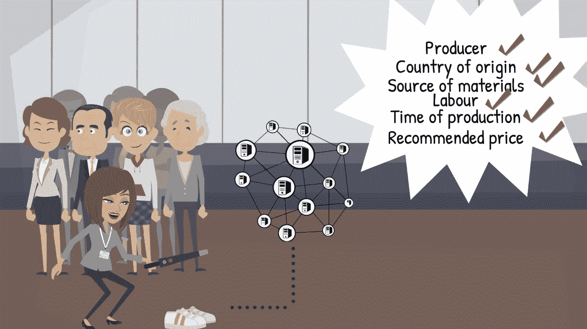

此外，耐克等知名品牌遭遇大量假冒。问题是顾客并不总是能够区分耐克的原装产品和仿制品。以区块链为基地的核查程序可以帮助解决这个问题:

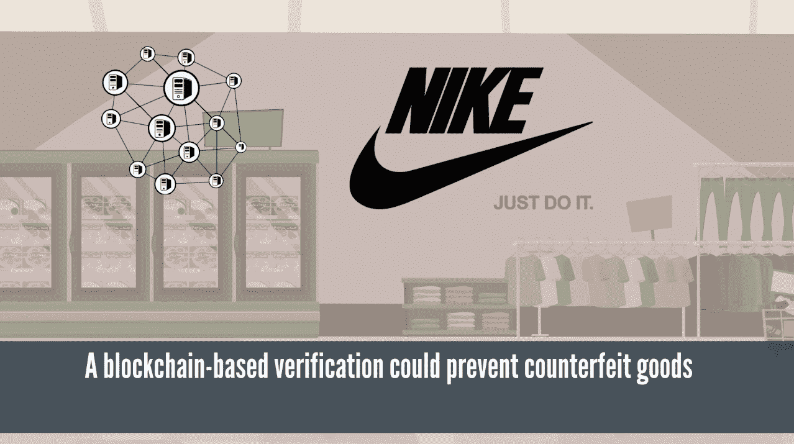

如今，消费者对健康和他们行为的社会影响变得非常关注，他们更喜欢消费以正确方式生产的产品。

在这种情况下，区块链驱动的真实性验证和证明的观点变得非常有用:

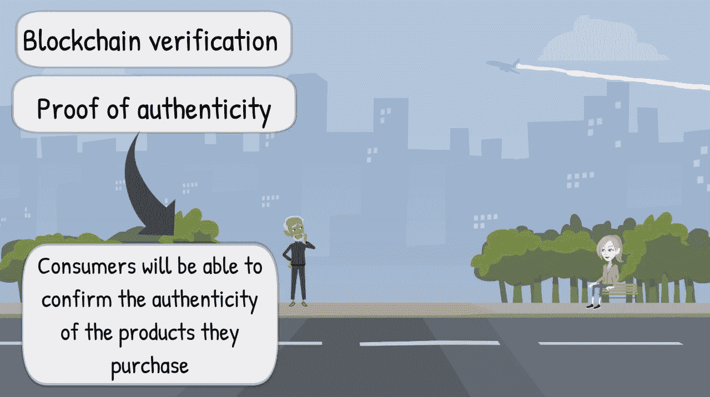

消费者将能够确认他们购买的产品的真实性。渐渐地，不道德的制造行为和假冒商品市场可能会大幅萎缩。

这对于化妆品、药品和其他医疗保健产品来说更加重要，因为生产质量和符合标准不仅是人们所期望的，也是至关重要的。一个基于区块链的公共注册机构可以向人们保证，他们购买的药品是由声誉良好的合法公司生产的，符合正确的条件和标准，使用适当的成分。有了这样的透明度，生产商就可以用他们的声誉和经营许可证来支持他们的产品，如果他们将有缺陷的产品推向市场或违反了其他规定，他们将被追究责任:

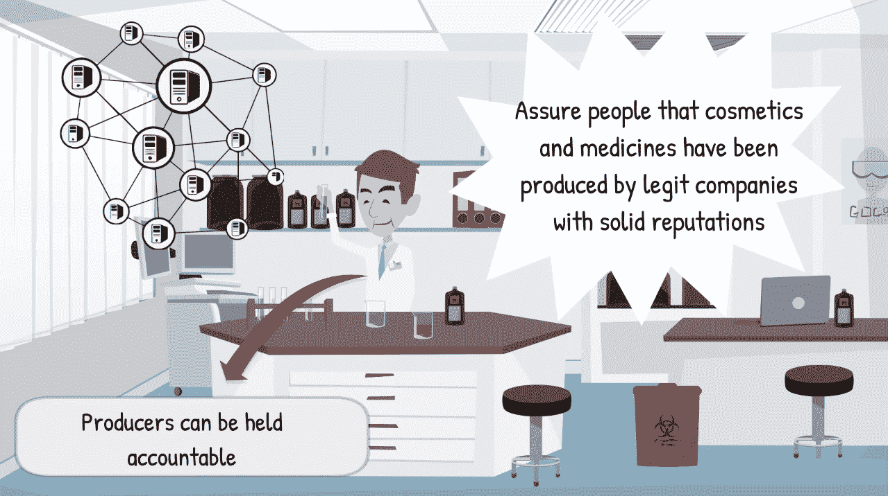

这种登记将允许消费者核实他们购买的产品的整个生命周期。从社会的角度来看，可以向消费者展示他们穿的衣服是在适当的环境中生产的，并得到了验证工作场所条件是否体面的组织的认证。这对于我们这个时代的大部分消费者来说非常重要。他们希望更多地了解他们使用的产品，并对其生命周期感兴趣。

重要的是，当购买时尚产品或化妆品时，客户希望知道一个项目是何时生产的。他们不想出售一年前生产的商品。因此，从这个角度来看，这种类型的认证也是有用的:

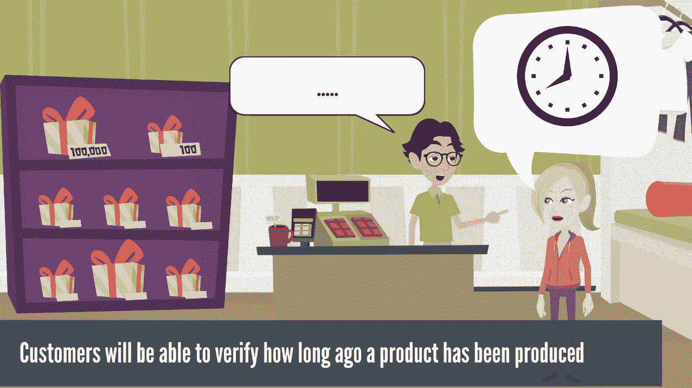

# 区块链和知识产权

现在，让我们看看区块链对媒体下载的潜在影响，如音乐或电影、软件安装和其他与**知识产权** ( **IP** )有关的产品。

知识产权管理是实施基于区块链的解决方案可能产生重要影响的另一个领域。IP 是互联网时代的热门话题。

通过使用分布式分类帐来管理知识产权，艺术家、作者和企业可以拥有其知识产权和版权保护的防篡改证据。他们还可以在允许智能知识产权管理的生态系统中使用智能合同。

让我们分别考虑一下这些发展意味着什么:

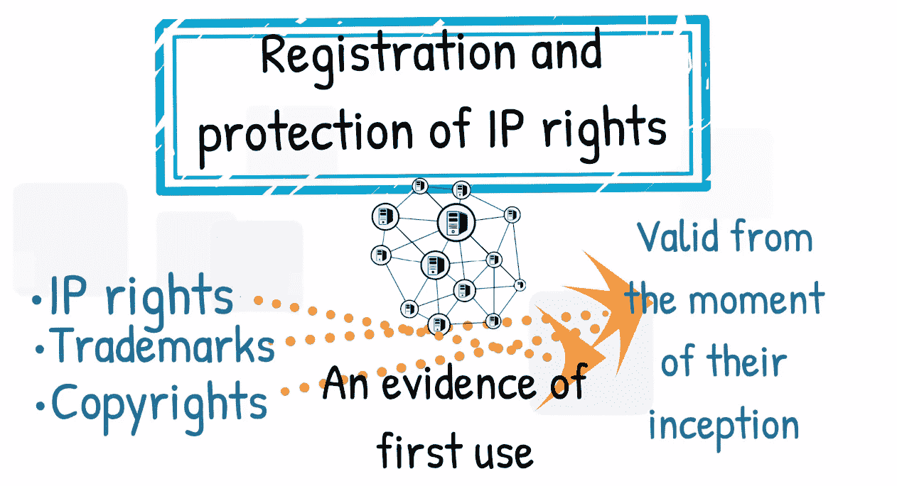

在谈论知识产权时，最重要的一个方面是它们的注册和保护。在大多数法律中，知识产权、商标和版权从一开始就是有效的。一个以区块链为基地的注册中心，其时间戳显示了一项知识产权何时产生，可以作为首次使用的证明。这将使秃鹫公司更难为其原始作者创造和使用但尚未注册的技术申请专利。区块链永恒不变的账本上的时间戳将是一个透明的、令人信服的证据，向全世界证明知识产权的合法所有权。

基于区块链的解决方案为音乐、电影、软件和几乎任何形式的著作权等知识产权相关产品打开了一个可能性的世界。

首先，区块链平台将有助于内容创作者和艺术家在一个基于数字货币和智能合约的去中心化系统中将其作品货币化。有可能建立系统和框架，根据使用情况非常精确地触发自动 IP 支付。例如，音乐和视频流可以按分钟甚至秒计费，微支付可以即时处理。正如我们到目前为止讨论的其他行业一样，这些系统可以以直接点对点的方式工作，没有任何不必要的中介。

柯达在区块链推出了一个平台，注册照片图像权，并在作者的图像被使用时自动向作者支付费用，这就是这种举措的一个很好的例子。智能合同使整个过程更快、更安全、更高效。当一个鲜为人知的艺术家创作了一个产品，需要依靠第三方平台来保护他或她的知识产权时，这种解决方案可能会特别有效。

与我们之前提到的 Steemit 类似，StreamSpace 项目旨在建立一个由内容创建者和用户社区管理的分散平台。这里的主要观点是，网飞和亚马逊这样的垄断企业决定向客户收取多少费用，以及向作者支付多少比例的版税，这种集中模式对后者来说并不是最优的。StreamSpace 允许作者自主选择商业策略，并使用 StreamShare 令牌向客户收费:

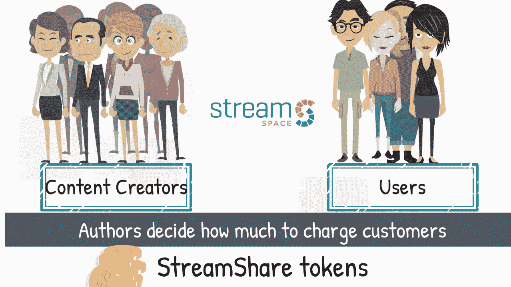

另一个项目，**Dot block chain Media**(**Dot BC**)正在建立一个音乐内容权利登记处，它将帮助音乐人以一种可互操作的文件格式表达他们在将其艺术商业化方面的权利和愿望。数据通过利用 Hyperledger 锯齿区块链技术的分布式网络进行维护。该解决方案将音乐记录和媒体权利集成到艺术家自己的作品中。dotBC 在音乐和更广泛的媒体行业中保持合作伙伴关系，以实现来自独立和主要标签艺术家的超过 6300 万全球记录的作品与 dotBC 生态系统之间的无缝数据交换。

这种分散化的市场在未来会如何发展，以及它们是否会接触到足够多的用户，还有待观察。他们面临的主要挑战之一是分散的利益相关者社区的治理模式，事实上，这是所有分散系统的共同问题:

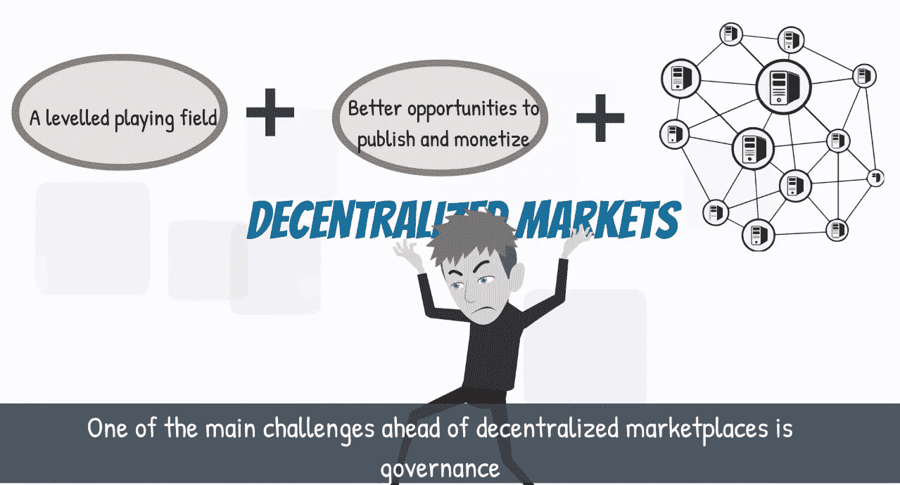

然而，由于区块链技术，我们可能会看到艺术家管理知识产权的方式发生重大变化。未来的竞争环境可能会更加公平，艺术家将有更好的机会在一个保护其知识产权的环境中自行出版、发行和货币化他们的内容。

# 区块链和食品行业

我们已经多次提到，区块链可以为食品行业供应链，以及几乎任何供应链提供巨大的改进和效率。但是，由于我们消费的食物是我们日常生活中如此重要的一部分，具有重要的意义，而且食品行业是全球经济中如此重要的一部分，我们将在这里重点关注它，并分析区块链技术如何帮助每个人获得更好的结果。事实上，当今许多食品行业的领导者已经认识到这一点，并正在启动试点项目和倡议，以在其业务模式中实施区块链解决方案。我们将在这里研究一些此类项目的案例:

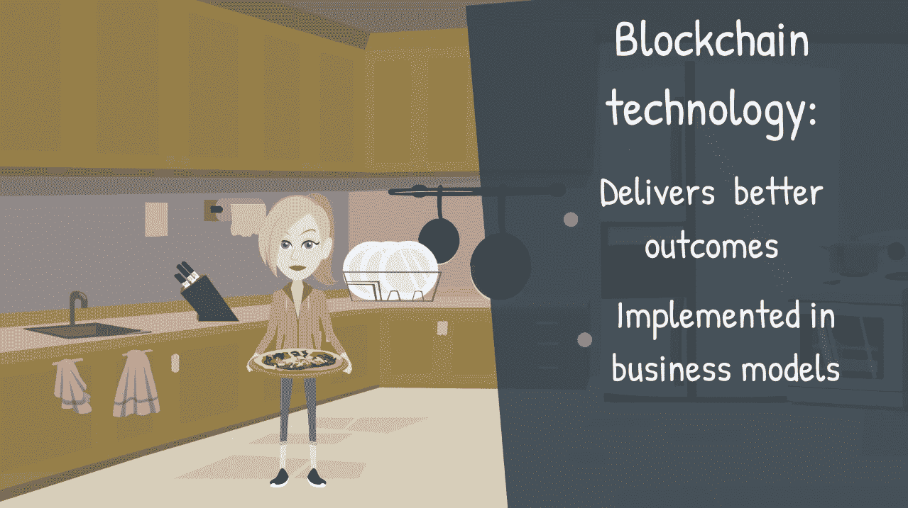

我们将从一个非常重要的问题开始。你喜欢鱼吗？不管是谁，都知道新鲜的鱼有多重要。

传统海产品行业供应链中的问题包括非法捕捞、错误标签欺诈、不适当的食品储存条件以及费力且容易出错的人工记录:

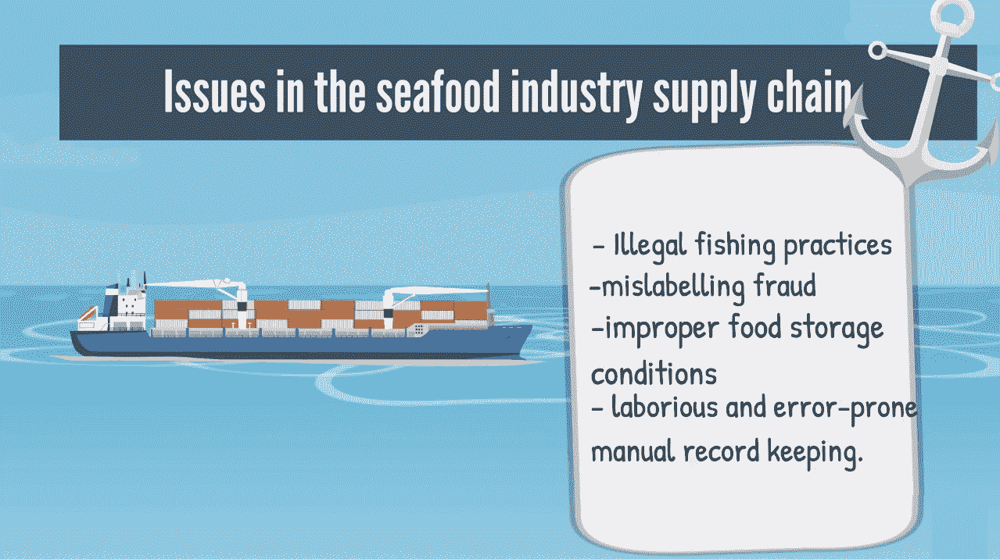

这些问题对生产商、零售商、消费者、世界自然资源以及整个经济产生了负面影响:

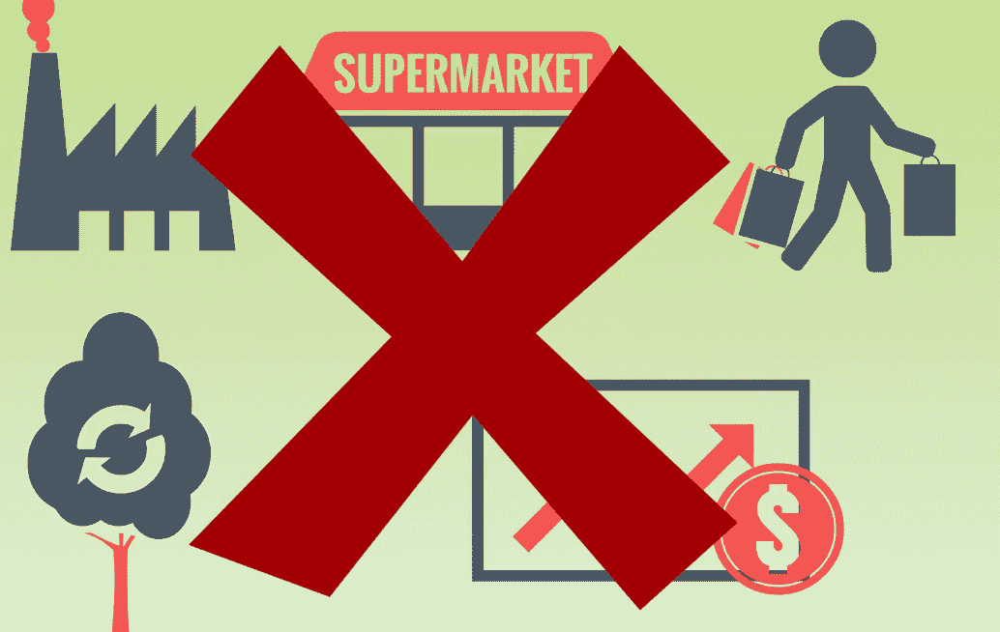

以下是一个旨在解决所有这些问题的区块链项目:

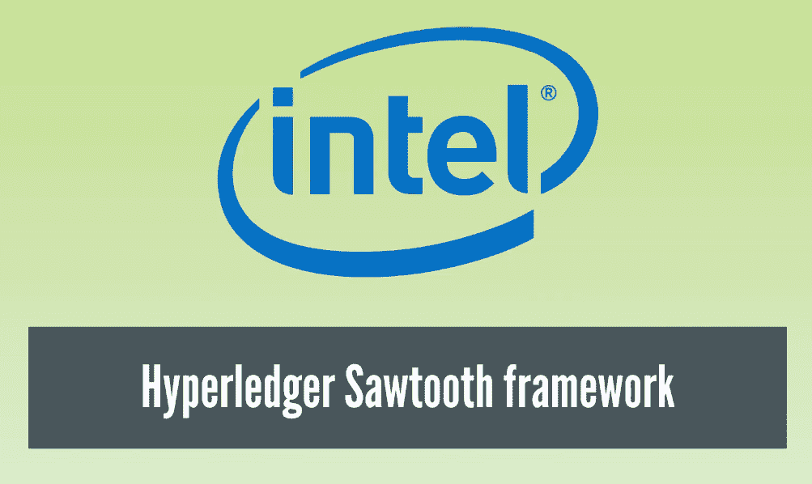

英特尔正在使用 Hyperledger 技术构建一个区块链解决方案，以实现海鲜可追溯性的现代化方法。利用 Hyperledger 锯齿框架，现在可以记录从海洋到餐桌的海鲜旅程。物联网传感器可以附着在任何委托他人运输的海鲜上，具有可跟踪的所有权、所有权和遥测参数，如位置、温度、湿度、运动、冲击和头衔。最终买家可以访问完整的信息记录，并相信它是准确的:

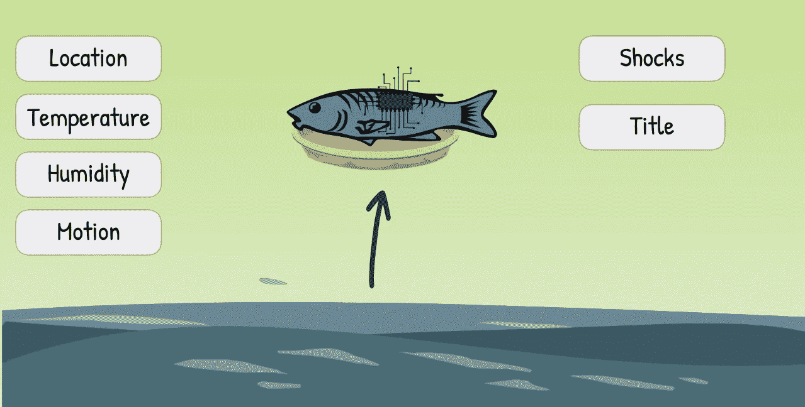

区块链经营的海鲜供应链有助于防止非法捕捞或储存不当的鱼进入市场。它可以为供应商提供公平的竞争环境，并奖励良好的做法。供应商和消费者将知道他们得到了什么，并得到他们所支付的。因此，区块链可以提高整个系统的透明度和信任度。此外，智能合同自动化可以节省时间和运营成本。

区块链技术的另一个大力支持者正是沃尔玛。同样，该应用程序侧重于食品供应链。

像沃尔玛这样的大型零售商和消费者一样，在许多情况下都遭受了进入市场的受污染食品的危害。为了意识到这个问题的严重性，考虑下面的例子。

十年前，在美国，受污染的菠菜中的一种致命的大肠杆菌菌株席卷了 26 个州，导致 3 人死亡，200 多人患病。此次疫情表明，当食品采购和污染追踪出现严重问题时，会发生什么:

沃尔玛高管对这一案例描述如下:“一般来说，消费者不再吃菠菜了。餐馆把它从菜单上撤了下来。如果您能更快地跟踪并查明问题的来源，您就能缓解所有这些问题，并确保消费者的信心持续下去”:

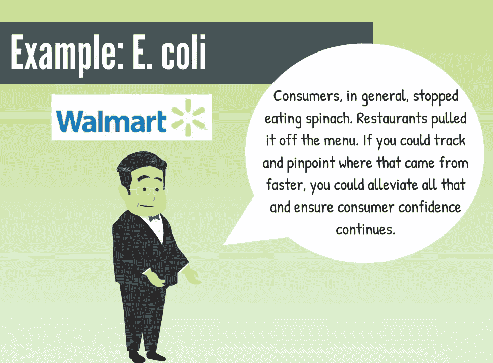

这不是一个孤立的例子。多年来，发生了多起大规模的食品安全问题。

2017 年美国爆发的与墨西哥木瓜有关的沙门氏菌疫情导致 235 人患病，其中 2 人死亡，78 人住院治疗。

你可能还记得 2008 年中国臭名昭著的婴儿配方奶粉掺入有毒化学物质三聚氰胺的丑闻:

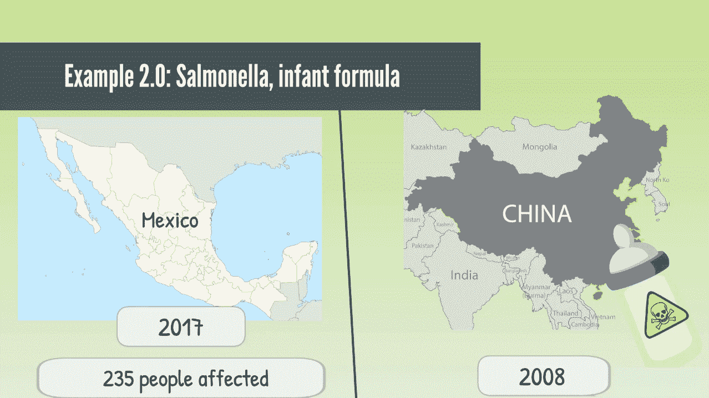

这样的例子不胜枚举…

那么，让我们看看沃尔玛正在实施的解决方案。

作为一个试点项目，它与 IBM 和清华大学合作，在区块链上数字化跟踪中国猪肉的动向。为此，他们使用了超级账本技术。它将使零售商能够跟踪肉类从生产者到加工者，到经销商，到杂货商，最后到消费者的过程:

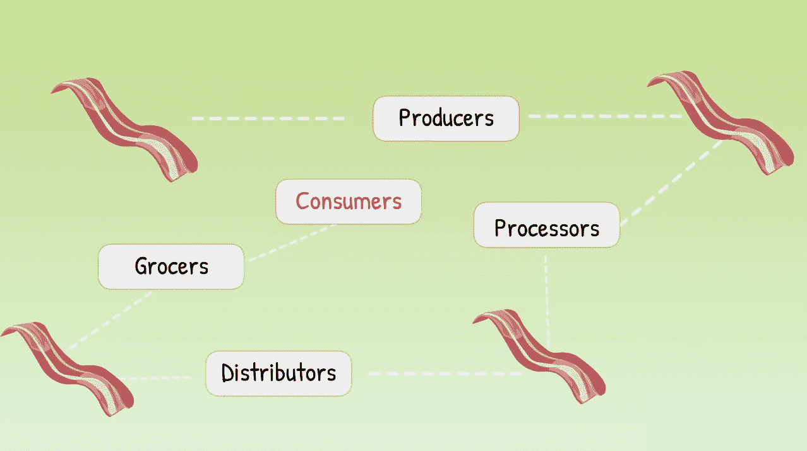

据 IBM 称，这一举措代表了对早期项目的重大改进，早期项目仅使用条形码和无线电 ID 标签。

缺失的部分是一个共享论坛，公司可以在这里看到彼此的交易并建立信任。缺失的那块有点像区块链。

存储在区块链上的信息，包括与农场产地、工厂数据、有效期、存储温度和运输相关的细节，在那里欺诈和不准确更难逃脱。区块链技术可以大大简化行业供应链，并提高传统模式的材料效率:

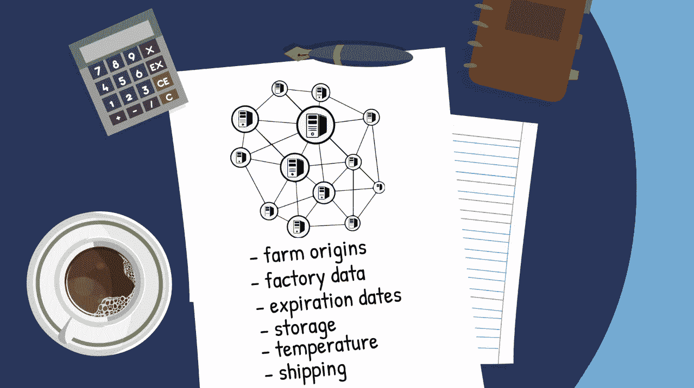

鉴于这个试点项目的巨大前景，沃尔玛随后将其扩大到包括更多的食品。其他消费品巨头，如雀巢、联合利华和都乐，也加入了这一倡议。似乎这个领域的每个人都喜欢通过自动跟踪重要信息来改善供应链的想法，如货物的温度和质量、装运和交付日期以及设施的安全认证。

# 区块链和交通部门

在未来几年，移动服务和汽车公司的业务可能会成为最具活力和彻底变革的行业之一。大众、丰田和通用等传统汽车制造商在未来十年面临两大挑战。

首先，他们必须适应产品线，减少对传统燃料的依赖，专注于电池。这是一个重大的步伐变化，全球汽车制造商别无选择，只能调整他们的商业模式，否则像特斯拉这样的竞争对手将继续获得市场份额。

汽车生产商面临的另一个主要商业风险是来自优步、Lyft 和滴滴等公司的威胁。嗯，这也可以是一个机会；看你怎么看了。

第一种挑战，从传统燃料到电池的转变，与区块链技术没有什么关系。至少，如果我们不进入供应链。

另一个挑战:人们正在改变他们的交通行为和他们消费移动服务的方式，这正是我们想要在这里讨论的。这一领域的大量创新解决方案可能都是基于区块链的。

大多数大型汽车生产商都在尝试某种拼车、拼车或打车计划。例如，几年前，戴姆勒推出了 Car2Go，这是一种短期汽车租赁服务，允许人们跳上一辆车，用它从 A 点运输到 b 点。对于许多生活在大城市的人来说，将运输车辆留在街上的灵活性感觉像是范式的改变。在纽约、伦敦、香港、巴黎、东京、上海和许多其他地方，在高峰时间很难，坦率地说几乎不可能找到停车位。在有限的时间内使用一辆汽车，然后把它转让给下一个需要它的用户，这样更经济。不仅仅是戴姆勒在尝试这种智能汽车共享计划。另一个例子是菲亚特和意大利石油生产商埃尼的合作。他们的合资企业叫做 **Enjoy** ，也提供类似的服务。大多数汽车制造商需要适应这种新的商业模式，否则他们将面临失去市场份额的风险。一方面，他们认为汽车共享是一种威胁，因为这意味着不是每个人都需要购买和维护私人车辆。但另一方面，这也可以被视为一个机会，因为汽车共享可以让这些公司建立基于订阅的业务。这可以弥补传统部门的收入损失，甚至可以创造更多的价值。

未来，区块链技术可以在全球经济中扩大汽车共享服务方面发挥关键作用。基于区块链的解决方案可以帮助汽车共享服务提供商验证司机的身份、驾驶历史和以前的汽车共享使用情况。这有助于根据单个驾驶员的风险状况更精确地降低某些风险。智能合同可以实现与收费公路费用相关的自动支付，保险合同可以根据司机的情况和他或她行驶的距离进行调整。它们还可以用于自动支付旅途中的清洁、加油和其他服务。这种自动化将提高效率，增强用户体验。

为什么要使用基于区块链的智能合约，而不是简单地将数据上传到由公司管理的中央服务器？嗯，这么想吧。人们越来越担心与外部方共享个人信息，并允许 it 为他们管理一切，以保护他们的数据安全，维护专业的商业实践，并收取公平的价格。理应如此。这种集中化会产生单点故障。我们已经看到了无数的个人数据泄露、滥用、不道德行为(例如将个人数据出售给任何愿意付费的第三方)、公然欺诈、数据窃取和滥用市场支配地位的案例。

智能合同解决方案可能涉及多方和服务提供商，每个人管理流程的某个阶段。一家公司可以负责保险，另一家公司负责清洁，第三家公司可以负责收费，等等。当然，管理汽车共享服务的公司也将参与其中，但它不会主导整个格局。区块链解决方案允许价值链的去中心化，在多方之间分配数据和市场力量，并防止任何单一实体成为失败的中心点、瓶颈或可能滥用其市场地位的寻租者。

拼车和打车服务也有类似的发展。

在共乘中，多人同意乘坐同一辆车，这通常是在短时间内安排的。这是另一个伟大的解决方案，它帮助人们省钱、保护环境和社交。智能合同是这种拼车计划的明显选择。智能合同可以根据距离、每英里费率、乘客数量和任何其他相关变量，自动计算服务中涉及的所有费用和价值交换。它可以根据每个乘客所用的距离或旅行时间，在乘客之间快速方便地分摊费用。

车辆安全是区块链可以受益的另一个领域。汽车正变得越来越自动化，这意味着它们的网络安全也需要得到解决。为此类物联网应用设计强大的 IT 基础设施变得至关重要。区块链的去中心化和不可改变的特性可以为数据验证提供很大的好处。它可以降低系统中心点故障和外部干扰的风险，从而提高用户安全性。

区块链有望在汽车行业发挥重要作用的其他领域包括供应链管理、制造、车辆租赁融资、车辆注册、监控和认证、远程信息处理等。

接下来，我们将探讨区块链如何革新我们所知的科技领域。

# 区块链和全球科技巨头

现在，让我们考虑一下区块链时代互联网巨头的未来。我们将做出的许多假设和设想都与区块链成为改变游戏规则的技术的场景有关。

目前的互联网领域由四家科技公司主导:谷歌、脸书、亚马逊和苹果。这是一种集中模式，其中四家公司控制了大部分用户数据。

另一方面，区块链是一种推动去中心化的技术。

因此，当新的分散式替代方案出现时，用户的反应非常有趣。同样值得注意的是，所有领先的科技公司现在都在关注区块链，并想办法将它融入自己的商业模式。

这是一个纯粹的战略分析，分析区块链可能如何影响四大科技巨头的业务。

让我们直入主题，从分析谷歌及其在区块链时代的业务开始。

# 谷歌

谷歌才是真正的互联网巨头；截至 2018 年 12 月 31 日，该公司的收入为 1100 亿美元，这导致了 130 亿美元的净收入。我们还应该记住，收入以惊人的 17%的速度增长。该公司继续扩张:

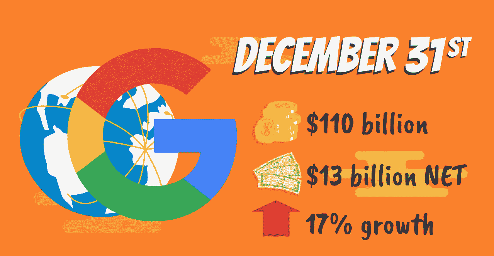

我们大多数人每天都在使用谷歌的一些服务，很难不去做。毕竟，它拥有世界上最受欢迎的网络搜索引擎、视频搜索引擎、电子邮件服务、定位服务和最受欢迎的移动设备操作系统。

几乎他们做的任何事情不仅是世界一流的，而且在大多数情况下，是同类中最好的。

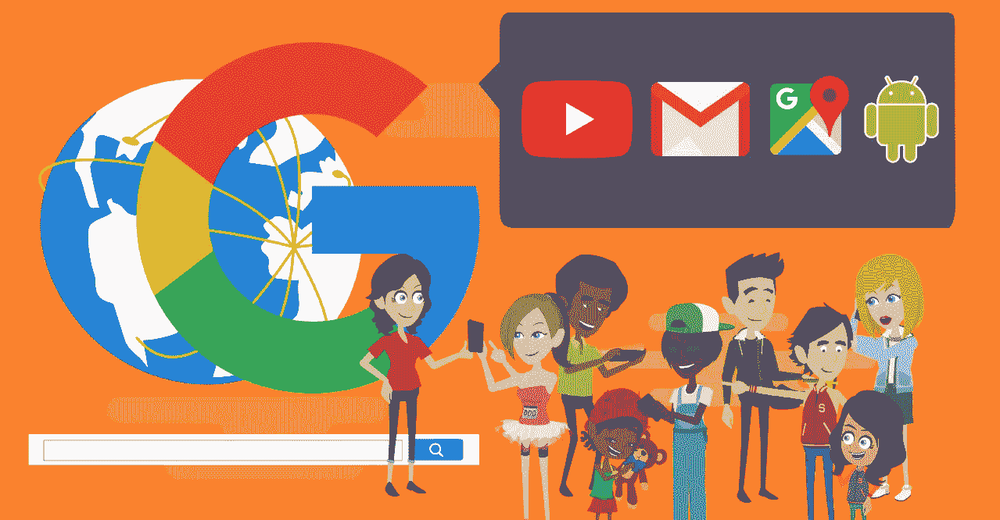

谷歌在搜索领域占据主导地位有两个主要原因。第一个是习惯，第二个是优越的数据科学和 AI。几年前，谷歌在搜索领域成为家喻户晓的名字，人们在需要查找信息时仍会继续使用它。此外，提出强有力的机器学习算法的最佳方式是拥有大量用户数据，以便根据一个人的偏好来塑造搜索结果。简而言之，谷歌能够找到更适合你搜索的结果，因为你过去使用过他们的搜索引擎。

区块链如何才能颠覆谷歌的搜索霸主地位？

做这件事会很难，而且肯定需要一些时间。但这并非不可能。越来越多的平台试图挑战谷歌的统治地位。像 DuckDuckGo 这样不出售用户数据的注重隐私的搜索引擎很有机会打破目前的现状。但要做到这一点，像 DuckDuckGo 这样的搜索引擎需要与收集客户数据(所谓的身份令牌)的平台进行某种整合。因此，通过将注重隐私的搜索与类似质量的搜索体验相结合，用户会更高兴一家公司不拥有他们所有的搜索查询。

另一个激励因素是，未来的分散搜索平台可以向用户提供令牌。部分广告收入将作为对平台用户的回报。这可能是一个很好的激励，有助于该平台找到第一批采用者，并更快地发展。我们已经看到区块链的初创企业也在实施类似的模式，比如之前讨论过的带有基本注意力令牌的 Brave browser。

YouTube 是全球第二大搜索引擎，当然也是最大的视频搜索引擎。与 YouTube 竞争很难，很多原因与谷歌搜索竞争很难是一样的。他们拥有海量的数据，可以向用户提供他们想看的视频内容。

然而，据报道，许多内容创作者对从 YouTube 获得的版税不满意，这也是事实。此外，到目前为止，观众不会因为正在播放的广告而获得任何形式的奖励。

# 区块链如何打破 YouTube 的统治地位？

在这样的背景下，通过引入一种对内容创作者和观众都有更强激励的模式来挑战 YouTube 的霸权可能是有意义的。加密令牌形式的激励以及吸引一些高质量的内容制作者，可能有助于从 YouTube 分流一些流量。实际上，DTube 是一个基于 Steem 区块链的视频分享平台。它向用户承诺了几个诱人的激励措施:金钱激励(贡献内容时获得代币)，抵制审查的分散平台(用户对视频质量进行投票)，以及最终的平台免费广告。我不确定这是否是能持续并战胜 YouTube 的精确商业模式，但第一块石头已经扔了。

Viuly 还在开发一个位于区块链的视频共享平台，可能会有更多分散的竞争对手进入该领域:

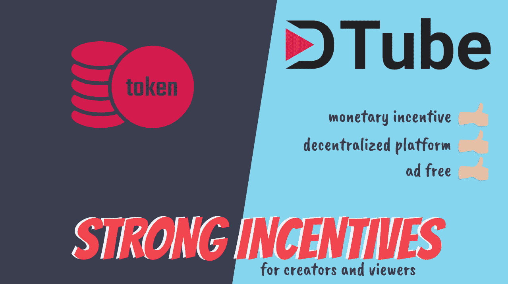

最后，我们想讨论一下 AdSense，谷歌的展示广告服务，它允许第三方网站整合谷歌为他们找到的广告商的广告。在这种情况下，谷歌作为一个中介，推动网站流量到寻找张贴广告的广告商。当然，谷歌从广告收入中收取一定比例的费用:

总的来说，人们对广告又爱又恨。有时他们发现它们很有用，但在大多数情况下它们并不有用。此外，这么多网站完全从广告收入中赚钱的事实已经改变了内容在互联网上的显示方式，但这未必是最好的方式。许多网站，甚至是声誉好的网站，都充满了点击诱饵，试图最大化用户显示的印象数，并提高广告收入。这导致了更糟糕的客户体验，并助长了错误的行为类型，网站创建者并不是真的对提供有意义的信息感兴趣，而是在欺骗访问者进行更多的点击:

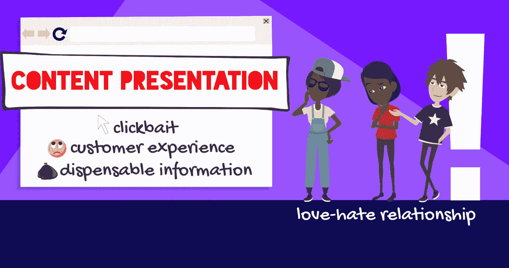

# 区块链是如何颠覆 AdSense 的？

嗯，看到像 Medium 这样的平台在未来获得更多的关注也不是不可能的。一个更好的解决方案是一个平台，它结合了媒体的最强大的功能之一，用户鼓掌，以及符号化的激励。其实这样的平台早就有了，它就是 Steemit。

当然，广告如何融入这种模式还有待观察，但相对于目前的现状，一个针对用户体验进行优化并帮助人们在没有 clickbait 的情况下找到相关内容的平台将是一个重大改进。

我们还应该提到，谷歌正在开发自己的区块链技术和解决方案，就像所有其他科技巨头一样。我们期待看到这些努力的进展，以及谷歌是否能在区块链充满希望的勇敢的去中心化新世界中保持其网络主导地位。

# 脸谱网

在四大科技巨头中，脸书的业务受到区块链科技的威胁最大。人们对脸书收集的数据量越来越警惕。

一家公司控制着全球三分之一人口的电子邮件、传记、兴趣、熟人、关系、旅行、思想，甚至爱情兴趣等信息。2018 年 4 月，剑桥分析丑闻证实并强调了这些担忧:

脸书现在收集数据的方式是集权的缩影。

目前，脸书是数字广告客户使用的第二大平台。2017 年其收入为 406 亿美元，该公司设法将近 160 亿美元转化为净收入，净收入利润率达到惊人的 40%:

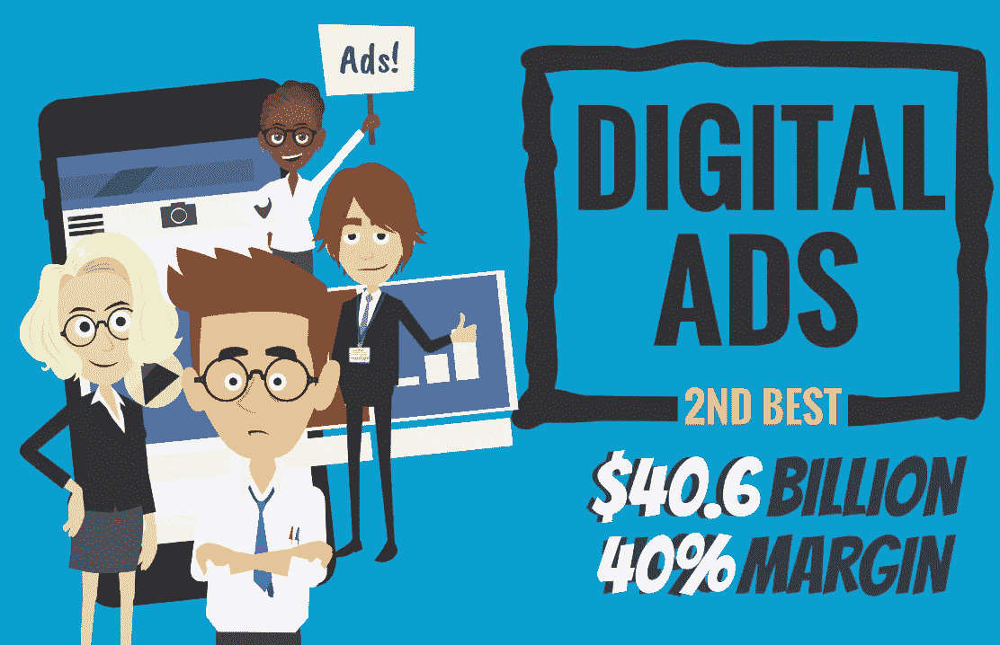

其核心业务是社交媒体平台脸书和 Instagram，以及即时通讯应用 Facebook Messenger 和 WhatsApp。

研究表明，脸书的使用并不能提高人们的幸福感。反而让人更难受。然而，也应该指出，脸书作为一个社交网络，受益于真正强大的网络效应。该平台为用户创造价值，因为它将用户与他们的许多朋友、亲戚和熟人联系起来。

# 区块链怎么能扰乱脸书的商业呢？

一个分权版的脸书可能会获得动力。有许多人只是在等待不同的东西出现在舞台上。未来平台的基石应该是去中心化。如果用户团结在一个理念周围，即没有一家公司应该对他们的个人数据拥有如此大的控制权，那么一个去中心化的平台就很有可能成功。现在，即使他们不承认，脸书管理用户体验是为了提高广告收入。当然，这对用户的快乐来说不是最佳的，事实上，有研究表明，人们在脸书上花的时间越少，感觉越好。一个分散的平台将有明显的优势，它可以调整对用户的激励并增强他们的体验，以及以分散的方式存储信息。

脸书的网络效应非常强大。超过 20 亿的用户已经在使用这个平台，这使得新的竞争者更加困难。分散式的替代方案需要早期采用者，他们会传播消息并邀请其他用户。十有八九，通过代币的激励可以极大地帮助吸引这些早期采用者。

Steemit 在创建这样一个平台方面处于领先地位。这是一家总部位于区块链的社交媒体，每个人都可以通过创建和管理内容获得报酬。在 Steemit 的模型中，用户的参与会得到本地令牌的奖励。其网络的正确市场容量约为 10 亿美元:

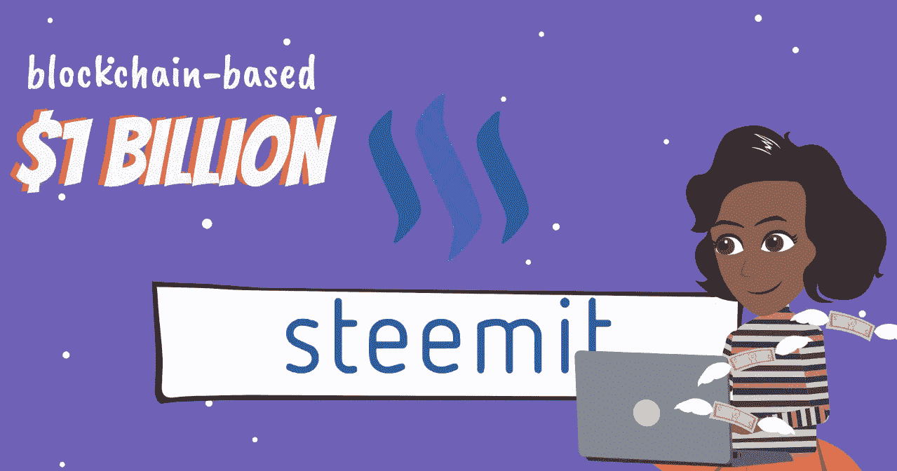

Instagram 是脸书的宝贝之一，它在 2012 年以 10 亿美元收购了该公司。这是其增长最快的业务线，在引入 Instagram stories 后更是如此。

所有与脸书相关的评论在 Instagram 上都有效，只有一个主要的例外。Instagram 是一个让用户非常简单的平台:他们上传照片，仅此而已。用户在 Instagram 上提供的数据量没有在脸书上发布的多。与大多数总部位于区块链的另类社交网络和去中心化应用一样，Instagram 的去中心化版本可以通过向用户提供代币来激励他们参与该平台。

许多人都记得几年前脸书斥资 190 亿美元收购 WhatsApp 的事情。马克·扎克伯格(Mark Zuckerberg)决定坚持到底的原因是，WhatsApp 带来了一个庞大的联系人列表，这些人在与脸书截然不同的环境中使用这款即时通讯应用。然而，WhatsApp 收集了大量个人信息，对脸书来说非常重要的是，它在人们的脸书个人资料和他们的电话号码之间建立了一座桥梁，更令人担忧的是，他们的联系人列表:

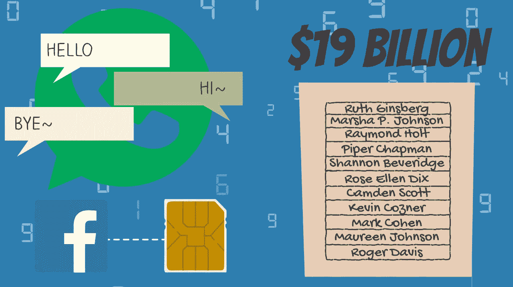

Messenger 是脸书的本地消息服务，在脸书用户中很受欢迎，是消息领域的一个独立的发电站。

当然，对脸书来说并不都是严峻的。将脸书的平台与区块链的技术和加密令牌相结合，可以提升其客户价值主张。例如，这可以极大地促进其平台上的支付和市场功能。或者，它可以帮助脸书创造令牌化的加密经济激励，让用户积极参与平台，就像 Steemit 所做的那样。事实上，脸书已经在积极探索区块链的机会，并为此组建了一个专门的 R&D 团队。

对他们来说，一个很好的案例是中国占主导地位的微信通讯应用，拥有 8 亿用户，被积极用于支付。

但人们也应该考虑到，在某种程度上，社会可能真的厌倦了一家大型社交媒体公司拥有他们所有的数据，现在正试图进入他们的钱包:

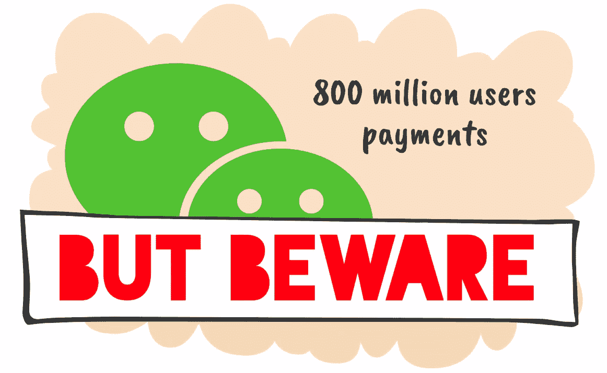

在所有情况下，在未来几年，脸书要么巩固其作为全球领先社交网络的地位，要么将面临新的和快速增长的分散社交媒体和信息替代品的竞争。

# 亚马孙

现在，我们将注意力集中在亚马逊上。看到一家如此大的公司能够以如此快的速度继续扩大业务，令人印象深刻。

其核心业务部门包括:

*   全球排名第一的电子商务门户网站:[Amazon.com](http://amazon.com)
*   亚马逊网络服务，按需云计算平台，行业领导者
*   亚马逊开发的虚拟助手 Alexa
*   Audible，一个有声读物市场
*   美国连锁超市全食超市
*   亚马逊的流媒体视频和音乐部门 Amazon Prime

那么，区块链技术的出现会如何颠覆亚马逊呢？

亚马逊面临的最大威胁是其电子商务业务的中断。有许多区块链项目在建设分散的市场，尽管其中大多数并不完全适合你在亚马逊上找到的消费品。这些新的挑战者大多专注于虚拟商品，如电脑游戏项目，备用电脑容量，电力，等等。电子商务领域一个值得注意的新进入者和 Amazon.com 的直接竞争对手是 OpenBazaar。它于 2016 年推出，得到了包括 Andreessen Horowitz 和 Union Square Ventures 在内的风险投资者的支持，并提供了一个完全分散的点对点电子商务市场，用户可以使用多种加密货币进行支付。它的功能不如亚马逊和其他成熟的市场领导者丰富，但它没有平台费，也不控制用户的个人数据。

亚马逊如此成功的原因之一是它控制了其平台上的所有客户数据，这些数据被分析并用于优化消费者目标、转化率和收入。

与大多数互联网企业一样，网络效应也是电子商务的关键。亚马逊拥有众多买家和卖家的临界质量和网络流量。这类似于周围人口密度高的黄金中心城区的购物中心。它还具有消费者习惯和许多用户特征方面的优势。这对亚马逊来说是一个很好的市场定位，因此它是世界上股票投资者估值最高的公司之一。

然而，给用户带来便利的同时，他们也付出了巨大的代价。这些成本既有金钱方面的，也有个人数据方面的。正如我们所知，数据已经成为互联网时代最有价值的商品之一。亚马逊完全控制这个平台和所有通过它的信息。它还可以随意限制任何第三方的访问。

分散的电子商务市场可以为用户提供许多优势，包括更低的费用或免费，控制他们的数据，以及无障碍地访问平台。让我们看看这样的平台能走多远，以及它们是否能够与亚马逊和我们今天使用的其他集中式服务进行有意义的竞争。

在这个阶段，供应商似乎有更多的动机将他们的分销渠道迁移或多样化到这些平台，以减轻业务风险和降低成本。另一方面，消费者流量可能更难吸引，因为许多消费者倾向于把便利放在第一位，不太在乎他们的隐私。至少目前如此……但随着更多公众意识和兴趣转向这一方向，这一趋势可能会开始改变，特别是鉴于最近脸书、益百利和其他公司的丑闻以及广泛报道的数据泄露。

以奖金或折扣以及较低价格为形式的象征性秘密经济激励肯定有助于将消费者吸引到新平台。此外，代币具有随着市场和网络整体增长而增值的潜在优势。通过这种方式，一个分散的市场可以与其用户分享其网络效应的价值。这就是区块链在网络中整合所有参与者激励的力量。

去中心化的电子商务是否会起飞，以什么样的形态或形式起飞，只有未来才能告诉我们。我们可以看到新进入者的快速增长或亚马逊等现有者的成功适应，它们可能会找到将区块链技术融入其商业模式的好方法。无论如何，权力下放有其优点，用户应该从中受益。

电商巨头转向区块链的一个很好的例子来自阿里巴巴。阿里巴巴旗下的天猫商城(T-Mall)平台正在跨境供应链中采用区块链技术，以追踪和验证产品的来源，并降低假货销售给消费者的风险。

# 区块链对亚马逊网络服务的影响

亚马逊似乎很好地适应了新技术，并且已经在其新的亚马逊管理的区块链平台(AWS 的一部分)中创建了 Hyperledger 和以太坊模板。它被宣布为一种完全托管的服务，使创建和管理可扩展的区块链网络变得容易。

一个相关的项目，Amazon**Quantum Ledger Database**(**QLDB**)，这是一个旨在提供透明、不可变和可加密验证的交易日志的分类帐数据库，最近也推出了。

AWS 和 ConsenSys 的区块链初创公司 Kaleido 推出了一个名为 **Kaleido Marketplace** 的全栈平台，帮助企业实施区块链解决方案。该平台通过提供一系列即插即用的全栈工具和协议，消除了构建给定区块链项目所需的 80%的定制代码，满足了从后端开发到前端应用程序用户界面的需求。

与亚马逊的其他产品和服务相一致，这应该为在企业环境中部署区块链技术提供了一种快速简便的方式。

分散的网络存储服务可能是这个行业的潜在威胁，但是这些新进入者还有很长的路要走:

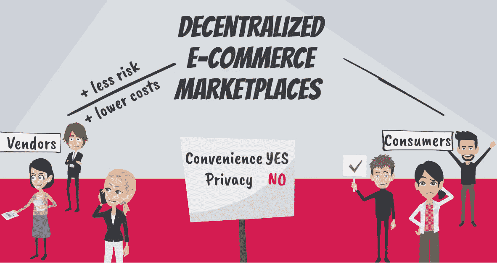

AWS 以极具竞争力的价格提供安全存储，甚至美国政府机构如中情局也在使用它。因此，对于 Filecoin、Storj、Sia、MadeSafe 等项目来说，至少在最初阶段，很难获得大多数已建立的 AWS 用户群的支持。这种分散存储解决方案更有可能被区块链经济中的其他新兴分散应用首先使用。尽管如此，在消费设备网络中分布文件存储，利用它们的空闲容量，并用加密令牌来奖励它们的想法是非常有趣和创新的。这是我们最近观察到的共享经济和闲置容量利用趋势的延续，对于希望租赁文件存储空间的人以及那些存储容量过剩的人来说，这是一个绝佳的机会。毕竟，AirBnB 在房地产方面也做了类似的事情。

好的，很好。让我们在这里暂停一下，继续讨论四大科技巨头中的最后一个，苹果。

# 苹果

2001 年第一台 iPod 的发布，标志着苹果复兴的开始。该公司继续创造了一些科技界有史以来最具影响力和最受欢迎的消费电子产品。iPod、iPhone、iPad、iMac 和 iTunes sky 使公司价值飙升，成为世界上市值最大的公司。

乍一看，苹果似乎是一家硬件公司，它不应该受到区块链到来的重大威胁。

毕竟，去中心化与销售电子硬件有什么关系，对吗？

苹果传奇的联合创始人史蒂夫·乔布斯的基本信念之一是，计算机系统(以及后来的移动设备)应该在一个集中的生态系统中运行。根据他的说法，消费者选择将硬件和软件最佳结合在一起的产品，而客户不应该决定在他们的设备上运行什么类型的软件。这就是他们付钱给消费电子产品生产商为他们做的事情。消费者最看重便利，这一观点很有道理，也是苹果成功的关键驱动力。乔布斯还认为，iPhones、iPods 和 iPads 主要是由软件驱动的，除了漂亮的设计之外，这也是它们如此独特的原因。

尽管这种理念与区块链技术当前获得动力的去中心化理念背道而驰。

如果人们开始觉得分散软件应用和整体经济是首选的前进方式，而苹果继续实行同样的中央集权做法，这可能是一个潜在的关键时刻。目前，苹果在几代消费者中享有难以置信的忠诚客户群。苹果的观众如此着迷，以至于它就像一个体育俱乐部的粉丝群。苹果皈依者从不改变立场。但是，为了在新一代消费者中保持这种势头，必须通过令人兴奋的新产品和新功能不断培养这种追随者。消费者口味的转变可能会削弱苹果的竞争优势。自多年前推出第一款 iPod 以来，苹果第一次无法夸耀其激动人心的新技术抓住了消费者的注意力并引领了潮流。取而代之的是，比特币、以太坊和区块链其他加密经济最近一直在这么做。在去中心化变得如我们预期的那样流行的情况下，苹果将不得不放松对其围墙花园的一些控制，并允许其设备与去中心化的应用程序一起运行，否则它将面临市场份额被更好地满足市场需求的竞争对手夺走的风险。

因此，这是一个值得关注的非常有趣的发展——分散经济将如何影响苹果的商业模式，苹果将如何应对或适应公共分散应用程序、加密货币支付和任何类型的区块链相关开源软件。

从积极的方面来看，苹果已经使用了区块链技术，根据它提交的一项专利，该技术可以创建和存储时间戳，并保护安全元素，如在其设备上存储机密信息的 SIM 或 micro SD 卡。从本质上讲，区块链可以让苹果进一步提高其设备和应用程序的安全性。目前，苹果的设备拥有同类最佳的加密技术。还记得中情局和苹果公司在 iPhone 加密问题上的斗争吗？嗯，通过加入区块链技术，苹果可以把标准提高到更高。

苹果还可以找到机会，将区块链的解决方案整合到其 ApplePay 移动支付和数字钱包服务中。或者，它可以使用这样的解决方案来改善其 iTunes 音乐平台上的内容版权管理和价值分配。

鉴于智能手机市场的成熟和饱和，区块链可能正是苹果可以用来再次推动其增长的正确成分。

在我们讨论的四大科技公司中，鉴于苹果约 80%的收入来自硬件，苹果承担的区块链中断的商业风险最小。谁知道呢，它甚至可能设法再一次彻底改造自己，并在区块链市场推出下一款重磅产品；想象一下一个假想的苹果 iWallet，一个新的、高质量的、用户友好的区块链钱包，用于安全地存储加密资产，与 Ledger Nano 和 Trezor 等公司竞争。

# 摘要

这一章我们已经拖了很长时间，所以我希望你还没有退出。我们了解了区块链将如何影响我们的日常生活。我们了解了区块链将如何影响金融业。我们了解了银行目前面临的一些问题，以及区块链将如何解决这些问题。我们也知道区块链将如何扰乱公共部门，如食品、交通、技术等等！

我希望这一章对你们所有的读者来说是令人兴奋和有启发性的。如果这让你为区块链的出现而兴奋，那么我们的使命就完成了！！敬请期待，因为好玩的部分才刚刚开始！在下一章，我们将看看区块链和人工智能是如何携手改善我们的生活质量的。