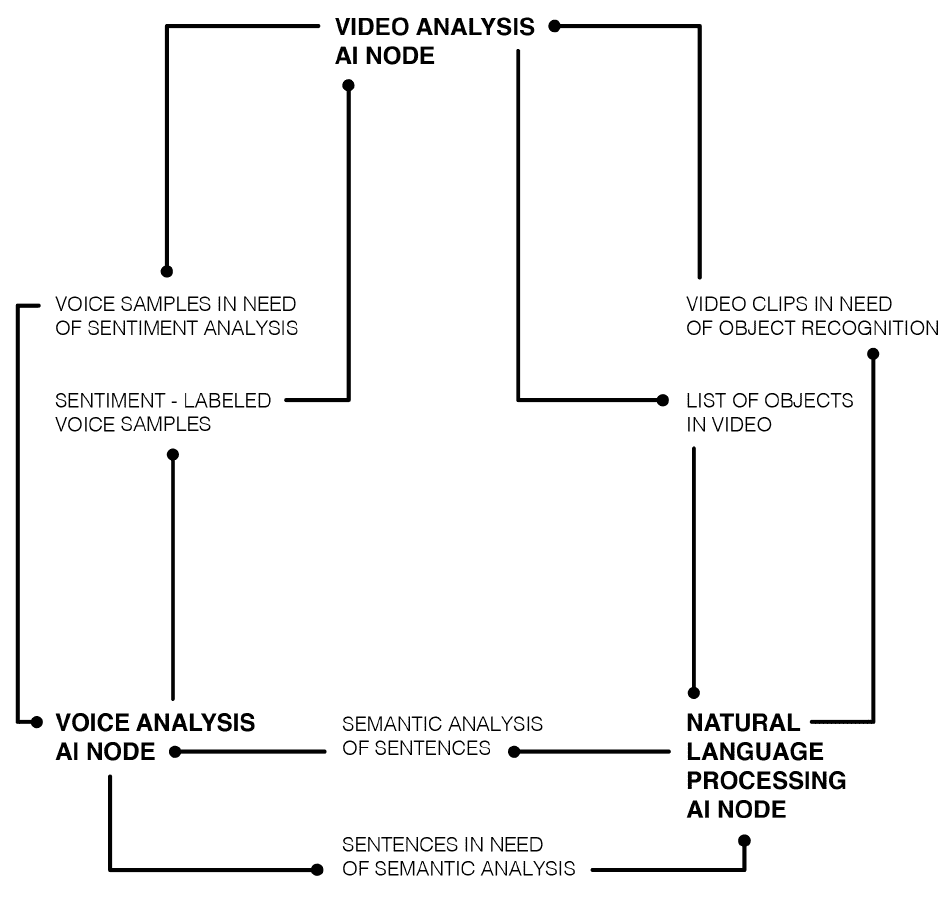
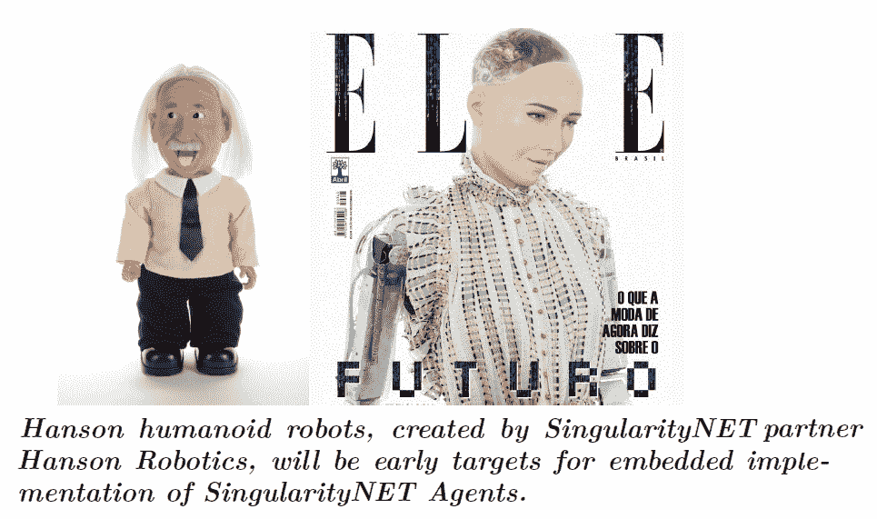
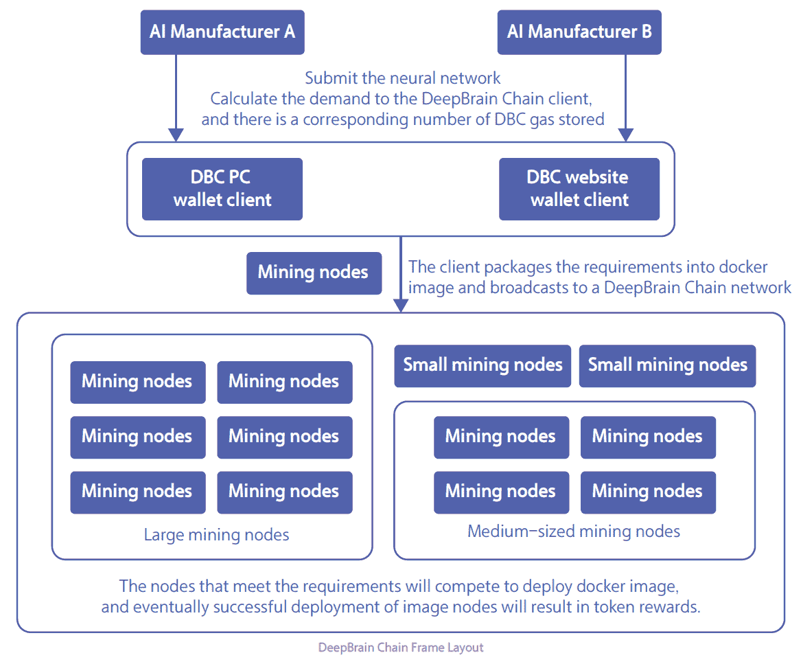
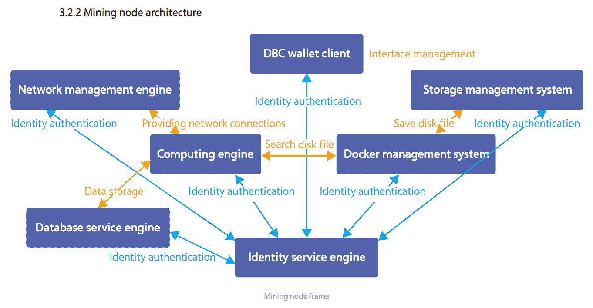
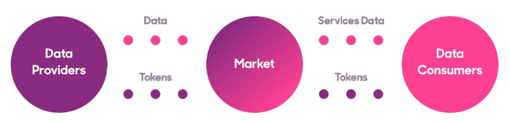
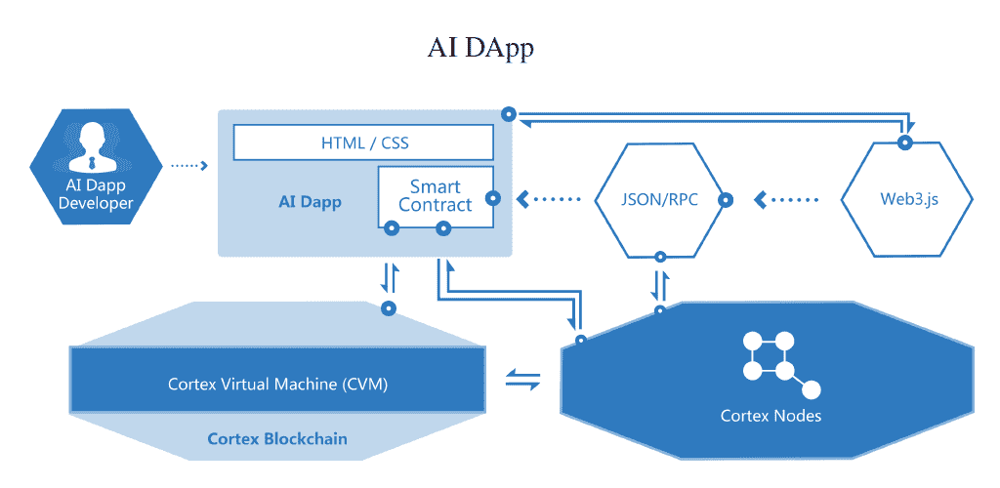
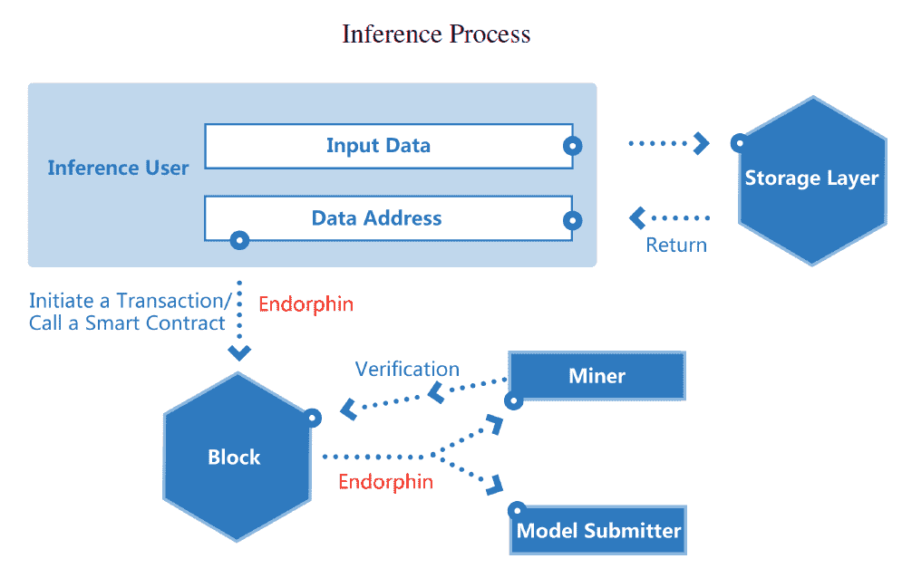
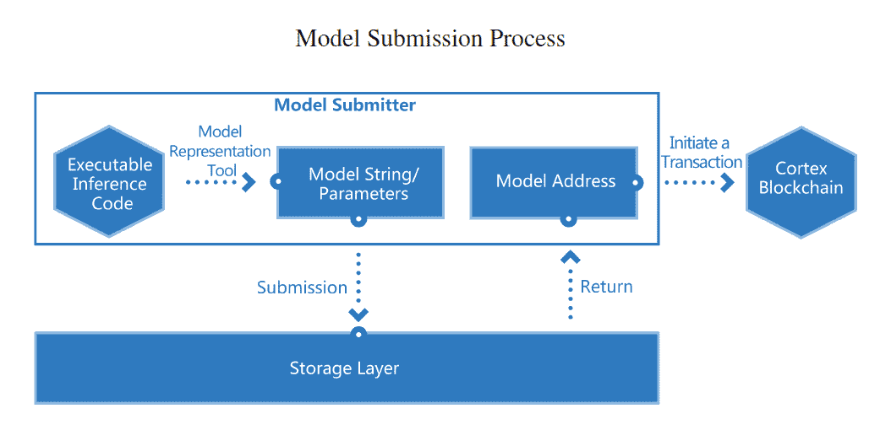
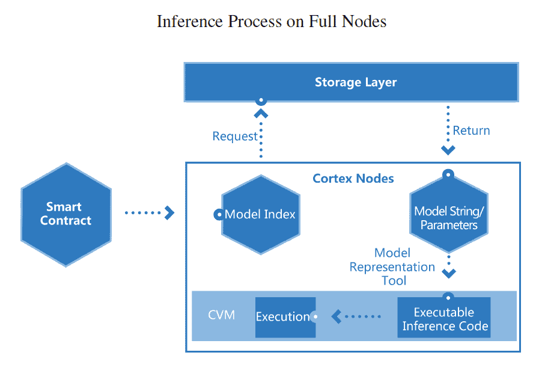

# 区块链和人工智能

区块链和**人工智能** ( **AI** )是时下最热的两大技术趋势。难怪大多数公司和风险资本投资者都对在各个领域实施这些技术感兴趣。

区块链使用加密技术，以创新和安全的方式分散和分发数据。它可用于优化价值转移网络、资产登记和市场的效率。这就是为什么它也被称为分布式账本技术。分布式分类帐确保网络中的所有各方在过去的活动和当前的余额方面始终在同一页上，因为它们同时更新每条新信息。这在很大程度上是一种流程创新，在大部分交易和业务流程电子化管理的数字时代非常有用。正如我们在本书中所看到的，它的应用范围从金融服务到供应链管理和智能合同。

在本章中，我们将讨论以下主题:

*   人工智能简史
*   实施人工智能
*   结合区块链和人工智能的项目
*   智能合约的人工智能未来

# 人工智能简史

人工智能，虽然目前是一个非常常见的流行语，但并不是一个全新的概念。该领域的研究始于 20 世纪 50 年代，当时计算机学习简单的游戏，如跳棋。起初，人们期望在 20 年内，机器能够做人类能做的任何工作。随后，由于计算能力和商业可行性的限制，人工智能的进展有起有落，这影响了该领域的可用资金和公众关注。这并不奇怪，因为这是技术进步中经常重复的模式。这可以与 20 世纪 60 年代和 70 年代的所有月球探测任务相提并论，这些任务后来都停止了或大大减缓了。公众的关注和资金预算是持续创新背后的关键驱动力。

回到人工智能，20 世纪 90 年代和 21 世纪初，计算能力的提高和商业上的成功进一步推动了人工智能的发展。它在物流、数据挖掘、医疗诊断和其他领域找到了用例。另一个重大突破发生在 1997 年，由 IBM 开发的计算机“深蓝”与加里·卡斯帕罗夫对弈，成为第一个打败国际象棋世界冠军的人工智能。

# 实施人工智能

展望今天，我们可以在我们周围的任何地方看到人工智能的实现，因为越来越多的部门越来越多地使用智能算法来自动化任务。一些例子包括亚马逊基于以前的购买或活动的个性化用户推荐；脸书和谷歌的定向广告，优步用来确定到达时间、上车地点和票价的人工智能模型，以及贝宝用来检测和打击欺诈的机器学习算法。据技术研究公司 Tractica 称，到 2025 年，人工智能软件和服务的全球市场将达到 600 亿美元，该公司已经确定了 29 个行业的 150 多个特定人工智能用例。

人工智能依靠大型数据集来训练和改进算法，数据似乎是区块链和人工智能的交叉点。数据是实现人工智能发展的关键资源。从根本上说，区块链是一种数据结构，它通过点对点市场和源于博弈论的激励机制，实现了有效的众包资源方式。因此，我们看到的试图结合这两种技术的第一个项目围绕着人工智能市场和众包计算资源。鉴于人工智能的巨大潜力和全球科技行业的现状，即市场力量高度集中在少数几家非常强大的公司，为人工智能资源提供分散的替代方案可能是一件好事。

现在，让我们仔细看看一些结合了区块链和人工智能的创新项目。

# 结合区块链和人工智能的项目

SingularityNet 由著名的人工智能科学家 Ben Goertzel 创建，他也创造了类似人类的机器人 Sophia，正在为人工智能服务建立一个分散的市场。我们分析的一个很好的起点是该项目的白皮书，它总结如下:

“人工智能的价值和力量每年都在急剧增长，并将很快主导互联网——以及整个经济。然而，如今的 AI 工具被封闭的开发环境割裂了；大部分都是一个公司开发来执行一个任务，没有办法把两个工具塞在一起。SingularityNET 旨在成为联网 AI 和机器学习工具的关键协议，以形成协调的人工通用智能。”

SingularityNET 是一个开源协议和智能合同的集合，用于协调人工智能服务的分散市场。在这个框架内，人工智能的好处成为造福所有人的全球公共基础设施——任何人都可以获得人工智能技术或成为其发展的利益相关者。任何人都可以将人工智能或机器学习服务添加到 SingularityNET 以供网络使用，并作为交换接收网络支付令牌。典型奇点网络系统的架构如下:

SingularityNET 得到了 SingularityNET 基金会的支持，该基金会的运营理念是，人工智能的好处不应由任何一小撮强大的机构主导，而是由所有人共享。SingularityNET 的一个关键目标是确保该技术符合人类标准，并且该网络旨在激励和奖励有益的参与者。

这里的关键思想是，人工智能服务应该在竞争激烈的 P2P 市场上开放和交易，以获得闲置产能，就像 AirBnB 在房地产领域所做的那样。这里未开发的资源是 GitHub 和其他地方存在的独立研究人员开发的 AI 算法和软件，以及计算机处理能力和内存。目前，人工智能 R&D 是大学和大型科技公司的领域，而 SingularityNet 的目标是使其成为一种共享资源，以自由市场价格提供给负担不起自己的人工智能专家团队的中小企业。平台上交换的服务可以是基于软件或硬件的，可能包括以下内容:

*   图像和视频处理服务，如找出视频中的人物，或制作图像的文本描述
*   语言处理服务，如文本摘要、机器翻译或文本情感分析
*   提供数据集作为背景知识，训练人工智能对其他数据集进行数据分析
*   请求对特定数据集进行分析
*   交换处理时间或内存

如前所述，机器学习工具需要大型数据集，难以获取和管理。大型科技公司的封闭开发环境模式阻碍了此类数据集的共享。另一方面，像 SingularityNet 这样的开源环境可以以安全、加密的方式实现数据集共享。因此，它应该通过促进该领域的活动来刺激整个人工智能的发展。下图显示了奇点网络的一个示例:

还有其他类似的项目试图在区块链开拓人工智能相关的分散市场或网络。一个名为 DeepBrain Chain 的项目正在建立一个分散的全球云计算平台，用于训练机器学习、深度学习和其他人工智能算法。人工智能训练任务是高度计算密集型的过程。在 DeepBrain Chain 网络上运行节点的机器可以将它们的处理能力出租给需要在 AI 模型训练中部署它的参与者。用户可以在不同的人工智能框架中进行选择，如 TensorFlow、Caffe2 和 h2o。DeepBrain 链的布局如下图所示:

在上图中看到的挖掘节点的体系结构如下:

数据集和人工智能模型也可以在平台上共享和交易。已经在该平台的 testnet 上成功运行的人工智能模型包括无人驾驶汽车、自然语言处理和面部识别模型。

Ocean Protocol 是另一个专注于为数据创建自由分散市场的项目，主要用于人工智能开发。他们认为，高质量训练数据的可用性对于人工智能的持续发展至关重要，甚至比新的人工智能算法更重要:

似乎有更高的算法可用性和训练它们的数据集瓶颈，所以这就是海洋协议正在解决的问题。作为一个试点项目，Ocean 正在与几家汽车制造商合作，收集数据，为自动驾驶汽车开发人工智能。

在这里，我们看到了几个结合了人工智能和区块链的通用项目的例子。他们基本上使用区块链技术为人工智能算法、数据集和共享计算资源创建分散的市场，以训练这些算法。区块链的额外优势是数据加密，这有助于在共享经济中保护隐私。同态加密可以用来保护用户数据和人工智能模型在云计算环境中不被破坏。这是指一种加密方法，它使对明文的运算结果等同于对密文的运算结果。

# 智能合约的人工智能未来

更具未来感的智能合约人工智能概念也非常有趣，它最终可以用来建立和运行人工智能 DApps 和**分散式自治组织** ( **DAOs** )，使它们能够适应和进化，在非常有限的人类干预下完成任务。

一个名为 Cortex 的项目声称是第一个支持链上人工智能的区块链。他们已经设法在他们的测试网上部署了一些人工智能模型，使用了诸如量化和压缩之类的技术。量化是机器学习中的一个概念，它将轻量级推理与高性能结合在一起，允许 AI 模型以高精度和低内存成本执行:

推理过程如下进行:

压缩减少了模型的大小和数据使用量。第一个模型是一个猫或狗分类器，最初的大小超过 500 MB。在从原始模型转移学习之后，生成整数模型，以将其大小首先减少到大约 130 MB，然后减少到小于 15 MB。经过训练，浮点数下的准确率在 94%以上，完全压缩转换成整数模型后的准确率在 90%以上。

模型提交过程如下图所示:

第二个模型基于 MNIST 数据集进行数字识别，这是一个手写数字的大型数据库，通常用于训练各种图像处理系统。它从二值化图像中推断数据，给出 0 到 9 的结果，准确率超过 98%。

经过测试，这两个模型都成功地消除了推理过程中的随机因素，并给出了确定性的结果，以达到推理的一致性。这些结果表明，一些准确和高性能的人工智能模型可以部署在链上。自然，Cortex 在存储容量和处理能力上，对全节点的硬件要求要高于比特币和以太坊。完整节点上的组合推理过程如下图所示:

设想中的未来人工智能应用程序包括个性化推荐的信息服务(根据用户资料建议潜在感兴趣的新闻)、图像搜索引擎、新闻/摘要写作(根据另一文本生成新文本)、金融服务，如信用评分(根据用户的在线数据)或智能投资咨询(根据金融数据集)、提供自动问答服务的人工智能助手(根据人类对话生成答案的聊天机器人)和行业知识图表(可用于医疗、咨询和其他行业的专家系统)。

# 摘要

鉴于区块链固有的数据和计算冗余，大规模部署人工智能智能合约仍面临许多挑战，并且在性能上可能永远不如集中式引擎。尽管如此，一些机器学习算法可以以成本和数据高效的方式在链上部署，以将智能合同带到下一个级别。就目前而言，区块链和人工智能技术最可行的组合似乎是将计算资源汇集在一起，并在算法和数据提供商的网络中进行分配，以合作的方式利用这些资源，以便模仿大型世界级人工智能公司的性能和产出。