# 将区块链提升到下一个水平的当前问题和潜在解决方案

如果到目前为止您已经完全阅读了这本书，那么您应该对区块链技术有很好的理解，它是如何工作的，以及它的应用和用例。也许你对这项新技术的颠覆性潜力及其难以置信的优势感到兴奋。准备好迎接这个勇敢的去中心化的新区块链世界了吗？嗯，别这么快，我们还没到那一步。有一些关键问题需要首先解决。在这一章中，我们将讨论这些问题并寻找潜在的解决方案。

我们将在本章中讨论以下主题:

*   区块链面临的问题
*   可扩展性问题的解决方案
*   连锁解决方案
*   外链解决方案
*   其他挑战的解决方案
*   下一代区块链项目
*   激动人心的区块链世界

# 区块链面临的问题

分散式系统在许多方面都很棒，但是在可伸缩性和治理的重要方面，它们与集中式系统相比存在固有的劣势。在网络上的所有节点之间运行共识耗费了太多的时间和精力。相比之下，网络只有一台中央服务器。它肯定会跑得更快吗？但是我们已经讨论了中央服务器模型的缺点:它有一个中心故障点。因此，一方面是可伸缩性和速度，另一方面是安全性。

# 可量测性

与维萨、万事达和贝宝等中央支付处理网络相比，区块链目前的速度是出了名的慢。比特币的区块链目前每秒只能处理 7 笔交易。以太坊的区块链稍快一些，目前每秒可以处理 30 笔交易。相比之下，Visa 和 Mastercard 每秒可以处理大约 50，000 笔交易。PayPal 的峰值吞吐量为每秒 450 笔交易，如下图所示:

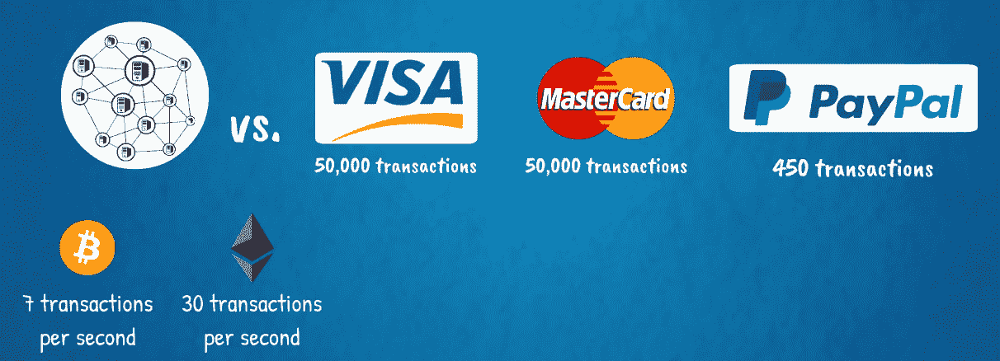

很明显，比特币和以太坊的主要可扩展性瓶颈之一是全球共识机制。他们当前的架构需要一些修改，以适应大规模采用的通用技术。当然，全球开发者社区不断提交协议改进建议，核心开发团队也在忙于升级工作。但是技术复杂性只是问题的一个方面。另一方面是政治性的，这就是治理问题发挥作用的地方。

拥有如此广泛的利益相关者群体，就项目的未来发展达成共识是极其困难的。此外，各种参与者之间的关系相当复杂。区块链网络不是股东、管理委员会和其他利益相关者之间所有权、权力和控制权分离明确的公司。至少在这个早期阶段，区块链社区的治理界限相当模糊。重要的利益相关者包括创始团队、基金会或其他正式管理机构、开发者、矿工和加密资产持有者。所有这些利益相关者共同为网络的价值做出贡献。为此，他们形成了一个生态系统，在这个生态系统中，每个利益相关者群体都需要其他群体，他们都从相互参与系统中受益。

在经济学中，这被称为积极的网络效应。网络越大，越有价值。

但是，当需要做出决策时，网络的巨大多样性带来了问题，每个人都需要同意一个行动方案。这一点已经在许多场合得到了证明，其中最著名的一些是 2016 年以太坊和以太坊经典之间的 DAO hack 之后以太坊网络的分裂，以及 2017 年的比特币缩放辩论。后者在 2017 年的大部分时间里展开，热门话题是比特币协议升级提案，内容涉及提高块大小限制和实施一种名为隔离见证的技术，两者都是为了提高可扩展性。在那场辩论中，比特币社区出现了巨大的分歧，这一分歧无法解决，并导致原始比特币和新比特币现金之间的网络分裂，即所谓的硬分叉。

所以，这就是我们今天如何拥有比特币和比特币现金，以及以太坊和以太坊经典:

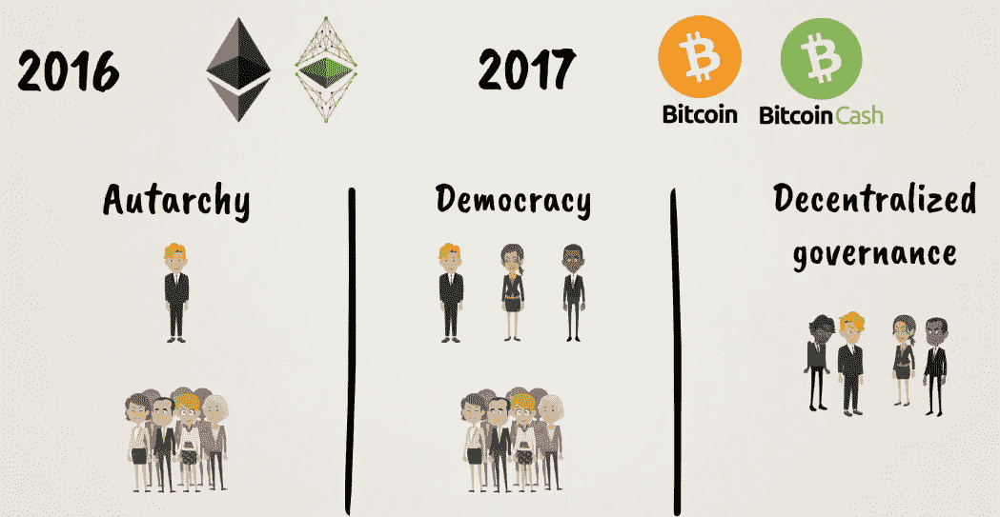

# 管理

分权治理是一件相当复杂的事情。多年来，政治体系一直试图达到权力和代表性的最佳平衡。即使经过这么多的尝试和错误，这种平衡也很难有效维持。代表对于简化决策是必要的，但也创造了一个权力中心，使系统比最初设想的更加集中。

那么，如何在不损害权力下放这一基本原则的情况下简化区块链社区的治理呢？这是继可伸缩性之后新一代区块链技术试图解决的下一个大问题。

# 互用性

区块链面临的另一个关键问题是互操作性。目前，不同的区块链之间互不交流，甚至很难从互联网上获取数据。为此，他们需要一种叫做预言师的特殊中介。Oracles 提供了位于区块链的智能合约和它们需要访问的任何外部数据之间的接口。这些数据可能是正确执行智能合同的关键条件。因此，作为中间人的集中神谕，对于一种试图避开中间人、促进全球去中心化的技术来说，并不是一个理想的解决方案。为了在全球取得成功，下一代区块链肯定需要能够相互连接，并与传统 IT 基础设施互连:

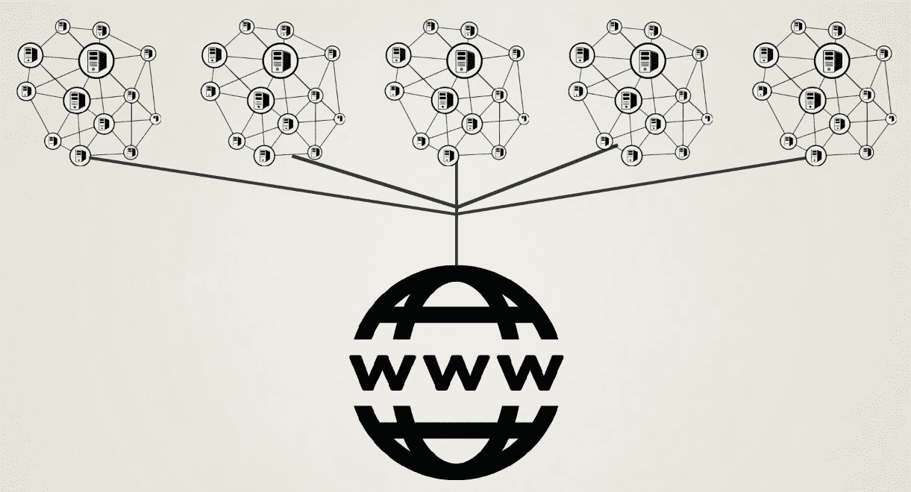

# 隐私

区块链的隐私是另一个需要解决的关键问题。例如，金融部门受到严格监管，必须不惜一切代价保护客户隐私，敏感信息只能在需要知道的基础上与监管机构共享。类似地，许多对在内部流程中部署区块链技术感兴趣的公司可能不希望他们的商业秘密被记录在一个透明且不可改变的公共账本上。许多高知名度或高净值个人的私人金融交易也是如此。隐私在互联网时代受到高度重视，区块链必须能够向用户提供这种选择，如果他们要实现大规模采用。

既然我们已经定义了主要问题，让我们看看它们的潜在解决方案。在区块链创新的最前沿，我们有新颖的共识算法，如 Proof-of-stage 及其变体，以及其他尖端技术，如 lightning networks、state channels、side-chains、sharding、plasma、多层协议、原子交换和分散交换等。我们将在接下来的小节中更详细地研究它们。它们被开发为升级现有区块链协议(如比特币和以太坊)的解决方案，以及新兴区块链协议(如 Cardano、Tezos、EOS、Polkadot、Cosmos、Icon、Wanchain、RChain、Aion、Zilliqa 和许多其他协议)架构的基础:

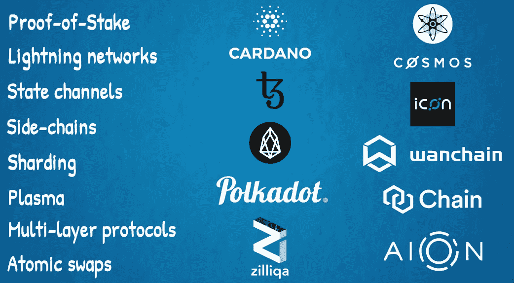

越来越有意思了！我们要先睹为快区块链 3.0 了！敬请期待！

# 可扩展性问题的解决方案

首先，区块链需要解决可伸缩性问题。

在区块链的环境中，我们所说的缩放到底是什么意思？比特币和以太坊等公共区块链的一个核心安全特性，也是一个容量限制，就是它们的协议要求网络中的每一个完整节点处理每一笔交易。所有完整节点都必须复制区块链上发生的每个操作，例如支付或智能合约的部署。这也是区块链公共安全、自治和分权的原因。参与者不必依赖别人来告诉他们区块链的现状；他们自己想出来的。

这限制了区块链的事务吞吐量。它不能高于单个节点的处理能力，其中一些可能相当有限。例如，一些节点可能使用不太强大的计算机，例如消费设备。然而，它们对于保持网络尽可能分散仍然非常重要。我们不希望所有采矿活动都集中在大型工业规模的采矿设施中，这将减少分散化，从而削弱区块链的核心价值主张。这将使其类似于互联网的现状，即基本上是由谷歌、亚马逊和脸书等科技巨头主导的寡头垄断，或金融部门的现状，即由大型跨国银行集团主导的寡头垄断。

因此，需要进行一些修改和升级，以便将区块链技术扩展到全球数十亿人的用户群，与互联网的用户群相称，同时尽可能保持其分散性。

区块链扩展解决方案通常分为两种类型:

*   链上或第 1 层解决方案，之所以这样称呼是因为它们涉及修改主要的底层区块链基础设施
*   离线或第 2 层解决方案，开发连接到主区块链但独立运行的附加网络基础设施

给你一个有用的类比，假设我们有一条高速公路，我们想升级它以允许两个城市之间更快的车辆通勤。也许这条高速公路穿过一片风景如画的自然景观，有山、有湖、有河。这条路可能有点窄，路面可能有点粗糙不平，所以不允许很高的速度。为了绕过湖泊或爬山，道路也可能不沿着两个城市之间的直线，而是有许多转弯、上坡和下坡路段。现在，有两种主要方法来升级这条道路，以允许更快的旅行和更高的车辆吞吐量。我们可以把它加宽或者提高路面质量，或者我们可以建造额外的基础设施，比如隧道和桥梁，使它能够快速通过山脉、湖泊和河流。或者，我们可以双管齐下，因为所有这些解决方案都是相辅相成的。

这是以太坊正在走的路。有许多项目致力于以太坊的各种可伸缩性解决方案，雇佣了许多有才华的开发人员。它们遵循以下路线:

*   第 1 层链上解决方案包括从工作证明转换到利害关系证明共识算法，并实现一种称为分片的技术。
*   第二层非链解决方案包括状态通道，一个名为 Raiden 的闪电网络，一个名为 Plasma 的用于扩展智能合同的新概念层，以及另一个名为 Truebit 的用于处理复杂计算的解决方案。

下图显示了不同的项目:

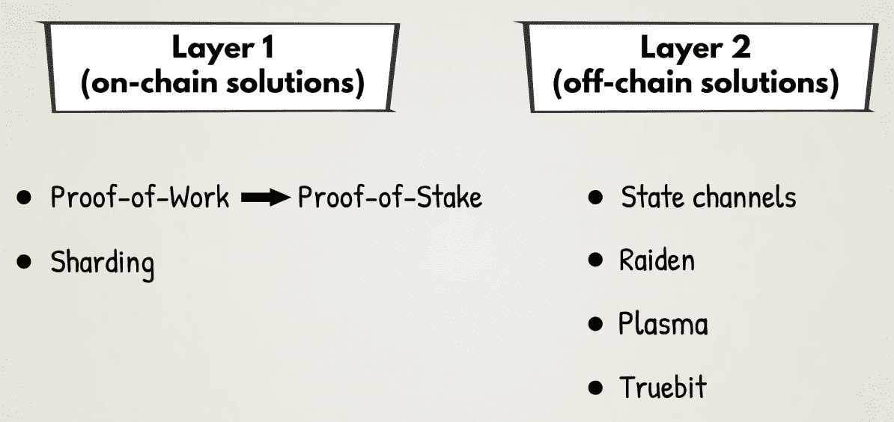

接下来，我们将仔细观察它们。你可以想象这些新技术可能相当复杂，但是我们将尝试在不太专业的情况下解释它们。

# 连锁解决方案

正如我们在前面几节中看到的，链上事务可能非常麻烦。为此，我们将使用以下解决方案。

# 利害关系证明

在本书中，我们介绍了两种一致性算法:工作证明和经过时间证明:

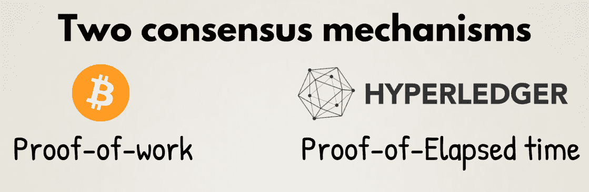

正如我们所知，共识算法需要适合它们所支持的生态系统。适用于开放的无许可公共区块链(如比特币和以太坊)和私人许可的区块链框架(如 Hyperledger)之间存在巨大差异。这种差异源于对系统信任的需要，或者缺乏信任。不同的信任级别需要不同的共识算法。因此，工作证明适用于比特币和以太坊，但运行时间证明则不适用。另一方面，运行时间证明对于许可区块链的 Hyperledger 框架来说是一个很好的解决方案。

对于公共区块链来说，工作证明的另一种选择是利益证明。事实上，以太坊自成立以来的愿景一直是向利益相关者转移，预计这将随着 Casper 升级而实现。

利益验证利用了一种博弈原理，即利用资源来开采新区块，这种逻辑类似于工作验证。主要区别在于，在工作证明中，矿工的股份是外部资源，如电力和计算机硬件，而在股份证明中，他们以自己在网络本地加密资产中的股份为代表，抵押内部资源。因此，在以太坊的情况下，挖掘节点将需要下注他们的以太加密货币，以便验证新的交易块。如果他们不遵守协议的规则，矿工将失去他们的加密资产保证金。这种形式的担保应该为矿商诚信行事提供足够强的激励。

与工作证明相比，利益证明的潜在优势有很多。它不会消耗大量的电力，因此更加可持续和环保。它还应该提供更高的事务吞吐量，因为可以更快地达成网络共识，可能几乎是立即达成共识。

利害关系证明和工作证明也可以在混合一致性算法中结合使用。例如，对于在原生加密资产中拥有较大股份或持有股份时间较长的矿工来说，工作证明哈希难题可以变得更容易。

实际上，一个混合共识系统是以太坊推进其向利益证明过渡的路线图的方式。在以太坊 Casper 升级的第 1 阶段，所有的工作验证机制继续存在，但是增加了额外的利益验证机制。在此实施中，每 100 个数据块中有 1 个是经过验证的检查点。希望成为利害关系证明验证者的参与者可以将他们的以太加密货币存放在一个特殊的智能合同地址:Casper 合同。这个地址将为他们提供一个特殊的验证码，这是一种加密密钥。这个想法类似于我们在第五章、*中讨论的用于签署和发送交易的密钥——比特币的五种力量——第二种密码术*。

有了这个特殊的代码，验证节点可以签名和发送消息，用它们来投票和参与利害关系证明共识过程。对于要被批准包含在区块链中的新的交易块，至少三分之二的活动验证器池必须提交给它。如果同时开采两个不相容的区块，且交易相互冲突，那么对此负有责任的采矿者将失去他们的存款，这将极大地激励他们诚信行事。攻击利害关系证明共识机制的成本可能甚至比购买大量昂贵的计算机硬件进行挖掘和对工作证明共识系统进行反复攻击更高。在股权证明中，验证者也以交易费的形式获得采矿奖励。这有效地为他们的投资带来了稳定的收益。这类似于人们从债券或银行存款中获得的利率。这种**投资回报率**(或**投资回报率**)也类似于工作证明矿工在开采新区块时获得区块奖励的方式，以补偿他们在物理硬件和电力方面的投资。关于这个过程的详细描述，请查看[第六章](06.html)、*比特币的五种力量——# 3 共识算法*。

正如以太坊创始人维塔利克·布特林所说:

*"Proof-of-Stake can be thought of as a kind of virtual mining, whereas in Proof-of-Work, users can spend real-world dollars to buy real computers which expend electricity and produce blocks at a rate roughly proportional to the cost expended, in Proof-of-Stake, users spend real-world dollars to buy virtual coins inside the system, and then use an in-protocol mechanism to convert the virtual coins into virtual computers, which are simulated by the protocol to produce blocks at a rate roughly proportional to the cost expanded, replicating the exact same effect but without the electricity consumption."*

大多数试图构建下一代区块链的新项目都使用了某种形式的利益相关者共识机制。

利害关系证明的潜在挑战来自这样一个事实，即它是一个较新的、在很大程度上未经测试的协议。毕竟，工作验证是一种更为成熟和久经考验的共识机制。这从比特币 10 年的历史中可见一斑。这就是为什么目前大多数另类公共区块链，或另类硬币，使用它。仅仅基于工作证明来支持互联网规模的未来全球交易网络是否可持续，则是另一个问题。也许利害关系证明更适合这一点。或者更有可能的是，我们将使用许多不同的共识算法，每种算法都适用于不同的环境:

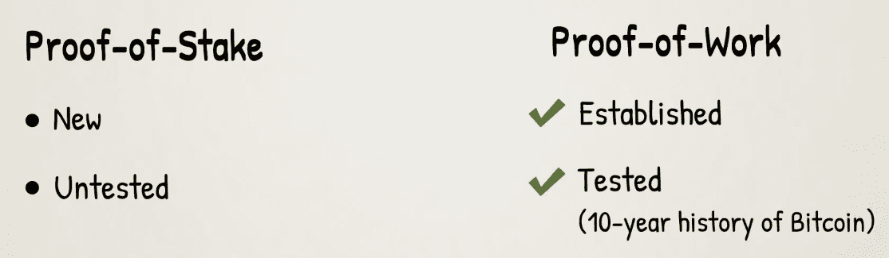

# 分片

分片在计算机科学中并不是一种全新的技术，它已经被用于扩展现有的分布式数据库，如 MySQL 和 MongoDB。这个想法是将网络上的所有任务分成多个块，由不同的节点处理。通过这种方式，任何单个节点将只参与区块链的一部分的验证，而不是全部。

这将导致吞吐量的提高和存储需求的降低。分片的基本过程如下图所示:

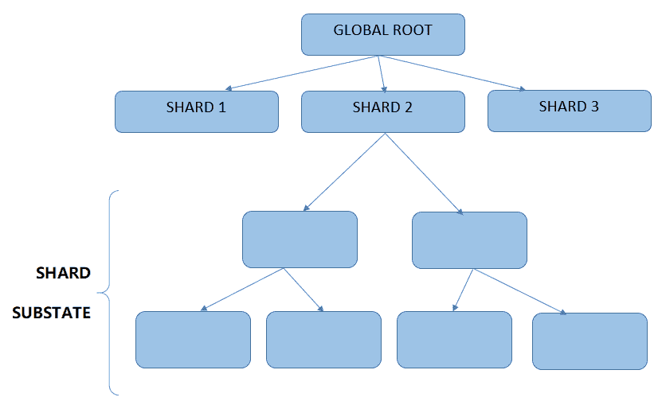

在区块链世界实施分片涉及将区块链划分为多个所谓的分片。共享分类账的状态可以拆分，任务可以划分，例如，沿着账户余额、智能合约代码、交易广播、处理和存储，或者以其他方式。在区块链全面实施分片之前，还有一些挑战需要解决。这些包括碎片间的交流和对每个碎片历史的共识。目前，分片是区块链空间中一个活跃的研究领域，一些协议正试图在不同程度上实现它。

下一代可扩展以太坊的计划包括实施利益相关共识算法和分片。正如维塔利克所说:

*"The basic approach is to solve scalability challenges via an architecture in which nodes from a global validator set (in our case created through proof of stake bonding) are randomly assigned to specific shards, where each shard processes transactions in different parts of the state in parallel, thereby ensuring that work is distributed across nodes rather than being done by everyone."*

# 外链解决方案

第 2 层解决方案构建在主要的区块链基础设施之上。它们不需要改变基础层协议；相反，它们只是作为智能合同存在，与外链软件交互。我们将在接下来的章节中了解其中的一些解决方案。

# 支付或国家渠道

支付或状态通道是一种更成熟的区块链可扩展性解决方案。这个想法是使用辅助渠道或链条来处理主链条之外的交易。一旦处理了侧链上的事务并且最终确定了通道的状态，就会将它写回到主区块链上，如下图所示:

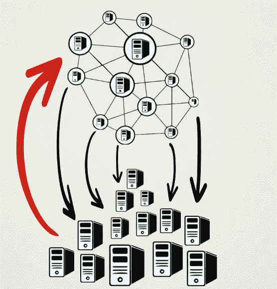

通过这种方式，大量的事务处理负载被外包给一个更快的侧链，从而最大限度地减少了矿工的总验证工作量。

这里有一个有用的例子来阐明这个想法。想象一下，两个朋友去酒吧开了一个账单。这样，他们各自点的酒由酒保记录下来，并在晚上朋友们即将离开时结算，而不是分别为每一轮饮料买单。

同样，当双方通过支付渠道进行交易时，他们不会在主区块链上记录每笔交易。相反，只有在他们完成侧链上的所有交易后，他们各自的账户余额才会记录在主区块链上，如下图所示:

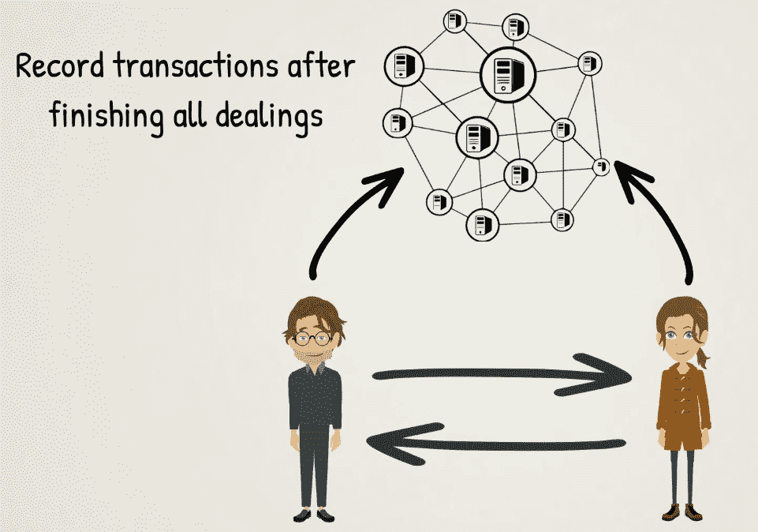

用更专业的术语来说，这个过程按照以下步骤进行:

1.  首先，区块链分类账的一部分，包括支付渠道中所涉及的各方的账户余额，被锁定在一个智能合同中。该智能合约包括渠道参与者之间的交易协议和业务逻辑:

2.  然后，在各方之间进行链外交易处理。参与者的帐户余额状态仅在他们使用通道时在他们之间更新。这允许在不需要主区块链的情况下处理任意数量的事务，并且使得该过程快速且可伸缩。

3.  一旦双方完成他们之间的交易，支付通道关闭，他们账户余额的最终状态被写回到主区块链上:

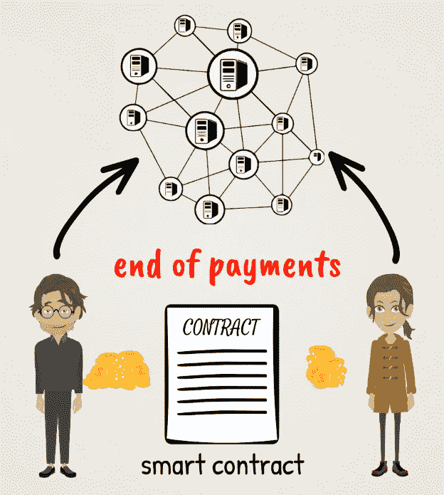

这是一个非常有效的解决方案，在渲染一个更快，更轻的区块链网络。支付渠道是小额支付和物联网交易以及其他应用的良好解决方案。它们可以最小化网络上交易处理的成本基础。

比特币的闪电网和以太坊的雷电网都使用支付通道。

闪电网络为闪电快速交易提供了一个有用的平台，参与者不需要与他们想要交易的每个人开通双边支付通道。相反，该平台提供了一个这样的渠道网络，可以触及所有与之相连的人。因此，用户只需要打开一个通道来连接 lightning 网络，然后就可以与连接到它的任何其他人进行交易。

比特币闪电网络最近已经部署完毕，并已投入运行。

也有一些分散的应用程序非常有效地使用了状态通道。你还记得在以太坊上运行的在线游戏平台 Fun Fair 吗？他们建立了称为命运通道的状态通道，以实现快速高效的交易，并促进其平台的可伸缩性。

# 血浆

等离子体是 Vitalik Buterin 和 Joseph Poon 在一篇题为*等离子体:可扩展的自主智能合同*的研究论文中引入的新概念，该论文于 2017 年 8 月发表。在某种程度上，它类似于 state channels，因为它的目标是建立一个在主区块链之外进行交易的平台，同时它仍然与主相连。

这里的新奇之处在于，Plasma 允许所谓的子区块链通过一组智能合同连接到主以太坊区块链。每个子链又可以有自己的子链。这种架构使得许多复杂的操作只能由智能合约在子链级别完成，与以太坊主网的交互最少。通过这种方式，可以管理整个分散式应用程序的扩展。有了 Plasma，我们可以避免在以太坊网络的所有完整节点上复制每个智能合约操作。这种解决方案将分散交易处理的工作量，使以太坊网络变得更加轻便和高效。等离子体结构如下图所示:

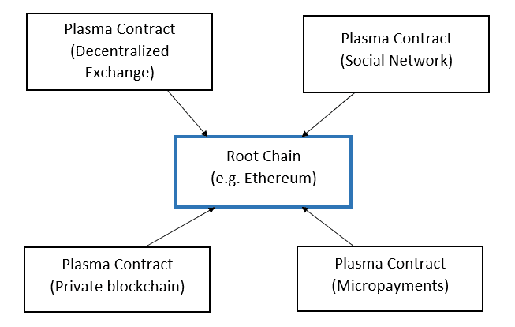

在血浆中，儿童区块链可以有他们自己的共识算法，可以不同于以太坊主网使用的算法。

Plasma 还提供了一个安全机制，保证用户可以随时从子链提取资金和资产到主以太坊区块链。

为了进一步保护等离子体链，可以部署另一种机制，子链上的验证者或块生产者在以太坊主网上的智能合同中提交存款，该合同约束他们遵守规则，冒着失去存款的危险。

如果我们将国家通道技术与等离子体技术相比较，国家通道应该仍然允许更快和更便宜的交易，而等离子体应该允许更多的功能和灵活性。这两种技术实际上可以结合起来，在等离子体链上建立状态通道。

# Truebit

Truebit 是一项新技术，由 Jason Teutsch 和 Christian Reitwieß ner 在 2017 年 11 月发表的题为*区块链的可扩展验证解决方案*的研究论文中介绍。它的设计是为了方便以太坊区块链上非常复杂的计算。这与增加事务吞吐量不同，后者是 state channels 和 Plasma 等扩展解决方案的目标。

为了理解 Truebit 的用例，我们需要记住在主以太坊区块链上执行的计算是非常昂贵的。同样，这是因为它们由网络上的所有完整节点同时处理。为了补偿矿工的计算工作，以太坊有一个名为 gas cost 的奖励机制，本质上是调用交易的用户支付的交易费。此外，每个以太坊块都有一个最大 gas 限制，它为一个块中的所有事务可以完成的总计算量设置了上限。因此，一些计算量太大的任务不能包含在一个块中，即使它们是该块中唯一的事务。

例如，在以太坊上运行的智能合约可能需要验证交易是否在另一个区块链(如比特币)上完成。对于一些想要连接两个区块链的应用程序来说，这可能是必要的。这种验证可能是一个太大的计算任务，无法在以太坊主网上执行。在这种情况下，Truebit 可以提供帮助。它本质上是将执行验证的工作外包给第三方。为了保证这些第三方诚信行事，他们需要在以太坊智能合约中锁定一笔保证金，如果他们的工作没有做好，这笔保证金就会被放弃。我们可以称这个聚会为**解算者**。为了执行正确的操作，该方案还利用了另一个第三方，该第三方检查第一个第三方执行的工作，并且有金钱激励来正确地完成这项工作。我们可以称这个政党为**挑战者**。如果求解者和挑战者获得的结果之间存在差异，他们需要确定导致差异的确切操作。这将把计算工作缩小到一个可以在以太坊主网上执行的小任务，这将清楚地显示真相在哪里，哪个是正确的结果。

下图显示了协议的流程:

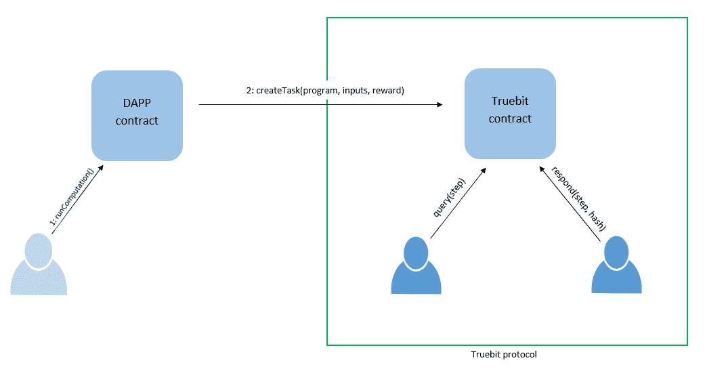

Truebit 可以成为一个有用的解决方案，允许复杂的机器学习算法在以太坊区块链上运行，从而实现人工智能的智能合约，可用于运行去中心化的自治组织。

最后，我们应该注意到，在所有系统中，一方面是可伸缩性和速度，另一方面是安全性，两者之间存在固有的权衡。对于大额交易，为了安全起见，直接在主区块链上处理可能总是更好。使用我们讨论的链外扩展解决方案，小额交易可能会得到更好的服务。

为了解决可伸缩性问题，下一代区块链技术可能会结合使用这里介绍的解决方案。

# 其他挑战的解决方案

除了可扩展性之外，区块链技术还在其他几个方面发展和升级。

互操作性是一个非常重要的领域，是许多研究和开发工作的焦点。目前正在测试在不同区块链协议之间建立桥梁的各种机制。这些包括所谓的原子交换、分散交换和链间通信协议，如下图所示:

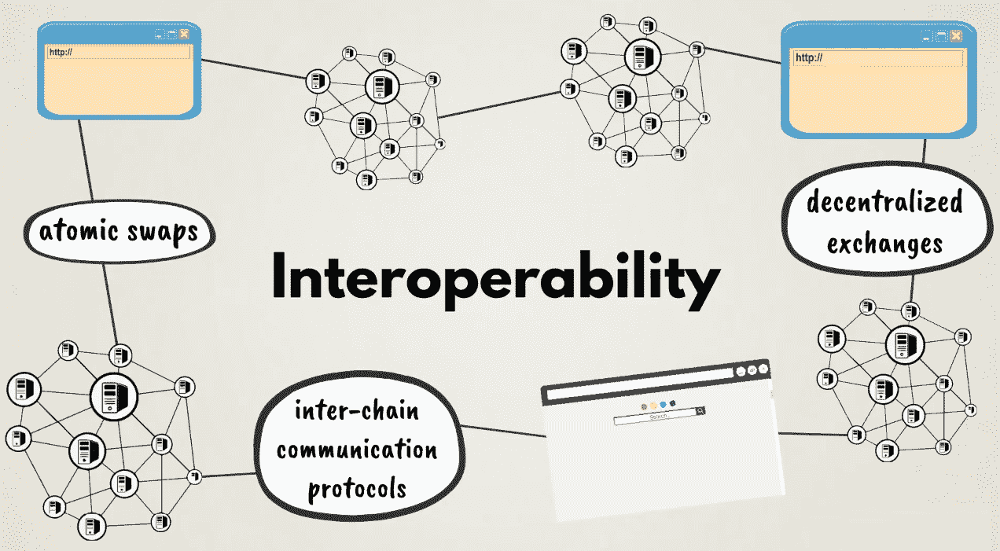

原子互换代表属于一个区块链的加密资产(如比特币)与属于另一个区块链的加密资产(如莱特币)的直接交易。这是在链上完成的，而不是大多数流行的加密资产交易所，它们在链外匹配和结算交易，如标准金融交易所。这种或其他直接跨链交易机制正在被部署到新兴的分散式交易所，预计这些交易所将成为未来的主要交易场所。

另一个重要的新进展来自于 Rootstock，它正在为比特币构建一个智能合约平台。根茎平台作为侧链连接到主比特币区块链。它引入了名为**智能比特币**的智能合约令牌，与原始比特币挂钩。它们也兼容以太坊，因为它们使用相同的编程语言 Solidity，并且兼容**以太坊虚拟机** ( **EVM** )。因此，这可以在比特币和以太坊网络之间提供一定程度的互操作性。根茎还实现了一个版本的闪电网络，称为 Lumino Network，可以将其事务吞吐量提高到每秒数千个事务。

正如我们之前所讨论的，隐私对于企业和个人同样非常重要。最强大的新隐私增强技术之一是 ZCash 首创的**零知识证明**(或 **zk-SNARKs** )。以太坊最近将这项技术集成到了自己的协议中。这将为以太坊创建一个隐私层，从而极大地增强其功能。例如，它可以在以太坊上启用去中心化投票应用，这些应用本身就需要隐私。匿名以太坊令牌还可以有许多其他应用。

事实上，许多新出现的区块链协议计划包括隐私功能，并认为 zk-SNARKs 是最好的选择之一。此类项目包括 Tezos、Polkadot 和 Rootstock 等。

治理是区块链地区需要解决的另一个紧迫问题。这方面的大多数解决方案都围绕着利害关系证明以及各种投票和赌注机制。此外，具有不同协议层的新区块链体系结构，而不是一个协议负责所有事情，正在被设计来解决这个问题。例如，通过这种方式，事务验证规则可以从网络协议规则中分离出来，并且每个维度可以单独发展。利益攸关方可以就《区块链议定书》不同部分的升级独立投票，这将促进其分权治理的更大灵活性。

接下来，我们将研究一些旨在提供第三代区块链的新兴项目。

# 下一代区块链项目

除了比特币、以太坊和其他成熟的区块链的升级，还有许多令人兴奋的新项目正在出现，试图建设未来的区块链。

我们简单提到了 **Tezos** 。它被描述为一种通用的自修改密码分类账。这意味着它部署了一种分散的共识机制，不仅用于交易验证和更新其区块链的状态，还用于其协议和网络如何被治理和随时间演进。为了做到这一点，它计划部署一个委托的利害关系证明共识算法，并将其区块链协议分为三个不同的层:

*   负责在其网络中广播事务的网络协议
*   事务协议，它定义了使事务有效的标准
*   一种共识协议，规定了如何围绕一个独特的交易链达成共识

这将使 Tezos 生态系统的治理变得高效，并允许它频繁地发展和更新，以纳入其利益相关者群体认为合适的任何功能。通过这种方式，Tezos 可以随时囊括区块链领域开发的所有最新、最好的功能，让自己走在技术创新的最前沿。这些特性可能包括新型的共识算法、隐私特性、链上或链下可伸缩性、互操作性解决方案等等。

Tezos 也被设计成一个智能合约平台，允许分散应用，如以太坊，但它使用不同的编程语言，旨在对该领域的现有平台进行一些改进。其 mainnet 于 2018 年 9 月上线。

由以太坊的创始人之一、**首席技术官**(或**首席技术官**)加文·伍德领导的 Polkadot ，专注于解决区块链之间的互操作性。Polkadot 的目标是为不同区块链的互联提供网络基础设施。他们希望建立主干基础设施，称为连接其他侧链的中继链，称为副链。此类侧链或准链可以是其他现有的区块链网络，如比特币、以太坊和超级账本等，如下图所示:

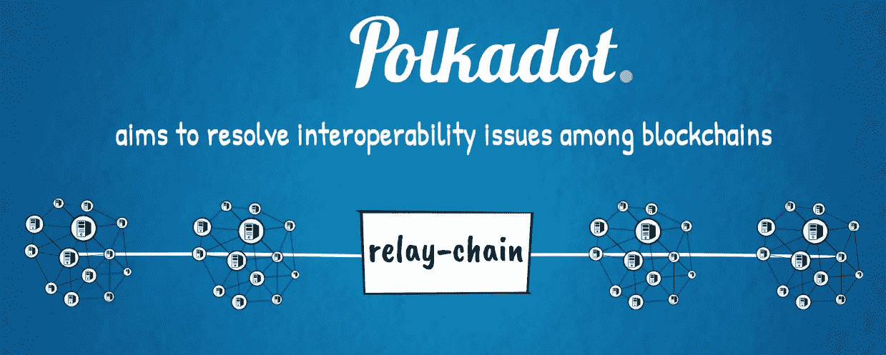

因为 Polkadot 的主要目标是提供与其他区块链的跨链互操作性，所以它并不像以太坊那样支持为分散式应用程序定制的复杂智能合约。目的是尽可能保持中继链的简单，从而优化其操作以提供有效的互连。预计 Polkadot 将于 2019 年上线。

Tendermint 开发的 Cosmos 是另一个引人注目的期待已久的项目，专注于建立跨链互联。它使用分散式交换技术，其 mainnet 于 2018 年推出。

Aion 是另一个新项目，试图建立一个互联的区块链，为外部网络提供桥梁。他们希望实现一种新颖的、混合的、委托的利益证明或工作证明共识机制，建立在迄今为止业界所做的大量研究和开发的基础上。他们利用以太坊、Java、机器学习和现代计算机科学的其他领域的概念，旨在交付下一代区块链技术。

Aion 与另外两个专注于建设区块链互联网络的著名项目合作，这两个项目分别是来自亚洲的 **ICON** 和 **Wanchain** 。Wanchain 还使用环签名实现隐私功能，这是我们与 Monero 一起展示的技术。这些项目与国际支付的 SWIFT 系统相似，每个国家都有自己的货币系统，但来自任何国家的多家银行都可以通过 SWIFT 网络进行连接和互操作。

另一个令人兴奋的新项目 Zilliqa ，旨在构建一个实现分片的区块链，这是以太坊正在探索的可伸缩性解决方案。它还提供了与以太坊的 Solidity 语言兼容的智能合约编程功能。

另一个试图实现分片的新项目是 **RChain** 。他们正在用虚拟机和编程语言构建一个智能合同和分散应用平台，利用以太坊和其他最近的创新概念。RChain 也在建立一个类似于以太坊的 Casper 的利害关系证明共识协议。

Cardano 和 **EOS** 是另外两个著名的项目，它们试图一次性解决现有区块链的局限性，解决可扩展性、治理、互操作性等问题。它们都基于授权的利益相关者共识机制，并支持智能合同。它们目前处于不同的发展阶段，区块链社会对它们抱有很高的期望。

雄心勃勃的新项目的管道很长，涵盖所有这些超出了我们的范围。

# 激动人心的区块链世界

我们现在可以得出结论，区块链是一项令人兴奋的新技术，它仍处于起步阶段，自然需要解决一些问题，并在全球大规模采用之前成熟起来。区块链在很短的时间内成为最受炒作的技术之一。区块链领域正在加速进行许多创新。这个新领域已经成功地激发了许多聪明人，他们看到了巨大的机会。人才和资金正以强劲的势头从世界各地涌入。

# 与之前的颠覆性创新相似

这种趋势类似于我们在以前的工业革命中看到的，如蒸汽动力、铁路、汽车、电力、计算机和互联网。他们都经历了区块链科技现在正在经历的周期。

除了众所周知的可伸缩性、互操作性、治理和隐私问题，用户界面也需要解决。但是，嘿，我们都知道其他每种技术的早期原型是什么样子，以及它们的性能如何。我们也知道它们后来是如何进化到被大规模采用的。

为了进行最接近的比较，只需看一看早期的 web 界面和功能。在互联网出现之初，传输一条短信需要 24 到 48 小时，因为它是从一个拨号连接路由到另一个。现在我们有了即时全球通讯。

当电子邮件第一次出现时，通常需要两个小时才能通过互联网到达收件人。现在，我们可以在世界各地直播高清视频。

1992 年，互联网上只有几个网站，看看现在我们可以在网上做多少事情:交流、教育、购物、娱乐、商业，还有很多很多…

最重要的是，现在几乎每个人都有智能手机，可以使用这些应用程序。甚至许多没有银行账户的人也可以使用现代互联网的所有功能。

# 技术炒作周期

区块链不是万能的。它不能解决世界上的所有问题，当然也不应该被当作一个快速致富的计划。没有什么是完美的，包括区块链。像任何技术一样，它有它的优点和缺点。此外，就像任何重大创新一样，它会经历一个炒作周期。按照我们现在的立场，我们可以说，区块链在 2017 年的短期内可能被高估，而在 2018 年的长期内被低估。

如果我们看看最近的过去，所有来自互联网时代的新的突破性颠覆性技术概念都遵循着相同的周期。

互联网搜索极大地推动了网络的发展，谷歌成为该领域的大创新者和赢家。百度随后将这一概念带到了中国市场。

然后，电子商务彻底改变了全球零售业，亚马逊引领了这一趋势。阿里巴巴紧随其后，以类似的理念席卷了亚洲市场。

然后，社交网络出现并重新设计了世界各地的社交互动和交流模式。脸书在那里引领了一波新的全球竞争对手，随后是 Twitter、Instagram、LinkedIn、Snapchat 和许多其他瞄准社交网络空间不同细分市场的公司。腾讯将这种商业模式带到了亚洲，甚至通过微信平台对其进行了改进。这些社交网络证明了一个重要的观点，即社交元素是当今任何媒体公司和几乎任何其他商业企业的一个非常重要的难题。它增强了持久的客户关系，促进了网络效应，从而为任何企业创造了经济价值并提供了可持续的竞争优势。区块链在这方面更进一步。

与此同时，**物联网** ( **物联网**)随着智能手机和升级通信网络的出现而获得了发展势头。

云计算一直在平行发展，这也得益于更快、更强大的互联网连接。这改变了在企业和消费者领域提供 IT 服务的方式。

下一波技术创新是由大数据、人工智能和机器学习引领的——这些都是非常强大的技术。

大量的人力和金融资本被投入到所有这些技术中，在某种程度上是由炒作因素驱动的，但这些投资也刺激了许多创新和经济增长。所有这些技术的结合正在给世界带来真正强大的新解决方案和改进。

科技和商业的最新前沿是区块链。像它的前辈一样，由于熟悉的炒作周期和人类心理，它很快成为一个流行语。然而，它是一项真正的突破性技术，而且这一事实已经得到了世界上大多数知名企业、技术、经济、政治和社会领袖的认可。像它的前辈一样，它有望带来巨大的经济利益，或许它改变世界的潜力更大。

对于公共加密资产，价格发现过程目前正在进行，市场在疯狂投机中上下波动，无法就这些新技术网络的现值达成共识，如下图所示:

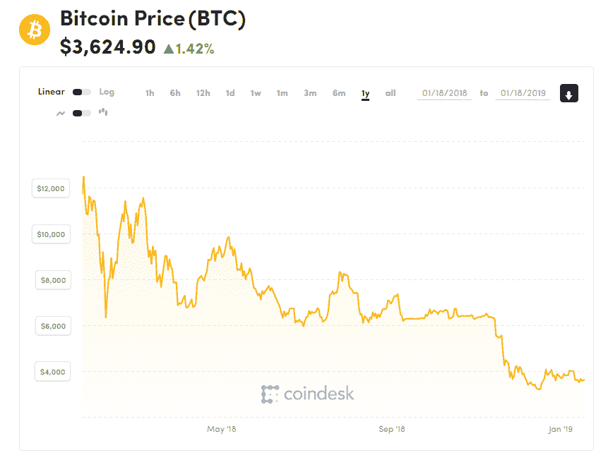

然而，区块链加密资产有可能作为一种新的数字资产或商品类别获得全球认可。它们可以有各种功能，如交换媒介、记账单位和价值储存，类似于标准货币或黄金。它们可以像石油、电力和互联网带宽一样为经济提供动力。它们还可以实现各种经济资源和风险的分配和交易，如公司股票。由于它们展示了各种已建立的资产类别的特征，也许它们不属于任何预先存在的类别，而是应该被认为是它们自己的一个单独的资产类别。

比特币期货合约，一种标准类型的商品交易合约，已经在主要的全球交易所交易，如**芝加哥商业交易所** ( **芝加哥商业交易所**)。类似的合约也在**芝加哥期权交易所** ( **CBOE** )交易，预计很快会在纳斯达克交易。比特币**交易所交易基金**(**ETF**)，一种用于许多资产和商品的成熟投资工具，也已经在筹备中有一段时间了，可能会在某个时候在纽约证券交易所上市。这些发展表明了比特币作为一种数字黄金在全球范围内获得的地位。基于它们的进一步开发和采用，或许其他加密资产也会效仿。例如，以太，这种令牌可以访问以太坊网络上的分布式计算资源和存储，可能是下一个在世界各地成熟的金融场所交易的加密商品。

区块链技术带来了一种新的范式，这是对许多行业现状的巨大改进。

由区块链推动的去中心化经济的新时代始于比特币。它向世界清楚地表明，与任何其他金融或经济体系不同，价值转移是如何以一种分散的自我维持的方式进行管理的。

然后是以太坊，它被广泛认为是自比特币以来区块链科技领域最伟大的里程碑。它建立在比特币的基础之上，并带来了区块链 2.0，其中有许多加密货币以外的用例。它实现了具有巨大潜在经济影响的分散应用。以太坊的创新为未来复杂和自治的分散经济和社会系统铺平了道路。密码经济学的新领域出现了，它将经济博弈论、密码学和区块链与互联网的力量相结合，创造了新型的互联全球生态系统。

# 区块链和 Web 3.0

我们目前正处于一个新的第三代区块链技术正在出现的阶段。同样，它建立在前几代的基础上，最明显的是比特币和以太坊。现代区块链的关键组成部分，如共识算法、加密技术、数据结构、网络协议、治理机制、虚拟机、编程语言等，都在不断尝试、测试、修改和试验，以寻求最佳解决方案。也许甚至不存在一个单一的最优解，未来的全球经济将有无数不同的区块链适合不同的目的。大多数新的区块链设计朝着更复杂的架构发展，具有多个层和模块，有利于可伸缩性、互连性、治理和隐私。这种趋势的轨迹类似于互联网向公共和私有网络互联的宇宙发展的方式，现在我们有了公共互联网和数百万个私有内部网。我们还有多个区块链应用程序，专注于解决全球经济和社会各个领域的不同问题。与当前互联网的主要区别在于，Web 3.0 应该更加去中心化、公平和抵制审查。

这些新概念有望从根本上改变我们所知的公司和其他组织的运作方式。从为数十亿没有银行账户的人提供银行服务到优化当前行业领导者的表现，这对全球社会的潜在好处是巨大的。所有这些改进不仅可以创造大量新的经济价值，还可以帮助以更好的方式分配价值，以公平的份额回报生态系统中的所有参与者。

尽管人们对光明的未来充满热情和乐观，但同样重要的是要明白，为了将区块链的技术提升到一个新的水平，前面还有许多艰苦的工作要做。

# 摘要

我们希望你喜欢这次奇妙的区块链之旅。我们创作这本书的目的是试图提高对区块链技术的认识和理解，及其有用的应用、好处和挑战。这种新的分布式计算技术代表了一种令人兴奋的创新，具有很大的潜力，不应该因为公开交易的加密资产的繁荣和萧条周期而被轻易忽视。现在也不可能报道那里正在发生的一切。区块链处于非常早期的阶段，同时发展如此之快，以至于几乎每天都有新的有趣的技术和商业发展出现。我们相信区块链技术会继续存在，并期待很快看到一些新的重大突破。

愿 Satoshi 和 Vitalik 与你同在！谢谢你坚持到最后！