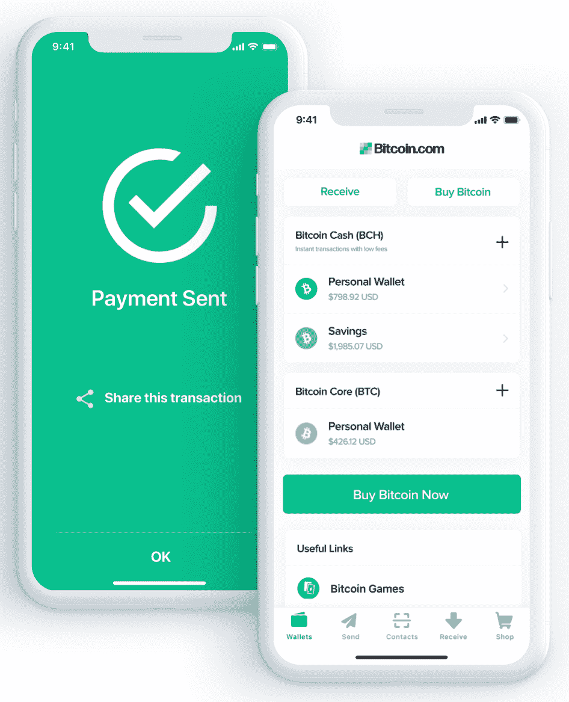

# 区块链的经济和历史方法

现在你已经掌握了区块链的一般概念和技术概念，让我们来理解区块链试图解决的基本问题以及它是如何出现在我们面前的。采用社会和经济的方法来了解区块链，对于识别具有坚实基础的项目和确定商业机会非常有帮助。

有了像区块链这样的新技术，我们可以想象下一个优步依赖于一个分布式和去中心化的基础设施，司机将获得全额报酬，运营区块链和奖励增强网络能力的节点将获得小额费用。事实上，这就是 Eva 已经在发展的东西，Eva 是一家总部位于区块链的类似优步的初创公司，它真正分散了司机和客户的互动方式，以提供汽车共享服务。但是优步的情况只是冰山一角。由于区块链，今天的协作平台的集中规模经济模式将真正被打破，并在服务提供商和消费者之间平均分配。

分散式环境是区块链影响最大、收益最大的地方。此外，在我们实现经济行为者、机构和个人之间的分散之前，区块链仍有时间实现工业化和用户友好。

在本章中，我们将重点学习比特币和其他加密货币流行背后的原因。我们将从经济学的角度来看待这些数字资产，理解它们的潜在价值以及它们给资本主义带来的巨变。以下见解将为您提供驾驭区块链成就全球图景的基础。我们还将理解数字支付系统、区块链的技术局限性，以及为什么它可以被视为更具协作性的经济的终极层面。

本章讨论以下主题:

*   全球经济图景
*   区块链是协作经济中缺失的工具
*   在数字世界中交换价值

# 全球经济图景

人与人之间的信任总是存在问题。以此为背景，我们创造了能够陈述真相的中央权威，以及能够促进某些行动的中间人。这是社会契约的一部分:要解决彼此之间的信任问题，必须有实体确保的规则，人们必须放弃部分自由。

在大多数民主国家，国家权力与管理公民的中央集权实体相分离:司法、行政和立法。每一个都可以控制另一个，以避免滥用权力。但这有时不足以避免错误或失误，并保持系统完全的权力平衡。

*那么，在没有可信第三方的情况下，如何实现个体之间的信任呢？*

比特币在 2008 年提供了第一个答案，但这个故事可以追溯到我们的时代之前，3600 年前，当时我们的祖先利用不同的材料和自然元素作为交换手段。第一种被确认的货币形式是硬币——亚洲、非洲和大洋洲的一些部落和国家用来相互交易的小贝壳。下图显示了一个 cauri:

就像今天的钱一样，金币被视为财富和繁荣的象征。大约在公元前 600 年，我们开始使用金币作为主要的支付媒介。黄金具备任何货币单位都需要具备的所有特征:稀有、可识别、便于携带，正因为如此，它具有内在价值。

从那以后，黄金成了一种标准。直到现代，尤其是 1944 年的布雷顿森林会议，联合国重塑了世界货币体系，并同意美元成为世界储备货币，迫使其他国家的货币与美元挂钩。

# 金钱是信任

1971 年，理查德·尼克松(Richard Nixon)暂停了美元与黄金的兑换，并强迫每个政府支持自己的货币。剩下的只有信托和纸币，也就是所谓的法币。

不知何故，范式转换成功了。人们相信他们的政府会支持一捆捆的钞票，并被告知这是真正的钱。今天，我们仍然依赖这些票据来支付商品和服务，尽管它们没有内在价值。用一枚简单的金属硬币购买一杯咖啡之所以成为可能，是因为我们相信我们的政府会维持这些硬币和纸币作为主要支付手段。

我们处在一个简单的心理模式中:因为每个人都使用欧元、美元或人民币，在愿意参与经济生活的个人眼中，这些支付工具已经增值。越多的人承认欧元、美元或人民币是几种支付手段，他们获得的价值就越大。

你要明白，这是针对比特币的众多指控之一。当欧洲央行说比特币不是货币时([https://www . ECB . Europa . eu/explainers/tell-me/html/what-is-bit coin . en . html](https://www.ecb.europa.eu/explainers/tell-me/html/what-is-bitcoin.en.html))，为什么钞票和便士会被认为是货币，因为它们没有内在价值？如果每个人都相信比特币是主要的支付媒介，那么向一个新的去中心化的无信任支付系统的进化将会自动发生。

# 分散式数字支付系统

如今，所有的纸币主要储存在大型银行数据库中。当你向某人转账时，你只需在你的设备上输入一笔金额，就可以转给对方。这只是银行拥有的数据库中数字移动的问题。

无论是黄金还是纸币都没有在银行之间流通。结论:银行是数字支付系统，支持并保护个人之间的资金转移。如果你想知道，贝宝是类似的；这是一个完全集成的数字支付系统，将资金集中存储在自己的服务器上。

比特币也是一种数字支付系统，但主要区别在于它不归任何第三方所有——没有权威机构、没有实体、没有监管，也没有银行。记住我的话，当通过你的银行转移资金时，你依靠它来进行资金核实并转移到正确的账户。由于比特币不是专有的，由于加密和共识协议，验证和转移是通过比特币网络以分散的方式完成的。

此外，比特币网络的去中心化特征消除了单点故障。想象一下，您的银行被一个恶意团体或个人攻击，他们可能会接管存储在银行服务器中的数据，并删除或修改这些数据。由于比特币依靠网络节点来存储每笔交易的历史，并依靠加密哈希来保护区块链的每个区块，它变得不可破解、不可更改。

# 比特币——数字货币还是黄金 2.0？

法定货币的真正区别在于，比特币不可能凭空产生。美元或欧元是可以分别由**美联储** ( **美联储**)或**欧洲央行** ( **ECB** )自行决定发行的货币。另一方面，比特币不能由单方面的决定产生。它是一种稀缺的数字资产，只能通过预定义的算法、密码学、数学和庞大的计算机网络来创造。

我们应该强调的是，黄金之所以能在 3000 年间保持价值，是因为人们努力挖掘黄金。比特币依赖于同样的特性。对于要验证的交易，网络，更具体地说，挖掘者必须找到一个加密散列，这大约需要 10 分钟才能找到。

一旦被发现，该网络就会获得新的比特币注入系统的奖励。运行并找到哈希需要电力、芯片和材料，就像挖掘一盎司黄金需要花费镐、铲和矿工的努力一样。

任何人都可以用比特币汇款。与传统的银行转账相比，资金转账需要 10 分钟，交易变得不可更改需要 60 分钟。

在比特币区块链中，矿工需要 10 分钟来验证区块 A 并将其添加到链中。如果随后(即 50 分钟后)验证了五个块，则具有 30%网络计算能力的挖掘者擦除块 A 中的事务的概率降低到 1%以下。这个时间段是对交易安全程度的一种衡量。交易后验证的块越多，就越安全。

距离、相识和信任对于两个个体之间恰当地发生转移来说是无意义的变量。此外，处理转账不需要银行账户:你需要的是互联网连接和一个比特币钱包。比特币钱包是一种数字钱包，可以在[bitcoin.com](https://www.bitcoin.com/)上创建，用于发送和接收比特币。下面是一个比特币钱包的截图:

# 投资产品还是真正的解决方案？

自 2017 年炒作以来，特别是在金融领域，比特币一直被公众视为一种投机类资产。美元/BTC 货币对的大起大落吸引了全球金融场所的高利贷者和交易员。比特币的名声是由新的*密码* - *百万富翁*和交易者的成功故事推动的。但比特币令人不快的一面隐藏了它试图对世界产生的真正影响。

试图解决比特币的第一个问题是给这个星球上 17 亿没有银行账户的人一种无摩擦的支付手段。

当来自最富裕国家的人们将比特币仅仅视为一种投资产品时，比特币社区的很大一部分人将它视为一种数字货币，最终让他们能够以很低的成本即时获得数字支付和资金转移。对于腐败率高的发展中国家来说，情况更是如此。

当人们开始害怕和不信任他们的政府时，就像在委内瑞拉一样，他们依赖加密货币作为一种有前途的替代品。我们可以将它视为避免腐败、破产和缺乏透明度的有力工具。

# 反对政府

拥有这样一个无需任何银行账户就能转账的数字支付系统，是政府不喜欢比特币的原因之一。政府声称，比特币主要用于恐怖主义和进入暗网毒品市场，以及作为洗钱机制。但我们强调，现金也是这样使用的。

事实上，任何不可追踪且易于转移的支付手段都可以这样使用。政府的目标是实现无现金化，既能通过跟踪任何在线价值转移来打击洗钱，又能将公民纳入无现金系统，以防止在潜在的经济危机期间出现大量突然的现金流失。

政府未来可能的转变是创造自己的数字货币。这将意味着每个人都使用无现金系统，但仍由一个中央机构控制。请注意，如果政府选择一种中央集权的方式来控制整个网络的货币供应和流动，那就不是一种以区块链为基础的货币，而是一种中央集权的硬币，就像今天一样。

这是很重要的一点:由于区块链，比特币提供了政府政策之外的货币主权。这就是为什么委内瑞拉、津巴布韦、尼日利亚或南非等许多发展中国家普遍对加密货币敞开大门。

# 比特币的技术限制

比特币剩下的一个技术挑战是可扩展性。如今，比特币区块链每秒可以结算 4 到 7 笔交易，而 Visa 每秒可以处理约 2000 笔交易。比特币的最终目标是允许任何人在世界任何地方以非常低的成本、非常快速地转移资金。因为它需要计算能力来处理交易，所以今天每笔交易的费用太高，以至于有人无法用比特币支付咖啡。

希望比特币社区解决这些问题的举措正在出现，一种被称为闪电网络的技术正在受到关注。很有可能，在未来，比特币区块链将能够每秒处理一百万笔交易，成为一个快速、无成本、高效的支付系统。

闪电网络是在比特币区块链上实现的一个层，用于实现个人之间快速廉价的交易。目前在测试版本中，它的工作原理是允许双方创建一个支付通道，基本上是一个*普通的*钱包，双方在其中存入一定的金额。当双方进行交易时，他们会更新分配给双方的金额。当他们最终关闭支付通道时，钱包中的每个余额都会相应地分配给各方。

# 区块链是协作经济缺失的工具

比特币面临的其他挑战正在上升，但它已经证明了自己的能力和正在解决的问题。通过为 17 亿没有银行账户的人提供数字支付系统，比特币向世界表明，密码学、共识协议和分散数据库是范式转变的强大推动者，将权力交给了大众，而不是给定的中央权力机构或第三方。

*"We need better cross-border payments … because it's good for development, it's good for financial inclusion, so Bitcoin can help us."* *- Benoit Coeure, European Central Bank executive board member in January 2018*

在一个社交、循环和协作经济蓬勃发展的世界，拥有一种允许任何人在安全透明的网络中分享、交易、支付或出售任何东西的技术似乎是杰里米·里夫金斯的*零边际成本社会、*2014([http://www . zeromarginalcostsociety . com/pages/The-book . cfm](http://www.thezeromarginalcostsociety.com/pages/The-Book.cfm))中缺失的一部分，这是一个由协作行为、新兴技术和几乎免费的商品和服务赋予权力的社会。

实际上，值得注意的是，2009 年发生了一个有趣的巧合，围绕着优步等公司引发的合作经济的扩张，以及区块链等分布式账本技术的发展。3D 打印、**物联网** ( **物联网**)或**人工智能** ( **人工智能**)等新兴技术将当前的垂直模式转变为更直接分享价值的模式，所有这些都由作为新经济*共同*模式基石的数字平台推动。

能源行业是一个明显的例子，消费者和生产者现在混淆成消费者，使用可再生能源在当地高效地提供电力。同样的转变也适用于教育，在教育中，知识在彼此之间共享，而所有其他行业都受到资本主义、自上而下的方法和寡头垄断的影响。

# 权力下放——但是为什么呢？

许多新闻稿和文章将类似优步的公司描述为打破传统商业模式的创新项目，大多数时候以真正的去中心化作为分析的最后一步——好像去中心化的经济是最终目标。

作为一名决策者，你应该意识到这些分析中缺少的是**去中心化不是一个目标，而是一种手段**——一种在不需要中央实体的情况下实现个人之间大规模协作的手段。我们的目标是，作为个人或公司，能够在没有摩擦的情况下茁壮成长和协作，以对等的方式生产和交换价值，并带来社会效益而不是财务利润。

随着当今数字化无处不在所引发的消费模式的转变，以及我们所称的**Uber 化**的兴起，对于组织来说，重新思考其运营模式，以满足其最终用户所寻求的接近性和透明度的需求变得越来越重要。

Uber 化是指促进个人和服务提供商之间点对点交易的数字平台。

作为先行者，优步和 Airbnb 很快意识到，传统公司未得到充分利用的资产和人力资源可以通过数字工具加以克服。Uber 化也指协作经济，其第一个平台将客户和服务提供商直接联系起来，从而将人们大规模连接在一起，并允许他们交换价值、知识、专业技能、服务、资产等。

但在我们走向大规模去中心化的道路上，感觉还剩下几个重要的中介，包括平台本身。协作经济正在消除数字原生普及公司的原始垄断，这些公司更依赖数据收集而不是利润率来实现增长。

# 区块链——终极层

区块链和这一切有什么关系？

嗯，区块链可以被视为最终可能取代这些平台的一层，将控制和权力授予人群，但仍允许个人负责任地协作行动。有了区块链，我们可以获得对其数据的主权，将其技术诀窍交易给对手，并与同行交换价值，所有这些都不需要任何中介。

区块链和分布式账本技术培育了一个参与性、包容性和协作性的生态系统，在去中心化的环境中带来了透明度和安全性。它们作为一种工具，通过其内在的激励机制，使流程扁平化，并允许广泛的决策协作。我们很容易在零边际成本社会和区块链的特征之间找到相似之处。

根据作者杰里米·里夫金的观点，越来越多的公司被集体组织起来(例如合作社)。正如一个社区由其成员以协商一致的方式处理和管理一样，区块链依靠网络来执行价值转移和信息记录。这个过程不再是下降的和僵化的，而是合作的和灵活的。里夫金还预测，对商品和服务的获取将优先于所有权，合作将优先于竞争。区块链的内在特征是它不属于任何人，而是分布在所有为共同真理而努力的参与者之间。有了这种机制，成员们可以**在一个不可信的环境中**合作，由于加密技术，这里的透明性和安全性得到了保证。

但最重要的是，区块链在数字世界实现价值交换的方式上具有颠覆性。

# 在数字世界中交换价值

在数字世界中，最重要的问题是:*如何确保一项数字资产不可复制？*

要回答这个问题，重要的是要理解互联网是为了交换信息而建立的。这些信息从一台计算机复制到另一台计算机，通过网络进行复制。通过节点的每一位数据都可以被复制或存储。换句话说，一旦一条信息被注入互联网，它就会通过网络快速复制和传播，从而消除其独特性。这就是信息传递的方式——通过复制。

问题是，在商业交易中，我们不会免费传递信息；我们交易不应该被复制的价值。如果我寄给你一美元，我就不应该再持有它了，因为如果我持有，它就一文不值了。因此，价值应该以移动的方式转移，而不是复制。任何种类的价值，包括金钱，都应该包括在内:土地所有权、汽车注册文件、版权、独家合同或公司股份。因为价值不能花两次，区块链确保在数字世界中防止**重复消费**。

有了区块链，价值互联网就诞生了。在协作经济中，只有优步和 Airbnb 这样的集中式平台才能保证价值从一个人转移到另一个人。它们确保你花在车费或租房上的钱不会被重复使用。这种重复支出问题是数字世界中最复杂的挑战之一。

互联网是为了交换从一台计算机复制到另一台计算机的信息而建立的，它抹去了信息的唯一性，因为传输是通过复制来进行的。有了区块链，价值像移动一样转移，而不是复制，这是协作经济在数字时代蓬勃发展所需要的。

# 摘要

希望通过这一章，你理解了区块链所包含的社会和经济概念。从现代货币到数字支付系统，我们解释了比特币如何扮演经济动荡的角色，以及它现在如何威胁到一些既定的公共政策。我们讨论了比特币试图通过让没有银行账户的人获得资金来实现的主要影响，以及它在这样做时面临的技术限制。最终，我们解决了一个区块链可以培育的更大的挑战，即实现一个更加合作和负责任的经济。

在下一章中，我们将与监管机构和金融机构站在一起，了解政府和公共机构如何面对区块链和加密货币带来的技术变革。作为一名决策者，我们将了解为实现区块链项目，应该考虑哪些法律、税收和会计方面的问题。