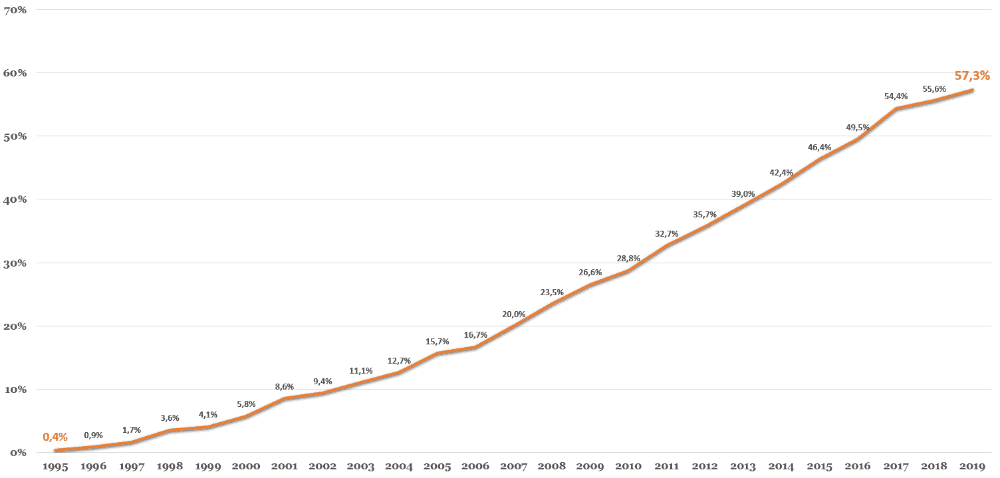

# 商业世界的区块链和成就

在这一章中，我们将通过在经济的各个领域中实施的几个应用来说明区块链的潜力。我们将发现区块链如何扰乱商业，带来透明度并实现供应链的可追溯性，加密资产如何通过令牌化重新设计商业模式，带来任何给定物理资产的流动性和数字表示，以及最后，智能合约如何取代中介并提供公司和个人之间的无缝交易。

本章介绍的每个案例都以企业遇到并努力克服的业务问题开始，同时解释了区块链如何帮助解决该问题。本章将说明哪些现有项目和计划是为了应对这些业务问题而创建的。

我们将讨论以下主题:

*   认证和可信度
*   互用性
*   可追踪性
*   自动化、非中介化和自组织
*   数字身份
*   金融证券和筹资
*   数字唯一性

# 认证和可信度

许多公司已经面临着代表他们的财务健康和战略选择的伪造发布，特别是在数字时代，监控和防止虚假通信变得越来越困难。对于股东、债权人、银行、投资者和公共机构密切关注财务报表等官方和敏感文件的企业来说，这种情况非常普遍。

一般来说，文档欺诈对于公共机构和政府来说是一个严重的问题。根据法国国家反欺诈代表团(DNLF)的数据，在法国，这意味着 2017 年€损失了 80 亿欧元([https://www . le jdd . fr/Economie/la-Caisse-des-depots-engie-EDF-et-la-poste-sa llient-dans-la-区块链-3898162](https://www.lejdd.fr/Economie/la-caisse-des-depots-engie-edf-et-la-poste-sallient-dans-la-blockchain-3898162) )。这个问题被一家法国初创公司 KeeeX 接手，该公司开发了一种产品，允许公司和个人认证任何给定的文件。他们成立于 2014 年，使用比特币区块链来密封任何类型的数字文件。当有人需要验证该文件的真实性时，他们使用 KeeeX 应用程序来揭示其真实性。

对此的解释是，公司和个人可以依靠区块链来确保电子文档和数据是可信的，因为它首先是由正确的人记录的。提醒一下，区块链是一种分布式数据库，其中的数据被打上时间戳并以一致同意的方式记录。因为这个注册表是透明的，所以它允许用户浏览历史来无缝地检索事务或信息。根据设计，这些特征对于验证数据源和可信度非常有用。

KeeeX 的产品是理解散列函数和分布式分类帐技术的一个非常强大和简单的例子。该过程从使用返回加密数字的散列函数加密原始文件开始。这个哈希通过比特币区块链上的交易发送，打上时间戳，并附加到一个块中。这意味着，每当有人声称自己是原始文件的作者时，只要在区块链中简单地搜索一下密码，就会返回它的时间戳和地址。有了这些信息，指出合法的发布者、真实的文档和提交日期就变得简单了。

设计师、建筑师、作家和艺术家实际上面临着与大企业相同的问题:他们的作品很有价值，保护它们以防止盗窃和复制变得更加困难。

# 音乐行业的区块链

歌曲作者和制作人的情况是不言而喻的:今天，音乐主要以数字格式消费。根据美国唱片工业协会的数据，在线流媒体平台创造了该行业 75%的收入。版权盗窃已经成为主流，音乐盗版继续折磨着整个音乐行业，尤其是因为这些平台越来越受欢迎。

RIAA 估计，音乐盗版每年造成 125 亿美元的损失，创作者越来越难从他们的作品中获得相应的报酬，因为许多中间商的存在导致了复杂的资金流动。事实上，Rethink Music 的研究([https://www . riaa . com/WP-content/uploads/2018/09/RIAA-年中-2018-Revenue-Report.pdf](https://www.riaa.com/wp-content/uploads/2018/09/RIAA-Mid-Year-2018-Revenue-Report.pdf) )估计，20%至 50%的音乐付费没有到达合法所有者手中。

希望《区块链的崛起》能提供一个解决方案，防止版权被盗，并确保作者的创作得到准确的报酬。这里的挑战是提供一个连接到创作者的歌曲的数字签名。密钥加密和散列函数在该方案中也发挥了重要作用，为歌曲或创作提供了唯一的标识符，一旦在区块链上录制，就会被打上时间戳并被验证为艺术家的财产。

这首歌的任何进一步使用将被永久记录在分类帐中，允许跟踪和追踪。具体而言，基于区块链的音乐平台，例如 Ujo Music([http://static 1 . squarespace . com/static/552 c 0535 e 4b 0 AFC bed 88 DC 53/t/55d 0 da 1a E4 b 06 BD 4 bea 8 c 86 c/1439750682446/rethink _ Music _ fairness _ transparency _ final . pdf](http://static1.squarespace.com/static/552c0535e4b0afcbed88dc53/t/55d0da1ae4b06bd4bea8c86c/1439750682446/rethink_music_fairness_transparency_final.pdf))使艺术家能够在平台上提交其创作，这将生成其散列。这个散列作为证据来认证这个创作是由这个作者在特定时间提交的。后者可以确定使用创作的条款和与之相关的使用费。

授权创作的资金会直接进入作者的钱包。以这种点对点的方式使用区块链可以防止提交到平台上的数字歌曲的版权和许可滥用。近年来，为推动这些重大问题的切实解决方案，一些倡议已见成效。除了 Ujo Music([https://ujomusic.com/](https://ujomusic.com/))之外，最著名的是 2017 年被 Spotify 收购的菌丝体(【http://myceliaformusic.org/】)和 media chain()。

更广泛地说，知识产权可以从区块链获得巨大的附加值，它可以作为一个平台，在这个平台上可以记录数字资产的正确所有权。

关于一项发明的起源和作者的诉讼可以通过参考一个防篡改的时间戳来解决，该时间戳表明该想法被记录的确切时间。因此，区块链可以通过鉴定艺术家的作品、草图或图画来保护他们免受窃贼和侵权者的侵害。

# 利用物联网(IoT)

区块链和物联网是两种实际上可以一起出现的新兴技术。作为一个包含加密算法的真正分布式系统，区块链为网络成员提供了信任和安全，没有其他人的同意，这些成员不能更新信息。此外，链式数据使得修改分类账几乎不可能。通过这种方式，物联网内部的网络安全在区块链引起了人们的兴趣。

传感器通常安装在基础设施的外围，数据存储在其核心，即所谓的云。面临的挑战是，许多企业希望将智能集成到传感器中，这导致了安全问题。通过验证区块链上的传感器和终端，我们可以实现第一级安全。因为每一个动作都可以在区块链上被追踪，所以数据的来源也可以被陈述，也就是说，它来自于哪些传感器。

硅谷的初创公司 Xage 想出了保护区块链上数十亿设备的主意，以为它们创造一个安全的操作环境。它们为公司提供了一种不可信的机制，以确保他们的设备不会受到攻击。通过将可靠的设备连接到区块链，保护它们免受恶意入侵和意外黑客攻击变得更加容易。

目标是控制涉众之间的信息流，这要归功于附加在服务器上的安全时间戳。分布式分类帐技术的这种利用可能看起来令人惊讶，因为这不是它的主要功能，但是它的目的足够广泛，可以寻求其他方法来解决业务问题，例如消除单点故障。

物联网和区块链的结合是一种真正的颠覆性方法，因为它集成了两种有前途的技术。必须强调的是，利用传感器和区块链启动的大多数项目甚至还没有进入试点阶段。对物联网的投资在多个行业出现了爆炸式增长，市场研究公司 IDC 预测，到 2022 年，投资总额将达到 1 万亿美元([https://www.idc.com/getdoc.jsp?containerId=prUS44596319](https://www.idc.com/getdoc.jsp?containerId=prUS44596319))。

因为记录在区块链上的数据是使用加密技术进行验证和加密的，所以不太容易被黑客攻击或未经许可更改。区块链消除了中介，使其比许多遗留系统和网络安全更高效。

# 互用性

在银行或保险等一些行业，数据在公司和监管机构之间流动，以便能够向客户提供适当的服务。在不可信方之间交换数据被证明是一个痛苦而复杂的过程，特别是因为严格的法规对实体之间传输哪种数据持谨慎态度。

在这种情况下，很难确保个人信息能够按照法律和没有摩擦地得到适当共享。例如，就保险而言，客户必须提交由第三方机构(如其失业机构、医疗从业者、学校管理部门或政府机构)提供的证明和证书，以证明特定事件的发生。

区块链可以消除这一过程中的摩擦，允许在客户同意的情况下在实体之间交换数据。一旦客户向第三方机构授予了共享个人凭证的第一授权，保险公司就可以查询区块链来检索该授权作为访问第三方持有的客户信息的许可。

实际上，第三方机构拥有客户的特定数据，如出生日期、社会安全号、文凭、健康记录等，这些数据可以通过记录在区块链上的加密消息发送到客户的公钥，以证明其所有权。

例如，当保险公司请求特定数据来提供赔偿时，它可以浏览区块链来搜索客户的公钥。一旦找到，保险公司就可以告诉咨询哪个第三方机构来检索向客户提供服务所需的数据。这一基于区块链的索赔流程从根本上改善了客户体验，为每个利益相关者将传统的索赔流程转变为自动化、安全和无缝的流程。

此外，由于个人信息存储在每个利益相关方的数据库中，无需通过区块链，因此数据隐私得到了保证。

在这个过程中，区块链扮演一个层的角色，在这个层上，一个给定的实体可以向另一个实体交换消息，包括关于它拥有的关于个人的数据类型的信息，并且根据个人的同意私下共享实际的数据。

因为没有个人信息可以在区块链上传播，索赔登记处有一种破坏性的方法来证明某些特征而不披露个人信息。

法国获奖的区块链创业公司 Stratumn 目前正致力于通过一种名为 *Trace* 的产品实现银行和保险部门之间的互操作性，该产品已被多家欧洲公司以上述方式使用。

区块链实现互操作性的另一个例子是体育行业的一个案例。今天，体育联合会面临两个主要问题:

*   难以获得更多许可证
*   在体育赛事期间，尤其是在业余比赛中，身份盗窃事件增多

注册成为被许可方的障碍部分来自于订阅过程，对于一些联盟来说，订阅过程仍然是基于纸张的，并且非常耗时，尤其是对于那些愿意实践多种活动的人来说。通过非物质化和公共区块链的结合，用户可以轻松共享更多运动所需的信息，并防止活动期间的身份盗用。

例如，我们可以通过遵循一个数字流程来订阅特定的运动，通过该流程，我们可以将个人数据和证书共享给相应的联盟进行练习。当向另一个联盟订阅另一个活动时，我们只需将我们的数字身份(他们的公钥)发送到新的联盟，新的联盟将查找区块链以注意到数据已经被另一个联盟批准。

这种摩擦将通过来自授权共享个人信息的人的数字背书而被根除，该人只需向新的联盟呈现他们的数字身份。这整个数字化和基于区块链的过程确保数据在实体之间适当共享，并且在体育赛事期间不会发生假冒。

不仅保险、银行和体育行业可以通过区块链解决互操作性问题。事实上，任何竞争对手利益趋同但相互不信任的行业都可以依靠区块链作为一个层，让分区数据库在不泄露个人或敏感信息的情况下相互对话，从而最终解决最重要的问题——满足客户的需求。

# 可追踪性

2019 年 4 月，世界第十大商业食品零售商艾伯森公司([https://stores.org/stores-top-retailers-2018/](https://stores.org/stores-top-retailers-2018/))宣布参与 IBM 的食品信托区块链，启动跟踪生菜的试点，从而加入了沃尔玛、雀巢和联合利华等 79 个其他品牌的联盟。IBM Food Trust Blockchain 是一个模块化的协作网络解决方案，它聚集了经济参与者，旨在解决商业食物链中的主要问题，例如能够识别可疑产品的来源、疾病和卫生丑闻的主要来源，以及无需清理整个供应链即可从零售商的商店中移除受感染的产品。

在食品行业，关注安全是重中之重，产品的可追溯性变得至关重要。在这种情况下，许多食品生产商、供应商和零售商都在寻找一种追踪产品的方法。IBM 的食品信托区块链似乎带来了一种相关的方式来做到这一点，并已纳入食品供应链的主要参与者，包括 Topco，Wakefern 和家乐福。他们的客户现在可以使用移动应用程序扫描二维码来检索特定产品的信息——其原产地、生产商名称或质量控制证书。

截至今天，只有少数产品享受到了这些服务，但这些举措往往会加强食品供应链，因为它经常被批评为不透明和对生产者不公平。

区块链还提高了供应链的运作效率。沿着流程移动的产品通常没有被跟踪，这意味着发生的任何问题都不能被充分地隔离和调查。有了区块链，交易将得到永久记录和透明监控，从而减少了时间延迟和人为错误。

它还可以用来监控供应链中每个环节的成本、劳动力，甚至是排放浪费。这对于理解和控制产品的实际环境影响有着重要的应用。与传统数据库相反，区块链允许对添加到分类账中的每个信息的权限进行控制，以确保利益相关者之间的信任，并获得单一的真实信息来源。因为在整个过程中每个参与者都要分担责任，所以透明度在这个方案中起着关键作用。

区块链有可能扰乱食品供应链的处理方式，通过加速识别受污染的产品，提供运输条件的信息，并减少因变质造成的损失。这种分散式的信息共享模式之所以成为可能，是因为网络的每个节点都由一个单独的实体来代表，该实体具有验证事务、存储注册表或使用服务的预定义权限。

在竞争环境中，竞争者、供应商和客户之间的这种大规模协调是区块链所能实现的一个显著例子。不幸的是，有时，仅靠区块链无法实现大规模的协调，承运人行业就是一个明显的例子。

承运人行业是一个异质的环境，船东、运输商、海关和码头必须团结起来，以确保有效的物流。就像在商业食品行业一样，区块链也有自己的角色。在那里，IBM 也振作起来，提出了一个解决方案，并于 2018 年 8 月与全球最大的运营商马士基(Maersk)合作推出。

他们的解决方案名为 TradeLens，致力于记录商品运输过程中的数据，如温度或行程。这个平台的目的是在行动者之间分享有关过境条件和表现的信息，使他们能够根据进出情况调整资源。

虽然听起来很有希望，但 TradeLens 很难取得成功，因为只有几家公司加入了这场运动。就像任何依赖区块链的项目一样，网络效应是采用过程中非常重要的组成部分。截至今日，TradeLens 力争将其他承运商([https://www . coin desk . com/IBM-区块链-马士基-航运-奋斗](https://www.coindesk.com/ibm-blockchain-maersk-shipping-struggling))搬上平台。他们中的一些人实际上注册了甲骨文支持的另一个竞争平台 CargoSmart，该平台利用区块链实现与 TradeLens 类似的目标，即在该行业带来信任和透明度。

最后，如果物流供应链希望通过增强协作和透明度变得更有效，那么只有一个平台应该占上风，因为两个独立的项目将粉碎整个流程，并分裂生态系统。

在汽车行业也是如此，区块链一直被认为是一种在涉及多方的过程中收集宝贵信息并提高协同效应以实现客户体验的手段。

根据国际机动车辆制造商组织(OICA)([http://www . oica . net/WP-content/uploads/World-Ranking-of-Manufacturers-1 . pdf](http://www.oica.net/wp-content/uploads/World-Ranking-of-Manufacturers-1.pdf))的数据，福特是世界第五大汽车制造商，该公司于 2018 年 5 月与另外两家竞争对手宝马和雷诺共同发起了一个名为移动开放区块链倡议(MOBI)的财团。

该集群旨在通过推广标准和加快区块链的采用，使移动服务更高效、更经济、更环保。他们目前正在开发一种工具，可以跟踪汽车的维护历史，这是一种护照，汽车经销商和车库所有者可以阅读，以对磨损部件进行适当的更新。

在这个系统中，汽车的数字身份是基础，因为它包含了许多信息，如颜色、型号、车辆类型或其制造商。在这样一个平台上，不同的参与者可以更新特定车辆的信息，这将消除转售、所有权转让和确定准确市场价值的痛苦过程。

此外，区块链提供的不变性减少了二手车经销商和买家之间对车辆状况的不信任。有了区块链，跟踪车辆的寿命成为可能，行动者之间的合作也得到了加强。

钻石和珠宝行业是通过区块链更高效地实现可追溯性的另一个突出例子，该行业正面临许多欺诈、伪造和抢劫行为，这些行为主要是由令人痛苦且风险不断增加的纸质认证流程引发的。因为一件物品的内在价值是根据它的历史和来源来塑造的，所以来源在奢侈品行业已经成为一个严肃的问题。领先的新兴技术企业 Everledger 在 2015 年解决了这些挑战，使用区块链为钻石提供跟踪和追踪解决方案。

截至今天，已有超过 200 万颗钻石通过他们的平台进行了数字化展示和加密。区块链被实施为该过程中所有利益相关者的单一事实来源，而不需要一个实体来确保分类账中的所有信息都是正确的。

记录对所有参与者都是可见的，因此增加了演员和消费者之间的信任。该解决方案托管在 IBM Blockchain 平台上，该平台为要更新的注册表提供了 IT 基础设施。具体来说，通过让世界各地的几家钻石认证公司参与进来，他们能够根据钻石的颜色、净度、尺寸、克拉重量等几个特征，为每颗钻石创建一个独特的标识符，当然，还有写在钻石边缘的微型激光铭文和 GIA 编号，GIA 编号是钻石分级报告的链接。

一旦这种独特的标识符或指纹被发送到区块链，保险公司就可以更容易地跟踪相关宝石的丢失并向客户退款，执法部门可以更容易地识别欺诈行为，在线市场可以更容易地发现失窃或伪造物品的销售。

另一个值得用可追溯性来说明的部门是能源行业，在这个行业中，许多关于原产地保证的问题仍然存在，这些问题给来自可再生能源的电力贴上了标签。这些证书由监管机构和政府机构颁发，以确保对电力来源的信任。

这种交付 GO 的组织有几个缺点，欧洲主要能源行为者([http://resource-Platform . eu/WP-content/uploads/files/downloads/RE-Source-Platform-Guideline-on-GOs-and-ppas . pdf](http://resource-platform.eu/wp-content/uploads/files/downloads/RE-Source-Platform-Guideline-on-GOs-and-PPAs.pdf))承认缺乏透明度。

在过去几年中，一些区块链项目看到了解决这一问题的曙光，能够独立颁发绿色证书，而不依赖公共第三方。这些项目是由一群企业联合起来建立一个财团并解决重要问题而产生的，不仅涉及可再生能源证书来源市场的简化和增加透明度，还涉及未来的电网、减少欺诈和电动汽车的挑战。

这个名为能源网络基金会的财团包括多个附属机构，并在 2017 年推出了一个名为 Tobalaba 的基于以太坊的平台。基于该平台构建的第一个应用是 Origin EW，其目标是跟踪认证的可再生能源千瓦时，并整合认证市场，以简化和增强客户购买可再生能源的方式。这种分散式应用程序自动记录可再生能源的来源，并跟踪所有权信息，如位置、时间、来源类型和碳排放。

就像在商业食品、运输、汽车、奢侈品和能源行业一样，公司通常聚集在一个财团或项目周围，每个人都为创建标准和促进信息传递做出贡献。我们从未见过同行业竞争对手之间如此程度的合作。这之所以成为可能，是因为大多数参与者相信权力下放是通过非中介化来改善协调、提高效率和降低成本的一种手段。

# 自动化、非中介化和自组织

到目前为止，我们只讨论了区块链本身以及它如何解决不同业务领域中的认证、互操作性和可追溯性问题。我们只解决了分散和分布式数据库与加密算法和共识协议相结合，可以将无信任环境中的价值转移和数据共享提高到另一个水平的问题。

我们证明了竞争对手之间的合作和协调可以通过区块链支持的分散基础设施来改善。我们现在将讨论可以通过智能合同解决的业务问题。提醒一下，智能合约是在满足特定条件时执行动作的计算机程序。他们表现得像一个虚拟人，在各自的代码下执行动作。

在第三章、*以太坊和智能合约*中，我们以安盛的应用 fizzy 为例说明了智能合约是如何工作的，当客户的航班延误时，它会自动触发退款。在前面的部分中，不需要智能合同，因为防篡改信息和分散化功能足以解决上述业务问题。然而，为了解决更复杂的问题并自动和自愿地执行操作，需要智能契约。

# 智能能源合同

让我们再次回到能源领域。除了能够在没有第三方的情况下证明可再生能源的来源之外，在过去的十年里，更严峻的挑战已经出现。随着全球变暖成为一个令人担忧的问题，预计下个世纪气温将上升 1.4 摄氏度至 5.5 摄氏度([https://climate.nasa.gov/effects/](https://climate.nasa.gov/effects/))，我们从未像现在这样寻找一种更可持续、更清洁、更可重复使用的能源。

气候变化的影响比预期的要快得多，而从化石燃料向更清洁能源的转变却很缓慢。希望创新能够顺利、明智地实现这一转变。

# 智能电网

目前传统的电力供应方式是建立在由主要能源和公用事业公司运营的中央系统上。它由一个主电网组成，其中的能量由大型发电站产生，并通过一个广泛的传输网络分配给消费者。根据瑞典国际事务研究所的数据，尽管电网分布广泛，但仍有 14 亿人没有接入电网。较小的电网(微电网)以分散模式连接到本地电源。例如，一个给定社区中自带太阳能电池板的建筑可能会连接到附近的住宅。分布式能源与智能微电网相结合，在社区内提供智能生产和能源传输。

区块链可以在保护消费者和生产者之间的交易方面发挥积极作用。为了说明这一点，想象一个交换平台，家庭和个人可以在一个基于交易令牌的系统内交换他们的剩余能源，令牌作为支付手段。

你生产和分享的电力越多，你赚取的代币就越多，而且，作为唯一的消费者，你可以只为你消费的东西付费。所有这一切都得益于安全、透明、分散的区块链和智能合约。

这正是布鲁克林的一个社区所取得的成就。这个项目名为**布鲁克林微电网**(【https://www.brooklyn.energy/about】T2)，是区块链第一个与能源相关的项目之一。它是由总部位于纽约的初创公司 LO3 能源公司推出的，允许人们通过一系列当地可再生能源为自己的家供电。自带太阳能电池板的人可以将多余的电力卖给邻居。

区块链和智能合同介入了这一首个点对点电力网络，以确保准确的交易记录、分散的会计和计量，以及向网络用户共享和透明的数据。简而言之，区块链实现了智能需求响应管理。

最初，布鲁克林微电网项目通过安装太阳能电池板和电池，针对没有连接到国家电网的地区，只要相应地管理灵活性，这是一种为村庄带来基本电量的简单方法。这就是区块链和特别智能合约的作用所在；它们保障用户和生产者之间的能源交易。它们提供了一个可靠、低成本的数字平台，用于在本地化和分散式能源系统中实时进行、验证、记录和结算能源交易。

区块链开启的也是安全。随着现代电网引入计算机、智能电表和传感器，它们很容易受到恶意入侵或攻击。如今，围绕数据管理和交易的网络威胁是区块链可以克服的。集中式发电站被视为黑客的潜在目标，这一事实鼓励政府加快向分布式能源的转变，从而降低恐怖袭击的风险。

电网的最终目标是变得足够智能，以发展灵活性市场和需求响应市场，从而有效地平衡电网，并最终整合更多的可再生能源。

智能电网应该是高效供电(可靠、可持续、高质量)和用户经济负担得起的组合。考虑到这一点，区块链、智能合同和物联网与嵌入式处理、实时通信和适当的软件相结合，必将提高电网和网络的可靠性和效率。未来的电网将跟踪能源的生产和消耗，由联网设备监控，由智能合同执行，并记录在区块链上。

# 更智能的电动汽车

另一个与集体自我消费相关的话题是电力流动性。尽管电动汽车的数量在世界各地都在上升(今天在美国超过 100 万辆电动汽车)，但买家和潜在客户仍然对充电站的可用性和位置感到焦虑。能够在任何时间和任何地点方便快捷地为电动汽车充电将成为采用新型电动汽车的最决定性因素之一。

不同的倡议已经启动，以创建交易平台，让人们可以在任何车站收费，无论是私人的还是公共的。因为美国目前有 20，000 个公共充电站(一个站将近 50 个电动汽车)，连接电动汽车车主的私人充电器将增加数十万个网络。但要做到这一点，这些企业和个人需要为处理他们的充电器支付相应的费用。这就是智能合约作为一项重要功能出现的地方，它允许个人和站所有者无缝交易，并为电动汽车用户提供安全的体验。

除了点对点交易和电动汽车充电这两个最先进的试点项目之外，能源行业还可以想到其他依赖区块链的用例。例如，电网运营商可以使用区块链来优化网络中的供应，而不是关闭发电站，这是一种非常昂贵的行为，并通过整合整个电网的需求响应来相应地管理电力供应。

大型能源公司开始关注区块链提供的机会。通常，他们是包括银行、能源初创企业或公共机构在内的财团的一部分，在那里他们提供业务专业知识和特定需求(商业案例)，社区带来技术知识或满足需求的集成平台。例如，壳牌和英国石油作为一个更广泛的财团 Vakt Global 的一部分，正在使用一个总部位于区块链的原油交易平台，整合智能合约，他们希望这将解决贸易和结算效率低下的问题。

区块链促成的分散模式也激励人们和生产者通过市场交易产能。一个基于区块链的市场可以跟踪和保护参与者之间的交易，并保护每个人的交易活动和数据的隐私。最后，区块链固有的安全性和透明度意味着它可以广泛应用于整个电力行业，从本地微电网项目到大规模跨境能源交易。能源部门需要克服许多问题，以确保一个可持续的系统，在这个系统中，能源生产、分配和消费作为清洁资源、灵活市场和经济高效的解决方案的智能组合而结合在一起。

# 与区块链打赌

为了结束智能合同，让我们考虑一下[第二章](02.html)、*中提到的费德勒和纳达尔之间的网球比赛的例子，这是对区块链的技术探讨*。

这个例子涉及 Betwin 公司作为中间人提供真相和收集赌注。事实上，在一个基于区块链的平台上，我们可以使用智能合约去中介化整个过程，用在区块链中注入并由网络的每个节点运行的代码来代替 Betwin。下注者会向智能合约汇款，智能合约会存储金额，并在比赛结束时自动偿还赢家。

这个项目的一个典型实现是 Cryptocup.io，它实际上使赌博自动化、非中介化和自组织成为可能。Cryptocup.io 使用以太坊区块链和智能合约，使个人能够对世界杯或美洲杯等大型足球赛事进行预测。

下注是展示 smarts 合同的非常有说明性的使用案例。奥格项目很好地理解了这一概念，并通过其允许用户建立预测市场的分散协议，成为区块链生态系统中的一个主要参考。这种技术被用于以全球分散的方式并通过智能合约来下注和监控从体育到股票、从事件到选举的赌注。

# 数字身份

众所周知，世界正在飞速发展。我们从未见过在如此短的时间内发生如此多的变化。事实上，城市化在过去的 15 年里一直在加速，带来了重要的人口和社会变化。

事实上，人口持续增长，老年人的比例越来越高。随着 2030 年即将到来，加上 20 世纪 60 年代的婴儿潮，我们的人口将达到 85 亿，其中 9%将超过 65 岁。不幸的是，人口过剩加上我们现代过度消费的生活方式对环境产生了可怕的影响。气候变化是一个真正的问题，资源稀缺已被世界经济论坛确定为一种全球趋势。但最明显的转变是影响全球经济方方面面的技术突破。

企业在 R&D 投入越来越多的资金(其中一些几乎占其营业额的 14%)，因为他们认为创新是一个重要的关键增长动力。技术已经侵入了我们的日常生活，使我们的联系比以往任何时候都更紧密、更快捷。每一个行业都受到新的生产周期、新的消费方式、无处不在的技术和人与人之间不断交流的影响，所有这些都是由颠覆性创新引发的。

由于这些全球变化(城市化、人口变化、环境问题和技术进步)，政府正在试图抵消负面后果，并充分利用这些变化来更好地处理公民身份、强化投票系统和建设更智能的城市。

# 区块链对公民身份有什么帮助？

在数字时代，跟踪哪些个人数据被移交给了哪个组织，以及这些数据的用途是一件非常麻烦的事情。此外，我们如何确保这些数据得到安全存储，网络风险由第三方妥善处理？除了数据敏感性和个人信息保护之外，还有一个主要问题是对某人进行数字评估和管理他们的身份。

的确，一个人如何证明自己就是他声称的那个人呢？

随着非物质化成为标准，确保签发人和接收人的适当认证因此变得更加困难，这些问题引起了人们的极大兴趣。除此之外，随着金融服务经受艰难的数字化，并需要遵守身份盗窃、税务欺诈和恐怖主义融资的法规，KYC 和反洗钱政策正在获得动力。数字身份管理已经成为一个现实的问题，区块链似乎带来了一个答案。

数字身份可以定义为代表数字世界中给定个人的信息集合。

控制权可以通过区块链交给用户，这种挑战我们通常称之为**自我主权身份**。我们可以通过只允许移交必要的数据，监视哪个实体拥有关于我们的哪种知识，并在任何给定时间取消访问来获得主权，而不是放弃访问服务或应用程序的信息。区块链真正有潜力让个人控制自己的数据。

实验主要由国际组织领导，如联合国(T1)，T2，联合国(T3)，他们设定了一个目标，为目前被剥夺纸质身份的 10 亿人提供合法身份。提出这一解决方案是为了应对联合国正在通过分发援助帮助解决的移民人口问题。他们的联合国粮食计划署每年向全世界 8000 万人提供 120 亿份口粮，他们开发了一种非接触式卡，其中包含他们为 1500 万人拍摄的照片和指纹。该解决方案的主要优势在于通过控制程序大幅降低成本。

另一个值得一提的倡议是 ID2020。这是一个总部位于纽约的公私合作组织，致力于在区块链为个人提供永久的、可共享的加密数字身份。埃森哲和微软加入了该联盟，以推动区块链作为一种手段，允许组织访问有关难民的某些个人数据。世界银行维持了该倡议，并估计该项目的总费用将达到 90 亿美元，其中 10 亿美元将由该组织提供。

身份管理的最佳实践可能来自印度，该国在 2010 年启动了一项名为 Aadhaar 的计划，为每一位印度居民提供一个与他们的生物特征数据和公民身份相关联的唯一标识符。印度是世界上人口第二多的国家，目前正在帮助位于班加罗尔的国际信息技术研究所(International Institute of Information Technologies)开发模块化开源身份识别平台(Modular Open Source Identity Platform)，以建立一个旨在支持全国范围低成本身份识别系统的基础设施。最近，摩洛哥签署了实施这一平台的协议，摩洛哥将建立一个以区块链为基地的全国人口普查登记处。

# 区块链让投票系统变得更容易

投票民调的透明度和准确性如何？当前的投票系统对欺诈有多敏感？

世界上每一个政府和人民都关心这些问题。对于大多数民主国家来说，投票一直是一个棘手的话题，即使在发达国家，我们有时也会目睹官方选举中的欺诈或贿赂，这种情况并不罕见。此外，投票过程可能令人痛苦和不清楚，加上需要亲自到场，这往往会降低投票率，而且这种方法已经过时，有许多中间人，腐败风险很高。

迄今为止，很少有投票系统是在线进行的。爱沙尼亚可能是世界上最先进的电子民主国家，十五年来一直愿意成为第一个 100%数字化的国家。对于 2019 年 3 月的最新立法选举，44%的选民通过爱沙尼亚的国家投票系统 i-Voting 在线做出了选择。

虽然美国等许多国家都在努力实施投票机，但爱沙尼亚已经成为国外公认的在线投票基础设施的典范。爱沙尼亚 2005 年进行了第一次数字投票，但由于选民可以下载带有特殊 SIM 卡和唯一 PIN 码的移动应用程序，它在 2011 年成为主流。尽管该解决方案已经过多年的测试和保护，但专家已经发现了几个漏洞，以及如果在更大的国家复制该解决方案，则很容易扩大规模。

公民参与，更具体地说，投票系统是一个区块链可以帮助提升的完美例子。通过实现一个易于扩展的区块链，其中每个数字标识符将匹配一个特定的公民，我们可以确保一个人可以安全、匿名和唯一地投票。这不仅适用于重大的州决策，也适用于任何能给城市带来发展的项目(例如，建造当地足球场的决策只提交给相关社区的公民)。

此外，根据区块链的内在激励模型，我们可以鼓励公民参与他们的公民生活，并用可用于购买特定服务的代币奖励他们的参与。创建一个不可改变的记录选票的分类账将是使选举更加公平和民主的一大进步。Followmyvote、Voatz 和 Democracy Earth 都是试图解决投票困境的项目，它们使用区块链来执行准确的身份管理和在线加密投票。

他们创建了投票平台，为任何形式的选举和投票带来透明度、便利性和安全性。投票系统是区块链的一个突出的用例，尽管潜在的政治利益削弱了它们的实用性。当涉及到政治权力时，分裂常常被视为不信任和恐惧。由于透明性和不变性，区块链提供了多种选择来提高选民参与度，重塑公众对选举过程和民主的信任。

# 智能城市和公共问题

经济、社会、技术和政治变革正在迅速重塑世界，国家尤其是城市面临着新的挑战。随着政府寻求将创新融入城市，区块链可以提供更多的东西。

根据世界银行的数据，目前全球超过 54%的人口居住在城市，其 GDP 占全球的一半以上。正因为如此，城市对之前提出的全球变化深感担忧:城市化、人口变化、劳动力老龄化和环境问题。

作为一个国家发展和财富的主要环境，城市必须能够接受这些变化，通过变得更加智能、更加协作、更加包容、更加可持续和更加互联互通，为市民提供更好的服务和高质量的生活，从而成为一个更好的居住地。

Techopedia.com 将智慧城市定义为利用技术提升城市服务质量和性能以及宜居性的城市([https://www.techopedia.com/definition/31494/smart-city](https://www.techopedia.com/definition/31494/smart-city))。

智能城市可以提高运营效率，最大限度地提高环境可持续性，并创造新的服务。智能城市可以成为抵消影响环境的城市化和人口爆炸的负面影响的有利因素。事实上，不断增长的人口危及到了清洁栖息地、水、能源和基础设施等基本需求。

印度在 2015 年启动了智能城市计划，旨在发展 100 个智能城市。这个为期五年的计划将耗资 299 亿美元，旨在促进可持续和包容性的城市发展，以达到并确保印度城市的预期增长率。为了实现这一点，人们已经想到了很多用例，从医疗服务到交通运输；每个城市都必须改善其服务，并面对城市的挑战，如电力短缺，供水不足，无法负担的生活费用，公共交通不足，以及污染。

智能城市必须重新思考他们管理生态系统的方式，以提供更好的支持并提高生活质量。互联网已经为城市变得更加高效带来了许多可能性，将人工服务转变为数字服务，并且无纸化存储信息。就业、医疗保健、文化、交通、环境、土地管理或废物是技术和创新产生影响的领域。

已经在全球范围内开展了几个试点项目，可以作为例子:

*   缅甸政府与世界上最大的电话运营商之一 Telenor 合作，通过启动一个民事登记系统来克服费力的出生和死亡记录，该系统集成了一个由几个授权方更新的平台。
*   总的来说，医疗保健系统是一个非常复杂的结构，有许多参与者和尖锐的伦理问题；因此，在这个领域，创新可以引发一些变化，并在时间和精力上取得可观的收益。作为一个例子，利用传感器的远程患者监测可以检测患者的血液和葡萄糖水平，并将结果数据发送给医生用于分析和预后。医疗保健专业人员可以分析传感器收集的所有数据，为患者开出高度个性化的治疗和药物。人们甚至可以 3D 打印他们的药丸，在家里服用，丝毫不影响他们的日常生活。这个例子将很快在迪拜正在建设的新的创新驱动的健康中心得到体验。由人工智能或 3D 打印驱动的大量医疗服务将提供给来自世界各地的患者。
*   通过收集大量关于市民移动和出行的数据，交通系统可以得到改善，以便在路线和时间表方面满足人口需求。总部位于纽约(北美最大的交通中心)的联合交通管理中心正在使用数百台摄像机、车辆探测器和咨询无线电来管理高速公路上的拥堵、预测事故、加强现场干预和减少延误。

基本上，物联网、3D 打印、大数据、互联设备和可穿戴设备等新的使能因素和工具促进了城市向智慧城市的转型。随着区块链的出现，城市可以更进一步。

想一想，在前面提到的缅甸、迪拜和纽约的三个试点中，出现了几个共同的特征:

*   数据在多方之间共享。
*   数据由多方更新。
*   数据是集中的。
*   有验证的要求。

这些特征是标志区块链适用性的典型标准。虽然上述用例对于智能城市非常有效，但可以实施区块链来使它们变得更智能。事实上，它将带来去中心化，消除中介，最重要的是，带来系统间的安全性和互操作性。在智能城市中，区块链充当安全、分布式和分散的数据库，多方透明地共享该数据库，以确保信息的准确性，而没有数据库被更改或清除的风险。此外，区块链可以降低与数据安全、低效率、缺乏透明度和腐败相关的系统性问题的风险，这些问题在数字时代将变得更加频繁。

政府在建设智能城市时尚未充分认识到区块链的潜力，尽管其中一些政府已经率先推出了区块链应用程序，并证明了它是多么强大、经济高效和高效。让我们回顾其中的一些。

# 与区块链一起改善医疗保健系统

我们已经看到了爱沙尼亚如何通过其数字投票平台安全透明地进行公共选举，实现了电子民主的最佳实践。但在这个 130 万居民的国家，投票并不是唯一被中断的公共任务。对于爱沙尼亚来说，医疗记录中的数据完整性至关重要，医院面临着缺乏存储和共享患者数据的安全平台的问题，这使它们成为黑客的主要目标。此外，医疗从业者往往不了解患者的病史，这使得提供适当的医疗保健解决方案成为一个痛苦的过程。

作为回答，爱沙尼亚电子健康基金会在 2016 年启动了一个项目，旨在使用区块链保护和存储所有患者的健康记录，并存档相关的活动日志。爱沙尼亚成为第一个在全国范围内实施医疗保健区块链的国家，使医院和医生能够安全地存储医疗记录等数据，并与授权的专业人员共享相关信息。该项目与已经数字化的医疗基础设施“电子健康记录”相结合，提高了数据安全性以及诊断的准确性和速度。

# 我们能更好地管理区块链吗？

政府和公共组织经常被指责缓慢、不透明和容易腐败，更不用说它们解决问题的所谓过时方法不涉及任何数字方法。这些说法并不完全正确，因为在过去几年里已经做出了许多努力。如今，考虑到基于区块链的系统，政府和管理部门可以显著减少官僚作风和安全效率低下的问题，并提高整个运营的透明度。

例如，迪拜的目标是到 2020 年将其政府文件放在区块链上，以更加简化和安全的方式帮助评估、核实和分配福利或失业福利。阿联酋副总统宣布，到 2021 年，50%的政府事务将通过区块链实现，以节省时间和资源。迪拜财政部迈出了第一步，最近推出了一个由区块链驱动的支付系统，旨在提供一个更加准确和透明的治理流程，并实现政府机构内部和之间的实时支付。

# 与区块链一起管理土地

在大多数发达国家，土地管理是通过土地登记系统进行的，该系统识别不动产并记录有关其所有权、价值和使用的过去和当前数据。因为这些土地登记处是由政府机构管理的，而且是经过一个漫长而复杂的过程建立起来的，所以它们经常包含所有权方面的错误。

尽管数字化加快了房地产交易的登记，但从购买房产到记录销售的时间可能需要长达 6 个月。有了区块链，这一时间可以大大减少，因为智能合同将自动触发和断言交易。

此外，借助区块链基础设施提供的分散式身份管理，所有权方面的错误将不会再发生。该项目由瑞典土地所有权管理局于 2016 年承担。经过两年的试验，该局已经成功地在个人之间进行了一次试验，通过特定的区块链买卖房产。

他们现在正致力于将这一试点推广到全国生产，尽管还有一个更重要的问题需要克服:瑞典法律不承认数字签名是真实的契约。这意味着，除非瑞典监管机构修改现行法律，允许公民对交易进行数字签名，否则该项目不会得到支持。

# 区块链如何支持就业和教育

当今就业体系的一个显著特征是，它非常分散，有许多行为者和利益相关者。问题在于，求职者和公司都缺乏信心。他们之间的完美匹配往往很难实现，猎头和招聘业务在过去几十年里激增。

目前，人力资源公司无法知道未来员工的简历是真是假。这个关于就业部门身份的问题是从原问题派生出来的:*一个人如何证明自己是他所声称的那个人？*当然，有文凭和证书可以为某人的课程提供证据，但这又引出了另一个问题:*这些文凭和证书的可信度如何？*

区块链为这两个问题带来了解决方案。第一个问题可以通过互操作性解决(如本章的*互操作性*部分所示),即有权访问官方机构提交的个人官方信息。关于候选人过去的经历、技能和文凭的信息不可避免地被候选人毕业或工作的不同机构所掌握。

因此，实施一个分布式和分散的登记册，允许在候选人同意的情况下共享信息，将消除对其职业和成就真实性的怀疑。必须了解，根据 GDPR 法规，此类索赔登记处不会存储任何个人信息。

相反，它将只存储公钥(候选人的数字身份),这些公钥附有访问某个组织数据库的不公开权利。一旦候选人完全同意访问他们过去的成就，招聘人员就可以访问候选人的学校、大学和以前雇主的数据库中的个人信息，以检索所需的信息。实际上，这样的系统显然可以回答第二个问题，证明文凭的真实性。但在此之前，有一个更好的解决方案来断言区块链的文凭或证书，具体来说，哈希函数。这将我们带回本章的*认证和可信度*部分，在这里任何给定的文件都可以被散列并通过公共区块链在事务中发送，从而评估原始文档所有者的身份。

这样的解决方案是由法国初创公司 BCDiploma 开发的，该公司在 2019 年 5 月筹集了€120 万英镑，以推广他们基于以太坊的一键认证数据产品 EvidenZ。

# 区块链废物管理，慈善和其他

本章还可以列举区块链让城市变得更智能的其他案例，但这个清单可能会太长。例如，我们可以继续举例说明废物管理的改进，这是世界上大多数国家和城市面临的一项挑战，而且越来越重要。区块链可以促进废物的跟踪，就像它对商业食品行业的一些产品所做的那样(参见本章的*可追溯性*部分)。或者更简单地说，它可以提供一个几乎即时的支付系统，让人们去分类垃圾。事实上，这是由塑料银行实现的，该银行用塑料银行合作商店中可用的特定代币来补偿人们贡献的塑料垃圾。

在这一章中，我们还可以整合慈善领域中与贪污和滥用募集资金相关的常见投诉。捐赠基金和慈善机构显示出真正的低效率和腐败，这有时会阻止资金到达本应接受资金的人手中。使用区块链跟踪捐款消除了该领域中可以想象到的各种欺诈行为，确保资金不会最终流向任何地方，而是进入正确的慈善机构的正确钱包。基于比特币的慈善机构 Bitgive Foundation 实际上是第一个利用区块链提供实时跟踪资金的捐赠平台，并向捐赠者分享项目结果的财务信息的非营利组织。

除了废物管理和慈善，智能城市还可以通过基于区块链的安全、移动、娱乐、文化和许多其他服务领域的解决方案来提高效率。事实上，本书涵盖的所有用例都可以列在城市变得更加智能的挑战列表中。

# 金融证券和筹资

比特币是第一个引发区块链兴趣的应用，第一个允许点对点转移数字价值的创新，第一个颠覆金融业的加密货币。通过创造可以在没有可信第三方的情况下在同行之间交换的加密货币，比特币引起了一些人的好奇，他们认为这种新的数字资产对他们的核心商业模式构成了威胁，这种商业模式基于在转账时收取费用以及为客户和企业提供金融服务。

比特币问世已有多年，如今，加密货币并不是唯一一个完全颠覆金融业的区块链应用。

继比特币和加密货币之后，我们见证了 ico 的出现，它彻底改变了企业家筹集资金的方式，这是银行的另一项核心业务。筹资和金融服务通常是为某些经济行为者保留的活动，如风险资本基金、商业天使、对冲基金或资产管理公司。但 ico 转移了这些服务，消除了摩擦，为投资者和企业家带来了速度和透明度。因为 ico 不像传统的 IPO 那样提供股票，因此削弱了投资者的权力和与项目负责人的关系，我们于是见证了安全令牌的出现。通过 sto，一小部分公司资本被象征性地增加流动性和个人投资者的可及性。这一过程取代了昂贵耗时的传统 IPO，提供了一种廉价的股票发售方式，威胁到了投行的另一项核心业务。并非每家公司都有能力上市，但 sto 现在通过发行代币，可以销售股票和债券等金融工具。

通过这些新工具(加密货币、ico 和 s to)以及更广泛的令牌化，金融部门的参与者在过去几年中非常积极地提高意识、探索技术并开展实验。金融的许多领域正在被颠覆，根据全球信息提供商 IHS Markit 的数据，生产中的大多数区块链应用程序会影响贸易融资、跨境支付、变更操作和资产管理。到 2030 年，在金融领域使用区块链等分布式账本技术的项目将超过 4620 亿美元([https://technology . IHS . com/610757/区块链-in-finance-report-2019](https://technology.ihs.com/610757/blockchain-in-finance-report-2019) )，这是一个巨大的数字，因为非中介化带来了可观的收益。

例如，2019 年 4 月，一个新的平台诞生了，使现金和现金等价物发行者和投资者能够在几分钟内进行短期交易，而不是通常的两天。这个名为 NowCP 的平台是由法国巴黎银行和 Natixis 等几家银行以及电信公司 Orange 创建的，目的是通过增加流动性来扰乱短期可转让证券市场。最终目标是通过扩大区间交易，为投资者和发行者简化资金管理。与任何其他设在区块链的项目一样，一旦有足够数量的利益攸关方加入该平台，以实现充分的权力下放，从而实现交易的稳健性和安全性，该平台将投入运行。

另一个值得一提的展示金融业混乱的例子是最近关于伦敦证券交易所的新闻，该交易所于 2019 年 4 月 17 日授权 20|30 公司在英国**金融行为监管局** ( **FCA** )的批准下进行首次证券代币发行。STO 是通过一个名为 TokenFactory 的平台进行的，在伦敦证券交易所预售了 600 万枚安全令牌，每枚 0.50 英镑。这些代表 20|30 股权份额的代币基于以太坊区块链上部署的智能合约。这种认识是区块链在融资和资本市场已经取得的成就的最大应用。请注意，这主要是由于 FCA 的积极行为，FCA 在 2017 年已经为公司提供了沙盒，让他们在不担心被宣布为非法的情况下进行项目实验，这是区块链生态系统中一个公共行为者的非凡态度。我们要强调的是，虽然 20|30 的 STO 不是第一个 STO，但它实际上是第一个由证券交易所——换句话说，由官方机构——进行的 STO。

允许公司在分布式账本上发行证券的许多其他举措已经出台。虽然最好是在国内金融当局的同意下运作，但一些项目是通过专门建立的特定平台进行的。一家名为 Kriptown 的法国公司将股权融资带到了该国的另一个高度。这个平台使得 tokenization 成为股权众筹行业提高流动性的完美工具。尽管众筹在 2010 年经历了最辉煌的时刻，但股权众筹在 3 年前的美国仍然是非法的，直到《快速启动我们的创业法案》([https://www.sec.gov/spotlight/jobs-act.shtml](https://www.sec.gov/spotlight/jobs-act.shtml))(就业法案)生效。

随着区块链和令牌化，股权众筹正在见证一个巨大的进步，这将释放更广泛的受众和更大的流动性，以及更大的互操作性和更强的合规性。Kriptown 的平台为一家名为 Tako(汽车共享公司)的初创公司举办了第一次 STO，并在 2019 年初的两个月内成功筹集了€47.5 万英镑。具体来说，Kriptown 创建了一个特殊目的载体 ( **SPV** )，它收购 Tako 的股权，然后在区块链上以数字形式表示出来——换句话说，就是令牌化。投资者可以购买代表 SPV 一部分的代币，然后在二级市场交易。这种基于区块链的操作和令牌化提供了许多优势。首先，在私人市场通常需要几周时间的结算周期缩短到了几分钟。第二，KYC 和反洗钱程序更加便利，并且符合欧洲规范，因此为发行公司节省了大量成本。最后但并非最不重要的一点是，在共同协议下运作的二级市场现在允许转让代币，就像发送电子邮件一样容易。

其他的实验已经在银行和保险领域与区块链进行了测试。从衍生品(区块链充当交易库，使监管机构能够随时了解哪些资产由谁拥有)，到更换负责所有权转移的中央代理(如更新未偿证券的登记册)，不一而足。区块链实现了快速和安全的交易，并简化了结算，同时降低了成本和延迟。理论上，区块链和智能合约可以用来促进每一笔金融交易。例如，股息支付和息票支付可以通过智能合同实现自动化，并通过区块链存储在一个单一且不可信的地方，尽管我们仍在等待一家公司启动这样的项目，并仍在期待监管机构制定适当的法律和政策，使这种操作成为可能。

# 数字唯一性

90 年代初出现了我们今天所知的互联网，在这个网络中，计算机可以使用 TCP/IP 协议进行通信。自从第一个基于互联网的应用万维网发明以来，计算机已经能够通过网络无休止地交换信息。

这种机制在[第五章](05.html)、*区块链的经济和历史方法*中有所涉及，被称为复制；连接到网络(互联网)的节点(计算机和服务器)可以复制信息，将其传递给其他节点。当数字项目通过网络传输时，复制会降低其价值。有了比特币，世界第一次见证了数字稀缺。它是这样工作的:

*   首先，通过克服重复支出问题，确保数字资产在从一个节点发送到另一个节点时不能被复制，从而引发初始水平的稀缺性。
*   第二，比特币的固有算法会为每个经过验证的区块创建一定数量的代币，直到代币总量达到 2100 万。这意味着，由于最终将发行不多也不少于 2100 万枚代币，比特币将不可避免地升值。

以这种方式，我们可以说比特币是通货紧缩的货币和稀缺的数字资源，因为只有有限数量的代币在流通，并且它们中没有一个可以在计算机之间复制。

关于比特币，另一个需要提到的重要特征是它是可互换的，也就是说一个比特币可以与另一个比特币互换。可替代性被解释为这样一种性质，即一个部分或数量可以被相同性质的同等部分或数量所替代。例如，欧元和美元是可互换的货币。你希望你的银行把你去年存入账户的钞票和硬币还给你吗？大概不会。可替代性是一种货币的内在特征:硬币和纸币不能被个性化。可替代的东西可以根据它们的性质(硬币、牛奶和黄金)和数量(单位、升和千克)来指定，比特币也不例外。

然而，这一特性对于在数字世界实现真正的稀缺性是一个挑战。当涉及到艺术品，钻石，或建筑，这些不可互换和独特的东西，它就变得不同了。这些资产是不可替代的；也就是说，每一个都不同于另一个，有自己的特点。那么，我们如何在数字世界中管理不可替代性呢？

# 秘密收藏品

一种被称为加密收藏品的新型数字资产最近作为这个问题的答案出现了。最著名的加密收藏品应用是 Cryptokitties，这是世界上第一个基于区块链(实际上是以太坊)的游戏。这个概念很简单:你可以用乙醚购买小猫，并让它们一起繁殖，从而获得一个后代。然后你可以卖掉它们，交易它们，或者购买其他的。

其背后的原理是，这些小猫是独一无二的，只有一个人拥有。因此，每只小猫代表一种不可互换的加密资产，其价值取决于难度和创造它所需的品种数量。创始人的雄心是通过一个简单的游戏证明，由于区块链，数字的独特性可以实现，数字价值可以安全透明地从一个人转移到另一个人，而不需要中央权威。该应用如此成功，以至于在 2017 年 12 月，它占用了以太坊网络处理交易的太多可用空间，并导致待处理交易队列增加了 6 倍！

独特性是数字世界的一个关键特征，有许多用例需要考虑。Cryptokitties 等收藏品只是冰山一角。事实上，任何被认为是独一无二的数字资产都可以通过区块链进行交易和认证。

# 不可替代的令牌标准

唯一性之所以成为可能，要归功于一种特定的令牌，其中每个令牌都互不相同。大多数使用不可替代令牌的应用程序都是在以太坊上开发的，因为以太坊为开发人员提供了特定的标准，以便根据应用程序的目的创建不同种类的令牌。

例如，以太令牌(加密货币)基于一种称为 ERC20 的标准，而作为加密基础的令牌是根据 ERC721 标准开发的，其中包括不可替代性特征。ERC20 是用于创建令牌的最流行的标准，因为它们是可替换的令牌，可以用作公用设施或货币，这是以太坊上最常见的应用。另一方面，ERC721 是第一个支持创建不可替换令牌的标准，具有独特的功能。

这个标准非常适用于几种类型的资产，如建筑物、艺术品或在以太坊上以数字形式反映的特定金融产品。它特别适用于土地注册管理，其中 ERC721 令牌代表一块独特的土地或一栋独特的建筑物。有了实物资产作为代币，现在所有者和投资者几乎可以即时、安全且经济高效地获得一块土地、艺术品或任何独特的贵重商品。

# 卡片收藏

数字独特性挑战的另一个突出例子是卡片收集。你有没有收集过你最喜欢的球员和球队的帕尼尼卡片，并把它们一张一张地粘在本该完成的相册里？有了互联网，这些纸质收藏品肯定会被数字收藏品所取代。不幸的是，由于这些图像缺乏可替代性，互联网很难提供同样的体验。

希望，区块链带来了答案。一个项目在 2019 年初受到欢迎，因为它与皇家马德里或阿森纳等最知名的足球俱乐部合作，以增强球迷体验。这个名为 Fantastec Swap 的项目正在数字世界复制帕尼尼在 90 年代用他们的收藏卡所做的事情。Fantastec 是一个位于区块链的数字收藏品平台，使球迷能够发现、收集和交换官方内容，如球员的简历、视频或他们喜爱的足球队和球员的签名。

因为足球是所有运动中参与度最高的运动，并且拥有庞大的球迷基础，俱乐部面临的挑战已经转移到将球迷转化为实际客户。通过提供可购买和可交易的球员卡，Fantastec 允许俱乐部利用他们的球迷基础来提高他们的流通率，并促进普遍参与。从技术上来说，Fantastec 可以比作 Cryptokitties，其中 kitties 由真正的玩家代替。区别在于某些玩家卡的可替换性和独特性的程度。有些是独一无二的，有些不是。所有的球员卡都有一定程度的稀有性，就像老帕尼尼卡一样。

这个解决方案是体育行业面临的许多难以置信的挑战的一个答案，尤其是在粉丝参与方面，这是声誉和大部分资金所在。运动队正竭尽全力深入了解他们的粉丝，以建立持久的关系。大多数俱乐部都非常准确地知道他们有多少球迷，但是只有少数俱乐部的客户基础和他们的球迷基础一样大。像 Fantastec 这样的应用程序，加上区块链技术，可以确保可靠的增长动力，以及吸引更多粉丝的创新和有趣的方式。

# 独特资产的令牌化

总之，在比特币证明了数字稀缺性之后，不可替代的代币实现了一个新的层面，为复制通常是常态的世界带来了独特性。使用不可替代代币的应用程序吸引了新型的个人和专业人士、收藏家、利基消费者以及玩家和投资者。

到目前为止，很少有应用程序允许在生产中进行不可替代资产的交易，因为需要遵守强大的法律和管理框架。一幅独一无二的画可以被数字化地转录成一个 ERC721 代币，以后可以从一个投资者交易给另一个投资者。然而，就法律而言，在基于纸张的合法过程完成之前，令牌不会被认为是真实的证书。

这就是为什么公证员或拍卖员等一些职业不会消失，因为仍有关于不可替代资产的法规，在这些资产中，证书、所有权和销售协议必须由可信的第三方监管。而且，只要标记化不被司法机构认可为认证一幅独特画作证书的合法手段，基于 ERC721 的应用就不会成为主流。在这种背景下，区块链企业家仍然很难推进去中心化的数字资产管理，也很难将现实世界中的物品与所谓的代币联系起来。

# 银行和金融领域的区块链

在银行和金融领域，当比特币在活跃的技术社区的支持下开始出名时，区块链首次被视为一个威胁，后来人们意识到这种技术可能会带来一些严重的挑战。因此，越来越多的项目被承担，导致行为和精神的演变，把威胁变成机会。如今，大公司正试图参与进来，有时成功，有时是为了唯一的营销增长，有时是为了谨慎地尝试积极或消极的结果。

就在我写这一章的时候，其他财富 500 强公司也即将启动他们自己的区块链项目。耐克正在推出名为 Cryptokicks 的加密货币，尽管我们还没有关于这个项目的太多信息，它可能专注于收藏品。脸书官方宣布，2019 年 6 月 18 日，Libra 项目启动，预计 2020 年上线。我们应该停下来讨论一下这一举措，因为它被多个主要媒体渠道报道，这种现象只发生在 2017 年底比特币价格接近 2 万美元时。基本上，天秤座将成为一种新的加密货币，可以在全球范围内以一种免费且几乎即时的方式进行交易。尽管脸书是该项目的发起者，但它不会是唯一的参与者。截至声明发布时，Spotify、优步、沃达丰、Visa 和比特币基地等其他 26 家公司已经加入了该运动，并成为 Libra 基金会的执行董事会成员，Libra 基金会是一家总部位于瑞士的实体，合法承担该项目。包括脸书在内的所有参与者在管理协会方面将享有平等权利。天秤座硬币将采取稳定硬币的形式，一种由美元、欧元或债券等真实资产支持的硬币。这意味着天秤座的价格不会根据供求关系波动，而是根据它所基于的篮子的价格波动。为了组成这个篮子，每个成员同意向 Libra 基金会捐赠 1000 万美元。除了加密货币本身，Libra 基金会计划基于 Libra token 创建无数的服务和应用。换句话说，它们将创建一个全新的金融体系，在这个体系中，脸书将能够成为一个独立的金融机构，一种向其客户提供金融服务的银行。还有什么比最了解你的公司更好的服务商呢？只有未来才能告诉我们这个项目是否像听起来那样具有革命性，但目前，脸书正在使加密货币合法化，并在生态系统中向前迈出了一大步。

无论如何，从监管到艺术，从银行到制药，从体育到城市，区块链提供了一种创新的方式来记录和转移价值，这种方式是透明的、安全的、可审计的和不易被修改的。没有任何架构比区块链提供更好的防篡改和抗攻击服务。除了本章中的不同插图，我们还展示了区块链如何在资源的使用和状态方面提供更大的透明度，在不信任的环境中提供更大的信心，以及更好地代表决策。

我们仍处于区块链应用程序开发的早期阶段。由于区块链的不成熟，企业很难实现真正的可扩展、可运行的应用程序。正如 Gartner 在其 2018 年区块链市场指南中所述，大多数组织都处于发现阶段，因为他们试图证明其在行业中使用的可行性。大公司已经启动了几项实验，其中一些成功地转化为试点，但很少最终实现工业化解决方案。希望在未来几年，随着这项技术变得更加大众化，更容易进入广阔的市场，这些挑战将被克服。事实上，我们可以将互联网的采用曲线进行类比，这是一项在 80 年代努力证明其有用性的创新，在被全球大规模采用之前，由大型电信和技术公司进行了实验。以下是来自[https://www.internetworldstats.com/emarketing.htm](https://www.internetworldstats.com/emarketing.htm)的截图，显示了互联网在世界人口中所占的百分比:

现在我们已经到了本章的结尾，你应该能够抓住区块链解决的商业问题。你还应该清楚地认识到，区块链不是解决任何问题的灵丹妙药，而是在去中心化的环境中带来信任，增加利益相关者之间的可靠性，通过去中介化降低成本，并通过去中心化实现大规模协调。

最后，我们应该指出，像任何其他颠覆性技术一样，区块链的民主化进程因文化变革而放缓并受到挑战，在文化变革中，区块链经常被与比特币或加密货币混淆。标准化的缺乏增加了生态系统中的恐惧，生态系统通常被视为非法活动和犯罪的地下世界。一个很大的误解和技术的复杂性吓坏了决策者和企业高管，他们不愿意在各自的行业中试验某些发展。

# 摘要

在这一章中，我们展示了可追溯性和透明性是如何协同实现的，从而保护和增强工业部门的供应链和资产维护。我们还展示了如何改进医疗保健和食品行业的流程，互操作性如何增强互联设备之间的安全性，以及如何在竞争环境中无缝、安全地共享未公开的信息。

您已经了解了区块链如何在网络上引入强大的身份认证来减少假冒和伪造，主要是在奢侈品行业和艺术领域。此外，我们展示了区块链如何在竞争对手之间创造新的商业机会，就像在汽车和商业食品行业一样。

我们还通过不同的章节证明，随着区块链的金融服务达到临界质量，新兴市场的金融包容性增加，随着新的服务和价值交换直接在区块链产生，金融机构即将去中介化。最后，我们证明了资产交易是便利的，因为所有类型的价值交换都可以在区块链上进行，并且由于流动性的增加，令牌化增强了可交易性。

在下一章中，我们将会看到区块链在未来将会如何被理解，以及生态系统将会如何应对技术给商业世界带来的快速变化。