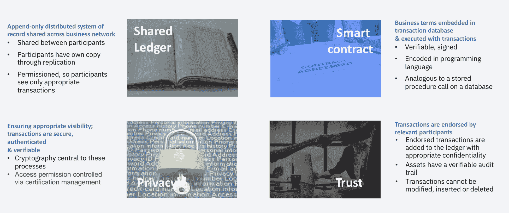
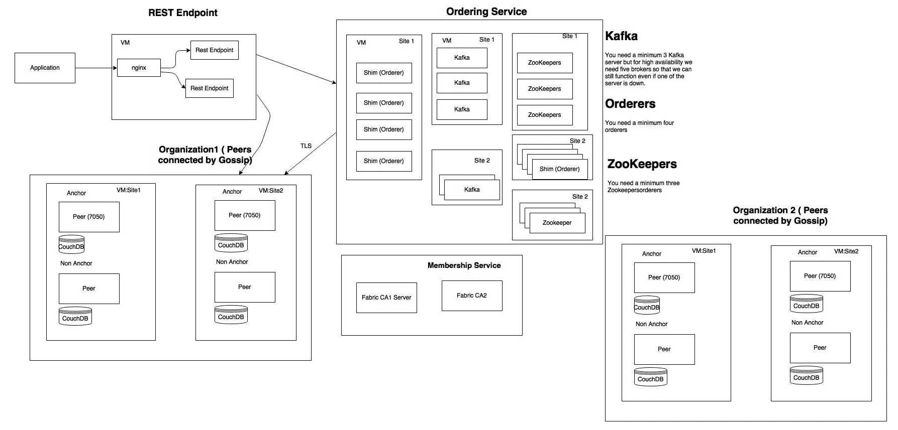
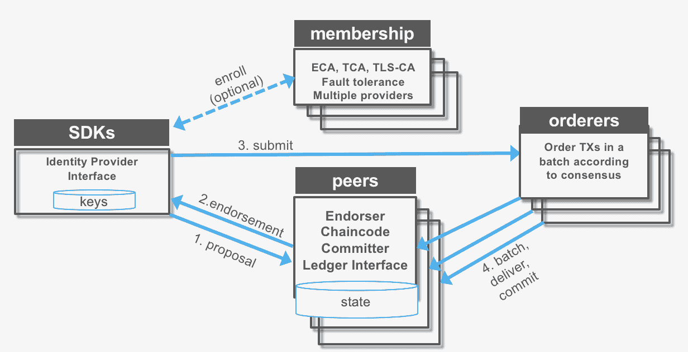
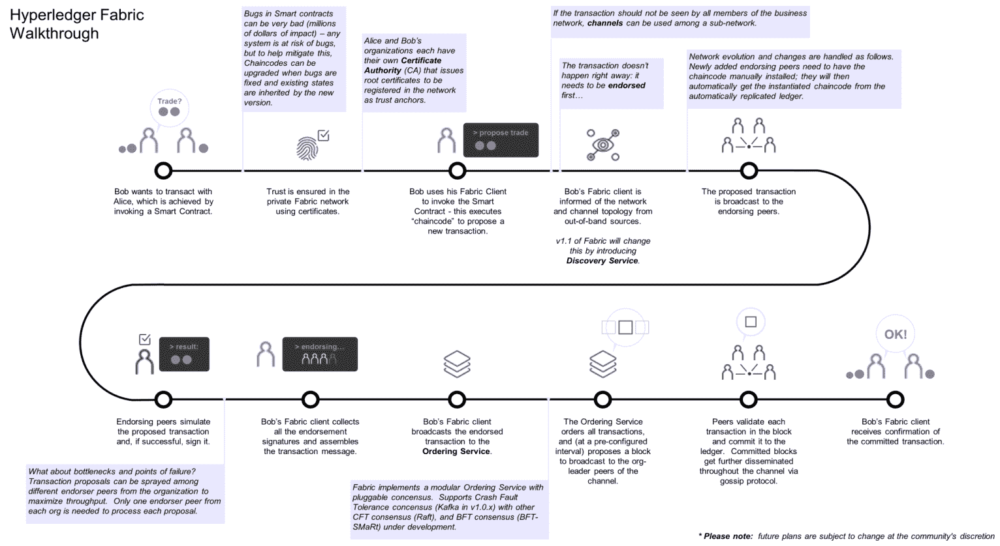
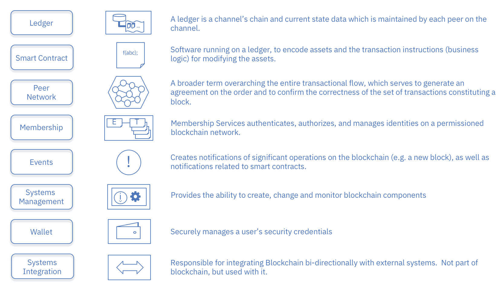
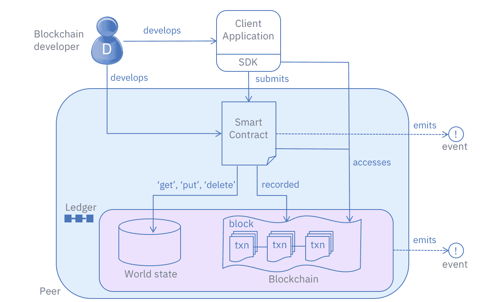

# 探索超分类帐结构

本章的重点是 Hyperledger Fabric 项目—其组件、设计、参考架构和整体企业准备情况。我们还将讨论由 Linux 基金会主办的 Hyperledger 项目的更广泛的目标，以及开源和开放标准的重要性。目标是理解各种 Hyperledger 项目的多样性，以及哪些框架和工具可能适合特定的企业用例以及软件消费模型。虽然区块链的技术格局一直在不断变化，但 Hyperledger 项目代表了一种支持成熟且经过同行评审的技术的结构，这种技术面向企业消费，并由各种人才和社区利益推动。

本章将涵盖以下主题:

*   Hyperledger 框架、工具和构建模块
*   Hyperledger 织物组件设计
*   hyperledger Fabric–样本交易之旅
*   探索超分类帐结构
*   理解区块链支持的商业网络中的治理

# Hyperledger 框架、工具和构建模块

现在我们已经了解了 Hyperledger 在开放计算运动中的基础，以及它对行业的好处，让我们来谈谈 Hyperledger 的框架、工具和构建模块。

# 超级分类帐框架

共有以下五个区块链框架:

*   Hyperledger Iroha : Iroha 是为移动开发项目设计的，基于 Hyperledger Fabric，由 Soramitsu、Hitachi、NTT Data 和 Colu 提供。它具有现代的、领域驱动的 C++设计，以及一种新的基于链的拜占庭容错共识算法，称为 **Sumeragi** 。
*   **Hyperledger 锯齿**:锯齿由英特尔贡献，包括英特尔提出的一种新的共识算法，称为**耗时证明** ( **诗人**)。PoET 旨在尽可能高效地实现分布式共识。Hyperledger Sawtooth 在许多领域都有潜力，支持有权限和无权限的部署，并能识别不同的需求。锯齿是为多功能而设计的。
*   Hyperledger Burrow:Hyperledger Burrow 最初是由 Monax 和 Intel 提供的，是一个模块化的区块链，它是根据**以太坊虚拟机** ( **EVM** )的规范由客户端构建的。
*   Hyperledger Fabric(**HLF**):Hyperledger Fabric 由 IBM 提供，旨在成为开发具有模块化架构的应用程序或解决方案的基础。它允许即插即用的组件，如共识和成员服务，并利用容器来托管称为**链码**的智能合约，该智能合约包括系统的应用逻辑。本章的其余部分将重点介绍 Hyperledger Fabric 及其设计、组件、架构和整体企业设计。

*   超级分类帐 Indy:Indy 最初由 Sovrin 基金会提供，是一个超级分类帐项目，旨在支持分布式分类帐的独立身份。Hyperledger Indy 提供了工具、库和可重用组件，用于提供基于区块链或其他分布式分类帐的数字身份:

# 超级分类帐工具

Hyperledger 项目中目前还有五个工具——都由 LF 托管。这些工具如下:

*   **Hyperledger explorer**:Hyperledger explorer 最初由 IBM、Intel、DTCC 贡献，可以查看、调用、部署或查询块、交易和关联数据、网络信息(名称、状态、节点列表)、链码和交易族，以及存储在分类帐中的其他相关信息。

*   **Hyperledger cello** : Cello 也是 IBM 贡献的。它寻求将按需即服务部署模型引入区块链生态系统，以减少创建、管理和终止区块链所需的工作。Cello 在各种基础设施(如裸机、虚拟机和其他容器平台)之上高效、自动地提供多租户链服务。
*   Hyperledger composer:Hyperledger composer(由 IBM 和 Oxchains 提供)是一套协作工具，用于构建区块链商业网络，加速智能合同和区块链应用程序的开发，以及它们在分布式分类帐中的部署。
*   **Hyperledger quilt**:Hyperledger quilt，来自 NTT 数据和 ripple，是 Ripple 的 interledger 协议的 Java 实现，旨在跨分布式和非分布式分类帐传输值。
*   Hyperledger caliper : Caliper 是一款区块链基准测试工具，允许用户使用预定义的用例来测量特定实现的性能，它正处于孵化阶段，由来自众多组织的开发人员提供。

# 区块链解决方案的组成部分

正如在[第一章](01.html)、*区块链——企业和行业视角*中提到的，区块链承诺从根本上解决金融服务、供应链、物流和医疗保健等行业的*时间*和*信任*问题。它寻求简化业务流程，从而解决效率低下的问题。这是一种基于信任、责任和透明的新一代交易应用技术。每个工业区块链都有几个共同的特征，包括:

*   一个共享的单一真理来源
*   安全且防篡改
*   私有不可链接身份
*   可扩展架构
*   机密的
*   可审计

下图将这些特征总结为四个原则:

区块链解决方案由四个构件组成——共享账本、隐私、信任和智能合约。请允许我详细阐述一下这些构件:

*   **共享账本**:比特币区块链的目的是让能见度民主化；但是，由于消费者数据的管理，企业区块链需要一种不同的方法。SQL 或非 SQL 分布式数据库可以实现只追加分布式事务记录。
*   **加密隐私**:加密隐私对于确保交易得到认证和验证至关重要。为了加强安全性并使分布式系统更难被攻破，必须在区块链设计中加入加密技术。当你在一个不太民主或不被允许的分类帐网络中工作时，关于加密的考虑会发生变化。

*   **信任系统或共识**:信任意味着利用网络的力量来验证交易。信任在任何区块链系统或应用中都是必不可少的，我更喜欢使用*信任*系统这个术语，而不是*共识*系统，因为信任是决定利益相关方在任何区块链基础设施中投资的基本要素。每当新的进入者进入区块链领域并将区块链技术应用于新的用例或专业化时，信任系统就会被修改。信任模式确实是区块链的核心——它传递了*信任*、*交易*和*所有权*的原则。信任是让区块链取代交易系统的原因，但这只有在交易和所有权由分布式/共享分类账处理时才会发生。为各种用例定义一个优化的信任系统还有很多工作要做。数据库解决方案正在处理规模和移动用例，但围绕 P2P 和共享经济模型以及 B2B 模型还需要更多的工作。
*   **智能合同**:在区块链的上下文中，智能合同是嵌入交易数据库并与交易一起执行的业务协议。业务中需要规则来定义交易的价值流和状态，所以这就是合同的功能。这份合同很聪明，因为它是一份执行合同条款的计算机化协议。各种合同条款(如抵押、担保、产权界定等)可以被编纂，以便强制遵守合同条款并确保交易成功，这是智能合同背后的基本思想。智能合同旨在让一方放心，另一方会履行承诺。这种合同的部分目的是降低核查和执行的成本。智能契约必须是可观察的(意味着参与者可以看到或证明彼此与契约相关的行为)、可验证的(意味着参与者可以向其他节点证明契约已经被履行或违反)和私有的(意味着对契约内容/履行的了解应该只涉及执行契约所需的必要参与者)。比特币为智能合约做了规定；然而，它缺乏一些功能，如图灵完全性、缺少状态等等。以太坊改进了比特币的局限性，用内置的图灵完全编程语言构建了一个区块链，这样任何人都可以通过为所有权、交易格式和状态转换函数创建自己的任意规则来编写智能合约和去中心化应用程序。这些进步使得复杂的合同可以编入区块链，例如当航班延误超过一定时间时，可以立即将信用转移到旅行者的银行账户，或者如果实现了绩效目标，可以支付员工薪酬。
    这实际上是如何工作的？智能合约作为代码部署在区块链节点上，我们称之为智能合约代码可能更合适。该代码是一种使用区块链技术来补充或替换现有法律合同的方式。该智能合同代码以诸如 Solidity 或 Golang 的编程语言部署在区块链节点上。在区块链上部署代码提供了三个重要的属性:
    *   从区块链继承的持久性和审查阻力，
    *   计划本身控制区块链资产的能力，例如通过在参与者之间转移资产的所有权或数量
    *   由区块链执行程序，确保程序总是按照编写的那样执行，没有人能够干涉

在企业领域，智能合同可能会涉及区块链的智能合同代码，伴随着一个更传统的法律合同。例如，智能合同代码可以在土地注册区块链网络上执行，以将房屋的所有权从一方转移到另一方，使得土地注册记录被实时更新，并且诸如城市、房地产经纪人、律师和银行的所有参与者都可以在完成销售时更新他们自己的记录。然而，房屋购买者将坚持一份带有赔偿条款的法律合同，以涵盖任何未被发现的留置权。

# Hyperledger 织物组件设计

让我们讨论一下有助于实现区块链共享账本、加密、信托系统和智能合同等技术原则的各种组件。这些组件代表 Hyperledger Fabric 基础结构组件，并提供与链代码或智能合同开发结构的隔离。链代码或智能合约开发细节将在单独的章节中详细讨论。

下图描述了 Hyperledger Fabric 基础结构组件:

Hyperledger 结构基础结构组件

以下是基础架构组件:

*   **Hyperledger Fabric CA** 是成员资格服务的一个实现，但并不要求必须使用(也就是说，可以使用任何基于 X509 的 PKI 基础设施，该基础设施可以颁发 EC 证书)
*   **专用订购者节点**
    *   实现原子广播 API
    *   对事务进行排序和批处理，并对每个批处理(块)进行签名，以创建哈希链
    *   Hyperledger Fabric 提供了两种实现—Solo(用于开发/测试)和基于 Kafka 的生产/容错实现
    *   订购服务是可插拔的——实现者只需要提供基于 gRPC 接口定义的原子广播 API
*   **同行**现在负责现有的智能逻辑(链码)和维护分类账
    *   背书模拟事务(也就是说，它执行事务，但不提交事务)
    *   对等体从订购者节点接收批量认可的事务，然后验证并提交事务(这消除了不确定性)

# 总账设计原则

Hyperledger Fabric 也是一个区块链实现，旨在部署模块化和可扩展的架构。它有一个模块化的子系统设计，因此不同的实现可以随时插入和实现。本节介绍 Hyperledger Fabric 参考体系结构，并详细描述各种组件/模块及其交互和功能。了解参考架构有助于做出更好的解决方案和技术设计决策，尤其是在可扩展性、安全性和性能方面。

虽然在本书中，我们将讨论 Hyperledger Fabric 的参考架构，但请注意，所有 Hyperledger 项目(之前提到的框架)都遵循包括以下原则的设计理念:

*   模块化和可扩展的方法:这意味着所有框架的所有组件都要模块化。Hyperledger 为所有项目定义的组件包括(但不限于)以下内容:
    *   共识层
    *   智能合同(链码)层
    *   通信(八卦)层
    *   数据存储(持久数据、日志数据和分类帐数据)
    *   身份服务(信任的根——识别参与者)
    *   蜜蜂
    *   可插拔密码术
*   **互操作性**:这个原则是关于向后互操作性，而不是各种 Hyperledger 项目支持的区块链系统或业务网络之间的互操作性。
*   **关注安全解决方案**:企业和商业网络安全是最重要的，因此关注安全——不仅仅是加密抽象——而是组件之间的交互和管理许可区块链的许可性质的结构。大多数进入许可区块链的行业都是成熟的、受监管的行业。
*   **令牌(或硬币或加密资产)不可知方法**:这在治理部分有详细讨论，但是 Hyperledger 项目不使用加密资产、加密货币、令牌或类似硬币的结构作为建立信任系统的激励机制。虽然存在代表物理、虚拟或非物质化资产的资产令牌化的概念，但资产令牌化与作为激励经济学的虚拟化在系统中生成的系统令牌是非常不同的概念。
*   **关注丰富且易于使用的 API**:这里的重点是确保区块链系统不仅可以访问企业中间件，还可以访问业务网络、现有参与者和新系统，而不会暴露区块链支持的业务网络的细节。

# CAP 定理

Eric Brewer 于 2000 年在 ACM 分布式计算原理研讨会(PODC)([https://dl.acm.org/citation.cfm?id=343502](https://dl.acm.org/citation.cfm?id=343502))上提出的 CAP 定理指出，在分布式数据存储中，不可能保证以下三个属性中的任何两个以上:一致性(C)、可用性(A)和分区容差(P)。因此，分布式数据存储的特征在于它保证的两个属性，即 CA、CP 或 AP。

更具体地说，该定理针对部署在不可靠网络(具有故障和延迟的网络，如互联网)上的分布式系统，导致系统组件的划分。根据 CAP 的说法，在这些环境中，系统设计必须关注可用性和一致性之间的平衡。例如，通常由 RDBMS(关系数据库管理系统)提供的 ACID(原子性、一致性、隔离性、持久性)方法保证了单个节点上的一致性，但牺牲了跨多个节点的可用性(CP 类型的系统)。但是，请注意，不同的配置也可能产生不同的组合，即 CA 或 AP。

相比之下，Fabric 的设计类似于许多其他区块链平台，如 AP 类型的系统，最终一致性也称为基础(基本可用、软状态、最终一致性)。

在区块链的上下文中，CAP 属性可以定义如下:

*   一致性:区块链网络避免了分类账的任何分叉
*   **可用性:**由客户提交的交易被永久地提交到分类账中，并在所有网络对等体上可用
*   **分区容忍度:**尽管对等体之间的物理网络介质会丢弃(或延迟)任意数量的事务提议或块，但区块链网络仍会继续运行

织物实现如下帽属性:

*   **一致性:**通过交易的总顺序和版本控制使用 MVCC
*   **可用性:**通过在每个对等体上托管分类帐的副本
*   **分区容忍度:**尽管有故障节点，仍能维持运行(达到阈值)

如您所见，在大多数区块链系统中，可用性和分区容忍度(CAP 定理的 AP 属性)是默认保证的。然而，一致性更难提供。

Fabric 通过结合以下元素来实现一致性:

*   交易处理被分成跨越网络的多个组件的一系列步骤。
*   客户连接到一个通信信道，并向认可的对等方提交交易提议，然后提交给订购服务。
*   订购服务将交易订购到具有总顺序的块中，即保证交易的顺序在整个网络中一致。一旦创建，块就被广播给信道的每个成员对等体。广播协议保证以正确的顺序(即全序广播)将块可靠地传递给对等体。
*   正如我们将在多版本并发控制中解释的那样，在对等体上收到块时，对等体使用 MVCC 根据存储在事务读集中的密钥版本来验证每个事务。MVCC 验证保证了生成的分类帐和世界状态的一致性，并防止了诸如重复支出之类的攻击。然而，这也可能导致删除原本有效的事务，这些事务是以违反`ReadSet`版本验证检查的顺序提交的。然后在分类账中将交易标记为有效或无效。
*   然后，分类帐包含一系列完全有序的块，其中每个块包含一系列完全有序的交易(有效或无效)，从而产生一个对所有交易施加总订单的分类帐。

# 超级分类帐结构参考架构

Hyperledger Fabric 遵循模块化设计，以下是一些可以插入和实现的可能组件或模块。请注意，此列表并不详尽:

*   **成员服务**:该模块本质上是一个许可模块，在网络创建过程中作为建立信任根的工具，但它也有助于确保和管理成员的身份。会员服务本质上是一个认证机构，也是**公钥基础设施** ( **PKI** )的利用元素，用于诸如密钥分发、管理和随着网络增长建立联合信任之类的事情。成员服务模块提供了一个专门的数字证书颁发机构，用于向区块链网络的成员颁发证书，并利用 Hyperledger Fabric 提供的加密功能。
*   **交易**:交易是对区块链执行分类账功能的请求。该功能由链码实现。密码术通过将交易链接到先前的块来确保交易的完整性，并且通过链接来自先前链接的块的密码或散列来确保交易的完整性(如果受到保护的话)。Hyperledger Fabric 中的每个通道都是自己的区块链。
*   **智能合同或链码服务**:链码是作为交易的一部分存储在分类账中的应用级代码。Chaincode 运行可能修改世界状态的事务。事务逻辑被写成链码(在 Go 或 JavaScript 语言中)，并在安全的 Docker 容器中执行。该事务转换数据，其作用域由它操作的通道上的链码决定。

以下是链码服务支持的智能合约或链码元素。Chaincode 安装在对等体上，对等体需要访问资产状态来执行读写操作。然后，在特定的信道上为特定的对等体实例化链码。渠道中的分类账可以在整个对等网络中共享，也可以只包含一组特定的参与者。同行能够参与多个渠道:

*   **事件**:验证对等体和链码的过程会在网络上产生事件(由链码生成的预定义事件和自定义事件)，应用程序可以监听这些事件并对其采取行动。这些事件由事件适配器消费，事件适配器可以使用 WebHooks 或 Kafka 等工具进一步交付事件。Fabric-committing 对等体提供一个事件流来向注册的侦听器发布事件。从 1.0 版开始，发布的唯一事件是块事件。每当提交方将经过验证的块添加到分类帐时，都会发布块事件:

*   共识:共识是任何区块链系统的核心。它还支持信任系统。一般而言，共识服务使得数字签名的交易能够被网络成员提议和验证。在 Hyperledger Fabric 中，共识是可插入的，并与 Hyperledger 提出的背书订单验证模型紧密相关。Hyperledger Fabric 中的订购服务代表共识系统。排序服务将多个事务批处理成块，并输出包含事务的散列链式块序列。
*   **分类帐**:另一个组件是分布式加密分类帐，包括只附加数据存储。这提供了跨分布式分类帐查询和写入数据的能力。有两种选择:
    *   Level DB(默认嵌入式 KV DB)支持键控查询、组合键查询和键范围查询
    *   Couch DB(外部选项)支持键控查询、组合键查询、键范围查询以及全数据丰富查询
*   **客户端 SDK** :客户端 SDK 支持应用程序的创建，这些应用程序在共享分类帐上部署和调用事务。Hyperledger Fabric 参考架构支持 Node.js 和 Java SDK。软件开发工具包就像一个编程工具包或一组工具，为开发人员提供了编写和测试链代码应用程序的库环境。SDK 在区块链应用程序开发中至关重要，将在后续章节中详细讨论。SDK 中包含的特定功能包括应用程序客户端、链码、用户、事件和加密套件。

# Hyperledger 结构运行时架构

现在我们已经了解了参考架构，让我们考虑 Hyperledger Fabric 的运行时架构:

以下大纲演示了 Hyperledger Fabric 运行时事务处理流程:

*   **交易建议(应用软件开发工具包)**:
    1.  交易建议由应用程序 SDK 提交
    2.  它在背书后收到交易提案回复(包括读写集)
    3.  它将事务(包括读写集)提交给订购服务
*   **交易背书**:
    1.  该交易被发送到由其渠道上的背书对等方代表的交易方
    2.  每个对等体通过调用指定的 chaincode 函数来执行事务，并对结果进行签名，该结果成为事务的读写集
    3.  每个对等体可以参与多个通道，从而允许并发执行

*   **提交给订购服务的交易**:
    1.  订购服务接受认可的事务，并根据插件共识算法对它们进行订购，然后在通道上交付它们
    2.  渠道上的对等方接收交易并在提交到分类帐之前进行验证
*   **交易验证**:
    1.  验证每个事务和提交块
    2.  验证认可策略
    3.  验证状态数据库中的读取集版本
    4.  将区块提交给区块链
    5.  将有效事务提交给状态数据库

# 组件化设计的优点和优势

Hyperledger Fabric 的组件设计提供了几个优势。这些优势中的许多都与业务网络治理有关，这是企业中 Hyperledger 结构的重要合规性和成本考虑因素。

这些好处包括:

*   **将开发设计从运行时设计中划分出来**:将开发和运行时设计分开很重要，因为这种划分对于开发最佳实践和基础设施/混合云变化很重要，并确保符合当前企业及其与业务网络应用程序开发的连接性，以及 DevOps 实践。
*   **区分设计要求和基础设施/部署能力**:组件化设计允许我们将基础设施设计从决定技术蓝图的业务网络蓝图的整体应用程序设计中分离出来，基础设施设计包括网络连接、安全性、许可和合同工具等内容。

*   **整合了网络设计原则**:Hyperledger Fabric 的模块化可以解决基础设施的扩展问题，比如连接数、协同定位、安全性、容器部署实践等等。网络设计需要考虑各种因素，例如云部署、混合和/或内部部署，以及任何可用选项的组合，具体取决于企业网络中各个成员的要求。网络设计还应对网络增长带来的业务挑战，以及随之而来的性能和安全性驱动的**服务水平协议** ( **SLA** )对其成员的影响。
*   **解决渠道设计原则**:模块化或组件化设计还可以解决参与者之间的隔离、数据隐私和机密性，以及具有强大审计能力的受控/许可访问。Hyperledger Fabric 中的渠道结构使我们能够解决围绕实施业务定义的交易的业务蓝图要求，这些交易可能是双边、三边或多边交易。通道还提供了一种途径，将交易数据的可见性限制为少数参与者，或者在需要时提供完全的访问权限，例如对监管者。通道设计还解决了围绕事务处理、数据可见性、业务规则实施等的关键业务需求。它还具有技术含义，例如支持业务网络的基础设施的可伸缩性、安全性和成本。最后，渠道设计解决了网络增长带来的业务挑战，以及由此产生的面向成员的性能和安全性驱动的 SLA。
*   **采用 Hyperledger Fabric composer 模型驱动开发** : Hyperledger Composer 是之前在 Hyperledger tools 中讨论过的工具之一，它提供了一种模块化开发的途径，通过一种可移植的标准化工具来添加治理和控制，类似于 JAR/WAR/RAR 等 JEE 构造。**业务网络存档** ( **BNA** )是一个可以集成到 DevOps 实践中的存档，用于跨企业团队开发和协作生命周期管理功能。其思想是将链码开发与基础设施设计分开，并将维护企业或业务网络应用技术实践的两个方面所需的能力分开。有关 Hyperledger Fabric composer 的更多详细信息将在专门介绍 composer 和工具的单独章节中讨论。

前面描述的组件化设计的每个优势都涉及运行时/基础设施设计(即资源的使用和产生的成本)、灵活设计(如产品和关系变化)和解决方案的寿命(企业云基础设施的全球足迹，包括以维护和支持的形式对技术和业务 SME 的稳健访问)——所有这些对于解决方案的合规性、治理和寿命以及由区块链支持的最终业务网络都是必不可少的。

# hyperledger Fabric–样本交易之旅

现在，让我们来看一个使用 Hyperledger Fabric 的示例事务的过程。本节将帮助奠定 Hyperledger 结构概念和组件的基础，以便更好地理解交易处理中涉及的各个层:

Hyperledger 结构演练

Fabric 引入了新设计的区块链，保留了事务处理架构，并致力于安全、可伸缩、弹性、模块化和保密的设计。Hyperledger Fabric(在撰写本书时，当前版本是 1.1)支持执行支持企业友好编程模型的分布式应用程序。Hyperledger Fabric 中的组件提供了模块化设计，最适合由各种企业组成的业务网络。Hyperledger Fabric 引入了一个基于三个步骤的模型，一个*背书-订单-验证*架构，设计用于在不可信环境中分布式执行不可信代码。这种分离不仅允许大规模配置，还通过在每一层进行分离来确保安全性。

交易流程分为三个步骤，可以在系统中的不同实体上运行:

1.  **交易的认可并检查其有效性** ( **验证步骤**):该步骤包括渠道成员检查并遵守认可政策，该政策定义了认可的方法来验证交易提案。由于对等方需要更新分类帐(在交易结束时)，对等方(订阅了渠道)审查提案并提供他们的分类帐版本(读)和(写)集。这个验证步骤非常重要，因为它提供了交易验证的第一步。这种检查也作为一个关口，防止交易的错误下游处理，这在计算上可能是昂贵的。
2.  **通过订购服务订购**:这是一个共识协议，不管事务语义如何，都是可插拔的。共识的可插入性为企业和商业网络提供了巨大的灵活性，因为对于各种类型的行业、用例以及网络参与者之间的交互都有共识机制的考虑。
3.  **验证或事务提交**:这意味着提交一个事务，并因此按照特定于应用程序的信任假设经历一组最终的验证。

Hyperledger 结构事务涉及三种类型的节点:

*   **提交对等点**是维护分类帐和状态的节点。提交方是*提交*交易的一方，可能持有智能合约或链码。
*   **背书对等方**是一个专门的承诺对等方，可以批准或拒绝对交易提议的背书。签署方必须持有智能合同。

*   **排序节点**(服务)与提交节点和对等节点通信；他们的主要职能是批准将交易块纳入分类账。与提交对等点和签署对等点不同，订购节点不持有智能合同或分类帐。

验证可以分为两个角色，认可和订购:

*   认可一个交易意味着验证它遵守一个智能契约；背书人签署合同以完成这方面的验证
*   订购验证交易是否包含在分类帐中；这种形式的验证有助于控制分类帐中的内容，并确保其一致性

链代码调用呢？在 Hyperledger 结构事务中，模拟(链代码执行)和块验证/提交是分开的。

使用 Hyperledger Fabric 执行链码操作(即业务交易)涉及三个阶段:

1.  第一阶段是通过在认可对等体上的模拟来执行链代码操作。因为模拟不会更新区块链状态，所以可以在签署者上启用并行模拟来帮助提高并发性和可伸缩性。
2.  接下来，simulation 确定业务事务建议，即读集/写集，并将其广播给订购服务。
3.  然后，针对其他方对事务提议进行排序，并将其广播给提交对等方(包括认可对等方)，提交对等方验证其读取集自模拟以来未被修改，并自动应用其写入集。

通道也是交易过程的一个重要方面，因为对等方通过通道使用共识交换消息，并且它们确保不同分类帐之间的隐私。以下是一些关于渠道的注意事项:

*   它们不必由所有节点连接
*   对等体通过访问控制策略连接到通道
*   订购服务订购向频道广播的交易
*   对等体以完全相同的顺序接收通道的事务

*   事务以加密链接块的形式传递
*   每个对等方验证交付的块，并将它们提交给分类帐

# 探索超分类帐结构

**区块链网络中的参与者**:区块链是一种基于网络的基础设施，其中应用了以网络为中心的设计、开发、部署、管理和支持结构。因此，了解出于各种目的(如管理、支持、业务用户、监管等)与区块链网络互动的各种参与者及其角色至关重要:

每个参与者都有一个角色和入口点，并定义了一个有助于网络治理、审计和法规遵从性要求的治理结构。业务网络治理(将在以下几点中详细介绍)是一个重要的法规遵从性和成本考虑因素。用户是指使用区块链的当事人。他们创建和分发区块链应用程序，并使用区块链执行操作。这些参与者是一致的，并且基于 ISO/IEC 17788 的云计算参与者和角色:

*   **开发者**:区块链开发者是为用户(客户端)创建应用程序，并开发与区块链交互的智能合约(服务器端)的参与者，然后区块链用户使用智能合约发起交易。他们还编写代码，使区块链能够与遗留应用程序进行交互。
*   **管理员**:区块链管理员执行管理活动，例如区块链网络或应用的部署和配置。
*   **运营商**:区块链运营商负责定义、创建、管理和监控区块链网络和应用。
*   **审计员**:区块链审计员负责审查区块链交易，并从业务、法律、审计和合规角度验证其完整性。
*   **商业用户**:该术语指在商业网络中运行的用户。他们使用应用程序与区块链交互，但可能不知道区块链，因为它将是一个不可见的事务系统。

# 区块链网络中的组件

一般来说，区块链系统由许多节点组成，每个节点都有一个分类账的本地副本。在大多数系统中，节点属于不同的组织。这些节点相互通信，以便就分类帐中应该包含的内容达成一致。

获得这种一致的过程被称为**共识**，为此已经开发了许多不同的算法。用户向区块链发送事务请求，以便执行该链旨在提供的操作。一旦交易完成，交易记录被添加到一个或多个分类账中，并且永远不能被更改或删除。区块链的这个性质叫做**不变性**。密码术用于保护区块链本身以及区块链系统的元件之间的通信。它确保分类账不能被改变，除非增加新的交易。加密技术为来自用户或节点之间的消息提供完整性，并确保操作仅由授权实体执行:

在区块链上执行交易的权限可以使用两种模型之一:有权限的或无权限的。在许可的区块链中，用户必须在区块链中注册，然后才能执行交易。注册过程为用户提供凭据，用于在用户执行交易时识别用户。在无权限区块链中，任何人都可以执行事务，但是他们通常被限制只能对自己的数据执行操作。区块链所有者开发了一个名为**智能合约**的可执行软件模块，安装在区块链本身中。当用户向区块链发送交易时，它可以调用智能合约模块，该模块执行由智能合约模块的创建者定义的功能。

# 开发者互动

正如在*Hyperledger Fabric Explored*部分的介绍中所讨论的，区块链开发人员可以扮演许多角色，包括为用户(客户端)创建应用程序和开发智能合约。开发人员还编写代码，使区块链能够与传统应用程序进行交互:

区块链开发人员的主要角色是创建应用程序(和集成)和智能合同，以及它们各自与分类帐和业务网络的其他企业系统及其参与者的交互。由于 Hyperledger Fabric 基础架构的分离，基础架构结构(如对等体、共识、安全性、渠道、策略和开发人员主导的活动，如智能合同开发、部署、企业集成、API 管理和前端应用程序开发)之间存在明显的分离。

从开发人员的角度来看，以下概述代表了开发人员与 Hyperledger Fabric 结构交互的示例:

*   开发人员创建应用程序和智能合同
*   应用程序可以通过 SDK 调用智能合约中的调用
*   这些调用由内置于智能合约中的业务逻辑通过各种命令和协议进行处理:
    *   一个`put`或`delete`命令将通过所选择的一致协议，并将被添加到区块链中
    *   一个`get`命令只能从世界状态中读取，但不能记录在区块链上
*   应用程序可以使用 rest APIs 访问块信息，例如`get block height`

注意这里 delete 的用法——delete 可以从世界状态数据库中删除键，但是不能从区块链中删除事务，我们已经确定这是不可变的。

下图总结了所有关键角色:

# 理解区块链支持的商业网络中的治理

治理可以定义为集中或分散的机构，其唯一的职责是在给定的系统中建立一套规则或法律，以做出有约束力的决策。区块链网络的治理面临一系列挑战，在本节中，我们将讨论这些挑战以及区块链网络的治理结构。在区块链的背景下，治理的话题呈现出一个有趣的悖论。

当区块链网络创建时，治理结构通常是分布式的，各种利益相关者提供投入。区块链网络的特点是去中心化和自我治理，内置控制点和激励机制，有助于保持正确的平衡。事务经过一系列分散的处理步骤，输出一个提供事务终结性的决策。这种治理结构基于激励经济学和共识。

区块链始于很大程度上无许可的网络(例如基于加密资产的网络，如比特币、莱特币等)，这些网络依赖于通过激励和协调实现的基于技术的系统治理。当商业世界试图应用区块链的信条时，这种系统性的治理给它带来了几个挑战。企业界受到高度监管，因此依赖于有制衡机制的许可区块链模式；考虑到各种数据法规、信托责任以及一起交易的竞争实体之间的潜在利益冲突，这可能会变得相当复杂。出于保密和隐私方面的考虑，不一定会有相同类型的激励或协调。

企业关注的焦点通常是理解区块链技术及其对业务的潜在影响。治理现在已经成为区块链企业界一个有趣的新兴学科，而且是一个重要的学科。正如你从对区块链商业模式的讨论中看到的，有一系列可能的治理结构，从完全分权和半分权到完全集中的区块链网络。治理结构实际上决定了区块链采用的许多其他方面，从设计到运营到增长模式。业务模式和治理结构紧密相连，相互依赖；两者都指导着区块链网络运作的各个方面。

# 治理结构和格局

依赖于激励和网络参与者之间协调的系统治理不足以解决更多受监管的行业及其用例。因此，我试图为更传统的企业定义一个治理结构和前景，这是一种利用现有最佳实践的模块化方法。

这种模式旨在促进进步和发展，但也为网络中的参与者提供了必要的隔离。我将概述的简化治理结构建立在区块链的核心原则以及激励、惩罚、灵活性、授权和协调的原则之上。请记住，利用区块链的目标是发展信任网络，同时实施某些参与规则。一般来说，区块链项目旨在激励技术和安全升级，并惩罚违规行为，希望确保持续参与和共享由区块链提供动力的网络的商业利益。我再次描述的商业治理模型不仅有助于公平参与这种网络，而且有助于公平的成本结构。本节提供了一个高层次的背景。我们已经在专门讨论治理的章节中讨论了更多的细节。

# 信息技术治理

IT 治理规程关注 IT 基础设施、性能、成本结构和风险。这给分散式区块链网络带来了一些挑战，因为治理框架应该建立问责制，以鼓励理想的行为和网络 IT 基础设施的最佳运行。区块链网络的技术设计和基础设施选择应该能够适应其参与者的需求。因为区块链网络至少在某种程度上依赖于去中心化，所以 IT 治理应该包括分布式灵活性和分布式控制。

IT 治理至少应该提供以下内容:

*   分布式 IT 管理结构
*   分布式维护、升级等的模型
*   利用行业标准— COBIT、ITIL、ISO、CMMI、FAIR 等
*   资源优化—这包括技术采购、供应商关系、SLA 管理、技能和人才管理

*   技术采用和评估，以跟上技术发展
*   鼓励和强制定期更新和升级的网络部署策略
*   网络支持服务— IT SLA 实施和会员服务
*   风险优化— **运营支持服务** ( **OSSs** )和**业务支持服务** ( **BSSs** )、IT 基础设施连续性服务/规划、符合法律法规要求的技术等等

# 区块链网络治理

治理可能涉及以下内容:

*   管理网络参与
*   形成公平的成本结构，根据参与者的活动公平分配
*   允许志同道合的参与实体参与交易和价值创造
*   以促进公平为目标，管理雇佣规则和社会契约

区块链网络的治理包括以下内容:

*   入职和离职成员
*   建立公平的成本结构
*   详细说明数据所有权如何工作
*   监管监督和合规报告
*   管理具有中央管理和投票过程的许可结构、联合结构和委托结构
*   管理业务运营和 SLA
*   网络支持服务(与 IT 治理相同)
*   风险优化(与 IT 治理相同)

# 商业网络治理

管理区块链驱动的业务网络将需要一个特定于使用案例和行业的模型，并考虑该行业的发展和特殊性。这种治理结构将是多组织的，参与组织需要广泛了解网络如何通过集体贡献发挥作用，以实现最佳结果。随着新参与者的增加或减少，以及区块链网络的发展，其动态也在变化。

共同创造的概念意味着将各方聚集在一起，以产生互利和有价值的结果。一个例子可能是将一家公司与一群客户联合起来，产生新的想法，听取新的观点。

以下是业务网络治理可能包括的内容的非详尽列表:

*   制定商业模式、网络运营规则和法律章程
*   网络中常见/共享的服务管理，例如了解您的客户流程、审计、报告等
*   与网络相关的通信
*   质量保证和绩效衡量
*   监控和管理网络安全
*   产品和业务网络发展计划
*   法律和监管框架的执行
*   确保符合行业特定要求的策略
*   建立技术和网络的管家

区块链网络中的治理结构可能是一个有趣的挑战。正如我所展示的，关于区块链网络的完全去中心化、准去中心化和完全中心化仍有相当多的争论，这实际上取决于治理结构。我的意思是，区块链网络的治理结构有助于决定哪种互动、增长、技术选择和运营最适合该网络。正如我之前所说，区块链是一个支持共同创造的平台，从中产生的新协同效应需要通过 SLA 和强大的治理结构进行一些管理。治理将在 *[中详细讲述第十章](10.html)**治理，必要之恶的被监管行业*。

# 摘要

所有这些都有助于您吸引新的参与者加入网络，并保持创始和现有参与者的信心，同时保持商业利益和价值。

业务模式和治理结构相互依赖，共同管理区块链网络的运营。一个精心规划的治理模型将确保所涉及的实体之间的和谐，这些实体可能在不同的时间充当竞争者、共同创造者或合作者。