# 商业网络示例

在这一章中，我们将通过一个示例业务网络，包括一个真实世界的例子，把我们已经讨论过的所有概念结合起来。具体来说，我们将详细演练 Hyperledger Composer 信用证示例，以便您能够理解参与者、资产、交易和事件是如何在代码中实现的。我们将展示如何使用、分析、定义业务网络，以及如何使用该定义来生成 API、测试它们并将它们集成到一个示例应用程序中。这将是一次全面的旅行，让你从概念到实施。我们将使用信用证样本，因为它代表了一个众所周知的过程，这个过程经常在与区块链的关系中被讨论。让我们先讨论这个过程，然后看看为什么用它作为海报孩子的例子。

# 信用证样本

所以我们得到了我们的样本。意大利 QuickFix IT 公司的老板 Alice 想从美国经营 Conga 计算机公司的 Bob 那里购买计算机。爱丽丝打算从她的银行迪内罗银行申请一封信或信用证，由鲍勃的银行伊斯特伍德银行接受，作为一种支付方式。

我们将使用位于[https://github.com/hyperledger/composer-sample-applications](https://github.com/hyperledger/composer-sample-applications)的信用证样本应用程序来尝试整个流程。这个存储库包含许多业务网络的示例应用程序——我们将使用信用证示例。

# 安装示例

如果你已经按照 [*第三章*](03.html) 、*设定商业场景*中的步骤，你应该已经完成了所有的先决条件。现在将示例应用程序的存储库副本([https://github.com/hyperledger/composer-sample-applications](https://github.com/hyperledger/composer-sample-applications))分支到您的 GitHub 帐户，然后使用以下命令将其克隆到您的本地机器上:

```
cd <your local git directory>
git clone git@github.com:<your github name>/composer-sample-applications.git

```

使用以下命令导航到适当的目录并安装信用证示例应用程序。下载和安装应用程序需要几分钟时间:

```
cd composer-sample-applications

cd packages/letter-of-credit

./install.sh
```

安装脚本还将在您的浏览器中启动应用程序表示层。我们来调查一下。

# 运行样本

你会看到你的浏览器打开了对应于网络中不同参与者的标签。单击不同的选项卡，查看网络中的不同参与者。在我们研究这个例子的时候，我们将居住在每一个角色中。让我们通过试用该应用程序来完成这一过程:


# 步骤 1-准备申请信用证

我们从准备我们的请求开始:

1.  选择浏览器上的第一个选项卡，您将看到以下页面:


2.  你现在是爱丽丝了！您可以看到您的银行和您的帐户详情。您可以通过单击“应用”按钮来申请信用证。试试看！

3.  您将看到一个页面，您可以在其中申请信用证:


# 步骤 2-申请信用证

这是流程的第一步，您将向 Bob 申请购买电脑的信用证！在每个屏幕的顶部，您会看到您在流程中的确切位置，例如:


在页面的左侧，您将看到商家的详细信息，即 Alice 和 Bob 的信息。请注意公司名称和帐户详情:


让我们以爱丽丝的身份制作一个应用程序。在屏幕的右侧，您可以输入交易的详细信息。假设 Alice 向 Bob 请求 1，250 台计算机，单价为 1，500。该申请的总价值为 187.5 万欧元:


还要注意的是，Alice 可以选择(在银行允许的情况下)申请中的一些条款和条件。这些是与 Bob 签订的合同的重要条款和条件，除非他们满意，否则任何一方都不会收到货物或付款:

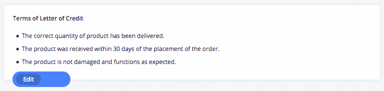

如果您愿意，您可以编辑它们，尽管该过程不受它们的影响。

当您准备好进入流程的下一阶段时，请单击“开始批准流程”按钮:


祝贺你，你刚刚申请了信用证！

# 步骤 3–导入银行审批

这是过程的下一阶段。单击浏览器中的下一个选项卡。你现在是马蒂亚斯，爱丽丝的银行迪内罗的雇员，需要处理她的申请！这是马蒂亚斯看到的一页:

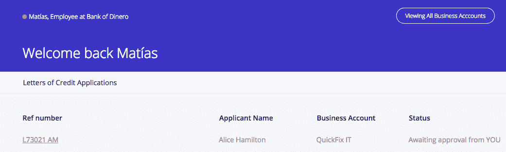

它显示了 Alice 的申请，并且正在等待 Matias 的批准。他代表 Dinero 银行行事，并应用批准或拒绝信函所需的任何流程。我们可以想象，在一个复杂的过程中，马蒂亚斯只需批准那些不能自动批准的特殊信件。

如果 Matias 单击应用程序，他将看到详细信息，这些信息与 Alice 要求的基本相同:


在我们的场景中，Matias 将批准信用证，并且流程将继续！选择“接受”按钮，我们将进入下一步:

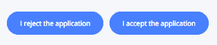

# 第 4 步-出口银行审批

单击浏览器中的下一个选项卡。你现在是 Ella，Bob 的银行 Eastwood 的雇员，她被告知 Alice 希望与 Bob 做生意:


这个例子在这个过程中使用了一点创造性的许可——通常，这封信会由 Alice 呈现给 Bob。然后鲍勃会把它呈现给艾拉。但是，我们可以看到，因为每个人都可以提前查看信件，所以流程创新是可能的。我们将在后面详细阐述这一点。

我们可以看到 Ella 批准了流程中的下一个阶段，我们还可以看到信函在流程中的位置。当 Ella 选择这封信时，她可以看到以下详细信息:

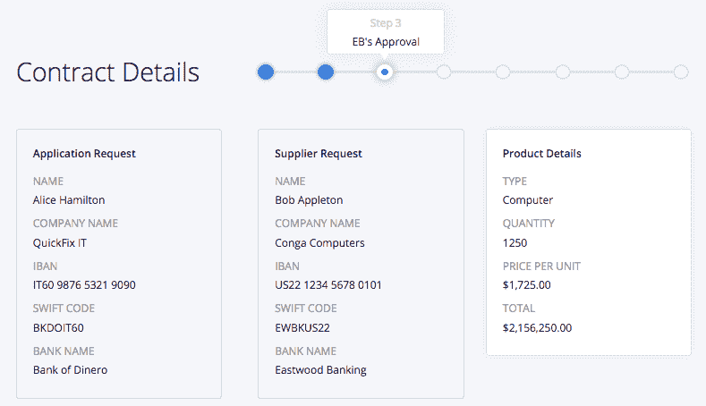

请注意，货币已经更改。Alice 必须用美元付款，因为这是 Bob 想要的，但是 Ella 和 Matias 已经为 Alice 和 Bob 商定了一个汇率，以便他们可以使用自己的货币。爱丽丝将以欧元付款，鲍勃以美元付款。

在屏幕顶部，您将看到以下与流程相关的信息。我们可以看到我们在这个过程中的位置；由于区块链的独特性，增加透明度成为可能，尽管不同的组织通过各自的系统管理和批准流程的各个阶段:


让我们再次推进这一进程。Ella 可以通过点击接受按钮来批准这封信:

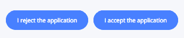

# 第 5 步-出口商收到信函

单击浏览器中的下一个选项卡。你现在是 Bob，你可以看到来自 Alice 的信用证:

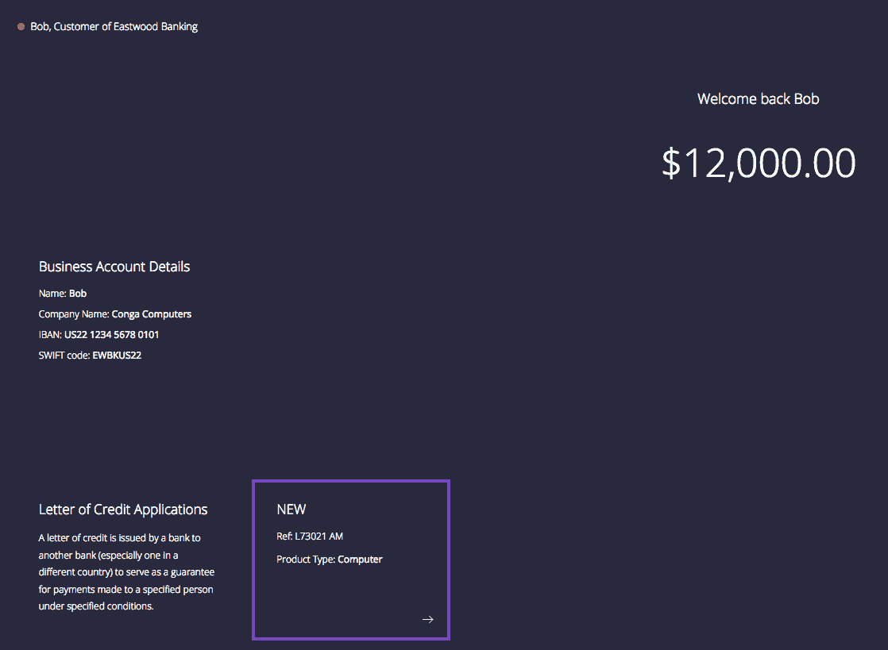

在这个流程示例中，Bob 可以非常确定 Alice 是值得信任的，因为他的银行已经提前告诉了他。如果 Bob 选择了这封信，将向他显示其详细信息:

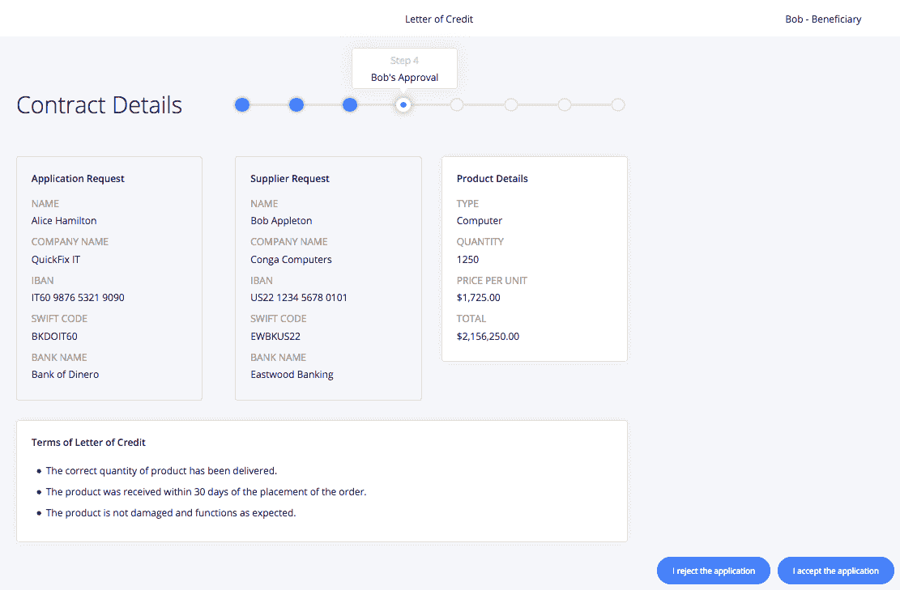

希望你现在已经开始理解这个过程了——所以我们不要再重复所有的细节了！请注意 Bob 是如何因为透明性而增加信任的。Bob 接受信函作为付款方式(点击 Accept ),现在必须将货物发送给 Alice！

# 第 6 步–装运

您将返回到 Bob 的初始屏幕，但请注意，现在有一个将货物运送给 Alice 的选项:

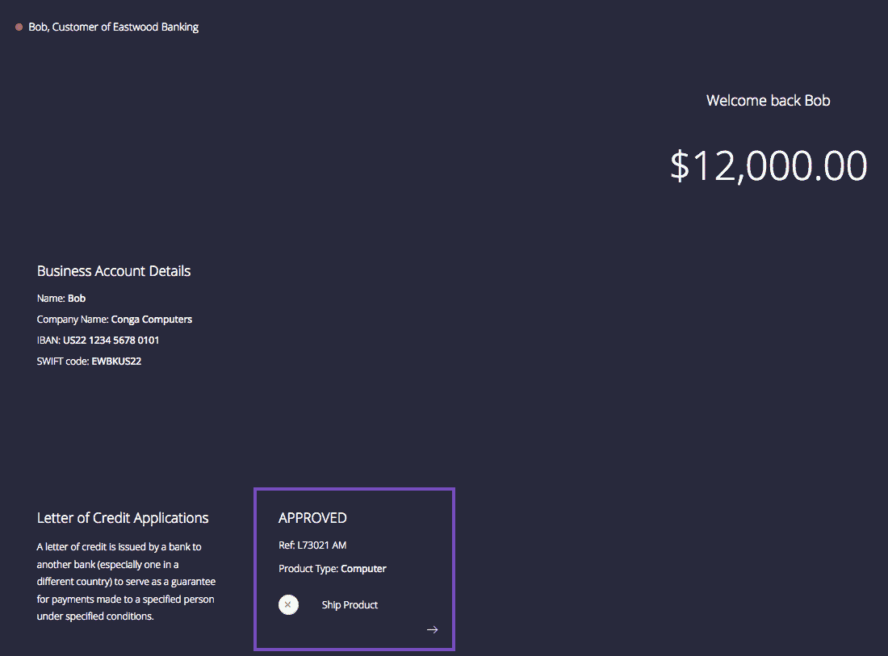

点击“发货订单”,表明货物已经发送给 Alice:

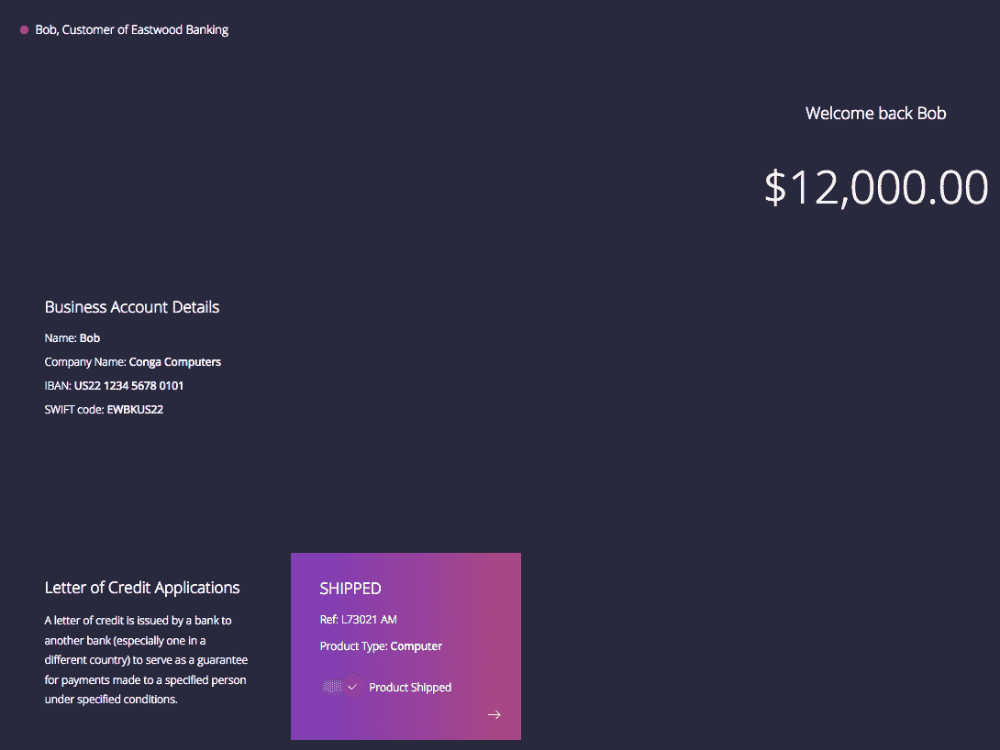

Bob 现在可以看到，就信用证流程而言，他已经完成了——订单已经发货。

但是 Bob 还没有收到付款——在此之前，Alice 必须先收到货物。请注意 Bob 网页右下角的历史记录。Bob 可以看到他在整个流程中的位置，以及在他收到付款之前需要完成的一些步骤:

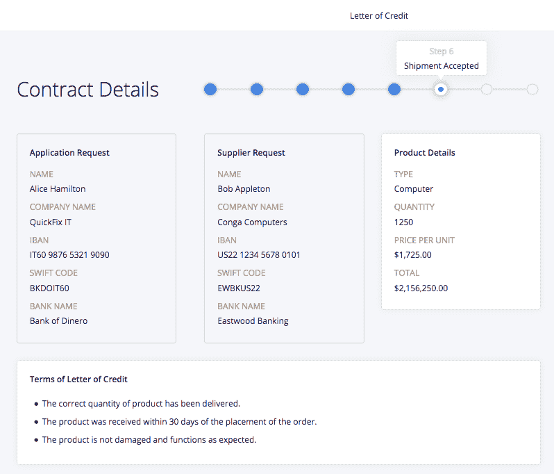

让我们回到 Alice，继续下一步。

# 第 7 步-收到货物

在浏览器中返回到 Alice 的选项卡:

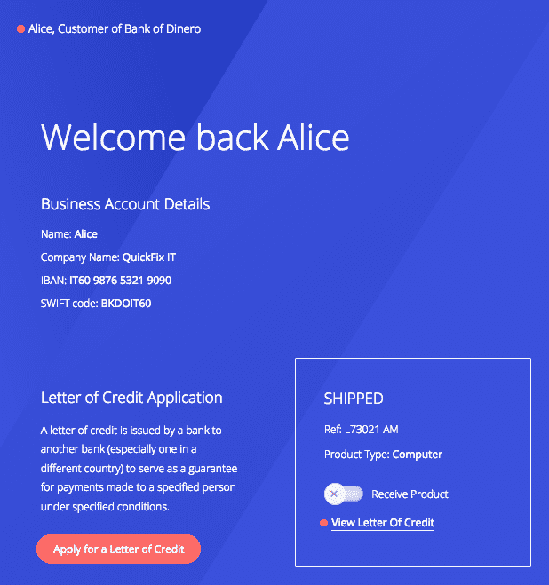

当 Alice 从 Bob 处收到计算机时，她可以单击 Receive Order 来表明这一点，并检查信用证。此时，两家银行都能够释放付款。让我们转到 Matias 的网页来看看这个流程步骤。

# 第 8 步–付款

马蒂亚斯可以看到爱丽丝和鲍勃很高兴，因此可以付款。点击马蒂亚斯的首页，查看当前信件的详细内容:

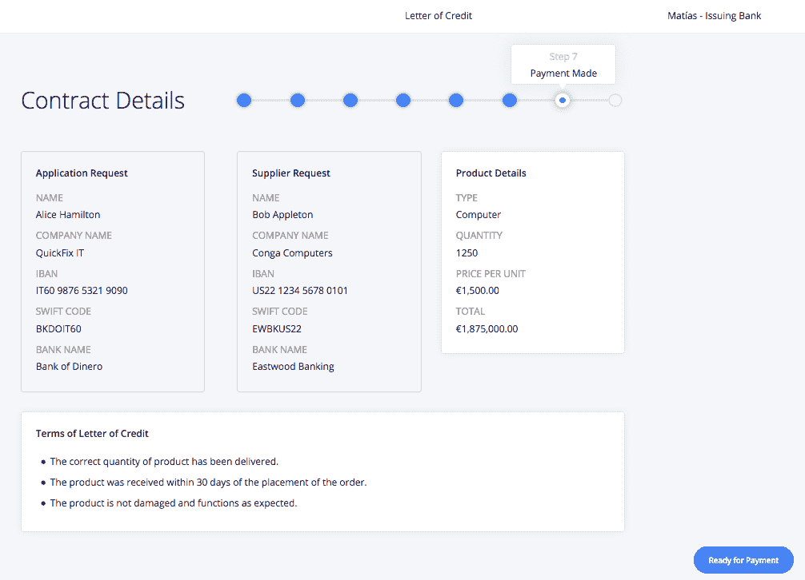

Matias 可以看到 Alice 已经收到货物，Matias 可以点击 Ready for Payment 进入流程的下一步。

# 第 9 步–结束信函

Ella 现在可以关闭信函并向 Bob 付款:

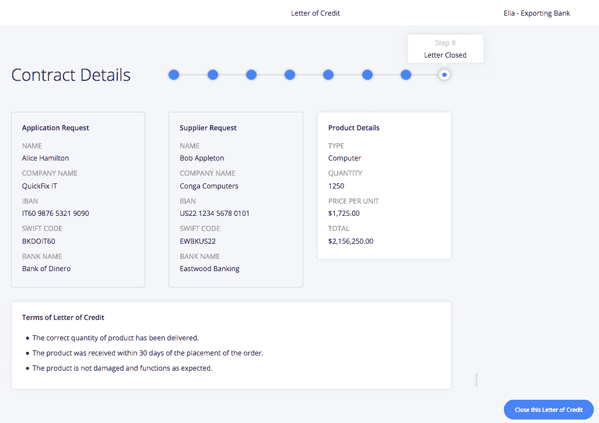

作为 Ella，单击“关闭”进入流程的最后一步。

# 第 10 步 Bob 收到付款

如果我们回到 Bob 的网页并刷新它，我们可以看到 Bob 有一些好消息！看看他增加的余额:

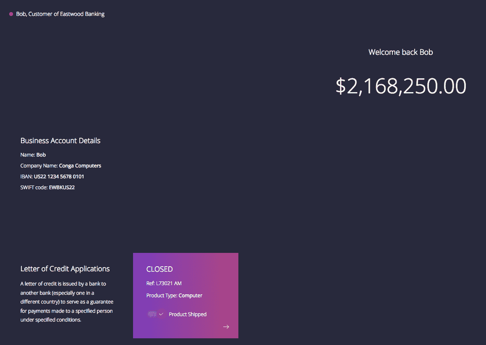

Bob 已经收到了他运送给 Alice 的计算机的货款。业务流程已经完成。

# 概述过程

Alice 想从 Bob 那里购买计算机，并使用信用证流程来促进交易。她用美元购物，但却用欧元付款。在付款之前，她能够确信货物符合她的条款和条件。

鲍勃把电脑卖给了爱丽丝，一个他以前不认识的海外客户。信用证流程让他确信，只要 Alice 对货物满意，他就会收到以当地货币——美元——支付的货款。

马蒂亚斯和埃拉分别是迪内罗银行和伊斯特伍德银行的代表，他们提供了一个系统，允许爱丽丝和鲍勃相信每个人都会满足双方同意的条件，以便接收付款。他们能够向爱丽丝和鲍勃收取合理的服务费。他们几乎实时了解业务流程中的每一步。

现在让我们来看看如何使用 Hyperledger Composer 和 Hyperledger Fabric 实现这一过程。

# 分析信用证流程

业务网络的核心是包含资产、参与者、交易和事件的正式描述的**业务网络定义**。我们将为信用证申请检查这一点。本章结束时，您将能够理解应用程序是如何实现和访问网络的。此外，您将拥有构建自己的网络和应用程序的知识。

# 操场

如果您转到演示中的下一个选项卡，您会发现 Hyperledger Composer 游乐场已经为您打开:

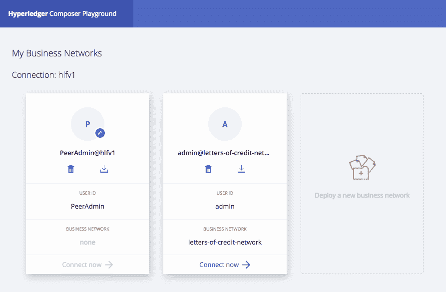

游乐场是一个工具，可以让你调查业务网络。游乐场的初始视图包含一个装满了**名片**的**钱包**。就像一个真正的钱包，这些卡可以让你连接到不同的网络。当您使用特定的卡连接到网络时，您充当不同的参与者。这对测试网络很有用。我们以管理员身份连上网络，看看里面有什么！(我们稍后将创建自己的网卡。)

# 查看业务网络

在标有`admin@letters-credit-network`的业务网卡上，点击立即连接。您将看到一个网页:


业务网络定义视图

这是业务网络定义的视图。它包含了我们在[业务网络](#)中讨论的参与者、资产、交易和事件的定义，适用于信用证网络。页面的左侧是一组文件，包含与我们所连接的网络的这些概念相关的信息。我们选择了关于的**，在右侧，我们可以看到业务网络的描述。让我们稍微详细地研究一下这个描述，理解它真的很重要。**

# 业务网络的描述

`READ.ME`文件包含网络的自然语言描述，包括资产、参与者、交易和事件。

# 参与者描述

业务网络描述中列出了参与者:

```
Participants
 Customer, BankEmployee
```

在我们的例子中，有四个参与者**实例**——爱丽丝和鲍勃，马蒂亚斯和埃拉。但是请注意只有两个参与者**类型**，即`Customer`和`Employee`。在我们的网络中，Alice 和 Bob 是`Customer`类型的参与者，而 Matias 和 Ella 是`BankEmployee`类型的参与者。我们可以看到，这些类型是从银行的角度命名的，这是因为网络服务由 Dinero 和 Eastwood 银行提供，并由 Alice 和 Bob 使用。

我们将很快看到关于这些参与者类型和网络中特定实例的更多细节。但是现在，只要想想我们如何将网络中的参与者简化为两个非常简单的表示。尽管我们在应用程序中看到了丰富的行为，但就参与者而言，网络相当简单。你会在商业网络中看到这一点——虽然参与者可以有很多实例，但类型的数量通常非常有限，很少超过 10 个。当然，规则是用来被打破的，但是你会发现这样思考网络是有帮助的——这使得分析更容易管理。

# 资产描述

如果您对该业务网络中参与者类型的数量很少感到惊讶，那么当您看到资产类型的数量时，您会感到惊讶:

```
Assets
 LetterOfCredit
```

现在，这是一个样本网络——在这里教我们商业网络的概念，而不是对信用证世界的详尽描述。然而，如果您考虑我们的例子，整个流程主要只涉及一种资产类型:字母**和字母**。

公平地说，我们没有关注被转移的货物——电脑或付款。在真实的系统中，这些将被描述为资产。尽管如此，请注意资产类型**的数量仍然相对较少。我们可以创造无限数量的信用证、计算机和支付的实例，但仍将只有少数几种类型。**

稍后我们将查看这种资产类型的详细信息。

# 交易描述

现在让我们来看看业务网络中的交易类型:

```
Transactions
 InitialApplication, Approve, Reject, SuggestChanges, ShipProduct, ReceiveProduct, ReadyForPayment, Close, CreateDemoParticipants
```

终于可以看到相当多的类型了！这很典型——虽然参与者和资产类型的数量非常有限，但是资产具有丰富的生命周期。如果您考虑我们的应用程序，当信用证与网络中的不同参与者交互时，它会经过许多**州**。这些事务直接对应于那些交互。(忽略`CreateDemoParticipants`，这是一个设置演示的交易！)

交易名称非常简单易懂，与信函的生命周期密切相关。它们是您作为不同的参与者使用该应用程序所经历的步骤。爱丽丝作出了`InitialApplication`，并有选择`SuggestChanges`的条款和条件的信。马蒂亚斯和埃拉可能会`Approve`或`Reject`来信。鲍勃调用`ShipProduct`来表明他已经履行了他的交易，爱丽丝使用`ReceiveProduct`来同样表明她已经收到了计算机。最后，Matias 表示信件是`ReadyForPayment`，Ella 发出`Close`交易以结束流程并触发对 Bob 的支付。

交易类型的数量没有理由一定要大于资产类型的数量。人们很容易想象许多不同的资产类型具有相同的、相对简单的生命周期。以零售商的产品库存为例，商品可以被采购、交付、销售和退货。这是一个相对简单的生命周期，但不同类型商品的数量可能相当大。然而，我们可能期望这些不同的商品通过一些行为的共性来共享这个生命周期；毕竟都是产品。稍后会有更多关于继承的内容。

我们将更详细地研究这些事务的实现，但是现在，最重要的是理解网络中参与者之间资产流动的概念画面，如事务所描述的，而不是担心这些事务变化背后的确切逻辑。

# 事件描述

最后，让我们看看业务网络中的事件列表:

```
Events
 InitialApplicationEvent, ApproveEvent, RejectEvent, SuggestChangesEvent, ShipProductEvent, ReceiveProductEvent, ReadyForPaymentEvent, CloseEvent
```

我们可以看到事件的名称与事务类型相匹配，这很典型。这些是由事务生成的**显式**事件，用于指示业务网络中何时发生某些事件。在我们的场景中，用户界面使用它们来更新网页，但是当然也可以用于更复杂的通知处理，例如，`CloseEvent`可以用于触发对 Bob 的支付。

当您第一次定义业务网络时，您会发现事件与事务非常相似。但是，随着时间的推移，您会发现添加了更复杂的**显式**事件，例如，Matias 或 Ella 可能想要为一个`HighValue`字母或一个`LowRisk`应用程序生成一个特定事件。

我们稍后将查看这些事件的细节。

# 商业网络的模型

既然我们已经用自然语言理解了商业网络中的类型，那么让我们看看它们在技术上是如何定义的。在操场的左侧，选择“模型文件”。

在这个业务网络中，只有一个定义参与者、资产、事务和事件的模型文件。在更大的应用程序中，我们将来自不同组织的信息保存在他们自己的文件中，并且通常保存在他们自己的名称空间中。它允许它们保持分离，但在必要时可以放在一起。让我们看看名称空间是如何工作的。

# 名称空间

我们的示例使用单个名称空间:

```
namespace org.acme.loc
```

这个名称空间表示这个文件中的类型定义已经由 Acme 组织的信用证流程定义。这都是短名字！使用名称空间——它们会帮助你清楚地区分，更重要的是，**传达**，你的想法。建议使用分层名称，以便清楚网络中的哪些组织正在定义网络使用的相关类型。

# 列举

接下来，我们看到一组枚举类型:

```
enum LetterStatus {
  o AWAITING_APPROVAL
  o APPROVED
  o SHIPPED
  o RECEIVED
  o READY_FOR_PAYMENT
  o CLOSED
  o REJECTED
}
```

这些是字母将要转换的**状态**。当我们访问一个字母时，我们将能够识别业务流程在哪里使用这个枚举。所有的名字都是不言自明的。

# 资产定义

我们现在来看第一个真正重要的定义——信用证资产:

```

 asset LetterOfCredit identified by letterId {
   o String letterId
   --> Customer applicant
   --> Customer beneficiary
   --> Bank issuingBank
   --> Bank exportingBank
   o Rule[] rules
   o ProductDetails productDetails
   o String [] evidence
   --> Person [] approval
   o LetterStatus status
   o String closeReason optional
 }
```

让我们花一点时间在这个定义上，因为它是理解业务网络，尤其是 Hyperledger Composer 的核心。

首先，注意**资产**关键字。它表示随后是描述资产的数据结构。它就像普通编程语言中的类型定义，但是有一些我们稍后会看到的特殊特征。

我们可以看到该资产属于`LetterOfCredit`类型。在这个例子中，我们只有一种资产类型，在更复杂的例子中，我们有更多类型的资产。例如，我们可以扩展这个模型以包括一个`Shipment`资产和一个`Payment`资产:

```
asset Shipment
asset Payment 
```

现在，让我们跳过由子句标识的**，转到资产定义中的第一个元素:**

```
o String letterId
```

字母`o`表示该字段是资产的简单属性。这是一种有点奇怪的表示方式，所以就把它当成一种装饰吧。第一个属性是`letterId`。回想一下，在业务网络中创建信函时，会为其分配一个唯一的 ID。如果你还记得，在我们的例子中，我们有`letterId` `L64516AM`或`L74812PM`。这由具有`String`类型的字段指示——正如我们将看到的，有许多类型可用。我们可以看到，这个定义允许我们将人类可读的标识符与资产相关联。请注意，这必须是唯一的标识符！

现在让我们回到`identified by`条款:

```
identified by letterId
```

*现在*我们可以理解，这表明`letterId`属性是唯一标识资产的属性。这是一个简单但强大的想法，与现实世界紧密相关。例如，一辆汽车可能有一个唯一标识它的**车辆识别号** ( **VIN** )。

让我们转到下一个属性:

```
--> Customer applicant
```

我们首先注意到的是`-->`装饰工！(在键盘上键入两个破折号和一个大于号)。这是一个**引用属性**——它指向某些东西！在字母的情况下，它指向一个不同的类型，`Customer`，这个元素的名字是`applicant`。看看引用概念是如何比我们之前看到的简单属性稍微复杂一点——这是因为它做了更多的工作。这个字段表示该信函有一个`Customer`类型的申请人，您需要通过这个证明人来查找。

在我们的例子中，一封信的实例将指向**爱丽丝**，因为她是提出申请的迪内罗银行的客户。请注意，这个引用属性引用了业务网络中的另一个*对象*。这种引用的思想非常强大——它允许资产指向其他资产，以及参与者，对于参与者也是如此。有了参照物，我们就能够表现我们在世界上看到的丰富的结构。这意味着我们可以创造可以组合和分割的资产，参与者也可以这样做。在我们的例子中，我们使用引用来查看谁通过导航引用申请了信函。同样，我们可以看到这个模型非常以银行为中心。稍后我们会看到`Customer`实际上是一个参与者，我们会看到参与者，比如 Alice，是如何定义的。但是现在，让我们继续讨论资产的定义。

正如我们在[商业网络](#)中所讨论的，我们的应用程序使用一种简单的方式来建模所有权——在现实世界中，它通常是一个关联引用。我们可以很容易地将这种更复杂的关联关系建模为一个`OwnershipRecord`，如果我们愿意的话，它指向一个资产和一个参与者:

```
asset OwnershipRecord identified by recordId {
   o String recordId
   --> LetterOfCredit letter
   --> Customer letterOwner
```

我们可以立即看到这种方法的力量。我们能够对现实世界中存在的关系进行建模，使我们的应用程序更加真实，因此更易于使用。对于我们的目的，我们目前的模型是完全足够的。

让我们进入下一个领域:

```
--> Customer beneficiary
```

这是一个与前一个非常相似的字段，在我们的例子中，这个元素的一个实例是 **Bob** 。没必要在这个定义上花时间。这当然很重要，但这只是把信指向了鲍勃。如果您还记得，我们的应用程序总是将两个交易方与一封信相关联。

接下来的两个字段具有相似的结构，但是我们将花更多的时间来讨论它们:

```
--> Bank issuingBank
--> Bank exportingBank
```

我们可以看到这些字段也是对其他对象的引用，我们可能会怀疑它们是参与者，因为它们的名字是`issuingBank`和`exportingBank`！这些类型的例子有**迪内罗银行**和**伊斯特伍德银行**，它们分别代表爱丽丝和鲍勃。

有了这前四个参考字段，我们已经对资产的丰富结构进行了建模。我们已经表明，信用证实际上有四个参与者。我们给了它们符号名称和类型，并展示了它们与资产的关系。此外，我们没有写任何代码就做到了。稍后我们将不得不这样做，但是现在，请注意我们是如何在我们的模型中捕捉到信用证的基本性质的。值得花一点时间真正理解这一点。

我们将只考虑资产定义中的一个字段，因为希望您已经掌握了这一点！这是一个重要的领域:

```
o LetterStatus status
```

还记得那些在文件顶部定义的枚举吗？很好！这是将包含那些不同值的字段，例如`AWAITING_APPROVAL`或`READY_FOR_PAYMENT`。在您的业务网络中，您经常(如果不是总是)会有这样的字段和枚举，因为它们以一种非常简单的形式捕获您在您正在建模的业务流程中的位置。如果你对工作流或有限状态机很熟悉，你可能会认为它们是**状态**——它们是一个非常重要的概念。

# 参与者定义

我们现在转移到模型文件中的下一组定义:参与者！

让我们看看第一个参与者定义:

```
participant Bank identified by bankID {
  o String bankID
  o String name
}
```

这是我们的第一个`participant`类型定义，银行。在示例应用程序中，我们有两个这种类型的实例:**迪内罗银行**和**伊斯特伍德银行**。

我们可以看到参与者是`identified by`的`participant`关键字，其后是类型名称——**银行**。在这种情况下，参与者类型是组织，而不是个人。与资产一样，每个参与者都有一个唯一的 ID 用于标识，我们可以看到，对于银行来说，它是`bankID`字段:

```
participant Bank identified by bankID
```

在我们的例子中，银行的建模非常简单——只有一个`bankID`和一个`name`，两者都是字符串:

```
String bankID
String name
```

我们可以看到银行真的比信简单得多。这不仅仅是因为它们的字段更少，类型更简单。更重要的是，它们不引用任何其他参与者或资产——这就是它们简单的原因——缺少引用，结构简单。您的模型也将是这样——一些资产和参与者将具有相对简单的结构，而其他的将具有更多，包括对其他资产和参与者的引用。

回想一下，这些类型是从资产定义中引用的。如果您需要这样做，请再次查看信函类型定义以查看参考资料:

```
--> Bank issuingBank
--> Bank exportingBank
```

你能看出**字母** **资产**和**银行** **参与者**现在是什么关系吗？太好了！

现在让我们看看下一类参与者。这与我们之前看到的有些不同，现在，忽略**抽象**关键字:

```
abstract participant Person identified by personId {
  o String personId
  o String name
  o String lastName optional
  --> Bank bank
}
```

感觉我们的应用程序中有四个`Person`类型的实例——Alice 和 Bob，Matias 和 Ella！让我们看看如何定义个人参与者:

```
abstract participant Person identified by personId
```

再次，忽略**抽象**关键字。该语句定义了`Person`类型的参与者，即`identified by`在其类型定义中的唯一字段。这些类型将是我们的应用程序中的个人参与者，而不是我们前面定义的组织(即银行)。(我们可能认为`Bank`和`Person`在结构上是相关的——我们稍后会看到！)

如果我们更详细地看一下这个定义，我们会发现它们的结构比`bank`更有趣一些:

```
o String personId
o String name
o String lastName optional
--> Bank bank
```

我们可以看到`Person`也有名字和姓氏。但是注意最后一个名字是`optional`:

```
o String lastName optional
```

我们可以看到，`optional`关键字表示`lastName`可能出现也可能不出现。您可能还记得在我们的例子中，Alice 和 Bob 提供了姓氏(Hamilton 和 Appleton)，但是银行的雇员 Matias 和 Ella 没有提供。这种可选性已经被建模——看看它如何帮助我们使我们的应用程序更像真实世界。

然而，最重要的领域是下一个领域:

```
 --> Bank bank
```

为什么？它揭示了**结构**。我们可以看到一个人和一家银行有关系。在爱丽丝和鲍勃的例子中，是他们开户的银行。就马蒂亚斯和鲍勃而言，是他们的雇主。我们将回到这是否真的是建立这种关系的正确地方，但目前，重要的是我们有一个与组织参与者有关系的个人参与者。您可以看到，不仅仅是资产具有复杂的结构，参与者也可以拥有它们！

但是等等，事情没那么简单。我们在定义中跳过了一些东西，不是吗？请参见以下内容:

```
abstract participant Person identified by personId { 
```

关键字`abstract`几乎完全破坏了我们刚才所说的关于`Person`类型的一切！抽象类型很特殊，因为它们*不能有实例*。真的吗？这似乎有悖直觉，因为我们可以看到爱丽丝和鲍勃，马蒂亚斯和埃拉。

为了理解发生了什么，我们需要进入下一个参与者定义:

```
participant Customer extends Person {
   o String companyName
}
```

仔细看这个定义的第一行:

```
participant Customer extends Person {
```

我们可以看到，我们已经定义了一种特殊类型的`Person`，称为`Customer`！这比以前好多了，因为爱丽丝和鲍勃是`Customers`。我们的应用程序中实际上没有`Person`参与者的实例——我们有`Customer`类型的实例。

我们现在可以看到，`Customer`类型定义中的`extends`关键字与`Person`类型定义中的`abstract`关键字成对出现。它们是我们前面提到的更大的类型专门化和继承概念的一部分:

```
abstract participant Person
participant Customer extends Person 
```

是关键字`abstract`阻止了我们定义`Person`的实例！这很重要，因为在我们的例子中，它实际上是正确的——没有`Person`类型的实例，只有`Customer`类型的实例。

我们可以看到，当扩展一个`Person`类型时，`Customer`有一个额外的属性，他们的公司名称:

```
o String companyName
```

对于 Alice 来说，这将是 QuickFix IT，对于 Bob 来说，这将是 Conga Computers。

最后，让我们看看最后一种参与者类型，`BankEmployee`:

```
participant BankEmployee extends Person {
}
```

这个我们不需要详细描述——你可以看到，比如`Customer`，`BankEmployee`扩展了`Person`类型，但和它不同的是，它没有添加任何额外的属性。没关系！在我们的应用程序中，Matias 和 Ella 就是这种类型的实例。

我们现在可以看到为什么`Person`类型是有帮助的。不仅仅是因为它不能被实例化，还因为它抓住了`Customer`和`BankEmployee`之间的共同点。它不仅节省了打字时间，还揭示了内部结构，改善并反映了我们对业务网络的理解。

记住这一点，您可能想考虑是否按如下方式建模可能更现实一点:

```
abstract participant Person identified by personId {
   o String personId
   o String name
   o String lastName optional
}

participant Customer extends Person {
   o String companyName
   --> Bank customerBank
}

participant BankEmployee extends Person {
   --> Bank employeeBank
}
```

在现实生活场景中，实际的参与者身份将存储在模型之外。这是因为个人身份和不可变分类账不是一个好的组合。将爱丽丝的个人信息存储在账本上意味着它将永远存在。

你能看出这个模型如何表明`Customer`与`BankEmployee`的银行关系的性质不同吗？

这里有一点很重要——没有所谓的正确模型。模型仅仅服务于一个目的——它们要么足够，要么不够。我们的两个模型对于我们的目的来说都是完全足够的，因为我们不需要区分`Customers`和`BankEmployees`与银行的关系。

好了，参与者到此为止。让我们转到模型定义中的下一个元素。

# 概念定义

看一下`ProductDetail`而不是`Rule`，因为这样更容易理解，最初:

```
concept ProductDetails {
   o String productType
   o Integer quantity
   o Double pricePerUnit
}
```

在模型中，概念是次要的，但是有用的元素。它们既不是资产，也不是参与者——它们只是定义了其中包含的结构元素。

这个前面的概念定义了`ProductDetail`。我们可能会认为这实际上是一种资产——对于我们的应用程序来说，它不是在参与者之间转移的东西！当我们看一下`Rule`概念时，可能会更清楚一点，它包含了信用证的条款和条件:

```
concept Rule {
   o String ruleId
   o String ruleText
}
```

这不太像资产或参与者，但作为一个单独的类型是有帮助的，因为它揭示了一个重要的结构。

# 交易定义

让我们继续前进！下一部分非常重要——交易！让我们从查看第一个事务定义开始:

```
transaction InitialApplication {
   o String letterId
   --> Customer applicant
   --> Customer beneficiary
   o Rule[] rules
   o ProductDetails productDetails
}
```

我们可以看到，像资产和参与者一样，事务是用它们自己的关键字定义的:

```
transaction InitialApplication {
```

关键字`transaction`标识了随后的是事务的类型定义。这就像`asset`或`participant`关键词一样。注意，在事务定义中没有一个`identified by`子句。

该交易定义代表 Alice 对信用证的最初申请。这很明显，不是吗？Alice 使用的应用程序会创建一个特定的事务实例，我们可以看到其中包含的信息:

```
o String letterId
--> Customer applicant
--> Customer beneficiary
o Rule[] rules
o ProductDetails productDetails
```

如果你回头看看爱丽丝的网页，那么你会看到所有这些信息:爱丽丝的`applicant`、鲍勃的`beneficiary`、T2 的 ( **规则**)和产品细节**。请注意，申请人和受益人是对参与者的引用，而规则和产品细节是概念。**

 **我们可以看到，该交易具有相对简单的结构，但有力地捕捉到了某个`applicant`(例如 Alice)申请信用证与某个`beneficiary`(例如 Bob)做生意的意图。

# 事件定义

查看模型文件中的下一个定义:

```
event InitialApplicationEvent {
   --> LetterOfCredit loc
}
```

这是一个事件！您会经常看到这种情况——紧挨着同名事务的事件定义。这是因为这实际上是一个**外部**事件——它只是捕获申请信用证的申请人。它只是指向生成事件的字母。在应用程序中，它只是用来保持 UI 最新，但一般来说，所有类型的处理都可以由这个初始应用程序触发。

继续浏览模型文件，您将看到为流程的每一步定义的事务和事件，有时还会看到与该事务步骤相关的额外属性。花点时间看看这些——它们很有趣！

正如我们所看到的，还可以声明更明确的事件，如高价值的信件或低风险的应用程序。想象我们的应用程序通过以下事件做到这一点:

```
event highValueLetterEvent {
   --> LetterOfCredit loc
}

 event lowRiskLetterEvent {
   --> LetterOfCredit loc
}
```

您认为这些会与模型文件中的哪些事务相关联？

为了确定这一点，我们需要考虑一下流程——一封高价值的信在申请后立即为人所知，因此它将与`InitialApplication`交易相关联。然而，在交易被两家银行初步处理，申请人和受益人都被评估之前，很难说这封信是低风险的。这意味着该事件将与`Approve`事务更紧密地联系在一起。

此外，在这种更高分辨率的情况下，我们将考虑为进口商银行审批和出口商银行审批创建单独的交易，`ImportBankApproval`和`ExportBankApproval`。

# 检查实时网络

很好——现在我们已经看到了参与者、资产、交易和事件的类型是如何在业务网络中定义的，让我们看看这些类型的实例是如何创建的。Playground 工具还有一个非常好的功能，它允许我们在业务网络运行时查看其内部，查看这些类型的实例，并选择 Playground 页面顶部的 Test 选项卡:


你会发现景色有些变化。在左侧，我们可以看到为该业务网络定义的参与者、资产和交易:`Bank`、`BankEmployee`、`Customer`和`LetterOfCredit`，以及交易。您可以选择这些，当您这样做时，您会看到右边的窗格发生了变化。试试看！

选择`LetterOfCredit`资产，在右侧窗格中，您将看到以下内容(使用 Show All 展开视图):


哇——这太有趣了！这是我们申请的真实信用证。让我们详细看看这个字母，以及它是如何映射到我们前面检查过的类型结构的。

# 检查信用证实例

我们可以看到 ID、`L73021 AM`和实例信息。它显示为一个 JSON 文档，您可以看到该结构反映了`LetterOfCredit`定义中的内容，但是它包含真实的实例数据。

您可以看到，字母中包含的每个资产和参与者都有一个类(`$class`)，它是由名称空间和类型名称连接而成的。例如:

```
"$class": "org.example.loc.LetterOfCredit"
"$class": "org.example.loc.ProductDetails"
```

另请注意这封信的信息是如何获取的:

```
"letterId": "L73021 AM"
"productType": "Computer"
"quantity": "1250"
```

最后，请注意这封信的最终状态:

```
"status": "CLOSED"
"closeReason": "Letter has been completed."
```

所有这些数据都非常强大。为什么？因为类型和实例信息保存在一起，就像在真实的契约中一样，所以可以在编写后正确地解释它们。你可以想象这对喜欢在数据中寻找模式的分析工具有多大帮助！

对于引用属性，我们可以看到结构略有不同:

```
"applicant": "resource:org.example.loc.Customer#alice"
"beneficiary": "resource:org.example.loc.Customer#bob"
"issuingBank": "resource:org.example.loc.Bank#BOD"
"exportingBank": "resource:org.example.loc.Bank#ED"
```

我们可以看到这些属性是对参与者的引用，如果我们单击“参与者”选项卡，我们就可以看到它们！点击银行选项卡:

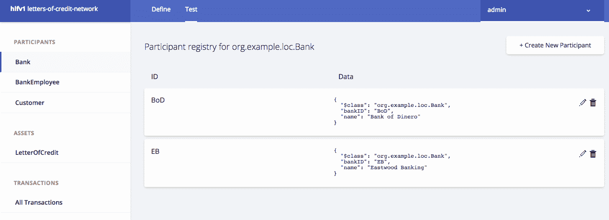

# 检查参与者实例

您可以看到我们网络中的两家银行、它们的类型和实例信息！单击不同的 participant 和 asset 选项卡，并检查数据以查看这些类型在场景中是如何被实例化的。在这上面花点时间——理解这些信息，将它们与类型联系起来，并认真思考它们与业务网络的关系，这很重要。不要被欺骗——信息看起来很简单——这里有一些强大的想法，需要一点时间来联系。但是，我们鼓励你这样做——理解每件事是如何联系在一起的真的很有价值，这样你也可以这样做！

# 检查事务实例

现在，单击“所有交易”选项卡:

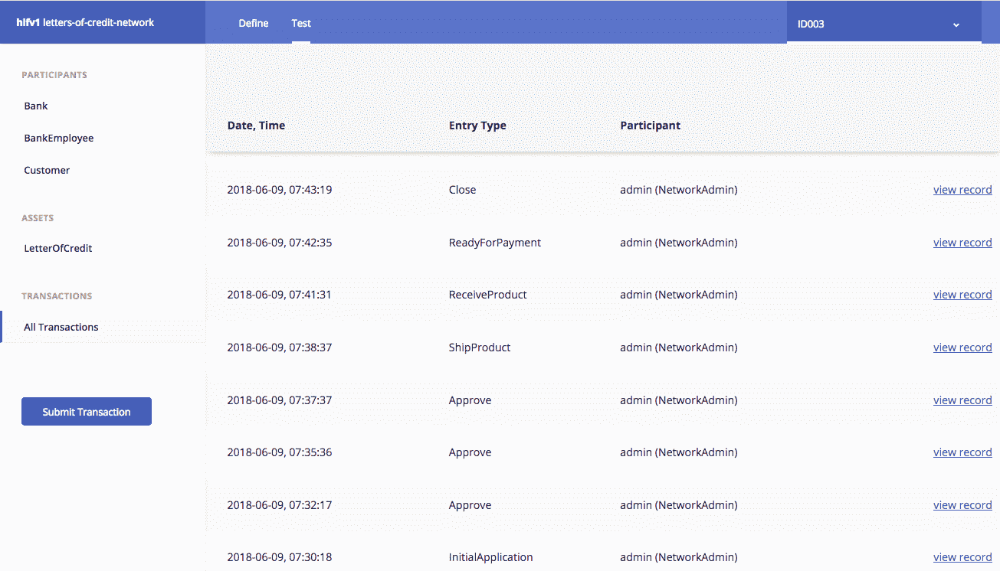

您可以看到我们的应用程序运行的整个事务生命周期。(你们的时代可能有点不一样！)如果您滚动事务，您可以确切地看到在我们的场景中发生了什么——Alice 申请了一封信，Matias 批准了它，等等。如果你点击“查看记录”,你就能看到单笔交易的详细情况。

比如我们来看爱丽丝做的`InitialApplication`:

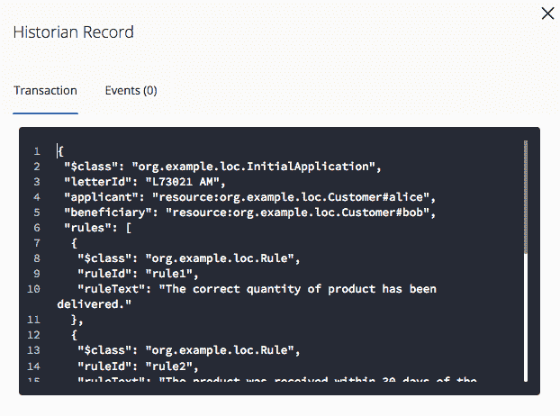

我们可以看到交易详细信息(我们对其进行了轻微编辑以适应页面):

```
"$class": "org.example.loc.InitialApplication",
"letterId": "L73021 AM",
"applicant": "resource:org.example.loc.Customer#alice",
"beneficiary": "resource:org.example.loc.Customer#bob",
"transactionId": "c79247f7f713006a3b4bc762e262a916fa836d9f59740b5c28d9896de7ccd1bd",
"timestamp": "2018-06-02T06:30:21.544Z"
```

请注意我们是如何看到该事务的确切细节的！再次，难以置信的强大！花一些时间在这个视图中查看事务记录。

# 向网络提交新交易

我们可以在操场上做更多的事情。我们现在将动态地与业务网络进行交互！

确保您已经在测试视图中选择了`LetterOfCredit`资产类型。请注意左侧窗格中的提交事务按钮:

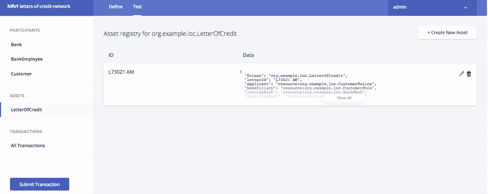

我们将通过提交一个新的`LetterOfCredit`应用程序来与业务网络进行交互。如果您点击提交交易，您将看到以下输入框:

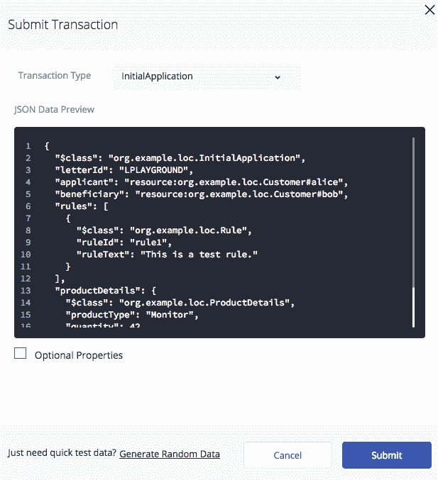

在交易类型下拉列表中，您会看到列出了所有可能的交易。选择`InitialApplication`并用以下数据替换 JSON 数据预览:

```
{
   "$class": "org.example.loc.InitialApplication",
   "letterId": "LPLAYGROUND",
   "applicant": "resource:org.example.loc.Customer#alice",
   "beneficiary": "resource:org.example.loc.Customer#bob",
   "rules": [
     {
       "$class": "org.example.loc.Rule",
       "ruleId": "rule1",
       "ruleText": "This is a test rule."
     }
   ],
   "productDetails": {
     "$class": "org.example.loc.ProductDetails",
     "productType": "Monitor",
     "quantity": 42,
     "pricePerUnit": 500
   }
 }
```

你能看出这个交易描述了什么吗？你能把爱丽丝和鲍勃之间新的`LetterId`看成`Customer`和`Beneficiary`吗？你能看到`ProductDetails`、`Quantity`和`Price`吗？

如果您按 Submit，您将看到您返回到主视图，并且已经创建了一封新信件:


祝贺您，您刚刚提交了新的信用证申请！但是等等！如果我们已经与实时网络进行了交互，那么如果我们返回到应用程序视图，会发生什么呢？如果你回到爱丽丝的观点，你会注意到她有一封新的信:


Hyperledger Composer Playground 允许我们与实时业务网络进行互动！此外，如果我们选择马蒂亚斯的页面，我们可以看到这封信正在等待批准:

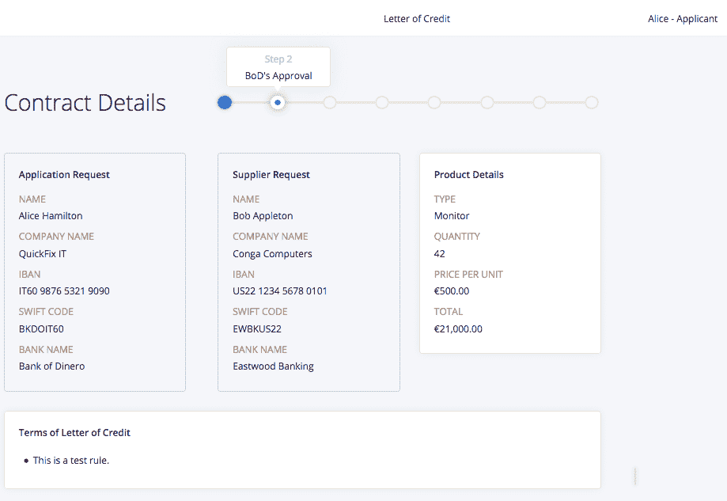

请注意，所有属性都是您在示例事务中输入的属性！你现在可以使用操场移动这封信通过它的整个生命周期。我们建议你花些时间做这件事——这将有助于巩固你的知识。

# 理解交易是如何实现的

这一切都令人印象深刻，但它是如何工作的——实现这些操纵参与者和资产并创建事件的事务的逻辑在哪里？为了理解这一点，我们需要看一下交易程序——当交易被提交到网络时运行的代码，该代码引用这些资产、参与者和事件。

交易代码保存在脚本文件中，如果您在 Define 选项卡上选择 Script File，您将看到以下内容:

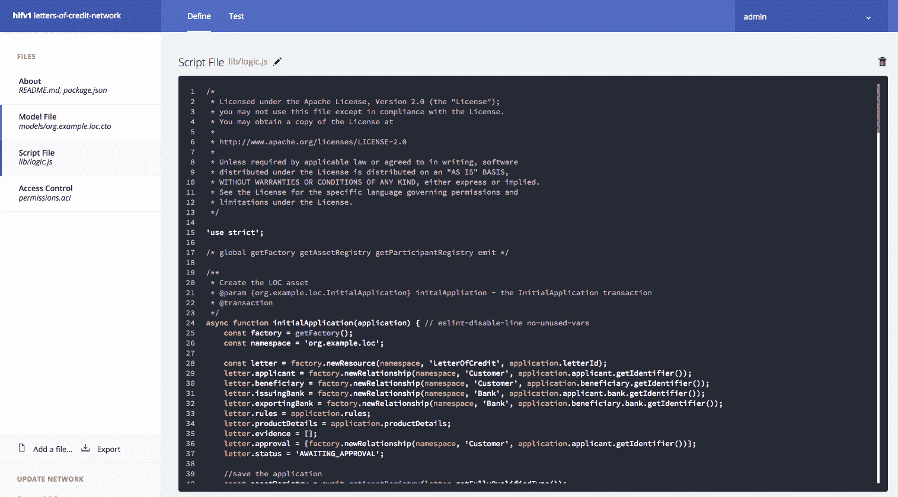

这是实现事务的代码！今天，Hyperledger Composer 使用 JavaScript 来实现这些功能，这就是您在此页面上看到的内容-JavaScript。如果您翻阅脚本文件，您会看到模型文件中定义的每个事务都有一个函数。

让我们检查一下到目前为止我们一直在处理的事务之一——`InitialApplication`事务。请注意该函数是如何启动的:

```
/**
  * Create the LOC asset
  * @param {org.example.loc.InitialApplication} initalAppliation - the InitialApplication transaction
  * @transaction
  */
 async function initialApplication(application) {
```

注释和程序代码的第一行实际上是说，下面的函数实现了`InitialApplication`事务，它接受一个`org.example.loc.InitialApplication`类型，并将其赋给局部作用域的`application`变量。简而言之，它将程序逻辑连接到我们在模型文件中看到的事务定义。

第一行重要的代码如下:

```
const letter = factory.newResource(namespace, 'LetterOfCredit', application.letterId);
```

`factory.newResource()`在`org.example.loc`名称空间中创建一个新的本地`LetterOfCredit`，使用输入`application.letterId`事务变量中的函数调用者提供的标识符。该语句将该函数的结果赋给一个本地`letter`变量。

重要的是要明白，这种说法并没有在商业网络中创造了一封信；`factory.newResource()`仅仅创建一个正确成形的 JavaScript 对象，该对象现在可以由下面的后续逻辑操作，并且在使用调用者提供的输入(例如，Alice 正在使用的应用程序)正确成形之后，可以将其添加到业务网络中！

注意`applicant`和`beneficiary`是如何分配的:

```
letter.applicant = factory.newRelationship(namespace, 'Customer', application.applicant.getIdentifier());
letter.beneficiary = factory.newRelationship(namespace, 'Customer', application.beneficiary.getIdentifier());
```

该事务确保 Alice 和 Bob 的标识符被正确地放在信中。在我们的网络中，`application.applicant.getIdentifier()`将解析为`resource:org.example.loc.Customer#alice`或`resource:org.example.loc.Customer#bob`。交易逻辑使用所提供的输入和已经存储在商业网络中的信息系统地构建信用证。

接下来，注意`issuingBank`和`exportingBank`如何通过参与者导航到他们的银行。程序逻辑通过导航参与者和资产定义中的引用来做到这一点:

```
letter.issuingBank = factory.newRelationship(namespace, 'Bank', application.applicant.bank.getIdentifier());
letter.exportingBank = factory.newRelationship(namespace, 'Bank', application.beneficiary.bank.getIdentifier());
```

我们可以在这些语句中看到事务如何使用模型中定义的结构。它可以添加任何专有的业务逻辑来做到这一点，但它必须符合这种结构。检查分配给`letter`的每一行，看看你是否能理解在这些术语中发生了什么。这需要一点时间来适应，但理解这一点非常重要——交易正在使用这一逻辑将业务网络从一种状态转换到另一种状态。

注意字母赋值的最后一个语句:

```
letter.status = 'AWAITING_APPROVAL';
```

查看如何使用枚举类型来设置字母的初始状态。

函数中下一个真正重要的语句如下:

```
 await assetRegistry.add(letter);
```

这就把信添加到了商业网络中！至此，我们已经在业务网络中创建了一个新的信用证应用程序。我们在本地存储中创建的信件已被发送到网络，并且现在是指向网络中的参与者和资产的活动资产。

最后，我们发出一个事件来表示事务已经发生:

```
const applicationEvent = factory.newEvent(namespace, 'InitialApplicationEvent');
applicationEvent.loc = letter;
emit(applicationEvent);
```

与信件一样，我们创建一个适当形状的本地事件——一个`InitialApplicationEvent`,完成它的细节，然后`emit()`它。检查不同的事务和它们的逻辑，以适应每个事务的精确处理——这种努力会给你带来丰厚的回报。

# 创建业务网络 API

在本章的最后一部分，我们将向您展示您的应用程序如何使用 API 在业务网络中与这些交易功能进行交互。示例应用程序和 Playground 都使用 API 与业务网络进行交互。
事实上，从服务消费者的角度来看，Alice、Bob、Matias 和 Ella 都没有意识到区块链的存在——他们只是与一些用户界面进行交互，导致这些交易功能(或类似功能)被执行，以根据这些交易处理功能中编码的业务逻辑来操纵业务网络。

正是这些用户界面和应用程序使用 API 与业务网络进行交互。如果你是 API 的新手，那么你可以在这里阅读它们。虽然技术上更准确，但很少有人使用术语**Web API**——它只是 **API** :


让我们来看看我们业务网络的 API！如果您选择演示中的最后一个选项卡，您将看到以下页面:


这是 Hyperledger Composer REST 服务器。它是一个在我们的业务网络中公开 API 的服务器。这些 API 是用标准的 SWAGGER 格式描述的。

# SWAGGER API 定义

SWAGGER 是一个描述 API 的开放标准-[https://swagger.io/specification/](https://swagger.io/specification/)这些 API 是由 Hyperledger Composer 使用模型中定义的相同词汇生成的，用于描述为该业务网络定义的参与者、应用程序和交易！这意味着 SWAGGER APIs 对业务和技术用户都有明显的意义。

对于业务网络中的每种类型的参与者、资产和交易，都有一个 API。

# 使用 SWAGGER 查询网络

选择以下 API 之一`LetterOfCredit`:


注意这个 API 的`GET`和`POST`动词。大多数现代 API 都是使用 REST 和 JSON 定义的，这就是你在这里看到的。练习展开和折叠视图以查看所有不同的选项。

高兴的时候，选择`InitialApplication` `GET`:

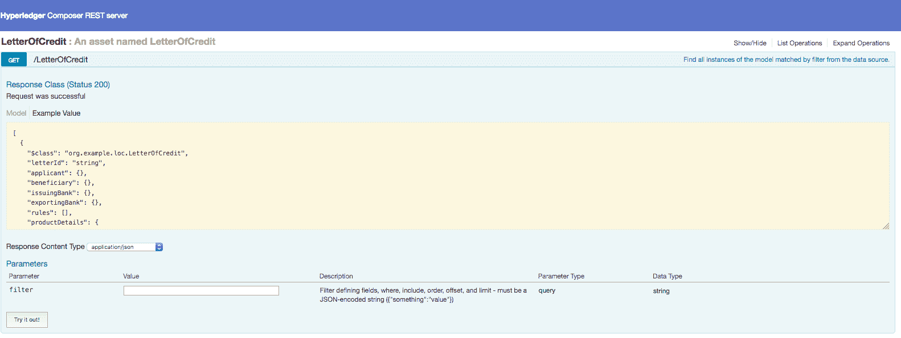

就像 Playground 一样，您可以使用与应用程序相同的 API 与业务网络进行交互。从这个角度来看，这更具技术性，但没关系——作为一名程序员，你应该对此感到舒服。

我们选择的 API 允许程序查询(`GET`)商业网络中的所有信件。如果你选择尝试一下**！**，你会看到下面的回应:


这些细节向您展示了发布的确切 API。这是对
`http://localhost:3000/api/LetterOfCredit` URL 的一个`GET`请求，响应主体显示返回的数据。你应该可以看到它在结构上与操场数据非常相似，如果你滚动响应，你会看到网络中的两个字母。

# 从命令行测试网络

您还可以使用`curl`命令从终端与网络交互，语法如下所示:

```
curl -X GET --header 'Accept: application/json' 'http://localhost:3000/api/LetterOfCredit'
```

在终端中尝试一下，您将在命令行中看到这些数据:


它远没有操场或大摇大摆的风景漂亮，但如果你是一名程序员，你就会知道这有多强大！例如，想想这对自动化测试有什么帮助。

# 使用 SWAGGER 创建新信函

我们还可以从 SWAGGER 视图创建一个新的信用证应用程序。选择`InitialApplication` API。

我们将使用`POST`动词为 Alice 创建另一个应用程序:


在`value`框中，粘贴以下数据:

```
{
  "$class": "org.example.loc.InitialApplication",
  "letterId": "LPLAYGROUND2",
  "applicant": "resource:org.example.loc.Customer#alice",
  "beneficiary": "resource:org.example.loc.Customer#bob",
  "rules": [
   {
    "$class": "org.example.loc.Rule",
    "ruleId": "rule1",
    "ruleText": "This is a test rule."
   }
  ],
  "productDetails": {
   "$class": "org.example.loc.ProductDetails",
   "productType": "Mouse Mat",
   "quantity": 40000,
   "pricePerUnit": 5
  }
 }
```

你能看出这个申请是干什么的吗？你能看出爱丽丝想申请一封信，从鲍勃那里以`5`美元一个买`40000` `Mouse mats`吗？

如果你按下试试看！，将创建一个新的字母！现在，您可以使用 SWAGGER 控制台、应用程序或 Playground 查看这封新信件。让我们逐一尝试:

这是使用 SWAGGER 的视图:

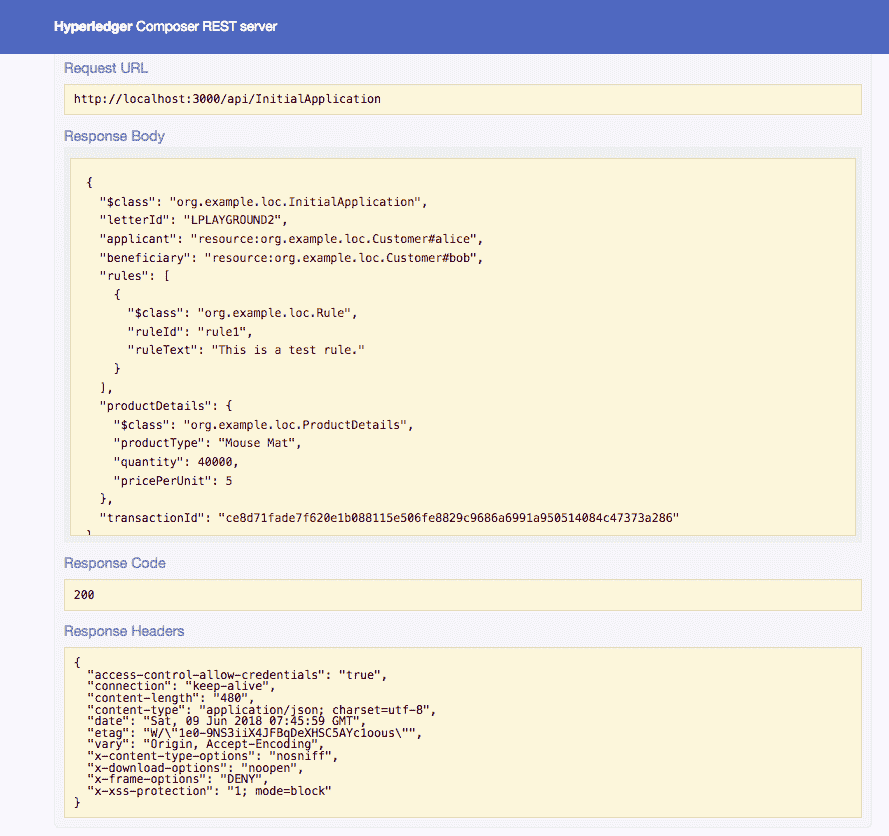

这是使用操场的视图:


这是使用应用程序的视图(Matias 的视图):

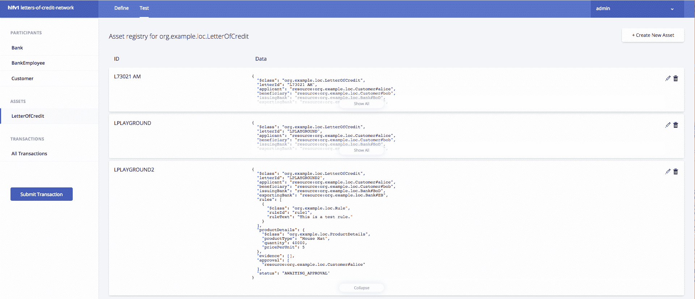

# 网卡和钱包

最后，在我们结束本章之前，我们将把 **you** 添加到这个业务网络，以便您可以提交交易！要做到这一点，我们将回到最初允许我们连接到网络的**商务网卡**和**钱包**。回想一下，包括 Playground 在内的所有应用程序都有一个包含业务网卡的钱包，可以用来连接不同的网络。当应用程序使用特定的卡连接网络时，它被标识为网络中的特定参与者实例。

1.  让我们创建一个新的参与者！在测试选项卡上，选择客户参与者:


2.  您将看到 Alice 和 Bob 的参与者信息。点击创建新参与者:


该页面将允许您发布 API 来创建新的参与者。我们已经为 BlockIT 工作的新参与者`Anthony`输入了以下详细信息:

```
{
   "$class": "org.example.loc.Customer",
   "companyName": "BlockIT",
   "personId": "Customer003",
   "name": "Anthony",
   "bank": "resource:org.example.loc.Bank#BOD"
}
```

记下他的身份和对迪内罗银行的引用。单击“新建”,注意参与者注册表是如何更新的:


我们在网络中创造了一个新的参与者。(请随意使用您自己的详细信息，只要确保您的参与者拥有有效数据，特别是现有银行的证明即可。)

点击 admin 下的 **ID 注册表**。现在你会看到一个与游乐场相关的**身份**列表。

Alice 和 Bob 的数字证书是他们应用程序的私有证书，在这里，我们可以看到与当前操场用户(企业网络的管理员)相关联的身份:

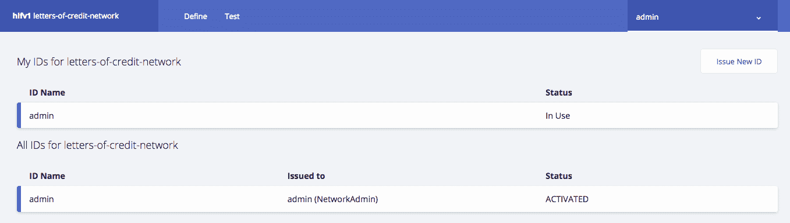

单击颁发新 ID:


输入 ID 名称`ID003`，并将其与我们创建的新参与者`org.example.loc.Customer#Customer003`相关联，然后单击 Create New:

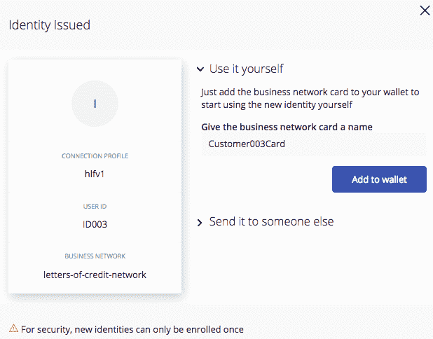

为名片命名，然后单击添加到钱包。
你会看到 id 列表已经用`ID003`更新，关联`Customer003`:

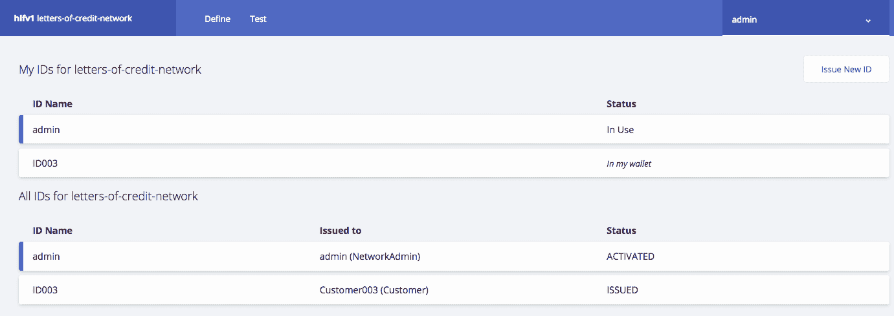

点击管理选项卡中的**我的商业网络**用户，返回到 Composer Playground 初始页面:

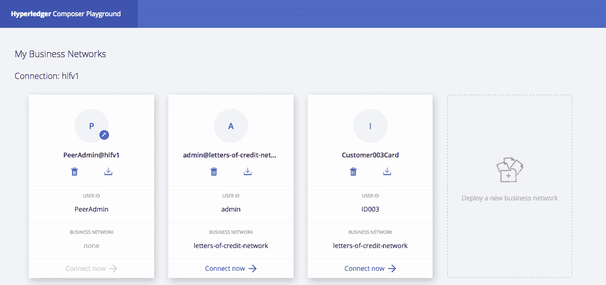

我们可以看到，Playground wallet 现在包含一个新的业务网卡，允许您连接到我们的网络。点击`Cusotmer003Card`的立即连接。你现在作为`Customer003`连接到网络，而不是`Admin`。

# 访问控制列表

包括 Composer Playground 在内的所有应用程序都使用钱包中的业务网卡(本地文件系统上的一个文件)来连接网络。该卡包含网络的 IP 地址、参与者的姓名以及他们的 X.509 公钥。网络使用该信息来确保他们只能有**权限**来对网络中的资源执行某些操作。例如，只有特定的银行雇员才能够批准信用证。

通过检查网络的访问控制列表(ACL ),您可以了解如何为企业网络定义这些权限。在“定义”选项卡上选择 AccessControl:

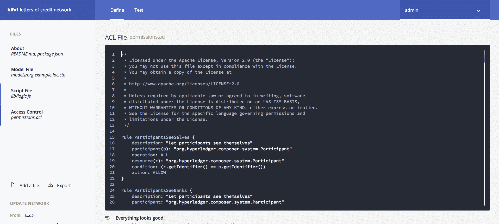

滚动列表，查看不同用户对网络中不同资源的权限。这些规则可以与类型或实例相关，尽管前者更常见。花点时间研究一下这个文件中的 ACL 规则。

# 摘要

你已经学会了如何使用 Hyperledger 技术建立一个真正的商业网络。作为用户、设计师和应用程序开发人员，您知道如何与业务网络进行交互。您知道如何定义参与者、资产、事务和事件，以及如何在代码中实现它们的创建。您知道如何将这些作为 API 公开，以便外部应用程序可以使用它们！您可以了解更多关于 Hyperledger Composer 和 Hyperledger Fabric 的信息，请查阅产品文档。有了这些信息和本章的知识，你就可以开始建立自己的商业网络了！

现在让我们把注意力转向我们如何在区块链网络中管理开发生命周期——我们如何在区块链网络中实现敏捷性。我们将看看帮助我们建立和管理区块链软件开发的日常操作的过程和工具。**