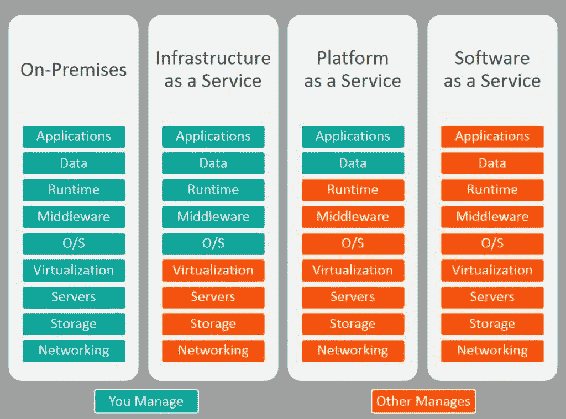
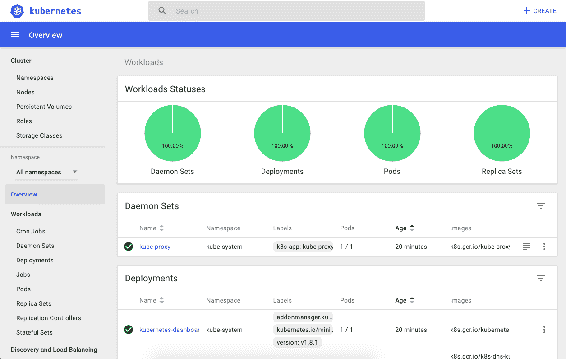
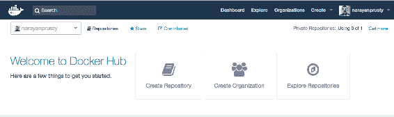
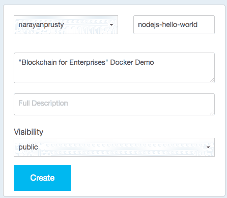
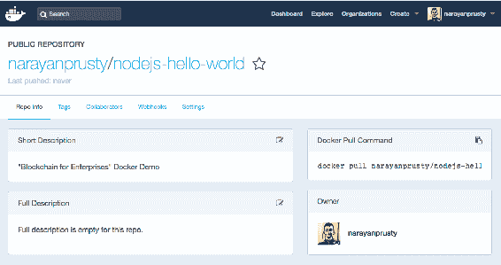
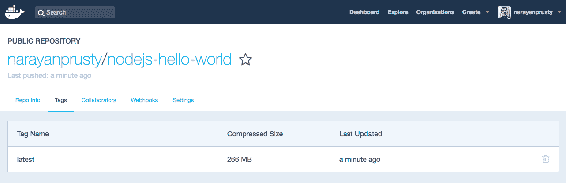
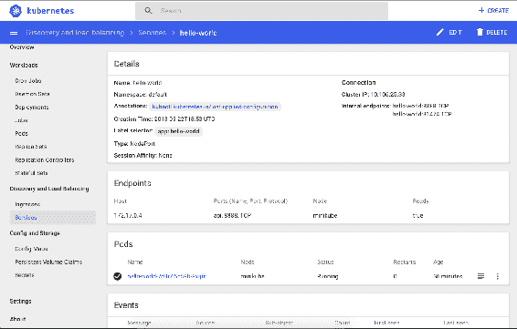

# 构建 Quorum 服务平台

随着使用 **Kubernetes** ( **K8s** )的容器化应用程序的部署越来越多，现在正是了解如何将 Quorum 容器化以部署到 K8s 的好时机。在这一章中，我们将构建一个**平台即服务** ( **PaaS** )来简化法定网络的创建。我们将从云计算、Docker 和 K8s 的基础开始，并以一个**Quorum as a Service**(**QaaS**)平台结束。与 Azure、AWS 和 BlockCluster 等各种云平台提供的区块链相比，我们在本章中将构建一个极简的**区块链即服务** ( **BaaS** )。

在本章中，我们将讨论以下主题:

什么是云计算？

*   公共云、私有云和混合云之间的区别
*   IaaS、PaaS 和 SaaS 之间的区别
*   什么是 Docker 和应用程序的容器化？
*   微服务架构简介
*   了解 K8s 的基本原理及其优势
*   在本地机器上安装 minikube
*   在 K8s 中部署一个简单的 Hello World Node.js 应用程序
*   K8s 的容器法定人数
*   使用 Docker 和 K8s 构建 QaaS 平台

# 云计算简介

简单来说，云计算是通过互联网按需交付计算服务(服务器、存储、数据库、网络、软件等)。

云计算提供了一种通过互联网访问服务器、存储、数据库和各种应用服务的更简单的方法。云服务平台，如**亚马逊网络服务**和**微软 Azure** ，拥有和维护这些应用服务所需的网络连接硬件，而你通过网络应用供应和使用你需要的东西。

以下是云计算的优势:

*   **成本**:云计算节省了大量成本，因为你不必购买硬件和软件。它还为您节省了建立和运行现场数据中心的成本。即使您建立了自己的数据中心，您也需要能够管理它们的 IT 专家，以及全天候的电力和冷却，这会产生额外的成本。相比这个，云计算就很便宜了。在云计算中，您只能在消耗资源时付费，并且只为消耗多少资源付费。
*   **速度**:云计算节省了时间，因为您可以在任何需要的时候运行服务；它提供计算服务的按需供应。
*   **全球扩展**:您可以在多个地区轻松部署您的应用。这让您可以将应用程序放在离用户很近的地方。

根据您使用的云计算提供商，还有其他各种好处。

# 私有云、公共云和混合云

根据数据中心的所有权和位置，云解决方案可以是私有的、公共的或混合的。云解决方案通常是公共的，即任何可以访问互联网的人都可以使用云提供的计算服务。我们之前看到的所有优势都是公共云提供的优势。

虽然公共云允许您在提供计算服务时选择您的区域，但可用区域的总数仍然非常有限。这是银行、武装部队和政府等实体的一个担忧，因为他们要么不希望数据离开自己的国家，要么不希望云提供商看到这些数据。因此，这些实体要么选择私有云，要么选择混合云。

当云托管在企业自己的数据中心时，就被称为私有。在这种情况下，企业无法获得成本和多区域扩展的优势，因为他们负责调配和维护数据中心。

当企业根据技术和业务需求混合使用私有云和公共云时，会使用混合云这一术语。由于合规性或安全性问题，企业可能会选择将应用程序托管在公共云上，同时将与应用程序相关的一些数据保留在私有云中。

# IaaS 对 PaaS 和 SaaS

**基础设施即服务** ( **IaaS** )、**平台即服务** ( **PaaS** )和**软件即服务** ( **SaaS** )是三种不同类别的云解决方案，基于您管理的内容和云提供商为您管理的内容。

在 IaaS 中，云提供商为客户提供对基本计算服务的按需访问，即存储、网络和服务器。其他一切都由您来调配和管理。Amazon AWS、Google Cloud、Azure、Linode 和 Rackspace 都是 IaaS 的例子。

在 PaaS 中，云提供商管理操作系统、编程语言的运行时、数据库和 web 服务器，也就是说，它提供了开发、测试和管理应用程序的环境。简单地说，您应该只担心编写代码和可伸缩性的业务方面。应用程序开发和部署的其余基础设施由云提供商处理。Heroku、Redhat 的 OpenShift、Apache Stratos 和 Google App Engine 都是 PaaS 的例子。

**数据库即服务** ( **DBaaS** 或 **BaaS** )属于 PaaS 的范畴。所以在本章中，我们将创建一个简单的 PaaS: QaaS。任何管理应用程序所依赖的服务(如数据库、区块链或消息队列)的云解决方案都是 PaaS。

在 SaaS，云提供商管理一切，包括数据和应用程序。您不需要编写任何代码来构建应用程序。云提供商提供了一个界面，可以根据您的需求定制应用程序并进行部署。使用 SaaS 可以减少技术人员定期管理、编写代码和升级软件的需求，从而降低软件拥有成本。你只需要担心商业逻辑。Salesforce、Google Apps 和 WordPress.com 都是 SaaS 的例子。



上图可用于轻松确定云解决方案是 IaaS、PaaS 还是 SaaS。

一些云解决方案同时提供 IaaS 和 PaaS 的功能。例如，AWS 最初是一个 IaaS，现在它也提供各种按需服务(如区块链和弹性搜索)。

# 什么是容器？

如果您使用 PaaS 或 SaaS 创建您的应用程序，那么您将不会遇到容器，因为它们负责将您的应用程序容器化。PaaS 只是让你把应用程序的源代码推到云端，然后它会为你构建并运行应用程序。

如果您使用 IaaS 来构建您的应用程序，那么在没有容器化您的应用程序的情况下，几乎不可能扩展和管理您的应用程序。让我们看一个场景，试着理解为什么我们需要容器。

在 IaaS 中，要部署您的应用程序，您需要执行以下步骤:

调配一个**虚拟机** ( **虚拟机**)

1.  安装应用程序的所有依赖项和运行时环境
2.  运行应用程序
3.  如果应用程序开始接收超过虚拟机处理能力的流量，您将开始创建新的虚拟机，并使用负载平衡器分配流量
4.  对于每个新虚拟机，在新虚拟机中运行应用程序的新实例之前，您需要遵循相同的安装依赖项和运行时环境的过程

这一累积新虚拟机并在其中运行应用实例的过程容易出错且耗时。这就是集装箱的用武之地。

简而言之，容器是打包应用程序的一种方式。容器的特殊之处在于，当您将它们移动到一台新机器上，或者在不同环境之间移动时，不会出现意外错误。应用程序的所有代码、库和依赖项都打包在容器中，作为一个不可变的工件。你可以把运行一个容器想象成运行一个 VM，没有启动整个操作系统的开销。因此，将您的应用程序捆绑在一个容器中，而不是一个虚拟机，将会显著缩短启动时间。容器比虚拟机更轻量级，使用的资源也更少。

因此，对于前面的示例，您需要为您的应用程序创建一个容器，并在每个虚拟机中运行该容器。显然，基于您的应用程序架构，一个 Docker 容器可以运行多个进程，一个 VM 可以运行多个容器。

在内部，PaaS 和 SaaS 使用容器来打包和部署你的应用。容器还有许多其他的用例。举个例子:一个编码测试 app 实际上在执行代码之前就把你的代码容器化了，这样代码就在一个隔离的环境中执行了。

通过将应用程序及其依赖项容器化，操作系统分布和底层基础设施的差异被抽象出来。容器可以在裸机系统、云实例和跨 Linux、Windows 和 macOS 的虚拟机上工作。

# Docker 简介

Docker 帮助您在容器中创建和部署软件。这是一个开源的工具集，可以帮助你在任何地方构建、发布和运行任何应用。使用 Docker，您可以在应用程序源代码目录中创建一个名为 Dockerfile 的特殊文件。Docker 文件定义了一个构建过程，当输入到`docker build`命令时，将产生一个不可变的 Docker 映像。您可以将 Docker 映像想象成一个 VM 映像。当您想要启动它时，只需使用`docker run`命令在 Docker 守护进程支持和运行的任何地方运行它。Docker 容器是 Docker 映像的运行实例。

在 Dockerfile 文件中，您需要提到一个应该运行的命令，然后容器启动。这就是实际应用程序在容器中的执行方式。如果命令存在，容器也会关闭。当容器关闭时，容器卷中写入的所有数据都会丢失。

Docker 还提供了一个名为 **Docker Hub** 的基于云的存储库。你可以把它想象成 Docker 图片的 GitHub。您可以使用 Docker Hub 来创建、存储和分发您构建的容器映像。

# 构建 Hello World Docker 容器

让我们创建一个 Docker 映像，它封装了一个简单的 Node.js 应用程序，该应用程序公开了一个打印 Hello World 的端点。在继续之前，确保您已经在本地机器上安装了 Docker CE(社区版)。你可以在[https://docs.docker.com/install/](https://docs.docker.com/install/)找到安装和启动基于不同操作系统的插件的说明。

现在创建一个名为`hello-world`的目录，并在其中创建一个名为`app.js`的文件。将以下内容放入该文件:

```
const http = require('http');

const name = 'node-hello-world';
const port = '8888';

const app = new http.Server();

app.on('request', (req, res) => {
  res.writeHead(200, { 'Content-Type': 'text/plain' });
  res.write('Hello World');
  res.end('\n');
});

app.listen(port, () => {
  console.log(`${name} is listening on port ${port}`);
});
```

现在，在同一个目录中创建一个名为`Dockerfile`的文件，并将以下内容放入其中:

```
FROM node:carbon

WORKDIR /usr/src/app

COPY . ./

EXPOSE 8888

CMD [ "node", "app.js" ]
```

我们将构建 Docker 映像的指令放在 Docker 文件中。你可以在 https://docs.docker.com/engine/reference/builder/找到说明列表。

下面是前面 docker 文件的工作原理:

*   首先，你需要定义我们想要建立什么样的形象。这里，我们将使用最新的**长期支持** ( **LTS** )版本的 carbon of node，可从 Docker Hub 获得。该图像带有已经安装的`Node.js`和`npm`。
*   接下来，我们创建一个目录来保存映像中的应用程序代码；这将是您的应用程序的工作目录。
*   为了将应用程序的源代码捆绑到 Docker 映像中，我们使用了`COPY`指令。这里意味着我们从当前主机操作系统的工作目录复制到 Docker 的工作目录。
*   您的应用程序绑定到端口`8888`，因此您将使用`EXPOSE`指令让 Docker 守护进程映射它。
*   最后但同样重要的是，使用`CMD`定义运行应用程序的命令，它定义了您的运行时。

以下是如何构建 Docker 映像:

1.  使用`docker build -t nodejs-hello-world .`命令构建 Docker 映像。
2.  要运行容器，运行`docker run -p 8090:8888 -d nodejs-hello-world`命令。
3.  `-p`选项将容器的端口`8888`绑定到主机`127.0.0.1`上的 TCP 端口`8090`。您还可以指定 udp 和 sctp 端口。在你的网络浏览器上访问`http://localhost:8090/`，你会看到 Hello World 消息。

在 Dockerfile 中，使用`ENTRYPOINT`定义命令，使用`CMD`定义命令的参数。默认的入口点是`["/bin/sh", "-c']`，它实际上正在运行`sh` shell。因此，在前面的 docker 文件中，主命令启动了`sh` shell，并将运行应用程序的命令作为子命令传递。`-c`选项接受在`sh`外壳内部运行的命令。

# 了解微服务架构

微服务架构是用于构建企业级应用的应用架构。要理解微服务架构，首先要理解单片架构，这是它的对立面。在整体架构中，服务器端应用程序的不同功能组件，如支付处理、账户管理、推送通知和其他组件，都融合在一个单元中。

例如，应用程序通常分为三个部分。这些部分是运行在用户机器上的 HTML 页面或本机 UI、运行在服务器上的服务器端应用程序以及也运行在服务器上的数据库。服务器端应用程序负责处理 HTTP 请求，在数据库中检索和存储数据，以及执行算法。如果服务器端应用程序是完成所有这些任务的单个可执行文件(也就是说，运行是单个进程)，那么我们说服务器端应用程序是单片的。这是构建服务器端应用程序的一种常见方式。几乎每个主要的 CMS、web 服务器和服务器端框架都是使用单片架构构建的。这种架构看起来似乎很成功，但是当您的应用程序很大很复杂时，问题就可能出现。

在微服务架构中，服务器端应用被划分为服务。服务(或微服务)是一个独立的小进程，它构成了完整的服务器端应用程序的特定功能。例如，您可以拥有一个用于支付处理的服务，另一个用于帐户管理的服务，等等；这些服务需要通过网络相互通信。

这些服务可以通过 REST APIs 或消息队列相互通信，这分别取决于您需要同步通信还是异步通信。

以下是使用微服务架构的一些优势:

*   由于服务通过网络进行通信，因此它们可以使用不同的框架用不同的编程语言编写
*   对服务进行更改只需要重新部署特定的服务，而不是所有的服务，这是一个更快的过程
*   由于每个服务在不同的进程中运行，因此测量每个服务消耗多少资源变得更加容易
*   测试和调试变得更加容易，因为您可以单独分析每个服务
*   当服务通过网络调用进行交互时，它们可以被其他应用程序重用
*   小团队并行工作，比大团队迭代得更快
*   较小的组件占用较少的资源，并且可以扩展以仅满足该组件不断增长的需求

您不必在不同的 VM 中运行每个微服务，也就是说，您可以在单个 VM 中运行多个服务。服务器与服务的比率取决于不同的因素。一个共同的因素是所需资源和技术的数量和类型。例如，如果一个服务需要大量的 RAM 和 CPU 时间，那么在服务器上单独运行它会更好。如果有一些服务不需要很多资源，你可以在一台服务器上一起运行它们。

# 潜入 K8s

一旦你创建了一些 Docker 容器，你就会意识到缺少了一些东西。如果你想在多台机器上运行多个容器——如果你使用微服务，你就需要这么做——还有很多工作要做。

您需要在正确的时间启动正确的容器，弄清楚它们如何相互通信，处理存储问题，以及处理失败的容器或硬件。手动完成所有这些将是一场噩梦。幸运的是，这就是 K8s 的用武之地。

k8s 是一个开源的容器编排平台，允许大量的容器和谐地一起工作，减少了操作负担。它有助于:

*   在许多不同的机器上运行容器。
*   当需求变化时，通过添加或删除容器来扩大或缩小规模。
*   使存储与应用程序的多个实例保持一致。
*   在集装箱之间分配负载。
*   如果出现故障，在不同的机器上启动新的容器，即自动修复。
*   为使用 K8s 而构建的应用程序可以轻松地从一个 IaaS 迁移到另一个 IaaS，而无需对应用程序源代码进行任何更改。app 部署在 K8s 集群上，K8s 集群部署在 IaaS 上。

从开发人员的角度来看，在 K8s 集群中有两种类型的机器:主机和节点(也称为**工作节点**)。我们的应用程序在节点上运行，而 master 控制节点并公开 K8s APIs。K8s 可以安装在裸机或虚拟机上。还有 Kubernetes 即服务云解决方案可用，它可以按需为您创建一个集群。比如:Google Cloud 的 Kubernetes 引擎、 **Azure Kubernetes 服务** ( **AKS** )、用于 Kubernetes 的**亚马逊弹性容器服务** ( **亚马逊 EKS** )。

# 进入资源对象

您可以通过 K8s API 端点使用 K8s API 来读取、写入和更新 K8s 资源对象。K8s 资源对象是用于表示集群状态的实体。我们需要使用清单来定义资源对象。在 API 调用中，我们传递清单文件内容。

这是对 K8s API 提供的基本资源类别的高级概述。它们的主要职能如下:

*   **工作负载**:这些资源用于管理和运行集群上的容器。例如:部署、单元、作业和副本集。
*   **发现和负载平衡**:这些资源用于将您的工作负载组合到一个外部可访问的负载平衡服务中。例如:服务和入口。
*   **配置和存储**:这些资源用于将初始化数据注入到应用程序中，并保存容器外部的数据。例如:配置映射、机密和卷。
*   **集群**:这些对象定义集群本身是如何配置的；这些通常仅由集群操作符使用。
*   **元数据**:这些资源用于配置集群内其他资源的行为。例如:网络策略和名称空间。

Dockerfiles 允许您指定许多关于如何运行容器的信息，例如要公开的端口、环境变量以及容器启动时要运行的命令。但是 K8s 建议您将这些移动到 K8s 清单文件中，而不是 Dockerfile。Dockerfiles 现在只指定如何构建和打包应用程序。此外，K8s 清单会覆盖 Dockerfile 文件中的指令。

# 部署和豆荚

K8s 鼓励您将部署视为微服务的表示。例如:如果您有五个微服务，您需要创建五个部署，而 pod 是微服务的一个实例。假设您想要运行三个微服务实例并在它们之间分配流量，那么在您的部署中，您将定义您需要三个副本，这将创建三个 pod。pod 运行一个或多个代表微服务的容器。

创建部署时，您可以指定微服务需要的计算资源量，如内存和 CPU，而不是让它消耗所有可用的资源。您还可以指定一个节点名来运行 pod，而不是由 K8s 来决定。

创建部署时，您可以指定 Docker 容器的哪些端口要公开、环境变量以及 Docker 文件中指定的各种其他内容。

# 服务

默认情况下，部署之间无法相互通信。创建服务是为了实现微服务之间的通信，并且可以选择允许从集群外部访问微服务。我们需要为每个部署创建一个服务。服务有一个内置的负载平衡功能:如果一个微服务有三个 pod，那么 K8s 服务会自动在它们之间分配流量。以下是各种类型的服务:

*   `ClusterIP`:这是默认的服务类型。公开群集中内部 IP 上的服务。这种类型使服务只能从群集内部访问。
*   `NodePort`:使服务可以从集群外部访问。是`ClusterIP`的超集。当我们创建一个具有`NodePort`类型的服务时，K8s 在`30000-32767`范围内打开一个或多个端口(取决于 Docker 容器公开的端口数量),并映射到所有 worker 节点中的容器端口。因此，如果微服务的实例没有运行，例如，在机器 3 中，端口仍然在机器 3 上公开。K8s 处理内部路由。因此，您可以使用任何工作节点的公共 IP 和分配的端口来访问微服务。如果你不想让 K8s 在`30000-32767`之间随机挑选一个端口对外公开，那么你可以指定一个相同范围之间的端口。
*   `LoadBalancer`:它也用于在集群之外公开服务。它将在服务前启动一个负载平衡器。这只能在受支持的云平台上运行，比如 AWS、GCP 和 Azure。

# 入口控制器和资源

Ingress 是 K8s 的一项功能，用于负载平衡并将微服务暴露在集群之外。与 NodePort 和 LoadBalances 相比，这是一种功能丰富且推荐的负载平衡和公开微服务的方式。Ingress 为您提供了一种基于请求主机或路径将请求路由到服务的方法，从而将许多服务集中到一个入口点，这使得管理大型应用程序变得更加容易。Ingress 还支持 SSL 卸载、URL 重写和许多其他功能，因此您不必在创建的每个微服务中集成所有这些功能。

入口分为两个主要部分:入口控制器和资源。入口控制器是暴露在群集外部的实际反向代理，入口资源是控制器的配置。入口控制器本身是一个微服务，也就是说，它是一个部署，并且是为它创建的服务，类型为`NodePort`或`LoadBalancer`。入口控制器具有读取入口资源并重新配置自身的能力。

入口控制器有各种不同的实现方式，您应该选择最适合您的目的的一种。它们根据功能和它们使用的负载平衡器和反向代理软件而有所不同。K8s 官方开发了`NGINX`入口控制器，这是 K8s 最常用的入口控制器。这个入口控制器实现使用 NGINX 反向代理和负载平衡器。

在部署入口控制器时，您可以拥有多个副本，以获得入口的高可用性和负载平衡。您还可以部署多个入口，这些入口使用类来区分。

# 配置映射和机密

几乎每个应用程序在运行之前都需要通过某种配置。例如，当启动 Node.js 应用程序时，您可能需要传递 MongoDB URL，因为它在开发和生产环境之间是不同的，所以您不能硬编码它。这些配置通常作为环境变量或在配置文件中提供。

K8s 允许您在部署清单中指定环境变量。但是如果你想改变它们，你必须修改部署。更糟糕的是，如果您想在多个部署中使用该变量，您必须复制数据。K8s 提供了 ConfigMaps(针对非机密数据)和 Secrets(针对机密数据)来解决这个问题。

机密和配置映射之间的最大区别是机密是用 Base64 编码进行模糊处理的。现在，您可以在部署的 mainfest 中将配置图和机密作为环境变量进行传递。当配置图或密码更改时，环境变量也会更改，无需任何重启或手动操作。

如果您的应用程序使用配置文件而不是环境变量，也可以使用配置映射和机密来传递它们。

# 绑定装载和卷

在 K8s 和 Docker 中，绑定挂载是主机上挂载到容器中的文件或目录。文件或目录由它在主机上的完整或相对路径引用。

在计算机数据存储中，卷是具有单个文件系统的持久性存储区域，通常(但不是必须)驻留在硬盘的单个分区上。IaaS 提供商允许我们创建卷并连接到虚拟机。K8s 提供了名为**持久性卷**和持久性卷声明的功能，可以自动创建特定云提供商的卷并附加到 pod。当您的应用程序需要保存(持久保存)数据时，会使用卷。通过绑定挂载，可以在 Docker 容器内部访问这些卷。

在 K8s 中，有一个资源对象叫做 **StatefulSets** ，类似于部署。如果您的部署需要持久性存储，并且您有多个副本，则您必须创建状态集而不是部署，因为部署无法为每个 pod 分配单独的持久性卷。

# 标签和选择器

标签是附加到资源对象(如 pod、服务和部署)的键/值对。标签旨在指定对用户有意义且相关的对象的识别属性。标签可用于组织和选择对象子集。标签可以在创建时附加到对象上，随后可以随时添加和修改。每个对象都可以定义一组键/值标签。例如，当创建一个服务时，我们指定应该使用标签和选择器公开的 pod 列表。

# minikube 入门

当您构建一个真正的应用程序时，使用 K8s 的正确方法是创建一个本地或云上的开发集群，这取决于您是在本地还是在云上托管您的应用程序。但是要用 K8s 做实验，可以用 minikube。

Minikube 是一个工具，可以很容易地在本地运行 K8s。Minikube 在笔记本电脑上的虚拟机中运行单个 worker node K8s 集群，供希望尝试 K8s 或日常使用 K8s 进行开发的用户使用。在写这本书的时候，minikube 的最新版本是`0.26.1`。Minikube 可以安装在 Windows、macOS 和 Ubuntu 上。

# 在 macOS 上安装 minikube

首先，安装一个 minikube 支持的 Hypervisor。在 macOS 中，建议使用 hyperkit。使用以下命令安装`hyperkit`驱动程序:

```
curl -LO https://storage.googleapis.com/minikube/releases/latest/docker-machine-driver-hyperkit \
&& chmod +x docker-machine-driver-hyperkit \
&& sudo mv docker-machine-driver-hyperkit /usr/local/bin/ \
&& sudo chown root:wheel /usr/local/bin/docker-machine-driver-hyperkit \
&& sudo chmod u+s /usr/local/bin/docker-machine-driver-hyperkit
```

然后安装`kubectl`。`kubectl`是在 K8s 上部署和管理应用程序的命令行工具。下面是安装它的命令:

```
brew install kubectl
```

现在，使用以下命令安装 minikube:

```
curl -Lo minikube https://storage.googleapis.com/minikube/releases/v0.26.1/minikube-darwin-amd64 && chmod +x minikube && sudo mv minikube /usr/local/bin/
```

# 在 ubuntu 上安装 minitube

在 Ubuntu 中，推荐使用 hyperkit。使用以下命令安装 hyperkit:

```
curl -LO https://storage.googleapis.com/minikube/releases/latest/docker-machine-driver-hyperkit \
&& chmod +x docker-machine-driver-hyperkit \
&& sudo mv docker-machine-driver-hyperkit /usr/local/bin/ \
&& sudo chown root:wheel /usr/local/bin/docker-machine-driver-hyperkit \
&& sudo chmod u+s /usr/local/bin/docker-machine-driver-hyperkit
```

然后安装`kubectl`。下面是安装它的命令:

```
sudo snap install kubectl --classic
```

现在，使用以下命令安装`minikube`:

```
curl -Lo minikube https://storage.googleapis.com/minikube/releases/v0.26.1/minikube-linux-amd64 && chmod +x minikube && sudo mv minikube /usr/local/bin/
```

# 在 Windows 上安装 minikube

在 Windows 中，建议使用 VirtualBox 虚拟机管理程序。从 https://www.virtualbox.org/wiki/Downloads 下载并安装 VirtualBox。

然后从[https://storage . Google APIs . com/kubernetes-release/release/v 1 . 10 . 0/bin/windows/amd64/kubectl . exe](https://storage.googleapis.com/kubernetes-release/release/v1.10.0/bin/windows/amd64/kubectl.exe)下载`kubectl`命令。

最后，通过从[https://github . com/kubernetes/minikube/releases/download/v 0 . 26 . 1/minikube-installer . exe](https://github.com/kubernetes/minikube/releases/download/v0.26.1/minikube-installer.exe)下载并运行 minikube 安装程序来安装 minikube。

# 启动 minikube

在 Linux 和 macOS 上，使用以下命令启动 minikube:

```
minikube start --vm-driver=hyperkit
```

在 Windows 上，使用以下命令启动 minikube:

```
minikube start --vm-driver=virtualbox
```

如果您使用不同的管理程序，请更改`--vm-driver`选项的值。启动 minikube 需要几分钟时间。

# 停止和删除 minikube

如果您想随时停止 minikube 集群，可以使用以下命令:

```
minikube stop
```

您可以使用前面的 minikube start 命令重新启动同一个集群。如果要删除整个集群，可以使用以下命令:

```
minukube delete
```

# 迷你库状态

要检查 minikube 的状态，即集群是否正在运行，可以使用以下命令:

```
minikube status
```

如果运行成功，您将看到类似如下的响应:

```
minikube: Running
cluster: Running
kubectl: Correctly Configured: pointing to minikube-vm at 192.168.64.7
```

请注意，这里您会看到一个不同的 IP 地址。这是 minikube 虚拟机的 IP 地址；也就是说，主虚拟机和辅助虚拟机在这个虚拟机中运行。您将从此 IP 访问您的应用程序。

# 访问 K8s 仪表板

K8s 仪表板是一个通用的、基于 web 的 UI，用于 K8s 集群。它允许用户管理集群中运行的应用程序，并对它们和集群本身进行故障排除。要访问控制面板，请运行以下命令:

```
minikube dashboard
```

它将在新的浏览器窗口中打开仪表板。K8s 控制面板将类似于下图:



# 在 k8s 上部署 Hello World 应用程序

让我们将之前构建的`Hello World` Docker 映像部署到刚刚创建的 K8s 集群中。要创建部署和服务，您需要创建一个 mainfest 文件，其中包含关于部署和服务的所有细节，然后使用`kubctl`命令将其提供给 K8s。在 mainfest 文件中，您需要为 K8s 提供 Docker 图像的远程 URL，以便提取和运行图像。K8s 可以从公共 Docker 注册中心(即 Docker Hub)或私有 Docker 注册中心获取图像。

# 将图像推送到 Docker Hub

在推送图像之前，让我们了解一些与 Docker 相关的基本术语:

*   **Registry** :存储你的 Docker 图片的服务。
*   **Repository** :名称相同但标签(版本)不同的 Docker 图片集合。
*   **标签**:可以用来区分 Docker 图像版本的元数据，这样就可以保存旧的副本。当我们之前创建 Docker 映像时，我们没有提供标签，所以默认标签是`latest`。您可以使用`docker tag [:HOST|:USERID]IMAGE_NAME[:TAG_NAME] [:HOST|:USERID]IMAGE_NAME[:TAG_NAME]`命令从另一个图像创建一个新的标记图像。主机前缀是可选的，如果映像属于私有 Docker 注册表，则用于指示 Docker 注册表的主机名。如果图片是 Docker Hub 的，那么请注明您的 Docker Hub 帐户的用户名。

要将映像推送到 Docker Hub，您首先需要创建一个 Docker Hub 帐户。访问[hub.docker.com](http://hub.docker.com)并创建一个帐户。登录后，您将看到类似如下的屏幕:



现在，单击“Create Repository ”,并填写以下表格:



可见性表明存储库是私有的还是公共的。私有存储库并不是每个人都能看到的。你需要登录 Docker Hub，如果你有权限的话，就可以拉出来。您只能在 Docker Hub 上创建一个免费的私有存储库。一旦创建了存储库，您将会看到类似于以下内容的屏幕:



要推送本地机器上的映像，首先需要从命令行登录 Docker Hub。为此，请运行以下命令:

```
docker login
```

然后根据提示输入您的 Docker Hub 帐户的用户名和密码。您应该会看到登录成功的消息。现在使用以下命令标记您的图像:

```
docker tag nodejs-hello-world:latest narayanprusty/nodejs-hello-world
```

现在运行以下命令来推送映像:

```
docker push narayanprusty/nodejs-hello-world
```

根据您的互联网带宽，推送可能需要几分钟时间。按下后，单击存储库上的 Tags 选项卡，您将看到类似于以下内容的屏幕:



# 创建部署和服务

现在，让我们创建包含关于部署和服务的信息的 mainfest 文件。我们可以为我们的部署和服务创建两个不同的或单个的部署文件。Mainfest 文件可以用 YAML 或 JSON 格式编写。YAML 是首选，所以我们也将写在 YAML。

创建一个名为`helloWorld.yaml`的文件，并将以下内容放入其中:

```
apiVersion: apps/v1beta1
kind: Deployment
metadata:
  name: hello-world
spec:
  replicas: 1
  template:
    metadata:
      labels:
        app: hello-world
    spec:
      containers:
      - name: nodejs-hello-world
        image: narayanprusty/nodejs-hello-world
        command: [ 'node', 'app.js']
        workingDir: /usr/src/app
        imagePullPolicy: Always
        ports:
        - containerPort: 8888
---
kind: Service
apiVersion: v1
metadata:
  name: hello-world
spec:
  ports:
    - name: api
      port: 8888
  selector:
      app: hello-world
  type: NodePort
```

前面 mainfest 文件中的大多数内容都是不言自明的。在这里，您会注意到我们有一个名为`imagePullPolicy`的字段。默认的图像拉取策略是`IfNotPresent`，这使得 K8s 跳过已经存在的图像。如果您想总是强制拉取，您可以使用`Always`策略、`:latest`标记或无标记。

`command` in K8s is the same as Dockerfile's `ENTRYPOINT`. `arguments` in K8s is the same as `CMD` in Dockerfile. If you do not supply a command or `args` for a Container, the defaults defined in the Docker image are used. If you supply a command but no `args` for `Container`, only the supplied command is used. The default `ENTRYPOINT` and the default `CMD` defined in the Docker image are ignored. If you supply only args for `Container`, the default `ENTRYPOINT` defined in the Docker image is run with `args` that you supplied. If you supply a command and args, the default `ENTRYPOINT` and the default `CMD` defined in the Docker image are ignored. Your command is run with your args.

现在，使用以下命令将 mainfest 提供给 K8s:

```
kubectl apply -f helloWorld.yaml
```

`apply`子命令用于将 mainfest 文件馈送给 K8s。如果要更新部署或服务配置，请更改文件并重新运行命令。在前面的命令成功执行之后，打开 K8s 仪表板，您将看到部署和服务已经成功创建。

现在，要向容器发出 HTTP 请求，我们需要服务公开的工作节点 IP 和端口号。使用`minikube ip`命令找到 IP，打开 K8s 仪表盘中的服务，找到暴露的端口号，如以下截图所示:



在我的例子中，端口号是`31474`。您将看到一个不同的端口号。使用端口号和 IP 地址在浏览器中发出请求，你会看到 *Hello World* 消息。

要删除一个部署，使用`kubectl delete deployment deployment_name`命令，要删除一个服务，使用`kubectl delete svc service_name`命令。

# 构建 QaaS

现在让我们开始构建一个 QaaS 平台，只需点击一下按钮，我们就可以部署、创建和加入网络。如您所知，启动一个法定节点需要很多手动步骤，比如创建`genesis.json`文件、`static-nodes.json`文件和 enode。因为我们的目标是自动化所有这些步骤，所以需要我们编写自动化脚本来执行这些步骤。因此，我们将不再编写复杂的自动化脚本，而是使用**法定网络管理器** ( **QNM** )，它允许用户轻松地创建和管理法定网络，无需任何手动步骤。

QNM 是 Quorum 的开源包装器，使 Quorum 网络的建立变得容易。当您使用 QNM 时，您不再需要担心 enode、wallets、genesis 文件、static-nodes.json 文件等等。你可以在 https://github.com/ConsenSys/QuorumNetworkManager 的[找到官方的 QNM 仓库。在撰写本文时，QNM 的最新版本是`v0.7.5-beta`。](https://github.com/ConsenSys/QuorumNetworkManager)

请注意，QNM 目前只能在 Ubuntu 16.04 上运行。

在我们的 QaaS 中，我们将在 K8s 中部署法定节点。每当您想要启动网络或加入现有网络时，都会创建一个新的部署。QNM 没有集装箱化，所以我们建立 QaaS 的第一步是集装箱化。

# QNM 是如何工作的？

在集装箱 QNM 之前，让我们了解它是如何工作的。第一步是安装 QNM。QNM 可以通过两种方式安装:运行提供的安装脚本(`setup.sh`文件)或手动安装。我们将通过运行脚本来安装它。该脚本负责安装使用 QNM 所需的一切。

您可以使用`node setupFromConfig.js`命令通过 QNM 启动一个法定节点。运行 QNM 节点时，有两种方式提供配置:使用`config.js`文件或使用环境变量。您也可以使用`node index.js`命令启动一个节点，这将提供一种交互的方式来配置节点。

在 QNM，要创建一个网络，你必须完成以下步骤:

1.  创建协调节点
2.  向网络中动态添加节点

网络的第一个节点应该是协调节点；其他动态添加的节点是非协调节点。其他动态添加的节点连接到协调节点，以获取与网络相关的信息和配置。

您唯一需要关心的是，当启动第一个节点时，您要确保它是一个协调节点。启动其他动态节点时，请确保提供协调节点的 IP 地址。

该过程的其余部分由 QNM 自动处理。

# 集装箱化的 QNM

向 QNM 提交的文件将包括安装 QNM。以下是 Dockerfile 文件的内容:

```
FROM ubuntu:16.04

#Install Utilities
RUN apt-get update
RUN apt-get install -y --no-install-recommends vim less net-tools inetutils-ping wget curl git telnet nmap socat dnsutils netcat tree htop unzip sudo software-properties-common jq psmisc iproute python ssh rsync gettext-base

# Install QNM
RUN mkdir -p workspace && cd workspace && wget https://raw.githubusercontent.com/ConsenSys/QuorumNetworkManager/v0.7.5-beta/setup.sh && chmod +x setup.sh && ./setup.sh
ENV LANGUAGE=en_US.UTF-8 LC_ALL=en_US.UTF-8 LANG=en_US.UTF-8
RUN apt-get install -y locales && locale-gen en_US.UTF-8

WORKDIR /workspace/QuorumNetworkManager
ENTRYPOINT ["/bin/bash", "-i", "-c"]
```

以下是上述 docker 文件的工作方式:

*   我们使用的是 Ubuntu `16.04`基础镜像。
*   我们安装了几个基本设施。
*   我们使用在[https://github . com/ConsenSys/QuorumNetworkManager/releases/tag/v 0 . 7 . 5-beta](https://github.com/ConsenSys/QuorumNetworkManager/releases/tag/v0.7.5-beta)给出的命令安装了 QNM。
*   我们将工作目录设置为`workspace/QuorumNetworkManager`，其中有启动节点的 QNM 文件。
*   我们改变了入口点以使用`bash` shell 而不是`sh` shell，因为 QNM 不能在`sh` shell 上工作。QNM 在`~/.bashrc`文件中设置各种二进制文件的路径，该文件在交互模式下执行时由 bash shell 加载。

继续将图像推送到 Docker Hub。我已经把图像推送到`narayanprusty/qnm`。

# 创建 QNM 部署和服务维护文件

让我们编写用于为 QNM 创建部署和服务的 mainfest 文件。我们将创建仅用于创建 Raft 网络的部署，但是您可以毫不费力地将其扩展到支持 IBFT。

下面是为基于 Raft 的协调节点创建部署和服务的 mainfest 文件:

```
apiVersion: apps/v1beta1
kind: Deployment
metadata:
  name: coordinator
spec:
  replicas: 1
  template:
    metadata:
      labels:
        app: coordinator
    spec:
      containers:
      - name: qnm
        image: narayanprusty/qnm
        args: ['node setupFromConfig.js']
        workingDir: /workspace/QuorumNetworkManager
        imagePullPolicy: Always
        env: 
        - name: IP
          value: 0.0.0.0
        ports:
        - containerPort: 50000
        - containerPort: 50010
        - containerPort: 50020
        - containerPort: 20000
        - containerPort: 20010
        - containerPort: 20020
        - containerPort: 40000
        - containerPort: 30303
        - containerPort: 9000
---
kind: Service
apiVersion: v1
metadata:
  name: coordinator
spec:
  ports:
    - name: remote-communication-node
      port: 50000
    - name: communication-node-rpc
      port: 50010
    - name: communication-node-ws-rpc
      port: 50020
    - name: geth-node
      port: 20000
    - name: geth-node-rpc
      port: 20010
    - name: geth-node-ws-rpc
      port: 20020
    - name: raft-http
      port: 40000
    - name: devp2p
      port: 30303
    - name: constellation
      port: 9000
  selector:
      app: coordinator
  type: NodePort
```

这里，环境不同的 IP 用于指示节点应该监听哪个 IP。`0.0.0.0`表示任何 IP。然后我们暴露了 QNM 开放的港口。前面 mainfest 文件中的所有内容都是不言自明的。

现在让我们为动态对等体创建 mainfest 文件:

```
apiVersion: apps/v1beta1
kind: Deployment
metadata:
  name: non-coordinator
spec:
  replicas: 1
  template:
    metadata:
      labels:
        app: non-coordinator
    spec:
      containers:
      - name: qnm
        image: narayanprusty/qnm
        args: ['node setupFromConfig.js']
        workingDir: /workspace/QuorumNetworkManager
        imagePullPolicy: Always
        env:
        - name: COORDINATING_IP
          value: 10.97.145.237
        - name: ROLE
          value: dynamicPeer 
        - name: IP
          value: 0.0.0.0
        ports:
        - containerPort: 50000
        - containerPort: 50010
        - containerPort: 50020
        - containerPort: 20000
        - containerPort: 20010
        - containerPort: 20020
        - containerPort: 40000
        - containerPort: 30303
        - containerPort: 9000
---
kind: Service
apiVersion: v1
metadata:
  name: non-coordinator
spec:
  ports:
    - name: remote-communication-node
      port: 50000
    - name: communication-node-rpc
      port: 50010
    - name: communication-node-ws-rpc
      port: 50020
    - name: geth-node
      port: 20000
    - name: geth-node-rpc
      port: 20010
    - name: geth-node-ws-rpc
      port: 20020
    - name: raft-http
      port: 40000
    - name: devp2p
      port: 30303
    - name: constellation
      port: 9000
  selector:
      app: non-coordinator
  type: NodePort

```

除了环境变量之外，这个 mainfest 文件看起来与前面的 mainfest 文件非常相似。这里，我们提供协调节点的 IP 地址。IP 地址是协调对等服务公开的群集 IP。对你来说应该是不一样的。然后我们有`ROLE`环境变量来表示 QNM 是一个动态对等体，而不是一个协调对等体。

# 使用 K8s APIs 创建节点

K8s master 公开了可以用来读写 K8s 资源对象的 API。你可以在[https://kubernetes.io/docs/reference/](https://kubernetes.io/docs/reference/)找到 API 参考。对于 QaaS，您需要创建一个前端，在内部调用这些 API 来创建部署和服务。

访问 K8s APIs 最简单的方法是通过 HTTP 代理。Kubectl 允许您在 localhost 和 K8s API 服务器之间创建一个代理服务器。所有传入的数据都通过一个端口进入，并被转发到远程 K8s API 服务器端口，与静态内容路径匹配的路径除外。要创建代理服务器，请使用以下命令:

```
kubectl proxy --address="0.0.0.0" -p 8000
```

让我们看一个如何使用`Node.js`为协调器节点创建部署的例子:

```
var request = require("request");

var options = {
    method: 'POST',
    url: 'http://127.0.0.1:8000/apis/apps/v1beta1/namespaces/
      default/deployments',
    headers: {
        'Content-Type': 'application/json'
    },
    body: {
        apiVersion: 'apps/v1beta1',
        kind: 'Deployment',
        metadata: {
            name: 'coordinator'
        },
        spec: {
            replicas: 1,
            template: {
                metadata: {
                    labels: {
                        app: 'coordinator'
                    }
                },
                spec: {
                    containers: [{
                        name: 'qnm',
                        image: 'narayanprusty/qnm',
                        args: ['node setupFromConfig.js'],
                        workingDir: '/workspace/QuorumNetworkManager',
                        imagePullPolicy: 'Always',
                        env: [{
                            name: 'IP',
                            value: '0.0.0.0'
                        }],
                        ports: [{
                                containerPort: 50000
                            },
                            {
                                containerPort: 50010
                            },
                            {
                                containerPort: 50020
                            },
                            {
                                containerPort: 20000
                            },
                            {
                                containerPort: 20010
                            },
                            {
                                containerPort: 20020
                            },
                            {
                                containerPort: 40000
                            },
                            {
                                containerPort: 30303
                            },
                            {
                                containerPort: 9000
                            }
                        ]
                    }]
                }
            }
        }
    },
    json: true
};

request(options, function(error, response, body) {
    if (error) throw new Error(error);

    console.log(body);
});
```

类似地，让我们看一个如何使用`Node.js`为协调节点创建服务的例子:

```
var request = require("request");

var options = {
    method: 'POST',
    url: 'http://127.0.0.1:8000/api/v1/namespaces/default/services',
    headers: {
        'Content-Type': 'application/json'
    },
    body: {
        kind: 'Service',
        apiVersion: 'v1',
        metadata: {
            name: 'coordinator'
        },
        spec: {
            ports: [{
                    name: 'remote-communication-node',
                    port: 50000
                },
                {
                    name: 'communication-node-rpc',
                    port: 50010
                },
                {
                    name: 'communication-node-ws-rpc',
                    port: 50020
                },
                {
                    name: 'geth-node',
                    port: 20000
                },
                {
                    name: 'geth-node-rpc',
                    port: 20010
                },
                {
                    name: 'geth-node-ws-rpc',
                    port: 20020
                },
                {
                    name: 'raft-http',
                    port: 40000
                },
                {
                    name: 'devp2p',
                    port: 30303
                },
                {
                    name: 'constellation',
                    port: 9000
                }
            ],
            selector: {
                app: 'coordinator'
            },
            type: 'NodePort'
        }
    },
    json: true
};

request(options, function(error, response, body) {
    if (error) throw new Error(error);

    console.log(body);
});
```

# 摘要

在本章中，我们通过示例学习了云计算和容器化的基础知识。我们讨论了容器化的重要性，以及如何使用 Docker 来容器化应用程序。然后我们看到了 K8s 的重要性，以及它如何使构建基于微服务架构的应用变得容易。之后，我们学习了如何在 K8s 上安装 minikube 和部署容器。

最后，我们利用我们学到的所有技能，通过 QNM 开发了 QaaS 即服务。在下一章中，我们将为 QaaS 创建一个基本的 UI，它调用 K8s APIs 来创建和加入网络。