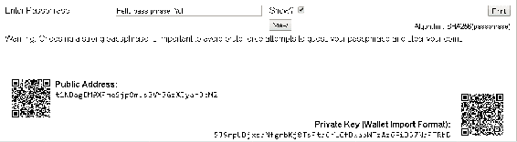
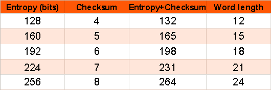
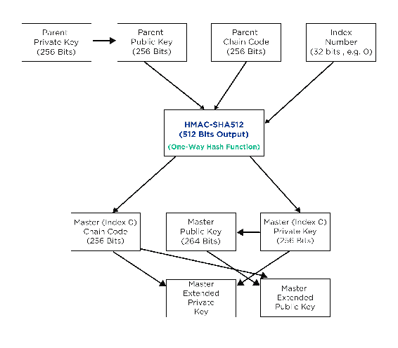

# 加密货币钱包

在本章中，我们将详细讨论加密货币钱包。在前面的章节中，我们已经介绍了钱包以及加密钱包的类型；在这一章中，我们将进一步详细讨论钱包，它们的来源，以及如何加强钱包的安全性。

钱包用于存储私人和公共密钥以及比特币地址。硬币可以用钱包收发。钱包可以将数据存储在数据库或结构化文件中。例如，比特币核心客户端钱包使用 Berkeley DB 文件。

我们将在本章中讨论的主题如下:

*   加密货币钱包的重要性
*   软件钱包
*   硬件钱包
*   纸质钱包
*   大脑钱包
*   加密货币钱包中的密钥推导方法
*   助记码

# 加密货币钱包简介

任何加密货币的钱包都可以存储多个公钥和私钥。加密货币本身不包含在钱包中；相反，加密货币被分散存储并保存在公共账本中。每种加密货币都有一个私钥，用它可以写入公共账本，这使得用加密货币消费成为可能。

了解钱包是很重要的，因为为了保证货币的安全，保证私钥的安全是至关重要的。钱包是公钥和私钥的集合，它们中的每一个对于货币持有者的安全性和匿名性都很重要。

# 加密货币钱包中的交易

钱包之间的交易不是价值的转移；取而代之的是，钱包里储存了用于签署交易的私钥。交易的签名由私钥和公钥的组合生成。安全地存储私钥很重要。

钱包可以存储多个私钥，也可以生成与私钥相关联的多个公钥。

因此，保证钱包的安全是很重要的，这样私钥也是安全的；如果私钥丢失，则与该私钥相关联的硬币将永远丢失，并且没有可行的方法来找回硬币。

# 加密货币钱包的类型

钱包可以根据它们的特点分成不同的类型。钱包可以根据它们支持的货币数量、可用性、软件或硬件、密钥派生方法等进行分类。我们将在以下小节中探讨加密货币钱包的类型。

# 货币支持

区别钱包的一个主要特征是钱包支持的货币数量；例如，可以有支持单种货币或多种货币的钱包。每枚硬币都有一个核心客户端，其中也包括一个钱包。

官方钱包通常支持单一货币，但现在，许多第三方钱包已经出现支持多个钱包，这些钱包执行与普通钱包相同的功能，唯一的区别是它们支持的货币数量。

支持多种货币的一些钱包如下:

*   无限钱包
*   Jaxx 公事包
*   银金矿
*   保险库
*   Coinbase 公事包

以下是 EXODUS 钱包截图，支持多种货币:


有各种各样的其他钱包不时出现，提供多种货币。有时，支持单一货币的现有钱包开始引入多种货币以增加其受欢迎程度，甚至支持另一种加密货币。

# 租用

钱包也可以基于它们是基于软件、硬件、纸张还是基于云来区分。让我们详细讨论一下这些钱包。

# 软件钱包

这些钱包基于本地电脑或手机。这些可以进一步分为桌面或移动钱包。这些钱包被限制在本地机器中；他们通常按顺序下载完整的区块链或者保存公共分类账的记录:

*   桌面软件(Desktop software):它们将密钥存储在本地的台式机或笔记本电脑上。它提供了对加密货币的完全控制，尽管安全性的责任在于机器上托管钱包的人，因此，即使机器的硬盘驱动器出现故障而没有任何备份，也有可能永远失去硬币。没有必要每时每刻都更新区块链，因此，在这种情况下也可以使用没有连接到计算机的机器。
*   **手机钱包**:这些钱包通过手机上的应用程序运行。这使得用户可以很容易地获得他们的硬币。这些钱包就像桌面软件钱包一样将硬币或钥匙存储在手机本地，或者它们只是云钱包的一个接口；，我们稍后将讨论该类型的钱包。以下截图是手机钱包的一个例子:


大多数加密货币的核心客户端首先提供软件钱包，最初支持桌面钱包。

# 硬件钱包

私钥应尽可能存储在最安全的位置。硬件钱包将私钥存储在为存储私钥而设计的定制硬件中。不可能以纯文本格式导出私钥，这给了它另一层安全性。只有在需要的时候，硬件才连接到计算机，在其他时候，私钥是安全的。Trezor 于 2012 年首次推出了硬件钱包。

目前一些流行的硬件钱包有 Trezor、Ledger 和 KeepKey 钱包。以下快照显示了连接到计算机的硬件钱包示例:


# 纸质钱包

纸钱包，顾名思义，就是简单地把公钥和私钥印在一起。密钥通常以 QR 形式打印，也用作地址。任何人都可以通过打印密钥来创建一个纸钱包，但也要确保他们从计算机中取出密钥，或者任何人都可以访问密钥。纸质钱包只能存储在纸上，没有备份。有各种各样的在线服务可以产生纸质钱包，比如 www.walletgenerator.net。下面的屏幕截图是一个纸质钱包的例子，下面的图像可以打印，以接收付款，公共地址是共享的，但私有密钥标记为机密，并应保持安全:


# 大脑钱包

大脑钱包是一个简单的钱包，它通过散列密码来生成私有和公共密钥，从而创建地址。为了生成大脑钱包，我们选择一个简单的密码来生成公钥和私钥对。下面的屏幕截图显示了公共地址和私有密钥是如何生成的。输入要提醒的密码短语，如下面的屏幕截图所示:



# 使用频率

钱包也可以根据用途进行区分；在此基础上主要有两种类型的钱包:冷钱包和热钱包。简而言之，冷钱包不连接到互联网，而热钱包连接到互联网，并且可以在任何时候用于发送相应的加密货币。即使没有连接到互联网，冷钱包也可以用来接收货币，但在连接到互联网之前，不可能将货币发送到其他地址。

除非插入设备，否则硬件钱包不会连接到互联网；他们可以被认为是冷钱包。

# 密钥派生

私钥由区块链上的钱包生成，主要有两种方法可以生成密钥。密钥生成方法对于钱包的安全性至关重要，并且对于在钱包丢失的情况下找回钱包也很重要。

# 非确定性钱包

这些是比特币客户端的最初迭代；这些钱包有随机生成的私人钥匙。这种类型的钱夹由于一个主要的缺点而停止使用，即如果钱夹丢失，随机密钥是不可访问的。由于为了保持网络上的匿名性，对每笔交易使用不同的地址是明智的，由于有如此多的随机密钥，维护变得困难，因此地址变得易于重复使用。尽管在比特币核心客户端中，有一个被实现为 0 型钱包的钱包，但它的使用受到了广泛的反对。

# 确定性钱包

在这些钱包中，密钥来自单个主密钥或者可以说是一个公共种子。这种钱包中的所有私钥都链接到一个公共种子。仅备份种子就足以恢复在这种类型的钱包中导出的所有密钥。

# 分层确定性钱包

这是确定性钱包的最高级形式。这些都是在比特币改进提案系统 BIP0032 中引入的。这些钱包遵循一个树结构，即种子创建一个主密钥，主密钥进一步创建子密钥，每个密钥可以派生出进一步的孙密钥。因此，在这些类型的钱包中，可以有多个密钥分支，并且分支中的每个密钥能够根据需要创建更多的密钥。下图显示了此类钱包中创建的密钥和地址层次结构:


# 助记码

这些是英语单词，用于表示随机数，该随机数用于在确定性钱包中导出种子。这些单词就像一个密码；这些字可以帮助恢复种子以及随后从中导出的密钥。助记码对钱包用户来说是一个很好的备份系统。

创建钱包时，钱包会显示 12 到 24 个单词的列表。这个单词序列用于备份钱包，并在钱包变得不可访问时恢复所有密钥。

以下是根据 BIP0039 标准生成助记码和种子的过程:

1.  ENT 位的初始随机熵在 128-256 位的允许大小之间生成。
2.  校验和是通过取其 SHA256 哈希的前几位来生成的。校验和长度由`ENT/32`公式定义。
3.  由`CS`表示的校验和被添加在初始熵的末尾。
4.  创建的序列被分成 11 位；每一个都被编码成一个 0 到 2，047 之间的数字，作为预定义单词表的索引。
5.  创建 12-24 个单词的列表来表示助记码。

长度助记码，也称为助记句(`MS`)，由`MS = (ENT + CS) / 11`定义。下面的屏幕截图显示了单词长度以及与该单词长度相关的熵:



512 位的种子是使用`PBKDF2`函数从助记符序列中生成的，其中助记符句子用作密码，而*字符串助记符+密码短语*用作盐。密码短语是用户可以用来保护他们的助记符的东西；如果未设置，则使用`""`。

从该过程导出的密钥的长度是 512 位；不同的钱包可以使用他们自己的过程来创建单词表，也可以有任何想要的单词表。虽然建议使用 BIP 中规定的助记符生成过程，但钱包可以根据需要使用自己版本的单词表。

# 高清钱包中的密钥生成过程

我们将详细讨论密钥生成过程，从主密钥到私钥，以及钱包为交易目的创建的各种地址。

初始过程是创建 128、256 或 512 位随机的根种子。根种子由助记句表示，在失去钱包访问权限的情况下，更容易恢复完整的钱包。

使用助记语句和根种子生成根种子，该根种子具有在 128 和 512 位之间选择的长度，尽管建议 256 位。使用(P) RNG 生成。得到的散列用于创建主私钥和主节点。主密钥的生成是层级系统中的深度级别 0；后续的钱包或密钥由深度 1、2 等表示。

# 子密钥派生

高清钱包广泛使用**子密钥派生** ( **CKD** )函数从父密钥创建子密钥。密钥是通过使用以下元素的单向哈希函数导出的:

*   父密钥
*   用作种子的链码，256 位
*   索引号，32 位

有各种方式可以从已经存在的密钥生成子密钥；以下是密钥派生序列:

*   从私有父密钥生成私有子密钥
*   从公共父密钥生成公共子密钥
*   从私有父密钥生成公共子密钥

让我们详细讨论一下前面提到的每一个序列。

# 私钥生成

父关键字、链码和索引号通过`HMAC-SHA512`算法进行组合和散列，使用以下公式生成 512 位散列:

```
I = HMAC-SHA512(Key = Cpar ,Data = serp (point(kpar )) || ser32 (i))
```

得到的散列被分成两个散列，散列输出的右半部分成为孩子的链码，而散列的左半部分及其索引号用于产生孩子私钥以及导出孩子公钥。

通过改变索引，我们可以在序列中创建多个子键。

# 扩展键

正如所讨论的，考虑到三个所需的输入可用，可以从父关键字导出多个子关键字。我们还可以创建另一种类型的密钥，称为**扩展密钥**，它由父密钥和链码组成。

此外，有两种类型的扩展密钥，根据使用的父密钥是私钥还是公钥来区分。扩展键可以创建子键，子键可以在树结构中进一步创建子键。

使用`Base58Check`对扩展密钥进行编码，这有助于在钱包之间轻松导出和导入。这些键基本上是父键的扩展，因此共享任何扩展键都可以访问分支中的整个分支。

扩展私钥在密钥的`Base58Check`中有`xprv`前缀，而扩展公钥在密钥的`Base58Check`中有`xpub`前缀。下图显示了扩展键是如何形成的:



# 摘要

在这一章中，我们详细讨论了加密货币钱包和各种类型的加密钱包，我们了解了区分加密钱包的各种特征，并讨论了钱包的租赁、每种钱包类型的优势以及使用特定钱包类型时可能面临的问题。我们讨论了密钥派生方法及其对于安全性、可访问性和钱包的其他方面的重要性。