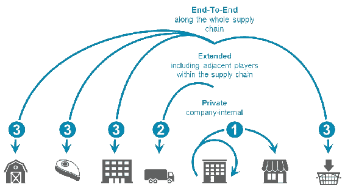
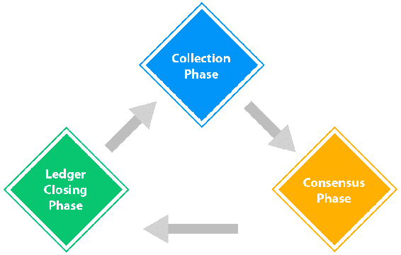
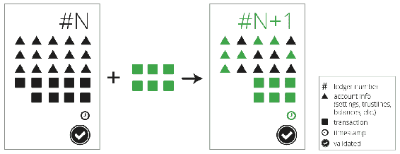

# 候补区块链

在前几章中，我们了解了区块链、其结构、组件、机制以及区块链的最大用例——比特币。在最后一章中，我们讨论了加密货币钱包，以及它们的角色和使用区块链。我们的大部分讨论都围绕着比特币和其他加密货币。

比特币的成功给这项技术和底层的区块链总账系统带来了很多关注，社区开始创建基于区块链的替代加密货币，对比特币的参数进行轻微修改，每次都试图以这样或那样的方式进行改进。随后，各种组织开始创造替代区块链的方法，对其稍作修改或改变，但保持区块链的核心定义，即公共分类账不变。一些试图创造另类区块链的项目没有获得太多关注，但其他项目设法获得了很多关注和社区支持。

在本章中，我们将讨论以下主题:

*   区块链在各种垂直领域的应用，如政府、医疗保健、医学研究、供应链、美术、航运、能源、企业等
*   涟漪支付系统
*   一流的支付网络
*   嫩薄荷
*   妈妈咪呀

# 区块链的各种用途

分布式账本技术据说是继互联网之后计算机最大的革命；在未来的几年里，区块链将会给每一个人带来革命性的影响。

区块链用于与货币相关的应用，如比特币和替代币，但除此之外，区块链在其他行业还有各种其他用例，需要完全不同的货币用法。下图描述了使用区块链的一些行业:

# 政府

全球各地的政府都在使用区块链来存储各种政府部门的公共记录或任何其他信息，如医疗保健、身份管理、税收、投票和金融服务。

有了一个分散的数据库，政府就可以很容易地减少欺诈，并在数据进入分布式分类账系统之前进行某些检查。

# 卫生保健

个人的医疗记录需要正确信息的认证，并且能够访问各方面都完整的健康记录是很重要的。区块链可用于促进数据共享和记录保存。医生和卫生保健团体的其他相关人员可以很容易地访问敏感的医疗数据。

# 医学研究

医学界的研究人员总是致力于更好的创新和技术，以改善临床护理。有了区块链上的数据，研究人员可以轻松访问真实数据，还可以根据适当的批准周期添加理论/结果。该系统的互操作性可以在多个层面上提供帮助，同时提供精确性和真实性。

# 供应链

供应链管理是业务流程中最分散的瓶颈之一。供应链管理一直需要效率。由于使用了多个软件系统，每个系统都有不同的数据点，需要更平稳的移动，因此缺乏兼容性。区块链可以为供应链流程中的每个参与者提供对相关信息的访问，从而减少通信或数据错误，如下图所示:

# 版权

区块链可用于解决版权索赔，因为基于区块链的系统中的任何条目只有在获得共识系统批准后才能引入，从而确保版权得到维护。

# 精细工艺

艺术产业依赖于艺术品的鉴定；虽然区块链不能鉴定艺术品或者一幅画是真迹还是赝品，但它可以用来鉴定所有权。

# 船舶

出现了许多在海运物流业中使用区块链的项目，以提高国际贸易的透明度。出于同样的原因，各种各样的全球托运人都在使用区块链，以引进基于区块链的技术，并消除分布式账本技术为该行业解决的任何瓶颈。

# 活力

区块链可以通过跟踪能源分配和实施高效分配，帮助最大限度地提高能源分配领域的效率。能源生产和新的可持续资源的研究可以通过使用区块链来监控，以在相同的意义上保持真实性和一致性，如下所示:

# 计算和数据存储

计算资源在全球范围内被浪费。数据中心和数据湖总是需要高效的数据维护。使用区块链可以确保安全性和改进。

# 身份和社会保障

用户身份识别是政府使用区块链的一个重要用例，但也可以根据需要由其他组织用于社会保障和其他身份识别流程。

# 企业

企业可以在各种情况下使用区块链，例如部门之间的协调、办公室内部和办公室之间的通信、数据迁移以及各种其他任务。微软、IBM、谷歌、亚马逊和其他公司已经开始在各个企业部门测试区块链的使用。

# 涟漪

Ripple 是 Ripple company 于 2012 年建立的实时总额结算和汇款网络。它允许双方在几秒钟内付款。它用自己的硬币操作，称为 **Ripple** ( **XRP** )，也支持非 XRP 支付。Ripple 提出了一个新的分散的银行和支付提供商全球网络，称为 RippleNet。这个网络的核心使用 Ripple 的交易结算技术。RippleNet 被提议独立于银行和支付提供商，为实时支付结算建立一个标准化的网络。

Ripple 网络由各种节点组成，这些节点执行各自定义的任务。促进系统的第一个节点被称为**用户节点**。用户节点使用 Ripple 进行支付和交易，例如进行和接收支付。Ripple 中的第二种节点是验证器节点。这些节点是波纹网络中共识机制的一部分。**唯一节点列表** ( **UNL** )中的节点是 Ripple 网络的一部分，并为共识机制所信任。任何人都可以成为验证者节点或用户节点。下图显示了在 Ripple 网络中发生的交易流。交易从收集阶段开始，然后继续进行到达成共识阶段。最后一个阶段是分类账结算阶段，为要接收的下一组交易创建特定交易的冻结:

对于共识机制，Ripple 使用 **Ripple 协议共识算法** ( **RPCA** )。RPCA 既不使用**工作证明** ( **PoW** )也不使用**利益证明** ( **PoS** )系统；相反，它的共识机制在一个基于正确性的系统上工作。共识过程通过以迭代的方式寻求来自验证器节点的接受来在投票系统上工作，以便接收所需数量的投票。收到所需票数后，更改生效，分类帐关闭。一旦分类帐中的改变被接受并且分类帐被关闭，警报被发送到网络。

Ripple 网络由各种元素组成，这些元素共同使 Ripple 中的交易成功:

*   **验证者**:这个元素是共识协议中的参与者。
*   **分类账**:包含分类账编号、账户设置、交易、时间戳、分类账验证标志等要素。
*   **打开分类账**:这是投票发生的分类账。未结分类帐包含建议的交易记录。
*   **唯一节点列表**:这是一个节点列表，验证服务器使用它来寻求投票并推进共识。
*   **提议者**:该元素提议将成为共识流程一部分的新交易。

# 处理

交易由 Ripple 网络节点创建，以便更新分类帐。交易需要经过数字签名和验证，才能成为共识流程的一部分。每笔交易都要花费少量的 XRP，就像以太坊里的汽油一样。Ripple Network 中有各种类型的交易:付款相关、订单相关和账户相关。

RippleNetwork 中还提供了各种开发人员 API 来处理交易和支付，并集成到 Ripple net 中。Interledger 与 RippleNet 配合使用，可以兼容不同的网络。下图描述了 Ripple 网络事务中块的组成:

# 主要的

恒星网络是用来交换任何货币的，包括定制的代币。Stellar 有一个共识系统，更普遍的说法是 **Stellar 共识协议** ( **SCP** )，它基于**联邦拜占庭协议** ( **FBA** )。SCP 不同于 lower 和 PoS，它主要关注于为更快的交易提供更低的延迟。

它有四个主要属性:

*   **分散财产**:它允许任何人参与，而不需要任何中心方
*   **低延迟**:它解决了快速交易处理的迫切需求
*   灵活信任(Flexible trust):允许用户选择出于特定目的信任哪一方
*   **渐进安全性**:它利用数字签名和散列函数来提供网络上所需的安全级别

Stellar 网络维护一个分布式分类帐，保存每笔交易，并在连接到网络的每台 Stellar 服务器上复制。通过验证服务器之间的交易，并用完全相同的交易的更新来更新分类帐，来实现共识。Stellar ledger 还可以充当分布式交易订单簿，因为用户可以存储他们买卖货币的报价。

# 嫩薄荷

Tendermint 提供了安全一致的状态机复制功能。它的主要任务是开发一个安全、高性能、易于复制的状态机。它是拜占庭容错的，也就是说，即使三分之一的机器出现故障，Tendermint 也会继续工作。

嫩薄荷的两种主要成分如下:

*   **tender mint 核心**:tender mint 核心支持网络中每个节点上事务的安全复制。这是一个共识引擎。
*   嫩薄荷套接字协议(Tendermint Socket Protocol)(**TMSP**):TMSP 是一种应用程序接口协议，允许与任何编程语言进行接口，并帮助处理事务。

Tendermint 共识算法是一种基于循环的机制，其中验证器节点在每一轮中启动新的块。使用锁定机构来确保防止在区块链的相同高度选择两个不同的块来关闭的情况。每个验证器节点同步包含事务的块的完整本地复制分类帐。每个块包含一个标题，该标题由以前的块散列、建议块的时间戳、当前块高度以及该块中存在的所有事务的 Merkle 根散列组成。

下图显示了共识引擎和客户端应用程序之间通过 Tendermint 套接字协议的流程:

Tendermint 协议的参与者通常被称为**验证者**。每个验证器轮流提出事务块。他们也对它们进行投票，就像之前讨论的涟漪投票系统一样。如果某个块无法提交，协议将进入下一轮。然后，一个新的验证器会为相同的高度建议一个块。投票需要两个阶段才能成功提交块。这两个阶段通常称为预投票和预提交阶段。只有当三分之二以上的验证器在同一轮中为同一个块预提交时，才提交一个块。

由于多种原因，验证器无法提交块。这些可能包括当前提议者离线，或者网络质量或速度问题。Tendermint 还允许验证器确认是否应该跳过某个验证器。每个验证者等待一小段时间，以接收来自相关提议者的提议块。只有在投票结束后，他们才能进入下一轮。这种对时间段的依赖使得 Tendermint 成为同步协议，尽管事实上该协议的其余部分本质上是异步的，并且验证器仅在收到超过三分之二的验证器集的消息后才进行处理。Tendermint 的简化元素之一是，它使用相同的机制来提交一个块，就像它跳到下一轮一样。

如果我们假设少于三分之一的验证器节点是拜占庭的，Tendermint 保证安全性不会被破坏。这意味着验证器节点永远不会在同一高度提交冲突的块。有一些锁定规则可以调整可以遵循的路径。一旦验证器预提交了一个块，它就被锁定在那个块上。在这种情况下，它必须对要锁定的块进行预投票，并且只能对新块进行解锁和预提交。

# 妈妈咪呀

Monax 是区块链和智能合约技术，成立于 2014 年。它以厄里斯工业开始其旅程，但在 2016 年 10 月更名为 Monax。

Monax 可以提供很多东西。其中包括各种框架、SDK 和工具，可以加速区块链的开发及其在企业中的部署。Monax 应用程序平台背后的想法是支持在其后端使用区块链的生态系统应用程序的开发。它还允许与多个区块链集成，使各种第三方系统能够与其他区块链系统交互，并提供高水平的兼容性。这个平台利用了用 solidity 语言编写的智能合同。它可以与区块链互动，如以太坊或比特币。所有命令都针对不同的区块链进行了标准化，相同的命令可以跨平台使用。

Monax 正被积极用于以下应用:

*   车队租赁
*   公司治理
*   知识产权
*   法律程序

# 摘要

在这一章中，我们介绍了另一个区块链。我们讨论了除加密货币之外的区块链的各种使用案例。其中包括政府、医疗保健、医学研究、供应链、版权、美术、航运、能源等等。除此之外，我们还讨论了 Ripple，这是一种用于快速支付的新区块链，与比特币区块链相比，它提供了各种修改和改进。之后，我们讨论了 Stellar 支付协议及其主要特性，这有助于加速 Stellar 中的支付。Tendermint 是另一个区块链软件，我们讨论过并引起了我们的注意。

在下一章，我们将详细讨论 Hyperledger 和一些基于 Hyperledger 协议的突出项目。我们还将讨论 Hyperledger 协议的细节和其他参数。