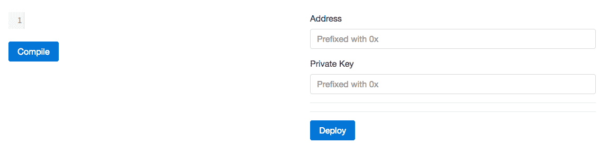
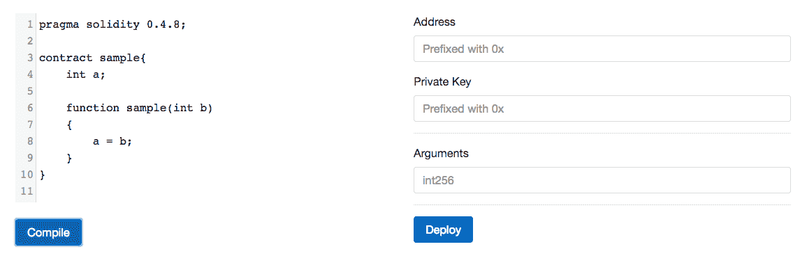
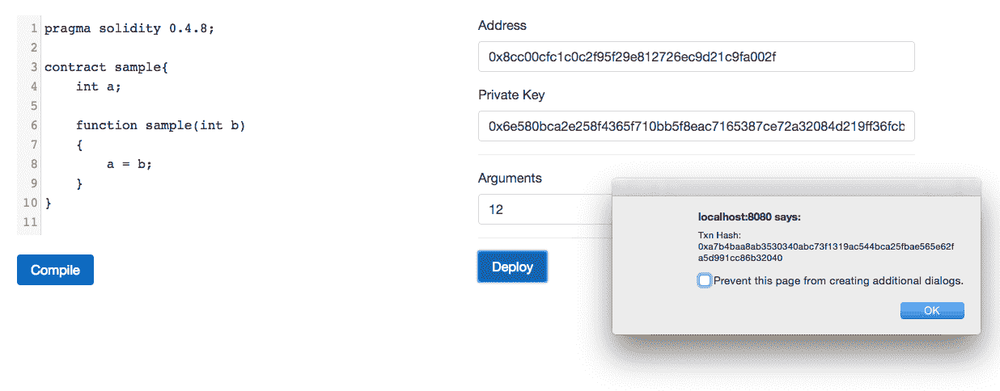

# 构建智能合同部署平台

一些客户端可能需要在运行时编译和部署契约。在我们的所有权证明 DApp 中，我们手动部署了智能契约，并在客户端代码中硬编码了契约地址。但是一些客户端可能需要在运行时部署智能合约。例如，如果客户让学校记录学生在区块链的出勤情况，那么每次新学校注册时，它都需要部署一个智能合同，以便每个学校都可以完全控制其智能合同。在本章中，我们将学习如何使用 web3.js 编译智能合约，并使用 web3.js 和 EthereumJS 部署智能合约。

在本章中，我们将讨论以下主题:

*   计算交易的现时
*   使用事务池 JSON-RPC API
*   为合同创建和方法调用生成事务数据
*   估计交易所需的气体
*   查找帐户的当前可支出余额
*   使用 solcjs 编译智能合同
*   开发一个平台来编写、编译和部署智能合同

# 计算事务的现时

对于 geth 维护的帐户，我们不需要担心事务随机数，因为 geth 可以将正确的随机数添加到事务中，并对它们进行签名。当使用不受 geth 管理的帐户时，我们需要自己计算随机数。

要自己计算 nonce，我们可以使用 geth 提供的`getTransactionCount`方法。第一个参数应该是我们需要其事务计数的地址，第二个参数是在我们需要事务计数之前的块。我们可以提供`"pending"`字符串作为块来包含当前正在挖掘的块中的事务。正如我们在前面一章中讨论的，geth 维护一个事务池，在其中保存挂起和排队的事务。为了挖掘一个块，geth 从事务池中取出挂起的事务，并开始挖掘新的块。在该块未被挖掘之前，未决事务将保留在事务池中，一旦被挖掘，被挖掘的事务将从事务池中删除。在一个块被挖掘时接收到的新的传入事务被放入事务池，并在下一个块中被挖掘。所以当我们在调用`getTransactionCount`时提供`"pending"`作为第二个参数时，它不会查看事务池内部；相反，它只考虑挂起块中的事务。

因此，如果您尝试从不受 geth 管理的账户发送交易，则计算该账户在区块链中的交易总数，并将其与交易池中待处理的交易相加。如果您尝试使用挂起块中的挂起事务，那么如果在间隔的几秒钟内将事务发送到 geth，您将无法获得正确的 nonce，因为在区块链中包含一个事务平均需要 12 秒。

在前一章中，我们依靠 hooked-web3-provider 向事务添加 nonce。不幸的是，hooked-web3-provider 没有尝试以正确的方式获得 nonce。它为每个帐户维护一个计数器，并在您每次从该帐户发送交易时递增该计数器。如果事务无效(例如，如果事务试图发送比它所拥有的更多的以太网)，那么它不会递减计数器。因此，来自该帐户的其余事务将被排队，并且永远不会被挖掘，直到 hooked-web3-provider 被重置，即客户端被重启。如果您创建了 hooked-web3-provider 的多个实例，那么这些实例就不能相互同步一个帐户的 nonce，所以您可能会得到不正确的 nonce。但是在您将 nonce 添加到事务之前，hooked-web3-provider 总是获得事务计数，直到挂起块，并将其与其计数器进行比较，然后使用较大的那个。因此，如果来自 hooked-web3-provider 管理的帐户的交易是从网络中的另一个节点发送的，并且包含在未决块中，那么 hooked-web3-provider 可以看到它。但是不能依靠整个 hooked-web3 提供者来计算 nonce。它非常适合客户端应用程序的快速原型制作，并且适用于这样的应用程序:如果事务没有广播到网络，并且 hooked-web3-provider 频繁重置，用户可以看到并重新发送事务。例如，在我们的钱包服务中，用户会频繁地加载页面，因此会频繁地创建一个新的 hooked-web3-provider 实例。如果事务未被广播、无效或未被挖掘，则用户可以刷新页面并重新发送事务。

# solcjs 简介

solcjs 是一个 Node.js 库和命令行工具，用于编译 solidity 文件。它不使用 solc 命令行编译器；相反，它完全使用 JavaScript 进行编译，因此安装起来比 solc 容易得多。

Solc 是真正的 Solidity 编译器。Solc 是用 C++写的。使用 emscripten 将 C++代码编译成 JavaScript。solc 的每个版本都编译成 JavaScript。在[https://github.com/ethereum/solc-bin/tree/gh-pages/bin](https://github.com/ethereum/solc-bin/tree/gh-pages/bin)，你可以找到每个 solidity 版本的基于 JavaScript 的编译器。solcjs 只是使用这些基于 JavaScript 的编译器之一来编译 solidity 源代码。这些基于 JavaScript 的编译器可以在浏览器和 Node.js 环境中运行。

浏览器 Solidity 使用这些基于 JavaScript 的编译器来编译 Solidity 源代码。

# 安装 solcjs

solcjs 是一个名为`solc`的 npm 包。您可以像安装任何其他 npm 软件包一样，在本地或全局安装`solcjs` npm 软件包。如果这个包是全局安装的，那么`solcjs`，一个命令行工具，将是可用的。因此，为了安装命令行工具，请运行以下命令:

```
    npm install -g solc

```

现在继续运行这个命令，看看如何使用命令行编译器编译 solidity 文件:

```
    solcjs -help

```

我们不会探究 solcjs 命令行工具；相反，我们将学习 solcjs APIs 来编译 solidity 文件。

默认情况下，solcjs 使用编译器版本匹配作为其版本。例如，如果您安装 solcjs 0.4.8 版，那么它将默认使用 0 . 4 . 8 编译器版本进行编译。solcjs 也可以被配置成使用一些其他的编译器版本。在撰写本文时，solcjs 的最新版本是 0.4.8。

# solcjs apis

solcjs 提供了一个`compiler`方法，用来编译 solidity 代码。根据源代码是否有任何导入，可以以两种不同的方式使用该方法。如果源代码没有任何导入，那么它需要两个参数；也就是说，第一个参数是一个字符串形式的 solidity 源代码和一个指示是否优化字节码的布尔值。如果源字符串包含多个合同，那么它将编译所有合同。

这里有一个例子来说明这一点:

```
var solc = require("solc"); 
var input = "contract x { function g() {} }"; 
var output = solc.compile(input, 1); // 1 activates the optimiser  
for (var contractName in output.contracts) { 
    // logging code and ABI  
    console.log(contractName + ": " + output.contracts[contractName].bytecode); 
    console.log(contractName + "; " + JSON.parse(output.contracts[contractName].interface)); 
} 

```

如果您的源代码包含导入，那么第一个参数将是一个对象，它的键是文件名，值是文件的内容。因此，每当编译器看到一个导入语句时，它不会在文件系统中寻找该文件；相反，它通过将文件名与关键字匹配来查找对象中的文件内容。这里有一个例子来说明这一点:

```
var solc = require("solc"); 
var input = { 
    "lib.sol": "library L { function f() returns (uint) { return 7; } }", 
    "cont.sol": "import 'lib.sol'; contract x { function g() { L.f(); } }" 
}; 
var output = solc.compile({sources: input}, 1); 
for (var contractName in output.contracts) 
    console.log(contractName + ": " + output.contracts[contractName].bytecode); 

```

如果您希望在编译期间从文件系统中读取导入的文件内容，或者在编译期间解析文件内容，那么编译器方法支持第三个参数，这是一个接受文件名并应该返回文件内容的方法。这里有一个例子来说明这一点:

```
var solc = require("solc"); 
var input = { 
    "cont.sol": "import 'lib.sol'; contract x { function g() { L.f(); } }" 
}; 
function findImports(path) { 
    if (path === "lib.sol") 
        return { contents: "library L { function f() returns (uint) { return 7; } }" } 
    else 
        return { error: "File not found" } 
} 
var output = solc.compile({sources: input}, 1, findImports); 
for (var contractName in output.contracts) 
    console.log(contractName + ": " + output.contracts[contractName].bytecode); 

```

# 使用不同的编译器版本

为了使用不同版本的 solidity 来编译契约，您需要使用`useVersion`方法来获取不同编译器的引用。`useVersion`获取一个表示保存编译器的 JavaScript 文件名的字符串，并在`/node_modules/solc/bin`目录中查找该文件。

solcjs 还提供了另一个名为`loadRemoteVersion`的方法，该方法获取与【https://github.com/ethereum/solc-bin】()的`solc-bin`目录中的文件名匹配的编译器文件名，并下载和使用它。

最后，solcjs 还提供了另一个名为`setupMethods`的方法，类似于`useVersion`，但是可以从任何目录加载编译器。

下面的示例演示了所有三种方法:

```
var solc = require("solc"); 

var solcV047 = solc.useVersion("v0.4.7.commit.822622cf"); 
var output = solcV011.compile("contract t { function g() {} }", 1); 

solc.loadRemoteVersion('soljson-v0.4.5.commit.b318366e', function(err, solcV045) { 
    if (err) { 
        // An error was encountered, display and quit 
    } 

    var output = solcV045.compile("contract t { function g() {} }", 1); 
}); 

var solcV048 = solc.setupMethods(require("/my/local/0.4.8.js")); 
var output = solcV048.compile("contract t { function g() {} }", 1); 

solc.loadRemoteVersion('latest', function(err, latestVersion) { 
    if (err) { 
        // An error was encountered, display and quit 
    } 
    var output = latestVersion.compile("contract t { function g() {} }", 1); 
}); 

```

要运行前面的代码，您需要首先从`solc-bin`库下载`v0.4.7.commit.822622cf.js`文件，并将其放在`node_modules/solc/bin`目录中。然后你需要下载 solidity 版本 0.4.8 的编译器文件，把它放在文件系统的某个地方，并在`setupMethods`调用中将路径指向那个目录。

# 链接库

如果您的 solidity 源代码引用了库，那么生成的字节码将包含被引用库的实际地址的占位符。在部署合同之前，这些必须通过一个称为链接的过程进行更新。

solcjs 提供了`linkByteCode`方法来将库地址链接到生成的字节码。

这里有一个例子来说明这一点:

```
var solc = require("solc"); 

var input = { 
    "lib.sol": "library L { function f() returns (uint) { return 7; } }", 
    "cont.sol": "import 'lib.sol'; contract x { function g() { L.f(); } }" 
}; 

var output = solc.compile({sources: input}, 1); 

var finalByteCode = solc.linkBytecode(output.contracts["x"].bytecode, { 'L': '0x123456...' }); 

```

# 更新 ABI

合同的 ABI 提供了有关合同的各种信息，而不是实现信息。由两个不同版本的编译器生成的 ABI 可能不匹配，因为较高版本比较低版本支持更多的可靠性特征；因此，他们将包括额外的东西在 ABI。例如，回退功能是在 0.4.0 版本的 Solidity 中引入的，因此使用低于 0.4.0 版本的编译器生成的 ABI 将没有关于回退功能的信息，这些智能合约的行为就像它们有一个带有空主体和应付款修饰符的回退功能。因此，应该更新 API，以便依赖于较新 solidity 版本的 ABI 的应用程序可以获得关于合同的更好的信息。

solcjs 提供了一个 API 来更新 ABI。下面是演示这一点的示例代码:

```
var abi = require("solc/abi"); 

var inputABI = [{"constant":false,"inputs":[],"name":"hello","outputs":[{"name":"","type":"string"}],"payable":false,"type":"function"}]; 
var outputABI = abi.update("0.3.6", inputABI) 

```

这里，0.3.6 表示 ABI 是使用 0.3.6 版本的编译器生成的。由于我们使用的是 solcjs 0.4.8 版，ABI 将被更新以匹配 0 . 4 . 8 编译器版本生成的 ABI，而不是高于它。

上述代码的输出如下所示:

```
[{"constant":false,"inputs":[],"name":"hello","outputs":[{"name":"","type":"string"}],"payable":true,"type":"function"},{"type":"fallback","payable":true}] 

```

# 构建合同部署平台

既然我们已经学会了如何使用 solcjs 来编译 solidity 源代码，那么是时候构建一个让我们能够编写、编译和部署契约的平台了。我们的平台将让用户提供他们的帐户地址和私人密钥，使用我们的平台将部署合同。

在开始构建应用程序之前，确保您正在运行 geth 开发实例，该实例正在挖掘，启用了`rpc`，并通过 HTTP-RPC 服务器公开了`eth`、`web3`和`txpool`API。您可以通过运行以下命令来完成所有这些操作:

```
    geth --dev --rpc --rpccorsdomain "*" --rpcaddr "0.0.0.0" --rpcport "8545" --mine --rpcapi "eth,txpool,web3"

```

# 项目结构

在本章的练习文件中，你会发现两个目录，分别是`Final`和`Initial`。`Final`包含项目的最终源代码，而`Initial`包含空的源代码文件和库，以便快速开始构建应用程序。

为了测试`Final`目录，你需要在其中运行`npm install`，然后在`Final`目录中使用`node app.js`命令运行应用程序。

在`Initial`目录中，你会发现一个`public`目录和两个名为`app.js`和`package.json`的文件。`package.json`文件包含我们的应用程序的后端依赖。`app.js`是放置后端源代码的地方。

`public`目录包含与前端相关的文件。在`public/css`里面，你会发现`bootstrap.min.css`，这是引导库，你也会发现`codemirror.css`文件，这是 codemirror 库的 CSS。在`public/html`中，你会找到`index.html`，在那里你会放置我们应用的 HTML 代码，在`public/js`目录中，你会找到 codemirror 和 web3.js 的`.js`文件。在`public/js`中，你也会找到一个`main.js`文件，在那里你会放置我们应用的前端 js 代码。

# 构建后端

我们先来搭建 app 的后端。首先，在`Initial`目录中运行`npm install`，为我们的后端安装所需的依赖项。

下面是运行快速服务并为`index.html`文件和静态文件提供服务的后端代码:

```
var express = require("express");   
var app = express();   

app.use(express.static("public")); 

app.get("/", function(req, res){ 
 res.sendFile(__dirname + "/public/html/index.html"); 
}) 

app.listen(8080); 

```

前面的代码不言自明。现在让我们继续。我们的 app 会有两个按钮，编译和部署。当用户单击“编译”按钮时，合同将被编译，当用户单击“部署”按钮时，合同将被部署。

我们将在后端编译和部署合同。虽然这可以在前端完成，但我们将在后端完成，因为 solcjs 只对 Node.js 可用(尽管它使用的基于 JavaScript 的编译器在前端工作)。

要了解如何在前端编译，请浏览 solcjs 的源代码，这将让您了解基于 JavaScript 的编译器所公开的 API。

当用户点击编译按钮时，前端将通过传递契约源代码向`/compile`路径发出`GET`请求。以下是路线的代码:

```
var solc = require("solc"); 

app.get("/compile", function(req, res){ 
 var output = solc.compile(req.query.code, 1); 
 res.send(output); 
}) 

```

首先，我们在这里导入 solcjs 库。然后，我们定义`/compile`路由，在路由回调中，我们简单地编译由启用优化器的客户端发送的源代码。然后我们只需将`solc.compile`方法的返回值发送到前端，让客户端检查编译是否成功。

当用户单击 deploy 按钮时，前端将通过传递来自地址和私钥的契约源代码和构造函数参数向`/deploy`路径发出`GET`请求。当用户单击此按钮时，将部署合同，并将事务哈希返回给用户。

以下是代码:

```
var Web3 = require("web3"); 
var BigNumber = require("bignumber.js"); 
var ethereumjsUtil = require("ethereumjs-util"); 
var ethereumjsTx = require("ethereumjs-tx"); 

var web3 = new Web3(new Web3.providers.HttpProvider("http://localhost:8545")); 

function etherSpentInPendingTransactions(address, callback) 
{ 
 web3.currentProvider.sendAsync({ 
    method: "txpool_content", 
    params: [], 
    jsonrpc: "2.0", 
    id: new Date().getTime() 
 }, function (error, result) { 
  if(result.result.pending) 
  { 
   if(result.result.pending[address]) 
   { 
    var txns = result.result.pending[address]; 
    var cost = new BigNumber(0); 

    for(var txn in txns) 
    { 
     cost = cost.add((new BigNumber(parseInt(txns[txn].value))).add((new BigNumber(parseInt(txns[txn].gas))).mul(new BigNumber(parseInt(txns[txn].gasPrice))))); 
    } 

    callback(null, web3.fromWei(cost, "ether")); 
   } 
   else 
   { 
    callback(null, "0"); 
   } 
  } 
  else 
  { 
   callback(null, "0"); 
  } 
 }) 
} 

function getNonce(address, callback) 
{ 
 web3.eth.getTransactionCount(address, function(error, result){ 
  var txnsCount = result; 

  web3.currentProvider.sendAsync({ 
     method: "txpool_content", 
     params: [], 
     jsonrpc: "2.0", 
     id: new Date().getTime() 
  }, function (error, result) { 
   if(result.result.pending) 
   { 
    if(result.result.pending[address]) 
    { 
     txnsCount = txnsCount + Object.keys(result.result.pending[address]).length; 
     callback(null, txnsCount); 
    } 
    else 
    { 
     callback(null, txnsCount); 
    } 
   } 
   else 
   { 
    callback(null, txnsCount); 
   } 
  }) 
 }) 
} 

app.get("/deploy", function(req, res){ 
 var code = req.query.code; 
 var arguments = JSON.parse(req.query.arguments); 
 var address = req.query.address; 

 var output = solc.compile(code, 1); 

 var contracts = output.contracts; 

 for(var contractName in contracts) 
 { 
  var abi = JSON.parse(contracts[contractName].interface); 
  var byteCode = contracts[contractName].bytecode; 

  var contract = web3.eth.contract(abi); 

  var data = contract.new.getData.call(null, ...arguments, { 
   data: byteCode 
  }); 

  var gasRequired = web3.eth.estimateGas({ 
      data: "0x" + data 
  }); 

  web3.eth.getBalance(address, function(error, balance){ 
   var etherAvailable = web3.fromWei(balance, "ether"); 
   etherSpentInPendingTransactions(address, function(error, balance){ 
    etherAvailable = etherAvailable.sub(balance) 
    if(etherAvailable.gte(web3.fromWei(new BigNumber(web3.eth.gasPrice).mul(gasRequired), "ether"))) 
    { 
     getNonce(address, function(error, nonce){ 
      var rawTx = { 
             gasPrice: web3.toHex(web3.eth.gasPrice), 
             gasLimit: web3.toHex(gasRequired), 
             from: address, 
             nonce: web3.toHex(nonce), 
             data: "0x" + data 
         }; 

      var privateKey = ethereumjsUtil.toBuffer(req.query.key, 'hex'); 
      var tx = new ethereumjsTx(rawTx); 
      tx.sign(privateKey); 

      web3.eth.sendRawTransaction("0x" + tx.serialize().toString('hex'), function(err, hash) { 
       res.send({result: { 
        hash: hash, 
       }}); 
      }); 
     }) 
    } 
    else 
    { 
     res.send({error: "Insufficient Balance"}); 
    } 
   }) 
  }) 

     break; 
 } 
}) 

```

前面的代码是这样工作的:

1.  首先，Web 导入`web3.js`、`BigNumber.js`、`ethereumjs-util`和`ethereumjs-tx`库。然后，我们创建一个`Web3`的实例。
2.  然后，我们定义一个名为`etherInSpentPendingTransactions`的函数，它计算在一个地址的未决事务中花费的总时间。由于`web3.js`没有提供与事务池相关的 JavaScript APIs，我们使用`web3.currentProvider.sendAsync`进行一个原始的 JSON-RPC 调用。`sendAsync`用于异步进行原始 JSON-RPC 调用。如果你想同步进行这个调用，那么使用`send`方法而不是`sendAsync`。在计算一个地址的挂起事务中的总以太时，由于我们前面讨论的问题，我们在事务池中而不是挂起块中寻找挂起事务。在计算总乙醚时，我们将每笔交易的价值和汽油相加，因为汽油也扣除了乙醚余额。
3.  接下来，我们定义一个名为`getNonce`的函数，它使用我们之前讨论过的技术来检索地址的随机数。它只是将挖掘的事务总数添加到挂起的事务总数中。
4.  最后，我们声明`/deploy`端点。首先，我们起草合同。然后，我们只部署第一个契约。如果在提供的源代码中发现多个契约，我们的平台将部署第一个契约。您可以稍后增强该应用程序，以部署所有已编译的合同，而不仅仅是第一个合同。然后，我们使用`web3.eth.contract`创建一个契约对象。

5.  由于我们没有使用 hooked-web3-provider 或任何黑客来拦截`sendTransactions`并将其转换为`sendRawTransaction`调用，为了部署契约，我们现在需要生成事务的数据部分，它将契约字节代码和构造函数参数组合起来，并编码为十六进制字符串。契约对象实际上让我们生成事务的数据。这可以通过调用带有函数参数的`getData`方法来实现。如果你想得到数据来部署契约，那么调用`contract.new.getData`，如果你想调用契约的一个功能，那么调用`contract.functionName.getData`。在这两种情况下，为`getData`方法提供参数。因此，为了生成交易的数据，您只需要合同的 ABI。要了解函数名和参数如何组合和编码以生成数据，您可以查看[https://github . com/ether eum/wiki/wiki/ether eum-Contract-ABI # examples](https://github.com/ethereum/wiki/wiki/Ethereum-Contract-ABI#examples)，但是如果您有契约的 ABI 或者知道如何手动创建 ABI，就不需要这样做。
6.  然后，我们使用`web3.eth.estimateGas`来计算部署合同所需的天然气量。
7.  稍后，我们检查该地址是否有足够的乙醚来支付部署合同所需的汽油。我们通过检索地址的余额并用未决交易中花费的余额减去它，然后检查剩余余额是否大于或等于气体所需的乙醚量来找出这一点。
8.  最后，我们得到 nonce，签署并广播事务。我们只需将事务哈希返回给前端。

# 构建前端

现在让我们构建应用程序的前端。我们的前端将包含一个编辑器，用户使用它编写代码。当用户点击编译按钮时，我们将动态显示输入框，每个输入框代表一个构造函数参数。当单击 deploy 按钮时，将从这些输入框中获取构造函数参数值。用户需要在这些输入框中输入 JSON 字符串。

我们将使用 codemirror 库来集成我们前端的编辑器。要了解如何使用 codemirror，请参考[http://codemirror.net/](http://codemirror.net/)。

这是我们的应用程序的前端 HTML 代码。将此代码放在`index.html`文件中:

```
<!DOCTYPE html> 
<html lang="en"> 
    <head> 
        <meta charset="utf-8"> 
        <meta name="viewport" content="width=device-width, initial-scale=1, shrink-to-fit=no"> 
        <meta http-equiv="x-ua-compatible" content="ie=edge"> 
        <link rel="stylesheet" href="/css/bootstrap.min.css"> 
        <link rel="stylesheet" href="/css/codemirror.css"> 
        <style type="text/css"> 
            .CodeMirror 
            { 
                height: auto; 
            } 
        </style> 
    </head> 
    <body> 
        <div class="container"> 
            <div class="row"> 
                <div class="col-md-6"> 
                    <br> 
                    <textarea id="editor"></textarea> 
                    <br> 
                    <span id="errors"></span> 
                    <button type="button" id="compile" class="btn btn-primary">Compile</button> 
                </div> 
                <div class="col-md-6"> 
                    <br> 
                    <form> 
                        <div class="form-group"> 
                            <label for="address">Address</label> 
                            <input type="text" class="form-control" id="address" placeholder="Prefixed with 0x"> 
                        </div> 
                        <div class="form-group"> 
                            <label for="key">Private Key</label> 
                            <input type="text" class="form-control" id="key" placeholder="Prefixed with 0x"> 
                        </div> 
                        <hr> 
                        <div id="arguments"></div> 
                        <hr> 
                        <button type="button" id="deploy" class="btn btn-primary">Deploy</button> 
                    </form> 
                </div> 
            </div> 
        </div> 
        <script src="/js/codemirror.js"></script> 
        <script src="/js/main.js"></script> 
    </body> 
</html> 

```

在这里，你可以看到我们有一个`textarea`。`textarea`标签将保存用户在 codemirror 编辑器中输入的任何内容。前面代码中的所有内容都是不言自明的。

这里是完整的前端 JavaScript 代码。将此代码放在`main.js`文件中:

```
var editor = CodeMirror.fromTextArea(document.getElementById("editor"), { 
    lineNumbers: true, 
}); 

var argumentsCount = 0; 

document.getElementById("compile").addEventListener("click", function(){ 
 editor.save(); 
 var xhttp = new XMLHttpRequest(); 

 xhttp.onreadystatechange = function() { 
     if (this.readyState == 4 && this.status == 200) { 
      if(JSON.parse(xhttp.responseText).errors != undefined) 
      { 
       document.getElementById("errors").innerHTML = JSON.parse(xhttp.responseText).errors + "<br><br>"; 
      } 
      else 
      { 
       document.getElementById("errors").innerHTML = ""; 
      } 

      var contracts = JSON.parse(xhttp.responseText).contracts; 

      for(var contractName in contracts) 
      { 
       var abi = JSON.parse(contracts[contractName].interface); 

       document.getElementById("arguments").innerHTML = ""; 

       for(var count1 = 0; count1 < abi.length; count1++) 
       { 
        if(abi[count1].type == "constructor") 
        { 
         argumentsCount = abi[count1].inputs.length; 

         document.getElementById("arguments").innerHTML = '<label>Arguments</label>'; 

         for(var count2 = 0; count2 < abi[count1].inputs.length; count2++) 
         { 
          var inputElement = document.createElement("input"); 
          inputElement.setAttribute("type", "text"); 
          inputElement.setAttribute("class", "form-control"); 
          inputElement.setAttribute("placeholder", abi[count1].inputs[count2].type); 
          inputElement.setAttribute("id", "arguments-" + (count2 + 1)); 

          var br = document.createElement("br"); 

          document.getElementById("arguments").appendChild(br); 
          document.getElementById("arguments").appendChild(inputElement); 
         } 

         break; 
        } 
       } 

       break; 
      } 
     } 
 }; 

 xhttp.open("GET", "/compile?code=" + encodeURIComponent(document.getElementById("editor").value), true); 
 xhttp.send();  
}) 

document.getElementById("deploy").addEventListener("click", function(){ 
 editor.save(); 

 var arguments = []; 

 for(var count = 1; count <= argumentsCount; count++) 
 { 
  arguments[count - 1] = JSON.parse(document.getElementById("arguments-" + count).value);  
 } 

 var xhttp = new XMLHttpRequest(); 

 xhttp.onreadystatechange = function() { 
     if (this.readyState == 4 && this.status == 200)  
     { 
      var res = JSON.parse(xhttp.responseText); 

      if(res.error) 
      { 
       alert("Error: " + res.error) 
      } 
      else 
      { 
       alert("Txn Hash: " + res.result.hash); 
      }  
     } 
     else if(this.readyState == 4) 
     { 
      alert("An error occured."); 
     } 
 }; 

 xhttp.open("GET", "/deploy?code=" + encodeURIComponent(document.getElementById("editor").value) + "&arguments=" + encodeURIComponent(JSON.stringify(arguments)) + "&address=" + document.getElementById("address").value + "&key=" + document.getElementById("key").value, true); 
 xhttp.send();  
}) 

```

以下是上述代码的工作原理:

1.  首先，我们将代码编辑器添加到网页中。代码编辑器将显示在`textarea`的位置，而`textarea`将被隐藏。
2.  然后我们有编译按钮的点击事件处理程序。在其中，我们保存了编辑器，它将编辑器的内容复制到`textarea`。当点击 compile 按钮时，我们向`/compile`路径发出请求，一旦得到结果，我们就解析它并显示输入框，以便用户可以输入构造函数参数。这里，我们只读取第一个契约的构造函数参数。但是如果有多个契约，您可以增强 UI 来显示所有契约的构造函数的输入框。
3.  最后，我们有部署按钮的点击事件处理程序。这里，我们读取构造函数参数的值，解析并把它们放入一个数组中。然后我们通过传递地址、键、代码和参数值向`/deploy`端点添加请求。如果有错误，我们会在弹出窗口中显示出来；否则，我们将在弹出窗口中显示事务哈希。

# 测试

要测试这个应用程序，运行`Initial`目录中的`app.js`节点并访问`localhost:8080`。您将看到以下截图中显示的内容:



现在输入一些 solidity 合同代码，并按下编译按钮。然后，您将能够看到新的输入框出现在右侧。例如，看看下面的截图:



现在输入一个有效的地址及其相关的私钥。然后输入构造函数参数的值，并单击 deploy。如果一切正常，那么您将看到一个带有事务散列的警告框。例如，看看下面的截图:



# 摘要

在本章中，我们学习了如何使用事务池 API，如何计算正确的 nonce，计算可消费余额，生成事务数据，编译合同，等等。然后，我们构建了一个完整的合同编译和部署平台。现在，您可以继续改进我们构建的应用程序，以部署编辑器中的所有契约、处理导入、添加库等等。

下一章，我们将通过构建一个去中心化的投注 app 来学习 Oraclize。