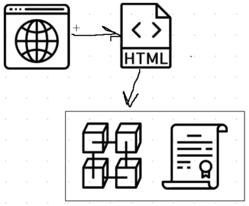
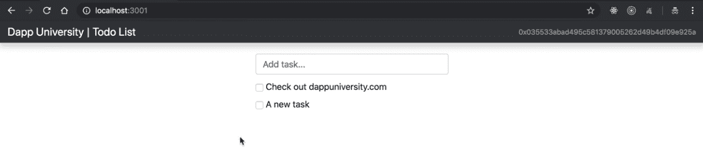
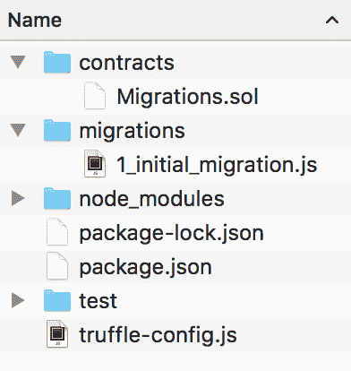
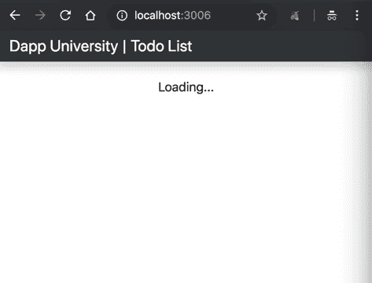
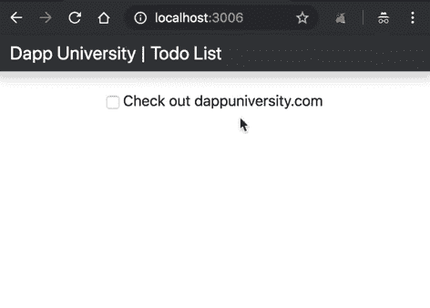

# 如何搭建区块链 App -以太坊待办事项 2019

> 原文：<https://www.dappuniversity.com/articles/blockchain-app-tutorial>

作者格雷戈里·麦卡宾2022 年 12 月 1 日

大家好，我是来自 [Dapp 大学的](https://www.youtube.com/c/DappUniversity)[Gregory](https://www.twitter.com/DappUniversity)！

今天我将向您展示如何构建您的第一个区块链应用程序！让我们创建一个由以太坊智能合约支持的待办事项列表。首先，我们将使用 Solidity 编程语言创建一个智能契约。然后，我们将针对智能合约编写测试，并将其部署到区块链。最后，我们将为 todo 列表创建一个客户端应用程序。

[https://www.youtube.com/embed/rzvk2kdjr2I](https://www.youtube.com/embed/rzvk2kdjr2I)

[*JOIN MY FREE TRAINING!*](/bootcamp) *

你可以在上面 90 分钟的视频中看到我构建完整的区块链应用程序。在本教程中，我还将逐步指导您。在我们开始构建 dApp 之前，让我先解释一下区块链应用程序是如何工作的。如果你渴望开始编程，你可以[跳到教程](#dependencies)的下一部分。😀

## 目录

*   介绍

*   [区块链应用是如何工作的？](#how)
*   [安装依赖关系](#dependencies)

*   教程步骤

1.  [项目设置](#projectSetup)
2.  [列出任务](#listTasks)
3.  [创建任务](#createTasks)
4.  [完成任务](#completeTasks)

### 区块链应用是如何工作的？

我为本教程选择了一个 todo list 应用程序，因为它是学习任何新编程语言的最常见方法之一。它将教会我们如何从区块链中读取和写入数据，以及执行控制我们的待办事项列表应用程序行为的业务逻辑。它将教你关于区块链如何工作以及如何写以太坊智能合约的基础知识。

为了理解区块链应用程序是如何工作的，让我们首先来看看待办事项列表作为 web 应用程序是如何工作的。要访问待办事项列表，您可以使用通过互联网与 web 服务器通信的 web 浏览器。服务器包含待办事项列表的所有代码和数据。


以下是您可以在服务器上找到的内容列表:

*   HTML、CSS 和 JavaScript 格式的客户端文件
*   负责应用程序业务逻辑的后端代码
*   存储待办事项列表中的任务的数据库

该服务器是一个集中的实体，完全控制应用程序的各个方面。对服务器拥有完全访问权限的任何人都可以随时更改代码或数据的任何部分。区块链应用程序的工作方式完全不同。待办事项列表中的所有代码和数据都不在中央服务器上。相反，它分布在整个区块链。所有的代码和数据都是共享的，在区块链上是不可更改的。

为了说明这一点，让我们来看看基于区块链的待办事项列表是如何工作的。



为了访问区块链的待办事项列表，我们将使用 web 浏览器与客户端应用程序进行对话，该应用程序将使用 HTML、CSS 和 JavaScript 编写。客户端应用程序将直接与区块链对话，而不是与后端 web 服务器对话。

##### 什么是区块链？

区块链是计算机或节点的对等网络，它们可以相互通信。这是一个分布式网络，所有参与者共同承担运行网络的责任。每个网络参与者都在区块链上保留一份代码和数据的副本。所有这些数据都包含在称为“块”的记录包中，这些记录“链接”在一起构成了区块链。网络上的所有节点都确保这些数据是安全且不可更改的，这与代码和数据可以随时更改的集中式应用程序不同。这就是区块链如此强大的原因！因为区块链负责存储数据，所以它从根本上来说是一个数据库。因为这是一个相互交流的计算机网络，所以这是一个网络。你可以把它想象成一个集网络和数据库于一体的系统。

我还应该强调传统 web 应用程序和区块链应用程序之间的另一个基本区别:你不是应用程序本身的用户，而是 blockhain 网络的用户。该应用程序不管理任何用户数据。那是区块链的责任！

##### 什么是智能合同

区块链上的所有代码都包含在智能合约中，智能合约是在区块链上运行的程序。它们是区块链应用程序的构造块。在本教程中，我们将编写一个智能契约来增强我们的待办事项列表。它将负责从区块链获取我们的待办事项列表中的所有任务，添加新任务，以及完成任务。

智能合约是用一种叫做 Solidity 的编程语言编写的，这种语言看起来很像 JavaScript。智能合约中的所有代码都是不可变的。一旦我们将智能合约部署到区块链，我们将无法更改或更新任何代码。这是一个确保代码不可信且安全的设计特性。我经常把智能合约比作 web 上的微服务。它们充当从区块链读取和写入数据的接口，并执行业务逻辑。它们是公开可访问的，这意味着任何访问 blockchian 的人都可以访问它们的接口。

##### 区块链待办事项列表如何工作

让我们回顾一下，以理解我们将在本教程中构建的应用程序是如何工作的。我们将为待办事项列表创建一个客户端应用程序，它将直接与区块链对话。在本教程中，我们将使用以太坊区块链，我们可以通过将客户端应用程序连接到单个以太坊节点来访问它。我们将在 Solidity 中编写一个智能契约来为待办事项列表提供功能，并将它部署到以太坊区块链。我们还将使用以太坊钱包通过我们的个人帐户连接到区块链网络，以便与待办事项应用程序进行交互。

##### 应用程序预览

这是我们将在本教程中构建的 todo list 应用程序的预览。我们将能够在待办事项列表中列出所有的任务，创建新的任务，并完成它们。



### 安装依赖项

现在让我们安装构建项目所需的所有依赖项。首先，我们将建立一个区块链人来本地开发应用程序。

##### Ganache 个人区块链

这种依赖性是一种个人区块链，是一种本地开发区块链，可用于模仿公共区块链的行为。我推荐使用 [Ganache](http://truffleframework.com/ganache) 作为你以太坊开发的个人区块链。它将允许您部署智能合约、开发应用程序和运行测试。它可以作为桌面应用程序和命令行工具在 Windows、Mac 和 Linux 上使用！


在本教程中，我将指导您设置桌面应用程序。你可以在这里找到你的操作系统的最新版本。一旦下载了存档的包，解压安装程序并运行安装步骤。安装完成后，无论何时打开它，您都会看到以下屏幕:


耶！🎉现在你有一个个人区块链网络运行！您可以看到运行 Ganache 的服务器的一些详细信息，以及连接到网络的帐户列表。每个账户都被记入 100 英镑。这是一个巨大的时间节省！如果你打算从头开始创建你自己的个人区块链网络，或者在一个测试网络上开发你的应用程序，你将不得不手动创建所有 10 个帐户，并向每个帐户存入乙醚。谢天谢地，Ganache 已经为我们做了这件事，所以我们不必担心它。

##### 节点。射流研究…

既然您已经运行了私有区块链，那么您需要配置您的环境来开发智能合约。您需要的第一个依赖项是 Node.js 附带的[节点包管理器](https://nodejs.org/en/)或 NPM。您可以查看是否已经安装了 Node，方法是在终端上键入:

```js
$ node -v
```

如果你还没有安装 node，你可以访问 [Node.js 网站](https://nodejs.org/en/)下载。

##### 块菌框架

现在让我们安装 [Truffle 框架](http://truffleframework.com/)，它提供了一套用 Solidity 编程语言开发以太坊智能联系人的工具。


以下是我们将从 Truffle 框架中获得的所有功能的概述:

*   智能合同管理 -用 Solidity 编程语言编写智能合同，并将它们编译成运行在以太坊虚拟机(EVM)上的字节码。
*   自动化测试(Automated Testing)——针对你的智能合约编写测试，以确保它们按照你想要的方式运行。这些测试可以用 JavaScript 或 Solidity 编写，可以在 Truffle 配置的任何网络上运行，包括公共区块链网络。
*   **部署&迁移** -编写脚本将智能合约迁移和部署到任何公共以太坊区块链网络。
*   **网络管理** -连接到任何公共以太坊区块链网络，以及任何你可能用于开发目的的个人区块链网络。
*   **开发控制台**——使用 Truffle 控制台在 JavaScript 运行时环境中与智能合约进行交互。为此，您可以连接到您在网络配置中指定的任何区块链网络。
*   用 JavaScript 编写可以在区块链公共网络上运行的定制脚本。您可以在这个文件中编写任意代码，并在项目中运行它。
*   **客户端开发**——配置您的 truffle 项目来托管客户端应用程序，这些应用程序与部署到区块链的智能合约进行对话。

你可以像这样在命令行中安装带有 NPM 的松露。注意:为了跟随本教程，使用下面指定的松露的精确版本是很重要的。

```js
$ npm install -g [[email protected]](/cdn-cgi/l/email-protection)
```

##### Metamask 以太坊钱包

现在是时候把你的网络浏览器变成区块链浏览器了。大多数主要的网络浏览器目前都没有连接到区块链网络，所以我们必须安装一个浏览器扩展来允许他们这样做。


我将为谷歌浏览器扩展[元掩码。要安装 Metamask，](https://chrome.google.com/webstore/detail/metamask/nkbihfbeogaeaoehlefnkodbefgpgknn?hl=en)[请访问此链接](https://chrome.google.com/webstore/detail/metamask/nkbihfbeogaeaoehlefnkodbefgpgknn?hl=en)或在谷歌 Chrome 网络商店搜索 Metamask Chrome 插件。一旦你安装了它，确保它在你的扩展列表中被选中。安装 Chrome 浏览器后，你会在浏览器的右上角看到狐狸图标。如果遇到困难，请参考视频演示！

Metamask 还允许我们在连接到区块链时管理我们的个人账户，以及管理我们需要支付交易的以太网资金。

## 项目设置

这部分教程的视频片段从 [9:26](https://www.youtube.com/watch?v=rzvk2kdjr2I&feature=youtu.be&t=9m26s) 开始。

现在让我们创建项目！我将首先创建一个项目目录，并像这样输入:

```js
$ mkdir eth-todo-list
$ cd eth-todo-list

```

现在我们初始化一个新的 truffle 项目来开发我们的项目，如下所示:

```js
$ truffle init
```

太好了！您的终端输出应该显示项目已经成功创建。您可以打开文本编辑器，看到在运行该命令后创建了一些新的文件和目录。现在让我们创建一个`package.json`文件来安装项目所需的一些开发依赖项。您可以从命令行这样做:

```js
$ touch package.json
```

您可以通过简单地将下面的代码复制并粘贴到您的`package.json`文件中来引导您项目的所有依赖项:

```js
{
  "name": "eth-todo-list",
  "version": "1.0.0",
  "description": "Blockchain Todo List Powered By Ethereum",
  "main": "truffle-config.js",
  "directories": {
    "test": "test"
  },
  "scripts": {
    "dev": "lite-server",
    "test": "echo \"Error: no test specified\" && sexit 1"
  },
  "author": "[[email protected]](/cdn-cgi/l/email-protection)",
  "license": "ISC",
  "devDependencies": {
    "bootstrap": "4.1.3",
    "chai": "^4.1.2",
    "chai-as-promised": "^7.1.1",
    "chai-bignumber": "^2.0.2",
    "lite-server": "^2.3.0",
    "nodemon": "^1.17.3",
    "truffle": "5.0.2",
    "truffle-contract": "3.0.6"
  }
} 
```

现在，您可以从命令行安装依赖项，如下所示:

```js
$ npm install
```

现在已经安装了依赖项，让我们检查一下我们刚刚创建的项目目录结构:



*   **合同目录:**这是所有智能联系人所在的位置。我们已经有了一份移民合同，处理我们到区块链的移民事宜。
*   **迁移目录**:这是所有迁移文件所在的地方。这些迁移类似于其他需要迁移来改变数据库状态的 web 开发框架。每当我们在区块链部署智能合约时，我们都在更新区块链的状态，因此需要迁移。
*   **node_modules 目录:**这是我们刚刚安装的所有节点依赖项的主目录。
*   测试目录:这是我们为智能合约编写测试的地方。
*   **truffle-config.js 文件:**这是我们的 truffle 项目的主配置文件，我们将在其中处理网络配置之类的事情。

现在让我们开始开发管理待办事项列表的智能契约。我们可以这样做，在`contracts`目录中创建一个新文件，如下所示:

```js
$ touch ./contracts/TodoList.sol
```

在这里，让我们开发我们的待办事项列表智能契约。首先，我们将这样指定版本:

```js
pragma solidity ^0.5.0;
```

现在我们可以这样声明智能合约:

```js
pragma solidity ^0.5.0;

contract TodoList {
    // Code goes here...
} 
```

我们创建一个名为`TodoList`的智能契约，后跟花括号。我们将在其中添加智能合约的所有代码。我们要做的事情就是记录待办事项列表中的任务数量。这将允许我们编写一些简单的代码，帮助我们确保项目设置正确，并且我们的代码在区块链上工作。我们将简单地创建一个名为`taskCount`的状态变量来跟踪任务的数量，如下所示:

```js
pragma solidity ^0.5.0;

contract TodoList {
  uint taskCount;
} 
```

这里的`taskCount`是一种特殊的变量，称为“状态变量”。我们存储在这个状态变量中的任何数据都被写入区块链上的存储器。它更改智能协定的状态，并在整个智能协定内具有作用域，这与仅在函数内具有作用域的局部变量相反。我们可以这样设置这个状态变量的默认值`0`:

```js
pragma solidity ^0.5.0;

contract TodoList {
  uint taskCount = 0;
} 
```

现在，我们可以创建一种方法在契约之外访问这个状态变量的值。我们可以在 Solidity 中使用一个名为`public`的特殊修饰关键字来实现这一点。当我们这样做时，Solidity 将神奇地创建一个`taskCount()`函数，这样我们就可以在智能契约之外访问这个变量的值。当我们在控制台、客户端应用程序和测试文件中与智能合约交互时，这将非常有用。

现在，让我们编译智能合约并确保没有错误:

```js
$ truffle compile
```

耶！🎉你刚刚写了你的第一份以太坊智能合约。您应该注意到，每当您在以下路径编译智能合约时，都会生成一个新文件:``./build/contracts/TodoList.json``。这个文件是智能合同 ABI 文件，代表“抽象二进制接口”。该文件有许多职责，但我将在此强调两项:

*   它包含可在以太坊虚拟机(EVM)即以太坊节点上运行的 Solidity 智能合约代码的已编译字节码版本。
*   它包含智能契约函数的 JSON 表示，可以向外部客户端公开，如客户端 JavaScript 应用程序。

我们的下一个目标是访问 Truffle 控制台中的智能合约。然而，我们不能运行 Truffle 控制台，因为我们的应用程序还没有连接到我们在 [dependencies](#dependencies) 部分设置的 Ganache 个人区块链网络。要在 Truffle 控制台内与个人区块链网络上的智能合约对话，我们必须做几件事:

*   更新我们项目的配置文件，指定我们想要连接的个人区块链网络(Ganache)。
*   创建一个迁移脚本，告诉 Truffle 如何将智能合同部署到个人区块链网络。
*   运行新创建的迁移脚本，将智能合同部署到个人区块链网络。

首先，我们将更新项目配置文件，以指定我们希望在第一部分中设置的个人区块链网络。找到文件`truffle-config.js`并粘贴以下代码:

```js
module.exports = {
  networks: {
    development: {
      host: "127.0.0.1",
      port: 7545,
      network_id: "*" // Match any network id
    }
  },
  solc: {
    optimizer: {
      enabled: true,
      runs: 200
    }
  }
} 
```

注意:这些应该与 Ganache 个人区块链网络提供的默认设置相匹配。如果您在 Ganache 设置页面中更改了任何设置，比如端口，这些应该会反映在这里。

接下来，我们将在迁移目录中创建一个迁移脚本，以将智能合同部署到个人区块链网络。从项目根目录中，通过命令行创建一个新文件，如下所示:

```js
$ touch migrations/2_deploy_contracts.js
```

让我解释一下这个文件的作用。每当我们创建新的智能合同时，我们都在更新区块链的状态。记住，我说过区块链基本上是一个数据库。因此，无论何时我们永久地改变它，我们必须将它从一种状态迁移到另一种状态。这与您可能在其他 web 应用程序开发框架中执行的数据库迁移非常相似。

请注意，我们用数字给迁移目录中的所有文件编号，以便 Truffle 知道以什么顺序执行它们。在这个新创建的迁移文件中，您可以使用以下代码来部署智能合约:

```js
var TodoList = artifacts.require("./TodoList.sol");

module.exports = function(deployer) {
  deployer.deploy(TodoList);
}; 
```

首先，我们需要我们已经创建的契约，并将它赋给一个名为“TodoList”的变量。接下来，我们将它添加到已部署契约的清单中，以确保它在我们运行迁移时得到部署。现在，让我们从命令行运行这个迁移脚本，如下所示:

```js
$ truffle migrate
```

现在，我们已经成功地将智能合同迁移到个人区块链网络，让我们打开控制台与智能合同进行交互。您可以从命令行打开 truffle 控制台，如下所示:

```js
$ truffle console
```

现在我们已经进入控制台，让我们获取一个已部署的智能契约的实例，看看我们是否可以从契约中读取`taskCount`。从控制台中，运行以下代码:

```js
todoList = await TodoList.deployed()
```

这里的`TodoList`是我们在迁移文件中创建的变量的名称。我们用`deployed()`函数检索了一个已部署的契约实例，并将其分配给一个`todoList`。另外，请注意`await`关键字的使用。我们必须以异步方式与区块链交互。因此，JavaScript 是客户端与区块链智能合约交互的绝佳选择。JavaScript 中有几种处理异步动作的策略。最流行的方式之一是我在这里选择的`async/await`模式。Truffle 最近在 Truffle 控制台中发布了对此的支持。你可以在这里阅读更多关于[异步/等待模式的信息](https://javascript.info/async-await)。

首先，我们可以获得部署到区块链的智能合约的地址，如下所示:

```js
todoList.address
// => '0xABC123...' 

```

现在我们可以像这样从存储器中读取`taskCount`的值:

```js
takCount = await app.taskCount()
// => 0 

```

耶！🎉您已经成功完成了本教程的第一部分。您已经完成了以下所有操作:

*   为区块链开发设置您的机器
*   创建了一个新的松露项目
*   创建您的第一个智能合同
*   在实时区块链上与您新创建的智能合同进行交互

如果您在任何一个步骤上遇到困难，可以从 [github](https://github.com/dappuniversity/eth-todo-list) 中克隆这个部分的项目代码。您也可以从这里开始参考本节的视频教程。

## 列出任务

这部分教程的视频片段从 [22:47](https://www.youtube.com/watch?v=rzvk2kdjr2I&feature=youtu.be&t=22m47s) 开始。

现在让我们开始在待办事项列表中列出任务。以下是我们将在本部分完成的所有步骤:

1.  编写代码以在智能合约中列出任务
2.  在 Truffle 控制台中列出智能合约中的任务
3.  在客户端应用程序中列出任务
4.  编写列出任务的测试

为了列出智能合约中的任务，我们需要一种在 solidity 中建模任务的方法。Solidity 允许你用[结构](https://solidity.readthedocs.io/en/v0.5.3/types.html#structs)定义自己的数据类型。利用这个强大的特性，我们可以对任意数据进行建模。我们将使用一个结构来为我们的 todo 列表建模任务，如下所示:

```js
pragma solidity ^0.5.0;

contract TodoList {
  uint public taskCount = 0;

  struct Task {
    uint id;
    string content;
    bool completed;
  }
} 
```

首先，我们用关键字`struct`为任务建模，后跟新结构的名称`Task`。注意，这并不代表一个`Task`的实例，而只是一个`Task`结构的定义。花括号中包含的行定义了`Task`结构的属性:

*   `uint id` -这是结构的唯一标识符。它将有一个`id`，就像传统的数据库记录一样。注意，我们将标识符的数据类型声明为`uint`，它代表“无符号整数”。这仅仅意味着它是一个非负整数。它前面没有“符号”，即一个`-`或`+`符号，暗示它总是正的。
*   `string content` -这是 todo 列表中任务的文本，包含在一个字符串中。
*   `bool completed` -这是待办事项列表的复选框状态，即`true/false`。如果是`true`，任务将被“完成”或从待办事项列表中勾掉。

既然我们已经建模了一个任务，我们需要一个地方来将所有的任务放在 todo 列表中！我们希望将它们存储在区块链上，这样智能合约的状态将是持久的。我们可以用一个状态变量来访问区块链的存储器，就像我们用`taskCount`做的那样。我们将创建一个`tasks`状态变量。它将使用一种特殊的实体数据结构，称为映射，如下所示:

```js
pragma solidity ^0.5.0;

contract TodoList {
  uint public taskCount = 0;

  struct Task {
    uint id;
    string content;
    bool completed;
  }

  mapping(uint => Task) public tasks;
} 
```

Solidity 中的映射很像其他编程语言中的关联数组或散列。它创建存储在区块链上的键值对。我们将使用唯一的 id 作为密钥。价值将是任务本身。这将允许我们通过`id`查找任何任务！

现在让我们创建一个用于创建任务的函数。这将允许我们在默认情况下向 todo 列表添加新任务，以便我们可以在控制台中列出它们。

```js
pragma solidity ^0.5.0;

contract TodoList {
  uint public taskCount = 0;

  struct Task {
    uint id;
    string content;
    bool completed;
  }

  mapping(uint => Task) public tasks;

  function createTask(string memory _content) public {
    taskCount ++;
    tasks[taskCount] = Task(taskCount, _content, false);
  }

} 
```

我将解释这个函数:

*   首先，我们用关键字`function`创建函数，并给它命名为`createTask()`
*   我们允许函数接受一个名为`_content`的参数，这将是任务的文本。我们指定这个参数将是`string`数据类型，并且它将在`memory`中保持不变
*   我们将函数 visibility 设置为`public`,这样就可以在智能合约之外调用它，比如在控制台中，或者从客户端调用
*   在函数内部，我们为新任务创建了一个`id`。我们简单地将现有的`taskCount`加 1。
*   现在我们通过调用`Task(taskCount, _content, false);`并传入新任务的值来创建一个新的任务结构。
*   接下来，我们通过将这个新任务添加到`tasks`映射来存储在区块链上，如下所示:`task[taskCount] = ...`。

现在，每当智能合约部署到区块链时，我们都希望向 todo 列表添加一个任务，这样它将拥有一个默认任务，我们可以在控制台中检查它。我们可以通过调用智能契约的构造函数中的`createTask()`函数来实现这一点，如下所示:

```js
 contract TodoList {
      // ....

      constructor() public {
        createTask("Check out dappuniversity.com");
      }

      // ....

    } 
```

正如你在上面看到的，我们用关键字`constructor`创建了构造函数。每当契约被初始化，即被部署到区块链时，该函数将仅运行一次。在这个函数中，我们创建了一个新的默认任务，其字符串内容为[“Check out DAP university . com”](/free-download)。

现在，让我们将这个智能合同部署到区块链。为了做到这一点，我们必须部署代码的新副本*。记住，智能合约代码是不可变的！它不能改变。因此，每当我们更改代码时，都必须创建一个新的智能契约。幸运的是，Truffle 提供了一条捷径来帮助解决这个问题。我们可以像这样重新运行迁移:*

```js
$ truffle migrate --reset
```

维奥拉。现在我们有了区块链智能合约的新副本。现在让我们列出控制台中的任务。

```js
$ truffle console
```

在控制台中，让我们获得新智能合约的已部署副本。

```js
todoList = await TodoList.deployed()
```

现在我们可以通过调用`tasks()`函数从 todo 列表中获取任务。这将允许我们通过`id`访问来自`tasks`映射的值。当我们调用这个函数时，我们将简单地传入列表中第一个任务的`id`:

```js
task = await todoList.tasks(1)
```

耶！🎉如何在控制台中检查该任务的值。😃

既然我们已经将这个智能合约迁移到了区块链，那么让我们创建客户端代码来与待办事项列表智能合约进行交互。您需要为您的项目创建以下文件:

*   `bs-config.json`
*   `src/index.html`
*   `src/app.js`

我们将逐一填充所有这些文件的代码。我们使用 [lite-server](https://github.com/johnpapa/lite-server) 为客户端提供所有的项目文件。我们需要告诉 lite-server 所有这些文件的位置。我们可以通过在`bs-config.json`文件中更新 lite-server 的 browsersync 配置来做到这一点。将此配置粘贴到项目文件中:

```js
{
  "server": {
    "baseDir": [
      "./src",
      "./build/contracts"
    ],
    "routes": {
      "/vendor": "./node_modules"
    }
  }
}
```

这个配置告诉 lite-server 将`src`和`build/contracts`目录中的所有文件暴露给 web 服务器的根目录。它还为出现在`vendor`路径中的`node_modules`目录中的任何文件添加了一个别名。这将允许我们通过`vendor`路径将任何项目依赖关系(如 [bootstrap](https://getbootstrap.com/) )拉入客户端，我们稍后会看到。

现在让我们为待办事项列表填充 HTML 代码。本教程主要关注区块链技术，所以我不想在 HTML 和 CSS 部分花太多时间。我将简单地在这里粘贴 HTML 代码:

```js
<!DOCTYPE html>
<html lang="en">
  <head>
    <meta charset="utf-8">
    <meta http-equiv="X-UA-Compatible" content="IE=edge">
    <meta name="viewport" content="width=device-width, initial-scale=1">
    <!-- The above 3 meta tags *must* come first in the head; any other head content must come *after* these tags -->
    <title>Dapp University | Todo List</title>

    <!-- Bootstrap -->
    <link href="vendor/bootstrap/dist/css/bootstrap.min.css" rel="stylesheet">

    <!-- HTML5 shim and Respond.js for IE8 support of HTML5 elements and media queries -->
    <!-- WARNING: Respond.js doesn't work if you view the page via file:// -->
    <!--[if lt IE 9]>
      <script src="https://oss.maxcdn.com/html5shiv/3.7.3/html5shiv.min.js"></script>
      <script src="https://oss.maxcdn.com/respond/1.4.2/respond.min.js"></script>
    <![endif]-->

    <style>
      main {
        margin-top: 60px;
      }

      #content {
        display: none;
      }

      form {
        width: 350px;
        margin-bottom: 10px;
      }

      ul {
        margin-bottom: 0px;
      }

      #completedTaskList .content {
        color: grey;
        text-decoration: line-through;
      }
    </style>
  </head>
  <body>
    <nav class="navbar navbar-dark fixed-top bg-dark flex-md-nowrap p-0 shadow">
      <a class="navbar-brand col-sm-3 col-md-2 mr-0" href="http://www.dappuniversity.com/free-download" target="_blank">Dapp University | Todo List</a>
      <ul class="navbar-nav px-3">
        <li class="nav-item text-nowrap d-none d-sm-none d-sm-block">
          <small><a class="nav-link" href="#"><span id="account"></span></a></small>
        </li>
      </ul>
    </nav>
    <div class="container-fluid">
      <div class="row">
        <main role="main" class="col-lg-12 d-flex justify-content-center">
          <div id="loader" class="text-center">
            <p class="text-center">Loading...</p>
          </div>
          <div id="content">
         <!-- <form onSubmit="App.createTask(); return false;">
              <input id="newTask" type="text" class="form-control" placeholder="Add task..." required>
              <input type="submit" hidden="">
            </form> -->
            <ul id="taskList" class="list-unstyled">
              <div class="taskTemplate" class="checkbox" style="display: none">
                <label>
                  <input type="checkbox" />
                  <span class="content">Task content goes here...</span>
                </label>
              </div>
            </ul>
            <ul id="completedTaskList" class="list-unstyled">
            </ul>
          </div>
        </main>
      </div>
    </div>

    <!-- jQuery (necessary for Bootstrap's JavaScript plugins) -->
    <script src="https://ajax.googleapis.com/ajax/libs/jquery/1.12.4/jquery.min.js"></script>
    <!-- Include all compiled plugins (below), or include individual files as needed -->
    <script src="vendor/bootstrap/dist/js/bootstrap.min.js"></script>
    <script src="vendor/truffle-contract/dist/truffle-contract.js"></script>
    <script src="app.js"></script>
  </body>
</html>
```

这个文件搭建了项目所需的所有 HTML。我已经注释掉了表单代码，我们将在后面的部分启用它。该文件引入了项目的所有依赖项，如引导模板框架，它将允许我们创建好看的 UI 元素，而不必编写太多的 CSS。它还使用了 Truffle Conract 库，允许我们用 JavaScript 与 todo list 智能契约进行交互。

现在让我们填写这一部分的 JavaScript 代码。我们将向新创建的`app.js`文件添加代码，如下所示:

```js
App = {
  loading: false,
  contracts: {},

  load: async () => {
    await App.loadWeb3()
    await App.loadAccount()
    await App.loadContract()
    await App.render()
  },

  // https://medium.com/metamask/https-medium-com-metamask-breaking-change-injecting-web3-7722797916a8
  loadWeb3: async () => {
    if (typeof web3 !== 'undefined') {
      App.web3Provider = web3.currentProvider
      web3 = new Web3(web3.currentProvider)
    } else {
      window.alert("Please connect to Metamask.")
    }
    // Modern dapp browsers...
    if (window.ethereum) {
      window.web3 = new Web3(ethereum)
      try {
        // Request account access if needed
        await ethereum.enable()
        // Acccounts now exposed
        web3.eth.sendTransaction({/* ... */})
      } catch (error) {
        // User denied account access...
      }
    }
    // Legacy dapp browsers...
    else if (window.web3) {
      App.web3Provider = web3.currentProvider
      window.web3 = new Web3(web3.currentProvider)
      // Acccounts always exposed
      web3.eth.sendTransaction({/* ... */})
    }
    // Non-dapp browsers...
    else {
      console.log('Non-Ethereum browser detected. You should consider trying MetaMask!')
    }
  },

  loadAccount: async () => {
    // Set the current blockchain account
    App.account = web3.eth.accounts[0]
  },

  loadContract: async () => {
    // Create a JavaScript version of the smart contract
    const todoList = await $.getJSON('TodoList.json')
    App.contracts.TodoList = TruffleContract(todoList)
    App.contracts.TodoList.setProvider(App.web3Provider)

    // Hydrate the smart contract with values from the blockchain
    App.todoList = await App.contracts.TodoList.deployed()
  },

  render: async () => {
    // Prevent double render
    if (App.loading) {
      return
    }

    // Update app loading state
    App.setLoading(true)

    // Render Account
    $('#account').html(App.account)

    // Render Tasks
    await App.renderTasks()

    // Update loading state
    App.setLoading(false)
  },

  renderTasks: async () => {
    // Load the total task count from the blockchain
    const taskCount = await App.todoList.taskCount()
    const $taskTemplate = $('.taskTemplate')

    // Render out each task with a new task template
    for (var i = 1; i <= taskCount; i++) {
      // Fetch the task data from the blockchain
      const task = await App.todoList.tasks(i)
      const taskId = task[0].toNumber()
      const taskContent = task[1]
      const taskCompleted = task[2]

      // Create the html for the task
      const $newTaskTemplate = $taskTemplate.clone()
      $newTaskTemplate.find('.content').html(taskContent)
      $newTaskTemplate.find('input')
                      .prop('name', taskId)
                      .prop('checked', taskCompleted)
                      // .on('click', App.toggleCompleted)

      // Put the task in the correct list
      if (taskCompleted) {
        $('#completedTaskList').append($newTaskTemplate)
      } else {
        $('#taskList').append($newTaskTemplate)
      }

      // Show the task
      $newTaskTemplate.show()
    }
  },

  setLoading: (boolean) => {
    App.loading = boolean
    const loader = $('#loader')
    const content = $('#content')
    if (boolean) {
      loader.show()
      content.hide()
    } else {
      loader.hide()
      content.show()
    }
  }
}

$(() => {
  $(window).load(() => {
    App.load()
  })
})
```

我来解释一下这段代码。我们已经创建了一个新的`App`对象，它包含了运行 JavaScript 应用程序所需的所有函数。我将在这里解释重要的功能。完整的解释，[看我在 40:25](https://youtu.be/rzvk2kdjr2I?t=40m25s) 解释视频中的 JavaScript 代码。还要注意，我已经注释掉了几行代码，我们将在后面的小节中启用它们。

*   web3.js 是一个 JavaScript 库，允许我们的客户端应用程序与区块链对话。我们在这里配置 web3。这是元掩码指定的默认 web3 配置。如果你不完全明白这里发生了什么，不要担心。这是 Metamask 建议的复制粘贴实现。
*   这是我们从区块链加载智能合约数据的地方。我们用 Truffle 契约库创建了智能契约的 JavaScript 表示。然后，我们用 web3 加载智能合同数据。这将允许我们在待办事项列表中列出任务。
*   这是我们在待办事项列表中实际列出任务的地方。请注意，我们创建了一个 for 循环来单独访问每个任务。这是因为我们无法从智能合约中获取整个任务映射。我们必须首先确定`taskCount`并逐个获取每个任务。

现在让我们启动 web 服务器，并确保项目将在浏览器中加载。

```js
$ npm run dev
```

耶！🎉您已经成功加载了客户端应用程序。😃请注意，您的应用程序显示“正在加载...”。那是因为我们还没有登录到区块链！为了连接到区块链，我们需要将其中一个帐户从 Ganache 导入 Metamask。你可以[在 43:55](https://youtu.be/rzvk2kdjr2I?t=43m55s) 看我在视频里设置 Metamask。



一旦您与 Metamask 建立了连接，您应该会看到所有的合同和帐户数据都已加载。



💥嘣！这是你的待办事项列表！😃

#### 测试

现在，让我们编写一个基本测试来确保待办事项列表智能契约正常工作。首先，让我解释一下为什么在开发智能合同时测试如此重要。我们希望确保合同没有 bug，原因如下:

1.  以太坊区块链上的所有代码都是不可变的；它不能改变。如果合同包含任何错误，我们必须禁用它并部署一个新的副本。这个新副本与旧合同的状态不同，地址也不同。
2.  部署契约需要耗费大量资源，因为它会创建一个事务并将数据写入区块链。这需要消耗乙醚，而我们希望尽可能减少乙醚的用量。
3.  如果写入区块链的任何契约函数包含错误，调用该函数的帐户可能会浪费资源，并且它可能不会按照预期的方式运行。

让我们创建一个这样的测试文件:

```js
$ test/TodoList.test.js
```

我们将在这个文件中用 Javascript 编写所有的测试，用[Mocha 测试框架](https://mochajs.org/)和[Chai 断言库](http://www.chaijs.com/)。这些都与 Truffle 框架捆绑在一起。我们将使用 Javascript 编写所有这些测试来模拟客户端与智能合约的交互，就像我们在控制台中所做的一样。以下是测试的所有代码:

```js
const TodoList = artifacts.require('./TodoList.sol')

contract('TodoList', (accounts) => {
  before(async () => {
    this.todoList = await TodoList.deployed()
  })

  it('deploys successfully', async () => {
    const address = await this.todoList.address
    assert.notEqual(address, 0x0)
    assert.notEqual(address, '')
    assert.notEqual(address, null)
    assert.notEqual(address, undefined)
  })

  it('lists tasks', async () => {
    const taskCount = await this.todoList.taskCount()
    const task = await this.todoList.tasks(taskCount)
    assert.equal(task.id.toNumber(), taskCount.toNumber())
    assert.equal(task.content, 'Check out dappuniversity.com')
    assert.equal(task.completed, false)
    assert.equal(taskCount.toNumber(), 1)
  })
})
```

我来解释一下这段代码。首先，我们需要要求契约并将其赋给一个变量，就像我们在迁移文件中所做的那样。接下来，我们调用“契约”函数，并在回调函数中编写我们所有的测试。这个回调函数提供了一个“accounts”变量，代表我们的区块链上的所有帐户，由 Ganache 提供。

第一个测试通过检查地址来检查契约是否被正确地部署到区块链。

下一个测试通过检查我们在初始化函数中创建的默认任务来检查智能契约是否正确列出了任务。

现在让我们从命令行运行测试，如下所示:

```js
$ truffle test
```

耶，他们通过了！🎉如果你被卡住了，你可以在我写这些测试的视频中跟我一起做进一步的解释。

## 创建任务

这部分教程的视频片段从 [1:05:07](https://www.youtube.com/watch?v=rzvk2kdjr2I&feature=youtu.be&t=1h05m07s) 开始。

我们已经创建了一个创建任务的函数，但是它还没有完成。这是因为我想在创建新任务时触发一个事件。可靠性允许我们触发外部消费者可以订阅的任意事件。它将允许我们在客户端应用程序等中监听这些事件...让我们创建一个`TaskCreated()`事件，并在`createTask()`函数中创建新任务时触发它，如下所示:

```js
pragma solidity ^0.5.0;

contract TodoList {

  // ...

  event TaskCreated(
    uint id,
    string content,
    bool completed
  );

  // ...

  function createTask(string memory _content) public {
    taskCount ++;
    tasks[taskCount] = Task(taskCount, _content, false);
    emit TaskCreated(taskCount, _content, false);
  }

}
```

现在，让我们创建一个测试，以确保每当创建新任务时都会触发该事件。创建新任务时，我们将检查交易收据。这将包含所有包含事件数据的日志信息。我们可以像这样在测试中检查这些数据，以确保事件被正确触发:

```js
it('creates tasks', async () => {
  const result = await this.todoList.createTask('A new task')
  const taskCount = await this.todoList.taskCount()
  assert.equal(taskCount, 2)
  const event = result.logs[0].args
  assert.equal(event.id.toNumber(), 2)
  assert.equal(event.content, 'A new task')
  assert.equal(event.completed, false)
})
```

现在让我们运行测试:

```js
$ truffle test
```

耶，他们通过了！🎉现在，让我们将智能合约的新副本部署到区块链，因为代码已经更改:

```js
$ truffle migrate --reset
```

现在让我们更新客户端代码。我们将首先取消对`index.html`文件中表单代码的注释:

```js
<form onSubmit="App.createTask(); return false;">
  <input id="newTask" type="text" class="form-control" placeholder="Add task..." required>
  <input type="submit" hidden="">
</form>
```

现在我们将在`app.js`文件中添加一个`createTask()`函数，如下所示:

```js
createTask: async () => {
  App.setLoading(true)
  const content = $('#newTask').val()
  await App.todoList.createTask(content)
  window.location.reload()
},
```

现在，您应该能够从客户端应用程序添加新任务了！注意，表单上没有“提交”按钮。我关闭它是为了简化用户界面。你必须按下键盘上的“回车”键来提交任务。一旦你这样做，你会看到一个元掩码确认弹出。您必须签署此事务才能创建任务。

## 完成任务

本教程这一部分的视频片段从 [1:16:40](https://www.youtube.com/watch?v=rzvk2kdjr2I&feature=youtu.be&t=1h16m40s) 开始。

现在，我们在本教程中要做的最后一件事是“检查”待办事项列表中的任务。一旦我们这样做了，它们就会出现在“已完成”列表中，尽管会被删除。首先，我们将更新智能合同。我们将添加一个`TaskComplted()`事件，并在一个新的`toggleCompleted()`函数中触发它，如下所示:

```js
pragma solidity ^0.5.0;

contract TodoList {

  // ...

  event TaskCompleted(
    uint id,
    bool completed
  );

  // ...

  function toggleCompleted(uint _id) public {
    Task memory _task = tasks[_id];
    _task.completed = !_task.completed;
    tasks[_id] = _task;
    emit TaskCompleted(_id, _task.completed);
  }

}
```

现在我们将编写一个这样的测试:

```js
it('toggles task completion', async () => {
  const result = await this.todoList.toggleCompleted(1)
  const task = await this.todoList.tasks(1)
  assert.equal(task.completed, true)
  const event = result.logs[0].args
  assert.equal(event.id.toNumber(), 1)
  assert.equal(event.completed, true)
})
```

现在让我们运行测试:

```js
$ truffle test
```

耶，它过去了！🎉现在，让我们将智能合约的新副本部署到区块链，因为代码已经更改:

```js
$ truffle migrate --reset
```

现在让我们更新客户端代码。首先，我们将取消对`renderTasks()`函数中事件监听器的注释:

```js
$newTaskTemplate.find('input')
  .prop('name', taskId)
  .prop('checked', taskCompleted)
  .on('click', App.toggleCompleted)
```

现在我们将在`app.js`文件中添加一个`toggleCompleted()`函数，如下所示:

```js
toggleCompleted: async (e) => {
  App.setLoading(true)
  const taskId = e.target.name
  await App.todoList.toggleCompleted(taskId)
  window.location.reload()
},
```

现在，在客户端应用程序中找到一个任务，然后单击复选框。一旦您签署了此事务，它将从待办事项列表中检查任务！

恭喜你！🎉您已经成功构建了一个由以太坊智能合约支持的全栈区块链应用程序！你可以在这里下载本教程的完整源代码[，在这里](https://github.com/dappuniversity/eth-todo-list)观看完整视频[。](https://www.youtube.com/watch?v=rzvk2kdjr2I)

对这个教程满意吗？然后你**需要**到[在这里参加我的免费培训](/bootcamp)，我将向你展示如何构建一个真实世界的区块链应用程序，这样你就可以成为一名高薪的区块链开发者！

*