# 如何用以太坊、Web3.js & Solidity 智能合约搭建区块链 App

> 原文：<https://www.dappuniversity.com/articles/how-to-build-a-blockchain-app>

作者格雷戈里·麦卡宾2022 年 12 月 1 日

大家好，我是来自 [Dapp 大学的](https://www.youtube.com/c/DappUniversity)[Gregory](https://www.twitter.com/DappUniversity)！

我将向您展示如何使用 Ethereum、Web3.js 和 Solidity smart contracts 创建您的第一个区块链应用程序。你不需要了解区块链的任何事情。我从头教你。使用这个包含代码示例和书面说明的分步指南，立即开始您的区块链开发者之旅！

[https://www.youtube.com/embed/VH9Q2lf2mNo](https://www.youtube.com/embed/VH9Q2lf2mNo)

[*JOIN MY FREE TRAINING!*](/bootcamp) *

在上面 3 小时的视频中，我将带您构建一个完整的区块链应用程序。您也可以按照本指南中的逐步说明进行操作。如果你已经知道了基础知识，你可以[跳过这一步，现在就开始编写应用程序！](#part1)

## 目录

*   介绍

*   我们要建造什么？
*   [什么是区块链？](#whatIsABlockchain)
*   什么是智能合同？
*   [区块链 App 是如何工作的？](#howDoesABlockchainAppWork)

*   教程步骤

*   [安装依赖关系](#dependencies)
*   [第 1 部分:项目设置](#part1)
*   [第二部分:销售产品](#part2)
*   [第三部分:购买产品](#part3)
*   [第 4 部分:市场网站设置(前端)](#part4)
*   [第五部分:销售产品(前端)](#part5)
*   [第六部分:购买产品(前端)](#part6)
*   [第七部分:部署项目](#part7)

### 我们要建造什么？

今天，我将通过构建一个由区块链支持的完整应用程序，从头开始教你区块链编程。

我们将创建:

1.  以太坊智能合约与 Solidity 编程语言
2.  我们将用 JavaScript 为智能合约编写测试
3.  我们将智能合同部署到区块链
4.  我们将使用 Web3.js 和 React.js 创建一个客户端网站，以便用户可以与智能合同对话

如果你不懂这些语言，不要担心，我会边学边教！

让我们看看我们将要构建的应用程序:

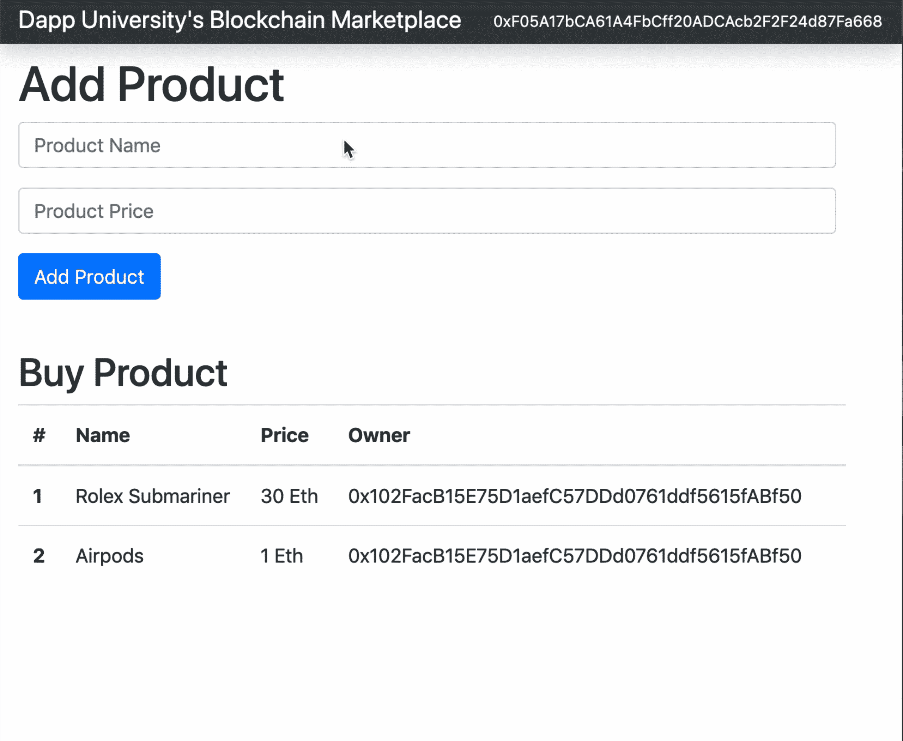

这是一个在区块链上运行的市场，有点像 Craigslist。它允许人们列出待售商品，但与 Craigslist 不同的是，它还允许人们在网站上用加密货币购买商品。

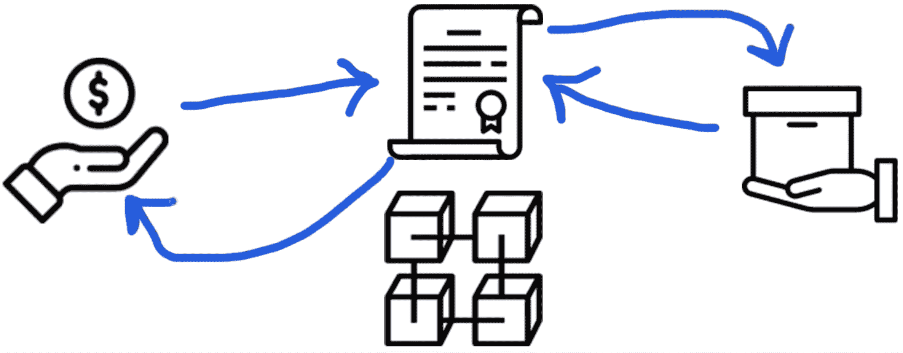

每当有人购买该物品，他们立即成为所有者。这是因为该应用程序由区块链上管理市场的智能合约提供支持。它跟踪谁拥有待售商品，每当有人用加密货币购买商品时，它就会自动转移商品的所有权。它像自动售货机一样工作。

让我把它分解一下，以防有什么混淆。我来回答几个基本问题。

### 什么是区块链？

区块链是一个点对点的节点网络，所有节点都可以相互通信。这些节点本质上是分担类似于 web 服务器的职责的计算机，例如运行程序和存储数据，只要连接到区块链就可以访问这些数据。所有节点一起工作，创建一个任何人都可以连接的公共网络。

你可以从几个方面来思考区块链:

*   一台巨大的世界范围的计算机由协同工作的小型计算机(节点)组成。
*   任何人都可以连接到的网络，用于汇款、运行程序等...
*   一个允许你存储和检索信息的数据库。

区块链承担 web 服务器通常承担的责任:

*   运行应用程序代码
*   托管数据库

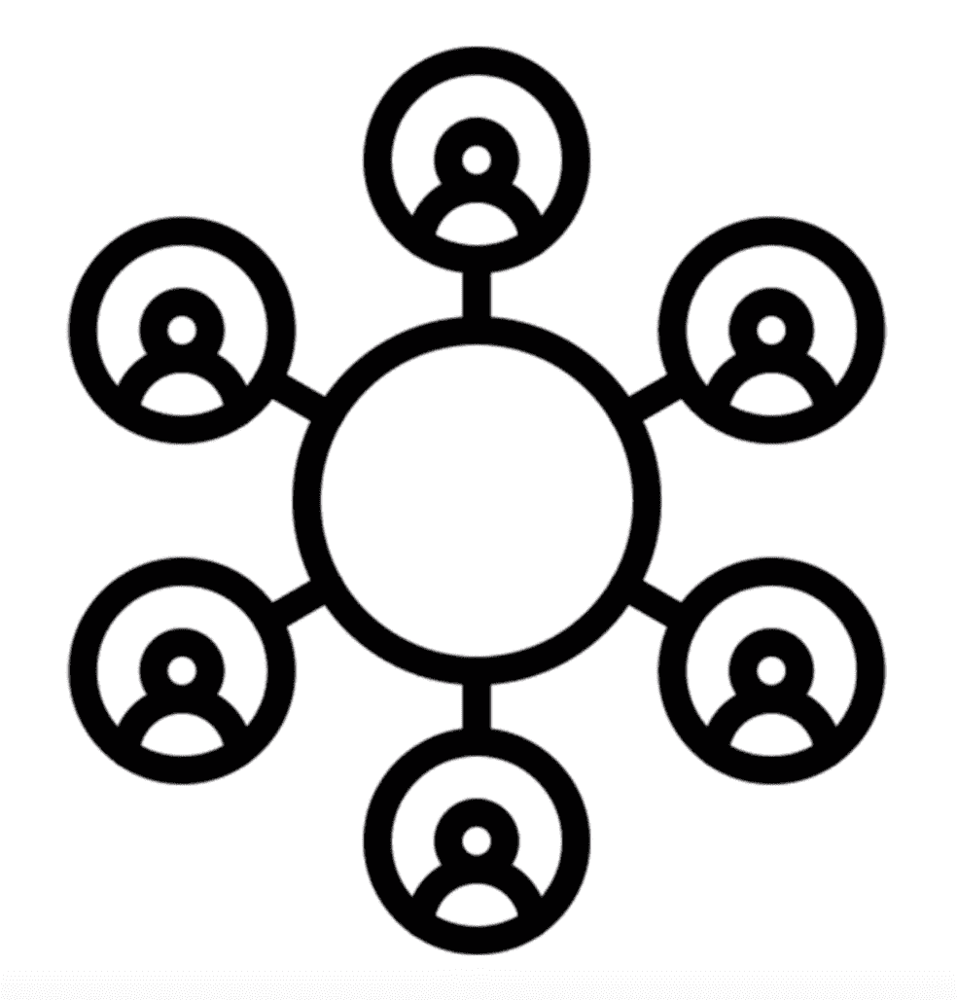

然而，区块链工作方式不同于传统的 web 服务器。区块链上的所有代码和数据都是分散的，即它分布在网络中的所有节点上。它不位于中央网络服务器上。

所有这些数据都包含在名为**数据块**的记录包中，这些数据块 <u>*链接在一起*</u> 组成公共总账。网络上的所有节点都参与确保这些数据保持安全和不变。这就是区块链如此强大的原因！

那么，你如何连接到区块链并使用它呢？

由于这是一个节点网络，您可以运行自己的节点，或者连接到一个节点。一旦你这样做了，你就能获得区块链的全部力量！

### 什么是智能合同？

智能合约是我们用来创建区块链应用程序的构件。它们是我们可以用源代码编写并部署到区块链的程序。它们是用 Solidity 编程语言编写的，我将在本教程中教你。

智能合约是不可变的，这意味着一旦它们被创建就不能改变！一旦智能合约被部署到区块链，其代码就不能像普通应用程序一样被更新。这是因为它代表了一个数字合同或协议。毕竟，您不希望任何其他真实世界的合同在创建后发生变化，对吗？

你可以把智能合约想象成网络上的微服务或 API。如果公共分类帐就像一个数据库，那么智能契约就是读取、写入和执行业务逻辑的层。

#### 智能合同是如何工作的？

在本教程中，我们将编写智能合同来推动市场。它的工作方式有点像自动售货机。


任何时候有人在市场上购买物品，他们都会向智能合约发送以太坊加密货币。智能合同将像自动售货机一样工作，向买家分发商品，并将加密货币支付即时转移到卖家。

### 区块链 App 是如何工作的？

为了理解区块链应用程序是如何工作的，让我们先来看看一个普通的 web 应用程序是如何工作的。

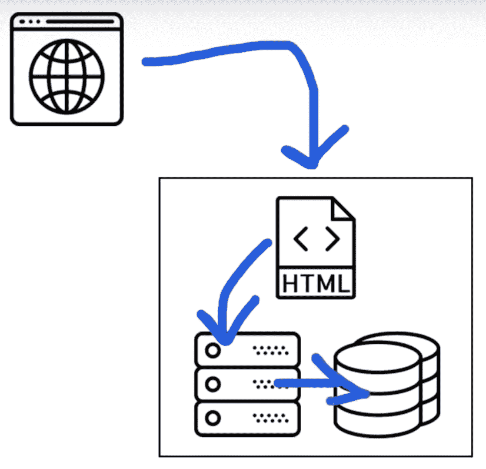

通常，对于 web 应用程序，您可以使用 web 浏览器访问网页。该网站的所有 HTML、CSS 和 JavaScript 代码都位于一个中央网络服务器上，并与后端(用任何编程语言编写)对话，后端也与数据库对话。

我们将在本教程中构建的区块链应用程序的工作方式不同。

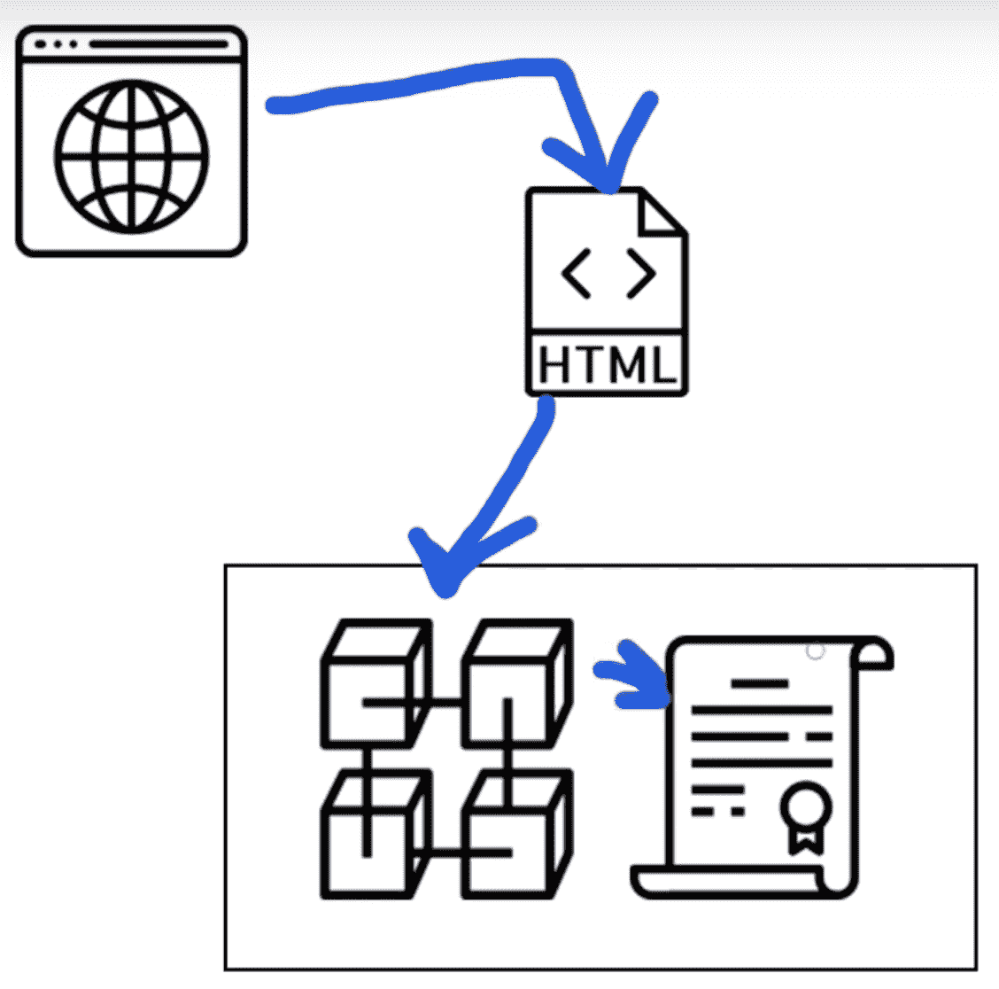

我们将通过一个特殊的 web 浏览器访问我们的区块链应用程序，该浏览器与一个用 HTML、CSS 和 JavaScript 编写的前端网站进行对话。该网站将直接与区块链对话，而不是与后端 web 服务器对话。区块链本质上将是我们的后端，为我们分散的市场托管所有的代码和数据。

现在我们已经介绍了基础知识，让我们开始构建我们的项目吧！

## 安装依赖项

教程这一部分的视频片段从 [5:49](https://www.youtube.com/watch?v=VH9Q2lf2mNo&feature=youtu.be&t=5m49s) 开始。

现在让我们安装构建项目所需的所有依赖项。首先，我们将建立一个区块链人来本地开发应用程序。

##### Ganache 个人区块链

这种依赖性是一种个人区块链，是一种本地开发区块链，可用于模仿公共区块链的行为。我推荐使用 [Ganache](http://truffleframework.com/ganache) 作为你以太坊开发的个人区块链。它将允许您部署智能合约、开发应用程序和运行测试。它可以作为桌面应用程序和命令行工具在 Windows、Mac 和 Linux 上使用！

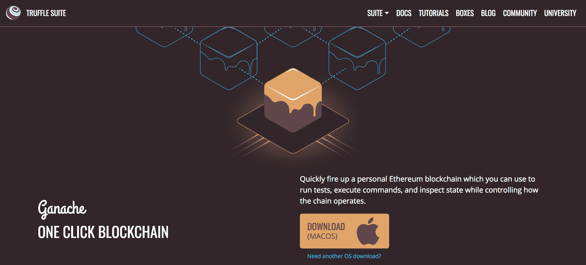

在本教程中，我将指导您设置桌面应用程序。你可以在这里找到你的操作系统的最新版本。一旦下载了存档的包，解压安装程序并运行安装步骤。安装完成后，无论何时打开它，您都会看到以下屏幕:

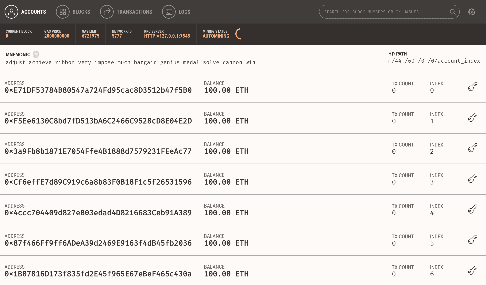

耶！🎉现在你有一个个人区块链网络运行！您可以看到运行 Ganache 的服务器的一些详细信息，以及连接到网络的帐户列表。每个账户都被记入 100 英镑。这是一个巨大的时间节省！如果你打算从头开始创建你自己的个人区块链网络，或者在一个测试网络上开发你的应用程序，你将不得不手动创建所有 10 个帐户，并向每个帐户存入乙醚。谢天谢地，Ganache 已经为我们做了这件事，所以我们不必担心它。

##### 节点。射流研究…

既然您已经运行了私有区块链，那么您需要配置您的环境来开发智能合约。您需要的第一个依赖项是 Node.js 附带的[节点包管理器](https://nodejs.org/en/)或 NPM。您可以查看是否已经安装了 Node，方法是在终端上键入:

```js
$ node -v
```

如果你还没有安装 node，你可以访问 [Node.js 网站](https://nodejs.org/en/)下载。

##### 块菌框架

现在让我们安装 [Truffle 框架](http://truffleframework.com/)，它提供了一套用 Solidity 编程语言开发以太坊智能联系人的工具。

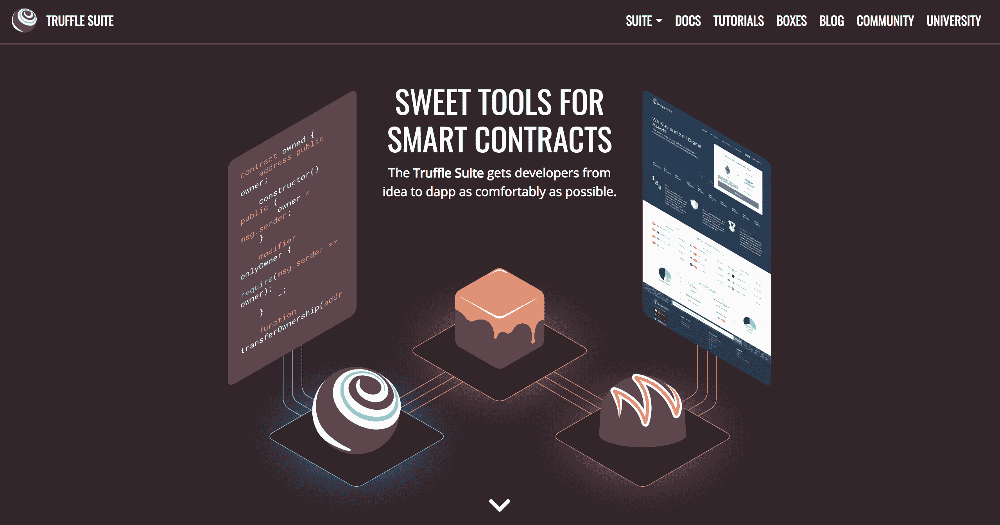

以下是我们将从 Truffle 框架中获得的所有功能的概述:

*   智能合同管理 -用 Solidity 编程语言编写智能合同，并将它们编译成运行在以太坊虚拟机(EVM)上的字节码。
*   自动化测试(Automated Testing)——针对你的智能合约编写测试，以确保它们按照你想要的方式运行。这些测试可以用 JavaScript 或 Solidity 编写，可以在 Truffle 配置的任何网络上运行，包括公共区块链网络。
*   **部署&迁移** -编写脚本将智能合约迁移和部署到任何公共以太坊区块链网络。
*   **网络管理** -连接到任何公共以太坊区块链网络，以及任何你可能用于开发目的的个人区块链网络。
*   **开发控制台**——使用 Truffle 控制台在 JavaScript 运行时环境中与智能合约进行交互。为此，您可以连接到您在网络配置中指定的任何区块链网络。
*   用 JavaScript 编写可以在区块链公共网络上运行的定制脚本。您可以在这个文件中编写任意代码，并在项目中运行它。
*   **客户端开发**——配置您的 truffle 项目来托管客户端应用程序，这些应用程序与部署到区块链的智能合约进行对话。

你可以像这样在命令行中安装带有 NPM 的松露。注意:为了跟随本教程，使用下面指定的松露的精确版本是很重要的。

```js
$ npm install -g [[email protected]](/cdn-cgi/l/email-protection)
```

##### Metamask 以太坊钱包

现在是时候把你的网络浏览器变成区块链浏览器了。大多数主要的网络浏览器目前都没有连接到区块链网络，所以我们必须安装一个浏览器扩展来允许他们这样做。

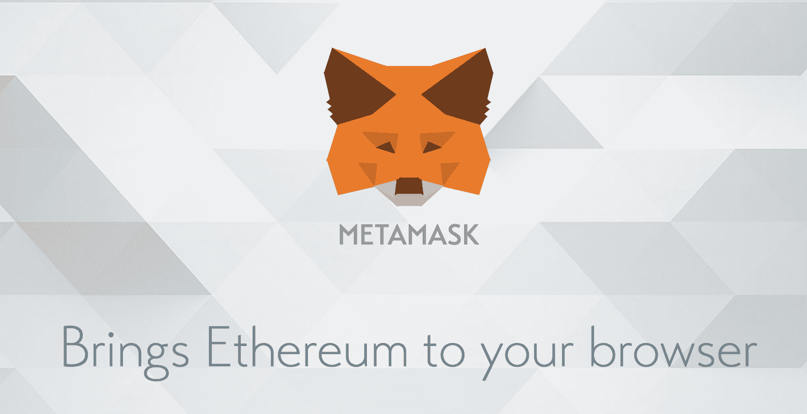

我将为谷歌浏览器扩展[元掩码。要安装 Metamask，](https://chrome.google.com/webstore/detail/metamask/nkbihfbeogaeaoehlefnkodbefgpgknn?hl=en)[请访问此链接](https://chrome.google.com/webstore/detail/metamask/nkbihfbeogaeaoehlefnkodbefgpgknn?hl=en)或在谷歌 Chrome 网络商店搜索 Metamask Chrome 插件。一旦你安装了它，确保它在你的扩展列表中被选中。安装 Chrome 浏览器后，你会在浏览器的右上角看到狐狸图标。如果遇到困难，请参考视频演示！

Metamask 还允许我们在连接到区块链时管理我们的个人账户，以及管理我们需要支付交易的以太网资金。

## 第 1 部分:项目设置

教程这一部分的视频片段从 [8:40](https://www.youtube.com/watch?v=VH9Q2lf2mNo&feature=youtu.be&t=8m40s) 开始。首先，确保您已经安装了[上一节](#dependencies)中的所有依赖项。

让我们快速开始构建我们的应用程序吧！我们将使用我的[初学者工具包](https://github.com/dappuniversity/starter_kit)，而不是手动设置项目。通过克隆初学者工具包创建您的项目，如下所示:

```js
$ git clone https://github.com/dappuniversity/starter_kit marketplace
```

现在，像这样进入刚刚克隆的目录:

```js
$ cd marketplace
```

🎉维奥拉。您已经立即建立了您的项目。让我们来看看我们刚刚创建的内容:

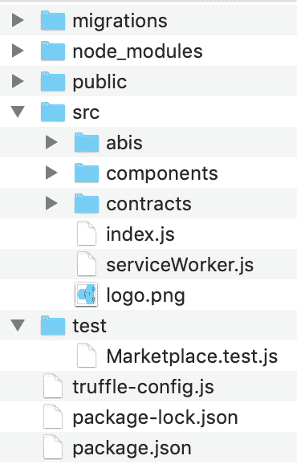

这是一个自定义的 truffle 项目，我已经创建来帮助您快速开始构建全栈区块链应用程序！您可以创建智能合约，测试它们，并使用这个项目中的 [Web3.js](https://github.com/ethereum/web3.js/) 、 [React.js](https://reactjs.org/) 和 [Bootstrap](https://getbootstrap.com/) 构建前端 web 应用程序。

在`package.json`文件中已经有了您需要的所有依赖项:

```js
{
  "name": "eth-marketplace",
  "version": "0.1.0",
  "description": "An Ethereum Marketplace",
  "author": "[[email protected]](/cdn-cgi/l/email-protection)",
  "dependencies": {
    "babel-polyfill": "6.26.0",
    "babel-preset-env": "1.7.0",
    "babel-preset-es2015": "6.24.1",
    "babel-preset-stage-2": "6.24.1",
    "babel-preset-stage-3": "6.24.1",
    "babel-register": "6.26.0",
    "bootstrap": "4.3.1",
    "chai": "4.2.0",
    "chai-as-promised": "7.1.1",
    "chai-bignumber": "3.0.0",
    "react": "16.8.4",
    "react-bootstrap": "1.0.0-beta.5",
    "react-dom": "16.8.4",
    "react-scripts": "2.1.3",
    "truffle": "5.0.5",
    "web3": "1.0.0-beta.55"
  },
  "scripts": {
    "start": "react-scripts start",
    "build": "react-scripts build",
    "test": "react-scripts test",
    "eject": "react-scripts eject"
  },
  "eslintConfig": {
    "extends": "react-app"
  },
  "browserslist": [
    ">0.2%",
    "not dead",
    "not ie <= 11",
    "not op_mini all"
  ]
} 
```

您可以像这样继续安装您的依赖项:

```js
$ npm install
```

接下来让我们看看`truffle-config.js`文件:

```js
require('babel-register');
require('babel-polyfill');

module.exports = {
  networks: {
    development: {
      host: "127.0.0.1",
      port: 7545,
      network_id: "*" // Match any network id
    },
  },
  contracts_directory: './src/contracts/',
  contracts_build_directory: './src/abis/',
  compilers: {
    solc: {
      optimizer: {
        enabled: true,
        runs: 200
      }
    }
  }
} 
```

该文件的主要职责是将我们的项目连接到区块链网络。我已经设置好连接到我们的 Ganache 个人区块链，即`127.0.0.1:7545`。我还会提到，我已经将这个项目的结构配置为不同于 Truffle 的默认文件结构。我已经将智能合同移动到了`src`目录，这样 react 应用程序就可以访问它们。你可以在`contracts_directory`和`contracts_build_directory`设置下看到那个配置。

现在我们已经看到了项目结构，让我们通过在 contracts 目录中创建一个新文件来开始编写我们的智能合约:

```js
$ touch src/contracts/Marketplace.sol
```

在这个文件中，让我们开始编写我们的智能契约可靠性编程语言:

```js
pragma solidity ^0.5.0;

contract Marketplace {

}
```

首先，我们首先声明我们想要使用的 Solidity 编程语言的版本。接下来，我们声明我们的智能契约`Marketplace`。我们将在花括号内添加所有智能合约代码。让我们这样做:

```js
pragma solidity ^0.5.0;

contract Marketplace {
    string public name;

}
```

该代码创建了一个“状态变量”，其值将存储在区块链上。我们将调用变量`name`,因为我们将使用它来存储智能合约的名称(仅用于测试目的)。由于 Solidity 是一种静态类型的编程语言，我们必须在声明变量之前声明`string`数据类型。最后，我们声明状态变量`public`,这样我们就可以在智能契约之外读取它的值，我们马上就会这么做。

接下来，让我们这样设置这个变量的值:

```js
pragma solidity ^0.5.0;

contract Marketplace {
    string public name;

    constructor() public {
        name = "Dapp University Marketplace";
    }
}
```

我们在`constructor`函数中指定`name`的值。这是一个特殊的函数，每当首次创建智能合约时，即部署到区块链时，都会调用该函数。无论何时部署，它都会将`name`的值设置为我们在这里指定的字符串。

现在，让我们编译智能合同，以确保一切正常:

```js
$ truffle compile
```

终端中的输出将显示编译后的智能合约的位置！

接下来，让我们将 mart 契约部署到我们的 Ganache 个人 blockhain。为此，创建一个新的迁移文件，如下所示:

```js
$ touch migrations/2_deploy_contracts.js
```

这个文件告诉 Truffle 将我们的智能合同部署到区块链。如果你熟悉的话，这有点像传统数据库的迁移文件。另外，请注意，迁移文件是有编号的，以便 Truffle 知道以什么顺序运行它们。

将此代码输入到新创建的迁移中:

```js
const Marketplace = artifacts.require("Marketplace");

module.exports = function(deployer) {
  deployer.deploy(Marketplace);
};
```

现在迁移像这样运行迁移:

```js
$ truffle migrate
```

现在，我们可以从松露控制台检查我们的智能合同。您可以从命令行启动 Truffle 控制台，如下所示:

```js
$ truffle console
```

现在，我们可以在控制台中使用 JavaScript 获得智能合约**的部署副本，如下所示:**

```js
marketplace = await Marketplace.deployed()
```

你的主机可能会返回`undefined`，但没关系！您可以通过再次键入变量名来获取智能协定的值，如下所示:

```js
marketplace
```

您可以在区块链上获得智能合约的地址，如下所示:

```js
marketplace.address
```

接下来，我们来读一下名字:

```js
name = await marketplace.name()
```

然后:

```js
name
```

耶！🎉您已经成功设置了项目，并将基本智能合约部署到区块链！

现在让我们为智能合约编写一个测试。测试智能合约非常重要，因为在区块链上线之前，你需要确保它们能够完美运行。请记住，一旦您部署了它们，它们就无法更改！您只能重新部署新的副本。

为智能合约测试创建一个新文件，如下所示:

```js
$ mkdir test
$ touch test/Marketplace.test.js 
```

在该文件中，使用以下代码:

```js
const Marketplace = artifacts.require('./Marketplace.sol')

contract('Marketplace', (accounts) => {
  let marketplace

  before(async () => {
    marketplace = await Marketplace.deployed()
  })

  describe('deployment', async () => {
    it('deploys successfully', async () => {
      const address = await marketplace.address
      assert.notEqual(address, 0x0)
      assert.notEqual(address, '')
      assert.notEqual(address, null)
      assert.notEqual(address, undefined)
    })

    it('has a name', async () => {
      const name = await marketplace.name()
      assert.equal(name, 'Dapp University Marketplace')
    })

  })
})
```

我来解释一下这个测试。我们在这个文件中用 Javascript 编写了所有的测试，使用了[Mocha 测试框架](https://mochajs.org/)和[柴断言库](http://www.chaijs.com/)。这些都与 Truffle 框架捆绑在一起。我们将使用 JavaScript 编写所有这些测试来模拟客户端与智能合约的交互，就像我们在控制台中所做的一样。

这个测试做两件事:

*   检查智能合约是否有地址，即它是否已成功部署到网络。
*   检查部署时是否设置了名称。

您可以观看视频以获得对该测试文件的更深入的解释。

现在，让我们从命令行运行测试，如下所示:

```js
$ truffle test
```

🎉耶，他们通过了！

干得好！如果你卡住了，请随意[再看一遍这部分视频，以便进一步澄清](https://www.youtube.com/watch?v=VH9Q2lf2mNo&feature=youtu.be&t=8m40s)。你也可以在这里找到所有代码的[副本](https://github.com/dappuniversity/marketplace/releases/tag/part-1)。

## 第 2 部分:销售产品

这部分教程的视频片段从 [33:10](https://www.youtube.com/watch?v=VH9Q2lf2mNo&feature=youtu.be&t=33m10s) 开始。你也可以在这里找到[的代码](https://github.com/dappuniversity/marketplace/releases/tag/part-2)。

现在，让我们继续构建市场智能合约。我们将创建第一个功能，它将允许用户列出市场中的待售商品。为了做到这一点，我们需要用这样的结构对产品建模:

```js
struct Product {
    uint id;
    string name;
    uint price;
    address owner;
    bool purchased;
}
```

Solidity 允许你创建你自己的数据结构，具有任意属性。这正是我们通过创建一个`Product`结构所做的。它存储了我们需要的产品的所有属性，比如`id`、`name`、`price`、`owner`和`purchased`。

接下来，我们需要一个地方来储存区块链上的产品。我们将创建一个实度映射，如下所示:

```js
mapping(uint => Product) public products;
```

映射的工作方式类似于带有键值对的关联数组或哈希表。映射具有返回唯一值的唯一键。在我们的例子中，我们将使用一个`id`作为键，值将是一个`Product`结构。这将基本上允许我们通过 id 查找产品，就像数据库一样。

接下来，我们希望使用如下所示的`productCount`计数器缓存来跟踪智能合同中有多少产品:

```js
uint public productCount = 0;
```

我们使用计数器缓存，因为没有办法知道映射中有多少产品。你不能在 Solidiy 中检查贴图的“长度”或“大小”。因此，如果我们想获取所有的产品，我们必须逐个读出它们。我们将使用计数器缓存来确定这样做的次数。

此时，您的智能合约应该如下所示:

```js
pragma solidity ^0.5.0;

contract Marketplace {
    string public name;
    uint public productCount = 0;
    mapping(uint => Product) public products;

    struct Product {
        uint id;
        string name;
        uint price;
        address owner;
        bool purchased;
    }

    constructor() public {
        name = "Dapp University Marketplace";
    }

}
```

接下来，让我们创建一个函数来创建新产品。这个函数将做几件事:

*   用结构创建新产品
*   将该结构添加到映射中，并将其存储在区块链上
*   触发一个事件，让某人知道一个产品被创造了

我们可以像这样创建函数:

```js
function createProduct(string memory _name, uint _price) public {
    // Require a valid name
    require(bytes(_name).length > 0);
    // Require a valid price
    require(_price > 0);
    // Increment product count
    productCount ++;
    // Create the product
    products[productCount] = Product(productCount, _name, _price, msg.sender, false);
    // Trigger an event
    emit ProductCreated(productCount, _name, _price, msg.sender, false);
}
```

让我解释一下这段代码:

*   首先，我们创建一个接受

    ```js
    name
    ```

    和

    ```js
    price
    ```

    参数的函数。产品价格用以太的最小细分单位魏表示(完整解释见视频)。
*   接下来，我们添加一些在函数继续执行之前必须满足的要求。我们检查名称是否存在，价格是否大于 0。
*   接下来，我们通过使用`++`操作符增加产品计数来生成一个新的产品 id(这只是将前一个值加 1)。
*   然后，我们创建一个新产品并将其添加到映射中。注意`msg.sender`是创建产品的用户的地址。
*   最后，我们触发一个事件，让每个人都知道产品已经成功创建。

现在让我们添加事件定义，以便可以触发它:

```js
event ProductCreated(
    uint id,
    string name,
    uint price,
    address owner,
    bool purchased
);
```

外部订阅者可以侦听此事件，以验证产品是在区块链上创建的。我们将在智能合约测试中检查该事件。

现在，该部分的完整智能合约代码应该如下所示:

```js
pragma solidity ^0.5.0;

contract Marketplace {
    string public name;
    uint public productCount = 0;
    mapping(uint => Product) public products;

    struct Product {
        uint id;
        string name;
        uint price;
        address owner;
        bool purchased;
    }

    event ProductCreated(
        uint id,
        string name,
        uint price,
        address owner,
        bool purchased
    );

    constructor() public {
        name = "Dapp University Marketplace";
    }

    function createProduct(string memory _name, uint _price) public {
        // Require a valid name
        require(bytes(_name).length > 0);
        // Require a valid price
        require(_price > 0);
        // Increment product count
        productCount ++;
        // Create the product
        products[productCount] = Product(productCount, _name, _price, msg.sender, false);
        // Trigger an event
        emit ProductCreated(productCount, _name, _price, msg.sender, false);
    }
}
```

现在让我们添加一些测试来确保这个函数正常工作。在测试文件中使用以下代码:

```js
const Marketplace = artifacts.require('./Marketplace.sol')

require('chai')
  .use(require('chai-as-promised'))
  .should()

contract('Marketplace', ([deployer, seller, buyer]) => {
  let marketplace

  before(async () => {
    marketplace = await Marketplace.deployed()
  })

  describe('deployment', async () => {
    it('deploys successfully', async () => {
      const address = await marketplace.address
      assert.notEqual(address, 0x0)
      assert.notEqual(address, '')
      assert.notEqual(address, null)
      assert.notEqual(address, undefined)
    })

    it('has a name', async () => {
      const name = await marketplace.name()
      assert.equal(name, 'Dapp University Marketplace')
    })
  })

  describe('products', async () => {
    let result, productCount

    before(async () => {
      result = await marketplace.createProduct('iPhone X', web3.utils.toWei('1', 'Ether'), { from: seller })
      productCount = await marketplace.productCount()
    })

    it('creates products', async () => {
      // SUCCESS
      assert.equal(productCount, 1)
      const event = result.logs[0].args
      assert.equal(event.id.toNumber(), productCount.toNumber(), 'id is correct')
      assert.equal(event.name, 'iPhone X', 'name is correct')
      assert.equal(event.price, '1000000000000000000', 'price is correct')
      assert.equal(event.owner, seller, 'owner is correct')
      assert.equal(event.purchased, false, 'purchased is correct')

      // FAILURE: Product must have a name
      await await marketplace.createProduct('', web3.utils.toWei('1', 'Ether'), { from: seller }).should.be.rejected;
      // FAILURE: Product must have a price
      await await marketplace.createProduct('iPhone X', 0, { from: seller }).should.be.rejected;
    })
  })
})
```

让我们检查每个新零件。首先，我们像这样在测试套件中添加一些额外的工具。我们已经在我们的包中安装了这些。

```js
require('chai')
.use(require('chai-as-promised'))
.should() 
```

接下来，向测试场景添加 3 个新帐户，`deployer`、`seller`和`buyer`:

```js
contract('Marketplace', ([deployer, seller, buyer]) => {
```

然后，我们为创建产品创建一个新的测试示例:

```js
describe('products', async () => {
  let result, productCount

  before(async () => {
    result = await marketplace.createProduct('iPhone X', web3.utils.toWei('1', 'Ether'), { from: seller })
    productCount = await marketplace.productCount()
  })

  //... 
```

这用一个`before`钩子设置了测试示例，在每个测试运行之前创建一个产品。最后，我们为产品创建创建一个完整的测试，如下所示:

```js
it('creates products', async () => {
  // SUCCESS
  assert.equal(productCount, 1)
  const event = result.logs[0].args
  assert.equal(event.id.toNumber(), productCount.toNumber(), 'id is correct')
  assert.equal(event.name, 'iPhone X', 'name is correct')
  assert.equal(event.price, '1000000000000000000', 'price is correct')
  assert.equal(event.owner, seller, 'owner is correct')
  assert.equal(event.purchased, false, 'purchased is correct')

  // FAILURE: Product must have a name
  await await marketplace.createProduct('', web3.utils.toWei('1', 'Ether'), { from: seller }).should.be.rejected;
  // FAILURE: Product must have a price
  await await marketplace.createProduct('iPhone X', 0, { from: seller }).should.be.rejected;
})
```

首先，我们检查创建一个产品是否使产品数量增加了 1。然后，我们检查智能合约事件日志，以查看产品是用正确的值创建的。我们像这样深入研究事件日志:`result.logs[0].args`(尝试将这些值记录到控制台，看看它们是什么样子)。我们检查所有这些值是否正确，如 id、姓名、价格等...

最后，我们检查失败案例。例如，如果没有名字，或者如果价格小于或等于 0，我们确保函数调用失败。

干得好！如果你卡住了，请随意[再看一遍这部分视频，以便进一步澄清](https://www.youtube.com/watch?v=VH9Q2lf2mNo&feature=youtu.be&t=33m10s)。你也可以在这里找到所有代码的[副本](https://github.com/dappuniversity/marketplace/releases/tag/part-2)。

## 第 3 部分:购买产品

本教程这一部分的视频片段从 [01:01:07](https://www.youtube.com/watch?v=VH9Q2lf2mNo&feature=youtu.be&t=1h1m7s) 开始。你也可以在这里找到[的代码](https://github.com/dappuniversity/marketplace/releases/tag/part-2)。

现在让我们创建一个购买产品的函数。每当有人调用这个函数时，他们将提交他们想要购买的产品的`id`(这将由我们的客户端应用程序处理)。此外，当他们调用该功能时，他们将从钱包中发送以太坊加密货币来购买产品。我们将像这样设置函数:

```js
function purchaseProduct(uint _id) public payable {
  // ...
}
```

注意，我们已经做了这个函数`payable`，这意味着它将接受 Etherum 加密货币。我们很快就会看到这一点。因为我们要向所有者付费，所以我们必须更新现有的结构和事件来使用`address payable`类型，如下所示:

```js
struct Product {
    uint id;
    string name;
    uint price;
    address payable owner;
    bool purchased;
}
```

```js
event ProductCreated(
    uint id,
    string name,
    uint price,
    address payable owner,
    bool purchased
);
```

现在让我们填写函数内部的代码:

```js
function purchaseProduct(uint _id) public payable {
    // Fetch the product
    Product memory _product = products[_id];
    // Fetch the owner
    address payable _seller = _product.owner;
    // Make sure the product has a valid id
    require(_product.id > 0 && _product.id <= productCount);
    // Require that there is enough Ether in the transaction
    require(msg.value >= _product.price);
    // Require that the product has not been purchased already
    require(!_product.purchased);
    // Require that the buyer is not the seller
    require(_seller != msg.sender);
    // Transfer ownership to the buyer
    _product.owner = msg.sender;
    // Mark as purchased
    _product.purchased = true;
    // Update the product
    products[_id] = _product;
    // Pay the seller by sending them Ether
    address(_seller).transfer(msg.value);
    // Trigger an event
    emit ProductPurchased(productCount, _product.name, _product.price, msg.sender, true);
}
```

让我解释一下这个函数的作用。

*   首先，我们从映射中获取产品，并在内存中创建它的新副本。
*   然后，我们将当前所有者存储到一个变量中。我们将在这个函数中转移产品的所有权，所以我们需要知道最初的所有者是谁。
*   接下来，我们添加一些需求。我们检查有效的 id，交易中有足够的以太网加密货币，买方不是卖方，并且产品尚未购买。
*   然后我们促成交易。我们将所有权转移给买方，将产品标记为已购买，并将产品添加回映射。之后，我们将加密货币付款发送给卖家。请注意，以太加密货币金额是用函数的元数据来跟踪的。我们可以用全局变量`msg.sender`来访问这个值。同样，该值用 Wei 表示(进一步解释见视频)。
*   最后，我们触发一个事件来声明产品已经成功创建。

现在让我们为产品销售创建一个新事件。它的工作方式与我们在上一节中创建的事件几乎完全一样，只是名称不同:

```js
event ProductPurchased(
    uint id,
    string name,
    uint price,
    address payable owner,
    bool purchased
);
```

现在让我们为`purchaseProduct`函数添加一个测试，如下所示:

```js
it('sells products', async () => {
  // Track the seller balance before purchase
  let oldSellerBalance
  oldSellerBalance = await web3.eth.getBalance(seller)
  oldSellerBalance = new web3.utils.BN(oldSellerBalance)

  // SUCCESS: Buyer makes purchase
  result = await marketplace.purchaseProduct(productCount, { from: buyer, value: web3.utils.toWei('1', 'Ether')})

  // Check logs
  const event = result.logs[0].args
  assert.equal(event.id.toNumber(), productCount.toNumber(), 'id is correct')
  assert.equal(event.name, 'iPhone X', 'name is correct')
  assert.equal(event.price, '1000000000000000000', 'price is correct')
  assert.equal(event.owner, buyer, 'owner is correct')
  assert.equal(event.purchased, true, 'purchased is correct')

  // Check that seller received funds
  let newSellerBalance
  newSellerBalance = await web3.eth.getBalance(seller)
  newSellerBalance = new web3.utils.BN(newSellerBalance)

  let price
  price = web3.utils.toWei('1', 'Ether')
  price = new web3.utils.BN(price)

  const exepectedBalance = oldSellerBalance.add(price)

  assert.equal(newSellerBalance.toString(), exepectedBalance.toString())

  // FAILURE: Tries to buy a product that does not exist, i.e., product must have valid id
  await marketplace.purchaseProduct(99, { from: buyer, value: web3.utils.toWei('1', 'Ether')}).should.be.rejected;      // FAILURE: Buyer tries to buy without enough ether
  // FAILURE: Buyer tries to buy without enough ether
  await marketplace.purchaseProduct(productCount, { from: buyer, value: web3.utils.toWei('0.5', 'Ether') }).should.be.rejected;
  // FAILURE: Deployer tries to buy the product, i.e., product can't be purchased twice
  await marketplace.purchaseProduct(productCount, { from: deployer, value: web3.utils.toWei('1', 'Ether') }).should.be.rejected;
  // FAILURE: Buyer tries to buy again, i.e., buyer can't be the seller
  await marketplace.purchaseProduct(productCount, { from: buyer, value: web3.utils.toWei('1', 'Ether') }).should.be.rejected;
})
```

这个测试的工作方式很像`sellProduct()`功能测试。它做了几件关键的事情:

*   检查产品是否已转让给买方
*   检查卖家是否自动收到加密货币资金
*   检查所有的失败案例，以确保我们在函数内部防止它们

现在，让我们从命令行运行测试，如下所示:

```js
$ truffle test
```

🎉耶，他们通过了！

最后，让我们将智能合同部署到网络中，这样我们就可以在下一节开始构建客户端应用程序来与它交互。我们可以使用`--reset`标志重新运行我们的迁移，将智能合同迁移到网络中。它将在区块链号上创建智能合同的新副本:

```js
$ truffle migrate --reset
```

干得好！如果你卡住了，请随意[再看一遍这部分视频，以便进一步澄清](https://www.youtube.com/watch?v=VH9Q2lf2mNo&feature=youtu.be&t=1h1m07s)。你也可以在这里找到所有代码的[副本](https://github.com/dappuniversity/marketplace/releases/tag/part-3)。

## 第 4 部分:市场网站设置(前端)

本教程这一部分的视频片段从 [01:26:20](https://www.youtube.com/watch?v=VH9Q2lf2mNo&feature=youtu.be&t=1h26m20s) 开始。你也可以在这里找到[的代码](https://github.com/dappuniversity/marketplace/releases/tag/part-4)。

现在让我们开始为市场构建客户端应用程序。我们将在这一部分做以下工作:

*   启动应用程序，并在我们的浏览器中运行初学者工具包
*   将我们的网络浏览器连接到区块链
*   将我们的 web 应用程序连接到区块链，并开始与市场智能合约对话

*   在我们开始之前，请确保您的开发服务器正在运行:

```js
$ npm run start
```

这将启动您的 web 服务器，并自动在您的浏览器中打开网站，如下所示:

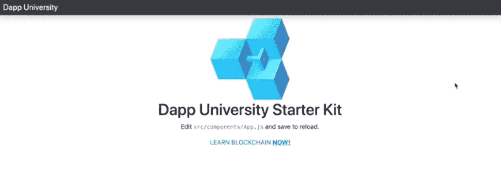

这个初学者工具包提供了构建我们的应用程序所需的一切:

*   React.js 来构建接口
*   无需编写 CSS 即可创建 UI 元素的引导程序
*   Web3.js 将我们的应用程序连接到区块链

现在让我们将网络浏览器连接到区块链。我们将为此使用元掩码，它安装在本教程的依赖部分。为此，我们需要做两件事:

*   将元掩码连接到我们的 Ganache 个人区块链实例
*   将一些帐户从 Ganache 导入 Metamask，这样我们就可以代表他们作为我们的市场应用程序的用户

你可以在视频中看到我在此时设置元掩码[。](https://www.youtube.com/watch?v=VH9Q2lf2mNo&feature=youtu.be&t=1h27m06s)

接下来，让我简单解释一下为什么我们使用 [React.js](https://reactjs.org/) 来构建我们的项目。我们需要一种方法来管理应用程序的所有客户端行为，并存储来自区块链的数据。React.js 不是手动完成所有这些工作，而是通过将代码组织成可重用的组件，并使用状态对象管理应用程序状态，为我们提供了开箱即用的能力。你可以在视频中看到我对 React.js [的完整解释。](https://www.youtube.com/watch?v=VH9Q2lf2mNo&feature=youtu.be&t=1h30m17s)

现在，让我们借助 a href = " https://web 3js . readthe docs . io/en/1.0/" target = " _ blank " > web 3 . js，将客户端应用程序连接到区块链。我们首先将`web3`导入到主`App.js`组件中，如下所示:

```js
import Web3 from 'web3'
```

现在让我们创建一个新的函数，每当我们的 React 组件被加载时，这个函数都会被调用。在这里，我们将调用一个实例化 web3 的函数。

```js
async componentWillMount() {
  await this.loadWeb3()
}
```

现在，让我们创建`loadWeb3()`函数，它将像这样创建连接:

```js
async loadWeb3() {
  if (window.ethereum) {
    window.web3 = new Web3(window.ethereum)
    await window.ethereum.enable()
  }
  else if (window.web3) {
    window.web3 = new Web3(window.web3.currentProvider)
  }
  else {
    window.alert('Non-Ethereum browser detected. You should consider trying MetaMask!')
  }
}
```

该功能检测网络浏览器中以太坊提供商的存在，允许我们将应用程序连接到区块链。如果您不理解这个函数内部的所有内容，也不用担心。没关系！它直接取自[元掩码提供给](https://medium.com/metamask/https-medium-com-metamask-breaking-change-injecting-web3-7722797916a8)的指令。:)

现在，让我们创建一个从区块链加载数据的函数。我们先这样称呼它:

```js
async componentWillMount() {
  await this.loadWeb3()
  await this.loadBlockchainData()
}
```

我们将这样定义它:

```js
async loadBlockchainData() {
  const web3 = window.web3
}
```

在这里，我们将存储的 web3 连接连接到一个变量。现在，让我们从元掩码中获取帐户，并将它们记录到控制台，如下所示:

```js
async loadBlockchainData() {
  const web3 = window.web3
  const accounts = await web3.eth.getAccounts()
  console.log(accounts)
}
```

现在转到浏览器，查看登录到控制台的帐户！

接下来，我们将把这个帐户存储到 React 状态对象中，以便以后使用:

```js
async loadBlockchainData() {
  const web3 = window.web3
  const accounts = await web3.eth.getAccounts()
  console.log(accounts)
  this.setState({ account: accounts[0] })
}
```

现在，让我们为 state 对象设置一些默认值。React 让我们这样做:

```js
constructor(props) {
  super(props)
  this.state = {
    account: '',
    productCount: 0,
    products: [],
    loading: true
  }
}
```

现在，我们可以在页面的导航栏中列出帐户。在这里，我将继续为导航栏创建一个新组件。我在视频的最后做这个，所以有点乱。然而，我认为这是做这件事的最佳时机。

首先，在与`App.js`相同的目录中创建一个名为`Navbar.js`的新组件。然后在该文件中使用以下代码:

```js
import React, { Component } from 'react';

class Navbar extends Component {

  render() {
    return (
      <nav className="navbar navbar-dark fixed-top bg-dark flex-md-nowrap p-0 shadow">
        <a
          className="navbar-brand col-sm-3 col-md-2 mr-0"
          href="http://www.dappuniversity.com/bootcamp"
          target="_blank"
          rel="noopener noreferrer"
        >
          Dapp University's Blockchain Marketplace
        </a>
        <ul className="navbar-nav px-3">
          <li className="nav-item text-nowrap d-none d-sm-none d-sm-block">
            <small className="text-white"><span id="account">{this.props.account}</span></small>
          </li>
        </ul>
      </nav>
    );
  }
}
export default Navbar;
```

注意，它用`{this.props.account}`读取账户。这使用了 React 的 props 对象，该对象可用于所有 React 组件。当我们在`App.js`中渲染这个组件时，我们需要将这些道具传递给它。让我们接下来做那件事。

现在导入`App.js`顶部的导航条组件:

```js
import Navbar from './Navbar'
```

现在让我们把它呈现在页面上。首先，删除所有旧的 Navbar 代码，并替换为:

```js
<Navbar account={this.state.account} />
```

注意，我们从 React 的状态对象中读取帐户，然后通过 props 将其传递给 Navbar 组件。现在，在网络浏览器中访问您的应用程序，查看页面上列出的帐户！

接下来，让我们将连接添加到市场智能合约。首先，我们将在`App.js`的顶部导入智能合约 ABI，如下所示:

```js
import Marketplace from '../abis/Marketplace.json'
```

现在，让我们更新`loadBlockchainData()`函数来连接智能合约:

```js
async loadBlockchainData() {
  const web3 = window.web3
  // Load account
  const accounts = await web3.eth.getAccounts()
  this.setState({ account: accounts[0] })
  const networkId = await web3.eth.net.getId()
  const networkData = Marketplace.networks[networkId]
  if(networkData) {
    const marketplace = web3.eth.Contract(Marketplace.abi, networkData.address)
    console.log(marketplace)
  } else {
    window.alert('Marketplace contract not deployed to detected network.')
  }
}
```

这段代码做了几件事:

*   读取 networkID 以确定我们使用 Metamask 连接到哪个网络，即 Ganache。例如，我们将使用这个网络 ID 连接到部署到 Ganache 网络的智能合约，而不是主以太坊网络。
*   接下来，我们用`web3.eth.Contract()`实例化 Web3.js 的智能合约。为此，我们需要两条信息:智能合同 ABI 和地址。我们从刚刚导入的文件中获取这两者。
*   最后，如果我们在网络上找不到智能合约，我们会提醒用户。您可以通过切换到 Metamask 中的主以太坊网络来测试这一点(只是不要忘记切换回来)。

现在，您的最终组件应该如下所示:

```js
import React, { Component } from 'react';
import Web3 from 'web3'
import logo from '../logo.png';
import './App.css';
import Marketplace from '../abis/Marketplace.json'
import Navbar from './Navbar'

class App extends Component {

  async componentWillMount() {
    await this.loadWeb3()
    await this.loadBlockchainData()
  }

  async loadWeb3() {
    if (window.ethereum) {
      window.web3 = new Web3(window.ethereum)
      await window.ethereum.enable()
    }
    else if (window.web3) {
      window.web3 = new Web3(window.web3.currentProvider)
    }
    else {
      window.alert('Non-Ethereum browser detected. You should consider trying MetaMask!')
    }
  }

  async loadBlockchainData() {
    const web3 = window.web3
    // Load account
    const accounts = await web3.eth.getAccounts()
    this.setState({ account: accounts[0] })
    const networkId = await web3.eth.net.getId()
    const networkData = Marketplace.networks[networkId]
    if(networkData) {
      const marketplace = web3.eth.Contract(Marketplace.abi, networkData.address)
      console.log(marketplace)
    } else {
      window.alert('Marketplace contract not deployed to detected network.')
    }
  }

  constructor(props) {
    super(props)
    this.state = {
      account: '',
      productCount: 0,
      products: [],
      loading: true
    }
  }

  render() {
    return (
      <div>
        <Navbar account={this.state.account} />
        <div className="container-fluid mt-5">
          <div className="row">
            <main role="main" className="col-lg-12 d-flex text-center">
              <div className="content mr-auto ml-auto">
                <a
                  href="http://www.dappuniversity.com/bootcamp"
                  target="_blank"
                  rel="noopener noreferrer"
                >
                  
                </a>
                <h1>Dapp University Starter Kit</h1>
                <p>
                  Edit <code>src/components/App.js</code> and save to reload.
                </p>
                <a
                  className="App-link"
                  href="http://www.dappuniversity.com/bootcamp"
                  target="_blank"
                  rel="noopener noreferrer"
                >
                  LEARN BLOCKCHAIN <u><b>NOW! </b></u>
                </a>
              </div>
            </main>
          </div>
        </div>
      </div>
    );
  }
}

export default App;
```

哇！在这一部分，我们很快就谈到了很多内容。如果信息很多也不用担心。请随意[再看一遍这部分视频，以便进一步澄清](https://www.youtube.com/watch?v=VH9Q2lf2mNo&feature=youtu.be&t=1h26m20s)。你也可以在这里找到所有代码的[副本](https://github.com/dappuniversity/marketplace/releases/tag/part-4)。

## 第 5 部分:销售产品(前端)

本教程这一部分的视频片段从 [01:53:10](https://www.youtube.com/watch?v=VH9Q2lf2mNo&feature=youtu.be&t=1h53m10s) 开始。你也可以在这里找到[的代码](https://github.com/dappuniversity/marketplace/releases/tag/part-5)。

现在让我们创建一种从我们的市场网站销售产品的方法。我们将完成以下任务:

*   创建一个 react 组件来保存我们代码的框架，包括一个允许用户列出新产品的表单和一个显示待售产品的表格。
*   我们将连接表单，以便用户可以在区块链上实际列出他们的待售产品。

首先，让我们向我们的`loadBlockchainData()`函数添加一些数据。我们会得到`productCount`

```js
async loadBlockchainData() {
  const web3 = window.web3
  // Load account
  const accounts = await web3.eth.getAccounts()
  this.setState({ account: accounts[0] })
  const networkId = await web3.eth.net.getId()
  const networkData = Marketplace.networks[networkId]
  if(networkData) {
    const marketplace = web3.eth.Contract(Marketplace.abi, networkData.address)
    this.setState({ marketplace })
    const productCount = await marketplace.methods.productCount().call()
    console.log(productCount.toString())
    this.setState({ loading: false})
  } else {
    window.alert('Marketplace contract not deployed to detected network.')
  }
}
```

接下来，我们将创建一个函数，通过用 Web3.js 调用`createProduct()`函数将产品添加到区块链，如下所示:

```js
createProduct(name, price) {
this.setState({ loading: true })
this.state.marketplace.methods.createProduct(name, price).send({ from: this.state.account })
.once('receipt', (receipt) => {
  this.setState({ loading: false })
})
```

让我解释一下这段代码:

*   首先，我们创建一个 JavaScript 函数，它接受与智能契约函数相同的参数
*   然后在调用智能合约函数之前，我们告诉 React 我们的应用程序正在“加载”，以便用户知道函数已提交。
*   然后我们用 Web3.js 用`this.state.marketplace.methods.createProduct(name, price).send({ from: this.state.account })`调用智能合约函数。这将调用该函数，并告诉 Web3 当前帐户是调用它的用户。
*   最后，一旦收到交易收据，我们将应用程序从“加载”状态中移除，这样用户就知道函数调用完成了。

为了用表单调用这个函数，我们必须将它绑定到构造函数内部的组件，如下所示:

```js
constructor(props) {
  // ...
  this.createProduct = this.createProduct.bind(this)
}
```

现在我们可以把它传递给子组件。但首先我们必须创造它！让我们在当前目录下创建一个名为

```js
Main.js
```

with the following code:

```js
import React, { Component } from 'react';

class Main extends Component {

  render() {
    return (
      <div id="content">
        <h1>Add Product</h1>
        <form onSubmit={(event) => {
          event.preventDefault()
          const name = this.productName.value
          const price = window.web3.utils.toWei(this.productPrice.value.toString(), 'Ether')
          this.props.createProduct(name, price)
        }}>
          <div className="form-group mr-sm-2">
            <input
              id="productName"
              type="text"
              ref={(input) => { this.productName = input }}
              className="form-control"
              placeholder="Product Name"
              required />
          </div>
          <div className="form-group mr-sm-2">
            <input
              id="productPrice"
              type="text"
              ref={(input) => { this.productPrice = input }}
              className="form-control"
              placeholder="Product Price"
              required />
          </div>
          <button type="submit" className="btn btn-primary">Add Product</button>
        </form>
        <p> </p>
        <h2>Buy Product</h2>
        <table className="table">
          <thead>
            <tr>
              <th scope="col">#</th>
              <th scope="col">Name</th>
              <th scope="col">Price</th>
              <th scope="col">Owner</th>
              <th scope="col"></th>
            </tr>
          </thead>
          <tbody id="productList">
            <tr>
              <th scope="row">1</th>
              <td>iPhone x</td>
              <td>1 Eth</td>
              <td>0x39C7BC5496f4eaaa1fF75d88E079C22f0519E7b9</td>
              <td><button className="buyButton">Buy</button></td>
            </tr>
            <tr>
              <th scope="row">2</th>
              <td>Macbook Pro</td>
              <td>3 eth</td>
              <td>0x39C7BC5496f4eaaa1fF75d88E079C22f0519E7b9</td>
              <td><button className="buyButton">Buy</button></td>
            </tr>
            <tr>
              <th scope="row">3</th>
              <td>Airpods</td>
              <td>0.5 eth</td>
              <td>0x39C7BC5496f4eaaa1fF75d88E079C22f0519E7b9</td>
              <td><button className="buyButton">Buy</button></td>
            </tr>
          </tbody>
        </table>
      </div>
    );
  }
}

export default Main;
```

该组件为市场 UI 添加了所有的脚手架。它还创建了一个表单，通过调用`createProduct()`函数将产品添加到区块链。请随意在视频中查看这段代码的完整解释。

但是这个组件现在还不能工作！我们需要先做几件事。返回到`App.js`，在文件顶部导入新创建的组件，如下所示:

```js
import Main from './Main'
```

现在用下面的代码替换`<main>` HTML 标签中的所有内容:

```js
<main role="main" className="col-lg-12 d-flex">
  { this.state.loading
    ? <div id="loader" className="text-center"><p className="text-center">Loading...</p></div>
    : <Main createProduct={this.createProduct} />
  }
</main>
```

每当加载应用程序时，这将在页面上呈现新创建的组件。如果是加载，那么就会显示加载器！

🎉耶！现在，进入您的浏览器，尝试使用这种新形式添加产品！

哇！在这一部分，我们很快就谈到了很多内容。如果信息很多也不用担心。请随意[再看一遍这部分视频，以便进一步澄清](https://www.youtube.com/watch?v=VH9Q2lf2mNo&feature=youtu.be&t=1h53m10s)。你也可以在这里找到所有代码的[副本](https://github.com/dappuniversity/marketplace/releases/tag/part-5)。

## 第 6 部分:购买产品(前端)

本教程这一部分的视频片段从 [02:11:53](https://www.youtube.com/watch?v=VH9Q2lf2mNo&feature=youtu.be&t=2h11m53s) 开始。你也可以在这里找到[的代码](https://github.com/dappuniversity/marketplace)。

现在让我们通过允许用户在市场中购买产品来结束我们的应用程序。在这一部分，我们将做两件事:

*   在页面上列出所有产品
*   允许用户通过点击按钮来购买它们

首先，让我们像这样从`loadBlockchainData()`函数内的区块链获取所有产品:

```js
const productCount = await marketplace.methods.productCount().call()
    this.setState({ productCount })
    // Load products
    for (var i = 1; i <= productCount; i++) {
      const product = await marketplace.methods.products(i).call()
      this.setState({
        products: [...this.state.products, product]
      })
    } 
```

我们使用在智能合约中创建的计数器缓存来确定存在多少产品，然后使用 for 循环来单独获取每个产品，并将其存储到 react 状态对象中。有了这些信息，我们可以立即在页面上呈现产品。

现在，让我们创建一个购买产品的函数:

```js
purchaseProduct(id, price) {
  this.setState({ loading: true })
  this.state.marketplace.methods.purchaseProduct(id).send({ from: this.state.account, value: price })
  .once('receipt', (receipt) => {
    this.setState({ loading: false })
  })
}
```

现在让我们将函数绑定到构造函数中:

```js
constructor(props) {
  // ...
  this.createProduct = this.createProduct.bind(this)
  this.purchaseProduct = this.purchaseProduct.bind(this)
}
```

现在我们将把两个新道具传给`Main component:`

*   页面上可以列出的所有产品
*   `purchaseProdct()`函数，这样它可以在子组件中被调用

我们将更新代码，使其看起来像这样:

```js
<main role="main" className="col-lg-12 d-flex">
  { this.state.loading
    ? <div id="loader" className="text-center"><p className="text-center">Loading...</p></div>
    : <Main
      products={this.state.products}
      createProduct={this.createProduct}
      purchaseProduct={this.purchaseProduct} />
  }
</main>
```

厉害！现在让我们更新`Main.js`文件中的代码，列出所有产品，并允许用户购买。用以下代码替换`<tbody>`标签中的所有代码:

```js
{ this.props.products.map((product, key) => {
  return(
    <tr key={key}>
      <th scope="row">{product.id.toString()}</th>
      <td>{product.name}</td>
      <td>{window.web3.utils.fromWei(product.price.toString(), 'Ether')} Eth</td>
      <td>{product.owner}</td>
      <td>
        { !product.purchased
          ? <button
              name={product.id}
              value={product.price}
              onClick={(event) => {
                this.props.purchaseProduct(event.target.name, event.target.value)
              }}
            >
              Buy
            </button>
          : null
        }
        </td>
    </tr>
  )
})}
```

这段代码做了几件事:

*   遍历所有产品，并为每个产品创建唯一的表行
*   添加一个按钮，这样只需单击一下就可以购买产品，调用我们刚刚创建的`purchaseProduct()`函数。

厉害！现在转到您的浏览器并尝试购买产品！

FWEW！在这一部分，我们确实很快地介绍了很多信息...如果你第一次没有完全理解，也不要担心。请随意[再看一遍这部分视频，以便进一步澄清](https://www.youtube.com/watch?v=VH9Q2lf2mNo&feature=youtu.be&t=2h11m53s)。你也可以在这里找到所有代码的[副本](https://github.com/dappuniversity/marketplace)。

## 第 7 部分:部署项目

这部分教程的视频片段从 [02:27:44](https://www.youtube.com/watch?v=VH9Q2lf2mNo&feature=youtu.be&t=2h27m44s) 开始。你也可以在这里找到[的代码](https://github.com/dappuniversity/marketplace)。

现在让我们将我们的项目部署到一个真实的区块链。如果您能在视频中跟随我，而不是写出这一部分的每个步骤，效果会更好。我专门为这次部署添加了一个单独的视频**，您可以在这里观看:**

[https://www.youtube.com/embed/TMnjVgZO7B4](https://www.youtube.com/embed/TMnjVgZO7B4)

万岁！🎉您已经构建了一个全栈区块链应用程序！恭喜你，你已经在本教程中走了这么远。

对这个教程满意吗？然后你**需要**到[在这里参加我的免费培训](/bootcamp)，我将向你展示如何构建一个真实世界的区块链应用程序，这样你就可以成为一名高薪的区块链开发者！

*