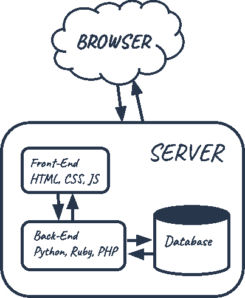
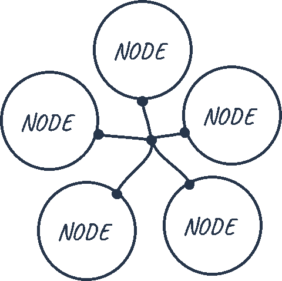
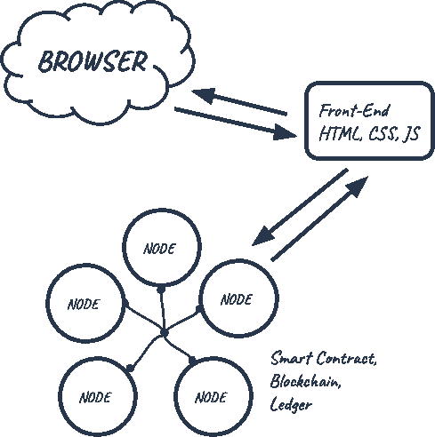
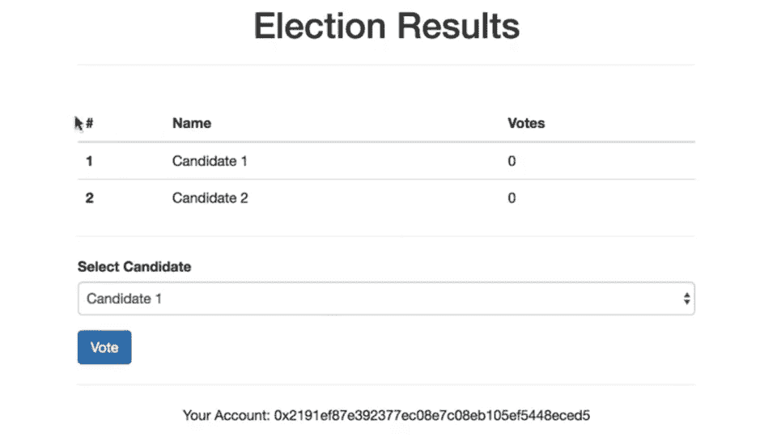
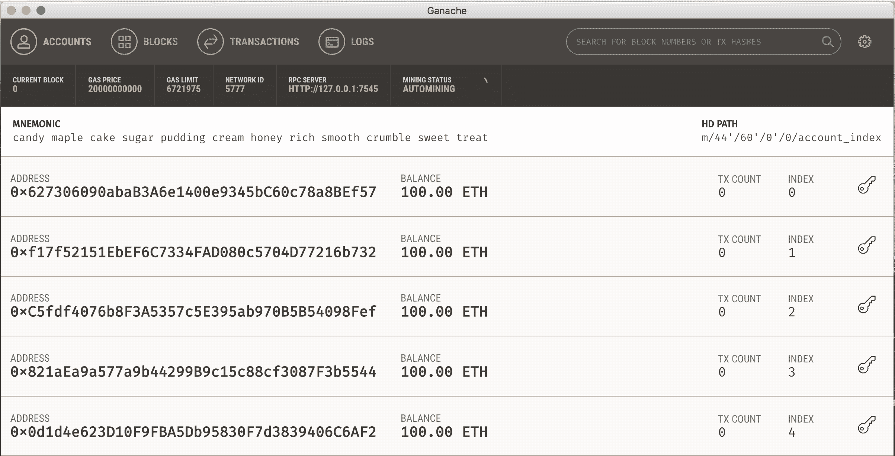
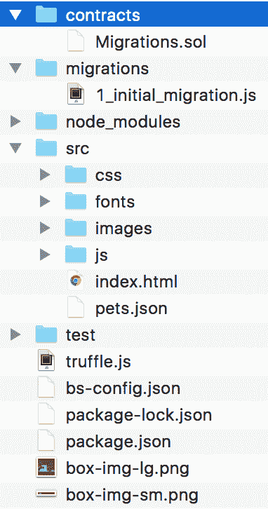
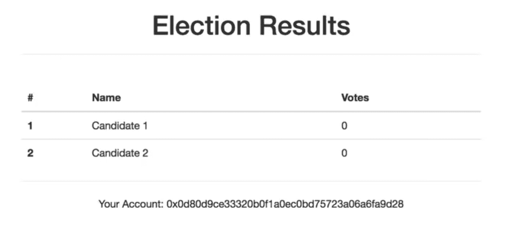
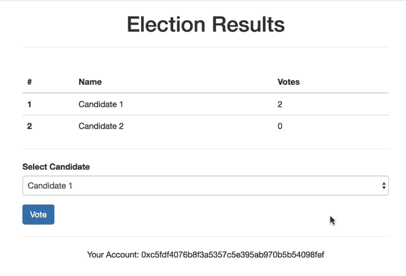
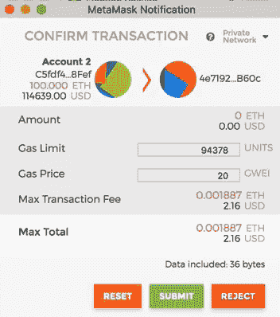

# 以太坊 Dapp 终极教程(如何一步一步构建全栈去中心化应用)

> 原文：<https://www.dappuniversity.com/articles/the-ultimate-ethereum-dapp-tutorial>

作者格雷戈里·麦卡宾2022 年 12 月 1 日

大家好，我是来自 [Dapp 大学的](https://www.youtube.com/c/DappUniversity)[Gregory](https://www.twitter.com/DappUniversity)！

今天我将向你展示如何在以太坊区块链上构建你的第一个去中心化应用程序，或 dApp。我将向您展示如何编写您的第一个以太坊智能合同，其中我们将在两个候选人之间进行选举。我们将针对智能合约编写测试，将其部署到以太坊区块链，并开发一个允许帐户投票的客户端应用程序。我们还将研究一些关键概念，如“什么是区块链？”，“什么是智能合约？”，以及“dApp 如何工作？”。

[https://www.youtube.com/embed/3681ZYbDSSk](https://www.youtube.com/embed/3681ZYbDSSk)

[*JOIN MY FREE TRAINING!*](/bootcamp) *

你可以在上面 2 小时的视频中看到我构建完整的分散式应用程序。在本教程中，我还将逐步指导您。在我们开始构建我们的 dApp 之前，让我们检查一些关键概念。如果你渴望开始编码，请随意[跳到教程的下一部分](#dependencies)。😀

你也可以在这里免费下载所有视频内容到完整的 2 小时视频教程[🎉。](/free-download)

## 什么是区块链？

让我们用一个类比来理解什么是区块链以及它是如何工作的。让我们看一个 web 应用程序。



通常，当您与 web 应用程序交互时，您使用 web 浏览器通过网络连接到中央服务器。这个 web 应用程序的所有代码都保存在这个中央服务器上，所有数据都保存在一个中央数据库中。每当您处理应用程序时，都必须与 web 上的这个中央服务器进行通信。

如果我们要在 web 上构建投票应用程序，我们会遇到一些问题:

1.  数据库中的数据可能会被更改:它可能会被多次计数，或者被完全删除。
2.  web 服务器上的源代码也可以随时更改。

我们不想在网络上构建我们的应用程序。我们希望将它建立在区块链上，任何连接到网络的人都可以参加选举。我们希望确保他们的选票被计算在内，而且只被计算一次。让我们来看看它是如何工作的。

与网络、中央服务器和数据库不同，*区块链集网络和数据库于一身*。区块链是计算机的对等网络，称为节点，共享网络中的所有数据和代码。因此，如果你是一台连接到区块链的设备，你就是网络中的一个节点，你与网络中的所有其他计算机节点进行通信。您现在拥有了区块链上所有数据和代码的副本。不再有中央服务器了。只是一堆在同一个网络上互相交流的计算机。



与集中式数据库不同，区块链中跨节点共享的所有交易数据都包含在被称为块的*记录束中，这些记录被**链接在一起*** 以创建公共分类账。该公共分类账代表区块链中的所有数据。公共分类帐中的所有数据都通过加密哈希进行保护，并通过一致算法进行验证。网络上的节点参与进来，以确保分布在网络上的所有数据副本都是相同的。这是我们在区块链上构建投票应用程序的一个非常重要的原因，因为我们希望确保我们的投票被计算在内，并且不会改变。

我们应用程序的用户在区块链上投票会是什么样子？首先，用户需要一个账户，这个账户的钱包地址要有以太，以太坊的加密货币。一旦他们连接到网络，他们投下自己的一票，并支付少量交易费，以将此交易写入区块链。这个交易费叫“气”。每当投票时，网络上的一些称为矿工的节点竞争完成这一事务。完成这项交易的矿工将获得我们投票购买的乙醚。

概括地说，当我投票时，我支付汽油价格来投票，当我的投票被记录下来时，网络上的一台计算机会支付我的以太费。反过来，我相信我的投票会被永远准确地记录下来。

因此，同样重要的是要注意，在区块链上投票需要时间，但仅仅看到候选人名单并不需要时间。这是因为从区块链读取数据是免费的，但写入数据却不是。

## 什么是智能合同？

这就是投票过程的工作方式，但是我们实际上如何编写我们的应用程序呢？嗯，以太坊区块链允许我们用区块链上的以太坊虚拟机(EVM)通过一种叫做智能合约的东西来执行代码。

智能合约是我们应用程序的所有业务逻辑所在。这是我们实际编写应用程序分散部分的地方。智能合约负责向区块链读写数据，以及执行业务逻辑。智能联系人是用一种叫做 [Solidity](https://solidity.readthedocs.io/en/v0.4.21/) 的编程语言编写的，看起来很像 Javascript。它是一种成熟的编程语言，允许我们做许多 Javascript 能做的相同类型的事情，但由于它的用例，它的行为有点不同，正如我们将在本教程中看到的。

区块链上的智能合约的功能非常类似于网络上的微服务。如果公共分类帐代表区块链的数据库层，那么智能合同就是处理该数据的所有业务逻辑所在的地方。

此外，它们被称为智能合同，因为它们代表一个契约或协议。在我们的投票 dApp 的情况下，这是一个协议，我的票将被计算在内，其他的票只被计算一次，拥有最多选票的候选人将赢得选举。

现在让我们快速看一下我们正在构建的 dApp 的结构。



我们将拥有一个用 HTML、CSS 和 Javascript 编写的传统前端客户端。这个客户端将连接到我们将要安装的本地以太坊区块链，而不是与后端服务器对话。我们将使用 Solidity 编程语言在选举智能契约中编写关于 dApp 的所有业务逻辑。我们将把这个智能合约部署到我们的本地以太网区块链，并允许帐户开始投票。

现在我们已经了解了什么是区块链以及它是如何工作的。我们已经看到了为什么我们要在区块链而不是现在的网络上建立我们的投票 dApp。我们已经看到，我们希望通过编写一个将部署到以太坊区块链的智能合约来编写我们的 dApp。现在让我们开始编程吧！

## 我们将会建造什么

这是我们将要建立的投票 dApp 的演示。



我们将构建一个客户端应用程序，它将在区块链上与我们的智能合约对话。这个客户端应用程序将有一个候选人表，列出每个候选人的 id、姓名和票数。它将有一个表格，我们可以为我们想要的候选人投票。它还在“您的帐户”下显示了我们连接到区块链的帐户。

## 安装依赖项

这部分教程的视频片段从 [8:53](https://www.youtube.com/watch?v=3681ZYbDSSk&feature=youtu.be&t=8m53s) 开始。

为了构建我们的 dApp，我们首先需要一些依赖项。

### 节点程序包管理器(NPM)

我们需要的第一个依赖项是 Node.js 附带的[节点包管理器](https://nodejs.org/en/)或 NPM。您可以查看是否已经安装了 Node，方法是在您的终端上键入:

```js
$ node -v
```

### 块菌框架

下一个依赖项是 [Truffle 框架](http://truffleframework.com/)，它允许我们在以太坊区块链上构建去中心化的应用程序。它提供了一套工具，允许我们用 Solidity 编程语言编写智能联系人。它还使我们能够测试我们的智能合同，并将其部署到区块链。它还为我们提供了一个开发客户端应用程序的地方。

您可以在命令行中安装带有 NPM 的松露，如下所示:

```js
$ npm install -g truffle
```

### 加纳切

下一个依赖项是 [Ganache](http://truffleframework.com/ganache) ，一个本地内存中的区块链。你可以通过[从松露框架网站](http://truffleframework.com/ganache)下载安装 Ganache。它会给我们 10 个外部帐户的地址在我们当地的以太坊区块链。每个账户都预装了 100 个假乙醚。

### Metamask

下一个依赖项是 Google Chrome 的[元掩码扩展。为了使用区块链，我们必须连接到它(记住，我说过区块链**是**网络)。为了使用以太坊区块链，我们必须安装一个特殊的浏览器扩展。这就是 metamask 的用武之地。我们将能够用我们的个人账户连接到我们当地的以太坊区块链，并与我们的智能合约进行交互。](https://chrome.google.com/webstore/detail/metamask/nkbihfbeogaeaoehlefnkodbefgpgknn?hl=en)

在本教程中，我们将使用 Metamask chrome 扩展，所以如果你还没有谷歌 chrome 浏览器，你也需要安装它。要安装 Metamask，请在 Google Chrome 网络商店中搜索 Metamask Chrome 插件。一旦你安装了它，确保它在你的扩展列表中被选中。安装 Chrome 浏览器后，你会在浏览器的右上角看到狐狸图标。如果遇到困难，请参考视频演示！

### 语法突出显示

依赖项是可选的，但是推荐使用。我建议为 [Solidity](https://solidity.readthedocs.io/en/v0.4.21/) 编程语言安装语法高亮。大多数文本编辑器和 ide 没有突出显示语法的功能，所以你必须安装一个包来支持它。我正在使用[崇高文本](https://www.sublimetext.com/)，并且我已经下载了[“以太坊”软件包](https://packagecontrol.io/packages/Ethereum)，它提供了很好的语法高亮显示以保证可靠性。

## 烟雾测试-步骤 1

这部分教程的视频片段从 [11:40](https://www.youtube.com/watch?v=3681ZYbDSSk&feature=youtu.be&t=11m40s) 开始。你可以在这里下载这部分教程[的代码。如果你卡住了，请随意使用这些作为参考点！](https://github.com/dappuniversity/election/releases/tag/1-smoke-test)

现在我们已经安装了依赖项，让我们开始构建 dApp 吧！

首先找到你[下载 Ganache](#ganache) 的地方，打开。现在，Ganache 已经启动，您有一个本地区块链运行。



Ganache 给了我们 10 个预装了 100 个假以太的账号(这个在主以太网上一文不值)。每个帐户都有唯一的地址和私钥。在我们的选举中，每个帐户地址将作为每个选民的唯一标识符。

现在，让我们在命令行中为 dApp 创建一个项目目录，如下所示:

```js
$ mkdir election
$ cd election

```

现在我们已经进入了我们的项目，我们可以用一个[块菌盒子](http://truffleframework.com/boxes/)快速启动并运行。在本教程中，我们将使用[宠物店盒子](http://truffleframework.com/boxes/pet-shop)。在您的项目目录中，从命令行安装 pet shop box，如下所示:

```js
$ truffle unbox pet-shop
```

让我们看看宠物店盒子给了我们什么:

*   **合同目录:**这是所有智能联系人所在的位置。我们已经有了一份移民合同，处理我们到区块链的移民事宜。*   **迁移目录**:这是所有迁移文件所在的地方。这些迁移类似于其他需要迁移来改变数据库状态的 web 开发框架。每当我们在区块链部署智能合约时，我们都在更新区块链的状态，因此需要迁移。*   **node_modules 目录:**这是我们所有节点依赖项的主目录。*   src 目录:这是我们开发客户端应用程序的地方。*   测试目录:这是我们为智能合约编写测试的地方。*   **truffle.js 文件:**这是我们的 truffle 项目的主配置文件

现在让我们开始编写我们的智能合同吧！这个智能合同将包含我们 dApp 的所有业务逻辑。它将负责读取和写入以太坊区块链。它将允许我们列出将参加选举的候选人，并跟踪所有的选票和选民。它还将管理选举的所有规则，比如强制帐户只能投票一次。从项目的根目录开始，在 contracts 目录中创建一个新的合同文件，如下所示:

```js
$ touch contracts/Election.sol
```

让我们从创建一个“冒烟测试”开始，它将确保我们已经正确地设置了我们的项目，并且我们可以成功地将合同部署到区块链。打开文件，从以下代码开始:

```js
pragma solidity 0.4.2;

contract Election {
    // Read/write candidate
    string public candidate;

    // Constructor
    function Election () public {
        candidate = "Candidate 1";
    }
}

```

我来解释一下这段代码。我们从用`pragma solidity`语句声明 solidity 版本开始。接下来，我们用“contract”关键字声明智能合约，后跟合约名称。接下来，我们声明一个状态变量，它将存储候选人姓名的值。状态变量允许我们将数据写入区块链。我们已经声明这个变量将是一个字符串，并且我们已经将它的可见性设置为`public`。因为它是公共的，solidity 将免费给我们一个 getter 函数，允许我们在契约之外访问这个值。我们将在稍后的控制台中看到这一点！

然后，我们创建一个构造函数，每当我们将智能合约部署到区块链时，都会调用这个函数。在这里，我们将设置候选状态变量的值，该变量将在迁移时存储到区块链中。请注意，构造函数与智能协定同名。Solidity 就是这样知道函数是构造函数的。

现在，我们已经为智能合约创建了基础，让我们看看是否可以将它部署到区块链。为此，我们需要在迁移目录中创建新文件。从项目根目录中，通过命令行创建一个新文件，如下所示:

```js
$ touch migrations/2_deploy_contracts.js
```

请注意，我们用数字给迁移目录中的所有文件编号，以便 Truffle 知道以什么顺序执行它们。让我们创建一个新的迁移来部署合同，如下所示:

```js
var Election = artifacts.require("./Election.sol");

module.exports = function(deployer) {
  deployer.deploy(Election);
};

```

首先，我们需要我们已经创建的契约，并将其分配给一个名为“Election”的变量。接下来，我们将它添加到已部署契约的清单中，以确保它在我们运行迁移时得到部署。现在，让我们像这样从命令行运行我们的迁移:

```js
$ truffle migrate
```

现在我们已经成功地将智能合约迁移到本地以太坊区块链，让我们打开控制台与智能合约进行交互。您可以从命令行打开 truffle 控制台，如下所示:

```js
$ truffle console
```

现在我们已经进入了控制台，让我们获取一个已部署的智能契约的实例，看看是否可以从契约中读取候选人的姓名。从控制台中，运行以下代码:

```js
Election.deployed().then(function(instance) { app = instance })
```

这里的`Election`是我们在迁移文件中创建的变量的名称。我们用`deployed()`函数检索了一个已部署的契约实例，并将其分配给 promise 回调函数中的一个`app`变量。起初这可能看起来有点混乱，但你可以参考[21:50](https://www.youtube.com/watch?v=3681ZYbDSSk&feature=youtu.be&t=21m50s)视频中的控制台演示以获得进一步的解释。

现在我们可以这样读取候选变量的值:

```js
app.candidate()
// => 'Candidate 1' 

```

恭喜你！您刚刚编写了第一个智能合同，部署到区块链，并检索了其中的一些数据。

## 列出候选人-步骤 2

这部分教程的视频片段从 [27:11](https://www.youtube.com/watch?v=3681ZYbDSSk&feature=youtu.be&t=27m11s) 开始。你可以在这里下载这部分教程[的代码。如果你卡住了，请随意使用这些作为参考点！](https://github.com/dappuniversity/election/releases/tag/2-list-candidates)

现在一切都设置妥当了，让我们继续通过列出将参加选举的候选人来建立聪明的联系。我们需要一种方法来存储多个候选项，并存储每个候选项的多个属性。我们希望跟踪候选人的 id、姓名和票数。以下是我们对候选人的建模方式:

```js
contract Election {
    // Model a Candidate
    struct Candidate {
        uint id;
        string name;
        uint voteCount;
    }

    // ...
}

```

我们已经用[实体结构](https://solidity.readthedocs.io/en/v0.4.21/structure-of-a-contract.html?highlight=struct#structure-struct-types)为候选人建模。坚固性允许我们创建自己的结构类型，就像我们在这里为我们的候选人所做的那样。我们指定该结构具有无符号整数类型的 id、字符串类型的名称和无符号整数类型的 voteCount。简单地声明这个结构实际上不会给我们一个候选。在将它写入存储之前，我们需要将其实例化并将其赋给一个变量。

接下来我们需要一个存放候选人的地方。我们需要一个地方来存储我们刚刚创建的一个结构类型。我们可以用[实度贴图来做到这一点。](https://solidity.readthedocs.io/en/v0.4.21/types.html?highlight=mapping#mappings)Solidity 中的映射就像一个关联数组或散列，它关联键值对。我们可以创建这样的映射:

```js
contract Election {
    // Model a Candidate
    struct Candidate {
        uint id;
        string name;
        uint voteCount;
    }

    // Read/write Candidates
    mapping(uint => Candidate) public candidates;

    // ...
}

```

在这种情况下，映射的键是一个[无符号整数](https://solidity.readthedocs.io/en/v0.4.21/abi-spec.html?highlight=unsigned%20integer)，值是我们刚刚定义的候选结构类型。这实质上为我们提供了基于 id 的每个候选人的查找。因为这个映射被分配给一个状态变量，所以只要我们给它分配新的键值对，我们就会把数据写入区块链。接下来，我们将这个映射的 visibility 设置为`public`，以便获得一个 getter 函数，就像我们在 smoke 测试中对候选人姓名所做的那样。

接下来，我们使用如下计数器缓存状态变量来跟踪选举中有多少候选人:

```js
contract Election {
    // Model a Candidate
    struct Candidate {
        uint id;
        string name;
        uint voteCount;
    }

    // Read/write Candidates
    mapping(uint => Candidate) public candidates;

    // Store Candidates Count
    uint public candidatesCount;

    // ...
}

```

在 Solidity 中，没有办法确定映射的大小，也没有办法迭代它。这是因为映射中任何尚未赋值的键都将返回默认值(在本例中为空)。例如，如果我们在这次选举中只有 2 名候选人，并且我们试图查找候选人#99，那么映射将返回一个空的候选人结构。这种行为使得我们无法知道有多少候选项存在，因此我们必须使用计数器缓存。

接下来，让我们创建一个函数，将候选项添加到我们已经创建的映射中，如下所示:

```js
contract Election {
    // ...

    function addCandidate (string _name) private {
        candidatesCount ++;
        candidates[candidatesCount] = Candidate(candidatesCount, _name, 0);
    }
}

```

我们已经声明了函数`addCandidate`,它接受一个字符串类型的参数，表示候选人的姓名。在函数内部，我们递增候选计数器缓存，以表示已经添加了一个新的候选。然后，我们用一个新的候选结构更新映射，使用当前的候选计数作为键。此候选结构用当前候选计数中的候选 id、函数参数中的名称以及初始投票计数初始化为 0。注意，这个函数的可见性是私有的，因为我们只想在契约内部调用它。

现在，我们可以通过在构造函数中调用两次“addCandidate”函数向选举中添加两个候选人，如下所示:

```js
contract Election {
    // ...

    function Election () public {
        addCandidate("Candidate 1");
        addCandidate("Candidate 2");
    }

    // ...
}

```

当我们将合同部署到区块链，并用两个候选人填充我们的选举时，将执行该迁移。此时，您的完整合同代码应该如下所示:

```js
pragma solidity ^0.4.2;

contract Election {
    // Model a Candidate
    struct Candidate {
        uint id;
        string name;
        uint voteCount;
    }

    // Read/write candidates
    mapping(uint => Candidate) public candidates;

    // Store Candidates Count
    uint public candidatesCount;

    function Election () public {
        addCandidate("Candidate 1");
        addCandidate("Candidate 2");
    }

    function addCandidate (string _name) private {
        candidatesCount ++;
        candidates[candidatesCount] = Candidate(candidatesCount, _name, 0);
    }

}

```

现在，让我们像这样迁移我们的合同:

```js
$ truffle migrate --reset
```

现在尝试在控制台内与候选人互动。当我在 37:31 的视频中演示时，你可以跟着我一起看。我把这个留给你做练习。😀

现在让我们编写一些测试来确保我们的智能契约被正确初始化。首先，让我解释一下为什么在开发智能合同时测试如此重要。我们希望确保合同没有 bug，原因如下:

1.以太坊区块链上的所有代码都是不可变的；它不能改变。如果合同包含任何错误，我们必须禁用它并部署一个新的副本。这个新副本与旧合同的状态不同，地址也不同。

2.部署契约需要耗费大量资源，因为它会创建一个事务并将数据写入区块链。这需要消耗乙醚，而我们希望尽可能减少乙醚的用量。

3.如果写入区块链的任何契约函数包含错误，调用该函数的帐户可能会浪费资源，并且它可能不会按照预期的方式运行。

### 测试

现在让我们写一些测试。确保首先运行 Ganache。然后，在命令行中从项目的根目录创建一个新的测试文件，如下所示:

```js
$ touch test/election.js
```

我们将在这个文件中用 Javascript 编写所有的测试，用[Mocha 测试框架](https://mochajs.org/)和[Chai 断言库](http://www.chaijs.com/)。这些都与 Truffle 框架捆绑在一起。我们将使用 Javascript 编写所有这些测试来模拟客户端与智能合约的交互，就像我们在控制台中所做的一样。以下是测试的所有代码:

```js
var Election = artifacts.require("./Election.sol");

contract("Election", function(accounts) {
  var electionInstance;

  it("initializes with two candidates", function() {
    return Election.deployed().then(function(instance) {
      return instance.candidatesCount();
    }).then(function(count) {
      assert.equal(count, 2);
    });
  });

  it("it initializes the candidates with the correct values", function() {
    return Election.deployed().then(function(instance) {
      electionInstance = instance;
      return electionInstance.candidates(1);
    }).then(function(candidate) {
      assert.equal(candidate[0], 1, "contains the correct id");
      assert.equal(candidate[1], "Candidate 1", "contains the correct name");
      assert.equal(candidate[2], 0, "contains the correct votes count");
      return electionInstance.candidates(2);
    }).then(function(candidate) {
      assert.equal(candidate[0], 2, "contains the correct id");
      assert.equal(candidate[1], "Candidate 2", "contains the correct name");
      assert.equal(candidate[2], 0, "contains the correct votes count");
    });
  });
});

```

我来解释一下这段代码。首先，我们需要要求契约并将其赋给一个变量，就像我们在迁移文件中所做的那样。接下来，我们调用“契约”函数，并在回调函数中编写我们所有的测试。这个回调函数提供了一个“accounts”变量，代表我们的区块链上的所有帐户，由 Ganache 提供。

第一个测试通过检查候选人计数是否等于 2 来检查合同是否用正确的候选人数量进行了初始化。

下一个测试检查选举中每个候选人的值，确保每个候选人都有正确的 id、姓名和票数。

现在让我们从命令行运行测试，如下所示:

```js
$ truffle test
```

耶，他们通过了！🎉如果你被卡住了，你可以在我写这些测试的视频中跟我一起做进一步的解释。

### 客户端应用程序

现在，让我们开始构建将与我们的智能合约对话的客户端应用程序。我们将通过修改上一节中安装的 Truffle Pet Shop box 附带的 HTML 和 Javascript 文件来实现这一点。我们将使用现有的代码开始。让我们也注意一下松露宠物店盒子附带的一些其他东西，比如[引导框架](https://getbootstrap.com/)，这将使我们在本教程中不必编写任何 CSS。我们还得到了 [lite-server](https://www.npmjs.com/package/light-server) ，它将为我们的资产提供开发服务。

您不必成为前端专家，也可以学习本教程的这一部分。我有意保持 HTML 和 Javascript 代码非常简单，我们不会花太多时间在这上面。我想继续专注于开发我们 dApp 的智能合同部分！

继续用以下代码替换“index.html”文件的所有内容:

```js
<!DOCTYPE html>
<html lang="en">
  <head>
    <meta charset="utf-8">
    <meta http-equiv="X-UA-Compatible" content="IE=edge">
    <meta name="viewport" content="width=device-width, initial-scale=1">
    <title>Election Results</title>

    <!-- Bootstrap -->
    <link href="css/bootstrap.min.css" rel="stylesheet">
  </head>
  <body>
    <div class="container" style="width: 650px;">
      <div class="row">
        <div class="col-lg-12">
          <h1 class="text-center">Election Results</h1>
          <hr/>
          <br/>
          <div id="loader">
            <p class="text-center">Loading...</p>
          </div>
          <div id="content" style="display: none;">
            <table class="table">
              <thead>
                <tr>
                  <th scope="col">#</th>
                  <th scope="col">Name</th>
                  <th scope="col">Votes</th>
                </tr>
              </thead>
              <tbody id="candidatesResults">
              </tbody>
            </table>
            <hr/>
            <p id="accountAddress" class="text-center"></p>
          </div>
        </div>
      </div>
    </div>

    <!-- jQuery (necessary for Bootstrap's JavaScript plugins) -->
    <script src="https://ajax.googleapis.com/ajax/libs/jquery/1.12.4/jquery.min.js"></script>
    <!-- Include all compiled plugins (below), or include individual files as needed -->
    <script src="js/bootstrap.min.js"></script>
    <script src="js/web3.min.js"></script>
    <script src="js/truffle-contract.js"></script>
    <script src="js/app.js"></script>
  </body>
</html>

```

接下来，用以下代码替换“app.js”文件的所有内容:

```js
App = {
  web3Provider: null,
  contracts: {},
  account: '0x0',

  init: function() {
    return App.initWeb3();
  },

  initWeb3: function() {
    if (typeof web3 !== 'undefined') {
      // If a web3 instance is already provided by Meta Mask.
      App.web3Provider = web3.currentProvider;
      web3 = new Web3(web3.currentProvider);
    } else {
      // Specify default instance if no web3 instance provided
      App.web3Provider = new Web3.providers.HttpProvider('http://localhost:7545');
      web3 = new Web3(App.web3Provider);
    }
    return App.initContract();
  },

  initContract: function() {
    $.getJSON("Election.json", function(election) {
      // Instantiate a new truffle contract from the artifact
      App.contracts.Election = TruffleContract(election);
      // Connect provider to interact with contract
      App.contracts.Election.setProvider(App.web3Provider);

      return App.render();
    });
  },

  render: function() {
    var electionInstance;
    var loader = $("#loader");
    var content = $("#content");

    loader.show();
    content.hide();

    // Load account data
    web3.eth.getCoinbase(function(err, account) {
      if (err === null) {
        App.account = account;
        $("#accountAddress").html("Your Account: " + account);
      }
    });

    // Load contract data
    App.contracts.Election.deployed().then(function(instance) {
      electionInstance = instance;
      return electionInstance.candidatesCount();
    }).then(function(candidatesCount) {
      var candidatesResults = $("#candidatesResults");
      candidatesResults.empty();

      for (var i = 1; i <= candidatesCount; i++) {
        electionInstance.candidates(i).then(function(candidate) {
          var id = candidate[0];
          var name = candidate[1];
          var voteCount = candidate[2];

          // Render candidate Result
          var candidateTemplate = "<tr><th>" + id + "</th><td>" + name + "</td><td>" + voteCount + "</td></tr>"
          candidatesResults.append(candidateTemplate);
        });
      }

      loader.hide();
      content.show();
    }).catch(function(error) {
      console.warn(error);
    });
  }
};

$(function() {
  $(window).load(function() {
    App.init();
  });
});

```

让我们注意一下这段代码做的一些事情:

1.  **设置 web3:** [web3.js](https://web3js.readthedocs.io/en/1.0/) 是一个 javascript 库，允许我们的客户端应用程序与区块链对话。我们在“initWeb3”函数中配置 web3。
2.  **初始化契约:**我们在这个函数中获取智能契约的已部署实例，并分配一些值，允许我们与它进行交互。
3.  **Render 函数:**Render 函数使用智能合约中的数据来布局页面上的所有内容。现在，我们列出我们在智能合同中创建的候选人。我们通过遍历映射中的每个候选项，并将其呈现到表中来实现这一点。我们还在这个函数中获取连接到区块链的当前帐户，并将其显示在页面上。

你可以[在 57:21](https://www.youtube.com/watch?v=3681ZYbDSSk&feature=youtu.be&t=57m21s) 的视频里看我更深入的解释这段代码。

现在让我们在浏览器中查看客户端应用程序。首先，确保您已经像这样迁移了合同:

```js
$ truffle migrate --reset
```

接下来，从命令行启动开发服务器，如下所示:

```js
$ npm run dev
```

这应该会自动打开一个包含您的客户端应用程序的新浏览器窗口。


请注意，您的应用程序显示“正在加载...”。那是因为我们还没有登录到区块链！为了连接到区块链，我们需要将其中一个帐户从 Ganache 导入 Metamask。你可以[在 1:09:05](https://youtu.be/3681ZYbDSSk?t=1h9m5s) 的视频里看我设置 Metamask。

一旦您与 Metamask 建立了连接，您应该会看到所有的合同和帐户数据都已加载。



## 投票-步骤 3

本教程这一部分的视频片段从 [1:13:39](https://youtu.be/3681ZYbDSSk?t=1h13m39s) 开始。你可以在这里下载这部分教程[的代码。如果你卡住了，请随意使用这些作为参考点！](https://github.com/dappuniversity/election/releases/tag/3-cast-votes)

现在让我们添加在选举中投票的能力。让我们定义一个映射到智能合同的“选民”来跟踪在选举中投票的帐户，如下所示:

```js
contract Election {
    // ...

    // Store accounts that have voted
    mapping(address => bool) public voters;

    // ...
}

```

现在让我们添加一个“投票”功能:

```js
contract Election {
    // ...

    // Store accounts that have voted
    mapping(address => bool) public voters;

    // ...

    function vote (uint _candidateId) public {
        // require that they haven't voted before
        require(!voters[msg.sender]);

        // require a valid candidate
        require(_candidateId > 0 && _candidateId <= candidatesCount);

        // record that voter has voted
        voters[msg.sender] = true;

        // update candidate vote Count
        candidates[_candidateId].voteCount ++;
    }
}

```

该函数的核心功能是通过从“candidates”映射中读取候选结构并使用递增运算符(++)将“vote count”增加 1 来增加候选人的投票数。让我们看看它的其他一些功能:

1.  它接受一个参数。这是一个带有候选人 id 的无符号整数。
2.  它的可见性是公开的，因为我们希望外部帐户调用它。
3.  它将投票的帐户添加到我们刚刚创建的选民映射中。这将使我们能够跟踪选民在选举中的投票情况。我们使用 Solidity 提供的全局变量“msg.sender”来访问调用这个函数的帐户。
4.  它实现了 require 语句，如果不满足条件，这些语句将停止执行。首先要求投票人以前没有投票。为此，我们从映射中读取带有“msg.sender”的帐户地址。如果在的话，账户已经投了。接下来，它要求候选人 id 有效。求职者 id 必须大于零且小于或等于求职者总数。

现在，您的完整合同代码应该如下所示:

```js
pragma solidity ^0.4.2;

contract Election {
    // Model a Candidate
    struct Candidate {
        uint id;
        string name;
        uint voteCount;
    }

    // Store accounts that have voted
    mapping(address => bool) public voters;
    // Read/write candidates
    mapping(uint => Candidate) public candidates;
    // Store Candidates Count
    uint public candidatesCount;

    function Election () public {
        addCandidate("Candidate 1");
        addCandidate("Candidate 2");
    }

    function addCandidate (string _name) private {
        candidatesCount ++;
        candidates[candidatesCount] = Candidate(candidatesCount, _name, 0);
    }

    function vote (uint _candidateId) public {
        // require that they haven't voted before
        require(!voters[msg.sender]);

        // require a valid candidate
        require(_candidateId > 0 && _candidateId <= candidatesCount);

        // record that voter has voted
        voters[msg.sender] = true;

        // update candidate vote Count
        candidates[_candidateId].voteCount ++;
    }
}

```

请观看我在 1:13:58 对投票进行的深入解释。你也可以在 1:20:38 在控制台看我[演示投票。](https://youtu.be/3681ZYbDSSk?t=1h20m38s)

### 测试投票功能

现在让我们向“election.js”测试文件添加一个测试:

```js
it("allows a voter to cast a vote", function() {
    return Election.deployed().then(function(instance) {
      electionInstance = instance;
      candidateId = 1;
      return electionInstance.vote(candidateId, { from: accounts[0] });
    }).then(function(receipt) {
      return electionInstance.voters(accounts[0]);
    }).then(function(voted) {
      assert(voted, "the voter was marked as voted");
      return electionInstance.candidates(candidateId);
    }).then(function(candidate) {
      var voteCount = candidate[2];
      assert.equal(voteCount, 1, "increments the candidate's vote count");
    })
  });

```

我们想在这里测试两件事:

1.  测试该函数是否会增加候选人的投票数。
2.  测试投票人在投票时是否被添加到映射中。

接下来，我们可以为我们的功能需求编写一些测试。让我们编写一个测试来确保我们的投票函数为双重投票抛出一个异常:

```js
it("throws an exception for invalid candidates", function() {
    return Election.deployed().then(function(instance) {
      electionInstance = instance;
      return electionInstance.vote(99, { from: accounts[1] })
    }).then(assert.fail).catch(function(error) {
      assert(error.message.indexOf('revert') >= 0, "error message must contain revert");
      return electionInstance.candidates(1);
    }).then(function(candidate1) {
      var voteCount = candidate1[2];
      assert.equal(voteCount, 1, "candidate 1 did not receive any votes");
      return electionInstance.candidates(2);
    }).then(function(candidate2) {
      var voteCount = candidate2[2];
      assert.equal(voteCount, 0, "candidate 2 did not receive any votes");
    });
  });

```

我们可以断言事务失败，并返回一条错误消息。我们可以深入研究这个错误消息，以确保错误消息包含“revert”子字符串。然后，我们可以通过确保候选人没有收到任何投票来确保我们的合同状态没有改变。

现在让我们编写一个测试来确保我们防止双重投票:

```js
it("throws an exception for double voting", function() {
    return Election.deployed().then(function(instance) {
      electionInstance = instance;
      candidateId = 2;
      electionInstance.vote(candidateId, { from: accounts[1] });
      return electionInstance.candidates(candidateId);
    }).then(function(candidate) {
      var voteCount = candidate[2];
      assert.equal(voteCount, 1, "accepts first vote");
      // Try to vote again
      return electionInstance.vote(candidateId, { from: accounts[1] });
    }).then(assert.fail).catch(function(error) {
      assert(error.message.indexOf('revert') >= 0, "error message must contain revert");
      return electionInstance.candidates(1);
    }).then(function(candidate1) {
      var voteCount = candidate1[2];
      assert.equal(voteCount, 1, "candidate 1 did not receive any votes");
      return electionInstance.candidates(2);
    }).then(function(candidate2) {
      var voteCount = candidate2[2];
      assert.equal(voteCount, 1, "candidate 2 did not receive any votes");
    });
  });

```

首先，我们将使用一个尚未投票的新帐户设置一个测试场景。然后我们会代表他们投票。然后我们再试着投票。我们将断言这里发生了错误。我们可以检查错误消息，并确保没有候选人收到选票，就像之前的测试一样。

现在让我们运行我们的测试:

```js
$ truffle test
```

```
Yay, they pass! 🎉
```js

### 客户端投票

让我们在“index.html”文件中添加一个允许帐户在表格下方投票的表单:

```
<form onSubmit="App.castVote(); return false;">
  <div class="form-group">
    <label for="candidatesSelect">Select Candidate</label>
    <select class="form-control" id="candidatesSelect">
    </select>
  </div>
  <button type="submit" class="btn btn-primary">Vote</button>
  <hr />
</form>

```js

让我们检查一下这个表单的一些内容:

1.  我们用一个空的 select 元素创建表单。我们将在“app.js”文件中使用智能合同提供的候选人来填充选择选项。
2.  该表单有一个调用“castVote”函数的“onSubmit”处理程序。我们将在“app.js”文件中对此进行定义。

现在让我们更新我们的 app.js 文件来处理这两件事。首先，我们在表单的 select 元素中列出智能合同的所有候选人。然后，一旦帐户投票，我们将隐藏页面上的表单。我们将更新渲染函数，如下所示:

```
render: function() {
  var electionInstance;
  var loader = $("#loader");
  var content = $("#content");

  loader.show();
  content.hide();

  // Load account data
  web3.eth.getCoinbase(function(err, account) {
    if (err === null) {
      App.account = account;
      $("#accountAddress").html("Your Account: " + account);
    }
  });

  // Load contract data
  App.contracts.Election.deployed().then(function(instance) {
    electionInstance = instance;
    return electionInstance.candidatesCount();
  }).then(function(candidatesCount) {
    var candidatesResults = $("#candidatesResults");
    candidatesResults.empty();

    var candidatesSelect = $('#candidatesSelect');
    candidatesSelect.empty();

    for (var i = 1; i <= candidatesCount; i++) {
      electionInstance.candidates(i).then(function(candidate) {
        var id = candidate[0];
        var name = candidate[1];
        var voteCount = candidate[2];

        // Render candidate Result
        var candidateTemplate = "<tr><th>" + id + "</th><td>" + name + "</td><td>" + voteCount + "</td></tr>"
        candidatesResults.append(candidateTemplate);

        // Render candidate ballot option
        var candidateOption = "<option value='" + id + "' >" + name + "</ option>"
        candidatesSelect.append(candidateOption);
      });
    }
    return electionInstance.voters(App.account);
  }).then(function(hasVoted) {
    // Do not allow a user to vote
    if(hasVoted) {
      $('form').hide();
    }
    loader.hide();
    content.show();
  }).catch(function(error) {
    console.warn(error);
  });
}

```js

接下来，我们要编写一个函数，每当提交表单时都会调用这个函数:

```
castVote: function() {
    var candidateId = $('#candidatesSelect').val();
    App.contracts.Election.deployed().then(function(instance) {
      return instance.vote(candidateId, { from: App.account });
    }).then(function(result) {
      // Wait for votes to update
      $("#content").hide();
      $("#loader").show();
    }).catch(function(err) {
      console.error(err);
    });
  }

```js

首先，我们在表单中查询 candidateId。当我们从智能契约中调用 vote 函数时，我们传递这个 id，并向当前帐户提供函数的“from”元数据。这将是一个异步调用。完成后，我们将显示加载器并隐藏页面内容。每当记录投票时，我们将反其道而行之，再次向用户显示内容。

现在，您的前端应用程序应该如下所示:



继续并尝试投票功能。一旦你这样做，你应该看到一个元掩码确认弹出如下:



一旦你点击提交，你就成功地投了一票！您仍会看到一个加载屏幕。现在，您必须刷新页面才能看到记录的投票。我们将在下一节中实现自动更新加载程序的功能。如果你被卡住了，你可以在这里的教程[中参考完整的客户端代码。](https://github.com/dappuniversity/election)

## 观察事件-步骤 4

这部分教程的视频片段从 [1:48:05](https://youtu.be/3681ZYbDSSk?t=1h48m05s) 开始。你可以在这里下载这部分教程[的代码。如果你卡住了，请随意使用这些作为参考点！](https://github.com/dappuniversity/election/releases/tag/4-watch-events)

本教程的最后一步是每当投票时触发一个事件。这将允许我们在帐户投票时更新我们的客户端应用程序。幸运的是，这相当容易。让我们首先像这样在我们的契约中声明一个事件:

```
contract Election {
    // ...
    event votedEvent (
        uint indexed _candidateId
    );
    // ...
}

```js

现在，我们可以在“投票”函数中触发这个“投票”事件，如下所示:

```
function vote (uint _candidateId) public {
    // require that they haven't voted before
    require(!voters[msg.sender]);

    // require a valid candidate
    require(_candidateId > 0 && _candidateId <= candidatesCount);

    // record that voter has voted
    voters[msg.sender] = true;

    // update candidate vote Count
    candidates[_candidateId].voteCount ++;

    // trigger voted event
    votedEvent(_candidateId);
}

```js

既然我们已经更新了合同，我们必须运行我们的迁移:

```
$ truffle migrate --reset
```js

我们也可以像这样更新我们的测试来检查这个投票事件:

```
it("allows a voter to cast a vote", function() {
  return Election.deployed().then(function(instance) {
    electionInstance = instance;
    candidateId = 1;
    return electionInstance.vote(candidateId, { from: accounts[0] });
  }).then(function(receipt) {
    assert.equal(receipt.logs.length, 1, "an event was triggered");
    assert.equal(receipt.logs[0].event, "votedEvent", "the event type is correct");
    assert.equal(receipt.logs[0].args._candidateId.toNumber(), candidateId, "the candidate id is correct");
    return electionInstance.voters(accounts[0]);
  }).then(function(voted) {
    assert(voted, "the voter was marked as voted");
    return electionInstance.candidates(candidateId);
  }).then(function(candidate) {
    var voteCount = candidate[2];
    assert.equal(voteCount, 1, "increments the candidate's vote count");
  })
});

```js

该测试检查由“vote”函数返回的交易收据，以确保它有日志。这些日志包含触发的事件。我们检查事件的类型是否正确，以及它是否有正确的候选 id。

现在让我们更新客户端应用程序来监听投票事件，并在它被触发时触发页面刷新。我们可以用如下的“listenForEvents”函数来实现:

```
listenForEvents: function() {
  App.contracts.Election.deployed().then(function(instance) {
    instance.votedEvent({}, {
      fromBlock: 0,
      toBlock: 'latest'
    }).watch(function(error, event) {
      console.log("event triggered", event)
      // Reload when a new vote is recorded
      App.render();
    });
  });
}

```js

这个函数做一些事情。首先，我们通过调用“voted event”函数来订阅投票事件。我们传入一些元数据，告诉我们要监听区块链上的所有事件。然后我们“看”这个事件。在这里，每当触发“votedEvent”时，我们都会记录到控制台。我们还重新呈现页面上的所有内容。这将在投票记录完成后删除加载器，并在表格上显示更新后的投票数。

最后，无论何时初始化契约，我们都可以调用这个函数:

```
initContract: function() {
  $.getJSON("Election.json", function(election) {
    // Instantiate a new truffle contract from the artifact
    App.contracts.Election = TruffleContract(election);
    // Connect provider to interact with contract
    App.contracts.Election.setProvider(App.web3Provider);

    App.listenForEvents();

    return App.render();
  });
}

```

现在，您可以在您的客户端应用程序上投票，并实时观看记录的投票！请耐心等待，事件触发可能需要几秒钟时间。如果您没有看到事件，请尝试重新启动 Chrome。围绕事件的元掩码有一个已知问题[。重启 Chrome 总能帮我搞定。](https://github.com/MetaMask/metamask-extension/issues/2393)

恭喜你！🎉您已经在以太坊区块链上成功构建了一个全栈分散式应用程序！你可以在这里下载本教程的完整源代码[，在这里](https://github.com/dapp_university/election)观看完整视频[。](https://www.youtube.com/watch?v=3681ZYbDSSk)

对这个教程满意吗？然后你**需要**到[在这里参加我的免费培训](/bootcamp)，我将向你展示如何构建一个真实世界的区块链应用程序，这样你就可以成为一名高薪的区块链开发者！

*