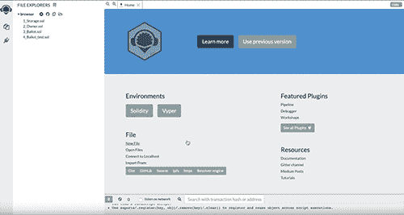
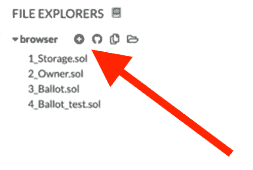
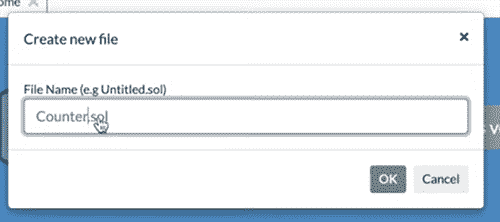
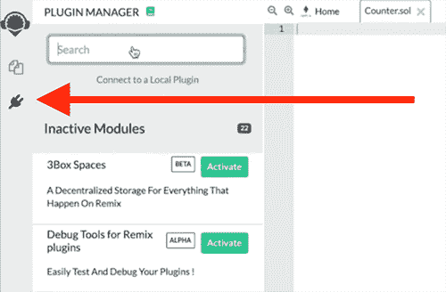
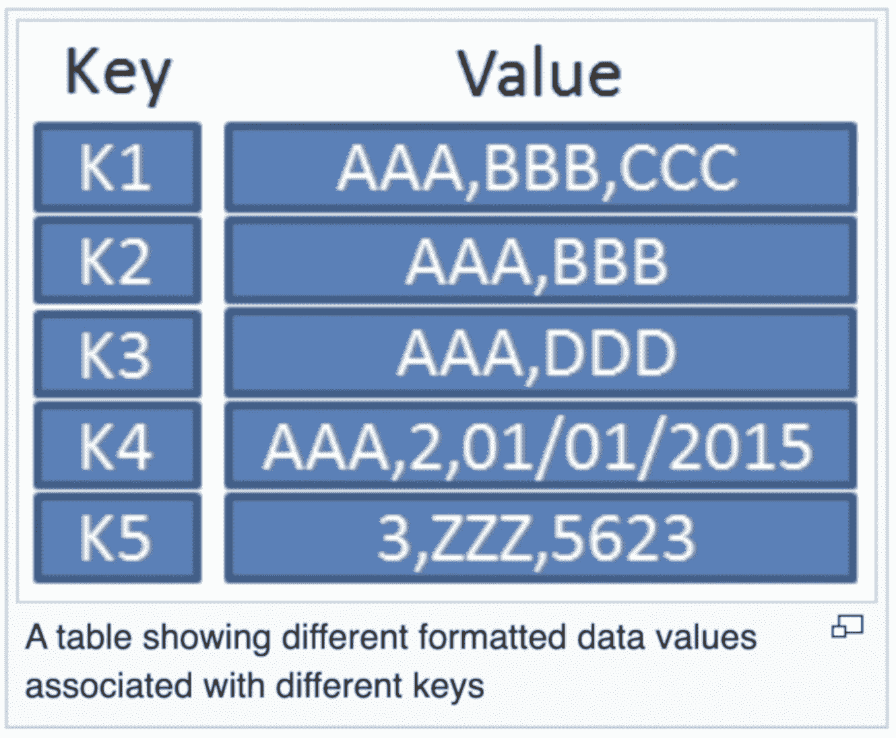

# 区块链的主要可靠性:分步指南

> 原文：<https://www.dappuniversity.com/articles/solidity>

作者格雷戈里·麦卡宾2022 年 12 月 1 日


区块链是近年来进入技术领域的最具颠覆性的力量之一。开发人员现在有能力创建下一波分散式应用程序，为 Web 3.0 的未来提供动力。

为了利用这种能力，您必须掌握创建以太坊智能合约的 Solidity 编程语言。本指南将一步一步地告诉你如何去做。

[https://www.youtube.com/embed/pqxNmdwEHio](https://www.youtube.com/embed/pqxNmdwEHio)

不要担心，你不需要已经是一名程序员或者了解任何关于区块链的事情就可以开始了。我会从头给你看一切。

通过遵循本指南中的每个模块，您将获得高价值的智能合同开发与可靠性，以及对区块链如何工作的深刻理解。每个模块都包含代码示例以及分步视频说明。


最棒的是，你可以直接在你的网络浏览器中开始编写 Solidity，而不需要在我们的电脑上安装任何东西。您不必担心创建 ui、编写测试或类似的事情。

准备好开始了吗？我们开始吧。

## 目录

*   [Pt 1:你的第一份 Solidity Smart 合同](#part1)
*   [第二部分:坚固性基础知识](#part2)
*   [第三部分:坚固性数组](#part3)
*   [Pt 4:实度映射](#part4)
*   第五部分:可靠性循环&条件句
*   [Pt 6:一份完全可靠的智能合同](#part6)

## 第 1 部分:您的第一份 Solidity Smart 合同

没有比写作更好的学习方法了。在这一节中，你将通过使用 Solidity 编程语言创建你的第一个以太坊智能合约来了解区块链是如何工作的。

在我们开始之前，让我说几句关于可靠性的话。这是一种非常初学者友好的语言，看起来很像其他常见的编程语言，如 C++、JavaScript 和 Python。如果你已经知道这些语言中的任何一种，你将会有巨大的优势。如果没有，不用担心，它很容易拿起。

Solidity 是一种静态类型语言，支持继承和外部库。这是一种成熟的编程语言，能够编写复杂的应用程序。



正如承诺的那样，我们将使用 Remix IDE 为本教程编写 web 浏览器中的所有内容。前往 remix.ethereum.org 开始吧。

在 Remix 内部，我们将能够开发智能合约，编译它们，并直接从我们的浏览器将它们部署到区块链。我们不需要在电脑上使用文本编辑器或终端。非常好看！

让我们开始为我们的第一个智能合同创建一个文件，方法是在文件浏览器中单击加号(+)按钮，如下所示:



现在让我们输入智能合约文件的名称。我们就叫它`Counter.sol`。



太好了！现在我们有了一个地方来为我们的第一个智能契约编写所有的源代码。

在我们继续之前，让我们确保混音设置正确。如果你是第一次使用混音，你可能需要做两件事:

*   添加编译器插件，以便您可以编译智能合同。
*   添加部署插件，以便您可以将智能合约部署到虚拟区块链。



要添加编译器插件，请单击左侧边栏上的插件管理器图标。然后搜索“坚固性编译器”。一旦它出现在搜索结果中，点击“激活”。你应该会在左侧边栏看到新安装的插件。

接下来，对部署插件重复这个步骤。搜索“部署”，并激活“部署和运行事务”插件。

一旦你安装了这些，你就可以编译你的智能合约，并将其部署到浏览器中的虚拟区块链中。

现在让我们回到编程上来。在我们之前创建的`Counter.sol`文件中，让我们为智能合约创建如下基本结构:

```js
pragma solidity ^0.6.0;
contract Counter {

} 
```

在这里，我们声明了我们正在使用的 Solidity 的版本，在这里是`0.6.0`。

接下来，我们用关键字`contract`创建基本的智能契约，后跟其名称`Counter`。我们将把所有剩余的代码写在花括号`{ }`中。

顾名思义，我们将创建一个计算数字的智能契约。例如，我们可以使用这个智能合约来记录游戏中的分数。它将允许我们在区块链上存储当前分数，或计数，并在我们需要时随时增加它。

为此，我们将创建一个名为`count`的新变量，如下所示:

```js
pragma solidity ^0.6.0;
contract Counter {
    uint count;
} 
```

让我解释一下这行代码的作用:

*   它创建了一个名为`count`的新变量。
*   计数是一个`uint`，代表“无符号整数”。基本上是一个非负数。例如，`1, 2, 3`是单位，但`-1, -2, -3`不是，因为它们前面有一个“减号”(因为它们是负数)。

该变量的值将存储在区块链上，因为它是一种特殊类型的变量，称为“状态变量”，而不是“局部变量”。

接下来，让我们创建一个获取当前计数的方法。我们将创建一个函数来完成这项工作:

```js
pragma solidity ^0.6.0;
contract Counter {
    uint count;

    function getCount() public view returns(uint) {
        return count;
    }
} 
```

这是一个名为`getCount()`的基本函数，它只是返回来自`count`变量的值(注意:这个值可以在这个函数内部访问，因为它是一个状态变量)。让我注意一下关于此功能的其他几个要点:

*   注意，我们已经为这个函数添加了`public`可见性，这将允许我们很快调用它的 Remix 接口(如果没有的话，我们将无法调用它)。
*   我们添加了`view`关键字，它告诉 Solidity 这是一个只读函数。
*   最后，我们指定函数返回一个`uint`，带有`returns(uint)`。

太好了！现在我们有了一个读取当前计数的函数。接下来，我们将创建一个更新计数的函数，如下所示:

```js
contract Counter {
    // ...

    function incrementCount() public {
        count = count + 1;
    }
} 
```

这个函数只是从`count`状态变量中读取值，给它加 1，并更新区块链上的`count`变量。

最后，让我们为`count`创建一个初始值:

```js
contract Counter {
    // ...

    constructor() public {
        count = 0;
    }
} 
```

这里，我们在智能合约的`constructor()`函数中将初始的`count`值设置为`0`。这是一个特殊功能，只要创建智能合同，即部署到区块链，该功能就运行一次且仅运行一次。

太好了，就这样！现在，您完成的柜台智能合同应如下所示:

```js
pragma solidity ^0.6.0;
contract Counter {
    uint count;

    constructor() public {
        count = 0;
    }

    function getCount() public view returns(uint) {
        return count;
    }

    function incrementCount() public {
        count = count + 1;
    }
} 
```

现在，让我们编译智能合同，以便我们可以使用它。点击我们之前安装的编译器插件，点击“编译契约”(如果你有困难，可以在上面的视频里面看我做这个步骤)。

接下来，找到我们之前安装的“部署和运行事务”插件，并单击橙色的“部署”按钮。

🎉耶！您已成功将您的智能合约添加到 Remix 的虚拟区块链。

现在让我们与新创建的反向契约进行交互。找到刚刚出现的“已部署合同”部分，单击柜台合同旁边的向下箭头，找到两个功能:

*   `incrementCount`
*   `getCount`

尝试点按这些按钮来观察每个功能的行为。每当你点击`incrementCount`时，它应该将计数加 1，当你点击`getCount`时，它应该返回当前计数！

在我们结束本节之前，我想快速演示一下，我们可以用一种更简单的方式重写柜台智能合约，如下所示:

```js
pragma solidity ^0.6.0;
contract Counter {
    uint public count = 0;

    function incrementCount() public {
        count ++;
    }
} 
```

让我解释一下:

*   首先，我们移除了`constructor()`函数，因为我们可以用`count = 0`存储初始值。
*   接下来，我们移除`getCount()`以支持将`public`可见性添加到`count`状态变量，即`uint public count = 0;`。当我们这样做时，Solidity 自动生成一个名为`count()`的公共函数，我们可以使用它在智能契约之外读取这个值。
*   最后，我们重写`incrementCount()`函数来使用增量运算符`++`，它只是将当前变量值加 1。

🎉恭喜你！你刚刚用 Solidity 编程语言创建了你的第一个以太坊智能合约。你正在成为区块链大师的路上。让我们进入下一节，在这里我们将讲述更多关于 Solidity 编程语言的基础知识。

## 第 2 部分:可靠性基础

[https://www.youtube.com/embed/HxlxNwgoN8w](https://www.youtube.com/embed/HxlxNwgoN8w)

现在我们继续学习 Solidity。在这一节中，我们将涵盖编程语言的更多基础知识，重点关注:

*   变量
*   数据类型
*   自定义数据结构

让我们创建一个新的智能合约来演示所有这些内容。我们将这样称呼它:

```js
pragma solidity ^0.6.0;
contract MyContract {

} 
```

首先说一下变量。Solidity 中的变量主要有两种:局部变量和状态变量。

```js
contract MyContract {

    function getValue() public pure returns(uint) {
        uint value = 1;
        return value;
    }
} 
```

这里，我创建了一个名为`getValue()`的函数，它包含一个名为`value`的局部变量。这个变量允许我们存储一个数字，并在`getValue()`函数中用它做一些事情，比如说数学。

因为`value`是一个局部变量，它有几个独特的特征:

*   它只能在 <coe>getValue()</coe> 函数中访问。您不能在智能协定外部或任何其他函数内部直接读取其值。
*   它不存储在区块链上。它存储在内存中。

接下来，让我们像这样创建一个名为`myUint`的状态变量:

```js
contract MyContract {
    uint public myUint = 1;

    // ...
} 
```

它的行为与上一步中的`value`局部变量不同。让我们看看如何:

*   它**可以从其他函数**外部访问，比如说`myFunction()`。
*   它的值可以在智能契约之外读取，因为它被声明为`public`。
*   它的值被永久写入区块链，而不是像局部变量那样保存在内存中。

接下来，我们来看看 Solidity 中的一些常见变量类型:

```js
contract MyContract {
    string public myString = "Hello, world!";
    bytes32 public myBytes32 = "Hello, world!";
    int public myInt = 1;
    uint public myUint = 1;
    uint256 public myUint256 = 1;
    uint8 public myUint8 = 1;
    address public myAddress = 0x5A0b54D5dc17e0AadC383d2db43B0a0D3E029c4c;
} 
```

我将解释这些是什么:

*   首先我们有一个名为`myString`的字符串，用于存储任意文本。
*   接下来是名为`myBytes32`的字节 32，它有点像字符串，但性能更好。
*   接下来，`myInt`是整数，可以是正数，也可以是负数。
*   接下来，`myUint`是一个无符号整数，这意味着它不能是负数(它不能有符号，即负号)。
*   接下来，`myUint256`是一个 256 字节的无符号整数。这用于非常大的数字。注意，`uint`是`uint256`的简写。
*   接下来，`myUint8`是一个 8 字节的无符号整数。这用于非常小的数字。
*   最后，`myAddress`用于存储外部用户或智能合约的特定以太坊地址。

最后，让我们看看 Solidity 如何允许我们创建自己的定制数据类型:

```js
contract MyContract {
    // ...

    struct MyStruct {
        uint myUint;
        string myString;
    }
} 
```

在这里，我们创建了一个名为`MyStruct`的结构，它允许我们定义特殊的数据。在这种情况下，我们指定这个结构可以保存 2 个值:一个名为`myUint`的`uint`和一个名为`myString`的字符串。

这是 Solidity 编程语言的一个强大特性，因为这意味着我们可以对任何我们想要的任意数据进行建模。例如，我们可以创建一个带有`name`和`address`的`Person`结构。在这个系列的后面会有更多的介绍。

我们刚刚编写的代码简单地定义了一个新的`MyStruct`结构。要创建一个新的，我们将这样做:

```js
contract MyContract {
    // ...

    struct MyStruct {
        uint myUint;
        string myString;
    }

    MyStruct public myStruct = MyStruct(1, "Hello, World!");
} 
```

现在，您完成的智能合同应该如下所示:

```js
pragma solidity ^0.6.0;

contract MyContract {
    string public myString = "Hello, world!";
    bytes32 public myBytes32 = "Hello, world!";
    int public myInt = 1;
    uint public myUint = 1;
    uint256 public myUint256 = 1;
    uint8 public myUint8 = 1;
    address public myAddress = 0x5A0b54D5dc17e0AadC383d2db43B0a0D3E029c4c;

    struct MyStruct {
        uint myUint;
        string myString;
    }

    MyStruct public myStruct = MyStruct(1, "Hello, World!");

    function getValue() public pure returns(uint) {
        uint value = 1;
        return value;
    }
} 
```

现在是时候测试这个智能合约的所有特性了。轮到你编译合同，并将其部署到 Remix 的虚拟区块链，以便你可以与它进行交互。请随意重温上一节的说明，或者跟着我一起看上面的视频。

🎉恭喜你！您已经介绍了 Solidity 编程语言的所有基本数据类型。在下一节中，我们将继续深入介绍您必须知道的更多基本特性。

## 第 3 部分:坚固性数组

[https://www.youtube.com/embed/7Pm9HB-mJQg](https://www.youtube.com/embed/7Pm9HB-mJQg)

现在我们来谈谈掌握 Solidity 必须知道的一个基本数据结构:数组。

数组允许我们存储排序后的信息列表，供以后访问。例如，您可以存储像 1、2、3 这样的数字列表，或者像“Adam”、“Bryan”和“Carl”这样的姓名列表。

让我们像这样创建我们的第一个数组:

```js
pragma solidity ^0.6.0;

contract MyContract {
    // Arrays
    uint[] public uintArray = [1,2,3];
} 
```

这是一个名为`uintArray`的无符号整数数组。让我解释一下:

*   首先，我们用`uint[]`声明数组和数组中包含的数据类型。在这种情况下，指定这个数组将存储`uint`。我们将不能在这里存储任何其他数据类型，比如字符串。
*   接下来，我们命名数组并用`public uintArray`声明它是公共的。
*   最后，我们用`[1,2,3]`给变量赋值。

接下来，我们可以创建一个字符串数组，如下所示:

```js
contract MyContract {
    // ...
    string[] public stringArray = ['apple', 'banana', 'carrot'];
} 
```

注意，我们使用`string[]`来声明这个数组包含字符串类型的元素。

接下来，让我们看看如何在函数中使用数组:

```js
contract MyContract {
    // ...
   function addValue(string memory _value) public {
        values.push(_value);
   }
} 
```

该函数使用`push()`函数向`values`数组添加一个新的项目。每当我们调用这个函数时，我们可以传入任意一个数字，它将被添加到数组中。

接下来，让我们创建一个确定数组大小的函数:

```js
contract MyContract {
    // ...
    function valueCount() public view returns(uint) {
        return values.length;
    }
} 
```

这个函数调用`values`数组上的`.length`，返回数组中的条目数。

最后，让我们看看数组的一个非常有趣的性质。你知道你可以在另一个数组里面创建一个数组吗？这就是二维数组。我们可以创建一个这样的:

```js
contract MyContract {
    // ...
    uint[][] public array2D = [ [1,2,3], [4,5,6] ];
} 
```

这些二维数组对于存储复杂的数据集非常有用。

就是这样！现在，您完成的智能合同应该如下所示:

```js
pragma solidity ^0.6.0;

contract MyContract {
    // Arrays
    uint[] public uintArray = [1,2,3];
    string[] public stringArray = ['apple', 'banana', 'carrot'];
    string[] public values;
    uint[][] public array2D = [ [1,2,3], [4,5,6] ];

   function addValue(string memory _value) public {
        values.push(_value);
   }

    function valueCount() public view returns(uint) {
        return values.length;
    }
} 
```

现在是时候测试这个智能合约的所有特性了。轮到你编译合同，并将其部署到 Remix 的虚拟区块链，以便你可以与它进行交互。请随意重温上一节的说明，或者跟着我一起看上面的视频。

🎉万岁！现在你已经了解了所有关于实数组的知识。让我们进入下一节，学习另一个基本的数据结构:映射。

## 第 4 部分:实度映射

[https://www.youtube.com/embed/wJnXuCFVGFA](https://www.youtube.com/embed/wJnXuCFVGFA)

现在让我们来谈谈另一种叫做“映射”的数据结构，它允许您存储键值对。让我来说明这是如何工作的:



上表显示了一个键值对关系。存在对应于唯一值的唯一“键”集。表中的任何信息都可以通过它的关键字来查找。例如，如果我们要求“k1”的值，那么它将返回“AAA，BBB，CCC”。同样，新信息可以存储在新的密钥下。例如，我们可以将值“ABCDEFG”添加到名为“k6”的新键中。

这正是映射在 Solidity 中的工作方式，它们让您在智能契约中实现类似数据库的行为。例如，您可以在键所在的位置创建映射

```js
id
```

s, and the values are any arbitrary data.

让我们看看如何在我们的智能合约中创建一个映射，如下所示:

```js
pragma solidity ^0.6.0;

contract MyContract {
    // Mappings
    mapping(uint => string) public names;
} 
```

我们用关键字`mapping`声明它，并为键和值指定数据类型。在这种情况下，映射中的每个键都是一个`uint`，每个对应的值都是一个`string`。

我们将把这种映射视为一个名称数据库，其中每个键都是一个 id ( `1`、`2`、`3`...)，而且每个值都是一个名字(“亚当”、“布莱恩”、“卡尔”...).

现在让我们看看这个映射是如何工作的。幸运的是，我们已经有了从这个映射中读取信息的方法，因为它已经被声明为`public`。Solidity 将为我们提供一个名为`names()`的函数，我们可以传入一个键，它将返回值。

为了从映射中读取数据，我们必须首先向它添加一些名称。我们将在构造函数中这样做:

```js
pragma solidity ^0.6.0;

contract MyContract {
    // Mappings
    mapping(uint => string) public names;
} 
```

```js
contract MyContract {
    // ...
    constructor() public {
        names[1] = "Adam";
        names[2] = "Bruce";
        names[3] = "Carl";
    }
} 
```

请注意，我们只是简单地传入`[]`括号内的键，然后在`=`符号后赋予新的`string`值。

耶，现在试着在 Remix 中编译和运行你的智能契约来观察这种行为。只需调用`names()`函数，并传入一个 id (1、2 或 3)。比如`names(1)`。如果你卡住了，你可以在上面的视频里看我这样做。😃

现在，让我们看看如何使用映射对智能合约中更复杂的类似数据库的行为进行建模。让我们用映射创建一个图书数据库。

首先，我们将创建一个新的`Book`结构来存储关于一本书的特定数据，如下所示:

```js
contract MyContract {
    // ...
    struct Book {
        string title;
        string author;
    }
} 
```

注意，这个 book struct 跟踪书的标题和作者。

接下来，我们将创建一个映射，在该映射中，我们可以基于一个唯一的 id 来存储图书，如下所示:

```js
contract MyContract {
    // ...
    mapping(uint => Book) public books; 
```

看，这里我们可以指定键是一个`uint` id，值是一个`Book`。

现在我们将创建一个函数来添加一本新书，如下所示:

```js
contract MyContract {
    // ...
    function addBook(uint _id, string memory _title, string memory _author) public {
        books[_id] = Book(_title, _author);
    } 
```

这个函数接受 3 个参数:新书的 id、书名和作者。在函数内部，我们从这些参数构建了一个新的`Book`结构，并将它添加到带有新 id 的`books`映射中。

此时，我们完整的图书代码应该是这样的:

```js
contract MyContract {
    // Mappings
    mapping(uint => string) public names;
    mapping(uint => Book) public books;

    struct Book {
        string title;
        string author;
    }

    constructor() public {
        names[1] = "Adam";
        names[2] = "Bruce";
        names[3] = "Carl";
    }

    function addBook(uint _id, string memory _title, string memory _author) public {
        books[_id] = Book(_title, _author);
    }
} 
```

太好了！现在，在编译并运行合同之后，您可以在 Remix 接口中测试这种行为。您可以跟随我一起观看视频，了解如何操作。

现在让我们更进一步，创建一个更复杂的图书数据库。目前，所有的书都存储在数据库中，没有个人所有权的概念，即一本书有“作者”，但没有“所有者”。我们可以通过给个人以太坊地址分配所有权来为个人用户创建一种拥有书籍的方式。

为此，我们将使用如下所示的嵌套映射:

```js
pragma solidity ^0.6.0;

contract MyContract {
    // ...
    mapping(address => mapping(uint => Book)) public myBooks;
} 
```

这个`myBooks`映射是一个嵌套映射，这意味着它是另一个映射中的一个映射。在这种情况下，`myBooks`映射使用一个以太坊地址作为键，来表示图书的所有者，这将返回一个新的映射作为它的值:一个到图书的映射 id(很像前面例子中的`books`映射)。

我们可以向该映射添加新书，如下所示:

```js
contract MyContract {
    // ...
    function addMyBook(uint _id, string memory _title, string memory _author) public {
        myBooks[msg.sender][_id] = Book(_title, _author);
    }
} 
```

这里我们将新书分配到`myBooks`映射，使用发送者的地址作为键(`msg.sender)`

太好了！现在尝试编译这段代码，并在 Remix 界面中测试它。此时，您的最终智能合约应该如下所示:

```js
pragma solidity ^0.6.0;

contract MyContract {
    // Mappings
    mapping(uint => string) public names;
    mapping(uint => Book) public books;
    mapping(address => mapping(uint => Book)) public myBooks;

    struct Book {
        string title;
        string author;
    }

    constructor() public {
        names[1] = "Adam";
        names[2] = "Bruce";
        names[3] = "Carl";
    }

    function addBook(uint _id, string memory _title, string memory _author) public {
        books[_id] = Book(_title, _author);
    }

    function addMyBook(uint _id, string memory _title, string memory _author) public {
        myBooks[msg.sender][_id] = Book(_title, _author);
    }
} 
```

## 第 5 部分:可靠性条件和循环

[https://www.youtube.com/embed/v92oqiSKJQ8](https://www.youtube.com/embed/v92oqiSKJQ8)

现在我们来谈谈 Solidity 中的条件句。这些允许您基于一组预定义的标准执行代码。

例如，我们可以编写如下所示的代码:

```js
// If condition met, then do something
// If not, then do something else 
```

让我们看看这在 solidity 内部是如何工作的。让我们创建一个函数来检查一个数字是否是偶数:

```js
contract MyContract {
    function isEvenNumber(uint _number) public view returns(bool) {
        if(_number % 2 == 0) {
            return true;
        } else {
            return false;
        }
    }

} 
```

在这个函数中，我们使用了一个`if` / `else`语句来检查一个数字是否是偶数。如果是偶数，那么它返回`true`。如果不是，则返回`false`。

这里我们使用模运算符(`), which checks for the remainder after division. If it's equal to `0`，那么它就是偶数。如果不是，那就很奇怪了。例如，4 除以 2 没有余数，因此模是 0(它是偶数)。然而，5 除以 2 的余数是 1，而不是 0(这很奇怪)。`

这就是条件句背后的基本思想。很简单，对吧？

让我们看看条件句的作用，并探索 Solidiy 中的另一个新概念:循环。为了说明这一点，让我们创建一个对一组偶数进行计数的函数:

```js
contract MyContract {
    uint[] public numbers = [1, 2, 3, 4, 5, 6, 7, 8, 9, 10];

    function countEvenNumbers() public view returns (uint) {
        uint count = 0;

        for(uint i = 0; i < numbers.length; i++) {
            if(isEvenNumber(numbers[i])) {
                count ++;
            }
        }

        return count;
    }

    function isEvenNumber(uint _number) public view returns(bool) {
        if(_number % 2 == 0) {
            return true;
        } else {
            return false;
        }
    }

} 
```

让我解释一下这个`countEvenNumbers()`函数的作用。

首先，我们在契约顶部的一个名为`numbers`的数组中存储了一系列数字 1-10。

接下来，在`countEvenNumbers()`函数中，我们使用一个循环来迭代`numbers`数组中的每一项。对于每个数字，它检查这个数字是否与我们之前在`if`语句中创建的`isEvenNumber()`函数一致。

如果数字是偶数，那么我们将`count`变量值增加 1(这就是`++`操作符的作用)。如果不是，那么我们什么也不做，跳过这个数字。

最后，一旦这个循环检查了数组中的每个数字，它将返回变量`count`的值，这将是数组中偶数的总数。

## 第 6 部分:完全可靠的智能合同

[https://www.youtube.com/embed/oB1SahPR0MQ](https://www.youtube.com/embed/oB1SahPR0MQ)

现在，让我们创建一个完整的智能合约，展示几个新概念。这将不同于以前的课程，在以前的课程中，我们只关注单个主题。

我们将创建一个酒店房间合同，允许用户预订房间并使用加密货币付款。我们将从创建这样的合同开始:

```js
contract HotelRoom {
    // ...
} 
```

让我们追踪酒店房间的主人。只要房间被预订，这个人就会得到报酬:

```js
contract HotelRoom {
    address payable public owner;
} 
```

我们将所有权分配给在`constructor()`函数中部署智能合约的帐户，如下所示:

```js
constructor() public {
    owner = msg.sender;
} 
```

接下来，我们将创建一个预订酒店房间的函数。这个函数将处理几个责任，但首先我们将在预订房间时向酒店所有者付款。

```js
function book() payable {
    owner.transfer(msg.value);
} 
```

注意，我们用`transfer()`函数向所有者发送乙醚。这里的`msg.value`是指函数被调用时传入的乙醚量。此外，这个函数已经被声明为`payable`,以便与事务一起接收以太。

接下来，让我们跟踪酒店房间的入住情况。例如，我们将确定酒店房间是“空置”还是“已入住”。我们可以用这样的`enum`来实现:

```js
contract HotelRoom {
    enum Statuses { Vacant, Occupied }
    Statuses currentStatus;
} 
```

这里我们创建了一个名为`Statuses`的`enum`，带有选项`Vacant`或`Occupied`。

然后，我们创建一个名为`currentStatus`的状态变量，它跟踪`Statuses`枚举的一个实例及其当前值。例如，如果当前状态是`Occupied`，那么`currentStatus`变量将反映这一点。

现在让我们像这样设置构造函数内部的默认状态:

```js
constructor() public {
    owner = msg.sender;
    currentStatus = Statuses.Vacant;
} 
```

现在，我们来更改预订后酒店房间的状态:

```js
function book() external payable {
    currentStatus = Statuses.Occupied;
    owner.transfer(msg.value);
} 
```

现在让我们要求酒店房间在预订时实际上是空的:

```js
function book() external payable {
    require(currentStatus == Statuses.Vacant, "Currently occupied.");
    currentStatus = Statuses.Occupied;
    owner.transfer(msg.value);
} 
```

这使用 Solidity 的内置`require()`功能来检查当前状态。它是这样工作的:如果传递给`require()`函数的值为真，那么函数将继续执行。如果为 false，那么它将停止执行并抛出一个错误。在这种情况下，如果当前状态为“空缺”，则该功能将继续。如果没有，它将抛出错误`"Currently occupied."`。

接下来，我们可以用一个修饰符来重构它。这是一段特殊的可重用代码，我们可以将它添加到我们的函数中:

```js
modifier onlyWhileVacant {
    require(currentStatus == Statuses.Vacant, "Currently occupied.");
    _;
} 
```

现在我们可以从函数中删除这一行，并像这样添加修饰符:

```js
function book() external payable onlyWhileVacant {
    currentStatus = Statuses.Occupied;
    owner.transfer(msg.value);
} 
```

接下来，我们可以在酒店房间中添加一个价格。我们将指定它的价格为 2 乙醚。我们将使用这样一个新的修饰符:

```js
modifier costs(uint _amount) {
    require(msg.value >= _amount, "Not enough Ether provided.");
    _;
} 
```

我们可以像这样把它添加到我们的函数中:

```js
function book() external payable onlyWhileVacant costs(2 ether) {
    currentStatus = Statuses.Occupied;
    owner.transfer(msg.value);
} 
```

接下来，让我们创建一个酒店房间已被预订的通知。任何人都可以订阅此通知，以便在预订后尽快了解情况。我们可以用这样一个`event`来完成:

```js
contract HotelRoom {
    // ...
    event Occupy(address _occupant, uint _value);
} 
```

然后，我们可以像这样在函数内部发出事件:

```js
function book() external payable onlyWhileVacant costs(2 ether) {
    currentStatus = Statuses.Occupied;
    owner.transfer(msg.value);
    emit Occupy(msg.sender, msg.value);
} 
```

最后，我们想重命名这个函数，以简化我们的智能契约的行为。我们将像这样使用特殊的`receive()`函数:

```js
receive() external payable onlyWhileVacant costs(2 ether) {
    currentStatus = Statuses.Occupied;
    owner.transfer(msg.value);
    emit Occupy(msg.sender, msg.value);
} 
```

这将允许智能合约接收以太坊支付。每当这种情况发生时，它就会运行函数内部的代码并预订酒店房间。这大大简化了智能合约界面。您只需从钱包中支付智能合约，它就会为您预订酒店房间，而不必通过特定的名称调用函数并传递参数。

### 常见问题


### 什么是扎实？

Solidity is the main programming language used to write smart contracts for the Ethereum blockchain. It is a statically typed language that looks like C++, JavaScript, and Python.

### 如何学习扎实

The best way to learn Solidity is to create smart contracts for the Ethereum blockchain. This guide shows you how to do that step-by-step.

### 如何在 Solidity 中编码

The easiest way to code in Solidity is to use the Remix online IDE. This guide shows you how to do exactly that.

对这个教程满意吗？然后你**需要**到[在这里参加我的免费培训](/bootcamp)，我将向你展示如何构建一个真实世界的区块链应用程序，这样你就可以成为一名高薪的区块链开发者！

