# 使用以太坊开发您的第一个分散式应用程序

DApps 或**分散式应用**是在区块链上运行的应用。以太坊为用户提供了一些灵活性，允许他们创建这样的应用程序。在这一章中，我们将着重于创建一个 DApp，并学习如何在我们生活的各个方面实现它。

在本章中，我们将学习如何执行以下操作:

*   创建项目
*   部署和测试项目
*   探索 Solidity 语法和 JavaScript 代码
*   错误修复和调试智能合同
*   用更好的支付方式改变我们的应用程序

为了构建一个应用程序，我们需要理解用于开发它的代码和语法。因此，我们将看看 Solidity 语法，并理解 JavaScript 代码的工作原理。

# 创建项目

这一节将教我们如何创建一个新项目。这将需要我们探索代码和坚实的语法。部署该项目将有助于我们了解将该项目转化为更好的支付应用程序是多么容易。为了更好地理解这个概念，我们将看看一些关于错误修复的细节，并学习调试智能合约和一些函数应用程序。

首先，我们需要创建一个新文件夹。为了约定俗成，我们把这个命名为`my_first_project`。

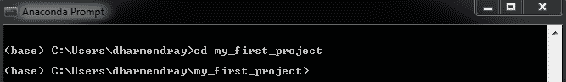

紧接着的下一步将是运行松露。以下命令用于此目的:

```
C:\WINDOWS\system32>truffle
```

该命令的输出应该如下所示:

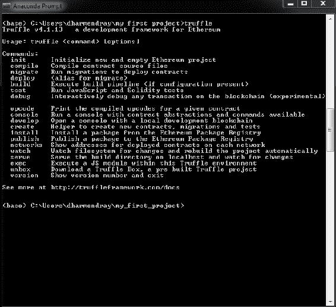

这将显示可用于 Truffle 各种过程的命令列表。Truffle `init`命令允许我们初始化一个新的 Truffle 项目。

在整本书中，我们将使用一个方便的 Truffle unbox 命令来下载并建立一个样板工程。为此，我们将使用`webpack`框，通过运行`truffle unbox webpack`命令来完成，如下图所示:

```
C:\Windows\System32\my_project>truffle unbox webpack
```

所有的盒子都列在他们的网站上，而且这个列表还在增长，其中有一些 React 盒子和许多其他的盒子。拆箱需要一段时间，之后您会在屏幕上看到以下消息:

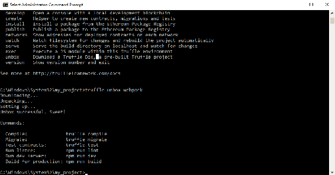

一旦完成，我们就可以开始在我们选择的编辑器中创建我们的项目。我们可以从检查项目结构开始。拆箱会为我们创建几个文件和文件夹。您的屏幕应该类似于以下内容:

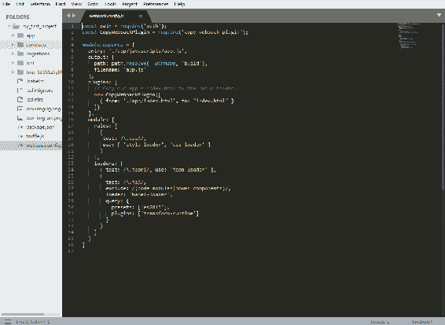

它还会安装一个 webpack，可以通过`webpack.config.js`文件进行配置。这个文件允许您配置如何最小化 JSON、CSS 和 JavaScript，以及它们之间的所有东西。您还将拥有一个`truffle.js`文件，用于定义您的网络。点击后，您的屏幕将如下所示:

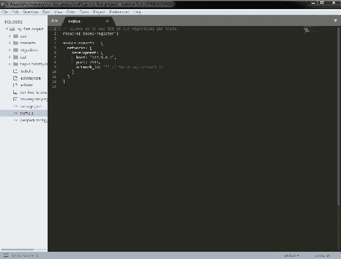

`truffle.js`文件预定义了一个开发网络，默认为端口`7545`上的本地主机。它还将创建一个包含我们的主项目的应用程序文件夹。这个文件夹包含一个 HTML 和一些 CSS 和 JavaScript 的索引，用于导入我们的智能合同。`contracts`文件夹包含`ConvertLib`，这是一个用于演示目的的简单库，它被导入到`main`文件`MetaCoin.sol`中。文件扩展名清楚地描述了这里使用的语言是 Solidity，可以称之为为以太坊开发的 JavaScript 的一种方言。您还可以看到一个迁移和`test`文件夹。每一个都有它自己的目的，这一点我们将在本书中学习。下一节将向我们展示如何部署和测试一个项目。

# 部署和测试项目

我们现在将部署我们在上一节中创建的应用程序。为此，我们将启动一个开发区块链，配置我们的部署，部署我们的智能合约，并构建应用程序。

# 开始开发区块链

首先，我们将想要运行我们的开发区块链。这可以通过在终端窗口中键入`ganache-cli`来完成。您的屏幕将如下所示:

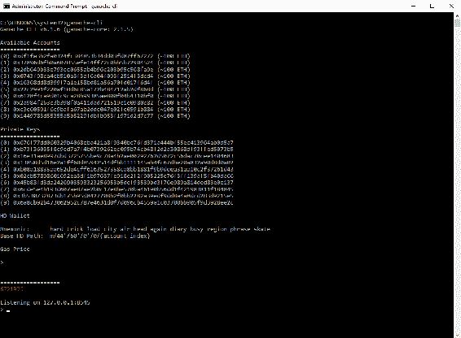

确保记下或记住本地主机端口号。这是很重要的，因为你将在这个项目的后期连接到它。Ganache-cli 生成 10 个可用帐户，然后生成相应的私钥。这些私钥用于加密从每个个人帐户发送的交易。在底部，你会看到一个助记符。这十二个字很重要。请始终记住保存这些单词，因为您将需要它们将您的私钥和相同的帐户导入 MetaMask。

# 配置您的部署

接下来，我们需要确保项目设置对应于创建区块链的主机名和端口。为此，您需要回到您的编辑器，找到位于`root`文件夹中的`truffle.js`文件，并将这里的端口号从`7545`更改为`8545`，以匹配托管我们的开发区块链的端口号。不需要对主机进行任何更改，因为它只是本地主机。然后，继续在终端窗口的`my_first_project`文件夹中部署您的项目。使用以下命令:

```
C:\Windows\System32\my_project>truffle-cli compile
```

如果您使用的是 Windows 系统，我们需要在位于`C:/users/[YOUR USERNAME]/appdata/roaming/npm`的 npm 包文件夹中做一些更改。根据每个用户在不同机器上安装`npm`包的位置，路径可能会有所不同。我们需要将`npm`包中的`truffle.cmd`文件重命名为`truffle-cli.cmd`。

这确保了智能合约的编译没有任何错误。一旦发生这种情况，您的屏幕应该如下所示:

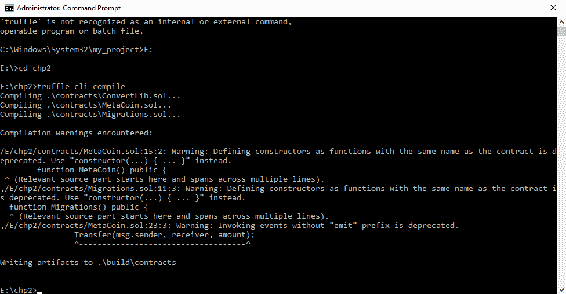

构建输出文件现在已经被写入 contracts 文件夹(也称为`build`文件夹)。

# 部署智能合同

下一步是将这些智能合约迁移和部署到您的开发区块链中。为此，我们使用以下命令:

```
C:\Windows\System32\my_project>truffle-cli migrate
```

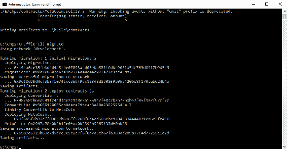

前面的命令有助于创建合同，并为每个合同进行交易。下面的屏幕截图应该可以帮助您清楚地确定您需要在屏幕上注意的因素:

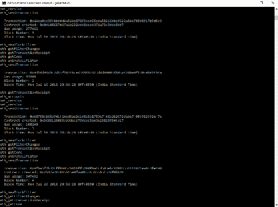

在这里，您可以观察到第一个合同帖子的创建——一些变量被更新，一些事务发生了。同样的过程重复创建多个契约，每个契约都有自己的变量和事务。

回到您选择的编辑器，您会在您的`migration`文件夹中找到这些合同。部署过程从`migration`智能合同开始，然后转移到`ConverLib`智能合同。`MetaCoin`是最后一个要部署的智能合约。如果我们看一下位于您的编辑器上的`migration`文件夹中的`deploy_contracts.js`文件，就会有一个更清晰的理解。

以下屏幕截图也有助于您理解智能合约的部署顺序:


# 探索 Solidity 语法和 JavaScript 代码

这一节将帮助我们理解 Solidity 语法。我们将探索 Solidity 和 JavaScript 代码来深入理解我们的项目。这也将赋予我们修改代码的能力，使其符合我们的需求。

# 理解可靠性语法

为了理解语法，让我们看一下 Solidity 文件`MetaCoin.sol`。下面的截图将作为一个指南，以便我们理解每一行代码:

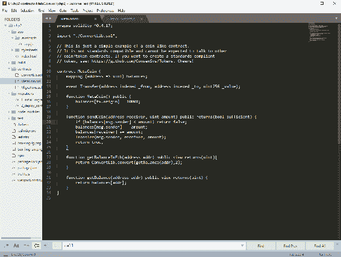

如你所见，每个实体文件都以你当前使用的实体版本的定义开始。在这种情况下，这将是 0.4.17。紧接着是转换库的导入(通常称为`ConvertLib.sol`)。这在代码块中显示如下:

```
pragma solidity ^0.4.17;

library ConvertLib{
    function convert(uint amount,uint conversionRate) public pure returns (uint convertedAmount)
    {
        return amount * conversionRate;
    }
}
```

我们现在将继续创建合同。我们将使用合同关键字，后跟您的合同名称。例如，合同 xyz。契约运行类似于任何其他编程语言中的类的概念:

```
contract MetaCoin {
```

`MetaCoin`智能契约从添加第一个映射变量开始，这个映射称为**平衡**。映射本质上是一种键值存储，允许您将地址映射到无符号整数。该地址可以是唯一的人或唯一的帐户。这个`mapping`函数是您的应用程序的核心变量:

```
mapping (address => uint) balances;
```

定义的下一个变量是一个事件，它有三个参数。这些参数是`FROM`、`TO`和`VALUE`。事件可用于触发 JavaScript 事件，甚至记录一些数据:

```
event Transfer(address indexed _from, address indexed _to, uint256 _value);
```

`MetaCoin`构造函数用于给部署智能合约的人 10，000 `MetaCoin`。这个人通常是管理员。它也可以是部署了此智能合约的另一个智能合约:

```
function MetaCoin() public {
    balances[tx.origin] = 10000;
  }
```

下一个函数是`sendCoin`。它接受两个参数:接收者和数量。它也可以返回值。有两种方法可以在函数中定义返回值。第一种方法是返回函数的直接实现，写为`returns(uint)`，第二种方法是我们给它起一个名字，比如`returns(bool sufficient)`。该函数使用`if`循环来检查消息或交易的发送方是否有足够的余额。然后，代码继续检查发送者的余额是否小于他/她想要发送的金额，如果是，则返回值为假或余额不足。如果没有，我们只是继续前进，并检查它是否从发送方扣除了金额，并向接收方添加了相同的金额。

```
function sendCoin(address receiver, uint amount) public returns(bool sufficient) {
    if (balances[msg.sender] < amount) return false;
    balances[msg.sender] -= amount;
    balances[receiver] += amount;
    Transfer(msg.sender, receiver, amount);
    return true;
  }
```

在此之后，会触发 transfer 事件，随后是 log 或 JavaScript 事件，该事件也会返回 true 以指示发送方实际上有足够的余额:

```
function getBalanceInEth(address addr) public view returns(uint){
    return ConvertLib.convert(getBalance(addr),2);
  }

  function getBalance(address addr) public view returns(uint) {
    return balances[addr];
  }
```

`getBalanceInEth`和`getBalance`函数被定义为返回整数的视图。视图是一个返回数据以供显示的函数。`getBalanceInEth`函数使用了转换库，它传递的第一个参数来自于`getBalance`函数。`getBalance`函数返回被传递参数的余额。您可以观察到`address.addr`正在被外部调用，因此它将在 JavaScript 端传递。数字 2 作为第二个参数传递。这是转换率，而第一个参数是金额。这是一个简单的乘法来模拟令牌和以太之间的转换。

我们现在将使用`ConvertLib`，它不仅被定义为一个库，而且还被单独部署。以下代码有助于我们更好地理解其工作原理:

```
library ConvertLib{
    function convert(uint amount,uint conversionRate) public pure returns (uint convertedAmount)
    {
        return amount * conversionRate;
    }
}
```

这样做的主要好处是，您可以维护一个包含您的业务逻辑的智能契约，并且您可以维护一个包含一系列助手功能甚至变量的智能契约。

# 使用 JavaScript

Truffle 为我们提供了工具来轻松导入和连接我们的智能合同。下面是一个名为`app.js`的 JavaScript 代码文件的截图，你可以在`app`目录下的`javascript`文件夹中找到它:

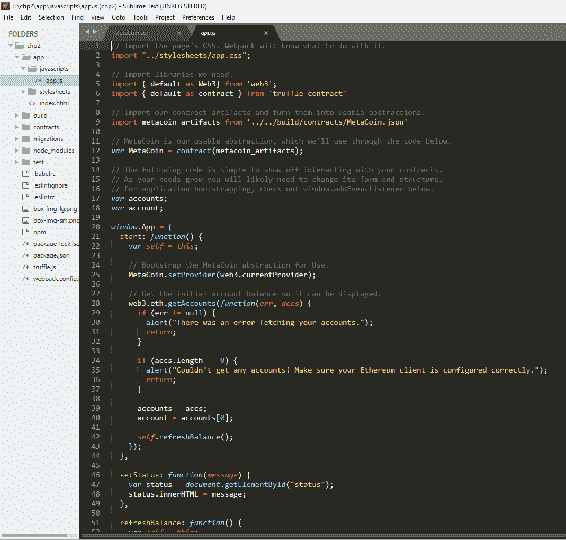

这里的第一个导入是以太坊的`Web3`库。它与以太坊区块链连接。它可以根据当时的要求请求信息或发送事务。

下一个导入是`truffle-contract`。它充当 Truffle 提供的契约接口的包装器。

然后我们继续从位于`build`目录中的`MetaCoin.JSON`文件导入`metacoin_artifacts`。一个`MetaCoin`变量用这个契约初始化，我们将`metacoin_artifacts`作为参数传递给这个契约构造函数。这允许我们对`MetaCoin`智能契约进行有用的抽象。`MetaCoin`契约用于设置一个提供者，这个提供者就是我们与区块链的接口。

`currentProvider`通常由提供`Web3`库的东西填充，在本例中是`MetaMask`。

然后，我们使用`Web3`库获取在我们的测试区块链设置中活动的所有账户。`getAccounts`函数将获得您的系统上所有的账户，这些账户实际上是您自己的。为了便于理解，我们假设每个帐户代表多个人或多个帐户。

如果您正在运行一个实际的、实时的区块链节点，`getAccounts`函数实际上不会获得相关区块链中的所有账户。

一旦获得账户，`refreshBalance`函数使用我们之前定义的`MetaCoin`抽象来获得相关契约的已部署实例。然后，这个实例用于获取余额。请记住，这不是一个交易；这是一个用于获取一些数据的调用。因此，使用了关键字 call。一个电话实际上不会花费我们任何东西。

如果这真的是一笔交易，你会改变什么？不多。你只会删除关键字`call`。很简单，对吧？

让我们继续定义`getBalance`函数的第一个参数；这里的帐户参数与我们为属于我们的实体文件`MetaCoin.sol`的`getBalance`或`getBalanceinEth`函数定义的第一个参数一致。

这里的第二个参数是可以添加到调用或交易中的一些额外数据。在这种情况下，我们可以确定呼叫来自同一个帐户。完成后，我们可以返回一个值，或者用它来更新`balance_element`。如果发生错误，它将被记录在控制台上。

类似的过程用于发送硬币——我们再次获得部署的实例，然后使用`sendCoin`函数。仔细观察，我们会发现这里没有 call 关键字，因为这是一个实际的交易。一枚硬币从一个人传到另一个人手中是区块链的一种变化，因此这是一种交易。

进一步的步骤将保持不变；这些包括语法、参数的顺序等等。

# 错误修复和调试智能合同

这一节告诉你如何修复和调试你的代码。通常，代码将在开发人员控制台中调试，这类似于开发常规的 JavaScript 代码。如果 JavaScript 代码中存在错误，您可以在开发人员控制台上轻松地纠正它。然而，如果 bug 在你的智能合约中，你会想要更深入一点。一旦您的智能合约上线，您将如何调试它？嗯，你不能——至少在本地不能。如果有人发现了窃听器怎么办？你需要找出它的来源。正是因为这些原因，我们可以使用[remix.ethereum.org](http://remix.ethereum.org/#optimize=false&version=soljson-v0.4.24+commit.e67f0147.js)和`etherscan.io`。

在[remix.ethereum.org](http://remix.ethereum.org/#optimize=false&version=soljson-v0.4.24+commit.e67f0147.js)找到的`MetaCoin Solidity`文件的修改版本如下:

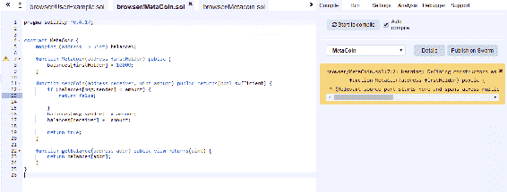

您可以自己创建这个文件，方法是单击左上角的小加号图标，并为其选择一个名称。一旦您编译了这段代码，您将会注意到一个绿色的条，表示这段代码已经编译成功。让我们试着通过消除分号来引入一个错误；该条现在会变成红色，表明有一些错误需要纠正。

以下屏幕截图将帮助您理解屏幕上显示的各种选项卡:

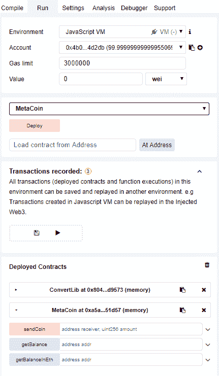

Run 选项卡封装了 Environment 部分，在这里我们应该确保选择 JavaScript VM 作为我们希望工作的环境。这允许我们在浏览器中模拟以太坊区块链，这与 TestRPC 类似。

您可能会注意到,`MetaCoin Solidity`文件的构造函数现在包含了一个`firstHolder`参数。`firstHolder`将是第一个获得 10，000 元硬币的人。你可以改变成为`firstHolder`的人。您可以随机选择任何帐户。然后，您需要确保复制它，并将其作为构造函数的参数。对于地址，用引号括起来通常是个好主意。

创建`MetaCoin`后，屏幕的下半部分将显示一个包含您的交易的窗口。它看起来像下面的截图所示:

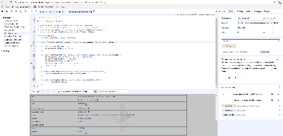

硬币交易

此窗口包含交易的详细信息。我们也可以调试文件。但是，让我们首先通过将地址复制到 GetBalance 选项卡来获得这个人的余额。

一旦完成，我们就可以开始调试了。我们可以一步一步来更好地理解这个过程。将只有三个步骤，因为这是一个小函数。

现在让我们试着在任意两个账户之间发送一些硬币。这将要求我们复制第二个帐户的地址，并将其用作 SendCoin 选项卡中的第一个参数。第二个参数当然是你想转移的硬币数量。为清晰起见，请参考以下截图:

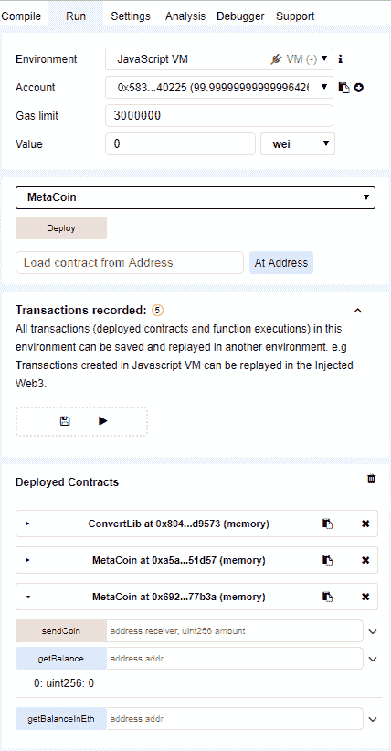

您可以在 details 或 Debug 下的灰色区域中查看交易的详细信息，如下图所示。您还可以检查交易的状态。要获得清晰的理解，请单击“调试”查看分步过程。因为 remix 是以太坊开发者的开源项目，所以几乎每个人都可以使用它。您可以通过从 g it 中提取来本地使用它，也可以在线使用它。选择权在你:

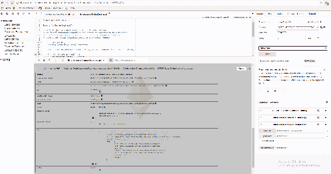

获得余额，并发送硬币到不同的帐户

一旦您的智能合约生效，您就可以在`etherscan.io`上监控交易。随便选个交易。您可以查看源代码或了解它是否是智能合约。交易信息显示已经发生的任何交易。您可以看到事件日志，其中显示了您在实体代码中创建的事件所编写的文本。如果您已经完成了这些交易，您可以使用`Geth DebugTrace`来跟踪它们。如果您试图跟踪任何不属于您的事务，您将会遇到错误，因为没有可用的跟踪。这可以在交易的工具和实用程序部分看到。

奇偶校验跟踪只是另一个可以使用的以太坊客户端。您将在这里看到痕迹，尽管它可能没有太多意义。当您的智能合同生效时，您将不会修复它，而是更新它。你总是可以在本地调试它。

# 用更好的支付应用程序改变我们的应用程序

这一部分将集中在我们改进代码上。这将包括添加功能，如存款乙醚，获得代币，并提取乙醚交换代币，以及创建者的费用。

我们将使用与前一节相同的代码，并继续在此基础上进行构建。

由于我们不想用免费令牌来换取存放的以太网，我们将完全删除以下代码行:

```
function MetaCoin() public {
    balances[tx.origin] = 10000;
  }
```

我们从设定一个创造者开始。为此，我们需要定义一个地址创建者和一个`creatorFee`，如下所示:

```
contract MetaCoin {
  mapping (address => uint) balances;
  address creator;
  uint creatorFee = 1;
  uint collectedFees = 0;

  uint conversionRate = 5;

  uint CURRENCY_MULTIPLIER = 10**18;
```

`collectedFees`就是人们所说的底池。这是用来收集`creatorFees`的。转换率是用来乘以代币数量的比率。例如，如果你有一个以太，你将得到五个代币作为交换。让我们考虑一个人有 0.1 个以太；转换仍然在后端处理整数。`currency_multiplier`是用来等同你的代币和以太的价值。最小的面额是一个卫。

在创建智能合同时，我们还需要将创建者初始化为`message.sender`:

```
  function MetaCoin() public {
      creator = msg.sender;
  }
```

创建者需要一些它自己的特殊功能，比如一个收费撤销的功能。这就需要我们创建一个名为`onlyCreator`的修改器。在下面的代码中，它看起来会像这样:

```
modifier onlyCreator() {
        if (msg.sender == creator || tx.origin ==creator) {
            _;
         } 
}
```

这增加了一个条件，如果`message.sender`是创建者，或者如果`transaction.origin`来自创建者，那么只有这样代码才会被执行。这是通过添加下划线来完成的。

下一步是创建一个名为`collectFees`的函数。为了代码的缘故，我们将它公开，但只有创建者才能调用这个函数。您的代码应该如下所示:

```
function collectFees() public onlyCreator {
        creator.transfer(collectedFees);
        collectedFees = 0;
}
```

现在我们将资金转移给创建者，并将 collectedFees 设置为 0。现在，我们想要添加一些函数，以便每当有人发送硬币时，我们希望硬币的一部分能够到达创建者那里，为此我们将创建存款和取款函数。

存款功能将是一个付费功能。只要你想收到乙醚，就可以使用付费功能。如果您忘记使用它，它只会显示一个错误:

```
function depsoit() public payable {
        balances[msg.sender] += msg.value * conversionRate *  
             CURRENCY_MULTIPLIER;
}
```

使用的兑换率已经在合同功能中设置。记住，我们的令牌将像一个以太一样工作；这意味着一个令牌将被乘以 10 的 18 次方。因此，当您存入任何代币时，它将乘以`CURRENCY_MULTIPLIER`。

然后，我们将转到撤销功能。在实现这一点的时候，一定要小心，因为我们首先需要乘以一个已经在契约函数中设置的货币乘数。然后，我们将从交易执行人的余额中扣除需要提取的金额。金额将除以转换率。这方面的代码如下:

```
function withdraw(uint amount) public {
        amount = amount * CURRENCY_MULTIPLIER;

        balances[msg.sender] -= amount;
        msg.sender.transfer(amount / conversionRate);
    }
```

# 摘要

在这一章中，我们看了看如何创建一个基于以太坊的应用程序。我们还部署和测试了相同的项目。然后我们深入研究了 Solidity 语法，它不仅庞大，而且广泛。还研究了 JavaScript 代码。我们学习了如何使用自己的系统和外部系统来修复错误。最后，我们终于将我们的项目转换成了一个支付应用程序。

下一章重点介绍创建我们自己的令牌的概念。我们将进一步了解 ICO，以及如何处理我们自己的令牌事务。