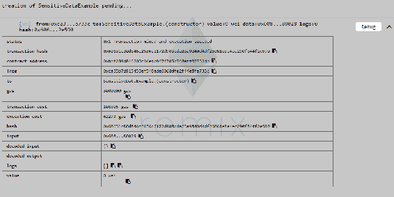
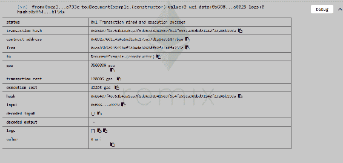
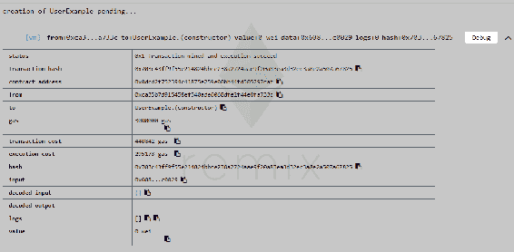

# 签署关于区块链的法律文件和身份验证

区块链的广泛使用需要一章专门讨论这个问题。区块链的多功能性诱使用户尝试在我们生活的各个领域实现它们。虽然有时可能看起来很乏味，但使用分散式分类帐来存储和处理数据实际上在一定程度上非常方便和安全。通过网络访问这些分类帐来执行诸如交易或签署文件之类的活动，这使得它成为一种不需要实际做太多事情就能传送数据的可行方法。

本章将重点讨论以下主题:

*   用户身份和在区块链上存储敏感数据
*   在区块链上处理大文件
*   区块链上的用户身份验证
*   在区块链上签署文件

这一章比其他几章更理论化，因为它很大程度上取决于我们选择的后端技术。

# 区块链上的用户身份和敏感数据

让我们从讨论用户身份的主要方面开始——用于验证的参数。我们可以通过使用一个人的电子邮件地址，他们的电话号码，甚至是一个物理地址来做到这一点。有人可能想知道我们如何做到这一点。实际上，在区块链上验证上述任何参数都非常容易。为此，我们可以使用确认码。用户可以将这个确认码链接到他们的以太坊账户，以太坊账户又将这个确认码链接到他/她的私钥。作为管理员，您必须确保生成此代码的不是您。这将赋予你随意捏造用户的权力。您希望您的用户是真实的、经过验证的人，以便从您的区块链中消除不信任的因素。要生成这些代码，我们可以使用 Twilio 或任何外部服务提供商。Twilio 广泛用于短信验证，封装了电话验证。

现在让我们考虑处理敏感数据的情况，这些数据不能存储在公共区块链上。你可能会想，*有私人区块链*。我知道，我知道。但是现在，假设所有区块链都是公共区块链。您不能在这个特定的区块链上存储敏感数据，如您的姓名、电话号码或电子邮件地址。这将是一个巨大的隐私问题。对于成功的区块链来说，一个必要条件是能够验证存储在其上的数据不能被篡改这一事实的真实证据。这包括不要将整个区块链保存在中央服务器上。为了解决这个问题，我们将求助于散列和使用我们的后端存储，包括 MySQL 或 Oracle。

# 散列法

哈希是一种将大型字符串值转换为小型固定长度值的方法。它用于索引的目的。与值相比，搜索字符串更困难。散列不仅使索引更容易，而且还会影响任何字符串的搜索时间。它减少了搜索时间，因为与原始字符串值相比，查找短值更容易、更有效。

要了解如何执行散列，您将从散列一些用户信息并将其存储在您的智能合约中开始，从而允许您将匿名区块链身份与现实生活中的身份关联起来。

为此，您需要鼓励您的用户为您的应用程序创建一个新的以太坊帐户。当他们在您的应用程序之外使用这个帐户时，这将为他们提供匿名。

使用私人区块链也是一个解决方案。这样做的缺点大于优点。这些缺点中的两个涉及数据篡改和数据审查。但是，只有当区块链由您控制的实体托管时，这些担忧才会变成问题。找到解决这些问题的方法是银行目前感兴趣的事情。让我们假设我们有银行 A、B 和 c。这三家银行联合起来使用同一个专用区块链，而不管它们相互竞争的事实。这导致他们开发内部安全措施，使任何人都无法操纵数据。

为了更好地理解这一点，让我们看一个例子，这个例子涉及到我们验证用户的身份。这从用户访问您的应用程序并生成新地址和新私钥开始。他还可以使用 MetaMask、Geth 或任何其他提供者来完成这项工作。后端系统将通知智能合约一个新的未经验证的用户，第三方应用程序(如 Twilio)将发送一个验证码。此时，即使您是管理员，也无法看到代码。这防止了管理团队的任何成员凭空捏造用户的可能性。一旦输入了代码，它将被传递到智能合同。

```
pragma solidity ^0.4.17;

contract SensitiveDataExample {

  bytes32[] userHashes;

  // The backend would take a user-object. For example a simple JSON
  // {name: "Kenny", familyName: "Vaneetvelde", address: "Some Address 123"}
  // After hashing this entire object, you can pass it to the function below.
  // Later, you can re-hash it, to verify the user and data if/when needed.
  function addUser(bytes32 userHash) {
    userHashes.push(userHash);
  }

}
```

前面的代码是一个 JSON 文件，它将向我们展示如何使用散列来保护敏感数据:



带有输出的 remix.org 上的 SensitiveData.sol 文件

这里的数据被散列，然后传递给`addUser`函数。这将允许数据保留在您自己的数据库中。

如果你试图作为一个邪恶的管理员操纵数据，你的散列将是不正确的。一旦散列被传递给`addUser`函数，`addUser`函数将把`userHash`推到`userHashes`字节数组的顶部。

# 在区块链上处理文件和大量数据

在本节中，我们将学习如何在任何区块链上处理大型文件和文档。正如之前无数次提到的，区块链通常是公开的，因此，隐私和安全应该是最重要的。一个区块链包含所有填入其中的数据，这在以太坊的情况下导致成本增加——也就是说，每笔交易支付更多的汽油。由于这不是我们想要的，我们将使用一些变通方法。

其中一个解决方法是**群集**。还有 IPFS，或者说星际文件系统，我们在[第一章](1.html)、*工作流设置和思维区块链*中简单了解过。您也可以使用自己的服务器来存储数据和更大的文件。

Swarm 和 IPFS 不是区块链，但是他们遵循分散化的共同原则，这使得他们两个成为防篡改的分散文件存储系统。

文件在开始时不是分散的。当一个文件通过 IPFS 上传后，你将成为该文件的第一个、唯一的主人。当其他人下载或请求同一个文件时，他们也成为主机，网络的其他部分也知道谁是主机。对等体之间的这种连接允许一个人通过将你重定向到正确的位置/人来下载或查询文件。

由于 Swarm 和 IPFS 还没有完全开发出来，你可以选择使用你自己的系统和一些散列法。你可以从在后端制作阿沙散列文件开始，并将这个文件存储在区块链中。如果不更改哈希，将无法再编辑该文件，从而使哈希无效。

在任何情况下，如果用户希望验证他们的合同，他们只需重新散列文件，将其与原始散列进行比较。这可以保证他们的合同没有被篡改。

让我们看看下面的代码示例，它将帮助我们更深入地理解哈希的概念:

```
pragma solidity ^0.4.17;

contract DocumentExample {

  bytes32[] documentHashes;

  function addDocument(bytes32 documentHash) {
    documentHashes.push(documentHash);
  }

}
```

remix 中前面代码的输出:



在前面的屏幕截图中，我们已经散列了整个文档，我们还将通过调用`addDocument`函数将散列添加到智能契约或区块链，该函数将传递散列并将其推送到数组上。

# 利用区块链进行用户身份验证

这一节将详细介绍用户验证过程及其背后的可靠性代码。让我们考虑下面的坚固性代码:

```
pragma solidity ^0.4.17;
contract UserExample {

 mapping(address => bool) user_verified;
 mapping(address => bytes32) user_codes;

 mapping(bytes32 => address) to_sign;
 mapping(bytes32 => bool) signed;

 address owner;

 modifier onlyOwner() {
 require(msg.sender == owner);
 _;
 }

 function UserExample() public {
 owner = msg.sender;
 }

function addUser(address user, bytes32 hashed_verification) public onlyOwner {
 user_verified[user] = false;
 user_codes[user] = hashed_verification;
 }

 function verify(bytes32 verification_code) public {
 if (user_verified[msg.sender] == false && 
 sha256(verification_code) == user_codes[msg.sender]) {
 user_verified[msg.sender] = true;
 }
 }
}
```

如你所见，所有者是你自己的服务器。构造函数将所有者的值定义为`message.sender`，其中包含部署智能合约的人的地址。

以下是代码执行的步骤:

1.  用户访问您的应用程序。
2.  同一用户输入了一些私人信息。
3.  详细信息以哈希的形式存储在选择的智能合约中。
4.  当系统调用名为`add.User`的 Solidity 函数时，Twilio 或第三方服务提供商将向用户发送短信。
5.  `add.User`函数传递两个参数，即`address user`和一个`hashed_verification`，后者是一个 32 字节的数组，包含您发送给用户的代码散列。这个函数只能由所有者或修饰符调用，在本例中就是您或您的服务器。
6.  契约构造器由一个布尔值组成，该值存储由位于`add.User`函数中的`user_verified`映射的地址。这个布尔值默认为`false `值。
7.  `user_codes`将`hashed_verification`映射到一个 32 字节的数组。
8.  用户在你的前端输入代码。

9.  然后，`verify`函数通过比较用户提供的验证码的散列和管理员在`add.User`函数中发送的散列来检查用户是否通过验证。

您不需要在 JavaScript 中散列验证代码以备将来验证，因为第三方可以直接获取这些代码，散列并检查它。

10.  一旦用户被验证，默认布尔值从`false`变为`true`。
11.  用户通过验证后，验证码将以明文形式存储在区块链上。

# 签署关于区块链的文件

本节将教你如何在区块链上签署合同等文件。让我们考虑下面的代码来理解这是如何做到的:

```
pragma solidity ^0.4.17;
contract UserExample {

 mapping(address => bool) user_verified;
 mapping(address => bytes32) user_codes;

 mapping(bytes32 => address) to_sign;
 mapping(bytes32 => bool) signed;

 address owner;

 modifier onlyOwner() {
 require(msg.sender == owner);
 _;
 }

 function UserExample() public {
 owner = msg.sender;
 }

 function inviteUser(bytes32 documentHash, address user) public onlyOwner {
 to_sign[documentHash] = user;
 }

 function signDocument(bytes32 documentHash) public {
 if (msg.sender != to_sign[documentHash]) {
 revert();
 }
 signed[documentHash] = true;
 }
function addUser(address user, bytes32 hashed_verification) public onlyOwner {
 user_verified[user] = false;
 user_codes[user] = hashed_verification;
 }

 function verify(bytes32 verification_code) public {
 if (user_verified[msg.sender] == false && 
 sha256(verification_code) == user_codes[msg.sender]) {
 user_verified[msg.sender] = true;
 }
 }
}
```

以下屏幕截图是 remix–Solidity 框架中前面代码的结果:



remix 中 UserExample.sol 文件的输出

这段代码允许你添加一个用户到你的区块链。它还允许您邀请并允许用户签署文档。由于代码类似于我们在上一节中使用的代码，标题为*使用区块链*进行用户身份验证，我们将只看一下我们对代码所做的修改，以适应额外的功能，即允许用户签署合同。

如果我们仔细观察代码，我们会注意到有两个新的参数映射。一个将一个 32 字节数组(`bytes32`)映射到一个用户地址，而另一个将一个 32 字节数组(`bytes32`)映射到一个名为`signed`的布尔值。

`Structs` can also be used to map variables.

部署合同后，您可以上传文档，对其进行哈希处理，然后继续将其添加到区块链。完成后，您就可以邀请用户了。邀请用户会导致用户在`documentHash`被添加到`to_sign`映射。让我们假设我们有类似下面的代码:

```
//to_sign[0x121212121212] = 0x121212133293928
```

这里，`0x121212121212`是 hash，`0x121212133293928`是你的用户。然后，您可以通过包含文档链接的电子邮件通知用户他的邀请。用户可以使用此链接来查看和验证此文档。用户端的验证过程要求他们对文档进行哈希处理，然后将其与提供给他们的哈希进行比较。如果用户想进一步验证，他们可以在区块链上查找散列值。之后，用户可以调用`signDocument`功能。

为了理解`signDocument`函数是如何工作的，让我们假设您想要签署`0x1212 `散列。您应该首先以用户身份调用带有第一个参数的函数。首先，它会检查您的地址是否与被邀请用户的地址不同。如果这是真的，您的交易将被取消使用`revert`功能，在这个代码是`null`。如果两个地址匹配，我们可以简单地继续签署文件。

这是我喜欢区块链的原因之一。人们可以通过将变量设置为`true`来简单地签署文档。一旦该变量被设置为`true`，您就可以将该文档视为已签名。如果这在法庭上被用作证据，该文件应该有效，因为它是用私钥签署的。这使得该人在知情的情况下签署合同是不可否认的。

# 摘要

本章带领我们开始了一段旅程，我们学习了如何在区块链上处理大型数据文件。鉴于数据敏感性是一个在当前世界发展中必不可少的概念，我们学习了一些简单的方法来实现区块链的安全性。然后我们学习了在第三方的帮助下在区块链上验证真实世界用户身份的过程，并学习了如何在区块链的帮助下签署文档。下一章将教我们在浏览器之外使用以太坊所需的基本概念和方法，以及它如何被用作物联网的主干。我们还将快速浏览一下构成区块链的物理组件。