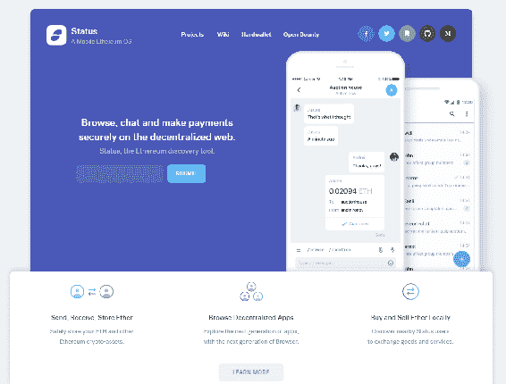
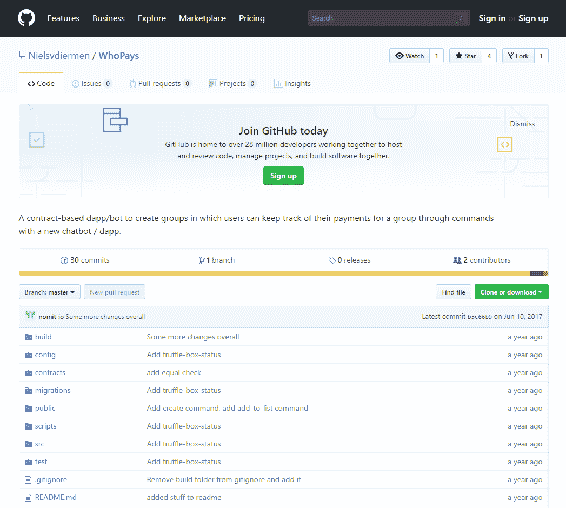
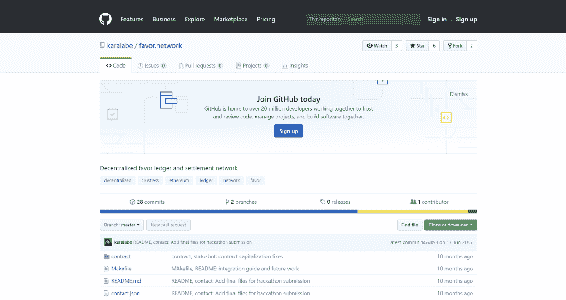
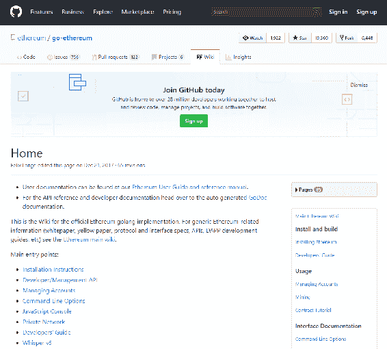

# PC/Web 环境之外的以太坊

到目前为止，我们已经了解了如何在个人电脑上使用以太坊。本章介绍以太坊在各种其他应用中的用途:智能手机，作为最常用的电子设备，就是其中之一。当前技术的发展需要一个自动化系统，这要求我们实现**物联网** ( **物联网**)。本章侧重于以下主题:

*   浏览器外的以太坊
*   以太坊和物联网
*   以太坊和智能手机应用
*   进一步的步骤和资源

我们将了解人们如何在浏览器之外使用以太坊，人们如何将以太坊作为物联网的主干，以及如何在区块链中使用物理组件。此外，我们还将了解如何在智能手机应用中使用以太坊。我们还将讨论一些进一步的步骤和您可以使用的资源。因此，让我们从了解如何在浏览器之外使用以太坊开始。

# 浏览器外的以太坊

这一节将教我们如何在浏览器之外使用以太坊。可以在 Java、Python、Go 或。NET 是由以太坊团队开发的。这些可以直接从位于 https://github.com/ethereum 的 GitHub 获得。

为了在浏览器之外使用以太坊，你需要的一个基本特性是连接到以太坊网络。这种连接可以是直接的，即直接连接到您的应用程序，或者您可以使用中继服务器。尽管使用中继服务器不是最佳选择，但它是完全可能的。要使用中继服务器，您首先需要有一个自己的服务器，它本质上是集中式的，只接受预先指定的事务。

在浏览器之外使用以太坊的另一个必要条件是你将用来开发它的语言的以太坊库。这是可选的，因为我们总是用原始数据开始任何事务。为了在以太网上进行交易，我们需要对原始数据进行编码，并为其分配一个私钥。该事务受到保护，不会被修改，因为它是用私钥签名的。在此之后，您可以将其发送到网络。这可以在中继服务器的帮助下完成。会发生一些选择性的屏蔽，因此确保自己将交易发送到网络是一个更可靠的选择。根据您使用的软件，可以使用以下链接来完成此操作:

*   如果你是 Python 用户，可以使用`Web3.py`库。在 https://github.com/ethereum/web3.py 可以免费获得。
*   如果你是一个狂热的 Java 用户，你可以在 Web3J GitHub 账户上找到 Java 库，这个账户可以在[https://github.com/web3j/web3j](https://github.com/web3j/web3j)找到。

对于任何其他实现，你可以在[https://github.com/ethereum/](https://github.com/ethereum/)找到以太坊 GitHub 账户下的库。假人是在浏览器之外使用以太坊的一个很好的例子。我们在第一章中已经看到了这一点。假人离线计算，但是验证所有在链上完成的计算。这允许大量的分布式计算能力。要了解更多信息，你可以参考假人 Github 页面，查看位于 https://github.com/golemfactory/golem[的资源库中的代码。](https://github.com/golemfactory/golem)

# 以太坊和物联网

在本节中，我们将了解以太坊以及它如何帮助传播物联网。在我个人看来，以太坊是物联网的完美支柱。这是因为两个因素:数据流和安全性。数据在网络上分散开来，这是物联网最基本的概念；这种畅通无阻的数据流是使用以太坊来帮助构建物联网的一个重要因素。此外，每台设备都有自己的私钥，这提高了安全系数。这两种元素的结合打开了许多新的可能性。

让我们看一个涉及电动汽车充电的案例研究。此时此刻，他们不是很多电动汽车或充电站。在不久的将来，所有的车辆都很有可能依靠电力行驶。这意味着更多的充电站将会被安置在更多的地方。让我们考虑一个场景，在超市有充电站。免费提供这项设施是不可行的。为了使这个过程更容易，汽车可以直接支付服务费用。如何做到这一点？

必须有两个智能电表，每个都有自己的私钥。一个在充电站，另一个在车上。汽车的所有者/用户需要给与汽车私钥相关联的地址添加一些醚。当汽车在充电站请求电力时，这将被添加到负责该交易的智能合同中。充电站的智能电表会跟踪汽车消耗的电量，并相应地进行充电。这里的金额将直接支付。充电站的所有者将根据需要提取乙醚。

这整个场景，虽然现在是假设的，但有一些特殊的考虑。汽车和充电站都需要一台电脑，因为它们都需要一把私人钥匙。还需要一个工作的互联网连接和一些防篡改的智能电表。一旦数据在区块链上，没有人能篡改它，因为它都是公共记录的一部分。即使防篡改仪表有缺陷，它也会被公开显示。另一种避免欺诈的方法是向相关部门登记汽车的私人钥匙。

# 以太坊和智能手机应用

您可以通过三种方式创建支持以太坊的智能手机应用程序:

*   使用 DApp 浏览器。
*   使用 Android 或 iOS 库。
*   用 JavaScript 做所有的事情，从密钥生成到密钥安全，以及中间的所有事情。但是，不建议这样做，因为这会使您非常容易受到攻击。

# 使用 DApp 浏览器

一种 DApp 浏览器是 Toshi。它将允许您使用集中式应用程序，您可以使用它，就像使用 MetaMask 一样，但是是在移动设备上。另一个更受欢迎的选项是[身份。IM](https://status.im/) 。它实际上是一个安全聊天，但它也是一个聊天机器人。您可以给它一些命令，如检索浏览器位置，如下面的屏幕截图所示，如果您给它这样的命令，那么您就可以触发智能合约内部的功能:

状态。即时消息主页

使用这种方法已经开发了一些应用程序。WhoPays 就是这样一个应用。这是一个基于合同的机器人，可以创建群组，用户可以使用新的聊天机器人通过命令跟踪他们向群组支付的款项。这意味着您可以使用聊天命令来建立群组。假设你为三个人买了食品杂货，你支付了所有的费用。别人还得还你。您可以设置这种安排，他们可以同意一个金额，并使用该应用程序偿还您。下面的截图显示了在 https://github.com/Nielsvdiermen/WhoPays 的 WhoPays GitHub 页面:

whocountries

再比如 [favor.network](https://github.com/karalabe/favor.network) 。在这里，你可以请求别人帮忙，然后付钱给他们来满足你的要求:

Favor .网络

这些申请要么获胜，要么在[状态中排名很高。IM](https://status.im/) 黑客马拉松。我强烈建议你看看这些应用程序，并使用它们来学习如何使用[身份。IM](https://status.im/) 。

# 使用 Android 或 iOS 库

2016 年 12 月，以太坊发布了一个也可以在移动平台上运行的桌面客户端版本，这样你就可以将这些库导入到你的 Android 应用程序或 iOS 应用程序中，并像在桌面上一样使用以太坊。

以下截图显示了位于[https://GitHub . com/ether eum/go-ether eum/wiki/Building-ether eum](https://github.com/ethereum/go-ethereum/wiki/Building-Ethereum)的 go-ethereum GitHub 资源库:

go-以太坊 GitHub 知识库

# 进一步的步骤和资源

我想提一下 Infura。Infura 基本上是以太坊和 IPFS 网络的中继服务器，你不必自己管理，使它再次变得不可信。只要有些人没有运行他们自己的以太坊节点，这种情况就会一直存在。请访问 [www.infura.io](http://www.infura.io) 了解更多信息。当然，强烈建议您运行自己的节点，但如果不能，请查看 Infura。您可以远程向该服务器发送已放弃的事务，它们会将这些事务传播到网络中。

您可以查看的另一个资源是我们之前提到的以太坊 GitHub 页面。在这里，你可以找到所有的项目，比如以太坊改进协议，remix，还有黄皮书，里面有以太坊所有的技术规范。你可以找到关于 Solidity 编程语言和已经构建的不同客户端的一切。您可以修改这些客户端，然后在您自己的项目中使用它们来连接以太坊网络。所以就去看看吧！

另一个信息来源是以太广场，你可以在 www.reddit.com/r/ethereum/找到。你可以在这里找到很多信息和新闻；如果你想了解最新情况的话，可以看看这个。

另一个资源是 CoinDesk，你可以在 www.coindesk.com 找到。你可能知道这个，但是这个有很多关于以太坊和区块链的新闻。

康赛斯是一家公司，你可以在 https://new.consensys.net/找到它。他们从一开始就一直在利用以太坊，而且他们有很多正在进行的项目。他们与许多非常大的公司合作，比如微软。他们非常致力于使以太坊企业就绪。

最后但同样重要的是，一定要看看 DApps 的状态，你可以在[www.stateofthedapps.com](http://www.stateofthedapps.com)找到它。在这里，你可以找到很多已经提出的申请。你可以对它们进行分类，看看它们是否有原型，或者一些实际应用。几乎所有这些应用程序都是开源的。这将是迄今为止你最大的资源，因为还有什么比从现有的应用程序中学习更好的方法呢，对吗？所以，如果你检查了这些，我相信你很快就会完全掌握以太坊。

# 摘要

在本章中，我们了解了以太坊是如何在浏览器之外运行的。我们了解了以太坊如何用于各种物联网应用。然后我们继续看以太坊是如何使用各种方法在 Android 和 iOS 的智能手机设备上实现的。然后你会得到一些链接，链接到各种可以帮助你掌握以太坊的资源。在本书中，我们几乎涵盖了构建、使用和部署自己的以太坊令牌所需的所有内容，并让您进一步了解了利用以太坊知识可以构建什么样的应用程序。