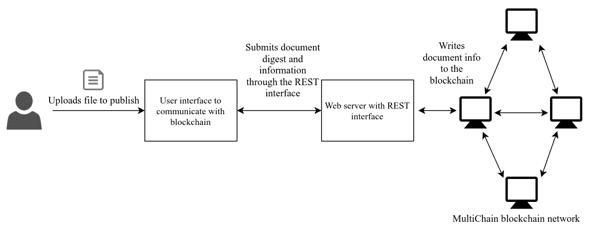
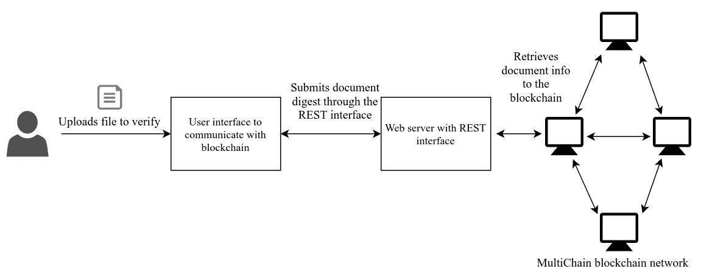
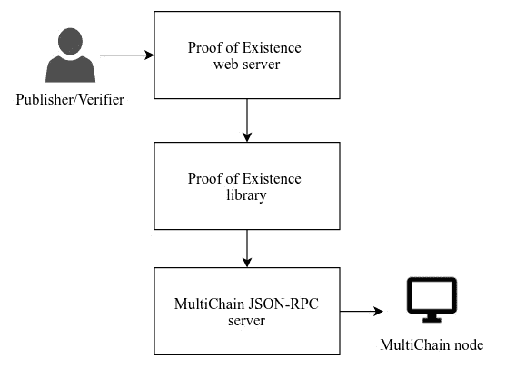

# 潜入区块链——存在的证明

到目前为止，在本书中，我们已经研究了区块链技术的基本概念，探索了诸如密码学和分散式网络等主题。我们还创建了一个简单的区块链应用程序，并熟悉了分散加密货币应用程序中使用的交易。尽管我们创建的区块链应用程序让我们对区块链技术有了一个大致的了解，但除了那些需要分散网络的加密货币，我们还没有看到其他的用例。通过深入区块链，我们将介绍并熟悉区块链框架，最后我们将通过构建用例来构建一个区块链应用程序。

在本章中，我们将讨论以下主题:

*   区块链平台，具体而言:
    *   为什么我们选择多链？
    *   多链基础介绍
    *   多链中包含的功能
*   如何设置区块链环境
*   存在证明的架构
*   如何构建存在证明应用程序

在我们研究多链区块链平台的各个方面之前，了解核心区块链平台是很重要的。任何想要构建分散式应用程序的用户都不需要从头开始构建所有组件。

相反，你会发现使用现有的框架总是更好。为什么？因为它将帮助您以相当少的工作量构建应用程序。现有的区块链平台为应用程序开发提供了一个框架，在这个框架中，您不必担心所使用的底层区块链概念，而是让您能够更加专注于实现区块链用例。用户不必太担心以这种方式构建的区块链网络的可扩展性，因为该平台已经过数千名开发者和用户的测试。因此，该系统应该是有弹性的。

除了使用区块链技术构建分散式网络的基本功能之外，每个区块链平台都有自己的一套特性和功能。一些区块链平台提供源自比特币项目的基本功能，而其他平台提供高级脚本功能，以便从区块链网络内部部署智能应用程序。您会发现，为了开发和部署应用程序，有大量的平台可供选择，但最好是根据您正在创建的应用程序的用例来选择一个框架。一些著名的区块链项目提供了开发应用程序的平台，如*以太坊*、 *Hyperledger* 、 *Neo、多链*、 *Corda* 和 *BigchainDB* 。这个列表是巨大的，我们将在第八章、*区块链项目*中研究其中的几个平台。

由于我们有大量的选项可供选择，因此很难找到最佳的平台，因为它们中的大多数都可以成功地用于我们将要使用的相同用例。然而，每个平台都是为特定目的而设计的。我们将在[第十二章](12.html)、*区块链用例*中指出区块链平台的选择标准，在这里我们将讨论几个区块链用例。在本章中，我们将讨论使用多链构建存在证明应用程序的用例。我们将在接下来的小节中讨论选择这个平台的理由。

# 多链区块链平台

MultiChain 是众多帮助企业轻松构建和部署区块链应用的平台之一。正如我们所知，比特币有一个弹性的公共区块链，可以扩展其网络和处理交易，这对公共区块链来说是理想的。这是通过从比特币中获得灵感并创建一个私人区块链平台而创建的多链项目实现的。

比特币中的公共区块链确实引入了一些限制，如有限的资产分配、交易成本、较低的交易利率和透明的交易。尽管在公共区块链中很难逃脱这些限制，但并不是所有的用例都需要承受这些限制。

一个可以在私有网络中实现的用例不应该为每个交易付费，不应该实现更高的交易速度，甚至不应该为操作设置访问控制。多链有助于在专用网络中实现所有这些目标。

下面你会发现 MultiChain 的一些功能，这些功能帮助它克服了比特币中的问题，这些问题使它无法在企业中作为私有区块链实现一般用例:

*   区块链的资产创造没有限制。这是因为它将被组织封顶。

*   你不会遇到交易成本。这是因为内部节点不需要奖励。

*   交易确认的延迟有所减少，这是由于工作一致性算法的证明。

*   区块链交易中缺乏隐私的情况有所缓解。这是因为向区块链节点提供了访问控制。

# 为什么选择多链？

正如我们已经提到的，当我们实现一个区块链应用程序时，有几个区块链平台可供选择。框架的选择主要取决于我们将要实现的应用程序的用例。

选择多链平台而不是其他平台有几个原因。最大的因素之一是在平台内实现我们的存在证明用例的简单性。MultiChain 帮助我们构建用例，而不需要为部署和执行编写任何复杂的逻辑，使它更容易访问。多链还有一个称为数据流的功能，用于在区块链中存储信息，而无需改变数据结构。我们将在本章后面的*开始使用多链*一节中研究流的概念。选择多链时要考虑的另一个因素是，它与比特币非常相似，这让我们更容易理解它的所有扩展功能。

所有这些因素促使我们选择 MultiChain 作为构建第一个区块链应用的合适平台。我们将在接下来的章节中介绍多链的一些特性。

# 多链的基础

MultiChain 是一个从比特币分叉出来的项目；因此，这使得它与比特币生态系统兼容。这是一个基于许可的区块链，意味着在区块链上执行的任何操作都是受访问控制的。网络上的节点不一定在区块链上具有相同的权限。虽然一些节点可以被分配读取区块链的基本权限，但是其他节点可以被给予写权限或者甚至成为管理员。多链也可以在没有权限的情况下进行配置，使网络中的每个节点都是平等的。多链的灵活特性使得实现区块链用例变得容易，而不需要投入很多开发资源。

多链为我们提供了完整的资产管理周期，类似于比特币交易。资产为我们提供了一种灵活的方式来处理它们的元数据。由于我们的存在证明用例不处理身份，我们将不会使用资产管理概念来创建我们的应用程序。MultiChain 还在数据流的帮助下提供数据存储和检索机制。在我们的示例中，我们将在存在证明应用程序中使用 streams 特性进行数据存储。

# 多链功能

正如我们之前解释的那样，MultiChain 继承了比特币项目的大部分功能，并帮助开发人员创建应用程序，而无需学习全新的生态系统。MultiChain 具有一组附加功能，使得开发人员可以轻松构建和部署区块链应用程序。在本节中，我们将讨论其中的一些功能。

# 权限管理

当多链区块链作为专用网络部署在企业中时，可以对其进行配置，使每个节点具有不同级别的访问控制。当在区块链网络中启用许可模式时，每个对等体必须通过使用它们的公共地址被明确地给予许可。一些权限级别包括连接、发送、接收、发布、挖掘、激活和管理。还可以为特定资产分配权限，使权限管理更加精细。节点也可以随时撤销访问控制。权限管理通过为不同节点决定不同级别的访问控制，确保不允许任何未知对等体进入私有区块链或在组织中建立层次结构。权限管理是私有区块链中的一项重要功能。

# 资产管理

资产管理是比特币交易衍生出来的概念。比特币拥有单一资产，通过交易进行验证。尽管比特币可以在其交易元数据中存储额外的资产，但它们不会被区块链节点验证。MultiChain 解决了这个问题，它提供的功能使您能够创建多种类型的资产，同时仍然验证所有资产的交易。多链有一个完整的资产管理生命周期。

# 流管理

流是一种用于在多链区块链中提供数据存储的机制。它是以键值对的形式存储和检索数据的一种便捷方式。多个项目可以发布到单个数据流。节点在对其执行操作之前必须订阅流。流项目可以通过关键字、签名和块号来索引，仅举几个例子。

# 设置区块链环境

区块链网络是一个分散的网络，每个节点应该有类似的区块链总账信息。通过允许每个人连接到区块链并在其上执行操作，可以在开放网络中建立分散式网络，或者同样地，可以在私有网络中维护分散式网络。公共区块链网络是通过在每个节点中启用连接权限来实现的。企业通常更喜欢建立专用网络，因为这有助于阻止不良行为者。这种网络配置很容易在每个节点的多链中进行配置。

# 运行多链节点

MultiChain 可以安装在具有至少 512 MB RAM 和 1 GB 存储空间的 64 位处理器的 Linux、Windows 和 Mac 平台上。安装包括提取可从多链站点下载的压缩编译文件。MultiChain 是一个用 C++开发的开源项目。每个节点都可以使用开源代码并编译它，以获得对程序逻辑的更多控制。

在机器上直接安装 MultiChain 的安装说明，以及从源代码进行构建，可以在本书的 GitHub 库或者 MultiChain 的官方网站上找到:[https://www.multichain.com/download-install](https://www.multichain.com/download-install)。在本书的演示中，我们将使用 Linux 发行版 Ubuntu 16.04。

每个多链节点都有三个主要的二进制文件，称为`multichaind`、`multichain-cli`和`multichain-util`。

*   这是一个在每个节点上作为守护进程运行的进程。该进程是节点的主干，并启动保持本地区块链最新所需的所有任务。

*   `multichain-cli`:这提供了一个命令行界面，您可以使用它通过执行 API 在区块链上执行操作。

*   这是一个你可以用来执行操作的工具，比如创建一个新的区块链。

# 多链入门

现在，我们已经熟悉了多链平台，同样也熟悉了在专用网络中设置节点的过程，我们需要创建一个区块链，以便可以在网络中的对等体之间发布和共享数据。第一步是在实现我们的用例之前介绍所有的功能。

# 创建一个链

一旦建立了一个节点，它既可以通过连接到一个链来加入一个现有的网络，也可以创建自己的链。`multichain-util`用于创建新的链，如下:

```
$ multichain-util create chain1  
```

这创造了一个新的本地区块链。然后，节点必须通过使用`multichaind`连接到所创建的链来启动一个流程。通过启动多个`multichaind`守护进程，可以在一台机器上初始化多个链。一个`multichaind`过程创建如下:

```
$ multichaind chain1 -daemon 
```

上面一行实例化了一个流程并启动了服务器。然后，节点为创建的链挖掘起源块。该代码将产生一个地址，然后其他节点可以使用该地址连接到刚刚创建的链。

# 连接到现有链

如果在专用网络中创建了链，则其他节点可以连接到创建的节点，并在同一区块链上执行操作。任何节点都可以使用以下命令连接到链:

```
$ multichaind chain1@[ip-address]:[port] 
```

网络中的任何远程节点都可以使用 IP 地址和多链端口连接到链。每个多链守护进程为其服务器分配一个不同的端口号。如果链配置的连接权限未设置为开放，则网络中的每个节点都必须由管理员明确授予权限，如下所示:

```
$ multichain-cli chain1 grant [node-address] connect 
```

Node-address 是节点的公共地址或 wallet 地址，它是从 wallet 的公钥-私钥对的公钥中提取的。节点可以尝试通过重启`multichaind`来连接到链，如下所示，但只有一次许可被授予它:

```
$ multichaind chain1 -daemon 
```

# 检查区块链

在成功连接到区块链之后，一个节点在专用区块链网络中被完全建立。本地区块链将通过接受来自网络中节点的块来更新。可以通过命令行界面发出以下命令来验证区块链的状态:

```
$ multichain-cli chain1 getinfo 
```

该命令提供关于键值对文档中的节点、多链和几个区块链参数的一般信息，如下所示:

```
    {"method":"getinfo","params":[],"id":1,"chain_name":"chain1"}

    {
      "version": "1.0.2",
      "nodeversion": 10002901,
      "protocolversion": 10009,
      "chainname": "chain1",
      "description": "MultiChain chain1",
      "protocol": "multichain",
      "port": 4273,
      "setupblocks": 60,
      "nodeaddress": "chain1@192.168.0.107:4273",
      "burnaddress": "1XXXXXXXQrXXXXXXEeXXXXXXXBXXXXXXaDTujx",
      "incomingpaused": false,
      "miningpaused": false,
      "walletversion": 60000,
      "balance": 0,
      "walletdbversion": 2,
      "reindex": false,
      "blocks": 59,
      "timeoffset": 0,
      "connections": 0,
      "proxy": "",
      "difficulty": 6e-8,
      "testnet": false,
      "keypoololdest": 1523352447,
      "keypoolsize": 2,
      "paytxfee": 0,
      "relayfee": 0,
      "errors": ""
    }
```

注意:所有的多链命令都可以在交互模式下运行，首先用一个`multichain-cli chain1`命令启动 shell。这将打开一个界面，其中所有命令都可以使用关键字和所需的参数来执行。完整的命令列表可以通过输入`help`获得。

# 使用流

如前所述，流用于在区块链中将数据项存储为键值对。流是存储数据的一种便捷方式。可以使用命令行界面轻松创建和管理它们。此处使用的所有命令都是在进入交互模式后通过执行以下命令来执行的:

```
multichain-cli chain1
```

用户可以通过发出`liststreams`命令来检查链中的所有流，该命令返回所有流的详细信息以及名为`root`的默认流。然后，可以通过执行以下命令来创建新的流:

```
    create stream stream1 false 
```

`stream1`是新创建的流的名称。如果 false 作为参数传递，则只有具有显式权限的管理员和节点才能为`stream1`创建流项目。如果最初将`create`命令设置为 false，则可以使用`grant`命令将发布流项目的许可授予特定节点。

还可以使用下面的`publish`命令将键值对数据项发布到创建的流中。流项目的值应始终指定为十六进制字符串:

```
    publish stream1 key1 73747265616d2064617461
```

每当节点想要收听发布的流项目时，它必须通过订阅来收听该流；这可以通过以下命令实现:

```
    subscribe stream1
    liststreamitems stream1
```

执行该命令将显示发布到流的所有项目，以及发布者地址、块创建时间、事务 ID 和块确认数量等信息。公布的十六进制值存储在`data`键中:

```
[ 
  { 
    "publishers": [ 
      "1MpkvCWj1Z9ZYfzBQzk4QvR1qih4ZiaHfh9Dd3" 
    ], 
    "key": "key1", 
    "data": "73747265616d2064617461", 
    "confirmations": 11, 
    "blocktime": 1523373741, 
    "txid": "23ad75620539f9995eef990856090e4c016e4da46bee82905483021b68da616e" 
  } 
] 
```

既然我们已经介绍了多链平台提供的基本功能，我们就拥有了构建自己的应用所需的所有关键要素。

# 存在性证明架构

存在证明是证明数字文档在特定时间是否存在的机制。区块链可以很好地替代公证人，因为它可以证明文件的存在，而不需要第三方。通过使用散列算法(如 SHA-256 算法)创建摘要来识别每个文档。然后，通过对交易加盖时间戳，将文档的身份存储在区块链中。

2013 年初，开发人员 Manuel Araoz 和 Esteban Ordano 创建了一个区块链实现的存在证明。它是作为开源项目发布的。这项服务使用比特币的公共网络来存储文件信息。关于文档的信息存储在名为`OP_RETURN`的事务元数据中，这允许在事务中存储任意信息。

存在性证明架构在其生命周期中有两个用例。任何想要证明文件存在的用户执行发布，并且任何人都可以通过执行验证来检查该证明。该应用程序的架构将由一个用户界面、一个到区块链节点的后端界面和区块链本身组成。

# 发布文档

想要证明文档在特定时间存在的文档所有者可以将文档上传到存在证明应用程序。所有者可以添加需要与文档一起保留的附加信息，例如文档描述、大小和用户详细信息。应用程序面向用户的部分将随文档一起接受这些数据。然后使用散列算法创建文档的摘要，以唯一地标识文档并以固定大小的标识来表示它。文档信息以及摘要将被发送到区块链应用程序的 web 界面。

需要时，区块链应用程序的 web 界面可在多链区块链上执行特定操作。当发布操作调用所有需要的数据时，应用程序将创建一个项目，并请求多链节点在区块链流中发布它。一旦交易到达网络中的一个节点，它将被交换并包含在其中一个块中，最后，它将被嵌入到区块链总账中。



图 6.1:文档存在证明发布的架构图

# 验证文档

想要验证文档存在的用户将遵循与发布文档的用户类似的过程，如前所述。但是，他们需要访问文档，以获取文档的存在信息。当验证功能被触发时，想要验证文档的用户将执行与 web 界面的类似交互。然后，多链区块链中的验证操作将验证该操作是否被调用。web 界面将接受文档的摘要，并使用该摘要向多链区块链查询文档信息。

存储在多链流中的文档信息可以通过提交文档摘要来检索，如下图所示:



图 6.2:验证文档存在证据的架构图

区块链节点将能够在流中找到包含在其中一个块中的项目。如果在区块链流中找到该项目，则证明存在的验证被认为是成功的，并且通过提供关于该文档的更多信息来确认用户。

# 构建存在证明应用程序

正如我们在存在证明应用程序的架构中所讨论的，每个区块链节点都有一个 web 界面，用户可以通过该界面发布和验证文档的存在。

我们将创建一个 web 界面，与部署的多链节点进行通信。然后，用户将通过使用 REST APIs 与 web 界面进行通信。在我们的例子中，我们将使用在[第四章](04.html)、*区块链*中使用的 Python Sanic web 服务器来创建简单的 REST APIs。然后，该 web 界面将与多链节点的 JSON-RPC 服务器通信，这将允许节点在多链区块链上执行任何操作。由`multichain-cli`提供的所有功能都将在 JSON-RPC 调用中可用。我们将使用名为`Savoir`的 Python 驱动程序与多链节点的 JSON-RPC 服务器通信。

在这一节中，我们将把服务器端应用程序分成三个部分来适应这个架构。这些部分如下:

*   多链 JSON-RPC 驱动程序

*   存在证明库

*   存在证明 web 服务器



图 6.3:服务器端应用程序的分层架构

前面的*图 6.3* 描述了分层架构，用户通过该架构与高级 web 服务器接口进行通信，应用程序通过低级 JSON-RPC 驱动程序与多链节点进行交互。

# 多链 JSON-RPC 驱动程序

我们将使用一个驱动程序与多链节点通信。MultiChain 提供了一个 JSON-RPC 服务器，可以用来执行任何需要的区块链操作。

在我们的用例中，我们将使用一个名为`Savoir`的 Python 驱动程序，它将连接到多链节点的 JSON-RPC 服务器并调用必要的函数:

```
from Savoir import Savoir 

class MultichainClient(object): 

    def __init__(self, **kwargs): 

        self.rpcuser = kwargs.get('rpcuser', 'multichainrpc') 
        self.rpcpasswd = kwargs.get('rpcpasswd', 'HFzmag67bJg2f4YuExgVDqQK5VfnvXRS5SKrByuCgiXm') 
        self.rpchost = kwargs.get('rpchost', 'localhost') 
        self.rpcport = kwargs.get('rpcport', '4416') 
        self.chainname = kwargs.get('chainname', 'chain1') 
```

我们还将使用`Savoir`创建一个多链 JSON-RPC 客户端。客户端将需要 RPC 连接信息，例如用户名、密码、主机、端口和链名，以便建立到 RPC 服务器的连接。这里，命令行`multichainrpc`是默认的 RPC 用户名，`4416`是默认的 RPC 端口。我们将使用与前面部分创建的`chain1`相同的链。

注意:RPC 用户名和密码可以在创建的链的配置文件中配置。它位于 Linux 机器中的`/home/user/.multichain/chainname/multichain.conf`，或者其他平台的等效安装目录。其他区块链参数，如端口号，可以在 params 文件中配置，该文件位于以下位置:`/home/user/.multichain/chainname/params.dat`

```
    def connect(self):
        """connects to rpc interface"""

        try: 
            api = Savoir(self.rpcuser, self.rpcpasswd, self.rpchost, self.rpcport, self.chainname) 
            return api 

        except Exception as e: 
            return False 
```

然后使用提供的连接信息创建 RPC 连接对象。该对象返回到库层以调用所需的多链 API。

# 存在证明库

存在证明库是在区块链上执行高级任务的方法的集合。该库包含可以对用户提交的文档执行的所有操作。根据体系结构的设计，对用户文档执行操作有两种主要方式:发布和验证。

发布操作发布文档摘要以及用户传递的任何其他信息。因为我们使用多链流进行发布，所以数据必须格式化为十六进制字符串，如前所述。

下面的`Document`类显示了`publish`和`verify`方法，以及一些可用于获取流项目的方法:

```
class Document(object): 

    def __init__(self): 
        self.client = MultichainClient().connect() 
        self.stream = 'poe' 
```

前面的构造函数使用 RPC 服务器初始化到多链节点的连接。此连接对象可用于调用任何多链 API。

以下两种方法分别用于根据流键和事务 ID 获取流项。第一个使用多链 API`liststreamkeyitems`，将流名和密钥作为参数传递。在第二种方法中，流项目使用它们的事务 ID 通过`getwallettransaction` API 获取，该 API 接受发布的流项目的事务 ID 作为参数:

```
    def fetch_by_key(self, key): 
        """fetches the existence info of a document in blockchain""" 

        return self.client.liststreamkeyitems(self.stream, key) 

    def fetch_by_txid(self, tx_id): 

        return self.client.getwallettransaction(tx_id) 
```

文档信息使用流项目发布 API 存储在一个键值对中。流项以键-值对的形式发布，其中键是文档的惟一摘要，值是编码的十六进制字符串。然后，发布 API 将创建一个事务，并将其插入区块链:

```
    def publish(self, key, value): 
        """publishes the existence of a document in blockchain""" 

        return self.client.publish(self.stream, key, value) 
```

当用户希望在验证已发布文档的存在时检索其信息时，调用`verify`方法。验证是在`fetch_by_key`方法的帮助下执行的，如前所述，该方法接受流密钥作为参数。如果键存在，此方法将返回一个流项目列表，或者将返回一个空列表:

```
    def verify(self, digest): 
        """verifies the existence of a document in blockchain""" 

        return self.fetch_by_key(digest) 
```

然后通过以下方法返回最新发布的文档信息。用户还可以通过指定计数来查询所需数量的文档。`liststreamitems` API 用于检索流中的所有项目。然后反转返回的列表，并检索指定数量的项目。仅从流项目中过滤出必要的信息并返回:

```
    def fetch_latest(self, count): 

        latest_docs = [] 
        for doc in self.client.liststreamitems(self.stream)[::-1][:count]: 
             latest_docs.append({"digest": doc.get('key'), 
            "blocktime": doc.get('blocktime'), 
            "confirmations": doc.get('confirmations')}) 
        return latest_docs 
```

# 存在证明 web 服务器

存在证明 web 服务器是与多链区块链通信的接口。我们将创建一个 REST API 来与区块链应用程序通信。每个用户都可以通过这个 web 界面发送请求来执行`publish`和`verify`操作。

首先，需要导入编码数据和创建 web 服务器所需的包。web 服务器的默认端口号被设置为`8000`:

```
import binascii 
import json as JSON 

from base64 import b64encode, b64decode 
from datetime import datetime 
from sanic import Sanic 
from sanic.response import json 
from sanic_cors import CORS, cross_origin 
from poe_libs import Document
port = 8000 
```

下一步是创建文档对象。这将用于执行存在证明操作。定义了三个 REST API 端点来验证、发布和获取文档信息。我们将为所有已定义的 API 端点创建一个实现:

```
class Server(object): 

    def __init__(self): 

        self.app = Sanic() 
        CORS(self.app) 
        self.document = Document() 

        self.app.add_route(self.publish, '/publish', methods=['POST']) 
        self.app.add_route(self.verify, '/verify', methods=['GET']) 
        self.app.add_route(self.details, '/details', methods=['GET']) 
```

# 发布文档

当用户想要证明文档的存在时，将调用`publish`端点实现。`publish`实现是一个 HTTP POST 端点，因为它将通过 web 服务器接口在区块链中创建新记录。用户通过传递文档摘要来调用这个端点，文档摘要是整个文档的哈希值。用户还将传递姓名、电子邮件和消息等信息，这些信息将作为元数据存储在流项目中。必需的信息通过 POST 表单传递。从`request`对象中提取必要的值，以创建一个字典:

```
async def publish(self, request): 

    try: 
        json_data = {'name': request.form.get('name'), 
            'email': request.form.get('email'), 
            'message': request.form.get('message'), 
            'digest': request.form.get('digest')} 
```

因为流项将值存储为十六进制字符串，所以字典将被转换为字符串，然后进行 base64 编码，最后编码为十六进制字符串:

```
        json_string = JSON.dumps(json_data) 
        encoded = b64encode(json_string.encode('utf-8')) 
        hex_encoded = binascii.b2a_hex(encoded).decode() 
```

存在证明库`publish`方法与摘要和计算的编码值一起被调用，以便将其存储在区块链中:

```
        tx_id = self.document.publish(json_data['digest'], hex_encoded) 
        tx_info = self.document.fetch_by_txid(tx_id) 
```

然后构造响应数据来确认用户的请求。向用户提供关于发布项目的信息，例如事务 ID、块散列、时间戳和确认次数。时间戳信息在证明存在用例中至关重要，因为它用于证明文档在特定时间点存在:

```
        response_data = { 
            'digest': json_data['digest'], 
            'transaction_id': tx_id, 
            'confirmations': tx_info.get('confirmations'), 
            'blockhash': tx_info.get('blockhash'), 
            'blocktime': tx_info.get('blocktime'), 
            'name': json_data['name'], 
            'email': json_data['email'], 
            'message': json_data['message'], 
            'timestamp': datetime.now().timestamp(), 
            'status': True} 

    except Exception as e: 

        response_data = {'status': False} 

    return json(response_data) 
```

# 验证文档

需要验证文档存在的用户将调用`verify`实现端点。`verify`是一个 HTTP GET 方法，它接受文档摘要作为查询字符串，然后如果文档已经发布，就用关于文档的细节来响应。通过这种方式，用户可以确定文档的存在，前提是它已经在区块链中发布。

查询字符串关键字`digest`的值作为参数传递给存在证明库`verify`方法。如果可以在区块链分类帐中找到文档摘要，这将返回一个项目列表:

```
    async def verify(self, request):
        """returns details about verified document"""    
        digest = request.args.get('digest') 
        verified_docs = self.document.verify(digest) 
```

存储的十六进制编码值被解码回二进制字符串。产生的 base64 编码的字符串被解码，以获取提交的文档的元数据:

```
        response_data = [] 
        for doc in verified_docs: 
            meta_data = JSON.loads(b64decode(binascii.a2b_hex(doc.get('data'))).decode()) 
```

事务和块信息连同文档的元数据一起被返回给文档的验证者:

```
            doc = {"digest": digest, 
                   "transaction_id": doc.get('txid'), 
                   "confirmations": doc.get('confirmations'), 
                   "blocktime": doc.get('blocktime'), 
                   "name": meta_data.get('name'), 
                   "email": meta_data.get('email'), 
                   "message": meta_data.get('message'), 
                   "recorded_timestamp_UTC": doc.get('blocktime'), 
                   "readable_time_UTC": datetime.fromtimestamp(int(doc.get('blocktime'))).strftime("%c")} 
            response_data.append(doc) 
        return json(response_data) 
```

这个端点实现获取最近发布的文档的细节。它是一个 HTTP `GET`方法，接受要获取的文档数作为参数:

```
    async def details(self, request): 
        """returns details of latest inserted documents""" 

        latest_docs = self.document.fetch_latest(int(request.args.get('count'))) 
        return json(latest_docs) 
```

# 执行和部署应用程序

应用程序的服务器端通过运行 Python web 服务器应用程序来执行。服务器应用程序可以在任何区块链节点或任何能够访问区块链 JSON-RPC 服务器的机器上执行。应用程序的主要功能是在指定端口实例化一个 web 服务器应用程序，如下所示:

```
if __name__ == '__main__':
    """main function to serve the api"""
    server = Server() 
    server.app.run(host='0.0.0.0', port=port, debug=True) 
```

一旦服务器实例化成功，用户就可以访问 REST 接口。让我们使用 REST 端点发布并验证文档的存在。

让我们使用`curl`工具来调用`/publish` POST 方法，它在本地机器上运行。我们可以使用任何散列函数生成摘要。您可以使用 Linux 中的`sha256sum`工具来生成哈希值:

```
$ sha256sum index.php 
86abfbd5f1a9e928935cdee9b2fd1bc2d43254b40d996e262026e9d668555613  index.php 

$ curl -X POST -F 'name=user' -F 'email=test@test.com1' -F 
 'message=some message' -F 
 'digest=86abfbd5f1a9e928935cdee9b2fd1bc2d43254b40d996e262026e9d668555613' 
 http://localhost:8000/publish 
```

`POST`请求通过多链节点发布文档。如果发布操作成功，服务器将使用以下数据进行响应:

```
{ 
  "transaction_id": "62eca6e6c20a4af350bd70fa3745c16de5d9a8ad70bc79cbf4c5450283424010", 
  "message": "some message", 
  "confirmations": 0, 
  "digest": "86abfbd5f1a9e928935cdee9b2fd1bc2d43254b40d996e262026e9d668555613", 
  "name": "user", 
  "email": "test@test.com1", 
  "blocktime": null, 
  "timestamp": 1523467920.313183, 
  "status": true, 
  "blockhash": null 
} 
```

如果服务器响应一个事务 ID，则文档的存在已经成功发布，如前面的输出所示。`blockhash`和`blocktime`被设置为空，因为该交易尚未包括在区块链中。

用户可以调用`/verify` GET 方法端点并使用文档的摘要来验证它的存在，如下所示:

```
$ curl http://localhost:8000/verify?digest=86abfbd5f1a9e928935cdee9b2fd1bc2d43254b40d996e262026e9d668555613 

[ 
  { 
    "transaction_id": "62eca6e6c20a4af350bd70fa3745c16de5d9a8ad70bc79cbf4c5450283424010", 
    "email": "test@test.com1", 
    "recorded_timestamp_UTC": 1523467857, 
    "blocktime": 1523467857, 
    "confirmations": 22, 
    "message": "some message", 
    "digest": "86abfbd5f1a9e928935cdee9b2fd1bc2d43254b40d996e262026e9d668555613", 
    "name": "user", 
    "readable_time_UTC": "Wed Apr 11 23:00:57 2018" 
  } 
] 
```

前面的响应证明了文档在指定的时间戳存在。它还提供了文档的发布细节。

所有最新发布的文档信息也可以通过调用`/details`端点来获取:

```
$ curl http://localhost:8000/details?count=3 
[ 
  { 
    "digest": "d9d7e36d0059dfab8d7ca2ddaf9e27956e96721209d3b41cd9da46942d48f77b", 
    "blocktime": "2018-04-12 00:42:38 UTC", 
    "confirmations": 1 
  }, 
  { 
    "digest": "e459c629bfdf54c5849f7718dae9db2b0035f6cb21a04cf2f8e17ffe63b60710", 
    "blocktime": "2018-04-12 00:42:10 UTC", 
    "confirmations": 6 
  }, 
  { 
    "digest": "86abfbd5f1a9e928935cdee9b2fd1bc2d43254b40d996e262026e9d668555613", 
    "blocktime": "2018-04-12 00:13:16 UTC", 
    "confirmations": 17 
  } 
] 
```

文档的细节显示了文档的最新发布的证明。正如我们所看到的，最新的文档信息比旧的信息具有更少的确认。这是因为早期公布的交易被插入区块链深处。与事务插入取决于事务优先级的公共区块链不同，多链节点以高优先级处理所有事务，并按照事务到达的顺序插入，因为它们的一致性算法相当简单。

如体系结构中所述，web 服务器应用程序与连接到多链网络的区块链节点通信。web 服务器应用程序可以部署在多链节点可访问的单独机器上，也可以部署在同一个区块链节点上。虽然在另一个服务器上部署应用程序会产生相同的结果，但是由于只有一个中央 web 服务器应用程序，因此会带来集中化的问题。最佳实践是每当有人希望发布或验证文档存在的证据时，在区块链节点上本地运行应用程序。

每个应用程序都需要一个用户界面来提供良好的用户体验。我们的区块链应用程序可以与一个用户界面集成，在该用户界面中，发布用例接受一个文档和与该文档相关的必要信息作为参数，验证用例只需要该文档来检查它的存在。在这两种情况下，前端应用程序都会计算文档的摘要。

注意:整个存在证明项目，以及与前端应用程序的集成，可以在本书的 GitHub 存储库中找到([https://GitHub . com/packt publishing/Foundations-of-block chain](https://github.com/PacktPublishing/Foundations-of-Blockchain))。它可用于在专用网络中部署区块链应用程序。

# 摘要

在本书的前几章中，我们已经了解了区块链的核心概念，在这一章中，我们将通过创建一个区块链应用程序来实现一个现有的用例，从而深入区块链。在本章中，我们仔细分析了一个区块链用例，并提出了一个使用多链平台构建简单区块链应用的架构。多链平台的简单性，以及我们讨论过的其他特性，使我们能够以最少的工作量创建和部署应用程序。熟悉多链平台让我们对架构和开发一个简单的区块链用例有了足够的了解。这应该作为一个基础，并激励我们在任何其他区块链平台中构建和部署区块链应用程序。

现在，通过实现一个相当简单的区块链用例，我们在区块链技术方面有了强大的背景，它将作为区块链应用程序开发的基础。现在，我们将通过实现另一个区块链用例来熟悉去中心化智能合同，从而继续深入区块链开发。