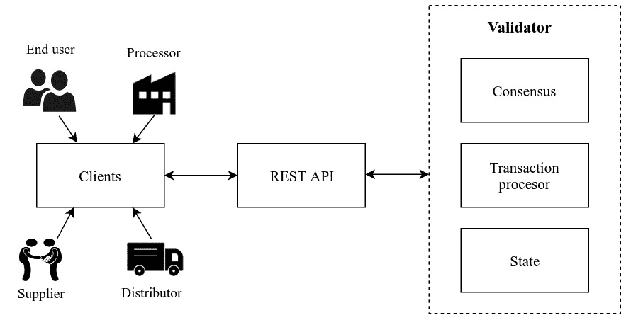

# 区块链用例

正如上一章所看到的，现在我们已经深入到了区块链适用性框架中，我们现在拥有了区分区块链和非区块链用例所需的信息。在这一章中，我们将关注定义更广泛的区块链用例，这将有助于激励我们为那些用例创建实现。

本章将涵盖以下主题:

*   出处追踪
*   付酬制度
*   众筹
*   分散的自治组织

区块链技术实现的去中心化可以为我们提供许多解决方案，解决我们在集中式系统中面临的许多现有问题。虽然区块链可以为我们在现有中央系统中面临的许多问题提供解决方案，但它也有自己的局限性。在前一章中，我们遇到了几个帮助我们选择真正的区块链用例的评估框架。在这一章中，我们将分析评估框架所选择的用例，这样我们就可以使用一个分散的架构来证明它们的实现。

最明显的区块链用例涉及多个实体的参与，而没有可信的机构来执行集中操作；相反，操作是分散的。有几个用例立即符合实现的条件，因为使用区块链实现这些用例获得了明显的优势。在审查了实现用例以提供现实世界问题的解决方案的可行性之后，我们缩小了用例的范围。

# 追踪供应链中的来源

供应链是一个由实体组成的系统，这些实体参与了产品的生产和销售过程。这一供应链通常包括供应商、制造商、批发商、零售商和消费者，其中产品按照*图 12.1* 所示的方向移动。供应链中的参与者通常分布在多个地点，这使得跟踪供应链中的货物变得非常困难:


图 12.1:典型供应链的流程图

由于在生产和分销过程中涉及多个实体，每个成品都沿着供应链移动。但是由于供应链的复杂性，很难追踪其来源。大多数现有的出处跟踪是在可信的第三方的帮助下执行的，因为供应链中涉及的实体彼此都不信任。使用区块链作为这些实体之间的共享分类账，可以为我们提供一种有效的方式来跟踪供应链中任何产品的来源。它允许系统中不可信的实体相信出处数据，而不允许单个实体同时拥有和维护它。

# 供应链中的痛点

市场上的每件产品在被最终用户消费之前都要经过几个环节。然而，由于缺乏有效的机制来跟踪来源，一直存在许多关于供应链的问题。这种担忧可以归结为以下例子:

*   终端用户经常被误导关于产品的来源，并且在许多情况下被欺骗提供次优产品。任何关于产品的信息也可能被供应链中的任何实体有意或无意地伪造。
*   低端供应链实体，如供应商和制造商，被大型零售商所利用。
*   现有的流程使得供应链不透明，其实体无法分析供需数据。

这些要点总结了在典型的供应链中面临的主要问题，在这种供应链中，没有有效的机制来跟踪产品的所有权。这强调了对追踪产品的公平方式的需求，而这正是区块链承诺的令人信服的解决方案。

# 区块链作为解决方案

我们已经在[第七章](07.html)、*深入区块链——所有权证明*中遇到了所有权证明的概念。提醒一下，所有权证明使用数字身份和数字资产，通过公共分类账来跟踪任何资产的来源。类似地，供应链中的每个实体都将拥有一个数字身份，可以在任何给定时刻拥有一项资产。使用区块链追踪来源的复杂解决方案包括以下几个阶段:

1.  供应链实体注册为出处跟踪系统的参与者
2.  具有唯一身份的数字资产将由最初的供应商创建，该供应商通常提供原材料
3.  然后，资产以物理和数字方式转移到下一个供应商或制造商
4.  制造商将为产品使用相同的标识，并为每一个转化的产品贴上标签，这样就可以追溯到源头
5.  最后，零售商可以在收到资产时将产品转让给消费者

当在区块链的帮助下使用数字资产和身份实现供应链中的来源跟踪时，供应链可以受益于区块链的许多特性。供应链流程需要以下特征:

*   多个实体可以执行读写操作。
*   每个交易都需要透明，以便每个实体都知道整个供应链的供应和需求信息。
*   交易历史需要完整性和不变性，这样才能追踪到产品的来源。不变性确保没有参与者或潜在的攻击者能够修改出处数据。
*   不需要高交易速度，因为供应链信息不需要实时数据。

供应链的预期特征表明，这个用例适合使用区块链来实现，因为它满足前一章中讨论的区块链决策模型的所有要求。

# 供应链的区块链实现

供应链中的来源跟踪可以通过使用许多现有的区块链平台来实现，包括我们已经讨论过的一些平台，如 Ethereum、NEO 或 MultiChain。然而，一个名为 **Hyperledger 锯齿**的特定项目已经在许多供应链用例中被企业广泛采用。

Hyperledger 锯齿是开源区块链项目 Hyperledger 伞形项目下的一个项目。锯齿项目最初是由英特尔贡献的，它允许将共识算法插入到核心软件中。锯齿区块链支持有权限和无权限的实现。

Hyperledger 锯齿有一个模块化的架构，使其组件易于操作。与其他区块链平台相比，它提供了一个具有高事务吞吐量的可伸缩解决方案。锯齿网络主要由两类参与者组成:**客户**和**验证者**。客户端将交易发送到区块链网络，而验证器确保交易被验证并包含在区块链中。验证器遵循共识机制并维护分类帐的全局状态。锯齿验证器基于在一个称为事务处理器的组件中指定的业务逻辑来验证每个事务。事务处理器是使用锯齿平台创建的任何分布式应用程序的核心。它借助于状态和事务逻辑来描述应用程序。因此，客户端创建的每个事务都将使用事务处理器进行验证。

为了展示供应链实现，我们将使用一个名为**锯齿供应链**的应用程序，它构建在 Hyperledger 锯齿之上。创建这个应用程序是为了让用户能够跟踪供应链中的商品，从而让他们能够跟踪商品的所有权和其他属性，比如温度、重量和位置。

锯齿供应链的所有参与者和组成部分可以在*图 12.2* 中看到。客户端将通过由验证器节点提供的**代表性状态转移** ( **REST** ) web 接口与区块链进行通信。供应链应用程序的事务处理器存在于每个验证器节点中，它将处理不同类型的事务，例如创建、转移和接受新的资产记录:



图 12.2:Hyperledger 锯齿供应链的架构图

注意:锯齿供应链可以从 GitHub 资源库这里下载:[https://github.com/hyperledger/sawtooth-supply-chain](https://github.com/hyperledger/sawtooth-supply-chain)。

该应用程序有几个不同的组件，可以使用`docker-compose`将每个组件作为一个容器来运行。一旦代码被克隆，并且`docker-compose`被设置，容器就可以使用`docker-compose`来初始化:

```
$ docker-compose up 
```

值得注意的是`docker-compose`将需要几分钟来设置所有的容器。一旦一切都设置好了，锯齿供应链的以下必要组件就创建好了:

*   锯齿区块链和供应链的 REST API 端点
*   供应链交易处理器
*   锯齿节点所需的数据库( **RethinkDB** )
*   用于与区块链交互的客户端应用程序

所有这些组件都将作为独立的服务在每个锯齿节点上运行。锯齿供应链将创建一个客户端应用程序，供应链的每个实体都可以在其中注册和管理资产。然后，锯齿供应链在本地端口`8021`上启动一个名为**资产跟踪**的客户端应用程序。一旦实体在应用程序中注册为代理，它们将成为供应链的一部分。然后将为每个实体生成公钥和私钥对，并且该实体可以通过其公钥来标识。

登录的实体可以添加具有一组属性的资产并提交事务。资产只能用不同的属性更新，并由给定资产的现有所有者转移给不同的所有者。供应链中的每个实体也能够查看所有资产和代理，但是只有资产的所有者可以将资产移动到不同的实体，从而确保每个资产的可追溯性。

与此同时，锯齿供应链还通过 Docker 容器为我们提供了 shell 访问，我们可以使用它来运行任意脚本，这些脚本将自动更新供应链数据。以下 Docker 命令可用于登录到 shell:

```
$ docker exec -it a supply-shell bash 
```

一旦我们登录到 shell，在导航到`server`文件夹后，可以使用下面的命令执行一个脚本来更新一些样例资产:

```
$ npm run update-sample-assets 
```

这个示例实现将通过在供应链中包含多个实体来帮助您理解出处跟踪。

关于锯齿供应链交易家族的更多细节可以在官方文档中找到:[https://sawtooth.hyperledger.org/docs/supply-chain/](https://sawtooth.hyperledger.org/docs/supply-chain/)。

# 金融体系

金融一直是区块链最大的用例之一，可以追溯到比特币的发明。从表面上看，区块链似乎最适合影响全球经济的许多实施，无论是银行、股票交易所还是支付网络。然而，在过去，即使在全球经济中，由于世界各地不同的金融系统有各种各样的解决方案以及它们之间的障碍，金融系统一直受到中央集权当局的操纵；这涉及到很多复杂性。

银行系统是世界上最大的金融机构。每个国家对这些银行系统的监管不同，这导致了跨境金融服务的壁垒。如图*图 12.3* 所示，位于两个不同地区的两个用户之间的银行交易由不同的机构监管，每个地区都有相应的银行帮助在边境安全地沟通和结算交易:


图 12.3:跨境交易的流程图

如今，银行机构允许其用户使用不同的支付系统进行在线资金转账。大多数国家都支持**实时总额结算** ( **RTGS** )支付系统，以便实时结算银行间的交易。还有许多其他支付系统支持国内水平的银行间交易，费用很低；例如，印度的支付系统有**国家电子资金转账** ( **NEFT** )、**即时支付服务** ( **IMPS** )、**统一支付接口** ( **UPI** )。但是当交易必须在不同国家的银行之间进行时，银行使用安全系统如 SWIFT 或 Fedwire 进行电汇。尽管这些支付网络如预期的那样运行，但是当在全球范围内实施时，它们有几个限制。

由于创建支付系统所涉及的所有复杂性，因此需要一种可用于创建高效支付网络的单一系统。区块链技术可以帮助我们消除金融机构之间的障碍，允许不信任的实体有效地进行通信。追溯到比特币创立之初，它的初衷是提供一个可以跨境使用的支付网络，因为它无法受到任何单一实体的监管。

# 支付系统的痛点

当与系统中的不同实体协作时，银行系统使用的复杂支付系统具有一组限制。在下面的列表中，你将被介绍到现有支付系统的一些局限性:

*   由于每日交易限额，不适合巨额资金转账。
*   你经常会遇到很高的交易费用。
*   银行间交易结算缓慢。尽管目前的支付系统为国内银行提供了快速的交易结算，但跨境交易仍然慢得令人痛苦。
*   你可能会发现一些支付系统只在银行工作时间运行。
*   由于所有的支付系统仍然是集中的，它们容易受到错误和攻击。

尽管银行交易可以通过电子方式进行，但值得记住的是，并非所有机构都具备处理数字交易的能力，对一些机构来说，使用实物货币会使金融系统更加复杂。创造一种不可伪造的实物货币是昂贵的，并且还存在诸如难以验证这种货币的原创性的问题。所有这些复杂性导致了一个腐败的金融体系。

# 区块链作为解决方案

区块链是比特币的产物，是为了用点对点的电子现金取代目前的支付系统而开发的。即便如此，自从比特币和区块链的发展以来，这项技术已经不仅仅是一种替代支付系统。区块链的特性为开发支付系统和其他金融系统问题的解决方案提供了很大的空间。有效的支付系统需要以下特性:

*   交易的实时结算
*   国内和国际交易费用低
*   可以转账的金额没有限制
*   安全通信和记录保存机制

在分散网络的帮助下，区块链可以用来建立一个系统，消除支付系统中的中介，从而实现快速而廉价的解决方案。然而，由于流动性可以立即转移到接收方，所以交易金额没有任何限制。类似地，区块链的共识机制从本质上保护了不变的账本。

我们讨论的支付系统用例满足区块链决策模型，因为它需要区块链的大部分属性。但是，保密性可能是区块链实施中的一个问题，因为在公共区块链中，交易信息是透明的。但你会发现，大多数区块链支付系统的实施都涉及作为最终用户的银行和其他金融机构，而不是银行账户持有人本身。因此，它提供了一种方法来执行私有事务，并对第三方观察者隐藏私有细节。就连直接在终端用户之间执行支付交易的支付系统也可以利用匿名交易来保护隐私，正如在第八章、*区块链项目*中所讨论的那样。

# 区块链支付系统的实现

正如我们将要讨论的，有几个实施方案试图借助区块链技术提供比现有金融系统更好的解决方案。Ripple 和 Stellar 这两个平台提供了一个网络，充当参与者之间的桥梁，并帮助消除对任何其他中介的需求。银行之间的网络设置充当跨境支付系统，甚至在没有太多延迟的情况下进行货币兑换。现在让我们更深入地研究波纹和恒星。

# 涟漪

Ripple 是一个分散的基于分类账的网络，允许转移被称为 XRP 的数字资产。Ripple 的愿景和目标是为银行等金融机构建立一种加密货币，以低成本实现跨境资金转移。

与其他加密货币不同，Ripple 没有创建一个并行支付系统。相反，它为现有的支付系统提供了一个名为 **RippleNet** 的网络来结算全球支付。Ripple 目前提供三种不同类型的支付解决方案:

*   **xCurrent** :这是一个在银行之间发送和接收跨境支付的软件解决方案，具有端到端的跟踪功能；交易在几秒钟内安全结算。
*   XV via:这允许用户使用 RippleNet 通过支付提供商发送国际资金。它提供了一组 API，用户可以直接使用这些 API 在全球范围内进行支付。
*   xRapid :它使用 Ripple 的数字资产 XRP 作为跨境支付的流动性。它利用交易所在 XRP 和当地货币之间转换资金。交易所的 XRP 数量越多，系统运行得越好。它还消除了银行在世界各地拥有本地货币预注资账户的需要。

支付提供商使用 Ripple 的一些用例可以在[https://ripple.com/use-cases](https://ripple.com/use-cases)找到。

# 主要的

Stellar 是一个开源平台，通过在一对货币之间进行价值交换来支持跨境交易。它旨在以更低的成本将银行、支付系统和最终用户与更可靠的系统连接起来。

恒星网络是一个名为**恒星核心**的分布式节点集合，使用**恒星共识协议** ( **SCP** )运行。任何支付应用都可以建立在 Stellar 网络之上。Stellar 提供了一个名为 **Horizon** 的 HTTP API 与网络进行通信。为了建立一个能够在一对货币之间进行转换的支付网络，需要一个能够帮助进行兑换的支付架构。该架构由被称为**锚**的可信实体组成，这些实体将在 Stellar 网络中为每笔存款创建信用。银行等金融机构通常是支付系统中的锚。为了发送和接收付款，Stellar 需要联盟和合规服务器，以及一个桥服务器来协调这些服务器。

有关 Stellar 网络的更多详细信息，请访问 https://www . Stellar . org/developers/guides/get-started/index . html。

Stellar 提供了几种支付解决方案，包括更快的小额支付和低成本汇款。Stellar 的一个伟大之处在于，它已经应用于选定的几个现实世界的用例中，并且最近与包括 IBM、Deloitte、SureRemit 和 KlickEx 在内的几家公司合作，执行跨境交易并解决汇款挑战。

你可以在 https://www.stellar.org/how-it-works/use-cases 找到更多关于恒星用例的细节。

# 众筹

众筹是一种从大量受众中筹集少量资金以支持特定事业的方式。当你需要为刚起步的想法提供初始资金时，通常会使用众筹。近年来，众筹通过从多个参与者那里获得资金，并消除银行和风险资本家等实体，改变了筹集资本的方式。

众筹可以针对任何类型的倡议进行组织，包括慈善、艺术和基于社区的项目。根据组织的意图，可以使用各种类型的众筹，例如:

*   基于奖励的，众筹活动的支持者将获得奖品或提前获得产品本身。Kickstarter 和 Indiegogo 等在线平台提供基于奖励的众筹。
*   **基于股权**，众筹出资人根据出资额获得公司股权。
*   **债基**类似于向银行借钱，只是由大众而不是中央银行放贷。贷方将从投资中获得利息，类似于传统银行系统中的贷款。利率对借贷双方都是公平的。
*   **基于捐赠的**:慈善组织、开源项目或任何其他非营利组织经常使用这种方式来为不同的事业筹集资金。

所有提到的众筹类型都会有至少三个参与者:发起者、平台提供者、支持者，如下图所示:


图 12.4:众筹中的参与者

成功的众筹将确保众筹活动在平台上以有效的方式进行广告宣传。众筹平台应该确保众筹发起者和支持者的资金运作是无缝的。区块链技术允许令牌在去中心化的网络中轻松创建和转移，而不需要任何中介来维护众筹平台。众筹发起人将启动代币分发流程，称为**初始硬币发售** ( **ICO** )。支持者将资助 ICO，并随后获得他们所贡献的代币。这些令牌在 ICO 阶段会有一个值，在 ICO 之后它们的值可能会有所不同。代币有时甚至可以代表提供代币的组织的权益。

# 众筹的痛点

与传统融资相比，众筹有许多优势，比如它为任何人提供了毫不费力地创建或资助一个项目的机会。也就是说，它确实有局限性:

*   如果涉及奖励、股权或债务，众筹仍然需要在发起人和出资人之间就大部分融资过程达成协议。
*   一些众筹形式没有为支持者提供灵活的投资选择，导致缺乏参与。
*   项目的支持者需要相信他们在资助项目后会获得他们的股权或回报，因此他们需要信任众筹平台和项目。
*   大多数众筹将由遵循捐赠模式的非营利组织发起。使用这种方法，当使用这种模型时，支持者的数量往往是有限的，并且通过使用这种方法，组织往往无法达到他们的目标。

# 区块链作为解决方案

区块链通过创建 ico，在去中心化的网络中提供令牌分发机制。执行 ICO 比任何其他类型的众筹都要简单得多。典型的 ICO 包括以下几个阶段:

1.  寻求融资的项目将通过指定 ICO 结构来启动 ICO，如初始令牌值、总令牌限制、令牌销售期等。
2.  一旦代币销售开始，支持者可以通过用法定货币或现有的加密货币资助项目来投资项目。支持者将获得相当于投资金额的代币。
3.  与其他众筹解决方案类似，如果 ICO 没有达到目标，活动就被认为是不成功的，资金将被返还给投资者。
4.  一个成功的 ICO 可以使用资金来执行项目的路线图。

ICO 常被比作首次公开募股(T1)(**IPO**)，即私人机构向公众发行股票。但有几个特征将 ico 与 IPO 区分开来，如下所述:

*   ico 不受世界上大多数政府的严格监管。虽然这使得推出一个 ICO 更容易，但也鼓励了欺诈性的众筹。
*   由于 ICO 中的令牌分发是分散的，因此与 IPO 不同，没有单一方管理融资操作。
*   与 IPO 相比，推出 ICO 更便宜、更容易。
*   ico 是由处于初始阶段的组织进行的，而 IPO 通常是由成熟的私人组织进行的。

IPO 是由希望通过向公众投资者发行股票来筹集资金的私营公司发行的。由于 IPO 过程复杂而漫长，这些公司寻求投资银行的帮助。

# 使用 ICO 的众筹的区块链实现

ICO 是在一个分散的网络中创建的，目标是分发令牌以便为给定的项目筹集资金。由于令牌分发是在分散式网络中执行的，因此 ICO 的整个逻辑都是用智能合约编写的。这些合同随后被部署在区块链网络中，并由区块链节点在执行任何 ICO 操作时执行。

ico 大多是在现有的区块链网络上推出的，比如以太坊、NEO、Wanchain 和 Waves。以太坊和 NEO 都被广泛用于开发和部署智能合约，目的是创建令牌和推出 ico。这两个平台都提出了对智能合约进行编程的标准，以实现在 ICO 期间分发的令牌。

以太坊有 ERC-20、ERC-223 和 ERC-721 令牌标准。ERC-20 是创建可替换令牌的令牌标准，也是 ico 使用最广泛的令牌。在下面的代码块中，我们可以查看显示 ERC-20 智能合约界面的代码片段:

```
contract ERC20Interface { 
  function totalSupply() public constant returns (uint); 
  function balanceOf(address tokenOwner) public constant returns 
 (uint balance); 
  function allowance(address tokenOwner, address spender) public 
 constant returns (uint remaining); 
  function transfer(address to, uint tokens) public returns 
 (bool success); 
  function approve(address spender, uint tokens) public returns 
 (bool success); 
  function transferFrom(address from, address to, uint tokens) 
 public returns (bool success); 

  event Transfer(address indexed from, address indexed to, 
 uint tokens); 
  event Approval(address indexed tokenOwner, address indexed 
 spender, uint tokens); 
} 
```

在[https://github.com/ethereum/EIPs/blob/master/EIPS/eip-20.md](https://github.com/ethereum/EIPs/blob/master/EIPS/eip-20.md)可以找到**以太坊改进方案** ( **EIP** ) 20 中提出的 ERC-20 的规格概要。

ERC-223 令牌标准旨在提供更好的安全性并减少交易中的气体使用。ERC-20 和 ERC-223 令牌都是可替换的令牌，这意味着每个令牌都是相同的。ERC-721 令牌标准旨在提供不可替换的令牌，其中每个创建的令牌都是唯一的。

虽然 ERC-721 令牌不用于典型的 ico，但它们在一些分散式应用中日益流行。诸如 CryptoKitties 所使用的可收集的加密资产使用 ERC-721 令牌。

近地天体平台还提供了一个令牌标准，称为 NEP5。这些是可替换的令牌，平台允许每个令牌使用相同的标准与其他令牌进行交易。NEP5 令牌实现了以下方法:

```
name() returns string; 

symbol() returns string; 

decimals() returns byte; 

totalSupply() returns BigInteger; 

balanceOf(byte[] account) returns BigInteger; 

transfer(byte[] from, byte[] to, BigInteger amount) returns bool; 
```

NEP5 规范中使用的方法的总结可以在[https://github . com/neo-project/proposals/blob/master/nep-5 . mediawiki](https://github.com/neo-project/proposals/blob/master/nep-5.mediawiki)找到。

为了更深入地了解 ICO 实现，我们将部署一个 ICO 模板来创建一个实现所有众筹功能的令牌。由于我们已经熟悉了 NEO 智能合同的部署，让我们将基于 NEP5 令牌的 ICO 模板部署到 NEO 区块链。

用 Python 编程的 ICO 模板由 https://github.com/neonexchange/neo-ico-template 的 NEX 开发，这是一个分散的交换平台。

首先，我们必须确保在 Python 3.6 中配置了 neo-python。参考[第 7 章](07.html)、*深入区块链-所有权证明*，了解更多关于使用 neo-python 配置 NEO 区块链节点的信息。同样，我们必须确保建立一个私有的区块链，正如在[第 7 章](07.html)、*深入区块链——所有权证明*中提到的。下一步是启动 NEO shell 来连接到这个私有区块链，这可以通过执行以下命令来完成:

```
$ np-prompt -p [private-network-node]
```

打开预装 NEO 和 GAS 的样品钱夹:

```
open wallet neo-privnet.sample.wallet
```

一旦从[https://github.com/neonexchange/neo-ico-template](https://github.com/neonexchange/neo-ico-template)克隆了 ICO 模板，我们就可以继续构建和部署 ICO 智能合约；我们需要了解智能合约的一些配置。

一组配置可以在`nex/token.py`文件中找到。与令牌和 ICO 销售相关的配置包括令牌名称、符号、令牌所有者、总供应量、所有者的初始数量、每个 NEO 的令牌和每个 GAS 的令牌。

ICO 智能合约有一些只能由所有者执行的方法，如*图 12.5* 所示的序列图所示。因此，有必要在`nex/token.py`文件中提供所有者信息(`TOKEN_OWNER`):


图 12.5:ICO 活动的序列图

智能合同配置完成后，需要构建并部署到近地天体区块链:

```
build ico_template.py test 0710 05 True False name [] 

import contract ico_template.avm 0710 05 True False 
```

在部署期间提供所有细节之后，NEO shell 输出合同的散列。这里，`0xce4a9966dfd3c7c02b48646a6aac281e4c914c2d`是智能合约的地址。该地址可用于使用`testinvoke`命令执行任何 ICO 操作，如下所示:

```
Please fill out the following contract details: 
[Contract Name] > Packt ICO 
[Contract Version] > 1.0.0 
[Contract Author] > Alice 
[Contract Email] > alice@packtcoin.com 
[Contract Description] > Basic ICO contract 
Creating smart contract.... 
                 Name: Packt ICO 
                 Version: 1.0.0 
                 Author: Alice 
                 Email: alice@packtcoin.com 
                 Description: Basic ICO contract 
                 Needs Storage: True 
                 Needs Dynamic Invoke: False 
{ 
    "hash": "0xce4a9966dfd3c7c02b48646a6aac281e4c914c2d", 
     ... 
} 
```

`deploy`操作只能由我们已经配置好的令牌所有者来执行:

```
testinvoke 0xce4a9966dfd3c7c02b48646a6aac281e4c914c2d 
 deploy [] 
```

在调用了`deploy`方法之后，ICO 被称为是活动的。任何参与者都可以调用`totalSupply`和`circulation`这样的方法:

```
testinvoke 0xce4a9966dfd3c7c02b48646a6aac281e4c914c2d 
 circulation [] 
```

这些方法将返回供应的令牌总数(1000 万)和最初分配给所有者的令牌总数(250 万)，如配置文件中所配置的那样。

在这个 ICO 模板中，令牌所有者必须通过注册来添加想要参与群体销售的参与者:

```
testinvoke 0xce4a9966dfd3c7c02b48646a6aac281e4c914c2d 
 crowdsale_register ["AXoZMHm7bxCF5oCkudRjJerJy5AvuRDxp2"] 
```

然后，注册参与者可以通过将 NEO 或 GAS 附加到 mint ICO 令牌来参与众筹:

```
testinvoke 0xce4a9966dfd3c7c02b48646a6aac281e4c914c2d 
 mintTokens --attach-neo=50 
```

必须将新创建的令牌导入到 wallet 中，以反映创建的令牌:

```
import token 0xce4a9966dfd3c7c02b48646a6aac281e4c914c2d 
```

然后，`wallet`命令将反映钱包中新创建的`PCKT`令牌:

```
Wallet { 
  "addresses": [ 
    { 
      ... 
      "balances": { 
      "0xc56f33fc6ecfcd0c225c4ab356fee59390af8560be0e930faebe74a6
 daff7c9b": "99993495.0", 
      "0x602c79718b16e442de58778e148d0b1084e3b2dffd5de6b7b16cee
 7969282de7": "14033.9996" 
      }, 
      "tokens": [ 
        "[ce4a9966dfd3c7c02b48646a6aac281e4c914c2d] PCKT : 
 2000.00000000" 
      ] 
    } 
  ], 
  ... 
  "synced_balances": [ 
    "[NEO]: 99993495.0 ", 
    "[NEOGas]: 14033.9996 ", 
    "[PCKT]: 2000 " 
  ], 
... 
} 
```

新创建的`PCKT`硬币可以执行任何 NEP5 方法，如`transfer`和`allowance`。

在以太坊中创建 ICO 将遵循类似的过程。

使用以太坊的众筹智能合同实现示例可以在[https://www.ethereum.org/crowdsale](https://www.ethereum.org/crowdsale)找到。

有几个加密资产发行平台可以帮助创建和管理所有 ICO 操作，而无需手动创建和部署智能合约。一些例子包括 CoinLaunch、Coinfactory 和 MyContract，它们是进行 ico 的一些最流行的平台。

# 非营利自治组织

非营利组织是提供商品和服务而不追求利润的机构。这些组织由志愿者为某个特定的目的运作，一些主要的例子是慈善机构、**非政府组织** ( **非政府组织**)，甚至任何志愿组织。尽管这些组织大多由志愿者运营，但每个组织都由一个自治机构控制。

由自治组织运营的非营利项目有很多限制，可能并不总是没有腐败。然而，他们确实倾向于给决策过程带来很多集权，这可能会导致很多争议。同样，自治组织可以通过引入区块链技术来消除组织中的任何中介，从而实现去中心化。这类组织的权力下放给它们带来了巨大的好处，因为非营利组织不应完全由任何当局拥有。

# 非营利自治组织的痛点

如前所述，由自治组织管理的非营利项目会给组织的运营带来很多集中化。在管理基于志愿者的项目的组织中可以观察到几个难点:

*   该组织的运作缺乏透明度
*   决策过程中的权力集中会导致组织中参与决策的人员有限
*   缺乏与外部组织的沟通

自治组织中缺乏透明度和权力集中会阻止非营利组织的支持者调查项目的进展或参与决策。这可能导致组织内部的腐败，导致活动管理失败。你可以通过创建一个**去中心化的自治组织** ( **道**)来实现透明，并在社区成员之间分配权力。

# 区块链作为解决方案

分散自治组织的权力是防止此类机构腐败的最佳方式。在区块链技术的帮助下，可以在不可信的实体之间构造 DAO。在这种情况下，非营利组织应该是透明的，并提供分布式治理。一家总部位于区块链的道可以通过维护一个公共分类账来实现这一目标，从而保证透明度和非中介化。

一个非营利性的道将具有以下属性:

*   本组织所有交易的透明度。
*   通过去除任何中介来自我管理。
*   由股东控制。项目的支持者可以参与决策。
*   对 DAO 规则的修改必须得到机构群体的批准。
*   非营利性 DAO 的所有属性都符合区块链决策树的条件，这使得 DAO 成为区块链的理想用例。

# 一个非盈利 DAO 的区块链实现

非盈利性 DAO 是通过维护由网络中的不可信实体管理的公共分类帐来实现的。任何愿意为项目做贡献或监督项目的人都可以加入 DAO，同时，DAO 的规则由社区决定，而不是由自治组织决定。组织的所有规则都写在智能合同中，并部署到区块链。对规则的任何修改都必须得到整个社区的同意。

非营利、非政府组织或政府福利项目可以使用 DAOs 来实现，以确保过程的完全透明。

# 摘要

在这一章中，我们已经详细分析了区块链用例的选择，并且看到了它们如何适合使用区块链技术来实现。我们还成功地挑选了一些用例，如供应链的出处跟踪、支付系统、众筹和 DAOs。

通过阅读这一章，我们已经探索了在选择合适的区块链技术来实现之前，如何处理和分析一个用例。这一章也有助于融合我们在本书中探讨的关于区块链技术的所有主题的精髓，并快速决定其用例的实现。

现在，我们已经完成了探索区块链技术基础之旅的最后一章，我们应该有足够的动力成为不断发展、引人入胜的区块链技术世界的一部分。