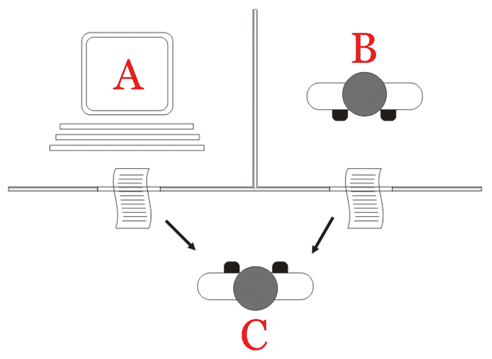
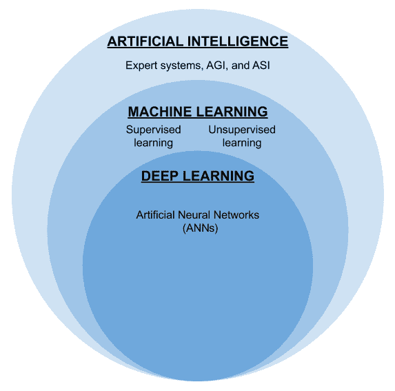
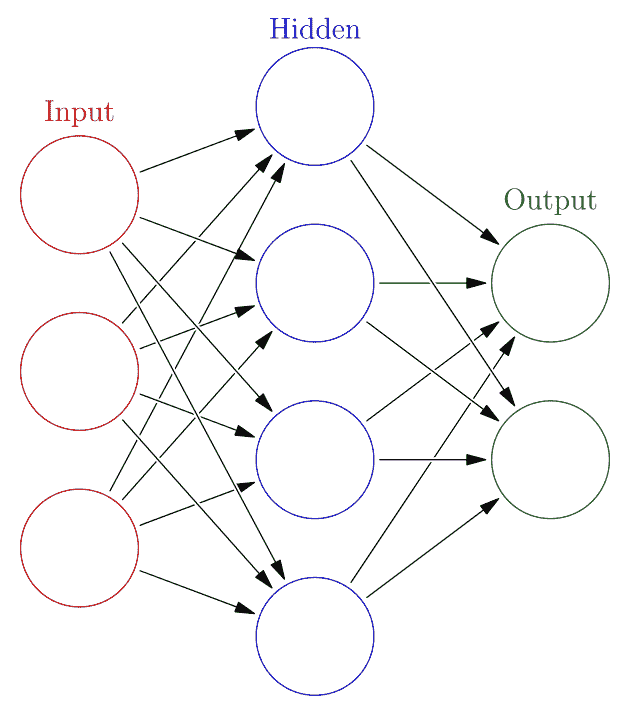
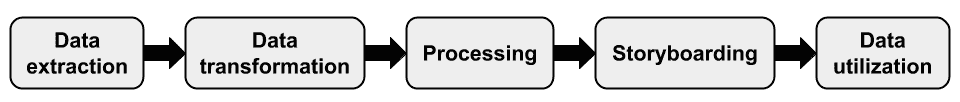
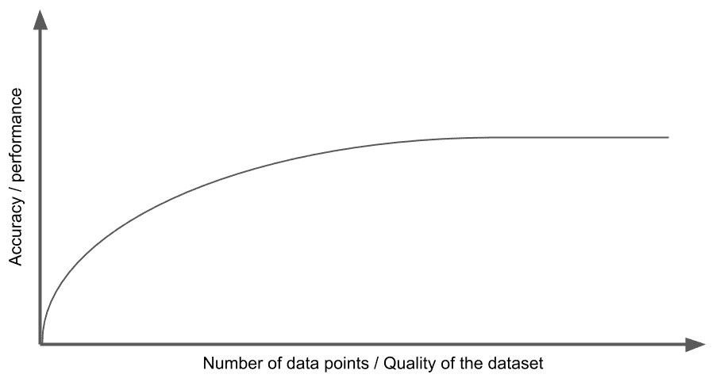

Introduction to the AI Landscape *“AI sees the invisible and reaches the unreachable.**”*

人工智能是在计算机出现在世界各地家庭和办公室的每张桌子上之前就已经发展的基本概念之一。今天，人工智能被应用于各个领域，以优化流程和解决人类能力和范围无法提供可行解决方案的问题。在这一章中，我们将简要考察人工智能的历史、分类以及人工智能在企业中的应用。

本章提供了人工智能前景的详细概述，涵盖以下关键主题:

*   人工智能-关键概念
*   人工智能的类型
*   人工智能的形式和方法
*   数字化转型中的人工智能
*   人工智能平台和工具

# 技术要求

本章假设你知道一些不同形式的人工智能的基本概念，并对人工智能如何影响日常生活有所了解。本章为初学者解释了基本概念，因此技术知识不是强制性要求。

# 人工智能-关键概念

人工智能基于其技术的本质、用途以及研究的时间线有许多定义。然而，最常见的定义如下——AI 是计算机在感知、学习和解决问题方面表现出的智能和能力，失败的概率最小。

人工智能在比人类更短的时间内计算和实现结果的能力，使计算机成为各行各业自动化的基石。人类的计算工作往往容易出错、耗时，并且随着问题变得越来越难解决，其准确性也越来越低。然而，很长一段时间以来，从自动化的早期开始，计算机就能够扮演这一角色，这种自动化可以在我们的日常生活中以许多被动的形式观察到。这种自动化的一个最好的例子是**光学字符识别** ( **OCR** )的引入，它将图像或文档中的嵌入文本转换成可供计算的文本源。配备 OCR 设备的计算机在复制内容时比人类更准确，耗时更少。类似地，条形码扫描仪引领了零售商店更快的结账时间。尽管早期的系统本身并不完全是*智能的*，但它们的效率仍然是公认的。

虽然早期人工智能缺乏通用标准，但我们将在下一节中考虑研究人员在过去 80 年中所做的主要努力。

## 人工智能的历史

早在公元前 4 世纪的希腊神话中，就可以在艺术、文学和计算机科学中观察到大量以机器人、人造人或机器人形式出现的人工智能描述。人工智能的研究和开发在 20 世纪初取得了主流进展。人工智能这个词是 1956 年在新罕布什尔州达特茅斯学院举办的一个夏季研讨会上创造出来的。这个研讨会被称为**达特茅斯人工智能夏季研究项目**，由**麻省理工学院** ( **MIT** )的数学教授之一约翰·麦卡锡教授组织。这个研讨会导致了人工智能作为数学和计算机科学交叉学科中的一个特殊领域的发展。

然而，值得注意的是，在达特茅斯研讨会之前的二十年，英国数学家艾伦·图灵在 1936 年提出了图灵机的概念，这是一种可以处理算法的计算模型。他后来发表了论文*计算机器和智能*([https://www.csee.umbc.edu/courses/471/papers/turing.pdf](https://www.csee.umbc.edu/courses/471/papers/turing.pdf))，在其中他提出了区分机器智能和人类的反应的概念。这个概念如今被广泛称为**图灵测试**。

在下图中，我们可以看到如何执行图灵测试来测试人工智能的响应是否可以与另一个人的响应区分开来:

图 2.1:在人工智能(A)和人类(B)之间由询问器(C)执行的图灵测试。

你可以在[https://en . Wikipedia . org/wiki/Turing _ test #/media/File:Turing _ test _ diagram . png](https://en.wikipedia.org/wiki/Turing_test#/media/File:Turing_test_diagram.png)查看 Juan Alberto Sánchez Margallo 的上图。这是许可图，【https://creativecommons.org/licenses/by/2.5/】T2。

在达特茅斯学院的夏季研讨会近十年后，1966 年，麻省理工学院的人工智能研究员约瑟夫·韦岑鲍姆展示了第一个聊天机器人，名为伊莱扎。它是首批尝试图灵测试的聊天机器人之一。在伊莱扎发明之后，一系列新的专家系统和学习模式在接下来的二十年里不断发展，直到 20 世纪 80 年代。

有了前面对人工智能及其历史的基本理解，让我们在下一节中考虑研究人员在人工智能早期面临的一些障碍。

## 艾·温特

人工智能冬天是许多 IT 行业人士用来定义人工智能研究人员面临许多挑战的一段时间，这导致了资金的严重削减和人工智能作为一个专门领域的发展放缓。

20 世纪 70 年代初，由于对人工智能的一些不合理猜测和随之而来的批评，人工智能领域的学术研究和发展突然被美国和英国政府叫停。当时复杂的国际形势也导致了许多人工智能研究项目的完全停止。

人们普遍认为，AI winter 始于 20 世纪 70 年代初，但在近 20 年后结束，原因是研究失败，动机受挫，政府机构达成共识，以及一些研究项目开始前设定的一些原始基本目标的崩溃。

现在我们已经了解了一些人工智能的历史，在接下来的部分，我们将探索不同类型的人工智能和人工智能的不同表现形式。

# 人工智能的类型

人工智能有几种形式，每一种都是为了解决不同的问题。人工智能可以通过各种不同的标准进行分类，包括用于设计它的理论方法和它打算用于的应用领域。

分类的努力直接受到一些参数的影响，例如在没有监督的情况下学习特定任务的能力、获得认知能力以及进行类似人类的推理的能力。基于这些和一系列复杂的期望，我们将研究人工智能的三种基本类型。

## 弱人工智能

也就是通常所说的****窄 AI** ，**弱 AI** 可以用来执行窄而重复的任务。弱人工智能功能基于预先存在的逻辑和数据组合。用户输入基于相同的逻辑进行处理，因此，弱人工智能缺乏自我意识和积极的学习能力。弱人工智能实现的一些突出例子是语音助手、聊天机器人和语言专家系统。由于逻辑的狭窄实现，弱 AI 适用于用户的输入和预期输出被很好地定义的场景。**

 **聊天机器人接收来自用户的文本输入，并处理输入数据以识别将文本输入转换成某种形式的动作所需的信息。聊天机器人通常应用于电子商务和支持领域，在这些领域可能不总是需要人工干预。在网上购物的情况下，聊天机器人的存在为用户提供了个人接触，并为用户提供了与系统通信的传统方式，而不是传统的搜索。同样，在支持方面，聊天机器人的应用可以降低维护一个产品支持团队的人均成本。认识到新一代用户更倾向于通过消息传递而不是传统电话来进行通信也是很重要的。聊天机器人可以利用这种文化转变，也可以减少支持过程中的潜在摩擦。

## 强人工智能

也就是通常所说的**人工通用智能** ( **AGI** )，强人工智能可以用来应用积极的学习能力来解决多变量范围的问题。强大的人工智能能够感知，意识到给定的问题，并在其认知能力的帮助下。强人工智能一直是更突出的研究领域之一，因为它在削减现有流程的运营成本以及探索未知领域的应用方面具有潜在的能力。

由于强人工智能推理和做出最佳判断的能力，可以在商业领域观察到强人工智能的应用。专家系统、机器学习和深度学习技术是强人工智能的一些最著名的表现。这些表现形式通常被企业使用，因为它们能够根据给定的数据点进行预测和推理。

其他一些跨行业应用的强人工智能的例子包括**计算机视觉**(**CV**)**自然语言处理**(**NLP**)**自然语言理解** ( **NLU** )，以及**强化学习** ( **RL** )。

例如，NLP 可以用于根据用户的情绪来调整系统，并帮助系统与用户进行更有效的交流，而不是弱人工智能实现。同样，强 AI 也可以应用于高效的语言翻译，在语言之间的转换中具有更高的准确性。

## 超级 pi

**超级 AI** ，或**人工超级智能** ( **ASI** )，是计算机超越人类思维意识的假想能力。很多专家推测，一个 AI 可能在达到奇点之后才达到这个阶段。人们还普遍认为，超级人工智能将最终导致计算机对人类思维的技术统治。尽管超级人工智能并不存在，但有一些机构和组织正在为从 AGI 到超级人工智能的飞跃做准备，特别关注遗传工程、人工数字神经元和量子计算。超级人工智能的应用目前令人惊讶地不清楚，因为很少有人能理解奇点之后会实现什么。然而，超级人工智能的一些原始变体有望帮助探索太空，创造新的语言，并预测战争中意想不到的后果。

奇点是由约翰·冯·诺依曼提出的一种假设情况，其中人工智能的认知能力超过了人类的思维。因此，人们相信奇点会导致各种各样的结果，其中人类的灭绝被认为是一种可能的结果。

有了前面对弱人工智能、强人工智能和超级人工智能的理论基础的理解，现在让我们来考察人工智能是如何以各种形式实际表现出来的。

# 人工智能的形式和方法

由于预期应用程序和解决方案可用技术的不同性质，人工智能的实现有各种形式。因此，人工智能以各种形式出现在代码中，被不同领域的广大开发者用来解决各自的问题。

在下面的文氏图中，我们可以看到各种形式的人工智能:

图 2.2:人工智能形式之间的关系

在上图中，我提到了人工智能的所有主要形式，分为三种主要表现形式。每种形式都将在下一节详细解释，分为专家系统、机器学习和神经网络。

我们现在将探索这些人工智能的主要方法和形式，并简要介绍它们的背景和应用。

## 统计和专家系统

统计系统是人工智能最原始的形式之一，可以追溯到 20 世纪 60 年代末。顾名思义，统计方法使用大量数据来得出最理想的结果。然而，人们很快认识到，这些结果实际上与现实世界的场景无关，并且仅基于人工智能的理性决策能力产生输出。这些限制导致了统计人工智能的衰落，为 80 年代初的专家系统铺平了道路。

专家系统是强大人工智能的成熟形式，能够挖掘数据集并得出与问题背景更相关的答案。这一飞跃得益于信息论，并结合了硬件方面的新能力。虽然专家系统是在 20 世纪 60 年代早期开发的，但由于个人电脑革命，它们直到 20 世纪 80 年代才变得可以负担得起。与统计人工智能使用的科学方法不同，专家系统利用语义和语言编程以高概率达到预期的输出。

下图是一个正在使用的专家系统的例子:

图 2.3:使用中的专家系统照片

你可以在 https://en . Wikipedia . org/wiki/Expert _ system #/media/File:symbolics 3640 _ Modified 查看前面由迈克尔·l·乌姆里奇和卡尔·r·弗兰德拍摄的照片。JPG 。这是照片的执照，【https://creativecommons.org/licenses/by-sa/3.0/】。

虽然专家系统为早期人工智能的采用打开了大门，但真正满足行业需求的是机器学习。在接下来的部分，我们将学习机器学习。

## 机器学习

**机器学习**是一种人工智能，它依赖于预先存在的数据集作为输入，在对给定数据应用数学模型的基础上，预期输出有或没有变化，以产生类似人类的思维。这个术语是由 IBM 人工智能研究的先驱之一亚瑟·塞缪尔在 1959 年创造的。如果一个特定的机器学习算法系统旨在根据给定的预测数据推断出一个结果，那么它就被称为**预测分析**，用于计算机应用的各个新兴领域。

尽管在机器学习之前就存在类似形式的人工智能，但人们认为，自 20 世纪 90 年代初以来，大多数研究都被整合在这个标签下，这也被称为机器学习的黄金时代。机器学习概念的一些最早应用是 CV、垃圾邮件过滤和操作优化。

在最近的过去，有三种机器学习算法一直在使用。我们将在下面几节中讨论它们。

### 监督学习

这种方法中的模型直接依赖于作为训练数据输入的数据集，也依赖于预期的输出。该模型本身使用训练阶段的输入数据，学习结果以标记样本的形式与一些输入范围相关联。这样的样本被输入到算法模型中，以便能够成功地获得预期的结果。通常，预期的结果是分类、回归或预测的形式。

### 无监督学习

在这种方法下，为模型提供训练数据作为输入，但是缺少最终用户指定的任何预期输出。这种方法是合理的，因为这种实践的预期结果是获得数据中存在的未探索的理性共性的可见性。

### 强化学习

这是一种基于奖励的学习方法，通过以累积的方式奖励成功的代理人来实施广泛的技术，从而实现全面的优化。

现在，我们对机器学习有了基本的了解，让我们继续检查神经网络。

## 神经网络

一个**人工神经网络** ( **安**)，也叫**深度学习**，是一组合成神经元形成一个回路来解决难题。这是一种专门的人工智能形式，具有旨在实现预期目标的侵略性策略。然而，与机器学习算法不同，人工神经网络中的启发式和执行模式不是线性的，因此这种人工智能可以在广泛的应用中找到，例如自动驾驶、文本和面部模式识别、交易决策软件、数字艺术和药物配方。

下图是神经网络的一般表示，以及三层之间的基本关系— **输入**、**隐藏**和**输出**:

图 2.4:典型神经网络的图示

你可以在[https://commons . wikimedia . org/wiki/File:Colored _ neural _ network . SVG](https://commons.wikimedia.org/wiki/File:Colored_neural_network.svg)查看 Glosser.ca 的上图。这是许可图，【https://creativecommons.org/licenses/by-sa/3.0/】T2。

## 进化计算

人工智能长期以来一直被认为是生物技术未来的关键推动者。遗传算法等形式的进化人工智能也是该领域的早期研究领域之一。人工智能有助于分析、模拟和预测我们身体中突变的行为。同样值得注意的是，基因组研究中的一些人工智能实践受到了积极的批评，担心在实验过程中对人类的未来产生严重的影响。

## 群体计算

除了以集中的方式表现，人工智能还扰乱了分布式和协作式计算机系统的功能。**群体智能**是一组系统通过有序合作实现共同目标的能力。群体智能被用来理解群体行为并尽可能优化流程。

多个代理基于一组试探法一起工作，以消耗大量数据并基于一个或多个计算设备之间的协调产生有意义的结果。群体人工智能的应用可以在机器人，物流自动化，如卡车排队等方面观察到。

下面的照片是一个使用群体计算技术的协调应用的真实例子:

图 2.5:一群协作的机器人正在充电

你可以在 https://commons.wikimedia.org/wiki/File:RechargingSwarm.jpg 的[看看之前塞尔日·肯巴赫拍摄的照片。这是执照照片，【https://creativecommons.org/licenses/by-sa/3.0/】](https://commons.wikimedia.org/wiki/File:RechargingSwarm.jpg)。

有了对人工智能及其类型、形式和方法的基本理解，我们现在将在下一节探索应用人工智能的程序。

# 数字化转型中的人工智能

许多组织已经为下一波数字化转型做好了准备。虽然一些数字解决方案已经成功采用了人工智能技术并从中受益，但数字解决方案领域的很大一部分正忙于为即将到来的人工智能飞跃做准备。我们将简要观察人工智能可以实现未来数字化转型计划和解决主要挑战的一些关键里程碑。

我们将从观察下图中人工智能支持的数字化转型项目中涉及的一些关键里程碑开始:

图 2.6:使用人工智能实现数字化转型的重要里程碑

上图代表了人工智能主导的数字化转型项目的所有重要里程碑。该图还表示了将一个里程碑连接到另一个里程碑的流程。每个里程碑都将在下面的章节中详细阐述。

## 数据析取

在人工智能可以用于推动数字化转型项目之前，必须收集与流程和实践相关的基本信息，并将其归档到合适的包中，以便进一步构建。

数据提取步骤包括从现有系统的各种模块中严格获取原始数据和信息。提取的数据不仅有助于我们理解现有的流程，还有助于我们量化和建立边界和检查点，以供进一步分析。

用于提取数据的方法是 AI 支持数字化转型项目的最基本步骤。因此，确保团队和关键利益相关者一起审查和衡量数据质量是至关重要的。

假设一家乳制品公司正在规划其业务的数字化转型，并对利用人工智能获得更好的洞察力感兴趣。我们将首先通过识别产品和收入来了解乳制品行业的总体信息，然后是来自许多领域的原材料的具体信息。数据提取过程还包括识别具有关键检查点的业务流程。

考虑以下人工智能模型的性能图:

图 2.7:人工智能模型性能提升的一般说明

前面的线形图是人工智能模型如何更好地执行和获得准确性的一般说明，由 *y* 轴表示，使用新数据点的数据集质量的提高由 *x* 轴表示。这意味着，随着时间的推移，通过仔细审查不断增长的数据集的质量，人工智能模型可以变得更好。

## 数据转换

前一阶段收集的数据可以是非结构化的，也可以是半结构化的。这意味着数据点放在一起时很有可能不一致，这可能会成为对收集的数据进行分析的障碍。

为了帮助 AI 理解给定的场景，收集的数据必须基于关键利益相关者同意的标准格式进行结构化。然而，如果数据是从数据仓库中提取的，那么所需的工作量可能是最小的。

如果数据是一个非结构化的数据流，市场上有几种**提取**、**转换**、**加载** ( **ETL** )工具可以用最少的努力构建海量数据，包括 Apache NiFi 和 Apache StreamSets([https://dzone.com/articles/top-5-enterprise-etl-tools](https://dzone.com/articles/top-5-enterprise-etl-tools))。

除了独立和本地软件，市场上还有云托管的 ETL 服务，如 AWS Data Pipeline 和 AWS Glue。

一旦数据按照指定的方案进行了转换，我们就可以将它转发给数据处理。

假设我们已经从乳品公司获得了必要的信息。现在，我们可以通过识别数据集中的关键信息来分离数据和噪声。在数据转换过程中，我们删除了不必要的列。我们还根据数据类型(如纬度和经度)合并了一些列。如果本地牛奶场的纬度和经度数据保存在不同的列中，我们可以将它们合并到一列中。类似地，我们可以考虑跳过可能没有关键列值的行。

## 处理

来自各个业务部门的结构化数据以及培训数据现在被用作输入数据，以挖掘、模拟和推断预期结果，从而更好地了解数字化转型计划下的任何工作。

基于数据点的性质、来源和复杂性，您可以选择各种人工智能模型和技术。例如，如果数据是卖方和买方之间的对话，您可以使用 **NLP** 。

假设来自乳品企业的数据被清理，我们现在可以将这些数据提供给一个用于训练的预测模型。数据输入后，我们可以与业务团队一起检查模型的结果，以确认结果有利于给定的业务目标。例如，该模型可以预测当地养牛场剩余牛奶的可能存量。基于产生的剩余牛奶数据，我们也许还能够识别出我们可以用它生产的乳制品。因此，这些处理数据的结果可以帮助我们获得更好的见解。

## 记事板制作

一旦计算出预期结果，就应该交流和共享信息以获得反馈。这有助于识别结果的相关性。

在乳制品的例子中，我们可以使用预测来做出商业决策，及时分配剩余的牛奶来生产选定的乳制品。乳制品销售所节省的成本和增加的收入可以使用市场上可用的可视化库和仪表板软件在故事板中传达。

## 数据利用

一旦就所获得的结果达成共识，收集的见解将被转化为新的实践，并通过网络、移动和**物联网** ( **物联网**)设备在生态系统中的多个代理之间发挥作用。这种参与循环不断重复，直到通过在数据来源的细化、数据处理和算法的有效设计方面的不断创新，达到理想的优化结果。

在乳制品的例子中，在人工智能的帮助下产生的见解和利润预测不仅通过故事板传达给关键人员。还可以通过对现有业务流程进行适当的更改，将这些见解付诸进一步的行动。

既然我们已经理解了基于人工智能的数字化转型项目中的关键里程碑，让我们也通过列举潜在失败背后的原因来探索可能的失败场景。

## 故障场景

基于人工智能的数字化转型项目可能会因为各种原因而失败，包括市场需求、适应性、技能差距和业务流程中的意外变化。让我们在下面的章节中了解更多关于这些原因的知识。

### 业务需求

在评估 AI 在数字化转型项目中的任何应用之前，我们必须确保业务需求得到一致同意。必须创建其流程将得到改进的所有利益相关者的列表，以评估流程中涉及的其他利益相关者之间的任何潜在风险。

### 适应性

虽然企业环境中的大多数组织都可以使用技术，但这并不一定意味着企业可以从 AI 在转型中的应用中受益。人工智能的应用实际上可能会增加既定过程的复杂性和复杂性。因此，我们必须对行业的士气保持敏感，只有在大多数利益相关者都愿意采用新兴解决方案的情况下，我们才能做出坚定的决定。

### 技能差距

在一些垂直行业中，并不是所有的利益相关者都了解或意识到新兴技术。将人工智能支持的数字转型引入一群利益相关者可能会遇到严重障碍，这些利益相关者不喜欢在标准人工智能实践要求的条件下操作，这通常涉及用户组的分析能力。

### 过程检修

众所周知，人类倾向于对生活中的变化做出负面反应。就像在生活中一样，评估将这些新兴解决方案引入到对业务引入的变化非常敏感的利益相关者的风险是非常重要的。此外，数字化转型的重大突破可能会影响当前的业务模式，并影响业务相关利益方的隐私政策。必须仔细审查，以确保数据管理符合当地数据法规和法律。

在对基于人工智能的数字转型项目所涉及的过程有了基本概述之后，现在让我们来探索一些可用于支持这种数字转型的工具。

# 人工智能平台和工具

人工智能生态系统成熟的主要标志之一是新工具和框架的应用。创新、互操作性和准确性等其他指标也在识别人工智能生态系统及其工具的成熟度方面发挥着重要作用。在接下来的章节中，我们可以看到一些人工智能平台和工具的简短列表，它们被世界各地的许多工程师所利用。

## TensorFlow

**TensorFlow** 是由互联网巨头谷歌锚定的开源项目。这是一个用于机器学习项目的复杂框架。它提供了一个广泛的生态系统，其中包含全面的工具包、库和文档，使研究人员和开发人员能够轻松设计、构建和部署基于机器学习的应用程序。在 https://www.tensorflow.org 的[找到更多关于这些工具的信息。](https://www.tensorflow.org)

## 微软认知工具包

**微软认知工具包** ( **CNTK** )是一个商业级分布式深度学习的开源工具包。它通过使用有向图将神经网络描述为一系列计算步骤。在 https://github.com/Microsoft/CNTK[的 GitHub 上找到更多关于这个工具包的信息。](https://github.com/Microsoft/CNTK)

## 沃森机器人

IBM Watson 是一个开源的、多云平台，可以让你构建强大的模型，并以更流畅、更简化的体验部署它们。这个 IBM 套件提供了企业就绪的 AI 服务、应用程序和工具，并提供了丰富的支持。在 https://www.ibm.com/watson/about/的[找到更多关于 IBM Watson 的信息。](https://www.ibm.com/watson/about/)

# 摘要

人工智能一直处于创新的前沿，大多数商业应用程序在所有领域都采用了它。在这一章中，我们能够观察到人工智能的关键概念、简史和迄今为止的进展。我们还介绍了人工智能领域中使用的不同方法，并借助图表理解了人工智能中的多种实现和类别。然后，我们观察了在数字转型计划中应用人工智能以实现最佳结果所需的步骤。最后，我们以介绍全球人工智能社区积极使用的一些最新工具和平台来结束这一章。

在下一章，我们将探索人工智能和区块链的一些有趣的应用，以及一些真实世界场景的详细案例研究。**