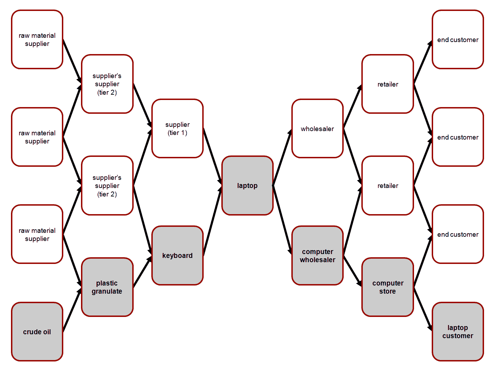
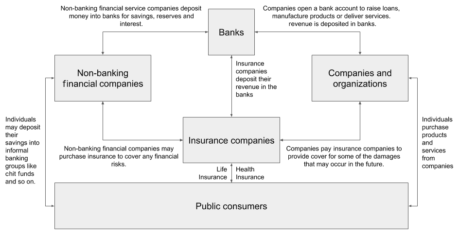
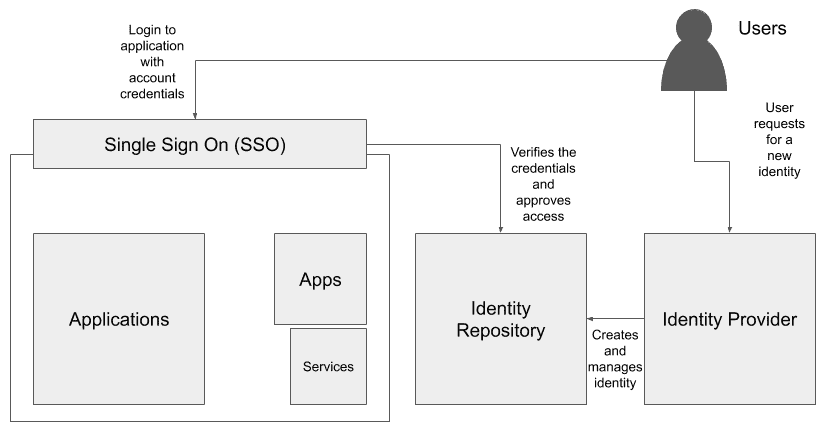
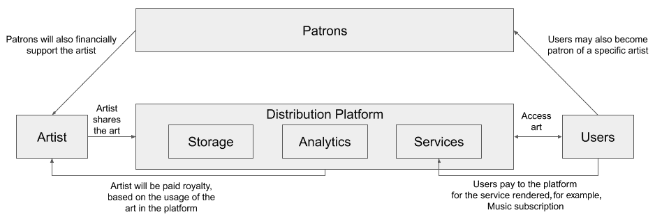
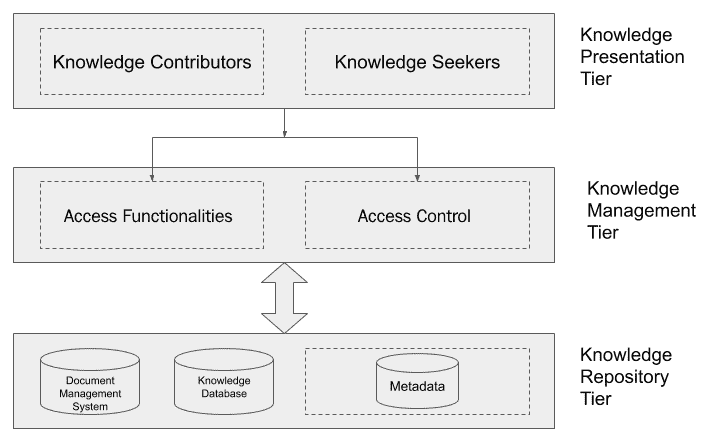

Domain-Specific Applications of AI and Blockchain *“Blockchain and AI: The hands of the future.**”*

区块链和人工智能已经被用来构建许多解决方案。在本章中，我们将展示区块链技术的一些应用。我们也将展示一些使用人工智能技术的应用。我们将分析面临的问题和提供的解决方案，并为您提供对当前解决方案的看法。

我们将涵盖几个垂直领域的解决方案，例如:

*   将人工智能和区块链应用于医疗保健
*   将人工智能和区块链应用于供应链
*   将人工智能和区块链应用于金融服务
*   将人工智能和区块链应用到其他领域

我们开始吧！

# **技术要求**

本章要求你能够分析人工智能和区块链的应用，基于它在应用领域的关键能力。

# **将人工智能和区块链应用于医疗保健**

早在 20 世纪 70 年代初，人工智能就在医疗保健领域进行了实验。应用于该领域的最早的人工智能之一是一个名为 **Dendral** 的专家系统。然而，Dendral 并没有成为医疗保健领域的主流应用；它的继任者之一叫做**霉素**接手了治疗药物领域的一些挑战性问题。今天，人工智能和区块链在医疗保健领域的应用受到了 IBM、微软、谷歌和其他初创公司的青睐。

在下面的截图中，你可以看到一个病人的**电子健康记录** ( **EHR** ):

图 3.1:EHR 的样本视图

你可以在[https://en . Wikipedia . org/wiki/Electronic _ health _ record #/media/File:Electronic _ medical _ record . jpg](https://en.wikipedia.org/wiki/Electronic_health_record#/media/File:Electronic_medical_record.jpg)查看图表。

现在，让我们了解一下医疗保健行业面临的一些问题。

## **领域内的问题**

尽管人工智能的应用在医疗保健领域取得了重大进展，但它们未能解决一些治理问题和一些困扰该领域的非法做法。区块链在这里是一个强大的组合，因为它帮助人工智能存储由透明和可发现的行为支持的合法数据。让我们来看看:

*   **EMR 隐私和安全**:电子病历(也称为电子健康记录)是患者健康信息的数字副本，由医生在治疗过程中填充。通常，EHR 由患者的病史、症状、诊断信息和实验室结果组成。电子健康记录使组织能够提供更加互联、高效和方便的医疗服务。在过去的几十年中，EHR 的应用受到发达国家的严格监管，主要是欧盟和美国，它们分别通过了跨境健康指令和 1996 年隐私和安全规则的**健康保险携带和责任法案** ( **HIPAA** )。尽管这些规则得到了强有力的执行，但仍有多起电子病历数据泄露事件影响了数百万用户。这在一定程度上可以追溯到集中式信息架构，它导致黑客发现了门户级的攻击。
*   **药物配方**:药物配方(也称为药物配方)是研究化学物质的组合，以形成治疗特定疾病的新药或医药产品的过程。找到一种符合伦理的方法来共享临床试验记录，以完善药物配方的分析过程是一项挑战。药物配方中使用的大多数新技术利用了基于从药物输送中获得的数据以及临床测试记录的各种分析过程。与 EMR 类似，底层数据非常敏感。
*   **预测性医疗**:预测性医疗的共同目标是在患者出现症状之前提供治疗或通知。这是通过以近乎实时的方式对患者的个人数据进行预测分析而实现的。获得有关身体的前所未有的数据可能非常有用，但也必须谨慎对待。基于区块链数据的人工智能实践可以帮助在诊断期间使用可验证的数据发现来提供预防性治疗。

现在，让我们学习如何使用区块链或人工智能来解决医疗保健行业的问题。

## 医疗保健领域的新兴解决方案

以下列表包括一些由医疗保健领域的活跃企业和初创公司发起的区块链计划:

*   IOTA eHealth 是由 IOTA 基金会倡导的基于解决方案的计划，提供诸如远程患者监控、患者健康数据交换以及确保 IOTA 分类帐支持的临床研究数据完整性等功能。你可以在 https://www.iota.org/verticals/ehealth 的[了解更多关于电子健康的信息。](https://www.iota.org/verticals/ehealth)
*   IBM 区块链:据报道，IBM 区块链研究小组正在研究一种解决方案，通过使用许可的区块链和一种特殊的移动接口来防止假药。据报道，该解决方案托管了一个区块链网络，其中网络上的参与者被认证和授权执行交易，以及跟踪和验证交易。您可以在[http://www . research . IBM . com/Haifa//dept/services/BC-IOT . shtml](http://www.research.ibm.com/haifa/dept/services/bc-iot.shtml)了解更多信息并了解当前正在采取的最新行动。

既然我们已经了解了关键解决方案，那么让我们回顾一下医疗保健行业的现状。

## **回顾**

人工智能和区块链的使用有助于彻底改变医疗保健，监管机构和国际机构，如世界卫生组织(T1)、世卫组织(T3)和 T4()、美国食品药品监督管理局(T5)、美国食品和药物管理局(T7)据说都热衷于利用这项技术。他们正积极与企业合作，朝这个方向努力。健康和医疗保健预计将在未来十年大幅增长，我敦促你们通过区块链和人工智能在这一领域保持开放的标签。

现在，我们已经了解了医疗保健行业的当前解决方案，让我们来探索供应链中使用的产品和解决方案，由区块链或人工智能提供支持。

# **将人工智能和区块链应用于供应链**

供应链管理对全球许多行业和经济增长的成功至关重要；有些人认为供应链是贸易的神经系统。管理供应链是一种面向操作的实践，从计划、采购和仓储的早期阶段，到将货物从生产商运送到消费者手中的物流，都需要效率和效果。

以下示例图确定了笔记本电脑供应链管理中涉及的利益相关方:

图 3.2:笔记本电脑供应链中的利益相关方

你可以在 https://en . Wikipedia . org/wiki/Supply _ chain _ management #/media/File:Supply _ and _ demand _ network _(en)查看安德烈亚斯·维兰德的这张图表。png 。这是许可图，【https://creativecommons.org/licenses/by-sa/3.0/】T2。

现在，让我们了解一下供应链行业面临的一些问题。

## **领域内的问题**

以下是供应链行业面临的三大问题:

*   **运营成本和风险**:很大一部分供应链仍处于文书工作模式。这意味着系统中的数据很容易被篡改。供应链中的数据对于确定产品的价值至关重要，包括其基本属性，如有效性和保质期。如果货物的文件被篡改，整个价值链可能会出现很大的缺口。基于人工文书工作的供应链还会因为潜在的情况(如重复记账)而引起财务问题，从而在利益相关者中造成更多的审计问题和混乱。虽然相对较新的供应链解决方案已经有效地数字化转变了一些供应链交易的文书工作性质，但在技术上能够处理该过程中潜在数据丢失或伪造的系统较少。区块链可以在智能合约的帮助下缓解这些问题，并可以自动化几个关键流程。
*   **安全性和真实性**:尽管供应链的端到端流程使用传统的企业软件进行数字连接，但它们之间的定义和耦合是松散的。这意味着数据完整性没有被视为一级特性。这可以通过基于不变性概念的区块链技术来解决，并确保记录不会被窃取、撤回或被不准确的数据所替代。由于区块链上的交易数据是公开的，相关的利益攸关方可以访问信息并核实单一的真实来源。
*   **实时可见性**:与传统金融紧密结合的本地数字平台上的交易也可能带来其他业务挑战，例如结算延迟。供应链中的企业严重依赖营运资本，资本的主要来源是贷款或服务收入。与传统金融相比，在整个价值链中实现实时支付可以以相对较低的成本实现更快的支付处理。这对行业来说是一个游戏规则的改变。

让我们来看一些使用区块链或人工智能来解决供应链行业问题的解决方案。

## **供应链行业的新兴解决方案**

以下是一些使用区块链或人工智能来解决前面提到的一些问题的应用程序:

*   **IBM Sterling 供应链套件**:由 IBM Watson 提供支持，这个基于云的数字商业网络提供实时情报和可行的建议。该套件在供应商管理、库存管理和订单管理方面提供了广泛的功能。同样值得注意的是，该套件提供了一个开放平台和一个开发者中心，用于使用区块链和人工智能在供应链中构建定制的解决方案。你可以在这里进一步了解他们的产品和服务:【https://www.ibm.com/in-en/supply-chain】T2。
*   **OpenText** :为了让供应链更加互联、协作、智能和安全，OpenText 正在致力于一个可以用于应用人工智能、物联网和区块链的自主智能供应链。你可以在这里了解更多关于他们的产品和服务:[https://www . open text . com/info/ai-IOT/connected-supply-chain # form](https://www.opentext.com/info/ai-iot/connected-supply-chain#form)。

接下来，我们将看看供应链行业的当前情况。

## **回顾**

尽管人工智能和区块链正被用来更有效地跟踪订单和管理库存，但仍有许多业务缺口需要填补。重要的是要降低准入门槛，让全球不同的利益相关者参与进来，这样他们就可以参与到一个全球可核查的供应链网络中，以期提高质量和效率，增加透明度。这可以通过公开 API 来实现，这样，不是所有的供应商都必须在相同的区块链或网络上运行；相反，为了更好的兼容性，他们可以简单地交换可信的数据，并将其记录为跨网络的交叉交易。必须努力使这些产品具有互操作性，以便全球供应链经济更容易在区块链提供的多样性上繁荣发展。

现在，让我们探索一下**银行和金融服务行业**(**)使用的由区块链或人工智能驱动的产品和解决方案。**

 **# **将人工智能和区块链应用于金融服务**

众所周知，BFSI 是全世界经济运行的支柱。由于管理着数万亿美元的资产，在数字规模上有效管理资金已成为一个有利可图的机会，因此需要重新审视，因为当前系统通常依赖于传统方法，效率低下。

下图描述了 BFSI 行业中利益相关者之间的关系:

图 3.3:BFSI 的利益相关者

如上图所示，像你我这样的公众消费者通过银行、保险公司、**非银行金融公司**(**)获得资金和服务。另外，请注意，为我们提供服务的公司和组织也依赖于这些金融机构。**

 **现在，让我们探讨一下 BFSI 行业面临的一些问题。

## **领域内的问题**

以下是 BFSI 工业面临的三大问题:

*   **获得资本**:没有银行账户的人和银行服务不足的人受到资格标准问题的严重影响，从而在市场上造成了一个巨大的缺口，从而导致了非正规经济。如果获得资本变得更容易，我们就能简化非正规经济并最大限度地发挥其潜力。
*   **欺诈和违法行为**:据估计，金融欺诈和违法行为给全球经济造成了 6000 亿美元的损失。这是一个困扰 BFSI 行业的严重问题，尤其是在印度，因为最近有不良贷款被曝光。在撰写本文时，印度的不良贷款排名第二，根据彭博的一篇文章，印度的不良贷款高达 1600 亿美元。你可以点击此链接了解更多:[https://www . Bloomberg . com/news/articles/2019-09-27/Asia-s-6400 亿-bad-loan-pile-lures-investors-Deloitte-says](https://www.bloomberg.com/news/articles/2019-09-27/asia-s-640-billion-bad-loan-pile-lures-investors-deloitte-says)。
*   **缺乏适当的流程自动化**:尽管已经进行了许多尝试来保护 BFSI 部门并使其自动化，但我们需要一个更好的模型，既能在行业透明度之间实现惊人的平衡，又能维护机构间的秩序。因此，使用区块链带来透明度，使用人工智能技术实现自动化的优化工作流程，可能是彻底改变这个行业的关键。

现在，让我们来看看一些可以用来解决 BFSI 行业问题的解决方案。

## **BFSI 的新兴解决方案**

以下是一些使用区块链或人工智能的应用程序，以解决前面提到的 BFSI 的一些问题:

*   Teradata : Teradata 是一家总部位于加州的公司，因其为金融服务行业提供的数据分析产品而闻名。有一个有趣的案例研究，深度学习和人工智能被用于检测复杂的欺诈并减少一家知名银行的误报。据报道，传统的规则引擎可以检测出大约 40%的欺诈行为，相比之下，Teradata 的分析解决方案将这一比例提高到了 80%。该解决方案还大幅减少了 60%的假阳性，增加了 50%的真阳性。冠军/挑战者方法用于确保最佳深度学习模型被实时用于检测欺诈。

您可以通过阅读 Teradata 的案例研究文档来了解有关该解决方案的更多信息，[https://www . Teradata . co . uk/Resources/Case-Studies/Danske-Bank-Fight-Fraud-With-Deep-Learning-and-AI](https://www.teradata.co.uk/Resources/Case-Studies/Danske-Bank-Fight-Fraud-With-Deep-Learning-and-AI)。

*   Nuo 网络:Nuo 是一个借贷双方对等的网络，支持加密贷款。贷款人可以按一定利率提供加密货币，而借款人可以以抵押资产的折扣价筹集抵押贷款，然后在贷款期限结束时支付溢价。在撰写本文时，诺网络已被许多用户用来筹集高达 3000 万美元的贷款。此外，需要注意的是，诺网络是非托管的，这意味着其中有资金的钱包不在公司的直接或间接控制下。这是通过使用以太坊区块链实现的，在那里智能合约被用来交易**醚** ( **ETH** )和 ERC20 代币。你可以在这里找到更多关于他们的产品和服务:[https://Nuo . network/index . html](https://nuo.network/index.html)。

接下来，我们将回顾一下 BFSI 行业的现状。

## **回顾**

一些新兴的解决方案解决了 BFSI 行业的关键问题。然而，如果我们能够将这些点连接起来，就有可能在解决方案空间中实现飞跃。人工智能解决了优化问题，区块链实现了透明度，但大多数情况下，这些技术部署在单独的筒仓中，可能无法在整个链条中实现价值。因此，当务之急是将这些孤岛连接起来，让用户和机构能够发现自身系统之外的价值，从而发现新的潜力和收入流。

现在，我们已经回顾了针对 BFSI 行业的当前解决方案，让我们来探索其他领域使用的产品和解决方案，由区块链或人工智能提供支持。

# **将人工智能和区块链应用于其他领域**

尽管目前大多数解决方案都在供应链和金融服务领域进行了商业部署，但更多新兴解决方案正在各个领域得到应用。我们将观察这种使用人工智能和区块链来解决企业当前问题并释放其真正潜力的解决方案。

现在，让我们探索知识管理领域中使用的产品和解决方案，由区块链或人工智能提供支持。

## **将人工智能和区块链应用于知识管理**

你们大多数人，包括我自己，都是通过维基百科这样的开源知识库接触到互联网的。在这一代，事情发展得很快，这本书的一些内容也可能在到达你的手中或设备时变得过时。在这个瞬息万变的世界中，敏捷性对于保持互联网上任何记录的知识库的准确性非常重要。如果知识库包含多个主题，并且每个主题维护几个子主题和文章，这将是一个巨大的问题。

现在，让我们探讨一下知识管理领域面临的一些问题。

### **领域内的问题**

知识管理面临的一个首要问题是信息的准确性。

维护维基百科文章中任何过时信息的准确性和相关性需要大量的时间和人工编辑的几轮人工努力。作为地球上最大的百科全书之一，维基百科存储和提供了数百万篇文章，它还必须保持事实的正确性。此外，随着时间的推移，这些公开信息不应该容易受到假新闻或宣传的影响。

现在，让我们来看看知识管理领域问题的解决方案。

### 知识管理中的新兴解决方案

让我们看一个应用程序的例子，它使用区块链或人工智能来解决前面提到的一些问题。

来自**麻省理工学院** ( **MIT** )的**计算机科学和人工智能实验室** ( **CSAIL** )的一组研究人员已经创建了一个自动文本生成系统，该系统可以根据需要在维基百科句子中定位和替换特定信息，同时保留人类的语法和风格。

虽然今天存在许多基于规则的机器人，它们可以进行某些预定义或编程的更改，但机器人通常缺乏推理，因此无法以人类可读的格式将两个事实连贯地放在一起。这不仅会造成文件流程的中断，还会导致加倍努力来解决这些问题。此外，在更新任何文件时，核实事实变得至关重要，以确保假新闻或宣传不会影响对概念的理解，从而导致偏见。据报道，通过使用一个扩大的数据集，研究人员能够通过让模型以同意-不同意对的方式查看证据和样本，将假阳性减少 13%。你可以在 https://news . MIT . edu/2020/automated-rewrite-Wikipedia-articles-0212 找到更多关于这项研究的信息。

现在，让我们回顾一下知识管理领域的当前场景。

### **回顾**

随着云技术的不断创新，知识管理系统的实践正在被重新思考。我认为现在也是灌输区块链技术和人工智能技术的有效性的黄金时期，以丰富用户体验，降低整体成本，并保持数据安全。

现在，让我们探索由区块链或人工智能驱动的房地产领域的产品和解决方案。

## **将人工智能和区块链应用于房地产**

在过去的几十年里，印度不断增长的经济带来了许多大都市的崛起和一个活跃的新采购市场。然而，由于不良的记录做法和/或腐败，除其他严重问题外，还出现了咄咄逼人的土地掠夺案件。在交易任何一块房地产之前，核实产权是一个繁琐的过程。我们还可以观察到一些历史案例，在印度的一些地方，种族冲突持续到今天，争夺土地。

虽然我已经解释了印度房地产的当代问题，但这些是困扰许多发展中经济体的共同问题。

现在，让我们探讨一下房地产领域面临的一些问题。

### **领域内的问题**

以下是房地产行业面临的两大问题:

*   **土地记录不一致**:一项房产权利的出售或转让涉及多个部门。不幸的是，这些部门各自为政，因此，如果不能向所有当局提供相同的数据，就会出现差异。这可能会给土地所有者带来复杂的法律地位。
*   **缺乏即时可追溯性**:如果买家希望购买特定的房产，必须有办法在几秒钟内通过地契或任何其他符合文件来追溯所有权的转移。今天，地方当局提供的服务通常需要一些时间，而且可能要付出相当大的代价。

现在，让我们来看看解决房地产领域问题的解决方案。

### **房地产新兴解决方案**

在这一节中，我们将看看一个应用程序， **emBlock** ，它使用区块链来解决前面提到的一些问题:

基于 Hyperledger Fabric，emBlock 是一个基于 eMudhra 的 emLabs 构建的解决方案。emBlock 旨在让企业和政府从即时共识、实时信息共享和智能合同中受益。eMudhra 成立于 2008 年，是印度和毛里求斯颁发数字签名证书的认证机构。他们是印度的市场领导者，曾与印度的大型银行、金融服务公司和几个政府机构合作实施基于数字签名的解决方案。

该解决方案建议记录销售契约，以便将其存储在区块链上，从而允许各种政府机构访问它，如注册和印花税部门、调查和结算部门、税务部门和法院，以及商业实体，如银行。您可以通过 https://www . emudhra . com/us/case-studies/区块链/emBlock _ land _ records _ case _ study . pdf 了解有关 em block 土地记录案例研究的更多信息。

现在，让我们回顾一下房地产领域的现状。

### **回顾**

尽管有一些基于区块链的解决方案可能符合现有的要求，但也应该使用人工智能来识别潜在的欺诈或感知任何数据损坏。此外，必须鼓励政府机构和有关监管当局以试点项目的形式使用这些新技术。

一些印度邦已经接受了这一技术变革，但需要更广泛的思维来建立适当的数字战略，以实现 100%的数字记录保存实践。就我个人而言，我有信心在未来 5 到 10 年内实现这一目标。

现在，让我们探索媒体领域使用的产品和解决方案，由区块链或人工智能提供支持。

## **将人工智能和区块链应用于媒体**

在过去的几年里，假新闻已经成为一个严重的问题，导致了许多国家的政治动荡。最近爆发的冠状病毒也在中国以外的几个社区引起了一些异常反应，传播了恐惧和耻辱。

现在，让我们看看媒体领域面临的一些问题。

### **领域内的问题**

让我们来看看这个领域面临的首要问题。

假设你每天从一家知名报纸上阅读新闻。你可能会因为报纸的信息而信任它，但也因为它的历史和记者的声誉，所有这些都是可以被社会识别的。现在，假设你正在阅读一本在线杂志——形势完全对你不利。尽管你可能是该网站的热心读者，但不能保证这篇文章是由可信的作者发表的。有时，冒名顶替者很可能会冒用一名拥有良好声誉和读者信任的记者的名字发表文章。在这种情况下，无论是读者还是发布新闻的网站都很难评估信息的有效性，因为这类文章的数量太大了。区块链不仅可以用来帮助验证故事是否来自你最喜欢的记者，还可以通过可以实时自主学习的事实检查员的帮助来验证说法。

现在，让我们来看看可以用来解决媒体领域问题的解决方案。

### **新兴媒体解决方案**

在本节中，我们将探讨一种可以解决前面提到的一些问题的解决方案:

Civil 是一家总部位于区块链的网络，旨在传播社区所有的新闻，实现信任和透明。Civil 允许读者和记者设定信任度。记者赢得声誉和认可，使他们的内容值得信赖。读者可以决定他们想相信哪个新闻编辑室是他们的新闻来源。这使得用户能够基于他们自己的偏好和信任级别来定制他们的新闻馈送；这不是由传统上挖掘用户行为数据的供应商决定的。这也意味着，由于传统的订阅模式已经衰落，新闻编辑室已经发现了一种新的筹资或创收方式。在撰写本文时，Civil 允许用户直接向记者付费，没有提成。此外，Civil 还自豪地宣称在 28 个国家和 6 大洲拥有 1000 多名记者。不幸的是，在出版这本书的时候，Civil 已经关闭了他们的业务。不过，你还是可以在，[https://github.com/joincivil](https://github.com/joincivil)找到 Civil 背后的代码。

现在，让我们回顾一下媒体领域的现状。

### **回顾**

更多像 Civil 这样的公司能够帮助读者区分噪音和信号。多亏了区块链，这是内容质量的根本进步。然而，如果设计非常严格并且非常注重隐私，那么个性化故事就变得很困难。我们应该鼓励 DApps 在伦理上只使用人工智能来定制提要，只要用户选择加入。

现在，让我们探索身份管理领域中使用的产品和解决方案，由区块链或人工智能提供支持。

## **将人工智能和区块链应用于身份管理**

在互联网出现之前，我们可能拥有的唯一身份证明是政府颁发的带照片的身份证，它用于一些服务，如配给等。在第二代互联网中，我们使用的大多数数字服务都与我们的电子邮件 ID 相关联。这减轻了照片 id 的需要，但并没有变得独立于它。由于传统的 IDs 和我们的 IDs 的数字版本正以这样或那样的方式被滥用，今天用户管理这些变得极其困难。管理身份并将其与一个**去中心化的标识符** ( **做了**)联系起来的问题是过去几年中最前沿的研究领域之一。

DID 是一种新型标识符，提供可验证的数字身份。这些标识符具有**自我主权**的性质，这意味着数字身份不依赖于集中式身份提供商。因此，用户可以控制自己的 did。

下图描述了企业用户身份管理领域中的利益相关者:

图 3.4:企业身份管理领域中的利益相关者

如上图所示，员工、客户和供应商等企业用户通常通过 SSO 身份验证机制来访问应用程序。这个 SSO 需要一个来自一组白名单域或提供商的企业 ID。将由行业内所有合作公司管理。

现在，让我们探讨一下身份管理领域面临的一些问题。

### **领域内的问题**

让我们来看看身份管理面临的首要问题。

我们中的大多数人都使用手机，因此在使用手机服务之前，我们会使用带照片的身份证来验证自己。尽管这是维持问责制和保障社会安全所必需的，但一些坏人可能会滥用你的身份证明，在你不知情的情况下冒充你。

现在，让我们来看看有助于解决身份管理领域问题的解决方案。

### **身份管理中的新兴解决方案**

让我们来看一个使用区块链来解决前面提到的一些问题的分布式身份应用程序。

使用 DIDs，Sovrin 网络允许用户安全地验证和发布他们自己的数字证书，控制它们，并使用一种叫做**零知识证明** ( **ZKPs** )的安全标准来管理它们。让我们假设你被要求在你的银行余额中有超过 1000 美元才能进入赌场。今天，如果有这样的规则，唯一的方法来验证你的余额赌场是通过显示您的帐户的声明，这也是由银行经理证明。你可能不想这样做，因为你暴露了你的银行余额，这可能导致某些社会和个人风险。zkp 被用来以一种创新的方式解决同样的问题——只要你有超过 50，000 美元，你就不必显示你当前的余额。您不必公开您的银行余额，但是服务提供商(如前面示例中的赌场)仍然能够验证您拥有超过 1，000 美元的事实。这对于用户隐私来说是一个巨大的胜利，因为像你当前的银行余额这样的敏感数据还没有被共享。这同样适用于验证居住地址、出生日期等。你可以在[https://SOV rin . org/the-SOV rin-network-and-zero-knowledge-proof/](https://sovrin.org/the-sovrin-network-and-zero-knowledge-proofs/)找到更多关于 ZKP 概念的信息。要了解更多关于 Sovrin 的信息，您可以阅读他们的白皮书，网址为:[https://so vrin . org/WP-content/uploads/2018/03/so vrin-Protocol-and-Token-White-paper . pdf](https://sovrin.org/wp-content/uploads/2018/03/Sovrin-Protocol-and-Token-White-Paper.pdf)。

现在，让我们回顾一下身份管理领域的当前场景。

### **回顾**

收养是 did 和 zkp 的关键问题。发行者需要使用 zkp，然后用户才能在希望验证它们的服务提供商处试用它们。今天，在所有三个层次的参与中都存在瓶颈:

*   **发行人**:政府机构和当局需要了解使用 ZKP 的 DIDs 的好处，以减少他们自己的管理成本和潜在的数据泄露。
*   用户:用户需要意识到隐私，并开始使用一些当今可用的社会可验证的证据。
*   验证者:服务提供商也应该被鼓励使用这些技术，避免他们这边的数据泄露。

现在，让我们来探索版税管理领域使用的产品和解决方案，由区块链或人工智能提供支持。

## **将人工智能和区块链应用于版税管理**

内容创作者和出版商花费大量时间创作各种形式的新颖艺术，如音乐、视频和游戏等。用户通过应用程序访问这些内容，但通常不会直接向内容创建者付费。虽然这不是所期望的，但是公司代表所有用户定期为他们的消费付费。正如你可能会告诉，这里的中间人是促进平台上的内容的应用程序。然而，不能保证这些平台以合理的方式向内容创作者支付版税。

下图突出了版税管理中涉及的主要利益相关方:

图 3.5:版税部门的利益相关者

如上图所示，当用户通过分发平台访问艺术家的作品时，艺术家可以获得版税。很明显，用户和赞助人是艺术家的收入来源。

现在，让我们来看看版税管理领域面临的一些问题。

### **领域内的问题**

在本节中，我们将探讨版税管理面临的一个首要问题。

如果组织不是公共的，内容创建者就不能完全看到销售统计数据。产品可能无法提供完整的对账或始终证明金额的合理性，让贡献者或内容创作者蒙在鼓里。

现在，让我们来看看有助于解决版税管理领域问题的解决方案。

### **版税管理的新兴解决方案**

让我们看一个使用区块链来解决前面提到的问题的应用程序。

微软公司与安永会计师事务所(Ernst and Young)合作，开发了一个基于区块链的解决方案，允许 Xbox 游戏发行商接近实时地访问他们的版税报表，而不必等待数天的对账。这个解决方案使用了微软 Azure、Azure 区块链服务、Azure Cosmos DB 和微软 Power BI。您可以通过查看微软网站上的案例研究文档来了解该解决方案的更多信息:[https://customers . Microsoft . com/en-us/story/Microsoft-financial-operations-professional-services-azure](https://customers.microsoft.com/en-us/story/microsoft-financial-operations-professional-services-azure)。

现在，让我们回顾一下版税管理领域的当前场景。

### **回顾**

在过去的几年里，我们已经看到订阅 Hulu、网飞和亚马逊 Prime 等点播内容服务的人数有所上升。有人估计，未来 5 年，点播内容服务的总市场规模将增长到 1000 亿美元。这一重大转变意味着最终用户对音乐和视频等内容的感知已经从**免费**转变为**付费**。尽管用户已经准备好为这些服务付费，但我们还没有看到内容创作者和艺术家在平台上如何获得报酬的重大改革。

现在，让我们来探索信息安全领域使用的产品和解决方案，由区块链或人工智能提供支持。

## **将人工智能和区块链应用于信息安全**

我们可能听过这样一句话**信息是新的石油**。信息无孔不入。作为一名读者，与你与外界的离线关系相比，今天你的大部分数字身份和互动都是在线的。称之为人类的巨大转变并不过分。因此，我们必须注意保护我们的信息安全。在几十年的过程中，我们观察到许多低效的架构，它们未能保护我们的身份和我们的在线交互。今天，这可以通过人工智能的应用来纠正，因为它可以用来密切监控系统中的任何后门漏洞。但从根本上说，数据的所有权主要还是在供应商手中。这种情况必须改变，由于区块链，我们可以很容易地建立一些关于信息隐私及其所有权的基本规则。

现在，让我们看一下信息安全领域面临的一些问题。

### **领域内的问题**

让我们看一下信息安全行业面临的一个首要问题。

存储、读取、更改和保存信息是有代价的。如今，大多数区块链和分散式文件存储服务都使用不稳定的加密货币对您管理的数据收费。这意味着一些用户有很高的进入壁垒，要么是因为波动性影响了他们保存信息的预算，要么是加密货币的使用在一些国家受到严格限制或严格禁止。因此，我们必须找到一种方法来提供分散的文件存储服务，这种服务可以以传统的方式向用户收取法定货币的费用，但同时也提供对他们所拥有的数据的完全控制。

现在，让我们来看一个可以用来解决信息安全领域问题的解决方案。

### **信息安全领域的新兴解决方案**

让我们看一下 IPFS 的一个特殊应用，它解决了我们前面提到的问题。

MóiBit 提供了一个个性化和分散的安全存储网络，由区块链系统的不变性和来源提供支持。 **Moi** 在法语中的意思是 **me** 。 **Bit** 是两个词的组合——**二进制数字**，指的是一个数据单位。MóiBit 为企业和 DApp 开发人员提供了在预计成本的环境中使用区块链和分布式文件系统的所有优势的能力。要了解有关 MóiBit 的更多信息，请访问， [https://www.moibit.io](https://www.moibit.io) 。如果你有兴趣在 MóiBit 之上开发应用，可以参考这个链接:[https://github . com/moi bit/moi bit-Sample-DApp/tree/matic-dapp](https://github.com/moibit/Moibit-Sample-DApp/tree/matic-dapp)。

现在，让我们回顾一下信息安全领域的当前情况。

### **回顾**

企业尚未对安全文件存储系统表现出浓厚的兴趣，因为它们大多数是分散的。我们必须明白，说服企业采用这种系统是一场非常重要但艰难的战斗。虽然 MóiBit 和其他解决方案已经解决了这个问题，但障碍在于集中化的成本相对于分散化中的数据复制或复制来说很低。人们正在努力通过使这些操作对封闭系统来说更加原子化来定制应用层和网络层的数据复制控制。

但是，这可能会导致再次创建孤岛。因此，必须注意在保证成本的围墙系统和保证责任和安全的分散化之间的生态系统中建立平衡。

现在，让我们探索文档管理领域中使用的产品和解决方案，由区块链或人工智能提供支持。

## **将人工智能和区块链应用于文档管理**

近来，文件和书面记录已经成为确定真实性、出处和法律优先地位的必要手段。虽然现在大多数业务运营都是在线进行的，但我们需要找到实现不变且可验证的机制的方法，以保护我们免受敏感业务数据被黑客攻击或泄露的影响。

下图描述了文档和知识管理系统中的利益相关者:

图 3.6:文档和知识管理系统中的利益相关者

如上图所示，文档管理主要由提供内容的用户和寻找这些内容的另一组用户组成。这些功能由访问控制管理，然后存储在数据库中。

现在，让我们看看文档管理领域面临的一些问题。

### **领域内的问题**

以下是文档管理中面临的两大问题:

*   **权限管理**:虽然有几个应用程序可以为一个文档提供**存在证明**，但是很少有应用程序可以自定义对文档的访问。这在很大程度上是由于区块链的性质，其中的数据是每个人都可以访问的。
*   **报告**:对敏感业务数据的访问必须在共享后准确报告。监控这种访问并寻找异常仍然是公司的一个公开问题，这些公司可能会遭受自己员工的数据泄露，这是公司间谍活动的一部分。

现在，让我们来看一个可以用来解决文档管理领域问题的解决方案。

### **文档管理中的新兴解决方案**

在本节中，我们将研究一个使用区块链和人工智能的应用程序，以解决前面提到的问题。

Signy 是一个基于区块链和人工智能的应用程序套件，允许用户提交任何类型的应用程序表单，对证书进行数字签名和联合签名，创建和定制他们自己的智能证书，并共享具有完全安全性和审计跟踪的数字证书。它利用区块链实现文档、证书和资产的透明度、安全性和安全性。它还使用人工智能和人工智能技术来创造创新的产品和服务，并增强其区块链解决方案，使其更具适应性和智能。点击[https://signy.io/certificates](https://signy.io/certificates)，您可以了解更多关于 Signy 在客户入职、证书和文档管理方面的使用案例。

现在，让我们回顾一下文档管理领域的当前场景。

### **回顾**

尽管采用分散式文档管理的步伐正在加快，但是仍然需要为业务所有者提供细粒度的控制。单靠区块链的设计模式并不能提供足够的能力来建造这样的系统。将这些技术与现有的**身份和访问管理** ( **IAM** )系统相结合是未来整合和发展的关键。

# **总结**

在这一章中，我们确定了大规模行业中的一些最佳用例，确定了这些行业面临的问题，并阐述了人工智能和区块链在几个领域的真实应用。我们涵盖了几个领域的这些方面，如知识管理、房地产、媒体、身份管理和版税管理。我们还讲述了信息安全领域面临的一些特殊问题，以及如何使用 IPFS 来解决这些问题。我希望您在本章中学到的知识能够帮助您发展观察、分析和开发相关案例研究的实践技能，并帮助您提出广泛的想法，以便您能够制定更好的解决方案并培养批判性思维的眼光。

在下一章中，我们将理解分布式数据库概念的基础，并了解更多关于分布式数据服务提供商及其产品的信息。****