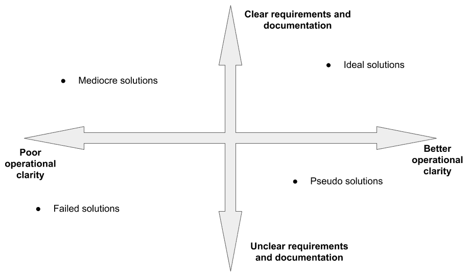
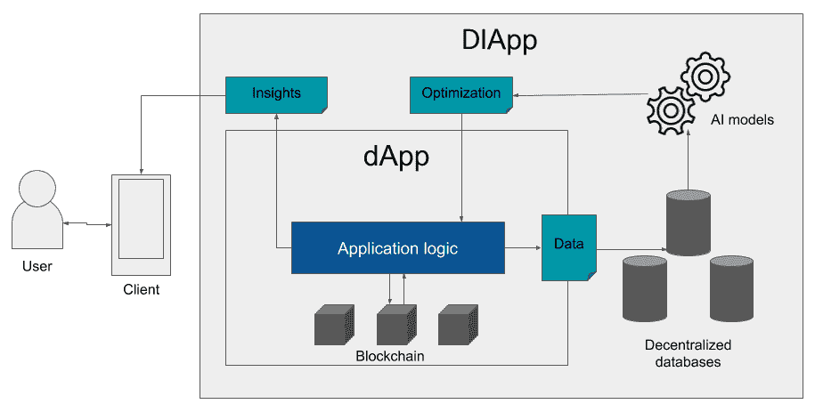
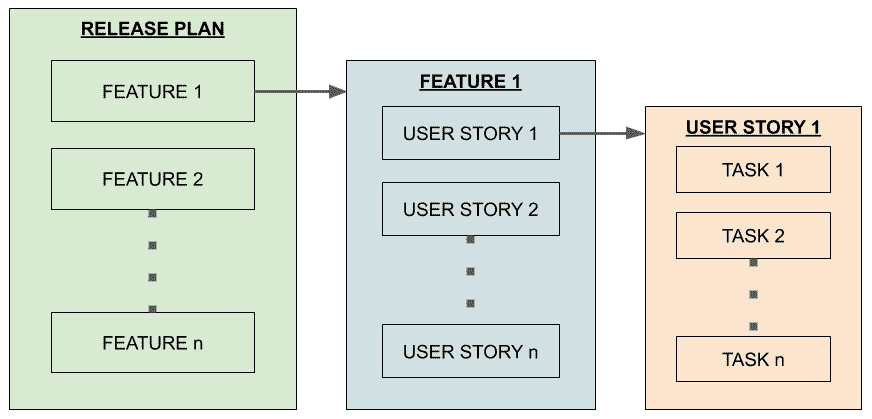

Development Life Cycle of a DIApp *“Fast. Good. Cheap. Choose any two.**”* *- Unknown; used by many software project managers*

在这一章中，我们将探索一系列广泛的新模式，这些模式可以用在区块链和人工智能应用的软件开发生命周期中。它将帮助您构建现代应用程序，解决前面章节中讨论的各种行业所面临的问题。在介绍 SDLC 方面之前，我们还将比较传统的区块链应用程序和下一波智能分散应用程序。我们还将探索可以在修订后的 SDLC 下构建的新型应用程序的体系结构方面。

在本章中，我们将讨论以下主题:

*   在区块链应用 SDLC 实践
*   DIApps 简介
*   比较 DIApps 和 DApps
*   设计一个尿布
*   开发一个 DIApp
*   测试 DIApp
*   展开 DIApp
*   监控 DIApp

# 技术要求

本章要求你能够分析应用人工智能技术的好处以及区块链技术在软件开发过程中跨几个应用领域的应用。

# 在区块链应用 SDLC 实践

自区块链技术问世以来已经超过 10 年了，现在需要更新的新兴模式，这些模式可以应用区块链技术和人工智能技术来满足不断扩展的互联网日益增长的需求，并有效地管理各个行业垂直领域的软件开发实践。

现在，让我们在接下来的小节中一步一步地探索 SDLC 的所有主要方面。

## 创意到产品化

有很多在区块链上构建新应用的想法。然而，较少的想法被转化为设计。尽管人们努力设计分散的应用程序，但只有少数设计对现实世界足够实用。这是由于产品期望和开发者所掌握的技术之间的不匹配。在某些情况下，技术和功能可能会变得可用，但由于这些区块链最近的不稳定增长，它们可能得不到足够好的支持。因此，在区块链，并非所有的想法都能转化为产品，这是一个普遍存在的问题。

除了平台本身的局限性，还有一种趋势是将每一个现有的解决方案区块链化，因为 T2 害怕错过机会。一些公司想尝试它，即使它可能不适合他们的目的，这也可能导致问题。

根据我过去三年在区块链和人工智能领域积极开发的经验，这些问题可以通过采取以下一些步骤来解决:

1.  **了解业务流程**:

在我遇到的大多数区块链用例中，对业务流程的清晰理解是至关重要的，因为大多数区块链解决方案将影响业务的运营和财务方面。因此，在对所涉及的复杂步骤或所需方法做出危险的假设之前，对所有利益相关者进行更详细的业务流程教育是非常重要的。

例如，如果正在开发一个新的解决方案，使用区块链和人工智能对乳品公司进行数字化转型，团队中的每个人都必须对将牛奶从牛场带到餐桌的端到端流程有一个舒适的理解。

2.  **建立** **明确要求**:

在任何新兴技术中都有一个普遍的观察结果，即大多数努力经常被夸大，从而缺乏构建应用程序所需的客观清晰度。在我们能够识别潜在的集成点之前，我们必须清楚区块链或人工智能在解决方案中的应用正在解决哪些痛点。所有的涉众必须尽最大努力清楚地传达功能性和非功能性需求。这有助于管理未来的期望。

例如，组织的决策者或所有者可能需要从生产生的未加工牛奶的当地养牛中心获得更好的透明度和责任。所有者还可以确定需要分析他们所有乳制品的当前销售趋势，以确保牛奶可用于进一步加工，从而根据需求制造必要的乳制品。

3.  **识别** **业务流程中的关键检查点**:

一旦需求被确定和澄清，在区块链的情况下，不要直接进入设计是至关重要的。我们必须确定当前的实现，并理解关键的业务组件和必须应用和集成技术的检查点。

例如，识别牛群中的每头牛可能是团队最基本的检查点之一。此外，了解当地生产商收集的原料奶量是手动输入系统还是通过数字称重秤自动输入也很重要。在保持一定量的牛奶作为其他乳制品储备的情况下，了解谁做出决定或批准用储备牛奶生产乳制品是很重要的。

4.  **检查** **技术整合是否可行**:

一旦确定了检查点，我们现在就可以确定解决问题的各种技术方法，并检查该方法是否适合更大的流程。很多时候，与传统解决方案不同，区块链开发人员会受到限制，要么受到基础设施和平台的限制，要么受到给定区块链平台所支持的功能缺乏技术稳定性的限制。

例如，让我们假设我们想要通过一个**射频识别** ( **RFID** )标签来识别牛群中的每头牛。现在，每头贴有 RFID 标签的奶牛都必须通过一个状态变量在区块链中进行虚拟表示。这里，开发者不要假设 RFID 标签的值在区块链上是可持续的，这是非常必要的。大多数区块链平台对可以存储的数据类型有严格的限制。由于区块链的分散性，它们还对通过智能合约在区块链中保存的数据类型的长度和范围施加了严格的限制。在这种情况下，我们可能希望识别 RFID 标签的结构，并尝试将其存储在二级存储网络(如 MóiBit)中，以识别牛群中的所有奶牛。

同样，在测量牛奶产量的情况下，必须确定数字称重秤是否能够在区块链发出智能合同呼叫。如果奶是从非常偏远的地区收集的，识别这些操作障碍也是很重要的。

最后，确定如何将人工智能模型应用于在区块链上收集的信息来满足用户需求也是非常重要的。也就是说，设计人员、架构师和开发人员必须了解区块链的事务信息及其数据结构。必须做出初步努力，以理解交易信息可以以这样的方式处理，以确保人工智能模型可以被充分训练，以预测销售趋势，并为基于牛奶的乳制品留出必要的牛奶储备。

5.  **在受影响的组件之间建立技术依赖性**:

一旦我们确定了潜在的集成点，我们就应该仔细地建立技术依赖。这些依赖关系可以是内部依赖关系，也可以是外部依赖关系。如果解决方案的开发依赖于它的设计、架构、用户故事或者验收标准，那么技术依赖就是内部的。给定解决方案或信息流的糟糕设计会导致许多问题。不完整的架构决策也会导致实现中的问题。

下图总结了使用区块链和人工智能构建理想解决方案时在各个方面更清晰的需求:

图 7.1:表示各种结果和解决方案质量的图表

综上所述，正如上图中所提到的，只有当需求非常明确和具体，并且在技术能力上占优势时，才能实现理想的解决方案。然而，如果需求没有被完整地记录，理解，或者交流，结果是一个不完整的解决方案，不能解决所有的问题。左侧象限中的另外两种类型的解决方案很差并且无效，因为缺乏建立依赖关系的技术能力，并且为无效的需求文档留下了一些空间。

对开发区块链或人工智能解决方案之前必须考虑的问题有了基本的了解，现在让我们继续前进，了解这些解决方案是如何定义的。

# DIApps 简介

在理解我们所说的 **DIApp** 之前，让我们先来理解什么是真正的分散式应用程序。**分散式应用**或 **dApps** (也写作 **DApp** 或 **Dapp** )是运行在由多个节点以分布式方式托管的平台上的用户应用。DApps 作为一种解决方案架构出现在区块链之上，其中定制的业务逻辑可以用特定的支持语言进行编程。一旦逻辑被解释成代码，我们就在各自的区块链平台上部署这些代码。一旦在平台上部署了逻辑，我们进一步将逻辑程序与前端应用程序集成，以供用户交互。

与 DApps 相反，**去中心化智能应用** ( **DIApp** )是 DApp 的增强模式，它在区块链平台之上，以更加稳健的方式为所有利益相关者提供价值，在任何适用的地方促进人工智能的应用。尽管在解决方案上加上人工智能的概念并不罕见，但**的 DIApps** 是一种可以理解的方法和一种新颖的模式，对于未来使用区块链和人工智能构建的解决方案来说更有意义。

顾名思义，DIApp 是一个提供分散和智能功能的应用程序。因为它是从 DApps 继承的模式，所以由于目前所有区块链平台都遵循的实现，它在默认情况下是分散的。然而，DIApps 具有更加智能的独有能力。这是通过一个中间的离线数据库实现的，该数据库使 DIApps 能够通过运行在区块链上的应用程序存储来自应用程序或用户的大数据。

下图提供了本节中解释的 DIApp 的一般示意图:

图 7.2:DIApp 模式的合成视图

上图描述了底辟模式中 DApp 的合成图。以这种方式描述模式有助于您理解对现有模式所做的增强，从而可以促进 AI 的应用。

有了对 DApp 和 DIApp 设计模式的基本理解，现在让我们对比一下它们，权衡一下模式之间的利弊。

# **比较 DIApps 和 DApps**

在本节中，我们将概述企业在开发和使用 DApps 时面临的问题。此外，我们将概述企业场景中的 DApp 和 DIApp 模式的解决方案架构，并概述其主要区别。

## 企业面临的挑战

尽管几个区块链平台代表了新一波的实验方法，但这些方法中的大多数都从根本上关注于业务流程中涉及的所有实体的完全非中介化，从而使得解决方案纯粹是点对点的。在大多数新兴模式中，完全非中介化的原因是由于区块链分散世界的最大主义性质。与这种思想相反，企业解决方案从根本上依赖于维护关键利益相关者之间的责任，而没有完全的非中介化。因此，需要一种适合企业采用的增强模式。

## DApp 的解决方案架构

DApp 的解决方案架构主要包括以下要点:

*   在智能契约中，业务逻辑是用特定于领域的语言 ( **DSL** )编写的。
*   智能合同部署在区块链网络上，由地址标识。
*   如果要在大多数区块链平台中更新业务逻辑，智能合同将获得一个新地址。
*   web 或移动应用程序是作为客户端开发的，用于访问和执行业务逻辑上的操作。
*   几乎所有的关键数据都存储在区块链上，几乎没有或根本没有分析能力。

## DIApp 的解决方案架构

DIApp 的解决方案架构主要包括增加技术能力，使模式更容易被企业接受。以下是主要亮点:

*   业务逻辑通常用任何高级语言编写，如 C、Python、Java 或 Golang，以及其他由**低级虚拟机** ( **LLVM** )编译器支持的语言。此外，可以使用普通的智能合同语言。
*   大多数智能合约都是可升级的，这意味着无需更改地址就可以更新代码。
*   传统的客户端应用程序也可以与这些类型的智能合约集成，因为不太需要将其与较新的中间件集成。
*   关键业务数据不仅存储在区块链网络中，还存储在分散的数据存储系统中，以确保更好的数据完整性。

## 主要差异

随着对 DIApp 模式各个方面的深入研究，现在让我们来确定这两种模式之间的一些关键差异。

下表提供了您必须了解的两种模式的高级比较:

| **DAP** | 幻灯片 |
| 部署在具有所有核心逻辑元素的区块链平台上的应用程序。 | 核心逻辑元素部署在区块链平台上，但也由人工智能驱动的洞察力并行驱动。 |
| 数据大多存放在区块链平台上，这使得检索的费用和时间都很昂贵。 | 关键的起源数据驻留在区块链上，但是剩余的数据持久存储在更便宜的离线存储系统上。 |
| 并非所有 DApps 都是可升级的，因此每次逻辑更新都需要一个新地址。这可能会破坏系统。 | 大多数应用程序无需更改地址就可以轻松升级，因此系统不会出现任何问题。 |
| 由于区块链平台的读写成本，以及缺乏训练人工智能模型所需的结构化数据，数据很少得到分析。 | 数据可以很容易地构建在一个离线存储系统中，并紧密耦合回区块链平台和人工智能模型。 |

有了对这两种模式的详细理解，现在让我们跨设计、开发、测试和部署阶段来探索 DIApps 的生命周期。

# 设计一个尿布

DIApps 的设计方面通常被认为具有一定的挑战性，这是由几乎所有区块链平台不断变化的浪潮中引入的技术复杂性决定的。人们还普遍认为，解决方案空间缺乏定义关键组件的通用结构，导致应用程序的设计策略不一致。

例如，基于以太坊的 DIApp 的用户所需的工具与 Hyperledger Fabric 以及随后的 EOS 非常不同。这是由于各自区块链的 UI/UX 框架的独特设计，它深深依赖于自己的设计范例。因此，在开始下一步之前，确定应用程序的设计约束是很重要的。

在为 DIApp 设计之前，我们必须了解下一节中解释的研究工作。

## 研究

在选择您将使用的区块链技术或平台之前，了解用户需求、分析用户需求并在设计的早期阶段进行更好的研究是至关重要的。不要问哪种区块链技术可以帮助满足需求，而是考虑以下场景:

1.  该解决方案是否要求在公共网络上完全去中心化，以实现对等交互？
2.  由于数据的极端敏感性和业务逻辑的最小暴露，该解决方案是否需要在专用网络中实施？
3.  该解决方案能否在公共网络上实施，并且所有敏感数据都在公共分散存储系统上加密？
4.  能否在公共网络上实施相同的解决方案，将所有敏感数据存储在私有虚拟分散存储服务中？
5.  该解决方案是否需要跨联盟的多个利益相关方的授权节点的许可网络？

根据上述要点，我们可以进行以下分析。对于上述列表中的方案 5，您最好选择一个区块链，如 Hyperledger Fabric。然而，在场景 3 和 4 的情况下，你将需要**星际文件系统** ( **IPFS** )或一个总部位于 IPFS 的服务提供商，他们将加密数据并将其存储在一个安全的介质中，通过辅助网络提供安全性和冗余。在第二种情况下，您可能会再次受益于 Hyperledger Fabric。最后，在场景 1 中，这可能是大多数情况，以太坊可能最适合您的解决方案需求。

## 概念化

制定**概念证明**是使用新兴技术开发解决方案的重要步骤。为分散式应用程序开发概念证明也很重要，因为它们确保了需求和解决方案交付之间的一致性。这有助于从开发的早期就保持功能和设计的一致性。

此外，值得注意的是，由于区块链景观中的设计和建筑变化浪潮，概念验证规格可能会发生变化。因此，概念的证明应该更多地关注开发人员可用的兼容模式的功能可行性。

## 产品与市场的匹配

开发概念证明和应用程序关键方面的原型形成了一个递归的实践，直到我们能够看到产品与市场的匹配。适合于 DIApps 的产品市场的定义和约束不能是通用的，因为每个 DIApps 可能针对特定领域中的特定问题。然而，一些共同的属性有助于确定 DIApp 的产品市场适应性。

它们如下:

*   DIApp 是否解决了行业中不同利益相关者面临的独特问题？
*   DIApp 是否解除了在当前流程中效率低下的当前实体，或者为流程带来了更多的秩序？
*   只有利用区块链和人工智能的结合才能实现 DIApps 的好处吗？
*   DIApp 是否有助于用户在人工智能模型的帮助下使用 DIApp 来获得洞察力？

通过回答前面的问题，我们也许能够确定 DIApp 是否实现了合适的产品-市场匹配。除了前面的一般属性之外，确定其他关键指标也很重要，以确定适合您的 DIApp 的产品市场。

了解了设计方面的基本知识和要点后，现在让我们了解下一部分中 SDLC 开发方面的重点。

# 开发一个 DIApp

发展一个 DIApp 可能是棘手的。由于人工智能和区块链尚未在开发中崭露头角，行业中的一些实践还不是所有人都能看到的。在本节中，我们将重点介绍 DIApp 的关键开发方面。

在探索技术方面之前，让我们理解组织中开发能力的一个基本方面。由于区块链和人工智能处于创新的前沿，许多组织仍在建立各自技术的综合专业知识的过程中，这是一个公开的事实。话虽如此，在智能合约开发、web 或移动应用程序开发以及最终的 AI 或数据科学建模方面，建立一个具有互补技能集的成员团队也是至关重要的。以下部分概述了理想的 DIApp 团队。

## 团队形成

在公司设置中，我建议采用以下团队形式进行概念验证开发。假设团队成员具备常规的技术和解决方案专业知识:

*   两名精通 Solidity、Rust 和 Golang 编程语言的智能合约开发人员是必不可少的。了解 Haskell 也是首选，因为一些区块链提供基于函数式编程语言的智能合约。一个智能合约开发人员可以专注于功能开发，而另一个智能合约开发人员可以致力于错误修复、内部审计、代码质量审查等等。
*   一个全栈 web 开发人员，具有开发前端 web 应用程序的区块链基础知识。如果目标受众是移动用户，你可以相应地选择一个移动应用开发者。
*   一个 SMACK-stack 开发人员可能需要在解决方案中建立构建 AI 功能所需的分析平台。
*   可能需要一个机器学习或深度学习工程师来建立所需的模型。如果一个应用需要深度学习或神经网络，你应该做出相应的选择。
*   最后，您可能需要一名 DevOps 工程师来协调基础架构，并通过定义明确的**持续集成/持续交付** ( **CI/CD** )管道跨供应商或云平台部署所有必要的组件。

由具有互补技能的六名成员组成的全明星团队可以帮助开发概念验证并建立所需的技术功能。这两个智能合约开发人员可以由一个具有端到端经验的高级智能合约开发人员替换。

有了适当的团队设置，我们将在下一节讨论交付概念证明的最佳项目管理实践之一。

## 敏捷开发

一旦团队建立起来，需求被清晰地记录下来，我建议尽可能地为概念验证和后续构建建立一个清晰的发布计划。正如前面在*设计 DIApp* 一节中提到的，区块链技术的技术方面变化非常频繁。为了跟上变化的步伐，管理客户的期望是很重要的。否则，除了技术问题之外，它还会导致另一个层次的复杂化。

让我们看看下图:

图 7.3:为团队将发布计划分解成可行任务的示意图

如上图所示，需要非常具体地记录需求，并将其分解为三个级别的项目。经理和产品负责人都处理发布计划中的特性，而产品负责人单独以用户故事的形式指定概念验证或任何发布的每个方面的需求。一旦用户故事被记录了预期的输出，团队就可以集体地将它分解成许多工作项或任务。除了发布概念证明之外，您还可以将一个大型项目的任务分解为多个子任务，以获得更好、更细粒度的工作文档。这些任务可以分配给个人，可以是区块链相关的，也可以是人工智能相关的。

如果需求文档化的很清楚，就可以组织**冲刺规划**。按照敏捷开发，你可以组织至少 2 到 3 周的冲刺。概念验证发布可以跨一个或多个 sprints 进行规划。在每个 sprint 结束时，团队必须组织一次**回顾会议**，回顾进度并反思当前的实践。

与传统应用程序的回顾相比，您还可以识别组件产生的风险或问题。由于生态系统仍处于发展阶段，观察到的不足可以转化为问题。问题可以被分离并归档在各自依赖关系的存储库中。大多数依赖项都驻留在 GitHub 上。因此，开发人员必须对平台有足够的了解，以便在其中导航、与其他人协作并解决问题。

这个过程在许多 sprints 中重复，直到所有的特性、需求和 bug 修复都按照发布计划得到解决。

有了对开发 DIApp 的关键方面的基本理解和概述，现在让我们考虑测试 DIApp。

# 测试 DIApp

由于这些应用程序最有可能管理高价值资产和敏感信息，因此在网络中部署所有模块之前和之后，测试 DIApps 是流程中的一个关键步骤。确保应用程序的正确性和持久服务对企业来说是至关重要的，因此，将严格的测试实践引入流程是开发生命周期的一个非常重要的方面。

现在让我们来看一下 DIApp 的测试和部署流程的要点。

## 创作测试用例

在部署软件之前，我们可以尝试确保软件的正确性，并通过运行一些关键的测试来确认运行时环境的适用性。通常，这些测试在源代码中以单元测试文件的形式实现，单元测试文件包含传递给函数的虚拟输入值，稍后通过断言进行检查，以确保软件在相对较新的环境中的正确性。每个测试用例代表逻辑执行的场景，并提供预定的输出场景。我们将在第八章、*实现 DIApps* 中，通过动手实践来探索更多关于单元测试用例的生成。

测试用例在两个测试层次上执行:单元测试和集成测试。

## 单元测试

DIApp 模式中的每个组件都为解决方案提供了独特的价值。因此，确保解决方案中每个组件的正确性非常重要。这可以通过执行**单元测试**来实现。在单元测试中，我们可以在将每个模块与其他模块集成之前测试它的核心功能。单元测试通过比较实际输出和期望输出来帮助正式验证这些模块的正确性。对模块的每一次改变都重复这个过程，从而在每次改变时保持模块的正确性。

一旦模块经过单元测试和集成，我们就可以执行集成测试，如下一节所述。

## 集成测试

如前所述，DIApp 是多种技术的混合。因此，测试每个异构组件的行为以确保它们提供准确的结果是很重要的。这是通过执行**集成测试**实现的。一旦组件被集成，我们就可以运行一些测试用例，这些测试用例可以正式验证依赖一个或多个异构组件来提供输出的一些关键组件的正确性。

## 测试人工智能模型

虽然传统的软件可以通过单元测试和集成测试来测试，但是我们需要不同的度量和方法来测试人工智能系统。测试人工智能模型和能力可以分为两个阶段。测试的一个阶段是在模型投入生产之前。测试的另一个阶段是后期制作。在将 AI 模型投入生产之前，可以通过验证训练数据的正确性和完整性来进行测试。类似地，一旦 AI 模型被部署，我们可以频繁地测试它们的准确性和可用性。也可以进行图灵测试，以了解人工智能模型是否足以取代人类对任务的反应。

对 DIApp 开发中的测试有了基本的了解之后，现在让我们来看一下 DIApp 的部署过程。

# 展开 DIApp

在本节中，我们将讨论在混合环境中部署基于区块链的应用程序的常见实践。与其他新兴技术不同，区块链平台需要相对较长的时间来建立网络并使整个生态系统发挥作用。因此，几个区块链平台已经认识到 DevOps 是开发这些平台不可或缺的一部分。因此，还需要注意的是，在使用这些平台开发应用和部署解决方案时，DevOps 知识也是必不可少的。

## 为生产扩展应用程序

展开 DIApp 是生命周期中最后的关键步骤。除了正确性之外，应用程序的设计、架构和开发还必须支持应用程序的可伸缩部署。规模不仅根据用户数量来衡量，还取决于成本、外形和其他可能直接影响运营的经济属性。

一些工具如 Docker、Kubernetes、Ansible、Terraform 和 Mesos 可用于部署 DIApps 及其依赖项。我们将在第八章[、*实现 DIApps* 中进一步探索 DevOps 工具，并提供一些示例。](08.html)

# 监控 DIApp

在这一节中，我们将讨论许多人用来监控区块链应用程序事务的常见做法。

## 探险家

大多数分散式解决方案部署在公共区块链网络或数字账本上。在大多数公共网络中，区块链探索者可以查找与交易或区块相关的信息。然而，如果 DIApp 解决方案在私有或许可环境中实施，这些公共区块链探索者可能无法提供关于属于私有网络或私有分类帐的交易的信息。因此，我们必须能够部署现有的区块链浏览器，并将它们插入私有服务的端点。这是便于用户在私人环境中监控其交易的唯一方式。区块链探索者的几个开源实现是可用的，可以下载并连接到私有服务。

公共区块链探索者的一些例子包括 Etherscan、EthStats 和 BlockScout。我们将在下一章讨论它们。例如，BlockScout 是一个开源浏览器，您可以使用它为您的私有以太网创建一个特定的浏览器。

# 摘要

在这一章中，我们探讨了 DApp 和 DIApp 的基本定义。我们还对比了这两种技术的解决方案架构和设计模式。基于 DIApps 的优势，我们进一步探讨了 DIApps 从构思到发布或部署的 SDLC 方面。区块链和人工智能的新经济需要一个重新定义的 SDLC，其中包含所涉及的新技术。我们已经概述了开发 DIApp 之前需要考虑的步骤和流程。

在下一章中，我们将通过在各种区块链平台上开发示例应用程序，以及常见的人工智能技术，来关注应用 SDLC 的开发方面。