Implementing DIApps *"Blockchain and AI are the binary stars in IT.* *They are here to help save humanity from an invisible virus."*

自区块链和人工智能问世以来已经超过 10 年了，现在有一系列全新的解决方案可以通过结合这两种技术来构建。通过以新的方式结合这两种技术，我们可以解决一些棘手的问题。在这一章中，我们将提出一个更好的应用程序开发模式，利用人工智能和区块链的结合。这是一个动手操作的章节，在这里你将了解更多关于使用区块链和人工智能技术来构建一个智能应用程序，这个应用程序可能会拯救我们免受新冠肺炎病毒以及其他感染因素的进一步爆发。在本章结束时，当您使用 DIApp 设计模式构建一个示例联系人追踪应用程序时，您将能够识别出**分散智能应用程序** ( **DIApp** )的好处。

本章将涵盖以下主题:

*   分散应用的发展
*   构建示例 DIApp
*   测试样品 DIApp
*   部署示例 DIApp
*   回顾样品 DIApp

我们开始吧！

# **技术** r **要求**

在遵循本章中的教程时，请确保您的系统上安装了以下软件:

*   只是(v0.5.11 及以上):[https://github.com/casey/just#installation](https://github.com/casey/just#installation)
*   Python (v3.6.9 及以上版本):[https://www.python.org/downloads/](https://www.python.org/downloads/)
*   Node.js (12.18.2 LTS 及以上):[https://nodejs.org/en/download/](https://nodejs.org/en/download/)
*   勇敢浏览器(v1.5.123 及以上版本):[https://brave.com/download/](https://brave.com/download/)
*   Jupyter Notebook: [https://jupyter.org/install](https://jupyter.org/install)

安装了前面的软件依赖项后，我们已经在 Linux (Ubuntu)和 macOS (Mojave)上测试了代码，以确保它能够工作。

为了理解和欣赏本章的内容，你必须熟悉 DIApp 设计模式的基本概念，如第 7 章、*中的[一个 DIApp 的开发生命周期](07.html)*所解释的。

本章还假设你熟悉区块链的基本概念，如[第一章](01.html)、*区块链入门*中所解释的。还假设你熟悉人工智能的基本概念，正如在[第 2 章](02.html)、*人工智能前景介绍*中所解释的。

为了理解这两种技术之间的联系并在本章中应用它们，您还应该了解去中心化数据库技术的优势，这些优势在[第 4 章](04.html)、*人工智能和区块链驱动的数据库*中有详细说明，并附有示例。

# **分散应用的发展**

让我们以按时间顺序快速刷新我们对分散式应用程序当前状态的记忆来开始这一章。下图显示了应用程序在过去三十年中的发展情况:

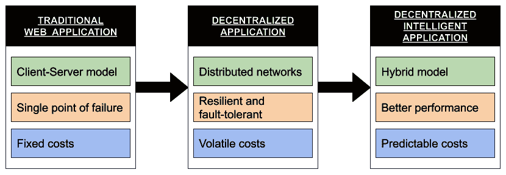

图 8.1:自互联网出现以来应用程序的演变

在这里，我们可以观察到应用程序设计模式中的三个主要转变。我们还可以观察应用程序如何随时间演变的三个主要方面。

我们将在下面的章节中讨论每一个。

## **传统网络应用**

尽管在 20 世纪 70 年代和 80 年代为互联网的建立做了突出的工作，但是万维网在如何在网络中的节点之间容易地共享信息方面实现了重大的飞跃。自 20 世纪 90 年代中期公共互联网出现以来，博客、聊天室和电子商务网站等传统网络应用程序应运而生。大部分互联网流量仍然由这些应用程序驱动，为互联网用户提供信息和服务。

这些应用程序中的大多数都是从后端的一个简单的 web 服务器开始的。服务器被托管以接受全世界有限的客户端连接，但是在达到期望的阈值后很容易崩溃。现在，这些应用程序中的大多数已经转向 n 层架构。

目前使用的 **n 层架构**，也称为**多层架构**或**多层架构**，用于管理大型 web 应用，如电子商务网站、社交媒体网站、聊天室、博客平台等。专门的基础设施在云上进行管理，以便公司方便用户进行交易。与客户机-服务器模型的原始版本相比，n 层模型将功能分成许多层(因此得名)。这也意味着，就处理故障和管理传统 web 应用程序的活性而言，n 层模型是客户机-服务器模型的更好版本。公司管理自己的基础设施，如服务器，为用户提供服务。公司使用的大多数基础设施可以从云提供商那里购买或短期租赁。这意味着运行传统 web 应用程序的成本几乎是固定的。

现在，让我们试着去理解去中心化的应用程序在过去的 10 年里是如何在互联网上发展的。

## **分散应用**

分散式应用程序最重要的特征是它不是由单一实体控制的。另一个重要的特点是，它为使用应用程序提供了一个通用的入口。根据教科书的定义，Napster 和 BitTorrent 是最早的分散式应用程序，可以用来以对等格式托管和共享各种文件。

你们中的一些人可能想知道区块链是否被用来构建这些应用程序。部分事实是，这些点对点文件共享协议使用了我们今天在区块链使用的基本加密和网络技术。

在撰写本文时，2020 年，我们大多将去中心化应用与运行在区块链上的业务逻辑联系在一起，如比特币和以太坊。我们必须明白，去中心化应用也是一种早在比特币发明之前就存在的设计模式。

将分散式应用程序与传统的 web 应用程序进行比较，我们可以看到分散式应用程序运行在不止一台服务器或计算机上。此外，这种计算机不一定由单个实体或个人拥有和操作。他们通常由愿意为了利益或激励而运行软件的相关方组成。因此，可以有把握地得出结论，大多数分散式应用程序运行在对等网络上。与传统的 web 应用程序不同，这些应用程序不会出现单点故障。

这些对等网络由协议定义，并且通常是容错的，以保护用户免受许多攻击媒介。与客户端-服务器模型相比，由于对等网络的分布式拓扑结构，很难破坏对等网络。区块链协议中的激励和惩罚措施使得攻击网络变得更加困难，因为攻击的成本远远高于此类攻击的回报。

尽管分散式应用解决了上述两个问题，但由于令牌价格的波动性，业务和任务关键型应用的运行成本仍具有挑战性。在撰写本文时，人们正在努力减少这种不稳定性，包括代表用户签署交易或提前向用户支付交易费用。

到目前为止，我们已经了解到，传统的 web 应用程序和集中式服务以固定的成本提供可预测的性能，而分散式应用程序提供独立的服务，不会给网络、供应商或用户带来风险。然而，我们也了解到，在使用分散式应用程序实现独立性的过程中，我们会在费用方面带来一定程度的不确定性。最后，我们还观察到，用户选择集中式模型来实现内部环境中的性能和安全性。

现在，让我们试着理解去中心化的智能应用是如何在互联网上发展的。

## **分散智能应用**

既然业务模型倾向于透明和高效，那么就需要一种新的设计模式来支持可追溯性、分散性和可预测性的结合。分散的智能应用程序可以在对等网络中使用可靠的基础设施。该网络由多个实体运营的节点组成，这些实体在服务用户和发展其业务方面具有既得利益。此外，这种网络上的交易通常在很短的时间内确认，费用也低得多。与大型公共网络类似，由于攻击的收益与实施攻击的成本之间的差距，试图危害网络的成本将会很高。

这种模式与其他模式之间的一个关键区别在于，在分散数据库的帮助下，人工智能模型的集成更加紧密。这使得构建任务关键型和以业务为中心的应用程序成为可能，并将可追溯性和洞察力作为一流的特性。

现在，让我们总结一下我们对这三个模型的分析。

## **对比分析**

我们可以总结我们的学习，并通过权衡每种模式的利弊来决定正确的设计模式。

在传统 web 应用程序的情况下，当使用集中式专用基础设施时，我们可能会观察到更好的性能。对于开发该应用的公司来说，这些交易将以合理的固定成本近乎即时地完成。然而，这种设计模式可能缺少其他设计模式提供的一些安全性和可追溯性特性。

在分散应用程序的情况下，我们可以观察到合理的性能和可追溯性，代价是可变的交易成本。与传统的 web 应用程序相比，交易速度可能会受到影响。

在分散式智能应用程序的情况下，我们可以观察到大多数事务的可预测成本和近乎即时的终结性。除了更好的成本、速度、安全性和性能之外，该模式还为构建隐私保护应用程序提供了分散存储，这些应用程序可用于通过对用户数据的人工智能模型的道德使用来获得可操作的见解。

现在我们已经分析了三种主要模式，让我们用一个总结它们的区别的表格来结束这一部分:

|  | **传统网络应用(App)** | **分散应用(DApp、dApp 或 Dapp)** | **分散智能应用(DIApp)** |
| **网络** | 客户机-服务器模型用于 n 层体系结构。 | 分布式网络拓扑用于允许任何人加入网络。 | 分布式网络拓扑用于允许任何人加入网络。 |
| **安全** | 很有可能出现单点故障。由于薄弱的加密或对数据的集中控制，数据可能被黑客攻击或泄露。 | 用户是数据的所有者。所有数据和操作都由唯一的密钥对保护。可以存储有限的数据。 | 用户可以使用相同的密钥对安全性来存储和操作更大规模的数据，以便拥有自己的数据。 |
| **成本** | 全年管理专用基础架构的固定成本。 | 交易成本是不稳定的，因为交易成本取决于区块链本地代币的价格。 | 在较小但分散的节点群中，价格相对稳定。 |
| **透明度** | 应用程序和数据操作对用户或其他利益相关者来说是不透明的。 | app 的逻辑和大部分操作都是透明的。可选地允许私人交易。 | 逻辑和操作是透明的，可以选择使用隐私而不损害安全性。 |
| **性能** | 大量的交易可以立即完成 | 由于节点分布较大，吞吐量较低。终结比较慢。 | 交易吞吐量更高。终结也很快实现。 |
| **隐私** | 公司很少在利用洞察力时实现用户数据的完全隐私和匿名，因为数据托管在由组织控制的集中式或分布式数据库中。 | 匿名通过钱包实现，但是区块链网络上的数据管理是一件昂贵的事情。用户的隐私取决于应用程序的策略。AI 模型不经常使用。 | DIApps 旨在为用户提供完整的隐私和匿名，同时以公平的方式使用人工智能提供有意义和可操作的见解，而不妨碍用户的匿名性。 |

上表显示了不同应用程序模式的优点和缺点。

现在，我们已经快速回顾了应用程序的发展，让我们构建一个解决现实世界挑战的示例 DIApp。

# **构建样本 DIApp**

在这一部分中，我们将讨论问题陈述，找到所陈述问题的解决方案，根据 DIApp 设计模式提出技术架构，并观察如何开发启动 DIApp 所需的所有可交付成果。

让我们从理解下一节中的问题陈述开始。

## **问题陈述**

一种名叫**严重急性呼吸综合征冠状病毒 2** ( **新型冠状病毒**)的新型冠状病毒引发了一场新的疫情疫情，称为**冠状病毒疾病 2019** ( **新冠肺炎**)。在撰写这一章的时候，该病毒已经通过各种传播方式感染了全球 1100 多万人，悲惨地夺走了 50 多万人的生命:这是人类历史上令人悲伤的一页。尽管当地政府已经努力减少这些感染，但一些病毒携带者似乎没有症状。这意味着一个人可能携带病毒而不自知。有时，规定的检查也可能在病毒在患者体内潜伏的早期阶段未能识别病毒。

### **当前挑战**

这种病毒给人类带来了新的挑战。让我们来看看在撰写本文时面临的两大挑战。

*   **检测无症状患者体内的病毒**:如前所述，新型冠状病毒病毒对医疗专业人员提出了新的挑战，即识别未表现出任何症状的人体内的感染。这些人可能会被允许继续他们的日常生活，从而危及他们所属的整个社区的健康。这在安全检查中留下了一个巨大的漏洞，可能允许无症状的人获得公共服务或与可能从患者那里感染病毒的人进行互动。
*   **追踪病毒的传播**:虽然对于一些没有症状的人来说，很难在早期发现病毒，但随着时间的推移，症状确实会出现。一旦他们这样做了，并且这个人检测呈阳性，追溯被诊断的病人的所有行为以控制感染是很重要的。如果没有患者在过去几周的准确活动史，这是很难实现的。任何记下它的努力都需要时间，并且由于人为的错误会保持不准确。

为了控制这种感染，医疗专业人员求助于接触者追踪。我们将在下一节了解更多关于联系人追踪的信息。

### **联系追踪**

接触者追踪是一个过程，用于识别自感染诊断以来的过去几天或几周内参与患者活动的所有人员。这是卫生部官员与执法机构协调开展的一个过程。

联系人追踪的一般工作流程如下:

1.  医生诊断该病人新型冠状病毒病毒呈阳性。
2.  将为该案例分配一个联系人跟踪器。
3.  接触示踪剂与患者交互以识别患者的活动。
4.  根据管辖区/国家，接触追踪人员负责收集指定天数或周数内患者行踪的准确信息。例如，在印度检测为阳性的患者可能被要求分享他们在过去 14 天的活动。
5.  基于患者提供的输入，接触跟踪器可以验证一些信息。
6.  如果患者分享的信息有说服力，就雇佣更多的接触者追踪人员来识别患者感染的一级人群。
7.  一旦这种人工搜索结束，就要对接触过的人进行病毒检测。
8.  根据管辖范围，被接触的人可能会被强制隔离长达 14 天，以检查症状是否出现。
9.  被隔离的人定期接受病毒检测。
10.  如果没有病毒的迹象，被怀疑的人就会被释放。然而，如果他们测试呈阳性，同样的过程会重复。

尽管您可能会发现这个过程计划严密且复杂，但这里提到的大多数步骤都是由许多国家手工执行的。尽管一些国家选择在数字技术的帮助下自动追踪接触者，但它们并没有考虑到所有的感染因素。

### **联系追踪的问题**

正如我们之前所讨论的，接触追踪是一个艰巨的过程。尽管一些国家已经成功地实现了这一过程的数字化自动化，但很难追踪非人类来源的感染。

我们往往会忘记，大量的假说声称病毒的起源可以追溯到蝙蝠，这是一种生活在森林、农村和城市地区的动物。许多研究人员还观察到，病毒可以在许多形式的表面上停留几个小时。现代供应链非常先进，货物可以在几个小时内从一个地方转移到另一个地方。不幸的是，供应链的这种速度为货物在空中传播时病毒从一个集装箱传播到另一个集装箱提供了潜在的机会。这种感染不仅会危及正常商品的供应链，还会感染可能使用这些未经有效消毒的产品的广大人群。应考虑在向公众交付商品之前评估感染风险。同样，我们想保护我们的宠物和其他重要的动物物种。

因此，当务之急是考虑监测动物和无生命物体的新型冠状病毒病毒感染。因此，需要一种数字接触追踪算法，能够解决生态系统中这两种病原体之间感染的可能性。

随着对动物和物体的数字接触追踪需求的明确确立，让我们尝试制定一个解决方案。

## **解决方法**

由于我们正在开发一个样本应用程序来跟踪来自动物和非生命物体的潜在感染，我想将这个解决方案命名为**动物和物体的分散智能接触跟踪** ( **口述**)。如前一节所述，需要跟踪动物和物体。为了透明起见，我们必须能够在粒度级别跟踪感染状态。具有分散和开放分类账的公共区块链可以提供此功能。同样，我们必须明白，全球供应链是一个繁忙的世界。手动追踪所有潜在联系人几乎是不可能的。同样，确定动物之间的潜在接触也非常困难。因此，需要一种自动但智能的方法来识别潜在的感染并将它们从噪声中分离出来。这就需要区块链和人工智能来追踪动物和物体。

在接下来的部分中，我们将看到如何构建 DICTAO。

### **选择区块链技术**

如前所述，区块链对于保持动物和物体状态的透明度至关重要。因为这是一个构建示例 DIApp 的教程，所以我将保持上下文非常简单，每个人都可以访问。

以太坊网络有许多测试网，供开发人员在沙箱测试环境中部署和测试他们的应用程序。最著名的测试网络之一叫做 **Kovan** testnet。Kovan 是一个基于以太坊区块链网络的**权威证明** ( **PoA** )。它由以太坊开发者社区维护。Kovan testnet 以其执行速度、可靠性和通过水龙头自由访问测试以太网而闻名。你可以在这里阅读更多关于科万测试网的信息:[https://kovan-testnet.github.io/website/](https://kovan-testnet.github.io/website/)。

水龙头是一个软件，智能合同开发者和用户使用它来免费获取 testnet 令牌，而不需要在他们的本地 PC 上挖掘它们。大多数区块链试验网都有各自的水龙头。

我选择科万只是为了帮助你尽可能容易地理解和相处区块链。Kovan 是一个测试网络，因此它不打算用于任何生产级以太坊应用程序。如果您希望将这个例子部署到一个真实的用例中，我建议您要么使用 Ethereum mainnet，要么使用侧链，比如 Matic。如果您希望现场部署它，您可以在这里了解更多关于 Matic sidechain 的信息: [https://matic.network/](https://matic.network/) 。

### **选择一个分散的数据库**

数字接触追踪通常涉及收集数据。为了实现准确性并提供高质量的预测，可以以更高的频率收集更多的数据。随着时间的推移，数据会变得非常大。此类数据不应直接存储在区块链上，因为这会产生很高的成本。此外，存储大量数据通常会导致瓶颈问题，并可能会影响区块链的性能。因此，需要在分散的数据库中存储动物或物体的活动。

我将使用 MóiBit REST API 作为这个示例 DIApp 的分散数据库。MóiBit 提供了一个开发人员友好的 API 环境，这使它成为一个容易的选择。

由于 MóiBit 是一种基于 IPFS 的分散存储服务，因此对新文件或现有文件的每次更改都会生成一个新散列。类似于区块链，每个新散列代表一次成功的状态改变。然而，与区块链相比，更新 MóiBit 上的数据会更便宜、更快。因为它是由哈希驱动的，所以文件的完整性也是安全的，并且易于验证。

要了解更多关于 MóiBit 的 API，请访问他们在 https://apidocs.moibit.io/的文档。

### **选择人工智能技术**

在一个区域内追踪无数的物体和动物——即使是一个很小的区域——也会产生海量的数据点。在这些数据点上手动执行接触追踪实际上是不可能的。由于一些低质量的数据点，手动接触跟踪器的努力很容易被浪费。随着阳性病例数量的增加，手动接触追踪器关闭一个病例并继续下一个病例的压力越来越大。这也可能导致对感染的不准确识别。

为了减少错误并自动化清理、排序、分组和预测感染的过程，我们可以利用人工智能技术。

如前所述，合同追踪通常涉及分析被感染人/动物/物体的活动的过程。可以有把握地假设，拍摄位置数据以及事件发生时的时间戳将为潜在的接触案例提供足够的洞察力。因此，我们将分析地理位置数据。

我们将使用地理空间分析来识别数据点中的一些异常。具体来说，我们将使用带有噪声的应用程序的**基于密度的空间聚类** ( **数据库扫描**)算法来执行地理空间分析，以识别动物和物体之间的潜在感染。它是一种数据聚类算法，用于有效地将一个范围内的数据点分组到一个聚类下，并丢弃其他数据点无法到达的离群值。

要了解更多关于 DBSCAN 算法的信息，请参考下面的维基百科文章:[https://en.wikipedia.org/wiki/DBSCAN](https://en.wikipedia.org/wiki/DBSCAN)。

既然我们已经决定了在示例 DIApp 中将使用哪些技术和技巧，那么让我们通过借鉴 DIApp 设计模式，尝试以参考技术架构的形式将其形式化。

### **样品 DIApp 的技术架构**

在这一节中，我将提出示例 DIApp 的技术架构。根据前面几节中所做的决定，我将所有解决方案组件编译到一个图表中，如下所示:

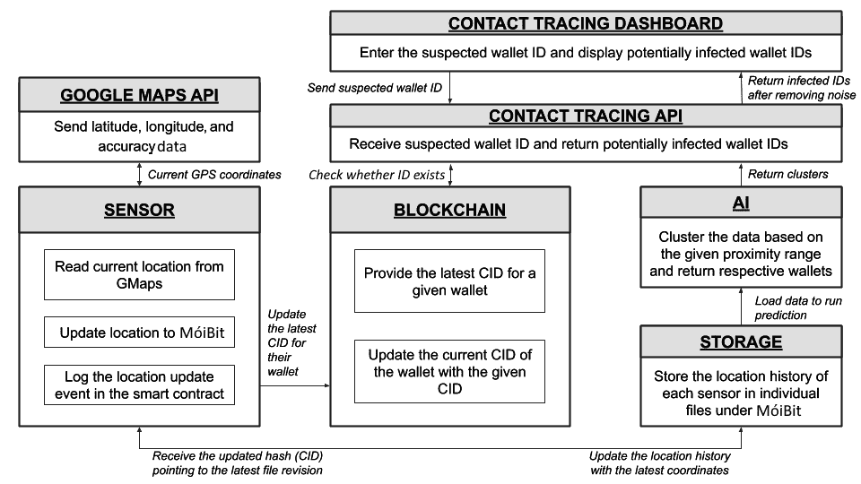

图 8.2:我们的示例应用程序的 DIApp 参考架构

在上图中，我们已经按照 DIApp 设计模式中提出的 DIApp 参考架构描述了所有的解决方案组件。现在，让我们检查每个组件:

**传感器**:传感器是附着在动物或物体上的一种硬件装置，在发生感染时需要对其进行追踪。每个传感器都有一个唯一的钱包地址，可在以太坊区块链上识别。此外，需要注意的是，每个传感器在 MóiBit 上都有一个专用文件，用于存储相应传感器的位置历史记录。

传感器内部将运行一个应用程序。该应用程序将自动读取其位置，并将该位置更新到 MóiBit 上的专用文件中。可以通过调用地理定位 API 来访问传感器的当前位置。在我们的 DIApp 示例中，我们使用 Google Maps API 来检索传感器的当前位置。当被调用时，Google Maps 地理定位 API 将坐标的纬度、经度和精度返回给传感器。

为了简单起见，我们将忽略 Google Maps API 返回的精度值，并将其余数据上传到 MóiBit。由于 DIApp 的例子是试图证明人工智能和区块链技术的融合，优化在本书中没有优先考虑。在预测感染时处理数据的准确性将超出本书的范围。然而，我期待着与你离线解决这个问题。

现在，一旦传感器收到来自 Google Maps 地理定位 API 的响应，数据就会被重新构造并上传到 MóiBit 上的专用位置历史文件中。我们将在*开发传感器客户端代码*部分讨论客户端应用的设计和结构。

**区块链中的智能合约**:在这个 DIApp 示例中，智能合约的意义在于维护每个传感器执行的每个位置更新的证据。每次传感器在 MóiBit 上更新其位置历史时，都会对智能合约进行新的函数调用，以更新为传感器指定的相应钱包的**内容标识符** ( **CID** )值。我们将在后面的章节中讨论智能合约的设计和结构。

**联系跟踪仪表板**:联系跟踪仪表板是一个简单的基于 Express 的 Node.js web 应用程序，它产生一个本地服务器来托管一个 HTML 文件。通过 Node.js 应用程序呈现的仪表板网页，用户可以输入可疑的钱包 ID。web 应用程序执行基本的表单验证，并返回可能被感染的钱包 id 列表(如果有的话)。我们将在后面的章节中讨论联系人跟踪仪表板的设计和结构。

**联系追踪 API** :联系追踪 API 接收到跟踪可疑钱包 ID 的用户输入。这是一个后端 API，它还预测受感染的 id，以便将它们返回到仪表板。我们将在后面的章节中讨论联系跟踪 API 的设计和结构。

## **开发智能合同**

在本节中，我们将讨论智能合约的设计和结构，该合约用于在每次位置历史更新时记录证据。如前所述，我们将使用以太坊区块链，因此我将向您展示如何用 Solidity 语言开发智能合约。

如果你不熟悉 Solidity 编程语言，我建议你看看他们的网站，了解更多的技术细节、诀窍和文档:[https://solidity.readthedocs.io/](https://solidity.readthedocs.io/en/v0.6.11/)。理解 Solidity 编程语言的语义对于理解本节并了解在提议的 DIApp 解决方案中智能契约的好处是很重要的。

让我们从确定演员开始。我们知道该解决方案旨在追踪源于动物和物体的感染。因此，我们知道跟踪装置或传感器是必要的。我们假设每个传感器都可以通过一个唯一的以太坊钱包地址来识别。除了传感器，我们还有医疗专业人员和执法团队等最终用户，他们可能希望从给定的动物或物体中识别潜在的受感染因素:

1.  每次传感器在 MóiBit 上有新的位置需要更新时，它都会进行必要的更新，并从 MóiBit 接收一个散列值。我们使用来自调用传感器的散列和钱包地址来维护智能合同上的映射。每当传感器更新新的位置坐标时，传感器的钱包地址的相应值也需要更新。因此，我们需要定义一个映射来记录对每个传感器的位置历史所做的任何更改。我们可以通过以下映射来实现这一点:

```
mapping(address => string) private deviceIDToLatestCID;
```

从前面的映射中，我们可以看到，该地址充当更新后的字符串值的唯一键，该值基本上是在相应传感器的位置更新时从 MóiBit 接收到的 CID。

2.  除了前面的映射，我们还需要另一个映射来跟踪所有传感器的地址，以确认它们是否曾经更新过它们的位置。我们可以通过将所有钱包地址的列表保存在以下映射中来实现这一点:

```
  mapping(address => uint256) private deviceIDExists;
```

从前面的映射中，我们可以看到，每个更新过历史记录的传感器都将被记录在这个映射中。我们将很快了解这背后的原因。

3.  最后，我们将使用以下钱包地址数组记录每个曾将其历史记录更新到此智能合约的传感器的地址:

```
   address[] private deviceIDs;
```

从前面的数组声明中，指定用户可以访问所有曾经在智能合约中更新过其位置历史的地址列表。不要混淆`deviceIDs`数组和`deviceIDExists`映射。数组用于直接访问每个传感器的钱包地址，而映射用于检查传感器之前是否已经更新了位置历史。

在我们继续这个智能契约的功能方面之前，我们还有两个声明:一个修饰符和一个事件。

4.  修饰符是一个条件指令，在执行一个函数之前必须满足它。如果函数的修饰符的条件不满足，函数调用就不会发生。在我们的例子中，我们使用一个修饰符来控制谁可以更新位置历史映射:`deviceIDToLatestCID`。正如您可能已经观察到的，此映射需要用指向传感器最新位置历史的 CIDs 进行更新。但是我们还需要确保只有传感器可以更新自己的值。不应允许其他传感器、用户或开发者更新未知传感器的位置历史。这一重要的设计决定将防止其他流氓行为者破坏区块链上良好的传感器的声誉。

为此，我们可以使用以下修饰符:

```
   modifier onlyBy(address _account) {
       require(
           *msg*.sender == _account,
           "Sender not authorized to update this mapping!"
       );
       _; // The "_;"! will be replaced by the actual function body when the modifier is used.
   }
```

从前面的修饰符声明中，我们可以观察到，只有当调用者与在区块链中更新位置历史的地址相同时，才会执行带有前面修饰符的函数。当我们理解位置是如何被`setLatestCID`函数更新的时候，我们就会理解这个`onlyBy`映射的含义。但在此之前，让我们快速浏览一下事件的最后一个声明。

5.  当处理复杂的用例时，事件非常有用。作为一个可能在钱包中存放一些乙醚或其他代币的用户，我们等待交易收据作为确认。对于某些逻辑执行的确认，我们不能只等待交易收据。根据逻辑的成功执行，可能还需要触发其他子组件。事件来拯救我们。Solidity 中的事件是一个日志记录特性，帮助非区块链应用程序获取提示点并继续执行。

我们将在智能合约中声明一个事件，如下所示:

```
   event MappingUpdated(address deviceID, string latestCID);
```

从前面的事件声明中，我们可以看到，事件可以用传感器的钱包地址及其最新的 CID 发出。每次使用指向 MóiBit 上传感器最新位置历史记录的新 CID 成功更新映射时，都会触发此事件。

6.  我们将通过查看`setLatestCID`函数体来进一步了解这个`MappingUpdated`事件的应用，如下所示:

```
   function setLatestCID(address deviceID, string memory latestCID)
       public
       onlyBy(deviceID)
   {
       deviceIDToLatestCID[deviceID] = latestCID;
       if (deviceIDExists[deviceID] == 0) {
           deviceIDs.push(deviceID);
           deviceIDExists[deviceID] = 1;
       }
       emit MappingUpdated(deviceID, latestCID);
   }
```

正如您在前面的函数声明中所看到的，`setLatestCID`是一个 setter 函数，它允许每个传感器通过传递其钱包地址以及指向 MóiBit 上最新历史的 CID 来更新其自身的位置历史。`address`和`string`类型用于定义`deviceID`和`latestCID`输入参数。`deviceID`是调用函数的传感器的钱包地址，而`latestCID`是指向 MóiBit 上相应传感器的最新历史的散列。关键字`public`定义了该函数可以被全球任何人调用。此后，我们看到使用了`onlyBy`修饰符来验证函数调用。它采用相同的输入参数`deviceID`，并检查打算更新位置历史的调用者是否是传感器本身。如果修饰符条件被验证为真，则执行剩余的函数体。否则，交易将被恢复。现在我们已经对`setLatestCID`函数的头有了一个相当好的理解，让我们来理解它的体。

在函数体内部，我们可以观察到`latestCID`值被立即赋给了`deviceID`。一旦映射被更新，它检查传感器先前是否更新了它的位置。这可以通过检查`deviceIDExists`映射中相应传感器钱包地址的状态位来实现。如果给定的钱包地址不存在条目，则它被添加到`deviceIDExists`映射中，并且相应的状态位值被设置为 1。同时，我们还可以看到我们将`deviceIDs`数组附加到了新数组上。在这种情况下更新该数组可确保钱包地址不会作为重复地址再次添加到数组中。这意味着`setLatestCID`功能仅在智能合约中加入新的传感器时附加钱包地址。最后，一旦位置映射被更新并且状态位被管理，函数就发出`MappingUpdated`事件。您可以看到括号中提供了输入参数，用于记录相应值的事件。这里总结了`setLatestCID` setter 函数的细节。现在，让我们来看看智能合约中的其他一些`getter`功能。

7.  一旦我们用给定传感器的新 CID 设置了位置历史映射，我们可能必须读取该映射，以防我们需要传感器的细节。

因此，我们将定义一个`getter`函数来从映射中读取传感器的最新 CID，如下所示:

```
   function getLatestCID(*address* deviceID)
       public
       view
       returns (*string* memory latestCID)
   {
       return deviceIDToLatestCID[deviceID];
   }
```

如您所见，`getter`函数`getLatestCID`读取一个输入参数。`deviceID`输入参数代表传感器的钱包地址，实型地址。因为任何人都应该能够读取传感器不时更新其位置的证据，所以我们必须使这个`getter`功能在全球范围内可用。这可以通过使用`public`关键字来实现。此外，由于这是一个仅从区块链中获取数据而不打算进行更改的函数，因此也需要使用`view`关键字。这确保了`getLatestCID`功能具有只读权限。因为我们希望任何人都能调用这个函数，所以我们没有这个函数的修饰符。在函数体中，我们只能看到一行指令，那就是从`deviceIDToLatestCID`映射中返回对应传感器的 CID 值。因为返回值是一个已经在映射中定义的字符串，所以函数的头也定义了相同的内容。这里总结了`getter`的功能，`getLatestCID`。

8.  现在，让我们看看后端脚本所需的外围功能。

我们将继续使用另一个`getter`函数，定义如下:

```
   function getDeviceIDsLength() public view returns (*uint256*) {
       return deviceIDs.length;
   }
```

如您所见，`getDeviceIDsLength`是一个 getter 函数，它不接受任何输入，只是返回`deviceIDs`数组的当前长度。因为我们需要从后端程序调用这个函数，所以我们也将这个函数的可见性设置为`public`。与前面的函数类似，这个函数也是一个只读函数，返回一个无符号整数值。因此，`view`和`uint256`被用在函数的头中。这里总结了`getter`功能，`getDeviceIDsLength`。

9.  现在，让我们看看契约中的最后一个函数:

```
   function getIDByIndex(uint256 index) public view returns (*address*) {
       return deviceIDs[index];
   }
```

如您所见，`getIDByIndex`是一个`getter`函数，它根据来自`deviceIDs`数组的索引值返回钱包地址。因为在 Solidity 中直接返回复合值很复杂，所以我只能一个一个地读取它们。如果你是一个老练的 Solidity 开发者，你可以去掉这个函数，直接在客户端读取整个数组，而不用花太多的钱。

完整的 Solidity 智能合约代码可从以下 GitHub 链接获得:[https://GitHub . com/packt publishing/Hands-On-Artificial-Intelligence-for-block chain/tree/master/chapter 08](https://github.com/PacktPublishing/Hands-On-Artificial-Intelligence-for-Blockchain/tree/master/Chapter08)。

现在我们有了管理位置更新证据的方法，让我们继续开发传感器的客户端代码，它可以在 MóiBit 上进行位置历史更新，并调用此契约。

## **开发传感器的客户端代码**

在本节中，我们将讨论传感器应用的设计和结构。该应用程序用于定期获取传感器的当前位置，并将位置历史记录更新到 MóiBit。成功更新位置历史记录后，MóiBit 收到的新 CID 或哈希将通过定期更新传感器的位置来证明传感器状态良好。应用程序现在将调用适当的区块链函数来维护其信誉。

我选择用 Python 语言来实现这个应用程序，因为它是一种众所周知的语言，可用于在 **AI** 、**物联网** ( **IoT** )和区块链等领域进行参考实现。为了理解这一部分，理解 Python 是很重要的。我建议你参加一个 Packt 微型课程来了解 Python 语言的基本概念:[https://subscription . packtpub . com/interactive-courses/data/introduction-to-Python](https://subscription.packtpub.com/interactive-courses/data/introduction-to-python)。

我的实现是一个单独的 Python 脚本。首先，在 Python 脚本中进行必要的调用需要以下`import`语句:

1.  请确保使用`pip install`命令安装`import`语句中提到的第三方库:

```
import requests
import os
import datetime
import calendar
import time
import json
from web3 import Web3
import http.client
```

2.  我将在整个脚本中使用一些重要的变量。它们如下:

```
url = 'https://www.googleapis.com/geolocation/v1/geolocate'
myobj = {'key': os.environ['GMAPS_API_KEY']}
```

从前面的代码块中，您可以观察到`url`是一个字符串变量，带有 Google Maps 地理定位 API 的 URL。`myobj`是一个请求对象，我将在请求期间将它传递给地理位置 API。由于地理定位 API 受到用户注册的 API 密钥的保护，所以我需要将它与我向 Google Maps 的地理定位 API 发出的每个请求一起传递。在`myobj`变量内部，你可以看到`key`被映射到`API KEY`，它被设置在外壳内部，可以通过`os.environ[‘GMAPS_API_KEY’]`访问。基本上，它获取`GMAPS_API_KEY`环境变量的值，并将其用作`key`的对应值。我们将在后面的章节中观察如何设置`GMAPS_API_KEY`的值。

3.  现在，让我们了解一下我在 MóiBit 操作中使用的一些常见变量:

```
conn = http.client.HTTPSConnection("kfs2.moibit.io")
moibit_url = 'https://kfs2.moibit.io/moibit/v0/'
moibit_header_obj = {
   'api_key': os.environ['MOIBIT_API_KEY'],
   'api_secret': os.environ['MOIBIT_API_SECRET'],
   'content-type': "application/json"
}
```

如您所见，`conn`是一个变量，表示在作为客户端的传感器和作为服务器的 MóiBit 之间建立的 HTTPS 连接。`moibit_url`是一个字符串变量，指向 MóiBit API 的基本 URL。此外，`moibit_header_obj`是一个 JSON 对象，我需要将它作为请求头的一部分传递。因为 MóiBit API 也受 API 密钥和 API 秘密的保护，所以我需要传递这两个值，以便向 MóiBit 网络验证我的请求。这些分别由`api_key`和`api_secret`字段表示。这两个字段再次分别映射到`MOIBIT_API_KEY`和`MOIBIT_API_SECRET`环境变量。`os.environ`从 shell 中获取相应环境变量的值。

最后，`content-type`字段表示请求报头的元数据。既然是 JSON 对象，我们就用`"application/json"`作为对应的值。

4.  现在，让我们看看脚本中与区块链互动相关的变量:

```
blockchain_url = 'https://kovan.infura.io/v3/' + \
   os.environ['WEB3_INFURA_PROJECT_ID']
```

从前面的代码块中，我们可以观察到,`blockchain_url`字符串变量指向以太坊 Kovan testnet 的 URL，该 URL 可以通过服务提供商 Infura 访问。由于 Infura 的 API 也受到保护，我们需要传递一个在 Infura 用户帐户下创建的项目 ID。当我们将使用`os.environ`从 shell 中读取的`WEB3_INFURA_PROJECT_ID`环境变量的值添加到字符串中时，可以观察到这一点。

5.  由于我们与区块链上的智能合约交互，我们还必须在脚本中定义其对应的**合约应用程序二进制接口** ( **ABI** )，如下所示:

```
abi = """[{"anonymous": false,"inputs": [{"indexed": false,"internalType": "address","name": "deviceID","type": "address"},{"indexed": false,"internalType": "string","name": "latestCID","type": "string"}],"name": "MappingUpdated","type": "event"},{"inputs": [{"internalType": "address","name": "deviceID","type": "address"},{"internalType": "string","name": "latestCID","type": "string"}],"name": "setLatestCID","outputs": [],"stateMutability": "nonpayable","type": "function"},{"inputs": [],"name": "getDeviceIDsLength","outputs": [{"internalType": "uint256","name": "","type": "uint256"}],"stateMutability": "view","type": "function"},{"inputs": [{"internalType": "uint256","name": "index","type": "uint256"}],"name": "getIDByIndex","outputs": [{"internalType": "address","name": "","type": "address"}],"stateMutability": "view","type": "function"},{"inputs": [{"internalType": "address","name": "deviceID","type": "address"}],"name": "getLatestCID","outputs": [{"internalType": "string","name": "latestCID","type": "string"}],"stateMutability": "view","type": "function"}]"""
```

如果你不明白这一点，不要惊慌。这基本上是契约的变量、函数以及输入和输出规范的序列化 JSON 表示。

如果你不是 Solidity smart 合同开发人员，我建议你去[https://solidity.readthedocs.io/en/v0.5.3/abi-spec.html](https://solidity.readthedocs.io/en/v0.5.3/abi-spec.html)了解 ABI。

6.  现在我们已经定义了对脚本功能重要的每个变量，让我们继续理解下面脚本的功能。

像往常一样，Python 脚本的入口点从`main()`函数开始，如下面的代码摘录中所定义的:

```
if __name__ == "__main__":
   main()

def main():
   # Fetching the Tracking ID locally, or generating a new one
   Tracking_ID = os.environ['WALLET_ADDRESS']
   print("# Setting tracking ID: ", os.environ['WALLET_ADDRESS'])

   # Getting the current geo-coordinates of the device
   print("# Getting the current geo-coordinates of the device from GMaps API")
   (latitude, longitude) = getGeoCordinates()

   # Reading the current UTC based Unix timestamp of the device
   print("# Reading the current UTC based Unix timestamp of the device")
   timestamp = getCurrentTime()

   # Generate the JSON structure
   jsonData = Marshal(Tracking_ID, latitude, longitude, timestamp)

   # Updating the location history to IPFS-based MoiBit network
   print("# Updating the location history to IPFS-based MoiBit network")
   latest_cid = updateLocationHistory(Tracking_ID, jsonData)

   # Publishing the proof to Ethereum
   print("# Publishing the proof to Ethereum")
   txnHash = CommitTxn(Tracking_ID, latest_cid)
   print("https://kovan.etherscan.io/tx/"+txnHash)
```

从前面的代码块中，我们可以了解到，当调用`main`函数时，它从`WALLET_ADDRESS`环境变量中读取传感器的钱包地址作为`Tracking_ID`。一旦它识别出自己的钱包地址，就会调用`getGeoCordinates`函数来获取当前的纬度和经度。现在我们有了当前的纬度和经度，立即调用`getCurrentTime`函数来获取当时的 UNIX 时间戳。现在，所有四个变量——`Tracking_ID`、`latitude`、`longitude`和`timestamp`——都应该形成一个 JSON 对象。因此，调用`Marshal`函数将四个值分别编组到`id`、`latitude`、`longitude`和`timestamp`字段下的一个 JSON 对象中。生成的变量`jsonData`现在可以在 MóiBit 上专用于该传感器的相应位置历史文件中进行更新。现在，通过传递钱包地址变量`Tracking_ID`和`jsonData`来调用`updateLocationHistory`函数。一旦在 MóiBit 中更新了最新的位置数据，该函数就将最新的 CID 返回给主函数`latest_cid`。这现在用于通过智能合同在区块链上签署新的交易。一旦交易被签名并放入以太坊区块链，交易散列作为`txnHash`返回。出于预览的目的，相同的散列被附加到 URL 的后缀。产生的 URL 可用于检查交易的状态。这就概括了`main`的功能。

7.  由于`main`首先需要地理坐标，它调用`getGeoCordinates`函数，定义如下:

```
def getGeoCordinates():
   res = requests.post(url, data=myobj)
   geoCordinates = res.json()['location']
   lat = *float*("{:.7f}".format(geoCordinates['lat']))
   long = *float*("{:.7f}".format(geoCordinates['lng']))  return (lat, long) # Accuracy is not considered in the POC because optimizations are out of scope
```

从前面的代码块中，我们可以看到,`getGeoCordinates`函数正在对 Google Maps 地理位置 API 进行 POST API 调用，同时调用凭证。API 响应`res`被解析以提取纬度和经度。您可以观察到，我们将两个值的小数位数四舍五入到七位。您还可以观察到我们忽略了`accuracy`字段，因为优化这个解决方案已经超出了本书的范围。

8.  一旦`main`函数接收到`lat`和`long`值，它现在通过调用`getCurrentTime`函数立即捕获时间戳，该函数定义如下:

```
def getCurrentTime():
   dt = datetime.datetime.utcnow()
   timestamp = time.mktime(dt.timetuple())
   timestamp = *int*(timestamp)
   return timestamp
```

正如您可以从前面的代码块中观察到的，`getCurrentTime`函数只是根据传感器的本地时间捕获 UNIX 时间戳并返回它。

9.  现在我们有了所有必要的数据，`main`函数需要以一种可呈现的格式提供给 MóiBit。因此，它调用`Marshal`函数，定义如下:

```
def Marshal(Tracking_ID, lat, long, timestamp):
   data = {"id": Tracking_ID,
           "latitude": lat,
           "longitude": long,
           "timestamp": timestamp
           }   return data
```

如您所见，`Marshal`函数只接受四个值，并以 JSON 格式返回数据的编组版本。

10.  随着传感器的新位置数据准备好被更新，调用`updateLocationHistory`函数，该函数在此链接[https://github . com/packt publishing/Hands-On-Artificial-Intelligence-for-block chain/blob/master/chapter 08/IOT-client-code/python/main . py](https://github.com/PacktPublishing/Hands-On-Artificial-Intelligence-for-Blockchain/blob/master/Chapter08/iot-client-code/python/main.py)中定义:

如您所见，`updateLocationHistory`函数通过调用`checkIfFileExists`函数来检查 MóiBit 上是否已经存在传感器的专用文件。根据`checkIfFileExists`函数返回的状态值，如果在 MóiBit 上不存在传感器的专用文件，则会创建一个新文件。创建之后，JSON 编组的数据被上传到新创建的文件中，文件的 CID 作为`latest_cid`返回给主函数。但是，如果 MóiBit 上已经存在传感器的专用文件，则会首先下载传感器的当前位置历史记录，然后将新整理的位置数据附加到该文件中。一旦附加，更新的位置历史现在被上传到 MóiBit。作为对文件的新更新，具有新位置数据的文件的 CID 散列作为`latest_cid`被返回给`main`。

如果出现任何错误，将打印适当的响应错误代码，以及来自响应正文和标题的数据。

11.  `checkIfFileExists`功能定义如下:

```
def checkIfFileExists(*walletAddress*):
   print("checkIfFileExists(): Checking if /dictao/" +
         walletAddress+".json exists.")
   pre_payload = {"path": "/dictao/"}
   payload = json.dumps(pre_payload)
  conn.request("POST", moibit_url+"listfiles", payload, moibit_header_obj)
   res = conn.getresponse()
   responseObject = json.loads(res.read())
   if res.status == 200:
       if responseObject['data']['Entries'] == None:
           print("checkIfFileExists(): /dictao/" +
                 walletAddress+".json does not exist!")
           return False, ""
       else:
           for fileObject in responseObject['data']['Entries']:
               if walletAddress+".json" == fileObject['Name']:
                   print("checkIfFileExists(): Found /dictao/"+walletAddress +
                         ".json "+"with the hash "+fileObject['Hash'])
                   return True, fileObject['Hash']
   print("checkIfFileExists(): /dictao/" +
         walletAddress+".json does not exist!")
   return False, ""
```

如您所见，`checkIfFileExists`函数扫描整个`dictao`文件夹，检查是否有传感器的专用文件。由于文件名与 wallet 地址相同，因此只需传递传感器的 wallet 地址并检查 MóiBit 上是否存在传感器的专用文件就更容易了。如果呼叫传感器的钱包地址是`0xABC`，那么 MóiBit 上该传感器的专用文件将是`0xABC.json`。如果在您各自的 MóiBit 开发者帐户的根文件夹`dictao`下找到一个文件，它会将布尔值`True`返回给`updateLocationHistory`函数。如果这样的文件不存在，将返回`False`。

12.  最后，一旦`main`函数接收到传感器的位置数据的更新的 CID 散列，它需要在区块链上维护这个位置更新的证据。因此，它调用`CommitTxn`函数，定义如下:

```
def CommitTxn(id, cid):
   print("CommitTxn(): Connecting to the ethereum network")
   w3 = Web3(Web3.HTTPProvider(blockchain_url))
   print("CommitTxn(): Initializing the live contract instance at " +
         os.environ['PROOF_SMART_CONTRACT_ADDRESS'])
   contract = w3.eth.contract(
       os.environ['PROOF_SMART_CONTRACT_ADDRESS'], *abi*=abi)

   print("CommitTxn(): Creating a raw transaction to call smart contract function setLatestCID()")
   nonce = w3.eth.getTransactionCount(os.environ['WALLET_ADDRESS'])
   setLatestCID_txn = contract.functions.setLatestCID(
       os.environ['WALLET_ADDRESS'],
       cid,
   ).buildTransaction({
       'chainId': 42,
       'gas': 3000000,
       'gasPrice': w3.toWei('1', 'gwei'),
       'nonce': nonce,
   })
   print("CommitTxn(): Signing the raw transaction with private key")
   signed_txn = w3.eth.account.sign_transaction(
       setLatestCID_txn, *private_key*=os.environ['WALLET_PRIVATE_KEY'])
   w3.eth.sendRawTransaction(signed_txn.rawTransaction)

   tx_hash = w3.toHex(w3.keccak(signed_txn.rawTransaction))
   tx_receipt = w3.eth.waitForTransactionReceipt(tx_hash)
   print("CommitTxn(): Sucessfully updated the CID in the blockchain. Transaction receipt:\n", tx_receipt)
   print("CommitTxn(): Checking the new/latest hash for the wallet from blockchain: " +
         contract.functions.getLatestCID(os.environ['WALLET_ADDRESS']).call())
   return tx_hash
```

从前面的代码块中，您可以看到`CommitTxn`函数分别使用`id`和`CID`获取钱包地址和最新的 cid。该函数现在创建一个新的`web3`对象，连接到由 Infura 运行的以太坊节点之一。一旦连接到以太坊科万区块链网络，它就通过传递合同地址连接到部署在区块链上的智能合同。合同地址也被作为`PROOF_SMART_CONTRACT_ADDRESS`馈入 shell，可以通过`os.environ`读取。使用这个地址，契约变量被初始化并指向区块链上的智能契约实例。现在，使用输入数据创建一个新的事务；也就是`id`和`CID`。事务是使用 Python `web3`库提供的`buildTransaction`调用创建的。`chainId`字段代表以太坊科万区块链的网络 ID。

要了解传递给这个函数的每个参数的更多信息，我建议您在这里浏览一下如何使用`web3.py`发送原始交易的文档:[https://web 3py . readthe docs . io/en/stable/web 3 . eth . account . html # sign-a-contract-transaction](https://web3py.readthedocs.io/en/stable/web3.eth.account.html#sign-a-contract-transaction)。

一旦网络建立、发送和验证了交易，就获得收据作为`tx_receipt`。我们等待这个收据，然后将交易散列作为`tx_hash`发送回`main`函数，以供参考。这里总结了`CommitTxn`的功能。

现在，位置历史数据已经更新，并且证明在区块链上可用，让我们学习如何应用人工智能技术来预测潜在的感染。

## **训练模型**

在这一节中，我将带你经历利用人工智能技术构建联系追踪算法所需的所有步骤。我们将通过训练一个人工智能模型来预测结果或价值的一般步骤。在我们的示例 DIApp 的帮助下，我们将理解在训练 AI 模型时采取的 10 个常见步骤，并将它们重新应用到我们的用例中。我们将使用 Jupyter 笔记本来解释所涉及的每个步骤。

构建基于人工智能的接触追踪算法的步骤如下:

1.  **准备训练数据集**:如前一节所述，每个传感器的位置历史都存储在 MóiBit 下的单独文件中。每个文件都是主数据帧的子集，将用于识别潜在的感染。单个传感器的数据帧如下所示:

**T2】**

图 8.3:使用熊猫数据帧视图在 Jupyter 笔记本中捕获的单个传感器的位置历史

为了检测潜在的感染并以智能的方式对感染进行聚类，我们将使用 DBSCAN 算法。

**DBSCAN** is a data clustering algorithm that separates high-density data points from low-density points. The algorithm was proposed by Martin Ester, Hans-Peter Kriegel, Jörg Sander, and Xiaowei Xu in 1996\. Basically, the DBSCAN algorithm clusters a group of data points that are close to each other in a certain space and ignores the outliers as noise.

为了理解位置历史及其在 DBSCAN 中的适用性，我们使用预设的随机 id、时间戳和纬度值生成了一个训练数据集。我们自己分配随机值既不容易也不安全。因此，我们使用了 **JSON 生成器**工具。JSON Generator 允许用户以可定制的方式生成带有随机值的 JSON 文档。这可以通过对 JSON 生成器进行编程来为给定的字段使用特定的值来实现。

我们使用以下语法生成 100 个 JSON 对象，这些对象的 ID、时间戳、纬度和经度都是随机值:

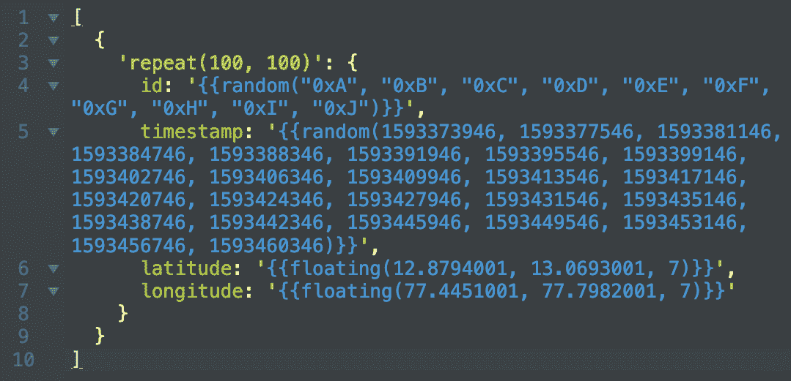

图 8.4:在 JSON 生成器上生成训练数据集所需的模式

如前面的屏幕截图所示，该模式指定了数据集中所需的所有四个属性。因为这是一个数据集，`id`属性有一组虚拟钱包地址。`timestamp`属性也有一组介于 24 小时之间的 UNIX 时间戳，每个时间戳之间至少有 1 小时的间隔。最后，`latitude`和`longitude`属性也被指定为取指定最小值和最大值之间的任意值，精确到小数点后七位。

根据前面的模式，我们可以精确地生成 100 个随机的 JSON 对象。然而，这可能还不够。因此，我重新生成了一些更随机的 JSON 对象，以形成由 1，000 个 JSON 对象组成的训练数据集。我将前面模式生成的 100 个 JSON 对象重复连接了 10 次。得到的数据集是由 1，000 个随机 JSON 对象组成的数组。

通过执行`pandas`库的`head()`函数，可以在 Jupyter 笔记本上查看生成的数据集，如下所示:

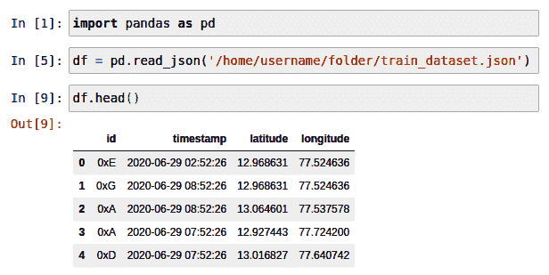

图 8.5**:**Jupyter 笔记本上 df.head()函数调用的输出

从前面的截图中，我们可以看到已经创建了一个训练数据集，并在 Jupyter Notebook 上进行读取。

2.  **分析训练数据集**:现在我们已经用随机值创建了一个训练数据集，并将其加载到 Jupyter Notebook 中，我们将进一步分析它以了解数据集。这个过程称为分析训练数据集。这一步有助于我们更多地了解数据点的性质以及它们是如何分布的。

首先，我们从描述如何获取数据集的顶层信息开始分析。我们通过调用`info`函数来实现这一点:

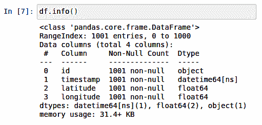

图 8.6**:**Jupyter 笔记本上 df.info()函数调用的输出

从前面的截图中，我们可以看到数据集中有 1，001 个条目。`info`函数调用的输出还列出了数据帧中的所有列，包括它们的类型。它还检查是否有空值。因为我们的 JSON 生成器模式非常具体，所以我们在数据帧的任何行中都没有任何空值。

接下来，我们需要通过让 pandas 使用`describe()`函数描述数据集来理解数据点的分布:

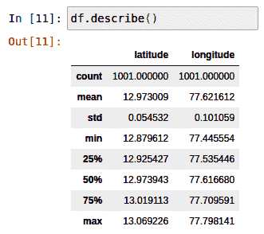

图 8.7:Jupyter 笔记本上 df.describe()函数调用的输出

从前面的屏幕截图中，我们可以观察到同一个数据帧的统计摘要。我们可以看到，`count`表示训练数据帧中非空行的总数，`df. mean`表示纬度和经度列的平均值，分别约为 12.973009 和 77.621612。`min`代表数据帧中记录的最小纬度和经度值，分别为 12.879612 和 77.445554。`max`代表数据帧中记录的最大纬度和经度值，分别为 13.069226 和 77.798141。虽然`count`、`mean`、`min`、`max`突出了边界，但并没有解释数据点的分布。然而，数据点的分布可以通过`std`、`25%`、`50%`和`75%`参数来理解。让我们来理解他们的意思。

`std`用数字表示经纬度值离平均经纬度值有多远。在这种情况下，值分别为 0.054532 和 0.101059。由于我们在 JSON 生成器模式中输入了最小值和最大值范围，所以`std`值在我们的训练数据集中非常低。虽然看起来数据帧中的所有行都足够近，但是由于一个十进制度的变化或移位，它们中的每一行都彼此相距数千米。

如果要对`df`数据帧进行排序，数据帧的前 250 列将具有范围从 12.879612 到 12.925427 的纬度值。类似地，经度值的范围从 77.445554 到 77.535446。这由结果参数`25%`表示。通过在分析时层叠 250 行，同样可以解释剩余的参数—`50%`、`75%`和`max`。

还需要注意的是，总结有助于理解数据点是否分布足够。

3.  **特征工程**:特征工程通常包括识别关键数据点，转换数据点，并整理它们以进行更好的分析。由于我们的数据集中没有缺失值或 NaN 值，因此我们不会对数据集执行任何特征工程。
4.  **探索性数据分析**:接下来，我们将尝试可视化分析我们的数据集。由于我们处理的是地理数据，因此最好通过在真实地图上绘制数据点来理解这些数据点。我们将使用 Plotly 库在真实地图上绘制经度坐标。通过这样做，我们将获得以下可视化效果:

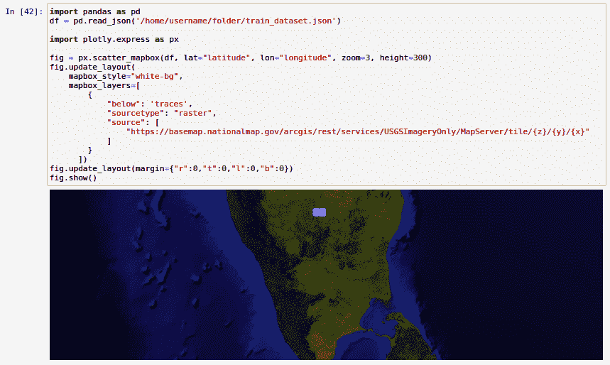

图 8.8 **:** 使用 Plotly 在 Jupyter 笔记本上图形输出数据点

从前面的截图中，我们可以看到所有的数据点都被绘制在 Bengaluru 市的许多区域中。这是因为我们在训练数据集中设置了限制。如您所见，我们已经在 JSON 生成器模式中手动设置了纬度和经度的限制。因此，我们看不到班加卢鲁市区以外的任何其他数据点。在试用本教程时，您可能希望根据自己的需求对其进行更改，并提及特定于城市的纬度-经度范围，或者在您的 JSON 生成器模式中保持非常开放的范围。

除了在地图上绘制经度数据，我们还可以使用散点图来分析数据点。在散点图中，我们在二维图上绘制纬度-经度值，其中 *x* 轴代表纬度， *y* 轴代表经度。

现在，让我们来看看训练数据集中散点图的一个简单版本:

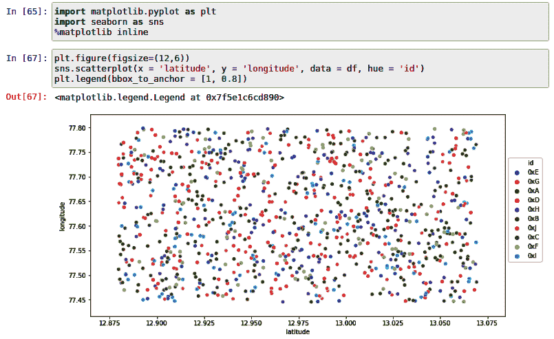

图 8.9:使用 Seaborn 的 Jupyter 笔记本上数据点的散点图输出

从前面的截图中，我们可以观察到随机分布在地理空间中的所有 10 个 id 的位置历史。每种颜色代表一个 ID，而图上所有的彩色点代表其对应的位置历史。您可以通过应用更多参数过滤器以及使用其他图表(包括但不限于箱线图、联合图、热图等)执行分析来获得更多创意。

要了解有关可视化训练数据集的更多信息，我建议您使用 Seaborn 和 Plotly。要了解更多关于 Seaborn 的信息，请访问 https://seaborn.pydata.org/。要了解更多关于 Plotly 的信息，请访问 https://plotly.com/。

5.  **分割训练数据集**:大多数时候，我们把训练数据集分割成两部分。一部分用于训练模型，另一部分用于预测值，并将预测值与训练数据集中的实际值进行比较。由于我们是对数据进行聚类，而不是使用基于回归的模型来实际预测值，因此没有必要拆分我们的训练数据集。
6.  **选择模型**:当对动物和物体进行数字接触追踪时，一种方法是使用聚类算法，该算法可以根据新发现的医学数据和方法提供定制。虽然有许多聚类方法，如 K-means、层次聚类和基于密度的聚类，但我们在这个示例应用程序中选择了基于密度的聚类，因为它易于理解，并且还提供了一些可应用于实际用例的定制。

K-means 聚类也很容易理解，但在分析地理坐标和空间数据时，它通常没有很好的声誉。虽然层次聚类可以帮助我们分析空间数据，但它不像 DBSCAN 那样提供一个简单的学习曲线。

我们将为此使用 DBSCAN 算法，该算法可在 scikit-learn 机器学习库下获得。

有关可用功能的更多信息，请访问以下链接:[https://sci kit-learn . org/stable/modules/generated/sk learn . cluster . DBS can . html](https://scikit-learn.org/stable/modules/generated/sklearn.cluster.DBSCAN.html)。

7.  **训练和拟合**:现在我们已经创建了训练数据集，对其进行了分析和可视化，我们需要使用训练数据集来训练我们的模型，使用 DBSCAN 算法来聚类数据点并清楚地识别它们。

根据全球许多从业者接受的医学规范，一个流行的观点是，如果人们没有保持至少 6 英尺的最小安全距离，我们就可能感染冠状病毒。因此，我们假设相同的物理距离度量标准，并创建我们的模型，以便它对距离小于或等于 6 英尺的相互连接的数据点进行聚类。

基于我们到目前为止讨论的标准，我们将使用 Jupyter Notebook 定义模型如下:

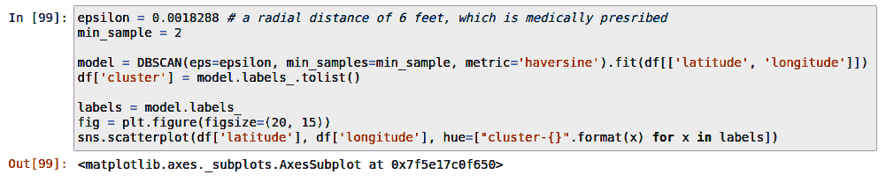

图 8.10:使用训练数据集启动 DBSCAN 模型

从前面的屏幕截图中，我们可以看到基于 DBSCAN 算法已经启动了一个`model`。给 DBSCAN 算法的输入是训练数据集`df`本身。与 df 一起，`epsilon`变量也被发送。`Epsilon`是任意两个给定数据点之间的最大距离。我们选择 0.0018288 作为`epsilon`变量的值，因为它相当于 6 英尺的千米值。在设置基于 DBSCAN 的模型时，这是一个至关重要的参数。与`epsilon`一起，`min_sample`变量也被发送到 DBSCAN 算法以初始化模型。`min_sample`定义在`epsilon`半径范围内形成一个聚类所需的最小数据点数量。我们选择 2 作为`min_sample`变量的值，因为传播感染最少需要两个因素。

最后，我们需要选择度量函数，根据它来计算数据点之间的距离。因为我们正在处理地理坐标，所以我们选择`haversine`作为度量函数来计算数据点之间的距离以形成聚类。

要了解更多关于哈弗森地理距离公式的信息，请访问下面的维基百科文章:[https://en.wikipedia.org/wiki/Haversine_formula](https://en.wikipedia.org/wiki/Haversine_formula)。

一旦模型被初始化，通过向训练数据集中添加名为`cluster`的新列，聚类被形成并被分配给相应的数据点。现在，您可以看到，同一个数据帧被更新为多了一个列簇，如下面的屏幕截图所示:

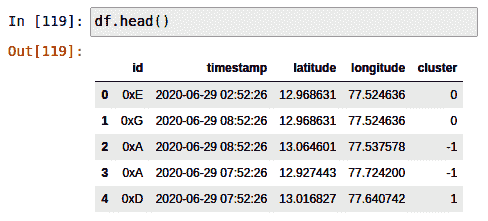

图 8.11 **:** 使用 Jupyter Notebook 上的 df.head()函数调用读取带有新列簇的数据帧的更新内容

当在图上用代表纬度的 *x* 轴和代表经度的 *y* 轴绘制聚类时，结果如下:

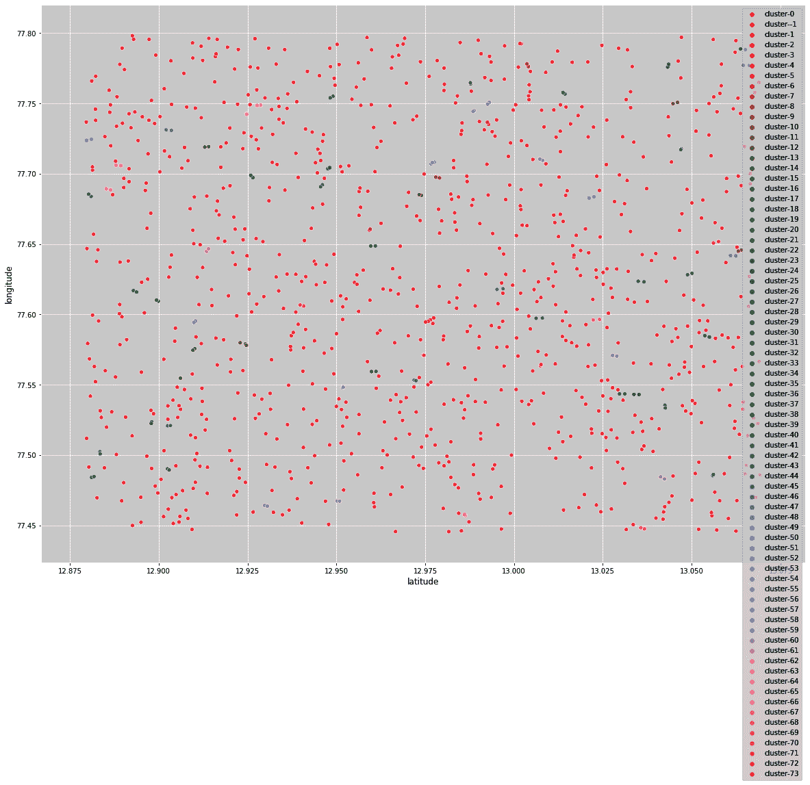

图 8.12:包括噪声在内的所有集群的散点图

从前面绘制的图表中，我们可以观察到从 **cluster-0** 到 **cluster-73** 共有 74 个正常的集群。还需要注意的是，还有一个名为 **cluster - 1** 的聚类，它表示不属于任何聚类的所有数据点。这样的数据点被认为是**噪声**，因此它们与我们进一步追踪接触者的努力无关。如果传感器附着在可能被隔离的动物或物体上，并且没有与佩戴传感器的另一个动物或物体相互作用，则出现噪声数据点。

分析数据很困难，因为前面的图中有太多的噪声，所以让我们继续并删除数据帧中所有被认为是噪声的数据点。

我们可以去除噪声并重新绘制图表，如下所示:

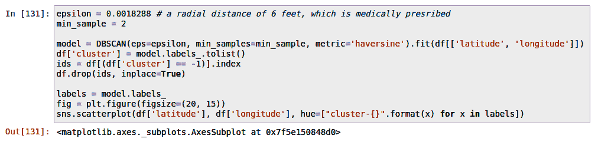

图 8.13 **:** 再次标绘前去除噪声群

从前面的截图中，我们可以看到我们已经删除了属于 **cluster -1** 的所有行。

生成的图形更清晰，可以按如下方式观察:

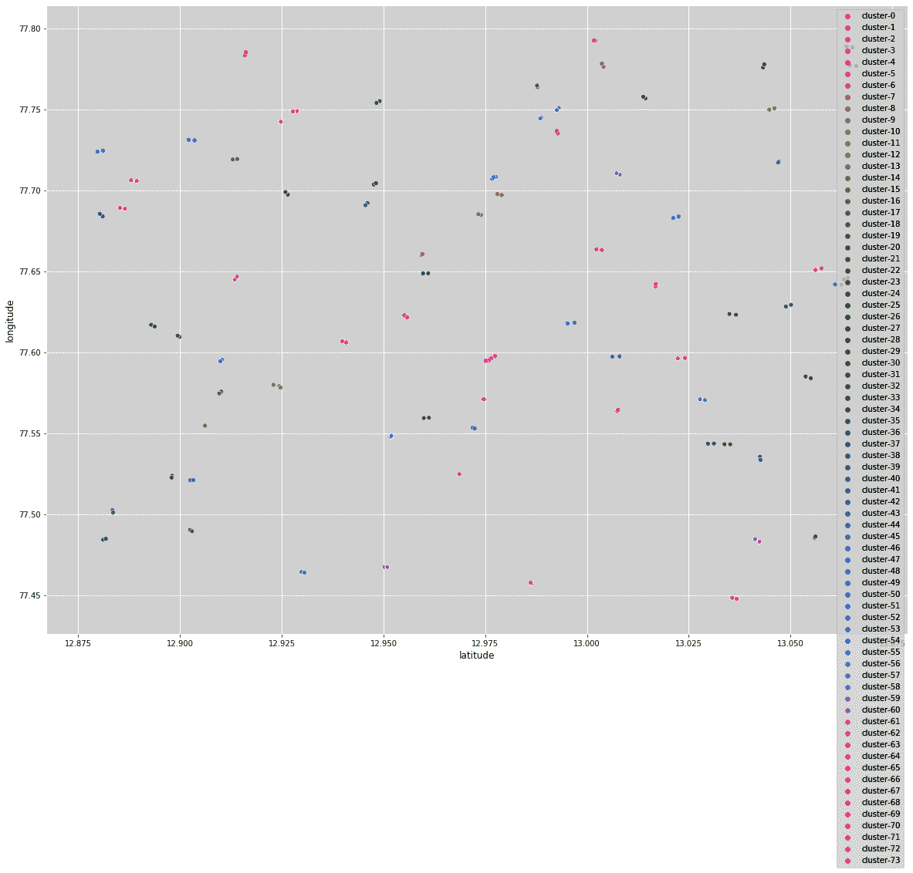

图 8.14:重新绘制没有噪声的聚类图

从前面的屏幕截图中，您可以看到 DBSCAN 模型已经使用配置的参数成功启动。现在，让我们检查模型的准确性。

8.  **评估模型**:通常，预测模型使用逻辑回归或分类器。但是在我们的示例应用程序中，我们没有预测任何新的值；我们只是使用机器学习将数据分割成更小的定制集群。

既然我们已经能够将数据集分成两个或更多数据点的聚类，我们需要检查聚类是否有效。简单来说，我们需要检查模型的基本正确性。在我们的例子中，我们可以通过检查模型是否产生任何误报来执行基本的评估；也就是说，我们需要检查模型是否对两个或更多的数据点进行聚类，这些数据点的哈弗线距离大于指定的距离。如果这样的数据点被分组到一个新的聚类下，我们可以很容易地得出结论，该模型有其假阳性的局限性。同样，我们也需要检查模型是否容易出现假阴性；也就是说，我们需要检查模型是否对两个或更多的数据点进行聚类，这些数据点的哈弗线距离小于指定的有效距离，但模型未能将它们聚类在一起，从而未能将其识别为潜在的感染。由于这本书的范围有限，我们将通过一个观察得出结论，即当前的模型似乎对哈弗森距离中长达 10 米的数据点产生假阳性。就假阴性而言，我们没有观察到这样的异常或局限性。

9.  **调整参数**:DBS can 算法只需要三个主要的输入参数。分别是`epsilon`、`min_sample`，以及哈弗辛度量函数。除了这些参数之外，当您在系统上尝试这个解决方案时，您还可以添加一些参数。

有关其他参数的更多信息，请访问以下链接的文档:[https://sci kit-learn . org/stable/modules/generated/sk learn . cluster . DBS can . html](https://scikit-learn.org/stable/modules/generated/sklearn.cluster.DBSCAN.html)。

由于这本书的范围有限，我不会把重点放在模型的优化上，因为它在集群方面做得很好。

10.  **预测感染** : 该模型现已准备好从 MóiBit 获取实时数据，并通过使用上述参数对数据点进行聚类来预测潜在感染。当然，由于没有完全调整，该模型对于长达 10 米的相邻数据点容易出现一些误报。只关注优化示例解决方案的人工智能组件超出了本书的范围。

本节所有截图均借用了 Madhusudhan Kumble 的 Jupyter 笔记本。笔记本的完整实现在他的 GitHub 上:[https://GitHub . com/madatpython/PRANA/blob/packt/PRANA _ contact _ tracing _ using _ DBS can . ipynb](https://github.com/madatpython/PRANA/blob/packt/prana_contact_tracing_using_DBSCAN.ipynb)。

既然我们已经了解了如何将 DBSCAN 算法应用到我们的用例中，并且我们已经对它的局限性有了相当的了解，那么让我们将这个模型合并到后端 API 中。

## **开发后端**

在本节中，我们将讨论联系人跟踪后端 API 的设计和结构。后端 API 负责通过读取钱包地址并返回任何其他可能被感染的传感器的钱包地址来执行联系跟踪。

与传感器应用程序代码类似，我将使用 Python 语言实现联系人跟踪后端 API，因为它更容易弥合人工智能、物联网和区块链社区之间的语言差距。

像往常一样，我们首先记下继续 API 开发所必需的所有`import`语句:

```
import os
import sys
import flask
from flask import request, jsonify
from web3 import Web3
import web3
import json
import http
from flask_cors import CORS
import datetime as dt
import pandas as pd
from sklearn.cluster import DBSCAN
```

请确保您已经通过`pip install`命令安装了所有的外部软件包。

为了开发联系人跟踪后端 API，我将使用 Flask 框架。你可以在这里阅读更多关于 Flask web 应用框架的内容:[https://flask.palletsprojects.com/en/1.1.x/](https://flask.palletsprojects.com/en/1.1.x/)。

我们通过定义`flask` web 应用程序来启动 API，如下所示:

```
app = flask.Flask(__name__)
CORS(app)
app.config["DEBUG"] = True
```

如您所见，API 允许互联网上的任何来源查询 API。这可以通过使用`CORS(app)`来实现。此外，我已经将应用程序设置为调试模式，以帮助您在遵循这些说明时更多地接触 API。

此 API 脚本的入口点是通过使用脚本中的以下指令创建的:

```
app.run()
```

对于那些不熟悉 Flask 框架的人来说，这相当于`main`函数，我们在查看传感器的物联网客户端代码时讨论过这个函数。

与其他程序类似，这个 API 也体现在一个单文件 Python 脚本中。因此，我们将不得不使用一些变量。

让我们在下面的代码块中看看它们:

```
blockchain_url = 'https://kovan.infura.io/v3/' + \
   os.environ['WEB3_INFURA_PROJECT_ID']

abi = """[{"anonymous": false,"inputs": [{"indexed": false,"internalType": "address","name": "deviceID","type": "address"},{"indexed": false,"internalType": "string","name": "latestCID","type": "string"}],"name": "MappingUpdated","type": "event"},{"inputs": [{"internalType": "address","name": "deviceID","type": "address"},{"internalType": "string","name": "latestCID","type": "string"}],"name": "setLatestCID","outputs": [],"stateMutability": "nonpayable","type": "function"},{"inputs": [],"name": "getDeviceIDsLength","outputs": [{"internalType": "uint256","name": "","type": "uint256"}],"stateMutability": "view","type": "function"},{"inputs": [{"internalType": "uint256","name": "index","type": "uint256"}],"name": "getIDByIndex","outputs": [{"internalType": "address","name": "","type": "address"}],"stateMutability": "view","type": "function"},{"inputs": [{"internalType": "address","name": "deviceID","type": "address"}],"name": "getLatestCID","outputs": [{"internalType": "string","name": "latestCID","type": "string"}],"stateMutability": "view","type": "function"}]"""
```

正如您在前面的代码块中看到的，我们使用了与传感器应用程序相同的技术来访问区块链网络，并通过 ABI 访问智能合约。

同样，我们还重用了与 MóiBit 交互所需的变量:

```
conn = http.client.HTTPSConnection("kfs2.moibit.io")
moibit_url = 'https://kfs2.moibit.io/moibit/v0/'
moibit_header_obj = {
   'api_key': os.environ['MOIBIT_API_KEY'],
   'api_secret': os.environ['MOIBIT_API_SECRET'],
   'content-type': "application/json"
}
```

正如您从前面的代码块中可以观察到的，相同的变量用于从 MóiBit 访问资源。与传感器应用程序不同，该脚本将使用变量来读取每个传感器的位置历史，并为进一步分析构建数据集。总而言之，所有这些变量都是只读的。

当脚本运行时，它在程序上退回到定义的 home 函数，如下所示:

```
@app.route('/', *methods*=['GET'])
def home():
   return "<h1>DICTAO - Decentralized Intelligent Contact Tracing of Animals and Objects</h1><p>This is a simple demonstration of applying blockchain, decentralized storage and AI to solve the COVID-19 crisis.</p>"
```

顾名思义，`home`函数是一个处理函数，用于响应对 API 根发出的基于`GET`的 API 请求。在这种情况下，我返回简单的 HTML 内容。

为了确保我们对任何非法请求或无效请求发送正确的响应，我们定义了`page_not_found`处理函数，如下所示:

```
@app.errorhandler(404)
def page_not_found(*e*):
   return "The given ID could not be found", 404
```

如前面的代码块所示，这个函数将一个字符串响应和一个 HTTP 响应代码 404 一起返回给客户端，这意味着没有找到**文件/资源**。

除了非法或无效的客户端请求，我们还需要处理一些可能发生的内部错误。这可以通过定义`internal_server_error`函数来实现，如下所示:

```
@app.errorhandler(500)
def internal_server_error(*e*):
   return e, 500
```

如前面的代码块所示，当 API 程序调用一个`internal_server_error`函数时，伴随着一个错误或异常，同样的错误或异常将连同 HTTP 响应代码 500 一起返回给客户端，这意味着服务器上发生了一个内部错误。

既然我们已经通过设计应急通信介绍了 API，那么让我们关注 API 程序的主要逻辑。我们的 API 将响应 web 客户端在`/api/v0/get_infections`端点发出的请求。例如，如果 API 托管在`example.com`，那么 API 调用必须发送到以下 URL:【https://example.com/api/v0/get_infections】的。

现在，让我们继续讨论支持这种 API 调用的逻辑。下面是代码链接[https://github . com/packt publishing/Hands-On-Artificial-Intelligence-for-block chain/blob/master/chapter 08/back end-contact-tracing/server . py](https://github.com/PacktPublishing/Hands-On-Artificial-Intelligence-for-Blockchain/blob/master/Chapter08/backend-contact-tracing/server.py):

现在为`/api/v0/get_infections`端点设置了一个新的应用路由器。该路由器接受的 API 调用类型已被设置为`GET`。这意味着 web 客户端正在等待来自服务器的响应。`get_infections`是负责处理到达所述端点的 API 调用的处理函数。正如您可以从代码中预测的那样，`get_infections`正在向 web 客户端返回一个可能被感染的钱包地址列表。

在本节中，钱包地址被称为`ID`，因为它与后端和数据集的设计一致。

当 API 从 web 客户端收到钱包地址时，它会检查是否有任何可能的数据损坏或丢失。如果接收到的 ID 不是空字符串，那么 API 通过检索智能合约上注册的所有钱包地址来进行下一步操作。对于在智能合约中注册的每个钱包地址，从区块链中检索每个钱包的最新位置历史 CID。此外，每个 CID 用于从 MóiBit 检索每个注册传感器的位置历史数据。

相应的代码可以在下面的代码块中看到:

```
def getLatestCID(*id*):
   w3 = Web3(Web3.HTTPProvider(blockchain_url))
   contract = w3.eth.contract(
       os.environ['PROOF_SMART_CONTRACT_ADDRESS'], *abi*=abi)
   cid = ""
   try:
       cid = contract.functions.getLatestCID(id).call()
   except web3.exceptions.ValidationError:
       print("ID does not exist!")

       return ""
   except:
       print("Some other error occured!")
       return ""
   else:
       print(cid)
       return cid
```

从前面的代码块中，您可以看到一旦`get_infections`函数检索到每个钱包地址，就使用`getLatestCID`函数来获取传感器各自钱包地址的最新 cid。从智能合约中的映射读取的 CID 值被返回给调用方函数`get_infections`。

由于`get_infections`句柄函数包含每个已注册传感器的相应钱包地址的 CID 散列，因此它用于从 MóiBit 检索位置历史数据，如下所示:

```
def getJsonDataFromMoiBit(*cid*):
   pre_payload = {"hash": cid}
   payload = json.dumps(pre_payload)
   conn.request("POST", moibit_url+"readfilebyhash",
                payload, moibit_header_obj)
   res = conn.getresponse()
   if res.status == 200:
       responseObject = json.loads(res.read())
       print(
           "updateLocationHistory(): Appending the captured data to historic data.")
       return responseObject
```

从前面的代码块中，您可以看到从`getLatestCID`函数中检索到的`cid`被传递给了`getJsonDataFromMoiBit`函数。该 CID 用于检索相应传感器的最新位置历史数据。

既然数据可供分析，我们在上一节中设计的基于人工智能的接触跟踪算法就开始发挥作用了。

人工智能模型包含在以下功能中:

```
def get_infected_ids(*input_id*):
   basePath = os.path.dirname(os.path.abspath('live_dataset.json'))
   dflive = pd.read_json(basePath + '/' + 'live_dataset.json')

   epsilon = 0.0018288 # a radial distance of 6 feet, which is medically presribed
   min_sample = 2
 model = DBSCAN(*eps*=epsilon, *min_samples*=2, *metric*='haversine').fit(dflive[['latitude', 'longitude']])
   dflive['cluster'] = model.labels_.tolist()

   input_id_clusters = []
   for i in range(len(dflive)):
       if dflive['id'][i] == input_id:
           if dflive['cluster'][i] in input_id_clusters:
               pass
           else:
               input_id_clusters.append(dflive['cluster'][i])

   infected_ids = []
   for cluster in input_id_clusters:
       if cluster != -1:
           ids_in_cluster = dflive.loc[dflive['cluster'] == cluster, 'id']
           for i in range(len(ids_in_cluster)):
               member_id = ids_in_cluster.iloc[i]
               if (member_id not in infected_ids) and (member_id != input_id):
                   infected_ids.append(member_id)
               else:
                   pass
   return infected_ids
```

如您所见，可以调用`get_infected_ids`函数来获取所有可能被感染的 id。当被调用时，这个函数主要对运行时生成的实时数据集进行聚类，并检查给定的 ID 是否存在于任何聚类中。如果集群中存在 id，则所有相邻 id 都被认为受到冠状病毒感染的影响。同一个群集中的每个相邻 ID 被附加到一个数组中，并继续搜索可能被感染的 ID，直到函数到达最后一个群。一旦潜在感染的 id 被识别出来，它们就被返回给调用者函数`get_infections`。

## **开发前端**

在本节中，我们将讨论联系人跟踪仪表板 web 应用程序的设计和结构。简而言之，我们称之为仪表板。仪表板的目的是通过输入可能附着在动物或物体上的可疑传感器的 ID 或钱包地址，帮助我们识别所有可能被感染的 ID。

仪表板应用程序由两个组件组成:一个托管静态文件的 Express 服务器和一个读取用户输入、调用联系人跟踪 API 并打印后端 API 返回的所有 id 的`index.html` HTML 文件。

仪表板 web 服务器代码如下:

```
const express = require('express')
const app = express()
const port = 3000
app.use(express.static('public'));
app.get('/', (*req*, *res*) => res.send('Welcome to DICTAO: Contact tracing web app!'))
app.listen(port, () => *console*.log(`DICTAO: Contact tracing web app listening at http://localhost:${port}`))
```

正如您在前面的代码块中看到的，这是一个简单的基于 Express 的 Node.js 应用程序，它在端口 3000 本地启动一个 web 服务器，并开始为访问服务器根目录的用户托管`index.html`文件。web 服务器还记录客户端发出的所有请求。

你可以在[https://github . com/packt publishing/Hands-On-Artificial-Intelligence-for-block chain/blob/master/chapter 08/frontend-tracking-dashboard/public/index . html](https://github.com/PacktPublishing/Hands-On-Artificial-Intelligence-for-Blockchain/blob/master/Chapter08/frontend-tracking-dashboard/public/index.html)访问仪表盘的标记代码:

从前面的代码块中，我们可以看到标记代码`index.html`承载一个简单的表单，将可疑传感器的钱包地址作为用户的输入。当用户单击提交按钮时，输入被确认。单击 submit 按钮，JavaScript 函数`getInfectedIDs`被调用。现在，`getInfectedIDs`函数负责执行基本的表单验证，并在输入错误时提醒用户。如果没有，该函数负责调用联系跟踪后端 API 来检索可能被感染的传感器的列表。如果它从 API 接收到一个非空响应，它将在一个表中填充接收到的 id 或钱包地址。

现在，让我们来看看一些可用于测试我们的示例 DIApp 的测试工具。

# **测试样品 DIApp**

不幸的是，由于这本书的范围有限，我们不能涵盖太多关于测试的内容，所以我将在这一节向您介绍一些相关的资源。

*   测试智能合同 : Truffle 是 Solidity 智能合同开发最著名的工具链之一。你可以遵循他们的文档中提到的测试说明，这些文档可以从以下链接获得:[https://www . truffle suite . com/docs/truffle/testing/testing-your-contracts](https://www.trufflesuite.com/docs/truffle/testing/testing-your-contracts)。
*   **测试传感器实现**:使用基本的 Python 编程技巧实现传感器应用程序。您可能已经观察到该脚本与 Google Maps 地理定位 API、以太坊和 MóiBit 交互。因此，我建议您大量测试 HTTP 客户端代码。我强烈建议你用尽可能多的测试用例来执行单元测试。您可以通过查看以下链接中的 Python 文档来了解关于测试基本 Python 代码的所有内容:【https://docs.python-guide.org/writing/tests/。
*   **测试人工智能模型的准确性**:用**平均绝对误差** ( **平均绝对误差**)测试人工智能模型非常简单明了。然而，在我们的样本 DIApp 中，我们没有使用回归或分类器。因此，我强烈建议您通过添加新的数据点来处理数据集，以便您可以手动验证结果。在这种边缘情况下，您可以检查模型的响应是假阳性还是假阴性。这是您熟练掌握地理空间分析的机会！根据我的经验，找到用于计算无监督聚类算法的准确性的内容是非常罕见的。

然而，有一些资源是隐藏的宝石。我推荐你阅读[https://www.cs.kent.edu/~jin/DM08/ClusterValidation.pdf](https://www.cs.kent.edu/~jin/DM08/ClusterValidation.pdf)来了解更多关于通过各种方法测量聚类算法的准确性。您还可以访问 scikit-learn 文档，其中重点介绍了集群性能的一些方面:[https://sci kit-learn . org/stable/modules/clustering . html # clustering-performance-evaluation](https://scikit-learn.org/stable/modules/clustering.html#clustering-performance-evaluation)。

*   **测试联系追踪后端 API** :由于我们已经使用 Flask 框架编写了我们的 API，我强烈建议您访问 Flask 的官方测试文档，了解更多关于测试 Flask web 应用程序的信息:【https://flask.palletsprojects.com/en/1.1.x/testing/】T2。我建议您为脚本中定义的每个路由和处理程序函数使用多个测试用例来测试每个路由。
*   **测试 web dashboard 前端应用**:最后，前端 web 应用是一个简单的实现。由于 Node.js 端没有太多需要测试的，我建议您测试一下`index.html`中的内联 JavaScript 函数，以获得更好的表单验证、分页和其他边缘情况，从而在您呈现 UX 时使其更好。

现在，您已经对测试工具和技术有了基本的了解，让我们来部署示例 DIApp 解决方案。

# **部署样品 DIApp**

到目前为止，在这一章中，我们已经能够解释问题陈述，设计解决问题的解决方案，构建解决方案，并提出一些关于测试的建议。如果您自己部署这个应用程序，整个工作将会卓有成效。因此，在下面的小节中，我将建议您注册部署这个示例 DIApp 所需的适当服务。我还将指导您使用运行这些程序所需的另一个重要的特殊配置管理软件来设置您的本地系统。

## **注册谷歌地图 API**

如您所知，我们使用 Google Maps 地理定位 API 来获取传感器的当前经度坐标。因此，请按照以下文档中的说明为自己获取一个 API 密钥:[https://developers . Google . com/maps/premium/API key/geolocation-API key](https://developers.google.com/maps/premium/apikey/geolocation-apikey)。确保不要与任何人共享您的 API 密钥。同样重要的是，不要在开放源代码托管平台上传播 API 密钥。如果您的 API 密匙已经公开并且仍然有效，那么有人可能会利用这个凭证，这将会给您带来一份丰厚的发票。如果您认为您的 API 密钥可能会暴露，您可以删除或禁用它，并为我们的示例 DIApp 重新生成一个新的。

## **注册 MóiBit**

如您所知，我们使用 MóiBit 分散文件存储 API 来存储每个传感器的位置历史数据。因此，您需要注册 MóiBit API。MóiBit 的注册过程非常简单。您可以通过以下链接报名参加 móiBit:[https://account.moibit.io/#/signup](https://account.moibit.io/#/signup)。一旦您验证了您的电子邮件地址和密码，就会为您生成一个新的 API 密钥。

使用这些凭据，您需要在根文件夹下创建一个新文件夹。请在那里创建一个新文件夹，并将其命名为`dictao`，因为它被硬编码到我们当前的实现中。这可以确保所有文件都保存在专用文件夹中。这也有助于您将 MóiBit 用于其他应用程序，不会有任何麻烦或混乱。同样，确保您的 API 密钥对公众不可见或不可访问。

## **报名参加 Infura**

我们使用 Infura 连接到以太坊科万区块链。您需要创建一个新的 Infura 帐户并创建一个新项目。一旦您创建了一个新项目，您将需要复制该项目的凭证，并使用它们通过 Infura 的基础设施获得对区块链的专用访问权限。Infura 的注册过程也非常简单。你可以在这里注册一个 Infura 账户:[https://infura.io/register](https://infura.io/register)。

## **更新本地 just 文件**

正如您可能已经观察到的，我们在示例 DIApp 中使用了很多凭据。为了确保安全地管理这些凭据，我建议您在主机上管理一个隔离文件，该文件可以将这些凭据私下共享给各个进程。为此，我们将使用`just`命令。您可以按照 GitHub 上的说明安装`just`命令:[https://github.com/casey/just#installation](https://github.com/casey/just#installation)。请遵循最适合您系统的安装说明，并确保您创建了一个不受`git`协议跟踪的`justfile`。这可以通过将文件名 justfile 添加到`.gitignore`文件中来实现。

通过将问号替换为您现在已注册的服务的相应凭据，填写必要的字段:

```
export GMAPS_API_KEY := "?"
export MOIBIT_API_KEY := "?"
export MOIBIT_API_SECRET := "?"
export WEB3_INFURA_PROJECT_ID := "?"
export PROOF_SMART_CONTRACT_ADDRESS := "?"
export WALLET_PRIVATE_KEY := "?"
export WALLET_ADDRESS := "?"

run-client:
    python iot-client-code/python/main.py

run-web:
    cd frontend-tracking-dashboard && node index.js

run-server:
    python backend-contact-tracing/server.py

install-dependencies:
    pip install --user -r requirements.txt
    cd frontend-tracking-dashboard && npm install
```

根据编写源代码的位置，您可能还需要更改源代码文件的相对路径。只需确保 justfile 位于管理本章所有源代码的项目文件夹的根目录下。

现在，您的 **justfile** 已经准备好启动必要的应用程序，同时还有您的凭证。

## **部署智能合同**

将最终的智能合同代码粘贴到[https://remix.ethereum.org/](https://remix.ethereum.org/)中，并在区块链以太坊 Kovan testnet 上部署合同。如果你对 Remix IDE 或者智能合约开发不是很熟悉，我建议你按照 Remix 官方文档中提供的说明去做，这里有:[https://Remix-IDE . readthedocs . io/en/latest/create _ deploy . html](https://remix-ide.readthedocs.io/en/latest/create_deploy.html)。

## **将客户端代码部署到传感器中**

在这一节中，我将向您展示如何部署传感器应用程序。您可以通过运行`just`命令部署传感器应用程序，如下所示:

```
just run-client
```

如果您输入的凭据有效并且低于服务配额，您的客户端应用程序将会运行。另外，确保 Python 脚本的相对路径在 **justfile** 中得到更新。

## **部署后端 API**

在这一节中，我将帮助您启动联系人跟踪后端 API。您可以通过运行`just`命令来部署联系人跟踪后端 API，如下所示:

```
just run-server
```

如果您输入的凭据有效并且低于服务配额，您的后端 API 将会运行。另外，确保 Python 脚本的相对路径在 **justfile** 中得到更新。

## **部署网络仪表板**

在这一节中，我将帮助您启动前端 web dashboard，它可用于查询后端的任何潜在感染。您可以通过运行`just`命令部署 web dashboard 应用程序，如下所示:

```
just run-web
```

如果您输入的凭据有效且低于服务配额，您的仪表板应用程序将会运行。另外，确保 Node.js 脚本的相对路径在 **justfile** 中得到更新。

如果您对设置过程或代码感到困惑，可以在以下 GitHub 链接中找到完整的实现，包括 justfile 模板:[https://GitHub . com/packt publishing/Hands-On-Artificial-Intelligence-for-block chain/tree/master/chapter 08](https://github.com/PacktPublishing/Hands-On-Artificial-Intelligence-for-Blockchain/tree/master/Chapter08)。将您的凭证添加到 justfile 的适当字段中，您应该能够轻松地进行部署。如果您在理解或运行代码时遇到困难，请随时提出问题。您还可以通过派生回购并创建一个包含您建议的更改的拉请求，来对分支机构提出改进建议。

# **回顾样品显示**

在这一节中，我们将尝试分析提议的示例 DIApp 的利与弊。

## **样品 DIApp 的优点**

以下是我们提出的示例 DIApp 解决方案的一些优点:

*   除了人类之外，它还包括其他感染源。
*   它有助于恢复全球经济和常态。
*   它允许保险公司和组织评估供应链风险。

然而，我们必须承认和理解样本 DIApp 的一些局限性。

## **样本显示的限制**

以下是我们提出的示例 DIApp 解决方案的一些局限性:

*   人工智能算法可能容易出现一些假阳性。将需要优化。
*   由于缺乏硬件精度、软件精度和计算复杂性的更好方法，DIApp 的当前实现不能用于生产。
*   DIApp 无法追踪室内感染，因为 GPS 无法识别传感器当前所处的楼层。可以考虑其他替代方法，如 Wi-Fi、蓝牙、手动登记和闭路电视图像分析，以提高模型的准确性。

现在，让我们看看一些未来的增强功能。

## **未来的增强功能**

我认为提议的 DIApp 样本只是一场新革命的开始。您可以考虑对代码进行以下增强:

*   除 GPS 外，其他输入模式的精度更高
*   通过优化模型来防止假阳性，从而提高准确性
*   更好的数据保留管理，保护隐私
*   安装信标以绘制热图并评估风险

您可以随时在 GitHub 上联系我，为每个建议创建新的问题，或者参与现有的问题主题。

# **总结**

人工智能和区块链都是催化创新步伐的主要技术。这两种技术的结合有望重新设计整个工业范式。本章阐述了我们如何使用各种人工智能技术和模型来增强区块链及其分散化应用的能力。我们讨论了应用程序的发展，并对比了不同的类型。我们还解释了由新冠肺炎疫情引起的最新问题，并以接触追踪为例讨论了如何解决这些问题。我们讨论了问题陈述、解决方法和技术架构，以便使用 DIApp 设计模式开发一个示例联系人跟踪应用程序。我们还强调了测试每个解决方案组件并使其更加健壮所需的工具。最后，我们解释了如何注册该解决方案所使用的每个依赖服务。这一章使你能够发展一种思维范式，在这种思维范式中，你将人工智能和区块链技术结合起来，以实现针对下一代互联网的高效和健壮的应用。

如果本章中的 DIApp 教程已经启发了你，我强烈建议你将你所学到的贡献给一个叫做 Tracy 的真实用例。Tracy 是一个保护隐私的移动应用程序套件，为公民、企业和政府机构提供许多功能，以便他们能够处理新冠肺炎疫情和其他问题。要了解更多关于如何为特雷西做贡献的信息，请加入电报社区，[https://telegram.me/ProjectTracy](https://telegram.me/ProjectTracy)。

在下一章中，我们将介绍构建 DIApps 的一些潜在用例，其中区块链、人工智能和分散存储可用于解决挑战性问题。