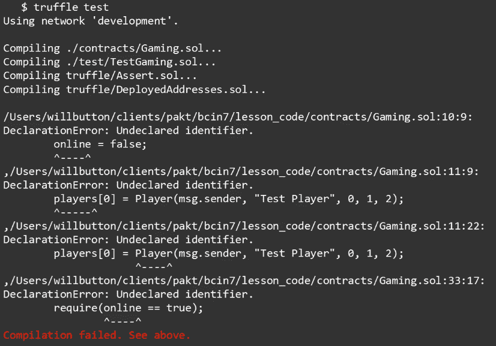
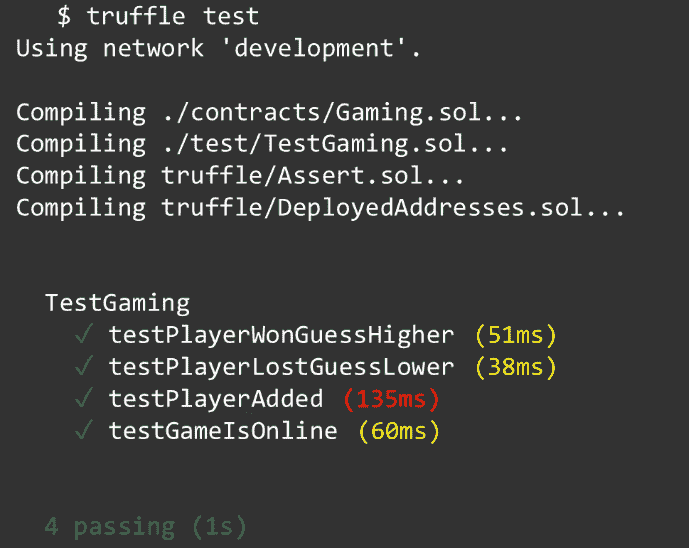

# 第二天——可靠性变量和数据类型

欢迎来到本书的第二天。在上一章中，我们设置了开发环境，并了解了我们将在本课程中使用的工具。在这一章中，我们将学习 Solidity 编程语言中的变量；我们将介绍它们是什么以及如何使用它们。本章包括以下主题:

*   了解坚实度变量
*   Solidity 中的数据类型
*   使用实度变量
*   理解实度运算符
*   使用实度运算符

# 了解坚实度变量

如果你是编程新手，这是一个需要掌握的关键概念。如果你是一个有经验的程序员，这一章仍然有一些有价值的提示，因为我们将涉及到一些具体到 Solidity 变量的细微差别。

Solidity 是一种静态类型的语言；这意味着，在声明变量时，必须声明变量的类型。考虑下面的例子:

```
uint public foo = 4;
```

在前面的例子中，我们将一个无符号整数(`uint`)声明为`foo`，并将它的可见性设置为`public`。我们可以选择给它赋值，然后用分号结束语句。

在 JavaScript 中，你可能会看到用`let`声明的`foo`，或者作为一个常量，如果你正在查看 ECMAScript 2016 之前的旧 JavaScript 代码，你甚至可能会看到它被声明为一个变量。

在下一节中，我们将详细介绍 Solidity 中所有可用的常见类型，但是现在，让我们把重点放在这个可见性标识符的含义上。

# 了解可见性

所有的状态变量和可靠性必须声明它们的可见性，因此，我们有几种类型的可见性:

*   外部
*   公共
*   内部的
*   私人的

当可见性被声明为`external`时，意味着变量或函数成为契约接口的一部分。这将公开函数或变量，以便可以从其他合同和事务中调用它。例如，如果我们的智能合约中有一个函数，它决定我们的游戏玩家是赢了还是输了这一轮，我们需要从 React 应用程序调用它，我们必须将它声明为`external`，因为尽管我们的 React 应用程序驻留在我们的 web 服务器上，但我们的智能合约驻留在以太坊网络上。

类似地，具有`public`可见性的状态变量和函数是契约接口的一部分，可以从其他契约和事务中调用。不使用关键字`this`就不能在内部调用它们，并且为所有公开声明的变量创建一个自动 getter 函数。

语句*没有这个*就不能内部调用是什么意思？让我们用下面的例子:

```
function foo() public returns
(string) {
 return "Hello";
}

function bar() external {
 foo_ = foo(); //Not valid
 foo_ = this.foo(); //Valid
}
```

如果我们的契约中有一个函数`foo()`，它返回字符串`Hello`，那么在同一个契约中直接调用`foo()`函数将会失败。如果要叫的话，需要叫成`this.foo()`。内部声明的变量和函数只能从内部访问，从当前契约和从它派生的契约。

在同一个例子中，如果我们将`foo`函数的可见性改为`internal`，现在可以直接调用该函数而不用`this`关键字。

私有函数与内部函数非常相似，它们在当前契约中可用，但它们的不同之处在于，它们在从该契约派生的契约中不可用。不过，值得注意的是，这并不意味着你在`private`状态变量和函数中的代码是私有的，只是意味着它不能被调用。

区块链以太坊上的一切都是公开可见的。为了说明这一点，通过使用 Etherscan 这样的工具，我可以查看 CryptoKitties 这样的流行的**分散式应用** ( **dApp** )的源代码，并看到所有的源代码，包括私有函数和变量。

声明为`public`的状态变量将自动创建一个`getter`函数。这样做是为了节省时间。毕竟，由于您已经将变量声明为`public`，您可能期望您的客户在某个时候需要访问该变量的值。您不必花费时间和精力自己创建那个函数，因为 Solidity 编译器会为您创建一个。让我们考虑下面的例子:

```
contract A {
    uint public foo = 42;
}

A.foo();
```

如前面的例子所示，我们有一个名为`A`的契约，它声明了一个`public`变量`foo`。这意味着任何交易或合同都可以通过调用`A.foo()`函数来获得`foo`变量的值。您会注意到，您不必为此编写任何代码，因为编译器已经为您完成了。

现在，我们已经知道了 Solidity 是一种静态类型的语言，我们必须在声明变量时声明我们正在使用的变量的类型。记住这一点，让我们跳到下一节，我们将了解 Solidity 中可用的不同数据类型以及它们的作用。

# Solidity 中的数据类型

在 Solidity 中，数据类型分为两个主要类别:

*   值类型
*   参考类型

值类型通过值传递，这意味着每当一个变量引用与另一个相同时，总是复制值。同时，引用类型表示可能不总是适合 256 位的更复杂的类型。由于它们的尺寸较大，复制有时会很昂贵，我们有两个不同的位置可以存储它们:内存或存储。现在让我们来看看值数据类型。

# 值类型

我们要讨论的第一个值类型是布尔型。它可以有两个值之一，或者是`true`或者是`false`。在 Solidity 中，所有东西在创建时都用默认值 0 初始化。

对于布尔值，0 转换为默认值`false`。可用于布尔运算的运算符如下:

*   **逻辑否定**:这代表任何给定值的相反值，用`!`符号表示。比如`foo = !false`。
*   **逻辑合取**:表示两个值的逻辑结果，用`&&`号表示。比如`(foo && bar) > 1`。
*   **逻辑析取**:用**或**表示两个值之间的结果，用`||`符号表示。比如`(foo || bar) > 1`。
*   **相等**:用来比较变量和某个固定值，用`==`符号表示。比如`foo_ == true`。
*   **不等式**:用于检查变量值是否不等于规定值，用`!=`符号表示。比如`foo_!= true`。

下一个值类型是**整数**。整数是整数，意味着没有小数点，它们有两种类型:

*   有符号整数(`int`)
*   无符号整数(`uint`)

您可以分步声明整数的确切大小，从 8 到 256。因此，这些值可以被声明为`uint8`、`uint16`，一直到`uint256`。如果不声明大小，只声明`int`或者`uint`，那就是`int256`和`uint256`的别名。此外，重要的是要知道，对于整数，除法总是截断；所以，两个整数相除的结果永远是一个整数。

虽然所有以前的数据类型对于其他编程语言来说都是通用的，但是**地址**数据类型是 Solidity 所独有的。这是一个 20 字节的值，用来表示以太网上的地址。该地址可以是用户的以太坊帐户或部署到网络的合同。

它有一个`.balance()`成员，可以被调用来检查与帐户相关联的余额，还有一个`.transfer()`成员，可以用来将资金转移到该地址。还有一个`.send()`成员，是`.transfer()`成员的低级对应。如果你使用`.send()`，你必须检查操作成功或失败的返回值，但是如果你使用`.transfer()`，传送成员会自动为你处理。

下一个值类型是一个**字符串**。字符串只不过是一个文本块，但从技术上讲，它是一个字节数组。这意味着你可以对字符串做任何你可以对数组做的事情。在声明它们时，你可以使用单引号或双引号，但是正如我们在[第一章](1.html)、*第一天* - *应用程序介绍、安装和设置*中所了解的，最好使用双引号。它们可以隐式地转换成字节。此外，字符串值支持转义字符，如换行符(`\n`)和制表符(`\t`)。

我们现在完成了值类型。让我们来看看 Solidity 必须提供的引用类型。

# 参考类型

第一个是一个**数组**。数组是数据元素的集合，可以通过它们的索引号来识别。它们的大小可以是固定的，也可以是动态的。若要声明数组，请指定数组将包含的数据类型，后跟变量名，然后是方括号，如下例所示:

```
uint foo[]
```

如果数组被声明为`public`，你将得到一个自动的 getter 函数。它不同于我们在前一节看到的例子，因为 getter 函数需要知道返回数组的哪个元素，它不会返回整个数组。因此，元素或索引号是该函数的必需参数。

它有一个返回数组长度的`.length()`成员和一个用于向数组末尾添加新项的`.push()`成员。

下一个数据类型是一个**结构**。结构提供了定义新数据类型的方法，但结构不能包含自己的数据类型。你不能定义由你所定义的事物组成的事物。考虑下面的例子:

```
struct Player {
    address player;
    string playerName;
    uint playerBalance;
    uint wins;
    uint losses;
}

Player jim =
Player(msg.sender, "Jim", 0, 0, 0);
```

前面的例子展示了如何创建一个数据类型来保存游戏中每个玩家的信息。我们首先将数据类型定义为`struct`，命名为`Player`，并打开我们的花括号。在里面，我们定义了我们存储在玩家身上的所有属性(比如玩家的以太坊地址，玩家的名字，他们当前的余额，他们赢了多少次，输了多少次)，然后关闭我们的花括号。然后，为了给我们的游戏创建一个新的玩家，我们定义了一个类型为`Player`的新变量，并用代表新玩家的值初始化`Player`结构。

下一个是一个**映射**键类型。如果您使用过其他编程语言，您可能会认为映射类似于哈希表。这种数据类型是键类型到值类型的映射，当它被创建时，它被虚拟地初始化，使得每个可能的键都存在，并且它被映射到一个字节表示全为零的值。如果它的可见性被设置为 public，Solidity 将创建一个自动的 getter。因此，基于我们先前的玩家结构示例，我们可以创建所有玩家的映射，如下所示:

```
mapping (uint => Player) players;
```

这里，我们将使用一个无符号整数作为球员数据类型映射的键，这个对象将被称为`players`。然后，我们可以通过指定映射的第一个元素并将一个新玩家分配给它，将我们的第一个玩家添加到映射中。

现在我们已经了解了 Solidity 中可用的基本数据类型，让我们学习如何在 Solidity 契约中实际使用它们。

# 使用实度变量

现在我们已经知道了什么是可靠性变量，让我们在合同中实际运用它们。让我们来看看游戏中的合约:

```
pragma solidity 0.5.0;

contract Gaming {
    /*Our Online Gaming Contract*/
    address owner;
    bool online;
}
```

在契约声明之后，有两个变量被声明。第一个是一个`owner`，它是一个`address`数据类型，这代表了将这个契约部署到以太网的人的以太网地址。然后我们有一个叫做`online`的`bool`数据类型，我们会用这个来确定你的游戏是在线还是离线；它允许我们在需要的时候离线游戏。

嗯，以太坊契约中有一个特殊的函数叫做`constructor`，当契约被部署时，这个函数只执行一次。在其中，我们将做两件事:我们将把我们在契约开始时声明的`owner`变量设置为将该契约部署到网络的以太坊地址:

```
    constructor() public payable {
        owner = msg.sender;
        online = true;    
    }
```

这意味着如果我部署了合同，我就拥有了游戏，如果你部署了合同，你就拥有了游戏。这是你写合同并交付给客户的一种方式，当他们部署合同时，他们拥有合同积累的所有资产和货币。我们还将把我们的`online`变量设置为等于`true;`,如果需要的话，我们稍后将使用它来有效地使我们的游戏离线。

我们还有一个名为`winOrLose()`的函数，我们将从 React 应用程序中调用它，并提供所需的参数来确定我们的玩家这一轮是赢还是输。还有另一个名为`isWinner()`的函数，如果玩家赢了，返回值为真，如果输了，返回值为假。因此，让我们使用下面的代码片段来研究它是如何工作的:

```
function winOrLose(uint display, bool guess, uint wager)
external payable returns (bool) {
    if (isWinner == true ) {
        /*Player won*/
        msg.sender.transfer(wager*2);
        return true;
    } else if (isWinner == false) {
        /*Player lost*/
        return false;
    }
}
```

这里，我们有一个`if`语句，我们正在评估的条件包含在其中。接下来，我们有包含要执行的代码的开始和结束括号，如果这个语句评估为`true`。在括号内，我们有我们的`isWinner()`变量，它是一个布尔数据类型，我们使用`==`符号来评估这个变量是否评估为布尔`true`。如果是，它将执行包含在块中的代码。

这段代码使用了一个特殊的消息`sender`变量，它包含了调用该函数的帐户的地址。在这种情况下，这是我们的球员。玩家赢了，所以我们将使用`.transfer()`会员将双倍下注金额转给玩家；我们双倍下注的原因是，玩家必须在这笔交易中包括他们想要下注的金额，所以我们需要将该金额返还给他们，加上他们从那次下注中赢得的金额。

如果该语句的计算结果不是`true`，那么该代码块就永远不会执行，所以代码会继续执行到`else if`块。其操作方式与`if`模块相同。它将评估括号内的语句，如果`isWinner()`为 false，那么这个块将向我们的 React 客户端返回 false。

在我们的 React 代码中，我们将检查这个值，并相应地更新 UI，让玩家知道他们输了这一轮。

# 乙醚单位

当我们谈论变量的时候，让我们看看一些可以应用于变量的特殊单位。我们将从**乙醚**单位开始。它们用于指定货币，可以应用于任何文字数字。它们也可以在乙醚的不同分支之间转换。

乙醚的亚名称如下:

*   魏:这是以太中最小的货币单位
*   萨伯:又名微醚，等于 1 的 10 的 12 次方<sup xmlns:epub="http://www.idpf.org/2007/ops">维</sup>
*   芬尼:又称毫醚，这等于 1 的 10 的 15 次方<sup xmlns:epub="http://www.idpf.org/2007/ops">维</sup>
*   **乙醚**:这是 1 乘 10 的 18 次方<sup xmlns:epub="http://www.idpf.org/2007/ops">卫</sup>

要使用这些单位，您只需在任何文字数字的末尾指定单位，编译器就知道如何在不同的名称之间进行转换。

# 其他特殊单位

我们还有**时间单位**可用，它们可以用来指定时间单位。它们就像货币一样被声明:任何文字数字都可以附加所需的单位。这里可以使用的不同时间单位有:

*   秒
*   分钟
*   小时
*   天
*   周末

不过有一点要小心，就是用这个来计算日历。由于**闰秒**，不是每天都有 24 小时。闰秒就像闰年，除了它们是秒。坚固性实际上曾经也有一年的时间单位，但是因为闰年的问题，它被废弃了。

还有一些独特的变量。第一个是一个**块号** ( `block.number`)。请记住，以太坊矿工总是确认交易，将它们写入块，然后将这些块添加到区块链。这是该操作的当前块号；它用于跟踪当前正在开采的区块。

**数据块时间戳** ( `block.timestamp`)是当前数据块的时间戳，报告为自 1970 年 1 月 1 日以来经过的秒数。还有一个别名叫做`now`，指的是`block.timestamp`。

然而，这两者都不应该被依赖，因为它们可能在一定程度上被恶意挖掘者操纵，如果你依赖这个时间戳，这可能被用来利用你的合同。一般来说，您可以确信当前时间戳大于前一个数据块时间戳，并且将小于下一个数据块时间戳，但仅此而已。

**消息值** ( `msg.value`)是随消息一起发送的货币金额。我们将在构建应用程序时更详细地探讨这一点。我们将用它来收集玩家的赌注。

你已经看到了`msg.sender`并且了解到它是当前呼叫者的以太坊地址。还有一个`tx.origin`或**传输源**，它是交易发送者的以太坊地址。您可能会发现使用这种方法很有诱惑力，但是一般来说，消息发送者可能就是您想要的。`tx.origin`和`mg.sender`可能不是同一个东西，尤其是在契约或功能调用其他契约或功能的场景中。

好吧！所以现在，我们已经看到了 Solidity 数据类型，我们已经了解了它们是如何在代码中使用的；接下来，我们将看看不同的操作符，我们可以用它们在我们的契约中构建复杂的业务规则和逻辑。

# 理解实度运算符

在这一节中，我们将看看 Solidity 中可用的不同操作符。这样做将有助于您更好地理解逻辑操作，您可以将这些逻辑操作写入合同以实现业务逻辑。

我们将介绍的前三个运算符如下:

*   分配
*   平等
*   不平等

刚入门编程后，你可能会觉得这些很混乱；然而，现在花一分钟会让你在以后的道路上少受几个小时的挫折。

**赋值**用于给变量赋值。例如，我们可以给变量`foo`赋值`bar`，如下面的代码片段所示:

```
string foo = "bar";
foo == bar;
foo != bar;
```

下一个操作符是**等式**，我们用它来确定一个变量是否等于另一个变量。在前面的例子中，我们检查变量`foo`的值是否等于字符串`bar`，在我们的例子中，它等于，所以这个表达式的值为 true。

最后，我们有**不平等**，这是平等的完全相反。所以，在前一个例子的第三行中，我们正在检查`foo`是否不等于`bar`，但是它是相等的，所以这个表达式的计算结果为 false。

我们还有一组**比较**操作符。我们可以用这些来判断一个值**是否大于** ( **>** )，**大于或等于 t**【o】(**>=**)，**小于** ( **<** )，或者**小于或等于** ( **< =** )另一个值。这些运算符的工作方式类似于我们刚刚看到的等式和不等式运算符。

我们还有一些**速记**操作符，可以在你写代码的时候节省你的时间。其中一些如下:

*   `+=`:这是**加法**速记符
*   `-=`:这是**减法**速记符
*   `*=`:这是**乘法**速记符
*   `/=`:这是**分部**的速记操作员
*   `%=`:这是**余数**速记符
*   `|=`:这是**逻辑和**速记操作符
*   `&=`:这是**逻辑或**速记操作符

写`a += e`相当于写`a = a + e`，但是更短，更容易打字。

我们还可以使用`a++`和`a--`操作符将计数器加 1 或减 1。当执行其中一个时，表达式将返回改变前`a`的值，所以如果`a = 1`，并且我们执行`a++`操作符，表达式将返回`1`的输出，但是`a`的值现在是`2`。

还有`++a`和`--a`，也是这么做的。它们递增或递减 1，但它们返回更改后的实际值。所以，如果`a = 1`，我们执行`++a`，表达式将返回`a`的新值，即`2`。

我们可以使用`delete`操作符为变量赋予其类型的初始值。例如，如果`foo`是一个整数，执行`delete foo`会将`foo`设置为 0。

当一个运算符应用于不同的类型时，编译器会尝试将其中一个操作数隐式转换为另一个操作数的类型。如果在语义上有意义，隐式转换是可能的，并且在转换中不会丢失任何信息。例如，8 位无符号整数(`uint8`)可转换为`uint16`、`uint28`或`uint256`，但 8 位整数(`int8`)不能转换为无符号 256 位整数，因为`uint256`不能保存负数。

现在我们已经了解了操作符和变量，以及如何在 Solidity 中使用它们，让我们看一些实际的例子，通过使用它们在我们的合同中创建业务逻辑。

# 使用实度运算符

在这一节中，我们将看一些使用实度运算符的实际例子。这样做可以让你掌握在分散式应用的智能合约中实现自己的业务逻辑所需的技能。

让我们从声明一个变量开始；我们通过指定它的类型来实现，在本例中是一个无符号整数，并将变量命名为`a`。我们没有给它赋值，所以 Solidity 给它赋的初始值是 0。我们可以使用`=`符号将`5`的值赋给`a`，我们也可以在一行中做同样的事情，如下面的代码片段所示:

```
uint a; //initialized as 0
a = 5;  //assign a value of 5
uint b = 10;  //create and assign value of 10
```

现在我们可以编写表达式`a == b`，来检查变量`a`和`b`是否相等。由于 5 不等于 10，这个表达式返回`false`。如果我们写表达式`a != b`，它的计算结果是`true`，因为 5 不等于 10。我们还可以使用大于(`>`)运算符来查看`a`是否大于`b`，因为 5 不大于 10，所以它将返回`false;`，使用小于(`<`)运算符，我们可以检查`a`是否小于`b`，因为 5 小于 10，所以该表达式返回 true。

让我们看另一个例子:

```
uint x[];
for (uint i = 0; i < 10;  i++) {
    x.push(i);
}
```

在这里，我们将变量`x`声明为一个无符号整数数组，通过将无符号整数的类型指定为`uint`，然后将变量名指定为`x`，并用方括号表示这是一个数组。然后，我们创建了一个包含三个部分的`for`循环。

第一个是我们的初始变量，这是我们循环的起点，所以它是一个无符号整数`i`，我们将其初始化为 0。接下来是循环的条件，让它知道什么时候应该停止循环；这里，只要`i`小于 10，我们希望它继续循环。最后，每次我们的`for`循环遍历该循环时，都会用到我们的增量。我们使用++简写将`i`的值增加 1。然后，我们用花括号包含每次循环时要执行的代码。在这些括号中，我们想要将`i`的值推到我们的数组`x`中。结果是我们的数组`x`被填充了十个值，每个值代表在`for`循环中的那个时刻`i`的值。

# 我们应用程序中的运算符

现在，让我们深入挖掘，看看我们将要构建的游戏中的一个函数。我们将在下一章中详细介绍函数，即第三章、*第三天* - *在您的智能合约中实现业务逻辑*，因此我们现在将跳过该函数如何工作的细节，并专注于运算符在其中的用法。以下代码片段显示了该函数:

```
function winOrLose(uint display, bool guess, uint wager)
external payable returns (bool) {
    require(online == true);
    require(msg.sender.balance > msg.value, "Insufficient 
funds");
    uint mysteryNumber_ mysteryNumber();
    bool isWinner = determineWinner (mysteryNumber_,
display, guess);
    if (isWinner == true ) {
        /*Player won*/
        msg.sender.transfer(wager*2);
        return true;
    } else if (isWinner == false) {
        /*Player lost*/
        return false;
    }
}
```

这里，我们声明了一个名为`mysteryNumber_`的无符号整数，它从函数`mysteryNumber()`中获取值:

```
function mysteryNumber() internal view returns (uint)
{
uint randomNumber = uint(blockhash(block.number-1))%10
+1;
    return randomNumber;
}
```

我们还声明了一个名为`randomNumber`的无符号整数，并将其作为该函数的结果返回。为了生成我们的随机数，我们使用了一个我们之前学过的特殊变量，`block.number`，它是当前正在开采的区块，我们从中减去 1，因此我们得到了前一个区块的编号。然后，我们使用 Solidity `blockhash()`函数来获取该块的哈希值，我们将其转换为无符号整数，并使用余数(`%`)运算符来获取将`blockhash`除以 10 的余数。基本上，这给了我们`blockhash`的最后一个数字；我们将在这个数字上加 1，这将是我们的随机数，函数将这个作为代码的最后一行返回。

回到之前的`winOrLose()`函数，我们现在有了`mysteryNumber`，所以我们声明了一个名为`isWinner`的布尔变量，它从`determineWinner()`函数中获取值:

```
function determineWinner
    (uint number, uint display, bool 
guess)
    public pure returns (bool) {
    if (guess == true){
        if (number > display) {
            return true;
        }
    }else if (guess == false){
        if (number > display) {
            return false;
        }
    }
}
```

这个函数有三个参数，决定我们的玩家这一轮是赢还是输。这三个参数是我们刚刚生成的神秘数字，在我们的 React 应用程序中显示给玩家的数字，以及玩家对神秘数字是高于还是低于他们的数字的猜测。我们在函数中做的第一件事是使用一个`if-else if`语句来识别玩家是猜高了还是猜低了，然后执行适当的逻辑。

这是一个复杂的情况，因为这是仅有的两种可能性，但以这种方式构建它可以防止一些玩家通过猜测更高或更低以外的东西来操纵游戏并获胜的情况。当你写代码时，记住一个重要的概念:明确。一旦我们评估了玩家的猜测，我们就评估他们是否正确，如果他们赢了就返回 true，如果他们没赢就返回 false。

您可能会注意到这个函数并不完整。例如，如果玩家猜得更高，而数字实际上更低，我们不处理这种情况。为此，我们需要一个额外的`else if`条件。我们在这里有意省略了它，这样我们就可以专注于这个代码块，而不必在屏幕上显示太多代码，以免混淆概念。它肯定会出现在我们游戏的最终代码中。

事实上，剧透警告！你要去写代码！现在，我们结束了第二天的学习，是时候给你们布置任务了，你们将有机会应用我们今天所学的一切。

# 分配

好吧！让我们检查一下今天的作业。在本课程中，你将有机会应用我们今天学到的关于固体变量的一些概念:

1.  您要做的第一件事是切换到第二天的 Git 分支，在这里我已经设置了一些您需要访问的场景。为此，您将在下载本书代码的目录中打开一个终端，并键入以下命令:

```
git checkout -b dayTwo
```

2.  您还需要确保 Ganache 正在运行；您昨天安装了它，今天将需要它来验证您是否正确完成了练习。
3.  如果您运行命令`truffle test`，您将会看到一系列错误，如下面的屏幕截图所示:



我在这个分支中创建了一些测试，如果你正确地做了作业，所有这些错误都会消失，你会看到四个通过的测试。

4.  为了通过测试，您需要使用编辑器打开代码的`contracts`文件夹中的`Gaming.sol` Solidity 契约。
5.  在该契约中，您将创建一个名为`online`的`public`布尔变量，如果您需要提示，请查看同一文件中的`owner`变量。
6.  接下来，我们将创建一个名为`Player`的结构，记住我们用大写字母命名结构。用以下成员创建结构:名为`playerAddress`的以太坊地址类型、名为`playerName`的字符串、名为`playerBalance`的无符号整数、名为`playerWins`的无符号整数和名为`playerLosses`的无符号整数。
7.  一旦完成，我们将创建一个名为`players`的`public`映射类型，它将一个无符号整数作为键映射到类型`Player`。

最终结果是，这将为我们提供一个名为 players 的键-值对对象，其中键是一个无符号整数，值是表示我们游戏中一个玩家的 player 结构的实例。

如果你被卡住了，看看今天章节中的*数据类型章节来寻求帮助。*

8.  一旦您正确地完成了所有这些，您就可以运行`truffle test`命令并查看通过的测试，如下面的截图所示:



# 摘要

恭喜你！你已经完成了这本书的第二天。我们学习了 Solidity 中不同的数据类型，以及它们是如何使用的。我们还学习了 Solidity 中的运算符。最后，我们学习了如何在我们的游戏应用程序中实现它们。

给自己一个鼓励，休息一下，因为在下一章中，我们将深入研究可靠性函数，它是智能合约的业务逻辑的组成部分。我们将使用它们来实现我们这个小在线游戏的规则，同时，我们将学习 Solidity 中函数的基础知识。