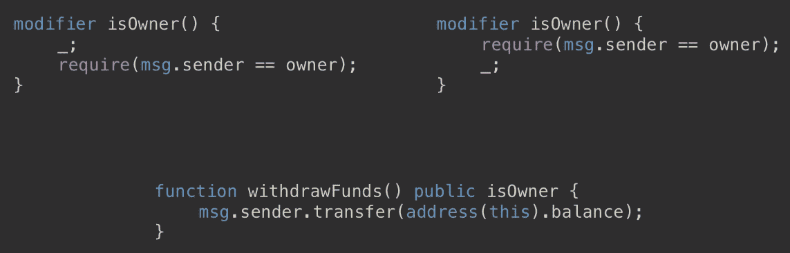
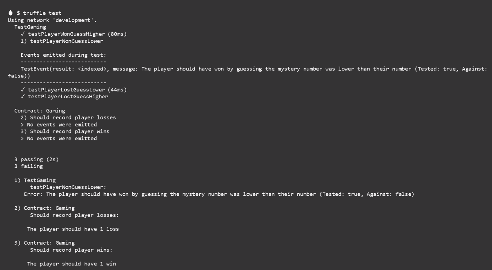
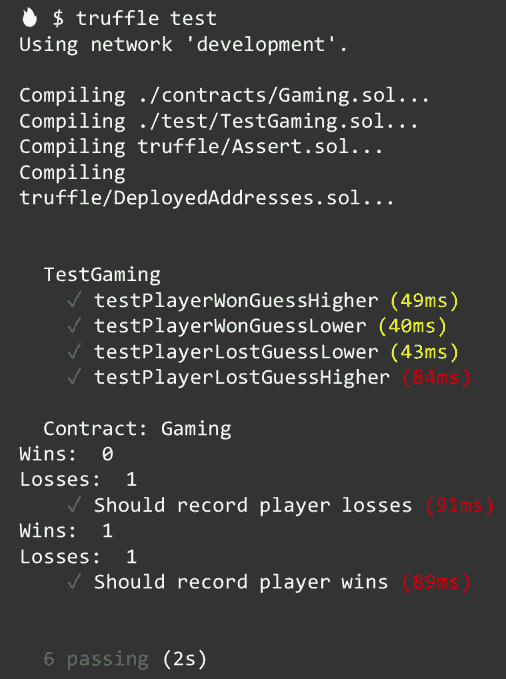

# 第三天——在智能合同中实现业务逻辑

今天的主题是函数。我们将深入探讨如何创建它们，它们如何工作，以及我们如何使用它们来创建使我们的智能合同工作的业务逻辑。

本章将涵盖以下主题:

*   实度函数
*   向函数添加代码
*   功能可见性
*   使用函数执行业务逻辑
*   理解修饰符

# 实度函数

函数是合同中可执行的代码单元。要创建一个函数，您需要指定`function`关键字，给函数一个名称，指定完成它的工作所需的任何参数，设置它的可见性，添加所需的任何修饰符，声明它是一个视图还是一个纯函数，如果它可以接收 ether，将它标记为 payable，并定义它将产生的任何返回变量；然后，我们有左花括号和右花括号，在这些花括号之间是我们添加函数代码的地方。你不会在每个函数中都有所有这些选项，这只是当你有这些选项时它们进入的顺序。例如，你不能将一个函数标记为 pure 和 payable，因为 pure 函数不允许修改 state，而 receiving ether 可以。随着我们使用更多的函数，这一点在今天的课程中会变得更加清楚:

```
function myCoolFunction(unit aNumber) external myModifier view payable returns (bool) {
    //Write cool code here
}
```

我们在函数中使用`return`关键字来表示函数将向调用者返回值。例如，我们可以声明一个名为`sum`的无符号整数，它从`addThis`函数的结果中获取值，该函数有两个参数:

```
unit sum = addThis(4, 2);
```

我们声明它是一个函数，命名为`addThis`，指定它接受两个无符号整数作为`(unit a, unit b)`参数，标记为`internal`，然后指定它返回一个无符号整数。所以，这个`returns`关键字不返回任何东西，它只指定它要去的`function`签名，它只在我们使用`return`关键字的主体中，我们实际上把值返回给调用者，在这种情况下`return a + b`是变量 sum。这两部分——函数签名中的`returns`关键字和返回本身——都是必需的。我们的 add this 函数可能看起来像下面的代码:

```
function addThis (unit a, unit b) internal returns (unit) {
         return a + b;
}
```

我们也可以像这样指定返回，这里我们说这个函数将返回`c`变量，然后在函数块内部我们将`c`变量赋给`a + b`的和并返回它:

```
function addThis (unit a, unit b) internal returns (unit c) {
          c = a + b;
           return c;
}
```

# 向函数添加代码

函数为您的合同创建应用程序逻辑；这意味着他们必须做事情，告诉他们做什么意味着编写代码。你写的代码在函数的花括号之间。在花括号内，代码从上到下一次执行一行。例外情况是，如果您有条件逻辑，如这个`if`语句。如果`isWinner`不为真，`if`块或跳过花括号内的这些代码行，并且程序在`if`块后的第一行代码处继续执行。当函数到达代码或返回语句的最后一行时，函数退出:

```
function winOrLose(unit display, bool guess, unit wager) external payable returns (bool) {
           /* Use true for a higher guess, false for a lower guess */
           require(online == true);
           require(msg.sender.balance > msg.value, "Insufficient funds");
           unit mysteryNumber_ = mysteryNumber();
           bool isWinner = determineWinner(mysteryNumber_, display, guess);
          if (isWinner == true) {
        /* Player won */ 
         msg.sender.transfer(wager * 2);
         return true;
         } else if (isWinner == false) {
         /* Player lost */
         return false;
         }
}
```

# 变量作用域

这给我们带来了一个非常有趣的问题:叫做**变量作用域**的东西。看看这个。我们有一个名为`saySomething`的变量，其值为`"hello"`。在这个`doStuff`函数中，我们有另一个名为`saySomething`的变量，其值为`"goodbye"`。那么，在这个函数中，你认为`saySomething`的值是多少？如果你说再见，你是对的，函数内的`saySomething`变量被认为是函数外的同一个变量名的影子，正如你所看到的，这是一件坏事。当这个函数退出时，`saySomething`的值现在又回到了`"hello"`的初始值；那是因为在这个函数内部声明的变量只存在于函数内部。一旦函数退出，这些变量就消失了。在`doStuff`函数之外，甚至没有一个叫做`saySomethingElse`的东西可以被访问。这是构建函数时要记住的重要一点:函数中需要什么变量，函数退出后需要什么数据:

```
string saySomething = "hello";
function doStuff() internal {
         string saySomething = "goodbye";
         string saySomething = "I have nothing else to say";
}

//saySomething is "hello"
//saySomethingElse doesn't exist
```

# 事件

有一种特殊类型的函数叫做**事件**；这是我们使用 EVM 或以太坊虚拟机登录工具的一种方式。这对我们很重要，因为，如果你记得，当我们的玩家在游戏中采取行动时，它不是实时的；它进入以太坊网络，在那里等待矿工确认，然后，也只有在那时，它才被写入区块链。当发生这种情况时，任何与该事务相关的事件都会被触发。我们可以使用它们在应用程序中调用 JavaScript 回调，并为播放器更新 UI。事件是协定的可继承成员，这意味着写入协定的任何事件都可用于从该协定继承的任何协定。最后，事件参数本身存储在事务日志中；这是区块链的一种特殊数据结构，我们可以看到哪些事件作为事务的一部分被触发。

让我们看一个真实的事件来更好地理解我的意思。在我们的契约中，我们使用`event`关键字定义一个事件，给它一个名称——注意这里的名称以大写字母开始:`PlayerWon `—然后为我们想要索引的数据点添加参数:

```
event PlayerWon(address player, unit amount);
```

在我们的`winOrLose`函数中，一旦我们确定玩家赢了，我们可以忽略玩家一个事件，该事件将玩家的地址和他们赢的金额写入事务日志。在我们应用程序的 JavaScript 中，我们可以监听这个事件，当我们收到它时，让玩家知道这个好消息:

```
function winOrLose(unit display, bool guess, unit wager) external payable returns (bool) {
           /* Use true for a higher guess, false for a lower guess */
           require(online == true);
           require(msg.sender.balance > msg.value, "Insufficient funds");
           unit mysteryNumber_ = mysteryNumber();
           bool isWinner = determineWinner(mysteryNumber_, display, guess);
          if (isWinner == true) {
        /* Player won */ 
        emit PlayerWon(msg.sender, msg.value);
        msg.sender.transfer(wager * 2);
         return true;
         } else if (isWinner == false) {
         /* Player lost */
         return false;
         }
}
```

# 构造器

我想介绍的另一个特殊函数是构造函数。当一个契约被创建并且只能被执行一次时，它被调用。合同一旦创建，就不能再调用。它通常用于设置契约使用的变量的初始状态。您将看到一些例子，每个契约只允许一个构造函数，因此不支持重载。

这里，我们有我们游戏契约的一部分，在契约中我们声明了两个变量，`owner`和`online`:

```
contract Gaming {
    address owner;
    bool online;
}
```

接下来，我们声明我们的构造函数，这样当这个契约被创建时，我们将把`owner`变量设置为部署这个契约的人的地址。与此同时，我们将设置变量`online`等于`true`，表示我们的游戏开始营业了。这两个变量对我们很重要，在创建契约时使用构造函数来设置它们允许我们在创建后尽快锁定它们的值。您将看到的另一个变体是与契约同名的函数。因此，您将看到一个名为`Gaming`的函数，而不是这个`constructor`函数。它做同样的事情，但是使用`contract`名作为函数名来创建构造函数是不可取的，不应该再使用了。但是，许多代码仍然有它，所以我想让你知道它，这样当你看到它时，你就能识别它:

```
constructor() public {
    owner = msg.sender;
    online = true;
}
```

# 后退功能

我们要讨论的最后一个特殊函数是**回退函数** n。一个契约可以有一个未命名的函数，这就是我们的回退函数。它不能有任何参数，也不能返回任何东西，如果调用了一个契约，而契约中没有与调用匹配的函数，它就会被执行。当契约收到以太网但没有数据时也执行。您可能认为这听起来很没用，但是让我向您展示一个例子，说明为什么您可能需要包含一个。

想象一下我们的游戏合同。假设有人在没有数据的情况下给这个契约发送了以太。我们的契约不知道如何处理它，所以它恢复了事务，以太被返回给调用者。但是，如果这是一个不同的应用程序，并且在该应用程序中，您需要能够通过从外部帐户直接转账(如直接从某人的以太坊钱包)来接受以太，该怎么办？做到这一点的唯一方法是使用回退功能。创建一个回退功能并将其标记为应付，将允许您的合同接收乙醚的直接转移。不利的一面是，你需要考虑你要用以太做什么:主要是，你必须有一个方法把它弄出来。例如，如果有人错误地将以太发送到您的合同，他们打算将它发送到不同的地址，如果您的回退功能被标记为`payable`，您将收到该以太，如果您没有允许您撤回它的功能，它将永远停留在那里:

```
contract Gaming {
         function() public payable {
         }
}
```

好了，这就是函数的基础。在下一节中，我们将讨论函数的可见性。让我们更深入地了解可见性如何影响函数的功能。

# 功能可见性

定义函数时，`visibility`关键字是必需的元素。通过指定可见性，我们可以控制谁可以调用它，谁可以继承它。我们还可以选择定义函数是否应该读取状态变量，或者甚至查看它们。

# 简而言之，能见度

我们昨天定义了可见性修饰符，今天我们将使用此表来强调不同之处:

|  | **外部调用** | **内部调用** | **可继承的** | **自动吸气器** |
| **外部** | 是 | 不 | 是 | 不 |
| **公共** | 是 | 是 | 是 | 是 |
| **内部** | 不 | 是 | 是 | 不 |
| **私人** | 不 | 是 | 不 | 不 |

外部函数可以从外部调用。也可以使用`this`关键字在内部调用它们，但是因为这是一种变通方法，所以我没有选中在内部调用的复选框；它们是可继承的，所以你可以访问你继承的契约中的所有外部函数，任何从你继承的契约都有你的契约中定义的外部函数。公共函数既可以在内部调用，也可以在外部调用。像外部函数一样，它们是可继承的，对于定义为 public 的变量，您可以获得一个免费的 getter 函数。内部函数只能在内部调用，并且是可继承的。最后，私有函数只能在内部调用，但是请记住，这并不意味着数据是私有的，只是意味着它不能被调用或继承；区块链上的观察者仍然可以看到它。

让我们来看一个外部函数。这是我们游戏中的`winOrLose`函数:它由我们的 React 应用程序调用，以确定玩家这一轮是赢还是输。它被标记为外部，因为我们将从我们的 UI 调用它，它被标记为可支付的，因为玩家将在这个函数调用中包括他们的赌注。它执行这个逻辑来确定玩家是赢了还是输了，然后如果他们想的话返回一个布尔值`true`，如果他们输了则返回一个布尔值`false`。因此，这个函数也可以被标记为 public，并保留相同的功能。此外，我们将能够在不使用`this`关键字的情况下从契约内部调用该函数。因此，要从契约内部调用这个函数，我们只需调用`winOrLose,`，但它被标记为外部，如果我们想从契约内部调用它，我们必须调用这个点`winOrLose.`，因为这个函数没有理由从契约内部调用，所以我做了可见性`external`:

```
function winOrLose(unit display, bool guess, unit wager) public payable returns (bool) {
           /* Use true for a higher guess, false for a lower guess */
           require(online == true);
           require(msg.sender.balance > msg.value, "Insufficient funds");
           unit mysteryNumber_ = mysteryNumber();
           bool isWinner = determineWinner(mysteryNumber_, display, guess);
          if (isWinner == true) {
        /* Player won */ 
        emit PlayerWon(msg.sender, msg.value);
        msg.sender.transfer(wager * 2);
         return true;
         } else if (isWinner == false) {
         /* Player lost */
         return false;
         }
}
```

我们的 mysteryNumber 函数是私有的。我们的`winOrLose`函数调用它来生成玩家下注的神秘号码。它只在契约内部被`winOrLose`函数调用，所以它不需要外部或公共可见性。此外，我不想让继承的契约访问这个函数，所以它被标记为`private.`这里有一个新的关键字来标记`view.`将这个函数标记为`view`表示这个函数不会试图修改、创建或更新状态:

```
function mysteryNumber() private view returns (unit) {
         unit randomNumber = unit(blockhash(block.number-1))%10 + 1;
         return randomNumber;
}
```

# 查看功能

在下面的列表中，我们可以看到被认为是修改状态含义的内容，如果您的函数是视图函数，则不允许出现这些内容:

*   写入状态变量
*   发射事件
*   创建其他合同
*   使用自毁
*   通过通话发送以太网
*   调用任何其他未标记为 view 或 pure 的函数
*   使用低级调用
*   使用包含两个操作码的内联程序集

低级调用和内联汇编操作码超出了本课程的范围，所以我们不打算在这里讨论。

最后，我们有一个内部函数，我们的`determineWinner`函数。这个函数评估这一轮神秘号码的标准，显示给玩家的号码，以及他们的客人的更高或更低。它有一个 boolean 返回值，在调用时返回给`winOrLose`函数。没有理由让除了`winOrLose`函数之外的任何东西调用这个函数，特别是在外部，所以将它定义为外部或公共是不可能的，并且我不介意继承我的承包的人使用这个函数，所以我将它标记为`internal.`它也被标记为`pure`:

```
function determineWinner(unit number, unit display, bool guess)
    internal pure returns (bool) {
    if (guess == true} {
        if (number > display) {
            return true;
        }
    } else if (guess == false) {
        if (number > display) {
            return false;
        }
    }
}
```

# 纯函数

一个纯函数很像一个视图函数，因为它承诺不修改状态，但是它更进一步承诺甚至不读取状态。

如果你把你的函数标记为纯函数，下面是你不能做的事情的列表:

*   读取状态变量
*   访问帐户余额
*   访问块、发送或消息的任何成员
*   调用任何未标记为纯函数的函数
*   使用包含某些操作码的内联程序集

在下一节中，我们将看到所有这些是如何结合在一起创建应用程序的业务逻辑的。

# 使用函数执行业务逻辑

因此，我们已经对函数的工作方式和创建方式有了一些信心，现在让我们把它放到实际环境中，看看我们如何使用它们来实现智能契约的业务逻辑。回想一下我们的应用程序，我们将在 UI 中向玩家显示一个随机数，他们将打赌他们认为神秘数字会更高还是更低。显示的数字和他们的赌注被发送到我们的智能合同，在这里我们使用可靠性代码执行游戏规则:


让我们再来看看我们的`winOrLose`函数。自从我们上次看见它以来，它有了一点儿变化。当玩家准备玩的时候，他们会下注，应用程序会调用这个函数。当它这样做时，它将发送显示给玩家的数字，玩家猜测，他们的赌注将作为特殊的`msg.value`变量附加到该交易中。因为它是从我们的 UI 调用的，所以它必须被标记为外部的，因为它以以太的形式接收他们的赌注，所以它必须被标记为可支付的。

我们定义它返回两个对象:一个布尔值和一个无符号整数。布尔值表示他们是赢了还是输了，无符号整数将返回他们下注的`mysteryNumber_`。这将允许我们在告诉玩家他们赢了还是输了时向他们展示`mysteryNumber_`:

```
function winOrLose(unit display, bool guess, unit wager) external payable returns (bool, unit) {
           /* Use true for a higher guess, false for a lower guess */
           require(online == true);
           require(msg.sender.balance > msg.value, "Insufficient funds");
           unit mysteryNumber_ = mysteryNumber();
           bool isWinner = determineWinner(mysteryNumber_, display, guess);
          if (isWinner == true) {
        /* Player won */ 
        emit PlayerWon(msg.sender, msg.value);
        msg.sender.transfer(msg.value * 2);
         return (true, mysteryNumber_);
         } else if (isWinner == false) {
         /* Player lost */
         return (false, mysteryNumber_);
         }
}
```

在函数内部，我们有两个必需语句。我将跳过这些，因为我们将在下一节详细讨论它们。

我们有一个无符号整数，它的值来自一个叫做`mysteryNumber`的函数；这意味着我们的`mysteryNumber`函数必须返回一个无符号整数——我们在定义函数时声明了这一点——由于我们的契约之外没有任何东西需要访问这个函数，所以我们将它标记为私有。我们的函数也不做任何修改状态的事情。它只是返回一个数字，所以我们也可以把它标记为一个`view`函数:

```
function mysteryNumber() private view returns (unit) {
         unit randomNumber = unit(blockhash(block.number-1))%10 + 1;
         return randomNumber;
}
```

现在我们有了确定玩家这一轮是赢是输所需的所有数据。因此，我们声明一个名为`isWinner`的布尔值，它将通过向`determineWinner`函数发送所有需要的信息来获取其值，该函数如下所示:

```
function determineWinner(unit number, unit display, bool guess)
    internal pure returns (bool) {
    if (guess == true} {
        if (number > display) {
            return true;
        }
    } else if (guess == false) {
        if (number > display) {
            return false;
        }
    }
}
```

它有参数接受一个神秘的数字，显示的数字，和玩家的猜测。同样，契约之外的任何东西都没有理由调用这个函数，所以它被标记为`internal`，因为它不读取或修改状态，所以我们将其标记为`pure`。接下来，我们检查所有赢和输的不同组合，一旦我们有足够的信息来确定这一轮是赢还是输，我们使用`return`退出该函数，然后使用`true`表示赢，使用`false`表示输。当该函数返回时，它就留给我们这里，我们可以在这里评估`isWinner`变量，然后根据赢或输采取适当的行动，包括发出事件来指示该轮的状态，将赢得的任何钱发送回玩家，并将该轮的结果返回给玩家查看。让我们直观地看一下，以帮助巩固关系。我们的应用程序调用`winOrLose`函数，该函数又从`mysteryNumber_`函数获得一个新的神秘数字，然后它将数据发送给`determineWinner`函数，以查看玩家是赢了还是输了，然后它采取适当的行动，最后通知玩家结果。接下来，我们将讨论修饰语。它们是功能强大的函数，允许您对函数何时应该执行和不应该执行进行约束。

# 理解修饰符

嗯，修饰符是函数中的一个重要组成部分:它们允许我们快速而容易地实施规则和限制。修饰符用于以声明的方式改变函数的行为。这意味着我们得到了一个可重复的简洁的方法来执行规则。修饰符通常用于在执行函数之前检查条件；这对区块链的发展很重要。我们付钱给矿工，让他们以 gas 的形式执行我们的函数，所以如果一个函数不能满足约束条件，那么它越快失败越好。

还有可继承的属性，这意味着在协定中定义的修饰符也可用于从它派生的任何协定。修改器的一个重要组成部分是一个叫做 **require** 的便利函数。因此，在我们深入研究修饰符之前，让我们先了解 require 函数。

# 所需功能

Require 是一个方便的函数，我们可以在 Solidity 中使用它来处理错误。这是一个状态恢复异常，意味着在异常之前对状态所做的任何更改都会自动回滚；这是一个很棒的特性，因为它确保了我们所有的事务都完成，或者都没有完成，避免了我们不得不猜测哪些部分完成的情况。我们通常使用`require`来确保满足有效条件，比如输入或契约状态变量。并且，可选地，我们可以包含一个当`require`语句失败时返回给调用者的字符串消息，让调用者知道发生了什么。对我来说，虽然这个流消息是可选的，但它是必需的；我甚至不知道在这个特性出现之前，我花了多少时间来查找一个函数失败的原因，后来才知道这是因为我在函数中加入了一个需求。为了定义一个需求，我们使用`require`关键字，后跟括号中的条件。

如果您还记得我们的契约定义，我们设置了一个名为`online`的变量，然后在构造函数中将它的值设置为等于`true,`，所以这条语句检查`online`变量是否仍然是`true`。如果没有，程序执行就停止在这里，这就是我们如何有效地让我们的游戏离线:

```
require(online == true);
```

顺序在 require 语句中也起着重要作用。通常，您希望将它们放在函数的顶部，这样，如果条件不满足，函数可以尽快失败。在这里，您可以看到两个 require 语句，一个用于验证游戏是否在线，另一个用于确保玩家有足够的资金来支付他们的赌注，就是这样。Require 语句非常简单。

我们可以使用 require 语句来构建修饰符。使用 modifier 关键字创建一个修饰符，给它一个名称，然后在括号中加上可选参数。它非常类似于一个函数。在修饰符中，我们添加了我们的条件。这里，我们要求消息发送者的地址与存储在 owner 变量中的地址相同。此修饰符的作用是限制使用它的任何功能只能由合同的所有者执行。修饰符的最后一部分是下划线，它的位置非常重要，因为它决定了调用这个修饰符的代码应该何时执行:

```
modifier isOwner() {
   require(msg.sender == owner);
   _;
}
```

让我给你看一个例子来进一步解释。该功能允许呼叫者从游戏中提取合同赢得的资金。我们使用`isOwner`修饰符来确保只有契约的所有者才能调用它:

```
function withdrawFunds() public isOwner {
     msg.sender.transfer(address(this).balance);
}
```

现在让我们看看下划线在哪里起作用。下划线有两个有效位置:



它可以出现在修饰语的开头:

```
modifier isOwner() {
    _;
    require(msg.sender == owner);
}
```

或者它可以出现在修饰语的末尾:

```
modifier isOwner() {
    require(msg.sender == owner);
     _;
}
```

区别在于函数中的代码何时运行。如果您将下划线放在修饰符的开头，当取款函数执行时，它会运行函数中的所有代码，然后调用修饰符。如果下划线在末尾，修饰符首先执行其逻辑，然后函数执行其逻辑。

另一种理解方式是下划线代表函数本身。在这个例子中，如果我们把下划线放在前面，函数首先执行并从合同中提取所有资金，然后修饰符检查是否是所有者这样做的。下划线在最后，修饰符首先检查调用是否来自所有者，如果修饰符通过，它就执行函数。这个函数的预期结果差别很大，所以在使用修饰符时要特别注意。

在下一节中，我们将看一些使用修饰符的实际例子，以便更好地理解它们的功能。

在这一节中，我们将看看修饰符的一些不同的用例。我真的很喜欢修饰符，因为它们允许对函数的执行进行很多控制，但它们仍然非常易读。让我们来看看我们的第一个例子，一个名为`onlyBy`的修饰符。它将只允许调用它的函数执行，如果它被期望的地址调用:

```
modifier onlyBy(address _account) {
           if (msg.sender != _account) {
                   revert();
           }
           _;
}
```

我们可以在`changeOwner`函数中看到它的作用。当调用`changeOwner`时，`onlyBy`修饰符用于确保只有当前所有者才能为合同指定一个`newOwner`变量:

```
function changeOwner(address _newOwner) onlyBy(owner) {
    owner = _newOwner;
}
```

这是另一个使用时间限制的例子。如果当前时间小于作为参数传入的时间，修饰符抛出异常，结束程序执行。将它投入使用，我们可以看到,`disown`函数使用了`onlyAfter`修饰符来确保它只能在创建时间 6 周后被调用。这是使用多个修饰符来确保满足多个条件的一个很好的例子。要指定多个修饰符，只需在函数声明中一个接一个地列出它们。您可以这样每行一个修饰符，或者在同一行中用空格分隔每个修饰符:

```
modifier onlyAfter(unit _time) {
    if (now < _time) revert();
    _;
}

function disown()
     onlyBy(owner)
     onlyAfter(creationTime + 6 weeks)
{
     delete owner;
}
```

让我们再看一个例子。这个修改器需要用函数调用支付一定的费用，所以现在我们可以收取更换所有者的费用。只要所需的 200 以太网包含在该事务中，该事务就会执行。但是这里有一个警告:如果调用者在函数退出时发送了超过 200 个以太，那么任何多余的以太都会被返回给调用者。但是，如果我们显式地使用一个`return`，任何多余的以太都不会被返回:

```
modifier costs(unit _amount) {
    if (msg.value < _amount) {
        revert;
        _;
    }
    if (msg.value > _amount) {
        msg.sender.send(amount - msg.value);
    }
}

function forceOwnerChange(address _newOwner) costs(200 ether) {
    owner = _newOwner;
    if(unit(owner) & 0 == 1) {
       return;
    }
}
```

好了，我们已经讨论了函数，虽然我们还可以讨论更多，但这代表了开始构建智能合约所需的基础。在下一节，我将和你一起复习今天的作业。

# 分配

今天的作业和昨天的格式相似。在这本书的知识库中，你将写一些代码来通过一些测试。这样做可以让你将今天学到的关于函数的知识运用到工作中。您要做的第一件事是:

1.  为今天的作业准备好环境。
2.  打开终端，切换到包含应用程序代码的目录。
3.  键入`git stash`命令。这将保存您对应用程序代码所做的任何更改，以防止您所做的任何工作干扰我为您设置的场景。
4.  在你藏起你的工作后，键入`git checkout -b dayThree`来获得今天作业的代码，你还需要运行 Ganache，所以确保你在开始作业前启动它。
5.  运行`truffle test`，你应该会看到类似下面的截图:



为了通过所有这些测试，您需要完成以下任务——在`determineWinner()`函数中，我们遗漏了一些逻辑。如果玩家猜测神秘数字将低于屏幕上显示的数字，他们应该会赢，但该功能目前不会这样做，所以我需要你编写代码来实现这一点。

6.  接下来，我们将创建两个新事件:一个用于`playerWon`，一个用于`playerLost`。该事件应该接受玩家地址、他们下注的金额、他们下注的神秘号码以及显示给玩家的号码的参数。
7.  现在你已经有了你的事件，无论玩家是赢是输，我们都会忽略正确的事件。

最后，有一个名为`players`的映射，它将玩家的地址映射到一个`Player`结构，在这里我们可以存储关于他们输赢的信息。

8.  我们将从映射中获得正确玩家的`Player`结构，如果他们赢了，就增加赢的计数器，如果他们输了，就增加输的计数器。

当你全部完成时，你应该以这六个通过的测试结束，它们为[第四章](4.html)、*第四天* - *创建测试*做好准备:



最酷的是，在过去的几天里，您一直依赖测试来确保您的代码正常工作，因此您可能会对它们的重要性以及它们如何帮助您编写更好、错误更少的代码有所了解。

# 摘要

在这一章中，我们学习了所有关于函数的知识。我们还了解了函数是如何创建的，它们是如何工作的，以及如何使用它们来实现智能合约。我们从学习 Solidity 中的函数开始，之后我们看到了如何给这些函数添加代码。然后我们学习了如何修改函数的可见性。然后，我们看到了如何使用函数来执行业务逻辑。最后，我们学习了如何在函数中使用修饰符。

在下一章中，我们将学习如何创建有助于调试代码的测试，以便游戏能够顺利运行！