# 第五天——构建用户界面

在这一章中，我们将重点构建一个**用户界面** ( **UI** )。这是我们的应用程序的一部分，我们的最终用户将看到和使用。如果你过去建过网站，你会看到一些熟悉的东西在这里，你会学到一些与区块链应用程序交互的复杂性。如果你以前从未建立过网站，那也没关系，因为你会知道我们将要做什么，以及为什么我们需要这样做。

我们将在本章中讨论以下主题:

*   理解 JavaScript 和 React 在 DApp 中的作用
*   从模板创建 React 应用程序
*   向玩家显示游戏状态
*   从用户界面获取玩家输入
*   向玩家提供反馈
*   在网络应用程序中实现 JavaScript 的承诺
*   使用 Web3.js 与以太坊网络通信
*   在用户界面中实现 JavaScript 函数

# 理解 JavaScript 和 React 在 DApp 中的作用

下面的屏幕截图显示了我们今天将要构建的 UI。我们将在流行的 JavaScript 框架 React 中构建它:

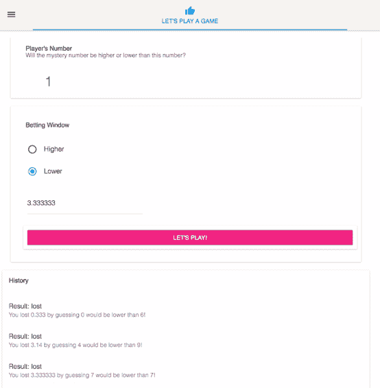

我们将构建您在 UI 中看到的组件，然后编写允许玩家向 Ganache 提交赌注和猜测的代码。然后，Ganache 将执行我们的智能合约功能，并确定玩家是赢了还是输了，根据这一点，它将保留玩家发送的钱，或者支付这一轮的奖金。无论哪种情况，我们都将向用户提供反馈，让他们知道他们是赢了还是输了。

在我们的 web 应用程序中，我们将使用 React，但我们也将使用 Redux。React 是一个用于构建 ui 的 JavaScript 库，它在让我们设计组成应用程序的组件以及应该影响它们的状态方面做得很好。 **Redux** 是一个可预测的状态容器，这意味着我们将从以太坊网络获得大量数据，例如，每一轮游戏的结果。当一些信息改变时，我们需要更新用户界面，让玩家知道。Redux 提供了一种模式来做到这一点，今天您将学习如何使用它。

当你想到组件时，想想组成 UI 的离散的东西。因此，我们的应用程序是一个大组件，但它由其他组件组成，如显示玩家号码的组件，显示下注控件的组件，以及显示玩家游戏历史的组件。玩家的游戏历史组件也由更小的组件组成。每个游戏历史条目都有一个容器平铺组件和一个列表重复组件。所有这些都有状态。历史组件状态存储玩家历史，下注窗口状态存储玩家的下注金额和他们的猜测，React 处理所有这些。

现在，事情将在我们的应用程序之外发生，因此我们需要更新状态，并让应用程序知道它已经发生，并相应地做出反应。后者很容易排序，因为我们选择 React 作为我们的工具。React 在跟踪状态方面做得很好，当状态改变时，它会更新屏幕上受其影响的内容。

为了更新状态，我们使用 Redux。在我们的 React 组件中，我们将做一些触发动作的事情，比如单击“让我们玩吧！按钮。在单击该按钮的情况下，它将使用`web3.js`库调用我们的契约，并执行我们之前创建的`winnerLose()`函数。当我们的契约函数执行该函数时，它将返回一些数据，这些数据可能是成功的响应，也可能是错误消息。我们将获取该响应并将其发送给一个 reducer，后者将使用新信息更新 Redux 存储。

更新的信息作为`props`或属性被发送回我们的应用程序，React 可以评估 UI 中需要更新的内容。整个过程可以总结在下图中:

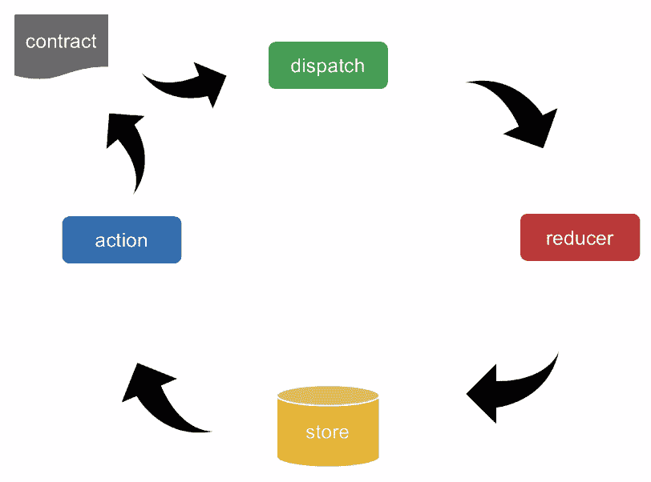

所以，我们对组成 DApp 的不同部分有非常清晰的划分。

我们有以太坊网络，我们的合同运行在**以太坊虚拟机(EVM)** 上，然后我们有我们的 React 应用程序运行在 web 服务器上。我们应用程序的这一部分可以是任何东西；我选择了 React 应用程序，但它也可以是 Android 或 iOS 应用程序、Python 应用程序，甚至是旧的 COBOL 大型机应用程序。

React 应用程序和以太坊网络之间的连接是通过一个名为`web3.js`的实用程序库来实现的。这个库提供了一些实用程序，允许我们与以太坊节点(如 Ganache)以及以太坊主网络和测试网络上的节点进行通信。`web3.js`有四个主要模块，如下:

*   `web3-eth`:以太坊区块链和合约
*   `web3-shh`:P2P 和广播的耳语协议
*   `web3-bzz`:分散文件存储的 Swarm 协议
*   `web3-utils`:助手功能

我们将在本书中使用的模块是`web3-eth`用于与区块链和我们的合同通信，以及`web3-utils`用于一些实用功能，例如转换不同名称的以太。

Web3 允许您使用回调和承诺，并提供事件发射器来尝试和提供您需要的所有选项。我们将广泛使用承诺，稍后我们会详细介绍它们。在你写第一行代码之前，有大量的样板代码必须被放下，这些代码实际上向你的顾客、公司或客户传递价值。幸运的是，有一些捷径可以最大限度地减少这一时间，我将在下一节向您展示它们是什么。

# 从模板创建 React 应用程序

在本节中，我们将了解一些启动新 React 应用程序的快捷方式。这是一件好事，因为启动一个新的应用程序需要大量的工作和时间，这些时间可以用来编写代码来完成你的应用程序。

一种方法是使用脸书发明的工具`create-react-app`。它只是用一些预配置的选项旋转出一个样板文件或一个空白的 React 项目。您也可以只是复制另一个项目。如果你有一个类似的项目，所有的东西都按照你需要的方式设置好了，你可以克隆、复制或派生那个应用程序，去掉你不需要的部分，然后从那里开始。

还有第三条路，那就是从零开始建立一切。如果你真的想了解“引擎盖下的反应”,这是一个很好的练习，但如果你正在赶时间，我不建议你这么做。

# 利弊

每种方式都有其利弊。工具与 React JSX 和 ESX 一起创建一个新项目。

使用该工具启动一个新项目就像键入以下命令一样简单:

```
npx create-react-app my-app
```

其中`my-app`应该替换为您的应用程序的名称。

这将创建应用程序，并预先配置了`babel`和`webpack`，因此您不必这样做，而且更新通常简单明了并有良好的文档记录，使您可以轻松地使用最新的功能和安全补丁来更新您的应用程序。

这是相当固执己见的，但是，为了完成这样一个项目，它必须如此。您添加的任何附加依赖项都必须符合项目的格式，否则您会遇到困难。您可以自定义任何预配置的工具，但这样做可能会使其处于您负责维护的状态，因为它将不再接收作为正式软件包一部分的更新。

复制或派生另一个项目有时可能是一个好的开始方式，尤其是当新项目共享许多相同的依赖项时。它可能已经为您的用例进行了配置，如果您使用相同的代码库，您可能可以像团队中的其他开发人员一样访问支持资源。

这意味着您也继承了该项目的所有问题，比如过时的依赖关系。您可能不得不取出您的应用程序不使用的任何不需要的代码，这有时会导致程序崩溃。发现自己经常分叉一个项目？您最终会在多个项目中重复相同的代码，当需要更新依赖项或修补安全漏洞时，这会导致大量额外的工作。

对我来说，当我学习新的东西时，看到一个项目似乎在解决同样的问题，并以此为起点，这真的很有诱惑力。我认为这对于在边上玩不同的东西非常有用。随着时间的推移，这些项目几乎总是最难维护的。所以，这些天来，如果我在构建一个项目，并且这个项目将会发布给实际客户，我几乎总是从脸书工具开始。唯一的例外是，当一个高度定制的组件有一个特定的用例时，它将受益于与其父项目共享的代码库。

现在你已经有了一些关于如何为 DApp 创建自己的 React 应用程序的背景信息，让我们回到我们的工作上来。是时候开始构建 UI 了，所以我们可以开始看到与我们的 Solidity 契约交互的可视化界面。

# 向玩家显示游戏状态

到目前为止，我们一直在讨论 React 是如何工作的。现在让我们将这些知识付诸实践，开始构建我们的 UI，同时了解 React 如何使用状态来更新页面上的组件。

在我们的应用程序中，我们有一个名为`index.html`的文件；您可能知道这是用户访问网站时 web 服务器提供的默认文档。在我们的索引页面中，我们有一个被调用的`index.js` JavaScript 文件，它又添加了一个名为`app`的组件，这是我们的 React 应用程序。下图显示了该应用程序的外观:

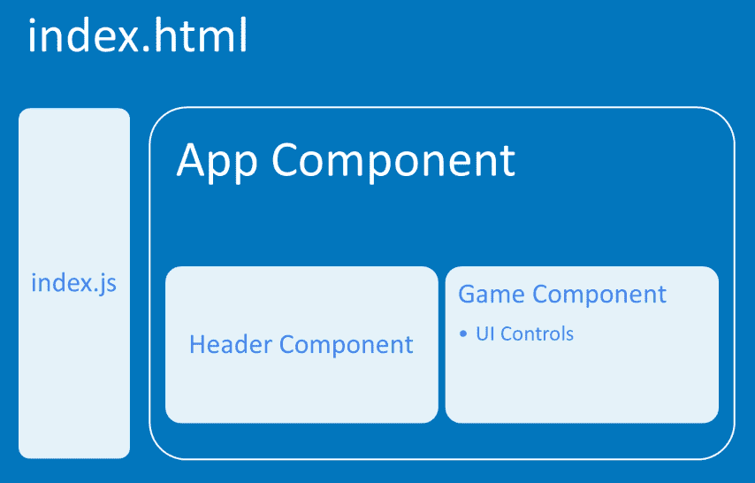

React 的主要目标之一是构建单独的组件。在`app`里面，它抓取组成我们游戏的组件。这些组件包括标题和游戏组件。这些组件中的每一个都是文件系统中的一个单独的文件，所以让我们跳到代码编辑器中来感受一下它的外观。让我们看看下面的截图:

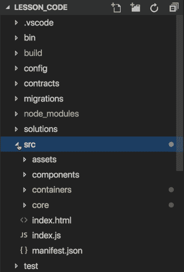

在我们的应用程序中，我们有`src`源文件夹、`index.html`文件和`index.js`文件。当您查看`index.js`文件时，您可以看到我们通过导入`configureStore`来创建 Redux store，然后我们从`containers/App`文件夹中导入我们的`App`组件，并且我们在页面上创建该应用程序的一个实例，如下面的代码片段所示:

```
import React          from 'react';      
import ReactDOM       from 'react-dom';
import { Provider }   from 'react-redux';
import configureStore from 'core/store/configureStore';
import App            from 'containers/App';

const store = configureStore();

ReactDOM.render(
    <Provider store={store}>
 <App/>
 </Provider>
    document.getElementbyId('root')
);
```

`App`组件存储在我们的`containers`文件夹中；当你去那里时，有一个名为`App`的文件夹和一个名为`index.js`的文件，这是它的代码所在的地方。它导入游戏头和游戏，游戏本身是`containers`下的另一个文件夹，有它自己的`index.js`文件，在这个文件里我们将定义游戏的所有组件。

下面是我们将如何为您的 UI 定义这些组件。将显示的整个屏幕部分是我们的游戏容器，它是在被拉入的`app.js`文件中引用的组件。它由三个较小的组件组成:显示玩家号码的组件、显示下注控制的组件以及包含玩家游戏历史的组件，如下图所示:

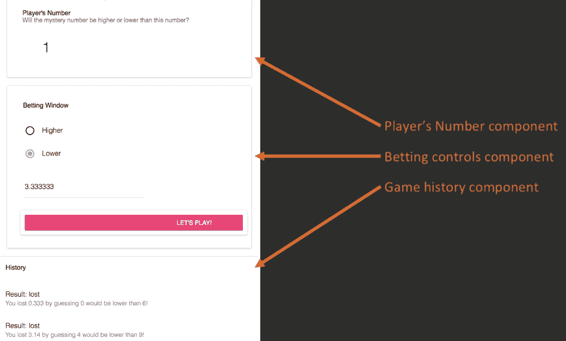

为了创建所有这些容器和控件，我使用了 Material-UI 库。这个库使得创建高质量的专业外观的 UI 组件变得非常容易。

我们的游戏组件从导入几个库开始:

```
import React, { Component } from 'react'
import PropTypes from 'prop-types'
import { connect } from 'react-redux'
import { bindActionCreators } from 'redux'
```

正如这里所看到的，我们需要`React`本身以及组件库来创建 Redux 的组件类`PropTypes`、`connect`和`bindActionCreators`，我们将在下一节讨论它们的角色。

然后我们创建一个名为`Game`的类，在它里面我们有一个`constructor`函数。这与我们在 Solidity 契约中创建的构造函数的工作方式类似，它在类初始化以设置初始状态时运行一次。下面的代码片段显示了该类包含的内容:

```
export class Game extends Component {
    constructor(props) {
        super(props)
        this.state = {
            playerNumber: '';
            highLow: '';
            wager: '';
            history: []
        }
    }
    render() {
        return (
        )
    }
}
```

正如在前面的代码块中看到的，我们将为我们需要的一些变量设置初始状态，例如显示给玩家的这一轮的数字，他们对更高或更低的猜测，他们在这一轮上下了多少赌注，以及一个我们将存储前几轮结果的数组。React 组件有一个必需的功能`render()`。当组件被渲染时，这个函数被调用。

我们现在准备开始为这个组件布局 UI 元素。我们将从在`index.html`页面上构建第一个组件开始，这个显示窗口向玩家显示这一轮的号码。我们将从 Material-UI 库中定义一个卡片，然后我们将定义一个带有标题和副标题的卡片标题，以向玩家提供他们正在查看的一些信息，最后我们有一个显示数字本身的标题元素。这可以用下面的代码片段来概括:

```
<Card style={style}>
    <CardHeader
        title="Player's Number"
        subtitle="Will the mystery number be higher or lower than this number?"
    />
    <h1 style={displayNumber}>{this.state.playerNumber}</h1>
</Card>
```

这应该会生成一个类似于以下屏幕截图的窗口:

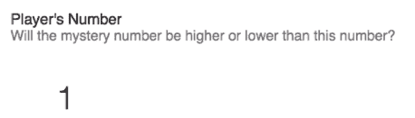

卡片中显示的数字是我们在构造函数中定义的状态变量。因为我们从 Material-UI 库中将卡片标题中的卡片添加到了组件中，所以我们也必须导入它，以便 React 知道从哪里获取这些内容。我们通过添加卡片和卡片头作为导入，以及我们在文件顶部声明的其他导入。

让我们回到`h1`中使用的命令。那是如何从一串文本变成你在屏幕上看到的数字的呢？在 React 中，当你用花括号将一个字符串括起来时，它就有了特殊的含义，但实际上在这一点上它只是 JavaScript，所以我们可以做任何在 JavaScript 中可以做的事情。这意味着`this`被创建为一个变量，该变量的结果就是屏幕上显示的内容。

有一个名为`componentDidMount()`的特殊 React 生命周期函数，在我们的组件挂载之后，React 会调用这个函数。挂载意味着它已经呈现在 DOM 中，并且可以通过编程方式调用。将我们的代码放在这里，可以确保我们不会在组件实际存在于 DOM 之前试图访问它。我们将调用`this.setState()`并给`playerNumber`状态变量赋值。该函数的结果生成当前的玩家号。`generatePlayerNumber()`函数看起来像这样，只是返回一个 0 到 9 之间的随机数。最终结果是页面上的组件呈现随机数给玩家看。这显示在下面的代码片段中:

```
componentDidMount() {
    this.setState({
        playerNumber: this.generatePlayerNumber()
    })

    generatePlayerNumber() {
        return Math.floor(Math.random() * 10)
    }
}
```

接下来，我们得到了我们的下注窗口，这是另一张带有牌头的牌，就像我们的玩家显示组件一样。它有一个单选按钮组，有两个单选按钮供玩家选择调高或调低:

```
<RadioButtonGroup
    name="highLow"
    defaultSelected={this.state.highLow}
    onChange={this.handleChange('highLow')}
    >
    <RadioButton
        value="higher"
        label="Higher"
        style={elementStyle}

    />
    <RadioButton
        value="lower"
        label="Lower"
        style={elementStyle}
    />
</RadioButtonGroup>
```

注意选择的值是如何读取`highLow`变量的状态值，并在改变时调用`handleChange()`函数。

我们还为玩家提供了一个文本字段来指示他们想要下注多少，以及一个按钮，当他们准备好开始这一轮游戏时，可以执行该按钮。我们已经导入了卡片和卡片标题，所以现在我们必须以同样的方式导入单选按钮组、单选按钮、文本字段和凸起按钮。

你可以随时查阅随书获得的源代码，以防你在以后的某个地方感到困惑。对于单选按钮组和文本字段，我们调用`handleChange()`函数，如下所示:

```
handleChange = name => event => {
    this.setState({
        [name]: event.target.value
    })
}
```

该函数接收要作为参数更新的状态变量的名称，然后用调用该函数的控件中的值更新状态。所有这一切都归结为类似这样的东西:

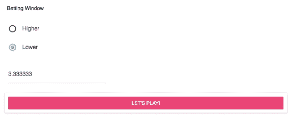

我们的最后一个组件是历史窗口，就像其他组件一样，它是一个带有卡片标题的卡片，这突出了使用库的一个好处。我们在这个组件中多次重用了这个库，因为它很容易定义，而且我们不需要编写任何代码。接下来，我们有一个从状态中获取历史的列表，这是一个数组，数组中的每一项都是前一轮游戏的结果。因此，我们映射它，并为数组中的每个元素创建一个列表项。下面的代码片段总结了这一点:

```
<CardHeader
    title="History"
    />
    <List>
        {this.state.history.map((round) =>
        <ListItem key={round.transactionHash}
        primaryText={`Result:\t${round.result}`}
        secondaryText={`You ${round.result} ${round.wager} by guessing ${round.playerNumber} would be ${round.guess} than ${round.mysteryNumber}!`}
        />
        )}
    </List>
</Card>
```

这会产生以下输出:

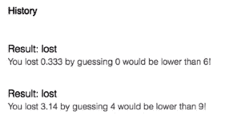

现在，让我们再次跳到我们的代码编辑器，看看所有这些部分如何组合成一个单独的 React 类。因此，在我们的`src/containers/Game`文件夹中，我们已经有了我们的`index.js`文件，现在我们来看看。

在顶部，我们从 React、Redux 和 Material-UI 库中导入构建该页面上的组件所需的一切。我们在这里使用了一点 CSS 来使页面的格式看起来更好，然后我们有了扩展 React 组件的 game 类。在里面，您会发现我们设置初始状态变量的`constructor`，然后是 React 生命周期组件。然后，还有我们的 render 方法，我们返回页面上呈现的所有元素。

我们已经在卡片标题中找到了玩家编号的卡片；第二张牌代表下注窗口，第三张牌代表玩家的游戏历史。接下来，我们使用用户定义的函数来处理变更事件、启动游戏和生成随机数。

因此，所有这些都开始结合在一起，看起来像一个真正的应用程序。让我们把信封推得更远一点，跳到下一部分，在那里我们将剖析“让我们玩吧”!按钮来看看我们如何从用户界面获得输入，并把它变成用户的游戏。

# 从用户界面获取玩家输入

在这里，我们将继续执行代码，当我们的玩家点击让我们玩！按钮。下面的代码片段展示了它的工作原理:

```
playGame = () => {
    const { actions } = this.props
    actions.game.playRound(
        this.state.wager,
        this.state.playerNumber,
        this.state.highLow
    )
    this.setState({
        playerNumber: this.generatePlayerNumber()
    })
}
```

这里，我们定义了一个从`this.props`获得的动作，然后我们调用该动作中的一个函数，最后我们用一个新的随机数更新`playerNumber`状态变量。

接下来，我们有从我们的游戏组件调用的函数，它是`playRound()`。这个函数接受赌注、玩家的号码和猜测作为参数，然后返回一个`dispatch`参数。`dispatch()`函数返回一个 JSON 对象，其类型是我们的一个常量，以及我们传递给函数的参数。我们的类型在`types.js`中定义。在其中，我们定义了初始状态，它代表了应用程序启动时设置的状态变量，这样可以防止应用程序启动时出现变量未定义的错误。

然后，我们导出我们的游戏 reducer 函数，它包含一个基于我们将在动作中提供的动作类型的 switch 语句。当在我们的 reducer 中找到匹配的类型时，它返回定义到 Redux 存储的对象。

这个谜题还有最后一块，那就是`rootReducer`。这需要所有的减速器，我们将有我们的应用，并结合他们。下面的代码片段显示了它包含的内容:

```
import { combineReducers } from 'redux'
import { providerReducer } from 'core/reducers/reducer-provider'
import { gameReducer } from 'core/reducers/reducer-game'

const rootReducer = combineReducers({
  provider: providerReducer,
  game: gameReducer
})

export default rootReducer
```

所以，让我们再来一次这个完整的循环，这次参考我们刚刚学到的内容。从我们的游戏组件中，我们调用`playRound()`函数，这个函数由`props`提供。`playRound()`函数获取从播放器接收的参数，并将它们发送到`core/reducers/reduce- game.js`中的减速器。reducer 使用`core/types.js`中提供的常量将收到的分派与要执行的工作进行匹配，并将结果发送到 Redux 存储。Redux store 然后将新数据作为`props`发送给我们的应用程序，当`props`发生变化时，React 会注意到它，并用新数据更新我们的历史组件。这可以总结如下图所示:

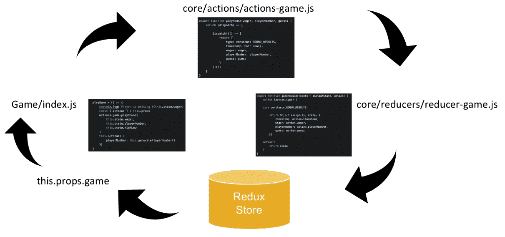

让 React 如此强大的是，当发生这种情况时，屏幕上唯一改变的是历史组件的更新，其他任何东西都不会改变。在下一节中，我们将实时演示所有这些内容，如果现在还不明白，我想在下一节中会明白的，因为您可以自己测试。

# 向玩家提供反馈

现在，我们已经编写了代码，将 React 组件连接到 Redux 来管理应用程序的状态。这可能是一个很难理解的概念，所以在这一节中，我们将使用可视化代码调试器来玩我们的游戏，并实时单步调试代码。这样做将允许您确切地看到应用程序在执行时的行为。

知道如何调试可能是你能学到的最有用的技术之一，因为它让你在最需要的时候获得新的信息。使用可视化代码进行设置非常容易。你只需要安装微软的 Chrome 工具的*调试器，在可视代码中使用扩展面板:*


然后，您将使用下面的代码在 Debug 菜单中创建一个启动配置:

```
{
    "version": "0.2.0",
    "configurations": [
        {
            "type": "chrome",
            "request": "launch",
            "name": "Launch Chrome against localhost",
            "url": "http://localhost:3000",
            "webRoot": "${workspaceFolder}"
        }
    ]
}
```

现在，我们将导航到`index.js`文件中`playGame()`函数的第一行。因为`playGame()`是一个函数，当玩家点击“让我们玩吧”,它就会被执行。游戏中的按钮。我们现在将在这里设置一个调试点。

现在，我们将切换到可视代码中的调试菜单，并点击那里的绿色播放按钮。当浏览器启动时，我们应该看到类似这样的内容:

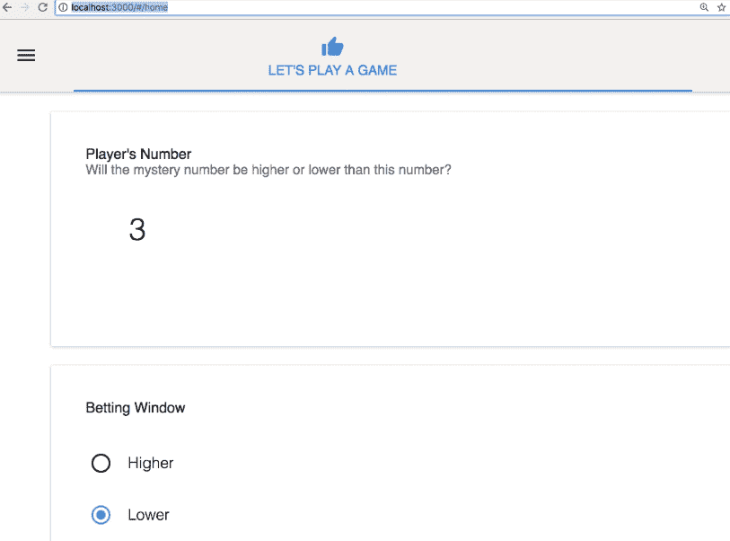

我们有带数字 3 的玩家号码窗口和下注窗口。

我们可以加入一个赌注，所以让我们继续这样做，然后单击让我们玩！因此，这立即将我们切换回可视代码，并触发我们设置的调试点。我们可以使用顶部的控件来播放到下一个调试点，或者单步执行每个函数。

当我们逐步执行每个函数时，您会看到这些函数的参数在调试窗口中开始实时填充它们的值。您也可以将鼠标悬停在代码窗口中的它们上面，会出现一个小的弹出窗口，告诉您所有相关信息。所以，你可以实时检查变量。

当我们从我们的`actions`对象到达我们的`playRound()`函数时，我们不想越过它，而是想进入它，通过那个函数跟随代码执行，这将我们带到我们的`actions-game.js`文件，在那里我们有返回`dispatch`参数的`playRound()`函数。然后我们将进入这个步骤，现在它已经准备好返回我们的 JSON 对象，这个对象将被发送到 reducer。

然后，我们用 switch 语句结束游戏缩减器的函数，如果我们将鼠标悬停在动作类型上，我们可以看到该变量的结果等于`Round_Results`。因此，我们将这些键值对分配给 Redux 存储。我们的 Redux 商店然后将这些更新的属性作为`props`推回到我们的游戏`index.js`文件，然后我们将返回到我们的浏览器，更新的历史填充历史窗格，如下面的截图所示:

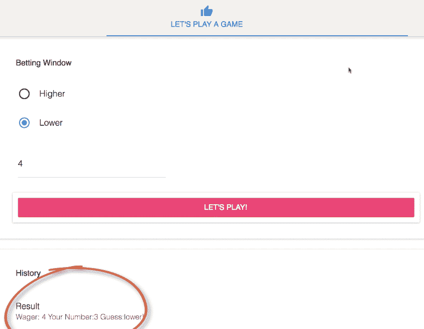

所以现在循环又回到了起点，我们的应用程序刚刚从 React 收到了新的`props`。那么，我们该如何运用这些技术呢？我们将通过使用另一种 React 生命周期方法`componentDidUpdate()`来实现。这是一个在新道具发送后触发的功能。它有一个参数叫做以前的道具或者`prevProps`，这样你就可以在刚刚收到的道具之前，参考一下是什么道具，确定自己是否需要回应。这非常重要，因为你的应用会一直收到新的道具，但并不是所有的道具都需要响应，所以我们将使用条件来识别我们关心的道具。

我们将比较前一个游戏对象的时间戳和当前游戏对象的时间戳；如果不同，我们知道我们收到了数组的一个新的历史项。在这种情况下，我们将复制当前的历史和状态，然后将数据从`props`游戏对象推送到它上面。完成后，我们将使用刚刚创建的新历史数组替换历史对象，现在我们将引用显示游戏历史的卡片。

请记住，我们映射了状态历史数组中的所有项目。React 将注意到我们刚刚更新了状态变量，并重新呈现该组件，使其更新并显示我们上一轮的结果。在这里，我们只是获取了游戏发送的参数，并立即调度它们，但这不是我们真正想要的。我们真正想要的是调用我们的智能契约，给它那些游戏参数，让它决定我们的玩家是赢了还是输了。要做到这一点，我们需要我们的行动来调用智能合同，然后等待那些结果。因此，在下一部分，我们将探索承诺，它们做什么，它们如何工作，以及我们将如何使用它们来与我们的以太坊网络通信。

# 在网络应用程序中实现 JavaScript 的承诺

在上一节中，我们看到了如何从游戏玩家那里获取输入，并通过 Redux 发送该输入来更新应用程序状态，然后刷新用户界面。但是正如我们在第一天学到的，当我们向以太坊网络提交一个调用时，我们没有得到立即的响应，并且有一个延迟。不幸的是，我们不能继续下去，直到我们有了回应，所以我们该怎么办？

在我们回答这个问题之前，让我给你看看潜在的问题是什么。它源于 JavaScript 的工作方式。让我们来看看这段代码:

```
console.log('1')
setTimeout(() => {console.log('2')}, 3000)
console.log('3')
setTimeout(() => {console.log('4')}, 1000)
```

在前面的代码中，我们有四行，每行打印出数字 1 到 4。当我们运行这个时会发生什么？如果您预测它会打印出 **1** 、 **3** 、 **4** 、 **2** ，那么您是对的，因为发生的事情是 JavaScript 执行第一行，它打印出数字 1，然后执行第二行。这一行是问题开始的地方，因为它执行了`setTimeout()`函数，但是不知道我们希望它等到计时器结束。所以它调用了`setTimeout()`函数，并移动到下一行，打印出 3，然后移动到最后一行，那里有另一个计时器。一秒钟后，它打印出数字 4，两秒钟后，当指定的 3000 毫秒延迟到期时，它最终打印出数字 2。

现在，想象一下，如果我们不是在控制台日志中写一个数字，而是实际上等待数据从我们的 Solidity 契约中返回，这样我们就可以在我们的应用程序中使用它，这难道不会导致问题吗，因为我们会在数据实际存在之前就试图使用它？那么，我们如何使用 JavaScript promises 来解决这个问题呢？

# 承诺是如何运作的

JavaScript 承诺是一个在未来产生价值或输出的对象，很像现实生活中的承诺。承诺可以有三种状态:

*   履行
*   拒绝
*   悬而未决的

我们将使用前面代码块中的场景作为示例来进一步理解这一点。

我们将创建一个新的函数，返回一个承诺来处理我们的延迟事件。一个承诺需要一个参数，这个函数需要两个参数，`resolve`和`reject`。在我们的承诺中，我们有我们的`setTimeout()`函数。下面的代码片段显示了我们如何使用承诺来解决前面的计时器问题:

```
function waitForMe (input, delay) {
    return new Promise ((resolve, reject) => {
        setTimeout(() => {
            resolve(input)
        }, delay)
    })
}
```

这个函数确保编译器一直等到计时器结束，打印出数字 2，然后继续打印数字 3。

大多数时候，它是不会立即返回的东西，比如在一个可靠契约上执行一个函数。当我们的`setTimeout`函数完成时，我们将调用`resolve()`函数，它是我们的 promise 参数之一；这表明承诺已经成功完成。同样，如果事情没有按计划进行，我们可以调用`reject`函数。

现在，我们可以重写我们的原始代码。我们的第一行保持不变，但是对于第二行，我们将使用`waitForMe()`函数并向其传递两个参数，即输入(`2`)和延迟(`3000`)。这确保了当函数被调用时，编译器等待三秒钟，然后打印出数字 2，最后，进入下一步。我们将像以前一样直接从控制台打印出 3，然后我们将对数字 4 再次使用相同的`waitForMe()`函数。下面的代码片段显示了修改后的代码:

```
console.log('1')
waitForMe('2', 3000).then(result => {console.log(result )
console.log('3')
waitForMe('4', 1000).then(result => {console.log(result )})
```

让我们快速回顾一下承诺。承诺提供某事将被做的保证，但不提供何时做的保证。与真正的承诺不同，JavaScript 承诺告诉你他们做了哪一件事，要么解决承诺以实现它，要么拒绝它以违背它。这允许你决定在任何一种情况下做什么。现在，我们准备解决在以太网上与我们的合同沟通的问题。

# 使用 Web3.js 与以太坊网络通信

前面，我们看到了如何从游戏玩家那里获取输入，并通过 Redux 发送这些输入来更新应用程序状态，然后刷新用户界面。在上一节中，我们学习了 JavaScript 承诺。现在，我们将学习这两者如何一起调用我们在契约中创建的函数。

我们将重新编写应用程序的`actions-game.js`文件中的`playRound()`函数。

我们将获取其中的调度功能，并将其移出到自己的功能中。然后，我们将从以太网获得一个契约实例，并创建一个调用契约中的函数并等待响应的承诺。当它得到响应时，它将调用我们新的调度函数。

首先，我们需要将一些新的依赖项导入到我们的应用程序中，比如来自 Truffle contracts 的`contract`库，来自`contract/Gaming.json`的`Gaming`文件，以及最后的`web3`库，如下面的代码片段所示:

```
import contract from 'truffle-contract'
import Gaming from '../../../build/contracts/Gaming.json'
import web3 from 'web3'
```

我们现在要修改我们的`playRound()`函数。

我们将把`dispatch`函数移动到两个新函数中，`dispatchRoundComplete()`和`dispatchRoundFailed()`。我们用一个名为`web3Provider`的常量替换它，这个常量来自我们在 Redux store 中的状态。然后，我们通过调用我们的`contract`库来声明我们的游戏契约，将它传递给我们契约的 JSON 表示。我们在这里做了一点设置；我们将合同的提供者设置为`web3Provider`中指定的提供者。这是元掩码被注入的地方，我们的应用程序会自动检测元掩码是否被注入并设置提供者。下面的截图显示了我们的`playRound()`函数现在的样子:

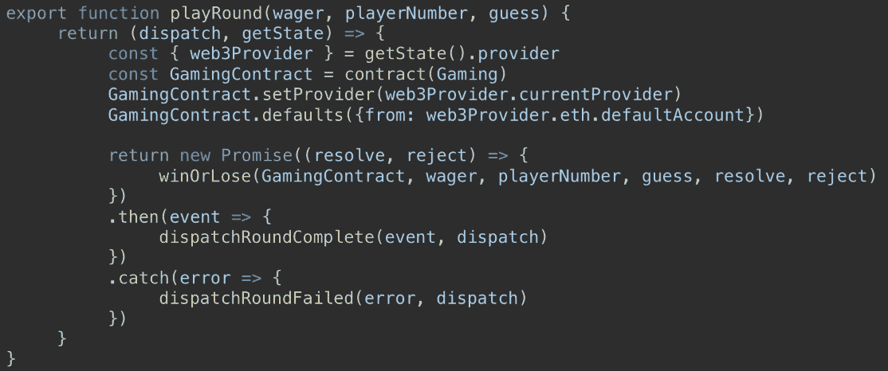

明天你会学到更多关于 MetaMask 的知识。MetaMask 允许您从不同的帐户中进行选择，就像我们在编写单元测试时所做的那样。使用`web3Provider.eth.defaultAccount`对象确保我们从当前选择的账户发送交易。我们创建一个新的承诺，并定义两个参数，`resolve`和`reject`。当以太坊契约中的函数调用完成时，我们将检查它的状态。如果成功，我们将调用 resolved 函数，如果失败，我们将调用 reject 函数。这样，当这个承诺回来时，我们就知道它是否成功了。在这个承诺中，我们称之为`winOrLose()`函数，这是一个新函数，但是您可能还记得它的名字。

让我们看一看，然后我们再回来看看前面的函数的其余部分发生了什么:

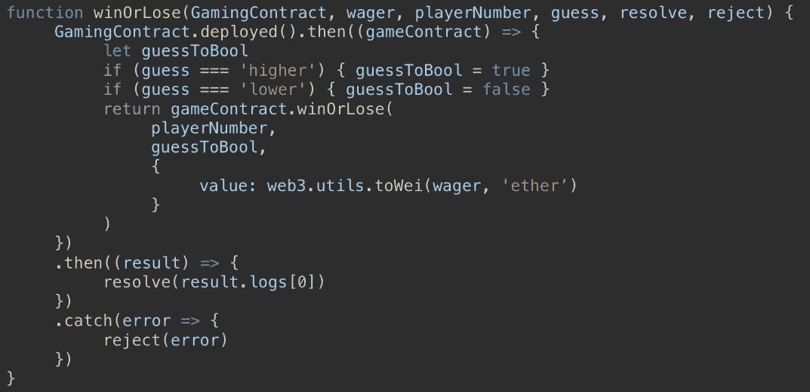

如果您认为函数名`winOrLose`听起来很熟悉，那么您是对的:这是我们在 Solidity 契约中创建的函数名。我在 React 应用程序中做的事情之一是给调用智能合约的函数起一个与它在智能合约中调用的函数相同的名字。所以，现在看看我们的 UI 代码，我们知道这将调用`winOrLose()`函数，它出现在我们的契约中。这只是帮助我们跟踪事物。

我们传递给这个函数的参数之一是`GamingContract`，它是我们一分钟前刚刚创建的在线合同的实例。它有一个返回承诺的`deployed`方法。它所做的是获得我们合同的部署版本，这意味着它获得了在以太网上与之通信所必需的信息。它会找出它在哪个网络上，它的部署地址是什么，以及如何与它通话。既然这是一个承诺，我们可以通过使用`then`来等待它完成；这意味着我们应该执行这段代码，并且每当它完成时，继续执行。

`gameContract.winOrLose()`函数是与我们的可靠性契约通信的实际函数。请记住，在 Solidity，我们总是与货币在**魏**面额。以太坊的大多数用户都熟悉**以太**的命名，因此在我们的 UI 中，我们允许他们在以太中下注，然后当我们将以太附加到我们的交易时，我们使用`web3`实用程序将以太转换为 Wei。这整个部署功能是另一个承诺。

当这完成时，我们转到`then`函数，将事务的结果作为名为`results`的变量传递。当它解析时，我们将调用`resolve`函数，我们在调用该函数时将它作为参数传入。在这个函数中，我们将返回`result.logs[0]`，这看起来非常具体。让我们来看看发生了什么:

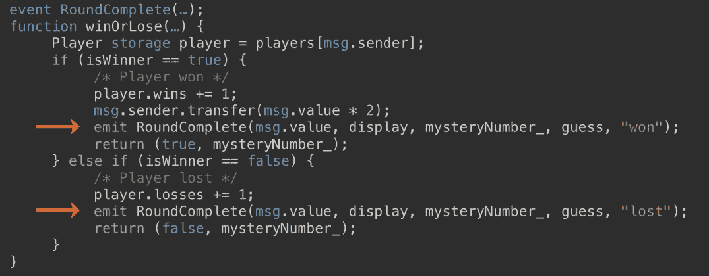

这是我们可靠性合同的核心部分。我在前面的图片中突出了两条特定的线，这就是我们现在要看的。当我们的玩家赢了或输了，我们发出`RoundComplete()`事件并提供交易的细节，赢了或输了多少钱，显示给玩家的数字，由我们的合同产生的神秘数字，玩家对更高或更低的猜测，以及他们是赢了还是输了这一轮。请记住，事件是在事务被写入区块链时发出的。下面的屏幕截图显示了我们从交易中获得的实际结果:

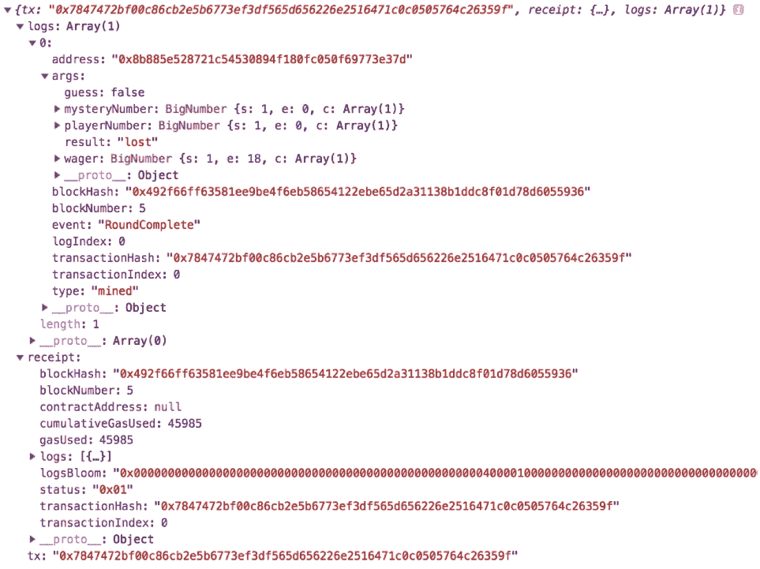

这里有很多，所以让我们来看看日志数组。数组中的第 0 项有一个`args`键，如果你仔细观察它，你会发现它是我们发出的事件，包含了我们为玩家刷新 UI 所需的所有细节。所以，当我们解析这个函数时，我们去掉所有东西，只把这个键返回给我们的`resolve`函数。

`winOrLose()`函数的最后一部分是一个`catch`语句，如果承诺中的任何内容失败，就会执行这个语句。当这种情况发生时，我们捕捉错误，并使用`reject`函数将其发送回我们最初的承诺，这又将我们带回到了`playRound()`函数。根据我们是调用`resolve`还是`reject`函数，我们将执行`then`函数还是`catch`函数。

当它成功解析时，我们从包含我们事件的日志中返回该对象，并将它传递给另一个新函数`dispatchRoundComplete()`，并调用我们的参数 event。您可能对该功能很熟悉:它是我们在上一节中创建的派单，但我们对它做了一点修改，如下图所示:

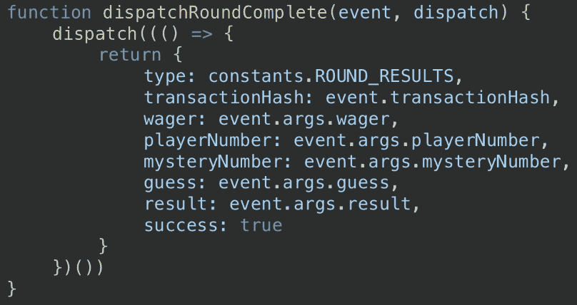

我们仍然有相同的类型，但是我们换出了时间戳键并用`transactionHash.`代替了它。这个字段存在的原因是因为我们映射了 UI 中的数组来填充游戏历史表。React 要求数组中的每个元素都有一个惟一的键，所以当它更新时，它确切地知道应该更新哪个元素。

以前，我们没有唯一的键，所以我只是在上面添加了一个时间戳作为唯一的值，但是现在我们已经获得了事务的事务散列，它绝对保证是唯一的，所以我们不再需要那个时间戳了。我们已经有了赌注和玩家号码，我们还添加了玩家下注的神秘号码。然后我们知道了他们的猜测和这一轮的结果。

这里我们还有一个 boolean `success`键，我们可以用它来切换这个事务是否成功。当承诺成功完成时，我们将`success`设置为`true`，如果承诺被拒绝，那么调度回合失败函数将`success`设置为`false`。我们的 dispatch 的行为和以前一样，通知 reducer 执行 dispatch 操作并将其发送到 Redux store，Redux store 现在将通过一个新的`props`文件通知我们的 UI，我们将在下一节中使用它来更新用户界面。

# 在用户界面中实现 JavaScript 函数

至此，您已经看到了如何从 UI 上的用户控件获取输入，在 Redux 生命周期中处理它们，并让最终产品作为新道具重新出现在 UI 中。在这一节中，我们将深入研究 UI 中与用户控件相关的功能。

当我们的 reducer 接收到来自`dispatch`函数的动作时，它会创建这个对象并将其发送到 Redux 存储，它会与我们的应用程序可能拥有的所有其他 reducer 一起这样做，因此我们有一个组合所有这些 reducer 的`rootReducer`常量。下面的截图显示了这是什么样子:

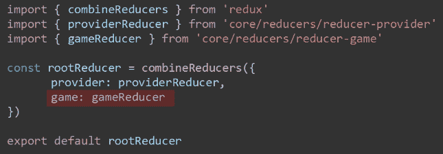

在这里，您可以看到我们在`rootReducer`中定义了一个名为`game`的新键，它将被来自`gameReducer.`的数据填充。这是发送到 Redux store 的数据，我们知道 Redux store 将把它作为`props`发送到我们的组件中。因此，在我们的游戏 UI 的 JavaScript 文件中，我们有这个函数`mapStateToProps()`，正如你从名字中可以猜到的，这是将 Redux 状态映射到组件中的道具的函数。

因此，我们发送到 Redux 存储的所有值都可以在我们的组件中访问和读取，如下所示:

```
this.props.game.wager
this.props.game.playerNumber
this.props.game.mysteryNumber
```

所有道具都是只读的，不能更改。我们将在一分钟内看看如何改变它们，但是当它们在后端改变时呢？如果 Redux 存储中这些键的值发生变化，我们的 UI 如何更新？

嗯，取决于你用的是 React 15 还是 React 16，有两种方法你可以用，两者行为相似，但是你可以从名字看出来，它们在不同的时间触发。在 React 16 中，我们使用`componentDidUpdate()`，它接收一个名为`prevProps`的参数，该参数允许我们将道具的值与它们之前的值进行比较，然后采取相应的行动。在 React 15 中，我们将使用`componentWillReceiveProps()`，它在组件接收新属性之前触发。参数名也反映了这一点。这是一个名为`nextProps`的参数，它包含了属性的新的传入值。你可以在 React 16 中使用`componentWillReceiveProps()`，所以如果你正在将现有的 React 15 应用升级到 React 16，这仍然可以工作。

在 React 的下一个版本中，`componentWillReceiveProps()`将被标记为 deprecated，然后在之后的版本中被删除。当我们将这些函数添加到组件中时，我们需要评估它被调用的原因。它会被很多你不关心的东西调用，所以你需要评估条件，看看你是否关心它。让我们看看下面的例子:

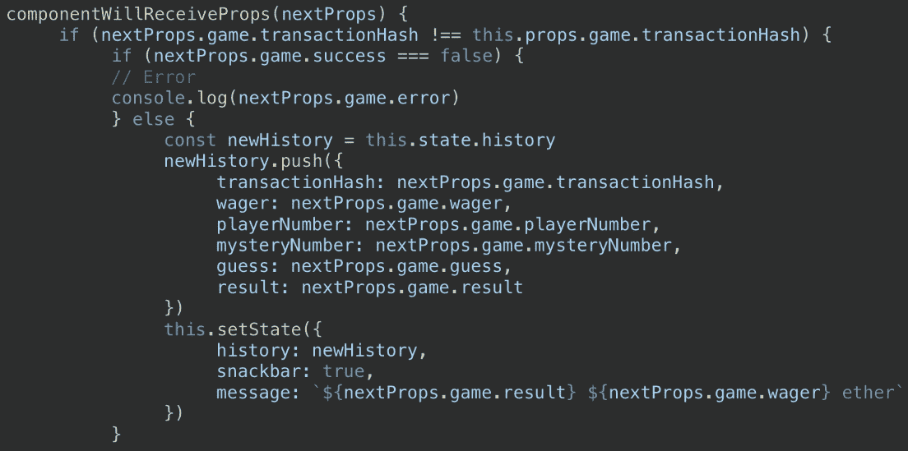

我们将从一个`if`语句开始，该语句检查来自`nextProps`参数的`game.transactionHash`是否与`this.props`中的不同。如果它告诉我们，我们有一个新的交易散列，因为交易散列是特定于一个交易的，我们知道玩家已经完成了一轮游戏。接下来，我们设置我们的`success`键；请记住，如果包装我们的合同交易的承诺成功完成，这是我们设置为`true`的键，如果承诺被拒绝，我们设置为`false`。如果需要的话，这给了我们一个传递错误消息的机会。如果我们的承诺成功兑现，那么我们将有一些新的交易细节添加到我们的游戏历史窗口。我将游戏历史作为数组存储在组件状态中。

因此，让我们为我们的历史创建一个新的变量，然后我们将把我们最近一次交易的所有细节都推送到这个数组中。我们不能直接更新组件状态，所以我们调用`this.setState`并将`history`值设置为我们刚刚创建的新历史数组。最后我们得到了一个`snackbar`控件，这是一个有点烤面包机风格的弹出控件，它的值也存储在组件状态中，所以我们可以更新它们并给它们赋值。

当渲染时，它将翻译成一个句子，类似于 **lost ten ether** 或任何正确的值，并将该回合的结果添加到历史窗口，如下面的屏幕截图所示:

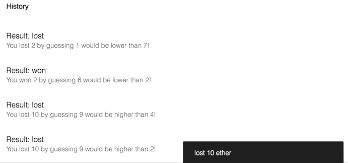

除了更新状态变量，我们不需要做任何事情来让我们的 UI 组件处理页面上的更新，因为我们将控件绑定到了状态变量。React 知道在它们改变时重新渲染它们。因为 React 只想呈现变化的变量，所以在映射历史数组时拥有这个键很重要。该键允许 React 惟一地标识数组中的每一项，并且只呈现已经更改的项。现在，到了我们今天的最后一部分，作业。

# 分配

好吧！是时候把我们今天学到的东西付诸行动了。这项作业将强化我们在使用 React 和 Redux 进行状态管理时学到的概念，以及处理潜在网络请求的承诺。您将向我们的游戏 UI 添加一个记分牌，它将反映玩家的当前记录，如下面的屏幕截图所示:

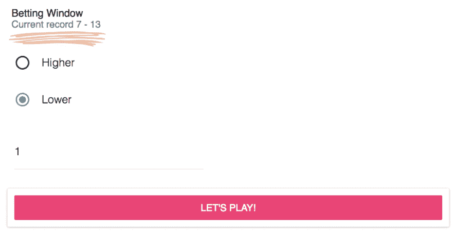

您可以在页面上创建一个新组件来显示它，也可以将它内联添加到与前面的组件类似的现有组件中。现在，回想一下第二天，我们为我们的播放器创建了一个结构体来保存这些信息，我们还创建了一个映射来将播放器地址映射到结构体。请记住，公共变量和 Solidity 带有一个免费的 getter 函数，如果该变量是一个映射，那么映射键就是一个必需的参数。

在我们的例子中，这是我们玩家的地址。有多种方法可以解决这个问题，所以只要你的解决方案满足每次玩家分数变化时都更新的标准，这就是一个很好的解决方案。如果是我，我会在我们的代码中寻找一些已经在做的地方，因为分数已经改变了。您可能会在下面的代码片段中找到一些灵感:

```
componentWillReceiveProps (nextProps) {
    if (nextProps.game.transactionHash !==
    this.props.game.transactionHash) {
        if (nextProps.game.success == false){
            console.log(nextProps.game.error)
        }else {
            const newHistory = this.state.history
            newHistory.push({
            transactionHash: nextProps.game.transactionHash;
            wager: nextProps.game.wager;
            playerNumber: nextProps.game.mysteryNumber;
            guess: nextProps.game.guess;
            result: nextProps.game.result
        })  
        this.setState({
            history: newHistory,
            snackbar: true,
            message: '${nextProps.game.result}
                    ${nextProps.game.wager} ether'    
        })

    }
}
```

您可以使用前面的代码块，并使用应用程序中已经存在的代码遵循模式和示例。您从 UI 调用一个动作，该动作将返回一个调用包含我们的统计数据的 Solidity 函数的承诺；该承诺将得到解决，然后我们可以调度我们的契约函数结果，将它们发送到一个 Redux store，Redux store 将更新呈现给 UI 的道具，UI 将更新以反映新的道具。

你明天才能完成这个家庭作业，因为我们缺少一部分来测试它，但是今天一定要写代码，我们明天会检查剩下的部分，因为你需要一个钱包来测试它。

# 摘要

在这一章中，我们学习了所有关于应用程序 UI 的实现。我们学习了如何使用 React 创建我们的 UI，以及 JavaScript 如何在 DApp 中扮演重要角色。我们学习了如何从模板中创建 React 应用程序并应用它们，以及如何修改应用程序中的各种状态，以便一切按预期运行。我们学习了如何获取用户输入并向他们提供反馈，以及如何使用 Web3.js 将这些动作传达给以太坊网络。最后，我们学习了如何将所有功能部署到 React UI 中。

在下一章中，我们将学习不同类型的可用钱包，以及如何配置元掩码来配合我们的应用程序。