# 第六天——使用钱包

欢迎来到第六天。今天，我们将实现区块链应用程序的最后也是最关键的部分，钱包。钱包不仅为我们的游戏玩家提供了存储资金的地方，还提供了发送和接收这些资金的方式，以及加密签名的交易，确保我们可以验证这些资金和交易来自该钱包。

本章将作为开始这个项目的踏脚石，包括以下主题:

*   了解钱包和安全性
*   钱包介绍
*   MetaMask
*   了解气价和气限
*   查看以太网上的区块链交易
*   了解在线和离线钱包
*   注入 Web3 提供程序

# 了解钱包和安全性

今天我们来看一个典型的网上交易。消费者将访问一个网站，他们将在购物车中添加一些商品，然后启动结账流程。他们必须在网站上输入他们的信用卡号，但是信用卡号会发生什么:它被安全地发送到服务器了吗？并且，商家要存储那个信用卡号吗？如果是，他们是否遵循了良好的安全实践？还有，现在谁能接触到那个号码，因为任何有那个卡号的人都可以使用？嗯，我们有处理所有这些的机制，如果发生什么事情，大多数商家和发卡机构会与你合作解决问题，但这不是出于他们的好心；您每天都在以费用和交易成本的形式为这项服务付费:

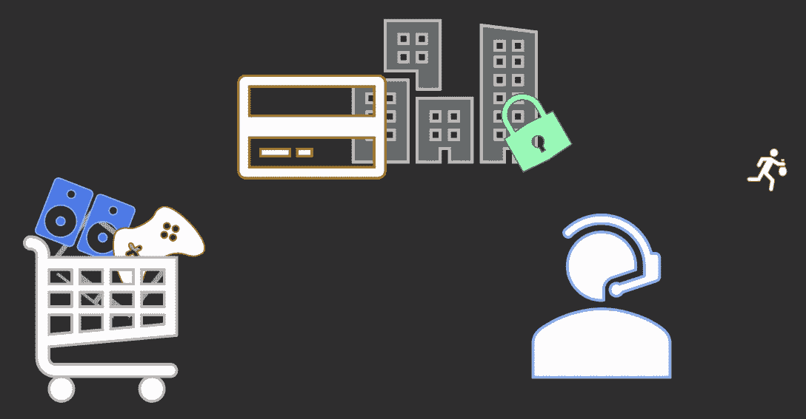

让我们用区块链技术来看看同样的交易。购物过程看起来是一样的。您将物品添加到购物车中，然后开始结账过程，但是当您结账时，您没有输入信用卡号，而是使用您的钱包对包含购买说明的交易进行加密签名。那么，安全完成了吗？希望是这样，但如果不是这样，那真的没关系，因为您发送的只是一份带有购买细节的已签署交易，如果有人中途拦截并更改了该交易，该签名将不再有效。

那么，存储细节呢？当然，商家可以存储它们，它们也将被存储在公共区块链上，这没关系，因为这只是交易的细节；没有任何东西可以用来创建额外的事务。那么，商家的安全措施呢？好吧，你与之互动的合同是在公共区块链上，在那里它可以被安全地查看和审计，最后你的私钥从未离开过你的钱包，所以你的账户被用来创建恶意交易的唯一方式是如果你失去了对私钥的控制。因此，没有第三方向您收取帐户维护和监控费用:

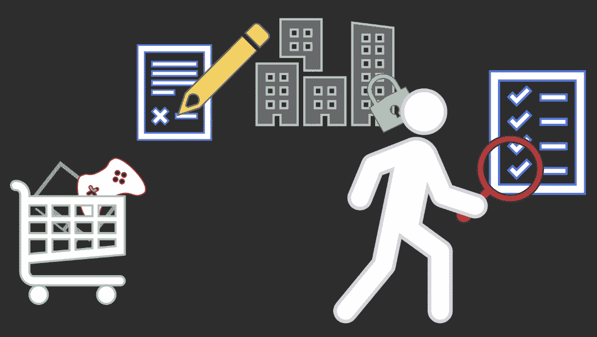

# 钱包介绍

钱包是一个存储公钥和私钥的软件程序，允许您与区块链交互以签署交易，这些交易可能包括发送和接收货币，或执行智能合同。他们实际上不储存任何货币。他们只能查询与该地址相关的区块链交易。

让我们花点时间来讨论一下公钥和私钥，因为这是一个需要理解的重要概念，因为如果您泄露了您的私钥，您就泄露了与之相关的所有东西。每个钱包都有一个私钥和一个公钥:把公钥想象成你家的街道地址，把私钥想象成可以打开邮箱的钥匙。任何人都可以使用您的公钥向您的邮箱发送邮件，但是只有拥有私钥的人才能解锁邮箱:

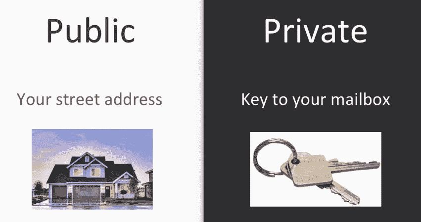

我们再抛出几个这样的类比，然后总结一个重点。您的电子邮件地址是公开的，您的电子邮件帐户的密码是私人的:

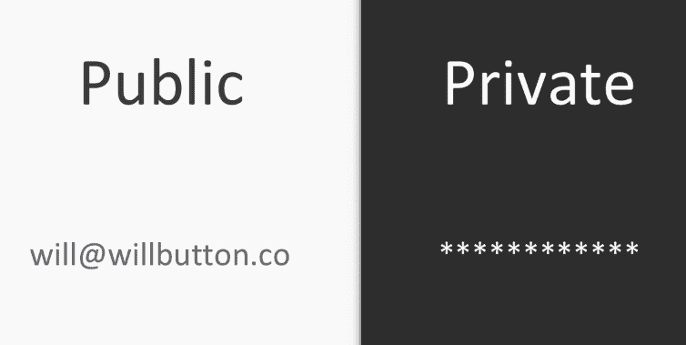

您的银行信息相对公开，但您必须提供某种形式的身份证明才能使用它:

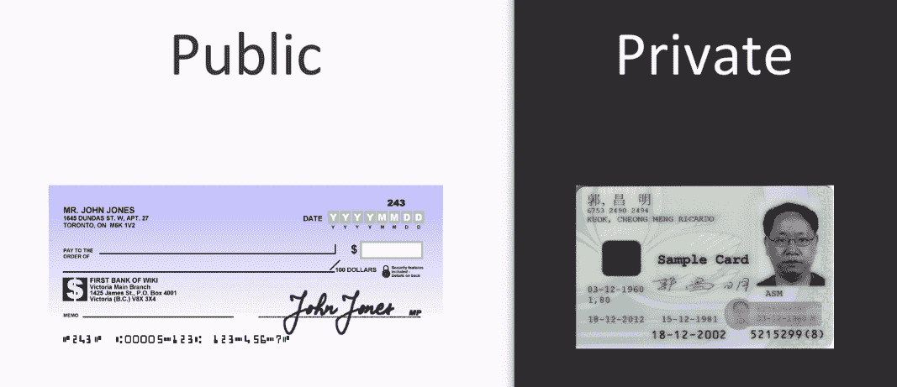

你的车是公开可见的，但你必须有钥匙才能打开它；也许那辆车是个不好的例子，你知道那可能不是它的正确钥匙，但我的观点仍然有效:

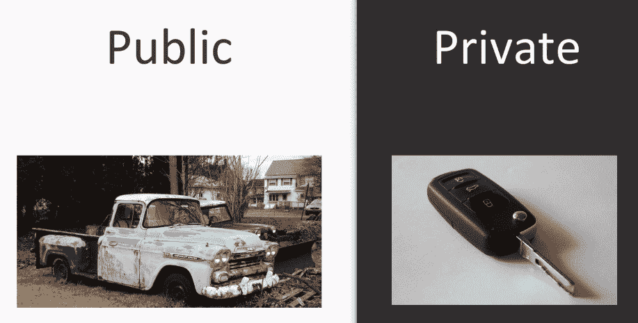

在所有这些情况下，如果您丢失了您的私钥，您可以通过打电话给锁匠、与技术支持人员交谈或者去银行获得一张新的借记卡来重新获得您的资产。然而，在区块链技术公司，如果你丢失了私钥，那就完了；根本没有办法恢复丢失的私钥，这是有意为之。任何情况下，一旦丢失，你可以重新获得访问权限，是因为在某个地方有一个仍然可以访问的中间人，无论是银行、锁匠还是电子邮件提供商，你为这种便利付费。在区块链，没有中间人，你自己负责自己的账户；这种所有权的好处是，除非你允许，否则你的帐户不会被黑客攻击，而且你不用为了方便使用你的钱而支付第三方交易费。

# 钱包的类型

有不同类型的钱包可供选择:

*   **桌面钱包**:这个钱包是下载并安装在你的电脑上的，只能从下载它的电脑上访问。它的安全性非常高，但是如果你被黑客攻击或者感染了病毒，它就很容易受到攻击。MetaMask 就是桌面钱包的一个例子，我们今天将更多地使用它。
*   在线钱包:这种钱包运行在第三方服务器上，使用起来非常方便。私人密钥由钱包提供商在线存储，并由第三方控制。比特币基地是一个非常受欢迎的在线钱包提供商。
*   手机钱包:这种钱包是作为一款应用程序安装在你的手机上的，它们对于支付非常有用，比如在零售店。大多数时候，由于手机可用空间有限，它们的功能比桌面钱包少。菌丝体是一个非常流行的移动钱包的例子。
*   硬件钱包:这种钱包将私钥存储在硬件本身上，它们具有非常高的安全性，高到你甚至可以在被感染的电脑上使用硬件钱包。现在，您仍然需要一个备份，以防硬件出现故障。账本 nano 是硬件钱包的一个例子。
*   纸钱包:这种钱包真的很容易使用，而且安全性很高，因为没有什么技术会失败。而且，它真的只是一张纸；一会儿我会告诉你这是如何工作的。

嗯，哪个钱包最适合你？答案是，这取决于你想要完成什么。在本书中，我们将使用元掩码，因为它提供了安全性和易用性的完美平衡。就我个人而言，我使用多个钱包，每个钱包都有不同的作用。我在手机上有一个移动钱包，里面只有一点点货币，我可以用它来进行即时交易，我还有一个硬件钱包，我在那里存储了大量的加密货币；我把它锁在一个防火保险箱里，用一个纸质钱包备份，存放在一个单独的实体建筑里，这样，如果它发生了什么事，我仍然有办法获得这些资金。好了，现在你已经了解了什么是钱包以及如何使用钱包，让我们跳到下一节，为这本书的最后一部分配置我们的钱包。

# MetaMask

我们使用 MetaMask 作为钱包与我们的 DApp 进行交互。我们将学习如何安装和配置它；首先，让我们回顾一下 MetaMask 的一些要点。

MetaMask 将 Google Chrome、Firefox、Opera 和 Brave 变成了以太坊浏览器。它允许网站从区块链检索信息，并允许用户安全地签署交易。帐户信息存储在安装 MetaMask 的本地，并在硬盘上加密。我们今天最感兴趣的特性是它允许浏览器与以太坊应用程序进行交互。每笔交易都会提示用户确认并签署交易。

以下步骤将帮助您安装和配置它:

1.  让我们访问网站，[https://metamask.io/](https://metamask.io/)，并点击链接获得 CHROME 扩展。现在，如果你使用不同的浏览器，如 Firefox、Opera 或 Brave，你会想点击这些浏览器的链接。看一下下面的截图:

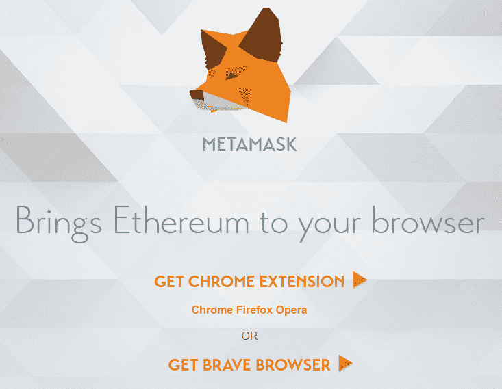

2.  现在，它将开放 chrome 网络商店。点击添加到 Chrome 按钮:

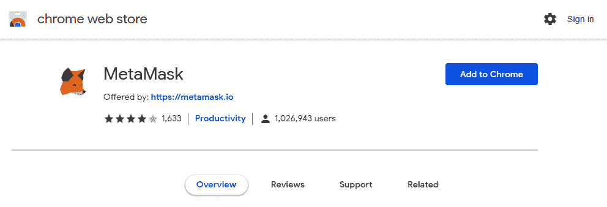

3.  这将在工具栏上添加元掩码图标，当我们单击该图标时，它将为元掩码打开一个新的选项卡:


4.  现在，点击继续按钮，您可以创建一个新帐户:

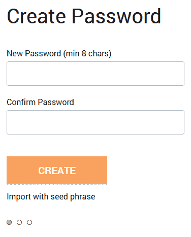

5.  现在，我们将实际导入一个种子短语，因为我们将连接到本地 Ganache 安装。所以在这里，我们切换到 Ganache 并复制这个种子短语:

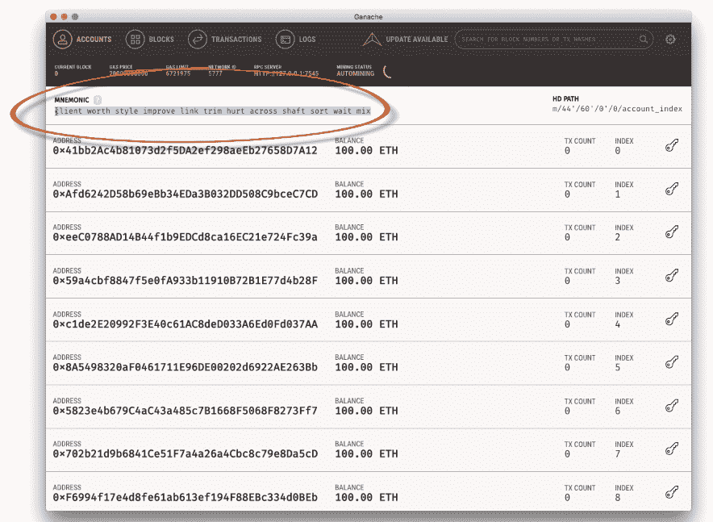

6.  单击导入种子短语链接:


7.  将种子短语粘贴到 Wallet 种子字段，创建新密码，然后单击导入按钮:


现在，我们必须接受使用条款和隐私声明，然后有一个他们希望您阅读的网络钓鱼警告，因为有许多攻击试图劫持元掩码来控制私钥。

8.  现在，MetaMask 连接上了，它把我们连接到主以太网上；但是，我们希望连接到本地 Ganache 安装，因此我们将在此处选择网络下拉菜单，您可以看到一些不同的选项:

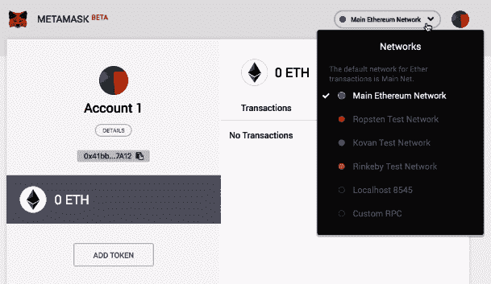

这里，对于我们所连接的主网络，以及一些测试网络，如 Ropsten、Kovan 和 Rinkeby，让我们使用一个定制的 RPC。

9.  如果我们切换回 Ganache，您可以看到 RPC 服务器地址:

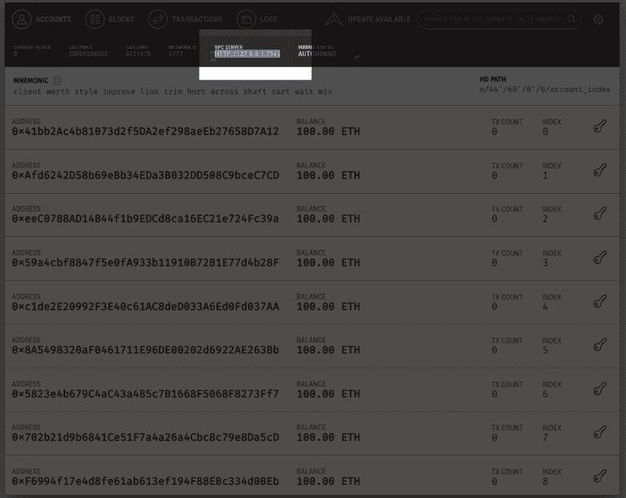

10.  因此，将其复制并粘贴到新的 RPC URL 字段中，然后单击保存:

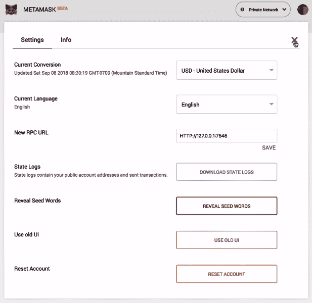

11.  关闭设置窗口，现在连接到 Ganache。您可以看到通过 Ganache 提供的 100 ETH:

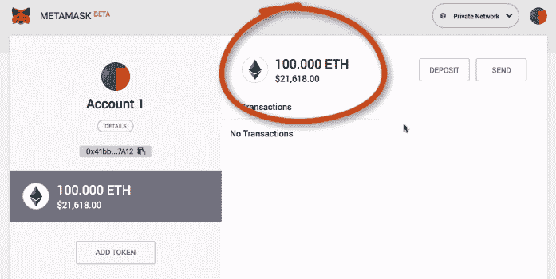

12.  我们还可以深入了解帐户 1 的详细信息，并给它取一个有意义的名称，这样无论何时我们查看帐户列表，它都有一些我们无法识别的内容:

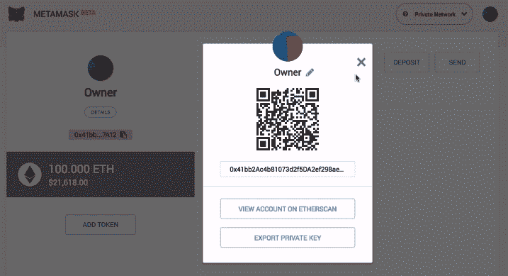

13.  我们还可以单击顶部的，创建一个新帐户，如下面的屏幕截图所示:

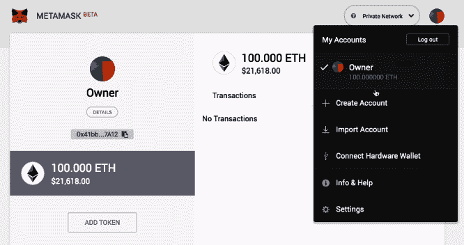

14.  让我们给它一个名字，点击创建，现在看看发生了什么。以太坊的地址就在这里，以 C7CD 结尾:

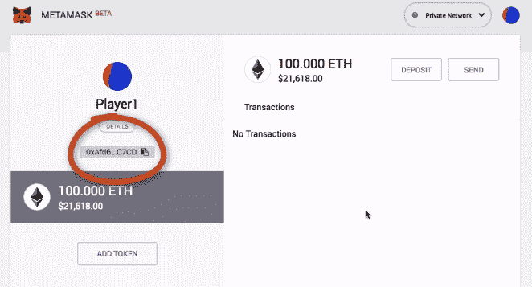

15.  因此，如果我们切换回 Ganache，我们可以看到第二个帐户是由 Ganache 提供的，因此以这种方式使用本地连接到 Ganache 的元掩码允许我们使用 Ganache 安装中列出的所有帐户:

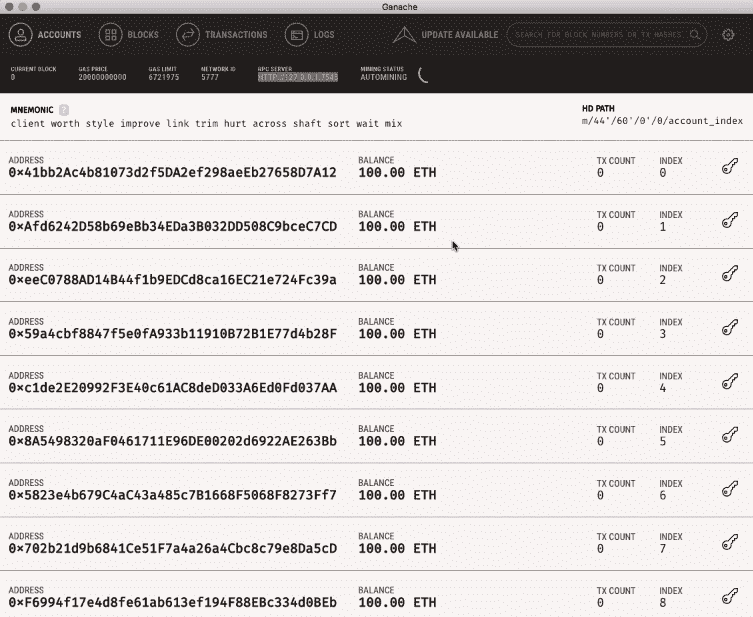

16.  既然我们在这里，我们就要把钱从 Player1 的账户转到 Owner 的账户，然后把金额作为 15 ETH 点击下一步按钮并确认交易:

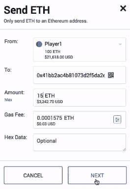

下面的屏幕截图显示了反映汇款加上交易费或汽油费的余额:

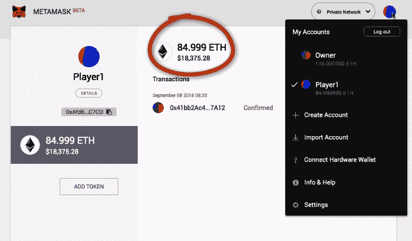

如果我们切换到所有者帐户，则第 15 个 ETH 已添加到那里，总数为 115 个 ETH:

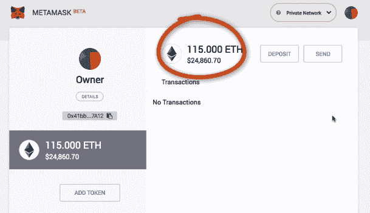

17.  如果我们回到 Ganache，您可以看到平衡反映在 Ganache 网络本身中:

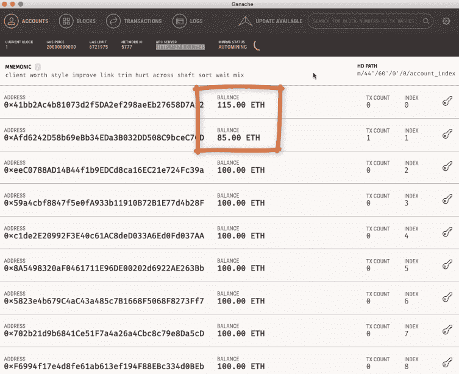

现在我们已经安装了 MetaMask，我们可以创建并签署玩游戏所需的事务。这其中有一些微妙的东西，比如气体，这一开始并没有任何意义:气体和以太坊交易有什么关系？我们将在下一节中找到答案。

# 了解天然气价格和天然气限制

本周早些时候，我们了解到我们的智能合约功能运行在**以太坊虚拟机** ( **EVM** )中。这个概念的有趣之处在于，你的事务、函数和代码运行在计算机上，而不是你的。这给了你无限可伸缩性的概念，对吗？好吧，令人惊讶的是，这不是免费的。这就像如果你租了你居住或工作的地方，并且你为这样做的能力付钱给房东，同样当我们的合同在以太坊网络上的 EVM 执行时，我们必须为我们使用的计算资源付费。这就是所谓的**气体**。

在传统应用程序中，您要么托管自己的数据库服务器，要么利用第三方 SAS 应用程序，并且您需要自己支付费用。然而，在以太坊交易中，用户为此付费，因为他们是执行交易的人，即使你可能是受益者:

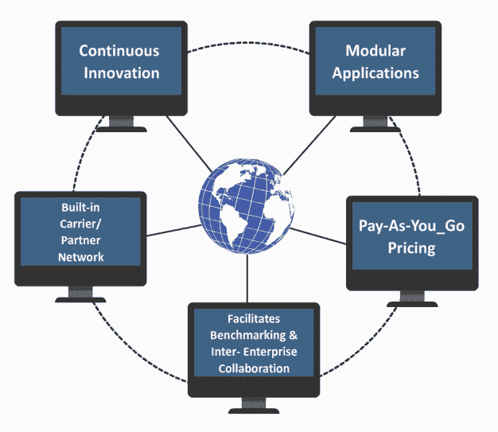

# 以太网气体

这可以被认为类似于交易费，但它不是一个统一的费率，这是因为我们为在区块链上执行交易所需的计算能力付费。这种交易可以是简单的货币转账，也可以是合同中内置的复杂业务逻辑处理，每种情况下的计算能力不同，因此支付的天然气价格也不同。

# 天然气价格

使用的天然气量被跟踪，然后以乙醚的形式支付给矿工，这就为我们带来了天然气价格。汽油价格是你愿意为消耗的每单位汽油支付的乙醚量；你可以将其设置为任何你想要的，同样，矿工可以选择忽略任何低于他们设定的天然气价格的交易，这使他们能够跳过处理任何对他们来说没有利润的交易。如果你把天然气价格定得太低，矿商就会忽视它，你的交易永远不会得到确认，也不会被写入区块链。

以下步骤向您展示了这实际上是什么样子:

1.  让我们把乙醚从一个帐户转到另一个帐户:

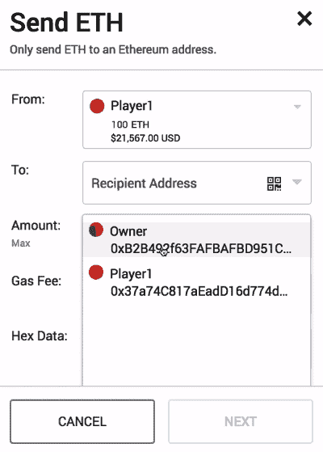

2.  进入这里的“汽油费”部分，将汽油价格一直降到 1 并确认:

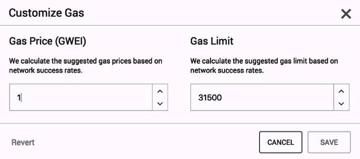

3.  在这里，您可以看到它已经提交，但实际上还没有得到确认:

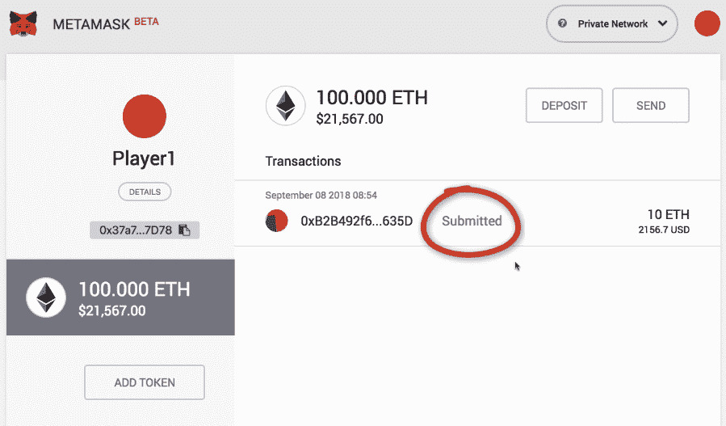

而且，它实际上会保持这种提交状态，因为没有矿工会选择它，因为天然气价格低于他们愿意接受的价格。如果我们单击 MetaMask 图标，然后转到这里的交易，它实际上会告诉我，如果我想让该交易有更好的成功机会，我可以提高汽油价格。那么，你应该把汽油价格定在多少呢？嗯，MetaMask 实际上在估计天然气价格方面做得很好，您应该在这里设置一个公允的价值，因为天然气价格乘以天然气成本就是您将为交易支付的金额。

如果你把油价定得太低，就像我们刚刚看到的，没有人会处理你的交易，如果你把油价定得太高，你将支付太多的交易费用。还有一个油量限制，那就是你的交易可以消耗的最大油量。所以，实际上可以把这个设置得更高，因为你只为实际完成的工作付费；如果您设置了较高的汽油限额，但汽油并未全部用完，剩余的汽油将退还给您，但如果您达到了交易的汽油限额，并且您的交易中还有更多工作要做，您将用完汽油，这将被视为失败的交易。所以现在，矿工实际上做了你要求的工作，当他们达到你说你愿意花费的最大气体量时，他们停止了工作；结果，交易失败了，你也拿不回油钱，因为他们做了他们说要做的工作。

所以，实际上有一个非常酷的网站叫做 [eth 加油站信息](https://ethgasstation.info/)，你可以用它来查看当前的油价。利用这一点，你可以很好地了解你应该为天然气支付多少钱，以及矿工需要多长时间来确认你在该价格下的交易:

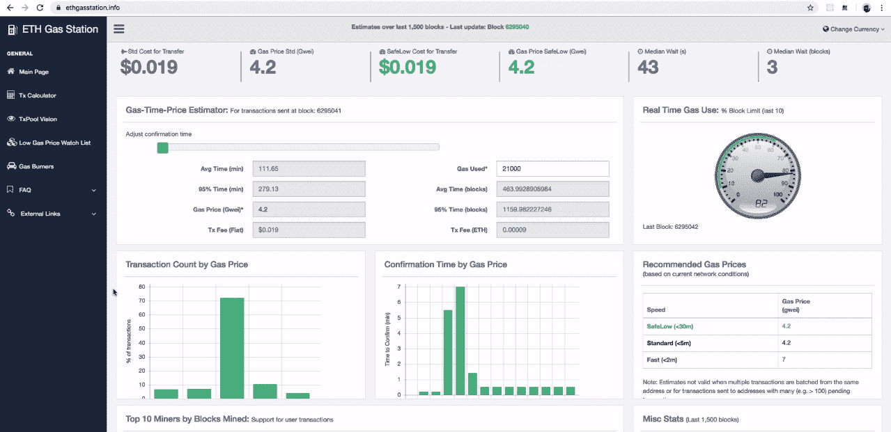

现在，我们可以成功地进行交易，并且可以做出良好的财务决策来控制成本，但是在我发送交易后会发生什么呢？一切都好吗？嗯，可能是也可能不是。在下一节中，让我们通过验证以太坊网络上的区块链交易来学习如何区分两者。

# 查看以太网上的区块链交易

嗯，我们看到了如何使用钱包签署交易，现在我们知道了什么是汽油，汽油价格和汽油限额，但仍然有一点问题。比方说，我以 10 以太的价格卖了一些东西，但是买家把他们的汽油价格定得太低了，所以我永远也不会得到这笔交易。我们在上一节中看到，买家将在他们的钱包中看到交易尚未确认，但我呢？我如何确定这笔交易会成功？嗯，我可以使用网站 [etherscan.io](https://etherscan.io/) 查看交易的区块高度。块高度是写入区块链的块数，因为块包含您的事务。

让我们后退一步，回顾一下区块链是如何工作的。因此，事务由矿工验证，然后写入一个块，随后的块被写入该块的末尾，包含您的事务的块之后的块数称为**块高度**。块高度越大，您的事务被恢复的可能性就越小。目前每 12 到 15 秒挖掘一次区块，所以不需要很长时间就能得到一些确认。不过，对于大宗交易，建议您在认为交易成功之前等待至少六次确认。

让我们来看看以太坊区块链上的其他一些信息，只需使用我们的交易 ID。现在，这是来自网站 [etherscan.io](https://etherscan.io/) ，这是一个以太坊块浏览器。在这里，您可以通过以太坊地址、事务哈希、块和一些其他参数进行搜索:

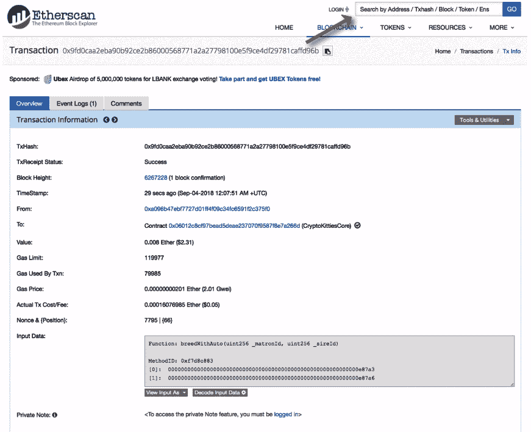

我用这个做的事情之一是追踪一笔交易。例如，我们知道以太坊网络上的每笔交易都会产生一个唯一的交易 ID，我们可以输入该 ID 并查看交易的详细信息。我们已经获得了事务状态，无论它是成功还是失败，块高度(您现在知道自从该事务被包括在区块链中以来已经写入了多少块)，并且我们已经知道它来自谁以及它去往谁；在本例中，交易针对 CryptoKiddiesCore 合同，我们还可以看到发送了多少乙醚、气体限制、使用的气体、气体价格和成本:

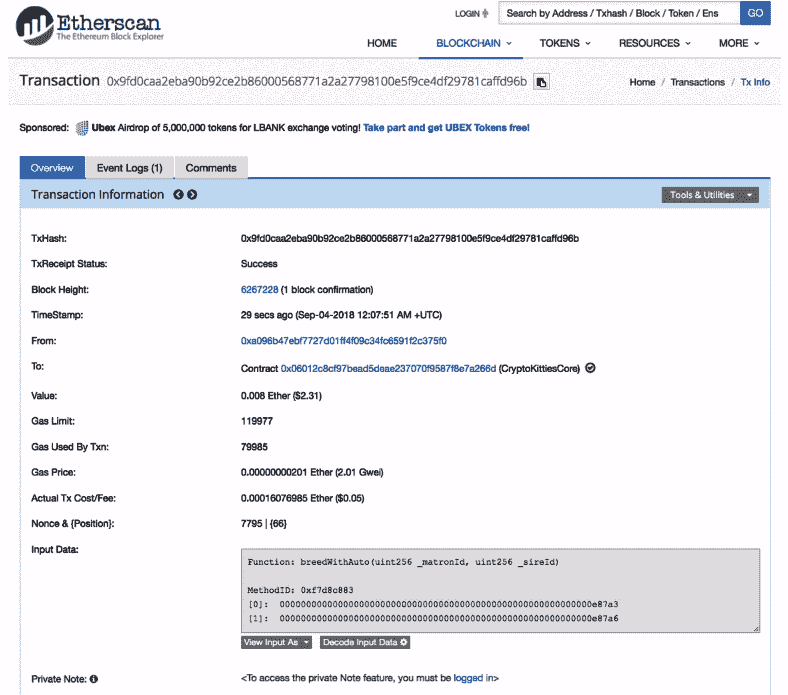

这里有一个有趣的事情:每个以太坊地址都是一个超链接，所以我可以为 CryptoKiddiesCore 合同点击这个链接，并查看针对该合同的所有交易。我可以看到合同余额、合同所有者，甚至 ERC 20 和 ERC 721 代币，以及合同代码本身:

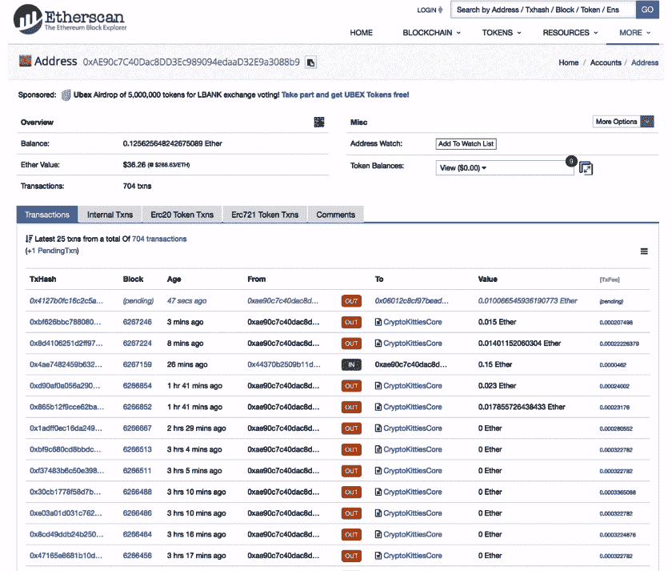

您还可以单击向合同发送交易的任何地址，查看从该地址进行的所有其他交易。这就是为什么以太坊被称为假名，而不是匿名；所有交易都是公开的，但我们不知道这个人的真实身份。Etherscan 也有针对通用测试网络 Ropsten、Kovan 和 Rinkeby 的网站，这使得它在您排除本地 Ganache 网络之外的事务时非常有用。有了这些信息，你就能够在对交易采取行动之前，验证以太坊网络上的任何交易是否有效并得到确认。现在，让我们更深入地了解一下线下和线上钱包，这样你就能更好地理解它们的工作原理。

# 了解在线和离线钱包

在这一部分中，我们将了解在线和离线钱包，因为这是一个非常令人困惑的概念，在我把你送到这个世界上成为一名区块链开发者之前，我想确保你对它有一个坚实的理解。

# 分布式分类帐

我想引用一个在区块链使用的术语来描述这项技术，分布式账本，特别是“账本”这个词莱杰的不是新的；它们已经存在了几个世纪，用来记录人与人之间的交易，它们只是交易的书面描述，钱来自谁，给了谁，多少钱。通过查看这个分类账，你可以确切地看到 1836 年在这个摄影行业发生了什么，如果这个人把所有记录在这里的钱都放在同一个钱包里，我们就可以从这个分类账中准确地知道在任何一天他们的钱包里有多少钱:

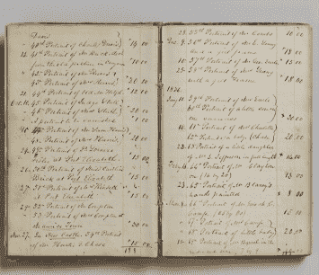

# 多重分类帐

区块链是一个分散的账本，这意味着我们不是一个破旧的小笔记本，而是在世界各地的电脑上存储着这个账本的多个数字副本。您可以向该分类帐写入新条目的唯一方法是，如果您有私钥来为您的帐户签署交易。这个分类帐的保管者，即矿工，不知道你的私钥，但是他们可以使用你的公钥来验证来自你的签名:


# 纸质钱包

您的钱包是保存您的私钥的技术部件，并且该技术部件可以像一张纸一样简单，因为您进行交易所需要的只是您的钱包的种子短语。您已经看到了如何使用元掩码来实现这一点，因此您完全可以将种子短语离线保存在一张纸上，在需要进行交易时将其输入元掩码，然后从元掩码中删除帐户。面对黑客攻击，没有比完全不把你的信息放在网上更安全的了。与此同时，如果这是您使用以太坊的在线业务帐户，您的业务可以保持在线并继续日夜工作，您的业务赚取的所有资金将被记录到分散的分类帐中，您可以保持信心，当您需要它们时，这些资金将会在那里。离线钱包的缺点是方便；每次你想进行交易时都必须设置一个钱包，这肯定不方便，而且你可能不想随身携带这张小纸片。我的意思是，如果你在下雨天掉进水坑，然后被弄湿了怎么办？


# 硬件钱包

像 Ledger nano 这样的硬件钱包提供了与纸质钱包类似的安全级别，但使您的帐户使用起来更加方便。它们是受 pin 码保护的加密设备，必须输入 pin 码才能解锁。它插入你的电脑，你可以使用软件钱包与硬件钱包互动。现在，这可能会让人感到困惑，因为术语“硬件钱包”似乎表明资金存储在钱包上，但事实并非如此。实际存储在钱包中的是用于签署与钱包地址相关的交易的私钥。创建的任何交易都会发送到区块链，在那里您帐户的分类帐会得到更新；这意味着一旦你把你的硬件钱包从你的电脑上拔下，就没有办法再从你的账户上进行任何额外的交易。硬件钱包也有一个种子短语，就像我们在 Ganache 中使用的一样，因此您可以将该种子短语写在纸质钱包上，如果该设备损坏，可以使用该种子短语将其恢复到新设备:

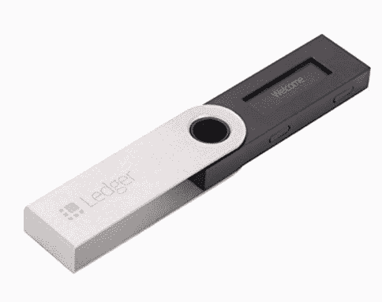

与此完全相反的是，我们有在线钱包。正如我在第一部分提到的，今天比特币基地是这一领域的领头羊；看看他们的网站，这是全球每个互联网用户都熟悉的界面。互联网上的任何人都可以填写类似的表格来创建一个账户，使用比特币基地这样的在线钱包还有一些其他功能:

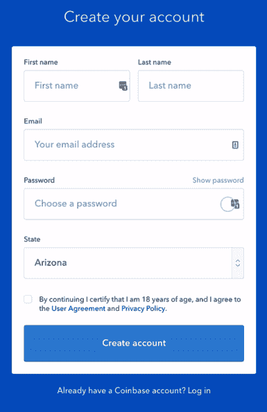

如果您忘记了凭据，可以重置凭据:

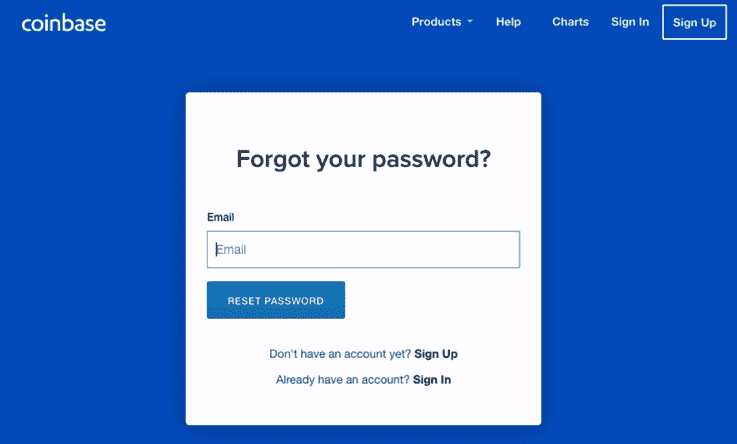

在这里，您还可以免费获得一些高级功能，例如每次交易后都会有一个新的钱包地址，以防止有人建立您帐户的完整财务档案，就像我们在上一节中看到的使用区块链浏览器一样:

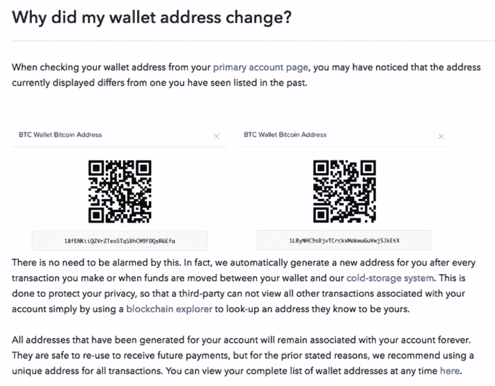

不利的一面是，你不拥有也不能获得你账户的私钥；这意味着你账户的安全最终由钱包提供商控制，如果他们的系统出了问题，你只能依靠他们来解决。这不是一个全新的概念，也不是加密货币独有的。这与你目前拥有的每个金融账户的运作方式完全相同:你的银行账户、你的储蓄账户、股票所有权和退休计划。它最大的弱点实际上是它最引人注目的特点，因为它的运作方式与我们所熟悉的其他金融工具一样，这种熟悉性降低了新用户的准入门槛，但这是以安全性为代价的:

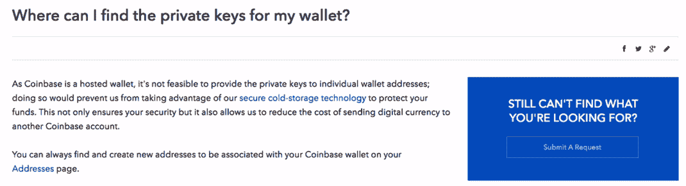

# 移动和桌面钱包

介于纸质钱包和在线钱包之间，我们有桌面和移动钱包，如 MetaMask。MetaMask 是一个浏览器插件，可以像用户熟悉的任何其他软件一样安装；这降低了新用户的准入门槛，即使他们不了解底层技术。与 MetaMask wallet 相关联的私钥存储在安装它的计算机上，并且它也被加密，以便只有知道您的密码的人才能访问它。但是，电脑会崩溃，对吗？嗯，使用元掩码，您可以备份私钥，这允许您将它恢复到另一台计算机上，甚至在多台计算机上使用它。在本书中，MetaMask 对我们来说最重要的功能是它与浏览器集成，这提供了我们创建的 DApp 与用户的以太坊钱包之间的无缝交互，并为用户增加了安全级别，因为我们没有直接访问他们的钱包，我们创建了一个交易，MetaMask 向用户提供了确认和签署交易或拒绝交易的选项。嗯，事情是这样的:你不必从这些钱包中选择一个，你可以使用它们，创建一个个性化的钱包系统，提供最好的所有功能。

您可以拥有一个比特币基地帐户，用于购买以太币等加密货币，一旦您拥有以太币，您可以将其中一部分转移到 MetaMask 等钱包中，在那里它可以用于与 DApps 进行交互，并且您将持有的任何以太币都可以发送到硬件钱包中进行存储，并且您可以将 MetaMask 钱包和硬件钱包备份到存储在不同物理位置的纸质钱包中。这为您提供了比特币基地等在线钱包的便利，与 DApps(如我们在这里使用 MetaMask 创建的 DApps)的轻松交互，使用硬件钱包保存大部分加密货币的安全存储，以及纸质钱包备份的故障防范。这是一个全面彻底的管理策略，也是我使用的确切策略。下图描述了具有元掩码的比特币基地:


使用您在这里学到的不同类型的钱包，您可以创建一个全面的钱包策略，平衡安全性和易用性，适合应用程序的角色。当你开始自己创建 DApp 时，我鼓励你在你的 DApp 中包含这样的策略和信息。去中心化的应用程序仍处于初级阶段，对于绝大多数用户来说，你的 DApp 可能是他们第一次与应用程序交互，所以他们不会有这方面的知识。将它作为入职流程的一部分，可以确保他们知道如何保护自己的资产，并降低进入门槛。还有一件事需要说明:我们的应用程序是如何知道 MetaMask 的？那么，让我们进入今天的最后一节来寻找答案。

# 注入 Web3 提供程序

因此，我们已经看到了 MetaMask 如何创建和签署交易，以及它如何管理帐户，但我们还没有谈到我们的应用程序如何知道 MetaMask 的存在。

以下屏幕截图显示了应用程序容器，这是应用程序启动时加载的主容器:

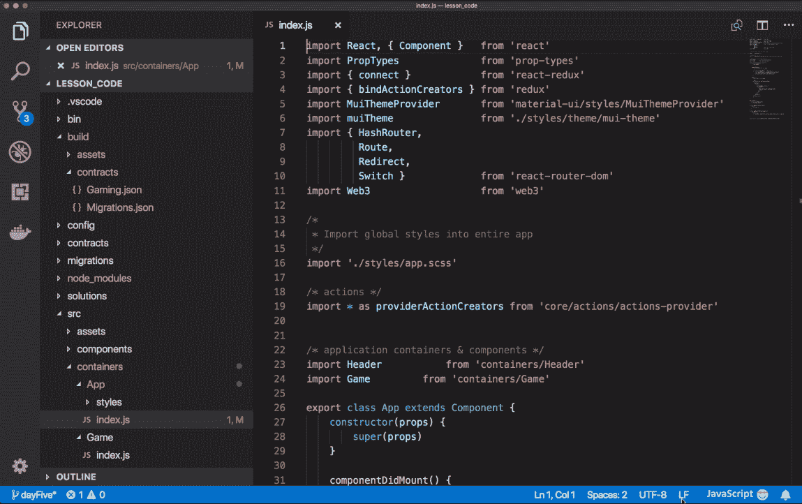

如果我们在这里向下看`componentDidMount`，我们将检查`window.web3`是否被定义；如果已经定义，这意味着用户已经加载了元掩码，并且已经将 Web3 提供程序注入到浏览器中:

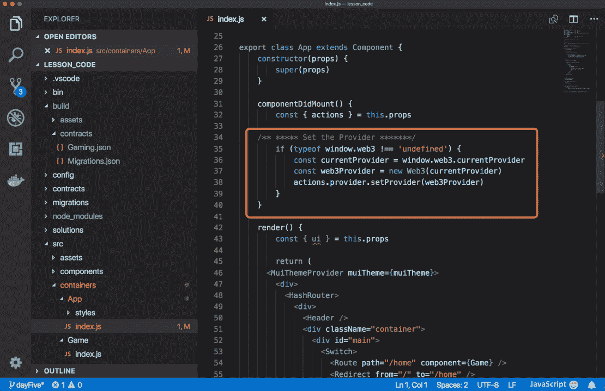

当前元掩码提示用户让元掩码在该点之后注入浏览器。他们这样做的原因是因为区块链的核心原则之一是安全，如果你能够从任何 DApp 读取他们的帐户信息，他们可能不希望这样，所以我们稍微改变了一下，这样在你被允许从以太坊帐户读取任何内容之前，你必须提示他们，并首先获得他们的许可。这里发生的事情是，我们检查 Web3 提供者是否被元掩码注入到浏览器中；如果是，那么我们将设置一个名为`currentProvider`的变量，它等于 Web3 提供的当前提供者。现在，这里的事情对你来说看起来很熟悉，因为我们使用了与我们在游戏中使用的相同的动作缩减模式。

我们将调用提供者操作。看一下下面的截图:

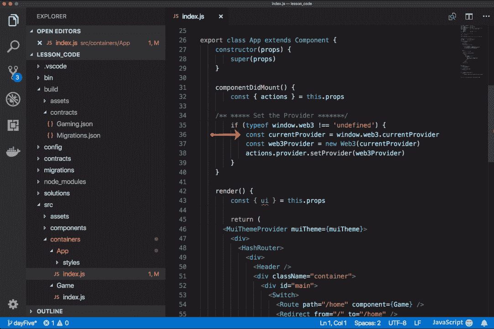

所以，如果我们看一下这里，`ProviderActionCreator`函数来自`core /actions/actions-provider`:

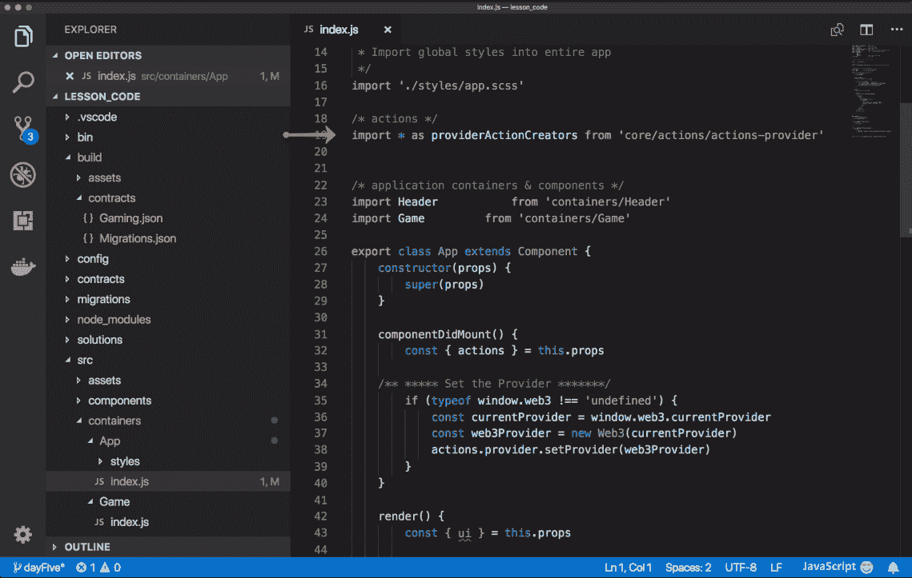

这里，我们将调用`setProvider`函数:

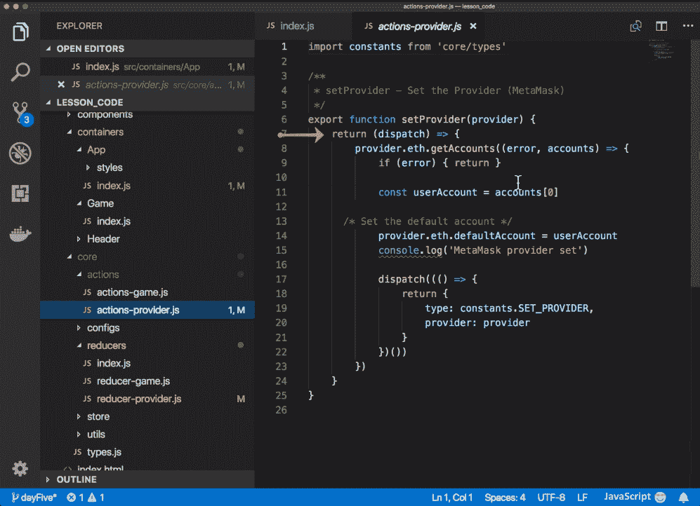

在这里，我们有`setProvider`，它将从提供者那里返回一个调用`getAccounts`方法的分派:

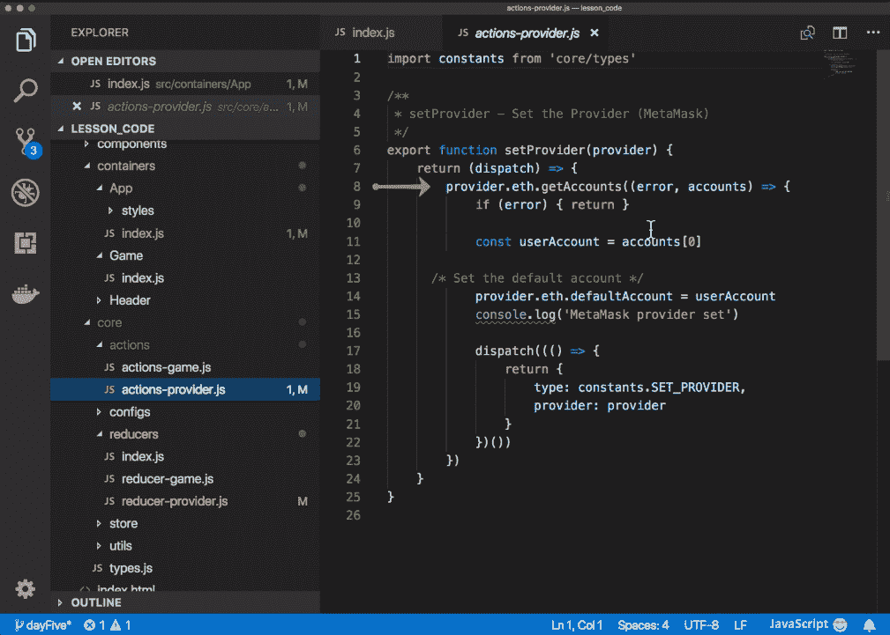

这将发送给减速器供应商。现在，一个 reducer 提供程序将获取我们从 Web3 获取的提供程序，并将其保存到 Redux 存储中:

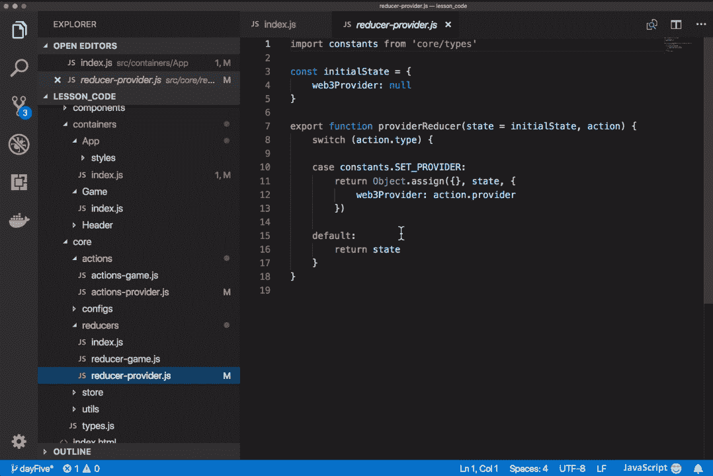

一旦保存到我们的 Redux 商店，如果我们看一下我们的`actions-game`提供者，每当我们调用`playRound`，你可以看到我们正在从 Redux 商店调用`web3Provider`。然后，我们调用`setProvider`方法，该方法从注入的 Web3 实例中获取当前提供者，然后我们在应用程序的其余部分中使用该方法对我们的契约进行以太坊调用:

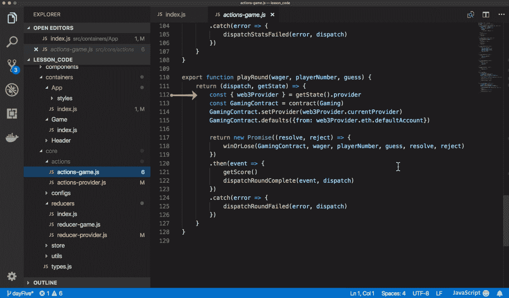

所有这一切都是因为当应用程序加载和组件挂载时，我们检查`web3Provider`以查看它是否被注入到浏览器中；如果有，我们调用一个动作来获取那个`web3Provider`，将它分派给 reducer，reducer 将提供者保存到 Redux 存储中，这使得它在我们的游戏中可以进行以太坊事务调用:

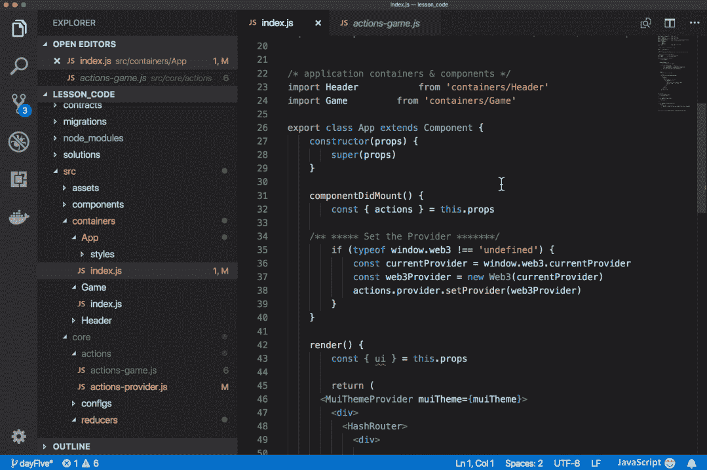

现在，让我们来看看今天的作业，您将安装和配置 MetaMask，以便与我们的 DApp 进行交互。

# 分配

在这一章中，我们为你的游戏创建了一个记分牌；现在，是时候玩一个游戏并测试一下了。

对于今天的任务，你需要做的是:

1.  安装元掩码。为此，您将转到 [MetaMask.io](https://metamask.io/) 并按照说明进行操作，就像我们在前面的章节中所做的那样。请记住，您需要使用 Chrome、Brave、Firefox 或 Opera 才能使用 MetaMask。
2.  接下来，启动 Ganache 并复制种子短语。
3.  使用种子短语在 MetaMask 中设置您的帐户，默认情况下 MetaMask 应该连接到主以太坊网络，因此您需要将其配置为使用 Ganache。
4.  一旦正确完成，您将从 Ganache 和 MetaMask 中看到您的帐户余额，然后您需要部署您的合同。

当您这样做时，很可能会看到这个错误，所以让我们来看看它意味着什么:

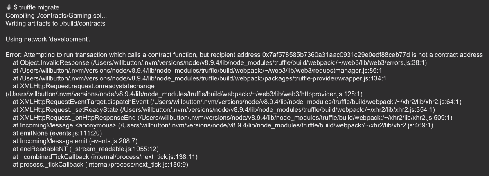

这里的关键一行是，试图运行事务，但收件人地址(...)不是合同地址。这告诉我们，您以前已经使用此配置部署了此合同，但是部署的地址在此网络上不存在。这个错误是为了防止您在不经意间将合同的多个实例部署到同一个网络上，这是一件好事，对吗？如果发生这种情况，你怎么知道网络上的哪个合同是正确的呢？

在这种特殊情况下，可以忽略这个错误；我们看到它是因为我们重新启动了 Ganache，这创建了一个全新的网络，所以我们上次运行 Ganache 时部署的合同确实不存在。

因此，要避免该错误，请运行以下命令:

```
truffle migrate -- reset 
```

现在，你可以玩几轮你的游戏。

检查你昨天建立的记分牌是否用正确的变量更新了，当你赢了或输了几轮后，检查你在 MetaMask 中的帐户余额是否正确更新了。我们的应用程序现在已经完成并运行正常；它只在你的本地工作站上运行，对吗？

# 摘要

在这一章中，我们学习了所有关于钱包的知识，它们的类型和安全性。然后我们了解了 MetaMask，我们将在应用程序中使用的钱包。接下来，我们看了以太坊气体的工作原理，以及我们如何使用它。之后，我们探索了不同类型的线上和线下钱包。最后，我们学习了如何为我们的应用程序将 Web3 provider 注入以太坊。

在下一章，我们将看看如何将我们的合同部署到公共以太网，并使用 AWS 将我们的用户界面部署到公共服务器。