# 区块链和以太坊简介

几年后，我们会看到革命性技术的诞生，这些技术有能力颠覆广泛的商业模式。在本章中，将介绍区块链，并深入了解该技术及其业务用例。区块链是一个概念，起源于由*中本聪*撰写的名为*比特币:一种点对点电子现金系统*的白皮书中，旨在避免第三方参与任何金融交易。我们还将讨论区块链的业务需求类型、加密技术和共识，这些都可以降低欺诈风险。

您将在本章中学习以下主题:

*   什么是区块链？
*   互联网对区块链
*   它是如何工作的？
*   区块链的建筑材料
*   Ethereum 区块链
*   私人与公共区块链
*   业务适应

# 什么是区块链？

就像每一天一样，你正享受着一杯咖啡和新闻的早晨。与此同时，在某个地方，一个有经济动机的黑客正在寻找各种可能的方法来危害一个广泛使用的社交网站的数百万用户帐户。黑客成功访问了数据库，并泄露了大量凭据。

大约 180 天后，这一大规模的身份盗窃被公之于众，你发现你也是被攻击的目标之一。就像你一样，数以百万计的其他用户也有理由担心他们附加的信任和隐私。这些例子包括最新的 Equifax 2017 年数据泄露案(1.43 亿个凭据被泄露)到成人朋友查找器 2016 年案(4.13 亿个帐户被盗)，Anthem 2015 年案(7800 万个帐户被黑客攻击)，等等。没有一个预防性的解决方案是 100 %安全的，但是在正确的时间发现问题可能会避免这些帐户的滥用。如果一项技术可以做到以下几点会怎么样:

*   检测谁看了一个人的账号就改？
*   确保与个人相关的数据不被滥用？

这听起来像是一个使用起来很聪明的东西，但是实现起来并不困难。这是区块链人做的事。简而言之，它只是一个智能、安全且不断增长的数据库。区块链是一个按时间顺序排列的账本，安全地记录任何价值或资产的交易。区块链网络提供了使用对等网络在独立方之间转移任何类型的价值或资产的能力。区块链技术的最初目标是在没有第三方(如银行)参与的情况下，在两个独立方之间建立可信的金融交易；然而，后来有几个行业采用了区块链来简化他们的供应链流程、KYC 系统、数据管理等等。随着在线服务的使用和在线交易数量的增加，用户不得不信任和依赖第三方，如银行和支付网关提供商。这导致了区块链的诞生。

# 简史

2009 年，*中本聪*发布了名为*比特币:点对点电子现金系统*的白皮书，以解决现有的金融市场挑战。这份白皮书的重点是开发一个平台，允许一方对另一方进行在线支付，而无需通过金融机构。解决的主要挑战之一是双重方法，用于避免比特币的双重消费(数字货币的一个独特问题是复制相同金额的风险，即使在消费后)。由于比特币是数字货币，复制数字数据并公布出来并不困难，因此出现了重复支出，有人提出了一个解决方案来防止这种情况——这就是区块链。然而，中本聪的原始论文并没有提到区块链这个词；它最初出现在一个比特币源代码评论中，名为*区块链*。

# 区块链的基础知识

区块链是一个去中心化的数据库，它以仅附加的方式保持所有交易记录的安全。区块链在众多行业中迅速流行，因为其数据库具有去中心化的特性。对于一个不能承受单点故障的组织来说，区块链数据库使敏感信息几乎不可能被网络罪犯窃取。此外，区块链不仅仅由可信的管理员或开发人员管理；它由任何可以信任或来自已知或未知团体的人来管理。下图是区块链网络的图示:

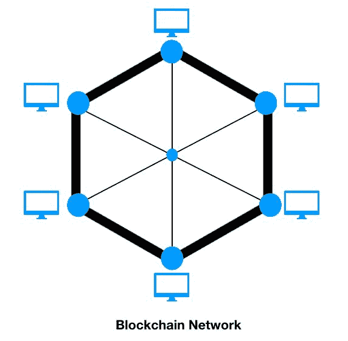

每台联网计算机都需要安装区块链节点软件，并运行针对区块链生态系统的应用程序。根据使用情况，这些计算机的参与可能会受到限制。例如，位于区块链的生态系统 bankchain 只允许银行运行 bankchain 节点客户端应用程序。

# 谁在使用区块链，如何使用？

在当前的技术时代，除了任何热门技术，区块链有能力以颠覆者的身份进入任何行业。这可能是为了降低运营支出、克服网络安全相关问题、提供身份和访问管理解决方案、促进私营机构与公共机构之间的合作、实现更好的数据管理系统、增强和简化物流和供应链管理、实现无缝保险销售和管理系统，或者部署更好的健康记录数据库系统来保护人们免受任何数据窃取或间谍活动的攻击。

# 互联网对区块链

互联网是一项有 30 多年历史的技术，其目的是通过 TCP/IP 和**开放系统互连** ( **OSI** )模型栈共享信息。从互联网诞生之日起，每一项新技术都会颠覆现有技术，无论是电子邮件、网络还是电子商务。互联网是最强大的技术之一，强大到足以传播思想，影响和创造现实的幻觉。

TCP/IP 是第一个为标准化相似网络之间的通信而构建的互联网协议套件；然而，OSI 模型是由**国际标准组织** ( **ISO** )开发的，以提供一个框架来标准化系统之间的通信，而不管供应商、模型和技术。组织更喜欢客户机/服务器通信的两种模型，因为客户机/服务器网络在本质上更可靠、更稳定。重要的是必须更好地控制客户正在使用什么数据以及他们如何使用这些数据。在客户机/服务器模型中，客户机管理自己的本地资源，如工作站或任何设备的硬件和软件组件，而服务器是一个功能非常强大的系统，它管理共享资源，如硬件、网络通信通道和数据库。在对等网络中，没有中央权威机构来监视、控制和实施。尽管小型企业出于其内部需要而倾向于这种方式，但大型组织总是远离对等网络，因为它们有失去对其业务运营和管理的控制的风险。

然而，在这个连接世界的旅程中，有一些时刻重新定义了创新，并为每个企业的需求提供了便利的媒介。这就是区块链，一个由独立节点组成的点对点网络，在没有任何第三方参与的情况下分享任何一种价值。计算的发展最初是从大型机计算开始的，十年后，互联网出现了。云计算是由 Ramnath Chellappa 教授在 1997 年定义的，亚马逊在 2006 年推出了它的 T2 弹性计算云服务。我们现在正处于一个新的计算时代，它改变了数据安全可靠的存储方式。请看下图:

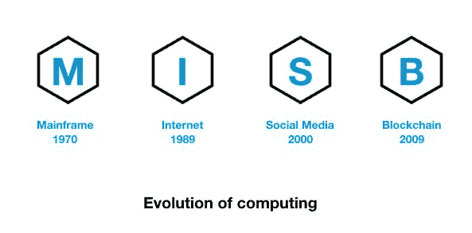

# IP 数据包与块

我们在互联网上所做的一切都要通过 TCP/IP 模型上的 IP 包。IP 数据包是可以通过互联网发送的最小数据单位。一个 IP 数据包有两个组成部分——一个 **IP 报头**和一个**有效载荷**。

要发送这些信息，它需要一个源 IP 地址和一个目的 IP 地址。块是这个过程的组成部分；它被链在一起形成了一个区块链。Block 也有两个组件——**block header**和 **block body** 。为了发送任何类型的值或交易，它添加自己的数字签名作为源标识符和公钥，这类似于对等网络中目的地的身份。

# Web 应用与 dApp

web 应用程序只是一个基于 web 的应用程序，它广泛用于客户端-服务器模型中为用户服务。然而， **d** **去中心化应用** ( **dApp** )是一个运行在计算机对等网络上的应用。

传统的 web 应用程序使用 CSS、HTML 和 JavaScript 来呈现前端页面。它通过 API 调用从数据库中获取数据。dApp 的前端使用完全相同的技术来呈现页面，但不是调用 API，而是使用连接到区块链的智能契约。

# 它是如何工作的？

让我们以最简单的形式来理解区块链分类账的运作。为了理解该系统的一般形式，使用区块链的几个州并进一步研究它们是很重要的:

1.  **交易准备:**在这一阶段，*方 A* 创建一个交易，该交易包括接收者的公共地址、源数字签名和交易消息等信息。现在，该事务对区块链中的所有节点都可用。
2.  **交易验证:**区块链节点以无信任模式工作，其中每个节点(运行区块链客户端软件的机器)接收该交易，并用*方 A 的*公钥验证数字签名。在成功验证之后，这个经过身份验证的事务被搁置在分类帐队列中，并等待直到所有节点都成功验证了同一个事务。
3.  **块生成:**排队的事务被安排在一起，由网络中的一个节点创建一个块。在比特币区块链中，当一个比特币节点，也被称为**矿工**，通过解决一些数学上复杂的问题创建一个区块时，比特币就会得到奖励。
4.  **块验证:**在成功的块生成之后，网络中的节点被处理用于迭代验证过程，其中大多数节点必须获得共识。达成共识有四种流行的方式，如**工作证明**(**PoW**)**栈证明**(**PoS**)**委托栈证明**(**DPoS**)**实用拜占庭容错** ( **PBFT** )。比特币利用权力达成共识；但是，以太坊使用 PoS 进行共识。该机制影响财务方面，并确保整个交易操作的安全性。

5.  **区块链**:在成功的共识机制之后，区块被验证并被添加到区块链。

下图显示了区块链的几个州:

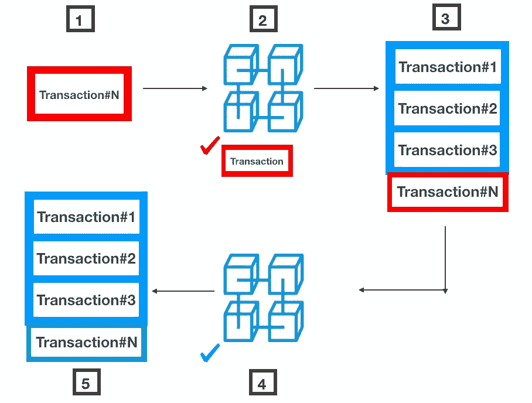

# 区块链的建筑材料

区块链技术建立在一组已被广泛应用于整个行业的现有技术之上。让我们看看区块链的每个组件，它们使得整个系统在本质上是分布式的、不可变的和可靠的。

# 街区

分布式分类帐存储在数据库中，并由区块链网络中的每个参与者更新。一个分类账由一系列被称为块的单位来表示。为了理解数据块，让我们从传统的数据模型开始，然后跳到区块链网络来理解数据块是如何连接在一起的。

我们先来了解一下互联网上信息交流的常规方式。在 TCP/IP 协议栈中，信息是通过客户机/服务器模型传输的，客户机可以在中央服务器上存储和修改数据。但是，数据库的控制权仍由指定的管理员掌握。如果管理员的安全受到威胁，整个数据库都可能被更改或删除。理论上，服务器和用户机没什么区别；然而，在实践中，服务器的目的是同时为几个最终用户服务。请看下图:

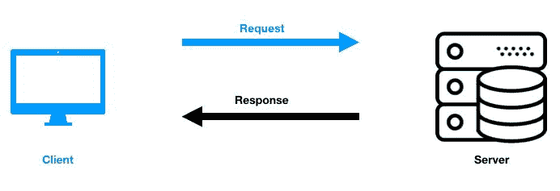

区块链网络由几台名为**节点**的独立机器组成。与将整个信息存储在中央数据库服务器上的传统数据库不同，区块链节点以管理角色保留整个数据库的副本。即使一个节点出现故障，这些信息仍可用于这些节点，如下图所示:

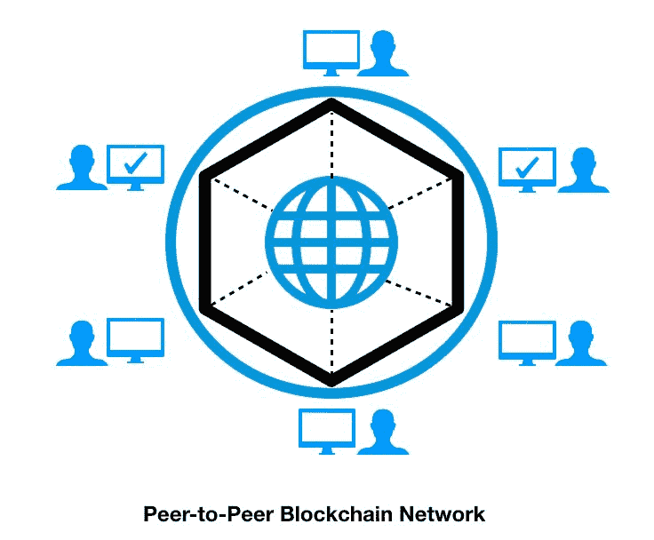

当一个节点加入区块链网络时，它就下载更新后的区块链总账。每个节点负责用经过验证的块管理和更新其分类帐。该节点维护分类帐，并以连接到哈希算法的块的形式组织分类帐，如下图所示:

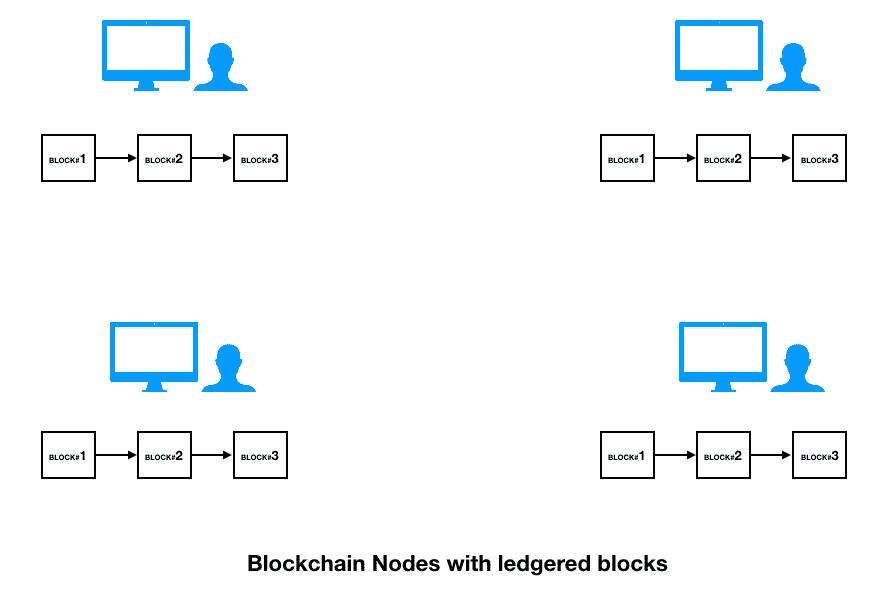

多个事务捆绑在一起形成一个块，用最简单的方式来说，它是一个数据结构。每种加密货币都有自己的区块链和定制属性。例如，比特币区块链每 10 分钟生成一个块，每个块的大小为 1 MB，而以太坊区块链每 12-14 秒生成一个块，每个块的大小为 2 KB。请看下图:

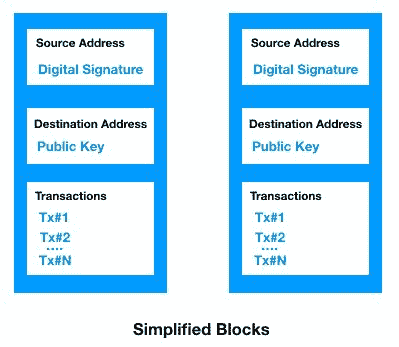

让我们多了解一下积木。块由块头和块体组成:

*   **块标题**:块标题帮助我们识别区块链中的特定块。它包含一组元数据:

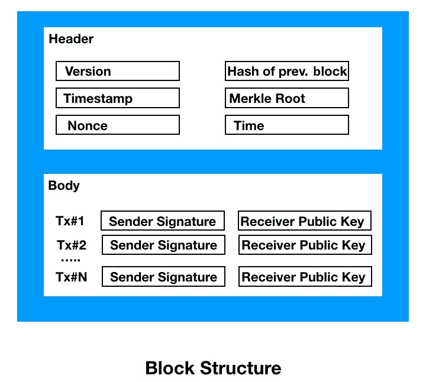

该模块的组成部分解释如下:

# 加密——数字签名和哈希算法

加密哈希是一种针对任何给定长度的输入字符串生成固定长度输出的方法。输出被命名为哈希或消息摘要，旨在保护任何类型的数据(如文件、媒体或文本)的完整性。只分配一个消息摘要来保护特定的输入或敏感信息。对输入数据的微小改变会导致结果的巨大差异，这使得几乎不可能预测运动中甚至静止的数据。产生散列或消息摘要有多种方法。在加密货币领域，比特币是一种流行的货币，SHA-265 算法用于针对每个块产生固定长度的 256 位哈希或消息摘要。

让我们来理解 SHA-256 算法是如何工作的。有几个免费的 web 工具可以用来生成阿沙-256 哈希。我们使用以下网站在[https://passwordsgenerator.net/sha256-hash-generator/](https://passwordsgenerator.net/sha256-hash-generator/)进行演示。

让我们从生成一个散列开始:

*   第一条输入消息是:

```
"Hi" 
Hash =3639efcd08abb273b1619e82e78c29a7df02c1051b1820e99fc395dcaa3326b8

```   第二个输入消息是:

```
"Welcome to the world of Blockchain"

Hash = d6d937bbd71b1184e588dffb50709e0fc4d8e7323df3acd98f2826a3601793ef

```   第三，在加密货币的上下文中，输入消息是这样的:

```
"Mike is paying John $200 at Jan 23, 2017"

Hash = 5afef671f79cab507aba379a84477d637aac6ad72456ef3c35a39476e886b9d0

```

为了确保传输的文件不被损坏，接收方总是可以将计算出的哈希与给定的哈希进行比较，以了解文件或其任何内容的作者。在区块链的世界里，散列是其不变性特征的支柱。散列过程确保分类帐中没有任何数据块被更改或篡改。区块链和节点不必跟踪每个事务的细节，如`Mike pays $20 to John on July 20, 2017`、`Kevin Legal document has been received dated September 21, 2017`和`Tom has completed a trip from Houston to Dallas on November 22, 2017`，它们只需记住并跟踪各自的散列。

让我们了解一下区块链是如何利用哈希算法的。在区块链，节点以按时间顺序连接的块的形式排列整个分类账。为了确保分类帐不被篡改，每个块都依赖于前一个块。换句话说，没有前一个块的散列，就不能产生新的块。在分类账中添加新数据块之前，必须经过区块链中每个节点的批准和验证。这使得任何人都可以篡改或更改账本，除非是黑客，他有足够的能力同时感染和危害区块链中的所有数百万个节点。只有称为 *genesis 块*的第一块是自己产生并指向自己的。下图显示了简化的比特币区块链:

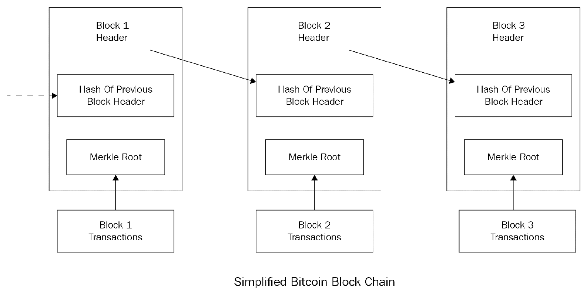

每个块都指向前一个散列块的散列，这就成了区块链不变系统的主干。现在，即使中间的块被以任何方式改变或扰乱，黑客也永远无法获得相同的区块链，因为块中的小变化会导致结果散列的剧烈变化。由于每个块中有成千上万的事务，因此很难找到一个不耗时且对流程不敏感的事务。为了避免这种复杂的工作，已经开发了一种被称为 Merkle 树的综合散列树。下图显示了 Merkle 树:

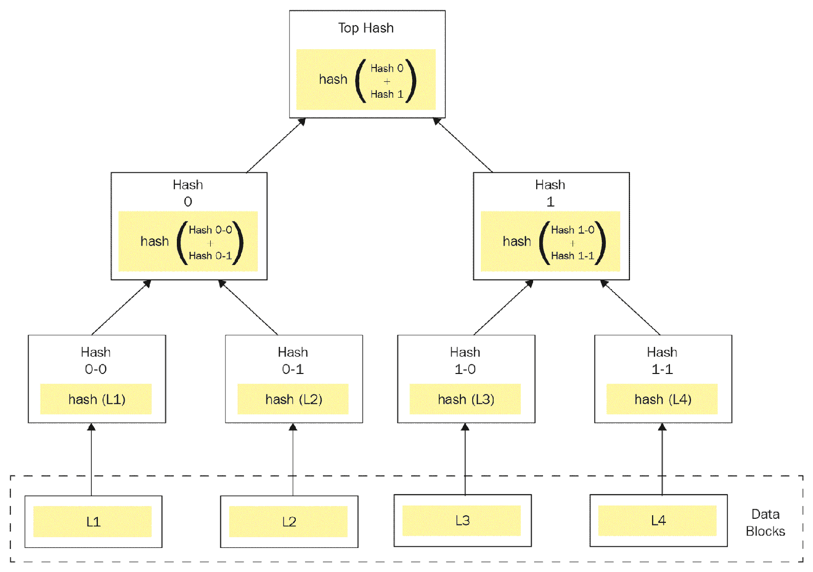

散列排列的目的是简化从数千个事务散列中查找单个事务散列的过程。

通过提供传输数据的真实性和防止伪造，数字签名已经在许多组织的安全控制的核心中发挥作用。数字签名确保交易发生在经过验证和认证的双方之间。在现实世界中，每个人都是通过他们唯一且永久的国民身份号码来识别的，比如美国的**社会安全号码** ( **SSN** )、新加坡的**国民登记身份证** ( **NRIC** )、英国的**国民保险号码** ( **尼诺**)、印度的**唯一身份认证机构** ( **UIDAI** )等等。政府机构跟踪公民和政府本身之间的每一笔金融交易、财产交易和法律交易，依据的是他们的唯一标识号，这些标识号携带有关个人详细信息甚至生物特征的信息，然后在他们完成交易时进行验证。在数字世界中，数字签名在确保两个认证方之间的交易中起着至关重要的作用。现在让我们理解为什么区块链需要数字签名。

在区块链技术中，每个节点维护一个具有管理角色的区块链分类帐。任何人都可以用自己的数字身份将他们的交易添加到分类账中。与区块链技术相关的好消息和坏消息如下:

*   **坏消息**:数字身份都是 1 和 0，这使得伪造的可能性更高。任何一方都可以通过简单地复制受害者节点的数字身份来尝试对分类帐进行欺诈登录。
*   好消息:区块链网络使用了私有和公共密钥对。每个节点都有自己的私钥和公钥对。数字签名和哈希技术与区块链合作，了解这两种基础技术如何携手合作，使区块链保持高等级的安全性。

假设甲方*想要向乙方*发送交易信息。为了保持我们对区块链的关注，比特币挖矿已经被移除，尽管执行金融交易需要有一个成功的挖矿过程。参与方 *A* 有一个事务到期，它准备宣布它。消息是`Party A sends $200 to Party B on July 23, 2017 at 03:00 EST`。**

 **为了避免任何形式的伪造，第*方 A* 必须使用非对称密钥对，也称为私有/公共密钥对。该信息由私钥签名，并且这对于当事人 *A* 来说是保密的。假设*方 A* 有一个`Blockchain#123`的私钥或秘钥，消息是`Party A sends $200 to Party B on July 23, 2017 at 03:00 EST`。使用 SHA256 消息摘要算法对消息进行签名将如下所示:

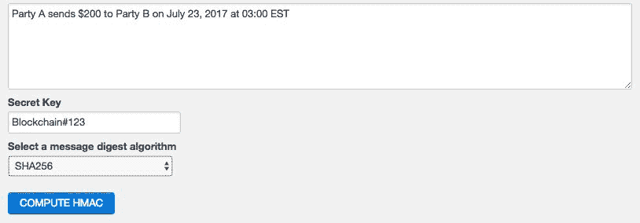

读者也可以在[https://www.freeformatter.com/hmac-generator.html](https://www.freeformatter.com/hmac-generator.html)用链接中提到的工具进行同样的操作。以下是计算出的**基于哈希的消息认证码** ( **HMAC** ):

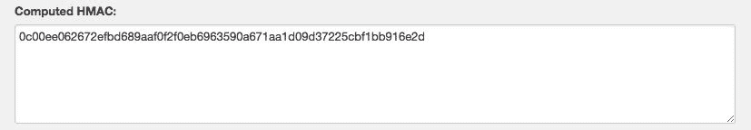

现在，每笔交易都由三个重要元素组成——类似源地址的数字签名、指示目的地的公钥，以及最后的交易信息。

该交易到达方 *B* 以及用公钥验证该交易的其他参与者。成功验证后，交易被确认。

# 共识——区块链的核心

共识是区块链系统的组成部分，负责在分布式环境中达成一致。区块链的开放和不信任是区块链的心脏；但是，注意额外的护理和严格的流程也很重要。由于任何人都可以参与并提交信息，因此评估每个参与者的议程至关重要，让每个人都同意所需的政策有利于避免任何欺诈企图。这就产生了共识机制，它类似于信令过程，以确保在实际沟通开始之前已经考虑了一切。以下是用来与区块链达成共识的四种主要方法:

*   在区块链最流行的达成共识的方法之一是由比特币的创始人中本聪发明的。在这种类型的共识中，基于信任已经被创建来做最大计算工作的特定节点的基本原理来避免欺诈企图。区块所有者在加密货币领域也被称为**矿工**，他知道拥有强大的计算资源可以实现更好的散列率，获得比特币奖励的机会也增加了。一个新的事务被广播到网络中的所有节点，每个节点继续监听这些事务。想通过比特币获得激励的节点被称为矿工，但他们不只是听，他们收集交易。矿工必须用 PoW 算法解决一些复杂的数学问题。最先解决的人会得到比特币奖励。最后，验证块被添加到每个矿工的区块链中。

这个数学问题只不过是利用应用于一组事务的散列和一个随机数(32 位随机数)来获得所需散列的过程。如果输出产生的散列小于目标散列，则挖掘者赢得该块并达成共识。当一名矿工赢得区块时，每个区块携带一套**比特币** ( **BTC** )，然后他们收到:

*   **PoS** :这是在节点间的区块链中达成共识并验证交易的另一种方法。与 PoW 不同，在 PoS 中，区块生成器不会根据其当前的财富堆叠来选择。在这种机制中，区块永远不会被奖励，PoS 中的矿工被称为**伪造者**。以太坊使用 PoS，选择它的目的是为了避免大量电力消耗带来的任何环境压力。根据 2017 年 Digiconomist 报告，整个比特币网络消耗的电力估计超过了爱尔兰共和国。比特币使用的是 PoW 机制，而且都是建立在拥有强大资源的矿商的基础上，这就造成了对电力的更多消耗。通过 PoS 机制，节点必须加入验证者池才能被选为伪造者。 **Casper** ，一个以太坊共识 PoS 协议，作为一个混合版本与现有的 PoW 机制一起工作。每隔 100 个街区就有一个以太坊。PoS 非常适合具有静态硬币供应的平台，许多人用它来分发针对投资的代币。
*   DPoS :这是另一个共识协议，被认为是一个更快更有效的模型。DPoS 用民主的方式解决共识问题。在网络中选择块生成器并确认交易大约需要一秒钟。这样，你不仅解决了共识问题，还消除了不必要的监管干预。
*   PBFT:拜占庭故障是一种对故障检测系统来说既表现出故障又表现出功能的状态，并且对不同的检测器表现出不同的模式。如果一些节点成员向其他成员发送不一致的交易信息，可能会导致整个网络陷入巨大的困境。PBFT 是保护网络免受拜占庭故障影响的解决方案。

# 艾瑟芬

以太坊是最古老的区块链风格之一，为平台提供了一种定制系统的方式。比特币旨在通过自己的共识机制扰乱当前的支付系统和网上银行，而以太坊正处于现有计算机系统的去中心化过程中，因为它在很大程度上依赖于客户端-服务器模式。

# 历史

2013 年，参与比特币的 22 岁程序员 Vitalik Buterin 首次在白皮书上描述了以太坊。2014 年初，一家名为以太坊瑞士有限公司(Ethereum Switzerland GmbH)的瑞士公司开发了第一款以太坊软件。2016 年 6 月，**去中心化自治组织** ( **道**)被一个匿名团体黑客攻击，在密码社区引发了重大争论，并导致网络分裂为两个团体——**以太坊** ( **ETH** )和**以太坊经典** ( **等**)。

# 以太坊是什么？

以太坊是一个分散式网络，能够在分布式环境中运行应用程序。这个想法只是为了避免完全依赖单一实体来存储和管理用户的个人和业务数据。在当前的数据库系统中，一旦数据被在线存储，客户端就不知道数据是如何存储的，采取了什么安全防范措施，谁可以读取数据等等。以太坊提供了一个平台来构建分布式应用程序，这些应用程序直接连接每个堆栈持有者或各方，以实现更好的透明性和零依赖性。尽管比特币和以太坊有着基本的相似之处，但两者在目的和功能上有着显著的不同。借助以太坊，任何集中式服务都可以通过其独特的编程能力转变为分散式服务。以太坊基本上有三层——**以太坊虚拟机** ( **EVM** )、加密货币以太、气体。

# 智能合同

简单来说，智能合约是由它们的创建者编写来执行特定执行的程序。虽然契约可以用任何区块链风格编码，但是以太坊是最受欢迎的选择，因为它提供了可伸缩的处理能力。

以太坊允许开发者编写自己的智能合约。智能合约可用于:

*   通过在特定事件发生时自动触发索赔来简化索赔处理过程
*   管理用户之间的协议
*   存储有关应用程序信息，如健康记录和 KYC 信息

在以太坊中，每个契约都有一个地址，这样它就可以被唯一地识别。该地址由哈希创建者的地址和已经执行的事务数量计算得出。

当我们将智能合约部署到公共区块链环境中时，我们会获得智能合约的地址。我们现在可以编写代码来与智能合约中的特定实例进行交互。合同有诸如 ERC20 标准之类的标准，实现所需的方法也很重要。

让我们尝试建立我们的第一个智能合同。我们将使用 Solidity 来编写智能合同。编程语言 Solidity 类似于 JavaScript。要开始这个过程，我们首先必须用 Ganache 包设置环境，它将用于创建一个私有区块链。其次，我们需要在线访问我的钱包，可以在 https://github.com/kvhnuke/etherwallet/releases 找到

一旦软件包安装完毕，我们就可以使用[https://remix.ethereum.org/](https://remix.ethereum.org/)的链接进入以太坊 IDE 开始了。下面的屏幕截图显示了以太坊 IDE:

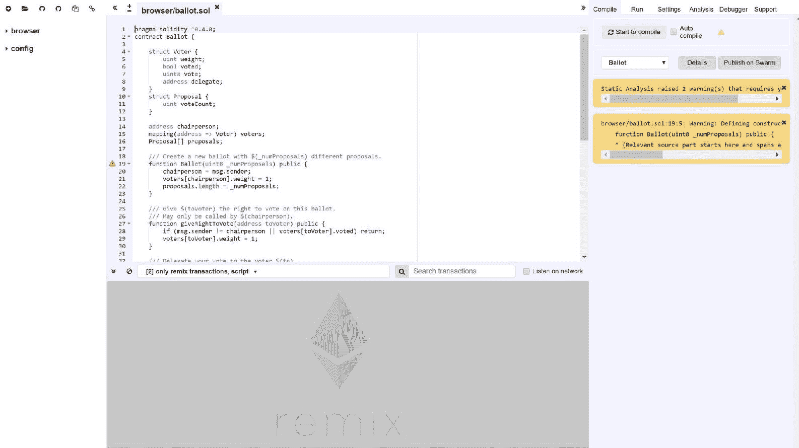

Remix 是一个用于 Solidity 的在线编译器，用于编写我们的智能合约代码。这是我们柜台的密码。正如我们在下面的截图中看到的，它有一个变量和两个函数。变量`c`是一个整数，并且是私有的，这意味着它不能被契约之外的任何人访问。第一个函数`plusbyone()`通过增加`c`的值来改变它的值，第二个函数`getC()`访问`c`并将它的值返回给调用该函数的任何人。

当计数器代码被粘贴到 remix 中时，它将看起来像下面的截图:

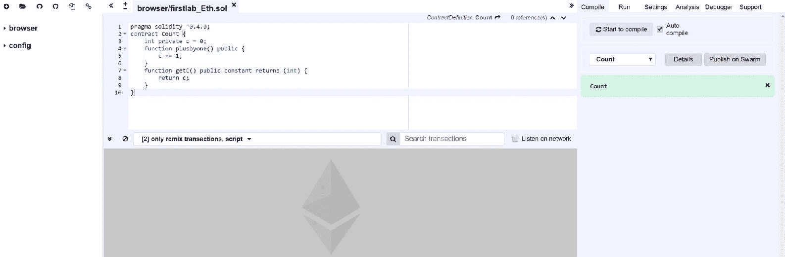

现在让我们打开 Ganache，我们会看到这样的东西。在屏幕的顶部，我们可以看到它显示 RPC 服务器:

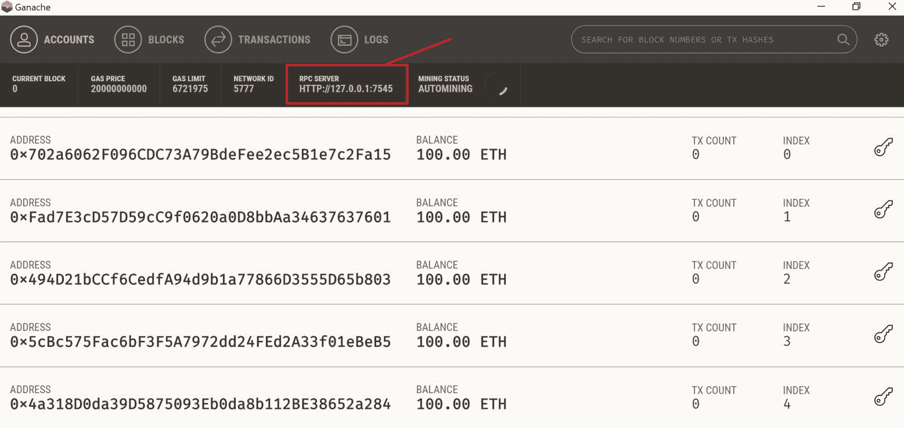

现在，让我们尝试在浏览器中访问 MyEtherWallet，看看结果如何。在右上角，你会看到一个下拉框，显示 MyEtherWallet 连接到以太坊。默认情况下，它连接到以太坊的主网络。我们必须通过单击下拉菜单来更改此选项。单击添加自定义网络/节点选项，如以下屏幕截图所示:

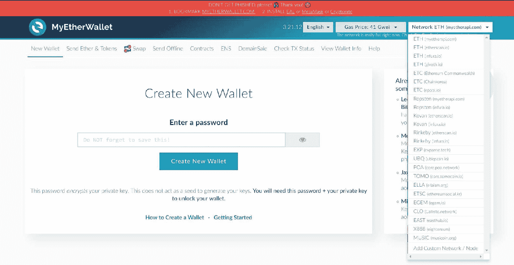

现在我们可以输入 Ganache 已经准备好使用的 RPC 服务器信息。我们可以将节点命名如下:

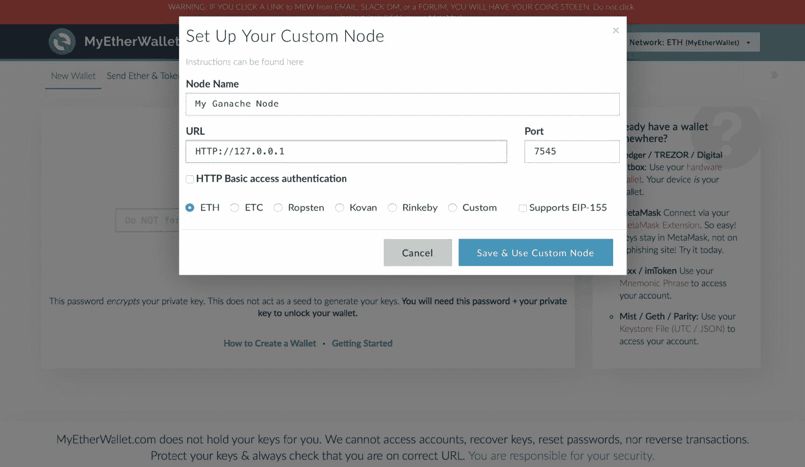

MyEtherWallet 现在通过 Ganache 连接到我们的自托管区块链。让我们使用 MyEtherWallet 上传我们的柜台智能合约。为此，我们将单击位于 MyEtherWallet 导航栏顶部的 Contracts 选项卡，并选择 Deploy Contract 选项:

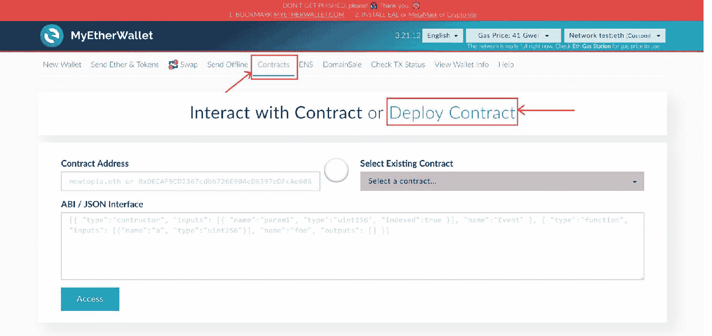

如我们所见，MyEtherWallet 要求我们提供合同的字节码:

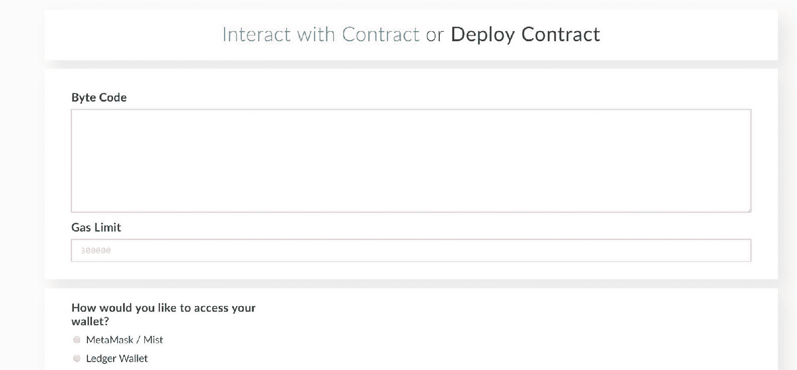

要找到它，我们将返回到我们的 Remix IDE 并单击“详细信息”按钮:

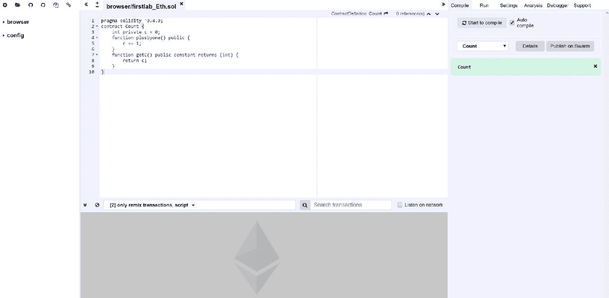

我们现在将看到一个对话框，其中包含有关我们柜台智能合约的信息。要复制字节码，我们将单击字节码部分旁边的剪贴板图标:

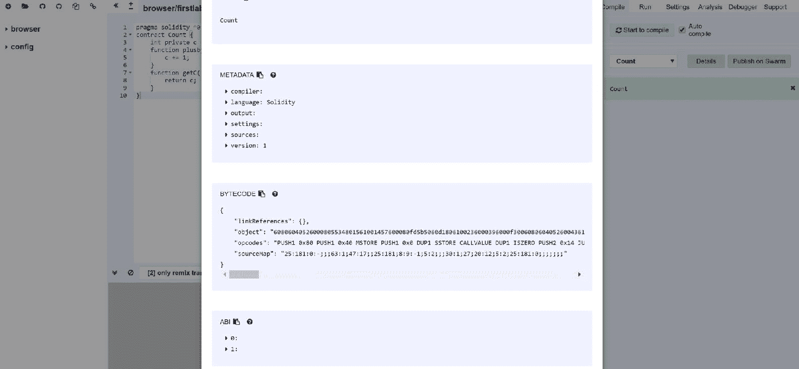

现在，我们将返回 MyEtherWallet，并将字节代码粘贴到字节代码文本区域:


现在，我们可以向下滚动并导入一个帐户地址来上传合同。默认情况下，Ganache 出现了五个地址，我们可以用它们来与我们的私人区块链进行交互。我们将返回到 Ganache，单击钥匙图标，这样我们就可以访问任何地址:

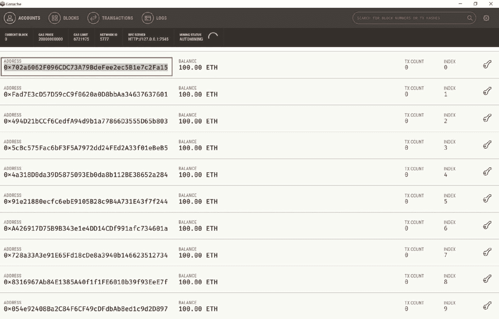

现在我们将看到私钥与帐户绑定在一起:

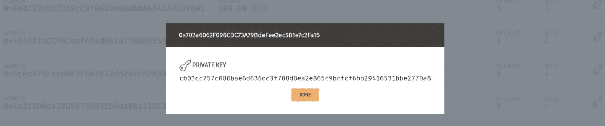

我们现在必须复制这个私钥并将其粘贴到 MyEtherWallet 中:

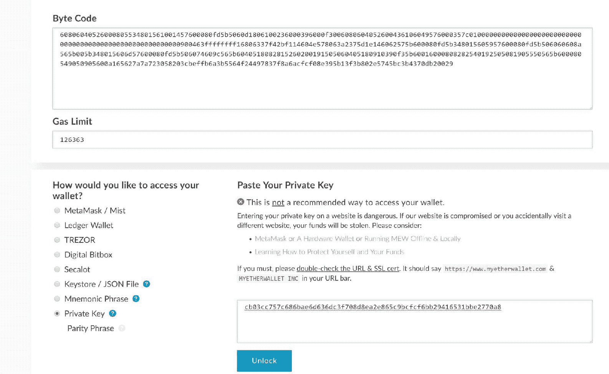

现在我们可以点击解锁按钮，MyEtherWallet 将询问我们是否要签署该交易并部署我们的合同:

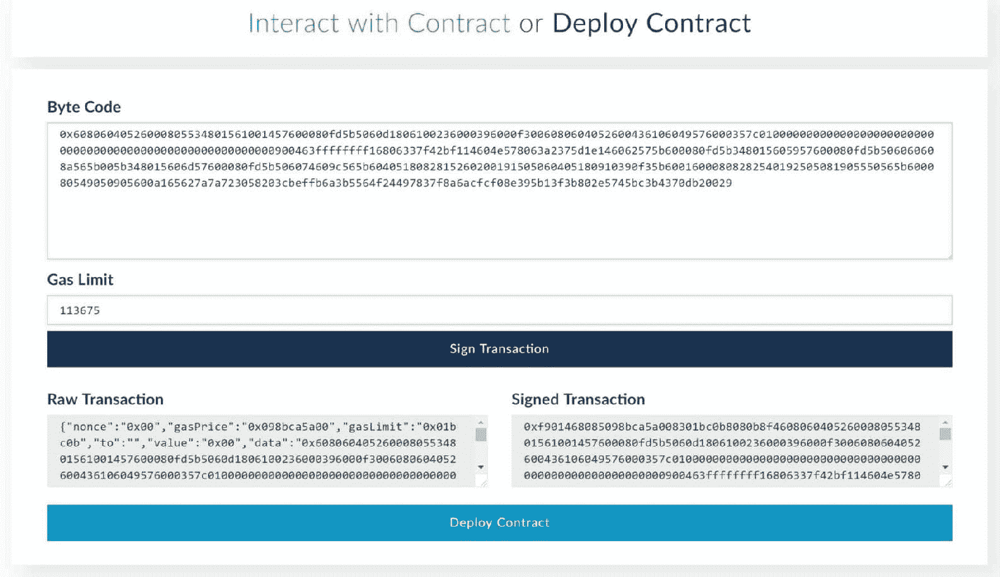

最后，我们会看到一个成功的提示，如下图所示:

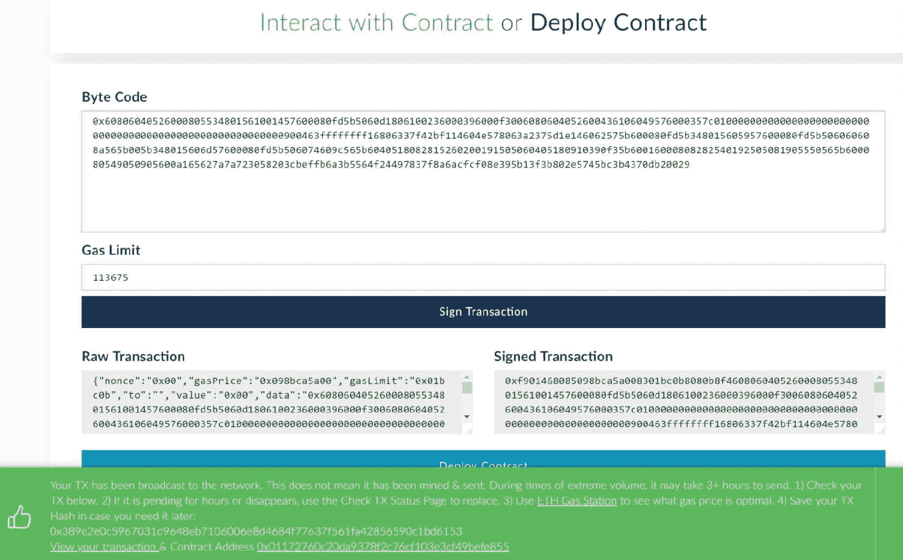

交易成功后，Ganache 将增加其当前块值，我们用于部署合同的帐户的交易计数也将增加:

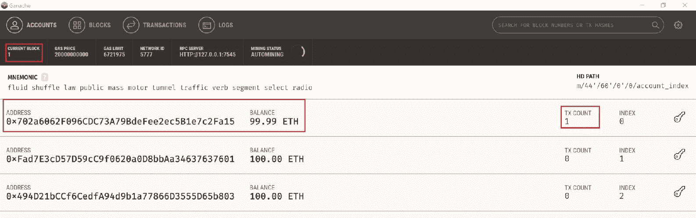

我们的智能合同现已上传至我们的区块链。要通过递增和递减计数器来与之交互，我们现在必须返回到 MyEtherWallet 并选择与契约交互选项:


MyEtherWallet 现在会要求我们提供新部署的智能契约所在的地址，以及我们的契约的**应用程序二进制接口** ( **ABI** )。我们可以查看我们的交易日志，如下所示:

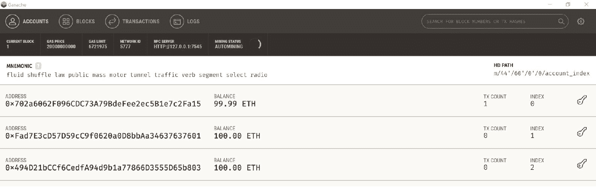

如您所见，Ganache 告诉我们用于部署合同的地址。让我们单击交易，复制创建的合同地址，并将其粘贴到 MyEtherWallet 中:

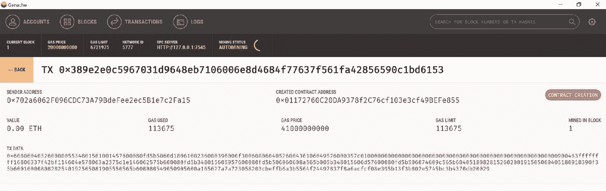

下面的截图向我们展示了 MyEtherWallet 知道如何与我们的契约进行交互。我们将返回到 Remix，并单击界面 ABI 旁边的剪贴板图标来复制它:

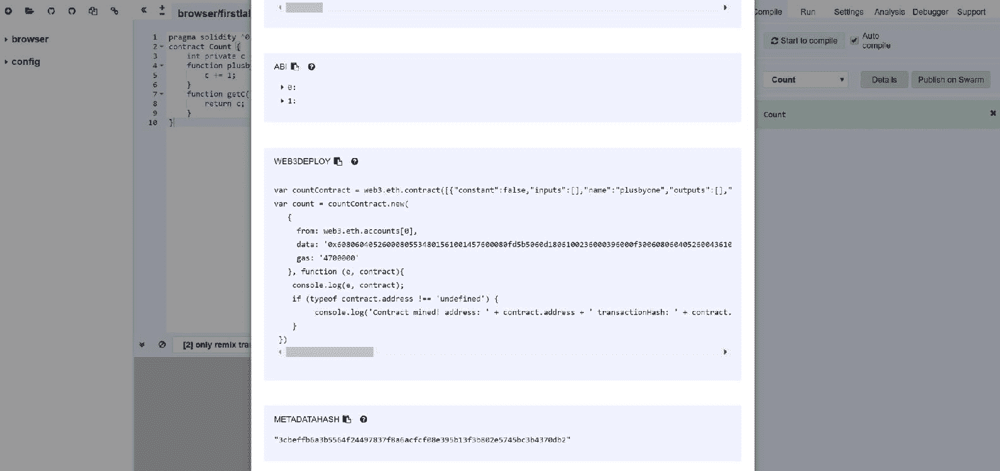

现在我们必须返回 MyEtherWallet，将 ABI 粘贴到它的文本框中，然后单击访问按钮。我们可以通过单击选择功能下拉菜单来与我们的合同进行交互:

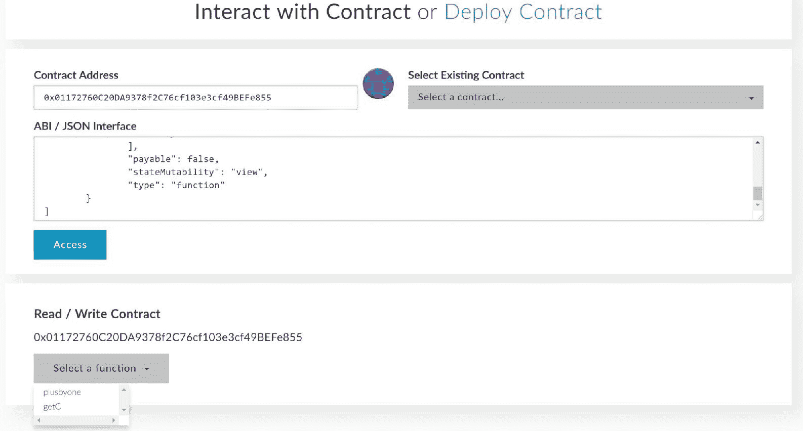

在我们的代码中，我们将 count `c`的初始值设置为`0`。为了确认智能合约正在工作，我们需要调用`getC()`函数:

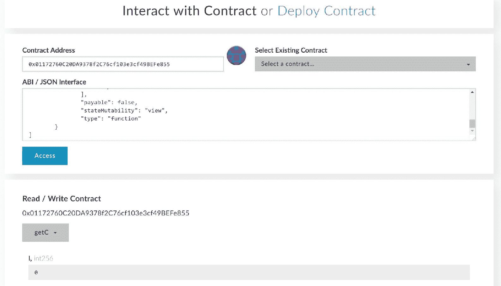

我们可以看到合同被退回了，但是我们还做了其他的函数，`plusbyone()`。我们来调用`plusbyone()`测试一下。我们将通过再次选择功能下拉菜单，选择`plusbyone`，并创建一个新的交易来完成:

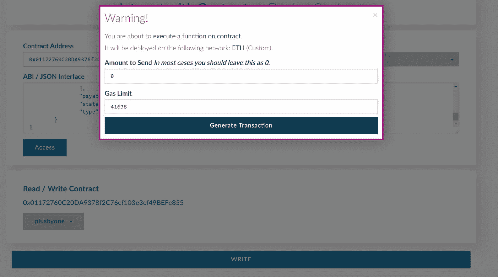

这只是增加了`c`的值。现在，我们可以再次调用`getcount()`来确认值是否改变了:

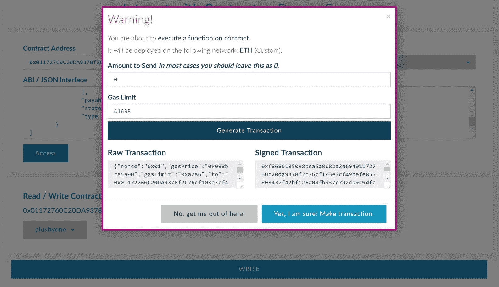

最后，我们可以看到`c`变量现在等于`1`。因此，这澄清了我们的`plusbyone()`函数的工作原理:


# EVM

EVM 是一个用于构建和管理智能合约的分散运行时环境。在以太坊中，每一个程序都由一个由数千台计算机组成的网络来处理。

智能合约被编译成字节码，一个叫做 EVM 的特性可以读取和执行。所有节点都使用它们的 EVM 来执行这个契约。根据基本定义，网络中的每个节点都持有交易和智能合约的网络历史的副本。EVM 负责按照开发商预先设定的规则执行合同。EVM 通过基于堆栈的字节码计算这些数据，而开发人员用高级语言编写智能合同，如 Solidity 或 Serpent。

# 气体

当以太坊网络中的每个节点都执行智能契约时，会消耗大量的能量。因为消耗更多的能量需要更多的钱，所以它也依赖于智能合同编程的水平。换句话说，EVM 中的每个低级操作码花费特定数量的*气体*来执行其期望的输出。

Gas 只是指示执行计算的成本，并帮助开发人员根据他们的智能合同代码了解能耗。和比特币市场一样，气的价值是由市场决定的。如果支付了更高的天然气价格，节点将优先考虑交易以获取利润。

# 分布式应用

dApp 使用激励机制，如加密令牌和内置的共识机制。分布式应用程序不需要存储它的所有状态；然而，基于以太坊的分布式应用程序确实存储可信状态，这为最终用户提供了一个经济的解决方案。

除了客户端与以太坊区块链接口之外，dApp 客户端需要对前端进行编程。客户端通常是用 JavaScript 编写的，因为它们可以在我们大多数人都有的 web 浏览器中运行。

dApp 浏览器利用 dApp 客户端(通常用 JavaScript 编写)与以太坊节点进行交互，然后与智能合约进行通信。dApp 确保与以太坊节点的连接，并提供更改连接的简单过程。它还为用户提供了一个帐户接口，以便他们可以轻松地与这些 dApps 进行交互。

至此，我们已经了解了以太坊的一些核心组件，并了解了智能合约的真实工作情况。在接下来的章节中，我们将开始在以太坊区块链上构建一个分布式应用程序。

# 私人与公共区块链

多年来，区块链的许多风格都得到了发展，并且已经进行了几次迭代来实现商业价值。有 1000 多家初创公司推出了他们的分布式区块链应用产品。当涉及业务时，了解最适合的解决方案非常重要。

从诞生之日起，区块链就没有限制，毫无例外地向公众开放。您可以下载节点软件，查看区块链的整个历史，启动交易，并存储信息。这使得最终用户的生活变得容易；然而，对部署区块链感兴趣的企业可能会认为这是一个巨大的挑战。

在商业方面，公共区块链确实有一些严重的缺点。企业通常对私人区块链更感兴趣，以创建具有更好的隐私和安全性的区块链解决方案。

# 公共区块链

使用公共区块链，链接块的过程总是与节点一起进行，这些节点可以是独立的、不可信的或者甚至是未知的，并且可以参与共识过程来验证块。在公共区块链中，任何人都可以在他们的系统中简单地下载区块链节点客户端并与任何人进行交易，并且任何人都可以通过 block explorer 读取交易。比特币和以太坊是公开区块链的一些主要例子。

比特币是第一个安全可靠地转移资金的去中心化平台。然而，以太坊的创新有一个不同的目的——为任何人提供一个平台，开发他们自己的去中心化应用程序，不仅限于货币的转移，而是任何类型的价值。以太坊利用智能合约来实现一套自我运行的程序，在满足一定条件时执行。

# 二等兵区块链

设置专用区块链的组织将其配置为许可网络。它旨在提供更好的交易隐私，适用于银行和其他金融机构。与公共区块链不同，仅使用区块链节点客户端连接到互联网不足以发起交易；然而，区块链财团只允许特定的和预先验证的人通过网络访问和转移任何类型的价值。

在该系统中，共识机制由预选的节点组控制和管理。这样，即使区块链在公共网络中工作，它仍然受到限制，只能由特定的节点组或者甚至单个节点来控制和维护。基于他们的限制和控制水平，私人区块链也可以被称为**财团区块链**。

其中最流行的实现之一是 Hyperledger Fabric，这是一个由 Linux 基金会托管的许可区块链框架。

# 业务适应

行业领导者正在花费数百万美元进行研发，以评估区块链的新兴平台。在任何行业中，中介费用都是不可避免的，这种费用随着交易数量的增加而增加，并可能基于认购计划。

让我们来看看区块链的使用案例:

*   **FinTech** :金融机构总是需要采用新兴技术来解决关键的安全挑战并增强用户体验。由于技术更新涉及停机(服务中断)的风险，组织更愿意等到从大多数行业参与者那里获得反馈和使用案例。超过 50 家最大的银行组织已经认可并赞赏区块链在基础层增强安全性。每一笔成功的交易都用散列算法以块的形式按时间顺序保存在分布式分类账中。这意味着不能篡改记录，从而降低金融欺诈企图的风险。
*   一般来说，填写保险单需要第三方，比如经纪人、保险公司销售人员或者律师。有了区块链，公民可以直接填写他们的档案，而不需要第三人的参与。许多保险关键任务和子任务可以包括如下内容:
    *   索赔管理
    *   管理国内外客户的政策
    *   eKYC
    *   跟踪策略状态
    *   管理多个投资组合
*   **医疗保健**:医疗保健运营不仅仅是一种标准的商业运营。随着医疗保健行业的数据泄露和勒索事件不断增加，他们提出一种从基础层促进安全性的技术至关重要。一些最有效的使用案例如下:
    *   健康记录数据管理，如图像、实验室报告和基因组学
    *   用适当的时间戳存储每个患者的完整索引历史
    *   共享或修改时，患者会收到通知
    *   药品库存管理
*   **网络安全**:网络犯罪分子变得越来越狡猾，各种组织都在与他们展开一场保护重要资产的竞赛，例如商业秘密、知识产权和客户信息。每个组织都使用某种形式的网络安全解决方案，然而每年都有数十亿美元的损失。区块链被设计成去中心化、不可变和可追踪的，它在核心上解决了大多数安全挑战。它的一些使用案例如下:
    *   身份和访问管理
    *   DDoS 保护
    *   分散存储
    *   防范**中间人**(**)攻击**

 **# 摘要

在本章中，您了解了区块链如何从基础层解决许多业务挑战。有了以太坊区块链，组织现在可以轻松地利用分布式应用程序的优势，类似于启动传统 web 应用程序所需的努力。我们还学习了智能合约的系统化编程，以及将它们与以太坊区块链相集成。

在下一章中，我们将了解由 Linux 基金会主持的项目 **Hyperledger** 。我们还将了解 Hyperledger 如何解决几种业务需求。

# 问题

在探索了区块链技术及其不可分割的组件和不可变的链接过程之后，我们仍然需要了解区块链的更多特色:

1.  比特币区块链在不久的将来可以用于商业应用吗？
2.  以太坊的未来是怎样的？

# 进一步阅读

要了解更多关于区块链的架构和共识模型的信息，请参考链接 https://www . researchgate . net/publication/318131748 _ An _ Overview _ of _ block chain _ Technology _ Architecture _ Consensus _ and _ Future _ Trends。****