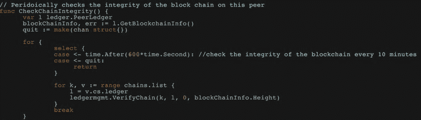

# 中央情报局安全三部曲上的区块链

在前一章中，我们介绍了 Hyperledger 模型、其核心组件、其流程和链码编程。在本章中，我们将介绍以**机密性、完整性和可用性** ( **中情局**)安全三元模型的形式安排原生区块链和 Hyperledger 组件的基本方法。这个三元模型是与区块链结构相关的最古老和最流行的安全框架之一。CIA triad 模型是一种帮助组织构建其安全态势的模型。我们将了解这三个核心要素如何影响区块链技术，以及我们如何通过这种安全模式组织区块链的最佳使用。

在本章中，我们将讨论以下主题:

*   什么是中情局安全三部曲？
*   保密上的区块链
*   诚信上的区块链
*   可用性上的区块链

# 什么是中情局安全三部曲？

CIA 是一个框架/模型，用于安排**信息安全** ( **信息安全**)团队使用的安全控制和系统列表。它有时也被称为**可用性、完整性和机密性** ( **AIC** )安全三元组。triad 的目的是提供一个独立于底层技术、网络或系统的标准框架来评估和部署信息安全策略。

# 机密

机密性是一种对未授权人员隐藏信息的方式。当必须保密的信息仍然保密时，你就实现了保密。在当前这个数字连接的时代，每个人都有足够的进取心去了解那些被保密的信息。安全机构是一个公司打破保密的主要例子，这样他们就可以进行取证和使用监控录像。受经济利益驱使的网络罪犯尽最大努力闯入安全系统并收集机密文件，这将有利于他们的商业对手。

对手和防御者之间的竞赛永无止境。组织每年都要花费数百万美元来实现加密和访问控制系统的全栈保密性。每天都会测试几种方法来保护静态数据和动态数据。

# 完整

完整性是一种防止未经授权篡改信息的方法。这是每个 infosec 机构必须遵守的法规。这也是一种在数据的整个生命周期中维护其一致性、准确性和可信度的方法。数据必须完全安全，任何未经授权的访问都应被禁止。某些有助于上述事情的措施包括文件许可和用户访问控制。

# 有效

可用性是指对数据的及时可靠的访问。从数据到信息和信息到价值的路径意味着，如果信息在正确的时间不可用，价值将是非法的。**分布式拒绝服务** ( **DDoS** )和勒索软件攻击是恶意行为者手中最强大的武器，他们利用这些攻击来阻止拥有授权和合法访问权限的人获取信息。组织进行了多种尝试来对抗这些攻击，包括 web 应用防火墙、DDoS 保护、**内容交付网络** ( **CDN** )，甚至灾难恢复。

# 理解区块链的保密性

每一项数字连接技术都伴随着安全挑战的成本，这些挑战可能涉及隐私暴露、机密泄露、身份盗窃等等。区块链技术是一种运行在数字生态系统上的计算技术，因此关注其基本安全挑战变得非常重要。全球各种规模的企业都会为网络安全分配年度预算，以便他们能够对自己的信息和关键资产保密。让我们了解一下当前区块链模型及其未来路线图中的保密程度。

# 现有模式中的保密性

众所周知，区块链技术是和比特币一起引入的。然而，它从来就不是限制性的，因为在比特币的情况下，任何拥有客户端软件的人都可以参与区块生成过程或挖掘。关于区块链的机密性仅仅是关于对网络中不想要的参与者隐藏交易信息。然而，由于比特币等公共区块链的开放和无许可性质，实现更好的保密等级可能极其困难。

# 商业、区块链和保密

当涉及业务时，保密性成为网络安全领域的一个重要支柱，以获得客户和其他利益相关方的更好信任。许可区块链获得了极大的赞赏，因为它只允许预先选择的参与者访问分布式账本网络中的数据。当一个企业与另一个企业进行交互时，不仅仅是关于共享多少信息，还关于谁应该在什么条件下访问哪些信息。在考虑 Hyperledger Fabric 时，IBM 建议应该记住以下几点:

*   对于每项交易，重要的是要知道参与者是否可以看到完整的信息、部分信息或根本看不到信息。必须在智能合同下提及。
*   如果指定了监管机构，他们必须确认监管机构访问数据的范围。
*   了解您的网络的性质(静态或灵活)非常重要，因为机密性参数将来可能会根据新的参与者角色和需求而改变。

# 使用 Hyperledger 结构实现保密性

Hyperledger Fabric 提供了通过轻松调用一组库文件来实现机密性的功能:

*   **基于属性的访问控制** ( **ABAC** ):用户访问事务的决策依赖于事务的身份。这在 ABAC 是可能的。ABAC 可以支持链码和整个结构。事务部署期间使用的属性必须在 Tcert 创建期间由用户传递。确定用户是否可以执行任何特定的链代码是重要的一步。**属性证书颁发机构** ( **ACA** )在验证属性和返回**属性证书** ( **ACert** )中起重要作用。ACA 维护数据库，以便公司可以存储用户及其从属关系的属性。
*   **Hyperledger Fabric encryption literal**:智能合约可以配置为加密交易中的信息或信息子集。该信息将在分类帐中保持加密，只有应该看到和访问它的对等方可以使用密钥。如果背书策略需要来自不同组织的对等方，则在将信息包括在交易提议中之前，必须对其进行加密。

# 诚信上的区块链

即使在网络安全上投入了更多资金，一些组织仍然不愿意使用公共云解决方案。对去往云的数据应用加密是一种常见的做法，但是加密只能针对内部攻击提供可靠的保密性；它无法保护数据免受由配置错误、软件错误或间谍企图导致的损坏。尽管区块链技术在实现散列算法和 Merkle 树完整性模型的不变性方面有自己的可靠方法，但我们必须尝试并理解它在现实应用程序和 Hyperledger 结构中的实际工作方式。

# 当前区块链网络中的完整性

完整性是避免篡改数据的一种方式。区块链使用加密哈希来确保账本不被篡改。这种散列函数的一个关键特征是它总是单向的，这意味着从逻辑上不可能从散列结果或消息摘要中获得数据。分析消息摘要的模式和预测原始数据也很困难，因为实际消息中即使很小的变化也会导致很大的差异。无论是哪一种区块链风味，它们都广泛使用如下散列法:

*   以太坊帐户标识符是通过使用 Keccak-256 哈希算法对公钥进行哈希运算而创建的
*   比特币地址是通过使用 SHA-256 算法散列公共密钥计算出来的

# 块排列和不变性

我们已经知道，每个节点都是以连接块的形式存储账本，新块的创建依赖于前一个块的哈希。这阻止了恶意尝试扰乱、更改或删除分类帐中任何块的可能性。这有助于组织实现新级别的网络安全完整性，并提供一个平台，您可以在此平台上开发防篡改的业务应用程序。

# 使用 Hyperledger 实现完整性

尽管 Hyperledger Fabric 是分布式分类帐技术的另一种风格，但有几个关键属性使它有别于其他技术。提交对等方总是在将新块添加到分类帐之前对其进行验证。一个对等体被黑客攻击的情况意味着该块可能从分类帐中泄露。为了避免这种情况，有一些方法可以纠正在分类帐中添加块的方式。

# 验证链的完整性

在这种方法中，每个对等点定期验证其区块链，并要求对等点重新检查是否检测到损坏的块。必须调用名为`CheckChainIntegrity()`的函数来保持完整性检查运行:

# 了解区块链的可用性

业务应用程序可以通过网络(公共的或私有的)访问，这些应用程序是一组代码，它们在被访问之前是有价值的，也就是在需要的时候。区块链是一种运行在云上的软件应用程序，它会保持其价值，直到它不被破坏或干扰。对于用户来说，区块链的面孔仅仅是一个**分散的应用** ( **dApp** )，为了让它一直可用，系统的前端和后端都应该无缝运行。

# 当前区块链网络的可用性

及时可靠地访问信息类似于可用性。DDoS 等网络攻击对互联网服务造成巨大破坏，导致网站变得无法访问，这给企业造成了巨大损失。区块链的去中心化特性使得中断这些应用变得更加困难。

# 没有单点故障

即使区块链中的一个节点发生故障，网络中的其余节点也可以访问和使用这些信息。由于所有节点都保留分类帐的精确副本，因此它将始终是最新的。网络中的所有节点在逻辑上都是分散的，并且系统故障的概率为零。

# 业务和可用性

就区块链而言，其可用性是由有效和成功的交易决定的。对于每个企业来说，保留所有交易的记录是一项核心功能，这些交易可以是业务活动的条目、资产条目、供应链管理记录等等。

# 摘要

在这一章中，我们研究了中央情报局安全三部曲对区块链技术的影响。尽管比特币区块链足够强大，足以证明中央情报局安全框架的合理性，但作为一个区块链，它受到了一些组织的赞赏和采纳，几种区块链风格正在进入市场，以实现特定的商业模式。我们已经看到了 Hyperledger Fabric 如何融入 CIA 安全三要素，以及是什么使 Hyperledger Fabric 系统成为商业友好型解决方案。

# 问题

在了解了 CIA 安全三元组系统如何为原生区块链和 Hyperledger Fabric 工作后，回答某些问题是很重要的，例如:

1.  Hyperledger 和其他项目如何融入中央情报局的安全三合一？
2.  增强 dApp 可用性的一些广泛使用的方法是什么？

# 进一步阅读

要更详细地探究区块链背景下的中情局安全三要素，读者可以使用以下链接:

*   *区块链中的保密性*在[https://ether eum . stack exchange . com/questions/25270/confidential-in-区块链](https://ethereum.stackexchange.com/questions/25270/confidentiality-in-blockchain) [。](https://ethereum.stackexchange.com/questions/25270/confidentiality-in-blockchain)
*   *私有区块链中的数据保密*在[https://GDR-securite . irisa . fr/redocs/download/redocs 17-gemalto . pdf](https://gdr-securite.irisa.fr/redocs/download/redocs17-gemalto.pdf)[。](https://gdr-securite.irisa.fr/redocs/download/redocs17-gemalto.pdf)