# 使用区块链部署基于 PKI 的身份

组织需要管理多个应用程序，这些应用程序由不同的系统和服务器托管。组织已经部署了多种基于多因素认证系统(每个系统/应用一种认证系统)、**单点登录** ( **SSO** )和目录服务器等方法的用户认证方式；然而，在互联网上认证用户是一个相对困难的机制。在交换信息之前，在互联网上获得信任也是极其重要的，因为互联网对可信方和不可信方都是开放的。为了在公共网络上建立信任，需要一个独立的可信方。一个**公钥基础设施** ( **PKI** )是一个开放的框架，用来解决互联网连接用户之间的信任因素。

在本章中，我们将了解以下主题:

*   公钥基础设施
*   现有 PKI 模型的挑战
*   区块链技术如何提供帮助？
*   实验室和测试结果

# 公开密钥基础设施

组织需要管理和维护数百个基于云的应用程序。管理个人访问控制和身份验证是一项困难的日常任务。当涉及到互联网用户和庞大的网络应用程序时，很难信任单个网站，用户往往会通过这些网站丢失他们的隐私和机密信息。PKI 提供了一种验证个人身份的安全方法。

通过采用 PKI，企业可以简化应用程序遇到的部署和管理问题。随着企业越来越多地转向基于云的应用程序，保护安全敏感型应用程序免受新出现的威胁变得至关重要。网上交流存在多种安全威胁，如身份盗窃、**中间人**(**)攻击、数据泄露等。**

 **# 简而言之，PKI

互联网允许任何人与任何人联系，与现实世界不同，地理/物理障碍不存在。这使得很难在互联网上识别一个人并建立信任以进行进一步的交流。在下图中，爱丽丝想通过互联网与鲍勃交谈；然而，鲍勃拒绝了，因为他没有任何方法来验证爱丽丝的身份:

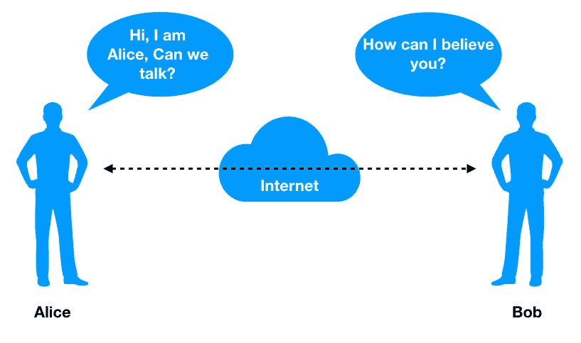

PKI 通过在鲍勃和爱丽丝之间添加一个**可信的第三方** ( **TTP** )来解决这个问题。因此，在他们开始相互了解之前，他们必须建立信任，而 TTP 有助于实现这一点。在下图中，Alice 与 Bob 共享数字证书，Bob 使用来自可信证书颁发机构的公钥解密该签名并验证 Alice。

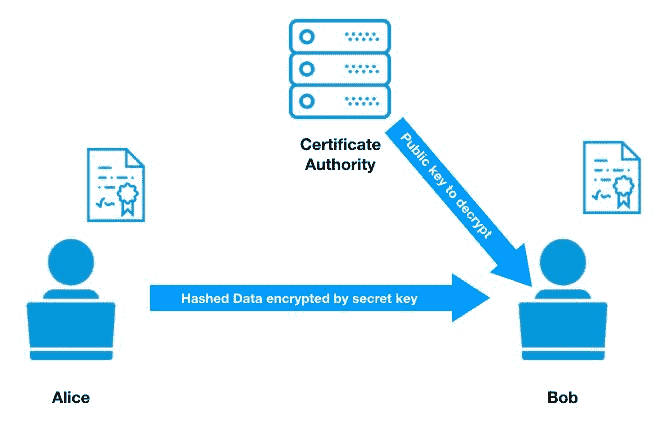

在上图中，TTP 是**认证机构** ( **CA** )。这个 CA 生成一个证书，帮助 internet 用户在 internet 上显示他/她的身份:

*   PKI 提供了一个分级标准来管理一个实体的数字资产，以建立一个安全的通信渠道。它不仅仅局限于用户；它还被几个不同的系统使用，如电子邮件、web 应用程序、智能卡等等，这将在后面解释。
*   **网络设备**:PKI 用于控制通过 802.1X 认证对路由器和交换机的访问。
*   **应用程序**:应用程序需要从 CA 获得签名证书才能在操作系统中运行。
*   **IPsec 隧道:**路由器和防火墙使用证书来认证互联网上的其他端点。
*   **Radius 服务器:**一个**轻量级目录访问协议** ( **LDAP** )查询用 PKI 证书保护。

下图显示了 PKI 安全体系结构:

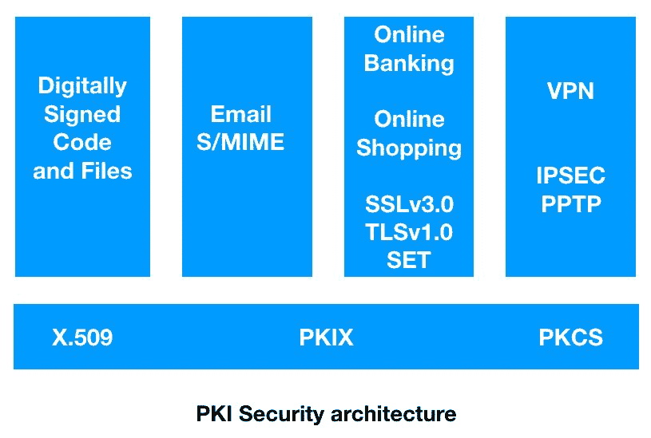

# PKI 的发展

X.509 设计阐述了通过由 CA 数字签名的证书来存储和分发公钥的数据格式和过程。但是，X.509 不包括指定支持如下所示的许多证书子字段和扩展的配置文件:

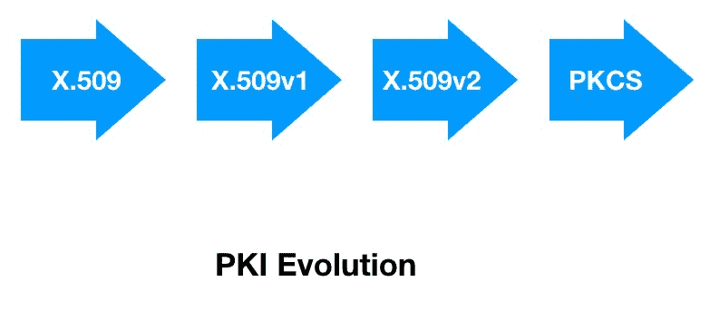

标准工作为 X.509 版本 3 的 PKI 以及版本 2 的证书撤销列表准备了一个大纲。在 RFC 2459 出现之前，大约有 11 个草案来增强 X.509 标准。

RFC 2510 被开发用来指定 PKI 中使用的消息协议。在此之后，有两个并行的发展，需要一个注册协议和优先使用 PKCS#10 消息格式。下图解释了 PKI 头的演变。在版本 2 中，在标题中添加了发行者唯一 ID 和主题唯一 ID。在版本 3 中，引入了一个扩展字段来标识策略和其他相关信息，如下所示:

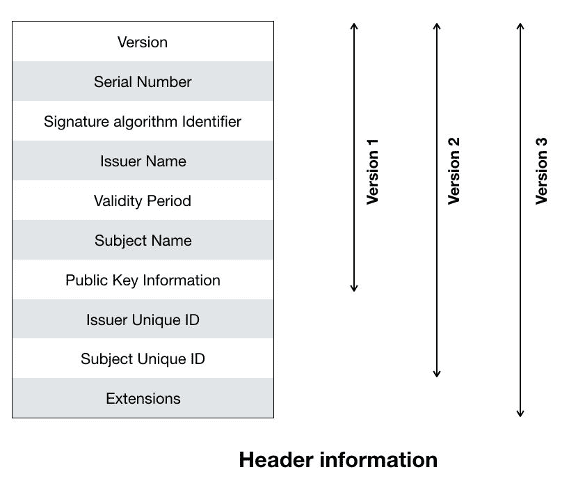

此外，证书请求语法是在 S/MIME WG 和 PKCS#10 中开发的。RFC 2510 定义了一个简单的注册协议，但是它没有使用 PKCS#10 作为证书请求格式。

# 成分

PKI 是各种组件、应用程序、策略和实践的集合，用于组合和实现三个安全原则，即完整性、身份验证和不可否认性。数字证书是 PKI 的主要组成部分，因为它们在互联网上充当数字身份。PKI 的五个核心组件将在下面的小节中进行解释。

# 非对称密钥加密

在密码学中，加密是对信息进行编码的过程，只有特定的一方才能看到它。有两种方法可以实现这种密码术加密——对称加密和非对称加密，定义如下:

*   **对称加密:**在对称加密中，数据的加密和解密使用相同的密钥。需要确保双方使用相同的密钥来加密和解密数据，如下所示:

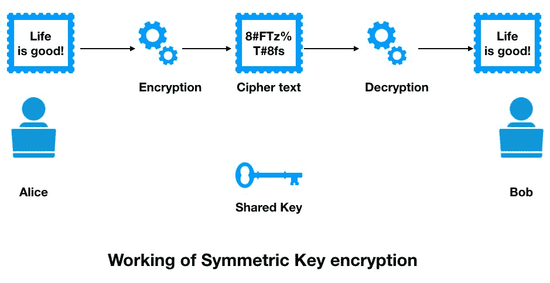

*   **非对称加密:**在非对称加密中，使用一组不同的密钥来加密和解密数据。这个密钥对是公钥和私钥的组合。公钥用于加密数据，而私钥用于解密数据。公钥随数据一起通过 internet 传输，但私钥仍由使用它的个人持有，如下所示:

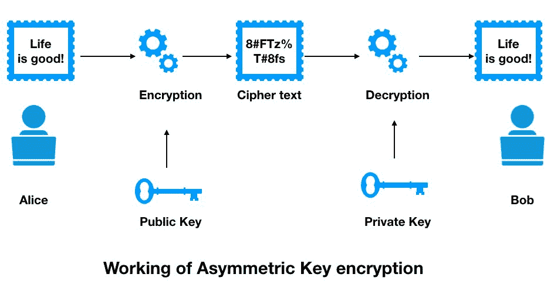

公钥和私钥对包括两个唯一相关的密码密钥。以下是一个公钥示例:

```
3048 0241 00C9 18FA CF8D EB2D EFD5 FD37 89B9 E069 EA97 FC20 5E35 F577 EE31 C4FB C6E4 4811 7D86 BC8F BAFA 362F 922B F01B 2F40 C744 2654 C0DD 2881 D673 CA2B 4003 C266 E2CD CB02 0301 0001
```

每个人都可以通过互联网获得公钥，公钥存储在可访问的存储库或目录中。另一方面，私钥必须对其所有者保密；因此，它也被命名为**密钥**。

公钥和私钥在数学上是相互联系的；因此，用公共密钥加密的数据只能用相应的秘密密钥解密。

# 证书

证书是一种电子 ID，代表对通过网络进行通信感兴趣的用户或设备的身份。该证书基本上确保只有合法用户才能连接到网络。证书是由可信的第三方(即 CA)对公钥进行签名而生成的。

以下是三种主要类型的证书:

*   **安全套接字层(SSL)证书** : SSL 服务器证书安装在服务器托管服务上，如 web 应用程序、邮件服务器、目录或 LDAP 服务器。该证书包含拥有该应用程序的组织的标识信息。SSL 证书还包含一个系统公钥。证书的主题与服务器的主机名相匹配。该证书必须由可信的证书颁发机构签名。主要主机名在证书的主题字段中作为常用名称列出。
*   **客户端证书** : 客户端证书用于识别互联网用户、设备、网关或任何其他类型的设备。它是一个数字凭证，用于验证拥有证书的客户端的身份。如今，许多应用程序允许使用证书来验证用户对特定资源的身份，而不是用户名和密码。通过电子邮件通信的两个用户也将使用客户端证书来验证他们各自的身份。
*   **代码签名证书** : 代码签名证书用于对系统上运行的软件进行签名。随着用户机器下载数百万个应用程序，验证代码是很重要的；因此，代码签名证书在其中扮演着重要的角色。
*   **电子邮件证书**:发送者需要通过 S/MIME 协议识别哪个公钥用于任何给定的接收者。发件人从电子邮件证书中获取此信息。通常，在组织内部部署电子邮件通信并使用自己的 CA 时，会使用 S/MIME 协议。

# 认证机构(CA)

CA 是一个受信任的第三方，它证明用户、服务器、数据库和管理员是他们所说的人。CA 检查用户的凭证并授予证书，用秘密密钥对其进行签名。CA 可以是内部解决方案，也可以是提供证书服务的托管解决方案，如下图所示:

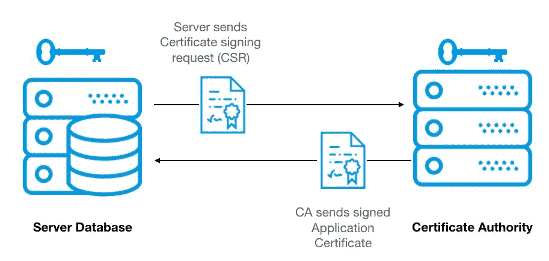

CA 的职能如下:

*   颁发和交付证书
*   将证书和**证书撤销列表** ( **CRL** )发布到存储库
*   管理来自证书所有者的吊销请求

在下面的屏幕截图中，我们可以看到客户端系统中的数字签名列表。有一个来自多个证书颁发机构的证书及其到期日期的列表:

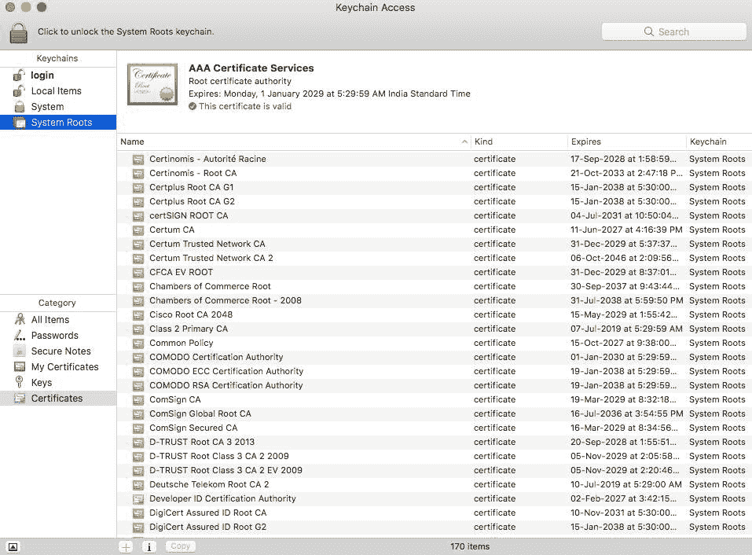

CA 的不同类型如下:

*   **公共数字证书权威**:有几个公共证书提供者管理用于商业和个人目的的证书。只有在支付特定费用后，才会颁发证书。
*   **私有数字证书颁发机构**:组织管理员可以向域内的内部系统和用户颁发证书。Windows 服务器可以创建和存储密钥对，但是这些私有证书对于外部通信无效。

# 注册机构

RA 负责认证需要来自认证机构的证书的较新实体的身份。它还维护本地注册数据信息，并启动旧证书的续订和吊销过程。

RA 的功能如下所示，如下图所示:

*   它负责对需要 ca 证书的新用户或系统进行身份验证
*   它还执行 CA 的一些功能
*   它充当 CA 的代理
*   它维护来自冗余证书的更新和撤销的本地注册数据:

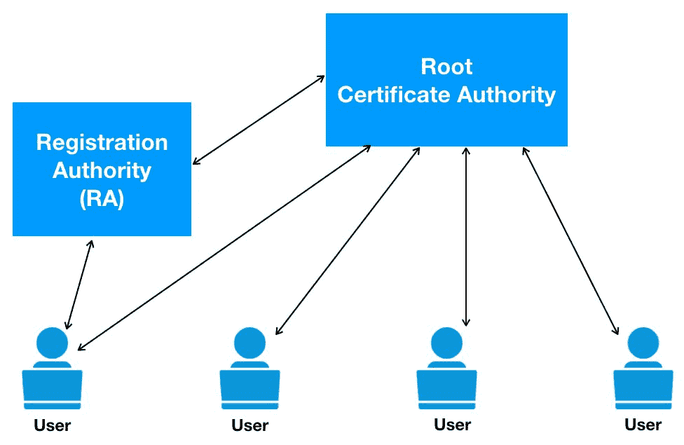

# 证书存储库

CR 是一个证书数据库，PKI 环境中的所有节点都可以访问它。它还保存与证书吊销相关的信息和管理策略信息。证书撤销列表在此存储库中用于获取更新的证书列表。

证书存储库的功能如下:

*   它允许以未经验证的方式检索信息
*   它作为一个数据库来保存诸如公钥证书、撤销列表和策略等信息

# 体系结构

整个 PKI 架构基于一个名为*信任链*的模型。这个模型存在于每个身份之间的信任关系中。具体来说，两层层次结构和三层层次结构的区别在于，第二层位于根 CA 和颁发 CA 之间。使用第二层 CA 的主要原因是拥有一个负责向颁发 CA 颁发证书的策略 CA。然而，三层层次结构提供了更好的安全性。此策略 CA 也可以用作管理边界。如果管理员由于密钥泄露而需要撤销许多 ca，这种设计也很有用；可以在第二级执行撤销，使根的其他分支可用，如下图所示:

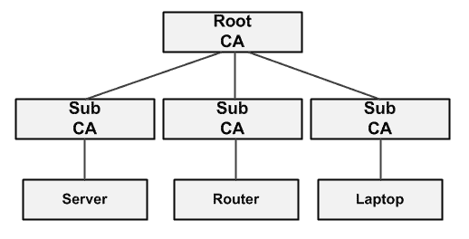

在签名过程中，根 CA 使用其秘密密钥对中间证书进行数字签名。这个过程实现了真实性，表明中间证书受到根 CA 的信任。每个 CA 都可以从客户端接收证书请求并颁发证书。通常，客户端无法访问根 CA，但是客户端有资格持有根 CA 证书。客户端将证书请求发送到某个下级 ca，并获取安装的证书，如下图所示:

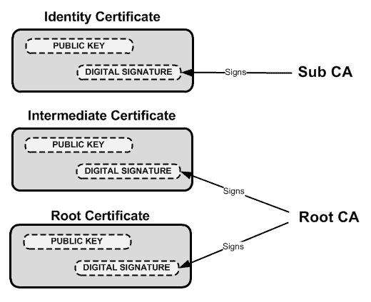

在下图中，我们可以看到共享数字证书及其解密的流程。为了对该方进行身份验证，使用公钥对数字证书进行解密:

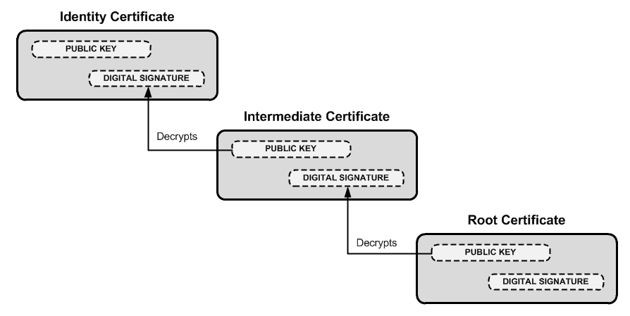

在理解了具有身份、中间和根证书颁发机构的数字证书的层次结构之后，现在，我们将学习如何在具有浏览器和 SSL 网站的终端客户端之间建立和处理通信。客户请求访问 HTTPS 网站。客户端的浏览器预装了许多根 CA 证书。考虑如下步骤:

1.  客户端连接到 SSL 网站。
2.  网站用它的身份和中间证书来响应客户端。
3.  然后，客户端通过使用中间公钥解密数字签名来确认中间证书的身份。
4.  然后，客户端确认请求的 URL 与身份证书中的可分辨名称相匹配。如果不匹配，它会显示一个警告。
5.  然后，客户端使用公钥对流量进行加密/解密，服务器使用私钥对流量进行加密/解密。

# 证书生命周期

根据**国家标准与技术研究院** ( **NIST** )，加密密钥生命周期是密钥管理的操作前、操作中、操作后和删除阶段的组合。考虑在帐户中花费的时间很重要，因为密钥的有效性总是有限的。因此，密码周期用于记录特定密钥被授权使用的时间。通过结合加密将适用的估计时间和加密将被解密以供使用的时间来确定加密期，如下所示:

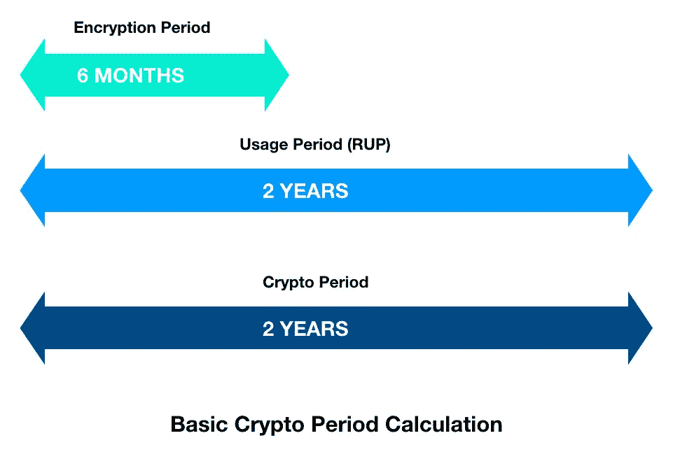

下图显示了具有多个密钥的加密周期流程图:

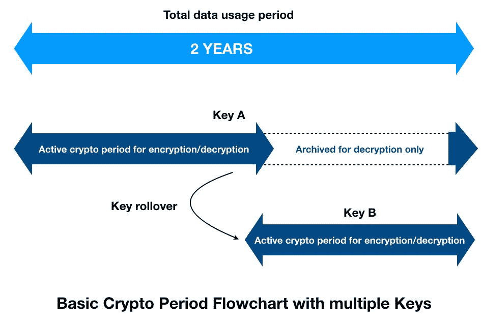

现在，我们可以检查使用和处理密钥的几个阶段:

*   **密钥创建**:生成加密密钥并存储在密钥管理服务器上。密钥管理器通过使用安全随机位生成器的加密过程来生成加密密钥对。一旦创建了密钥对，就将其及其所有属性存储在密钥存储数据库中。这些属性通常由名称、大小、实例、激活日期、翻转、镜像、密钥访问和其他相关属性组成。密钥激活时间可以预定，或者可以在创建时激活。加密密钥管理器跟踪加密密钥的当前和过去的实例。
*   **密钥使用和翻转**:密钥管理器负责允许授权用户或系统检索信息，并允许他们进行加密或解密。它还负责管理加密密钥在其整个生命周期和每个实例中的状态。如果一个组织有一个策略，规定它应该每年使用一组新的密钥，那么密钥管理器应该保留密钥的以前版本，只分发当前版本。但是，仍然可以检索以前的版本，以便执行解密过程。
*   **密钥撤销**:管理员连接到密钥管理器撤销一个密钥，使其不再用于进一步的加密和解密过程。如果需要，管理员甚至可以重新激活密钥，并将其用于后续步骤。在某些情况下，管理员也可以使用以前加密的解密数据，如旧备份。加密生命周期如下所示:

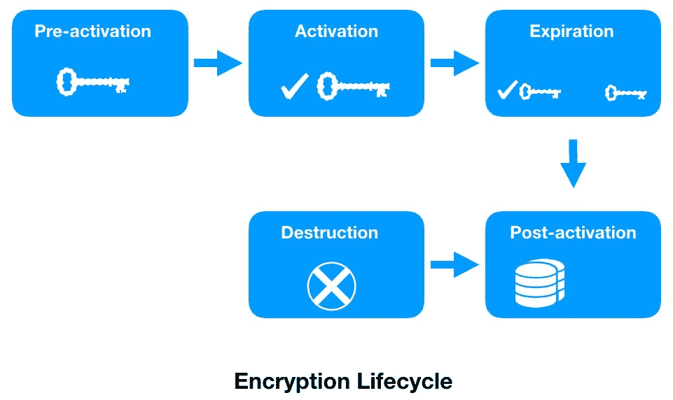

*   **备份(托管)**:NIST 建议对所有停用的密钥进行存档。必须保护该档案，防止任何未经授权的修改、删除和更改。还建议它在其加密期结束后具有可恢复的密钥机制。
*   **密钥删除(销毁)**:如果密钥泄露或长时间不使用，管理员应选择从加密密钥管理器的密钥存储数据库中删除密钥。密钥管理器删除密钥及其所有相关实例，或者可以专门删除某些实例。当数据在其加密状态下遭到破坏时，此选项起着重要的作用。如果密钥被删除，受损数据将完全安全且不可恢复，因为不可能重新创建加密密钥。

# 密钥管理

**密钥管理互操作协议** ( **KMIP** )用于客户端和服务器之间的通信，以对由密钥管理系统维护的存储对象执行管理操作。这是一种在整个生命周期中管理加密密钥的标准化方法，它的开发旨在简化对称和非对称加密密钥、数字证书和其他相关模板，从而简化对象的创建和管理，如下所示:

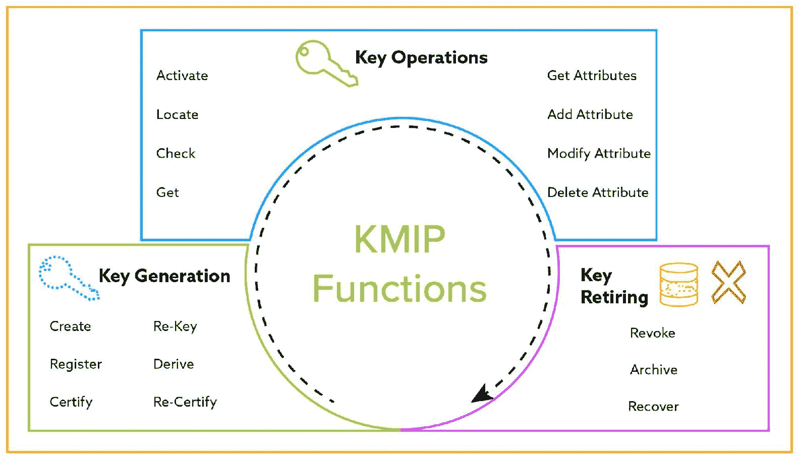

根据结构化信息标准促进组织的指导方针，客户可以向密钥管理服务器请求以下特定的对象列表:

*   **创建密钥或密钥对**:用于生成新的对称密钥或新的公钥/私钥对，并注册新的托管加密对象
*   **注册**:主要用于注册一个带有密钥、密码或其他一些密码资料的被管理对象
*   **重置密钥:**为了生成替换密钥，也称为密钥变更，重置密钥用于现有的对称密钥或现有公钥/私钥对的密钥对
*   **导出密钥**:为了导出对称密钥或秘密对象，使用导出密钥来获取密钥管理系统已知的数据对象
*   **定位**:为了找到一个或多个管理对象，定位请求用于请求中指定的属性
*   **Check** :根据请求中指定的值，检查被管理对象的使用情况
*   **Get 或 get attributes** :用于返回一个被管理对象的唯一标识符指定的被管理对象，或者一个被管理对象关联的多个属性
*   **添加、修改或删除属性**:用于添加、删除或修改与被管理对象关联的属性实例
*   **激活**:用于激活被管理的加密对象
*   **撤销**:撤销被管理的加密对象
*   **销毁**:当需要销毁特定管理对象的关键资料时使用
*   **归档**:**T3 用于指定一个被管理的对象**
*   **恢复**:用于进入数据恢复过程。

# 现有 PKI 模型的挑战

现有 PKI 模型的挑战如下:

*   **问题 1**–**对额外安全性的需求**:根据 Ponemon Institutes 2016 年的研究报告，62%的企业已经使用 PKI 部署了基于云的应用程序，2015 年这一比例增加了 50%。如果中央证书库遭到破坏，将会导致大规模的数据泄露和帐户被盗。组织倾向于使用额外的安全层，如**硬件安全模块** ( **HSMs** )来保护他们的 PKI。部署 HSM 是为了保护最关键根的 PKI，并颁发 CA 私钥。组织选择对管理员和 HSM 使用多因素身份认证。
*   **问题 2**–**中央权威**:在互联网目前的状态下，一个中央权威(根权威)负责管理 DNS 请求和响应(根权威)、X.509 证书等等。因此，所有连接互联网的设备和系统都必须信任第三方来管理公钥和标识符。让我们举一个域名的例子；尽管它已被其所有者购买，但它实际上属于第三方，如**互联网名称与数字地址分配机构**(**)ICANN**)、域名注册机构和认证机构。

此外，这些可信的第三方非常有能力拦截和损害全球用户的完整性和安全性。有几个案例表明，这些可信的第三方已经将他们的客户信息共享给了安全机构和其他机构。他们这样做要么是为了财务收益，要么是为了准备客户行为分析。

# 区块链能帮上什么忙？

PKI 由于其集中式管理系统而具有很大的脆弱性。然而，区块链从根本上来说是去中心化，允许多方之间的通信，而没有任何第三方的参与。去中心化的方法可以是 PKI 中的范式转换；然而，它需要一个系统的方法来部署它。

# 分散的基础设施

区块链是在没有第三方参与的情况下，实现多个参与者的去中心化网络。一个**分散的公钥基础设施** ( **DPKI** )是一个创新的概念，它在公共系统上实现认证系统，而不依赖于可能危及系统完整性和安全性的单一第三方。众所周知，区块链是采用无信任方法构建的，允许可信方和不可信方相互通信。然而，信任通常是在地理上和政治上完全不同的参与者之间建立的，对于分类帐的状态有几个一致的模型。根据定义，区块链允许你用网络中的几个节点存储任何类型的值。使用 DPKI，这个值将是一种秘密属性。

通过在区块链中注册标识符，主体可以直接控制全局可读标识符，如网站域。对于键值数据库，主体使用标识符作为查找键。区块链可以允许分配机密资产，如公钥和其他属性，并允许这些值以安全的方式在全球范围内可读，不会受到任何 MITM 的损害，这在 PKIX 中是可能的。这是通过允许最正确的公钥与标识符值链接来实现的，并且通过对最新公钥的标识符查找来执行认证。

在 DPKI 的这种设计中，系统仍然是分散的，对标识符的控制仍然是委托人的，并且消除了标识符数据存储受到损害的风险。

# 部署方法

在其他平台中，以太坊是最灵活可靠的区块链之一。它是一个可编程的区块链，适合粒度和基于策略的 PKI。PKI 被实现为以太坊区块链中的智能合约中的功能。每个实体可以有多个属性来验证所有权。这些实体可以是公钥或以太网地址。每个交易都使用公钥来标识，然后由相应的实体 ID 和 PKI 来表示。智能合约用于对 PKI 中各种操作的事件和功能进行编程。智能合约还可以配置为调用特定的 PKI 操作，如创建、派生、删除、销毁等等。这些功能和流程将在 Solidity 中编写，并部署在 EVM，这将为用户管理 PKI 操作提供便利。通过对智能合约进行编程，可以使用以下几组 PKI 操作:

*   **实体注册**:通过调用智能合约中的注册事件，将用户或系统添加到 PKI 系统中。实体可以简单到以太坊地址、公钥、属性 ID、数据和数据散列。智能合约上配置的事件收集实体，并将其作为交易转发给以太坊。挖掘排队的事务，并创建一个块，该块稍后将被添加到区块链中。
*   **属性的签署**:一个实体可以用一个注册事件来表征。实体的每个属性都可以由 PKI 系统通过智能合约进行签名，并会发出交易。这个签名的实体以后将对其他实体或用户可用。
*   **属性检索**:实体的属性可以通过使用智能合同上配置的事件的各自 id 对区块链应用过滤器来定位。
*   **撤销签名**:这是任何 PKI 解决方案撤销属性或实体上的数字签名所需的最关键的功能之一。当用户丢失他/她的密钥或密钥被泄露时，撤销变得极其重要。智能协定可以配置为调用撤销事件并撤销特定实体上的签名。

# 要求

在 DPKI 部署中，注册器在基础设施中仍然具有角色，但是它受到如下限制，以确保实体的身份在网络中被表示:

*   要求确保软件始终处于委托人和相应密钥的控制之下。
*   私钥必须以分散的方式生成，以确保它们仍然在委托人的控制之下。必须严格禁止代表当事人生成密钥对。
*   没有一个实体可以在没有委托人同意的情况下改变其他实体。
*   一旦通过以太坊智能合约在区块链内创建了名称空间，就不能销毁它。
*   标识符的注册和更新必须透明。
*   默认情况下，管理标识符的软件必须确保所有活动(如创建、更新、更新或删除标识符)都通过分散的机制转发。

# 工党

我们将首先打开 Node.js 和 Ganache-CLI 框架来开始实验。安装`ganache-cli`必须小心进行，因为它会在我们的本地系统中创建整个以太坊环境。采取以下步骤:

1.  在[https://nodejs.org/uk/download/package-manager/#arch-linux](https://nodejs.org/uk/download/package-manager/#arch-linux)使用网站中显示的命令安装 Node.js。

2.  在终端中运行以下命令:

```
npm install -g ganache-cli
```

现在，我们在终端中使用如下屏幕截图所示的命令启动测试网络:

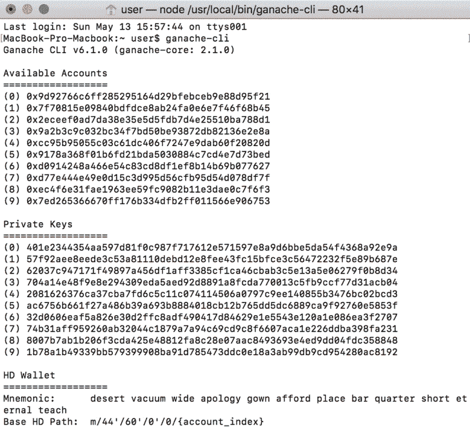

3.  我们现在必须启用开发人员模式来详细查看浏览器内容。我们还必须启用 LOAD UNPACKED 扩展，如下面的屏幕截图所示:


# 测试

CAs 可以发布**反应策略** ( **RP** )，如果针对某个域的未授权证书被发布，这些策略就会生效。在测试过程中，我们需要注册**域证书策略**(**DCP**)并创建 RPs。可以在我们的本地系统上通过以下步骤进行测试:

1.  我们需要首先添加一个检测器并注册它。通过定义检测器 ID 来添加检测器需要以下脚本:

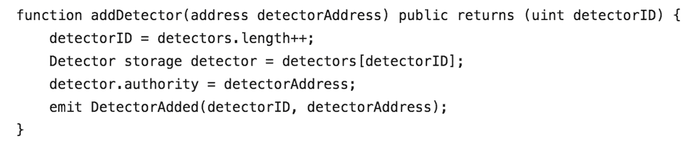

2.  我们现在将注册域所有者用来颁发证书的 CA。需要定义 CA ID、CA 所有者地址和名称，如下所示:

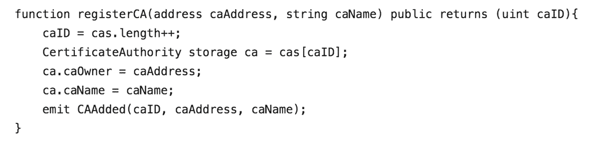

3.  向 CAs 注册 DCP，如下所示:

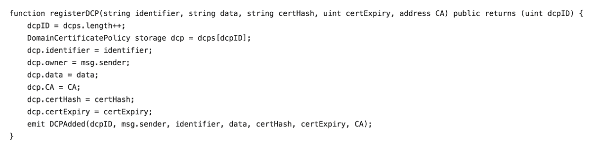

4.  在智能合同下创建一个关联的 RP，如下所示:

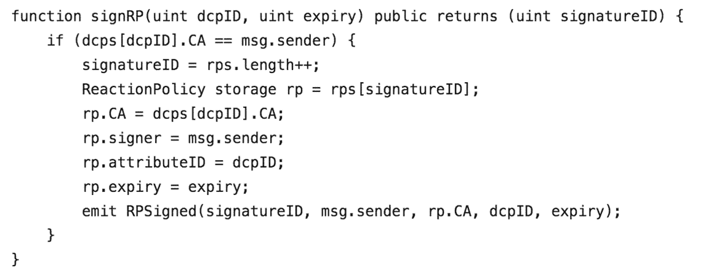

5.  当检测器收到恶意证书的报告时，吊销证书，如下所示:

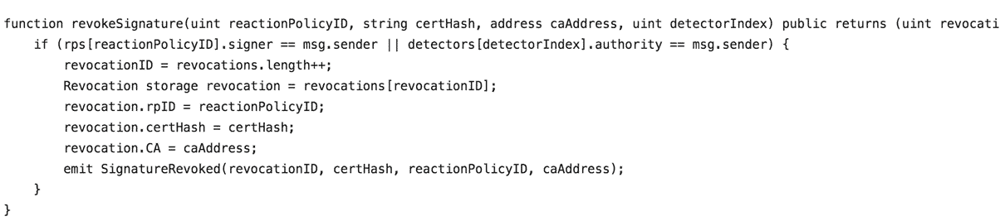

6.  当恶意 CA 频繁行为不端时，检测器现在可以将 CA 列入黑名单，如下所示:

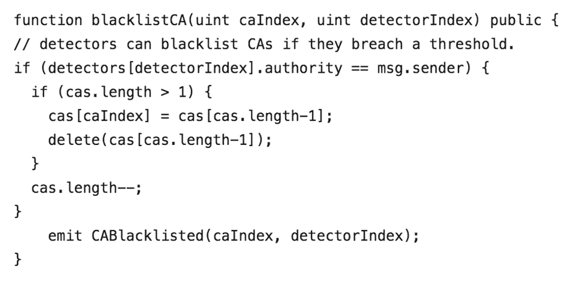

这样，我们就成功地用以太坊区块链部署了 PKI。有了这个基础设施，我们已经描述了从注册 CA 到要求反应支出的整个过程。我们已经成功地开发了一个描述反应支出的模型，并开发了一种方法来对行为不端的 ca 实施问责。

# 摘要

在本章中，您了解了 PKI 的重要性以及它如何解决联网用户之间的信任因素。我们还了解了 PKI 中的几个组件，它们负责使 PKI 成为一个更可靠的模型，以在公共网络上保持信任。

# 问题

在 PKI 提议下已经发布了几个修订版，并且集成了不同的技术。以下是一些可能仍然需要回答的问题:

1.  用于管理密钥的其他方法有哪些？
2.  区块链在基于 PKI 的身份认证方面有哪些进步？

# 进一步阅读

读者可参考以下连结，进一步探讨公匙基建架构及相关技术:

*   *http://www.oasis-pki.org/resources/techstandards/[PKI 技术标准](http://www.oasis-pki.org/resources/techstandards/)*。
*   *https://eprint.iacr.org/2016/1018.pdf[的 IKP:与区块链](https://eprint.iacr.org/2016/1018.pdf)*一起改变 PKI。
*   *https://www.ssh.com/pki/[的 PKI -公钥基础设施](https://www.ssh.com/pki/)*。**