# 部署基于区块链的 DDoS 保护

互联网在用户和应用程序的数量以及各自的带宽方面都在急剧增长。在过去的几年里，一种新的用户变体进入了互联网世界，通常被称为**智能设备**。最简单的形式可以是冰箱、空调或微波炉，也可以像无人机或自动化车辆一样复杂。这些智能设备也被称为**物联网** ( **I** **oT** )设备，监控联网公用事业的功能和运行。尽管有足够多的用例，但攻击者正在利用它们发起一些被称为**分布式拒绝服务** ( **DDoS** )攻击的大规模网络攻击。在本章中，您将了解 DDoS 攻击，以及区块链如何更有效地保护组织免受如此大规模的攻击。

在本章中，我们将讨论以下主题:

*   DDoS 攻击
*   DDoS 攻击的类型
*   当前 DDoS 保护解决方案面临的挑战
*   区块链如何改造现有的 DDoS 保护平台
*   工党

# DDoS 攻击

DDoS 攻击是一种恶意尝试，它通过从地理上分散的系统向目标发出大量请求来中断服务器的合法流量。现在，让我们先了解一下**拒绝服务** ( **拒绝服务**)攻击是如何工作的。在 DoS 攻击中，攻击者用大量的请求轰炸目标机器，导致服务器资源耗尽，结果是合法用户的请求失败。在 DoS 攻击中，威胁参与者使用单台机器耗尽目标服务器；然而，DDoS 攻击要强大得多，因为数百万台机器可以用来耗尽一台目标服务器。

# 什么是 DDoS 攻击？

越来越多的组织正在通过大规模基础设施向云迁移，以满足他们身临其境的客户需求。组织要么构建自己的大型服务器基础架构，要么转向云提供商托管其服务器。如今，攻击者更喜欢 DDoS 攻击方法来中断目标服务，因为他们可以生成数 GB 到数 TB 的随机数据来淹没目标，并且目标安全团队很难识别和阻止每台攻击机器，因为它们的数量有数百万。

此外，攻击者从不合法地控制他们的攻击机器，而是用一些定制的恶意软件感染全球数百万台计算机，然后获得完全的访问权限来发起大规模 DDoS 攻击。这个由数百万台被感染电脑组成的集合被称为**僵尸网络**，而每台被感染的电脑被称为**僵尸网络**。

第一次 DDoS 攻击有点难以准确回忆，但第一次引人注目的重大攻击发生在 1999 年，目标是明尼苏达大学。它影响了 220 多个系统，并使整个基础架构瘫痪了几天。

2016 年 10 月 21 日星期五，全世界见证了对 Dyn(托管 DNS 提供商)的最复杂和最复杂的 DDoS 攻击之一。Dyn 确认 Mirai 未来组合僵尸网络是恶意攻击流量的主要来源。这次攻击引发了人们对互联网安全和威胁的担忧。

# 它是如何工作的？

为了发起 DDoS 攻击，威胁参与者可以构建整个僵尸网络，也可以从黑暗的网络市场中租用。一旦攻击者准备好他们的武器，他们需要发现易受攻击的站点或主机，或者可能是整个网络。

洛克希德-马丁公司的一名计算机科学家创造了一个名为**网络杀伤链**的术语，描述了网络攻击的各个阶段，从侦察到攻击的最终目标。这些阶段是:

*   **侦察**:攻击者识别其目标设备，并开始搜索其中的漏洞。
*   **武器化**:攻击者使用远程工具包和病毒或蠕虫等恶意软件来解决漏洞。
*   **传送**:威胁者通过钓鱼邮件、驱动下载、u 盘、内线等多种方式向受害者网络注入网络武器
*   **利用**:恶意软件代码用于触发攻击，在目标网络上采取行动利用漏洞
*   **安装**:恶意软件现已安装在受害机器上
*   **命令和控制**:该恶意软件允许远程威胁参与者访问受害机器

为了从 DDoS 的角度理解每个阶段，理解僵尸网络基础设施及其构建方式非常重要。

# 构建僵尸网络

如前所述，DDoS 攻击的分布式特性需要全球数百万台受感染的机器。如今，攻击者利用黑暗的网络市场，要么租借现成的僵尸网络，要么购买僵尸网络。有几种工具，如 Jumper、Dirt 和 Pandore，可以消除创建这些僵尸网络的技术障碍。

下图概述了僵尸网络的生命周期:

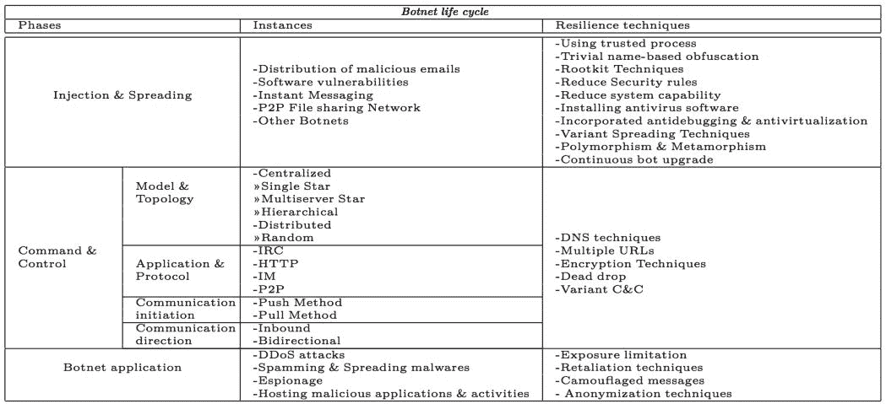

# 侦察

目标系统可以大到数据中心，小到计算机。在这两种情况下，僵尸网络的开发都涉及到识别具有漏洞的主机，这些漏洞可以被一些恶意软件家族利用。攻击者寻找与其目标直接或间接相关的信息，以获得对其受保护资产的未授权访问。威胁参与者尝试所有可能的方法来绕过现有的安全系统，如防火墙、**入侵防御系统** ( **IPS** )、web 应用防火墙和端点保护。

# 武器化

广泛的开源软件消除了创建恶意代码的技术障碍。如果程序员怀有恶意并开发了代码，就会开发出一种新的恶意软件，安全系统很难检测到这种恶意软件。

以下是开发 DDoS 的一些流行工具的列表:

*   低轨道离子炮(LOIC) :这是最受欢迎的工具之一，由流行的黑客组织*匿名者*使用。它是一个简单的泛洪工具，可以生成大量的 TCP、UDP 或 HTTP 流量，使目标服务器过载。最初开发它是为了测试服务器性能的吞吐量；然而，匿名组织利用这个开源工具发起了复杂的 DDoS 攻击。该工具后来增加了 IRC 功能，允许用户通过 IRC 控制连接的机器。
*   **高轨道离子炮(HOIC)** :在有效使用 LOIC 几年后，匿名组织放弃了它，并使用 HOIC 工具首先针对美国**司法部** ( **DOJ** )回应其关闭网站的决定`megaupload.com`。HOIC 也是一个简单的应用程序，支持跨平台的基本脚本，通过简单易用的 GUI 发送 HTTP POST 和 GET 请求。它后来配备了 *booster* 脚本，这是包含附加基本代码的文本文件，称为 **booster 脚本**。该 booster 脚本还允许攻击者指定要攻击的目标 URL 列表。HOIC 仍然被匿名组织用来在全球范围内发起 DDoS 攻击。
*   就像匿名组织一样，有几个不同的黑客组织积极地针对企业和政府机构。一个名为 *hping* 的工具被开发出来，以克服离子炮工具的匿名挑战。它再次用于在目标上生成大量的 TCP 流量，并且可以通过欺骗源 IP 地址来保持匿名。对于一些黑客行动主义者来说，它是最强大和最全面的工具之一。
*   **Slowloris:** Slowloris 是最先进的工具之一，用于使攻击者难以检测和跟踪。这个工具是由一个名叫 **RSnake** 的灰帽黑客开发的，他能够通过创建非常慢的 HTTP 请求来为服务器发起 DDoS 攻击。它生成大量以服务器为目标的微小 HTTP 报头，并让服务器等待其余报头的到达。

# 交付

一旦恶意代码被开发或从黑暗网络市场购买了软件，该软件可以通过鱼叉式网络钓鱼电子邮件发送，也可以通过垃圾电子邮件发送。两者的选择取决于目标和操作的复杂程度。

我们可以将该过程分为以下三组传播恶意代码的方法:

*   **中央源传播**:在这种方法中，攻击者计划制作的易受攻击的系统将被提供给中央系统，以便攻击系统的副本从中央托管的基础设施转移到新被入侵的系统。移动整个工具包后，脚本会自动启动新的攻击周期。这整个机制使用 HTTP、FTP 和**远程过程** **调用** ( **RPC** )协议。在这种方法中，威胁者利用受害者的机器，被侵入的系统连接到攻击者的中央存储库，最后，中央源推送代码。请看下图:

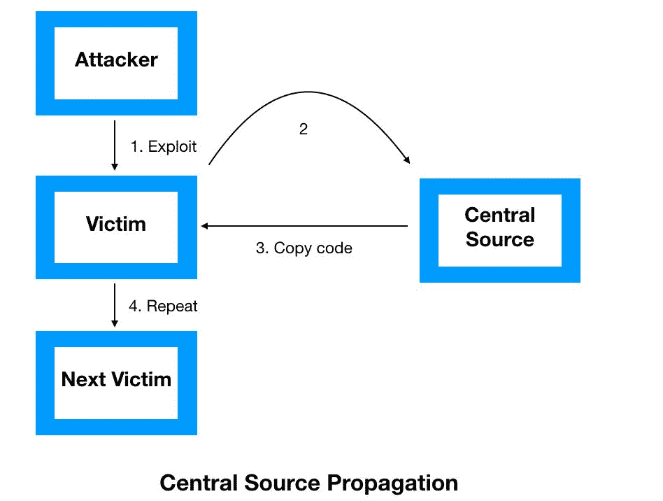

*   **反向链接传播**:在这种方法中，攻击者的工具包被攻击者重新定位到新被入侵的主机上。攻击者的工具包专门设计用于接受来自受损系统的文件请求。反向信道文件复制可以由端口监听器使用**小文件传输协议** ( **TFTP)来完成。**与中心源传播方法不同，攻击者将漏洞和代码一起传输到受害机器:

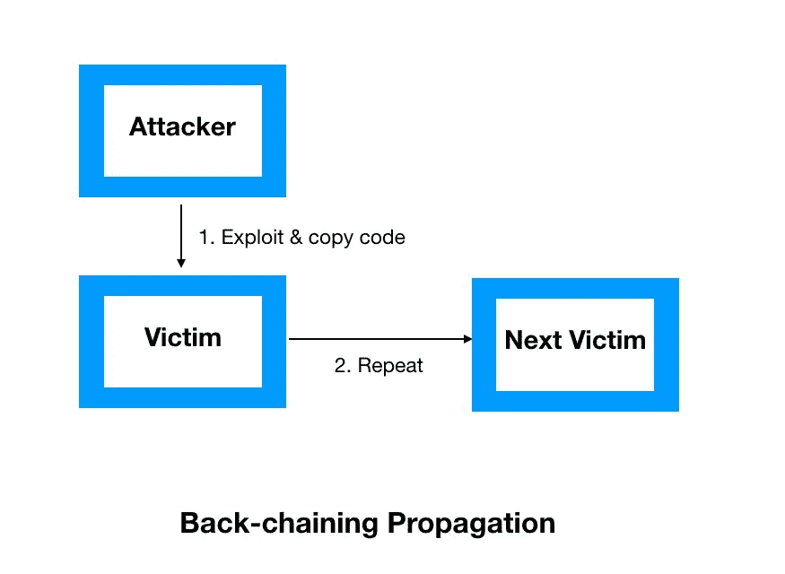

*   **自主传播**:在这种机制下，攻击者一旦闯入系统，他们的工具包就会被转移到被入侵的主机上。这种机制在传输方法上有所不同，因为攻击工具包首先仅由攻击者植入受损主机。在这种方法中，攻击者首先传输漏洞，然后传输来自他自己的代码，而不是来自任何中央存储库的代码。请看下图:

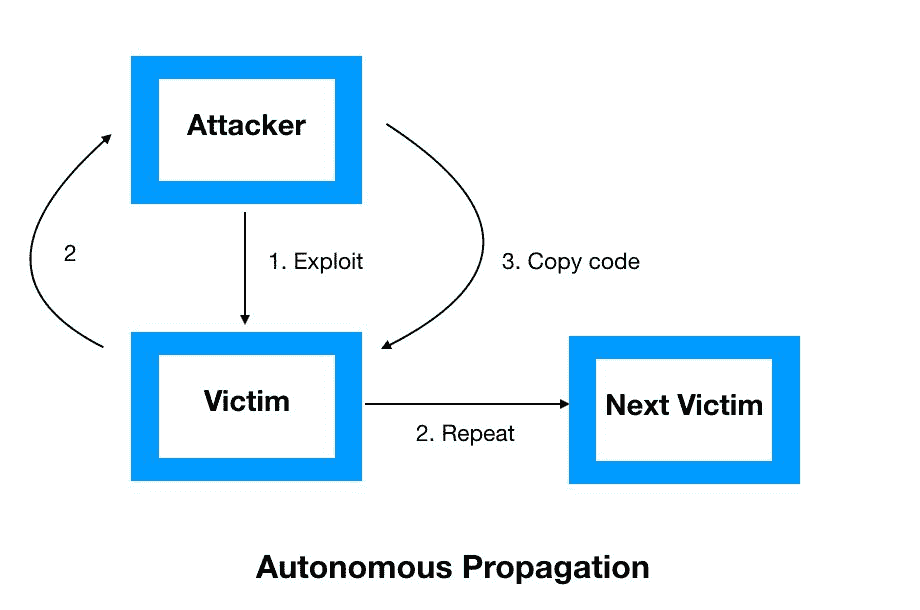

# 剥削

一旦恶意软件被传送到网络，它将启动利用未打补丁的软件漏洞、薄弱的软件编码实践以及缺乏用户注意的过程。通常，网络中存在许多漏洞；然而，漏洞利用的可用性使得该漏洞在本质上更加严重。

# 装置

在安装阶段，恶意软件被安装在目标系统中，并允许远程攻击者访问它。在安装过程中，恶意软件可能安装在系统的用户空间或内核空间中。安装在用户空间的恶意软件被检测到的可能性很高；然而，安装在内核空间中的恶意软件被安全系统检测到的机会很低，例如端点保护、端点检测和响应平台。

# 指挥和控制(C2)

武器成功安装后，目标现在完全在一个名为系统的远程中央系统的控制之下。被入侵设备的网络被称为僵尸网络，完全在威胁者的控制之下；然而，僵尸网络保持沉默，直到它被攻击者激活。在公共对等网络上甚至存在几种加密的机器人对机器人通信。

# 目标行动

一旦建立了 C2 通道，攻击者就可以对目标发起 DDoS 攻击。在这个阶段，攻击者运行脚本来激活整个僵尸网络中的所有僵尸程序。攻击者还会根据需要生成的流量类型来配置僵尸网络。

# DDoS 攻击的类型

DDoS 攻击有几种方式。然而，攻击者基于不同的因素选择其中之一，如目标难度、财务能力、匿名性、优先级和其他因素。运行 DDoS 攻击程序并启动它不需要太多的专业技术知识。主要有三种类型的攻击，分类如下:

*   针对网络资源的攻击
*   针对服务器资源的攻击
*   针对应用程序资源的攻击

# 针对网络资源的攻击

这些攻击活动旨在消耗目标系统的网络资源。在这种攻击中，网络带宽完全被泛滥所消耗。以下是几种类型的泛洪攻击。

# 用户数据报协议(UDP)泛滥

UDP 是嵌入在 IP 数据包中的协议，用于两台设备之间的套接字级通信。UDP 泛洪攻击不会利用目标系统的任何特定漏洞，而是通过高水平的泛洪来破坏目标系统的正常流量。它指向目标服务器上的随机端口，并消耗目标系统的所有流量带宽。这种 UDP 洪流甚至不允许系统发送**互联网控制消息协议** ( **ICMP** )目的地不可达数据包。通常，这种攻击被认为是中小型洪水攻击，以 Mbps 和 PPS 为单位，如下图所示:

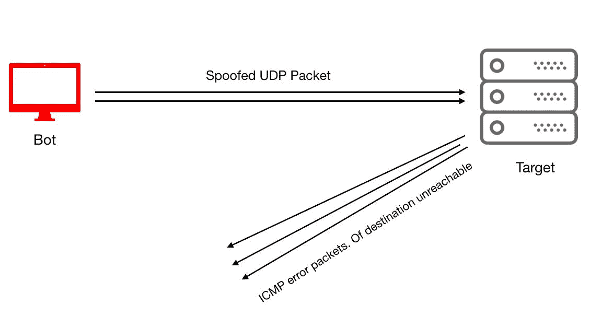

# ICMP 洪水

ICMP 是另一种用于 IP 级可达性和管理操作的无连接协议。同样，它不依赖任何漏洞来工作。可以对任何类型的 ICMP 消息执行 ICMP 泛洪，例如回应请求和回应回复。作为最古老的泛洪技术之一，组织已经在网络设备上部署控制平面策略，以限制设备控制平面可以处理的 ICMP 数据包的数量。

# 互联网组管理协议(IGMP)泛滥

IGMP 是多播协议，本质上是无连接的。它是基于非漏洞的，包括向网络或路由器发送大量 IGMP 消息报告。

# 放大攻击

放大攻击利用了通信信道中请求和应答之间的差异。攻击者可以危害路由器，并通过欺骗源地址迫使路由器在多播地址上发送广播消息。它甚至可以与 DNS 放大一起使用，攻击者可以破坏递归 DNS 名称服务器来缓存大文件。请看下图:

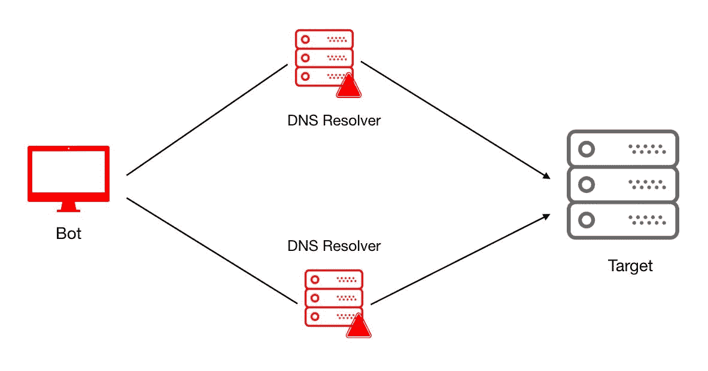

# 针对服务器资源的攻击

以受害者的服务器资源为目标并耗尽整个服务器处理和内存的攻击最终会导致合法流量中断。在这一类别中，攻击者识别目标服务器的漏洞，并将恶意软件武器化以利用这些漏洞。您将了解一些用于执行这些攻击的最常见的技术。

# TCP SYN Flood

这种攻击利用 TCP 三次握手机制，并通过 TCP 同步消息消耗大部分服务器资源。在 TCP 三次握手中，客户端首先发送设置了同步标志的 TCP 包，请求服务器分配资源并建立通信信道。在 TCP SYN 攻击中，攻击系统发送一系列 TCP 请求，并将 TCP 标志设置为 SYN。为了管理这些请求中的每一个，服务器必须打开并分配特定的 CPU 资源，还需要缓冲以准备进一步的通信。现在，服务器发送一个标志设置为 SYN-ACK 的 TCP 消息，并期望客户机用一个带有 ACK 标志的 TCP 消息来确认这一点。攻击系统收到消息，但从不响应，因此，服务器保持套接字打开，并为相同的客户机分配资源。服务器资源是有限的，但攻击者可以不断增加对服务器的请求，最终耗尽服务器，使其无法用于合法的用户流量。TCP 对于请求和响应过程有一个特定的超时，但是攻击者获得了相同时间段的优势来发送大量的 TCP 请求。请看下图:

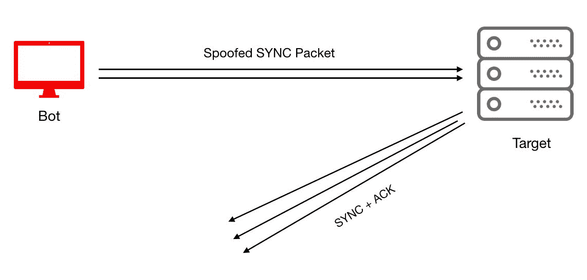

# TCP RST 攻击

在 TCP/IP 协议栈中，TCP 中的 **Reset** ( **RST** )标志用于通知服务器重置其正在进行的 TCP 连接。在 TCP RST 攻击中，攻击者通过尝试随机数字序列来拦截客户端和服务器之间的活动 TCP 连接。在成功识别出数字序列后，攻击者会将 TCP RST 消息伪装成客户端的源 IP 地址。对于人类来说，进行这样的活动是非常困难的。因此，僵尸工具用于拦截和识别活动序列号。

# 基于安全套接字层(SSL)的攻击

SSL 是用于在 web 服务器和浏览器之间建立加密通道的标准安全协议。这确保了在 web 服务器和浏览器之间传输的所有数据都是加密的，因此为互联网用户提供了更好的隐私和完整性解决方案。SSL 运行在 TCP/IP 上，并且仅在 TCP 三次握手完成后才发送 SSL *hello* 。基于 SSL 的 DDoS 攻击可以通过多种方式进行，例如针对 SSL 握手机制，向 SSL 服务器发送随机和垃圾数据，或者利用某些与功能相关的 SSL 加密密钥机制。

# 加密 HTTP 攻击

随着 SSL/TLS 加密的 web 应用程序的使用越来越多，攻击者也开始转向基于加密 HTTP 的攻击。大多数组织没有可以检查 SSL 流量的安全解决方案，因此无法防止恶意流量。攻击者利用这一弱点，通过加密 HTTP 采用越来越多的能力来危害网络。

# 针对应用程序资源的攻击

DDoS 攻击呈上升趋势；威胁参与者正在从传统方法转向更高级、更复杂的基于应用程序的攻击。这些攻击不仅限于基于 HTTP 的攻击，甚至还适应 HTTPS、DNS、FTP、SMTP 和 VOIP。应用程序是由几个独立的组件构建的，因此容易受到攻击。因此，基于应用程序的攻击对威胁参与者更具吸引力。我们将讨论一些最广泛使用的攻击。

# DNS 泛滥

DNS 无处不在，每个组织网络都必须打开 DNS 端口进行名称解析。发起基于 DNS 的泛洪很容易，安全系统也很难检测到它。DNS 使用 UDP 协议来获得更快的请求和响应时间，而无需建立新的连接(就像 TCP 握手一样)。在这种攻击中，DNS 服务器可能会被大量的 DNS 请求淹没，使受害服务器无法处理合法请求。这种技术被用于最近 Mirai 未来组合对 Dyn 网络的攻击，导致用户无法访问 YouTube、Twitter、网飞和其他几个应用程序。

# 正则表达式拒绝服务攻击

这些攻击使用*低而慢的*方法来攻击受害服务器。攻击者利用部署在服务器中的库文件中的漏洞。每当客户端发送带有正则表达式的请求时，服务器必须花费大量资源来处理正则表达式。攻击者利用这一点来利用服务器，并定期发送安全系统检测不到的正则表达式。

# 哈希冲突 DoS 攻击

这种攻击会让攻击者花费几天到几个月的时间来识别 web 应用程序框架中的漏洞。哈希表用于索引大多数应用服务器中的 POST 会话。当返回相似的哈希值时，服务器必须管理哈希冲突。冲突解决会消耗大量的处理资源，因为攻击者会不断发送带有大量参数的 POST 消息。攻击者构建参数的方式会导致服务器端的哈希冲突，从而使服务器忙于处理这些参数。

# 当前 DDoS 解决方案面临的挑战

在过去几年中，观察到 DDoS 攻击的增加。根据 Radware 最近的报告，43%的组织经历了突发攻击，但其余的组织不知道他们是否受到了攻击。攻击者正在采用几种新兴的技术和复杂的策略来危害目标网络。

2018 年 2 月 28 日，代码托管网站 GitHub 遭受了有史以来最大的 DDoS 攻击，记录为 1.35 Tbps。由于 DDoS 攻击属于网络威胁类别，这使得部署任何安全预防机制都不可行，因为系统漏洞在组织的控制之下，但威胁却无法控制。web 应用程序的前端对所有用户保持集中；因此，它给组织留下了单点故障的情况。

# 区块链如何转变 DDoS 保护？

根据定义，区块链是一种分散式网络，允许独立各方在没有任何第三方参与的情况下进行通信。为了保护网络免受 DDoS 攻击，组织可以分布在多个服务器节点之间，以提供高弹性并消除单点故障。使用区块链有以下两个主要优势:

*   区块链技术可以用来部署一个分散的账本来存储黑名单上的 IP
*   区块链技术消除了单点故障的风险

# 工党

为了部署基于区块链的 DDoS 保护平台，我们必须用 Node.js 准备测试环境，用以太坊区块链准备 Truffle。我们将使用现有的区块链项目来保护网络免受 DDoS 攻击。项目链接可在链接[https://github.com/gladiusio/gladius-contracts](https://github.com/gladiusio/gladius-contracts)找到。

此外，我们需要按照以下步骤为 Gladius 项目准备基础设施:

1.  首先，我们将在 https://nodejs.org/uk/download/package-manager/#arch-linux 的环境中安装 Node.js。
2.  我们需要安装`truffle`来测试环境:

```
npm install -g truffle
```

3.  在终端中运行以下命令:

```
npm install -g ganache-cli
```

4.  现在，我们可以在终端中使用以下命令启动测试网络:

```
ganache-cli
```

以下屏幕截图显示了运行上述命令的输出:

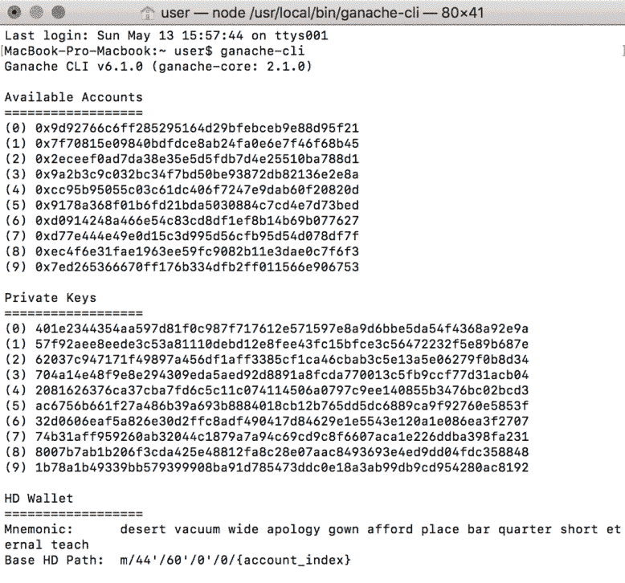

5.  在这个终端窗口中，我们可以看到测试区块链网络中的所有事务。现在，我们必须打开一个新的终端窗口，并需要跳转到工作目录。

要设置项目，请遵循以下说明:

1.  去[https://github.com/gladiusio/gladius-contracts](https://github.com/gladiusio/gladius-contracts)下载`.zip`文件。接下来，将这个文件解压缩到您想要的文件夹中。
2.  用以下代码替换`truffle.js`文件中的代码:

```
let HDWalletProvider = require('truffle-hdwallet-provider')

module.exports = {
    networks: {
        development: {
            host: "localhost",
            port: 8545,
            network_id: "*" // Match any network id
        },
        truffle: {
          host: "localhost",
          port: 9545,
          network_id: "*", // Match any network id
        },
        travisci: {
            host: "localhost",
            port: 8545,
            network_id: "*"
        },
        rinkeby: {
            host: "localhost", // Connect to geth on the specified
            port: 8545,
            from: "0x0085f8e72391Ce4BB5ce47541C846d059399fA6c", // default address to use for any transaction Truffle makes during migrations
            network_id: 4,
            gas: 4612388 // Gas limit used for deploys
        }
    }
};
```

3.  我们将通过终端转到名为`gladius-contracts-master`的文件夹，并使用以下命令编译合同:

```
truffle compile
```

以下屏幕截图显示了运行上述命令的输出:

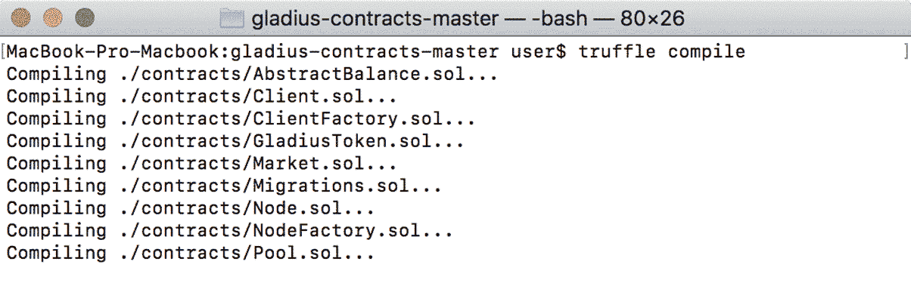

4.  现在，我们将使用以下命令将我们的合同部署到`ganache-cli`本地区块链:

```
truffle migrate --reset
```

以下屏幕截图显示了运行上述命令的输出:

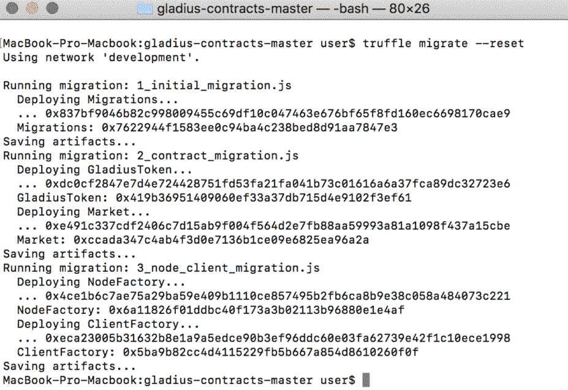

5.  现在，我们必须用`truffle test`命令来启动单元测试，以确保智能合约是有效的:

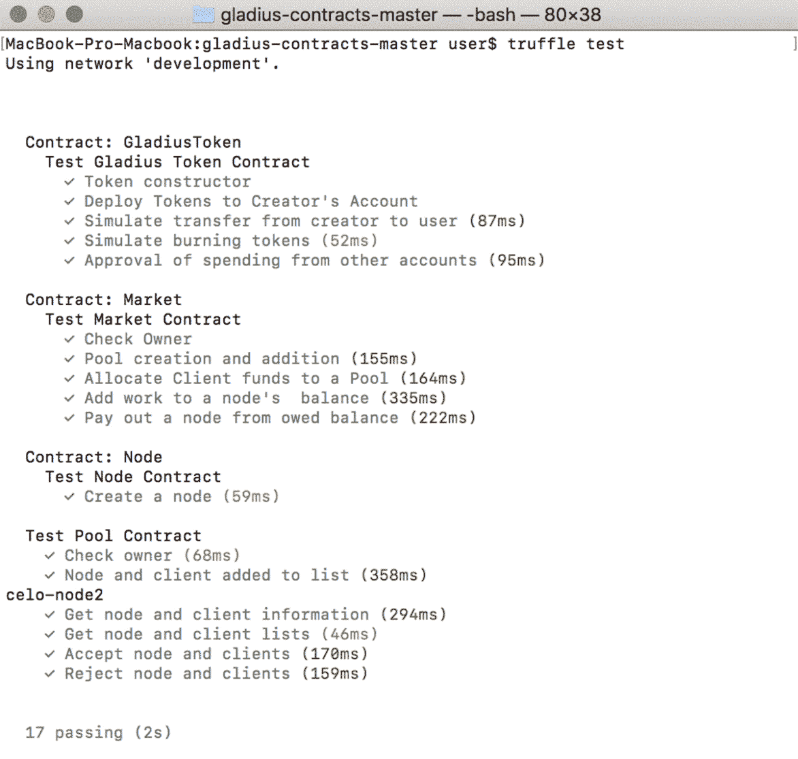

6.  到 https://github.com/gladiusio/gladius-control-daemon 的[，下载`.zip`，解压到`gladius-contracts`所在的文件夹。](https://github.com/gladiusio/gladius-control-daemon)
7.  接下来，我们在终端中定位`gladius-control-daemon-master`文件夹，链接契约**应用二进制接口** ( **ABI** )。ABI 是两个程序模块之间的接口，其中一个模块位于机器代码级别:

```
ln -s ../gladius-contracts-master/build build
```

以下屏幕截图显示了运行上述命令的输出:

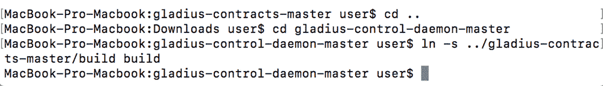

8.  接下来，我们将使用`npm install`命令安装依赖项:

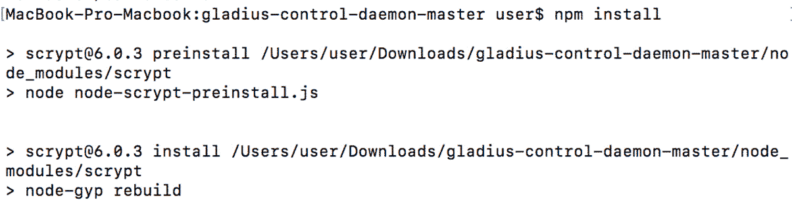

9.  接下来，我们将使用`node index.js`命令启动脚本:

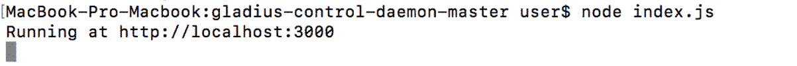

10.  让我们打开一个新的终端窗口并运行`gladius-networkd`命令:

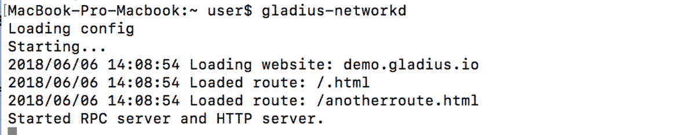

11.  接下来，我们需要打开一个新的终端窗口并运行`gladius-controld`命令:


12.  要启动您的节点，您需要在新的终端窗口中运行以下命令:

```
gladius node start
```

下一个屏幕截图显示了运行上述命令的输出:

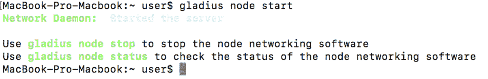

13.  我们可以将数据提交给特定的人才库，允许它接受或拒绝您成为人才库的一部分:

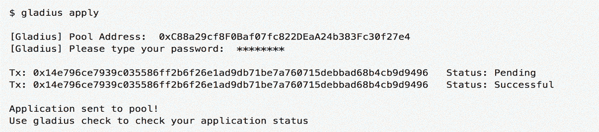

14.  创建完节点后，我们可以使用管理器应用程序检查它的状态。这将显示来自区块链的节点信息:

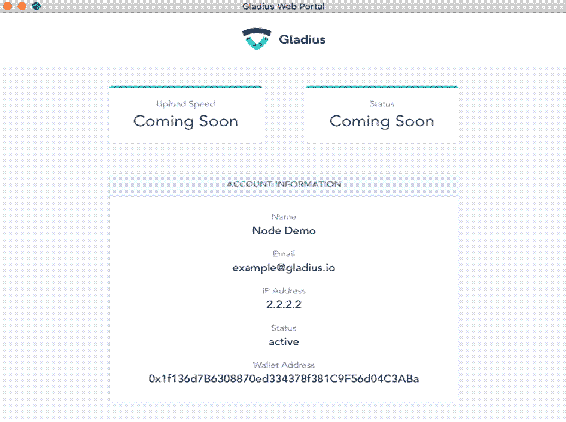

你只需将 Gladius 客户端下载到你的电脑上，然后进入系统。

一旦 Gladius 被激活，所有节点都会处理持续不断的请求流，以验证网站连接并阻止恶意活动。Gladius 正在积极努力解决系统中的几个问题，实现一个稳定的系统。

# 摘要

在本章中，您了解了 DDoS 攻击及其运作方式。我们了解了当前 DDoS 解决方案面临的挑战，也了解了如何使用区块链来帮助我们提供更好的解决方案，以有效保护我们的网络免受恶意流量突发的攻击。

# 问题

读者应该明白，这只是防御 DDoS 攻击的多种方法之一。读者应该检查以下一些问题:

1.  为什么 DDoS 攻击越来越频繁？
2.  我们可以利用区块链来准备即将到来的 DDoS 攻击的威胁情报吗？

# 进一步阅读

要进一步了解用于 DDoS 保护的区块链技术，以下链接可能会有所帮助:

*   *一个基于区块链的架构，通过智能合约协同缓解 DDoS】在[https://www . springer . com/CDA/content/document/CDA _ download document/9783319607733-C2 . pdf？SG wid = 0-0-45-1609389-p 180909480](https://www.springer.com/cda/content/document/cda_downloaddocument/9783319607733-c2.pdf?SGWID=0-0-45-1609389-p180909480)。*
*   *在[基于区块链](https://files.ifi.uzh.ch/CSG/staff/Rafati/Jonathan%20Burger-BA.pdf)*的协同 DDoS 缓解 https://files . ifi . uzh . ch/CSG/staff/拉法蒂/Jonathan%20Burger-BA.pdf 。