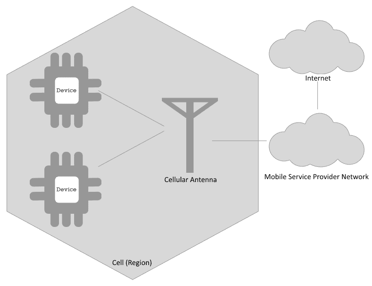
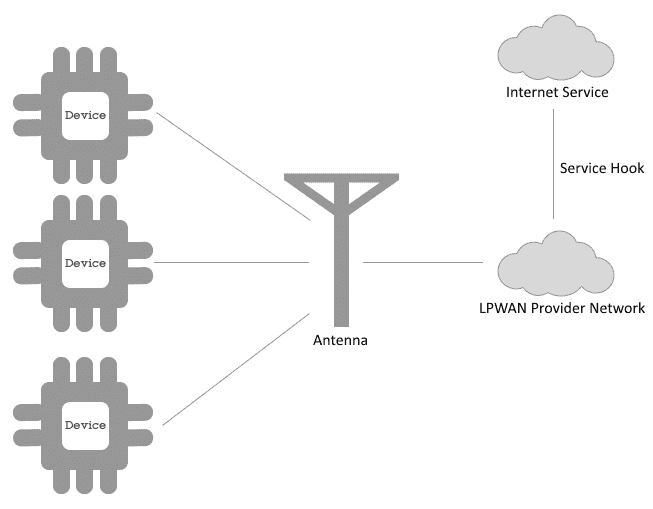
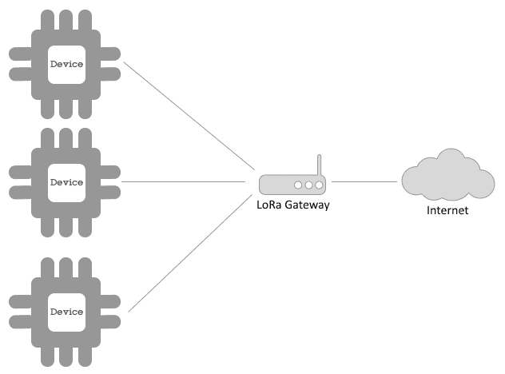
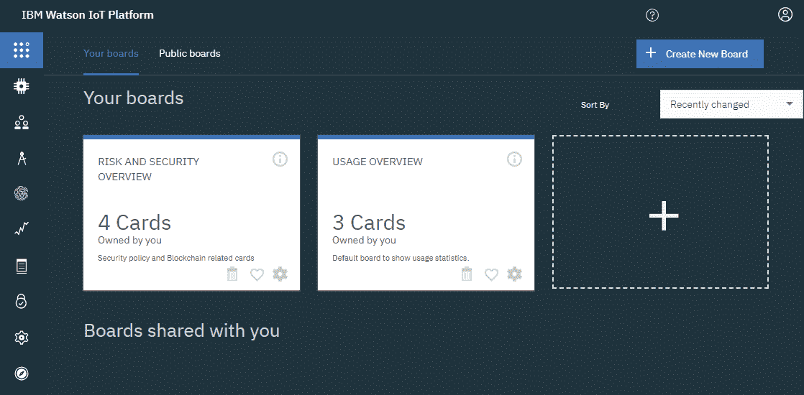
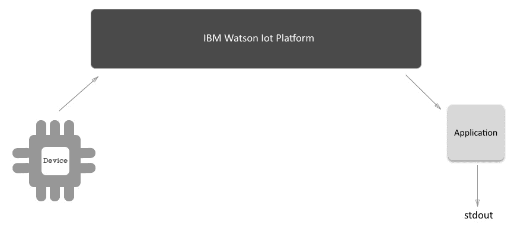
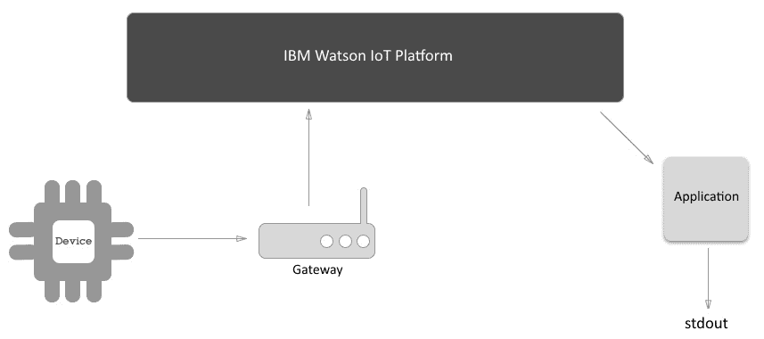
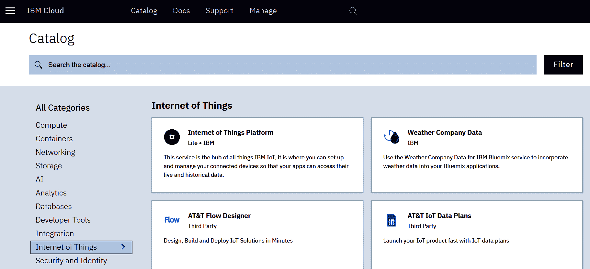
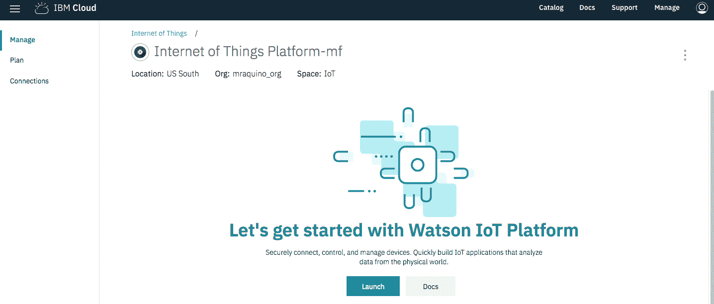
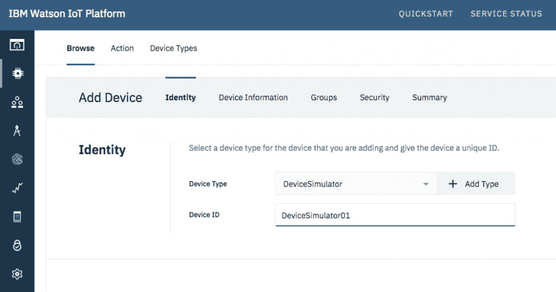
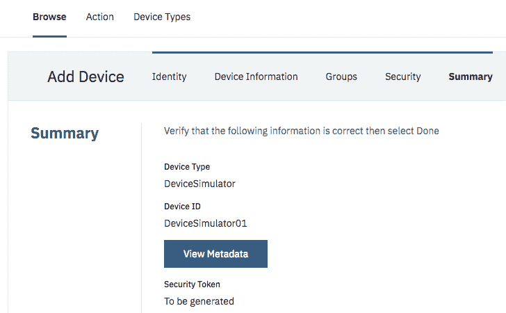

# 了解物联网并在 IBM Watson 物联网平台上开发设备

在当今世界，计算机能够处理难以想象的大量数据，任何人都可以创造和销售自己的设备。正因为如此，**物联网** ( **IoT** )成为当前商业环境下的热门话题，人们之间的联系比以往任何时候都更加紧密。

在这一章中，您将看到物联网如何成为游戏规则的改变者，并了解这项技术可以应用于哪些行业。我们将了解如何进入物联网世界，了解 IBM 物联网平台提供的功能，并学习如何在创建我们自己的物联网解决方案时利用这些功能。

本章将涵盖以下主题:

*   物联网作为一种业务和技术
*   正在实施物联网解决方案的行业
*   物联网解决方案中的技术要素
*   IBM Watson 物联网平台的特性和功能
*   创建集成到 IBM Watson 物联网平台的简单网关、应用和设备

# IoT 是什么？

物联网的定义有很多，但网上最常见的文章都认为物联网是一组通过互联网互联的计算机化事物。物可以理解为人、物、电脑、电话、建筑、动物，以及任何可以连接到互联网的东西。

自从嵌入式系统能够连接到互联网并成为网络的参与者以来，这个术语就一直在使用。从电脑到手机、智能手表到恒温器和冰箱，整条生产线现在都可以连接到互联网。

DIY 社区也丰富了这一演变。在世界各地，你会发现原型系统，如 Arduinos、Raspberry Pis 和其他**片上系统** ( **SOC** )价格更低；方便用户的编程语言；甚至图形编程。

举例来说，联网冰箱会给你带来什么好处呢？嗯，这种类型的技术将允许制造商监控你的行为，并看到你每天早上 9 点到下午 6 点不在家，因为在一个月的时间框架内冰箱门没有打开。如果冰箱可以被重新编程，以减少在此期间的使用，因为没有人会打开门？如果同一个制造商查看从那个冰箱的所有拥有者那里收集的数据会怎么样？深入了解不同的拥有者群体以及他们每天如何与冰箱互动，就有可能根据这些信息创建一个新的模型。这种解决方案将更加环保、可定制，而且更便宜。这也使得更新冰箱软件使其更加智能成为可能，而不需要购买新的。

苹果发布了物联网框架，如 **HomeKit** 和 **HealthKit** 。这些有不同的目标，但仍然是连接到互联网的东西。

人们可以将门/窗传感器、相机、恒温器、灯泡和锁等物体连接到互联网，然后使用 iPhones 上的 Home 应用程序从世界任何地方控制它们。这使得当你在回家的路上时自动更换恒温器成为可能，或者当你在外面时被告知诸如门开着之类的事情。它甚至可以使用连接的体重秤通知你每天的体重。谷歌、亚马逊和其他公司也为这些用例引入了类似的解决方案。

IBM Watson 物联网平台不打算交付产品。相反，它专注于提供一个安全、可扩展和可靠的平台，作为设备和应用程序之间的连接中心。

# 物联网的常见业务用例

冰箱是在家中使用物联网的一个简单而强大的例子，但它不是如何使用物联网的唯一例子。在这一章中，我们将讨论一些不同的案例、行业和人群，它们都可以从联网设备中受益。

# 联网汽车

让我们以自动驾驶汽车为例。有了这个，汽车制造商可以监控司机的一般行为，改善驾驶体验的各个方面，以及安全性。他们还可以更快地检测出故障组件，从而更早地召回产品，从而提高客户满意度，同时降低问题组件的生产成本。从汽车所有者的角度来看，这可能是有益的，因为他们可以监控汽车零件的磨损，并在维护成本上花费更少的钱。

# 关联人士

如果你是一名体育从业者，你可能已经使用智能手表来监控你的健身情况。如果所有这些信息都被正确地存储和分析，那么医学研究可以获得更多的数据来预测疾病，甚至可能提高整体生活质量。

此外，连接健康设备(如体重秤、心脏监护仪和血糖仪)并使用区块链共享数据可以为每个人创建统一的医疗报告。因此，医生可以改进诊断和医疗决策。这也将使疾病概况和预测成为可能。

物联网在 2016 年里约热内卢奥运会上发挥了重要作用。许多相关的项目被用来收集信息和处理比赛中哪些因素对运动员的身体有影响。这也有助于创造新的设备，如自行车，以及激烈竞争的新的再生策略。

这些物联网将如何改变我们整个生活方式的简单例子为我们提供了不止一个为什么我们应该如此关心它的理由。

# 物联网中的技术要素

物联网不仅仅依赖于设备和应用。它需要一系列功能，当用于物联网解决方案时，可以为个人和公司带来更多价值。在本节中，我们将讨论其中一些功能，如设备、硬件和软件，它们对于设计和实施有效的物联网解决方案至关重要。

# 设备

设备位于物联网解决方案的边缘。事实上，这些设备就是我们在物联网背景下所说的*东西*。它们通常能够发送和接收数据事件。

例如，带有嵌入式土壤湿度探头的设备可以检测到被监测的土壤具有 43%的湿度。然后，它可以将这个信息事件报告给它所连接的平台。然后，平台可以向设备发送动作事件，触发水阀打开并恢复土壤水分。这种交互取决于与设备相关的其他方面，这将在接下来的章节中讨论。现在，让我们把重点放在设备上。

为了处理这些类型的交互，您可以将设备视为具有模拟或数字(或两者兼有)处理能力的计算单元。这意味着它能够读取和写入模拟和数字信号到它们的探头和执行器。

模拟信号是一种可以在一定数值范围内变化的信号。让我们以 Arduino Uno 板为例。Arduino Uno 有一个 10 位分辨率的模数转换器**(**ADC**)，这意味着它可以读取 0V 到 5V 的电压，并将其映射为 0 到 1023 之间的整数值(2<sup>10</sup>= 1024)。模拟信号通常用于从模拟传感器读取数据。**

 **数字信号是二进制信号，这意味着它只有两个可能的值:0 或 1，高或低。这种信号主要用于识别或改变开关状态，例如打开或关闭 LED 灯泡。

# 边缘计算

设备也能够自己处理一些动作。这可以是一个简单的决定:例如，如果土壤的含水量低于 50%，打开水阀一分钟，五分钟后再次检查含水量。

或者，这可能是一项复杂的任务:例如，确定自动驾驶汽车的摄像头检测到的对象是一个等待过马路的人还是一棵树。

必须处理这类分析的设备不能总是依赖网络或应用程序来获取信息或帮助。如果其中一个不在服务区呢？这可能会导致事故。

因此，此类设备具有一种称为边缘计算的不同类型的能力，即在解决方案的最边缘(设备本身)处理分析的能力。基本上，边缘计算允许设备“离线”执行一些操作和计算，而无需主动连接到网络。

选择将成为物联网解决方案一部分的设备时，最好的方法是确保设备具备所有功能。

由于物联网网络中有大量设备，超出能力可能会导致与成本、电源、连接协议、用户体验甚至解决方案复杂性相关的不同问题。

# 建立关系网

任何物联网解决方案的另一个重要元素是联网。如今，连接设备有多种方式，因此这是选择设备时必须考虑的一个重要方面。如今最常用的网络标准是有线网络或 Wi-Fi、蜂窝/移动、 **LPWAN** 和 **LoRa** 。所有这些都有利弊，所以让我们仔细看看它们的用途。

# 无线(Wi-Fi)或有线网络

Wi-Fi 是互联网上最常见的标准通信模式。它假设正在连接的设备或对象能够连接到 IEEE 802.x 网络，因此能够处理基于 IP 的网络。

市场上有许多支持 wi-fi 的设备。Wi-Fi 模块的一些例子有 **ExpressIf ESP-8266** 和 **ESP-32** 模块、**德州仪器 CC3200** 、**微芯片 ATSAMW25** 、**英特尔爱迪生**和**伽利略**。这并不是设备的完整列表，还有许多其他组合将支持 Wi-Fi 的控制器和 MCU 结合在一起。

鉴于其可靠性和连接速度(高达 6.7 Gbps)，Wi-Fi 模块相对便宜，通常是在可能或需要使用可用网络并支持高负载传输时的好选择。

基于 Wi-Fi 的物联网解决方案看起来很像下图:


多个设备可以连接到一个节点，例如路由器，该节点进而连接到互联网，并允许连接的设备访问互联网。

# 蜂窝/移动网络

蜂窝网络是任何移动电话使用的相同连接。这种网络的基本思想是将一个区域划分为多个小区，每个小区都有一个无线网络连接，由一个基站和多个收发器提供服务。该网络提供多种服务，如语音、文本和数据。

当解决方案中的设备类型不在 Wi-Fi 网络范围内时，例如在汽车中，移动网络是一个选项。另一个可能需要移动网络设备的应用是当解决方案不能依赖于用户的网络时，例如，如果您使用设备的订阅，并且设备的活动依赖于网络连接。使用订阅网络时，即使用户禁用了自己的网络连接，设备也将继续工作。

下图描述了标准蜂窝网络的工作方式:



我们可以看到，蜂窝天线向有限的区域提供信号。然后，覆盖范围内的设备可以通过无线网络连接到天线，并使用移动服务提供商提供的服务，包括可用的互联网连接。

# 低功耗广域网(LPWAN)

LPWAN 是一种无线网络，旨在以非常低的比特率在广域范围内工作，这意味着这种类型的网络中的交换量非常小。

LPWAN 使用低功耗、低比特率和低频设备，这些设备在用于连接事物时非常强大。这是因为它能够使用长效电池和更小的设备。但是仍然有许多限制，例如小的数据有效载荷或每天有限的消息数量。

具有较低的频率使得 LPWAN 非常可靠并且不受干扰，即使在传播非常大范围的消息时也是如此。LPWAN 提供商通常对网络中发送的消息数量有限制。LPWANs 的提供者有很多，其中最著名的可能是 Sigfox。

LPWANs 没有从设备或网关到互联网的直接连接。相反，他们通常有一个预配置的网络，在网络的一端，您将拥有设备，在另一端，您将拥有许多 web 挂钩和功能，允许您连接到您的应用程序或平台:



与蜂窝网络不同，LPWAN 网络不提供到设备的互联网连接，而是提供在从设备接收到网络事件时创建触发的手段。例如，您可以在通往互联网的 LPWAN 提供商网络的边缘创建一个应用程序和一个触发器，每当从一个设备接收到数据事件时，它就会使用该设备发布的事件中的给定数据调用互联网上的一个可用服务。

# 洛拉或洛拉万

LoRa 网络图类似于 LPWAN 网络，只是 LoRa 网络不使用服务提供商的基础设施，而是有一个允许设备连接到互联网的网关。负责 LoRa 网络基础设施的人是网络的所有者，这意味着您不依赖于网络服务提供商。你创建自己的网络:



有一些技术与 LoRA 工作在相同的模型上，使用不同的协议，如 ZigBee。Phillips Hue 使用相同的方法将灯泡、LED 灯条和其他 Hue 设备连接到使用 ZigBee 的网关，然后网关连接到 Hue 云。

# 网络摘要

总而言之，在选择网络连接时，您可以使用此表作为参考:

| **类型** | **速度** | **有效载荷** | **范围** | **连接初始化** | **成本** | **基础设施** |
| Wi-Fi | 高的 | 高的 | 低的 | 双向的 | 低的 | 私人/公共 |
| 移动的 | 高的 | 高的 | 高的 | 双向的 | 高的 | 供应者 |
| LPWAN(葡萄牙语) | 低的 | 低的 | 高的 | 设备 | 低的 | 供应者 |
| 劳拉 | 低的 | 低的 | 高的 | 双向的 | 低的 | 私人的 |

# 应用协议

为您的物联网解决方案确定最合适的设备后，定义将用于与设备通信的协议非常重要。物联网解决方案倾向于使用轻量级协议，比如 MQTT。这不是唯一可以在物联网中使用的协议，但由于 IBM Watson 物联网平台依赖于 MQTT 和 REST——REST 非常受欢迎——所以让我们稍微关注一下 MQTT。

# MQTT

MQTT 代表**消息队列** **遥测传输**。这是一个基于发布和订阅模式的轻量级消息协议。与任何消息队列模型一样，它是一个异步协议。

如下图所示，发布和订阅(pub/sub)模型依赖于三个参与者:


这三个角色解释如下:

*   **发布者**是产生任何内容并将其发布到给定主题(称为主题)的参与者。
*   **订户**是事件消费者。订阅者订阅其感兴趣的主题(话题),并在每次**发布者**为其订阅之一创建发布时获得发布的事件。
*   **代理**负责接收出版物并通知订阅者感兴趣的主题。

现在让我们转到下一个重要的技术元素。

# 分析和人工智能

在您的物联网解决方案中不一定要有分析或人工智能软件组件，但使用它们来处理从设备收集的数据，以提取模式和见解，从而进行预测性维护，更好地了解用户行为，等等，这真的很有趣。

例如，让我们来看一些通过洗衣机获取的数据。有人可能因为该设备被认为可以节约能源而购买了它。然而，在处理收集的数据后，很明显该设备消耗的能量比想象的要多。根本原因是润滑剂，因为它不适合非热带国家的发动机。

稍后，假设您将该信息与销售数据进行比较，并意识到大约八个月前在欧洲售出了一百万台洗衣机。洗衣机的制造商可以从必须更换的备件的早期运费中获益。制造商还可以为他们的供应商获得可预测量的新润滑剂，这可能会导致新的器具设计。

# IBM Watson 物联网平台特性

IBM Watson 物联网平台是连接物联网解决方案的设备、网关和应用的枢纽。它支持应用程序、设备、网关、事件处理和管理任务的 REST 和 MQTT 协议。IBM Watson 物联网平台在 IBM 云平台(原 IBM Bluemix)上提供，这是一个基于 Cloud Foundry 和 Kubernetes 的云平台。

让我们回顾一下该平台的相关功能。

# 特征

在本节中，我们将讨论 IBM Watson 物联网平台的以下主要特性:

*   仪表盘
*   设备、网关和应用程序，
*   安全性

我们开始吧！

# 仪表盘

这是您访问 IBM Watson 物联网平台时看到的第一样东西。该仪表板可以是许多电路板和卡的组合，为您的物联网解决方案提供多种可视化选项:



探索此屏幕中可用的板和卡，以熟悉界面。

# 设备、网关和应用

该平台的另一个功能是设备管理控制。此功能使创建和删除设备、网关、应用程序和设备类型成为可能。它还可以检查和触发对设备的操作，如固件升级请求或重置:


您还可以创建 API 密钥，以便您的应用程序可以连接到物联网组织，并与解决方案的其他组件进行交互。

# 安全性

您还可以使用物联网平台管理解决方案的安全方面。这可能包括为设备连接创建策略，为设备的 IP 地址创建白名单和黑名单，或者查看某个国家的规则。您还可以管理被允许或被阻止管理解决方案的物联网组织的用户。

# 创建您的首个物联网解决方案

在本章的前几节中，有许多设备和应用没有得到深入解释。为了了解它们在物联网解决方案中的角色，为每一种创建一个示例非常重要。

这里创建的场景将是一个连接到 **IBM Watson 物联网平台**的**设备**，它发送时间戳作为数据，以及一个**应用程序**，它使用 Node.js 将时间戳打印到 **stdout** :



然后，我们将通过向解决方案添加网关来改进这一点，它看起来类似于下图:



归根结底，拥有网关连接和设备连接的区别在于，您可以创建连接到物联网平台的设备的抽象或专门化，这取决于更容易、更便宜或任何其他可能推动决策的原因。

# 创建网关

这项工作的首要任务是创建一个物联网组织。如果您没有 IBM ID 和 IBM Cloud 帐户，注册过程非常直观，只需要几分钟。如果您已经有一个 IBM Cloud 帐户和一个 IBM ID，请在[http://bluemix.net](http://bluemix.net)访问 IBM 云平台。首先，登录并为本书中的练习创建一个空间。

登录 IBM 云平台，访问指定空间后，选择创建资源选项，访问服务目录:


在菜单中选择物联网，创建一个名为物联网平台*的服务。*现在，选择创建**的选项:**



创建服务后，您可以选择启动选项并访问物联网平台:



当你访问物联网平台时，注意地址是`https://xxxxxx.internetofthings.ibmcloud.com/`。

这里，`xxxxxx`是您的组织 ID；记下它，因为它将在整个过程中使用。

# 创建应用程序

创建应用程序意味着您允许实际应用程序或服务连接到特定的沃森物联网平台组织:

1.  为此，通过 IBM Cloud dashboard 访问物联网组织，从侧边菜单中选择 Apps，然后选择*生成 API 密钥*，并用`Hands-On IoT Solutions with Blockchain - Chapter 1 App` *填写*描述*字段。*最后，点击下一步:


2.  选择标准应用程序角色并点击生成密钥*。*你会得到一个`API Key`和`Authentication Token`。以表格形式记下这些信息，如下图所示，因为您将需要它们来连接到您的应用程序:

| API 密钥 | 认证令牌 |
|  |  |

3.  接下来，打开您喜欢的 IDE，创建一个新的 Node.js 项目，并安装`ibmiotf`依赖包:

```
npm install ibmiotf --save
```

4.  确保您的`package.json`文件如下所示:

```
{
  "name": "sample-application",
  "version": "1.0.0",
  "description": "Hands-On IoT Solutions with Blockchain - Chapter 1 App",
  "main": "index.js",
  "scripts": {
    "start": "node .",
    "test": "echo \"Error: no test specified\" && exit 1"
  },
  "author": "Maximiliano Santos",
  "license": "ISC",
  "dependencies": {
    "ibmiotf": "^0.2.41"
  }
}
```

5.  现在，创建一个名为`application.json`的文件，内容如下:

```
{
  "org": "<your iot org id>",
  "id": "<any application name>",
  "auth-key": "<application authentication key>",
  "auth-token": "<application authentication token>"
}
```

6.  创建一个名为`index.js`的文件，并添加以下内容:

```
var Client = require("ibmiotf");
var appClientConfig = require("./application.json");

var appClient = new Client.IotfApplication(appClientConfig);

appClient.connect();

appClient.on("connect", function () {
  console.log("connected");
});
```

7.  可以通过运行`npm start`命令来测试应用程序:

```
$ npm start
> sample-application@1.0.0 start /sample-application
> node .
connected
```

祝贺您，您刚刚创建了第一个连接到 IBM Watson 物联网平台的应用程序！

8.  现在，将`index.js`更新为以下内容:

```
var Client = require("ibmiotf");
var appClientConfig = require("./application.json");

var appClient = new Client.IotfApplication(appClientConfig);

appClient.connect();

appClient.on("connect", function () {
  appClient.subscribeToDeviceEvents();
});

appClient.on("deviceEvent", function (deviceType, deviceId, payload, topic) {
  console.log("Device events from : " + deviceType + " : " + deviceId + " with payload : " + payload);
});
```

现在，每当一个设备发布一个事件，你将得到打印到`stdout`的事件。在下一节中，我们将创建一个设备来发布事件。

# 创建设备

在本节中，您将运行类似的步骤来创建一个连接到 IBM Watson 物联网平台并发布事件的假设备。

1.  从设置步骤中创建的物联网平台服务中，选择菜单中的设备，然后选择添加设备*。*创建一个名为 DeviceSimulator 的设备类型，并在设备 ID 字段中填入`DeviceSimulator01` :



2.  因为它只是一个模拟器，所以只需单击下一步，直到向导结束:



3.  请注意生成的设备凭据，格式如下:

| 设备类型 | 设备 ID | 认证方法 | 认证令牌 |
|  |  |  |  |

4.  返回到您首选的 IDE，创建与先前应用程序具有相同特征的项目:

```
npm install ibmiotf --save
```

5.  确保您的`package.json`文件如下所示:

```
{
  "name": "sample-device",
  "version": "1.0.0",
  "description": "Hands-On IoT Solutions with Blockchain - Chapter 1 Device",
  "main": "index.js",
  "scripts": {
    "start": "node .",
    "test": "echo \"Error: no test specified\" && exit 1"
  },
  "author": "Maximiliano Santos",
  "license": "ISC",
  "dependencies": {
    "ibmiotf": "^0.2.41"
  }
}
```

6.  然后，创建一个名为`device.json`的文件，内容如下:

```
{
  "org": "<your iot org id>",
  "type": "DeviceSimulator",
  "id": "DeviceSimulator01",
  "auth-method" : "token",
  "auth-token" : "<device authentication token>"
}
```

7.  创建一个名为`index.js`的文件，并添加以下内容:

```
var iotf = require("ibmiotf");
var config = require("./device.json");

var deviceClient = new iotf.IotfDevice(config);

deviceClient.log.setLevel('debug');

deviceClient.connect();

deviceClient.on('connect', function(){
  console.log("connected");
});
```

8.  可以通过运行`npm start`命令来测试设备模拟器:

```
$ npm start
> sample-device@1.0.0 start /sample-device
> node .
[BaseClient:connect] Connecting to IoTF with host : ssl://3nr17i.messaging.internetofthings.ibmcloud.co
m:8883 and with client id : d:3nr17i:DeviceSimulator:DeviceSimulator01
[DeviceClient:connect] DeviceClient Connected
connected
```

9.  现在，更新代码，将带有当前时间戳的事件发送到物联网平台服务:

```
var iotf = require("ibmiotf");
var config = require("./device.json");

var deviceClient = new iotf.IotfDevice(config);

deviceClient.log.setLevel('debug');

deviceClient.connect();

deviceClient.on('connect', function() {
  console.log("connected");
  setInterval(function function_name () {
    deviceClient.publish('myevt', 'json', '{"value":' + new Date() +'}', 2);
  },2000);
});
```

10.  再次运行`npm start`，每两秒钟设备就会向沃森物联网平台发送一个事件。您可以检查应用程序的日志，看看它是否收到了事件，如下所示:

```
Device Event from :: DeviceSimulator : DeviceSimulator01 of event myevt with payload : {"value":Sun May 20 2018 21:55:19 GMT-0300 (-03)}
Device Event from :: DeviceSimulator : DeviceSimulator01 of event myevt with payload : {"value":Sun May 20 2018 21:55:21 GMT-0300 (-03)}
Device Event from :: DeviceSimulator : DeviceSimulator01 of event myevt with payload : {"value":Sun May 20 2018 21:55:23 GMT-0300 (-03)}
Device Event from :: DeviceSimulator : DeviceSimulator01 of event myevt with payload : {"value":Sun May 20 2018 21:55:25 GMT-0300 (-03)}
```

再次祝贺您，您的设备模拟器现在正在发布事件，您的应用程序正在接收它们！

# 摘要

在本章中，我们概述了物联网环境。我们了解了在物联网解决方案的成功实施中发挥作用的一些重要技术要素。

我们还研究了不同类型的网络选项、选择设备类型时的重要考虑因素，以及如何创建连接到 IBM Watson 物联网平台的设备和应用。

在下一章中，您将通过创建一个简单的互联花园来提高您的开发技能。

# 进一步阅读

Python、Java、C++和 C#等其他语言的示例可以在 IBM Watson IoT 平台文档中找到，链接如下:[https://console . bluemix . net/docs/services/IoT/getting-started . html # getting-started-with-iotp](https://console.bluemix.net/docs/services/IoT/getting-started.html#getting-started-with-iotp)。**