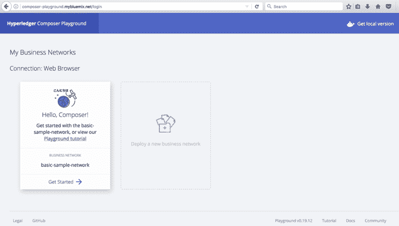
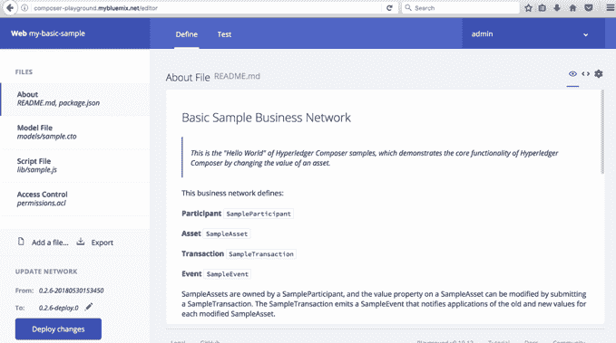
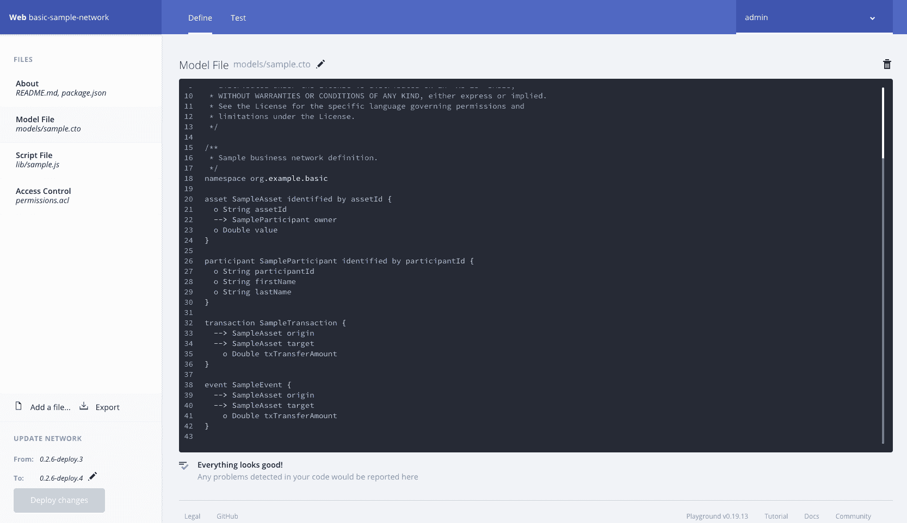
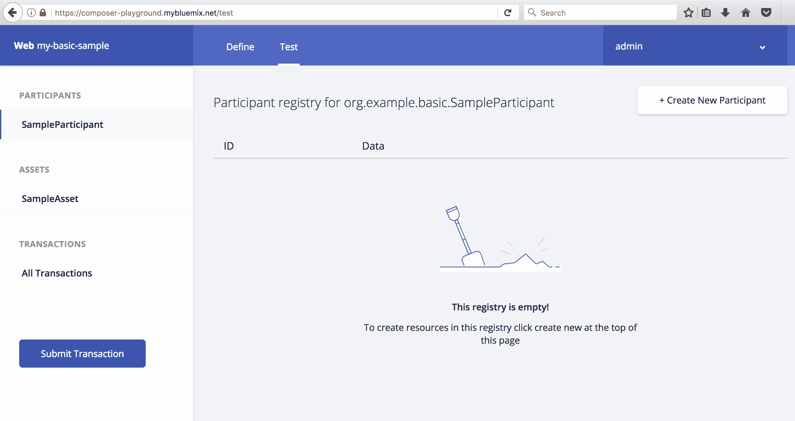
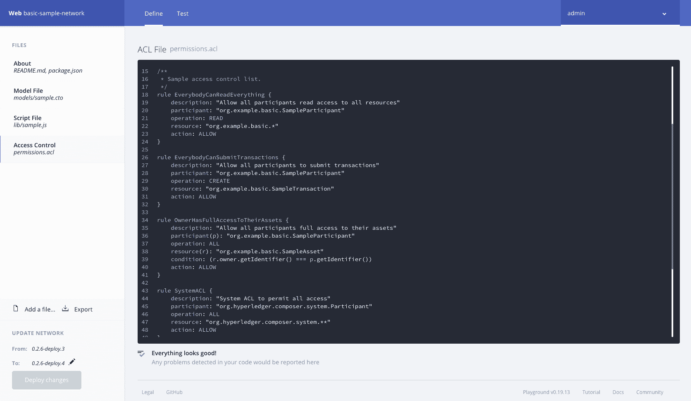
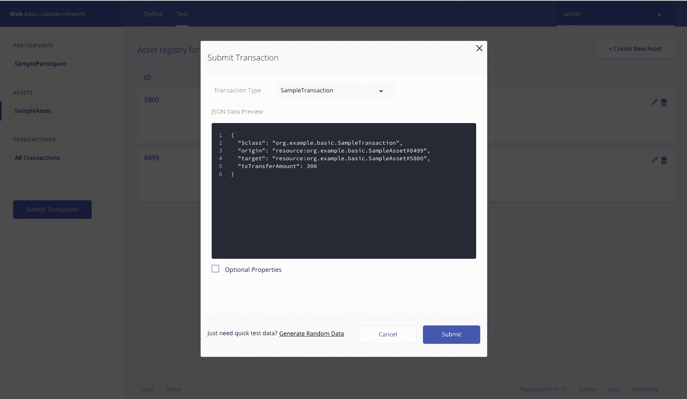
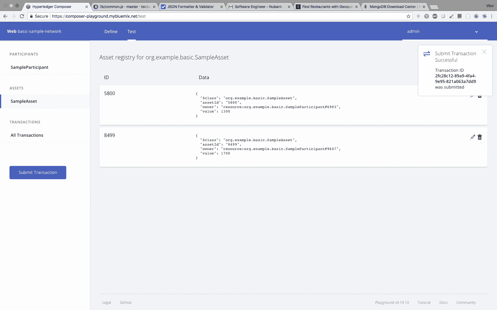

# 创建自己的区块链网络

在本章中，我们将使用 Hyperledger Composer 创建一个区块链网络。我们将探索一个简单的用例，其中资产可以在网络参与者之间转移。我们将了解如何快速安装 Hyperledger Fabric 版。此外，我们将确定并实施一个分步指南来运行您自己的业务网络。

我们将通过探索以下主题来了解所有这些内容:

*   创建区块链网络的先决条件
*   Hyperledger Composer 概述
*   探索作曲家游乐场，创建区块链网络
*   设置本地 Hyperledger Fabric/Composer 开发环境

# 先决条件

要完成本章中的练习，请确保您的计算机上安装了以下软件:

*   卷曲
*   节点. js 8.9.x
*   Python 2.7
*   Git 2.9.x 或更高版本
*   去
*   windows 10/Ubuntu Linux 14.04/MAC OS 10.12

对于 Windows 10，你需要 Windows Subsystem for Linux 来运行 Ubuntu。

# 使用 Hyperledger Composer 创建您自己的区块链网络

在[第 3 章](3.html)、*解释区块链技术和与 Hyperledger 合作*中，我们看了 Hyperledger 分布分类账旗下的各种框架。然后我们分析了其中的一个，Hyperledger Composer，一个开发区块链网络的强大工具。

就区块链而言，使用 Hyperledger Composer 的最大优势之一是框架附带的优秀文档，不仅仅是在网站本身，还包括开发人员的网站和其他保存代码和例程示例的网站。

在这里，我们将看一个比在 Hyperledger Composer 的教程网站上找到的稍微不常见的用例的分步指南，它将演示创建区块链网络是多么简单。我们要用 Hyperledger Composer 的平台，叫做 Playground。

# 访问 Hyperledger Composer

在线 Hyperledger Composer Playground 使我们无需任何安装即可浏览 Hyperledger 组件。以下步骤将引导您浏览在线 Composer 游乐场:

1.  让我们通过以下链接访问该网站:[http://composer-playground.mybluemix.net/login](http://composer-playground.mybluemix.net/login)。正如我们在下面的屏幕截图中看到的，主页打开时有一个闪屏页面:


2.  当你点了咱们区块链！按钮，您将到达下一页，这是一个仪表板:



在此页面上，您可以选择使用教程，该教程将带您完成一个非常详细的分步过程。这对于探索 Hyperledger Composer 非常有用。现在，让我们继续。

3.  单击开始链接。在几个加载屏幕之后，你将被带到编辑器，在那里你将能够创建你自己的区块链网络:



在我们的例子中，我们有两个参与者和一个资产，它可以是一个有值的令牌。想法将是在网络的参与者之间移动这个资产和价值。

# 探索区块链网络示例的结构

1.  让我们从`name.cto`模型文件开始。模型文件定义了我们业务网络中的资产、参与者、交易和事件。请记住，在每一步之后，您都需要部署变更。现在，我们将看到一些说明该过程的屏幕截图:



2.  让我们使用下面的代码来创建参与者、事务和事件:

```
// **
  * Sample business network definition.
  */
 namespace org.example.basic

 asset SampleAsset identified by assetId {
   o String assetId
   --> SampleParticipant owner
   o Double value
 }

participant SampleParticipant identified by participantId {
   o String participantId
   o String firstName
   o String lastName
 }

 transaction SampleTransaction {
   --> SampleAsset origin
   --> SampleAsset target
     o Double txTransferAmount
 }

 event SampleEvent {
   --> SampleAsset origin
   --> SampleAsset target
     o Double txTransferAmount
 }
```

3.  让我们创建一个在参与者之间转移资产的函数。我们将使用`name.js`脚本文件:




4.  让我们看看显示这里使用的算法/逻辑的代码:

```
 * Sample transaction processor function.
  * @param {org.example.basic.SampleTransaction} tx The sample transaction instance.
  * @transaction
  */
 async function sampleExchange(tx) { 
     // Get the asset registry for the asset.
     const assetRegistry = await getAssetRegistry('org.example.basic.SampleAsset');

       //Ensure the balance is greather than the amount to be transfered
       if(tx.origin.value > tx.txTransferAmount) {

     //charge from receiver account
     tx.origin.value = (tx.origin.value - tx.txTransferAmount);

     //add to receiver account
     tx.target.value = (tx.target.value +  tx.txTransferAmount);

     // Update the asset in the asset registry.
     await assetRegistry.update(tx.origin);
     await assetRegistry.update(tx.target);

     // Emit an event for the modified asset.
     let event = getFactory().newEvent('org.example.basic', 'SampleEvent');

     event.origin = tx.origin;
 event.target = tx.target;
 event.txTransferAmount = tx.txTransferAmount;

 emit(event);

 } else {
   throw Error(`You do not have enough balance for this transaction: Balance US$: ${tx.origin.value} Transfer Amount: ${tx.txTransferAmount}`);
 }
 }
```

5.  **A** **访问控制列表** ( **ACL** )是确保 Hyperledger Composer 区块链网络对参与者可以对资产采取的行动的访问进行隔离的功能。现在，我们将创建一个业务规则，允许区块链网络的成员拥有正确的访问控制。基本文件赋予当前参与者(网络管理员)对企业网络和系统级操作的完全访问权:



这里有一些代码向我们展示了如何创建访问控制:

```
/**
  * Sample access control list. rule Everybody Can Read Everything and send a transaction for example
  */
 rule EverybodyCanReadEverything {
     description: "Allow all participants read access to all resources"
     participant: "org.example.basic.SampleParticipant"
     operation: READ
     resource: "org.example.basic.*"
     action: ALLOW
 }
 rule EverybodyCanSubmitTransactions {
     description: "Allow all participants to submit transactions"
     participant: "org.example.basic.SampleParticipant"
     operation: CREATE
     resource: "org.example.basic.SampleTransaction"
     action: ALLOW
 }
```

6.  按如下方式定义对访问控制资产的访问:

```
rule OwnerHasFullAccessToTheirAssets {
 description: "Allow all participants full access to their assets"
 participant(p): "org.example.basic.SampleParticipant"
 operation: ALL
 resource(r): "org.example.basic.SampleAsset"
 condition: (r.owner.getIdentifier() === p.getIdentifier())
 action: ALLOW }

```

7.  为`SystemACL`定义一个规则，无论是网络管理员还是用户，如下所示:

```

 rule SystemACL {
 description: "System ACL to permit all access"
 participant: "org.hyperledger.composer.system.Participant"
 operation: ALL
 resource: "org.hyperledger.composer.system.**"
 action: ALLOW }
 rule NetworkAdminUser {
 description: "Grant business network administrators full access to user resources"
 participant: "org.hyperledger.composer.system.NetworkAdmin"
 operation: ALL
 resource: "**"
 action: ALLOW
 }
 rule NetworkAdminSystem { description: "Grant business network administrators full access to system resources"
 participant: "org.hyperledger.composer.system.NetworkAdmin"
 operation: ALL
 resource: "org.hyperledger.composer.system.**"
 action: ALLOW
 }
```

8.  我们现在准备测试我们的区块链网络。单击屏幕顶部的测试选项卡:


9.  现在为您的区块链网络创建两个参与者。这里显示了第一位参与者:


使用以下代码创建第一个参与者:

```
{
   "$class": "org.example.basic.SampleParticipant",
   "participantId": "1",
   "firstName": "Joao",
   "lastName": "Dow"
 }
```

这里显示了第二个参与者:


使用以下代码创建第二个参与者:

```
{
   "$class": "org.example.basic.SampleParticipant",
   "participantId": "2",
   "firstName": "Sarah",
   "lastName": "Barbosa"
 }
```

10.  现在，让我们为参与者 1 创建一项资产。记得加上`participantId`、`assetId`和`value`:


11.  使用以下代码为参与者 1 创建资产:

```
{
   "$class": "org.example.basic.SampleAsset",
   "assetId": "0744",
   "owner": "resource:org.example.basic.SampleParticipant#1",
   "value": 1000
 }
```

12.  对参与者 2 重复参与者 1 使用的方法:


13.  使用以下代码为参与者 2 创建资产:

```
{
   "$class": "org.example.basic.SampleAsset",
   "assetId": "4010",
   "owner": "resource:org.example.basic.SampleParticipant#2",
   "value": 1000
 }
```

14.  我们现在准备提交参与者之间的交易。单击“提交”按钮，从参与者 2 向参与者 1 发送一笔金额。在以下示例中，交易的价值为 300:



15.  使用以下代码在参与者之间转移金额:

```
{
   "$class": "org.example.basic.SampleTransaction",
   "origin": "resource:org.example.basic.SampleAsset#0744",
   "target": "resource:org.example.basic.SampleAsset#4010",
   "txTransferAmount": 300
 }
```

干得好！您可以通过点击下面两张截图中的记录来查看所有交易详情。第一个显示了所有已创建资产的列表:



第二个屏幕截图显示了在区块链网络上运行的交易历史:


现在，您已经验证了一个用例，您已经准备好进行新的概念验证，并为业务网络中的成员展示 Hyperledger 区块链的全部潜力。

# 使用 Hyperledger Fabric 和 Composer 安装您自己的区块链网络

在上一节中，我们看到了使用 Playground 使用 Hyperledger Composer 是多么容易。现在，我们将在您自己的(本地)计算机上安装 Composer。

我们将从安装区块链网络的三个最重要的阶段开始:

1.  安装必备组件
2.  安装 Hyperledger Composer(开发环境)
3.  更新环境

我们可以通过多种方式使用 Hyperledger Fabric 安装区块链网络，包括本地服务器、Kubernetes、IBM Cloud 和 Docker。首先，我们将探索 Docker 和 Kubernetes。

# 设置 Docker

Docker 可以使用[https://www.docker.com/get-started](https://www.docker.com/get-started)上提供的信息进行安装。

Hyperledger Composer 使用两个版本的 Docker:

*   Docker Composer 版或更高版本
*   Docker 引擎版本 17.03 或更高版本

如果您已经安装了 Docker，但不确定版本，您可以在终端或命令提示符下使用以下命令来确定版本:

```
docker –version
```

小心:许多基于 Linux 的操作系统，比如 Ubuntu，都带有最新版本的 Python (Python 3.5.1)。在这种情况下，获得 Python 版很重要。你可以在这里找到它:[https://www.python.org/download/releases/2.7/](https://www.python.org/download/releases/2.7/)。

# 安装 Hyperledger Composer

我们现在将设置 Hyperledger Composer 并访问其开发工具，这些工具主要用于创建业务网络。我们还将设置 Hyperledger Fabric，它可用于在本地运行或部署业务网络。这些业务网络也可以在其他地方的 Hyperledger Fabric 运行时上运行，例如，在云平台上。

确保您以前没有安装和使用过这些工具。如果你有，你会使用这个指南。

# 成分

要成功安装 Hyperledger Composer，您需要准备好以下组件:

*   CLI 工具
*   操场
*   超分类帐结构
*   An IDE

一旦这些都设置好了，你就可以从这里给出的步骤开始了。

# 步骤 1–设置 CLI 工具

CLI Tools 是一个包含最重要操作的库，例如管理、操作和开发任务。在此步骤中，我们还将安装以下工具:

*   Yeoman :生成应用程序的前端工具
*   **库生成器**:用于生成应用资产
*   **REST 服务器**:运行 REST 服务器的工具(本地)

让我们开始设置 CLI 工具:

1.  安装 CLI 工具:

```
npm install -g composer-cli@0.20
```

2.  安装库生成器:

```
npm install -g generator-hyperledger-composer@0.20
```

3.  安装 REST 服务器:

```
npm install -g composer-rest-server@0.20
```

这将允许与本地 REST 服务器集成，以 RESTful APIs 的形式公开您的业务网络。

4.  安装约曼:

```
npm install -g yo
```

不要将`su`或`sudo`命令与`npm`一起使用，以确保当前用户拥有自行运行环境所需的所有权限。

# 第 2 步-设置游乐场

如果你使用浏览器运行 Playground，Playground 可以在你的本地机器上给你一个 UI。这将允许您显示您的业务网络，浏览应用程序以测试编辑，并测试您的业务网络。

使用以下命令安装 Playground:

```
npm install -g composer-playground@0.20
```

现在我们可以运行 Hyperledger 结构。

# 步骤 3–Hyperledger 结构

此步骤将允许您在本地运行 Hyperledger 结构运行时，并部署您的业务网络:

1.  选择一个目录，比如`~/fabric-dev-servers`。
2.  现在获取`.tar.gz`文件，其中包含安装 Hyperledger Fabric 的工具:

```
mkdir ~/fabric-dev-servers && cd ~/fabric-dev-servers

curl -O https://raw.githubusercontent.com/hyperledger/composer-tools/master/packages/fabric-dev-servers/fabric-dev-servers.tar.gz
tar -xvf fabric-dev-servers.tar.gz
```

您已经下载了一些允许安装本地 Hyperledger Fabric v1.2 运行时的脚本。

3.  要下载实际的环境 Docker 映像，请在您的用户`home`目录中运行以下命令:

```
cd ~/fabric-dev-servers
export FABRIC_VERSION=hlfv12
./downloadFabric.sh
```

干得好！现在，您已经拥有了典型开发环境所需的一切。

# 步骤 4–IDE

Hyperledger Composer 允许您使用许多 ide。两个著名的例子是 Atom 和 VS Code，它们都有很好的扩展来使用 Hyperledger Composer。

Atom 允许您使用`composer-atom`插件([https://github.com/hyperledger/composer-atom-plugin](https://github.com/hyperledger/composer-atom-plugin))来突出显示 Hyperledger Composer 建模语言的语法。你可以从下面的链接下载这个 IDE:[https://atom.io/.](https://atom.io/)也可以从下面的链接下载 VS 代码:[https://code.visualstudio.com/download](https://code.visualstudio.com/download)。

# 使用 Docker 安装 Hyperledger Fabric 1.3

Hyperledger Fabric 平台有多种下载方式；Docker 是最常用的方法。你可以使用官方资料库。如果您使用的是 Windows，您将需要使用 Docker Quickstart 终端来执行接下来的终端命令。

如果您使用的是 Docker for Windows，请遵循以下说明:

1.  查阅共享驱动器的 Docker 文档，可以在[https://docs.docker.com/docker-for-windows/#shared-drives](https://docs.docker.com/docker-for-windows/#shared-drives)找到，并使用其中一个共享驱动器下的位置。
2.  创建一个目录，从 Hyperledger GitHub 存储库中克隆示例文件，并运行以下命令:

```
$ git clone -b master https://github.com/hyperledger/fabric-samples.git
```

3.  要在本地计算机上下载并安装 Hyperledger Fabric，您必须通过运行以下命令来下载特定于平台的二进制文件:

```
$ curl -sSl https://goo.gl/6wtTN5 | bash -s 1.1.0
```

完整的安装指南可在 Hyperledger 网站上找到:[https://Hyperledger-fabric . readthe docs . io/en/release-1.3/install . html](https://hyperledger-fabric.readthedocs.io/en/release-1.3/install.html)。

# 将 Hyperledger Fabric 1.3 部署到 Kubernetes 环境

如果您有使用 Kubernetes、云环境和网络的经验和技能，并且希望深入了解 Hyperledger Fabric 1.3，建议您执行此步骤。

Kubernetes 是一个容器编排平台，可用于主要的云提供商，如 Amazon Web Services、Google 云平台、IBM 和 Azure。IBM 杰出的云架构师之一马塞洛·费托扎·帕里西在 GitHub 上创建并发布了一份指南，介绍如何在 Kubernetes 上建立 Hyperledger Fabric 生产级环境。

该指南可在 https://github.com/feitnomore/hyperledger-fabric-kubernetes 获得。

我们特别感谢马塞洛！

# 摘要

在本章中，我们通过 Composer Playground 探索了 Hyperledger Composer 的在线云部署。通过使用在线网络编辑器，我们了解了如何创建网络定义、在网络上运行测试以及访问历史记录，在历史记录中，我们能够可视化区块链网络上运行的所有事务。

我们还运行了本地开发环境的安装，并为您提供了用于在 Kubernetes 上运行生产级 Hyperledger 设置的资源。

在下一章，我们将探索现代食物链中的主要角色及其当前面临的挑战。然后，我们将讨论物联网和区块链技术如何帮助解决这些挑战。

# 进一步阅读

*   有关 Composer 的更多信息，请访问[https://hyperledger . github . io/Composer/latest/tutorials/tutorials](https://hyperledger.github.io/composer/latest/tutorials/tutorials)。
*   如果您想安装 Hyperledger Fabric 的完整堆栈，请遵循此链接的建议:[https://github.com/feitnomore/hyperledger-fabric-kubernetes](https://github.com/feitnomore/hyperledger-fabric-kubernetes)。
*   Hyperledger 的所有安装流程和架构都可以在这里找到:[https://github.com/feitnomore/hyperledger-fabric-kubernetes](https://github.com/feitnomore/hyperledger-fabric-kubernetes)。
*   安装 Hyperledger Composer 的分步指南可以在这里找到:[https://medium . com/kago/tutorial-to-install-Hyperledger-Composer-on-windows-88d 973094 b5c](https://medium.com/kago/tutorial-to-install-hyperledger-composer-on-windows-88d973094b5c)。