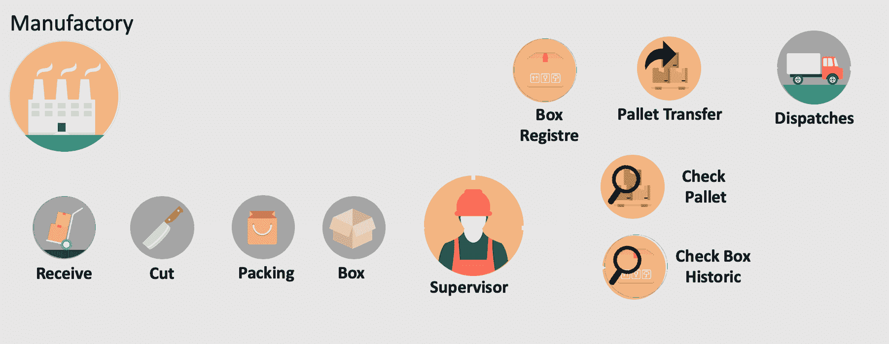
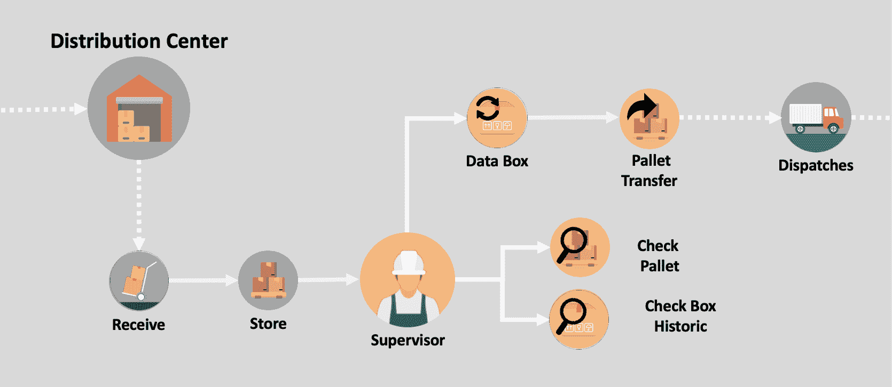
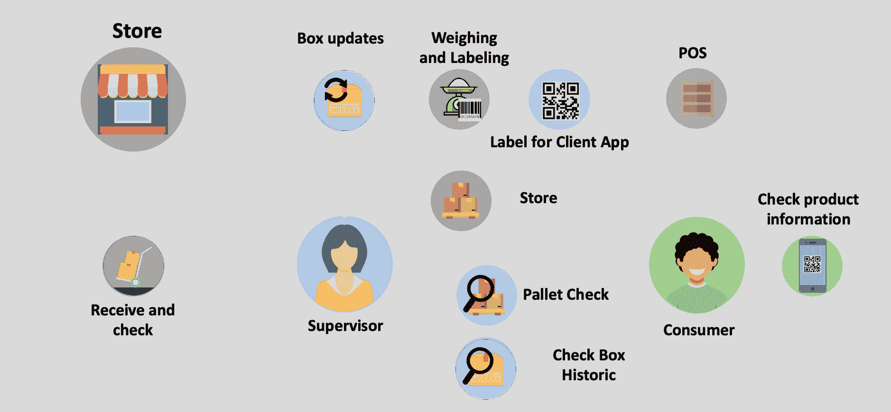
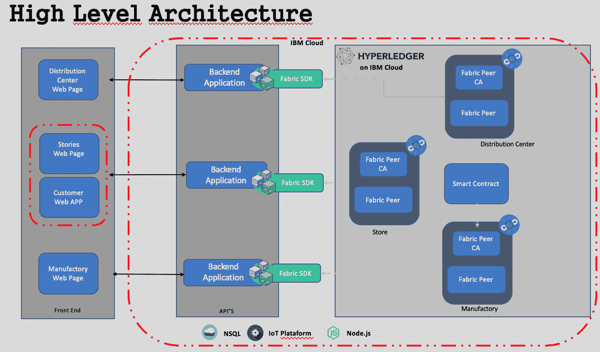
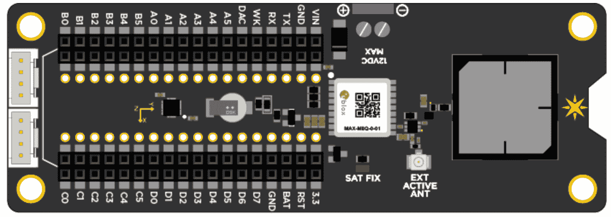
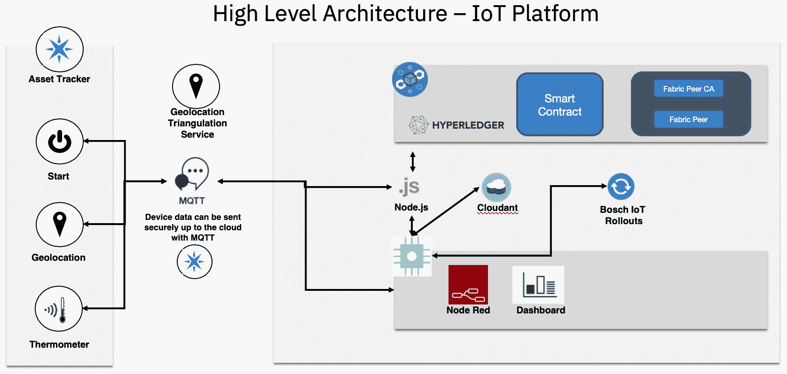
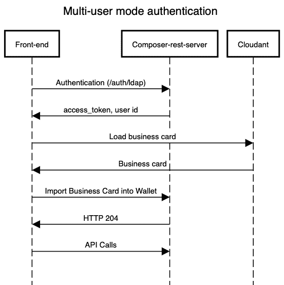

# 设计解决方案架构

在本章中，我们将回顾我们基于物联网和区块链的食品物流网络解决方案的架构，探讨以下主题:

*   **业务方面**:我们将回顾业务组件和业务方面的主要参与者，以及生产和消费者之间发生的过程。
*   **技术**:我们将展示一份我们正在设计的技术解决方案的图表。
*   **软件**:我们将展示一个图表，详细说明软件层面的解决方案，检查各层和集成。

我们还将更详细地回顾我们基于物联网和区块链的解决方案中涉及的一些概念和架构。

# 食品行业

现代食物链非常庞大和复杂。有许多参与者直接或间接地影响着产品的制造和交付。

我们将关注这一现代食品生产流程，了解现代供应链面临的挑战，并提出一种基于区块链和物联网的新方法:


上图所示的业务流程是现代食物链的简化版本。该链可以比这里表示的链大得多。例如，许多超市都有自己的配送中心。然而，由于我们的主要目标是简化，我们没有表示其他因素，如港口和海关。

对于我们的用例，我们将试图从产品交付给制造商的时候开始考虑产品。这个产品可以是任何商品，但是我们将使用鸡腿作为例子。

我们链中要管理的资产将是一个装满鸡腿的箱子，我们的另一个资产将是一个装满装有鸡腿的箱子的货盘。在食物链中，我们将关注以下角色的过程:制造商、配送中心和零售商。**T4】**

如前所述，现代食物链中有许多参与者。请记住，我们正在遵循一个更简化的流程，而不一定是现实生活中的实际流程。我们的目标是了解物联网和区块链如何帮助食物链中的各方和流程。

# 这一进程的挑战

我们选择关注的食物链部分面临许多挑战。我们在此简要列出它们:

*   **来自农民的挑战**:保护原材料关键信息的文档，如产品描述、检查日期、减排日期和库存信息

*   **来自制造商的挑战**:确保产品来源和产品的安全交付和接收，用电子产品包装产品，为监管机构和消费者使用条形码/二维码信息标签，以及将产品打包
*   **来自零售商的挑战**:检查包装完整性，并通过日期、仓库验证和质量控制保持运输线上产品包装的可见性
*   **从消费者的角度来看的挑战**:对产品的来源及其包装中包含的信息有信心，以及快速识别商品，如有必要，将可疑产品从货架上移除并进行消费

# 食品工厂的流程

让我们从目标流程的开始说起。在我们的使用案例中，产品以大块的形式到达工厂，在那里它将被切割、包装，并放入盒子中进行销售。该产品被储存，交付前箱子被放在托盘上。

托盘是用于移动货物的木质、金属或塑料平台，如下图所示:



接下来，我们将看到在产品进入下一阶段之前必须注册的重要数据。当产品到达时，以下数据被捕获并记录:

*   **保管单位** ( **SKU** )
*   动物起源
*   生产商名称
*   动物信息
*   质量管理
*   消减日期
*   冰冻的
*   技术主管详情
*   装运日期
*   温度和运输细节

在登记箱子或托盘的过程中，会获取以下详细信息:

*   库存单位
*   日期
*   工厂地址
*   冻结温度
*   质量记录
*   托盘代码

现在让我们检查链中下一个参与者的流程。

# 配送中心的流程

在切割、包装和交付后，产品到达配送中心，在那里接收并检查储存。根据流程，它可能会被放在更适合运输的更大的托盘上，可以通过火车或卡车运输:



为了避免产品出现任何问题，配送中心会审查工厂发送的数据。如果有任何额外的移动，如托盘转移，需要将新信息添加到包装中:

*   对于该产品，如下所示:
    *   接收日期
    *   托盘号
    *   接收温度
    *   储存温度
    *   运输公司
    *   质量印章
*   对于托盘，是以下 **:**
    *   目的地代码
    *   托盘代码
    *   日期
    *   发货温度
    *   运输公司

检验后，产品被送到零售商手中。

# 超市和商店的流程

商店将收到产品，并检查货物是否符合要求。如果是这样，托盘被拆开，箱子被打开。我们的资产监控到此结束:



为使产品到达消费者手中，在此阶段必须登记以下重要数据:

*   接收日期
*   托盘号
*   接收温度
*   储存温度
*   运输公司
*   质量印章

现在，商店的责任是给产品贴上标签，之后，它可能会也可能不会被直接拿到货架上。

# 技术方法

现在我们对我们的过程和潜在问题有了更好的理解，让我们看看技术如何对我们有用。以下是标准区块链 Hyperledger 结构架构的示意图:



上图向我们展示了三个重要的层:前端应用(左侧)、API/SDK(中间)以及 Hyperledger Fabric 和物联网平台(右侧)。

让我们更详细地回顾一下每一层。

# 前端应用

这一层负责数据输入，可以是一个数据包，如来自 SAP、Salesforce 或 Siebel 的数据包，也可以是一个自定义应用程序。它还可以与物联网设备交互，收集数据并在区块链账本中注册。开发前端应用程序的现代架构由以下几层组成:


好吧，我知道每一层都有很多其他的工具，但我只是使用了我更熟悉的工具。

这种类型的前端架构允许我们将我们的服务从单个接口中分离出来。通过这样做，我们可以将**用户体验** ( **UX** )扩展到几个平台，而不需要重新构建整个应用程序。

# 基于物联网的资产跟踪

物联网在食物链中扮演着重要的角色。物联网设备可以跟踪资产，并且有大量模型可以做到这一点。有用于测量温度的传感器，可以使用 GPS、信标、SigFox、Wi-Fi、4G 和 Sub1Ghz 来确定位置。这些设备和网络可以被农场、工厂、运输公司、配送中心和零售店使用，覆盖了食物链中的所有参与者。

食物链中的主要挑战是运输。许多食物需要特殊的护理，温度是最重要的关注点之一。因为许多食物容易腐烂，温度控制对防止污染和损坏至关重要。

让我们看看如何使用支持物联网的设备来缓解这一挑战。粒子电子资产跟踪器(如下图所示)可用于收集温度和环境数据，识别 GPS 位置和蜂窝三角测量等:



这个跟踪器允许我们与 u-blox M8 GNSS GPS 接收器和 Adafruit LIS3DH 三轴加速器连接。我们也可以把格罗夫传感器连接到它上面。

让我们看一下这种物联网解决方案的高级架构:



此图向我们展示了该解决方案的一些重要组件。让我们看看它们是什么:

*   **消息队列遥测传输** ( **MQTT** ):这是指基于发布-订阅的消息传递协议，在 TCP 上工作。它是为需要少量代码或网络带宽有限的远程位置的连接而设计的。发布-订阅消息传递模式需要一个消息代理。
*   Node-RED 是一个编程工具，使用一个可以创建 JavaScript 函数的流编辑器，以一种简单的方式将硬件设备、API 和在线服务连接在一起。
*   **IBM Cloud** :这是一套面向商业的云计算服务。
*   **博世物联网部署**:这是博世物联网套件中的一项云服务，支持用户管理边缘设备、控制器和网关的软件更新部署。

那么，这些成分是如何在食物链的不同过程中发挥作用的呢？方法如下:

*   节点红色控制面板仪表板使我们能够选择资产跟踪器，并检查位置、数据、设备状态和其他信息
*   资产跟踪器设备可以通过蜂窝网络被激活或更新

*   例如，地理位置数据可以定期传输，并且可以由 Node-RED 中的仪表板跟踪
*   资产跟踪器设备查询温度数据，然后可以查询位置或速度数据
*   Node-RED 可以将温度、位置和速度数据写入 Hyperledger Fabric
*   节点红色仪表板查询 Hyperledger 结构的各种任务和信息，如交易历史记录、日期和时间数据以及地理传感器数据

# API/SDK

SDK 或 API 是负责区块链网络连接的集成层。它通常使用 Node.js 开发，在智能合约的调用中起着重要的作用。今天，我们可以找到涵盖 Go 和 Java 的 API/SDK 文档，Python 的文档也即将出现。

有关如何使用 API/SDK 将您的应用与区块链网络集成的更多信息，您可以参考此链接:[https://hyperledger-fabric . readthe docs . io/en/release-1.3/fabric-SDKs . html](https://hyperledger-fabric.readthedocs.io/en/release-1.3/fabric-sdks.html)。

下图显示了与 API/SDK 集成的应用程序，该应用程序与 Hyperledger Fabric 交互:


Composer JavaScript SDK 源自 Node.js，它允许开发人员将您的应用程序与他们的业务网络相集成。

有两个 npm 模块:

*   `composer-client`:该模块通常作为应用程序的本地依赖项安装。它提供了业务应用程序用来连接到业务网络的 API，以便访问资产和参与者并提交事务。在生产中，这是唯一需要作为应用程序的直接依赖项添加的模块。
*   `composer-admin`:该模块通常作为管理应用程序的本地依赖项安装。这个 API 允许创建和部署业务网络定义。

现在让我们进入解决方案的最后一层。

# hyperledger Composer–高级概述

Hyperledger Composer 是一种创建区块链网络的简单方法，它与 Hyperledger Composer 架构网站提供的全栈工作解决方案相集成。

概括地说，Hyperledger Composer 由以下组件组成:

*   执行运行时
*   就可以了
*   **命令行界面** ( **CLI** )
*   REST 服务器
*   环回连接器
*   游乐场网络用户界面
*   约曼代码生成器
*   VS 代码和 Atom 编辑器插件

详细讨论这些问题超出了本书的范围。你可以访问这个链接来简单的探究一下这些组件:[https://hyperledger . github . io/composer/latest/introduction/solution-architecture](https://hyperledger.github.io/composer/latest/introduction/solution-architecture)。

# 软件组件

现在，我们将从架构师的角度来看我们解决方案的软件组件。这是熟悉所有组件并更好地理解它们是如何集成的好方法。

首先，让我们探索最重要的组件之一:身份验证过程。

我们如何保证区块链的每个成员在我们的前端应用程序中都有正确的访问权限？回答完这个问题后，我们将深入研究 Hyperledger Composer 最重要的组件:建模语言和事务处理器功能。

# 作曲家休息服务器

为了验证客户端，我们需要设置一个 REST 服务器。有了这个选项，在允许客户端调用 REST API 之前，应该对它们进行身份验证。

REST 服务器使用一个名为 PASSPORT 的开源软件，这是一个用于 Node.js 的认证中间件。它灵活且模块化，支持通过用户名和密码、脸书、Twitter、谷歌和**轻量级目录访问协议** ( **LDAP** )等进行认证。在[第 7 章](7.html)、*创建您的区块链和物联网解决方案*中，我们将有更多关于这方面的细节。现在，让我们回顾一下组件是如何工作的。

在下图中，我们可以看到一个使用 Composer REST 服务器的高级身份验证架构:


图中描述了以下组件:前端应用程序、composer REST 服务器、LDAP 和 NoSQL 数据库 Cloudant。

如果您正在进行测试或者需要快速创建概念证明，我强烈建议使用脸书、谷歌或 Twitter 进行认证。这比其他方法更简单快捷。

要使用前面的方法将 composer REST 服务器作为定制实现，我们需要进行一些定制。执行以下步骤:

1.  有一行`composer-rest-server`安装需要在该行之前执行:

```
apk del make gcc g++ python git
```

在使用这种方法之前，通过清理所有以前的安装，确保您有一个干净的环境。

2.  要定制我们的 composer REST 服务器 Dockerfile，请在 RUN 语句中添加以下命令:

```
su -c "npm install -g passport-ldapauth" - composer && \
```

3.  创建以下环境变量:

```
export COMPOSER_CARD=admin@interbancario
export COMPOSER_NAMESPACES=require
export COMPOSER_AUTHENTICATION=true
export COMPOSER_MULTIUSER=true
```

4.  如果您正在检查 API 调用和接收`404`，这意味着您没有登录:

```
export COMPOSER_PROVIDERS='{
    "ldap": {
    "provider": "ldap",
    "authScheme": "ldap",
    "module": "passport-ldapauth",
    "authPath": "/auth/ldap",
    "successRedirect": “<redirection URL. will be overwritten by the property 'json: true'>”,
 "failureRedirect": "/?success=false",
 "session": true,
    "json": true,
    "LdapAttributeForLogin": “< CHANGE TO LOGIN ATTRIBUTE >",
    "LdapAttributeForUsername": "<CHANGE TO USERNAME ATTRIBUTE>",
      "server": {
      "url": “<URL DO LDAP>",
      "bindDN": “<DISTINGUISHED USER NAME FOR A SEARCH>",
      "bindCredentials": “<USER PASSWORD FOR A SEARCH>", 
      "searchBase": “<PATH WITH USERS LIST WILL BE STORED>",
      "searchFilter": "(uid={{username}})"
    }
  }
}'
```

5.  检查我们的钱包中是否有 API:

```
TestValideteLastProcess:A Transaction named TestValideteLastProcess
UpdateOpportunityStatus: A Transaction named UpdateOpportunityStatus
Wallet:Business network cards for the authenticated user
```

为了更好地理解流程认证，让我们研究一下这个执行流程:



`composer-rest-server`的每个 API 调用都必须包含`access_token`，由认证带回。更多信息请参见[https://hyperledger . github . io/composer/v 0.16/integrating/enabling-rest-authentic ation](https://hyperledger.github.io/composer/v0.16/integrating/enabling-rest-authentication)。

使用`curl`的一些例子有:

```
curl -v http://localhost:3000/api/system/ping?access_token=xxxxx
```

这是另一个例子:

```
curl -v -H 'X-Access-Token: xxxxx' http://localhost:3000/api/system/ping
```

6.  这是设置您的`composer-rest-server`的最后一步:用 Cloudant 创建一张名片。

创建具有以下属性的会员卡:

*   **ID** : `wallet-data/admin@system name`
*   **键** : `wallet-data/admin@system name`
*   **值** : `{"rev" : "5-1af3gs53gwh...."}`

上传附件，如下图所示:


在[第 7 章](7.html)、*创建您的区块链和物联网解决方案*中，我们将部署该实施。

# Hyperledger Composer 模型

有许多方法可以识别区块链用例。让我们记住[第三章](3.html)、*中描述的好用例的一些重要指标，解释区块链技术并与 Hyperledger* 合作:

*   是否涉及商业网络？
*   如果是，是否有需要验证且可审计的交易？
*   透明性和数据不变性重要吗？

在确定了这些问题的答案之后，头脑风暴会议也是详述解决方案和确定最佳解决方案平台(例如 IBM Food Safety)或者开始为用例创建定制开发的好方法。

使用 Hyperledger Composer 建模语言是定义资源结构的一种简单方法，该资源将作为事务处理并存储在分类帐中。

CTO 文件使用三个主要元素为业务网络定义创建域模型:

*   包含文件中所有资源声明的单个命名空间
*   一组资源定义，包括资产、事务、参与者和事件
*   从其他命名空间导入资源的可选导入声明

在[第 7 章](7.html)、*创建您的区块链和物联网解决方案*中，我们创建了一个商业网络。让我们更详细地研究一下我们使用的代码:

名称空间是资产、事件、参与者和事务的基本定义，如下所示:

```
// **
  * Sample business network definition.
  */
 namespace org.example.basic
```

下面的代码显示了资源和枚举类型的声明:

```

 asset SampleAsset identified by assetId {
   o String assetId
   --> SampleParticipant owner
   o Double value
 }

 participant SampleParticipant identified by participantId {
   o String participantId
   o String firstName
   o String lastName
 }
```

当使用业务网络连接 API 提交事务时，运行时会自动调用事务处理函数:

```
transaction SampleTransaction {
   --> SampleAsset origin
   --> SampleAsset target
     o Double txTransferAmount
 }

 event SampleEvent {
   --> SampleAsset origin
   --> SampleAsset target
     o Double txTransferAmount
 }
```

有关 Hyperledger Composer 建模语言的更多信息，请访问以下链接:

*   [https://hyperledger . github . io/composer/v 0.16/reference/CTO _ language . html](https://hyperledger.github.io/composer/v0.16/reference/cto_language.html)
*   [https://hyperledger . github . io/composer/v 0.16/reference/js _ scripts . html](https://hyperledger.github.io/composer/v0.16/reference/js_scripts.html)

# Hyperledger Composer 访问控制语言

Hyperledger Composer 有一个访问控制文件(`.acl`)，您可以使用该文件对业务访问控制和网络访问控制进行编程。业务访问控制是针对业务网络内的资源，而网络访问控制是指对管理网络变化的控制。

下面是一个授予网络访问控制的示例:

```
rule networkControlPermission {
  description:  "networkControl can access network commands"
  participant: "org.acme.foodchain.auction.networkControl"
  operation: READ, CREATE, UPDATE
  resource: "org.hyperledger.composer.system.Network"
  action: ALLOW  
}
```

这是另一个例子:

```
rule SampleConditionalRuleWithTransaction {
    description: "Description of the ACL rule"
    participant(m): "org.foodchain..SampleParticipant"
    operation: ALL
    resource(v): "org.example.SampleAsset"
    transaction(tx): "org.example.SampleTransaction"
    condition: (v.owner.getIdentifier() == m.getIdentifier())
    action: ALLOW
}
```

您可以通过访问以下链接获得有关 Hyperledger Composer 访问控制语言的更多信息:[https://Hyperledger . github . io/Composer/v 0.16/reference/ACL _ language . html](https://hyperledger.github.io/composer/v0.16/reference/acl_language.html)。

# Hyperledger Composer 事务处理器功能

Hyperledger Composer 业务网络定义由一组模型文件和一组脚本组成。这些脚本可能包含实现业务网络定义的模型文件中定义的事务的事务处理器功能。

下面是一个包含事务的脚本文件示例:

```
Sample transaction processor function.
  * @param {org.example.basic.SampleTransaction} tx The sample transaction instance.
  * @transaction
  */
 async function sampleExchange(tx) {
 // Get the asset registry for the asset.
     const assetRegistry = await getAssetRegistry('org.example.basic.SampleAsset');

       //Ensure the balance is greather than the amount to be transfered
       if(tx.origin.value > tx.txTransferAmount) {

     //charge from receiver account
     tx.origin.value = (tx.origin.value - tx.txTransferAmount);

     //add to receiver account
     tx.target.value = (tx.target.value +  tx.txTransferAmount);

     // Update the asset in the asset registry.
     await assetRegistry.update(tx.origin);
     await assetRegistry.update(tx.target);

     // Emit an event for the modified asset.
     let event = getFactory().newEvent('org.example.basic', 'SampleEvent');

     event.origin = tx.origin;
 event.target = tx.target;
 event.txTransferAmount = tx.txTransferAmount;

 emit(event);

 }else{
 throw Error(`You do not have enough balance for this transaction:
 Balance US$: ${tx.origin.value} 
 Transfer Amount: ${tx.txTransferAmount}`);
 }
 }
```

正如我们所看到的，当使用`BusinessNetworkConnection` API 提交事务时，运行时会自动调用事务处理器函数。文档注释中的 Decorators 用于用运行时处理所需的元数据来注释函数，每个事务类型都有一个相关的注册表来存储事务。

# 摘要

本章描述的体系结构涉及许多组件，实现可能看起来有点复杂。到目前为止，我们已经确定，物联网和区块链的结合可以缓解一些问题，并改变现代食物链的工作方式。例如，这样的实现可以带来成员之间的透明性，允许他们更有效地控制数据；增加他们的安全性；使过程自动化和动态化；去除中间商；并使整个链条不那么复杂。

我们还看到，物联网是设备和传感器计算和网络能力的延伸，使它们能够在最少或没有人工输入的情况下进行机器对机器的交互。这些技术组件带来了诸多优势，例如前所未有的自动化、供应成本降低、节能、增值服务和高效管理。

区块链与物联网的集成将使传感器、条形码和二维码扫描事件以及基于 RFID 的资产等边缘设备之间的数据交换成为可能。与传感器相连的资产将能够记录敏感信息，如特定仓库的位置和温度，这些信息可以在区块链上自动记录或更新。

随着对架构和组成其技术组件的元素的更好理解，我们将能够充分实施物联网和区块链的现代食物链解决方案。

在下一章，我们将看到如何用物联网创建我们自己的区块链。

# 问题

问:缺乏物联网安全如何危及区块链网络中的数据？

A.有时候，公司在与物联网合作时并不注重安全性。也许因为这是一项新技术，他们不相信它会带来迫在眉睫的风险。然而，事实是，企业将不安全的设备带入他们的网络，然后却没有更新软件。不应用安全补丁并不是一个新现象，但是连接到互联网的不安全的物联网设备是一场等待发生的灾难；想想黑客和 DDoS 攻击。应该为物联网设备制定强有力的安全计划，类似于为互联网服务制定的计划。强大的设备识别和更新有助于缓解大多数问题。

问:对于这种应用，区块链技术是否足够成熟？

A.如今，市场上有许多区块链平台提供商。家乐福、沃尔玛等已经是这些平台的成员。因此，这表明大公司已经在区块链平台上运行他们的业务，这样的平台适合这种应用。

问:使用物联网和区块链实施解决方案有多复杂？

A.本章中描述的大多数技术都是开源的，并且被大量的公司所使用。这说明我们说的不是那么复杂的东西，而是大多数开发者都能用的东西。

问:拥有一个覆盖整个食物链的解决方案有多复杂？

A.是的，这不是一件容易的事。您可以从验证用例开始；好的用例是必不可少的。此外，检查是否有商业网络参与；请记住，物联网在资产跟踪中也发挥着重要作用，您还应该有一个资产跟踪的安全计划。

问:我是否应该担心使用开源工具，如 Hyperledger Fabric 或 Composer？

A.Hyperledger 是 Linux 基金会的一部分，该基金会有 250 多家公司作为成员，包括金融、银行、供应链、制造和技术领域的领导者。例如，IBM、思科、美国运通、富士通、英特尔和 JP 摩根都使用 Linux 基金会的技术。换句话说，只要您在设备上采用标准的安全措施，这些工具是可以安全使用的。

# 进一步阅读

*   关于 Hyperledger Composer 更好的描述可以在 Composer 网站上找到:[https://Hyperledger . github . io/Composer/v 0.19/introduction/solution-architecture](https://hyperledger.github.io/composer/v0.19/introduction/solution-architecture)。
*   本章的重点是 Hyperledger Composer。如果你想探究 Hyperledger Fabric 的架构，可以在这里找到进一步的信息:[https://Hyperledger-Fabric . readthe docs . io/en/release-1.3/arch-deep-dive . html](https://hyperledger-fabric.readthedocs.io/en/release-1.3/arch-deep-dive.html)。
*   Yeoman 是一个创建你的前端结构的开源框架。欲了解更多信息，请访问[https://yeoman.io/](https://yeoman.io/)。
*   Passport 是 Node.js 的认证中间件，如需了解更多信息，请访问[http://www.passportjs.org/](http://www.passportjs.org/)。
*   您可以通过访问以下链接获得有关 Hyperledger Composer 访问控制语言的更多信息:[https://Hyperledger . github . io/Composer/v 0.16/reference/ACL _ language . html](https://hyperledger.github.io/composer/v0.16/reference/acl_language.html)。
*   通过访问以下链接，您可以获得有关 Hyperledger Composer 建模语言的更多信息:
    *   [https://hyperledger . github . io/composer/v 0.16/reference/CTO _ language . html](https://hyperledger.github.io/composer/v0.16/reference/cto_language.html)
    *   [https://hyperledger . github . io/composer/v 0.16/reference/js _ scripts . html](https://hyperledger.github.io/composer/v0.16/reference/js_scripts.html)
*   关于 composer-rest-server 的信息可以在[https://hyperledger . github . io/composer/v 0.16/integrating/enabling-rest-authentic ation](https://hyperledger.github.io/composer/v0.16/integrating/enabling-rest-authentication)找到。