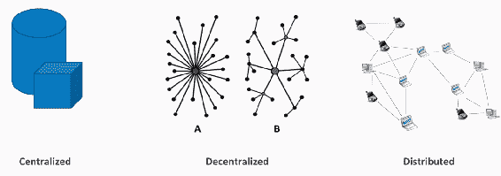
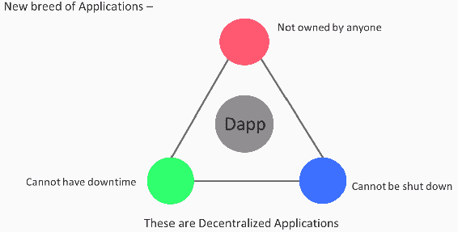
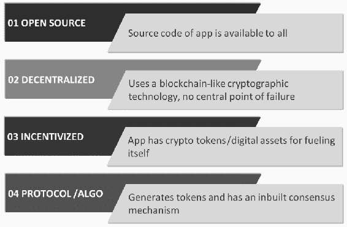
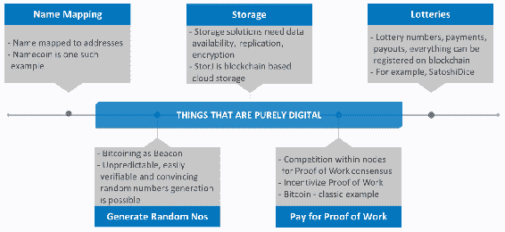
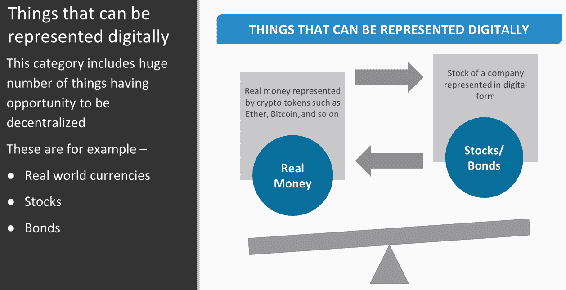
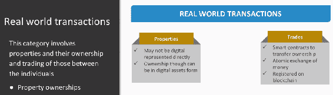
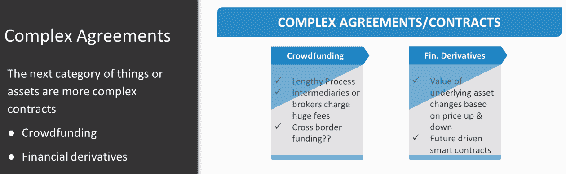
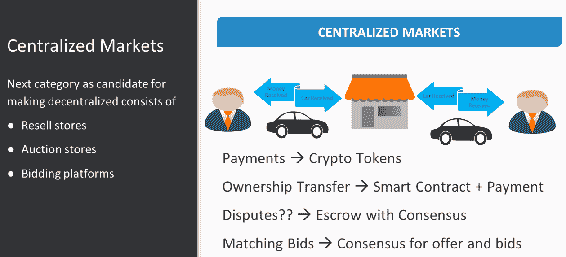
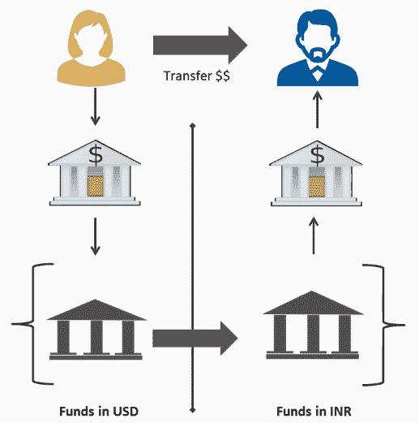
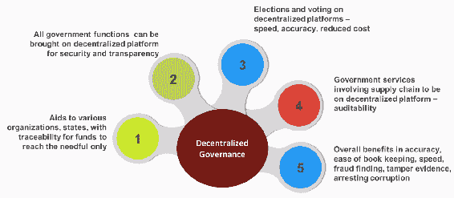

# 权力下放的基础

在前一章已经了解了比特币和区块链的基本原理之后，现在让我们试着了解一点关于去中心化的知识。在本节中，我们将了解以下主题:

*   权力下放如何运作
*   什么可以下放
*   权力下放对当前和未来世界的影响
*   权力下放的利弊

那么，什么是权力下放呢？既然您已经开始了解区块链技术及其架构，那么您应该会听到很多关于去中心化的内容。这是加密货币领域使用频率更高的流行语之一，通常被认为是区块链技术的唯一目的。分权听起来像是集权的对立面，但它远不止于此。

# 分散式、集中式和分布式系统

比特币的基础是其加密安全的账本、独特的资产模型和 P2P 技术。它带来了一个新的架构时代，有助于构建大规模可扩展和可盈利的应用程序，一种被称为**去中心化应用程序(****【Dapps】**的新型软件。现在我们来看一下这三种类型的应用程序及其区别。我们使用的大多数应用程序都是基于集中式或客户端-服务器模型的。少数光盘是分布式的，但现在越来越多的光盘变得分散。

下图展示了这三种类型的软件之间的差异:

现在让我们来看看上图中提到的以下不同类型的应用程序:

*   **集中式系统:**集中式软件或系统是广泛的。这些是在独立系统中运行的单实例系统。系统目标的决策是在中央机制中创建的，然后传递给执行组件或人员。它们在单个节点中做所有的事情。所有的高管都依靠中央机制来采取行动，例如，传统的公司，我们只有一个首席执行官或 CXO 来管理整个公司或一个国家的中央法律。联邦储备局和金融机构是中央集权系统的其他例子。大多数服务都是在互联网上找到的。
*   **分散式系统:**分散式系统运行在计算机的 P2P 网络上，而不是一台计算机或单个实例。这意味着没有一个单独的实体可以控制所有的处理。分散计算是指在硬件和软件上将资源分配给每个工作站。基本上，没有一个节点通知任何其他节点要做什么。分散的系统带来决策局部性，这意味着系统的组件根据本地信息操作以完成目标，而不是中央排序影响的结果。从本质上来说，这意味着它分布在各方之间。关于去中心化的一个关键点是没有控制的中心点。没有一个实体控制其他实体，这就是为什么我们说没有节点通知任何其他节点做什么，例如 BitTorrent，它用于下载大型视频文件或电影。就此而言，区块链是去中心化系统的经典例子。
*   **分布式系统:**大型互联网应用服务是分布式的，但大多数是集中式的，因为运行它们的公司可以全程改变或停止系统，这给我们带来了分布式系统的一个重要方面。分布式系统由使用分布式中间件连接的自治组件组成。这些组件相互通信以实现相同的目标。这些组件位于联网的计算机上，它们通过传递消息来通信和协调它们的动作。分布式意味着不是所有的交易处理都在一个简单的、单一的或相同的地方完成。这并不意味着这些分布式处理器不受单一实体的控制。州级政府是分布式系统的典型例子。就此而言，加油站又是另一个例子。当我们想到加油站时，我们知道到处都有壳牌加油站，但并不是所有的加油站都是壳牌，这使我们想到另一个重要的方面，其中分散系统也是分布式系统，但每个分布式系统不一定是分散系统。

# 分散系统如何工作

现在让我们向前看，看看分散式系统究竟是如何工作的:

*   在分散式系统中，数据是通过网络存储的，这消除了数据集中存储或集中故障点的风险。
*   为了接收消息，使用了临时消息传递和分布式网络。
*   它利用了公钥加密技术。公钥是一个加密过程，其主要功能是认证。所有人都可以使用密钥，密钥的使用取决于应用于要加密的信息的数学过程。
*   网络中的每个节点或次节点都复制区块链，这非常重要。
*   通过大规模数据复制来保持数据平等，这意味着不存在中央正式副本，但是在分散节点的网络中可用的副本是正式副本。这意味着没有其他用户是可信的，因此不存在与特定用户或一组用户的亲缘关系，但是所有用户都被平等对待。
*   使用软件，交易被广播到网络。
*   邮件会在规定的时间内实时传递，这意味着将会重新尝试传递邮件。

# 分散应用

让我们看看下图中 Dapps 的特性:

全世界都在讨论一种新的应用。这些类型的应用程序没有所有者，它们不能被关闭，也没有停机时间。这个新的应用网格被命名为 Dapps。

Dapps 的特征如下图所示:

让我们探讨一下上图中提到的 Dapps 的特征:

*   **开源**:当我们查看应用程序的源代码时，我们需要知道它对每个人都是可访问的。理想情况下，它的治理应该是自治的，所有的变更都应该由共识或者它的大部分用户来负责。它的代码库也应该可供审查。
*   **分散式**:应用程序使用一种类似区块链的加密技术，在这种技术中没有中心故障点。应用程序操作的文档必须存储在一个公共的、分散的区块链上，以避免集中化的缺陷。
*   **激励型**:为了给自己加油，应用程序拥有加密令牌或数字资产。《区块链》的合法读者应该从密码学中受益，这也是壁垒编辑验证《区块链》交易的动机。
*   **协议/ALGO** :分散式应用程序创建令牌，并内置共识工具。为了验证价值，应用程序联盟必须就加密算法达成一致。例如，比特币和以太坊使用电力，并计划在未来使用混合电力或 PoS。

因此，如果我们考虑前面的特征，第一个 Dapp 实际上就是比特币本身。比特币是一种已实施的区块链解决方案，产生于围绕去中心化和审查的问题。我们可以说，比特币是一种有效的公共账本，允许在没有中介和中央当局的情况下顺利交易。因此，以太坊白皮书根据以下两种观点将 Dapps 分为三种类型:

*   **功能** : 从功能的角度来看，有以下三种类型的 Dapps:
*   第一种类型:这种类型的 Dapp 管理货币或加密令牌。用户可能需要使用加密货币或诸如以太或比特币之类的令牌，作为通过使用网络的分布式计算机节点来结算与另一用户的合同的方式，作为促进数据分发的方式。
*   第二种类型:这种类型的 Dapp 涉及加密令牌或货币，但除此之外还需要其他东西。
*   **类型三**:这种类型的 Dapp 属于“其他”类别，包括一般问题的解决方案；例如，投票、治理系统和分散的自治组织是 Dapps 的一个特别有野心的品种，它们也被称为**数据访问对象(DAOs)** 。它形成了一个群龙无首的组织。
*   **技术** : 从技术角度来看，Dapps 有以下三种类型:
*   **类型一:**这种类型的应用有自己的区块链；例如，比特币或任何替代币都属于这一类。
*   **第二类**:这类 Dapp 使用第一类 Dapp 的区块链。这种类型的 Dapp 有其功能所必需的过程和令牌。Omni 协议是这种类型的 Dapp 的最好例子。
*   **类型三**:这种类型的 Dapp 使用类型二 Dapp 的协议。例如，**每个人的安全访问** ( **安全**)网络使用 Omni 协议来发行安全硬币，然后使用这些硬币来构建分布式文件存储。

从功能和技术实现的角度来看，这些都是 Dapps 的类型。

# 分散各种实体

在讨论了什么是去中心化以及我们如何实现去中心化之后，现在让我们来看看什么是真正可以去中心化的。非常令人兴奋的是，现实世界中的许多事情都可以带到一个分散的区块链平台上:

现在，我们将详细研究可以分散的事情，如上图所示:

*   **名称映射**:凡是纯数字的都可以去中心化。这个类别中的第一个例子是**名称映射**。 **Namecoin** 是一个人类可读的名字与地址映射的好例子。不同的参与者可以输入姓名作为值，更新这些值，并且可以使用区块链来维护该值的当前状态。
*   **存储**:这个类别是使用去中心化的另一个经典例子和商业案例。任何存储解决方案最重要和最关键的要求是数据可用性、避免单点故障、数据复制和自动备份。使用安全区块链解决方案的分散存储解决方案可以很好地处理所有这些问题。**存储**或 **StorJ** 是一个开源的云存储平台，使用区块链进行加密和分布式对象存储。
*   **彩票**:通过使用去中心化的区块链解决方案，支付和支出可以用区块链本身的货币计价。这有助于使彩票使用随机数生成变得容易。 **SatoshiDice** 就是一个使用分散区块链解决方案的彩票例子。
*   **生成随机数**:接下来是随机数生成。比特币可以用作信标，提供不可预测、可公开验证但令人信服的随机数，这意味着信标开始时输出是未知的。然而，每个人都可以验证信标终止后输出接近一致。这是一种产生这种随机数的更可靠的方法。
*   **支付工作证明**:我们要理解的这一类中的下一个也是最后一个是支付 PoW。它补充了存储的概念，但主要目的是激励战俘。它的目的是在可验证的节点之间产生竞争以达成共识。参与验证作为区块链中的块的一部分的交易的各种节点需要表明它们在执行验证时已经投入了大量的计算能力。在比特币的一个经典例子中，矿工们竞相处理大宗交易，并将其添加到区块链中。他们通过在电脑上加入足够多的随机猜测，在比特币程序建立的参数范围内得出答案。

# 资产类别

有许多事物或资产本来就是数字的，可以用数字方式表示。我们可以在下图中看到这些类别:

这一类别包括大量有机会分散的事物，如下所示:

*   真实世界的货币
*   结合
*   股票
*   债券和其他此类资产

让我们通过一个例子来看看这些资产以及它们是如何被分散的。假设一枚彩色硬币代表一种特定的货币，而其他彩色硬币代表一家特定公司的股票。现在，所有这些资产都可以在不同的参与者之间转移。假设一个参与者将资产如债券或股票转让给另一个参与者，而另一个参与者用货币支付转让给他们的资产。这种资产交易完全可以分散进行。您可以在这些资产的交易之间实现原子性，并一起转移资金，这只是为了确保资产转移和资金转移同时发生，从而形成一个完整的交易。

然而，这一切都很容易通过一个基本挑战的解决方案来实现，即如何确保彩色硬币中的 1 美元实际上值 1 美元？当一家银行或银行联合体同意将这种 1 美元的彩色硬币存入银行并保持这一比率时，这一目标就能实现。因此，该实体必须确保始终保持这种一对一的比例。类似地，收回数字股票的实体必须确保数字股票等同于物理股票。他们需要达成协议来保持这一比例。

# 真实世界的交易

在上一节中，我们看到了使用分散平台转移股票是多么容易。但是，这种情况并不等同于房地产的性质。

我们可以在下图中看到现实世界交易的特征:

属性可能无法用数字表示。然而，他们的所有权可以通过使用代币或资产来很好地数字化表示。然后，通过使用智能合约和原子交易交易所，这些资产的所有权可以在个人之间转移。这种数字化执行的交易是在分散的平台上捕获的。如今有许多分散的区块链平台，帮助买家在个人之间转移财产。买家可以转让财产所有权以换取金钱，并在分散的区块链平台上保持所有权协议的安全性。这种平台的例子有 **Atlant** 和 **Propy** 。房产只是我们看到的一个例子，但是有许多这样的资产，所有权转移和交易可以分散进行。

# 复杂的协议

下一类事物或资产更复杂，例如众筹和金融衍生品，如下图所示:

因此，让我们来看看众筹、金融衍生品和集中市场都包括什么:

*   众筹:我们知道明星公司从投资者那里筹集资金，但必须经过一个非常漫长的过程，其中包括法律活动。最困难和繁琐的部分是，这类初创企业通常需要首先接触一个中介或经纪人，然后由他们将自己与真正的投资者联系起来。不用说，除了完成交易所需的时间之外，这些经纪人还收取一定比例的佣金。分散化可以通过消除中介机构，将权力和控制权放在属于它的地方，完全掌握在投资者手中，从而使投资过程完全民主化。区块链上的众筹让普通人获得了他们以前从未见过的投资机会。加密货币众筹令人兴奋的特点是，它允许投资者立即在可用的交易平台上交易投资。在去中心化区块链平台的帮助下，初创企业可以创建自己的加密货币、加密硬币或加密令牌，并以未来的创收计划为支撑。这些加密硬币通常由真实货币支持，每个硬币有一个适当的比例。然后，他们可以通过使用分散平台，将这些硬币提供给感兴趣的投资者。

这个过程通常被称为**首发币** ( **ICO** )。全球各地愿意参与这一 ICO 投资的人或实体在平台上注册，购买所需数量的加密硬币，并用真实货币进行兑换。这是一个相对容易、不那么麻烦的过程，最重要的是，它消除了中介或经纪人。如今有许多众筹平台是使用分散式区块链技术构建的。 **Wave** 和 **OpenLedger** 是最知名的两个平台。

*   **金融衍生品** : 我们来简单看一下金融衍生品。金融衍生品是另一个广泛的领域，有分散化的空间。金融衍生品有一个基础资产，衍生品的价值取决于基础资产的价格上下波动。衍生品的关键在于，它可以被视为写入智能合约的有条件陈述，该合约取决于基础资产的价格，有时是未来的价格等等。各种基于 Altcoin 的系统可以很容易地用来建立一个分散的衍生品平台。
*   **集中市场** : 下一个类别作为制定分散解决方案的候选，由市场和期权组成。我们可以在下图中看到集中市场的特征:

让我们看看上图中使用的各种平台。我们知道许多在线拍卖商店或转售商店。让我们举一个例子来详细理解这一点。让我们举一个在买卖店里的二手车的例子。所以，我们通常会把二手车卖给商店来换钱。这就完成了一次交易。然后，商店执行另一项交易，将这辆车卖给其他人以换取金钱。在这个例子中，您真的不关心任何购买汽车的客户。另一个例子是易贝。易贝是另一个拍卖平台。它根据参与者的需求匹配参与者，并安排支付方式。 **PayPal** 是另一个平台，是一个支付处理平台。它不做任何参与者或拍卖的匹配。它只是提供了一些支付选择和有限的变化，为纠纷来自付款。

# 市场的分散化

现在，让我们看看如何分散这些市场。那么，我们就以买卖店里的二手车为例。我们可以让它成为一个体面的平台，在这里 P2P 交易可以很快得到处理。因此，这些市场的前提可以通过以太或比特币等加密令牌来管理。所有权转移可以使用智能合同和资产的原子数字转移来完成。争议处理可以通过使用**托管**或**共识**在一定程度上进行，这反过来也有助于调解争议。当谈到匹配位时，我们可以使用共识和智能合同来匹配并获得销售实体的批准。矿商可以将报价和比特匹配在一起。

# 分散化的集中市场

现在让我们来看看下一个分权类别。交易所等集中市场是另一个去中心化的经典案例。网上交易带来信任的缺乏，因此有一个中间人来建立信任。分散式交易所是一个依靠第三方服务来保存客户资金的交易所市场。相反，交易直接发生在用户之间，也就是 P2P，通过一个自动化的过程。该系统可以通过创建代理令牌来实现，例如代表特定加密货币的加密资产或代表公司股份的资产，或者通过分散的多重签名托管系统来实现。在目前正在开发的所有解决方案中，这一系统与当前的集中模式形成了鲜明对比，在集中模式下，用户将资金存入银行，然后他们发行一张可以在平台上自由交易的借据。当用户要求提取他的资金时，这些资金会被转换回他们所代表的加密货币，并发送给他们的所有者。 **Ripple** 是一个交换平台的例子，它通过使用可传递的信任来分散货币交换并提供跨境汇款。

集中式交换和分散式交换有以下区别:

*   **集中交易所**:集中交易所控制资金。在集中交易中，你不能保持匿名。在集中式交换中，存在黑客攻击和服务器停机。
*   **去中心化交易所**:去中心化交易所允许用户控制资金。在分散的交流中，你可以保持匿名或假名。在分散的交易所中，没有黑客攻击，服务器停机几乎是不可能的。

因此，我们知道了任何数字化的东西都可以去中心化，任何可以数字化表现的东西也可以去中心化。

# 权力下放的影响

在前面的章节中，我们研究了分权是如何工作的，以及什么是可以分权的。在本节中，我们将探讨以下主题:

*   为什么去中心化和区块链被认为是当今和未来世界最重要的平台或技术？
*   这项技术能给当今世界和未来的愿景带来什么可能的影响？

区块链技术被誉为一项革命性的技术，它可以极大地影响以下在全球日常活动中发挥关键作用的关键因素:

*   贸易或交易成本
*   执行速度
*   所有交易的透明度
*   中间人的参与
*   安全性

这些因素几乎对每个行业都有影响，无论是银行、股票市场、法律、农业、商业、贸易、安全、医药、制造、供应链、生物信息学、音乐，还是其他各种服务部门。

# 受权力下放影响的部门

让我们进一步讨论以下领域以及权力下放对它们的影响:

*   **股票市场:**让我们以股票市场为例，看看权力下放如何影响这个部门。今天的股票市场拥有现代化的计算机，互联网也加快了交易速度。在我们今天拥有的现代股票市场中，股票转让代理是分散的注册商，他们为发行人和股票市场拖动和共享所有权，而现代转让代理使用当今的最新技术。但是相同的旧的集中注册模型甚至持续到今天。现在，让我们来看看我们在当今的现代股票市场中看到的以下挑战:
*   第一个挑战是，它是集中式的，而且成本很高。
*   存管机构和转让代理是中间人，因此是单点故障。
*   所涉及的各种流程，如注册、转让、分发、审查和快递费，会产生更高的费用。随着证券市场的范围越来越广，管理成本不断增加。
*   我们看到的另一个挑战是有限的透明度。存在着大量的信息不对称，这导致那些能够获得这些信息的人获得市场优势。伪造证券和不对称交易对手风险总是令人担忧。
*   最重要的是，在大多数管辖区，法定所有权仍然属于转让代理人，投资者没有所有权。

让我们看看权力下放是如何影响这一现状的。可以消除集中式和分散式集线器，并且可以使用基于分散式区块链的实现，这将有助于使用 P2P 通信和共识机制在投资者之间直接转移共享所有权。除此之外，在一分钟内获得更新的分散分类账还可以节省数百万的抵押和结算成本。分散化可以降低股票结算功能的效率，通过 P2P 通信进行交易结算可以省去中间人，从而降低记录成本。由于 P2P 通信，结算可以即时实时发生。不用说，最重要的是，所有这些都在共享账本上带来了很大的透明度。

*   **银行业:**现在让我们看看权力下放会给银行业带来什么影响。银行日常执行的典型关键例行程序或程序是**了解你的客户** ( **KYC** )和**付款和资金转账**。我们将了解 KYC 流程以及支付和转账。在使用合规平台和 KYC 流程时，我们面临诸多挑战。我们将从以下几点详细了解这些挑战的要点:
*   KYC 流程是一个集中化的流程，由每家银行独立完成。
*   这是一个重复的任务。
*   成本每天都在增加。
*   记录的簿记总是孤立进行的。
*   这些银行在这些文件存管中互不涉及。

我们现在将在本节中讨论权力下放带来的影响。通过使用分散区块链技术的合规平台和 KYC 流程，银行可以降低运营成本并提高效率。KYC 可以执行一次，然后可以作为其他未来交易的参考。此外，一旦这些 KYC 详细信息在区块链上可用，它们就可以被其他银行、经认可的机构或组织使用，而无需一次又一次地为同一客户重新启动 KYC。这将节省重复 KYC 过程所花费的成本和完成 KYC 所花费的时间，并且能够更快、更准确地传送记录。银行和金融机构可以吸引客户，因为它们将提高工作的便利性和速度，并且客户将只需要被提供一次 KYC 文件。

*   **支付或资金转移**:让我们举个例子。一个典型的银行电汇交易发生在跨境和发票交换。假设 Jessie 需要或想要从她的美国账户转账 1000 美元给她在印度的朋友 John。我们可以在下图中看到 Jessie 和 John 的调动事务处理:

让我们在下一节看看面临的挑战:

*   这一过程涉及多方。Jessie 拥有其账户的银行在美国，并且涉及存在于美国的第三方外汇和存在于印度的第三方外汇，因为 John 在印度拥有其账户。所有这些账户之间的资金转移需要相当长的时间，通常在 5 到 7 天之间。
*   第二个挑战是转移的持续时间。即使我们假设从一个账户到另一个账户的转账在同一天完成，我们说的也至少需要 4 到 5 天。
*   第三个挑战是私人记账。每家银行都私下保留自己的簿记记录。这导致验证资金所有权证明所需的时间增加。
*   第四个问题是在税率上缺乏明确性和选择性。此外，由于整个流程耗费大量时间，客户也无法保证获得理想的汇率。此外，也不清楚为什么要采用特定的费率。
*   第五个也是最重要的挑战是收费提高。没有必要说明所有这些中介机构和银行收取的费用。

因此，让我们来看看权力下放如何影响该部门的外汇交易流程:

*   现在，如果将整个外汇交易过程放到分散的区块链平台上，第一个好处是消除声称为交易建立信任的中介。这至少减少了一半的时间。现在，我们如何在这个交易中建立信任？
*   好吧，让 P2P 共识带来传递性信任。真实或法定货币可以用加密代币或数字资产来表示。这些代币可以通过区块链程序从杰西转移到约翰手中，几乎只需几秒钟。交易即使不能在几秒钟内完成，也可以在几分钟内完成。它带来了实际应用费率的透明度，加快了交易速度，大幅降低了收费或费用，并为未来的合规性目的建立了安全和透明的记录簿。
*   如今，世界各地的许多银行已经开始在外汇领域相互合作，以减少时间和成本，提高透明度和安全性。

我们现在来看看去中心化的区块链平台是如何转变政府或政府组织的。举例来说，当今世界的任何政府都因为问责制、缺乏透明度和效率方面的挑战而举步维艰。权力下放有助于实现公平、透明和负责任的治理，增强公民的信任和信心。让我们看看权力下放如何帮助实现预期目标，如下图所示:

让我们探索一下权力下放如何有所帮助:

*   它帮助向各州和国家的项目提供援助，并确保资金只到达预定的接受者手中。
*   所有的政府运作和系统，如财产、税收、公共服务、社会福利、医疗福利和公用事业，如果纳入数字账本，可以带来安全性和透明度。
*   选举和投票可以放在分散的平台上，这反过来会提高选举过程的速度、透明度和准确性，还会降低成本和复杂性。结果会更快更正确。
*   第四个好处是，涉及供应链管理的政府服务将更便宜、更准确、更可审计。
*   最后，最重要的部分是，一旦所有的政府运作都被带到分散的平台上，记账将更加准确，提高速度，并在更大程度上减少欺诈行为的发现、缓和和逮捕腐败。

# 权力下放的利弊

在详细了解了去中心化的过程之后，我们现在已经到了本节的结尾。在这一节中，我们将探讨权力下放的一些最重要的利弊。在过去的几十年里，技术进步和创新帮助人类和这个世界取得了良好的进步和发展。然而，与此同时，任何这样的技术创新也暴露了互联网的阴暗面，并向我们展示了技术本身的滥用。

例如，互联网有它的好处，但也有它的缺点。人们滥用互联网来入侵在线系统和各种其他诈骗。这主要不是技术的缺陷，而是出于错误的目的使用它。硬币总是有两面，我们在这里谈论的是加密硬币。与互联网类似，即使是去中心化和区块链也各有利弊。所以，让我们从广义的角度来看其中的一些。

首先，区块链最重要的优势之一是它是一个分布式网络，而不是集中式网络。交易可以通过广泛分布的 P2P 全球节点网络来验证。这意味着如果有人想操纵区块链上的数据，他们需要同时访问分布式网络中的所有计算机。

进行这样一次黑客攻击所需的计算能力可以比作金钱散列法。在这个例子中，你真的不用担心任何一个国家或州的客户和其中所有的技术公司克服整个网络超过 51%的计算能力，这几乎是不可能的。这消除了单点故障。

但是从坏处来看，仍然有黑客入侵和操纵数据的可能性。如果去中心化的区块链平台没有被设计来保护它们，有几种类型的黑客攻击是可能的。让我们来讨论一下黑客攻击:

*   例如，51%的攻击被认为是区块链固有的挫折。一个最大限度地利用网络挖掘散列率的人有能力按照自己的意愿操纵分类账。简而言之，如果你是一名矿工，正在开采一个区块链上超过 51%的区块，那么你就有可能改变所有区块的分类账内容。
*   Eclipse: 另一种被称为 Eclipse 攻击的黑客攻击涉及到破坏其中一个节点，使其无法与所有其他节点进行交互。通过这种方式，挖掘散列率的百分比不会构成限制属性，并且剩余的节点可能采取挖掘的最高侧，指示剩余的块。
*   **赚钱骗局:**分散的公众区块链可以作为媒介向公众要钱，例如**勒索软件**病毒攻击。
*   **银行易受攻击:**即使是银行也容易受到欺诈和抢劫。最近的一个例子是，一群黑客控制了巴西一家大银行的所有在线和自动取款机业务。他们获得了密码、信用卡和所有其他个人信息。这次攻击为他们提供了金钱和额外的私人信息，这些信息也可用于未来的攻击。

我们现在将详细讨论权力下放的好处:

*   分散化主要消除了银行等中介机构，因为这些有价值的信息不会有一个中心访问点。由于其防篡改结构和不变性，分散的区块链技术也可以帮助检测政府组织中的腐败和欺诈。例如，几年前被联邦调查局关闭的丝绸之路在线案件。这是一个暗网市场，由一系列非法分子组成，连联邦机构都无法追踪。正是分散的区块链账本帮助联邦政府揭露了掩盖证据的真正罪犯。那些实际上是联邦特工的人是罪魁祸首，他们是调查小组本身的一部分。这只是因为区块链平台分散的、不可变的、没有单一所有者分类账才被发现的。
*   另一方面，虽然分散化消除了对中介或中间人的需要，但几十年来，整个世界一直只由中介机构运作和驱动。这样的中介机构年年都在赚钱。除此之外，由于其潜在的复杂性，区块链和权力下放对于人们来说并不容易理解。密码学、区块链、去中心化以及所有的术语对他们来说都很难理解。所以，接受权力下放会有很多阻力，特别是在政府组织和社会中的一些关键机构。
*   在去中心化的区块链上，任何有价值的东西都可以在实体间转移，并安全保密地保存。这限制了我们试图以错误的意图进行更改，因为人们必须为特定的个人事务找到特定的数据。分散平台上的匿名可能是一把双刃剑:虽然它保持了保密性，但它也帮助了骗子和不法分子利用它来为自己谋利，进行非法交易和交易，同时保持匿名。
*   分散式区块链提供的安全性是通过使用加密技术并限制对区块链上写入的数据的更改来实现的。这种不变性使数据终身受到保护。然而，由于平台上的交易或数据返回是不可逆的，所以任何被错误写入并且必须被纠正的数据都需要被重写为新的记录。用户只能添加正确的数据作为新事务。当然，这需要进行额外的计算、节点验证、网络共享等等。

# 摘要

这一章使我们能够理解和审视我们可以利用权力下放和区块链为社会和个人造福的各种可能性。由于这项技术是全新的，并且正在经历变化，我们希望明天看到一个更好的世界，包括安全和透明，同时消除所有现存的弊端。这就把我们带到了去中心化的基础的尽头，以及去中心化将如何以一种更好的方式影响我们现在和未来的世界。

在下一章中，我们将了解区块链的一些高级概念和各种安全特性。我们还将了解硬件钱包以及比特币的物理存储方式等等。