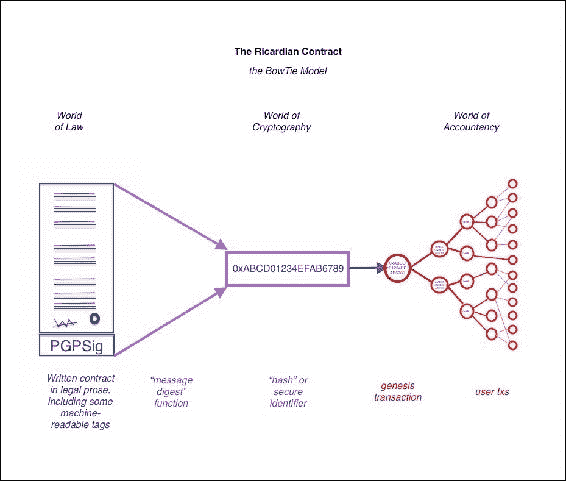
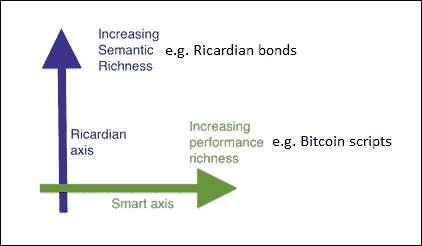
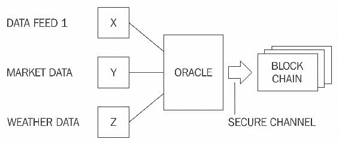

# 第六章。智能合同

本章介绍了智能合约。这不是一个新概念，但是，随着区块链的出现，对这一概念的兴趣又恢复了，这现在是区块链空间中一个活跃的研究领域。由于智能合同可以通过降低交易成本和简化复杂的合同来为金融服务行业带来成本节约的好处，因此各种金融和学术机构正在进行严格的研究，以便尽快使智能合同的实施变得简单和实用。

# 历史

智能合同最早是由 Nick Szabo 在 20 世纪 90 年代末提出的，但是直到近 20 年后它们的真正潜力和好处才被真正认识到。智能合约由 *Szabo* 描述如下:

> 智能合同是一种执行合同条款的计算机化交易协议。总体目标是满足常见的合同条件(如支付条款、留置权、保密性，甚至强制执行)，最大限度地减少恶意和意外的例外，并最大限度地减少对可信中介的需求。相关的经济目标包括降低欺诈损失、仲裁和执行成本以及其他交易成本。”

这种智能合约的想法在 2009 年以有限的方式在比特币中实现，比特币交易可以用来在用户之间转移价值，通过点对点网络，用户不一定相互信任，也不需要可信的中介。

# 定义

对于智能合约的标准定义，目前还没有达成共识。有必要定义什么是智能合同，以下是作者试图提供的智能合同的通用定义。

### 注意

智能合同是一种安全且不可阻挡的计算机程序，代表一种可自动执行和实施的协议。

剖析这个定义进一步揭示了智能合约实际上是用计算机或目标机器能够理解的语言编写的计算机程序。此外，它以业务逻辑的形式包含各方之间的协议。另一个关键思想是，当满足某些条件时，智能合约会自动执行。它们是可执行的，这意味着所有的合同条款都是按照定义和预期执行的，即使是在有对手的情况下。强制执行是一个更广泛的术语，包括法律形式的传统强制执行，以及实施某些措施和控制，使之有可能在不需要任何调解的情况下执行合同条款。应当指出，真正的智能合同不应依赖于传统的执行方法。相反，他们应该遵循的原则是*代码就是法律*，这意味着不需要仲裁人或第三方来控制或影响智能合同的执行。智能合同是自我执行的，而不是法律强制执行的。这可能被视为自由主义者的梦想，但这是完全可能的，并且符合智能合约的真正精神。

此外，它们是安全的和不可阻挡的，这意味着这些计算机程序被要求以这样一种方式设计，即它们是容错的并且在合理的时间内是可执行的。这些方案应该能够执行并保持健康的内部状态，即使外部因素是不利的。例如，想象一个正常的计算机程序，它用某种逻辑编码，并根据其中编码的指令执行，但如果它运行的环境或它所依赖的外部因素偏离了正常或预期的状态，程序可能会任意反应或简单地中止。重要的是，智能合约不受此类问题的影响。

安全和不可阻挡可能被认为是需求或期望的特性，但是如果从一开始就将安全和不可阻挡的属性包括在智能契约定义中，那么从长远来看，它将提供更大的好处。这将使研究人员从一开始就专注于这些方面，并有助于建立进一步研究的坚实基础。一些研究人员还提出，智能合约不需要自动执行；相反，它们可以是所谓的*自动化*，因为在某些情况下需要人工输入。虽然在某些情况下，人类的输入和控制是可取的，但这并不是绝对必要的；而且，在作者看来，要想让合同真正变得*智能*，它必须完全自动化。需要由人提供的某些输入可以也应该通过使用 Oracles 来自动化。神谕将在本章后面更详细地讨论。

智能合约通常通过使用状态机模型管理其内部状态来运行。这允许为智能契约编程开发一个有效的框架，其中契约的状态基于一些预定义的标准和条件被进一步推进。

关于法典是否可以作为合同在法庭上被接受的问题，也有持续的争论。这在表述上与传统的法律散文完全不同，尽管它们确实代表并执行所有的合同条款，但法庭并不理解法典。这就提出了几个关于智能合同如何具有法律约束力的问题:它能否以一种在法庭上容易被接受和理解的方式发展？如何在准则内实施争议解决，是否可能？此外，在智能合同可以像传统法律文档一样有效地使用之前，法规和合规性要求是另一个需要解决的问题。

前面的问题提供了各种可能性，比如让智能合同代码不仅可以被机器读取，也可以被人读取。如果人类和机器都能理解智能合同中的代码，这在法律环境中可能更容易被接受，而不是只有程序员才理解的一段代码。这个理想的属性是一个成熟的研究领域，在这个领域已经花费了大量的研究工作来回答关于合同的语义、含义和解释的问题。

智能合同本质上要求具有确定性。该属性将允许网络上的任何节点运行智能合约，并获得相同的结果。如果节点之间的结果甚至略有不同，那么就无法达成共识，并且关于区块链的分布式共识的整个范例都可能失败。此外，还希望契约语言本身是确定性的，从而确保智能契约的完整性和稳定性。我的意思是，确定性是指语言中没有使用非确定性的函数，这些函数会在不同的节点上产生不同的结果。例如，由各种编程语言中的各种函数计算的各种浮点运算在不同的运行时环境中会产生不同的结果。另一个例子是 JavaScript 中的一些数学函数，它们可以在不同的浏览器上对相同的输入产生不同的结果，这反过来会导致各种错误。这在智能契约中是非常不可取的，因为如果节点之间的结果不一致，那么将永远无法达成共识。确定性功能确保智能合约总是为特定输入生成相同的输出。换句话说，程序一旦被编译，就会产生一个坚实而准确的业务逻辑，它完全符合高级代码中编程的要求。

总之，智能合约具有以下四个属性:

*   可自动执行
*   可实施的
*   语义合理
*   安全且不可阻挡。

前两个属性是最低要求，而后两个在某些场景中可能不是必需的或不可实现的，可以放宽。例如，衍生产品合同也许不需要在语义上是合理的和不可阻止的，但至少应该是可自动执行的和可强制执行的。另一方面，地契需要在语义上是合理和完整的，因此，为了将它实现为智能契约，语言必须能被计算机和人理解。伊恩·格里格发明了 T2 李嘉图契约，解决了这个解释问题，我们将在下一节详细讨论。

# 李嘉图合约

李嘉图契约最初是由*伊恩·格里格*在*的《七层金融密码学》论文中提出的。这些合同最初用于一个名为**李嘉图**的债券交易和支付系统。关键的想法是写一份法庭和计算机软件都能理解和接受的文件。李嘉图合约解决了通过互联网发行价值的挑战。它识别发行者并在文档中捕获合同的所有条款，以使其作为具有法律约束力的合同被接受。根据*伊恩·格里格*在[http://iang.org/papers/ricardian_contract.html](http://iang.org/papers/ricardian_contract.html)的原始定义，李嘉图合约是一种具有以下几个属性的文件:*

*   发行人向持有人提供的合同
*   由持有者持有并由发行者管理的有价值的权利
*   人们容易阅读(就像纸上的合同)
*   程序可读(可解析，像数据库一样)
*   数字签名
*   携带密钥和服务器信息
*   与唯一且安全的标识符相关联

实际上，合同是通过生成一个文档来实现的，该文档以法律散文的形式包含合同条款和所需的机器可读标签。该文档由发行者使用他们的私钥进行数字签名。然后，使用消息摘要函数对该文档进行哈希处理，以产生能够识别该文档的哈希。然后，各方在履行合同期间进一步使用和签署该散列，以便将每笔交易联系起来，从而将标识符散列用作意图的证据。下图描述了这种款式，通常称为*蝴蝶结*款。

下图显示了文件来源左侧的**法律世界**。然后对其进行哈希处理，得到的消息摘要被用作整个**会计世界的标识符。会计的**世界**基本上可以代表任何或多个会计、交易和信息系统，这些系统在企业中用于执行各种业务操作。这个流程背后的想法是，通过散列文档生成的消息摘要首先用于所谓的*起源事务*或第一个事务，然后在整个合同的操作执行过程中作为标识符用于每个事务。**

通过这种方式，在原始书面合同和会计领域的每一笔交易之间建立了安全的联系。

李嘉图合同，领结图

李嘉图合同不同于智能合同，因为智能合同不包括任何合同文件，仅关注合同的执行。另一方面，李嘉图契约更关心包含契约法律散文的文档的语义丰富性和生产。契约的语义可以分为两种类型:操作语义和指称语义。第一种类型定义了契约的实际执行、正确性和安全性，而后者关注的是完整契约的真实含义。一些研究人员区分了智能合同代码和智能法律合同，其中智能合同只涉及合同的执行，第二种类型包括法律协议的外延和操作语义。根据语义之间的差异对智能合约进行分类可能是有意义的，但最好将智能合约视为一个独立的实体，能够在其中编码法律散文和代码(业务逻辑)。

在比特币，可以看到智能合约的一个非常简单的实现，它完全面向合约的执行，而李嘉图合约更适合于生成人类可以理解的文件，其中一些部分是计算机程序可以理解的。这可以看作是法律语义与操作性能(语义与性能)的对比，如下图所示。这最初是由伊恩·格里格在他的论文《T2》中提出的，该论文是关于李嘉图和智能合约的交集。

解释性能与语义的图表是 Ian Grigg 所描述的正交问题；稍作修改，以在两个轴上显示不同类型的合同示例

智能合约将这两个元素(性能和语义)嵌入在一起，从而完成了智能合约的理想模型。

一个李嘉图契约可以表示为三个对象的元组，即*散文*、*参数*和*代码*。散文用正规的语言表现法律契约；代码代表程序，它是法律条文的计算机可理解的表示；和参数将合法契约的适当部分连接到等价代码。

李嘉图契约已经在许多系统中实现，如 CommonAccord、OpenBazaar、OpenAssets 和 Askemos。

## 智能合同模板

智能合同可以在任何需要的行业实施，但当前大多数使用案例都与金融行业相关。专门针对金融行业的智能合同领域的最新工作提出了智能合同模板的概念。这个想法是建立标准模板，提供一个框架来支持金融工具的法律协议。这是由 *Clack 等人*在他们名为*智能合同模板:基础、设计前景和研究方向*的论文中提出的。该文件还提出，应建立特定领域语言，以支持智能合同模板的设计和实施。一种名为 *CLACK* 的语言，一种用于扩充合同知识的通用语言已经被提出，并且已经开始研究开发这种语言。这种语言旨在非常丰富，并提供各种各样的功能，从支持法律散文到能够在多种平台上执行和加密功能。

金融行业中的契约并不是一个新概念，各种特定于领域的语言 DSL 已经在金融行业中使用，以提供特定领域的特定语言。例如，有一些 DSL 可用于支持保险产品的开发，代表能源衍生品，或者用于构建交易策略。这份清单还在继续，在 http://www.dslfin.org/resources.html 可以找到一份金融领域特定语言的综合清单。

理解特定领域语言的概念很重要。这些语言是为特定的应用程序或感兴趣的领域开发的，表达能力有限。**特定领域语言**(**DSL**)不同于**通用编程语言**(**GPLs**):DSL 有一小部分功能，这些功能对于它们打算使用的领域来说是足够的，并且是优化的，并且与 GPL 不同，DSL 通常不用于构建通用的大型应用程序。基于 DSL 的设计理念，可以设想这种语言可以被专门开发来编写智能合约。有人已经做了一些工作，Solidity 就是这样一种语言，它被以太坊区块链公司引入来编写智能合同。Serpent 是以太坊中引入的另一种语言，尽管它没有 Solidity 用得多。

这种用于智能合同编程的领域特定语言的思想可以进一步扩展到图形领域特定语言，这是一种智能合同建模平台，其中领域专家(不是程序员)可以使用图形用户界面和画布来定义和绘制金融合同的语义和性能。一旦绘制并完成了流程，就可以首先模拟它进行测试，然后从相同的系统部署到目标平台，目标平台可以是区块链。这也不是一个新概念，Tibco streambase 产品中使用了类似的方法，这是一个基于 Java 的系统，用于构建事件驱动的高频交易系统。

建议还应在开发高级 DSL 的领域进行研究，该领域可用于在用户友好的图形用户界面中编程智能合同，从而允许非程序员设计智能合同。

## 神谕

甲骨文是智能合约生态系统的重要组成部分。智能合约的局限性在于，它们不能访问控制业务逻辑执行所需的外部数据；例如，合约要求支付股息的证券的股价。Oracles 可用于向智能合约提供外部数据。Oracle 是从外部来源向智能合同提供数据的接口。根据行业和需求的不同，Oracles 可以交付不同类型的数据，从天气预报、真实世界的新闻和企业行动到来自**物联网** ( **物联网**)设备的数据。Oracles 是使用安全通道将数据传输到智能合约的可信实体。

Oracles 还能够对数据进行数字签名，证明数据的来源是可信的。然后，智能合约可以订阅 Oracle，智能合约可以拉取数据，或者 Oracle 可以将数据推送到智能合约。同样必要的是，神谕不应该能够操纵它们提供的数据，而必须能够提供可信的数据。尽管 Oracles 是可信的，但在某些情况下，由于操纵，数据仍然可能是不正确的。因此，Oracles 无法更改数据是必要的。这种验证可以通过使用各种公证方案来提供，这将在本章后面讨论。在这种方法中，已经可以看到一个问题，在某些情况下这可能是不可取的，这就是信任问题。您如何信任第三方提供的数据的质量和真实性？在金融界尤其如此，市场数据必须准确可靠。对于一个聪明的契约设计者来说，接受由一个大的、有信誉的、可信任的第三方提供的 oracle 数据可能是可以接受的，但是集中化的问题仍然存在。这些类型的神谕可以被称为标准或简单神谕。

另一种类型的 Oracle，本质上是由于去中心化的需求而出现的，可以称为*去中心化的*Oracle。这些类型的预言可以基于某种分布式机制来构建。还可以设想，神谕本身可以从由分布式共识驱动的另一个区块链获取数据，从而确保数据的真实性。例如，一个运行他们自己的私有区块链的机构可以通过 Oracle 发布他们的数据馈送，然后可以被其他区块链使用。

当需要来自物理设备的真实世界数据时，研究人员还引入了硬件预言的另一个概念。例如，这可以用于遥测和物联网。然而，这种方法需要一种机制，其中硬件设备不能被篡改。这可以通过使用防篡改设备来实现。

现在有一些平台可以支持智能合约使用 Oracle 获取外部数据。Oracle 使用不同的方法将数据写入区块链，具体取决于使用的区块链类型。例如，在比特币区块链中，oracle 可以通过`OP_RETURN`操作码向特定交易写入数据，智能合约可以监控该交易并读取数据。提供甲骨文服务的各种在线服务，如[http://www.oraclize.it/](http://www.oraclize.it/)和[https://www.realitykeys.com/](https://www.realitykeys.com/)。此外，https://smartcontract.com/[的另一项服务](https://smartcontract.com/)提供外部数据和使用智能合同进行支付的能力。所有这些服务的目的是使智能合同能够获得执行和决策所需的数据。为了证明 oracle 从外部源检索到的数据的真实性，可以使用 TLSnotary 之类的机制来证明数据源和 Oracle 之间的通信。这确保了反馈给智能合约的数据肯定是从源中检索的。更多关于 TLSnotary 的细节可以在这里找到[https://tlsnotary.org/](https://tlsnotary.org/)。

下图显示了 oracle 和智能合同生态系统的一般模型:

区块链上 oracle 与智能合约交互的简化模型

## 聪明的神谕

在 *Codius* 中也提出并实现了智能甲骨文的想法。智能甲骨文基本上是和甲骨文一样的实体，但是增加了契约代码执行的能力。Codius 提出的智能预言使用 Google Native Client 运行。这是一个运行不受信任的 x86 本机代码的沙箱环境。Codius 在 https://www.codius.org/的[有售。](https://www.codius.org/)

## 在区块链上部署智能合约

智能合约可能部署在区块链上，也可能不部署，但是由于区块链提供的分布式共识机制，在区块链上部署智能合约是有意义的。以太坊是区块链的一个例子，它本身支持智能合约的开发和部署。以太坊区块链上的智能合约通常是更大的应用程序的一部分，例如**去中心化自治组织** ( **DAOs** )。

相比之下，在比特币区块链中，比特币交易中的`lock_time`字段可以被视为智能合约基本版本的使能器。`lock_time`字段使一个事务能够被锁定，直到一个指定的时间或若干个块之后，从而强制执行一个基本契约，即只有在满足某些条件(经过的时间或块数)的情况下，某个事务才能被解锁。然而，这在本质上是非常有限的，并且应该仅被视为基本智能合约的示例。除了上面提到的例子，比特币脚本语言虽然有限，但可以用来构建基本的智能合约。一种可能性是资助一个比特币地址，任何演示哈希冲突攻击的人都可以使用这个地址。这个想法是在 Bitcointalk 论坛上提出的，更多信息可以在 https://bitcointalk.org/index.php?topic=293382.0 的[找到。这也可以被认为是智能合约的一种基本形式。](https://bitcointalk.org/index.php?topic=293382.0)

## 刀

DAO 是众筹金额最高的项目之一，于 2016 年 4 月启动。这基本上是一套智能合约，旨在提供一个投资平台。由于代码中的一个错误，这在 2016 年 6 月被黑客攻击，相当于 5000 万美元的资金被从 DAO 转移到另一个账户。这导致以太坊上为了从攻击中恢复出现硬叉。应该注意的是，*代码就是法律*或不可阻挡的智能合约的概念应该以某种怀疑的态度来看待，因为这些概念的实施还不够成熟，不足以保证完全和不容置疑的信任。这从最近的事件中显而易见，以太坊基金会通过引入一个硬叉子能够停止并改变*道*的执行。尽管引入这种硬分叉是出于真正的原因，但它违背了真正的分权精神和“T4”代码就是法律的理念。另一方面，对这种硬叉的反抗和一些决定继续在原链上采矿的矿工，导致了以太坊经典的产生。这是原始的，非分叉以太坊区块链，其中*代码仍然是法律*。

这一攻击凸显了智能合约的危险，以及为智能合约开发一种正式语言的绝对必要性。这次攻击也凸显了彻底测试的重要性。围绕智能合约开发语言，最近在以太坊发现了各种漏洞。因此，制定一个标准框架来解决所有这些问题至关重要。如前所述，一些工作已经开始，但是为了解决智能契约语言的局限性，这个领域已经成熟，可以进行更多的研究。

# 总结

本章首先介绍了智能合同的历史，然后详细讨论了智能合同的定义。由于在智能合同的标准定义上没有一致意见，我们试图引入一个包含智能合同关键内容的定义。还介绍了李嘉图合同，并解释了李嘉图合同和智能合同之间的区别，强调李嘉图合同涉及合同的定义，而智能合同面向合同的实际执行。讨论了智能合同模板的概念，学术界和工业界目前正在就这一主题进行高质量的积极研究。还讨论了关于创建高级领域特定语言的可能性的一些想法，以创建智能合同或智能合同模板。在本章的后面几节中，将介绍 Oracles 的概念，然后简要讨论 DAO，以及 DAO 和智能契约中的安全问题。