# 第九章。超级分类帐

Hyperledger 不是区块链，但它是 Linux 基金会在 2015 年 12 月发起的一个项目，旨在推进区块链技术。该项目是其成员的合作成果，旨在构建一个开源分布式分类帐框架，该框架可用于开发和实现跨行业的区块链应用程序和系统。重点是建立和运行支持全球商业交易的平台。该项目还致力于提高区块链系统的可靠性和性能。

Hyperledger 下的项目经历了不同的发展阶段，从**提案**到**孵化**再到**活跃**状态。项目也可以**废弃**或处于**生命周期结束**状态，在此状态下它们不再被积极开发。为了让一个项目能够进入孵化阶段，它必须有一个完整的工作代码库以及一个活跃的开发人员社区。

# 项目

目前，Hyperledger 旗下有六个项目:Fabric、Iroha、锯齿湖、区块链探索者、Fabric chaintool 和 Fabric SDK Py。Corda 是预计将添加到 Hyperledger 项目中的最新成员。Hyperledger 项目目前有 100 名成员，非常活跃，有 120 多名贡献者，定期在全球各地举行会议和会谈。

下面是对所有这些项目的简要介绍，之后我们将提供更多关于 Fabric 和锯齿湖的设计、架构和实现的细节。

## 织物

Fabric 是 IBM 和 **DAH** ( **数字资产控股**)提出的区块链项目。这旨在为区块链解决方案的开发提供基础，并基于可插拔架构，其中各种组件(如共识算法)可根据需要插入系统。在 https://github.com/hyperledger/fabric[有售](https://github.com/hyperledger/fabric)。

## 锯齿湖

锯齿湖是英特尔在 2016 年 4 月提出的区块链项目，其中一些关键创新集中在**将总账**从交易中解耦，使用*交易家族*跨多个业务领域灵活使用，以及**可插拔共识**。通过使用一个称为*事务族*的新概念，可以更精确地解释解耦，即*事务*从*一致层*中解耦。交易不是单独与分类账耦合，而是使用交易系列，这允许更大的灵活性、丰富的语义和业务逻辑的无限制设计。事务遵循事务族中定义的模式和结构。英特尔还推出了一种新的共识算法，缩写为 PoET，proof of elapsed time，它利用**英特尔软件保护扩展** ( **英特尔的 SGX** )架构的**可信执行环境** ( **TEE** )来提供一个安全和随机的领导者选举过程。它还支持有权限和无权限设置。该项目可在[https://github.com/hyperledger/sawtooth-core](https://github.com/hyperledger/sawtooth-core)获得。

## 伊罗拉

Iroha 由 Soramitsu、日立、NTT Data、Colu 于 2016 年 9 月提出。Iroha 的目标是建立一个可重用组件库，用户可以选择在基于 Hyperledger 的分布式分类账上运行。Iroha 的主要目标是通过提供用 C++编写的可重用组件来补充其他 Hyperledger 项目，重点是移动开发。该项目还提出了一种新的一致性算法，称为 Sumeragi，这是一种基于链的拜占庭容错一致性算法。Iroha 在 https://github.com/hyperledger/iroha 有售。Iroha 已经提出并正在开发各种库，包括但不限于数字签名库(ed25519)、SHA-3 哈希库、事务序列化库、P2P 库、API 服务器库、iOS 库、Android 库和 JavaScript 库。

## 区块链浏览器

该项目旨在为 Hyperledger 构建一个区块链浏览器，可用于查看和查询来自区块链的事务、块和相关数据。它还提供网络信息和与链代码交互的能力。

目前还有另外两个项目正在酝酿中:Fabric chaintool 和 Fabric SDK Py。这些项目旨在支持 Hyperledger 结构。

## 织物链工具

正在开发 Hyperledger 链码编译器，以支持结构链码开发。目标是建立一个工具，读入一个高级 Google 协议缓冲区结构，并产生一个链码。此外，它将链代码打包，以便可以直接部署。据设想，这个工具将在开发的各个阶段帮助开发人员，例如编译、测试、打包和部署。在[https://github.com/hyperledger/fabric-chaintool](https://github.com/hyperledger/fabric-chaintool)有售。

## 织物 SDK Py

该项目的目的是建立一个基于 python 的 SDK 库，可用于与区块链(Fabric)进行交互。在[https://github.com/hyperledger/fabric-sdk-py](https://github.com/hyperledger/fabric-sdk-py)有售。

## Corda

Corda 是 R3 为 Hyperledger 项目贡献的最新项目。2016 年 11 月 30 日开源。Corda 主要面向金融服务行业，是与金融行业的主要银行和组织合作开发的。在撰写本文时，它还没有在 Hyperledger 项目下孵化。从技术上讲，Corda 不是一个区块链，但是具有与区块链相似的关键特性，比如一致性、有效性、唯一性、不变性和认证。

在本章的以下部分，将更详细地讨论 Fabric (IBM)和锯齿湖(Intel)以及 Corda (R3)。

# 作为协议的 Hyperledger

Hyperledger 的目标是建立一个由行业用例驱动的新区块链平台。由于社区对 Hyperledger 项目做出了大量贡献，Hyperledger 区块链平台正在发展成为一种商业交易协议。与早期的区块链解决方案相比，Hyperledger 也正在发展成为一种规范，可用作构建区块链平台的参考，早期的解决方案仅解决特定类型的行业或需求。在下一节中，将介绍 Hyperledger 项目发布的参考架构。由于这项工作处于持续和严格的开发过程中，预计会有一些变化，但核心服务预计将保持不变。

## 参考架构

Hyperledger 发布了一份包含参考架构的白皮书，可以作为构建许可分布式分类帐的指南。参考架构由两个主要组件组成:Hyperledger 服务和 Hyperledger APIs、SDK 和 CLI。Hyperledger 服务提供各种服务，如身份服务、策略服务、区块链服务和智能合同服务。另一方面，Hyperledger APIs、SDK 和 CLI 通过适当的应用程序编程接口、软件开发工具包或命令行接口提供了进入区块链服务的接口。此外，一个事件流(基本上是一个 gRPC 通道)贯穿所有服务。它可以接收和发送事件。事件可以是预定义的，也可以是自定义的。验证对等体或链代码可以发出外部应用程序可以响应或侦听的事件。

在撰写本文时，Hyperledger 白皮书中发布的参考架构如下图所示。Hyperledger 是一个快速变化和发展的项目，这里显示的架构预计会有所改变。

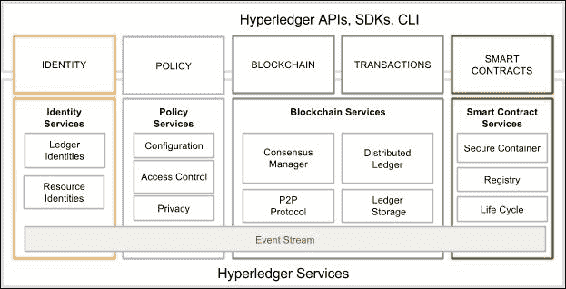

Hyperledger 架构，在 Hyperledger 白皮书的最新草案 V2.0.0 中提出。(来源:Hyperledger 白皮书)

## 要求

区块链服务有一些特定的要求。参考架构是由 Hyperledger 项目参与者提出的需求和要求驱动的，并且是在研究了行业用例之后提出的。从对工业用例的研究中可以推断出几类需求，在下面的章节中会进行讨论。

### 模块化方法

Hyperledger 的主要要求是模块化结构。预计，作为一种跨行业的织物(区块链)，它将被用于许多商业场景。因此，与存储、策略、链码、访问控制、共识和许多其他区块链服务相关的功能应该是可插拔的。这些模块应该是即插即用的，用户应该能够轻松地删除和添加满足业务需求的不同模块。

例如，如果一个业务区块链只需要在已经信任的各方之间运行，并且执行非常基本的业务操作，那么也许就不需要为机密性和隐私提供高级加密支持，因此用户应该能够删除该功能(模块)或者用更适合他们需要的模块来替换它。类似地，如果用户需要运行跨行业的区块链，那么保密性和隐私可能是最重要的。在这种情况下，用户应该能够将高级加密和访问控制机制(模块)插入到区块链(结构)中。

### 隐私和保密

交易和合同的隐私和保密性在商业区块链中至关重要。因此，Hyperledger 的愿景是提供广泛的加密协议和算法，预计用户将能够根据其业务需求选择合适的模块。该结构应该能够处理复杂的加密算法，而不影响性能。

### 身份

为了提供隐私和保密服务，还需要一个灵活的 PKI 模型来处理访问控制功能。加密机制的强度和类型也应该根据用户的需要和要求而变化。在某些情况下，用户可能需要隐藏自己的身份，因此 Hyperledger 有望提供这一功能。

### 可审计性

可审计性是 Hyperledger 结构的另一个要求。我们期望对所有身份、相关操作和任何变更进行不可变的审计跟踪。

### 互操作性

目前有许多可用的区块链解决方案，但它们不能相互通信，这可能是区块链全球商业生态系统发展的一个限制因素。据设想，许多区块链网络将根据具体需要在商业界运作，但重要的是它们能够相互通信。应该有一套所有区块链都可以遵循的通用标准，以便允许不同分类帐之间的通信。预计将开发一种协议，允许在许多结构之间交换信息。

### 便携性

可移植性需求关注的是跨多个平台和环境运行的能力，而不需要在代码级别做任何改变。Hyperledger 被认为是可移植的，不仅在基础设施层面，而且在代码、库和 API 层面都是可移植的，因此它可以支持 Hyperledger 的各种实现的统一开发。

# 织物

为了了解 Hyperledger 项目中正在孵化的各种项目，首先了解 Hyperledger 的基础很重要。在向读者介绍更深入的材料之前，需要对一些特定于 Hyperledger 的术语进行澄清。首先是面料的概念。

结构可以定义为提供基础层的组件集合，可用于交付区块链网络。结构网络有各种类型和功能，但所有结构都有一些共同的属性，如不变性，并且都是共识驱动的。一些结构可以提供构建区块链网络的模块化方法。在这种情况下，区块链网络可以具有多个可插拔模块来执行网络上的各种功能。例如，一致性算法可以是区块链网络中的可插拔模块，其中，根据网络的要求，可以选择适当的一致性算法并将*插入*网络。这些模块可以基于结构的某些特定规范，并且可以包括 API、访问控制和各种其他组件。结构还可以设计为私有或公共，并允许创建多个业务网络。举个例子，比特币是一个运行在其架构(区块链网络)之上的应用。如前所述，区块链可以是许可的，也可以是无许可的，Hyperledger 术语中的 fabric 也是如此。

Fabric 也是 IBM 对 Hyperledger 基金会做出的代码贡献的名称，正式名称为 Hyperledger Fabric。IBM 还通过其 Bluemix 云服务提供区块链即服务(IBM 区块链)。

# 超帐织物

Fabric 是 IBM 最初对 Hyperledger 项目做出的贡献。这一贡献的目的是使模块化，开放和灵活的方法来建设区块链网络。fabric 中的各种功能都是可插拔的，它还允许使用任何语言来开发智能合约。这是可能的，因为它基于可以承载任何语言的容器技术。Chaincode(智能合约)被沙盒化到一个安全的容器中，其中包括一个安全的操作系统、chaincode 语言、运行时环境和用于 Go、Java 和 Node.js 的 SDK。如果需要，也可以支持其他语言。智能合约在结构中称为链码。与以太坊中的领域特定语言或比特币中非常有限的脚本语言相比，这是一个非常强大的功能。这是一个许可的网络，旨在解决可扩展性、隐私和机密性等问题。这背后的关键思想是模块化技术，这将允许设计和实施的灵活性。这可以导致实现可伸缩性、私密性和其他期望的属性。对于普通用户来说，fabric 中的交易是私有的、保密的和匿名的，但是它们仍然可以被授权的审计员追踪和链接到用户。作为许可网络，所有参与者都需要向会员服务注册，以便访问区块链网络。该分类帐还提供了可审计功能，以满足法规和合规性需求。

## 织物架构

根据所提供的服务类型，该结构在逻辑上分为三个主要类别。这些服务包括会员服务、区块链服务和链码服务。在下一节中，将详细讨论所有这些类别和相关组件。Hyperledger Fabric 的当前稳定版本是 v0.6，但最新版本是 v1.0，但尚不稳定。在 1.0 版本中，进行了许多架构上的更改，在本章的后面几节中，还将讨论 1.0 版本中的一些更改。

### 会员服务

这些服务用于为结构网络的用户提供访问控制能力。下面的列表显示了成员资格服务执行的功能:

1.  用户身份验证。
2.  用户注册。
3.  根据用户的角色为其分配适当的权限。

成员服务利用**公钥基础设施** ( **PKI** )来支持身份管理和授权操作。会员服务由各种组件组成:

*   注册机构(Registration authority)(**RA**):认证用户并评估结构参与者的身份以发放证书的服务。
*   **注册证书管理机构** : **注册证书** ( **Ecerts** )是由 ECA 颁发给注册参与者的长期证书，以便为参与网络的实体提供身份证明。
*   **交易认证机构**:为了在网络上发送交易，参与者需要持有交易证书。TCA 负责向注册证书持有人发放交易证书，该证书来源于 Ecerts。
*   **TLS 认证机构**:为了保护结构上节点之间的网络级通信，使用了 TLS 证书。TLS 证书颁发机构颁发 TLS 证书，以确保在区块链网络上不同系统之间传递的消息的安全性。

### 区块链服务

区块链服务是 Hyperledger 结构的核心。该类别中的组件如下。

#### 共识管理者

共识管理器负责提供共识算法的接口。它充当一个适配器，从其他 Hyperledger 实体接收事务，并根据所选算法类型的标准执行它们。共识是可插拔的，目前在 Fabric 中有三种类型的共识算法可用，即批处理 PBFT 协议、筛选算法和 NOOPS。

#### 分布式分类账

区块链和世界状态是分布式账本的两个主要元素。区块链只是一个区块的链表(如前几章所介绍的), world ledger 是一个键值数据库。智能合约使用此数据库来存储事务执行期间的相关状态。区块链由包含事务的块组成。这些事务包含 chaincode，它运行可能导致更新世界状态的事务。每个节点将世界状态保存在 RocksDB 中的磁盘上。下图显示了 Hyperledger 结构中具有相关字段的典型块:

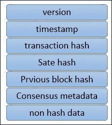

方块图

上图中显示的字段如下:

*   **版本:**用于跟踪协议的变化。
*   **时间戳:**UTC 纪元时间的时间戳，由区块提议者更新。
*   **事务散列:**该字段包含块中事务的 Merkle 根散列。
*   **状态散列:**这是世界状态的 Merkle 根散列。
*   **前一个散列:**这是前一个块的散列，它是在序列化块消息，然后通过应用 SHA3 SHAKE256 算法创建消息摘要之后计算的。
*   **共识元数据:**这是一个可选字段，共识协议可以使用它来提供关于共识的一些相关信息。
*   **非散列数据:**这是一些与块一起存储但未被散列的元数据。这个特性使得在不同的对等体上有不同的数据成为可能。它还提供了在不影响区块链的情况下丢弃数据的能力。

#### 对等协议

Hyperledger Fabric 中的 P2P 协议是使用 **google RPC** ( **gRPC** 构建的。它使用协议缓冲区来定义消息的结构。

消息在节点之间传递，以便执行各种功能。Hyperledger 结构中有四种主要类型的消息:发现、事务、同步和一致。当启动时，在节点之间交换发现消息，以便发现网络上的其他对等体。

事务消息可以分为两种类型:部署事务和调用事务。前者用于将新的链码部署到分类帐，后者用于从智能合约调用函数。交易可以是公开的、保密的和保密的链码交易。公开交易对所有参与者开放。机密交易只允许交易所有人和参与者查询。机密链码事务具有加密的链码，并且只能由验证节点解密。验证节点运行共识，验证事务并维护区块链。另一方面，非验证节点提供事务验证、流服务器和 REST 服务。它们还充当交易者和验证节点之间的代理。对等体使用同步消息来保持区块链更新并与其他节点同步。共识消息用于共识管理和向验证对等方广播有效载荷。这些是共识框架内部产生的。

#### 总账存储

为了保存分类帐的状态，使用了 RocksDB，它存储在每个对等点上。RocksDB 是一个高性能的数据库，可在 http://rocksdb.org/[使用。](http://rocksdb.org/)

### 链码服务

这些服务允许创建用于执行链代码的安全容器。此类别的组件如下:

*   **安全容器:** Chaincode 部署在 Docker 容器中，这些容器为智能合同执行提供了一个锁定的沙箱环境。目前，Golang 作为主要的智能合约语言受到支持，但是如果需要，可以添加和启用任何其他主流语言。
*   **安全注册:**这提供了包含智能合同的所有图像的记录。

### 事件

区块链上的事件可以由验证器节点和智能合约触发。外部应用程序可以监听这些事件，并在需要时通过事件适配器对它们做出反应。它们类似于上一章《坚固性》中介绍的事件概念。

### API 和 CLI

应用程序编程接口通过公开各种 REST APIs 来提供到结构中的接口。此外，命令行界面提供了 REST APIs 的子集，允许快速测试和与区块链的有限交互。

## 布料的成分

有各种组件可以成为区块链的一部分。这些组件包括但不限于分类账、链码、共识机制、访问控制、事件、系统监控和管理、钱包和系统集成组件。

### 对等体或节点

有两种主要类型的对等体可以在结构网络上运行:验证型和非验证型。简而言之，验证节点运行共识，创建和验证交易，并有助于更新分类帐和维护链码。

非验证对等体不执行事务，只构造事务，然后将这些事务转发给验证节点。

这两个节点都管理和维护由成员资格服务颁发的用户证书。

### 区块链上的应用

Fabric 上的典型应用程序只是由一个用户界面组成，通常用 JavaScript/HTML 编写，它通过 API 层与存储在分类帐上的后端链码(智能合同)进行交互。

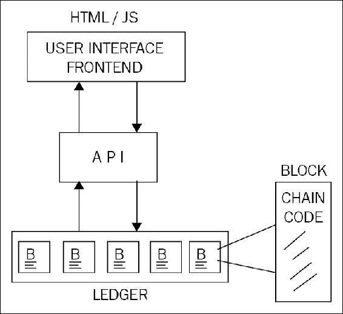

典型的区块链应用

Hyperledger 提供了各种 API 和命令行界面来实现与分类帐的交互。这些 API 包括用于身份、交易、链码、分类帐、网络、存储和事件的接口。

#### 链码实现

Chaincode 通常是用 Golang 或者 Java 编写的。链码可以是公开的、保密的或访问受控的。这些代码充当用户可以通过 API 与之交互的智能契约。用户可以在链码中调用导致状态变化的函数，从而更新分类账。还有一些功能只是用来查询总账，不会导致任何状态变化。

通过首先在代码中创建 chaincode shim 接口来执行 Chaincode 实现。它可以是 Java 或 Golang 代码。为了实现链码，需要以下四个函数:

*   `Init()` : 该功能在链码部署到总账时调用。这将初始化链码并导致状态改变，从而更新分类帐。
*   `Invoke()`:该功能在合同执行时使用。它接受一个函数名作为参数以及一个参数数组。该函数导致状态改变并写入分类帐。
*   `Query()`:该功能用于查询已部署链码的当前状态。此功能不会对分类帐进行任何更改。
*   `Main()` : 当一个对等体部署它自己的链码副本时，这个函数被执行。使用此函数向对等方注册链码。

下图说明了 Hyperledger 结构的一般概述:

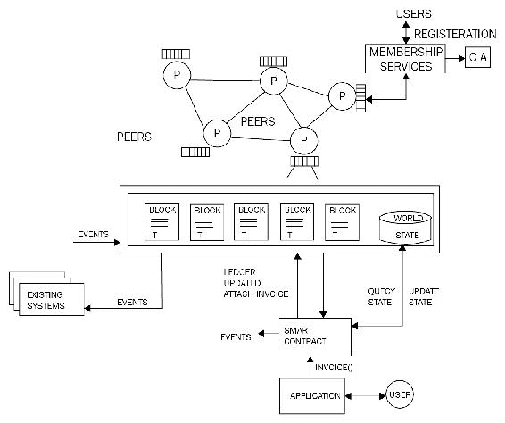

Hyperledger 结构的高级概览

#### 应用模型

Hyperledger Fabric 的任何区块链应用程序都遵循 MVC-B 架构。这是基于流行的 MVC 设计模式。该模型中的组件包括模型、视图、控制和区块链:

*   **视图逻辑**:与用户界面有关。它可以是桌面、web 应用程序或移动前端。
*   **控制逻辑**:这是用户界面、数据模型和 API 之间的协调器。
*   **数据模型**:该模型用于管理链外数据。
*   **区块链逻辑**:用于通过控制器管理区块链，通过交易管理数据模型。

由于 Hyperledger 当前版本 v0.6 正在进行大量重构以构建 V1.0，因此本节没有介绍实际练习。

预计到本书出版时，关于 Hyperledger fabric 的实际设置的信息已经过时了。因此，鼓励读者在[https://hyperledgerfabric.readthedocs.io/en/latest/](https://hyperledgerfabric.readthedocs.io/en/latest/)持续关注更新。

此外，IBM Bluemix 服务在其区块链即服务产品下为区块链提供了示例应用程序。可从 https://console . ng . bluemix . net/docs/services/区块链/ibmblockchain _ tutorials . html 获得。这项服务允许用户在一个易于使用的环境中创建自己的区块链网络。

# 锯齿湖

锯齿湖可以在许可和非许可模式下运行。这是一个分布式账本，它提出了两个新颖的概念:第一个是引入了一个新的共识算法，称为**经过时间的证明** ( **诗人**)；第二个是事务族的概念。下一节将简要介绍这些新颖的建议。

## 诗人

PoET 是一种新颖的一致性算法，它允许根据节点在提出阻塞之前等待的时间来随机选择节点。这与其他基于领导者选举和抽签的工作证明算法形成对比，在其他基于领导者选举和抽签的工作证明算法中，为了被选为分组提议者，使用了大量的电力和计算机资源，例如在比特币的情况下。PoET 是一种工作证明算法，但它不消耗计算机资源，而是使用可信计算模型来提供满足工作证明要求的机制。PoET 利用英特尔的 SGX 架构提供可信的执行环境，以确保流程的随机性和加密安全性。应该注意的是，锯齿湖的当前实现不需要基于 TEE 的真实硬件 SGX，因为它只是出于实验目的而模拟的，因此不应该在生产环境中使用。

## 交易家族

传统的智能合约范例提供了一种基于适用于所有领域的通用指令集的解决方案。例如，在以太坊的情况下，已经为**以太坊虚拟机** ( **EVM** )开发了一组操作码，可用于构建智能合约，以解决任何行业的任何类型的需求。虽然这种模式有其优点，但越来越明显的是，这种方法不是很安全，因为它提供了一个使用功能强大且富有表现力的语言的单一界面，这可能会为恶意代码提供更大的攻击面。这种复杂性和通用虚拟机范例导致了最近被黑客发现和利用的几个漏洞。最近的一个例子是 DAO 黑客和进一步的**拒绝服务** ( **DoS** )攻击，它们利用了一些 EVM 操作码中的限制。下图所示的模型描述了传统的智能合约模型，其中使用通用虚拟机为所有域提供进入区块链的接口:

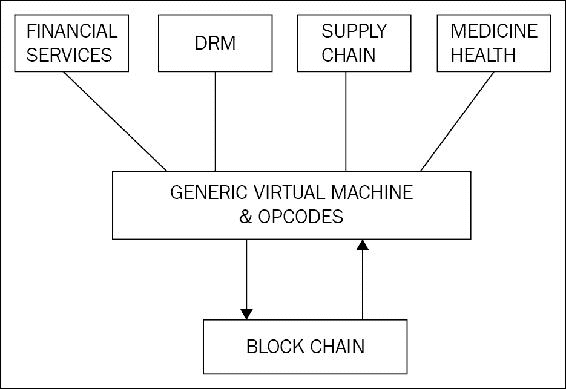

传统智能合同范例

为了解决这个问题，锯齿湖提出了事务族的思想。通过将逻辑层分解成一组规则和一个用于特定领域的*组合层*来创建事务族。关键思想是业务逻辑在*事务家族*中组合，这提供了一种更安全和更强大的方式来构建智能契约。事务系列包含特定于域的规则和允许为该域创建事务的另一层。从另一个角度来看，事务系列是数据模型和事务语言的组合，实现了特定领域的逻辑层。数据模型表示区块链(分类帐)的当前状态，而交易语言修改分类帐的状态。预计用户将根据自己的业务需求构建自己的事务系列。

下图展示了这种模式，其中每个特定的领域，如金融服务、**数字版权管理** ( **DRM** )、供应链和医疗行业，都有自己的逻辑层，由特定于该领域的运营和服务组成。这使得逻辑层同时具有限制性和功能性。事务族确保只与所需域相关的操作出现在控制逻辑中，从而消除了执行不必要的、任意的和潜在有害的操作的可能性。

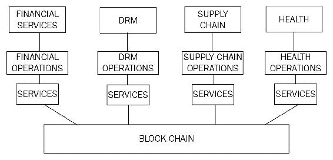

锯齿(交易系列)智能合约范例

英特尔为锯齿提供了三个交易系列:端点注册、Integerkey 和 MarketPlace。

1.  **端点注册中心**用于注册分类服务。
2.  **Integerkey** 用于测试已部署的总账。
3.  **MarketPlace** 用于销售、购买和交易运营和服务。

`Sawtooth_bond`已被开发为一个概念证明，用于演示债券交易平台。可在[https://github . com/hyperledger/sawtoon-core/tree/master/extensions/bond](https://github.com/hyperledger/sawtooth-core/tree/master/extensions/bond)获得。

## 锯齿中的共识

锯齿波有两种基于网络选择的共识机制。如前所述，PoET 是基于可信执行环境的抽奖功能，其基于节点等待阻止提议的时间来随机选举领导者。还有另一种共识类型称为法定投票，这是由 Ripple 和 Stellar 构建的共识协议的改编。这种一致性算法允许即时事务终结，这在许可网络中通常是可取的。

## 开发环境

在这一节中，将简要介绍如何为锯齿湖建立一个开发环境。设置开发环境需要一些先决条件。本节中的示例假设运行 Ubuntu 系统和以下内容:

1.  `vagrant`，至少 1.9.0 版本，可在[https://www.vagrantup.com/downloads.html](https://www.vagrantup.com/downloads.html)获得。
2.  虚拟盒子，至少 5.0.10 r104061，可在[https://www.virtualbox.org/wiki/Downloads](https://www.virtualbox.org/wiki/Downloads)买到。

一旦成功下载并安装了上述两个先决条件，下一步就是克隆存储库。

```
$ git clone https://github.com/IntelLedger/sawtooth-core.git

```

这将产生类似于以下屏幕截图所示的输出:

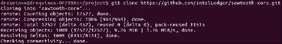

GitHub 锯齿克隆

一旦锯齿被正确克隆，下一步就是启动环境。首先，运行以下命令将目录更改到正确的位置，然后启动`vagrant`框:

```
$ cd sawtooth-core/tools
$ vagrant up

```

这将产生类似于以下屏幕截图的输出:

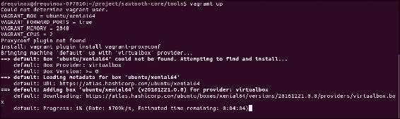

向上移动命令

如果在任何时候需要停止流浪，可以使用以下命令:

```
$ vagrant halt

```

或者

```
$ vagrant destroy

```

Halt 将停止`vagrant`机器，而`destroy`将停止并删除`vagrant`机器。

最后，可以使用以下命令启动事务验证器。首先将`ssh`放入`vagrant`锯齿箱。

```
$ vagrant ssh

```

当`vagrant`提示符可用时，运行以下命令。

首先使用以下命令构建`sawtooth`湖核心:

```
$ /project/sawtooth-core/bin/build_all

```

当构建成功完成时，为了运行事务验证器，发出以下命令:

```
$ /project/sawtooth-core/docs/source/tutorial/genesis.sh

```

这将创建 genesis 块并清除任何现有的数据文件和密钥。这应该会显示类似以下屏幕截图的输出:

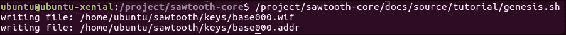

创世块和密钥生成

下一步是运行事务验证器，并如下所示更改目录:

```
$ cd /project/saw-toothcore

```

运行交易验证程序:

```
$ ./bin/txnvalidator -v -F ledger.transaction.integer_key --config /home/ubuntu/sawtooth/v0.json

```

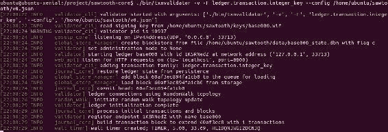

运行交易验证程序

可以通过按下 *Ctrl* + *C* 来停止验证器节点。一旦验证程序启动并运行，就可以在另一个终端窗口中启动各种客户机，与交易验证程序通信并提交交易。

例如，在下面的屏幕截图中，市场客户端启动，与交易验证器进行通信。请注意，`/keys/mkt.wif`下的键是使用以下命令创建的:

```
./bin/sawtooth keygen --key-dir validator/keys mkt

```

这个演示只是来自锯齿湖文档的一个基本示例。然而，使用锯齿湖进行开发是一个相当复杂的过程，可以用整整一章来专门讨论这个问题。

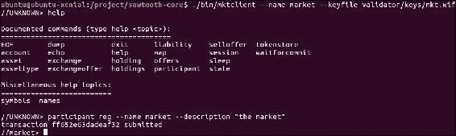

市场交易系列的 mktclient

锯齿湖也在持续开发中，因此建议读者留意在[http://intelledger.github.io/](http://intelledger.github.io/)获得的文档，以便跟上最新的发展。

# Corda

科达不是区块链。如前所述，传统的区块链解决方案的概念是将事务捆绑在一个块中，每个块都以加密方式链接回其父块，从而提供不可变的事务记录。Corda 的情况并非如此:Corda 完全是从零开始设计的，采用新模式提供所有区块链优势，但没有传统的区块链。它完全是为金融行业开发的，用于解决由于每个组织管理自己的分类账而产生的问题，因此对*真相*有自己的看法，这导致了矛盾和运营风险。此外，每个组织中的数据也是重复的，这导致管理单个基础架构的成本和复杂性增加。Corda 旨在通过构建一个分散的数据库平台来解决金融行业中的这类问题。

Corda 源代码可在[https://github.com/corda/corda](https://github.com/corda/corda)获得。它是用一种叫做 Kotlin 的语言编写的，这是一种针对 **Java 虚拟机** ( **JVM** )的静态类型语言。

## 建筑

Corda 平台的主要组件包括状态对象、合同代码、法律散文、交易、共识和流程。

### 陈述对象

状态对象代表表示财务协议的最小数据单元。它们是作为事务执行的结果而创建或删除的。他们指的是**合同代码**和**法律条文。**法律条文是可选的，为合同提供法律约束力。但是，为了管理对象的状态，合同代码是必需的。它是必需的，以便根据契约代码中定义的业务逻辑为节点提供状态转换机制。状态对象包含表示对象当前状态的数据结构。例如，在下图中，状态对象表示对象的当前状态。在这种情况下，这是**甲方**和**乙方**之间的一个简单的模拟协议，其中**方 ABC** 已经向**方 XYZ** **支付了 1000 英镑**。这表示对象的当前状态；但是，引用的合同代码可以通过事务改变状态。状态对象可以被认为是一个状态机，事务使用它来创建更新的状态对象。

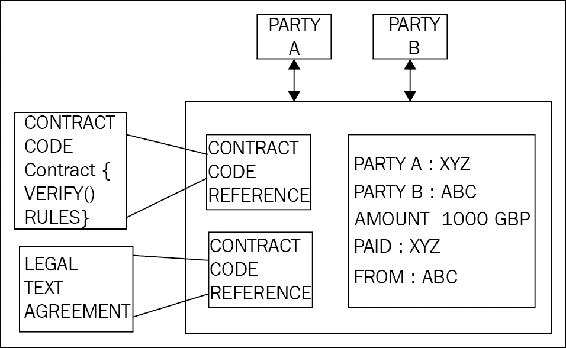

一个示例状态对象

### 交易

事务用于执行不同状态之间的转换。例如，上图中显示的状态对象是作为事务的结果而创建的。Corda 使用比特币风格的基于 UTXO 的模型进行交易处理。交易状态转换的概念与比特币相同。与比特币类似，交易可以没有、有单个或多个输入，也可以有单个或多个输出。所有交易都经过数字签名。此外，Corda 没有采矿的概念，因为它不使用区块来安排区块链中的交易。相反，使用公证服务是为了提供交易的时间排序。在 Corda 中，可以使用 JVM 字节码开发新的事务类型，这使得它非常灵活和强大。

### 共识

Corda 中的共识模型非常简单，它基于公证服务，这将在后面的章节中讨论。一般的想法是由公证服务评估交易的唯一性，如果它们是唯一的，则它们被签名为有效的。Corda 网络上可以运行单个或多个集群公证服务。各种共识算法，如 PBFT 或 Raft，可以被公证人用来达成共识。

在 Corda 中有两个关于一致性的主要概念:关于状态有效性的一致性和关于状态唯一性的一致性。第一个概念与交易的验证有关，确保所有必需的签名都可用并且状态正确。第二个概念是检测双重花费攻击的手段，并确保交易尚未被花费并且是唯一的。

### 流量

Corda 中的流是一个新颖的想法，它允许开发分散的工作流。Corda 网络上的所有通信都由这些流处理。这些是交易构建协议，可用于使用代码定义任何复杂性的任何财务流。流作为异步状态机运行，它们与其他节点和用户交互。在执行过程中，可以根据需要暂停或恢复它们。

## 组件

Corda 网络有多个组件。下一节将描述所有这些组件。

### 节点

Corda 网络中的节点在无信任模式下运行，并由不同的组织运行。节点作为经过身份验证的对等网络的一部分运行。节点使用**高级消息队列协议** ( **AMQP** )直接相互通信，该协议是一种经认可的国际标准(ISO/IEC 19464)，可确保不同节点间的消息安全可靠地传输。AMQP 负责 Corda 中的**传输层安全** ( **TLS** )，从而确保节点间通信数据的私密性和完整性。

节点还利用本地关系数据库进行存储。网络上的消息以紧凑的二进制格式编码。它们通过使用 **Apache Artemis 消息代理** ( **活动 MQ** )来交付和管理。节点可以充当网络地图服务、公证人、Oracle 或常规节点。下图显示了两个相互通信的节点的高级视图:

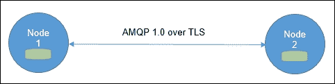

在 Corda 网络中通信的两个节点

在上图中，**节点 1** 正在使用 AMQP 协议通过 TLS 通信信道与**节点 2** 通信，这些节点有一个本地关系数据库用于存储。

### 许可服务

许可服务用于为安全性提供 TLS 证书。为了参与网络，参与者需要具有由根认证机构颁发的签名身份。身份要求在网络上是唯一的，许可服务用于签署这些身份。用于识别参与者的命名约定基于 X.500 标准。这确保了名称的唯一性。

#### 网络地图服务

该服务用于以文档的形式提供网络上所有节点的网络图。该服务发布 IP 地址、身份证书和节点提供的服务列表。当所有节点首次启动时，它们通过向该服务注册来宣布它们的存在，并且当一个节点接收到连接请求时，首先在网络图上检查请求节点的存在。换句话说，该服务将参与者的身份解析到物理节点。

#### 公证服务

在传统的区块链中，挖掘用于确定包含事务的块的顺序。在 Corda 中，公证服务用于提供事务排序和时间戳服务。在一个网络中可以有多个公证人，并且他们通过复合公钥来识别。公证人可以根据申请的要求使用不同的共识算法，如 BFT 或 Raft。公证服务对交易进行签名，以表明交易的有效性和终结性，然后将交易保存到数据库中。

出于性能原因，公证人可以在负载平衡的配置中运行，以便将负载分散到各个节点上；此外，为了减少延迟，建议在物理上更靠近事务参与者的地方运行节点。

#### Oracle 服务

Oracle 服务要么签署包含事实(如果它是真实的)的事务，要么自己提供事实数据。它们允许将真实世界输入到分布式分类帐中。

#### 交易

Corda 网络中的事务从不在全球范围内传输，而是在半私有网络中传输。它们只在与交易相关的参与者的子集之间共享。这与以太坊和比特币等传统区块链解决方案形成了鲜明对比，在这些解决方案中，所有交易都会向全球整个网络广播。事务被数字签名，并且消耗状态或创建新状态。

Corda 网络上的交易由以下要素组成:

*   **输入引用**:这是对交易将要消耗的状态的引用，并用作输入。
*   **输出状态**:这些是事务创建的新状态。
*   **附件** : 这是附件 zip 文件的哈希列表。Zip 文件可以包含与交易相关的代码和其他相关文档。文件本身不是事务的一部分，而是被单独传输和存储。
*   **命令** : 命令表示关于交易的预期操作的信息，作为契约的参数。每个命令都有一个公钥列表，它代表了签署交易所需的所有各方。
*   **签名**:表示交易需要的签名。所需的签名总数与命令的公钥数成正比。
*   **类型**:有两种交易类型，即普通或公证变更。公证人变更事务用于为州重新分配公证人。
*   **时间戳**:该字段表示交易发生的时间段。这些由公证机构核实和执行。此外，如果需要严格的计时，这在许多金融服务场景中是可取的，那么公证人应该与原子钟同步。
*   **摘要**:描述交易操作的文字描述。

#### 金库

金库在一个节点上运行，类似于比特币中的钱包概念。由于事务不是全局广播的，所以每个节点在其存储库中只有被认为与它们相关的那部分数据。Vaults 将其数据存储在标准关系数据库中，因此可以使用标准 SQL 进行查询。保管库可以包含分类帐数据和分类帐外数据，这意味着它也可以包含分类帐以外的部分数据。

#### 〔t0〕cord app

Corda 的核心模型由状态对象、交易和交易协议组成，当它们与契约代码、API、钱包插件和用户界面组件结合时，会导致构建一个 **Corda 分布式应用** ( **CorDapp** )。

Corda 中的智能合约是使用 Kotlin 或 Java 编写的。代码是针对 JVM 的。JVM 已经被稍微修改，以便获得 JVM 字节码执行的确定性结果。Corda 智能合同有以下三个主要组成部分:

1.  定义验证逻辑以验证对状态对象的更改的可执行代码。
2.  状态对象表示协定的当前状态，可以由事务使用，也可以由事务产生(创建)。
3.  命令用于描述定义如何验证交易的操作和验证数据。

## 开发环境

Corda 的开发环境可以通过以下步骤轻松设置。

所需软件包括以下内容:

1.  JDK 8 可从 http://www . Oracle . com/tech network/Java/javase/downloads/index . html 获得。
2.  IntelliJ IDEA 社区版可在[https://www.jetbrains.com/idea/download](https://www.jetbrains.com/idea/download)免费获得。
3.  独立于 H2 数据库平台的 zip，并可在[http://www.h2database.com/html/download.html](http://www.h2database.com/html/download.html)获得。
4.  Git，可在[https://git-scm.com/downloads](https://git-scm.com/downloads)买到。
5.  可用于 IntelliJ 的 Kotlin 语言，更多信息可在[https://kotlinlang.org/](https://kotlinlang.org/)找到。
6.  Gradle 是用于构建 Corda 的另一个组件。

一旦安装了所有这些工具，就可以开始智能合同开发了。CorDapps 可以利用在[https://github.com/corda/cordapp-template](https://github.com/corda/cordapp-template)提供的示例模板进行开发。关于如何开发合同代码的详细文档可在 https://docs.corda.net/[获得。](https://docs.corda.net/)

可以使用以下命令从 GitHub 本地克隆 Corda:

```
$ git clone https://github.com/corda/corda.git

```

克隆成功后，您应该会看到类似以下内容的输出:

```
Cloning into 'corda'...
remote: Counting objects: 74695, done.
remote: Compressing objects: 100% (67/67), done.
remote: Total 74695 (delta 17), reused 0 (delta 0), pack-reused 74591
Receiving objects: 100% (74695/74695), 51.27 MiB | 1.72 MiB/s, done.
Resolving deltas: 100% (42863/42863), done.
Checking connectivity... done.

```

一旦存储库被克隆，就可以在 IntelliJ 中打开它进行进一步的开发。存储库中有多个可用的示例，如 bank of Corda、利率互换、演示和交易者演示。读者可以在`corda`下的`/samples`目录下找到它们，并且可以使用 IntelliJ IDEA IDE 来研究它们。

# 总结

在本章中，我们介绍了 Hyperledger 项目。首先，讨论了 Hyperledger 项目背后的核心思想，并简要介绍了 Hyperledger 中正在酝酿的所有项目。详细讨论了三个主要的 Hyperledger 项目，即 Hyperledger fabric、锯齿湖和 Corda。所有这些项目目前都在紧锣密鼓地开发中，预计在下一个版本中会有变化。正因为如此，没有给出深入的实际练习。然而，上述所有项目的核心概念预计将保持不变或仅略有变化。鼓励读者访问本章中提供的相关链接，以查看最新更新。很明显，这个领域正在发生很多事情，像 Linux 基金会的 Hyperledger 这样的项目在区块链技术的进步中发挥着关键作用。本章讨论的每个项目都有新颖的方法来解决各种行业面临的问题，区块链技术中的任何当前限制也正在得到解决，如可扩展性和隐私。预计 Hyperledger 项目将很快提出更多的项目，预计通过这种合作和开放的努力，区块链技术将取得巨大进步，并将使整个社区受益。