# 第十章。另类区块链

本章旨在介绍可供选择的区块链解决方案。随着比特币的成功和随后区块链技术潜力的实现，寒武纪大爆发开始了，导致了各种区块链协议、应用程序和平台的发展。一些项目没有获得太多的关注，但是许多项目已经成功地在这个领域建立了稳固的地位。

在这一章中，读者将被介绍到另一种区块链和平台，它们要么是新区块链本身，要么是其他现有区块链的补充。这些新平台基于提供 SDK 和工具来简化区块链解决方案的开发和部署的理念。以太坊和比特币的成功催生了各种项目，这些项目利用了它们引入的底层技术和概念。这些新项目通过解决当前区块链中的限制或通过在现有解决方案的基础上提供一层额外的用户友好工具来增强现有解决方案，从而增加价值。

本章的第一节将介绍新的区块链解决方案，后面的章节将涵盖补充现有区块链的各种平台和开发套件。例如，BlockApps STRATO 是一个用于开发区块链应用程序的以太坊兼容平台，Kadena 是一个新的私有区块链，具有可扩展 BFT 等新颖的想法。随着区块链技术的发展，侧链、传动链和挂钩等各种概念也首次被引入。本章将详细介绍所有这些技术和相关概念。当然，不可能涵盖所有的替代链(altchains)和平台，但所有这些平台都包含在本章中，它们与区块链相关，在前面的章节中有所涉及，或者有望在不久的将来获得关注。

# 块状链

本节将介绍新的区块链解决方案。首先，一个名为嘉手纳的新区块链将在下一节中讨论。

## 不见了

Kadena 是最近推出的私有区块链，它成功地解决了区块链系统中的可扩展性和隐私问题。Kadena 还引入了一种新的图灵不完全语言 Pact，允许开发智能合约。Kadena 的一项关键创新是其可扩展的 BFT 共识算法，该算法有可能扩展到数千个节点而不会降低性能。可扩展 BFT 基于原始的 Raft 算法，是 Tangaroa 和 Juno 的继承者。Tangaroa 是一种具有容错功能的 Raft(BFT Raft)的实现，旨在解决 Raft 算法中拜占庭节点行为引起的可用性和安全性问题，Juno 是 Tangaroa 的一个分支，由*摩根大通*开发。共识算法在[第一章](01.html "Chapter 1. Blockchain 101")、*区块链 101* 中有更详细的讨论。这两种方案都有一个基本的限制——它们不能在保持高水平高性能的同时进行扩展。因此，朱诺无法获得太多的牵引力。随着节点数量的增加，私有区块链具有维持高性能的更理想的属性，但是上述提议缺乏该特征。Kadena 通过其专有的可扩展 BFT 算法解决了这一问题，该算法有望扩展到数千个节点，而不会有任何性能下降。

此外，保密性是 Kadena 的另一个重要方面，它使区块链上的交易能够保密。这是通过结合使用密钥轮换、对称链上加密、增量散列和双棘轮协议来实现的。

密钥轮换被用作确保私有区块链安全的标准机制。这是一种最佳做法，如果密钥已经泄露，可以通过定期更改加密密钥来阻止任何攻击。在 Pact 智能契约语言中有对密钥轮换的本地支持。

对称链上加密允许加密区块链上的交易数据。这些交易可以由特定私人交易的参与者自动解密。双棘轮协议用于提供密钥管理和加密功能。

可扩展的 BFT 共识协议可确保在智能合同执行之前实现充分的复制和共识。通过以下描述的过程达成共识:

1.  首先，一个新的事务由用户签名并通过区块链网络广播，该事务被一个领导节点拾取并添加到它的不可变日志中。此时，还会为日志计算一个增量散列。增量散列是一种散列函数，它基本上允许在这样的情况下计算散列消息，其中，如果已经被散列的先前的原始消息被稍微改变，则新的散列消息是从已经存在的散列计算的。与传统的散列函数相比，该方案更快并且资源更少，在传统的散列函数中，即使原始消息仅发生了非常微小的变化，也需要生成全新的散列消息。
2.  一旦事务被领导节点写入日志，它就对复制和增量散列进行签名，并将其广播给其他节点。
3.  其他节点在接收到事务后，验证领导节点的签名，将事务添加到它们自己的日志中，并将它们自己计算的增量散列(法定证明)广播到其他节点。最后，在从其他节点接收到足够数量的证明之后，事务被永久地提交到分类帐中。

下图显示了该流程的简化版本，其中**领导者**节点记录新的事务，然后将它们复制到**跟随者**节点:


嘉手纳的共识机制

一旦达成共识，智能合同执行就可以开始，并采取以下几个步骤:

1.  首先，验证消息的签名。
2.  Pact 智能合约层接管。
3.  Pact 代码已编译。
4.  交易被启动并执行智能合约中嵌入的任何业务逻辑。如果出现任何故障，将立即启动回滚，将该状态恢复到执行开始之前的状态。
5.  最后，事务完成，相关日志被更新。

Pact 已经被 Kadena 开源，可以在 http://kadena.io/pact/downloads.html 下载。这可以作为一个独立的二进制文件下载，它为 Pact 语言提供了 REPL。下面显示了一个例子，在 Linux 控制台中通过发出命令`./pact`来运行 Pact:

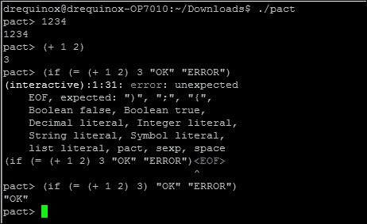

Pact REPL，显示示例命令和错误输出

Pact 中的智能契约通常由三部分组成:键集、模块和表。首先，**键集**定义了表和模块的相关授权方案。其次，**模块**以**函数**和**契约**的形式定义了包含业务逻辑的智能契约代码。模块内的契约由多个步骤组成，并按顺序执行。

Pact 可以在几种执行模式下使用。这些模式包括**合同定义**、**交易执行、**和**查询**。合同定义模式允许通过单个交易消息在区块链上创建合同。事务执行模式需要执行代表业务逻辑的智能合约代码模块。查询只是简单地探测契约中的数据，出于性能原因，查询在节点上本地执行。

Pact 使用类似 LISP 的语法，并在代码中准确地表示将在区块链上执行的内容，因为它以人类可读的格式存储在区块链上。这与以太坊的 EVM 形成对比，后者编译成字节码来执行，这使得很难验证区块链上正在执行什么代码。此外，它是图灵不完全的，支持不可变变量，并且不允许空值，这提高了事务代码执行的整体安全性。

本章不可能涵盖 Pact 的完整语法和功能，但是，下面显示了一个小示例，该示例显示了用 Pact 编写的智能合同的一般结构。这个例子展示了一个简单的加法模块，它定义了一个名为`addition`的函数，该函数有三个参数。当执行代码时，它将所有三个值相加并显示结果。

下面的例子是使用在线 Pact 编译器开发的，该编译器可在[http://kadena.io/try-pact/](http://kadena.io/try-pact/)获得:

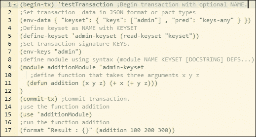

样本契约代码

运行代码时，它会产生如下所示的输出:

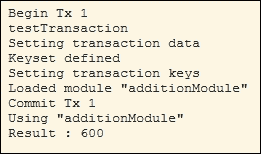

代码的输出

如前面的示例所示，执行输出与代码布局和结构完全匹配，这提高了透明度，并限制了恶意代码执行的可能性。

Kadena 是一个新的私有区块链类别，它引入了**普适确定性**的新概念，除了基于标准公钥/私钥的数据源安全性之外，还提供了一个额外的完全确定性共识层。它在区块链的所有层提供加密安全性，包括事务层和共识层。

### 注意

Pact 的相关文档和源代码可以在这里找到:[https://github.com/kadena-io/pact](https://github.com/kadena-io/pact)。

### 涟漪

Ripple 于 2012 年推出，是一个货币兑换和实时支付结算系统。在 Ripple 中，支付无需等待即可完成，而传统的结算网络可能需要数天才能完成。它有一种本土货币叫做**涟漪** ( **XRP** )。它还支持非 XRP 支付。这种系统被认为类似于一种古老的传统货币转移机制，被称为*哈瓦拉*。这个系统的工作原理是利用代理人从汇款人那里拿到钱和密码，然后联系收款人的代理人，指示他们将资金发放给能提供密码的人。收款人然后联系当地代理，告诉他们密码，并收取资金。Ripple 中的网关类似于代理。这只是一个非常简单的类比，实际的协议相当复杂，但原则上是相同的。

波纹网络由不同的节点组成，这些节点可以根据它们的类型执行不同的功能。第一，**用户节点**:在支付交易中使用，可以支付或接收款项。第二，**验证器节点**:这些节点参与共识机制。每个服务器维护一组唯一的节点，在达成共识时需要查询这些节点。**唯一节点列表** ( **UNL** )中的节点受到共识机制中所涉及的服务器的信任，并且将仅接受来自该唯一节点列表的投票。Ripple 有时并不被认为是真正的去中心化，因为它涉及到网络运营商和监管机构。然而，它可以被认为是分散的，因为任何人都可以通过运行验证器节点成为网络的一部分。此外，共识过程也是分散的，因为对账本提出的任何更改都必须遵循超级多数投票方案来决定。然而，这是研究人员和爱好者之间的一个热门话题，每个学派都有反对和支持的论点。

Ripple 维护着一个所有交易的全球分布式账本，它由一种叫做 **Ripple 协议共识算法** ( **RPCA** )的新型低延迟共识算法管理。共识过程通过以迭代的方式寻求来自验证服务器的验证和接受，直到获得足够数量的投票，从而对包含交易的开放分类帐的状态达成一致。一旦收到足够的投票(超级多数，最初为 50%,随着每次迭代逐渐增加到至少 80%),变更被验证，分类帐被关闭。此时，会向整个网络发送一个警报，指示该分类帐已结清。

总之，共识协议是一个三阶段的过程。首先是**收集阶段**，验证节点收集账户所有人在网络上传播的所有交易，并对其进行验证。交易一旦被接受，就称为候选交易，可以根据验证标准接受或拒绝。然后**共识**流程开始，达成共识后**关闭**。这个过程每隔几秒钟就异步运行一次，因此，分类帐会相应地打开和关闭(更新)。

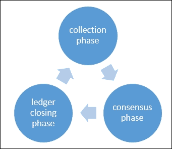

涟漪共识协议阶段

在 Ripple 网络中，有许多组件协同工作，以达成共识并形成支付网络。下面分别讨论这些组件:

*   **服务器**:该组件作为共识协议的参与者。需要 Ripple 服务器软件以便能够参与共识协议。
*   **分类账**:这是网络上所有账户余额的主记录。分类帐包含各种元素，如分类帐编号、帐户设置、交易、时间戳和指示分类帐有效性的标志。
*   **最后一次结账**:节点验证达成一致后，结账。
*   **未结台账**:该台账尚未经过审核，其状态尚未达成一致。每个节点都有自己的未结分类帐，其中包含建议的交易。
*   **唯一节点列表:**这是唯一可信节点的列表，验证服务器使用该列表来寻求投票和随后的共识。
*   **提议者**:顾名思义，该组件提议将新的事务包含在一致同意流程中。通常是节点的子集(上面定义的 UNL)可以向验证服务器提议事务。

### 交易

交易由网络用户创建，以便更新分类帐。交易需要经过数字签名并有效，才能被视为共识流程中的候选交易。每笔交易花费少量的 XRP，这是一种防止垃圾邮件导致的拒绝服务攻击的保护机制。在 Ripple 网络中有不同类型的交易。Ripple 事务数据结构中称为`TransactionType`的单个字段用于表示事务的类型。通过使用四个步骤的过程来执行交易。首先，按照标准准备交易，由此创建未签名的交易。第二步是签名，对交易进行数字签名以授权交易。此后，通过连接的服务器向网络进行实际提交。最后，执行验证以确保成功验证交易。

大致而言，交易可以分为三种类型，即支付相关、订单相关以及账户和证券相关。所有这些类型都将在下一节中描述。

#### 付款相关

此类别中有几个字段会导致某些操作。所有这些字段描述如下:

1.  这种交易最常用，允许一个用户向另一个用户汇款。
2.  `PaymentChannelClaim`:用于从支付渠道认领**涟漪** ( **XRP** )。支付渠道是一种允许各方之间重复和单向支付的机制。这也可以用来设置支付通道的到期时间。
3.  `PaymentChannelCreate`:该交易创建了一个新的支付渠道，并在*点*添加了 XRP。一滴相当于 0.000001 XRP。
4.  `PaymentChannelFund`:该交易用于向现有渠道添加更多资金。类似于`PaymentChannelClaim` 交易，这也可以用来修改支付通道的到期时间。

#### 订单相关

这种类型的交易包括以下两个字段:

1.  `OfferCreate`:该交易代表限价单，代表货币兑换意向。如果不能完全实现，则会在共识分类帐中创建一个要约节点。
2.  `OfferCancel`:从共识账本中删除之前创建的报价节点，表示撤销订单。

#### 账户与安全相关

这种类型的交易包括下列字段。每个领域负责执行特定的功能。

1.  `AccountSet`:该交易用于修改 Ripple 共识账户的账户属性。
2.  `SetRegularKey`:用于变更或设置账户的交易签名密钥。使用从帐户的主公钥导出的 base-58 波纹地址来识别帐户。
3.  `SignerListSet`:可以用来创建一组签名人，用于多签名交易。
4.  `TrustSet`:用于创建或修改账户间的信任额度。

Ripple 中的事务由所有事务类型共有的各种字段组成。以下列出了这些字段及其说明:

1.  `Account`，交易发起方地址。
2.  `AccountTxnID`，这是一个可选字段，包含另一笔交易的哈希。
3.  `Fee`、量 XRP。
4.  `Flags`，交易的可选标志。
5.  `LastLedgerSequence`，交易可以出现的分类账的最高序号。
6.  `Memos`，可选任意信息。
7.  `Sequence`，每笔交易增加 1 的数字。
8.  `SigningPubKey`，公钥。
9.  `Signers`，代表多签名交易中的签名人。
10.  `SourceTag`，代表交易的发送方或原因。
11.  `TransactionType`，交易类型。
12.  `TxnSignature`，交易验证签名。

Ripple 提供了各种开发人员的 API，以便外部实体能够连接到 Ripple 网络。两个关键组件 **Interledger** 协议和 **Ripple connect** 协同工作，以实现分布式、安全、可扩展和可互操作的支付网络。

为了实现两个不同分类帐之间的互操作性，专门开发了分类帐间协议。它可以用于连接各种不同组织的分类帐和区块链，这些组织包括但不限于支付网络、金融机构、票据交换所和交易所。

Interledger 是一个简单的协议，由四层组成:应用层、传输层、Interledger 和分类帐。每层负责在特定协议下执行各种功能。这些功能和协议将在下一节介绍。

#### 应用层

在这一层上运行的协议控制着支付交易的关键属性。应用层协议的例子包括**简单支付设置协议** ( **SPSP** )和**开放网络支付方案** ( **OWPS** )。SPSP 是一种分类帐间协议，通过在不同分类帐之间创建*连接器*，允许不同分类帐之间的安全支付。OWPS 是另一种允许消费者跨不同网络支付的方案。一旦这一层的协议成功运行，将调用传输层的协议来启动支付过程。

#### 传输层

这一层负责管理支付交易。该层目前有**乐观传输协议** ( **OTP** )、**通用传输协议** ( **UTP** )和**原子传输协议** ( **ATP** )等协议。OTP 是最简单的协议，它在没有任何托管保护的情况下管理支付转移，而 UTP 提供托管保护。ATP 是最先进的协议，它不仅提供托管转移机制，而且还利用可信公证人来进一步保护支付交易。

#### 夹层

这一层提供互操作性和路由服务。该层包含**交织器协议** ( **ILP** )、**交织器报价协议** ( **ILQP** )、**交织器控制协议** ( **ILCP** )。ILP 数据包提供了传输中事务的最终目标。ILQP 用于发送方在实际转账前提出报价请求。ILCP 用于在支付网络的连接器之间交换与路由信息和支付错误相关的数据。

#### 总账层

该层包含支持连接器之间通信和支付交易执行的协议。*连接器*基本上是实现在不同分类账之间转发付款的协议的对象。它可以支持各种协议，例如简单分类帐协议、各种区块链协议、传统协议和不同的专有协议。

Ripple connect 由各种即插即用模块组成，允许使用 ILP 在分类帐之间建立连接。它支持交易前各方之间所需数据的交换、可见性、费用管理、交付确认以及使用传输层安全性的安全通信。第三方应用程序可以通过各种连接器连接到 Ripple 网络。

总的来说，Ripple 是一个面向金融行业的解决方案，可以在没有任何结算风险的情况下实现实时支付。由于这是一个功能非常丰富的平台，因此在本章中不可能涵盖它的所有方面。Ripple 和非常丰富的平台文档可以在[https://ripple.com/](https://ripple.com/)获得。

### 恒星

Stellar 是一个基于区块链技术和一种新颖的共识模型的支付网络，这种模型被称为**联邦拜占庭协议** ( **FBA** )。FBA 通过创建信任方的法定人数来工作。 **Stellar Consensus 协议** ( **SCP** )是 FBA 的一个实现。

Stellar 白皮书中确定的关键问题是当前金融基础设施的成本和复杂性。这种局限性证明了需要一种全球金融网络来解决这些问题，而不损害金融交易的完整性和安全性。这个需求导致了**恒星共识协议** ( **SCP** )的发明，这是一种可证明安全的共识机制。

它有四个主要属性:*分散控制*，允许任何人参与，无需任何中心方；*低延迟*，解决了快速交易处理的迫切需求；*灵活的信任*、*、*允许用户选择他们为特定目的信任哪一方，最后是*渐进安全*，它利用数字签名和散列函数在网络上提供所需的安全级别。

恒星网络允许通过其本地数字货币(称为流明，缩写为 XLM)来转移和表示资产的价值。当交易在网络上广播时，流明被消耗，这也作为对拒绝服务攻击的威慑。

Stellar 网络的核心是维护一个分布式分类账，记录每笔交易，并在每台 Stellar 服务器上复制。通过验证服务器之间的交易和用更新来更新分类帐来达成共识。Stellar ledger 还可以作为一个分布式的交易订单簿，允许用户存储他们买卖货币的报价。

有各种各样的工具、SDK 和软件组成了恒星网络。核心软件可在[https://github.com/stellar/stellar-core](https://github.com/stellar/stellar-core)获得。

### 根茎

在详细讨论根茎之前，重要的是定义和介绍一些对根茎设计很重要的概念。这些概念包括侧链、传动链和双向挂钩。侧链的概念最初是由 Blockstream 开发的。

双向挂钩是一种机制，通过这种机制，价值(硬币)可以在一个区块链和另一个之间转移，反之亦然。链条之间没有真正的硬币转移。这个想法围绕着在比特币区块链(主链)中锁定相同数量和价值的硬币，并在二级链中解锁等量的代币的概念。

记住这个定义，侧链可以按照下一节的描述来定义。记住这个定义，侧链可以按照下一节的描述来定义。

边链

这是一个与主区块链并行运行的区块链，允许它们之间的价值转移。这意味着来自一个区块链的令牌可以在侧链中使用，反之亦然。这也称为挂钩侧链，因为它支持双向挂钩资产。

#### 驱动程序

这是一个相对较新的概念，解锁锁定的比特币(在主链中)的控制权交给了矿工，他们可以投票决定何时解锁。这与侧链相反，在侧链中，通过简单的支付验证机制来验证共识，以便将硬币转移回主链。

根茎是一个智能合约平台，它与比特币区块链双向挂钩。核心思想是提高比特币系统的可扩展性和性能，使其能够与智能合约一起工作。根茎运行一个图灵完全确定性虚拟机叫做**根茎虚拟机** ( **RVM** )。它还与以太坊虚拟机兼容，并允许 solidity 编译的契约在 roostheum 上运行。智能合约也可以在比特币区块链久经考验的安全性下运行。根茎区块链的工作方式是将挖矿与比特币合并。这使得 RSK 区块链达到了与比特币相同的安全水平。这对于防止重复支出和实现结算终结尤其如此。它支持可伸缩性，每秒可处理 100 个事务。

RSK 最近发布了一个名为姜黄的测试网络。在[http://www.rsk.co/](http://www.rsk.co/)有售。

### 罗马

这是一个通过增强现有以太坊区块链而构建的区块链解决方案。Quorum 中引入了一些增强功能，如事务隐私和新的共识机制。Quorum 引入了一种新的共识模型，称为 QuorumChain，它基于多数表决和基于时间的机制。还引入了另一个称为 Constellation 的特性，它是一种用于提交信息的通用机制，允许对等体之间进行加密通信。此外，节点级别的权限由智能协定控制。与区块链公共以太坊相比，它还提供了更高水平的性能。

Quorum 区块链生态系统由几个部分组成。这些在下一节中列出。

#### 交易管理器

该组件允许访问加密的交易数据。它还管理本地存储以及与网络上其他事务管理器的通信。

#### 飞地加密

顾名思义，这个组件负责提供加密服务以确保事务隐私。它还负责执行关键的管理功能。

#### 空间链

这是 Quorum 的关键创新。这是一种拜占庭式的容错共识机制，允许通过区块链网络上的交易来验证和循环投票。在该方案中，智能契约用于管理共识过程，节点可以被赋予投票权来投票决定应该接受哪个新块。一旦选民获得适当数量的选票，该选区就被认为是有效的。节点可以有两个角色，即*投票者*或*制定者*。*投票者*节点被允许投票，而*制造者*节点是创建新块的节点。一个节点可以有两种权限，一种没有，或者只有一种。

#### 网络管理员

该组件为许可网络提供访问控制层。

法定网络中的节点可以扮演多种角色，例如，允许创建新块的标记节点。交易隐私是通过使用加密技术和某些交易只能被相关参与者看到的概念来提供的。这个想法类似于上一章讨论的 Corda 的私有交易的想法。由于允许在区块链进行公开和私下交易，国家数据库被分成两个数据库，分别代表私下和公开交易。因此，有两棵独立的 Patricia-Merkle 树代表网络的私有和公有状态。私有契约状态散列用于在交易方之间的私有交易中提供共识证据。

法定网络中的交易由各种元素组成，例如接收者、发送者的数字签名(用于识别交易发起者)、可选的金额、被允许查看交易的可选参与者列表、以及在私人交易的情况下包含散列的字段。

事务在到达目的地之前要经过几个步骤。这些步骤详细描述如下:

1.  用户应用程序(DAPPs)通过区块链网络提供的 API 将事务发送到法定节点。这还包含收件人地址和交易数据。
2.  然后，API 对有效载荷进行加密，并应用任何其他必要的加密算法，以确保交易的私密性，然后发送给交易管理器。加密有效载荷的散列也在这一步计算。
3.  收到交易后，交易管理器验证交易发送方的签名并存储消息。
4.  先前加密的有效负载的散列被发送到法定节点。
5.  一旦法定节点开始验证包含私有事务的块，它就向事务管理器请求更多相关数据。
6.  一旦事务管理器收到这个请求，它就将加密的有效负载和相关的对称密钥发送给请求者法定节点。
7.  一旦法定节点获得所有数据，它就会解密有效负载，并将其发送到 EVM 进行执行。这就是 Quorum 在区块链上使用对称加密实现隐私的方式，同时它能够分别使用本机以太坊协议和 EVM 进行消息传输和执行。
8.  类似的概念，但在几个方面有很大不同，以前已经以 **Hydrachain** 的形式提出，它基于以太坊区块链，允许创建许可的分布式分类账。

Quorum 可在[https://github.com/jpmorganchase/quorum](https://github.com/jpmorganchase/quorum)下载。

### 理论

Tezos 是一种通用的自修正加密分类帐，这意味着它不仅允许对区块链的状态达成分散共识，还允许对协议和节点如何随时间演进达成共识。Tezos 的开发旨在解决比特币协议中的限制，如硬分叉、成本和采矿权力集中(由于工作证明、有限的脚本能力和安全问题)引起的问题。它是用一种叫做 OCaml 的纯函数式语言开发的。

Tezos 分布式账本的架构分为三层:网络层、共识层和事务层。这种分解允许协议以分散的方式发展。为此，在 Tezos 中实现了一个通用的网络外壳，负责维护区块链，它由共识层和事务层的组合来表示。这个外壳提供了网络和协议之间的接口层。还引入了种子协议的概念，它被用作一种机制，允许网络上的利益相关者批准对协议的任何更改。与从创世块开始的传统区块链相比，泰佐斯区块链从种子协议开始。

该 seed 协议负责定义区块链中的修订程序，甚至修订协议本身。Tezos 中的奖励机制是基于**利益证明** ( **位置**)算法，因此没有开采要求。

合同脚本语言已经在 Tezos 中开发出来，用于编写智能合同，这是一种基于栈的图灵完全语言。Tezos 中的智能契约是形式上可验证的，这使得代码可以从数学上证明其正确性。

Tezos 代码可在 https://github.com/tezos/tezos 获得。

### 大

基于云的存储的现有模型都是集中式解决方案，可能会也可能不会像用户期望的那样安全。需要一个安全、高度可用、最重要的是去中心化的云存储系统。Storj 旨在提供基于区块链的分散式分布式存储。它是一个由社区共享的云，而不是一个中央组织。它允许在充当自治代理的节点之间执行存储契约。这些代理(节点)执行各种功能，例如数据传输、验证和执行数据完整性检查。核心概念是基于**分布式哈希表** ( **DHT** ) -Kademlia，但是这个协议已经通过在 Storj 中添加新的消息类型和功能得到了增强。它还实现了一个名为 Quasar 的对等**发布/订阅** ( **发布/订阅**)机制，确保消息成功到达对存储合同感兴趣的节点。这是通过称为**主题**的基于布隆过滤器的存储契约参数选择机制来实现的。

Storj 通过网络以加密格式存储文件。在将文件存储在网络上之前，会使用 AES-256-CTR 对称加密对其进行加密，然后以分布式方式一部分一部分地存储在网络上。这个将文件分割成碎片的过程被称为**分片**，它可以提高网络的可用性、安全性、性能和隐私性。此外，如果一个节点发生故障，碎片仍然可用，因为默认情况下，单个碎片存储在网络上的三个不同位置。

它维护一个区块链，作为一个共享的分类帐，并实现标准的安全功能，如公钥/私钥加密和哈希函数，类似于任何其他区块链。由于该系统基于同行之间的硬盘共享，任何人都可以通过共享硬盘上的额外空间做出贡献，并通过 Storj 自己的加密货币 **Storjcoinx** ( **SJCX** )获得报酬。SJCX 是作为*交易对手*资产开发的，并利用比特币区块链进行交易。

Storj 代码可在[https://github.com/Storj/](https://github.com/Storj/)获得。

### 迈德赛

这是另一个类似 Storj 的分布式存储系统。用户因其对网络的存储空间贡献而获得 Safecoin 支付。这种支付机制由*资源证明*管理，确保用户提交给网络的磁盘空间可用，否则 Safecoin 的支付将相应下降。文件被加密并分成小部分，然后传输到网络上进行存储。Maidsafe 引入了另一个概念**机会缓存**，这是一种在物理上更靠近访问请求来源的位置创建频繁访问数据的副本的机制，从而提高网络性能。安全网络的另一个新颖特征是，它自动删除网络上的任何重复数据，从而降低存储需求。此外，还引入了**搅动**的概念，这基本上意味着数据在网络上不断移动，这样数据就不会成为恶意对手的目标。它还在网络上保留多个数据副本，以便在某个节点离线或出现故障时提供冗余。

### big chaidb

这是一个可伸缩的区块链数据库。严格来说，它本身并不是一个区块链，而是通过提供一个分散的数据库来补充区块链技术。其核心是一个分布式数据库，但增加了区块链的属性，如去中心化、不变性和处理数字资产。它还允许使用 NoSQL 来查询数据库。它的目的是在一个分散的生态系统中提供一个数据库，不仅处理是分散的(区块链)或文件系统是分散的(例如 IPFS)，而且数据库也是分散的。这就使得整个去中心化的应用生态系统去中心化了。这在[https://www.bigchaindb.com/](https://www.bigchaindb.com/)有售。

### 多链

Multichain 是一个开发和部署私有区块链的平台。它基于比特币代码，解决了安全性、可扩展性和隐私问题。这是一个高度可配置的区块链平台，允许用户设置不同的区块链参数。它通过粒度许可层支持控制和隐私。多链的安装非常快速，在[http://www.multichain.com/download-install/](http://www.multichain.com/download-install/)可以找到安装文件的链接。

### 嫩薄荷

Tendermint 是一种软件，它向应用程序提供拜占庭容错共识机制和状态机复制功能。它的主要动机是开发一个通用的、安全的、高性能的复制状态机。

Tendermint 中有两种成分，将在下一节中介绍。

#### 薄荷素心

这是一个共识引擎，能够在网络中的每个节点上安全复制事务。

#### Tendermint 套接字协议(TMSP)

这是一个应用程序接口协议，允许与任何编程语言接口来处理事务。

Tendermint 允许应用程序过程和共识过程的解耦，这允许任何应用程序受益于共识机制。

Tendermint 共识算法是一种基于回合的机制，其中验证器节点在每一回合中提出新的块。使用锁定机制来确保防止选择两个不同的块在区块链的相同高度提交的情况。每个验证器节点维护包含事务的块的完整本地复制分类帐。每个块包含一个头，它由以前的块散列、块提议的时间戳、当前块高度和块中存在的所有事务的 merkle 根散列组成。

Tendermint 最近被用于 **Cosmos** ，这是一个区块链网络，允许运行在 BFT 共识算法上的不同链之间的互操作性。该网络中的区块链称为区域。Cosmos 中的第一个区域称为 Cosmos hub，它实际上是一个公共区块链，负责向其他区块链提供连接服务。为此，hub 利用**区块链间通信协议** ( **IBC** )。IBC 协议支持两种类型的事务，称为 *IBCBlockCimmitTx* 和 *IBCPacketTx* 。第一种类型用于向任何一方提供区块链中最新块散列的证明，而后一种类型用于提供数据源认证。从一个区块链到另一个的包通过首先向目标链张贴证明来发布。接收(目标)链检查该证明，以便验证发送链确实已经发布了该分组。此外，它还有自己的原生货币 Atom。该方案通过允许多个区块链连接到集线器来解决可伸缩性和互操作性问题。

嫩薄荷在 https://tendermint.com/有售。

# 平台

本节涵盖了为增强现有区块链解决方案的体验而开发的各种平台。首先，将讨论一个名为 BlockApps STRATO 的符合以太坊的解决方案。

## 区块应用

BlockApps 是一个平台，它提供了一套丰富的工具来构建区块链应用程序。这个平台是用 Haskell 编写的，基于模块化架构。该解决方案是可扩展的，使得部署智能合同和区块链应用程序更加容易。在[http://www.blockapps.net/](http://www.blockapps.net/)有售。

在下一节中，将讨论安装和一个简单的部署示例。

### 安装

可以使用如下所示的命令通过 npm 安装 BlockApps:

```
$ sudo npm install -g blockapps-bloc

```

如果不需要管理权限，则`sudo`是可选的。这将产生类似于以下屏幕截图所示的输出:

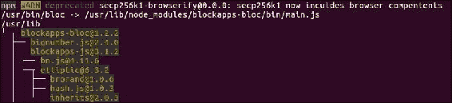

通过 npm 阻止安装(输出被截断)

安装完成后，可以按照下一节中显示的步骤创建应用程序。下面是一个例子，展示了如何在 BlockApps 中初始化一个新的应用程序，在 BlockApps TestNet 上部署它并与之交互。

### 使用 BlockApps 进行应用开发和部署

第一步是使用以下命令初始化 BlockApps 应用程序:

```
$ bloc init

```

它将要求几个参数:应用程序的名称，你的名字，电子邮件，API URL (apiUrl)和区块链配置文件。如下图所示。

一旦该命令成功运行并完成，它将创建一个包含模板和示例的应用程序目录。在这个实例中，将创建一个名为 testApp 的目录，其中包含相关的目录和样本契约。

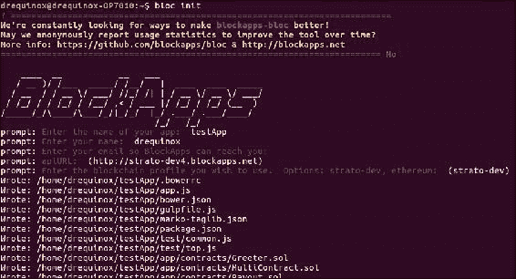

bloc init

下一步是安装`testApp`，这可以通过运行以下命令来实现:

```
$ sudo npm install

```

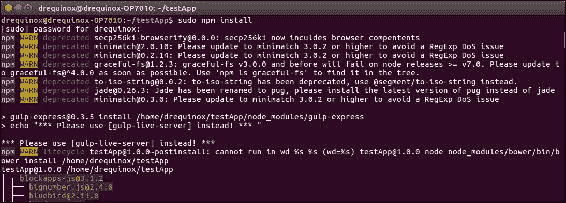

testApp 安装

为了签署交易，需要生成新的密钥。可以使用以下命令生成密钥:

```
$ bloc genkey

```

一旦发出，必须输入密码以保护密钥。一旦提供了密钥，就会创建一个 JSON 文件。注意，JSON 文件名是账户在区块链上的实际地址。此外，它将显示消息 transaction mined，分别指示密钥和事务(帐户创建)的成功和部署。

流程如以下截图所示:

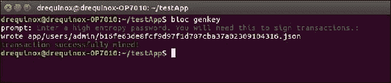

生成密钥

现在，在这一点上，可以使用 curl 查询新帐户。只需在 URL 中将地址作为参数传递，结果将以 JSON 格式返回。

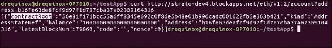

使用 curl 查询新帐户

或者，可以通过任何 web 浏览器执行查询，如下面的屏幕截图所示:

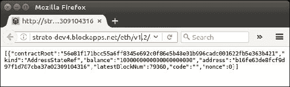

通过网络浏览器进行 BlockApps 查询

在下一步中，将描述将新合同上传到测试链的过程。注意，所有合同都放在`testApp`目录下的`./app/contracts`目录中。作为一个例子，`Greeter.sol`合同已经被选择部署到网络。BlockApps 提供了一种简单的方法来实现这种部署。

所有契约都需要放在 contracts 目录下，以便 compile 命令找到它们并进行编译。

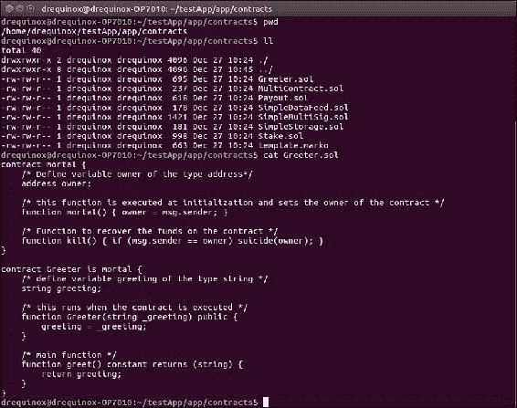

合同目录下的更大合同

可以使用下面屏幕截图中显示的命令来编译合同。请注意，它将协定文件名作为参数。编译成功后，所有相关的 JSON 文件都会被写到`./meta`目录下。

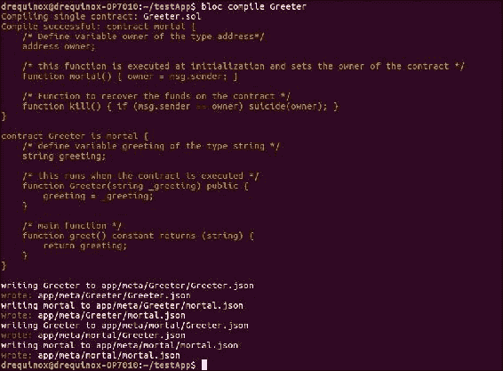

大合同的编制

最后，可以使用以下命令上传合同。该命令要求参数按照协定代码中的定义传递给协定。在本例中，它需要一个文本字符串，如以下示例屏幕截图所示:

```
$ bloc upload Greeter "Hello bloc"

```

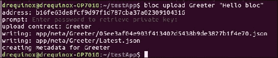

上传更大的合同

请注意，如果没有传递或缺少正确的参数，将会出现类似以下屏幕截图的错误:

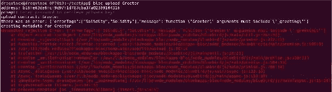

参数错误或缺失时出错

一旦部署成功，就可以验证以太网已经从现有合同转移到新合同。注意余额下降了。如下图所示:

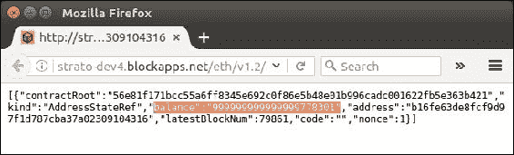

通过 web 浏览器安装后部署的合同

在部署合同之后，可以使用 web 浏览器或任何 CLI 工具(如 cURL)对其进行查询。URL[http://strato-dev4.blockapps.net/eth/v1.2/account?需要将 address = 05 ee 3 af 04 e 903 f 413402d 5438 B9 de 3827 B1 F4 e 70](http://strato-dev4.blockapps.net/eth/v1.2/account?address=05ee3af04e903f413402d5438b9de3827b1f4e70)传递给 web 浏览器。如下图所示。注意，二进制格式的代码在输出中也是可用的。

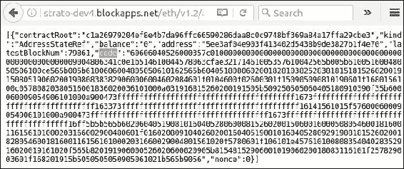

浏览到已部署的协定，代码为二进制格式

此外，BlockApps 有一个可用于运行本地 HTTP 服务器的功能，可以使用以下命令启动该功能:

```
$ bloc start

```

这将启动网络浏览器，并监听 TCP 端口`8000`。

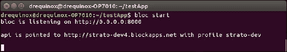

阻塞启动

web 服务器启动后，可以使用本地网页查看和查询已编译的合同，如下图所示:

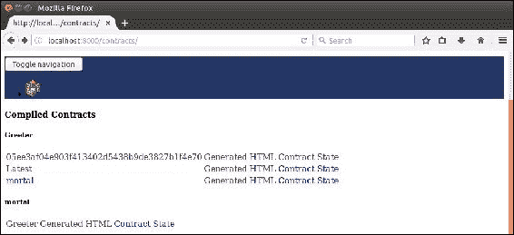

可通过浏览器获得的已编译合同

如前面的示例所示，使用 BlockApps 更容易构建、部署和管理合同。BlockApps 旨在为区块链应用程序提供工具和核心基础设施，而不仅仅是区块链。

## 厄里斯

厄里斯不是一个单一的区块链，它是一个开放的模块化平台，由 Monax 开发，用于开发基于区块链的生态系统应用程序。它提供了各种框架、SDK 和工具，可以加速区块链应用程序的开发和部署。厄里斯应用程序平台背后的核心理念是通过区块链后端支持开发和管理*生态系统应用程序*。它允许与多个区块链集成，并支持各种第三方系统与各种其他系统交互。这个平台利用了用 solidity 语言编写的智能合同。它可以与区块链互动，如以太坊或比特币。交互可以包括连接命令、启动、停止、断开以及新区块链的创建。在厄里斯，与设置和与区块链互动相关的复杂性已经被抽象掉了。对于不同的区块链，所有的命令都是标准化的，并且相同的命令可以跨平台使用，而不管所针对的区块链类型是什么。

生态系统应用可以包括厄里斯平台，使 API 网关允许遗留应用连接到密钥管理系统、共识引擎和应用引擎。厄里斯平台提供了各种工具包，用于向开发者提供各种服务。这些模块描述如下:

*   链:这允许区块链的创建和交互。
*   **包**:这允许智能合约的开发。
*   **密钥**:用于密钥管理和签名操作。
*   **文件**:这允许与分布式数据管理系统一起工作。它可用于与文件系统(如 IPFS 和数据湖)进行交互。
*   **服务**:这公开了一组允许管理和集成生态系统应用程序的服务。

厄里斯还开发了几个 SDK，允许开发和管理生态系统应用程序。这些 SDK 包含经过全面测试的智能合约，可满足特定的业务需求和要求。比如一个金融 SDK，保险 SDK，物流 SDK。还有一个基础 SDK，作为管理生态系统应用程序生命周期的基本开发工具包。

Monax 开发了自己的被许可的区块链客户端，名为厄里斯:db。这是一个基于股权的 ( **PoS** )区块链系统的**证明，它允许集成许多不同的区块链网络。`Eris:db`由三部分组成:**

*   **共识**:这是基于之前讨论过的 Tendermint 共识机制。
*   **虚拟机**:厄里斯使用**以太坊虚拟机** ( **EVM** )，因此支持 solidity 编译契约。
*   **权限层**:作为一个有权限的账本，厄里斯提供了一个访问控制机制，可以用来给网络上不同的实体分配特定的角色。
*   **接口**:它提供了各种命令行工具和 RPC 接口来支持与后端区块链网络的交互。

区块链以太坊和厄里斯:db 的关键区别在于，厄里斯:db 使用实用的拜占庭容错算法，该算法被实现为基于存款的利益证明(DPOS 系统)，而以太坊使用**工作证明** ( **PoW** )。此外，`Eris:db`使用 ECDSA ed22519 曲线方案，而以太坊使用 secp256k1 算法。最后，它在顶层有一个访问控制层，而以太坊是一个公共区块链。

厄里斯是一个功能丰富的应用平台，提供了大量的工具包和服务来开发基于区块链的应用程序。在[https://monax.io/](https://monax.io/)有售。

# 总结

本章从介绍替代区块链开始，分为两个主要部分讨论区块链和平台。区块链技术是一个非常蓬勃发展的领域，因为现有解决方案中的这种变化非常迅速，几乎每天都有新的相关技术或工具推出。本章讨论了平台和区块链的仔细选择。我们讨论了几个解决方案，它们补充了前面章节中介绍的内容，例如，支持以太坊开发的 BlockApps。还讨论了新区块链(如 Kadena)、各种新协议(如 Ripple)以及侧链和驱动链等概念。本章涵盖的材料旨在为读者感兴趣的领域的更深入研究提供坚实的基础。如前所述，区块链是一个发展非常迅速的领域，还有许多其他的区块链提案项目，如 **Tauchain** 、 **Hydrachain** 、 **Elements** 、 **credits** ，以及许多本章未讨论的项目。鼓励读者关注这一领域的发展，以便使自己跟上这一迅速发展领域的进展。