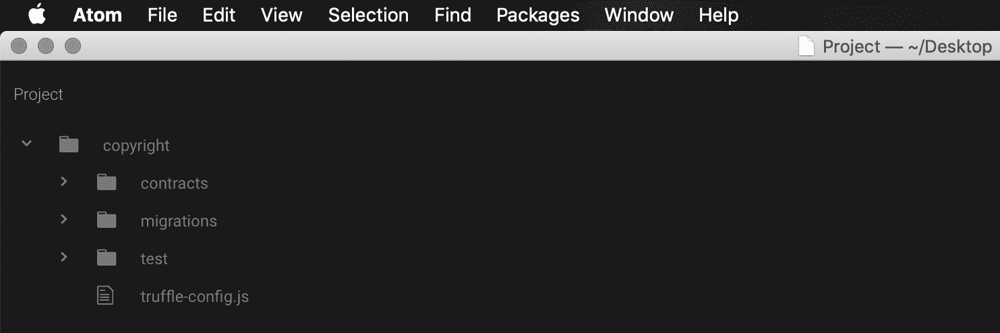
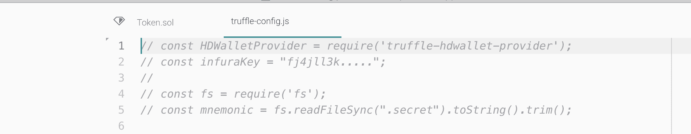
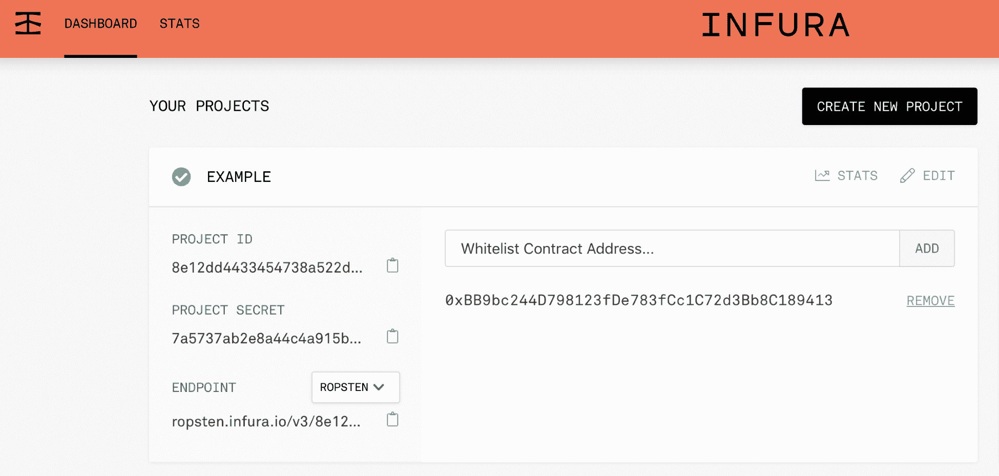
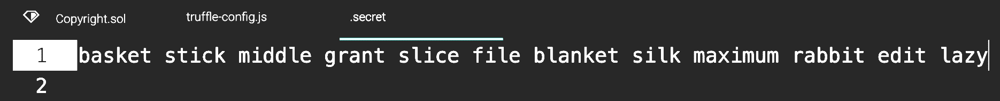
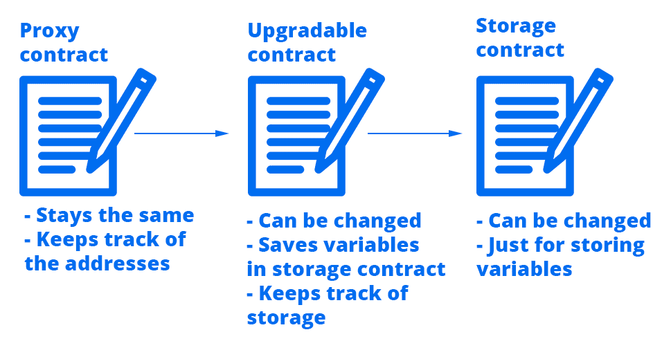
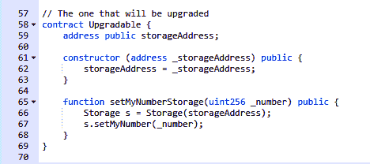
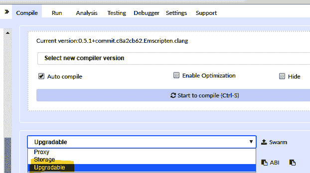

# 掌握智能合约

在这一章中，你将开始一段跨越几个有趣框架的旅程，以设计安全、可伸缩和快速的智能合约，这些合约是 gas 优化的，这样人们就不会为每笔交易支付太多费用。我们将创建一个**版权市场智能合同**,存储人们为其内容创建的许可证，这些许可证由唯一的 ID 标识，全部在区块链上。然后，您将深入探索 EVM，以便理解当您部署智能合约并与之交互时，它在后端实际上是如何工作的。接下来，我们将讨论下一代可升级和可扩展的智能合同。最后，我们将讨论气体和数据高效智能合同以及审计安全分析。在本章中，我们将讨论以下主题:

*   跟上速度
*   深入 EVM
*   可升级和可扩展的智能合同
*   气体和数据高效智能合同
*   智能合同安全性分析

# 跟上速度

如果你想成为智能合同方面的专家，你必须从一个简单的项目开始来更新你的技能。我们将创建一个版权市场智能合同，将法律文件上传到区块链，保证某些内容受版权法保护，不能被复制。事不宜迟，让我们开门见山吧！

# 规划市场理念

简单来说，版权法是这样运作的:

1.  你用一个唯一的标识符公开注册一段内容，可以是文档、文本、图像、视频或任何你自己创作的作品，这样人们可以确认你的权威。
2.  无论出于什么原因想要使用你的内容的人都必须查阅你的版权条款并遵守它们以避免法律问题，因为我们不希望人们为了自己的利益而窃取你的作品。

受版权保护的注册不应该被修改，所以我们将避免创建允许人们修改他们受版权保护的数据的功能；因此，我们将只允许他们添加或删除版权。

我们需要一个存在于区块链的智能契约，人们可以很容易地访问它。该合同将具有以下管理版权注册的功能:

*   一种功能，用于添加带有唯一标识符的新版权内容，该标识符是通过对内容进行哈希处理而创建的。在这种情况下，我们希望将受版权保护的内容仅限于文本，因为在区块链上上传其他类型的内容非常昂贵。该函数将接收内容所有者的地址、他们的姓名、他们的电子邮件地址、内容的散列 ID、包含要注册的文章或文档的 URL，以及其他人在使用该特定内容时必须遵守的使用条款。
*   基于散列获取内容的函数。
*   如果你是版权所有者，一个删除版权内容的功能。
*   提取此智能合约中锁定的资金的功能。经常有人把乙醚送错地址，最后就成了这样的智能合同。我们希望能够提取锁定的资金，这样如果发生这种情况，他们不会永远失去。它也可以用作捐赠地址，以表示对所做工作的感谢。

# 在 Solidity 中设计代码

在这个项目中，我们将使用 Truffle 来部署和运行我们的智能合约。当处理较大的项目时，在建立一个具有所有必需依赖项的框架(如 Truffle)方面投入的最初努力总是值得的，因为从长远来看，它在改善开发体验的同时为我们节省了大量时间。以下是用 Truffle 建立我们项目的步骤，因为这是我们第一次在本书中提到它。稍后，我们将假设您知道如何在 Truffle 中建立项目，尽管我们会在需要时多次提醒您:

1.  让我们马上开始创建一个名为`copyright` **:** 的新文件夹


2.  在该文件夹中，运行`truffle init` 命令。如果你没有松露，用`npm i -g truffle`或`sudo npm i -g truffle`安装。从他们的网站【nodejs.org T4】安装 Node.js 就可以得到`npm`。下面的截图显示了这个过程:


3.  然后，您可以用您喜欢的代码编辑器打开项目，在我的例子中，是 Atom:



4.  在`contracts`中创建一个名为`Copyright.sol`的新文件。创建每个 Solidity 智能合同的基本代码结构:

```
pragma solidity 0.5.0;
contract Copyright {}
```

每个智能合约的顺序都很简单。首先，我们定义事件、变量、修饰符、回退函数、构造函数，最后是函数。那么，让我们来定义我们的事件:

```
pragma solidity 0.5.0;
contract Copyright {
    // Create the events
    event RegisteredContent(uint256 counter, bytes32 indexed hashId, string indexed contentUrl, address indexed owner, uint256 timestamp, string email, string termsOfUse);
}
```

该事件记录内容的`counter`、`hashId`、`contentUrl`、所有者地址、时间戳、电子邮件和使用条款。我们现在可以定义包含这些变量的`struct`。我们的目标是以尽可能可访问的方式存储信息，因此结构是通过映射组织版权内容的最佳方式:

```
pragma solidity 0.5.0;
contract Copyright {
    // Create the events
    event RegisteredContent(uint256 counter, bytes32 indexed hashId, string indexed contentUrl, address indexed owner, uint256 timestamp, string email, string termsOfUse);

    // Create the variables that we'll use
    struct Content {
        uint256 counter;
        bytes32 hashId; // The half keccak256 hash since we can't store the entire 64 bit hash
        string contentUrl;
        address owner;
        uint256 timestamp;
        string email; // We need a valid email to contact the owner of the content
        string termsOfUse;
    }
    mapping(bytes32 => Content) public copyrightsById;
    uint256 public counter = 0;
    address payable public owner; }
```

该映射将把每个散列关联到内容对象，该内容对象存储关于版权内容的所有相关信息。下面是该结构中每个成员背后的原因:

*   我们需要一种简单的方法来跟踪有多少受版权保护的元素被添加到区块链中，因为它为我们提供了一种简单的方法来使用事件注册表查找最新的内容。
*   `hashId`:我们将与这个对象关联的文本内容的`keccak256`字符串。因为我们不能使用字符串作为映射的键，我们必须使用一个`bytes32`类型的变量。这导致了我们不能存储整个`keccack256`字符串的问题，因为它有 64 个字符长，而`bytes32`变量被限制为 32 个十六进制字符。为了克服这个限制，我们要做的是将产生的散列切成两半，只存储前半部分，也就是 32 个字节。这大大降低了散列的安全性，但是考虑到我们不会产生天文数字般高的版权元素，这已经足够好了。
*   `contentUrl`:包含要版权保护的原始文档的 web URL。
*   `owner`:内容所有者的地址，这是保证个人财产的必要条件。
*   内容受版权保护时的固定时间戳。设置失效日期来使过时的元素失效是很棒的。
*   一封有效的电子邮件，为用户提供一个简单的系统来联系特定内容的所有者。
*   `termsOfUse`:解释内容必须如何处理的一小段文字:作为外部个体，你可以用它做什么，什么时候可以使用它，等等。

如果您希望创建一个不同类型的版权注册市场，您可以将自己的元素添加到`struct`中。这是个人喜好的问题。最后，我添加了一个`owner`变量，我们稍后将使用它来提取可能最终锁定在该合同中的资金。现在，我们可以继续使用函数:

```
// To setup the owner of the contract
constructor() public {
   owner = msg.sender;
}

// To add new content to copyright the blockchain
function addContent(bytes32 _hashId, string memory _contentUrl, string memory _email, string memory _termsOfUse) public {
   // Check that the most important values are not empty
   require(_hashId != 0 && bytes(_contentUrl).length != 0 && bytes(_contentUrl).length != 0 && bytes(_email).length != 0);

   counter += 1;
   Content memory newContent = Content(counter, _hashId, _contentUrl, msg.sender, now, _email, _termsOfUse);
   copyrightsById[_hashId] = newContent;
   emit RegisteredContent(counter, _hashId, _contentUrl, msg.sender, now, _email, _termsOfUse);
}
```

`constructor`变量将用于设置所有者地址。`addContent`函数接受四个参数，而不是结构所需的七个参数，因为我们可以动态生成其他参数。这对于简化事情和帮助人们更容易上传他们的版权是很重要的。首先，它检查是否设置了最重要的参数，因为无论如何我们都需要它们。这意味着使用条款是可选的，原因很简单，人们可以选择不限制其内容的使用，这意味着开放内容及其所有权。

我们生成`newContent`对象，增加计数器，并将该内容添加到`copyrightsById`的映射中，最终发出注册事件。这是最重要的功能，必须尽快优化以避免达到气体极限。

注意，我们不需要函数来通过散列获取内容，因为`copyrightsById`映射是`public`，因此它有一个自动创建的 getter 函数来检索每个 struct 元素。

让我们继续使用删除版权和提取资金的功能:

```
// To delete something if you're the owner
function deleteCopyrightedByHash(bytes32 _hashId) public {
    if(copyrightsById[_hashId].owner == msg.sender) {
        delete copyrightsById[_hashId];
    }
}

// To extract the funds locked in this smart contract
function extractFunds() public {
    owner.transfer(address(this).balance);
}
```

`deleteCopyrightedByHash`函数获取现有版权的一半`keccak256`散列，如果你是特定内容的所有者，就删除它们。`extractFunds`函数是我喜欢添加的一个可选函数，因为我通常会看到里面有以太的智能合约，它们是因为有人没有意识到他们正在向合约地址发送真实的钱而错误获得的，所以它会永远卡在那里。该功能使提取资金成为可能，这样，如果最终发生这种情况，您可以取回资金。

这就是整个合同！可以用`truffle compile`用松露编译。

你可以在我的 GitHub 上查看更新代码:[https://github.com/merlox/copyright-marketplace](https://github.com/merlox/copyright-marketplace)。

# 使用 Truffle 部署您的智能合约

用 Truffle 部署智能合约并不是一个简单的过程:您必须通过几个不同的文件来修改 Truffle 的预期行为。你看，Truffle 需要知道在哪里部署你的契约、构造函数参数、部署顺序等等；因此，您有必要配置所有移动部分，以便能够持续部署您的合同。一旦设置好，你只需一个命令就可以重新部署新版本，因为 Truffle 会准确地知道你需要做什么，如何做，以及在哪里做。

我们将通过以下步骤部署我们的合同:

1.  首先，您必须用`truffle compile`编译您的契约，因为您只能将编译好的代码部署到区块链。从项目文件夹中打开`truffle-config.js`文件。这是设置部署配置的文件。
2.  如果您阅读注释，您会看到 Truffle 使用 INFURA 快速有效地连接到区块链，并且您需要取消注释第 1 到 5 行来更新您的信息。例如，此处显示的注释代码必须取消注释:



这样做意味着它将如下所示:


这实际上取消了对 INFURA 和助记符变量的注释。

3.  通过在 [https://infura.io](https://infura.io) 上注册获得您的 INFURA 密钥，以便在创建项目后无限制地访问安装了区块链的高质量服务器:



4.  端点是您的 INFURA 密钥所在的位置。只需单击它旁边的复制图标，您就会看到类似这样的内容:

```
https://ropsten.infura.io/v3/8e12dd4433454738a522d9ea7ffcf2cc
```

5.  将复制的字符串剥离到网站名称之后的部分，因为这是 Truffle 在配置部署网络密钥时使用的:

```
v3/8e12dd4433454738a522d9ea7ffcf2cc
```

6.  现在，将它粘贴到`truffle-config.js`中的`infuraKey`变量中，这样您就可以在`ropsten`上部署您的智能合同了:


7.  你现在需要做的是给 Truffle 你的助记短语，这样它就可以用你的地址在`ropsten`上部署智能合同。为此，在包含助记符的项目的顶层创建一个名为`.secret`的文件。这里有一个例子:


8.  在`.secret`中，写下你的助记符，不要附加任何信息:



9.  然后，返回到您的`truffle-config.js`文件，取消注释关于`ropsten`的部分:


10.  然后，使用以下命令安装`truffle-hdwallet-provider`:

```
$ npm i truffle-hd-wallet-provider
```

11.  安装它时，请确保它位于您的项目文件夹中，因为它将安装在当前位置。最后，执行以下命令:

```
$ truffle deploy --network ropsten
```

您的合同将在几分钟内部署，具体取决于网络。然后，您可以玩并测试智能合约。确保使用这个工具用`keccak256`散列受版权保护的内容:[https://emn178.github.io/online-tools/keccak_256.html](https://emn178.github.io/online-tools/keccak_256.html)。

拿到`keccak256`后，切成两半，生成十六进制代码。如果你有 MetaMask，你可以从你的浏览器中实现，因为你可以在所有的网站上使用 web3.js。以下是在浏览器中将特定文本字符串转换为十六进制版本的步骤:

1.  在浏览器上打开开发者工具。
2.  转到控制台选项卡，在这里可以执行 JavaScript 代码。
3.  键入`web3`查看 web3 是否可用。
4.  如果是这样，使用您的另一半`keccak256`结果代码并使用`web3.toHex('your-hash')`生成十六进制版本，如下例所示:

```
web3.toHex('041a34ca22b57f8355a7995e261fded7')
"0x3034316133346361323262353766383335356137393935653236316664656437"
```

然后，您可以使用该十六进制字符串将新的版权元素作为`hashId`添加到您的智能合约中。

# 深入 EVM

以太坊虚拟机(EVM) 是整个以太坊生态系统中最不为人所知的部分之一。这可能是因为这种虚拟机包含的复杂性甚至让最好的开发人员也感到困惑。在任何情况下，作为以太坊专家，你的目标是在与以太坊开发相关的所有事情上变得伟大，所以你必须理解这个强大的虚拟机的复杂性，以便你可以随时提取它的全部潜力。

# 解释 EVM

EVM 是一个虚拟机，智能合同和交易在其中执行。想想带有以太坊操作系统的 VirtualBox 或 VMware。它们是对物理计算机的模拟，目的是创建一个干净的环境，让应用程序可以与 CPU 进行通信。这种类型的虚拟机为所有用户统一处理事务、数据块和智能合约。它使数百台计算机保持连接，因此具有足够的安全性来保护每个节点免受潜在攻击非常重要。实施的一些安全系统如下:

*   **Gas** :每一笔交易在执行前都必须支付，以避免一些节点在没有任何支付意图的情况下发送无限交易的滥用行为。
*   **点对点通信**:节点之间只能通过发送和接收数据来进行消息通信，也就是说不能访问彼此的数据。
*   **确定性**:这意味着初始状态将总是产生相同的结果。例如，如果两个数字相同，那么将它们相加将得到完全相同的结果。这对于达成共识很重要，因为它允许其他人验证交易确实有效；否则，就不可能核实交易，而且由于相同的状态导致不同的计算结果，共识也会受到限制。
*   **沙盒执行**:由于这是一个虚拟机，使用它的智能合约无法访问外部计算机，从而使所有交易成为可能。只有智能合约可以在有限的范围内相互交互。

为了充分理解 EVM 是如何工作的，我们必须更深入地了解将这个系统组合在一起的汇编语言。理想情况下，我们可以理解字节码语言，这是计算机处理的东西，但因为我们不能，我们用一种叫做 **assembly** 的语言为每个进程创建了一个抽象，它可以很容易地翻译成字节码，供处理器计算。

# 智能合同在 EVM 的运作

智能合约令人着迷，因为它们能够将许多节点连接在一个单一的系统中，该系统知道它们应该如何做出决策并就结果达成一致。它们工作在基于堆栈的虚拟机之上，你可以把它想象成一个跟踪存储在内存中的变量的数组。它提供了一组小函数来操作这个堆栈。为了理解智能合约在 EVM 中是如何操作的，我们必须跟踪它们，看看它们是如何被虚拟机转换的，直到它们变成可执行的字节码。

例如，以一个简单的合同为例:

```
pragma solidity ^0.5.0;

contract Example {
    uint256 myNumber = 3;
}
```

像`solc`这样的编译器如何将代码转换成 EVM 可以理解的东西，以便计算机可以处理它？让我们试着用那个特定的编译器来分析一下。通过执行以下命令安装`solc`:

```
$ npm i -g solc
```

如果您将契约编译成字节码，并分析字节码所采取的过程，您将得到以下结果:

```
$ solcjs Example.sol --bin
```

你会看到一些关于 EVM 行为的有趣的事情。首先，您将获得一个以`.bin`结尾的文件，比如`Example_sol_Example.bin`，它是包含智能契约的编译字节码的二进制文件:

```
60806040526003600055348015601457600080fd5b5060358060226000396000f3fe6080604052600080fdfea165627a7a72305820aa17e74115b5e066ae13d560c624e9abef54adbce68c3443886eadc4e1059cfe0029
```

为了理解所有字节码并了解 EVM 真正在做什么，我们必须相应地拆分每条指令。`6080604052`只是智能合约的初始化。每份合同都一样。然后，我们有以下内容:

```
60 03
```

数字 60 是一个被称为`PUSH`的特定指令，它本质上将数字`3`移动到内存堆栈中。堆栈只是一个空数组，可以从它的数组中获取或删除值。在执行了`PUSH` 3 指令后，我们的堆栈看起来是这样的:

```
stack: [3]
```

以下指令向堆栈添加一个零:

```
60 00
```

这导致了`stack: [0, 3]`。

然后，我们有`55`，这是一个将`uint256`永久写入存储的`STORE`指令，即区块链。在将数字 3 写入存储之前，我们需要将它添加到堆栈中。我们在这里所做的基本如下:

```
uint256 myNumber = 3;
```

这相当于以下内容:

```
6003600055
```

请记住，所有智能契约都以`6080604052`开头，正如您在完整字节码中看到的那样。我们的智能契约只包含一个`uint256`赋值，所以它跟在带有`6003600055`的字节码后面。我们最后得到的是:

```
60806040526003600055348015601457600080fd5b5060358060226000396000f3fe6080604052600080fdfea165627a7a72305820aa17e74115b5e066ae13d560c624e9abef54adbce68c3443886eadc4e1059cfe0029
```

其余的是不相关的，因为它包含了关于发送者和合同的信息。大约有 100 个操作码，在 EVM 中使用了许多不同的技术来将智能合同代码翻译成字节码，以便它可以有效地发布到区块链。

现在，您已经了解了在编写智能契约、编译它并将其部署到网络中时会发生什么。剩下的由运行以太坊协议的特定实现的节点来决定，所以它们决定接受哪些块，忽略哪些块。EVM 是一个复杂的虚拟环境，它处理来自智能合约的事务和字节码，以达成惠及所有人的全球共识。

# 可升级和可扩展的智能合同

以太坊区块链是不可变的，这意味着你不能修改它过去的行为。一旦一个行动被大多数矿工确认，这个行动就会永远存在。同样的限制也适用于智能合约。然而，作为以太坊专家，我们能够克服部署不可伸缩代码最终易受攻击的问题，因为我们知道在创建可伸缩代码时有不同的开发技术。这个想法是部署智能合同，以便它们可以在未来通过一组不同的、可互换的合同进行扩展。知道如何创建可扩展且可在未来改进的智能合同是任何顶级以太坊专家都必须具备的基本技能，因此不要错过它。

# 可升级智能合同

**可升级智能合同**是为不断发展并意外需要新功能的大型行业创建高级智能合同的下一步。它们可以在各种项目中使用，但是我建议您仅将它们用于那些将来可能需要升级的项目，或者那些希望为将来的计划保护其数据的项目。不是每个智能合约都需要有可升级的功能，尽管代币等将从可升级的代码中受益匪浅。

我们将创建一个可升级的智能合约，它由三个部分和两个较小的智能合约组成。下面是它的样子:



有许多方法可以创建可升级的智能合同——您甚至可以创建自己的合同！所以，在理解这种技术的时候要有耐心，因为它在开始的时候看起来很混乱。

要使合同可升级，我们需要三个部分:

*   代理契约(proxy contract):这是初始契约——用户总是用来与代码交互的主契约。可以把这个看作是您用来进行函数调用的同一个旧的智能契约，但是它不是执行这里的逻辑，而是在可升级的智能契约中执行。
*   可升级的合同:这是所有逻辑发生的地方。此合同可以升级，这意味着它可以被删除，您可以部署具有相同名称和新功能的新版本。用户不会直接与这个契约交互，因为每次升级时地址都会改变。

*   **存储契约**:因为我们不想在每次升级契约时丢失我们的状态变量和所有用户信息，所以我们会将所有的变量、映射和数据存储在这个存储契约中。它将只有变量和 setter 函数来更新这些变量。除此之外，它不会有任何逻辑或功能。

要在保持地址不变的情况下升级合同，将会发生以下情况:

1.  用户将向代理契约发送一个交易，例如，`execute function buyTokens()`。
2.  代理契约将发送该消息，在可升级契约中找到`buyTokens()`函数，并执行它。
3.  可升级契约将处理购买令牌的逻辑，并且它将存储存储契约内的所有改变，例如，通过调用名为 **`setTokens()`** 的函数，将用户 A 的令牌数量增加到 40。
4.  存储契约执行 **`setTokens()`** ，并将用户 a 的令牌变量更新为`tokens = 40;`

这基本上是逻辑如何运作的工作流程。本质上，我们将始终使用相同的合同地址，但逻辑会发生变化。我们还会保留相同的信息，但不会删除，因为这是非常有价值的信息，很难重新插入。

为了帮助您理解所有这些契约背后的概念，我将向您展示每个智能契约的伪代码版本。我们将使用代币类比，其中用户想要在可升级的合同中购买代币。

代理合同应该是这样的:

```
contract Proxy {
    address public upgradableContractAddress;
    function () public {
        // Delegate the execution to the upgradable contract instead of using the code in this contract since this contract won't change, it's just to keep the address consistent and to have a registry of upgradable contracts
    }
}
```

这是可升级合同的样子:

```
contract Upgradable {
    address public storageContractAddress;
    function buyTokens() public {
        // This is the function that the proxy called in this example. So this contract will execute the needed logic to buy tokens and will update the state variables in the storage contract
        storageContractAddress.setTokens(userA, 40);
    }
}
```

最后，这是存储合同的样子:

```
contract Storage {
    mapping(address => uint256) public tokens;

    function setTokens(address _user, uint256 _number) public {
        // This function is used to update the storage variables since we don't want any logic to take place in this contract
        tokens[_user] = _number;
    }
}
```

这三个契约一起工作是可升级智能契约背后的核心概念，在可升级智能契约中，我们不是更新整个代码库，而是将不同的角色分成可以在未来修改的可变部分。让我们更深入地看看它们都是如何实现的，一个接一个。

# 智能存储合同

存储智能合同是三个合同中最简单的一个，因为它只包含变量和更新这些变量的函数。我们不需要 getter，因为这些是公共变量，已经有默认为公共而创建的 getter 函数。

出于演示目的，我们将创建一个包含一个`uint`变量的简单存储智能合同。然后，您可以根据需要添加更多变量。这个契约非常简单，因为它只包含一个变量:

```
pragma solidity ^0.5.0;

contract Storage {
    uint256 public myNumber;
    function setMyNumber(uint256 _myNumber) public {
        myNumber = _myNumber;
    }
}
```

如您所见，我们有一个名为`myNumber`的变量和一个名为`setMyNumber`的 setter 函数来更新这个变量。

您可能希望引入访问逻辑，只允许特定用户更新某些变量。现在，你明白它看起来是什么样子就够了。

# 可升级智能合同

可升级智能合约是最有趣的一个。它将执行所有逻辑，并在需要更新某些可变数据时与存储契约进行交互。让我们看一下代码，看看它是如何工作的。我们稍后将看到如何升级它:

```
pragma solidity ^0.5.0;

contract Upgradable {
    address public storageContract;
    constructor (address _storageContract) public {
        storageContract = _storageContract;
    }

    // A sample function that you could implement for buying tokens for demonstration purposes
    function buyTokens() public {
        // Do your logic for buying tokens for instance, calculating how many he will get for the msg.value he sent and so on. To later update the storage information
        // Create the storage contract instance
        Storage s = Storage(storageContract);
        s.setMyNumber(10);
    }
}

contract Storage {
    uint256 public myNumber;
    function setMyNumber(uint256 _myNumber) public {
        myNumber = _myNumber;
    }
}
```

该可升级合同与`Storage`智能合同在同一个文件中。这在开始时很重要，因为我们需要访问该合同以进行部署。或者，您可以使用`import`关键字。

如您所见，我已经用一个名为`storageContract`的变量声明了`Upgradable`智能契约，它跟踪存储契约的地址，因为我们将在那里更新状态变量。在构造函数中，我们设置存储契约的地址，因为这个契约将保持相同的存储，直到它被更新。然后，我添加了一个名为`buyTokens()`的函数作为示例，向您展示它在现实世界中的样子；现在，除了通过从`Storage`契约调用`setMyNumber()`来更新存储之外，它不做任何事情。

如果您要创建一个真正的实现，您需要添加所有您想要的逻辑。我不想给你看这个可升级合同的真实完整版本，因为许多功能会分散你对可升级智能合同工作原理的理解。

它显示您执行了所有的逻辑，然后在文件的结尾，您通过调用存储契约来更新您的存储变量。

要升级此合同，请按照下列步骤操作:

1.  使用更新的功能部署此合同的新版本。您可以添加新功能、更新旧功能，甚至删除一些功能。
2.  部署契约时，请在构造函数中使用存储地址，因为您需要访问该契约来保存变量。
3.  最后，在代理契约中，执行一个名为`upgradeUpgradableContract()`的函数，该函数会将所有函数调用重定向到您的可升级智能契约的较新版本。

请注意，您可以如何在部署此合同的同时保持相同的存储合同，从而安全地保存您的数据，以便在下一版本的可升级合同中可以像什么都没发生一样随时使用。或者，您可以部署新的存储合同，然后部署指向该新存储的新的可升级合同。这样，如果您不想保留旧数据，就有了干净的存储空间。尽管如此，您仍然可以访问旧数据，因为在创建新的可升级文件时，只需指向旧的存储地址，合同就会永久存在于区块链中。

# 代理智能合同

这是最重要的一块，因为这份合同永远不会改变。我们不希望它改变，因为我们希望在更新底层逻辑的同时保持相同的以太坊地址。该契约将所有调用重定向到可升级契约，并将有几个变量来注册当前可升级契约的地址，以及那些不想更新到新代码的过去契约的列表。

请记住，升级到新版本始终是可选的。如果您的用户决定继续使用旧的智能合约，他们只需将所有事务直接发送到旧的可升级合约，而无需执行代理合约。您可以通过使用`selfdestruct()`函数销毁旧的可升级智能合同来阻止他们这样做，但我不推荐这样做，因为这会使您的合同变得一文不值，并且它可能在将来有用。

代理合同是这样的:

```
pragma solidity 0.5.0;

contract Proxy {
    address public storageAddress;
    address public upgradableAddress;
    address public owner = msg.sender;

    address[] public listStorage; // To keep track of past storage contracts
    address[] public listUpgradable; // To keep track of past upgradable contracts
}
```

这是最复杂的合同，因为它必须做相当多的事情。首先，我们设置了`storageAddress`、`upgradableAddress`和`owner`。这些是契约将用来理解将所有呼叫重定向到哪里的变量。我们实际上不需要跟踪存储地址或所有者，但这是一个很好的实践，因为它使事情变得容易理解，并为您提供了更多的选择。注意`delegatecall()`函数不能更新可升级契约的存储，所以我们设置了一个外部存储。

然后，我们有两个地址数组:`listStorage`和`listUpgradable`。这些阵列将包含这些存储和可升级合同的当前和旧版本，因为我们希望能够访问旧逻辑，以防我们需要使用这些地址。我添加了一个`onlyOwner`修饰符，因为我们只希望允许所有者更新合同。

之后，我们有了构造函数。它用于立即部署新的存储和可升级的智能合同。您可以分别部署它们，但是从代理的构造函数中这样做更容易、更简洁:

```
modifier onlyOwner {
    require(msg.sender == owner);
    _;
}

constructor() public {
    storageAddress = address(new Storage());
    upgradableAddress = address(new Upgradable(storageAddress));
    listStorage.push(storageAddress);
    listUpgradable.push(upgradableAddress);
}
```

接下来是回退函数，它被标记为外部函数。这是最重要的函数，因为它将接收所有函数调用，并将它们重定向到可升级智能契约中的正确函数。它通过使用`delegatecall()`功能来工作。这是一个低级函数，它接收一个`bytes`参数来指示从另一个带有参数值的契约中调用哪个函数:

```
function () external {
    bool isSuccessful;
    bytes memory message;
    (isSuccessful, message) = upgradableAddress.delegatecall(msg.data);

    require(isSuccessful);
}
```

最后，我们拥有在所有者决定升级存储和逻辑契约时所需的功能。它们通过跟踪阵列中以前的版本来工作，以便用户可以在需要时访问旧版本:

```
function upgradeStorage(address _newStorage) public onlyOwner {
    require(storageAddress != _newStorage);
    storageAddress = _newStorage;
    listStorage.push(_newStorage);
}

function upgradeUpgradable(address _newUpgradable) public onlyOwner {
    require(upgradableAddress != _newUpgradable);
    upgradableAddress = _newUpgradable;
    listUpgradable.push(_newUpgradable);
}
```

要了解与逻辑契约通信的机制是如何工作的，请查看以下函数:

```
upgradableAddress.delegatecall(msg.data);
```

首先，它获取要调用的协定的地址，在本例中是可升级的协定地址，然后是要传输的带有信息的数据。`msg.data`参数是一个特殊的变量，它包含用参数值调用的函数。这里是你写函数名的地方。例如，假设您想要执行`buyTokens(uint256 _number)`函数，其中`_number`参数为`12`。

在普通契约中，您只需创建一个契约实例，并在发送参数值时按名称调用函数:

```
MyContract(contractAddress).buyTokens(12);
```

但是在事先不知道函数名的情况下，我们是做不到的。请记住，我们正在处理一个将来可能具有新功能的契约，并且我们还希望从同一个代理契约中访问这些功能。因此，我们使用`msg.data`。该变量包含一个带有函数名和参数的十六进制字节字符串。让我们看看如何正确地格式化它，以便 Solidity 理解我们要调用哪个函数。

首先，我们需要函数名，然后需要编码的参数。因为 Solidity 使用十六进制值，所以我们需要使用函数 signature 将其写成十六进制形式。函数签名是通过一个短的十六进制值而不是字符串名称来引用函数的一种简便方法。如果你去[https://remix.ethereum.org](https://remix.ethereum.org)，你可以很快看到你每个函数的函数签名:



如你所见，我已经复制了我的混音合同。现在，要获得`setMyNumberStorage()`函数的十六进制形式的函数签名，您必须在选择您的契约时转到 compile 选项卡:



然后，您可以点击详细信息了解更多信息:


如果你向下滚动，你会看到你的合同的函数散列部分:


`setMyNumberStorage()`的函数哈希是`009be4e6`；这是函数的签名。太好了！我们有了`msg.data`对象的第一部分:`0x009be4e6`。

现在，我们需要对函数的参数进行编码。比方说我想在调用函数的时候设置一个数字`16`。您可以通过 web3 将该数字转换为十六进制形式来手动完成。如果安装了 MetaMask，可以打开浏览器的开发者工具与`web3.js`进行交互。在控制台中，您可以简单地输入`web3.toHex(16)`，您将收到十六进制版本的 16:


注意`web3.toHex()`只适用于 web3 的 0.20 版本，这是 MetaMask 目前正在使用的版本。web3 1.0 中的语法不同，因此如果 MetaMask 更新了它的 web3 版本，您可以在 web3 1.0 官方文档中阅读如何进行十六进制转换。

现在，我们只需要在 10 前面加上 62 个零，因为`0x10`是我们获取该参数的编码版本的数字。这里有一个例子:

```
0000000000000000000000000000000000000000000000000000000000000010
```

那就是十六进制编码。我们只需要在前面添加函数签名来完成我们的`msg.data`对象:

```
0x009be4e60000000000000000000000000000000000000000000000000000000000000010
```

差不多就是这样！那一长串十六进制数说:*调用函数 setMyNumberStorage(12)* 。

回到我们离开的地方，`.delegatecall(msg.data)`函数现在可以用函数调用的转换值正确执行了。你可能会问自己:*但是为什么事情会变得如此复杂，用户将如何完成所有的转换工作？*

事实是，使用你的智能合约或 dApp 的人不会做所有的转换。您将在您的分散式应用程序中简单地编写转换逻辑，函数名将在 web3 的几行代码中自动转换，正如您已经看到的那样。或者，您可以在 Remix 上部署您的契约，只需一个按钮就可以获得完整的编码函数调用:


当您部署一个契约时，您可以看到一个框，您可以在其中与已部署的契约进行交互。如果您单击我标记的箭头，您将看到函数调用的扩展版本，向您显示工具箱图标，您可以单击该图标将`setMyNumberStorage(16)`直接转换为十六进制形式:

```
0x009be4e60000000000000000000000000000000000000000000000000000000000000010
```

这是一个简单的技巧，使转换时，使用你的合同与混音。有了这个十六进制数，您可以转到 MetaMask 并将其粘贴到数据字段中。首先，打开 MetaMask 并点击发送:


然后，通过向下滚动将您的代码粘贴到数据字段中:


确认交易后，您将看到您的职能已被成功委托，并且您已经执行了代理合同。

让我们回到我们的后备功能:

```
    function () external {
        bool isSuccessful;
        bytes memory message;
        (isSuccessful, message) = upgradableAddress.delegatecall(msg.data);

        require(isSuccessful);
    }
```

您可以看到,`delegatecall`函数返回两个值:一个代表委托是否成功的布尔值和一个字节参数:

```
(isSucessful, message)
```

我们只需捕获它们，并要求委派成功。否则，它将恢复事务，并且不做任何更改。这很重要，因为`delegatecall`函数并不关心委托是否成功；它会简单地通知你让你做决定，因为它是一个低级功能，可以在许多高级情况下使用。

`delegatecall()`的另一个有趣的性质是，接收契约的`msg.sender`将是你的以太坊地址，而不是代理契约的地址。这一点很重要，因为否则，你的地址在可升级合同中就会不同。在许多情况下，用户地址对于某些逻辑很重要，您不希望出现这种情况。

最后，我们有这两个函数:

```
    function upgradeStorage(address _newStorage) public onlyOwner {
        require(storageAddress != _newStorage);
        storageAddress = _newStorage;
        listStorage.push(_newStorage);
    }

    function upgradeUpgradable(address _newUpgradable) public onlyOwner {
        require(upgradableAddress != _newUpgradable);
        upgradableAddress = _newUpgradable;
        listUpgradable.push(_newUpgradable);
    }
```

它们只是用来更新智能合同。每当您部署新版本的`Upgradable`或`Storage`时，您必须执行相应的函数，让代理契约知道哪一个是活动的，以便它可以将所有的函数调用委托给契约的正确版本。

# 可扩展智能合同

通常，智能合约受到区块链处理能力的严格限制，因为成千上万的节点必须相互连接才能执行相同的交易。当我们处理超出区块链能力的流行应用程序时，这是一个主要问题。为了克服这个问题，您可以在智能合约中实现不同的扩展解决方案，以便更多的用户能够运行您的分散式应用程序，而不会出现性能问题。

要了解您将要学习的扩展解决方案，了解使用智能合约时发生的过程非常重要:

*   首先，用户为一个特定的智能合约生成一个事务，要么通过运行一个与该合约交互的分散式应用程序，要么通过使用他们自己的以太坊节点直接执行智能合约
*   挖掘器接收事务，以便将它包含到下一个块中，并执行字节码
*   当他们确认后，该交易将被永久添加到最长的链中

我们无法加快矿工确认交易的过程，因为以太坊使用的共识方案要求每个节点验证每个交易，直到它们全部生效。

我们能做的是使用一种被称为**状态通道**的协议。它由承诺方案组成，只要一组人同意这些交易，就可以产生有效的离线交易。例如，想想像 21 点这样的纸牌游戏。如果你不熟悉它，它包括每个玩家每回合收到一张牌，并下注筹码以获得最大数量的组合牌。总和为 21 或第二大数字的玩家获胜。超过 21 就输了。

从本质上来说，国家频道就像 21 点游戏，用户可以玩无数种游戏，同时保留一个筹码分数，当你完成时可以兑换真钱。这是一个很棒的扩展系统，因为你可以直接点对点地运行许多离线交易，而不需要等待区块链来处理每一个交易。您只需将结果捆绑在一起，并在游戏结束时将一个大交易推送到区块链。

所以，你要实时处理数百个交易，直到游戏结束，这时你必须发送 1 个交易。不是 100 次交易每次等待 20 秒，而是一次只等待 20 秒，同时节省汽油。因此，你最终会得到一个更快更可扩展的系统，更多的玩家可以使用你的性能更好的 dApp。

# 为可伸缩智能合约使用状态通道

我将指导您完成一个简单的示例项目，以便您可以看到状态通道的运行。他们使用承诺方案，这只是加密的交易，当玩家决定摊牌时，在透露结果之前，你不能改变承诺你的行动。

智能合同将是国家渠道的入口和出口点。中间发生的事情不在区块链的控制范围内，尽管我们将定义每个加密消息内部的内容，以便我们可以在结束时验证它。这些是步骤:

1.  参与游戏的每个玩家必须通过调用智能合约中的函数来定义他们是谁，从而打开状态通道。当他们这样做时，他们必须向智能合同发送一些以太网作为托管。这些资金将用于在游戏结束时分配奖励。
2.  用您想要提交的变量生成散列。这些散列将包含每个玩家的加密参与。因此，他们通过首先承诺他们的赌注，然后透露他们的结果并更新变量和余额来直接交换信息。
3.  当他们决定结束游戏时，他们返回到智能合约来上传他们最新签名的散列，以便智能合约可以读取它来发送相应的以太给每个人。

让我们创建具有进入和退出功能的智能合约。其余的将在链外完成。像往常一样，这是合同的结构:

```
pragma solidity 0.5.0;

contract StateChannel {
    constructor () public payable {}

    function exitStateChannel() public {}
}
```

构造函数将是入口，因为我们希望为每个游戏部署一个新的契约实例。`exitStateChannel()`函数将检查最新的签名散列，并将相应的以太发送给每个播放器。请注意，鉴于我们希望在开始时收到托管资金，施工方是如何付款的。

让我们添加一些我们需要的变量。在这种情况下，我们将创建一个简单的猜谜游戏，每个玩家必须设置一个从 1 到 10 的数字，另一个玩家必须猜出该数字才能获胜。所以，当参与人 2 的猜测和他们的不同时，参与人 1 就赢了。他们还在每场猜谜游戏中打赌；只要双方都有足够的资金下注，赢家就会双倍下注:

```
pragma solidity 0.5.0;

contract StateChannel {
    address payable public playerOne;
    address payable public playerTwo;
    uint256 public escrowOne;
    uint256 public escrowTwo;

    constructor () public payable {}

    function exitStateChannel() public {}
}
```

接下来，我们需要为每个玩家设置这些变量:

```
pragma solidity 0.5.0;

contract StateChannel {
    address payable public playerOne;
    address payable public playerTwo;
    uint256 public escrowOne;
    uint256 public escrowTwo;

    constructor () public payable {
        require(msg.value > 0);

        playerOne = msg.sender;
        escrowOne = msg.value;
    }

    function setupPlayerTwo() public payable {
        require(msg.sender != playerOne);
        require(msg.value > 0);

        playerTwo = msg.sender;
        escrowTwo = msg.value;
    }

    function exitStateChannel() public {}
}
```

如你所见，构造函数将为第一个玩家初始化地址和托管，而`setupPlayerTwo()`函数将为第二个玩家做同样的事情。这就是我们打开两个玩家之间的状态通道所需要的。在创建将在关闭通道和分发资金时结束游戏的`exitStateChannel()`函数之前，我想弄清楚什么样的元素组成每个散列消息，以及游戏将如何在链外进行。

在这个猜谜游戏中，我们有两个玩家，他们有两个不同的 escrows，他们在每场游戏中对他们选择的特定号码下注。如果两者的数字相同，第二个玩家获胜；否则，第一个玩家获胜。只要他们都有足够的资金，他们可以获得双倍的投资。

因此，玩家 1 将创建包含以下值的加密对象来开始游戏:

*   **选择的数字**:必须在 1 到 10 之间。
*   **游戏的赌注金额**:对方必须有足够的资金支付你投资的两倍。例如，玩家 1 有 10 个以太，而玩家 2 有 4 个以太。玩家 1 不能下注超过 4 以太，如果他赢了，第二个玩家必须把他所有的以太都给他。我们将保留这个选项，这样他们就可以随心所欲地投资，如果赌注超过了玩家的余额，他就可以得到所有的资金，即使比赌注少。
*   **游戏顺序**:每局递增的计数器，用来标识每局游戏的顺序。
*   **时间戳**:每个玩家了解下注时间的唯一时间戳。
*   一个随机数(nonce):一个随机的 10 位数，用来保持每条消息的唯一性。这不是强制性的，但是在试图理解游戏事件的顺序时会有所帮助。

这里有一个例子:第一个玩家通过与另一个玩家创建智能合约，在打开状态通道后开始游戏，另一个玩家在智能合约内设置他们的托管。然后，他创建以下将被加密的数据:

*   **选择的数量** : 9
*   **下注的乙醚量**:他有 10 个乙醚代管，所以他将为这场游戏下注 4 个乙醚
*   **游戏顺序** : 1
*   **时间戳** : 1549378379
*   **随机数** : 2948372910

然后，他使用 dApp 通过`keccak256`算法对信息进行加密:

```
keccak256(9, 4, 1, 1549378379, 2948372910);

```

他得到的结果是:

```
515e473c03c2d08f92825bad975ff0123f15b3ee2f457942a3484abe749f65b4
```

请注意，这只是一个真实的`keccak256`会有所不同的例子。然后，他用国家频道智能合同中使用的以太坊帐户签署该散列。他可以用 web3.js 做到这一点，因为它是结合 MetaMask 对散列进行链外签名的最快方法:

```
web3.personal.sign(hash, web3.eth.defaultAccount, (err, result) => {
    if(err) return err
    return result
})
```

在那之后，加密的散列将被签名，以在以后确认他确实用他的帐户选择了那些参数。另一个玩家将采取相同的步骤用他的赌注生成加密的签名散列。

当这两个哈希生成后，他们将使用运行某种通信系统(如服务器或电子邮件)的分散式应用程序来交换这些哈希并显示他们的赌注。他们将能够在任何时候验证这些散列，因为一旦您知道加密的信息的有效内容，您就可以快速验证该信息是有效的。

每条新消息都将有一个增加的序列号、一个随机随机数和一个必须大于前一个时间戳的新时间戳。所有这些检查都可以在实现状态通道契约的 dApp 中完成。

当他们决定结束游戏时，他们会将他们的最新消息上传到智能合约，以便 it 部门从他们在打开通道时配置的托管中分配更新的余额。下面介绍游戏将如何在智能合约中用`exitStateChannel()`功能关闭。

首先，我们设置游戏所需的变量来跟踪平衡:

```
pragma solidity 0.5.0;

contract StateChannel {
    address payable public playerOne;
    address payable public playerTwo;
    uint256 public escrowOne;
    uint256 public escrowTwo;

    // Variables to end the game
    uint256 public betOne;
    uint256 public betTwo;
    uint256 public balanceOne;
    uint256 public balanceTwo;
    uint256 public callOne;
    uint256 public callTwo;
    bool public isPlayer1BalanceSetUp;
    bool public isPlayer2BalanceSetUp;
    uint256 public finalBalanceOne;
    uint256 public finalBalanceTwo;
}
```

然后，我们创建设置函数，在本例中是构造函数和`setupPlayerTwo()`，它们的工作是存储用户的初始数据:

```

constructor () public payable {
    require(msg.value > 0);

    playerOne = msg.sender;
    escrowOne = msg.value;
}

function setupPlayerTwo() public payable {
    require(msg.sender != playerOne);
    require(msg.value > 0);

    playerTwo = msg.sender;
    escrowTwo = msg.value;
}
```

最后，我们添加最重要的函数:通过基于最后一个状态选择获胜玩家来结束游戏并退出状态通道的函数:

```
function exitStateChannel(
 bytes memory playerMessage, 
 uint256 playerCall, 
 uint256 playerBet, 
 uint256 playerBalance, 
 uint256 playerNonce, 
 uint256 playerSequence, 
 address addressOfMessage) 
 public 
{
    require(playerTwo != address(0), '#1 The address of the player is invalid');
    require(playerMessage.length == 65, '#2 The length of the message is invalid');
    require(addressOfMessage == playerOne || addressOfMessage == playerTwo, '#3 You must use a valid address of one of the players');
    uint256 escrowToUse = escrowOne;

    if(addressOfMessage == playerTwo) escrowToUse = escrowTwo;

    // Recreate the signed message for the first player to verify that the parameters are correct
    bytes32 message = keccak256(abi.encodePacked("\x19Ethereum Signed Message:\n32", keccak256(abi.encodePacked(playerNonce, playerCall, playerBet, playerBalance, playerSequence))));
    bytes32 r;
    bytes32 s;
    uint8 v;

    assembly {
        r := mload(add(playerMessage, 32))
        s := mload(add(playerMessage, 64))
        v := byte(0, mload(add(playerMessage, 96)))
    }

    address originalSigner = ecrecover(message, v, r, s);
    require(originalSigner == addressOfMessage, '#4 The signer must be the original address');

    if(addressOfMessage == playerOne) {
        balanceOne = playerBalance;
        isPlayer1BalanceSetUp = true;
        betOne = playerBet;
        callOne = playerCall;
    } else {
        balanceTwo = playerBalance;
        isPlayer2BalanceSetUp = true;
        betTwo = playerBet;
        callTwo = playerCall;
    }

    if(isPlayer1BalanceSetUp && isPlayer2BalanceSetUp) {
        if(callOne == callTwo) {
            finalBalanceTwo = balanceTwo + betTwo;
            finalBalanceOne = balanceOne - betTwo;
        } else {
            finalBalanceOne = balanceOne + betOne;
            finalBalanceTwo = balanceTwo - betOne;
        }

        playerOne.transfer(finalBalanceOne);
        playerTwo.transfer(finalBalanceTwo);
    }
}
```

当一个函数有那么多参数时，最好将每个参数分开在新的一行中。首先，我们检查地址是否已经设置，因为我们想要单独设置每条消息。然后，我们重新生成加密的、签名的散列消息，以验证传递的参数是有效的。为了验证`keccak256`是否有效，我们只需使用假定使用的参数再次生成它，并检查结果散列是否与给定的散列完全相同。

之后，我们使用 assembly 来获得 r、v 和 s，这三个变量用于与您的以太坊帐户签署消息。我们使用它来获取签名者的地址，以验证它来自正确的人。然后，我们在状态变量中设置该玩家的余额、赌注和跟注。我们这样做是为了以后当第二个玩家用他的参数执行退出函数时分配资金。最后，在两者都建立了它们的结果消息之后，我们用`transfer()`函数执行以太传输。

这看起来很复杂，但我们所做的只是检查签名的消息是否有效，然后检查消息的签名是否有效，最后在另一个玩家用这个函数验证他的退出消息时更新变量来分配资金。

这个智能合约只是一个演示。它有一些重要的问题，例如一个玩家可以决定不发布他的消息来退出频道以避免丢失以太。为此，如果第二个玩家在 24 小时后没有响应，我们需要添加某种冲突解决机制来分配资金。我将把那留给你练习你的技能。

这些是下一代智能合同，将使用一些集中逻辑为同时运行于数十万台计算机的复杂分散应用程序提供动力。最终，它是关于确保我们利用区块链的不可信本质来创建应用程序，该应用程序可以在没有外部实体干预的情况下使用户受益。继续阅读，了解更多关于高效智能合同的信息，这些合同使用最少的资源获得最大的收益。

# 天然气和数据高效智能合同

必须制定智能合同，不仅以透明和安全的方式处理交易，而且尽可能高效地使用区块链资源。出于这个原因，我们将探索如何为以太坊编写气体和数据高效的代码。在这一部分，我们将讨论以下主题:

*   制定节能智能合同
*   制定数据高效的智能合同

# 制定节能智能合同

我敢肯定，你已经见过几个智能合约，它们包含了很多功能，感觉它们运行起来太耗气了:比如那些管理大量状态变量的功能，或者那些同时运行几个不同合约的功能。

尽管区块链要求每一笔交易都要支付汽油费，但创建消耗尽可能少的资源的智能合同最符合我们的利益，这样我们的用户就可以大幅降低交易成本。

那么，我们该怎么做呢？

原来，在 EVM 中，每个小操作都有一个关联的操作码。每当你使用一个操作码时，你都是在付汽油费，因为矿工必须处理你的事务。下面列出了最常见的操作码及其气体成本:

*   `ADD`和`SUB`:两个数相加或相减。每次加或减一个数要花 3 块钱。
*   `MUL`和`DIV`:数字相乘或相除。每次手术要花 5 块钱。
*   `AND`、`OR`、`XOR`:比较布尔的逻辑运算。每次手术要花 3 块钱。
*   `LT`、`GT`、`SLT`、`SGT`、`EQ`:比较数字的逻辑运算。每次手术要花 3 块钱。
*   `POP`:这是一个 EVM 堆栈操作，从堆栈机器中移除元素。每次`POP`操作需要消耗 2 点汽油。
*   `PUSH`、`DUP`或`SWAP`:向堆垛机添加元件。这使用 3 种气体。
*   `MLOAD`和`MSTORE`:向 EVM 存储器添加数据。每次操作使用 3 种气体。
*   `JUMP`:跳转到汇编代码中的另一个位置。这需要 8 加仑汽油。
*   `JUMPI`:条件跳转。每次操作需要 10 次加油。
*   `SLOAD`:将一个元素添加到堆栈中的另一个堆栈操作。每次操作需要 200 单位的汽油。
*   `SSTORE`:将信息直接存储到区块链中。每次操作需要 5000 到 20000 的汽油。
*   获取以太币账户或合约的余额。每次操作使用 400 个气体。
*   `CREATE`:部署新的智能合约或账户。我们需要 32，000 汽油来创建一个新的智能合同。

正如你所看到的，在状态变量中存储信息使用了`SSTORE`，这花费了高达 20k 的汽油。这是非常昂贵的，这是一个优化你的代码的地方。

以下是我们将探讨的主要优化技术，然后通过一个真实的例子来检查实际的天然气成本:

*   **比较运算符**的顺序:`&&`和`||`比较运算符的顺序，总是检查第一个条件，第二个条件可以不检查。例如，如果一个 if 语句的第二部分比另一部分更有可能为真，最好把第二部分放在前面，因为在一个`OR`语句中，它将节省汽油，因为它不会花费不必要的计算来检查其他参数。同样的事情也适用于`AND`:你想把第一部分作为最有可能是假的部分，因为如果第一部分是假的，编译器不会检查第二部分，你可以节省汽油，因为每个操作符都有汽油成本。
*   **使用状态变量的** `for` **和** `while` **循环**:当你有一个使用外部变量的循环时，你希望它使用内存变量，因为它们比使用存储要便宜得多。
*   **不可访问** `if...else` **语句**:有条件`if...else`永远不会执行另一部分的情况。在这些情况下，重要的是删除重复的、多余的和不可达的代码，这些代码会在每次执行时消耗大量的资源。
*   **限制变量的大小**:每个变量类型后的数字定义了它的容量，所以容量较小的变量消耗较少的气体，原因很简单，它不需要那么多的区块链存储:例如，对于较小的变量用`uint8`代替`uint256`。
*   尽可能不要使用库:每次你调用一个库或者一个外部契约的时候，你都在浪费时间，因为你必须创建一个外部契约的实例，这反过来也在浪费时间。这就是为什么在部署时最好将所有代码组合在一个大的智能契约中，而不是创建更小的片段，这对开发很好，但对生产就不太好了。
*   **不要存储到存储器，使用内存**:函数类型后的`memory`关键字告诉编译器将该信息临时存储在本地内存中，而不是写入区块链。
*   限制余额调用:每当你请求某个账户的余额时，你就要花 400 块钱，这在大额合同中可能是一个相当大的数目。此外，如果要多次请求余额，请记住将余额存储在内存变量中，因为一旦存储了余额，就不必再次使用操作码 CREATE。

*   **用** `bytes32` **代替** `string` : String 是一个大得多的变量类型，因为它可以容纳大约 1000 个单词，使用所有的 gas 进行事务处理。本质上，它没有限制；相反，它受到你释放的气体的限制。气体越多，你能储存的绳子就越大。然而，使用 bytes32 总是最好的，因为它更紧凑，允许您存储多达 32 个字符，这对于较短的文本(如姓名)来说是理想的。

让我们看一些可以使用这些技术进行优化的示例:

```
pragma solidity 0.5.0;
contract BadExample {
    uint256 public myNumber = 0;

    function counter(uint256 _counter) public {
        for(uint256 i; i < _counter; i++) {
            myNumber += 1;
        }
    }
}
```

正如你在前面的契约中看到的，我们在`counter()`函数中运行了一个`for`循环，它只是将`myNumber`状态变量增加了`_counter`倍。你看到哪里可能有问题了吗？主要问题是，每次循环运行时，我们都要写入状态变量，这意味着我们每次迭代都要使用`SSTORE`操作码花费 5k 到 20k 的时间，因为`myNumber`变量是状态变量。

使用`_counter = 5`运行该功能时，交易成本为 48，180 汽油，使用`_counter = 10`时，交易成本为 74，625 汽油。正如你所看到的，成本迅速增加了大约 26k gas，这正是我们对`SSTORE`操作码的预期，因为我们又运行了五次。

要修复这个契约，我们只需创建一个新的局部变量，它使用内存而不是存储空间:

```
pragma solidity 0.5.0;
contract GoodExample {
    uint256 public myNumber = 0;

    function counter(uint256 _counter) public {
        uint256 internalCounter = 0;    
        for(uint256 i; i < _counter; i++) {
            internalCounter += 1;
        }
        myNumber += internalCounter;
    }
}
```

在这种情况下，交易成本从 27，331 美元上升到 27，681 美元，这仅仅是 350 美元。正如你所看到的，这是一个巨大的改进，将在成千上万的交易中为人们节省至少两倍的钱。创建天然气优化合同是有意义的。这个例子可以通过将`uint256`改为`uint8`或等效物来进一步改进，以便存储更小的变量。

让我们看另一个例子:

```
pragma solidity 0.5.0;
contract Example {
    function doSomething() public {
        if (conditionOne && conditionTwo) {
            // Do something
        }
        if (conditionTwo || conditionOne) {
            // Do something
        }
        if (alwaysTrue) {
            // Do something
        } else {
            // Do another thing
        }
    }
}
```

该函数运行一组具有不同条件的条件语句。在第一种情况下，其中`if (conditionOne && conditionTwo)`，我们可以通过将最有可能为假的条件放在第一位来改进代码，因为这样可以通过不对第二个条件进行不必要的检查来节省时间。如果第一个条件为假，则`&&`运算符不会考虑第二个条件，因为它要求两个条件都为真，这是有意义的，因此可以节省时间。考虑下面的情况，其中我们定义了每个条件的可能性:

*   `conditionOne`在 80%的情况下为真，这意味着在 100 次函数调用后，它将为真 80 次
*   `conditionTwo`将有 20%的机会为真，这意味着在 100 次函数调用之后，它将为真 20 次

如果我们让这个函数保持原样，并且我们运行这个函数 100 次，那么每当第一个条件为真，而在另一个条件为假时，我们将浪费 3 个气体。记住运行**和** ( **& &** )，**或**(**|**)，以及**异或**(**)。因此，在 100 次运行后，我们将浪费 80 次`&&`检查，因为在这些情况下第二个条件为假，这意味着我们将浪费 300 次汽油。看起来并不多，但是它增加了许多不同的功能和事务，所以必须注意条件语句的顺序。**

 **正确的版本如下:

```
pragma solidity 0.5.0;
contract Example {
    function doSomething() public {
        // Notice the condition 2 going first because it will be false most of the times, thus rending the second condition unnecessary to check
        if (conditionTwo && conditionOne) {
            // Do something
        }
    }
}
```

同样的事情也发生在 OR ||语句中，我们希望将最有可能为真的条件放在最前面，因为我们只需要一个条件为真。每当第一个条件为真时，编译器将停止检查该`if`语句中的其余条件以节省时间，因为不需要。考虑到与上例相同的概率，其中`conditionOne`在 80%的情况下为真，而`conditionTwo`在 20%的情况下为真，我们可以将代码固定为 gas 优化:

```
pragma solidity 0.5.0;
contract Example {
    function doSomething() public {
        // Notice the condition 1 going first because it will be true most of the times, thus rending the second condition unnecessary to check
        if (conditionOne || conditionTwo) {
            // Do something
        }
    }
}
```

函数中的最后一个条件语句是这样的:

```
if (alwaysTrue) {
    // Do something
} else {
    // Do another thing
}
```

因为 if 语句中的条件总是为真，所以添加`else`块没有意义，因为它永远不会运行。在这种情况下，在处理函数时，删除`else`块以节省时间是有意义的:

```
pragma solidity 0.5.0;
contract Example {
    function doSomething() public {
        // Notice how we removed the } else { block because it will never be execute
        if (alwaysTrue) {
            // Do something
        }
    }
}
```

这种检查对于覆盖率测试也很重要，因为它使用工具来验证代码的所有部分至少被接触了一次，以删除不必要的元素。

作为本节的最后一个技巧，我希望您知道一个超级有效地存储信息的小技巧:使用索引事件作为存储。活动在区块链有一个专门的部分，花费更少的汽油来执行，因此使他们超级节省汽油。这可以用来以最小的成本存储您想要在 dApps 中使用的小字符串和变量。稍后，您可以使用 web3.js 找到每个事件，因为它们是有索引的，这意味着它们可以针对特定的参数进行搜索。另外，请注意，每个事件中只能有三个索引参数，因此可以创建几个不同的索引事件。

记得回到我们之前列出的 8 点清单，每次你写合同时都要保证一个高效的智能合同流程，为人们省钱并减少区块链的规模，毕竟这是我们都想要的。

作为最后一个提示，你可以创建`view`和`pure`函数来实现昂贵的功能，因为`pure`和`view`函数不消耗任何气体，因为它们在本地处理计算，所以你可以免费使用计算。例如，如果你想在 Solidity 中排序一个数组，你将不得不花费大量的 gas，因为每次迭代都要花费 gas，但是，如果排序函数是`view`，它将不会花费你任何 gas，所以你可以在不花费 gas 的情况下排序尽可能多的数组。

# 制定数据高效的智能合同

我所说的数据高效智能契约只是易于阅读、理解和管理的代码。当我们谈论数据效率时，状态变量是主要的组成部分:我们希望优化代码的可维护性。这不仅对于在开发人员之间解释代码很重要，对于想要研究智能合约代码实际上在做什么的客户也很重要。正确建立的数据结构将会节省人们数小时的头痛时间，并且会成倍地提高代码的质量。

Vyper 在这方面做得非常出色，因为您可以使用专门设计来提高可读性的定制单元类型。它还使用了从 Python 继承的最小语法系统，这有助于提高代码的可读性。数据高效智能合约是什么样的？看一下这个例子:

```
pragma solidity 0.5.0;
contract GoodExample {
    // The number of seconds that you have each game to make decisions up to 100
    uint8 public secondsPerGame;

    // To check if owner's address is setup when executing restricted functions
    bool public isOwnerAddressSetup;

    // The name of the first player
    bytes32 public firstPlayersName;
}
```

正如您所看到的，每个变量上面都有一个简短的注释，以帮助您理解它应该做什么，因为经常会发现令人困惑的变量，这些变量可能会因为错误的原因而被误解。每个名称都用简洁的命名法进行了正确的定义，尽可能清楚地说明变量的用途，就像它们提供了何时不使用它们的清晰理解一样。

变量类型适合每个变量的用途，因为我们希望通过最大限度地发挥虚拟机的功能来提高它们的气体效率，同时避免不必要的气体消耗。

相比之下，一份糟糕的合同应该是这样的:

```
contract BadExample {
    uint256 numberOfTimes;
    string public name;
    address public senderAddress;
}
```

这里的命名过于简单，留下了太多混淆的空间。每个变量上面没有注释来帮助你理解什么时候应该使用它们，什么目的，有什么限制。变量类型也可以改进:不使用`string`作为名称，使用`bytes32`可能更有意义，因为我们不需要这么大的类型来表示一小段文本。`uint256`也是如此，我们必须考虑缩小它的规模是否更好。

总的来说，我们希望在合同中提供尽可能多的澄清。为了做到这一点，我们将在每个变量的顶部写下精彩的描述，即使我们认为它足够清楚；我们将有效地使用类型来优化天然气成本；我们将简明地命名这些变量，以帮助新开发人员理解契约代码的复杂性。

许多大型智能合同变得太大而不容易理解，因此您必须优化数据效率，因为这是检测危险入口点的一种很好的预防性安全措施。

您刚刚学习了如何使用简单的技术优化您的智能合约，这些技术可以通过正确理解操作码及其相关成本来节省人们的时间，以便您可以在创建将由成千上万其他人执行的功能时做出更好的决策。

# 智能合同安全性分析

分散式应用程序中的安全性是一个必须小心处理的问题，因为我们面对的是来自真实的人的真实的钱，他们相信代码是足够安全的，可以保证他们的资金安全。你不能在你的代码中跳过安全分析，因为否则你将拿人们的钱冒险，所以这是一个巨大的责任。

这是获得智能合同的时间和价格如此昂贵的主要原因之一。审计、bug 奖金和代码分析对于 ICO 智能合约和那些处理真实世界基金的合约来说是常见的。它们自然是昂贵的，因为它们需要仔细考虑智能合同中的所有活动部分。

# 保护智能合同的技术

让我们来看看在将智能合约部署到 Mainnet 之前，您希望进行的一些常见检查:

*   **上溢和下溢**:溢出一个数意味着超过了它的容量，从而重置它的值重新从零开始计数。相反，下溢是从负的方面超过数字容量，所以当您在`uint`类型的变量中超过 0 时，值直接跳到该变量的最大值。例如，假设你想在一个 uint8 中存储 5000 个:你能安全地做到吗？不会，因为 uint8 的最大数量是 2 ** 8，也就是 255(不是 256，因为我们从零开始)，所以在存储未知值之前，您会多次超出该类型的容量。如你所知，`uints`不能是负数，所以当你试图在它们里面存储负数时，你会使它们下溢。请注意这些情况，并在适当的位置进行检查，以避免超出数字类型的容量。
*   **文档**:不对代码进行文档化本身并没有安全风险，因为文档化更多地是为了避免混淆可能被误解的函数，从而节省时间。当您正确地记录您的代码时，您可以很快地理解它可能失败的地方，使它更容易维护，并且在审计代码时更安全。出于这个原因，我总是推荐 NatSpec 文档，这是一种使用一些公共参数来描述函数的方法，编译器和开发人员可以很容易理解。
*   **重入攻击**:您可能对这种攻击很熟悉，它利用`delegatecall`函数调用外部契约以恶意方式更新它们。这是非常危险的，每当看到`delegatecall`这样的低级函数，一定要仔细分析。您可以通过可见性或修饰符来限制对最重要函数的访问，从而避免这种情况。
*   **竞争条件**:这种类型的攻击包括利用 gas 限制反复运行特定的代码序列，直到耗尽 gas。这可以通过确保在增加状态变量之前减少它们来防止。例如，对于一个代币合同，只要你用乙醚购买代币，它就会增加你的余额，重要的是在增加你拥有的代币余额之前减少你拥有的乙醚的数量，以避免再次进入的情况。

每份合同都有更多的小安全问题。要解决这些问题，你必须慢慢分析你的智能合同，找出可能导致潜在风险的地方。

# 摘要

在这一章中，您已经开始使用受版权保护的内容的 project marketplace 来更新您的智能合同开发技能，以保护用户的内容。然后，您探索了 EVM 这个晦涩世界的深处，对其内部工作方式以及智能合约如何受益于这一奇妙技术有了深入的了解。之后，您学习了以太坊中最强大的技能之一:开发可升级和可伸缩的智能合约，可用于高级项目，以便您可以高效地为大企业运行大规模应用程序。

接下来，您学习了数据和天然气如何在智能合同中流动，以便您能够在区块链限制内更好地管理宝贵资源的消耗，最终通过更高质量的合同节省人们的金钱和时间。最后，你用安全分析来保护你的代码免受恶意攻击，这样人们的资金在你的 dApps 中是完全安全的。

在下一章中，你将通过挑战你目前对如何从头开始创建伟大的 dApps 的理解来探索先进的分散应用程序的奇迹。您将逐步看到为大规模项目构建更强大的 dApps 的最有效方式。**