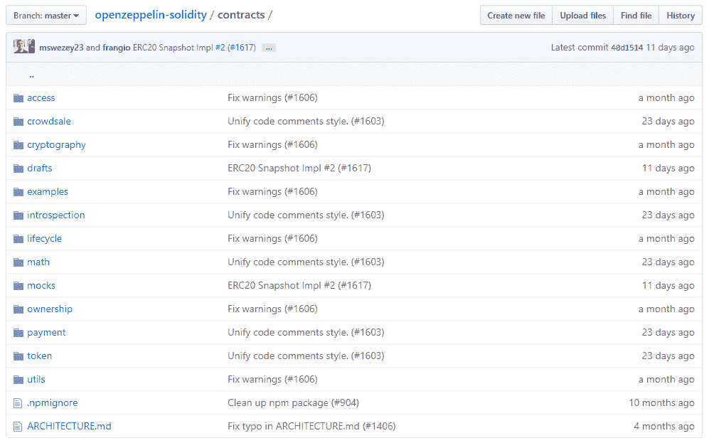
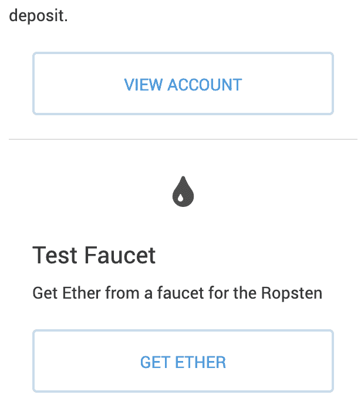
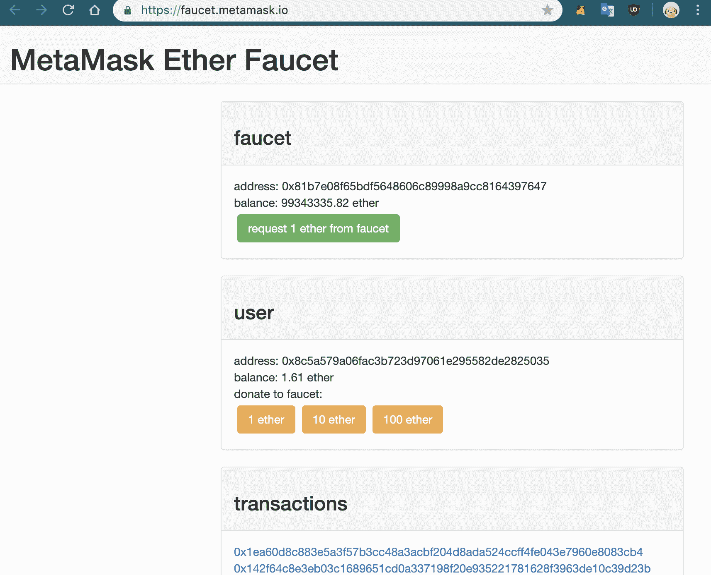
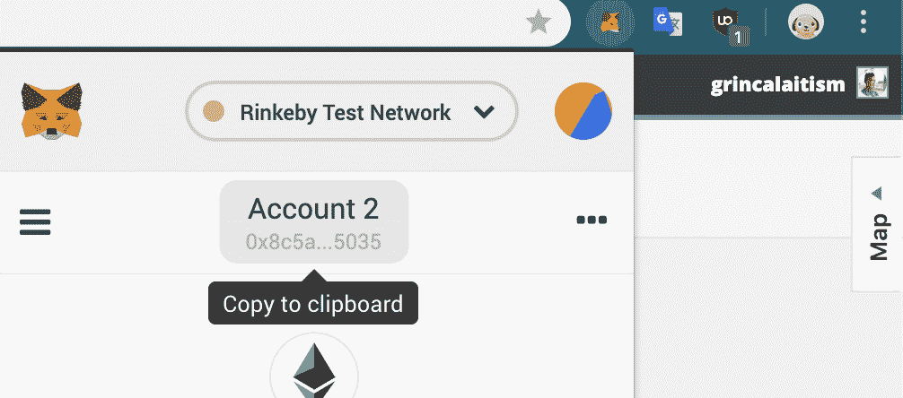
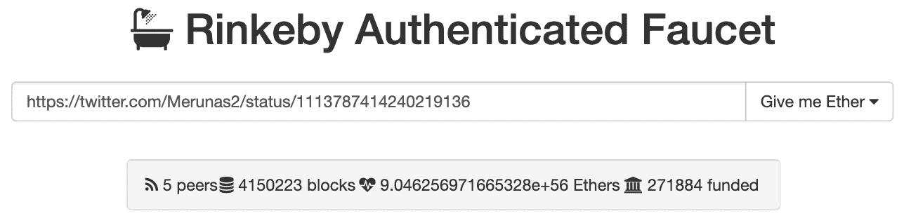
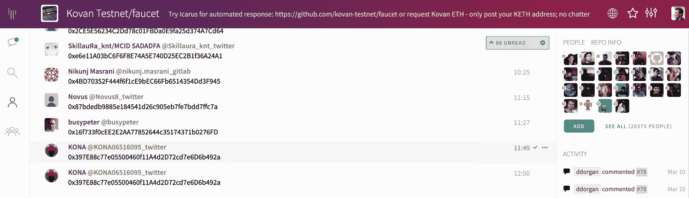
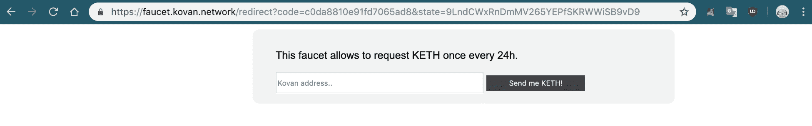

# 工具、框架、组件和服务

在本章中，您将了解以太坊开发人员可以使用的几个重要工具，这些工具可以创建强大的分散式应用程序和智能合约，这些应用程序和合约可以扩展并且足够安全，可以为数百万潜在用户提供服务。以太坊开发的世界充满了有用的工具，当创建复杂的去中心化应用程序和智能契约时，这些工具可以让您的生活变得更加轻松，这些应用程序和智能契约使用了 Solidity 的最新变化。了解那里有什么以及它是如何工作的，将真正帮助您在开发项目中前进，因为您将能够用更少的易出错代码创建更好更快的应用程序。

在本章中，我们将讨论以下主题:

*   使用开发工具
*   了解以太坊通信工具
*   了解以太坊的基础设施
*   学习以太坊测试和安全工具
*   获得重要的开源库

# 使用开发工具

开发人员工具，比如集成开发环境、水龙头，甚至智能合约语言，都是开发人员必须掌握的基本东西，以便实际了解如何有效地开发智能合约。

# 发展框架

有几个开发框架为您提供了一组实用工具，用于在一个可以测试和验证代码的环境中创建智能合约，以便使用更高质量的代码来提高开发速度。让我们看看一些最流行的，以决定在任何给定的时刻应该使用哪一个:

*   这是创建可靠的 dApps 和智能契约的最大开发框架。在撰写本文时，它与 Vyper 并不完全兼容，但如果您真的想这样做，有一些变通办法可以让它工作。如您所知，Truffle 直接从您的终端为您提供智能合同编译、部署和测试工具，因此您不必离开您的工作流程。设置起来有点复杂，因为你必须以一种特殊的方式工作，但一旦完成，你就有轻松创建强大 dApps 的巨大潜力。你可以在 truffleframework.com 的[买到。](https://truffleframework.com/)
*   虽然 Waffle 不是一个众所周知的开发框架，但它的目标是创建更简单、更快速的编程工具，这样你就可以用更少的依赖来轻松开发。你只需要`contracts`和`test`文件夹就可以开始使用 Waffle，因为它会编译所有的代码，不会带来任何麻烦。你的智能合同可以很容易地用`npx waffle`编译。因为它的目标是尽可能的简洁，你不能从他们的工具中部署你的合同，也没有像在 Truffle 中那样的`build/`文件夹，所以由你来部署它们。更少的功能带来更少的设置和麻烦，但更简单。可以用`npm i -S Ethereum-waffle`安装。
*   **0xcert** :这是另一款出色的开发工具，专注于创建和部署高级 ERC721 不可替代智能合约令牌。这些是特殊类型的令牌，其中每一个都是唯一的，并且具有一些内在价值。例如，CryptoKitties 使用 ERC721 令牌随机生成具有独特特征的动物，并根据稀有程度设定价格。Oxcert 旨在增加已被接受的 ERC721 令牌标准的采用，以便开发人员可以创建更快、更安全、更复杂的令牌合同。你可以在他们的网站上买到:【0xcert.org[。](https://0xcert.org/)

# 集成开发环境

说到 ide，我们有一个更小的工具集，可以真正帮助你从第一线编写安全的代码，因为它们试图在错误发生之前就修复错误:

*   **Remix:** 最流行的开发环境是一个非常强大的代码编辑器，它通过自动编译和有用的警告消息来指出代码中的错误，从而修复您的智能合约代码。它甚至提供了在开发过程中学习最佳实践的建议。您可以使用自定义以太坊实例、JavaScript 虚拟机或注入的`web3.js`来部署您的智能合约，以查看您的智能合约在不同环境中的反应。一旦有了源代码，您就可以与每个已部署的契约进行交互，而无需退出浏览器。我强烈推荐它用于开发 Solidity 代码和手工测试你的函数的每一个组件。在 remix.ethereum.org 的[开始使用。](http://remix.ethereum.org)
*   这是一个强大的 IDE，包括更多的特性来直接部署你的 dApps，这样你就可以通过即时反馈与你的应用进行实时交互。您可以导出您的 dApps、部署合同、直接访问区块链，以及许多其他更棒的事情。您应该给它一个机会来体验一个完整的 IDE 的强大功能，它可以帮助您从一个空文件到一个功能齐全且经过测试的 dApp 的每一步。

# 测试网水龙头

作为一名以太坊开发者，您可能已经熟悉了可用的测试网。您知道，它们是将您的智能合约部署在安全空间中的强大区块链，您甚至可以将其用于现实世界的应用程序，因为功能是相同的。让我们来看看下面的一些水龙头，以便您可以体验每个测试区块链的不同功能:

*   **Rinkeby** :这是一个**的权威证明** ( **PoA** )区块链，在这里你可以利用赌注机制进行交易，而不会暴露你的身份。对于安全可靠的区块链，这是一个非常强大的解决方案。您应该在不同的测试网上部署您的应用程序，看看哪一个最适合您的需求。如果你想使用林克比，你需要一些测试乙醚，你可以在 rinkeby.io/#faucet 得到。这一过程与其他区块链截然不同，因为他们希望确保网络不被破坏。因此，要获得以太，你必须在 Twitter 等社交媒体平台上发布你的以太坊地址，然后等待接收有限数量的以太:一次最多 18.75 以太，你可以每 3 天检索一次。

公布你的以太坊地址后，把链接贴在水龙头上，几分钟后你就能收到你的以太了。这个网络的伟大之处在于它与 MetaMask 兼容，阻塞时间非常快。

*   这是最受欢迎的**工作证明** ( **PoW** )测试网络，你可以从许多水龙头快速获得乙醚。您可以从 MetaMask 本身获得用于开发的免费 Ether 的主要地方，您可以在[https://水龙头. metamask.io](https://faucet.metamask.io) 访问它以获得有限数量的 Ether。每位用户的乙醚用量限制不断变化，因此很难预测通过反复点击“从水龙头请求 1 乙醚”按钮您将获得多少乙醚——这取决于您自己。然而，这是一个很好的区块链，尽管不像其他的那样可靠，因为它的区块链容量低，只有一小部分节点免费开采。
*   Kovan :这并不常用于测试项目，尽管它是一个非常可靠的 PoA 测试网，由 Parity 的团队构建，为开发人员提供了一个适用于各种项目的高效测试环境。你可以在[水龙头. kovan .网络](http://faucet.kovan.network)获得乙醚，在那里你必须用你的 GitHub 帐户登录，每个帐户每 24 小时收到 1 乙醚。虽然不多，但对于没有实质性付款要求的较小项目应该足够了。

# 了解以太坊通信工具

以太坊是一个由几个相互连接的部分组成的大生态系统，这些部分相互对话，包括智能合约、dApps 和 web 应用。目标是创建单独的结构，这样您的最终应用程序就是模块化的，您可以更新特定的部分，而不必重新创建整个 dApp。这就是为什么我们有通信工具:帮助我们在智能合约、dApps 和 web 应用程序之间交换信息的库。让我们来看看目前在交流方面可用的不同工具。

# 前端 ethereum apis

谈到前端通信工具，我们有一些强大的 JavaScript 库，通过将智能合约与 web 应用程序连接起来，使 dApps 成为可能:

*   **Web3.js** :在 Web 应用程序中使用智能合同创建合同实例、调用合同函数、创建交易和签署交易的最流行的库。光是这个库就让 dApps 成为可能。后台是区块链的 Web 应用程序本身是一个革命性的概念，正变得越来越流行，这都要感谢决定建立这样的库的人们。它还可以用在 Node.js 应用程序上，因此它是各种 dApps(包括后端)的绝佳工具。你可以在这里得到 web 3 . js:【github.com/Ethereum/web3.js】T2。
*   **NEthereum** :这是一款类似于 web3.js 的智能合约沟通工具，但是针对。NET 开发人员。那些受欢迎的人。NET 库并且喜欢用 C#编程的人会喜欢这个工具，因为它是专门为这些程序员设计的。它为您提供了连接现有网络所需的一切。NET 环境，包括库和客户端集成。你可以在这里了解更多关于尼瑟姆的信息:【nethereum.com[。](http://nethereum.com)
*   **毛毛雨:**这是针对您的 dApps 的 Redux 集成，以便您可以轻松管理状态和数据存储。如果您熟悉 Redux 和 React，您会喜欢这个工具，因为它为您提供了一个干净的库，可以轻松地在您的 dApps 上实现 Redux 的好处。由松露的创造者制作，它非常适合大型项目。你可以在这里买到:【github.com/trufflesuite/drizzle】T2。

# 后端以太坊 API

大多数以太坊应用程序将需要某种集中式后端来完成智能合约不可行的某些任务，要么是因为它超出了合约的能力，要么是因为有更好的方法来处理某些动作。在这种情况下，我们还是需要和区块链谈谈。这就是后端 API 发挥作用的地方:帮助我们创建工具和系统，以改进我们的整体 dApps 和智能合同:

*   Web3.py :这是 Python 流行的以太坊实现，这样你就可以为这种流行的语言创建工具和系统。Python 与 web3.js 配合得非常好，因为您可以创建高效的脚本来自动化一些操作，比如检查智能合同事件。语法与最初的`web3.js`非常相似，所以使用起来会很舒服。点击这里查看:[github.com/Ethereum/web3.py](http://github.com/Ethereum/web3.py)。

*   **Eventeum** :这是一个为你的后台微服务与智能合约事件沟通的工具。如果你不熟悉微服务，它们只是专注于非常高效和可维护地完成某些特定任务的小应用程序，因此你的最终应用程序非常高效，并且易于使用可以轻松改进和替换的模块进行优化。Eventeum 正在与这些微服务合作，处理由您的智能合约生成的以太坊事件，以便您可以在复杂的服务网络上轻松实现事件。它可以与 Java 一起工作，对于需要可伸缩性的后端开发人员来说非常棒。请看这里:【github.com/ConsenSys/eventeum】T2。

# 应用程序二进制接口工具

**应用程序二进制接口**，更好的说法是 **ABIs** ，是 JSON 对象，描述你的智能契约函数、变量、修饰符，以及它们之间的一切。ABIs 的目标是帮助您的 dApps 快速理解智能合约，以便他们知道您可以使用哪些功能。现在，重要的是你要尽可能地利用这个协议，因为你将在你所有的 dApps 中使用它。这里有一些工具可以真正提高你对 ABI 的理解:

*   Abi-decoder :这是一个很小的 JavaScript 工具，允许你解码复杂的交易对象，这些对象通常是加密的，很难理解。你看，每次你通过执行智能合约中的功能发送交易时，你都在以加密数据的形式与区块链进行交互。在某个时刻，您必须读取这些事务，要么是因为您正在调试您的 dApp，要么是因为您需要了解无论出于什么原因正在发生什么。使用 abi-decoder，您可以解码事务数据和事务日志，这对于数据高效的 dApps 来说是非常棒的。了解更多关于这个由 github.com/ConsenSys/abi-decoderT2 的康赛斯公司制造的小工具的信息。
*   OneClickdApp.com:这是一个很棒的工具，可以快速地将你的 dApps 部署到互联网上，而不用担心托管问题。您可以单击一个按钮，选择您的 ABI 数据，然后您的配置和 dApp 就会部署到他们的域中。只需点击几下，您就可以看到它在真实世界中的样子。它非常适合测试和较小的项目。唯一的问题是，如果你决定在不停机的情况下托管它，你必须每月支付 5 美元，尽管这对你的整个测试过程来说很好。在 oneclickdapp.com 的[了解更多。](http://oneclickdapp.com)

到目前为止，您已经发现了一些非常棒的工具，您可以立即在项目中实现它们，并带来立竿见影的效果。继续探索完整的技术生态系统，帮助您创建更好的 dApps 和智能合约，以便在构建面向未来的强大应用程序时更上一层楼。

# 了解以太坊的基础设施

当谈到以太坊区块链的基础结构时，有几个应用程序可以帮助改进它，以便人们，包括开发人员，可以从它的所有潜力中受益。你看，区块链不仅仅能够处理交易和运行智能合同。您可以通过消息、存储信息和使用自定义客户端与每个对等方直接对话。在本节中，您将了解以太坊基础设施中一些最有趣的用例。

# Ethereum 客户端

您已经知道有一些功能强大的客户端有着明显的不同，但是您可能不知道的是，有一些专门为某些客户端开发的工具。我们将看到一些用 Java 编写的最佳实现，主要是因为它是这些类型的应用程序中使用最多的语言之一:

*   **Pantheon** :这款应用完全用 Java 编写，专注于为你的 dapp 和智能合约提供不同的环境。它有一个丰富的文档网站，很容易马上上手，你可以使用 Clique 用 PoW 或 PoA 创建私有网络。你不需要知道 Java 来使用它，因为它的设置非常简单。在 docs.pantheon.pegasys.tech/en/latest/的[看看吧。](http://docs.pantheon.pegasys.tech/en/latest/)
*   EthereumJ :这是一个模式密集型实现，致力于为您的私有网络需求提供尽可能多的功能。它可以在您的 Maven 或 Gradle 项目中用 Java 代码进行配置。说到易用性，这个更难设置，需要更多时间来适应，因为它是针对企业级开发人员的。在 github.com/Ethereum/Ethereumj 的[看看吧。](http://github.com/Ethereum/Ethereumj)

*   **Harmony** :由以太营(EtherCamp)制作，这是以太坊早期的一个流行网站，提供自己的 IDE 和工具。Harmony 是在基于 EthereumJ 的基础上，结合 JavaScript 和 Java 编写的。他们的目标是提供一个干净的 web 仪表板界面，您可以轻松地使用它来详细监控和分析区块链。对于那些需要清楚了解幕后发生了什么的项目，强烈推荐使用它。在 github.com/ether-camp/Ethereum-harmony 的[看看吧。](http://github.com/ether-camp/Ethereum-harmony)

# 以太坊存储

当我们谈到存储时，我们指的是将各种文件保存在一个分散的云中，这个云可能适用于以太坊区块链，也可能不适用。这些应用程序允许您存储合同和文件，而不必依赖中央服务器:

*   **星际文件系统** ( **IPFS** ):这是最著名的分散存储实现，它允许你在一个由连接节点组成的分散网络中存储大文件，而不是将你的信息保存在集中的服务器和数据库中。它被用于各种项目中，这些项目希望开发完全分散的应用程序的可能性，在这些应用程序中没有集中的故障点。这些类型的项目将在未来使用，因为当成千上万的节点在高质量的网络上复制信息时，它们会更加安全。IPFS 将 torrent 和 Git 协议结合起来，根据文件的内容来识别文件。因此，两个内容相同的相同文件将拥有相同的加密标识符，称为**哈希**。这是一次非常重要的革命，因为它们删除了重复的文件，提高了数据的可用性，并允许更好地利用资源，因为许多节点将一起共享相同的信息，而不是被分开。请登录他们的网站查看，网址为 [ipfs.io](http://ipfs.io) 。
*   Swarm:这是一个建立在以太坊之上的协议，它的目标是以一种分散的方式共享文件，很像 IPFS，但是不需要依赖外部团队。核心以太坊团队正在不断改进它，它与整个系统无缝集成，因此您可以将它与您的 dApps 和智能合约集成，而不会有任何问题。在他们位于 swarm-gateways.net[的网站上查看。](http://swarm-gateways.net)

# 以太坊信息

以太坊消息传递意味着在对等体之间交换加密信息，而不需要中介，这样您就可以几乎实时地直接获得信息。它们是聊天和应用程序的绝佳工具，这些应用程序首先需要速度:

*   **耳语**:最广为人知的实现点对点消息传递的协议，它建立在以太坊之上，并完全集成了其核心的所有系统。您可以使用它与其他 dApps 进行通信，只需进行最少的配置。智能合约是相互连接的，有一个可以安全共享信息的层。了解更多关于 github.com/Ethereum/wiki/wiki/Whisper[的悄悄话。](http://github.com/Ethereum/wiki/wiki/Whisper)
*   这是另一个建立在以太坊上的协议，允许人们和 dApps 高速交换加密信息，而不必创建缓慢的区块链交易。Python 中有一个名为 pydevp2p 的实现，它为您提供了一个简单的接口，可以在您的应用程序中包含消息传递，以便人们可以开始相互交换数据。在他们的官方 GitHub 页面上了解更多信息:【github.com/Ethereum/devp2p[。](http://github.com/Ethereum/devp2p)

以太坊消息应用程序为我们提供了丰富的可能性来创建更好的 dApps 和高级智能合约，因此无论何时您希望在以太坊上开发基于用户的游戏或聊天应用程序，都应该关注这些服务。

# 学习以太坊测试和安全工具

区块链的安全比任何其他功能都重要。如果没有安全的应用程序，我们就无法开始处理最简单的智能合约，因为用户不会信任我们的代码。这就是为什么作为一名以太坊开发大师，你必须了解保护你的程序的所有可能性。

# 了解监控实用程序

监控是观察您的应用程序在现实世界中的行为。你看，监督你的代码是很重要的，因为它可能被全世界成千上万的用户使用:你不希望他们在随机时刻有糟糕的体验。请务必使用这些工具来提升您的智能合约游戏，因为它们大大提高了您的应用程序的质量:

*   智能合约手表:由 Neufund 制造，这是一家致力于创建具有法律约束力的智能合约的公司。此工具允许您观察智能合约的活动，并查看它可能导致问题的地方。您可以将它用作您自己的自定义块资源管理器，作为一种安全工具，用于当您的某个应用程序的资金严重减少时，或者用于您需要仔细监控的任何情况。从终端使用它很简单，并且有一个简单的输出界面来查看发生了什么。在 github.com/Neufund/smart-contract-watch 的[了解更多信息。](http://github.com/Neufund/smart-contract-watch)
*   **Scout** :实时向您显示智能合约中的事件和活动，以便您可以关注重要的事情。您可以创建应在危险情况下执行的关键事件，以通知您需要紧急修补的安全漏洞。想象一下，如果人们使用 Scout 这样的工具在面对黑客攻击时采取快速果断的行动，可以节省多少乙醚。他们的仪表盘和实时报告令人惊叹，因此我强烈建议您查看一下，以改进您的应用程序。在 [scout.cool](http://scout.cool) 了解更多信息。
*   **Chainlyt:** 允许您解码交易数据内部发生的事情，以探索任何给定时刻发生的事情的极端细节。您可以将它与其他监控工具结合使用，通过了解违规是如何发生的来修补违规，以免为时过晚，因为您可以确切地看到智能合同中进出的内容。它们还提供了一个不错的仪表盘，你可以自由地使用它来完成快速项目。对于高级用户来说，这是一个非常强大的工具。更多信息请访问: [chainlyt.io](https://www.chainlyt.io/landing) 。

# 使用安全测试实用程序

如果您正在考虑将智能合约部署到 Mainnet，并且不想从一开始就面对重要问题，那么测试智能合约是绝对必要的。这是不可避免的，你应该随着你的发展去做。看看这些测试工具，为您的日常需求建立一个舒适的测试环境:

*   这是一个非常著名的工具，可以轻松分析你的智能合约。他们为您提供了一个基于 Remix 的在线 ide，具有一些高级功能，如超时、深度限制、自定义字节码和许多其他改进，可以帮助您分析您的智能合约，以成倍地提高其安全性。因为它的潜力，所以强烈推荐它。在这里了解更多:【oyente.melonport.com】T2。
*   这是一个非常棒的工具，它以清晰的格式向您展示了在部署之前必须修补的 EVM 字节码问题。这些是低级呼叫，向您显示潜在的安全漏洞。你可以轻松地分析它们，你甚至有已经为 Truffle 制作的插件和一些开发工具，比如 Visual Studio 代码。它们的主要卖点是为整个安全设置提供了便利，这样您就可以使用最常用的工具进行设置并将其遗忘。了解更多关于 Mythx 的信息，请访问:[。](http://mythx.io)
*   **Solgraph:** 这些是生成的可视化图表，清晰地描述了您的智能合同是如何流动的。例如，如果你想看看当你调用`transferFunds()`函数时会发生什么，你可以调用 Solgraph，你会收到一个非常直观的描述，描述你的契约完成你的调用所采取的步骤。对于想要理解复杂契约流的开发人员来说，这是非常有效的。在他们的 GitHub 页面上了解更多信息:[github.com/raineorshine/solgraph](http://github.com/raineorshine/solgraph)。

# 了解审计工具

审计是手动检查代码的所有不同部分的过程，以便使用诸如逐行分析、漏洞测试和入侵路径等过程来找到潜在的漏洞。您必须熟悉它们，以保证一个可持续的、高质量的代码项目。

请注意，它们的目标是加速您的审计过程，因此它们更像是一个经过深思熟虑的过程的补充工具:

*   这是一个由 Netlify 开发的简单明了的工具，它允许你检查一个以太坊地址。有时，您需要对地址进行校验和检查，以保证它是正确创建的格式良好的地址。它主要用于 Truffle 项目，在这些项目中，您必须拥有项目的有效地址，所以 EthSum 是验证地址的一个很好的补充。你可以在 ethsum.netlify.com 的[买到。](http://ethsum.netlify.com)
*   **Decode:** 这是一个让您的 testrpc 节点易于理解事务数据的工具。当您审计一个项目时，您必须运行几个测试和手动检查来验证结果的完整性，并且大多数时候使用 testrpc 或类似的测试环境很难做到这一点，因为产生的数据是混乱的。Decode 通过使交易易于阅读和理解来解决这个问题。在 github.com/dteiml/decode 的[了解更多信息。](http://github.com/dteiml/decode)
*   EthToolBox :这是一个 web 应用程序，有许多不同的实用程序来帮助您解决常见的任务，而不必在不同的环境之间来回切换。有了绿色的界面，你几乎可以做任何你需要的检查，而不必退出你的浏览器。它做的事情有 ECRecovers、密钥生成、EVM 单词转换、十六进制解析等等。当您必须审计任何类型的智能合同时，您会喜欢它，因为您可以快速地分析任何类型的输出。从你的浏览器这里使用它:【eth-toolbox.com】T2。

审计工具将为您节省无数的时间来处理令人困惑的错误、缺陷和漏洞。它们将成为您最常用的工具集之一，与您已经很棒的开发工作流相结合，这样一旦您集成了它们，您就可以创建更好的应用程序。

# 获得重要的开源库

在创建新的智能合约应用程序时，您必须使用所有可用的资源，以最省时或最具成本效益的方式创建它们。您的目标应该始终是使用和创建高质量的代码。那么，为什么不在你的下一个项目中使用一些最常用的、经过测试的、安全的库呢？它们已经被使用了成千上万次，并且由于它们的质量，仍然很强大。让我们在接下来的小节中看看那些强大的开源库。

# 齐柏林诺斯

齐柏林飞艇在以太坊游戏中已经存在很长时间了。他们建立了一些最有用的智能合约，例如用于防止溢出问题的 SafeMath，并有一个充满安全合约的 GitHub，您几乎可以即插即用。他们的智能合同分布在许多文件夹中。为了理解所有这些浓缩的信息，我们将仔细阅读每一个文件夹，以免您陷入困惑，并帮助您理解这些合同的潜在价值。你可以在官方的 GitHub 资源库中找到它们:[https://github.com/openzeppelin/openzeppelin-solidity](https://github.com/OpenZeppelin/openzeppelin-solidity)，如下所示:



为了理解所有这些文件以及它们为什么重要，我们将解释每个文件夹，以便您可以快速浏览其中的内容:

*   在这个文件夹中，你可以找到角色管理契约，它为你提供了赋予特定以太坊用户权力的工具，这样你就可以创建可以使用不同角色的应用程序。
*   这个文件夹包含了一些最有趣的 ICO 智能合约，它们有各种各样的实现，包括可暂停、可退款、可铸造和白名单众筹销售。如果你刚开始学习 ICO，这个文件夹是理解 ICO 应该如何正确构造的必备资料。
*   `cryptography`:该文件夹包含两个智能合约，用于 Merkle-proof 验证和**椭圆曲线签名** ( **ECDSA** )操作。对于需要使用签名消息的加密项目，这些是高级实用程序。
*   这些是正在进行中的智能合约，一旦经过完善和全面测试，它们将包含在未来的版本中。
*   这提供了一些快速令牌和 ICO 示例契约，将所有必要的逻辑实现到单个文件中，这样您就可以直观地看到整个系统的工作情况。
*   `introspection`:这些是 ERC165 契约，用来检测外部契约中使用了哪些接口。例如，您可以使用它来检测您的特定智能合约是否支持 ERC20 令牌。
*   这个文件夹包含一个可暂停的智能合约实现，你可以使用它来执行任何你想在任何给定的时间点停止的合约，以增加安全措施。
*   可能是最受欢迎的文件夹，它包含著名的 SafeMath 库和一个 Math smart 契约，该契约提供了在智能契约中进行安全数学计算的实用程序，由于变量的工作方式，智能契约本身是不安全的。
*   这个文件夹包含了许多模拟契约，它们实现了整个契约的一小部分功能，帮助你理解每种契约的关键方面。我建议您从这里开始理解是什么使一个契约不同于另一个，例如对于 ERC 实现。它们实现了可以用来分析这些函数的输入/输出的事件。
*   `ownership`:包含两个限制功能访问的合同，带有所有者限制，其中某些功能必须限制给所有者。

*   功能强大的支付工具，用于团体支付、延期支付和托管合同，您可以轻松实施。这对于依赖于持续支付的项目来说非常酷，比如银行。
*   这个文件夹包含了 ERC20 和 ERC721 的实现，这些实现有很多接口，你可以用这些接口来实现这些令牌的更小或更好的版本。
*   `utils`:该文件夹包含智能合约实用程序，例如重入保护和阵列管理，适用于需要快速修复复杂问题的用户。

您只需为您的项目编写一行代码，就可以安装他们的所有合同:

```
npm i -S openzeppelin-solidity
```

这将把合同放入一个很好的包中，您可以使用完整的合同路径来引用它，如下所示:

```
import 'openzeppelin-solidity/contracts/token/ERC721/ERC721Full.sol';
```

总的来说，Zeppelin 在回报社区方面做得非常出色，提供了我们许多人日常使用的如此有价值、高质量的代码。如果你认为他们的行为值得奖励，在你的下一个项目中使用他们的合同来表达你的感激。

# 使用 0x 协议

0xprotocol(读作 zero x protocol)是一组流行的 API、智能契约和工具，用于构建互连的分散式交换。你看，许多交易所如此独立地工作，以至于它们失去了共享系统所能提供的许多好东西。0x 致力于创建一个交易所可以使用的协议，这样它们就可以共享流动性、用户和界面，即所谓的中继。让我们来看看使用这个协议可以构建的主要内容。

# 建造继电器

中继站是一个 dApp，它使用一组公共的实用程序与其他中继站共享交易。当涉及到为一组特定的功能选择最佳交换时，它们为用户提供了许多选项，因为它们都共享某些动作来帮助整个生态系统。

他们使用一个名为`0x.js`的库，这个库允许你用一个高级的、干净的界面与继电器交互，使用起来感觉很棒。

# 成为做市商

做市商为交易所提供个人交易，外部用户可以以动态价格进行交易。他们通过从自己的权力地位中获取最大利润来维持交易所的生存，因为他们对在任何特定时刻哪些交易是有效的有更多的控制权。

有了 0x，你可以简单地成为一个做市商，为分散的交易所提供流动性，使它们在一个高交易网络中运作。

0x 协议有太多的内容，你必须自己去探索。这是近年来最有趣的项目之一，它的象征性价格清楚地反映了这一点。如果你对**去中心化交易所** ( **DAXs** )感兴趣，开始学习更多关于它的知识，加入交易所革命。

# 阿拉贡

阿拉贡是创建去中心化自治组织的首选方案，这些组织在一个没有中介的完美系统中运作。它们为您提供了从您的计算机管理公司的工具。我们将探索这些，这样你就能体会到它们功能的全部潜力，并在以太坊区块链上创建你自己的公司。

# 阿拉贡 PM

这是一个为他们的 Aragon 客户端分发不同版本的软件包的工具，这样 Dao 可以使用一组固定的改进，而不必不断地用新版本更新他们的软件需求，新版本可能会破坏他们现有的结构。

# 阿拉贡内斯

这是一个智能契约框架，用于构建具有各种实用工具的去中心化组织，例如控制限制、可升级的契约以及您可以根据需要添加的插件。对于希望在区块链与强大的公司动力进一步合作的高级 Dao 来说，这是一套非常棒的智能合同。

# 阿拉贡内斯

这是他们 Aragon 系统的 JavaScript 实现。它允许你用一个很好的 API 来创建与分散的组织一起工作的 dApps，你可以在几个小时内学会。它非常适合构建定制界面，在您需要时与您的公司进行交互。

# AragonUI

这是一组 UI 组件，您可以在您的 JavaScript 应用程序上实现，以创建具有您希望创建的精确外观的漂亮界面。您不必担心从头开始设计一切，因为您只需将这些接口元素插入到正确的位置，您的项目就会有一个定制的 DAO 实现。

# 阿拉贡克利

**命令行界面** ( **CLI** )用于创建各种 Aragon 应用程序并与之交互，这些应用程序与分散式组织一起工作。当启动许多不同的 DAO 项目时，这个 CLI 使用起来直观而简单。

# 摘要

在本章中，您已经学习了许多可用于创建高级智能合约应用程序的工具。您从最有用的开发工具指南开始，这些工具可以在您的智能合约开发的日常工作中使用，包括 ide、开发框架和测试网。然后，您通过查看以太坊通信工具继续了您的学习之旅，这些工具可以帮助您以高效的方式将智能合同与 web 应用程序集成。之后，你学习了更多关于以太坊基础设施的知识，这些设施位于区块链的下层，在那里它们可以更好地访问以太坊区块链的各个方面。

接下来，您参加了一个安全速成班，学习了实现审计工具、监控工具和测试应用程序的重要性，这些工具和应用程序可以让您对代码的安全性有一个很好的了解。最后，您阅读了更多关于最受欢迎的开源库的信息，从而结束了这一学习之路。这些开源库可以帮助您使用安全、受欢迎的代码创建各种独特的应用程序，这些代码被全球数千家区块链公司所使用。

所有这些信息在正确的人手中都有可能做许多危险的事情，所以成为一名伟大的以太坊开发大师，并使用你新发现的知识来改善整个生态系统，而不是利用没有提供价值的东西。

在下一章中，我们将探索各种 dApp 改进，您可以立即实施这些改进来提高您的 Truffle 的性能，并使用前所未见的技术来反应项目，从而真正为这种类型的 dApp 提供最佳性能。

# 在 Testnet 上部署

开发智能合约是一项复杂的任务，您必须在不同的环境之间移动，以有效地测试您的应用程序的质量。这就是为什么有许多不同的测试网，您可以在其中部署您的代码，试验您的合同如何使用不同的规则和挖掘算法来提高它们的质量。在这一章中，通过理解 Ropsten、Rinkeby、Kovan 和 Mainnet 在保护智能合同世界中的位置，您将发现主要以太坊网络之间的差异。

您将了解每个网络提供的核心挖掘算法变化，以便了解您的应用程序在不同环境中的行为。您还将看到如何为这些网络中的每一个获取以太网，这样您就可以使用免费的 testnet 立即开始开发。

在本章中，我们将讨论以下主题:

*   使用 Ropsten 进行智能合同开发
*   用 PoA 理解 Rinkeby
*   使用 Kovan 进行智能合同开发
*   介绍 Mainnet

# 使用 Ropsten 进行智能合同开发

每个以太坊网络都有一个唯一的标识符，用数字表示所选择的网络，这样以太坊客户端和 Truffle 等框架就可以快速选择一个新的 testnet 网络。由 ID 3 标识的 Ropsten 是以太坊中使用最多的测试网络的名称，因为它提供了与真实 Mainnet 最相似的技术堆栈，真实世界的 dApps 使用真实 Mainnet。

请注意，每个 testnet 都是一个独立的区块链，有自己的一套规则和限制，帮助人们决定在哪里测试他们的 dApps，模拟真实世界的情况。

最初，罗普斯滕·区块链被命名为**魔登**，它在 2015 年以太坊推出时就被部署了。一年后，核心以太坊团队决定将魔登更名为 **Ropsten** ，以表明它是一个升级版本，具有更好的安全特性和更快的交易执行速度。

它一直在不断改进与硬叉子，以包括最新的以太坊版本，使这个区块链与最新的创新保持同步。有趣的是，最大的以太坊升级之一，被称为**君士坦丁堡**，首先在这个测试网上发布，以验证它将如何工作，然后在主网上冒险进行这样的改变。为了保证升级的安全性，在升级主网络之前，通过硬分叉在测试网上发布突破以太坊的变化是常见的做法。

因为这个网络是基于 **p** **屋顶** ( **PoW** )的，所以很容易受到垃圾邮件的攻击，一些功能强大的计算机可以通过 51%的攻击用自己的交易重写阻塞历史。这就是为什么这是最不稳定的测试网络之一，尽管它一直在不断改善。事实上，它在 2017 年受到了垃圾邮件攻击，未知用户生成了大量缓慢的数据块，导致整个区块链崩溃，阻止新的交易到达矿工，有效地破坏了网络。

在这样一次活动之后，以太坊基金会收到了来自外部团体的 GPU 捐赠，这些团体希望支持他们的努力。有了这个改进的 hashrate，Ropsten 恢复了活力，比以前更强大了，并且仍然可以毫无问题地运行。

# Ropsten 的特点

Ropsten 是与 Mainnet 最相似的区块链，因为它实现了相同的 PoW 挖掘算法，每个人都可以自由地生成新的块来交换 Ropsten Ether，而 rops ten Ether 没有任何实际价值。它的块速率约为 30 秒/块，被所有主要的以太坊客户端接受，包括 Geth 和 Parity。

这个网络中的以太可以自由开采，就像在 Mainnet 中一样，它有几个打开的水龙头可以从中获取免费的以太。这种网络最适用于您希望模拟尽可能接近 Mainnet 的环境的情况，在这种情况下，Ether 具有实际价值，因此您的合同具有非常相似的阻塞率和挖掘性能。事实上，区块链和主干网上的气体限制通常是相同的。

# 获得 Ropsten 乙醚

如果你现在是以太坊的用户，为这个网络获取以太的过程非常简单。以下是您必须遵循的步骤:

1.  如果您还没有下载 MetaMask，请下载它，并通过单击顶部的按钮将您的网络更改为 Ropsten:


2.  然后，单击存款按钮，向下滚动，并单击获取乙醚打开水龙头:



3.  以下是 MetaMask 水龙头的外观:



通过点击水龙头的请求 1 乙醚，你会收到一个 MetaMask 通知，以批准在他们的网站上使用你的帐户，这样他们就可以向你发送一次点击乙醚和最多约五 Ropsten 乙醚。你可以在专用子域:[https://Ropsten . Etherscan . io](https://ropsten.etherscan.io)用 ethers can 分析你的 Ropsten 交易。

在获得 Ropsten Ether 之后，您应该能够用您的框架或 IDE 连接到那个特定的网络。下面是将契约部署到这个 testnet 的步骤，以及对 Truffle 配置的一些修改:

1.  要将智能合约部署到这个 testnet，您可以使用如下配置修改您的`truffle-config.js`文件:

```
ropsten: {
  provider: () => new HDWalletProvider(mnemonic, `https://ropsten.infura.io/${infuraKey}`),
  network_id: 3,
  timeoutBlocks: 200, // # of blocks before a deployment times out (minimum/default: 50)
}
```

2.  然后，您可以使用以下内容部署您的合同:

```
$ truffle deploy --network ropsten --reset
```

记住通过创建一个没有限制的新项目来为 Ropsten 获取一个有效的 INFURA 密钥。

或者，您可以通过将 MetaMask 网络更改为 Ropsten 来使用 Remix IDE 部署到 Ropsten，也就是说，只要其中有 Ether。Remix 将自动重新加载新选择的测试网。

# 使用授权证明了解 Rinkeby

Rinkeby 是测试应用程序最安全的网络之一，因为它使用**授权证明** ( **PoA** )来安全地生成块。事实上，它是如此安全和稳定，以至于许多人使用这个网络进行原型、MVP 和演示，因为开发人员知道他们的 dApps 将在这个链上继续运行而不会出现问题。

它由 ID 4 标识，由以太坊团队在 2017 年创建，旨在为希望尝试不同挖掘算法的开发人员提供一种替代解决方案。这个测试网快如闪电:它持续每 15 秒生成一个块。乙醚的供应由`puppeth`控制，这样人们就不会因滥用采矿方法而产生乙醚。

唯一受支持的客户端是 Geth，尽管您可以将它用于大多数具有 MetaMask 和 Truffle 的应用程序。

# 描述授权证明

你已经熟悉了第三章、*以太坊资源*中的 PoA，在那里你已经基本了解了如何使用 Puppeth 生成一个小团体网络。 **Clique** 是 Rinkeby 使用的 PoA 算法的名字。它非常类似于 PoS，包括选择一小部分挖掘器，大约 25 个，这些挖掘器充当创建将被提议给链的新块的验证器。

每个验证器在它们希望被接受为下一个的块上放置一个标记，几秒钟后，选择具有最大标记量的块。如果行为符合规则，验证者不会失去他们的股份，但如果他们变得错综复杂，他们就有失去股份作为惩罚的风险。

这种共识算法之所以有效，是因为验证者的身份是公开的，这样其他人就可以知道一个矿工在恶意操作。要成为验证者，每个用户都必须公开一些敏感数据以保护网络。

# 乙醚越来越多

要在这个网络中获得以太，你必须前往[https://水龙头. rinkeby.io](https://faucet.rinkeby.io) 或【https://www.rinkeby.io/#faucet】T2，在那里你可以提供一个带有你地址的社交媒体链接。

这个过程有点混乱，所以下面是详细的步骤:

1.  打开 MetaMask 并点击您的地址，复制您的 Rinkeby 以太坊地址:



2.  转到你的 Twitter 或脸书，创建一个新的 tweet 或帖子，只写下你的地址；虽然您可以添加文本，但最好只留下您的地址:


3.  发布推文，点击它，并复制该位置的 URL:


4.  将该 URL 粘贴到 Rinkeby 水龙头页面的输入框中:



5.  点击给我乙醚选择你希望收到多少乙醚。每三天最多只能摄入 18.75 乙醚。你会立即得到乙醚，但你必须等到那个时候才能在未来得到更多的乙醚。如果一切正常，您会看到一条绿色的确认消息。如果没有，可能是因为您提供的 URL 无效。一定要复制推文本身的网址:


6.  确认你已经在 MetaMask 中收到了乙醚:


现在，你应该可以和 Rinkeby 一起玩了，并且在你需要的时候部署你的合同。请记住，这里有一个版本的 Etherscan 专门用于探索 Rinkeby 事务:[https://rinke by . ethers can . io](https://rinkeby.etherscan.io)。

为了能够在您的 Truffle 项目中使用这个 testnet，您需要进行以下更改:

1.  要将智能合约部署到这个 testnet，您可以使用如下配置修改您的`truffle-config.js`文件:

```
rinkeby: {
  provider: () => new HDWalletProvider(mnemonic, `https://rinkeby.infura.io/${infuraKey}`),
  network_id: 4,
  timeoutBlocks: 200, // # of blocks before a deployment times out (minimum/default: 50)
}
```

2.  保存配置文件后，使用以下内容部署您的合同:

```
$ truffle deploy --network rinkeby --reset
```

记住通过创建一个新项目来为 Rinkeby 获取一个有效的 INFURA 键。

或者，您可以通过将元掩码网络更改为 Rinkeby 来使用 Remix IDE 部署到 Rinkeby，只要其中有 Ether。Remix IDE 将自动重新加载新的测试网络。

# 使用 Kovan 进行智能合同开发

Kovan 是由 Parity 的人创建的一个测试网，他们想要一种新型的 PoA 网络，开发者可以在其中部署他们的智能合同，知道他们将无休止地运行，因为这个网络是高度安全的。这个网络是所有网络中最快的，因为它有 4 秒的阻塞时间，这使得测试变得轻而易举，因为你不必等待很长的确认时间。

它的诞生是因为 2017 年对 Ropsten 进行的攻击，当时奇偶校验意识到开发人员正在失去他们武库中的一个重要工具，因为他们需要在最现实的场景中测试他们的智能合同，以模拟区块链限制。

Kovan 是最活跃的网络之一，因为他们提供了 **Kovan 改进建议**，被称为 **KIPs** ，用户可以在资源库【https://github.com/kovan-testnet/kips】上提交 GitHub 问题，以及他们希望引入该网络的更改。

这种区块链不能被挖掘，因为它依赖于一组可信的验证器，这些验证器以最佳速度一致地生成块，而不是依赖于节点可变性更高的公共算法。你可以在官方的 Kovan 白皮书中了解更多关于被批准为这个 testnet 生成块的验证器的信息:[https://github.com/kovan-testnet/proposal](https://github.com/kovan-testnet/proposal)。

这个网络的标识符是 ID 42，因为他们决定为人们可能想要创建的新测试网留下大量可用的标识符。这个网络也不会受到 DDoSing 之类的攻击，因为会有慢速块溢出。

如果你想连接到这个网络，你可以使用 INFURA 或者下面的`parity`命令:

```
$ parity --chain kovan
```

要将智能合约部署到这个 testnet，您可以使用如下配置修改您的`truffle-config.js`文件:

```
kovan: {
 provider: () => new HDWalletProvider(mnemonic, `https://kovan.infura.io/${infuraKey}`),
 network_id: 42,
 timeoutBlocks: 200, // # of blocks before a deployment times out (minimum/default: 50)
}
```

用这个简单的命令将您的合同部署到`kovan`:

```
truffle deploy --network kovan --reset
```

用 Remix 做同样的事情:把 MetaMask 网络改成 Kovan，IDE 会自己刷新。

# 得到可凡醚

为 Kovan 网络获取以太网有两种主要方式:在项目的公共聊天中请求以太网，或者使用自动工具连接到你的 GitHub 帐户，每 24 小时给你一个以太网。

要通过 Gitter 上的公共聊天请求乙醚，请遵循以下步骤:

1.  首先访问科万的公共 Gitter 聊天网站，可在[https://gitter.im/kovan-testnet/faucet](https://gitter.im/kovan-testnet/faucet)找到，看起来类似于以下内容:



2.  使用你的帐户加入 Gitter 聊天，并通过从 MetaMask 复制粘贴你的以太坊地址，就像我们对 Rinkeby 所做的那样，在网站底部的聊天框中:


3.  按 *Ente* *r* 发送你的地址，几分钟后你会收到 1 颗可凡乙醚。如果你不想等，你可以用一个叫 **Icarus** (此处可用:[https://水龙头. kovan.network/](https://faucet.kovan.network/) )的工具获取乙醚，它会自动为你提供乙醚:


4.  点击用 GitHub 登录，这样他们就知道谁在请求以太。然后，您会看到一个简单的输入，要求每 24 小时一次乙醚:



5.  如果一切顺利，您将会在 Etherscan 上看到一条绿色的交易信息:


一般来说，如果您希望获得极快的阻塞时间，并且担心安全性，您应该使用这个网络。主要问题是，你不能像使用 Rinkeby 或 Ropsten 那样容易地获得乙醚，因为用户必须拥有 GitHub 配置文件或访问 Gitter chat，即使这样，水龙头也只能每 24 小时获得一次乙醚。

# 介绍 Mainnet

以太坊主网络是一个关键的组成部分，所有的技术汇聚于此，创建一个平台，您可以在其中部署智能合约和运行分散的应用程序。尽管它是主要的网络，一些开发者更喜欢让他们的 dApps 运行在测试网上以避免昂贵的费用。在任何情况下，最好将您的最终应用程序部署在 Mainnet 中，在 Mainnet 中，更多的用户将能够使用您的具有真实以太和最新更新的分散应用程序。

Mainnet 也被称为 **Homestead** ，它于 2015 年随着以太坊的创建而发布，作为部署所有现实世界用例的生产版本。它的特点是 15 秒的块生成时间因矿工而异，它运行 PoW，这取决于有一个强大的节点网络来支持他们的采矿工作，否则它有可能因允许 51%的攻击而变得脆弱。

要为家园获得乙醚，你必须从交易所购买，如比特币基地、北海巨妖、Bittrex 或接受法定货币的同等机构。然后，你必须把你的乙醚储存在一个钱包里，这个钱包可以是 Trezor 这样的硬件钱包，也可以是 btc.com、MetaMask、Mist 或 myetherwallet.com T2 提供的软件钱包。

如果你担心安全性，你可以创造一个纸质钱包，你必须保持它的安全。一般来说，在处理真实以太时，你要小心，因为它包含可以用来交换法定和真实世界资源的有价值的钱，所以安全是必须的。

# 摘要

在这一章中，你已经学会了理解测试网。首先，您了解了 Ropsten 的历史，它是如何开始的，以及使它成为以太坊开发人员最常用的 testnet 的独特特征。然后，您发现 Rinkeby testnet 对于想要长期依赖 testnet 的项目来说是多么强大和安全。您看到了如何通过对每个 testnet 的 Truffle 配置文件进行简单的修改来部署您的契约。之后，您了解到 Kovan 网络对于那些需要快速确认用户密集型应用程序的开发人员来说有多快，它实际上是快速开发的最佳解决方案之一，尽管您已经知道为 Kovan 获取以太网比在其他网络中要复杂一些。最后，您探索了 Homestead network 如何使用只有在 exchanges 中购买后才能收到的有价值的以太网。

在下一章中，您将了解更多关于一些最复杂和最有价值的开发技巧，您现在可以使用这些技巧来为更高质量的项目创建更好、更快和更有效的 dApps 这是您在其他地方找不到的独家信息！