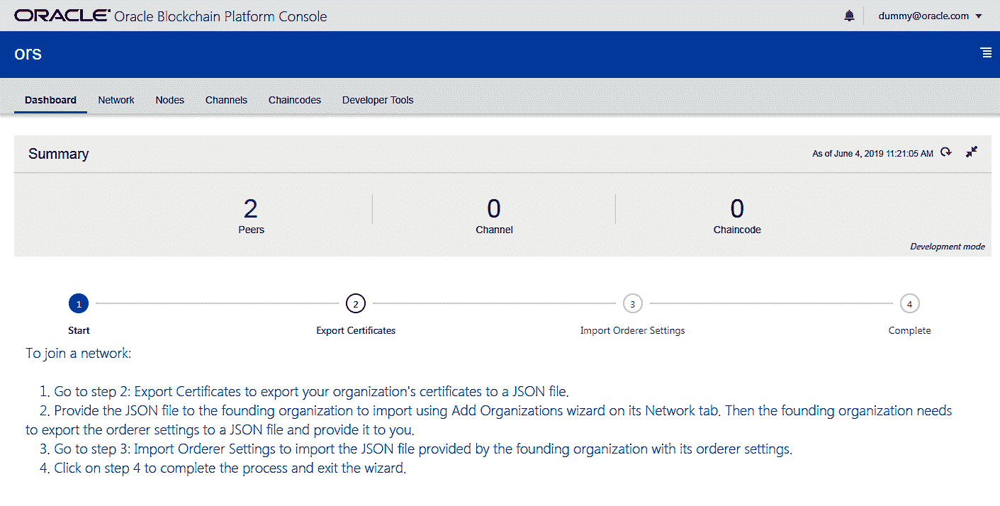
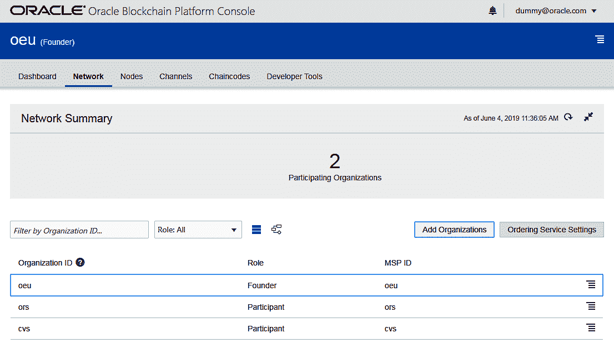
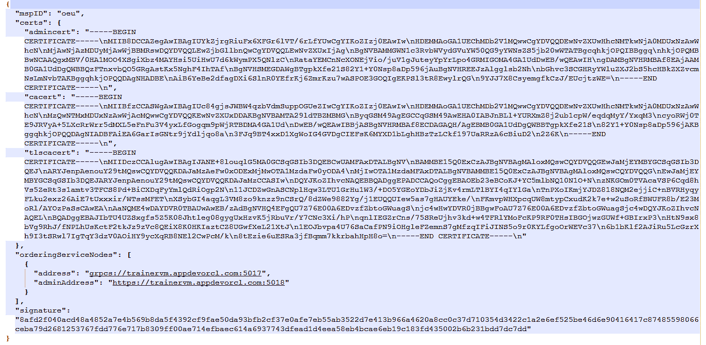
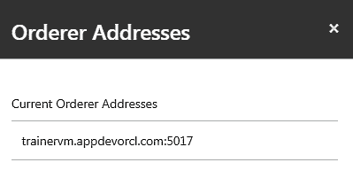
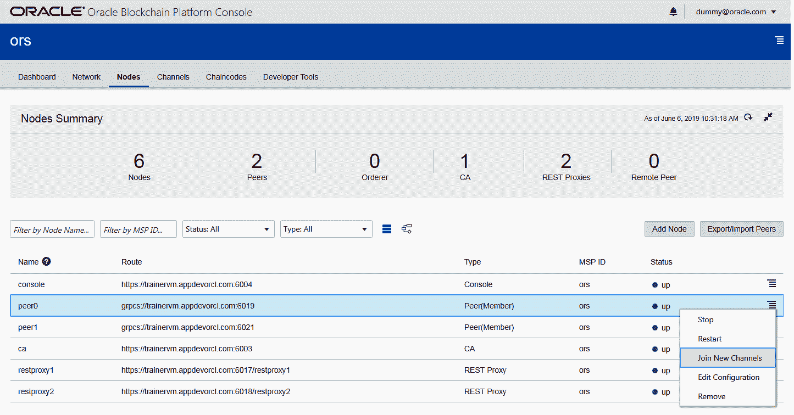
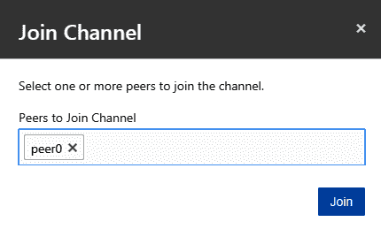
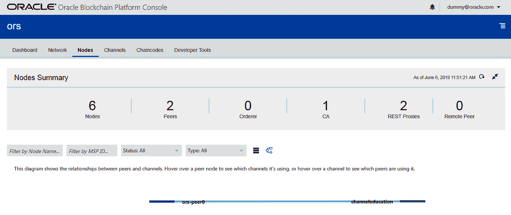

# 在 Oracle 区块链平台上管理解决方案

前一章涵盖了业务场景，并允许我们探索 **Oracle 区块链平台** ( **OBP** )。使用 OBP 管理解决方案轻而易举；它允许你去做实验，而不是阅读关于做的东西，因为它有效地用例子演示了做的过程。这一章提供了关于 OBP 的深入事实，让你在毕业时掌握 OBP 的实用知识。通过本章，您将了解到将网络拓扑转换到 OBP、创建网络利益相关者和配置 OBP 实例的实用性。该知识分类帐说明了如何设置交易基础设施、将参与者加入业务网络、访问控制、将智能(链码)添加到业务网络，以及使用 REST 代理配置将链码暴露给 dApps。在很大程度上，OBP SDK 和 Oracle 云上的 OBP 在功能上是相似的，除了让您创建 OBP 实例的步骤。这两个选项之间的差异并不大，也是不言自明的。本章主要讲述在 OBP 上转换网络拓扑，为 OBP 网络增加业务智能，以及使用管理 REST 界面。

# 将网络拓扑转换到 OBP

本节介绍如何在 OBP 上创建网络实例。如[第四章](4.html)、*在区块链平台*从事商业案例*设计解决方案*部分所述，区块链网络需要以下商业实体:

*   **甲骨文帝国大学** ( **OEU** )作为创始人实体
*   **甲骨文红学** ( **ORS** )和**证书查看者** / **验证者** ( **CVs** )作为参与实体

# 用 OBP 实例创建网络利益相关者

构建 OBP 解决方案的基础步骤包括为涉众实体创建 OBP 实例。执行以下步骤，为用例创建必要的 OBP 实例:

1.  启动并登录 OBP 预配控制台。参见[第四章](4.html)、*在区块链平台*上做业务案例*搭建 OBP SDK* 部分，了解 OBP 置备控制台详情。
2.  登录后，通过填写实例详细信息开始创建 OBP 实例。
3.  下面的屏幕截图显示了创建实例的示例值。请注意以下两点:
    *   只能为创建者实例选择创建者复选框。
    *   为起始端口提供不同 OBP 实例的值。确保这些端口值相距较远，因为 OBP 在内部为起始端口连续分配多个值，如以下屏幕截图所示:

创建实例

4.  一旦我们用例的所有 OBP 实例被创建(并激活)，它们将显示在配置控制台上，如下面的屏幕截图所示:

创建者和参与者实例摘要

5.  单击每个 OBP 实例的上下文菜单，并选择控制台 URL 以导航到相应实例的 OBP 仪表板。我们用例的 OBP 网络创建的后续步骤是通过 OBP 仪表板完成的:

OBP 实例的上下文菜单

由于 **oeu** 是创始人组织，它将拥有比其他参与者 OBP 实例更多的 OBP 系统组件。另外， **oeu** 作为创始人组织，是一个自给自足的组织，所以它在仪表板上也有不同的可视化元素。一旦我们完成了参与者实例的网络设置，我们也将在仪表板上获得类似的可视化效果。

下表给出了 OBP 工件下的默认值:

| **OBP 神器** | **创始人** ( **OEU** ) | **参与者** ( **ORS 或 CVs** ) |
| 引导 | one | 0 |
| 凝视 | 2 | 2 |
| 订购者 | one | 0 |
| 加利福尼亚 | one | one |
| REST 代理 | 2 | 2 |

下面的屏幕截图显示了 **oeu** 仪表板，这是创始人组织(oeu)的仪表板:

OBP 方正仪表板

看一看**或**仪表盘。ors 和 cvs 仪表盘外观相似:

OBP 参与者仪表板

# 配置 OBP 网络基础设施

创建 OBP 实例后，构建 OBP 解决方案的下一步是在这些实例之间建立区块链事务网络。本节将向您介绍连接网络中所有 OBP 例程并启用基础共享分类帐基础结构的步骤。

以下部分列出了这些步骤。

# 导出/导入参与者证书

导出参与者( **ors** 和 **cvs** )组织/实例证书，导入到创始人 OBP 实例中。步骤如下:

1.  导出参与组织证书
2.  将参与组织证书导入创建者组织

第一步是导出参与组织证书。您可以通过以下两种方式之一导出参与者的 OBP 实例证书:

*   **选项 1** :使用仪表板向导，如下截图所示:

OBP 参与者出口证明流程

*   **选项 2** :从 OBP 仪表板网络选项卡下的组织上下文菜单中为参与者( **ors** 和 **cvs** ):

OBP 参与者网络摘要

参与者证书是一个 JSON 文件，它包含 admin、 **c** **认证机构** ( **CA** )和**传输层安全性** ( **TLS** )的证书密钥及其签名。下面的屏幕截图展示了其中一个参与者证书:

OBP 参与者证书快照

第二步是将参与组织证书导入创建组织。按照以下步骤将参与者证书导入创始人组织:

1.  转到 founder dashboard (oeu)以导入这些参与者的证书。这可以通过选择 oeu 页面上网络选项卡下的添加组织选项来实现。下面的屏幕截图描述了这些步骤。
2.  通过导入 ors 和 cv 的参与者证书来添加组织:

导入参与者证书

创建者的“网络”选项卡允许我们导入参与者证书:

方正网络总结

# 订购者配置

建立 OBP 网络的下一步是将订购者配置从创始人导入参与者。

由于订购者与基础结构级别的创建者实例相关联，因此执行这种设置就变得势在必行。它确保由参与对等体提交的任何区块链提议(交易)在最终被写入共享分类帐之前，由同一订购者进行确认以及分类帐块的订购。

以下步骤提供了如何完成订购者配置设置的逐步说明:

1.  使用网络选项卡下的**导出订购者设置**选项，导出方正实例的订购者设置:

导出的有序设置

从技术上讲，OBP 的订购者设置也以 JSON 文件的形式表示和存储，并包含创建者证书、签名和订购者端点。您还将为订购者获得一个类似的 JSON 文件，如下面的屏幕截图所示:

有序设置的 json 文件

2.  将订购者设置导入到每个参与者(ors 和 cv)中，如下面几个屏幕截图所示。
3.  单击 ors 仪表板网络选项卡下的订购者设置导入选项:

有序设置 json 文件

4.  上传从 oeu 导出的订购文件

将有序设置导入参与者

5.  订购者设置导入完成后，您可以选择订购者设置视图选项来验证订购者详细信息。请注意，以下订购者地址实例与从 founder 导出的订购者设置 JSON 文件中的订购者端点相同:

匹配有序设置

# 配置 OBP 交易基础设施

在设置了基本的 OBP 网络基础设施之后，如前一节所述，现在是时候设置 OBP 交易基础设施了。主要是在系统配置中定义共享分类帐，并关联可以读取/写入分类帐的交易方(OBP 例程)。

对于我们的用例，这将涉及与 OEU(创始人)建立一个通道，并将 ORS、CVs 和 OBP 实例添加到同一个通道中。详见[第四章](4.html)、*在区块链平台上从事商业案例*的*网络拓扑*和*渠道*章节。

顾名思义，信道是 OBP 中的逻辑或配置结构，它允许两个或更多的网络利益相关者共享数据。这种数据共享是通过共享分类账完成的。因此，OBP 的每个渠道本质上也代表了与之相关的基础共享分类账。

# 频道设置

让我们继续为用例创建必要的渠道:

1.  转到 oeu 仪表板的渠道选项卡，然后单击创建新渠道。
2.  更新以下字段:
    *   频道名称:提供频道的名称。请记下它，因为你在打电话时会用到它。
    *   选择 ors 和 cvs 实例的复选框。
    *   选择 **oeu** 的一个或多个同行加入渠道，如以下截图所示:

创建频道

一旦通道创建成功，您可以在 oeu 仪表板上看到相应的通知，新创建的通道将显示在现有的**通道**列表中。 **oeu** Channels 选项卡将类似于下面的屏幕截图:

创建渠道摘要

# 将参与者对等体加入通道

在使用 OEU 的 OBP 实例创建了一个通道之后，将参与者 ORS 和 CVS 的对等节点添加到同一个通道中。通过这样做，我们可以确保该通道的各个 OBP 实例的应用程序客户端提交的任何事务都将被对等节点接受，并添加到通道中进行验证、链代码执行和 RWSet 创建。然后，该 RWSet 将提交给订购方，用于分类账块的排序。

您可以通过以下任一选项将参与者的对等方添加到通道:

*   使用“参与者 OBP”控制板的“节点”选项卡下的对等节点的上下文菜单，如以下屏幕截图所示:

节点摘要

*   使用参与者 OBP 控制板的“渠道”选项卡下的渠道上下文菜单，如以下屏幕截图所示:

频道摘要

继续选项 2，您将被要求选择**对等方加入渠道**选项。您可以选择实例的一个或多个对等方加入:

加入渠道

一旦参与对等体加入通道，OBP 实例节点的拓扑视图应该如下面几节中的屏幕截图所示。

# 创建者节点摘要

以下屏幕截图显示了创建者组织的节点摘要:

创建者节点摘要

# 参与者(ors)节点摘要

以下屏幕截图显示了 ors 组织的节点摘要:

参与者节点摘要

# 参与者(cvs)节点摘要

以下屏幕截图显示了另一个参与者(cvs)组织的节点摘要:

参与者节点摘要

此外，验证 OEU、ORS 和 CVs 的网络拓扑视图是否显示了以下屏幕截图所示的可视化效果。

# 方正网络总结

以下截图显示了创始人组织(oeu)的网络概要:

方正网络总结

# 参与者(ors)网络总结

以下屏幕截图显示了其中一个参与组织的网络摘要:

参与者(ors)网络总结

# 参与者(cvs)网络摘要

以下屏幕截图显示了其他参与组织(cvs)的网络概要:

参与者(cvs)网络摘要

# 为 OBP 网络增添智慧

接下来的章节详细介绍了通过链码开发为 OBP 网络增加商业智能，以及向客户端应用程序公开链码功能。下面的部分提供了它的预览。

# 开发链码，为 OBP 网络增添智慧

完成配置 OBP 网络的步骤后，下一组实施包括增加网络的智能性。通常，这意味着添加我们的用例业务逻辑作为智能契约或链码。它处理链码在网络实例的所有节点上的安装和实例化。

本书的下一章涵盖了我们用例的链码和相关网络工件的实现。 [第六章](6.html)，*在甲骨文区块链平台*上开发解决方案，涵盖了用例所需的链码的开发、部署和实例化。关于网络构件设计的更多细节，请参见[第四章](4.html)的*网络构件*部分，*在 Blockchai*n 平台上从事业务案例。

# 通过 REST 代理配置公开链代码

这些配置通常包括向客户端应用程序(如 dApp)公开链码功能的定义。出于顺序连续性的考虑，REST 代理配置的详细信息请参见[第六章](6.html)、*在 Oracle 区块链平台上开发解决方案*的 chaincode 部署部分。

# OBP 的 REST 接口

设置和管理 OBP 网络的所有管理和配置步骤(如前所述)也可以使用 OBP 的 Administration REST 服务来执行。这些服务适用于需要以下内容的情况:

*   减少这些活动的手动模式
*   实施自动化方式(如 DevOps 管道)来设置和管理 OBP 网络
*   以定制的方式表示 OBP 管理信息

这些管理 REST 接口包括与组织、节点、通道和链代码相关的服务。此外，OBP 还提供 OBP 统计休息捆绑服务。

以下是 OBP 政府休息服务的列表:

*   组织 REST 端点:在组织 REST 端点下，以下是服务列表:
    *   获取组织证书
    *   获取组织管理员凭据
    *   获取创始人组织中的订购服务设置
    *   加入一个新组织到一个创始组织
    *   为参与组织设置订购服务
*   节点 REST 端点:在节点 REST 端点下，以下是服务列表:
    *   获取节点列表
    *   获取频道上的对等点列表
    *   获取特定链代码的对等点列表
    *   添加对等节点
    *   启动/停止对等节点
    *   移除对等节点
    *   获取/设置对等节点的属性
    *   将对等机加入频道
    *   导出/导入对等项
    *   开始/停止订购
    *   获取/设置订购者的属性
    *   启动/停止 CA 节点
    *   获取/设置 CA 的属性
    *   开始/停止休息代理
    *   获取/设置 REST 代理的配置

*   通道 REST 端点:在通道 REST 端点下，以下是服务列表:
    *   创建一个频道
    *   获取频道列表
    *   获取 chaincode 的频道列表
    *   获取对等点的频道列表
    *   更新频道配置
    *   获取频道信息
    *   按块 ID 获取分类帐块
    *   按 ID 范围获取块
    *   按时间范围获取块
*   Chaincode REST 端点:在 chaincode REST 端点下，以下是服务列表:
    *   获取已安装链码的列表
    *   获取特定对等体上的链码列表
    *   获取频道上的链码列表
    *   安装链码
    *   实例化链代码
    *   Get chaincode info
*   统计 REST 端点:在统计 REST 端点下，以下是服务列表:
    *   当前存在的信道和每个信道上加入的对等体的列表
    *   指定对等方加入的当前数量和频道列表
    *   指定对等体上已安装的链码的当前数量和列表
    *   指定通道上实例化链码的当前数量
    *   为指定代理或所有代理配置的链码列表
    *   节点健康状态
    *   与节点使用相关的指标(CPU、内存、磁盘使用)
    *   异步调用的总数
    *   可计费交易的数量
    *   块数
    *   提交次数
    *   背书数量
    *   同步调用的总数
    *   对等方或渠道或整个网络的用户事务数量

有关这些服务的更多详细信息，请参考 OBP 文档。

# 摘要

本章主要讲述了尝试 OBP 解决方案的第一组步骤。我们已经介绍了转换 OBP 的网络拓扑、配置 OBP 网络基础设施、配置 OBP 交易基础设施、为 OBP 网络增加业务智能、REST 代理配置以及管理 REST 接口。

下一章探索链码开发，比如语言部分、开发工具和开发环境设置。它还涵盖了 chaincode 从开发到更新的整个生命周期，包括安装、启动、测试和版本控制。它展示了一个完整的链代码，其代码库是用 Go 和 Node.js 构建的。它还说明了认可策略、私有数据收集、通过 shim 和 REST 端点进行的链代码测试，以及使用 SDK、REST 和 events 将客户端应用程序与业务网络集成。