# 在 Oracle 区块链平台上开发解决方案

前一章允许您尝试做，而不是阅读关于做的内容，因为它有效地演示了开发示例。前一章提供了关于**甲骨文区块链平台** ( **OBP** )的深入事实，并讲授了在 OBP 上转换网络拓扑、创建网络利益相关者和配置 OBP 实例的实用性。最后一章深入研究了 chaincode，并涵盖了 chaincode 开发的细节，包括语言部分、开发工具和开发环境设置。本章还关注映射资产模型、操作，以及开发链代码函数和接口。它详细描述了 chaincode 的整个生命周期，从开发到更新，包括安装、启动、测试和版本控制。它还展示了基于 Go 和 Node.js 构建的代码库的完整 chaincode。还展示了认可政策、私有数据集合及其与 chaincode 的协同作用。本章还演示了通过 shim 和 REST 端点进行链代码测试，以及使用 SDK、REST 和 events 将客户端应用程序与业务网络集成。最后，通过链码日志和渠道日志对业务监控进行实验，总结了对链码、交易和渠道的见解。本章涵盖的主题包括设置链代码开发、链代码开发、链代码部署、测试链代码以及将客户端应用程序与区块链集成。

# 设置链码开发

在本节中，您将学习如何为我们在前面章节中使用的大学用例开发 chaincode。

# 选择开发语言(GO、Node.js 或 Java)

编写链码非常需要编程技能。由于区块链有一个分布式账本，所以在最初版本的**Hyperledger Fabric**(**HLF**)中只支持 Go 语言。然而，随着 HLF 的发展，它现在支持多种语言，并计划在未来添加更多语言。从 Fabric 版本开始，它支持用 Go、Node.js 和 Java 编写链代码。为了探究其中的每一个，您可以从 OBP 实例控制台的**开发者工具**选项卡下下载示例。

# OBP 解决方案开发工具

本节为您提供了开发工具和开发环境的详细信息。

# 发展环境

OBP 利用 HLF 作为其基础，因此使用 HLF 文档来帮助编写有效的链代码。所有的链码文件应该打包在一个 ZIP 文件中，并安装在 OBP 上。如果链码是用 Go 语言开发的，并且只有一个文件`.go`，那么打包是可选的。可以在 OBP 上安装一个独立文件。

# 开发工具

HLF 和 OBP 都没有特别推荐的工具。开发人员可以使用任何工具，比如文本编辑器或 NetBeans、VS Code 等 IDE。工具的选择取决于开发人员的兴趣和为链码开发选择的语言。使用 IDE 进行开发总是好的，这样可以避免语法错误，使代码易于阅读，并使开发变得容易。

对于本书中的示例用例，链代码开发是使用 **VS 代码**(T2 Visual Studio 代码的简称)来执行的。VS Code 是微软的源代码编辑器，可用于 Windows、Linux 和 macOS。它包括对开发、调试、版本控制、语法突出显示、智能代码完成和代码重构的支持。

以下是几张 VS 代码中 chaincode 文件的截图，供参考:

*   下面是源代码窗口:


VS 代码源代码窗口

*   需要插件的直接安装:

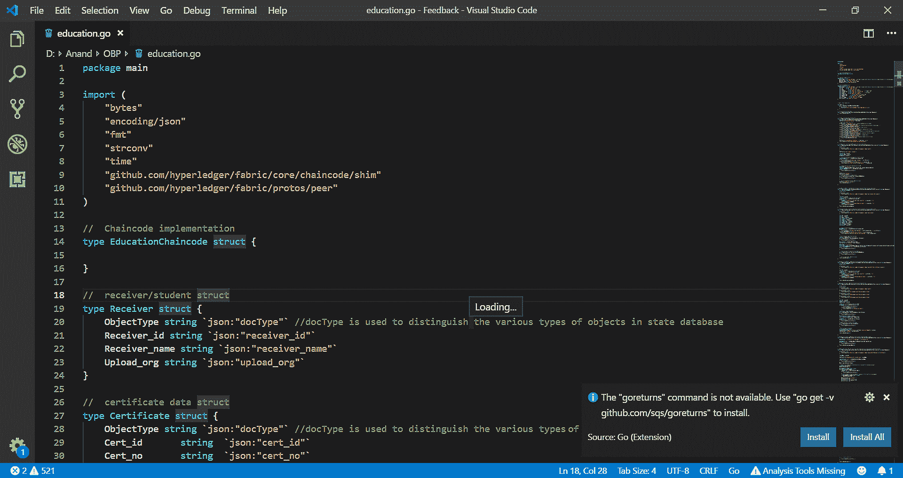

VS 代码插件直接安装

*   有多个插件可安装在所选语言的 VS 代码上:

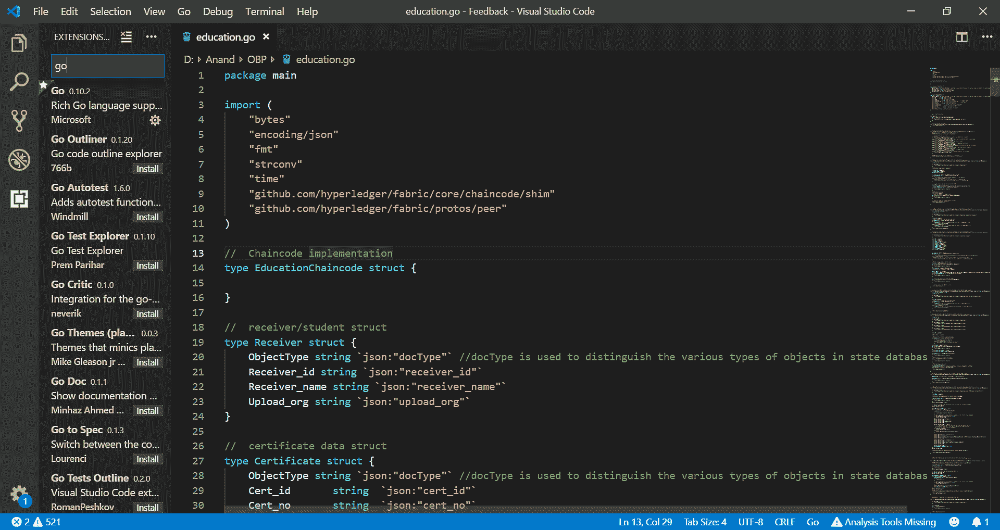

VS 代码:插件

# 映射资产模型

Chaincode 导致在分类帐上创建资产(键值对)，因为 HLF 将资产表示为键值对。资产状态变化被记录为渠道分类账中的交易。有几种方法可以表示资产——以二进制或 JSON 形式。对于本书中的大学用例，定义了两种资产:

*   一个用于学生信息
*   另一个用于生成的证书

本章包括基本资产和链码的创建，以便快速学习开发过程。包含更多的资产和一套全面的操作可能会导致在用例本身的建模上投入时间。稍后，当你对用例做了更多的实验，你可以给它增加更多的复杂性。

使用 Go 语言，以下是这两种资产的定义:

1.  定义证书接收者的资产:

| **参数** | **描述** |
| `assetType` | 资产的类型，例如，接收方 |
| `receiver_id` | 收款人/学生的身份证 |
| `receiver_name` | 接收者/学生的姓名 |
| `upload_org` | 上传证书的组织/部门 |

2.  定义证书的资产:

| **参数** | **描述** |
| `assetType` | 资产的类型，例如证书。 |
| `Cert_id` | 证书的 ID。 |
| `Cert_no` | 证书的编号。 |
| `Cert_name` | 证书的名称。 |
| `Cert_receiver` | 证书的接收者。这将通过给定的`Cert_receiver_id`参数从分类帐中提取。 |
| `Cert_receiver_id` | 该证书分配给的接收者/学生的 ID。 |
| `Cert_issuer` | 证书的颁发者。 |
| `Cert_industry` | 证书所属行业/部门。 |
| `Cert_create_time` | 创建证书的时间。 |
| `Cert_update_time` | 证书更改的时间(如果有任何更改)。 |
| `Cert_remark` | 证书上的备注或评论，如果有的话。 |
| `Cert_url_image` | 证书图像 URL。 |
| `Cert_learning_processing` | 证书学习程序。 |
| `Cert_status` | 证书的状态。 |

Chaincode 是一个软件程序(一组智能合同)或业务逻辑，它定义了一个资产并允许对资产进行修改(也称为状态改变)。任何事务(如 chaincode 所允许的)都会产生一组新的资产键值对，或者修改资产键值对，或者删除资产键值对。

# 映射操作

Chaincode(智能合约)生成分发到网络中每个对等节点的交易。达成一致后，它们将被永久记录在分类账的本地副本中。用户使用客户端应用程序或 dApp 来调用这样的事务(也称为操作)。[第 3 章](3.html)，*深入探究超分类账结构*，详细介绍了交易，并展示了交易流程的示例。请注意，有两种类型的事务—部署事务和调用事务。部署事务创建一个新的链码，并导致在区块链业务网络上安装链码，而调用事务对安装和启动的链码执行操作。

此表集中于调用操作/事务的实现:

| **操作** | **描述** |
| `initReceiver` | 创建证书接收者(学生)的条目 |
| `queryReceiverById` | 通过给定的接收者 ID 获取接收者细节 |
| `insertCertificateInfo` | 为证书创建条目 |
| `queryCertificateBytId` | 通过给定的证书 ID 获取证书详细信息 |
| `getHistoryForRecord` | 获取接收方(学生)信息或证书更改的历史记录 |
| `queryAllCertificates` | 获取所有证书 |
| `approveCertificate` | 更改证书的状态 |
| `del` | 在接收方或证书上标记删除 |

看一看[第 3 章](3.html)、*钻研 Hyperledger Fabric* ，了解更多有趣的方面，比如并发检查、交易类型(比如*分类帐查询*和*分类帐更新*交易)、交易流以及交易中涉及的各种其他组件。

# 揭开链码开发工艺的神秘面纱

使用 HLF，chaincode 必须用以下任何一种语言实现 chaincode 接口:Go、Node.js 或 Java。链代码开发人员可以选择这些编程语言中的任何一种来进行开发。Fabric 的垫片包([github.com/hyperledger/fabric/core/chaincode/shim](https://github.com/hyperledger/fabric/tree/release-1.4/core/chaincode/shim))在链码开发中至关重要。

它支持所有早期的语言。这个包有两个接口，它们在链码中起着关键作用。根据语言的不同，这些接口的语法和它们的方法可能会有所不同，但是它们的目的是相同的。

本质上，当接收到一个事务时，这些链代码接口被调用。首先，当 chaincode 接收到一个事务请求时，调用`Init`方法。这允许应用程序状态的初始化。随后，当收到调用事务时，调用`Invoke`方法来处理任何事务提议。用于修改分类帐的其他接口允许在链码之间调用，包括名为`ChaincodeStubInterface`的链码填充 API。

# 链码接口

Chaincode 接口是必需的，用于实现有两个方法的 chain code:

*   `Init()`:在链码的生命周期中，当链码被实例化或升级时，该方法将仅被调用一次。此方法有助于设置分类账的初始状态，如初始化任何序列号。它期望将`ChaincodeStubInterface`对象作为输入，并返回`peer.Response`对象。

语法:`Init(stub ChaincodeStubInterface)`

*   `Invoke()`:这个方法有助于调用用户事务。您的代码中可能有几个操作，但是当客户端向 chaincode 发送请求时，它只到达`Invoke()`方法，从这里，该方法将分派到相应的事务。这个方法也接受`ChaincodeStubInterface`对象的输入并返回`peer.Response`对象。

语法:`Invoke(stub ChaincodeStubInterface)`

# 链码界面

stub 接口提供了通过对对等方的调用来访问历史和分类帐状态的功能。为每个事务调用`Invoke()`方法，它将函数和参数作为客户端请求的`stub`输入进行传递。这个接口有助于许多功能与分类帐进行交互，并使链码开发变得容易。

# 链码功能

`ChaincodeStub`由`fabric-shim`库实现。它被提供给`ChaincodeInterface`，并封装了链码实现和结构对等体之间的 API。

虽然`stub`有许多功能，但本节列出了其中一些常用的功能:

*   `getFunctionAndParameters() (string, []string)`:该方法有助于从`stub`中获取函数和参数。该方法返回两个值:字符串形式的函数名和字符串数组形式的参数。
*   `getState(key string) ([]byte, error)`:该方法通过给定的键从 state ledger 中获取数据。它不会从尚未提交的分类帐中读取数据。它以字节数组的形式返回数据，如果有错误信息，则返回错误信息。
*   `putState(key string, value []byte) (error)`:这个方法将给定的值作为一个建议放入事务的写集合中。在交易有效并成功提交之前，这不会影响分类帐。这一决定将由订购方做出。分类帐中的所有交易数据都只存储为一个键值对。这个方法有两个参数:key——数据的唯一字符串值，以及 value——要存储在分类帐中的数据的字节数组。如果在执行时有任何错误，此方法将返回 error 参数。同样的方法可以用于*插入*和*更新*。
*   `delState(key string) error`:该方法从分类帐中删除给定键值。由于区块链分类帐中的数据不能永久删除，因此此方法会将数据标记为已删除，而冻结将保留在分类帐中。这个方法的输入是一个键，如果有错误，它将返回一个错误。
*   `getHistoryForKey(key string) (HistoryQueryIteratorInterface, error)`:这是一个只读方法，用于获取分类帐中给定键的已提交交易的历史记录，以及交易 ID 和时间戳。该方法将键作为输入，并返回历史记录和错误(如果有)的迭代器。
*   `getQueryResult(query string) (StateQueryIteratorInterface, error)`:这个方法对状态数据库执行一个`rich`查询。只有支持丰富查询的州数据库才支持它，如 Oracle、ATP 或 ADW。此方法的输入是底层状态数据库的本机语法中的查询字符串。这个方法返回结果的迭代器和错误(如果有的话)。
*   `setEvent(name string, payload []byte) error`:将一个事件设置为包含在事务中的响应建议。不管事务的有效性如何，事件都将在提交的事务块中可用。

除了链代码中早期重要且常用的方法之外，存根还有以下方法:

```
getArgs() [][]byte

getStringArgs() []string

getArgsSlice() ([]byte, error)

getTxID() string

invokeChaincode(chaincodeName string, args [][]byte, channel string) 
pb.Response

getStateByRange(startKey, endKey string) (StateQueryIteratorInterface, error)

getStateByPartialCompositeKey(objectType string, keys []string) (StateQueryIteratorInterface, error)

createCompositeKey(objectType string, attributes []string) (string, error)

splitCompositeKey(compositeKey string) (string, []string, error)

getCreator() ([]byte, error)

getTransient() (map[string][]byte, error)

getBinding() ([]byte, error)

getSignedProposal() (*pb.SignedProposal, error)

getTxTimestamp() (*timestamp.Timestamp, error)
```

# 开发链码

本节介绍 Golang 中的实现。下面的链代码是用 Go 语言开发的，用于上一节中描述的操作/事务，使用上一节的映射资产模型中提到的资产来映射操作。

# Go 中的链码

让我们看看在 Go 语言中的链码开发的用例讨论:

1.  `import`:此部分导入所需的库:

```
import (
  "bytes"
  "encoding/json"
  "fmt"
  "strconv"
  "time"
  "github.com/hyperledger/fabric/core/chaincode/shim"
  "github.com/hyperledger/fabric/protos/peer"
)
```

2.  `type`:这将定义所需的资产结构:

```
// Chaincode implementation
type EducationChaincode struct {

}

// receiver/student struct
type Receiver struct {
  ObjectType string `json:"docType"` //docType is used to distinguish the various types of objects in state database
  Receiver_id string `json:"receiver_id"`
  Receiver_name string `json:"receiver_name"`
  Upload_org string `json:"upload_org"`
}

// certificate data struct
type Certificate struct {
  ObjectType string `json:"docType"` //docType is used to distinguish the various types of objects in state database
  Cert_id string `json:"cert_id"`
  Cert_no string `json:"cert_no"`
  Cert_name string `json:"cert_name"`
  Cert_receiver string `json:"cert_receiver"` // student name
  Cert_receiver_id string `json:"cert_receiver_id"` // student id
  Cert_issuer string `json:"cert_issuer"` // org name
  Cert_industry string `json:"cert_industry"`
  Cert_create_time string `json:"cert_create_time"`
  Cert_update_time string `json:"cert_update_time"`
  Cert_remark string `json:"cert_remark"`
  Cert_url_image string `json:"cert_url_image"`
  Cert_status string `json:"cert_status"`
}
```

3.  `main`:这是开始执行的`main`方法；

```
// main - Start execution
func main() {
  err := shim.Start(new(EducationChaincode))
  if err != nil {
    fmt.Printf("Error starting Xebest Trace chaincode: %s", err)
  }
}
```

4.  `Init`:该方法用于链码实例化时链码的初始化；

```
// Init initializes chaincode
func (t *EducationChaincode) Init(stub shim.ChaincodeStubInterface) peer.Response {
  return shim.Success(nil)
}
```

5.  `Invoke`:该方法用于绕过或执行用户事务；

```
// Invoke - Invoking user transactions
func (t *EducationChaincode) Invoke(stub shim.ChaincodeStubInterface) peer.Response {
  function, args := stub.GetFunctionAndParameters()
  fmt.Println("invoke is running " + function)

  // Handle different functions
  if function == "insertReceiver" { //create a new Receiver or student
    return t.insertReceiver(stub, args)
  } else if function == "queryReceiverById" { // query a receiver by id, stupid name - -!
    return t.queryReceiverById(stub,args)
  } else if function == "insertCertificate" { //insert a cert
    return t.insertCertificate(stub, args)
  } else if function == "queryCertificateById" { // query a certificate
    return t.queryCertificateById(stub, args)
  } else if function == "getRecordHistory"{ //query hisitory of one key for the record
    return t.getRecordHistory(stub,args)
  } else if function == "queryAllCertificates"{ // query all of all students
    return t.queryAllCertificates(stub,args)
  } else if function == "approveCertificate" { // change status
    return t.approveCertificate(stub,args) 
  }else if function == "deleteRecord" { // delete student or certificate
    return t.deleteRecord(stub, args)
  }

  fmt.Println("invoke did not find func: " + function) //error
  return shim.Error("Received unknown function invocation")
}
```

6.  `insertReceiver`:该方法用于在链码状态下创建/插入证书的学生或接收者；

```
// initReceiver - insert a new Receiver into chaincode state
func (t *EducationChaincode) insertReceiver(stub shim.ChaincodeStubInterface, args []string) peer.Response {
  var err error

  if len(args) != 3 {
    return shim.Error("Incorrect number of arguments. Expecting 3")
  }

  fmt.Println("start insert receiver")

  receiver_id := args[0]
  receiver_name := args[1]
  upload_org := args[2]

  // Check if the receiver already exists with the id
  receiverAsBytes, err := stub.GetState(receiver_id)
  if err != nil {
    return shim.Error("Failed to get receiver: " + err.Error())
  } else if receiverAsBytes != nil {
    fmt.Println("This receiver already exists: " + receiver_id)
    return shim.Error("This receiver already exists: " + receiver_id)
  }

  // Create receiver object and marshal to JSON 
  objectType := "receiver"
  receiver := &Receiver{objectType, receiver_id, receiver_name,upload_org}
  receiverJSONasBytes, err := json.Marshal(receiver)
  if err != nil {
    return shim.Error(err.Error())
  }

  fmt.Println("receiver: ")
  fmt.Println(receiver)
  // Save the receiver to ledger state
  err = stub.PutState(receiver_id, receiverJSONasBytes)
  if err != nil {
    return shim.Error(err.Error())
  }

  // receiver saved and indexed. Return success
  fmt.Println("End init receiver")
  return shim.Success(nil)

}
```

7.  `queryReceiverById`:该方法根据给定的 ID 获取接收方记录:

```
// queryReceiverById - read data for the given receiver from the chaincode state
func (t *EducationChaincode) queryReceiverById(stub shim.ChaincodeStubInterface, args []string) peer.Response {
  var recev_id, jsonResp string
  var err error

  if len(args) != 1 {
    return shim.Error("Incorrect number of arguments. Expecting receiver_id to query")
  }

  recev_id = args[0]
  //Read the Receiver from the chaincode state
  valAsbytes, err := stub.GetState(recev_id) 
  if err != nil {
    jsonResp = "{\"Error\":\"Failed to get state for " + recev_id + "\"}"
    return shim.Error(jsonResp)
  } else if valAsbytes == nil {
    jsonResp = "{\"Error\":\"receiver does not exist: " + recev_id + "\"}"
    return shim.Error(jsonResp)
  } 
  return shim.Success(valAsbytes)
}
```

8.  `insertCertificate`:该方法用于在台账状态中插入新的凭证信息；

```
// insertCertificate - insert a new certificate information into the ledger state
func (t *EducationChaincode) insertCertificate(stub shim.ChaincodeStubInterface, args []string) peer.Response {

  if len(args) != 11 {
    return shim.Error("Incorrect number of arguments. expecting 11 args")
  }

  cert_id := args[0]
  cert_no := args[1]
  cert_name := args[2] 
  cert_receiver_id := args[3]
  cert_issuer := args[4]
  cert_industry := args[5]
  cert_create_time := args[6]
  cert_update_time := args[7]
  cert_remark := args[8]
  cert_url_image := args[9]
  cert_status := args[10]

  // check if receiver exists
  ReceAsBytes, err := stub.GetState(cert_receiver_id)
  if err != nil {
    return shim.Error("Failed to get Receiver:" + cert_receiver_id + "," + err.Error())
  } else if ReceAsBytes == nil {
    fmt.Println("Receiver does not exist with id: " + cert_receiver_id )
    return shim.Error("Receiver does not exist with id: " + cert_receiver_id )
  }

  //Fetch receiver name from the state
  receiver := &Receiver{}
  err = json.Unmarshal([]byte(ReceAsBytes), &receiver)
  if err != nil {
    return shim.Error(err.Error())
  }
  cert_receiver :=receiver.Receiver_name;
  fmt.Println("cert_receiver: "+cert_receiver)

  objectType := "certificate"
  certificate := &Certificate{objectType,cert_id,cert_no,cert_name,cert_receiver,cert_receiver_id,cert_issuer,cert_industry,cert_create_time,cert_update_time,cert_remark,cert_url_image,cert_status}
  certificateJSONasBytes, err := json.Marshal(certificate)
  if err != nil {
    return shim.Error(err.Error())
  }

  // insert the certificate into the ledger
  err = stub.PutState(cert_id, certificateJSONasBytes)
  if err != nil {
    return shim.Error(err.Error())
  }

  // certificate saved - Return success 
  return shim.Success(nil)
}
```

9.  `queryCertificateById`:该方法根据给定的证书 ID 从分类帐状态中提取证书详细信息:

```
// queryCertificateById - read a certificate by given id from the ledger state
func (t *EducationChaincode) queryCertificateById(stub shim.ChaincodeStubInterface, args []string) peer.Response {
  var cert_id, jsonResp string
  var err error

  if len(args) != 1 {
    return shim.Error("Incorrect number of arguments. Expecting id of the certificate to query")
  }

  cert_id = args[0]
  //Read the certificate from chaincode state
  valAsbytes, err := stub.GetState(cert_id) 
  if err != nil {
    jsonResp = "{\"Error\":\"Failed to get state for " + cert_id + "\"}"
    return shim.Error(jsonResp)
  } else if valAsbytes == nil {
    jsonResp = "{\"Error\":\"certificate does not exist: " + cert_id + "\"}"
    return shim.Error(jsonResp)
  }

  return shim.Success(valAsbytes)
}
```

10.  `approveCertificate`:该方法用于授权机构批准证书；

```
// approveCertificate - approve the certificate by authority
func (t *EducationChaincode) approveCertificate(stub shim.ChaincodeStubInterface, args []string) peer.Response {

  var err error
  // check args
  if len(args) != 3 {
    return shim.Error("Incorrect number of arguments. Expecting 3")
  }
  if len(args[0]) <= 0 {
    return shim.Error("1st argument must be a non-empty string")
  }
  if len(args[1]) <= 0 {
    return shim.Error("2nd argument must be a non-empty string")
  }
  if len(args[2]) <= 0 {
    return shim.Error("3rd argument must be a non-empty string")
  }

  cert_id := args[0]
  status := args[1]
  update_time := args[2]

  //Read certificate details from the ledger
  valAsbytes, err := stub.GetState(cert_id) 
    if err != nil {
      return shim.Error(err.Error())
    } else if valAsbytes == nil {
      return shim.Error("certificate not exist")
    }

  certificate := &Certificate{}
  err = json.Unmarshal([]byte(valAsbytes), &certificate)
  if err != nil {
    return shim.Error(err.Error())
  }
  certificate.Cert_status = status
  certificate.Cert_update_time = update_time

  valAsbytes, err = json.Marshal(certificate)
  if err != nil {
    return shim.Error(err.Error())
  }
  //Update the certificate in the ledger
  err = stub.PutState(cert_id, valAsbytes)
  if err != nil {
    return shim.Error(err.Error())
  }

  return shim.Success(nil)
}
```

11.  `queryAllCertificates`:该方法用于查询总账状态下的所有证书；

```
// queryAllCertificates - Query all certificates from the ledger state
func (t *EducationChaincode) queryAllCertificates(stub shim.ChaincodeStubInterface, args []string) peer.Response {

  queryString := "{\"selector\":{\"docType\":\"certificate\"}}"

  queryResults, err := getQueryResultForQueryString(stub, queryString)
  if err != nil {
    return shim.Error(err.Error())
  }
  return shim.Success(queryResults)
}
```

12.  `getRecordHistory`:该方法获取记录中给定键的历史状态转换:

```
// getRecordHistory - Fetches the historical state transitions for a given key of a record
func (t *EducationChaincode) getRecordHistory(stub shim.ChaincodeStubInterface, args []string) peer.Response {

  if len(args) < 1 {
    return shim.Error("Incorrect number of arguments. Expecting an id of Receiver or Certificate")
  }

  recordKey := args[0]

  fmt.Printf("Fetching history for record: %s\n", recordKey)

  resultsIterator, err := stub.GetHistoryForKey(recordKey)
  if err != nil {
    return shim.Error(err.Error())
  }
  defer resultsIterator.Close()

  // buffer is a JSON array containing historic values for the key/value pair
  var buffer bytes.Buffer
  buffer.WriteString("[")

  bArrayMemberAlreadyWritten := false
  for resultsIterator.HasNext() {
    response, err := resultsIterator.Next()
    if err != nil {
      return shim.Error(err.Error())
    }
    // Add a comma before array members, suppress it for the first array member
    if bArrayMemberAlreadyWritten == true {
      buffer.WriteString(",")
    }
    buffer.WriteString("{\"TxId\":")
    buffer.WriteString("\"")
    buffer.WriteString(response.TxId)
    buffer.WriteString("\"")

    buffer.WriteString(", \"Value\":")
    // if it was a delete operation on given key, then we need to set the
    //corresponding value null. Else, we will write the response.Value
    //as-is (as the Value itself a JSON goods)
    if response.IsDelete {
      buffer.WriteString("null")
    } else {
      buffer.WriteString(string(response.Value))
    }

    buffer.WriteString(", \"Timestamp\":")
    buffer.WriteString("\"")
    buffer.WriteString(time.Unix(response.Timestamp.Seconds, int64(response.Timestamp.Nanos)).String())
    buffer.WriteString("\"")

    buffer.WriteString(", \"IsDelete\":")
    buffer.WriteString("\"")
    buffer.WriteString(strconv.FormatBool(response.IsDelete))
    buffer.WriteString("\"")

    buffer.WriteString("}")
    bArrayMemberAlreadyWritten = true
  }
  buffer.WriteString("]")

  fmt.Printf("Result of getHistoryForRecord :\n%s\n", buffer.String())

  return shim.Success(buffer.Bytes())
}
```

13.  `getQueryResultForQueryString`:如果需要，该方法执行给定的`rich`查询总账状态:

```
// getQueryResultForQueryString executes the passed in query string.
// Result set is built and returned as a byte array containing the JSON results.

func getQueryResultForQueryString(stub shim.ChaincodeStubInterface, queryString string) ([]byte, error) {

  fmt.Printf("getQueryResultForQueryString queryString:\n%s\n", queryString)

  resultsIterator, err := stub.GetQueryResult(queryString)
  if err != nil {
    return nil, err
  }
  defer resultsIterator.Close()

  // buffer is a JSON array containing QueryRecords
  var buffer bytes.Buffer
  buffer.WriteString("[")

  bArrayMemberAlreadyWritten := false
  for resultsIterator.HasNext() {
    queryResponse, err := resultsIterator.Next()
    if err != nil {
      return nil, err
    }
    // Add a comma before array members, suppress it for the first array member
    if bArrayMemberAlreadyWritten == true {
      buffer.WriteString(",")
    }
    buffer.WriteString(string(queryResponse.Value))
    bArrayMemberAlreadyWritten = true
  }
  buffer.WriteString("]")

  fmt.Printf("getQueryResultForQueryString queryResult:\n%s\n", buffer.String())

  return buffer.Bytes(), nil
}
```

14.  `deleteRecord`:该方法将标记被给定键删除的记录:

```
// deleteRecord - Mark the record deleted by given key

func (t *EducationChaincode) deleteRecord(stub shim.ChaincodeStubInterface, args []string) peer.Response {

  if len(args) != 1{
    return shim.Error("Incorrect number of arguments. Expecting 1")
  }

  id := args[0]
  err := stub.DelState(id)
  if err != nil {
    return shim.Error(err.Error())
  }

  return shim.Success(nil)
}
```

前面的链码也可以从本书引用的 GitHub 库下载。文件名是`education.go`。

# Node.js 中的链码

让我们看看在 Node.js 中开发 chaincode 的过程:

*   使用`fabric-shim`包创建一个 Node.js 文件
*   用 Node.js 文件的细节和依赖项(如果有的话)创建一个`package.json`文件
*   将所有文件打包到一个 ZIP 文件中，包括`package.json`、主 Node.js 文件以及其他 JavaScript 或配置文件或依赖项(如果有的话)
*   在 OBP**链码**标签下部署包(参见*链码部署*章节)

注意:您只需要创建一个`package.json`文件；没有必要运行`npm`命令来安装`node_modules`，因为 OBP 会在内部为你做这件事。

名为`education.js`的样本 Node.js 文件。

使用`fabric-shim`包创建一个 Node.js 文件:

```
const shim = require('fabric-shim');
const Chaincode = class {
    async Init(stub) {
        return shim.success();
    }
    async Invoke(stub) {
        let ret = stub.getFunctionAndParameters();
        let method = this[ret.fcn];
        console.log("Inside invoke. Calling method: " + ret.fcn);
        if (!method) {
            shim.error(Buffer.from('Received unknown function ' + ret.fcn + ' invocation'));
        }
        try {
            let payload = await method(stub, ret.params);
            return shim.success(payload);
        } catch (err) {
            console.log(err);
            return shim.error(err);
        }
    }

    //Method to save or update a user review to a product

    async insertReceiver(stub, args) {
        console.log("inside insertReceiver: " + JSON.stringify(args));
        if (args.length != 3) {
            throw 'Incorrect number of arguments. Expecting ID,Name and Org.';
        }
        var receiver = {};
                             receiver.ObjectType = "receiver";
        receiver.Receiver_id = args[0];
        receiver.Receiver_name = args[1];
        receiver.Upload_org = args[2];
        await stub.putState(receiver.Receiver_id, Buffer.from(JSON.stringify(receiver)));
    }//End of method
}

shim.start(new Chaincode());
```

名为`package.json`的示例 JSON 文件。

用 Node.js 文件的细节和依赖项(如果有的话)创建一个`package.json`文件:

```
{
  "name": "education",
  "version": "1.0.0",
  "description": "Chaincode implemented in node.js",
  "engines": {
    "node": ">=8.9.0",
    "npm": ">=5.5.0"
  }, 
  "scripts": { 
    "start" : "node education.js"
  },
  "engine-strict": true,
  "license": "Apache-2.0",
  "dependencies": { 
    "fabric-shim": "~1.3.0"
  } 
}
```

这个带有`package.json`文件的 Node.js 示例代码可以从本书引用的 GitHub 存储库中下载。

# 向链码添加事件

Chaincode 还可以发布事件来通知订阅应用程序处理进一步的客户端操作。例如，在采购订单、发票和交货记录通过链码匹配后，it 可以发布一个事件，以便订阅应用程序可以处理相关的付款并更新内部 ERP 系统。

OBP 支持以下类型的事件，可以通过 REST 代理订阅这些事件:

*   `transaction`:交易 ID 的事件
*   `txOnChannel`:通道上每个新交易的事件
*   `txOnNetwork`:整个网络中每个新交易的事件
*   `blockOnChannel`:特定通道上每个块的事件
*   `blockOnNetwork`:在整个网络中创建新块的事件
*   `chaincodeEvent`:链码逻辑发出的自定义事件

# 发布事件

在这里，我们将看到如何从 chaincode 触发事件。使用`ChaincodeStubInterface`的`SetEvent()`方法，事件可以由 chaincode 触发。在`approveCertificate()`方法中添加以下代码，以便在证书状态更改后发出事件:

```
var testEventValue []byte

testEventValue=[]byte("Certificate "+cert_id+" status is changed to "+status)

stub.SetEvent("testEvent",testEventValue)
```

# 订阅事件

可以通过 REST 代理或 HLF SDKs 订阅事件。以下是通过 REST 代理订阅的过程:

*   休息终点:`<host name>:<port>/<REST proxy>/bcsgw/rest/v1/event/subscribe`
*   休息方式:`POST`
*   标题:
    *   **内容类型** : `application/json`
    *   **授权** : `<Basic authorization>`
    *   **接受字符集** : `UTF-8`:


*   要传递给 REST API 的 JSON 输入:

```
{
  "requests":[
  {
    "eventType":"chaincodeEvent",
    "callbackURL": "--- call back webhook url---",
    "callbackTlsCerts":{
      "caCert":" -- mandatory field which is the callback server's CA certificate in PEM format. It will be verified by REST proxy",
      "clientCert": "--Optional field which refers to the REST proxy certificate should use during callback --",
      "keyPassword": "--clientCert's encrypted private key in base64 encoded"
    },
    "expires": "1m",
    "channel": "channeleducation",
    "chaincode": "cceducation",
    "eventName": "testEvent"
  }
  ]
}
```

*   它以`subid`回应。

# 取消订阅事件

事件也可以取消订阅。为此，请遵循与订阅相同的过程，但要替换端点和输入，如下所示:

*   休息终点:`<host name>:<port>/<REST proxy>/bcsgw/rest/v1/event/unsubscribe`
*   JSON 输入:

```
{

    "request":{

    "subid": "---subscription id received---"
  }

}
```

# 链码部署

链码部署是一个多步骤的过程。它包括链码部署(快速或高级方法)、链码实例化、在 REST 代理中启用链码以及升级链码。在 OBP 上部署链码的先决条件包括拥有对 OBP 实例的管理访问权限，以部署链码。Chaincode 可以由渠道的创建者或参与者从任何实例安装和实例化。一旦它被实例化，通道的其他实例只需要安装 chaincode。实例化将自动应用于这些实例。在这一节中，我们将从 founder 实例部署 chaincode。

# 正在部署链代码

OBP 提供了两种不同的部署选项。一步链码部署的快速部署选项和高级部署选项。对于链代码测试，建议使用快速启动部署选项，而高级部署选项允许您指定各种高级部署设置，如选择将安装链代码的对等机、要使用的认可策略等。本节展示了这两种部署选项。

以下是部署链码的步骤:

1.  导航到**链码**选项卡:


链码部署

2.  点击**部署新链码**按钮。将打开以下屏幕，其中有两个部署选项:


链码部署选项

3.  **快速部署**:一步链码部署选项使用默认设置，并在选定的 REST 代理中启用。然而，我们将使用**高级部署**选项来部署我们的链码。以下是**快速部署**的画面供您参考:

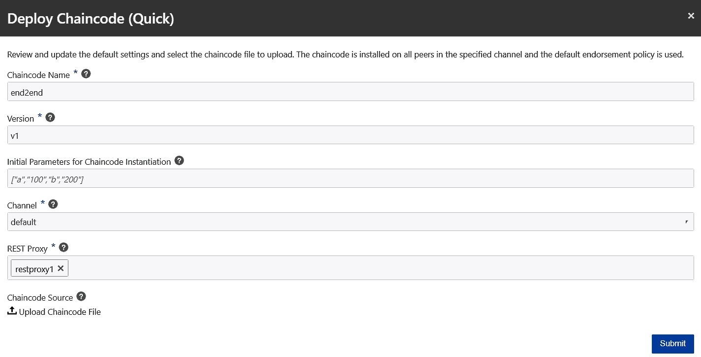

快速链码部署

4.  **高级部署**提供了一个多步骤向导来为 chaincode 安装、实例化和启用 REST 代理。从**部署链码**菜单中选择该选项。将会打开分步向导，接下来是第一步，您可以在其中提供链代码的详细信息，例如链代码名称、版本、应该部署链代码的目标对等体，以及实际的链代码包。(如果它是一个单独的`.go`文件，那么就不需要包。可以选择单个文件，但是如果它有多个文件或者代码是用 Node.js 或 Java 编写的，那么将所有文件打包到一个 ZIP 文件中。)填写下面截图中显示的字段，点击下一个的**。请记住，安装链码后，这些值都不能更改:**

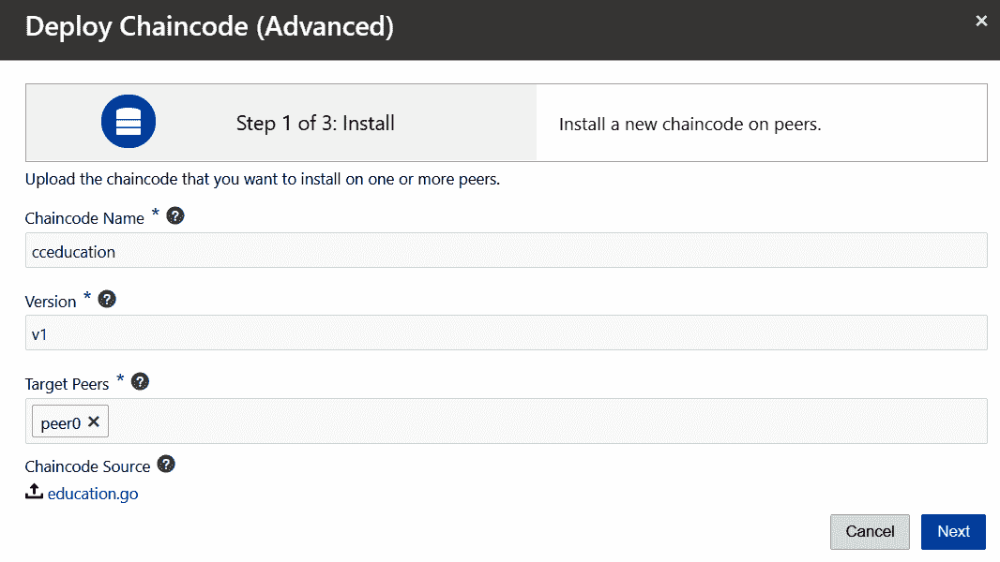

详细信息页面

5.  当**安装**过程成功后，向导会显示步骤 2，即**实例化**。对于每个版本，每个通道仅实例化一次链码。在这一步中，您指定应该将链码应用到哪个通道；同行参与；初始参数数组(如果有的话)将被传递给 chaincode 中的`Init()`方法；背书政策(如果有)(有关背书政策的详细信息，请参见下一节)。和私有数据收集(详见下一节)。填写如下表格，点击**下一步**；可能需要一段时间才能进入下一步:


提前链码部署

6.  成功实例化 chaincode 后，向导将显示步骤 3，即在 REST 代理中启用 chaincode。OBP 提供了多个 REST 代理。您可以选择多个 REST 代理来启用链码。填写如下字段，点击下一个的**:**


REST 代理

7.  完成向导中的所有步骤后，您将最终看到这个成功屏幕。点击**关闭**:


部署完成消息

8.  到目前为止，您已经在 founder 实例中部署了 chaincode。您需要在所有参与者实例中部署链代码。重复我们刚才看到的部署过程；然而，您只需要部署 chain code——实例化将自动应用，因为它是从通道的创建者处完成的。因此，在**高级部署**向导中，步骤 1 安装完成后，在步骤 2 屏幕中，点击**关闭**按钮。

9.  转到**频道**选项卡。你会发现链码被实例化了。看看下面的参考文献。

以下是链码安装前的通道:


链码安装前的频道

以下截图是 chaincode 安装后的频道:

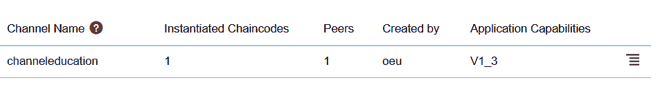

链码安装后的频道

一个通道上可以安装多个链码。此外，一个链码可以在多个 REST 代理上启用。

# 更新链码

HLF 支持链码版本控制和升级。当需要更改智能合同、更改业务逻辑或需要对链码进行任何更改时，可以更新链码。链码可以升级到新版本，只要你保持相同的链码名称，否则它将被视为不同的链码。

更新是区块链网络上的一个事务，它导致新版本的链码与信道的绑定。旧版的 chaincode 会怎么样？绑定到先前(旧)版本链码的所有其他通道可以继续执行旧版本。您向渠道提交链码*升级*交易。因此，只有一个通道受到影响，您已经在该通道上执行了升级事务。不执行升级事务的所有其他通道将继续运行旧版本。当调用 chaincode 时，总是只执行最新的实例化版本。

更新链码的步骤如下:

1.  转到**链码**选项卡。
2.  为链码选择**更多动作**下的**升级**选项。将会打开一个多步骤向导。
3.  在**第 1 步，共 2 步:选择版本**，选择目标对等体，浏览链码源码包。然后点击**下一个**:

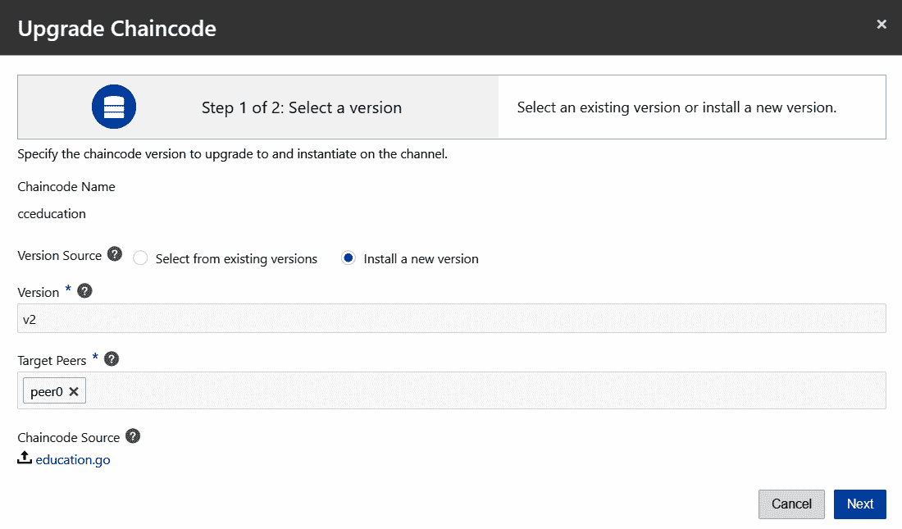

升级链码—选择版本

4.  在**第 2 步(共 2 步):升级**中，提供渠道名称、对等方、初始参数(如果有)和认可政策(如果有)。点击**下一个**:

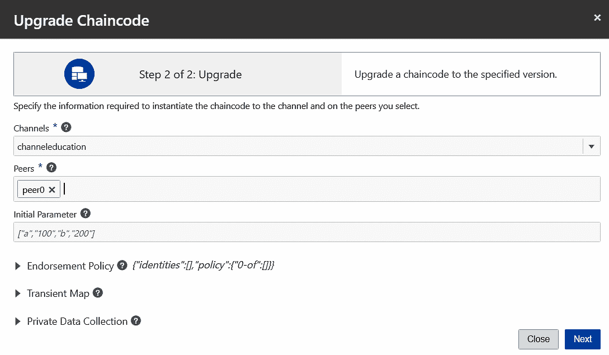

升级链代码—实例化信息

5.  链码升级成功后，您将看到以下屏幕。点击**关闭**，对其他参与者重复相同的程序:

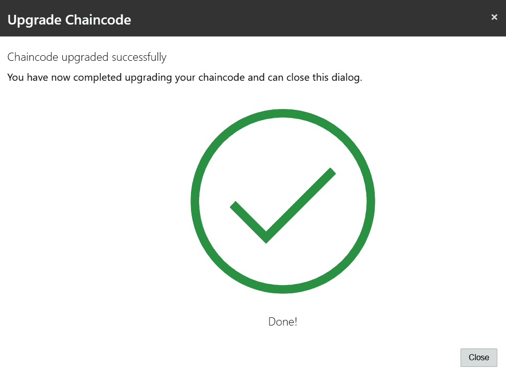

链码升级

# 背书政策

背书政策规定了在将链码交易添加到块并提交到分类帐之前，必须正确批准或背书链码交易的同级组织。您可以在实例化 chaincode 时在 OBP 添加背书策略，这是 chaincode 部署流程中的第 2 步。背书保证了交易的合法性。如果未指定认可策略，则使用默认认可策略，即从网络上的任何对等方获得认可。

组织的签署对等方必须对通道具有读写权限。处理交易时，每个签署方返回一个读写集，然后客户端将这些签署方与他们的签名捆绑在一起，并将所有内容发送到订购服务，订购服务将交易订购并提交到块中，然后提交到分类帐。

在下面的屏幕截图中，您可以看到实例化 chaincode 时的背书策略配置。您可以在“签署人”字段中简单地指定参与签署的人数，或者通过选择“高级”,您也可以通过表达式来指定。在我们的用例中，我们使用默认的背书策略:


背书政策

# 私人数据收集

OBP 版本 19.1.3 及更高版本具有一项功能，用于指定认可、提交或查询通道上的私有数据的组织子集，即私有数据集合。如果您希望通道上的一组组织共享数据并防止通道上的其他组织看到数据，私有数据收集非常有用。实例化 chaincode 时，可以关联一个或多个私有数据集合，如下所示。此外，您应该指定一个临时映射来将私有数据从客户端传递到对等端进行认可。

以下截图显示了链码实例化时的**私有数据收集**:


# 测试链码

链码可以在本地测试，不需要安装在 OBP 上。测试 chaincode 有两种方法:使用 mock shim 和使用 REST 端点。

# 使用垫片测试链码

让我们看看如何测试早期在 Go 语言中本地开发的 chaincode。在此之前，有一些要点需要注意:

*   在你的机器上本地安装 Go 语言。
*   该测试文件名应该采用以下形式:`<Go file name>_test.go`。

例如:如果链码名是`education.go`，那么这个测试文件名应该是`education_test.go`。

*   将两个文件保存在同一个文件夹中。
*   将`GOPATH`设置到文件夹。
*   如果找不到链代码中使用的依赖包，请安装它们。

比如:`go get github.com/hyperledger/fabric/protos/peer`
`go get github.com/hyperledger/fabric/core/chaincode/shim`。C

*   GIT 存储库中的代码片段文件`education_test.go`([https://github . com/packt publishing/Oracle-block chain-Quick-Start-Guide](https://github.com/PacktPublishing/Oracle-Blockchain-Quick-Start-Guide))是一个测试用例，只解释了一个方法:`initReceiver()`。类似地，您可以为所有其他方法编写测试用例。
*   每个测试用例都应该有前缀`Test<function name>`。
    比如:`TestInitReceiver`。
*   测试用例准备好之后，使用下面的命令测试它们:

`go test -run <<function name>>`

比如:`go test -run Education`。

这里，`Education`是测试用例名称。

为了测试一个函数，使用`NewMockStub()`创建一个存根。存根有一个`MockInvoke()`函数，它调用 chaincode 的一个实际函数。

比如`stub.MockInvoke("001",[][]byte{[]byte("insertReceiver "), []byte(key),[]byte("Anand Yerrapati"), []byte("Blockchain")})`。

这里，`001`是测试成功时返回的交易 ID，`insertReceiver`是在`education.go`文件中调用的函数。剩下的是要传递给`insertReceiver`函数的参数。

请参考 GIT 资源库“https://github . com/packt publishing/Oracle-block chain-Quick-Start-Guide-”中的文件“education_test.go”。

用于测试链码(education.go)的测试文件名是测试文件“education_test.go”。本节引用该文件来测试使用 shim 的链码。

从插入接收者、查询接收者、插入证书、验证证书、批准证书、再次查询证书，到验证变更，这个测试用例被合并成一个流程。以下是执行`go test -run Education`命令后早期测试案例的结果:

```
D:\Anand\OBP\chaincode\testing\go>go test -run Education
 Inside TestEducation
 invoke is running insertReceiver
 start insert receiver
 receiver:
 &{receiver std1231 Anand Y Blockchain}
 End init receiver
 Result insertReceiver:
 {200 [] {} [] 0}
 invoke is running queryReceiverById
 Result queryReceiverById:
 &{receiver std1231 Anand Y Blockchain}
 invoke is running insertCertificate
 cert_receiver: Anand Y
 {200 [] {} [] 0}
 Result insertCertificate:
 {200 [] {} [] 0}
 invoke is running queryCertificateById
 Result queryCertificateById:
 &{certificate cert123 12345 ORU Blockchain Certificate Anand Y std1231 ORU IT 06/04/2019 06/04/2019 Blockchain course completed Active}
 invoke is running approveCertificate
 {200 [] {} [] 0}
 Result approveCertificate:
 {200 [] {} [] 0}
 invoke is running queryCertificateById
 Result queryCertificateById:
 &{certificate cert123 12345 ORU Blockchain Certificate Anand Y std1231 ORU IT 06/04/2019 06/04/2019 10:41:50 Blockchain course completed Approved}
 PASS
 ok _/D_/Anand/OBP/chaincode/testing/go 3.921s
```

模拟存根并不支持每一个函数。你不能实现`GetQueryResult`和`GetHistoryForKey`方法。

# 从 REST 端点测试链代码

OBP 提供了一个 REST 代理来通过 REST 端点连接 chaincode。无论您希望通过 REST 服务执行哪个链代码，都应该在相应的 REST 代理上进行配置。这种配置可以在本章的*C*T2】hain code 部署一节中看到。在本节中，我们将看到如何调用 REST 端点，如何连接到所需的函数，以及如何传递参数。

有两个可用的 REST 端点:

*   **查询**:执行任意功能查询总账数据:

语法:`<host name>:<port>/<restproxy>/bcsgw/rest/v1/transaction/query`

*   **调用**:执行任何功能，将数据保存到账本或从账本中查询数据。也可以从这个端点进行查询，但是，获取和返回数据的执行会很慢。因此，在从分类帐中提取数据时，建议使用查询端点:

语法:`<host name>:<port>/<restproxy>/bcsgw/rest/v1/transaction/invocation`

对于这两个端点，请求输入是相同的，都是 JSON 请求，下面是 JSON 请求的典型结构:

```
{
"channel":<channel name>,
"chaincode":<chaincode name>,
"method": <method name>,
"args":[<arguments separated by comma>]
}
```

在一个 REST 代理中可以配置多个链码。因此，输入 JSON 中的**通道**和**链码**参数有助于将请求分派给相应的链码。两个端点都是 **POST** 呼叫。在每个调用中都应该传递两个头，即**授权**和**内容类型**。

我们使用的是 OBP SDK，它有一个默认的用户名和密码:`customertenant@oracle.com/`和`Welcome1`。

标题应如下所示:

*   **授权** : `Basic Y3VzdG9tZXJ0ZW5hbnRAb3JhY2xlLmNvbTpXZWxjb21lMSA=`
*   **内容类型** : `application/json`
*   **目标终点** : `https://<host name>:<port>/<restproxy>/bcsgw/rest/v1/transaction/<invocation or query>`

这些是测试来自 Postman 的早期 chaincode 的引用(您可以使用这里的任何 REST 客户端进行测试)。以下是目标端点调用输入-

*   目标端点–插入接收者的调用:

    *   目标端点:`/invocation`
    *   目标方法:`insertReceiver`
    *   输入 JSON: `{"channel":"channeleducation","chaincode":"cceducation","method":"insertReceiver","args":["std123", "Anand Yerrapati", "Blockchain"]}`


*   目标端点—按接收者 ID 查询的查询:
    *   目标端点:`/query`
    *   目标方法:`queryReceiverById`
    *   输入 JSON: `{"channel":"channeleducation","chaincode":"cceducation","method":"queryReceiverById","args":["std123"]}`

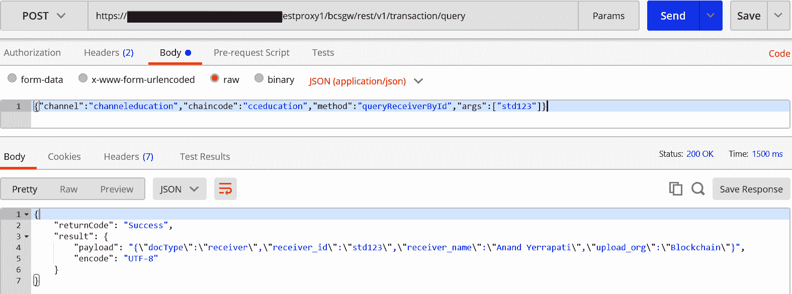

*   目标端点–调用以插入证书:
    *   目标端点:`/invocation`
    *   目标方法:`insertCertificate`
    *   输入 JSON: `{"channel":"channeleducation","chaincode":"cceducation","method":"insertCertificate","args":["cert1234","1234","ORU Blockchain Certificate","std123","ORU","IT","6/5/2019","","Blockchain Course Completed","","","Issued"]}`


*   目标端点–通过 ID 查询证书的调用:
    *   目标端点:`/query`
    *   目标方法:`queryCertificateById`
    *   输入 JSON: `{"channel":"channeleducation","chaincode":"cceducation","method":"queryCertificateById","args":["cert1234"]}`

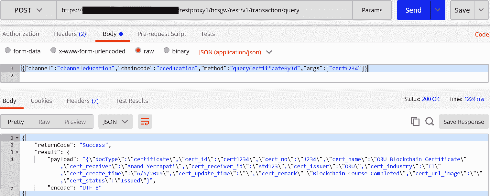

*   目标端点–调用以批准证书:
    *   目标端点:`/invocation`
    *   目标方法:`approveCertificate`
    *   输入 JSON: `{"channel":"channeleducation","chaincode":"cceducation","method":"approveCertificate","args":["cert1234","Approved","6/5/2019 05:04:45 PM"]}`


*   目标端点–通过 ID 查询证书的调用:
    *   目标端点:`/query`
    *   目标方法:`queryCertificateById`
    *   输入 JSON: `{"channel":"channeleducation","chaincode":"cceducation","method":"queryCertificateById","args":["cert1234"]}`

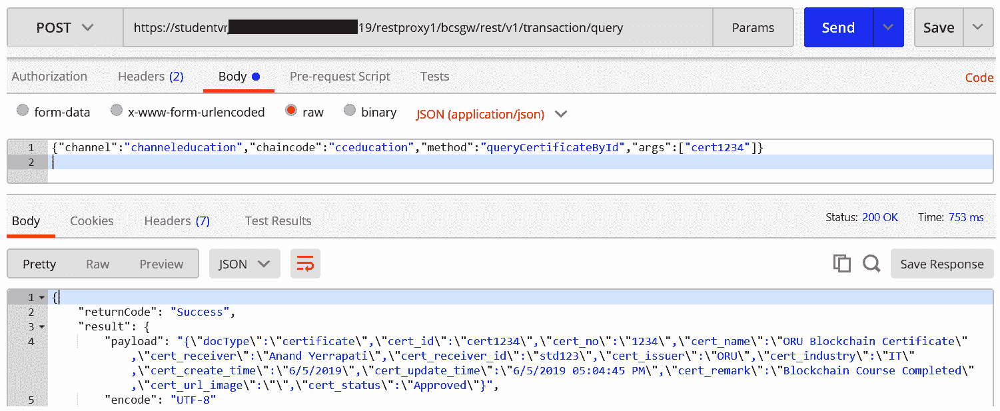

*   目标端点–查询所有证书的调用:
    *   目标端点:`/query`
    *   目标方法:``queryAllCertificates``
    *   输入 JSON: `{"channel":"channeleducation","chaincode":"cceducation","method":"queryAllCertificates","args":[]}`


*   目标端点–调用查询端点以获取记录历史:
    *   目标端点:`/query`
    *   目标方法:`getRecordHistory`
    *   输入 JSON: `{"channel":"channeleducation","chaincode":"cceducation","method":"getRecordHistory","args":["cert1234"]}`

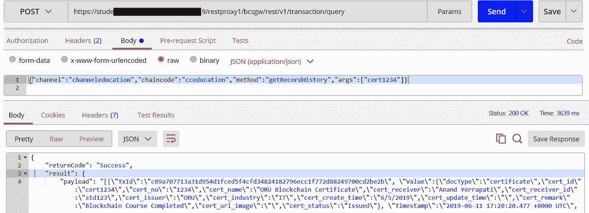

以下是`getRecordHistory`的回应:

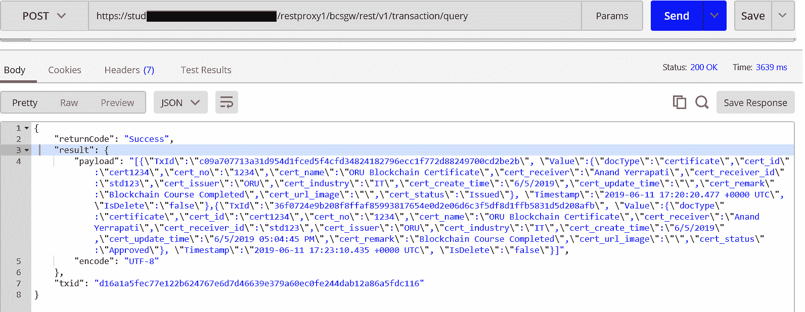

响应信息

# Chaincode logs

日志可用于链码中给出的系统生成的打印语句。在 OBP，这些日志可以下载或在线查看。此外，我们可以选择所选对等体的日志或所选链码版本的日志。您可以在部署了链代码的对等体上访问链代码执行的日志文件。以下是打开日志文件的步骤:

1.  转到**链码**选项卡，找到您想要查看日志的链码
2.  展开链码
3.  单击您想要的链码版本，将显示版本信息
4.  在安装在对等方选项卡上的**上，找到对等方**
5.  点击**日志**链接，将会打开**查看链码日志**对话框

6.  您也可以通过选择**节点**选项卡下指定对等体的**日志**选项卡来打开日志文件，如下图所示:


Chaincode logs

# 渠道分类帐

**分类账**是区块链网络所有交易块的最终存储。每个渠道都有自己的分类帐，该分类帐为渠道中的所有组织所共有。组织可以对分类帐拥有读取、写入或两者都拥有的权限来处理事务。只能通过链码查询或更新分类帐。OBP 在其控制台中有一个选项，可以查看某个频道的分类帐中的数据块。分类帐中的每个块都存储事务 ID、链代码名、状态、函数名、事务发起者、背书者和参数列表。您还可以看到总块数和总用户事务数。

按照此过程，您可以查看渠道分类帐中的数据:

1.  转到**频道**选项卡
2.  找到您想要的频道，然后单击频道名称
3.  在**总账**页签下，可以看到该渠道的所有大宗交易
4.  选择任何交易以查看其详细信息，如以下屏幕截图所示:

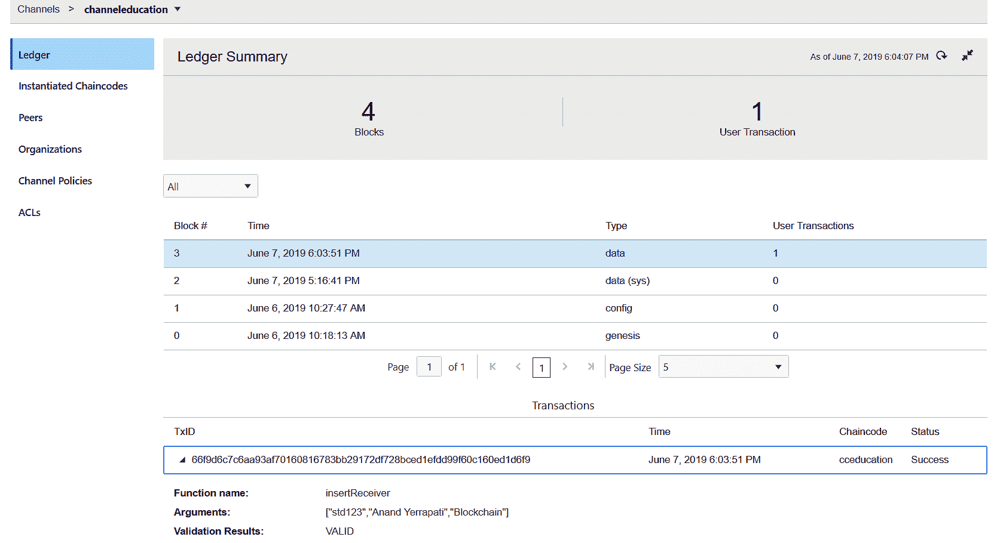

# 将客户端应用程序与区块链集成

到目前为止，我们已经探索了 OBP，并在 OBP 试验了链码的开发、部署和测试。本节是对[第 3 章](3.html)、*深入研究 Hyperledger 结构*的*集成架构*部分的重述。下面的集成架构图强调了 OBP 的三个集成选项:REST、SDK 和 events。

当使用 REST APIs 构建和集成带有 OBP 的客户端时—参考*从 REST 端点测试链码*部分 *—* it 有助于理解 REST 端点调用链码事务的使用。REST 端点可以与客户端应用程序集成，并可以通过传递各自的头来执行它们，例如 authorization、Content-Type 和输入 JSON，包括强制的通道名称和链代码名称字段以及必需的参数。响应也是一个 REST JSON，应该在客户端应用程序中处理。为了使用客户端 SDK 连接区块链，REST APIs 由 OBP 提供。REST APIs 允许灵活地调用、查询和查看事务的状态。但是，如果应用程序需要更细粒度的操作，那么 HLF SDK 是一种替代方法:

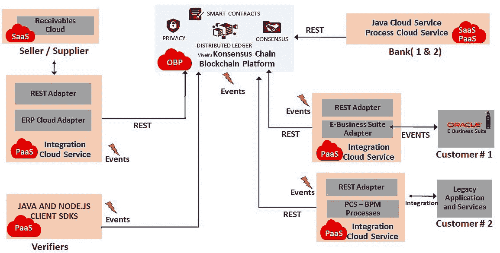

集成架构

请参考[第 3 章](3.html)、*深入研究 Hyperledger Fabric、*的*集成架构*部分，了解基于示例的应用程序与区块链的集成策略。

# 运行端到端流程

本节是对本章所学内容的快速回顾:

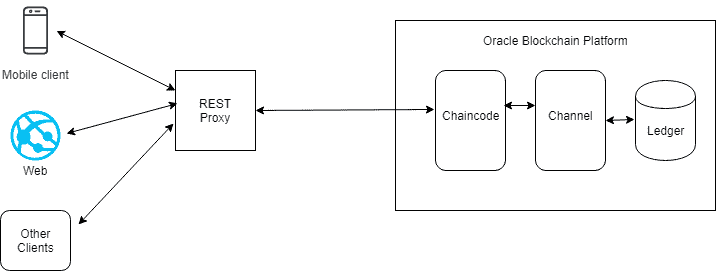

端到端流

以下是在探索大学用例以及与 OBP 合作在 OBP 上试验开发流程时，到目前为止所执行的步骤列表:

*   确定谁是区块链网络的创始人(在我们的例子中，是 OEU)
*   找到网络的参与组织(在我们的例子中，是 CVS 和 ORS)
*   在 OBP 创建了一个创建者和两个参与者实例
*   导出创建者的订购证书
*   将订购者证书导入到两个参与组织的网络选项卡中
*   导出了每个参与组织的网络证书
*   将两个组织的证书添加到方正网络
*   在创始人中为所有三个组织创建了一个通道`channeleducation`:创始人和两个参与者
*   创始人和参与者都加入了渠道
*   导出每个参与者的对等点，并将它们导入到创建者(这可能需要您查看网络所有对等点的合并拓扑视图；但是，对于参与认可的组织，这一步是必需的)
*   在 founder 中安装并实例化 chaincode (chaincode name: `cceducation`)
*   在其他参与者中安装了链码
*   在所有组织中启用/配置链接代码的 REST 代理
*   使用各自组织的 REST 端点连接到客户端应用程序

# 摘要

本章讲述了链码开发的细节，如语言部分、开发工具和开发环境设置。它详细描述了 chaincode 的整个生命周期，从开发到更新，包括安装、启动、测试和版本控制。它展示了基于 Go 和 Node.js 构建的代码库的完整 chaincode。它说明了认可政策和私有数据收集及其与 chaincode 的协同作用。它涵盖了通过 shim 和 REST 端点进行链代码测试，以及使用 SDK、REST 和 events 将客户端应用程序与业务网络集成。最后，通过链码日志和渠道日志对业务进行监控的实验，本文总结了对链码、交易和渠道的见解。

这个知识分类帐是基于这样一种信念而创建的，即我们将共同为区块链技术的发展做出积极贡献，并不断激励他人分享他们的经验，并进一步影响他人这样做。因此，火炬与你同在，通过分享继续施加影响，因为分享是关爱，我们一起为创造一个更智能的世界做出贡献。